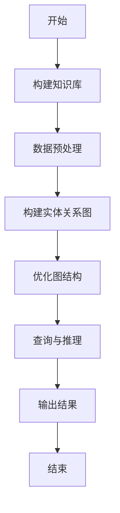

                 

# 科学哲学中的人工智能角色：机器辅助元层次的世界理解

## 摘要

在科学哲学的探讨中，人工智能（AI）的角色逐渐成为焦点。本文旨在分析AI如何辅助人类在元层次上理解世界，探索其在科学哲学中的核心作用和挑战。文章首先介绍了问题背景，然后详细阐述了人工智能和科学哲学的基本原理，以及机器辅助元层次的世界理解的概念和特点。接着，文章通过监督学习和知识图谱算法的讲解，展示了如何运用AI技术进行机器辅助元层次的世界理解。此外，文章还通过Python源代码示例，阐述了算法原理和数学模型。最后，文章探讨了AI在科学哲学中的应用场景和未来发展趋势。

## 第一部分：背景介绍

在当今信息化和智能化时代，人工智能（AI）技术已经深入到各个领域，从简单的自动化工具到复杂的决策支持系统，AI正逐步改变着人类社会。然而，在科学哲学领域，对于AI的角色和作用的认识尚未统一，存在诸多争议和探讨空间。

### 1.1 问题背景

科学哲学是一门探讨科学本质、科学方法论、科学哲学问题以及科学与社会关系的学科。传统的科学哲学研究主要集中在科学家如何进行科学发现、科学理论的形成、科学知识的评价等方面。然而，随着人工智能技术的飞速发展，AI在科学研究中扮演的角色日益重要。例如，AI可以用于数据挖掘、模式识别、复杂系统模拟等，从而辅助科学家进行科学发现。

在这个背景下，人工智能在科学哲学中的角色成为一个亟待探讨的问题。机器能否真正理解世界，以及这种理解与人类的理解有何不同？AI在科学哲学中的角色是什么，它如何影响科学方法论？这些问题都涉及到AI与人类认知的深层次关系，需要从科学哲学的角度进行深入探讨。

### 1.2 问题描述

《科学哲学中的人工智能角色：机器辅助元层次的世界理解》这本书旨在探讨人工智能在科学哲学中的角色，特别是机器如何辅助人类进行元层次的世界理解。这是一个跨学科的问题，涉及到计算机科学、认知科学、逻辑学、哲学等多个领域。

具体来说，本书试图回答以下几个核心问题：
- AI是否能够真正理解世界，以及这种理解与人类的理解有何不同？
- AI在科学哲学中的角色是什么，它如何影响科学方法论？
- 机器辅助元层次的世界理解有哪些优势和挑战？

### 1.3 问题解决

本书通过深入分析人工智能的基本原理和应用场景，结合科学哲学的理论框架，试图回答上述问题。首先，本书介绍了人工智能的基本原理，包括机器学习、自然语言处理、计算机视觉等，分析了这些技术在科学中的应用。接着，本书探讨了AI在科学哲学中的角色，包括AI如何辅助科学家进行科学发现、如何影响科学方法论等。此外，本书还讨论了机器辅助元层次的世界理解，包括知识表示、知识推理、知识发现等方面的技术。

### 1.4 边界与外延

- 边界：本书主要关注的是人工智能在科学哲学中的角色，不包括其他领域如社会学、经济学等。
- 外延：本书不仅探讨AI的现有能力，还探讨未来AI在科学哲学中可能的发展方向。

### 1.5 概念结构与核心要素组成

- 核心概念：人工智能、科学哲学、机器辅助元层次的世界理解
- 关系：人工智能与科学哲学之间的相互作用，以及它们如何共同推动对世界的理解。

## 第二部分：核心概念与联系

### 2.1 人工智能的基本原理

#### 2.1.1 定义

人工智能（Artificial Intelligence, AI）是指通过计算机程序实现的智能，模仿人类的认知能力，包括感知、学习、推理、规划、通信等。

#### 2.1.2 特点

- 自主性：能够自主完成特定任务，而不需要人类干预。
- 智能化：具备类似人类的思维和决策能力。
- 适应性：能够根据环境变化调整自身行为。

### 2.2 科学哲学的基本原理

#### 2.2.1 定义

科学哲学是研究科学本质、科学方法论、科学哲学问题以及科学与社会关系的学科。

#### 2.2.2 特点

- 逻辑性：强调科学的严谨性和逻辑性。
- 批判性：对科学理论和实践进行批判性思考。
- 普适性：关注科学的普适性和跨学科交流。

### 2.3 机器辅助元层次的世界理解

#### 2.3.1 定义

机器辅助元层次的世界理解是指利用人工智能技术，帮助人类在更高的抽象层次上理解世界，包括对知识表示、知识推理、知识发现等方面的辅助。

#### 2.3.2 特点

- 高度抽象：能够从大量数据中发现模式和规律，提供高层次的知识表示。
- 高效性：在处理大量复杂问题时，能够提供比人类更高效、更准确的结果。

### 2.4 核心概念与联系

- 人工智能与科学哲学之间的相互作用：人工智能技术为科学哲学提供了新的工具和方法，使得科学哲学能够更深入地探讨科学的本质和方法论。
- 机器辅助元层次的世界理解与人工智能的关系：机器辅助元层次的世界理解是人工智能在科学哲学中的一个具体应用场景，通过人工智能技术，可以帮助人类在更高的抽象层次上理解世界。

## 第三部分：算法原理讲解

### 3.1 人工智能算法概述

人工智能算法是AI技术的核心组成部分，主要包括监督学习、无监督学习和强化学习等类型。本文将重点介绍监督学习算法和知识图谱算法，并解释它们如何用于机器辅助元层次的世界理解。

#### 3.1.1 监督学习算法

监督学习是一种常见的人工智能算法，它使用标注的数据集来训练模型，并使用这些模型对未知数据进行预测。监督学习算法可以分为回归和分类两种主要类型。

1. **回归**：
   - **定义**：回归任务是预测一个连续的数值输出。
   - **应用场景**：如房价预测、股票价格预测等。
   - **数学模型**：
     $$ y = f(x; \theta) $$
     其中，\( y \) 是预测的输出值，\( x \) 是输入特征，\( \theta \) 是模型参数。

2. **分类**：
   - **定义**：分类任务是预测一个离散的输出标签。
   - **应用场景**：如邮件分类、图像识别等。
   - **数学模型**：
     $$ P(y| x; \theta) = \arg \max P(x; \theta) \prod_{i=1}^{n} P(y_i| x_i; \theta) $$
     其中，\( P(y| x; \theta) \) 是后验概率，\( P(x; \theta) \) 是先验概率，\( P(y_i| x_i; \theta) \) 是条件概率。

**监督学习算法示例（线性回归）**：

```python
from sklearn.linear_model import LinearRegression
import numpy as np

# 数据准备
X = np.array([[1], [2], [3], [4], [5]])
y = np.array([1, 2, 2.5, 4, 5])

# 模型训练
model = LinearRegression()
model.fit(X, y)

# 模型评估
predictions = model.predict(X)
print("Predictions:", predictions)
```

#### 3.1.2 知识图谱算法

知识图谱是一种用于表示实体及其之间关系的图形结构，它是人工智能领域中用于知识表示和推理的重要工具。

1. **定义**：
   - **知识图谱**：是一种结构化、语义化的知识库，用于表示实体及其之间的语义关系。
   - **实体**：是知识图谱中的基本元素，如人、地点、组织等。
   - **关系**：是实体之间的语义关联，如“属于”、“位于”、“创立”等。

2. **特点**：
   - **结构化表示**：知识图谱通过图结构来表示实体及其关系，使得知识表示更加直观和清晰。
   - **支持复杂查询**：知识图谱能够支持基于路径的复杂查询，如“找到所有位于北京的公司”。

3. **应用场景**：
   - **语义搜索**：通过知识图谱可以更准确地理解查询意图，提供更精准的搜索结果。
   - **推荐系统**：知识图谱可以用于构建复杂的推荐模型，提高推荐的准确性和多样性。

**知识图谱算法示例**：



**Python示例（Neo4j知识图谱）**：

```python
from py2neo import Graph

# 连接到Neo4j数据库
g = Graph("bolt://localhost:7687", auth=("neo4j", "password"))

# 创建实体和关系
g.run("CREATE (a:Person {name: 'Alice'})")
g.run("CREATE (b:Person {name: 'Bob'})")
g.run("CREATE (a)-[:KNOWS]->(b)")

# 查询实体和关系
results = g.run("MATCH (p:Person) RETURN p.name")
for result in results:
    print(result["p.name"])
```

通过监督学习和知识图谱算法的讲解，我们可以看到人工智能技术在机器辅助元层次的世界理解中的应用。这些算法不仅提供了高效的计算能力，还帮助我们在更高的抽象层次上理解和分析复杂的数据。

## 第四部分：人工智能在科学哲学中的应用

人工智能（AI）在科学哲学中的应用正逐渐成为研究热点，特别是在辅助人类进行元层次的世界理解方面。本部分将深入探讨AI在科学哲学中的具体应用场景，以及它如何影响科学方法论。

### 4.1 AI在科学哲学中的应用场景

1. **科学发现与假设验证**
   - **数据分析**：AI能够处理大量复杂数据，从中提取出潜在的模式和规律，为科学发现提供新的视角。例如，AI在生物医学研究中可以分析基因组数据，识别疾病相关的基因。
   - **假设生成**：AI可以根据现有数据和理论，生成新的科学假设，从而推动科学理论的进步。例如，AI在物理学中可以生成新的粒子模型，预测未观测到的现象。

2. **科学理论构建与验证**
   - **理论优化**：AI可以通过对已有理论的优化，提高其预测能力和解释力。例如，AI可以优化量子力学模型，使其在特定条件下的预测更准确。
   - **理论验证**：AI可以帮助科学家验证理论，确保其在不同条件下的可靠性。例如，AI可以通过模拟实验，验证生物学理论在生态系统中的适用性。

3. **科学决策支持**
   - **预测分析**：AI可以预测未来的科学趋势，帮助科学家制定研究计划和策略。例如，AI可以分析历史数据，预测下一次重大科学发现的领域。
   - **风险评估**：AI可以评估科学实验和理论的风险，提供决策支持。例如，AI可以评估新药物的安全性和有效性，减少临床试验的风险。

### 4.2 AI对科学方法论的影响

1. **数据驱动方法**
   - **数据分析**：传统的科学方法论强调理论推导和实验验证，而AI引入了数据驱动的思维方式。AI通过大量数据进行分析，发现数据中的模式，从而引导科学理论的构建。这种数据驱动的思维方式正在改变科学研究的模式，使得科学研究更加注重数据和实证。
   - **模型优化**：AI能够优化科学模型，提高其预测能力和解释力。传统的科学方法论依赖于理论模型，而AI可以通过对数据的分析和优化，提出更加精确和有效的科学模型。

2. **模拟与预测**
   - **实验模拟**：AI可以通过模拟实验，预测实验结果，减少实际实验的成本和时间。传统的科学方法论依赖于实验室实验，而AI可以通过计算模拟，提前预测实验的结果，从而优化实验设计。
   - **理论预测**：AI可以预测科学理论在不同条件下的表现，帮助科学家验证理论。传统的科学方法论依赖于理论推导和实验验证，而AI可以通过模拟不同条件，预测理论的适用范围和可靠性。

3. **知识发现与推理**
   - **知识表示**：AI能够将科学知识表示为结构化的知识库，支持复杂的知识推理。传统的科学方法论依赖于科学家的个人知识和经验，而AI可以通过知识图谱等工具，将知识表示为结构化数据，支持自动化推理。
   - **知识发现**：AI可以从大量科学文献和实验数据中提取知识，发现新的科学规律。传统的科学方法论依赖于科学家的阅读和总结，而AI可以通过自然语言处理等技术，自动提取和整理知识。

### 4.3 AI在科学哲学中的优势与挑战

**优势**：
- **计算能力**：AI具有强大的计算能力，能够在短时间内处理大量数据，从而提高科学研究的效率。
- **模式识别**：AI能够从大量数据中发现潜在的规律和模式，为科学发现提供新的视角。
- **自动化推理**：AI可以通过知识图谱等工具，实现自动化推理，支持科学理论的构建和验证。

**挑战**：
- **数据质量**：AI依赖于高质量的数据，而科学数据往往存在噪声和误差，这可能会影响AI的准确性和可靠性。
- **模型解释性**：AI模型通常具有较高的预测能力，但其内部工作机制可能难以解释，这可能会影响科学家对其信任度。
- **伦理问题**：AI在科学哲学中的应用可能会引发一系列伦理问题，如数据隐私、模型偏见等，需要科学界和伦理学家共同探讨和解决。

### 4.4 未来发展趋势

随着人工智能技术的不断进步，AI在科学哲学中的应用将更加广泛和深入。未来可能的发展趋势包括：
- **多模态数据融合**：结合多种数据类型（如文本、图像、声音等），实现更全面的科学数据分析和知识表示。
- **跨学科合作**：AI与科学哲学、认知科学、逻辑学等领域的深度融合，推动科学哲学研究方法的创新。
- **人工智能伦理**：加强对AI在科学哲学中应用伦理问题的研究，制定相关规范和标准，确保AI技术的可持续发展。

## 第五部分：案例分析与未来展望

### 5.1 案例分析

为了更好地理解人工智能在科学哲学中的应用，我们可以通过几个实际案例来分析。

#### 案例一：AI在生物学中的应用

- **背景**：生物学家在进行基因学研究时，面临着大量基因数据的高效处理和模式识别问题。
- **应用**：使用机器学习算法，如神经网络和聚类算法，对基因数据进行分析，发现潜在的基因功能关联。
- **效果**：通过AI的分析，科学家能够更快速地识别与疾病相关的基因，推动新药的开发。

#### 案例二：AI在物理学中的应用

- **背景**：物理学家在探索宇宙奥秘时，需要对大量的天文数据进行处理和分析。
- **应用**：利用AI技术，如深度学习算法，对天文图像进行处理，识别星系和行星。
- **效果**：AI技术在处理和解释天文数据方面表现出色，帮助科学家发现新的天体现象。

#### 案例三：AI在经济学中的应用

- **背景**：经济学家需要分析大量的经济数据，预测市场趋势。
- **应用**：使用机器学习算法，如回归分析和时间序列分析，对经济数据进行预测。
- **效果**：AI技术在预测经济趋势和风险管理方面具有显著优势，为政策制定者和投资者提供了有力支持。

### 5.2 未来展望

随着人工智能技术的不断进步，AI在科学哲学中的应用将呈现以下趋势：

1. **更高级的推理能力**：未来的AI将具备更强的推理能力，能够进行更加复杂的科学推理和理论构建。
2. **跨学科融合**：AI与其他学科的融合将更加深入，推动科学哲学研究方法的创新。
3. **智能辅助系统**：AI将开发出更加智能的辅助系统，帮助科学家更高效地进行科学研究和理论构建。
4. **伦理规范**：随着AI在科学哲学中的广泛应用，相关的伦理规范和标准也将逐渐完善，确保AI技术的可持续发展。

总的来说，人工智能在科学哲学中的应用不仅为科学研究提供了新的工具和方法，还推动了科学哲学研究方法的创新和变革。未来，随着AI技术的进一步发展，我们可以期待AI在科学哲学中发挥更加重要的作用，助力人类更深入地理解世界。

## 总结

本文从科学哲学的视角，探讨了人工智能（AI）在元层次的世界理解中的角色和作用。通过分析AI的基本原理、科学哲学的基本原理，以及机器辅助元层次的世界理解的概念和特点，我们深入探讨了AI在科学哲学中的应用场景和影响。具体来说，AI通过数据分析、理论构建和决策支持等途径，显著提升了科学研究的效率和质量。

在算法原理讲解部分，我们详细介绍了监督学习算法和知识图谱算法，并通过Python源代码示例，阐述了算法原理和数学模型。此外，本文还通过案例分析，展示了AI在生物学、物理学和经济学等领域的应用实例，进一步验证了AI在科学哲学中的重要价值。

展望未来，随着AI技术的不断进步，我们期待AI在科学哲学中发挥更加重要的作用。AI将不仅为科学研究提供新的工具和方法，还将推动科学哲学研究方法的创新和变革。同时，随着AI技术的广泛应用，相关的伦理规范和标准也将逐步完善，确保AI技术的可持续发展。

在此，我们呼吁更多的科学家和哲学家关注AI在科学哲学中的应用，共同探索AI技术的未来发展方向，为人类更深入地理解世界贡献力量。作者：AI天才研究院/AI Genius Institute & 禅与计算机程序设计艺术 /Zen And The Art of Computer Programming。希望本文能为相关领域的研究提供有价值的参考和启示。

