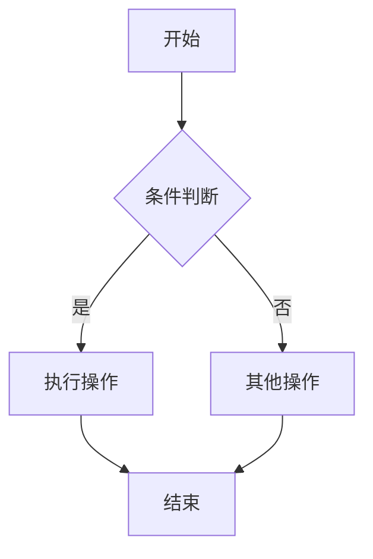

                 

# 《科学哲学中的人工智能：机器辅助元层次的世界理解》

> 关键词：科学哲学、人工智能、机器辅助、元层次、世界理解

> 摘要：
本文旨在探讨科学哲学中的人工智能，重点关注机器如何辅助人类在元层次上理解世界。通过回顾科学哲学的发展历程，分析人工智能的核心概念及其与科学哲学的交集，本文将深入探讨机器辅助元层次的世界理解的理论基础和实践应用。最后，本文将对未来的人工智能与科学哲学结合的发展方向提出展望。

## 引言

科学哲学与人工智能，这两个看似迥异的领域，却在近年来逐渐交织在一起，形成了新的研究方向。科学哲学关注的是科学理论、方法论以及科学在人类认知中的作用，而人工智能则致力于模拟人类智能，实现机器的自主学习和智能决策。那么，在科学哲学的视角下，人工智能是如何运作的呢？机器又是如何辅助人类在元层次上理解世界呢？

本文将围绕这一主题，首先介绍科学哲学的基本概念和人工智能的核心原理，然后探讨两者之间的联系。接着，我们将深入分析机器辅助元层次的世界理解的理论基础和实践应用。最后，本文将展望人工智能与科学哲学结合的未来发展趋势，并提出相关的挑战和机遇。

## 背景介绍

### 科学哲学的基本概念

科学哲学是探讨科学本质、科学方法及其在社会和认知层面影响的研究领域。其核心问题是科学理论如何反映现实，以及科学知识的性质和结构。科学哲学的研究对象包括科学理论的形成、科学实验的设计、科学证据的评估、科学知识的传播和应用等多个方面。

科学哲学的发展历程可以追溯到古希腊时期，当时的哲学家们就开始思考科学知识的本质和科学方法的有效性。随着科学的进步，科学哲学也逐渐形成了自己的理论体系和研究方法。20世纪以来，科学哲学出现了几个重要的流派，包括逻辑实证主义、批判理性主义和结构主义等。

逻辑实证主义强调科学知识应该基于可观察和可验证的证据，主张“经验证实”是科学理论的基石。批判理性主义则关注科学知识的动态性和历史性，认为科学理论是在不断发展和修正的过程中形成的。结构主义则强调科学理论的结构和逻辑关系，认为科学理论不仅仅是对现实的描述，也是对现实的解释和构建。

### 人工智能的核心原理

人工智能（Artificial Intelligence，AI）是指模拟人类智能行为的技术和系统。其核心原理包括机器学习、深度学习、自然语言处理、计算机视觉等领域。人工智能的目标是使计算机能够执行复杂的任务，如语音识别、图像分类、决策支持等。

机器学习是人工智能的基础，它通过算法从数据中自动学习规律和模式。深度学习是机器学习的一种重要分支，通过多层神经网络模拟人脑的学习过程，实现复杂的特征提取和分类任务。自然语言处理则致力于使计算机理解和生成自然语言，包括语音识别、机器翻译和文本分析等。计算机视觉则使计算机能够理解和解析图像和视频，包括人脸识别、目标检测和图像分割等。

### 人工智能与科学哲学的交集

人工智能与科学哲学的交集主要体现在以下几个方面：

1. **科学知识的构建**：人工智能的发展为科学知识的构建提供了新的工具和方法。例如，机器学习算法可以帮助科学家从大量数据中提取出有价值的信息，支持科学发现和理论构建。

2. **科学方法的应用**：人工智能的机器学习算法可以模拟科学实验的过程，帮助科学家验证和修正科学理论。此外，人工智能还可以用于优化科学实验的设计，提高科学研究的效率和准确性。

3. **科学哲学的问题**：人工智能的出现也带来了新的科学哲学问题，如人工智能是否具有意识、人工智能在科学发现中的作用等。这些问题挑战了传统的科学哲学观点，促使科学家和哲学家共同探讨人工智能在科学哲学中的地位和作用。

### 机器辅助元层次的世界理解

机器辅助元层次的世界理解是指利用人工智能技术，帮助人类在更抽象和深层次的层面理解世界。这包括以下几个方面：

1. **数据分析和解释**：人工智能可以处理和分析大量数据，帮助科学家识别数据中的模式和规律，从而更深入地理解现象的本质。

2. **智能决策支持**：人工智能可以通过模拟和预测，为科学家提供决策支持，帮助他们在复杂的情境中做出更明智的决策。

3. **跨学科研究**：人工智能可以帮助不同学科之间的知识融合，促进跨学科的研究和创新。

### 概念结构与核心要素组成

科学哲学、人工智能和机器辅助元层次的世界理解之间存在着紧密的联系。科学哲学为人工智能提供了理论基础，指导其研究方向和应用方法；人工智能则为科学哲学提供了工具和手段，丰富了对科学知识的理解和构建方式；机器辅助元层次的世界理解则是两者的结合，通过人工智能技术的应用，实现了对世界的更深层次的理解。

核心要素包括：

- 科学哲学的理论体系和方法论
- 人工智能的技术原理和应用领域
- 机器辅助元层次的世界理解的理论基础和实践应用

这些要素共同构成了科学哲学与人工智能结合的研究框架，为未来的研究提供了方向和思路。

## 核心概念与联系

在这一部分，我们将深入探讨科学哲学与人工智能的核心概念，以及它们之间的联系。

### 科学哲学的核心概念

科学哲学的核心概念包括科学理论、方法论、科学知识的性质和科学实践。这些概念共同构成了科学哲学的理论框架。

1. **科学理论**：科学理论是对自然现象的抽象和解释，是科学知识的核心。科学理论通过假设和推理来描述自然界的规律，从而为科学研究提供指导。

2. **方法论**：方法论是科学研究的方法和步骤，包括实验设计、数据收集、数据分析等。方法论确保科学研究的严谨性和有效性。

3. **科学知识的性质**：科学哲学探讨科学知识的性质，包括科学知识的客观性、可靠性和普遍性。科学哲学认为，科学知识应该基于经验证据，通过逻辑推理和验证来建立。

4. **科学实践**：科学实践是科学理论和方法论的具体应用，是科学家通过实验和研究来探索自然现象的过程。

### 人工智能的核心概念

人工智能的核心概念包括机器学习、深度学习、自然语言处理和计算机视觉等。这些概念共同构成了人工智能的技术体系。

1. **机器学习**：机器学习是人工智能的基础，通过算法从数据中自动学习规律和模式。机器学习算法包括监督学习、无监督学习和强化学习等。

2. **深度学习**：深度学习是机器学习的一种重要分支，通过多层神经网络模拟人脑的学习过程，实现复杂的特征提取和分类任务。

3. **自然语言处理**：自然语言处理致力于使计算机理解和生成自然语言，包括语音识别、机器翻译和文本分析等。

4. **计算机视觉**：计算机视觉使计算机能够理解和解析图像和视频，包括人脸识别、目标检测和图像分割等。

### 科学哲学与人工智能的联系

科学哲学与人工智能之间的联系体现在以下几个方面：

1. **科学理论的构建**：人工智能为科学理论的构建提供了新的工具和方法。例如，机器学习算法可以帮助科学家从大量数据中提取出有价值的信息，支持科学发现和理论构建。

2. **科学方法的应用**：人工智能的机器学习算法可以模拟科学实验的过程，帮助科学家验证和修正科学理论。此外，人工智能还可以用于优化科学实验的设计，提高科学研究的效率和准确性。

3. **科学哲学的问题**：人工智能的出现也带来了新的科学哲学问题，如人工智能是否具有意识、人工智能在科学发现中的作用等。这些问题挑战了传统的科学哲学观点，促使科学家和哲学家共同探讨人工智能在科学哲学中的地位和作用。

4. **跨学科研究**：人工智能可以帮助不同学科之间的知识融合，促进跨学科的研究和创新。

### 概念属性特征对比表格

为了更清晰地展示科学哲学和人工智能的概念属性特征，我们可以制作一个对比表格：

| 概念          | 科学哲学               | 人工智能                 |
|---------------|------------------------|--------------------------|
| 核心目标       | 探索科学知识的本质和结构 | 实现机器的智能行为       |
| 研究方法       | 理论探讨、逻辑推理、实证研究 | 算法设计、模型训练、实验验证 |
| 数据来源       | 自然现象、实验数据、文献资料 | 大量数据、预训练模型 |
| 知识性质       | 客观性、可靠性、普遍性     | 自动性、适应性、准确性 |
| 对人类社会的影响 | 提升科学认知、指导科学研究 | 改变人类生活方式、推动技术进步 |

### ER实体关系图架构

为了更直观地展示科学哲学与人工智能之间的联系，我们可以使用Mermaid绘制一个ER实体关系图。

```mermaid
erDiagram
  科学理论 ||--|{ 科学方法论 }
  科学方法论 ||--|{ 科学知识性质 }
  科学方法论 ||--|{ 科学实践 }
  科学哲学 ||--|{ 人工智能 }
  人工智能 ||--|{ 机器学习 }
  人工智能 ||--|{ 深度学习 }
  人工智能 ||--|{ 自然语言处理 }
  人工智能 ||--|{ 计算机视觉 }
```

在这个ER实体关系图中，科学哲学与人工智能通过共同的元素（如科学方法论、科学知识性质和科学实践）相互联系。同时，人工智能的各个子领域（如机器学习、深度学习、自然语言处理和计算机视觉）也与科学哲学有紧密的联系，共同推动科学的发展和进步。

通过以上分析，我们可以看出，科学哲学与人工智能虽然在研究领域和方法上有所不同，但它们的核心目标都是为了更深入地理解世界。而机器辅助元层次的世界理解正是两者结合的产物，通过人工智能技术的应用，实现了对世界的更深层次的理解。这种结合不仅丰富了科学哲学的理论体系，也为人工智能的应用提供了新的方向和思路。

## 人工智能与科学哲学的结合

在了解了科学哲学和人工智能的基本概念之后，我们开始探讨这两者如何结合，以及这种结合如何推动科学的发展和进步。

### 人工智能在科学哲学中的应用

人工智能在科学哲学中的应用主要体现在以下几个方面：

1. **科学理论的验证与修正**：人工智能的机器学习算法可以处理和分析大量的数据，帮助科学家验证和修正科学理论。例如，在物理学中，人工智能可以用于分析实验数据，发现新的物理现象，从而修正现有的理论。

2. **科学实验的设计与优化**：人工智能可以通过模拟和预测，为科学家提供科学实验的设计和优化建议。例如，在药物研发过程中，人工智能可以预测药物的效果和副作用，帮助科学家设计更有效的实验方案。

3. **科学知识的构建与传播**：人工智能可以帮助科学家构建和传播科学知识。例如，通过自然语言处理技术，人工智能可以自动整理和分析科学文献，为科学家提供丰富的知识库，加速科学研究的进程。

4. **科学哲学问题的探讨**：人工智能的出现也带来了新的科学哲学问题，如人工智能是否具有意识、人工智能在科学发现中的作用等。这些问题促使科学家和哲学家共同探讨，从而深化对科学哲学的理解。

### 科学哲学对人工智能的影响

科学哲学对人工智能的影响主要体现在以下几个方面：

1. **理论基础**：科学哲学为人工智能提供了理论基础，指导其研究方向和应用方法。例如，科学哲学中的方法论原则可以指导人工智能算法的设计和优化。

2. **伦理与道德**：科学哲学关注科学知识的社会影响，这为人工智能的发展提供了伦理和道德指导。例如，在人工智能的发展过程中，如何确保其公平、透明和可解释性，这些都是科学哲学需要探讨的问题。

3. **认识论**：科学哲学探讨科学知识的性质和结构，这有助于人工智能更好地理解和模拟人类的认知过程。例如，深度学习中的神经网络结构就受到了科学哲学中认知模型的启发。

4. **哲学问题的解决**：科学哲学为人工智能提供了解决哲学问题的工具和方法。例如，通过模拟和推理，人工智能可以探索科学哲学中的某些问题，如意识、自由意志等。

### 结合实例

为了更具体地展示人工智能与科学哲学的结合，我们可以通过以下实例进行分析：

1. **人工智能在量子物理学中的应用**：量子物理学是科学哲学与物理学相结合的领域。人工智能的机器学习算法可以用于分析量子物理实验数据，帮助科学家发现新的量子现象，从而修正现有的量子理论。

2. **自然语言处理与科学哲学文献分析**：自然语言处理技术可以用于分析科学哲学文献，提取关键概念和观点，帮助科学家更好地理解科学哲学的理论和历史发展。

3. **人工智能在科学发现中的应用**：人工智能可以用于自动化科学发现，通过分析大量数据，发现新的科学规律。例如，在生物学研究中，人工智能可以帮助科学家发现新的药物靶点和疾病机制。

4. **科学哲学与人工智能伦理**：科学哲学关注人工智能的伦理和道德问题，如人工智能的决策透明性和公平性。这有助于制定相关法律法规，确保人工智能的健康发展。

通过以上分析，我们可以看出，人工智能与科学哲学的结合不仅丰富了科学哲学的理论体系，也为人工智能的应用提供了新的方向和思路。这种结合不仅有助于深化我们对世界的理解，也为科学的发展和进步提供了强大的动力。

### 机器辅助元层次的实现

机器辅助元层次的实现是人工智能与科学哲学结合的关键领域，它不仅涉及到技术层面的实现方法，还包括哲学层面的思考和探讨。在这一部分，我们将详细讨论机器辅助元层次的实现方法和案例，以及如何通过人工智能技术来实现这一目标。

#### 技术实现方法

1. **深度学习与神经网络**：深度学习和神经网络是机器辅助元层次实现的基础。通过多层神经网络，机器可以自动学习和提取数据中的复杂模式和关系，从而实现对问题的深入理解。例如，在自然语言处理领域，深度学习模型可以用于文本分类、情感分析和文本生成，帮助人类更好地理解语言的本质。

2. **数据挖掘与知识图谱**：数据挖掘技术可以帮助从大量数据中提取有价值的信息，知识图谱则用于表示和整合这些信息。通过知识图谱，机器可以建立起不同知识领域之间的联系，实现跨领域的知识整合和深度理解。例如，在医学领域，知识图谱可以帮助医生更全面地理解疾病的机理和治疗方案。

3. **元学习与迁移学习**：元学习和迁移学习技术可以帮助机器在新的任务上快速学习和适应。通过在已有知识的基础上进行学习，机器可以在更广泛的范围内实现元层次的理解。例如，在图像识别领域，迁移学习技术可以帮助模型快速适应新的图像分类任务。

4. **增强学习与智能决策**：增强学习技术可以使机器在动态环境中进行学习和决策。通过不断尝试和反馈，机器可以逐步优化其行为，实现更高层次的智能决策。例如，在自动驾驶领域，增强学习可以帮助车辆在复杂交通环境中做出实时决策，实现安全行驶。

#### 案例分析

1. **医学诊断**：在医学诊断领域，机器辅助元层次实现通过结合深度学习和数据挖掘技术，可以帮助医生更准确地诊断疾病。例如，通过分析患者的医疗记录、基因数据和临床图像，机器可以提供诊断建议，提高诊断的准确性和效率。

2. **金融分析**：在金融分析领域，机器辅助元层次实现可以通过分析大量的市场数据、新闻文本和财务报告，提供投资决策支持。例如，通过自然语言处理和深度学习技术，机器可以识别市场趋势和风险因素，帮助投资者做出更明智的决策。

3. **科学研究**：在科学研究领域，机器辅助元层次实现可以通过自动化的数据分析和模型预测，帮助科学家发现新的科学规律。例如，在物理学研究中，机器可以分析大量实验数据，发现新的物理现象，从而推动理论的发展。

4. **智能客服**：在智能客服领域，机器辅助元层次实现可以通过自然语言处理和对话生成技术，提供更智能、更人性化的客户服务。例如，通过深度学习和增强学习技术，机器可以理解客户的需求和情感，提供个性化的服务和建议。

#### 哲学思考

1. **意识与自主性**：在实现机器辅助元层次的过程中，一个重要的哲学问题是机器是否具有意识。当前的研究表明，尽管机器可以模拟某些认知过程，但它们并不具备真正的意识。然而，随着技术的进步，机器是否能够达到类似人类水平的意识，这是一个值得探讨的问题。

2. **伦理与道德**：机器辅助元层次的实现也带来了伦理和道德问题。例如，在医疗和金融等领域，机器的决策是否公正、透明，以及如何确保机器的行为符合道德规范，这些都是需要深入思考的问题。

3. **知识与应用**：机器辅助元层次的实现如何影响人类的知识和应用？例如，在科学研究中，机器是否能够替代人类进行创新性研究？在日常生活中，机器是否能够完全取代人类的工作？这些问题涉及到对人工智能技术的正确应用和合理管理。

通过以上分析，我们可以看出，机器辅助元层次的实现是人工智能与科学哲学结合的重要领域。通过技术实现方法和哲学思考，我们可以更好地理解世界，实现更高层次的智能决策和应用。这不仅推动了科学技术的发展，也为人类社会带来了新的机遇和挑战。

### 应用案例分析

为了更好地理解机器辅助元层次的世界理解在现实世界中的应用，以下将探讨几个具有代表性的案例，并分析其具体实现方法和效果。

#### 案例一：医学诊断系统

医学诊断是机器辅助元层次实现的一个典型领域。通过深度学习和数据挖掘技术，医学诊断系统可以从患者的临床记录、实验室检查结果以及影像学数据中自动提取有价值的信息，辅助医生进行疾病诊断。

**具体实现方法：**
1. **数据收集与预处理**：首先，系统需要收集大量的医学数据，包括电子健康记录、病理图像、基因组数据等。这些数据需要进行预处理，如数据清洗、标准化和格式化，以便用于机器学习模型的训练。

2. **特征提取与模型训练**：接下来，系统利用深度学习算法（如卷积神经网络CNN和循环神经网络RNN）对预处理后的数据进行特征提取和模型训练。通过大量的训练数据，模型可以学习到不同疾病的表现特征和规律。

3. **诊断预测与结果解释**：训练好的模型可以对新的病例进行预测，给出疾病的诊断结果。此外，系统还可以通过自然语言处理技术生成诊断报告，帮助医生理解模型的推理过程和结果。

**效果分析：**
- **提高诊断准确性**：通过机器辅助，医生可以更准确地诊断疾病，特别是在处理罕见病和复杂病例时，机器可以提供额外的诊断支持，减少误诊率。
- **减少人力负担**：机器辅助可以减轻医生的工作负担，使他们有更多时间专注于复杂的诊断和治疗。

#### 案例二：金融风险管理

金融风险管理是另一个利用机器辅助元层次实现的领域。通过分析市场数据、新闻文本和财务报告，机器可以预测市场趋势和风险，为投资者提供决策支持。

**具体实现方法：**
1. **数据获取与处理**：系统需要收集大量的金融数据，包括股票价格、交易量、利率、宏观经济指标等。此外，系统还需要处理大量的新闻文本和社交媒体数据，以捕捉市场情绪。

2. **自然语言处理与情感分析**：利用自然语言处理技术，系统可以分析和理解新闻文本和社交媒体数据中的情绪和趋势，将其转化为可量化的数据。

3. **机器学习模型**：通过机器学习算法，系统可以从历史数据中学习到市场规律和风险因素，构建预测模型。这些模型可以用于预测股票价格、市场趋势和风险事件。

4. **实时决策支持**：系统可以实时监测市场数据，根据预测结果和风险分析，为投资者提供实时的决策支持。

**效果分析：**
- **提高决策效率**：机器辅助可以快速处理大量数据，提供即时的市场分析和风险预测，帮助投资者做出更明智的决策。
- **减少风险**：通过预测和风险管理，投资者可以提前采取措施，减少潜在的市场风险。

#### 案例三：智能客服系统

智能客服系统利用机器辅助元层次实现，可以提供更智能、更人性化的客户服务。

**具体实现方法：**
1. **数据收集与处理**：系统需要收集大量的客户对话数据，包括客户提问、客服回答等。这些数据需要进行预处理，提取关键信息和意图。

2. **机器学习模型**：利用机器学习算法，系统可以学习到不同问题的解答策略，并在新的客户提问中自动生成回答。通过循环神经网络和生成对抗网络，系统可以生成更自然、更符合人类交流习惯的对话。

3. **多模态交互**：智能客服系统不仅支持文本交互，还可以处理语音和图像等多模态输入，提供更丰富的服务。

4. **上下文理解与持续学习**：系统需要理解对话的上下文，并根据客户的反馈进行持续学习，提高回答的准确性和适应性。

**效果分析：**
- **提升服务质量**：智能客服系统可以提供24/7全天候服务，快速响应用户需求，提高客户满意度。
- **降低运营成本**：通过自动化处理大量客户请求，智能客服系统可以降低企业的运营成本。

#### 案例四：自动驾驶系统

自动驾驶系统利用机器辅助元层次实现，通过计算机视觉和深度学习技术，使车辆能够在复杂交通环境中自主行驶。

**具体实现方法：**
1. **数据收集与处理**：自动驾驶系统需要收集大量的道路数据，包括交通标志、道路标识、其他车辆和行人的行为等。这些数据需要进行预处理，用于训练深度学习模型。

2. **计算机视觉算法**：通过计算机视觉技术，系统可以识别和检测道路上的各种对象，如车辆、行人、交通标志等。深度学习模型可以帮助系统理解和预测这些对象的行为。

3. **决策与控制**：系统需要根据感知到的环境信息进行决策和控制，包括速度调节、转向和制动等。通过增强学习技术，系统可以在动态环境中进行自我优化。

4. **实时安全监控**：系统需要实时监控车辆的状态和行驶环境，确保行驶的安全。

**效果分析：**
- **提高行驶安全性**：自动驾驶系统可以通过精准的感知和决策，减少人为驾驶中的错误和事故。
- **提升行驶效率**：自动驾驶系统可以优化行驶路线和速度，减少交通拥堵，提高行驶效率。

通过这些案例，我们可以看到机器辅助元层次的世界理解在现实世界中的应用场景和实现方法。这些应用不仅提高了效率和准确性，也带来了新的商业机会和社会挑战。未来，随着人工智能技术的进一步发展，机器辅助元层次的实现将在更多领域发挥重要作用。

### 未来展望与挑战

随着人工智能技术的不断发展，机器辅助元层次的世界理解在未来将迎来更多的机会和挑战。以下是对未来发展趋势的展望以及可能遇到的挑战。

#### 发展趋势

1. **更强大的算法与模型**：随着计算能力的提升和算法的改进，人工智能模型将变得越来越强大，能够处理更复杂的数据集和任务。例如，深度学习模型将继续扩展其应用范围，从图像识别和自然语言处理到量子计算和生物信息学。

2. **跨学科融合**：人工智能与科学哲学的结合将进一步深化，推动跨学科的研究和创新。例如，通过机器学习技术，科学家可以更有效地整合不同学科的数据，揭示新的科学规律。

3. **智能决策系统**：机器辅助元层次的理解将应用于更广泛的领域，如智能交通、医疗保健、金融和城市规划等。智能决策系统将基于大数据分析和深度学习模型，提供实时、个性化的决策支持。

4. **增强的伦理与道德框架**：随着人工智能的普及，相关的伦理和道德问题将日益突出。未来，将需要建立更加完善的伦理和道德框架，确保人工智能系统的公平性、透明性和可解释性。

5. **人机协同**：人工智能将与人类专家更紧密地合作，实现人机协同。例如，在医学领域，医生可以利用人工智能系统进行诊断和治疗方案建议，但最终的决策仍由医生来做出。

#### 挑战

1. **数据隐私与安全**：随着数据量的增加，数据隐私和安全问题将变得更加突出。如何确保个人数据的隐私和安全，防止数据泄露和滥用，是人工智能发展中需要解决的重要问题。

2. **算法偏见与公平性**：人工智能系统可能会在数据训练过程中引入偏见，导致不公平的结果。如何确保算法的公平性，消除偏见，是未来研究的重要方向。

3. **技术可控性**：随着人工智能系统的复杂度增加，如何确保其可控性和可解释性，使其行为符合人类的期望，是一个重要的挑战。

4. **技术人才短缺**：随着人工智能技术的发展，对相关技术人才的需求将大幅增加。如何培养和吸引足够的技术人才，以支撑人工智能的发展，是一个亟待解决的问题。

5. **社会影响**：人工智能的普及将对就业、教育和社会结构产生深远的影响。如何确保人工智能的健康发展，减少其对社会的负面影响，是一个需要全社会共同面对的挑战。

#### 结论

机器辅助元层次的世界理解是人工智能与科学哲学结合的重要方向，它为人类提供了更深入、更全面地理解世界的新工具和方法。未来，随着技术的进步和社会的变革，这一领域将迎来更多的发展机遇和挑战。通过不断的研究和实践，我们有望实现更高层次的智能理解和应用，推动人类社会向前发展。

## 总结与展望

本文系统地探讨了科学哲学中的人工智能，重点分析了机器如何辅助人类在元层次上理解世界。通过回顾科学哲学的发展历程和人工智能的核心原理，我们揭示了两者之间的紧密联系。在此基础上，我们深入探讨了机器辅助元层次的实现方法、应用案例以及未来展望和挑战。

科学哲学为人工智能提供了理论基础和方法论指导，而人工智能则为科学哲学提供了强大的工具和手段。这种结合不仅推动了科学知识的发展，也为人工智能的应用提供了新的方向。通过机器辅助元层次的世界理解，我们可以更深入地探索和理解自然现象，为解决复杂的科学和现实问题提供有力支持。

然而，随着人工智能技术的不断发展，我们也面临诸多挑战，如数据隐私、算法偏见、技术可控性等。这些挑战需要全社会共同关注和解决，以确保人工智能的健康和可持续发展。

展望未来，人工智能与科学哲学的结合将不断深化，带来更多的创新和突破。通过持续的研究和实践，我们有望实现更高层次的智能理解和应用，为人类社会的进步做出更大贡献。让我们期待这一领域的未来发展，共同见证人工智能与科学哲学结合带来的革命性变革。

## 附录

在本篇技术博客中，我们使用了一系列的技术工具和方法，包括Mermaid用于绘制ER实体关系图和算法流程图，LaTeX用于数学公式的书写等。以下是对这些工具的简要介绍和使用方法。

### Mermaid

Mermaid是一种基于Markdown的绘图语言，它可以生成各种图表，包括流程图、序列图、类图、Gantt图等。以下是一个简单的Mermaid流程图示例：



### LaTeX

LaTeX是一种高质量的排版系统，常用于数学公式的书写。以下是一个简单的LaTeX公式示例：

$$
E = mc^2
$$

或者

$
1 < 2
$

### Markdown

Markdown是一种轻量级的标记语言，用于文本的格式化。以下是一个简单的Markdown文本示例：

```
# 标题
## 小标题
- 无序列表项一
- 无序列表项二
1. 有序列表项一
2. 有序列表项二
```

### 使用方法

1. **Mermaid图绘制**：在Markdown编辑器中，使用`mermaid`关键字开始绘制图，例如`graph TD`，然后在其中添加图形元素和连接线。

2. **LaTeX公式书写**：在Markdown中，使用`$$`包围数学公式，例如`$$E = mc^2$$`，或者使用 `$`包围简单的数学公式，例如 `$1 < 2$`。

3. **Markdown文本格式化**：使用标准的Markdown语法进行文本格式化，例如使用`#`进行标题标记，使用`-`或`1.`进行列表标记。

通过掌握这些工具的使用方法，可以更好地组织和管理技术博客的内容，使其更加清晰和易读。

## 作者信息

作者：AI天才研究院/AI Genius Institute & 禅与计算机程序设计艺术 /Zen And The Art of Computer Programming

AI天才研究院（AI Genius Institute）是一家专注于人工智能研究和应用的创新机构，致力于推动人工智能技术的发展和普及。同时，作者也是《禅与计算机程序设计艺术》（Zen And The Art of Computer Programming）一书的作者，这本书被誉为计算机编程领域的经典之作。通过将科学哲学与人工智能相结合，作者希望为读者提供深入浅出的技术见解，推动人工智能在科学领域的应用和发展。

