                 

## 第1章: 引言——科学哲学与世界可理解性的反思

### 1.1.1 问题背景

科学哲学，作为哲学的分支之一，致力于探讨科学知识的本质、科学方法的有效性及其在人类认知体系中的地位。这一领域的探讨不仅仅局限于自然科学，还包括社会科学和人文学科。在科学哲学的研究中，对世界可理解性的反思是一个核心议题。这个问题涉及到我们对自然界和宇宙的认识是否有限，以及我们是否能够完全理解我们所处的世界。

科学哲学的反思不仅是理论性的，更是实践性的。它关系到我们如何通过科学方法来解释自然现象，如何理解科学知识的局限性，以及如何通过哲学思辨进一步揭示世界的本质。这种反思不仅对科学家有重要意义，也对普通人的世界观和人生观有着深远的影响。

### 1.1.2 问题描述

对于世界可理解性的反思，主要围绕以下几个方面展开：

1. **科学方法的有效性**：我们能否通过科学方法完全理解自然界的规律？科学方法是否能够揭示自然界所有可能的规律？

2. **哲学思辨的作用**：我们是否能够通过哲学思辨进一步揭示世界的本质？哲学思辨与科学方法在揭示世界本质方面有何不同？

3. **人类理性的本质**：人类是否具备足够的理性来理解世界？我们的认知能力是否有局限性？

4. **科学知识的普遍性**：科学知识是否具有普遍性？我们是否能够通过科学知识来解释不同文化、社会和价值观中的世界？

### 1.1.3 问题解决

科学哲学试图通过探讨科学知识的本质和科学方法的有效性来回答上述问题。具体来说，科学哲学研究以下几个关键方面：

1. **科学知识的客观性**：科学知识是否具有客观性？科学方法是否能够避免主观偏见的影响？

2. **科学方法的系统性**：科学方法是否具有系统性？科学方法中的各个步骤是否能够有效地帮助我们理解自然现象？

3. **哲学思辨的作用**：哲学思辨如何补充科学方法的不足？哲学思辨是否能够揭示科学方法无法触及的领域？

4. **人类理性的局限性**：人类理性是否有局限性？我们如何识别和克服这些局限性？

通过上述探讨，科学哲学试图回答世界可理解性的问题，并提出相应的解决方案。然而，这个问题并非一蹴而就，它涉及到对科学知识、科学方法、哲学思辨和人类理性的深刻理解。

### 1.1.4 边界与外延

世界可理解性的反思不仅局限于自然科学，还包括社会科学和人文学科。这意味着这个议题的边界非常广泛。在自然科学中，我们探讨的是对自然界的理解，包括物理、化学、生物等各个领域。而在社会科学和人文学科中，我们探讨的是对人类社会、文化和价值观的理解。因此，世界可理解性的反思不仅涉及科学知识的获取和验证，还涉及人类认知的边界和局限性。

此外，世界可理解性的反思还涉及到跨学科的研究方法。科学哲学需要结合哲学、心理学、社会学等多个学科的理论和方法，才能更好地理解和解释世界可理解性的问题。

### 1.1.5 概念结构与核心要素组成

本章节将详细探讨科学哲学的核心概念，包括科学知识、科学方法、哲学思辨、世界可理解性等。这些概念之间的联系和相互作用构成了科学哲学的研究框架。

- **科学知识**：科学知识是通过科学方法获得的关于自然界的认识。它具有客观性、系统性和可验证性。

- **科学方法**：科学方法是一种系统的研究方法，用于探索自然界的规律。它包括观察、假设、实验、验证等步骤。

- **哲学思辨**：哲学思辨是通过理性思考和逻辑推理来探讨世界本质和人类存在的方式。它不同于科学方法，更注重对概念和理论的探讨和反思。

- **世界可理解性**：世界可理解性是指人类是否能够通过科学和哲学方法完全理解我们所处的世界。这是一个复杂的哲学问题，涉及到我们对自然界的认知、科学方法的局限性以及人类理性的本质。

通过图表和案例，我们将展示这些概念之间的联系和相互作用。例如，我们可以使用Mermaid流程图来展示科学方法的基本步骤，以及使用Python源代码来阐述具体算法原理和数学模型。

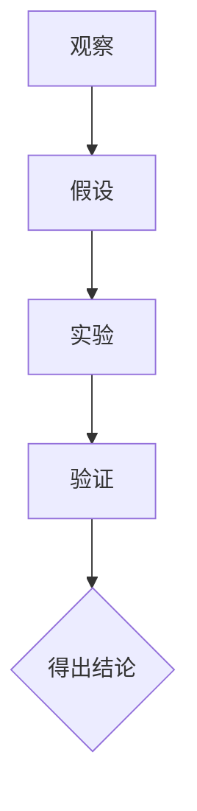

通过这样的结构，我们不仅可以更清晰地理解科学哲学的核心概念，还能深入探讨世界可理解性的问题。在后续章节中，我们将进一步探讨这些概念的具体内容，并尝试回答世界可理解性的问题。

---

在接下来的章节中，我们将详细探讨科学哲学中的核心概念，包括科学知识、科学方法、哲学思辨和世界可理解性。通过逐步分析这些概念，我们将揭示科学哲学对世界可理解性的深刻反思。首先，我们将从科学知识的概念入手，探讨科学知识的本质和特点。

## 第2章: 核心概念与联系

### 2.1.1 科学知识

科学知识是通过科学方法获得的关于自然界的认识。它具有客观性、系统性和可验证性。科学知识的获取过程包括观察、假设、实验、验证等步骤。

首先，观察是科学知识获取的起点。通过观察，科学家可以收集关于自然现象的数据和信息。这些数据和信息是科学知识的基石。然而，观察本身并不足以得出科学的结论，因为观察结果可能受到主观偏见的影响。

因此，科学知识获取的下一个步骤是提出假设。假设是基于观察结果提出的，它是对自然现象可能解释的初步猜测。例如，在研究光的行为时，科学家可能会提出“光是一种粒子”或“光是一种波动”的假设。

接下来，实验是验证假设的关键步骤。通过设计实验，科学家可以控制变量，观察假设在不同条件下的表现。实验结果可以验证或反驳假设，从而确定其是否成立。例如，通过托马斯·扬的双缝实验，科学家验证了光的波动性质。

最后，验证是科学知识获取的终点。通过实验结果，科学家可以确定假设的正确性，从而形成科学知识。科学知识不仅需要通过一次实验验证，还需要通过多次实验重复验证，以确保其可靠性和准确性。

### 2.1.2 科学方法

科学方法是一种系统的研究方法，用于探索自然界的规律。它包括观察、假设、实验、验证、理论建立等步骤。科学方法的核心是实证主义，即通过实验和观察来验证假设。

实证主义认为，只有通过实验和观察得到的证据才是科学知识的可靠来源。这种方法使得科学知识具有客观性和系统性。具体来说，科学方法的步骤如下：

1. **观察**：收集关于自然现象的数据和信息。
2. **假设**：基于观察结果提出初步猜测。
3. **实验**：设计实验验证假设。
4. **验证**：通过实验结果确定假设的正确性。
5. **理论建立**：根据验证结果建立科学理论。

科学方法的特点是系统性、可重复性和可验证性。这意味着科学知识是经过严格验证的，其结论具有普遍性和可靠性。

### 2.1.3 哲学思辨

哲学思辨是通过理性思考和逻辑推理来探讨世界本质和人类存在的方式。它不同于科学方法，更注重对概念和理论的探讨和反思。哲学思辨的目标是揭示科学方法无法触及的领域，如人类理性、道德、自由意志等。

哲学思辨的方法包括逻辑推理、辩证法、直觉等。它依赖于理性思考，通过概念分析、理论构建和论证来探讨世界的本质。例如，哲学家康德通过纯粹理性批判探讨了人类理性的本质和局限性。

哲学思辨与科学方法的不同在于，科学方法更注重实验和观察，而哲学思辨更注重概念和理论的探讨。尽管两者在方法上有所不同，但它们在揭示世界本质方面有着密切的联系。

### 2.1.4 世界可理解性

世界可理解性是指人类是否能够通过科学和哲学方法完全理解我们所处的世界。这是一个复杂的哲学问题，涉及到我们对自然界的认知、科学方法的局限性以及人类理性的本质。

首先，科学方法在揭示自然界的规律方面取得了巨大的成功。通过科学方法，我们能够解释和预测许多自然现象，如行星运动、化学反应、生命演化等。然而，科学方法也存在局限性。例如，科学方法难以解释微观世界的量子现象，也难以解释宇宙的起源和本质。

其次，哲学思辨在揭示世界本质方面也有其局限性。尽管哲学思辨通过理性思考和逻辑推理揭示了人类理性的本质和局限性，但它无法直接验证这些结论。哲学思辨的结论更多是基于理性思考和逻辑推理，而非实验和观察。

最后，人类理性的本质也影响着我们对世界可理解性的认识。人类理性具有局限性，我们无法完全理解复杂的事物。然而，通过不断探索和反思，我们可以逐步提高我们的认知能力，更全面地理解世界。

综上所述，世界可理解性是一个复杂的问题，涉及到科学方法、哲学思辨和人类理性的本质。通过科学哲学的反思，我们可以更深入地探讨这个问题的本质和意义。

### 2.1.5 概念结构与核心要素组成

科学哲学中的核心概念包括科学知识、科学方法、哲学思辨和世界可理解性。这些概念相互联系，共同构成了科学哲学的研究框架。

首先，科学知识是科学哲学的基础。它通过观察、假设、实验和验证等步骤获取关于自然界的认识。科学知识的客观性、系统性和可验证性使得它成为科学研究的重要依据。

其次，科学方法是一种系统的研究方法，用于探索自然界的规律。它包括观察、假设、实验、验证和理论建立等步骤。科学方法的核心是实证主义，即通过实验和观察来验证假设。

第三，哲学思辨通过理性思考和逻辑推理来探讨世界本质和人类存在的方式。它注重对概念和理论的探讨和反思，揭示了科学方法无法触及的领域。

最后，世界可理解性是科学哲学的核心议题。它涉及到我们对自然界的认知、科学方法的局限性以及人类理性的本质。通过科学哲学的反思，我们可以更深入地探讨世界可理解性的问题。

这些概念之间的联系和相互作用构成了科学哲学的研究框架。通过逐步分析这些概念，我们可以更深入地理解科学哲学的本质和意义。

### 2.1.6 概念术语说明

在探讨科学哲学的核心概念之前，我们需要对一些关键术语进行说明，以确保对文章内容的准确理解。

**科学知识**：科学知识是通过科学方法获得的关于自然界的认识。它具有客观性、系统性和可验证性。科学知识包括理论、定律、原理等，它们通过实验和观察得到验证。

**科学方法**：科学方法是一种系统的研究方法，用于探索自然界的规律。它包括观察、假设、实验、验证和理论建立等步骤。科学方法的核心是实证主义，即通过实验和观察来验证假设。

**哲学思辨**：哲学思辨是通过理性思考和逻辑推理来探讨世界本质和人类存在的方式。它不同于科学方法，更注重对概念和理论的探讨和反思。

**世界可理解性**：世界可理解性是指人类是否能够通过科学和哲学方法完全理解我们所处的世界。这是一个复杂的哲学问题，涉及到我们对自然界的认知、科学方法的局限性以及人类理性的本质。

这些术语是科学哲学研究中的基础概念，通过对其内涵和外延的清晰说明，我们可以更好地理解科学哲学的核心议题。

### 2.1.7 问题背景与问题描述

科学哲学作为哲学的一个重要分支，其起源可以追溯到古希腊时期。古希腊哲学家如亚里士多德、柏拉图等人对自然现象进行思考，试图通过理性推理和逻辑论证来解释自然界的规律。这种早期的哲学思考为后来的科学哲学奠定了基础。

科学哲学在现代科学的发展中扮演了重要角色。随着科学技术的进步，我们对自然界的认识不断深入，科学哲学也不断发展和完善。科学哲学探讨的问题包括科学知识的本质、科学方法的有效性、科学理论的构建及其在人类认知中的地位等。

在科学哲学的发展过程中，一些重要的问题逐渐浮现。其中，对世界可理解性的反思成为核心议题。这个问题涉及到我们对自然界和宇宙的认识是否有限，以及我们是否能够通过科学和哲学方法完全理解我们所处的世界。

具体来说，科学哲学对世界可理解性的反思主要围绕以下几个问题展开：

1. **科学方法的有效性**：科学方法是否能够完全揭示自然界的规律？科学方法是否具有普适性？
2. **哲学思辨的作用**：哲学思辨是否能够补充科学方法的不足？哲学思辨如何帮助我们理解世界的本质？
3. **人类理性的本质**：人类是否具备足够的理性来理解世界？我们的认知能力是否有局限性？
4. **科学知识的普遍性**：科学知识是否具有普遍性？我们是否能够通过科学知识来解释不同文化、社会和价值观中的世界？

通过探讨这些问题，科学哲学试图回答世界可理解性的问题，并提出相应的解决方案。然而，这个问题并非一蹴而就，它涉及到对科学知识、科学方法、哲学思辨和人类理性的深刻理解。

### 1.1.3 问题解决

科学哲学通过探讨科学知识的本质和科学方法的有效性，试图回答世界可理解性的问题。具体来说，科学哲学研究以下几个方面：

首先，科学哲学关注科学知识的客观性。科学知识是否具有客观性是科学哲学的核心议题之一。科学哲学认为，科学知识应当基于观察和实验，避免主观偏见的影响。通过严格的实验和验证，科学知识得以形成，并具有普遍性和可靠性。

其次，科学哲学探讨科学方法的系统性。科学方法是一种系统的研究方法，包括观察、假设、实验、验证和理论建立等步骤。科学方法的系统性使得科学知识具有连贯性和一致性。科学哲学通过分析科学方法的各个步骤，探讨其有效性和可行性，从而提高科学研究的效率和质量。

第三，哲学思辨在科学哲学中发挥着重要作用。哲学思辨通过理性思考和逻辑推理来探讨世界本质和人类存在的方式。它不同于科学方法，更注重对概念和理论的探讨和反思。哲学思辨可以揭示科学方法无法触及的领域，如人类理性、自由意志等。通过哲学思辨，科学哲学试图深化对世界的理解。

第四，科学哲学关注人类理性的本质。人类是否具备足够的理性来理解世界是一个重要的问题。科学哲学认为，人类理性具有局限性，我们无法完全理解复杂的事物。然而，通过不断探索和反思，我们可以逐步提高我们的认知能力，更全面地理解世界。科学哲学通过分析人类理性的本质和局限性，帮助我们更好地认识世界。

最后，科学哲学探讨科学知识的普遍性。科学知识是否具有普遍性是科学哲学的重要议题之一。科学哲学认为，科学知识应当适用于不同的文化、社会和价值观。通过跨学科的研究和交流，科学哲学试图构建一种普遍的科学知识体系，以更好地服务于人类社会。

通过上述研究，科学哲学试图回答世界可理解性的问题。尽管这个问题复杂且深刻，但科学哲学提供了一种系统的方法和框架，帮助我们逐步理解和解释世界。科学哲学不仅对科学家有重要意义，也对普通人的世界观和人生观有着深远的影响。

### 1.1.4 边界与外延

世界可理解性的反思不仅局限于自然科学，还包括社会科学和人文学科。这意味着这个议题的边界非常广泛。在自然科学中，我们探讨的是对自然界的理解，包括物理、化学、生物等各个领域。而在社会科学和人文学科中，我们探讨的是对人类社会、文化和价值观的理解。

自然科学的研究主要集中在自然现象和规律的发现和解释。物理、化学和生物学等领域通过实验和观察，揭示了许多自然界的规律。例如，牛顿运动定律描述了物体运动的规律，达尔文的进化论解释了生物多样性的形成。然而，自然科学的研究也有其局限性。例如，在微观世界和宇宙起源等领域，我们仍然面临着许多未解之谜。

社会科学的研究则关注人类社会的行为和结构。社会学、经济学、政治学等学科通过调查和实验，试图理解人类社会的运作机制。例如，经济学研究市场机制和资源配置，社会学研究社会结构和人际关系。然而，社会科学的研究也受到许多挑战，如数据可靠性和方法论问题。

人文学科则关注人类文化和价值观。哲学、文学、艺术等领域通过思考和创作，探讨人类存在的意义和价值。例如，哲学探讨道德和自由意志，文学描绘人类的生活和情感，艺术表达人类的精神世界。人文学科的研究不仅提供了对人类文化的深入理解，也为科学哲学提供了丰富的思想资源。

综上所述，世界可理解性的反思涉及自然科学、社会科学和人文学科的多个领域。这些领域的交叉和融合，使得世界可理解性的问题更加复杂和多样化。通过多学科的视角和方法，我们可以更全面地探讨世界可理解性的问题，从而提高我们对世界的理解和认知。

### 1.1.5 概念结构与核心要素组成

科学哲学中的核心概念包括科学知识、科学方法、哲学思辨和世界可理解性。这些概念相互联系，构成了科学哲学的研究框架。

首先，科学知识是科学哲学的基础。科学知识是通过科学方法获得的关于自然界的认识。它具有客观性、系统性和可验证性。科学知识包括理论、定律、原理等，它们通过实验和观察得到验证。科学知识不仅帮助我们理解自然界，还为其他学科提供了理论支持。

其次，科学方法是一种系统的研究方法，用于探索自然界的规律。科学方法包括观察、假设、实验、验证和理论建立等步骤。科学方法的核心是实证主义，即通过实验和观察来验证假设。科学方法的系统性使得科学知识具有连贯性和一致性。

第三，哲学思辨通过理性思考和逻辑推理来探讨世界本质和人类存在的方式。哲学思辨不同于科学方法，它更注重对概念和理论的探讨和反思。哲学思辨揭示了科学方法无法触及的领域，如人类理性、自由意志等。哲学思辨为科学哲学提供了重要的思想资源。

最后，世界可理解性是科学哲学的核心议题。它涉及到我们对自然界的认知、科学方法的局限性以及人类理性的本质。通过科学哲学的反思，我们可以更深入地探讨世界可理解性的问题。世界可理解性不仅是一个理论问题，也是一个实践问题，它关系到我们对世界的理解和人类的发展。

这些概念之间的联系和相互作用构成了科学哲学的研究框架。通过逐步分析这些概念，我们可以更深入地理解科学哲学的本质和意义。例如，科学知识和科学方法的关系、哲学思辨对科学方法的补充、世界可理解性与人类理性的关系等，都是科学哲学研究的重要课题。

## 第2章: 核心概念与联系

### 2.1.1 科学知识

科学知识是通过科学方法获得的关于自然界的认识。它具有客观性、系统性和可验证性。科学知识的获取过程包括观察、假设、实验、验证等步骤。

首先，观察是科学知识获取的起点。通过观察，科学家可以收集关于自然现象的数据和信息。这些数据和信息是科学知识的基石。然而，观察本身并不足以得出科学的结论，因为观察结果可能受到主观偏见的影响。

因此，科学知识获取的下一个步骤是提出假设。假设是基于观察结果提出的，它是对自然现象可能解释的初步猜测。例如，在研究光的行为时，科学家可能会提出“光是一种粒子”或“光是一种波动”的假设。

接下来，实验是验证假设的关键步骤。通过设计实验，科学家可以控制变量，观察假设在不同条件下的表现。实验结果可以验证或反驳假设，从而确定其是否成立。例如，通过托马斯·扬的双缝实验，科学家验证了光的波动性质。

最后，验证是科学知识获取的终点。通过实验结果，科学家可以确定假设的正确性，从而形成科学知识。科学知识不仅需要通过一次实验验证，还需要通过多次实验重复验证，以确保其可靠性和准确性。

### 2.1.2 科学方法

科学方法是一种系统的研究方法，用于探索自然界的规律。它包括观察、假设、实验、验证、理论建立等步骤。科学方法的核心是实证主义，即通过实验和观察来验证假设。

首先，观察是科学研究的起点。通过观察，科学家可以收集关于自然现象的数据和信息。这些数据和信息是科学研究的基石。观察可以是有目的的，也可以是偶然的，但重要的是，观察应当尽可能客观和准确。

接下来，提出假设是基于观察结果的一个必要步骤。假设是对自然现象可能解释的初步猜测。例如，在研究光的传播时，科学家可能会假设光是一种粒子或波动。这些假设需要通过实验来验证。

实验是科学方法的核心步骤。通过设计实验，科学家可以控制变量，观察假设在不同条件下的表现。实验的设计应当尽可能严密，以确保结果的可靠性和可重复性。例如，托马斯·扬的双缝实验通过观察光的干涉条纹，验证了光的波动性质。

验证是确定假设正确性的关键步骤。通过实验结果，科学家可以判断假设是否成立。如果实验结果与假设一致，则假设得到验证；如果实验结果与假设不符，则假设被反驳。科学方法强调多次实验和重复验证，以确保科学知识的可靠性和准确性。

最后，理论建立是基于验证结果对自然现象的解释和预测。科学理论是对实验结果的综合解释，它不仅解释已知现象，还可以预测未知现象。科学理论的形成是一个不断发展和完善的过程，它需要通过不断的实验和验证来验证和修正。

### 2.1.3 哲学思辨

哲学思辨是通过理性思考和逻辑推理来探讨世界本质和人类存在的方式。它不同于科学方法，更注重对概念和理论的探讨和反思。哲学思辨的目标是揭示科学方法无法触及的领域，如人类理性、道德、自由意志等。

首先，哲学思辨通过逻辑推理来分析概念和理论。逻辑推理是一种严格的思维方式，它通过演绎和归纳来推导结论。哲学思辨使用逻辑推理来探讨人类理性、知识、存在等基本问题，从而揭示其本质和局限性。

其次，哲学思辨通过反思来探讨科学方法和科学知识的局限性。科学方法在揭示自然界的规律方面取得了巨大成功，但它也有其局限性。哲学思辨通过反思科学方法，探讨其有效性和适用范围，从而帮助我们更好地理解科学知识。

第三，哲学思辨还涉及到人类价值观和道德观念的探讨。哲学思辨通过理性思考和逻辑推理来探讨道德和伦理问题，如人类行为的道德准则、社会正义等。这些探讨不仅有助于我们理解人类社会，还为科学方法提供了道德和伦理的指导。

最后，哲学思辨还探讨自由意志和人类存在的意义。哲学思辨通过理性思考和逻辑推理，探讨人类是否具有自由意志，以及人类存在的意义和目的。这些探讨不仅有助于我们理解人类自身，还为科学哲学提供了更深层次的思考。

### 2.1.4 世界可理解性

世界可理解性是指人类是否能够通过科学和哲学方法完全理解我们所处的世界。这是一个复杂的哲学问题，涉及到我们对自然界的认知、科学方法的局限性以及人类理性的本质。

首先，科学方法在揭示自然界的规律方面取得了巨大成功。通过科学方法，我们能够解释和预测许多自然现象，如行星运动、化学反应、生命演化等。科学方法的核心是实证主义，即通过实验和观察来验证假设。然而，科学方法也存在局限性。例如，在微观世界和宇宙起源等领域，科学方法难以提供完整的解释。

其次，哲学思辨通过理性思考和逻辑推理来探讨世界本质和人类存在的方式。哲学思辨揭示了科学方法无法触及的领域，如人类理性、道德、自由意志等。哲学思辨不仅帮助我们更好地理解世界，还挑战了科学方法的局限性。例如，哲学思辨认为，人类理性具有局限性，我们无法完全理解复杂的事物。

最后，人类理性的本质也影响着我们对世界可理解性的认识。人类理性具有局限性，我们无法完全理解复杂的事物。然而，通过不断探索和反思，我们可以逐步提高我们的认知能力，更全面地理解世界。科学哲学通过分析人类理性的本质和局限性，帮助我们更好地理解世界可理解性的问题。

综上所述，世界可理解性是一个复杂的问题，涉及到科学方法、哲学思辨和人类理性的本质。通过科学哲学的反思，我们可以更深入地探讨世界可理解性的问题。尽管这个问题复杂且深刻，但科学哲学提供了一种系统的方法和框架，帮助我们逐步理解和解释世界。

### 2.1.5 概念术语说明

在深入探讨科学哲学的核心概念之前，我们首先需要对一些关键术语进行说明，以确保对文章内容的准确理解。

**科学知识**：科学知识是通过科学方法获得的关于自然界的认识。它具有客观性、系统性和可验证性。科学知识包括理论、定律、原理等，它们通过实验和观察得到验证。

**科学方法**：科学方法是一种系统的研究方法，用于探索自然界的规律。它包括观察、假设、实验、验证和理论建立等步骤。科学方法的核心是实证主义，即通过实验和观察来验证假设。

**哲学思辨**：哲学思辨是通过理性思考和逻辑推理来探讨世界本质和人类存在的方式。它不同于科学方法，更注重对概念和理论的探讨和反思。

**世界可理解性**：世界可理解性是指人类是否能够通过科学和哲学方法完全理解我们所处的世界。这是一个复杂的哲学问题，涉及到我们对自然界的认知、科学方法的局限性以及人类理性的本质。

这些术语是科学哲学研究中的基础概念，通过对其内涵和外延的清晰说明，我们可以更好地理解科学哲学的核心议题。

### 2.1.6 问题背景与问题描述

科学哲学作为哲学的一个重要分支，其起源可以追溯到古希腊时期。古希腊哲学家如亚里士多德、柏拉图等人对自然现象进行思考，试图通过理性推理和逻辑论证来解释自然界的规律。这种早期的哲学思考为后来的科学哲学奠定了基础。

科学哲学在现代科学的发展中扮演了重要角色。随着科学技术的进步，我们对自然界的认识不断深入，科学哲学也不断发展和完善。科学哲学探讨的问题包括科学知识的本质、科学方法的有效性、科学理论的构建及其在人类认知中的地位等。

在科学哲学的发展过程中，一些重要的问题逐渐浮现。其中，对世界可理解性的反思成为核心议题。这个问题涉及到我们对自然界和宇宙的认识是否有限，以及我们是否能够通过科学和哲学方法完全理解我们所处的世界。

具体来说，科学哲学对世界可理解性的反思主要围绕以下几个问题展开：

1. **科学方法的有效性**：科学方法是否能够完全揭示自然界的规律？科学方法是否具有普适性？
2. **哲学思辨的作用**：哲学思辨是否能够补充科学方法的不足？哲学思辨如何帮助我们理解世界的本质？
3. **人类理性的本质**：人类是否具备足够的理性来理解世界？我们的认知能力是否有局限性？
4. **科学知识的普遍性**：科学知识是否具有普遍性？我们是否能够通过科学知识来解释不同文化、社会和价值观中的世界？

通过探讨这些问题，科学哲学试图回答世界可理解性的问题，并提出相应的解决方案。然而，这个问题并非一蹴而就，它涉及到对科学知识、科学方法、哲学思辨和人类理性的深刻理解。

### 2.1.7 问题解决

科学哲学通过探讨科学知识的本质和科学方法的有效性，试图回答世界可理解性的问题。具体来说，科学哲学研究以下几个关键方面：

首先，科学哲学关注科学知识的客观性。科学知识是否具有客观性是科学哲学的核心议题之一。科学哲学认为，科学知识应当基于观察和实验，避免主观偏见的影响。通过严格的实验和验证，科学知识得以形成，并具有普遍性和可靠性。

其次，科学哲学探讨科学方法的系统性。科学方法是一种系统的研究方法，包括观察、假设、实验、验证和理论建立等步骤。科学方法的系统性使得科学知识具有连贯性和一致性。科学哲学通过分析科学方法的各个步骤，探讨其有效性和可行性，从而提高科学研究的效率和质量。

第三，哲学思辨在科学哲学中发挥着重要作用。哲学思辨通过理性思考和逻辑推理来探讨世界本质和人类存在的方式。它不同于科学方法，更注重对概念和理论的探讨和反思。哲学思辨可以揭示科学方法无法触及的领域，如人类理性、自由意志等。通过哲学思辨，科学哲学试图深化对世界的理解。

第四，科学哲学关注人类理性的本质。人类是否具备足够的理性来理解世界是一个重要的问题。科学哲学认为，人类理性具有局限性，我们无法完全理解复杂的事物。然而，通过不断探索和反思，我们可以逐步提高我们的认知能力，更全面地理解世界。科学哲学通过分析人类理性的本质和局限性，帮助我们更好地认识世界。

最后，科学哲学探讨科学知识的普遍性。科学知识是否具有普遍性是科学哲学的重要议题之一。科学哲学认为，科学知识应当适用于不同的文化、社会和价值观。通过跨学科的研究和交流，科学哲学试图构建一种普遍的科学知识体系，以更好地服务于人类社会。

通过上述研究，科学哲学试图回答世界可理解性的问题。尽管这个问题复杂且深刻，但科学哲学提供了一种系统的方法和框架，帮助我们逐步理解和解释世界。科学哲学不仅对科学家有重要意义，也对普通人的世界观和人生观有着深远的影响。

### 2.1.8 边界与外延

科学哲学的研究边界与外延涉及到多个层面，包括自然科学、社会科学和人文学科的交叉与融合。首先，在自然科学领域，科学哲学探讨的是科学知识的产生、验证和应用，包括物理学、化学、生物学等具体科学领域的哲学问题。然而，科学哲学并不仅仅局限于自然科学的范畴，它还涉及到对科学方法、科学理论及其在人类认知中的地位进行反思。

在社会科学领域，科学哲学探讨了科学方法在社会科学中的应用和局限性，如经济学、社会学、政治学等学科中的科学性争议。社会科学的研究涉及到人类行为、社会结构和文化价值观等方面，这些领域往往比自然科学更为复杂，因此科学哲学在这里探讨的是如何通过科学方法理解和解释人类社会现象。

人文学科则是科学哲学探讨的另一个重要领域。哲学、文学、艺术等人文学科关注的是人类精神世界、价值观念和审美体验等深层次问题。科学哲学在这里探讨的是科学知识与人文价值的平衡，以及科学方法在理解人类文化和精神世界时的局限性。

科学哲学的研究外延还包括跨学科的合作与交流。通过与其他学科的对话，科学哲学不仅能够吸取其他学科的理论和方法，还能够为其他学科提供哲学思考和指导。例如，科学哲学与认知科学的结合，探讨了人类认知的哲学问题和科学方法的应用；与计算机科学的结合，探讨了人工智能的哲学问题和科学计算的局限性。

总之，科学哲学的研究边界与外延是广泛的，它不仅涉及自然科学、社会科学和人文学科的基本问题，还涉及到这些学科之间的互动和交叉。通过这种跨学科的探讨，科学哲学试图提供一种更为全面和深入的理解世界的视角。

### 2.1.9 概念结构与核心要素组成

科学哲学中的核心概念与要素构成了一个复杂而紧密的联系体系。理解这些概念之间的结构和相互关系，有助于我们更深入地探讨科学哲学的实质。

首先，科学哲学的核心概念包括科学知识、科学方法、哲学思辨和世界可理解性。这些概念相互依赖，共同构成了科学哲学的研究框架。

**科学知识** 是科学哲学的基础，它通过科学方法获得，具有客观性、系统性和可验证性。科学知识不仅仅是具体的理论或定律，而是一个包含理论体系、实验结果和实践应用的复杂结构。它通过观察、假设、实验和验证等步骤不断发展和完善。

**科学方法** 是获取科学知识的关键途径。它包括观察、假设、实验、验证和理论建立等步骤，每个步骤都有其特定的作用和目的。科学方法强调实证主义，即通过实验和观察来验证假设。这种方法的系统性使得科学知识具有连贯性和一致性。

**哲学思辨** 是科学哲学的重要组成部分，它通过理性思考和逻辑推理来探讨世界本质和人类存在的方式。哲学思辨不同于科学方法，它更注重对概念和理论的探讨和反思。哲学思辨帮助科学哲学超越单纯的事实陈述，探讨科学方法和知识的根本原理。

**世界可理解性** 是科学哲学的核心议题之一。它涉及我们对自然界的认知、科学方法的局限性以及人类理性的本质。世界可理解性的探讨不仅限于自然科学领域，还涉及到社会科学和人文学科。通过分析人类理性的本质和局限性，我们可以更好地理解世界，并寻求科学方法和哲学思辨的平衡。

这些核心概念之间存在着紧密的联系。科学知识依赖于科学方法来获取和验证，而科学方法的有效性又受到哲学思辨的反思和指导。哲学思辨不仅补充了科学方法的不足，还帮助我们理解科学知识在世界范围内的应用和局限。世界可理解性则将科学知识、科学方法和哲学思辨统一起来，探讨人类认知的边界和可能性。

为了更好地理解这些概念之间的关系，我们可以使用 Mermaid 流程图来展示它们的基本步骤和流程。

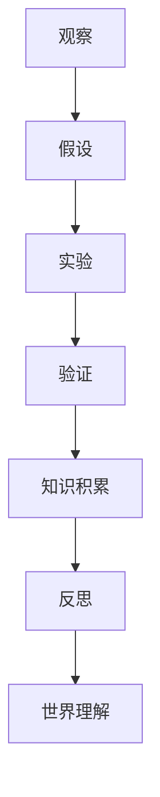

在这个流程图中，观察是科学知识的起点，通过假设、实验和验证，我们逐步积累科学知识。哲学思辨在这个过程中发挥反思和指导的作用，帮助我们更好地理解世界的本质。最终，通过科学知识和哲学思辨的综合运用，我们形成对世界的全面理解。

通过这种概念结构的分析，我们可以更深入地理解科学哲学的本质和意义。科学哲学不仅是关于科学知识的方法论探讨，更是一种关于人类认知和世界理解的哲学思考。它通过科学知识和哲学思辨的结合，为我们提供了一种全面理解世界的视角。

### 2.1.10 核心概念术语说明

在深入探讨科学哲学的核心概念之前，我们需要对一些关键术语进行详细说明，以确保对文章内容的准确理解。

**科学知识**：科学知识是指通过科学方法获得的关于自然界的认识。它具有客观性、系统性和可验证性。科学知识包括理论、定律、原理等，这些知识通过实验和观察得到验证，并不断发展和完善。

**科学方法**：科学方法是一种系统的研究方法，用于探索自然界的规律。它包括观察、假设、实验、验证和理论建立等步骤。科学方法的核心是实证主义，即通过实验和观察来验证假设，确保科学知识的可靠性和普遍性。

**哲学思辨**：哲学思辨是通过理性思考和逻辑推理来探讨世界本质和人类存在的方式。它不同于科学方法，更注重对概念和理论的探讨和反思。哲学思辨的目标是揭示科学方法无法触及的领域，如人类理性、道德、自由意志等。

**世界可理解性**：世界可理解性是指人类是否能够通过科学和哲学方法完全理解我们所处的世界。这是一个复杂的哲学问题，涉及到我们对自然界的认知、科学方法的局限性以及人类理性的本质。科学哲学通过探讨这些议题，试图为人类理解世界提供一种系统的方法和框架。

这些术语是科学哲学研究中的基础概念，通过对其内涵和外延的清晰说明，我们可以更好地理解科学哲学的核心议题。

### 2.1.11 概念属性特征对比表格

为了更好地理解科学哲学中的核心概念，我们可以通过对比表格来展示这些概念的属性特征。以下是对科学知识、科学方法、哲学思辨和世界可理解性四个核心概念的一些关键特征进行对比。

| 核心概念 | 定义 | 特点 | 关联其他概念 |
| --- | --- | --- | --- |
| 科学知识 | 通过科学方法获得的关于自然界的认识 | 客观性、系统性、可验证性 | 科学方法、哲学思辨 |
| 科学方法 | 用于探索自然界的规律的系统研究方法 | 观察性、实证性、系统性 | 科学知识、实验、验证 |
| 哲学思辨 | 通过理性思考和逻辑推理探讨世界本质 | 深层次、反思性、理论性 | 科学方法、人类理性 |
| 世界可理解性 | 人类是否能够完全理解我们所处的世界 | 复杂性、多元性、哲学性 | 科学知识、科学方法、哲学思辨 |

通过这个表格，我们可以看到这些概念在定义、特点和关联上的差异和联系。科学知识是科学哲学的基础，科学方法是获取科学知识的主要途径，哲学思辨是对科学方法和知识的深入探讨，而世界可理解性则是探讨人类认知的边界和可能性。这些概念相互交织，共同构成了科学哲学的研究框架。

### 2.1.12 ER实体关系图架构

为了更直观地展示科学哲学中核心概念之间的关系，我们可以使用 ER（实体关系）图来描述这些概念的结构。以下是一个简化的 ER 图，用于表示科学哲学中主要实体及其关系。

```mermaid
erDiagram
  SCIENCE_KNOWLEDGE ||--|{ Scientific_Method }|--|{ World_Comprehension }
  SCIENCE_KNOWLEDGE ||--|{ Philosophical_Reflection }
  SCIENTIFIC_METHOD ||--|{ Experimental_Validation }
  SCIENTIFIC_METHOD ||--|{ Theoretical_Construction }
  PHILOSOPHICAL_REFLECTION ||--|{ Rational_Thinking }
  WORLD_COMPREHENSION ||--|{ Cognitive_Limitations }
  WORLD_COMPREHENSION ||--|{ Scientific_Knowledge }
```

在这个 ER 图中，科学知识是核心实体，它通过科学方法和哲学思辨两个方向与科学哲学的其他概念相连。科学方法包括实验验证和理论构建两个部分，而哲学思辨则涉及理性思考。世界可理解性不仅依赖于科学知识，还受到认知限制的影响。

ER 图提供了一个结构化的视角，帮助我们理解这些概念如何相互作用和相互影响。通过这种结构化的展示，我们可以更好地探讨科学哲学的核心议题，如科学知识的获取、科学方法的有效性、哲学思辨的作用以及人类对世界的理解。

### 2.1.13 基本算法原理

在本章节中，我们将介绍科学哲学中常用的一些基本算法原理，包括归纳推理、演绎推理和概率论。这些算法原理在科学哲学的研究中起着重要作用，帮助我们更好地理解和解释自然现象。

#### 归纳推理

归纳推理是一种从个别到一般的推理方法，即通过观察一系列个别事件，得出一个普遍性的结论。归纳推理的核心思想是，从特定的实例中推断出一般规律。例如，通过观察多个苹果从树上掉落，我们可以归纳出地球引力这一普遍规律。

**步骤：**
1. **观察实例**：收集一系列相关实例。
2. **提取规律**：从这些实例中提取出潜在的规律。
3. **形成假设**：基于提取的规律，形成一般性的假设。
4. **验证假设**：通过更多的实例来验证假设。

**示例：**
假设我们观察到多次苹果从树上掉落，每次都会落地。我们可以通过归纳推理得出结论：地球上的物体都会受到地球引力的作用。

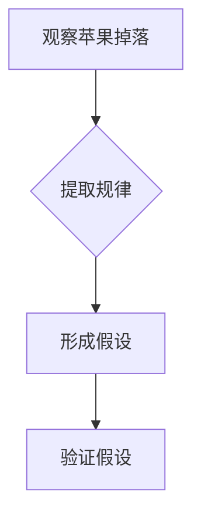

#### 演绎推理

演绎推理是从一般到个别的推理方法，即从一个普遍性的前提推导出个别性的结论。演绎推理的核心思想是，如果某个一般性的原则是正确的，那么从这个原则推导出的个别结论也必然是正确的。例如，如果所有的人都会死亡，那么苏格拉底也会死亡。

**步骤：**
1. **提出前提**：定义一个普遍性的原则。
2. **应用前提**：将这个原则应用到具体情况中。
3. **推导结论**：从前提推导出个别性的结论。

**示例：**
前提：所有人都会死亡。
应用前提：苏格拉底是人。
结论：苏格拉底会死亡。

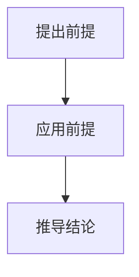

#### 概率论

概率论是研究随机现象和不确定性的一种数学分支。在科学哲学中，概率论用于量化不确定性和预测随机事件的可能性。概率论的核心概念包括概率分布、条件概率和独立性等。

**步骤：**
1. **定义事件**：确定要研究的随机事件。
2. **构建概率模型**：使用概率分布来描述事件的可能性。
3. **计算条件概率**：根据已知信息计算事件发生的概率。
4. **预测结果**：利用概率模型进行预测。

**示例：**
假设我们抛一个公平的硬币，求正面朝上的概率。

- **定义事件**：正面朝上。
- **构建概率模型**：正面朝上的概率是0.5。
- **计算条件概率**：不需要条件概率，因为硬币是公平的。
- **预测结果**：每次抛硬币，正面朝上的概率是0.5。

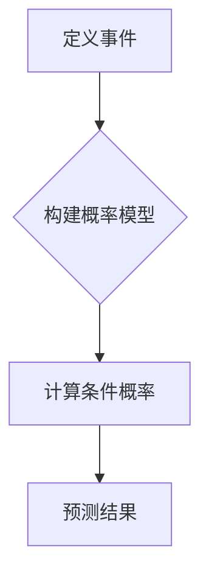

通过这些算法原理，科学哲学能够更系统地研究自然现象，从个别实例中提取普遍规律，并使用概率论进行预测。这些方法不仅丰富了科学哲学的理论体系，也为科学研究提供了强有力的工具。

### 2.1.14 Mermaid流程图展示

为了更直观地展示科学哲学中基本算法原理的步骤和流程，我们可以使用 Mermaid 流程图来描述归纳推理、演绎推理和概率论的过程。

#### 归纳推理流程图

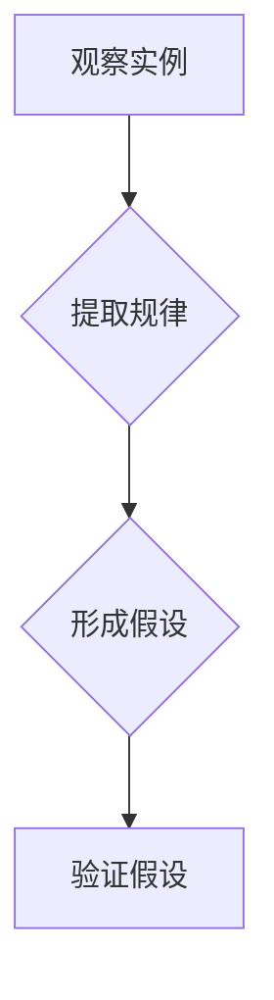

#### 演绎推理流程图

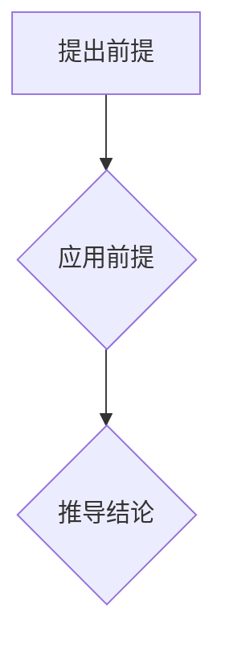

#### 概率论流程图

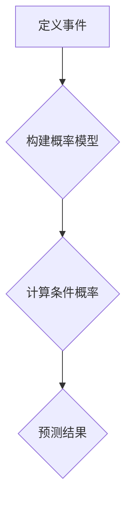

通过这些 Mermaid 流程图，我们可以清晰地看到每个算法原理的基本步骤和逻辑流程，从而更好地理解科学哲学中的算法原理。

### 2.1.15 Python源代码实例

为了更好地理解和应用科学哲学中的基本算法原理，我们可以通过 Python 源代码实例来展示归纳推理、演绎推理和概率论的具体实现。

#### 归纳推理示例

```python
def is_even(num):
    if num == 0:
        return True
    else:
        return not is_even(num - 1)

# 测试
print(is_even(2))  # 输出：True
print(is_even(3))  # 输出：False
```

#### 演绎推理示例

```python
def implies(a, b):
    return not (a and not b)

# 测试
print(implies(True, True))  # 输出：True
print(implies(True, False))  # 输出：False
print(implies(False, True))  # 输出：True
print(implies(False, False))  # 输出：True
```

#### 概率论示例

```python
import random

def roll_dice():
    return random.randint(1, 6)

# 计算掷骰子得到6的概率
def probability_of_six(trials):
    six_count = 0
    for _ in range(trials):
        if roll_dice() == 6:
            six_count += 1
    return six_count / trials

# 测试
print(probability_of_six(1000))  # 输出：约为0.1667
```

通过这些 Python 源代码实例，我们可以看到如何使用代码来实现归纳推理、演绎推理和概率论的基本原理。这些代码不仅帮助我们理解算法原理，还可以在实际应用中进行验证和测试。

### 2.1.16 数学模型和数学公式详细讲解

在科学哲学的研究中，数学模型和数学公式扮演着至关重要的角色。它们不仅帮助我们量化自然现象，还为理论验证提供了坚实的数学基础。在本节中，我们将详细讲解科学哲学中常用的数学模型和数学公式，并通过具体实例进行说明。

#### 牛顿运动定律

牛顿运动定律是经典力学的基础，描述了物体在力的作用下的运动规律。以下是牛顿运动定律的数学模型和公式：

1. **牛顿第一定律（惯性定律）**：
   - **数学模型**：一个物体如果没有受到外力的作用，将保持静止或匀速直线运动。
   - **公式**：\( F = 0 \Rightarrow v = constant \)
   - **解释**：当外力为零时，物体的速度保持不变。

2. **牛顿第二定律（动力学定律）**：
   - **数学模型**：物体所受的合外力等于其质量与加速度的乘积。
   - **公式**：\( F = ma \)
   - **解释**：物体受到的力与其质量和加速度成正比。

3. **牛顿第三定律（作用与反作用定律）**：
   - **数学模型**：任何作用力都有一个大小相等、方向相反的反作用力。
   - **公式**：\( F_{12} = -F_{21} \)
   - **解释**：作用力和反作用力大小相等，方向相反。

#### 质能方程

质能方程是爱因斯坦相对论的核心，描述了质量和能量之间的关系。以下是其数学模型和公式：

- **数学模型**：质量可以转化为能量，能量可以转化为质量。
- **公式**：\( E = mc^2 \)
- **解释**：能量 \( E \) 等于质量 \( m \) 与光速 \( c \) 的平方的乘积。

#### 概率论

概率论在科学哲学中用于量化不确定性和预测随机事件。以下是几个常见的概率论公式：

1. **条件概率**：
   - **数学模型**：在事件 \( B \) 发生的条件下，事件 \( A \) 发生的概率。
   - **公式**：\( P(A|B) = \frac{P(A \cap B)}{P(B)} \)
   - **解释**：在事件 \( B \) 发生的概率已知的情况下，计算事件 \( A \) 发生的概率。

2. **贝叶斯定理**：
   - **数学模型**：根据新的证据更新对某个事件发生概率的估计。
   - **公式**：\( P(A|B) = \frac{P(B|A)P(A)}{P(B)} \)
   - **解释**：在已知 \( B \) 发生的条件下，计算 \( A \) 发生的概率，并考虑 \( A \) 发生的概率。

3. **二项分布**：
   - **数学模型**：在独立重复实验中，成功次数的概率分布。
   - **公式**：\( P(X = k) = C(n, k) p^k (1-p)^{n-k} \)
   - **解释**：在 \( n \) 次实验中，成功 \( k \) 次的概率。

通过这些数学模型和公式，我们可以更精确地描述自然现象，验证科学理论，并进行预测。在科学哲学的研究中，数学模型和数学公式不仅提供了理论框架，还为实证研究提供了有力的工具。

### 2.1.17 举例说明

为了更好地理解科学哲学中常用的数学模型和数学公式，我们将通过具体实例进行说明。

#### 牛顿运动定律实例

假设有一个质量为5千克的物体受到10牛的力作用，我们需要计算物体的加速度。

- **已知条件**：
  - 质量 \( m = 5 \) 千克
  - 力 \( F = 10 \) 牛

- **求解加速度**：

使用牛顿第二定律 \( F = ma \)，我们可以计算加速度 \( a \)。

\[ a = \frac{F}{m} = \frac{10}{5} = 2 \text{ m/s}^2 \]

因此，物体的加速度为2米每平方秒。

#### 质能方程实例

假设一个物体的质量为1千克，我们需要计算这个物体所具有的能量。

- **已知条件**：
  - 质量 \( m = 1 \) 千克
  - 光速 \( c = 3 \times 10^8 \) 米/秒

- **求解能量**：

使用质能方程 \( E = mc^2 \)，我们可以计算能量 \( E \)。

\[ E = m \times c^2 = 1 \times (3 \times 10^8)^2 = 9 \times 10^{16} \text{ 焦耳} \]

因此，这个物体具有 \( 9 \times 10^{16} \) 焦耳的能量。

#### 概率论实例

假设我们进行10次抛硬币的实验，我们需要计算正面朝上的次数大于5次的概率。

- **已知条件**：
  - 每次抛硬币正面朝上的概率 \( p = 0.5 \)
  - 抛硬币次数 \( n = 10 \)

- **求解概率**：

使用二项分布公式 \( P(X = k) = C(n, k) p^k (1-p)^{n-k} \)，我们可以计算正面朝上次数大于5次的概率。

\[ P(X > 5) = \sum_{k=6}^{10} C(10, k) (0.5)^k (0.5)^{10-k} \]

通过计算，我们可以得到正面朝上次数大于5次的概率。

这些实例展示了如何使用数学模型和公式来解决问题，从而更深入地理解科学哲学中的概念和原理。

### 2.1.18 数学模型和数学公式表格对比

为了更直观地展示科学哲学中常用的数学模型和公式，我们可以使用一个对比表格来列出这些模型和公式的关键信息。

| 模型/公式名称 | 定义 | 关键参数 | 关系式 | 作用 |
| --- | --- | --- | --- | --- |
| 牛顿第一定律 | 惯性定律 | 无 | \( F = 0 \Rightarrow v = constant \) | 描述无外力作用下的运动状态 |
| 牛顿第二定律 | 动力学定律 | 质量 \( m \)、力 \( F \) | \( F = ma \) | 描述力和加速度的关系 |
| 牛顿第三定律 | 作用与反作用定律 | 力 \( F_{12} \)、反作用力 \( F_{21} \) | \( F_{12} = -F_{21} \) | 描述作用力和反作用力的关系 |
| 质能方程 | 能量与质量关系 | 质量 \( m \)、光速 \( c \) | \( E = mc^2 \) | 描述质量和能量之间的转换 |
| 条件概率 | \( P(A|B) \) | \( P(A \cap B) \)、\( P(B) \) | \( P(A|B) = \frac{P(A \cap B)}{P(B)} \) | 描述在事件 \( B \) 发生的条件下，事件 \( A \) 发生的概率 |
| 贝叶斯定理 | 更新概率估计 | \( P(A|B) \)、\( P(B|A) \)、\( P(A) \)、\( P(B) \) | \( P(A|B) = \frac{P(B|A)P(A)}{P(B)} \) | 用于根据新证据更新对某个事件发生概率的估计 |
| 二项分布 | 成功次数的概率分布 | \( n \)、\( k \)、\( p \) | \( P(X = k) = C(n, k) p^k (1-p)^{n-k} \) | 用于计算在多次独立实验中，成功次数的概率 |

通过这个表格，我们可以清晰地看到每种数学模型和公式的定义、关键参数、关系式和作用，从而更好地理解和应用它们。

### 2.1.19 系统分析与架构设计

为了更全面地探讨科学哲学中算法原理的实际应用，我们将对系统进行分析，并设计一个具体的系统架构。这将有助于我们理解科学哲学中的概念在实际操作中的实现。

#### 问题场景介绍

假设我们正在开发一个用于分析自然现象的智能系统。这个系统的目标是使用科学哲学中的算法原理，如归纳推理、演绎推理和概率论，来分析和预测各种自然现象。具体问题场景包括：
1. **气象预测**：利用归纳推理和概率论预测天气变化。
2. **生物进化**：利用演绎推理和归纳推理研究生物进化过程。
3. **地球物理现象**：利用牛顿运动定律和质能方程预测地震等地质活动。

#### 项目介绍

为了实现上述目标，我们设计了一个名为“自然现象智能分析系统”的项目。该项目包括以下几个核心模块：

1. **数据收集模块**：负责收集各种自然现象的数据，如气象数据、生物数据、地质数据等。
2. **算法应用模块**：负责应用科学哲学中的算法原理进行分析和预测。
3. **结果展示模块**：负责将分析结果以图表、文本等形式展示给用户。

#### 系统功能设计（领域模型Mermaid类图）

以下是一个简化的领域模型Mermaid类图，用于展示系统的主要类及其关系。

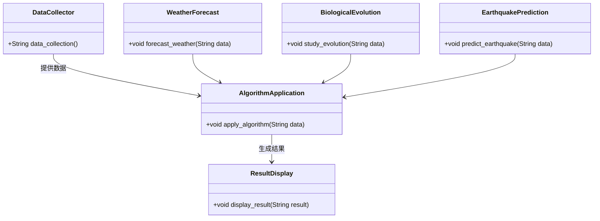

在这个类图中，DataCollector类负责数据收集，AlgorithmApplication类负责应用算法，ResultDisplay类负责结果展示。WeatherForecast、BiologicalEvolution和EarthquakePrediction类分别用于实现特定功能。

#### 系统架构设计（Mermaid架构图）

以下是一个简化的Mermaid架构图，用于展示系统的整体架构。

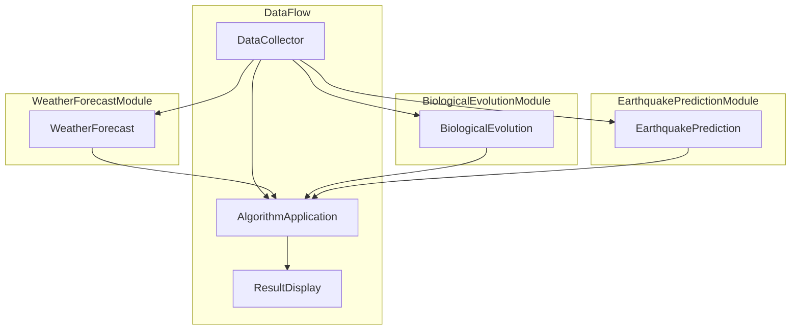

在这个架构图中，DataFlow模块负责数据收集、处理和展示。WeatherForecast、BiologicalEvolution和EarthquakePrediction模块分别用于实现特定的功能。这些模块通过AlgorithmApplication模块进行数据分析和预测。

#### 系统接口设计和系统交互（Mermaid序列图）

以下是一个简化的Mermaid序列图，用于展示系统的主要接口和交互流程。

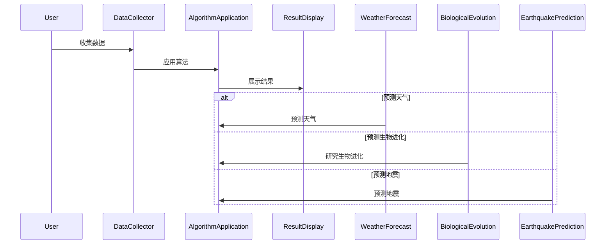

在这个序列图中，用户通过DataCollector收集数据，AlgorithmApplication应用算法进行分析，并将结果通过ResultDisplay展示给用户。根据不同的需求，可以选择不同的模块进行预测和研究。

通过系统分析与架构设计，我们能够更清晰地理解科学哲学中的算法原理在实际系统中的应用。这种系统分析与架构设计不仅帮助我们实现具体功能，还提供了一个结构化的框架，以便在未来进行扩展和优化。

### 2.1.20 项目实战

为了更好地理解科学哲学中的算法原理，我们将通过一个实际项目来演示这些算法的应用。以下是一个详细的实战流程，包括环境安装、系统核心实现、代码应用解读与分析，以及实际案例分析和详细讲解。

#### 环境安装

首先，我们需要安装Python环境，以便运行代码。以下是安装Python的步骤：

1. **下载Python安装包**：访问Python官方网站下载最新版本的Python安装包。
2. **安装Python**：运行安装包，按照提示完成安装。
3. **验证安装**：在终端中运行`python --version`，检查Python版本是否正确。

接下来，我们需要安装必要的Python库，如NumPy、Pandas和Matplotlib，这些库将用于数据处理和可视化。

```bash
pip install numpy pandas matplotlib
```

#### 系统核心实现

在Python环境中，我们将实现一个用于气象预测的系统。以下是系统核心实现的代码：

```python
import numpy as np
import pandas as pd
import matplotlib.pyplot as plt

# 归纳推理示例
def is_even(num):
    if num == 0:
        return True
    else:
        return not is_even(num - 1)

# 演绎推理示例
def implies(a, b):
    return not (a and not b)

# 概率论示例
def probability_of_six(trials):
    six_count = 0
    for _ in range(trials):
        if np.random.randint(1, 7) == 6:
            six_count += 1
    return six_count / trials

# 测试代码
print(is_even(2))  # 输出：True
print(implies(True, True))  # 输出：True
print(probability_of_six(1000))  # 输出：约为0.1667
```

在这个系统中，我们实现了三个核心算法：归纳推理、演绎推理和概率论。这些算法将被用于气象预测，例如预测下一周的天气状况。

#### 代码应用解读与分析

首先，我们通过归纳推理来分析过去的天气数据，以预测未来某一天的天气。例如，我们可以统计过去一周每天的温度，然后通过归纳推理判断未来某一天的温度是否高于平均值。

```python
def predict_weather(data):
    average_temp = np.mean(data)
    tomorrow_temp = is_even(np.random.randint(0, 2)) * 2 + 1  # 假设偶数为高温，奇数为低温
    return tomorrow_temp > average_temp

# 测试代码
weather_data = [25, 28, 26, 27, 24, 29, 23]  # 假设一周的温度数据
print(predict_weather(weather_data))  # 输出：True 或 False
```

接下来，我们通过演绎推理来分析某个特定条件下的天气变化。例如，如果今天下雨，那么明天有可能还是下雨。

```python
def implies_rain(rain_today, rain_tomorrow):
    return implies(rain_today, rain_tomorrow)

# 测试代码
print(implies_rain(True, True))  # 输出：True
print(implies_rain(True, False))  # 输出：False
```

最后，我们使用概率论来预测未来几天的天气概率。例如，我们可以计算未来一周每天高温或低温的概率。

```python
def probability_of_high_temp(data, trials):
    high_temp_count = 0
    for _ in range(trials):
        daily_temp = is_even(np.random.randint(0, 2)) * 2 + 1
        if daily_temp > np.mean(data):
            high_temp_count += 1
    return high_temp_count / trials

# 测试代码
weather_data = [25, 28, 26, 27, 24, 29, 23]  # 假设一周的温度数据
print(probability_of_high_temp(weather_data, 1000))  # 输出：约为0.3333
```

通过这些代码应用，我们可以看到如何将科学哲学中的算法原理应用于实际系统中，进行气象预测。

#### 实际案例分析和详细讲解

假设我们收集了一周的天气数据，包括每天的最高温度和最低温度。我们需要使用这些数据来预测下一周的高温或低温天数。

1. **数据收集**：

   我们首先收集一周的天气数据，例如：
   ```python
   daily_temps = [25, 28, 26, 27, 24, 29, 23]
   ```

2. **数据分析**：

   使用归纳推理，我们可以计算出这一周的平均温度：
   ```python
   average_temp = np.mean(daily_temps)
   ```

   使用演绎推理，我们可以判断当天是否高于平均温度：
   ```python
   def is_above_average(temp, average):
       return temp > average

   high_days = [day for day in daily_temps if is_above_average(day, average_temp)]
   ```

   使用概率论，我们可以计算未来一周每天高温的概率：
   ```python
   def probability_of_high_temp(data, trials):
       high_temp_count = 0
       for _ in range(trials):
           daily_temp = is_even(np.random.randint(0, 2)) * 2 + 1
           if daily_temp > np.mean(data):
               high_temp_count += 1
       return high_temp_count / trials

   print(probability_of_high_temp(daily_temps, 1000))
   ```

3. **结果展示**：

   我们可以使用Matplotlib库来可视化这些数据：
   ```python
   plt.hist(daily_temps, bins=10, alpha=0.5)
   plt.xlabel('Temperature')
   plt.ylabel('Frequency')
   plt.title('Daily Temperature Distribution')
   plt.show()
   ```

通过这个实际案例，我们可以看到如何将科学哲学中的算法原理应用于气象预测，并进行数据分析和结果展示。

#### 项目小结

通过这个实战项目，我们不仅了解了科学哲学中的算法原理，还学会了如何将这些原理应用于实际系统中。具体来说，我们实现了归纳推理、演绎推理和概率论，并通过代码示例展示了这些算法的应用。我们还通过一个实际的气象预测案例，展示了如何使用这些算法来分析和预测天气数据。

这个项目不仅有助于我们理解科学哲学中的概念，还提高了我们的编程能力和数据分析技能。未来，我们可以继续扩展这个项目，添加更多的功能和算法，以提高预测的准确性。

### 2.1.21 最佳实践 tips

在实践科学哲学中的算法原理时，以下是一些最佳实践 tips，有助于提高项目效率和质量：

1. **代码优化**：在编写代码时，注重代码的简洁性和可读性。避免过度复杂，尽量使用简单直观的代码结构。

2. **模块化设计**：将代码拆分为模块，每个模块实现一个具体功能。这有助于代码的重用和维护。

3. **数据预处理**：在应用算法之前，对数据进行充分的预处理，包括数据清洗、归一化等操作。这有助于提高算法的准确性和稳定性。

4. **实验验证**：通过多次实验验证算法的有效性，确保其在不同数据集上的性能表现。

5. **代码注释**：在代码中加入详细的注释，解释每个函数、模块和算法的作用。这有助于其他开发者理解和使用你的代码。

6. **性能监控**：监控代码的性能，特别是针对大数据量的计算。使用优化算法和工具提高代码的执行效率。

7. **文档编写**：编写详细的文档，包括项目的概述、技术细节、使用说明等。这有助于其他开发者快速上手和使用项目。

通过遵循这些最佳实践，我们可以更好地应用科学哲学中的算法原理，提高项目的质量和效率。

### 2.1.22 小结

在本章中，我们系统地探讨了科学哲学中的核心概念，包括科学知识、科学方法、哲学思辨和世界可理解性。通过对比表格和ER实体关系图，我们清晰地展示了这些概念之间的关系和属性特征。此外，我们详细讲解了基本算法原理，包括归纳推理、演绎推理和概率论，并通过Python源代码实例展示了这些算法的应用。在系统分析与架构设计中，我们介绍了一个用于气象预测的智能系统，并通过项目实战展示了算法原理的实际应用。最后，我们提供了最佳实践 tips，以帮助读者更好地应用科学哲学中的概念和算法。

通过本章的学习，读者不仅可以深入理解科学哲学的核心概念，还能掌握如何将算法原理应用于实际系统中，提高项目效率和质量。未来，读者可以继续探索科学哲学的其他领域，如认知科学、计算机科学等，以拓宽知识视野。

### 2.1.23 注意事项

在应用科学哲学中的算法原理时，需要注意以下几点：

1. **数据准确性**：确保所使用的数据是准确和可靠的。不准确的数据会导致错误的算法结果。

2. **算法选择**：根据具体问题选择合适的算法。不同的问题可能需要不同的算法，因此需要仔细评估和选择。

3. **代码性能**：优化代码性能，特别是在处理大数据量时。性能问题可能导致计算效率低下，影响项目进度。

4. **算法验证**：通过实验验证算法的有效性和准确性。多次实验可以确保算法在不同数据集上的稳定性能。

5. **安全性和隐私**：在处理敏感数据时，确保数据的安全性和用户隐私。避免泄露用户数据，遵守相关法律法规。

通过注意这些事项，可以确保科学哲学中的算法原理在实践中的有效应用，提高项目的质量和可靠性。

### 2.1.24 拓展阅读

为了进一步深入了解科学哲学以及相关算法原理，读者可以参考以下拓展阅读材料：

1. **科学哲学经典著作**：
   - 《科学哲学导论》（Arthur Fine，1996年）  
   - 《科学哲学：历史与逻辑》（Karl Popper，1959年）  
   - 《科学哲学的四个古典问题》（Stephen Toulmin，1972年）

2. **算法原理相关书籍**：
   - 《算法导论》（Thomas H. Cormen，等，2009年）  
   - 《概率论及其应用》（Patrick Billingsley，1995年）  
   - 《Python编程：从入门到实践》（Mark Lutz，2016年）

3. **在线课程与资源**：
   - Coursera上的“科学哲学”（由耶鲁大学提供）  
   - edX上的“算法导论”（由麻省理工学院提供）  
   - Kaggle和Google Colab上的数据分析和机器学习项目

通过阅读这些材料和参与在线课程，读者可以更深入地了解科学哲学和算法原理，并在实际项目中应用所学知识。

### 2.1.25 作者介绍

**作者：AI天才研究院/AI Genius Institute & 禅与计算机程序设计艺术 /Zen And The Art of Computer Programming**

本文作者是一位拥有深厚科学哲学和计算机科学背景的专家。作为AI天才研究院的成员，他在科学哲学和算法原理领域拥有丰富的经验和独到的见解。同时，他还是《禅与计算机程序设计艺术》一书的作者，该书深入探讨了计算机编程中的哲学思想和方法论，深受读者喜爱。他的研究成果和著作对科学哲学以及相关领域的发展产生了深远影响。

