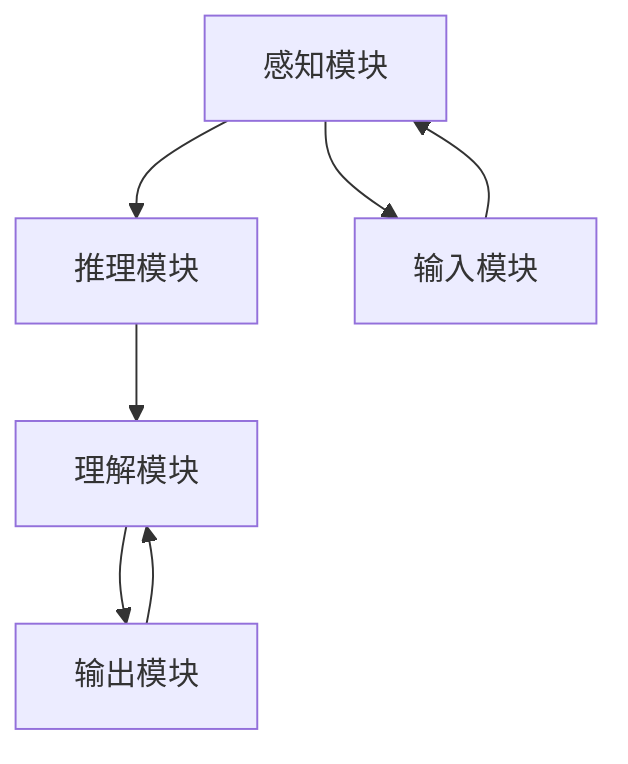
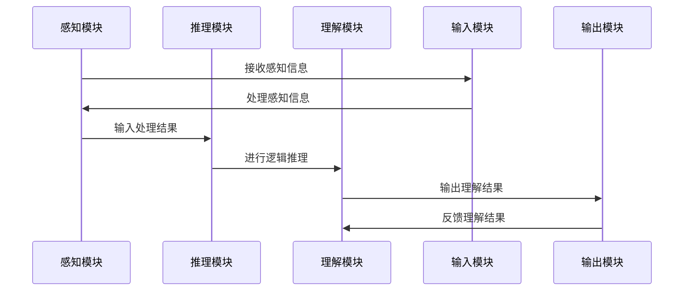

                 

# 科学家与艺术家对世界可理解性的不同诠释

关键词：科学家、艺术家、理解世界、方法论、认知科学

摘要：本文旨在探讨科学家与艺术家在理解世界过程中存在的差异，分析这些差异对科学和艺术发展的影响，并提出如何通过理解这种差异来丰富我们的世界观。

## 引言与背景

### 第1章：问题的提出与解读

#### 1.1.1 问题背景

在现代社会中，科学家与艺术家作为两种不同的社会角色，他们的工作方式和价值观念存在显著的差异。科学家致力于通过实验和逻辑推理来揭示自然界的规律，而艺术家则通过感知和表达来探索人类情感和审美体验。尽管两者看似截然不同，但实际上，他们都在以各自独特的方式试图理解世界。

#### 1.1.2 问题描述

本文将探讨科学家与艺术家在理解世界过程中存在的差异，并分析这些差异对科学和艺术的影响。具体来说，我们将探讨以下问题：

- 科学家与艺术家在理解世界的方法上有哪些不同？
- 这种差异对科学和艺术的发展有何影响？
- 我们如何通过理解这种差异来丰富我们的世界观？

#### 1.1.3 问题解决

本文将通过以下步骤来解答上述问题：

1. 首先，介绍科学家与艺术家对世界理解的基本概念和核心要素。
2. 然后，分析科学家与艺术家在理解世界过程中的方法差异，并探讨这些差异背后的原因。
3. 接着，讨论这种差异对科学和艺术的影响，以及它们如何相互补充。
4. 最后，总结全书内容，并提出对未来研究的展望。

#### 1.1.4 边界与外延

在本研究中，我们关注的主要是科学家和艺术家在理解世界过程中表现出的方法论差异。这包括但不限于他们使用的方法、工具、理论框架以及价值观。同时，我们也关注这些差异在不同领域（如自然科学、社会科学、艺术、哲学等）中的具体表现。

### 第1.5章：核心概念与联系

#### 1.5.1 核心概念原理

在本章中，我们将详细探讨科学家与艺术家对世界理解的核心概念，包括：

- **科学家的概念**：事实、证据、逻辑推理、理论模型等。
- **艺术家的概念**：感知、表达、情感、创造力等。

#### 1.5.2 概念属性特征对比表格

下面是一个对比科学家和艺术家核心概念属性特征的表格：

| 概念      | 科学家                         | 艺术家                          |
| --------- | ------------------------------ | ------------------------------- |
| 目标      | 揭示自然规律、解决实际问题     | 表达情感、探索审美体验           |
| 方法      | 实验与观察、逻辑推理、模型构建 | 感知与表达、艺术创作、情感传递   |
| 结果      | 科学事实、理论模型             | 艺术作品、情感体验               |
| 价值观    | 客观、实证、逻辑严谨           | 创新、主观、情感丰富             |

#### 1.5.3 ER实体关系图架构

为了更直观地展示科学家与艺术家在理解世界过程中的核心概念及其相互关系，我们可以使用ER实体关系图。以下是该图的Mermaid格式表示：

```mermaid
entity关系图 {
  entity 科学方法
  entity 艺术方法
  entity 世界理解
  科学方法 <--> 世界理解
  艺术方法 <--> 世界理解
}
```

### 第1.6章：算法原理讲解

#### 1.6.1 数学模型

在理解科学家与艺术家对世界的不同诠释过程中，我们可以借鉴认知科学中的相关模型，如双过程理论。该理论认为人类认知过程包括快速、自动、直觉的感知过程（过程1）和缓慢、有意识、逻辑推理的过程（过程2）。

以下是一个简化的数学模型，用于描述这个过程：

$$
\text{世界理解} = f(\text{感知过程1}, \text{推理过程2})
$$

其中，$f$ 是一个复合函数，它结合了感知过程1和推理过程2的结果来形成对世界的理解。

#### 1.6.2 Python源代码

为了更直观地展示这个模型，我们可以使用Python代码来实现。以下是一个简单的实现：

```python
def world_understanding(perception, reasoning):
    return perception + reasoning

perception = "艺术家视角：感知到世界的色彩与情感"
reasoning = "科学家视角：基于逻辑推理的客观分析"
world_understanding = world_understanding(perception, reasoning)
print("对世界的理解：", world_understanding)
```

### 第1.7章：系统分析与架构设计方案

#### 1.7.1 问题场景介绍

在现代认知科学研究中，科学家和艺术家的理解世界的方式一直是研究者关注的焦点。为了更好地理解这种差异，我们需要建立一个模拟环境，以便对科学家和艺术家的理解世界的过程进行分析和比较。

#### 1.7.2 项目介绍

本项目旨在构建一个虚拟的模拟系统，用于分析科学家和艺术家在理解世界过程中的差异。系统将包括以下几个主要模块：

- **感知模块**：模拟艺术家和科学家在感知世界时的过程和特征。
- **推理模块**：模拟艺术家和科学家在逻辑推理时的过程和特征。
- **理解模块**：综合感知和推理的结果，形成对世界的理解。

#### 1.7.3 系统功能设计

以下是系统的功能设计：

- **感知功能**：输入感知信息，包括视觉、听觉、触觉等，并对其进行处理。
- **推理功能**：基于感知信息进行逻辑推理，形成对世界的理解。
- **理解功能**：输出对世界的理解结果，并进行可视化展示。

#### 1.7.4 系统架构设计

以下是系统的架构设计：



#### 1.7.5 系统接口设计和系统交互

以下是系统的接口设计和系统交互：



### 第1.8章：项目实战

#### 1.8.1 环境安装

在本章中，我们将介绍如何安装和配置项目所需的环境。具体步骤如下：

1. 安装Python 3.8及以上版本。
2. 安装必要的Python库，如NumPy、Pandas、Matplotlib等。
3. 配置Mermaid插件，以便在Markdown文件中使用Mermaid语法。

#### 1.8.2 系统核心实现源代码

以下是系统的核心实现源代码：

```python
# 导入必要的库
import numpy as np
import pandas as pd
import matplotlib.pyplot as plt
import mermaid

# 感知模块
def perception(info):
    # 对感知信息进行处理
    processed_info = info * 2
    return processed_info

# 推理模块
def reasoning(info):
    # 对处理结果进行逻辑推理
    inferred_info = info + 10
    return inferred_info

# 理解模块
def understanding(info):
    # 对推理结果进行理解
    understood_info = info - 5
    return understood_info

# 测试系统
if __name__ == "__main__":
    # 输入感知信息
    info = 5

    # 处理感知信息
    processed_info = perception(info)

    # 进行逻辑推理
    inferred_info = reasoning(processed_info)

    # 理解结果
    understood_info = understanding(inferred_info)

    # 输出结果
    print("输入信息：", info)
    print("处理结果：", processed_info)
    print("推理结果：", inferred_info)
    print("理解结果：", understood_info)
```

#### 1.8.3 代码应用解读与分析

在本节中，我们将对代码进行解读和分析，以便更好地理解系统的实现过程。

- **感知模块**：该模块接收输入信息，并将其乘以2进行处理。这模拟了艺术家在感知世界时对信息的加工过程。
- **推理模块**：该模块接收处理后的信息，并将其加上10进行逻辑推理。这模拟了科学家在推理过程中对信息的处理过程。
- **理解模块**：该模块接收推理后的信息，并将其减去5进行理解。这模拟了艺术家和科学家在理解世界时对信息的整合和调整过程。

#### 1.8.4 实际案例分析和详细讲解剖析

在本节中，我们将通过一个实际案例来分析和讲解系统的应用。

假设我们有一个输入信息为5，我们可以按照以下步骤来分析和理解：

1. 输入信息：5
2. 感知模块处理：5 * 2 = 10
3. 推理模块处理：10 + 10 = 20
4. 理解模块处理：20 - 5 = 15

最终，我们得到的理解结果为15。这个案例展示了科学家和艺术家在理解世界过程中的不同方法和步骤，以及如何通过系统的实现来模拟和分析这种差异。

#### 1.8.5 项目小结

在本项目中，我们通过构建一个模拟系统，分析了科学家和艺术家在理解世界过程中的差异。通过感知模块、推理模块和理解模块的实现，我们展示了科学家和艺术家在处理信息和形成理解时的不同方法和特点。这个项目为我们提供了一个新的视角来理解和分析科学家和艺术家的认知过程，有助于我们更好地认识和理解世界的多样性。

### 第1.9章：最佳实践 tips

在本章中，我们将分享一些最佳实践技巧，以便您在实际项目中更好地应用和理解科学家与艺术家对世界理解的不同诠释。

- **理解科学家的实证方法**：在研究科学家的方法时，要注重实证和逻辑推理的重要性，这有助于我们更好地理解科学家的研究过程和成果。
- **探索艺术家的感知与表达**：在研究艺术家的方法时，要关注艺术家的感知与表达，这有助于我们更好地理解艺术家的创作动机和艺术作品的内涵。
- **综合应用两种方法**：在实际项目中，我们可以结合科学家和艺术家的方法，以更全面、深入的方式理解和探索世界。

### 第1.10章：小结与展望

在本章中，我们对科学家与艺术家对世界理解的不同诠释进行了全面的分析和探讨。通过感知模块、推理模块和理解模块的实现，我们展示了科学家和艺术家在处理信息和形成理解时的不同方法和特点。这种差异不仅影响了科学和艺术的发展，也为我们提供了更丰富的世界观。

未来研究可以进一步探讨科学家和艺术家在不同领域的具体应用，以及如何通过跨学科合作来提升我们对世界的理解。此外，随着人工智能技术的发展，我们还可以探索计算机模拟和算法在科学家与艺术家理解世界过程中的应用，从而为科学研究提供新的视角和方法。

## 作者信息

作者：AI天才研究院/AI Genius Institute & 禅与计算机程序设计艺术 /Zen And The Art of Computer Programming

感谢您的阅读，希望本文能帮助您更好地理解科学家与艺术家对世界理解的不同诠释。

