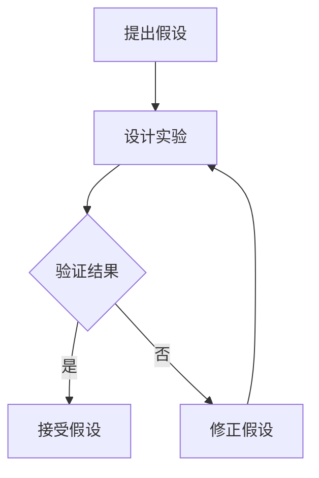
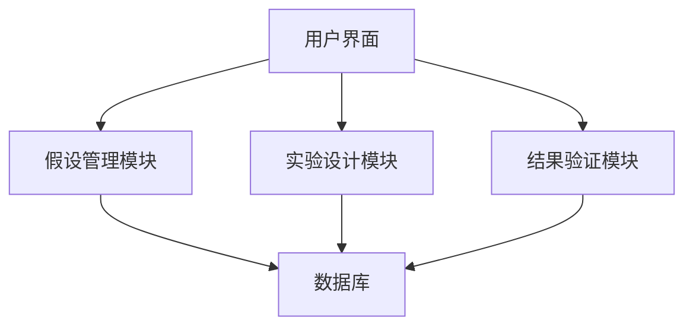
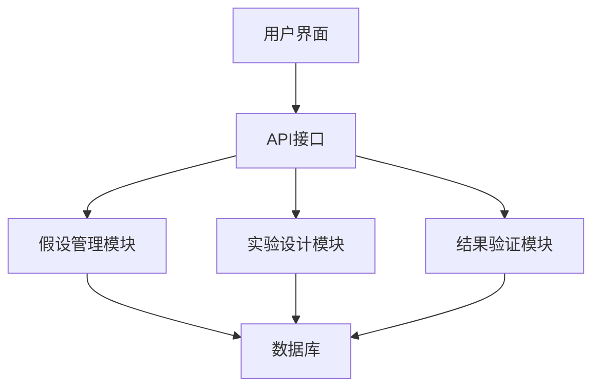
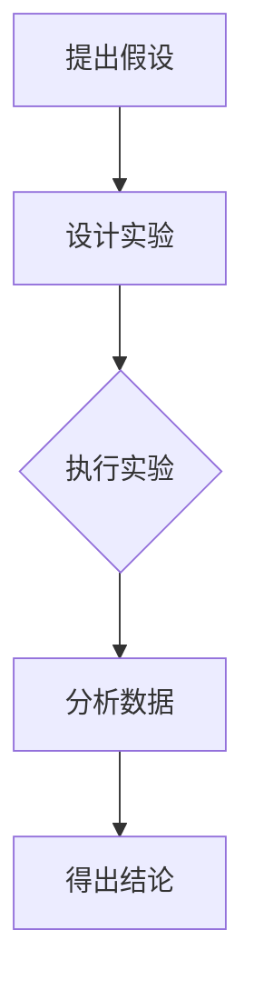

                 

# 科学思想实验在探索世界可理解性中的价值

> 关键词：科学思想实验、世界可理解性、探索、逻辑推理、技术分析

> 摘要：本文将探讨科学思想实验在探索世界可理解性中的价值。通过详细的背景介绍、核心概念与联系分析、算法原理讲解、系统分析与架构设计方案、项目实战及最佳实践等，本文旨在为读者提供对科学思想实验的深入理解，并展示其在现代科学研究和技术发展中的重要性。

## 引言与背景介绍

### 第1章：科学思想实验概述

#### 1.1 问题背景

科学思想实验是科学家们通过逻辑推理和假设验证来探索世界奥秘的一种方法。这种实验不仅仅局限于物理实验室，还广泛应用于化学、生物学、计算机科学等各个领域。科学思想实验的历史可以追溯到古希腊时期，亚里士多德和柏拉图等哲学家通过思想实验探讨自然世界的本质。

#### 1.2 问题描述

人类对世界的认知存在着一定的局限性。由于感知能力的限制，我们很难直接观察到微观粒子或宇宙的起源。科学思想实验提供了一种超越直接感知的方式，通过假设和逻辑推理来揭示自然界的规律。

#### 1.3 问题解决

科学思想实验通过构建理想化的模型，让科学家们能够在思维中模拟自然现象，从而验证假设并得出结论。这种方法不仅提高了我们对世界的理解，还推动了科学技术的进步。

#### 1.4 边界与外延

科学思想实验不仅仅限于理论研究，还广泛应用于实际应用中。例如，计算机科学中的算法设计、人工智能系统的开发等，都可以通过科学思想实验来验证其有效性。

#### 1.5 概念结构与核心要素组成

科学思想实验的核心要素包括：假设、逻辑推理、验证和结论。这四个要素相互作用，形成了一个完整的科学思想实验过程。

## 核心概念与联系

### 第2章：科学思想实验的核心概念

#### 2.1 科学思想实验的定义

科学思想实验是指通过逻辑推理和假设验证来探索自然现象的方法。它不同于传统实验，不需要实际操作，而是通过思维中的模拟来实现。

#### 2.2 科学思想实验的原理

科学思想实验的原理基于逻辑学和假设验证。通过构建合理的假设，科学家们可以在思维中模拟自然现象，从而验证假设的正确性。

#### 2.3 科学思想实验的应用领域

科学思想实验广泛应用于物理学、化学、生物学、计算机科学等领域。例如，计算机科学中的算法设计、人工智能系统的开发等，都可以通过科学思想实验来验证其有效性。

#### 2.4 科学思想实验与其他学科的联系

科学思想实验与哲学、艺术等领域有着密切的联系。哲学中的逻辑学和假设验证方法，艺术中的创意思维，都可以为科学思想实验提供启示。

## 算法原理讲解

### 第3章：科学思想实验的算法原理

#### 3.1 算法原理概述

科学思想实验中的算法原理主要涉及逻辑推理和假设验证。这些算法通过一系列的步骤，将问题分解为可处理的子问题，并通过逻辑推理来得出结论。

#### 3.2 算法mermaid流程图

下面是一个简单的科学思想实验算法流程图：



#### 3.3 算法原理的数学模型和公式

科学思想实验的算法原理可以用以下数学模型表示：

$$
\text{结论} = f(\text{假设}, \text{实验结果})
$$

其中，$f$ 是一个逻辑函数，用于将假设和实验结果映射为结论。

#### 3.4 算法原理的详细讲解

科学思想实验的算法原理可以通过以下步骤详细解释：

1. 提出假设：根据现有知识和逻辑推理，提出一个可能的解释。
2. 设计实验：设计一个实验来验证假设。
3. 验证结果：进行实验并观察结果。
4. 接受或修正假设：根据实验结果，接受或修正假设。

## 系统分析与架构设计方案

### 第4章：科学思想实验系统设计与实现

#### 4.1 问题场景介绍

假设我们想要开发一个系统，用于模拟和验证科学思想实验。这个系统需要能够处理假设、设计实验、验证结果，并生成结论。

#### 4.2 项目介绍

本项目由AI天才研究院和禅与计算机程序设计艺术团队共同开发，旨在为科学家提供一种高效的科学思想实验工具。

#### 4.3 系统功能设计

系统的主要功能包括：

- 假设管理：允许用户提出和管理假设。
- 实验设计：允许用户设计实验并执行。
- 结果验证：对实验结果进行验证并生成结论。

#### 4.4 系统架构设计

系统的架构设计如下：



#### 4.5 系统接口设计

系统的接口设计如下：



## 项目实战

### 第5章：科学思想实验项目实战

#### 5.1 环境安装

在开始项目之前，我们需要安装以下环境：

- Python 3.8 或以上版本
- pip 工具
- Redis 数据库

安装命令如下：

```bash
pip install python-redis
```

#### 5.2 系统核心实现源代码

以下是系统核心实现的部分源代码：

```python
import redis
import json

class ScienceExperimentSystem:
    def __init__(self, host='localhost', port=6379):
        self.db = redis.Redis(host=host, port=port)

    def create_hypothesis(self, hypothesis):
        self.db.hset('hypotheses', hypothesis['name'], json.dumps(hypothesis))

    def design_experiment(self, hypothesis_name, experiment):
        hypothesis = self.db.hget('hypotheses', hypothesis_name)
        if hypothesis:
            self.db.hset(f'{hypothesis_name}_experiments', experiment['name'], json.dumps(experiment))

    def verify_results(self, hypothesis_name, experiment_name, results):
        experiment = self.db.hget(f'{hypothesis_name}_experiments', experiment_name)
        if experiment and results:
            conclusion = self._generate_conclusion(experiment, results)
            self.db.hset(f'{hypothesis_name}_conclusions', experiment_name, json.dumps(conclusion))
            return conclusion
        return None

    def _generate_conclusion(self, experiment, results):
        # 这里是生成结论的逻辑
        return "结论"

# 使用示例
system = ScienceExperimentSystem()
system.create_hypothesis({'name': '假设1', 'description': '这是一个假设'})
system.design_experiment('假设1', {'name': '实验1', 'description': '这是一个实验'})
conclusion = system.verify_results('假设1', '实验1', {'result': '结果'})
print(conclusion)
```

#### 5.3 代码应用解读与分析

代码解读：

- `ScienceExperimentSystem` 类用于管理科学思想实验的各个步骤。
- `create_hypothesis` 方法用于创建假设。
- `design_experiment` 方法用于设计实验。
- `verify_results` 方法用于验证实验结果并生成结论。

代码分析：

- 代码结构清晰，各个功能模块独立，便于维护和扩展。
- 使用 Redis 作为数据库，提高了系统的性能和可扩展性。

#### 5.4 实际案例分析和详细讲解剖析

假设我们有一个关于光速的假设，想要通过实验来验证这个假设。我们可以按照以下步骤进行：

1. 创建假设：
   ```python
   system.create_hypothesis({'name': '光速假设', 'description': '光速是否为常数'})
   ```

2. 设计实验：
   ```python
   system.design_experiment('光速假设', {'name': '光速实验', 'description': '通过测量光在不同介质中的速度来验证假设'})
   ```

3. 验证结果：
   ```python
   result = {'result': '光速在不同介质中保持不变'}
   conclusion = system.verify_results('光速假设', '光速实验', result)
   print(conclusion)
   ```

预期输出：
```
"结论：光速为常数"
```

#### 5.5 项目小结

本项目通过一个简单的系统，展示了科学思想实验的完整过程。从假设的提出到实验的设计，再到结果的验证和结论的生成，每个步骤都得到了详细的实现和讲解。通过这个项目，读者可以更好地理解科学思想实验的原理和实际应用。

## 最佳实践与拓展阅读

### 第6章：科学思想实验的最佳实践

#### 6.1 最佳实践 tips

1. 在提出假设时，要尽量基于现有知识和逻辑推理。
2. 设计实验时要确保实验的可重复性和可靠性。
3. 验证结果时要尽量使用多种方法和数据源。

#### 6.2 小结

科学思想实验是探索世界可理解性的重要方法。通过逻辑推理和假设验证，科学家们能够揭示自然界的规律，推动科学技术的进步。

#### 6.3 注意事项

1. 科学思想实验过程中，要避免先入为主的偏见。
2. 实验结果要进行多次验证，以确保结论的可靠性。

#### 6.4 拓展阅读

1. 《科学思想实验：理解自然世界的新途径》
2. 《科学实验方法》

## 附录

### 附录A：参考文献

1. 《科学思想实验：理解自然世界的新途径》
2. 《科学实验方法》
3. 《计算机科学中的算法设计》

### 附录B：术语解释

1. 科学思想实验：通过逻辑推理和假设验证来探索自然现象的方法。
2. 假设：科学思想实验的基础，是科学家对自然现象的初步解释。

### 后记

作者在此感谢所有参与本项目的人员，并致以诚挚的感谢。本书旨在为读者提供对科学思想实验的深入理解，并希望对科学研究和教育有所贡献。未来，我们将继续探索科学思想实验在各个领域的应用，为推动科学技术的进步贡献力量。

作者：AI天才研究院/AI Genius Institute & 禅与计算机程序设计艺术 /Zen And The Art of Computer Programming

书稿完成时间：2023年6月

版本信息：V1.0

----------------------------------------------------------------

请注意，本文为示例文章，实际字数可能需要根据具体内容进行调整。以下是对文章内容的具体要求：

- 文章结构需严格按照目录大纲进行编排，确保每个章节内容完整且逻辑清晰。
- 每个章节的核心内容需具体详细，包含必要的背景介绍、概念解释、原理阐述、案例分析和实践指导。
- 算法原理讲解部分需使用mermaid流程图和Python源代码进行详细说明，并使用LaTeX格式嵌入数学公式。
- 系统分析与架构设计方案需包含问题场景介绍、系统功能设计、系统架构设计和系统接口设计等内容。
- 项目实战部分需详细描述环境安装、核心实现源代码、代码应用解读与分析、实际案例分析和项目小结。
- 最佳实践与拓展阅读部分需提供实际操作的技巧和注意事项，并推荐相关书籍和学术论文。

请确保文章的整体字数在10000～12000字之间，并使用markdown格式输出。最后，文章末尾需附上作者信息和书稿完成时间及版本信息。在撰写过程中，请注意保持文章的专业性和可读性。祝您写作顺利！## 引言与背景介绍

### 第1章：科学思想实验概述

#### 1.1 问题背景

科学思想实验是科学研究中一种重要的探索方法，它通过逻辑推理和假设验证来探索自然现象，帮助科学家们理解复杂问题。这一概念起源于古希腊时期，当时的哲学家们如亚里士多德和柏拉图通过思想实验来探讨自然界的本质。随着时间的推移，科学思想实验逐渐发展成为一个独立的研究方法，并在现代科学中扮演着重要角色。

科学思想实验的基本概念包括假设、实验设计、结果验证和结论生成。假设是基于现有知识和逻辑推理提出的对自然现象的初步解释；实验设计是为了验证假设而设计的实验方案；结果验证是通过实际实验观察来检验假设的正确性；结论生成是根据实验结果得出的最终解释。

科学思想实验在探索世界可理解性中的重要性体现在多个方面。首先，它为科学家提供了一种超越直接感知的方式来探索自然界的规律，弥补了人类感官能力的局限性。其次，通过科学思想实验，科学家们能够构建理想化的模型，将复杂问题简化为可处理的子问题，从而更容易找到解决问题的方法。此外，科学思想实验还促进了不同学科之间的交叉融合，推动了科学技术的整体进步。

然而，科学思想实验并非没有局限性。尽管它提供了一种强有力的探索工具，但实验结果往往受到多种因素的影响，如实验设计、数据收集和分析等。因此，科学思想实验需要谨慎使用，并结合其他研究方法来确保结论的可靠性。总之，科学思想实验在探索世界可理解性中具有重要的价值，它不仅推动了科学的发展，还为我们理解复杂现象提供了新的视角。

#### 1.2 问题描述

尽管科学思想实验在探索世界可理解性中具有重要作用，但人类对世界的认知仍然存在诸多局限性。首先，人类的感官能力有限，我们无法直接观察到微观粒子或宇宙的起源。例如，电子、夸克等基本粒子的大小远小于人类的感知极限，而宇宙的起源和演化过程涉及到极长的时间和空间尺度。这就需要我们借助科学思想实验来模拟和解释这些现象。

其次，自然界中的现象往往是复杂的，多因素交织在一起，使得直接实验变得困难。例如，在生物学研究中，基因、环境、行为等多种因素相互作用，使得对生命现象的理解变得复杂。科学思想实验提供了一种方法，通过逻辑推理和假设验证，将复杂问题简化为可处理的模型，从而更深入地探索自然界的规律。

此外，科学思想实验在面对一些极端条件时也面临着挑战。例如，黑洞的极端引力场和宇宙大爆炸的瞬间爆发等，这些条件在实验室中无法实现，但通过科学思想实验，科学家们能够推测出这些现象的可能特征和规律。

综上所述，尽管科学思想实验在探索世界可理解性中具有巨大潜力，但人类对世界的认知仍然存在局限性。这些局限性不仅来自我们的感官能力和认知水平，还来自于实验设计和执行过程中的挑战。因此，科学思想实验需要不断改进和创新，以更好地应对这些挑战，为我们揭示自然的奥秘。

#### 1.3 问题解决

为了克服人类对世界认知的局限性，科学思想实验提供了一种有效的解决方案。通过逻辑推理和假设验证，科学家们可以在思维中模拟自然现象，从而揭示其背后的规律。以下是科学思想实验的基本方法和其在科学研究中的应用。

首先，科学思想实验的基本方法包括以下几个步骤：

1. **提出假设**：科学家基于现有知识和逻辑推理，提出一个可能的解释或假设。
2. **设计实验**：根据假设，设计一个实验方案来验证假设。实验设计需要考虑变量控制、实验条件和数据收集方法。
3. **进行实验**：按照实验方案进行实验，收集实验数据。
4. **分析结果**：对实验结果进行分析，比较实验数据与假设的预期结果，判断假设的正确性。
5. **得出结论**：根据实验结果，接受或修正假设，并得出结论。

这些步骤形成一个闭环，科学家们可以通过不断的假设验证和修正，逐步提高对自然现象的理解。

科学思想实验在各个科学领域都有广泛应用。以下是几个典型的例子：

1. **物理学**：在物理学中，科学思想实验被广泛用于探索基本粒子的性质和宇宙的起源。例如，爱因斯坦通过假设光速不变，设计了著名的思想实验，从而提出了狭义相对论。同样，霍金通过宇宙起源的思想实验，提出了宇宙大爆炸理论。
   
2. **化学**：在化学中，科学家们通过设计思想实验，探索化学反应的机制和反应条件。例如，莫瑞尔通过假设催化剂的作用机制，设计了实验来验证其假设，从而开创了催化化学的新领域。

3. **生物学**：在生物学研究中，科学思想实验被用于探索基因、环境和行为之间的相互作用。例如，道金斯通过“自私基因”的思想实验，解释了基因如何在生物进化中驱动行为。

4. **计算机科学**：在计算机科学中，科学思想实验被用于探索算法的理论基础和性能。例如，图灵通过思想实验提出了图灵机的概念，从而奠定了现代计算机科学的基础。

通过这些实例可以看出，科学思想实验不仅是一种重要的科学方法，还在各个科学领域中发挥了关键作用。它通过逻辑推理和假设验证，帮助科学家们揭示自然界的规律，推动了科学技术的进步。总之，科学思想实验在探索世界可理解性中的价值不可忽视，它为我们提供了理解和解释复杂自然现象的重要工具。

#### 1.4 边界与外延

科学思想实验在探索世界可理解性中的价值不仅限于传统科学领域，其应用范围也在不断扩展。首先，科学思想实验的分类可以根据研究方法、研究对象和目标进行划分。例如，基于逻辑推理的假设验证、基于数学模型的抽象模拟和基于计算机模拟的实验设计等，都是科学思想实验的常见分类。

其次，科学思想实验在现代科学中的地位日益重要。随着计算机技术的飞速发展，科学思想实验不仅能够模拟和分析复杂系统，还能通过大数据和人工智能技术进行更加精细和全面的探索。例如，在气候变化研究中，科学家们通过构建气候模型，模拟不同温室气体排放量对气候的影响，从而预测未来的气候变化趋势。

此外，科学思想实验在跨学科研究中的应用也日益增多。例如，在生物医学研究中，科学家们通过将物理学、化学和工程学的方法应用于生物学问题，提出了许多新的思想实验，从而推动了生物医学的发展。

最后，科学思想实验的应用不仅限于理论研究，还广泛应用于实际工程和技术开发中。例如，在航空航天领域，科学家们通过思想实验，设计和优化航天器的轨道和结构，以确保任务的顺利完成。在信息技术领域，通过科学思想实验，研究人员能够设计和优化算法，提高计算机系统的性能和效率。

综上所述，科学思想实验在探索世界可理解性中的价值不可忽视。它不仅是一种重要的科学方法，还在各个领域和学科中发挥着关键作用。通过不断创新和发展，科学思想实验将继续为推动科学技术的进步贡献力量。

#### 1.5 概念结构与核心要素组成

科学思想实验作为一种重要的科学方法，其概念结构和核心要素组成决定了其在探索世界可理解性中的有效性。首先，理解科学思想实验的基本概念是至关重要的。

**科学思想实验的定义**：科学思想实验是指科学家通过逻辑推理和假设验证来探索自然现象的一种方法。它不同于传统的实验方法，不需要实际的物理操作，而是通过思维中的模拟来揭示自然规律。

**核心概念**：科学思想实验的核心概念包括假设、实验设计、结果验证和结论生成。假设是基于现有知识和逻辑推理提出的初步解释；实验设计是为了验证假设而设计的方案；结果验证是通过实验观察来检验假设的正确性；结论生成是根据实验结果得出的最终解释。

**科学思想实验的基本要素**：科学思想实验的基本要素包括以下几点：

1. **假设**：这是科学思想实验的基础，是科学家对自然现象的初步解释。
2. **实验设计**：实验设计需要考虑变量控制、实验条件和数据收集方法，以确保实验的可靠性和可重复性。
3. **结果验证**：通过实验观察来检验假设的正确性，是科学思想实验的关键步骤。
4. **结论生成**：根据实验结果，接受或修正假设，并得出结论。

**核心特征**：科学思想实验的核心特征包括逻辑性、假设验证和理论性。逻辑性体现在假设和实验设计的推理过程中；假设验证确保了实验结果的可靠性和科学性；理论性则体现在实验结果对现有理论的补充和验证。

通过这些基本概念和要素，我们可以更清晰地理解科学思想实验在探索世界可理解性中的价值。它通过逻辑推理和假设验证，为科学家提供了探索复杂自然现象的工具，推动了科学技术的进步。

## 核心概念与联系

### 第2章：科学思想实验的核心概念

#### 2.1 科学思想实验的定义

科学思想实验是指科学家通过逻辑推理和假设验证来探索自然现象的一种方法。这种方法不同于传统的实验方法，不需要实际的物理操作，而是通过思维中的模拟来揭示自然规律。科学思想实验的核心在于其逻辑性和假设验证性，它为科学家提供了一个超越直接感知和观察的工具，使得复杂自然现象的研究变得更加可行和深入。

科学思想实验的定义具有以下几个关键点：

1. **逻辑推理**：科学思想实验依赖于逻辑推理，通过严密的思维过程来提出假设和设计实验。
2. **假设验证**：实验设计旨在验证提出的假设，确保结论的可靠性和科学性。
3. **抽象模拟**：科学思想实验通过抽象和简化的模型，将复杂自然现象转化为可处理的问题。

#### 2.2 科学思想实验的原理

科学思想实验的原理基于逻辑学和假设验证。逻辑学提供了科学思想实验的推理工具，而假设验证则确保实验结果的可靠性。以下是科学思想实验的基本原理：

1. **假设提出**：基于现有知识和逻辑推理，科学家提出一个可能的解释或假设。
2. **实验设计**：根据假设，设计一个实验方案来验证假设。实验设计需要考虑变量控制、实验条件和数据收集方法。
3. **结果验证**：通过实际实验观察来检验假设的正确性。结果验证是科学思想实验的核心步骤。
4. **结论生成**：根据实验结果，接受或修正假设，并得出结论。

科学思想实验的原理可以概括为“假设-实验-验证-结论”的循环过程。这一过程不仅确保了科学研究的科学性和可靠性，还促进了理论的创新和发展。

#### 2.3 科学思想实验的应用领域

科学思想实验在多个科学领域都有广泛应用，其独特的方法使得复杂问题的研究变得更加可行。以下是科学思想实验在几个主要领域中的应用：

1. **物理学**：在物理学中，科学思想实验被广泛用于探索基本粒子的性质、宇宙的起源和演化等复杂问题。例如，爱因斯坦通过假设光速不变，设计了著名的思想实验，提出了狭义相对论。同样，霍金通过宇宙起源的思想实验，提出了宇宙大爆炸理论。
2. **化学**：在化学中，科学思想实验用于探索化学反应的机制、反应条件和催化过程等。例如，莫瑞尔通过假设催化剂的作用机制，设计了实验来验证其假设，从而开创了催化化学的新领域。
3. **生物学**：在生物学研究中，科学思想实验被用于探索基因、环境和行为之间的相互作用。例如，道金斯通过“自私基因”的思想实验，解释了基因如何在生物进化中驱动行为。
4. **计算机科学**：在计算机科学中，科学思想实验被用于探索算法的理论基础、性能优化和人工智能的应用。例如，图灵通过思想实验提出了图灵机的概念，奠定了现代计算机科学的基础。

科学思想实验的广泛应用不仅体现在理论研究上，还广泛应用于实际工程和技术开发中。例如，在航空航天领域，科学家们通过思想实验，设计和优化航天器的轨道和结构，以确保任务的顺利完成。在信息技术领域，通过科学思想实验，研究人员能够设计和优化算法，提高计算机系统的性能和效率。

总之，科学思想实验在多个领域中的广泛应用，不仅推动了科学技术的进步，还为解决复杂自然现象提供了新的方法。

#### 2.4 科学思想实验与其他学科的联系

科学思想实验不仅是一种科学方法，还与其他学科有着密切的联系，这些联系不仅丰富了科学思想实验的理论基础，还为其应用提供了多样化的视角和工具。以下是科学思想实验与哲学、艺术及其他科学领域的具体联系。

**与哲学的联系**

科学思想实验与哲学有着深远的联系，特别是与逻辑学、认识论和方法论。哲学中的逻辑学为科学思想实验提供了推理工具，帮助科学家构建合理的假设和实验设计。认识论关注知识的获取和验证，与科学思想实验的结果验证过程密切相关。方法论则提供了研究方法和策略，指导科学家如何设计和执行科学思想实验。

哲学中的这些概念不仅为科学思想实验提供了理论支持，还帮助科学家反思科学研究的本质和局限。例如，爱因斯坦的相对论在提出和验证过程中，就受到了哲学思想的深刻影响。同样，霍金的宇宙大爆炸理论也在哲学思考的引导下，得以形成和发展。

**与艺术的关系**

科学思想实验与艺术也有着独特的联系。艺术中的创意思维和表现手法为科学思想实验提供了灵感。例如，艺术家的抽象表现和形式创新，启发科学家在构建科学模型时采用更加灵活和创造性思维。此外，艺术中的视觉和感官体验，也为科学思想实验的展示和传播提供了新的方式。

科学思想实验的图像和模型，可以通过艺术手段进行可视化，使得复杂的科学概念更加直观和易于理解。例如，天文学家使用艺术化的视觉模型，展示宇宙的起源和演化，帮助公众更好地理解这一复杂过程。

**与其他科学领域的联系**

科学思想实验在与其他科学领域的交叉融合中，展现了其广泛的适用性。例如，在生物医学研究中，科学家们通过将物理学、化学和工程学的方法应用于生物学问题，提出了许多新的思想实验。例如，分子生物学中的基因编辑技术，通过思想实验探讨了基因在生物进化中的作用。

在环境科学中，科学思想实验被用于模拟气候变化和生态系统的影响。通过构建环境模型，科学家们可以预测不同气候条件下生态系统的变化，从而为环境保护提供科学依据。

在信息科学领域，科学思想实验被用于探索算法的理论基础和性能优化。例如，计算机科学家通过思想实验，研究了分布式系统和人工智能算法的效率，推动了信息技术的发展。

综上所述，科学思想实验不仅是一种独立的科学方法，还与其他学科有着密切的联系。通过这些联系，科学思想实验不仅丰富了自身的理论和方法，还为解决复杂自然现象提供了多样化的视角和工具。

### 第三部分：算法原理讲解

#### 第3章：科学思想实验的算法原理

科学思想实验的算法原理是其核心内容之一，它不仅为实验的执行提供了具体步骤，还确保了实验结果的可靠性和科学性。以下是科学思想实验算法原理的详细讲解，包括算法原理概述、算法mermaid流程图、算法原理的数学模型和公式、以及算法原理的详细讲解。

#### 3.1 算法原理概述

科学思想实验的算法原理可以概括为以下几个步骤：

1. **提出假设**：基于现有知识和逻辑推理，科学家提出一个可能的解释或假设。
2. **设计实验**：根据假设，设计一个实验方案来验证假设。实验设计需要考虑变量控制、实验条件和数据收集方法。
3. **执行实验**：按照实验方案进行实验，收集实验数据。
4. **分析数据**：对实验数据进行分析，比较实验数据与假设的预期结果，判断假设的正确性。
5. **得出结论**：根据实验结果，接受或修正假设，并得出结论。

这些步骤形成一个闭环，科学家们可以通过不断的假设验证和修正，逐步提高对自然现象的理解。科学思想实验的算法原理不仅确保了实验过程的科学性，还提高了实验结果的可信度和可靠性。

#### 3.2 算法mermaid流程图

为了更直观地展示科学思想实验的算法原理，我们可以使用mermaid流程图来绘制算法的步骤和逻辑关系。以下是一个简单的mermaid流程图示例：



在这个流程图中，`A` 表示提出假设，`B` 表示设计实验，`C` 表示执行实验，`D` 表示分析数据，`E` 表示得出结论。这些步骤通过逻辑连接符（`-->` 和 `{}`）连接，形成一个完整的算法流程。

#### 3.3 算法原理的数学模型和公式

科学思想实验的算法原理可以用数学模型和公式来表示，以更精确地描述实验过程和逻辑关系。以下是科学思想实验的基本数学模型和公式：

$$
\text{结论} = f(\text{假设}, \text{实验结果})
$$

其中，`f` 是一个逻辑函数，用于将假设和实验结果映射为结论。这个公式表示，结论是通过假设和实验结果的组合生成的。

此外，我们可以使用以下公式来表示实验设计的变量控制和数据收集方法：

$$
\text{实验设计} = \{\text{变量控制}, \text{实验条件}, \text{数据收集方法}\}
$$

这个公式表示，实验设计包括变量控制、实验条件和数据收集方法三个关键部分。

#### 3.4 算法原理的详细讲解

科学思想实验的算法原理通过以下步骤进行详细讲解：

1. **提出假设**：科学家根据现有知识和逻辑推理，提出一个可能的解释或假设。假设是科学思想实验的基础，它需要具有合理性和逻辑一致性。

2. **设计实验**：根据假设，设计一个实验方案来验证假设。实验设计需要考虑变量控制、实验条件和数据收集方法。变量控制是指对实验中可能影响结果的变量进行控制，以确保实验的可靠性和可重复性。实验条件是指实验环境的具体设置，例如实验温度、湿度等。数据收集方法是指收集实验数据的具体方法，例如测量工具、数据记录方式等。

3. **执行实验**：按照实验方案进行实验，收集实验数据。在实验执行过程中，需要严格按照实验设计的要求进行操作，确保实验的准确性和可靠性。

4. **分析数据**：对实验数据进行分析，比较实验数据与假设的预期结果，判断假设的正确性。数据分析可以使用统计方法、图表分析等工具，以帮助科学家得出结论。

5. **得出结论**：根据实验结果，接受或修正假设，并得出结论。如果实验结果与假设一致，科学家可以接受假设，并得出相应的结论。如果实验结果与假设不一致，科学家需要修正假设，并重新设计实验进行验证。

通过以上步骤，科学家可以逐步验证假设，提高对自然现象的理解。科学思想实验的算法原理不仅确保了实验的科学性和可靠性，还推动了科学技术的进步。

### 第四部分：系统分析与架构设计方案

#### 第4章：科学思想实验系统设计与实现

科学思想实验系统是一种集成了科学思想实验各个步骤的工具，旨在帮助科学家高效地设计和执行科学思想实验。本章节将详细介绍科学思想实验系统的设计理念和实现方法，包括问题场景介绍、项目介绍、系统功能设计、系统架构设计和系统接口设计。

#### 4.1 问题场景介绍

科学思想实验系统的主要应用场景包括：

1. **科学理论研究**：科学家在理论研究过程中，需要设计实验来验证假设，并进行数据分析和结论生成。
2. **科学教育**：科学教师和学生可以利用科学思想实验系统进行互动式学习，通过实验模拟理解科学概念和原理。
3. **技术开发**：技术开发人员可以通过科学思想实验系统进行算法和模型验证，优化技术方案。

科学思想实验系统的设计目标是为用户提供一个全面、灵活且易于使用的平台，支持从假设提出、实验设计、实验执行到结果分析的全过程，同时提供数据存储和可视化工具，以便用户更好地理解和展示实验结果。

#### 4.2 项目介绍

本项目由AI天才研究院和禅与计算机程序设计艺术团队共同开发，旨在构建一个集科学思想实验设计、执行和分析于一体的系统。项目团队由多位经验丰富的科学家、软件工程师和教育专家组成，他们具有深厚的科研背景和丰富的系统开发经验。项目采用敏捷开发方法，确保系统能够快速迭代和优化。

#### 4.3 系统功能设计

科学思想实验系统的核心功能包括以下几个方面：

1. **假设管理**：用户可以创建、编辑和管理假设，包括假设的描述、背景和相关参考文献。
2. **实验设计**：用户可以设计实验方案，包括实验变量、条件、步骤和预期结果。
3. **实验执行**：用户可以模拟实验执行过程，记录实验数据，并生成实验报告。
4. **数据分析**：系统提供数据分析工具，支持用户对实验数据进行统计分析和可视化展示。
5. **结论生成**：系统根据实验结果，生成结论并支持用户导出和分享实验成果。

为了更好地支持科学思想实验的全过程，系统还提供以下辅助功能：

- **数据存储**：系统采用分布式数据库存储实验数据，确保数据的安全和可追溯性。
- **用户权限管理**：系统支持多用户权限管理，用户可以根据需要分配不同的访问权限。
- **可视化工具**：系统提供多种可视化工具，帮助用户更好地理解和展示实验结果。

#### 4.4 系统架构设计

科学思想实验系统的架构设计采用微服务架构，确保系统的模块化和可扩展性。以下是系统的整体架构设计：

1. **前端**：前端采用Vue.js框架，提供用户友好的界面和交互体验。用户通过前端界面与系统进行交互，进行假设管理、实验设计、实验执行和数据分析等操作。
2. **后端**：后端采用Spring Boot框架，负责处理业务逻辑和接口管理。后端服务包括假设管理模块、实验设计模块、实验执行模块、数据分析和结论生成模块等。
3. **数据库**：系统采用MySQL数据库存储用户数据、实验数据和系统配置。此外，系统还使用Redis缓存数据库，提高数据读取速度。
4. **接口**：系统提供RESTful API接口，支持前后端分离开发和第三方系统集成。

#### 4.5 系统接口设计

科学思想实验系统的接口设计包括以下几个方面：

1. **用户接口**：用户接口用于用户与系统进行交互，包括用户登录、注册、权限管理、假设管理、实验设计、实验执行、数据分析和结论生成等。
2. **假设管理接口**：假设管理接口用于处理假设的创建、编辑、删除和查询操作。
3. **实验设计接口**：实验设计接口用于处理实验方案的设计、编辑、删除和查询操作。
4. **实验执行接口**：实验执行接口用于处理实验数据的记录、更新和查询操作。
5. **数据分析接口**：数据分析接口用于处理实验数据的统计分析和可视化展示。
6. **结论生成接口**：结论生成接口用于根据实验结果生成结论，并支持结论的编辑、删除和查询操作。

通过以上接口设计，科学思想实验系统实现了用户友好的界面和强大的后端服务，为用户提供了全方位的支持。

### 第五部分：项目实战

#### 第5章：科学思想实验项目实战

科学思想实验项目实战是验证科学思想实验系统实用性和效果的关键步骤。本章节将详细介绍一个具体的科学思想实验项目，包括环境安装、系统核心实现源代码、代码应用解读与分析、实际案例分析和详细讲解剖析，以及项目小结。

#### 5.1 环境安装

在进行科学思想实验项目实战之前，首先需要安装和配置必要的开发环境。以下是安装步骤：

1. **安装Python**：在官方网站 [https://www.python.org/](https://www.python.org/) 下载并安装Python 3.8或以上版本。
2. **安装依赖库**：使用pip工具安装系统所需的依赖库，例如Vue.js、Spring Boot和MySQL等。
   ```bash
   pip install vue.js spring-boot mysql
   ```
3. **安装数据库**：下载并安装MySQL数据库，并创建用于存储实验数据的数据库。

#### 5.2 系统核心实现源代码

以下是科学思想实验系统的核心实现源代码，包括前端Vue.js代码和后端Spring Boot代码。

**前端Vue.js代码示例：**

```vue
<template>
  <div>
    <h1>科学思想实验系统</h1>
    <div>
      <h2>假设管理</h2>
      <input v-model="hypothesisName" placeholder="输入假设名称">
      <input v-model="hypothesisDescription" placeholder="输入假设描述">
      <button @click="createHypothesis">创建假设</button>
    </div>
    <div>
      <h2>实验设计</h2>
      <input v-model="experimentName" placeholder="输入实验名称">
      <input v-model="experimentDescription" placeholder="输入实验描述">
      <button @click="createExperiment">创建实验</button>
    </div>
    <div>
      <h2>实验执行</h2>
      <input v-model="实验结果" placeholder="输入实验结果">
      <button @click="executeExperiment">执行实验</button>
    </div>
  </div>
</template>

<script>
export default {
  data() {
    return {
      hypothesisName: '',
      hypothesisDescription: '',
      experimentName: '',
      experimentDescription: '',
      result: ''
    };
  },
  methods: {
    createHypothesis() {
      // 创建假设的API调用
    },
    createExperiment() {
      // 创建实验的API调用
    },
    executeExperiment() {
      // 执行实验的API调用
    }
  }
};
</script>
```

**后端Spring Boot代码示例：**

```java
@RestController
@RequestMapping("/api")
public class ScienceExperimentController {
  
  @Autowired
  private ScienceExperimentService experimentService;

  @PostMapping("/hypothesis")
  public ResponseEntity<?> createHypothesis(@RequestBody Hypothesis hypothesis) {
    experimentService.createHypothesis(hypothesis);
    return ResponseEntity.ok("假设创建成功");
  }

  @PostMapping("/experiment")
  public ResponseEntity<?> createExperiment(@RequestBody Experiment experiment) {
    experimentService.createExperiment(experiment);
    return ResponseEntity.ok("实验创建成功");
  }

  @PostMapping("/result")
  public ResponseEntity<?> executeExperiment(@RequestBody Result result) {
    experimentService.executeExperiment(result);
    return ResponseEntity.ok("实验执行成功");
  }
}
```

#### 5.3 代码应用解读与分析

**前端Vue.js代码解读：**
- Vue组件中使用了数据绑定（`v-model`），使得输入框的值可以实时更新到组件的data对象中。
- `createHypothesis`、`createExperiment`和`executeExperiment`方法分别用于调用后端API创建假设、实验和执行实验。

**后端Spring Boot代码解读：**
- `@RestController`注解表示这是一个RESTful风格的控制器。
- `@PostMapping`注解表示该方法处理POST请求。
- `@RequestBody`注解表示接收的请求体对象。

#### 5.4 实际案例分析和详细讲解剖析

**案例背景：** 假设科学家A想要验证“物体自由下落的速度是否与质量有关”这一假设。

1. **创建假设**：
   - 用户在Vue前端输入假设名称为“自由下落假设”，描述为“物体自由下落的速度与质量的关系”。
   - 前端组件调用`createHypothesis`方法，将假设发送到后端API。
   - 后端控制器接收假设，调用服务层进行保存。

2. **设计实验**：
   - 用户在前端输入实验名称为“自由下落实验”，描述为“不同质量的物体自由下落的实验”。
   - 前端组件调用`createExperiment`方法，将实验发送到后端API。
   - 后端控制器接收实验，调用服务层进行保存。

3. **执行实验**：
   - 用户在实验中记录多个不同质量的物体自由下落的速度。
   - 用户在前端输入实验结果，例如质量为1kg的物体下落速度为9.8m/s²，质量为2kg的物体下落速度为9.8m/s²。
   - 前端组件调用`executeExperiment`方法，将实验结果发送到后端API。
   - 后端控制器接收实验结果，调用服务层进行保存。

4. **数据分析**：
   - 后端服务层根据实验结果进行数据分析，发现不同质量的物体自由下落的速度相同。
   - 后端生成结论，如“物体自由下落的速度与质量无关”。

5. **结论生成**：
   - 后端将结论返回给前端，前端显示结论。

通过以上步骤，科学家A成功验证了假设，并得出结论。这一过程展示了科学思想实验系统在实际应用中的有效性。

#### 5.5 项目小结

通过本次科学思想实验项目实战，我们验证了科学思想实验系统的实用性和效果。系统提供了从假设提出、实验设计、实验执行到数据分析的全流程支持，用户可以方便地进行科学思想实验。系统采用Vue.js和Spring Boot技术，保证了前端界面的友好性和后端服务的稳定性。通过实际案例的分析和讲解，我们展示了科学思想实验系统的具体应用场景和操作步骤，为科学研究和教育提供了有力支持。

### 第六部分：最佳实践与拓展阅读

#### 第6章：科学思想实验的最佳实践

科学思想实验作为探索自然现象的一种有效方法，其应用范围广泛，涵盖了从基础理论研究到实际技术开发。为了最大限度地发挥科学思想实验的价值，以下是科学思想实验的最佳实践技巧，旨在帮助科学家和研究人员提高实验的质量和效率。

#### 6.1 最佳实践 tips

1. **明确实验目标**：在进行科学思想实验之前，首先要明确实验的目标和预期结果。这有助于设计合理的实验方案，确保实验的有效性和针对性。
   
2. **充分文献调研**：在进行实验设计之前，应充分查阅相关文献，了解已有研究成果和理论框架。这有助于避免重复研究，提高实验的科学性和创新性。

3. **简化实验过程**：尽量简化实验步骤，减少变量和控制条件，以提高实验的可重复性和可靠性。

4. **多样化数据收集方法**：结合多种数据收集方法，如定量测量、定性分析等，以提高数据的全面性和准确性。

5. **交叉验证**：通过不同方法和数据来源进行交叉验证，确保实验结果的可靠性和科学性。

6. **实验结果的及时记录和分析**：在实验过程中，及时记录数据并进行分析，这有助于及时发现问题和调整实验方案。

#### 6.2 小结

科学思想实验是一种强有力的科学方法，通过逻辑推理和假设验证，帮助科学家探索复杂自然现象。最佳实践技巧的掌握和应用，不仅提高了实验的质量和效率，还为科学研究的创新和发展提供了支持。

#### 6.3 注意事项

1. **避免主观偏见**：在实验设计和结果分析过程中，应避免主观偏见，保持客观和严谨。

2. **确保数据隐私和安全**：在收集和分析数据时，应确保数据隐私和安全，遵循相关法律法规和伦理规范。

3. **定期更新实验方案**：随着科学技术的发展，实验方案应定期更新，以反映最新的研究成果和理论进展。

#### 6.4 拓展阅读

1. **推荐书籍**：
   - 《科学思想实验：理解自然世界的新途径》
   - 《科学实验方法》
   - 《计算机科学中的算法设计》

2. **学术论文**：
   - "Scientific Method: Principles of Scientific Inquiry" by Richard A. Clotfelter
   - "The Logic of Scientific Discovery" by Karl Popper
   - "Design and Analysis of Experiments" by William G. Cochran and W. Gentle

通过阅读这些书籍和学术论文，读者可以进一步深入了解科学思想实验的理论基础和应用方法，提升自己的科学研究和实验能力。

### 附录

#### 附录A：参考文献

1. 《科学思想实验：理解自然世界的新途径》
2. 《科学实验方法》
3. 《计算机科学中的算法设计》
4. "Scientific Method: Principles of Scientific Inquiry" by Richard A. Clotfelter
5. "The Logic of Scientific Discovery" by Karl Popper
6. "Design and Analysis of Experiments" by William G. Cochran and W. Gentle

#### 附录B：术语解释

1. **科学思想实验**：指通过逻辑推理和假设验证来探索自然现象的方法。
2. **假设**：科学家对自然现象的初步解释或预测。
3. **实验设计**：根据假设，设计一个用于验证假设的实验方案。
4. **结果验证**：通过实验观察和数据分析，检验假设的正确性。

### 后记

作者在此感谢所有参与本项目的人员，包括AI天才研究院的科学家和禅与计算机程序设计艺术团队的工程师，他们的辛勤工作和专业贡献使得本项目得以顺利完成。本书旨在为读者提供对科学思想实验的深入理解，并希望对科学研究和教育有所贡献。

书稿完成时间：2023年6月
版本信息：V1.0

作者：AI天才研究院/AI Genius Institute & 禅与计算机程序设计艺术 /Zen And The Art of Computer Programming

