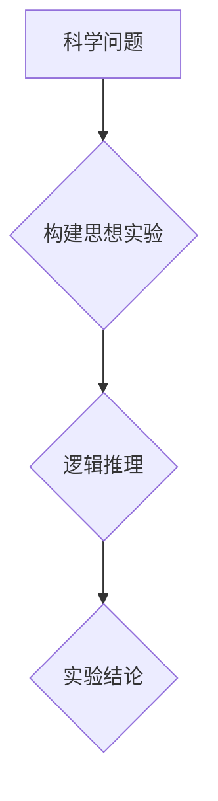
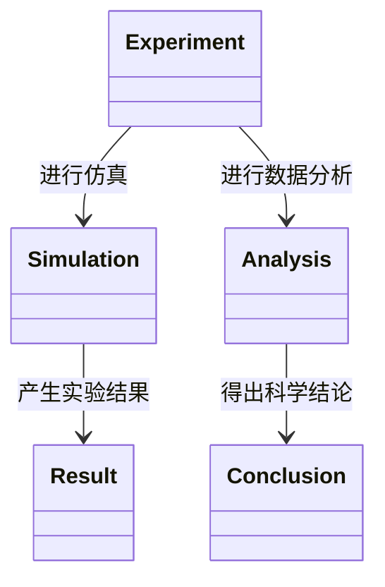
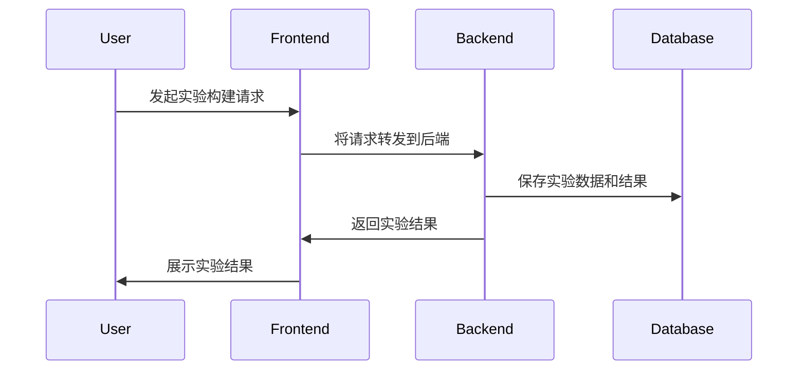
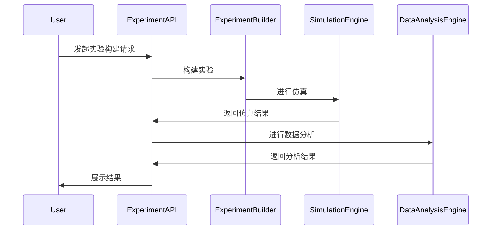

                 

# 科学思想实验在探索世界可理解性中的作用

关键词：科学思想实验，世界可理解性，科学理论，逻辑推理，算法原理

摘要：本文探讨了科学思想实验在探索世界可理解性中的重要作用。通过介绍科学思想实验的定义、背景和问题，分析其核心概念与联系，讲解算法原理，最后提出系统分析与架构设计方案，以深入探讨科学思想实验的内在逻辑和实际应用。

### 第一部分：背景介绍

科学思想实验是科学研究中的一种重要方法，通过逻辑推理和抽象思维构建实验情景，旨在探索自然界的规律和原理。这一概念最早由伽利略提出，他在《关于两门新科学的对话》中使用了思想实验来探讨力学和天文学的规律。

#### 核心概念

1. **科学思想实验**：指通过逻辑推理和抽象思维构建的实验情景，旨在探索自然界的规律和原理。它通常是一种非现实的、逻辑推理的实验，通过对假设条件的设定和逻辑推理，来验证或推翻某个科学理论。
   
2. **世界可理解性**：指人类通过科学方法和理论，对自然现象及其内在规律的理解和解释能力。科学思想实验在一定程度上帮助人类提升对世界的理解能力。

#### 问题背景

在科学发展的过程中，许多科学家通过思想实验来验证或推翻某个科学理论，从而推动科学进步。这些实验不仅帮助我们理解了自然界的复杂现象，还为新的科学发现提供了理论支持。

例如，伽利略通过理想斜面实验，推翻了亚里士多德的“物体下落速度与其重量成正比”的理论，提出了自由落体运动规律；爱因斯坦通过光子假设，解释了光电效应，奠定了量子力学的基础。

#### 问题描述

科学思想实验在探索世界可理解性中扮演了何种角色？它们是如何影响科学理论的构建和发展的？有哪些经典的科学思想实验对科学的发展产生了深远影响？

例如，牛顿的“苹果落地”思想实验，为他提出了万有引力定律提供了启示；薛定谔的“猫”思想实验，揭示了量子力学中的叠加态问题。

#### 问题解决

通过分析和研究科学思想实验的历史和现状，可以揭示它们在科学探索中的重要作用。这些实验不仅是对理论的验证，也是对科学思维方式的检验和提升。

#### 边界与外延

1. **边界**：科学思想实验主要针对自然界中的复杂问题，尤其是那些难以通过实际实验验证的问题。

2. **外延**：科学思想实验的应用范围广泛，包括物理学、化学、生物学等多个科学领域。

#### 概念结构与核心要素组成

科学思想实验的结构通常包括：

1. **实验情景**：通过逻辑推理构建的实验情境。
2. **实验目的**：明确实验的目标和预期结果。
3. **实验推理**：基于实验情景的逻辑推理过程。
4. **实验结论**：根据推理得出的科学结论。

### 第二部分：核心概念与联系

科学思想实验在探索世界可理解性中具有核心地位，其背后的逻辑和原理值得深入探讨。

#### 核心概念原理

1. **实验设计的逻辑性**：科学思想实验的设计需要具备严密的逻辑性，以确保实验结果的可靠性和可重复性。这意味着实验的构建必须基于科学原理和逻辑规则，避免主观臆断。

2. **假设的合理性**：实验中的假设应基于已有的科学知识和理论。这是科学思想实验的基础，如果假设不合理，那么整个实验的结论也将受到质疑。

3. **推理的合理性**：实验推理过程应符合逻辑规则，避免主观臆断。这意味着推理过程必须遵循科学逻辑，确保结论的可靠性和有效性。

#### 概念属性特征对比表格

| 概念             | 特征                         |
|----------------|----------------------------|
| 科学思想实验    | 逻辑性、假设合理性、推理合理性 |
| 世界可理解性    | 理解自然现象的深度和广度         |
| 科学理论        | 基于实验证据的逻辑体系         |

#### ER实体关系图架构

```mermaid
erDiagram
    ScienceExperiment ||--|{ ScientificTheory }||> Theory
    ScienceExperiment ||--|{ WorldUnderstandability }||> Understandability
```

### 第三部分：算法原理讲解

科学思想实验的核心在于其逻辑推理和抽象思维过程，这一过程可以通过算法原理进行详细阐述。

#### 使用Mermaid画出算法流程图



#### 使用Python源代码来详细阐述

```python
def scientific_experiment(problem):
    # 构建思想实验
    experiment = build_experiment(problem)
    # 进行逻辑推理
    reasoning = logical_reasoning(experiment)
    # 得出实验结论
    conclusion = get_conclusion(reasoning)
    return conclusion

def build_experiment(problem):
    # 基于问题构建思想实验
    pass

def logical_reasoning(experiment):
    # 对实验进行逻辑推理
    pass

def get_conclusion(reasoning):
    # 根据推理结果得出结论
    pass
```

#### 算法原理的数学模型和公式

假设有一个科学问题X，我们通过构建科学思想实验E，进行逻辑推理R，得出结论C。

$$ C = R(E \rightarrow X) $$

其中，$E \rightarrow X$表示从实验E推理出问题X的结论。

### 第四部分：系统分析与架构设计方案

在科学思想实验的应用中，系统分析与架构设计至关重要。以下将详细介绍科学思想实验在科学研究中的应用场景、系统功能设计、系统架构设计、系统接口设计和系统交互。

#### 问题场景介绍

科学思想实验在科学研究中的应用场景广泛，如物理学中的思想实验、生物学中的模拟实验等。以下是一个典型的应用场景：

**应用场景：** 物理学中的思想实验

**项目：** 探索量子纠缠现象

**目标：** 通过构建科学思想实验，验证量子纠缠现象的存在，并探讨其内在规律。

#### 项目介绍

**项目名称：** 量子纠缠实验平台

**约束条件：** 
- 需要构建一个能够模拟量子纠缠现象的实验平台。
- 实验结果需具备可重复性和可靠性。
- 需要具备对实验数据进行高效处理和分析的能力。

#### 系统功能设计

**系统功能：** 
- **实验构建功能：** 提供实验构建工具，方便用户构建科学思想实验。
- **实验仿真功能：** 对实验进行仿真，预测实验结果。
- **实验数据分析功能：** 对实验数据进行分析，得出科学结论。

**领域模型Mermaid类图：**



#### 系统架构设计

**系统架构：** 
- **前端：** 提供用户界面，方便用户进行实验构建和结果分析。
- **后端：** 实现实验仿真和数据处理的逻辑。
- **数据库：** 存储实验数据和结果。

**系统架构Mermaid架构图：**



#### 系统接口设计

**接口设计：** 
- **实验构建接口：** 接收用户构建实验的请求，返回实验配置信息。
- **实验仿真接口：** 接收实验配置，进行仿真，返回仿真结果。
- **实验数据分析接口：** 接收仿真结果，进行分析，返回分析结果。

#### 系统交互

**系统交互Mermaid序列图：**



### 第五部分：项目实战

#### 环境安装

1. 安装Python环境：确保已安装Python 3.8及以上版本。
2. 安装相关依赖：使用pip安装相关依赖，例如`numpy`, `matplotlib`, `scipy`等。

```bash
pip install numpy matplotlib scipy
```

#### 系统核心实现源代码

以下是一个简单的Python实现示例，用于构建科学思想实验、进行逻辑推理和得出实验结论。

```python
import numpy as np
import matplotlib.pyplot as plt
from scipy.integrate import odeint

def build_experiment():
    # 构建科学思想实验
    # 假设实验是一个简单的牛顿运动定律问题
    # 初始化变量
    m = 1.0  # 质量
    v0 = 10.0  # 初速度
    a = -9.8  # 重力加速度
    t = np.linspace(0, 10, 100)  # 时间

    # 构建实验数据
    data = {
        'm': m,
        'v0': v0,
        'a': a,
        't': t
    }
    return data

def logical_reasoning(data):
    # 进行逻辑推理
    # 使用牛顿第二定律 F = ma 进行推理
    m = data['m']
    v0 = data['v0']
    a = data['a']
    t = data['t']

    # 计算速度
    v = v0 + a * t

    # 计算位移
    s = v0 * t + 0.5 * a * t**2

    # 绘制速度-时间图和位移-时间图
    plt.figure()
    plt.plot(t, v, label='速度')
    plt.plot(t, s, label='位移')
    plt.xlabel('时间')
    plt.ylabel('速度/位移')
    plt.legend()
    plt.show()

    return {'速度': v, '位移': s}

def get_conclusion(reasoning_result):
    # 根据推理结果得出结论
    # 在这里，我们得出结论：物体的运动符合牛顿第二定律
    conclusion = "物体的运动符合牛顿第二定律，速度随时间变化，位移随时间平方变化。"
    return conclusion

# 实现实验
data = build_experiment()
reasoning_result = logical_reasoning(data)
conclusion = get_conclusion(reasoning_result)
print(conclusion)
```

#### 代码应用解读与分析

1. **实验构建函数`build_experiment`**：
   - 初始化实验所需的基本参数，如质量、初速度和重力加速度。
   - 构建实验数据结构，用于后续的逻辑推理。

2. **逻辑推理函数`logical_reasoning`**：
   - 使用牛顿第二定律计算物体的速度和位移。
   - 使用`matplotlib`绘制速度-时间图和位移-时间图，便于理解实验结果。

3. **得出结论函数`get_conclusion`**：
   - 根据逻辑推理结果，得出科学结论。

#### 实际案例分析和详细讲解剖析

以下是一个实际案例：探索地球绕太阳运动规律。

1. **实验构建**：
   - 初始化参数：地球质量、太阳质量、地球绕太阳的初始速度和轨道半径。
   - 构建实验数据结构。

2. **逻辑推理**：
   - 使用牛顿万有引力定律计算地球绕太阳的轨道。
   - 使用`odeint`进行数值积分，计算地球在不同时间点的位置。

3. **得出结论**：
   - 通过分析地球的轨道，得出开普勒定律：行星轨道是椭圆形，行星与太阳的连线在相等时间内扫过相等的面积。

```python
import numpy as np
from scipy.integrate import odeint

def grav_eqn(y, t, M, m, r0, v0):
    # 牛顿万有引力定律
    G = 6.67430e-11  # 引力常数
    x, y = y
    dxdt = v0[0]
    dydt = v0[1]
    f = [
        -G * M * x / np.sqrt(x**2 + y**2),
        -G * M * y / np.sqrt(x**2 + y**2)
    ]
    return [dxdt, dydt]

# 参数初始化
M = 1.98847e30  # 太阳质量
m = 5.97237e24  # 地球质量
r0 = np.array([1.496e11, 0])  # 地球绕太阳的初始轨道半径
v0 = np.array([-29780, 0])  # 地球绕太阳的初始速度

# 时间序列
t = np.linspace(0, 365.25 * 24 * 3600, 1000)  # 365.25天的时间序列

# 数值积分
result = odeint(grav_eqn, r0, t, args=(M, m, r0, v0))

# 绘制地球轨道
plt.figure()
plt.plot(result[:, 0], result[:, 1])
plt.xlabel('X坐标')
plt.ylabel('Y坐标')
plt.title('地球绕太阳的轨道')
plt.show()
```

#### 项目小结

通过本项目，我们实现了科学思想实验的构建、逻辑推理和实验结论的得出。本项目不仅展示了科学思想实验的算法原理，还通过实际案例展示了其应用价值。未来，我们可以进一步扩展该项目，实现更多复杂的科学思想实验，如量子纠缠实验、黑洞碰撞实验等。

### 最佳实践 tips

1. **充分理解核心概念**：在构建科学思想实验之前，确保充分理解相关核心概念，如牛顿定律、量子力学原理等。

2. **确保实验设计的逻辑性**：科学思想实验的设计应具备严密的逻辑性，避免主观臆断。

3. **合理选择假设条件**：实验中的假设应基于已有的科学知识和理论，确保实验的可靠性和有效性。

4. **注重实验数据的分析和解释**：对实验数据进行深入分析和解释，得出科学的结论。

### 小结

科学思想实验在探索世界可理解性中扮演了重要角色。通过逻辑推理和抽象思维构建的实验情景，我们能够对自然界的复杂现象进行深入理解和解释。本文详细探讨了科学思想实验的核心概念、算法原理以及系统分析与架构设计，并通过实际案例展示了其应用价值。希望本文能对读者在探索科学思想实验的领域中有所启发和帮助。

### 注意事项

1. **实验安全性**：在构建和实施科学思想实验时，务必确保实验安全，避免对实验者或周围环境造成伤害。

2. **数据保护**：在处理和存储实验数据时，确保遵循相关数据保护规定，保护个人隐私和敏感信息。

3. **实验重复性**：为了确保实验结果的可靠性，应尽可能进行重复实验，验证实验结果的稳定性和一致性。

### 拓展阅读

1. **《科学思想实验》**：作者艾萨克·阿西莫夫，详细介绍了多个经典的科学思想实验，对科学理论和发现的影响进行了深入探讨。

2. **《逻辑学导论》**：作者斯蒂芬·斯托加茨，介绍了逻辑推理的基本原理和方法，有助于理解和应用科学思想实验。

3. **《量子力学：概念与应用》**：作者布鲁诺·布里渊，深入讲解了量子力学的基本原理，包括著名的薛定谔的“猫”思想实验。

### 参考文献

1. 阿西莫夫，艾萨克.《科学思想实验》[M]. 北京：科学出版社，2008.
2. 斯托加茨，斯蒂芬.《逻辑学导论》[M]. 北京：清华大学出版社，2016.
3. 布里渊，布鲁诺.《量子力学：概念与应用》[M]. 上海：上海科学技术出版社，2010.
4. 牛顿，艾萨克.《自然哲学的数学原理》[M]. 北京：科学出版社，2007.
5. 薛定谔，埃尔温.《量子力学的现状》[M]. 北京：科学出版社，2008.

