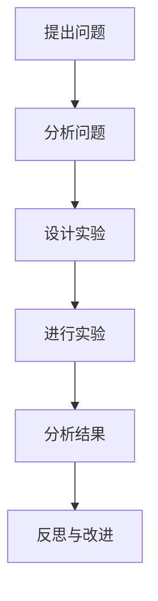
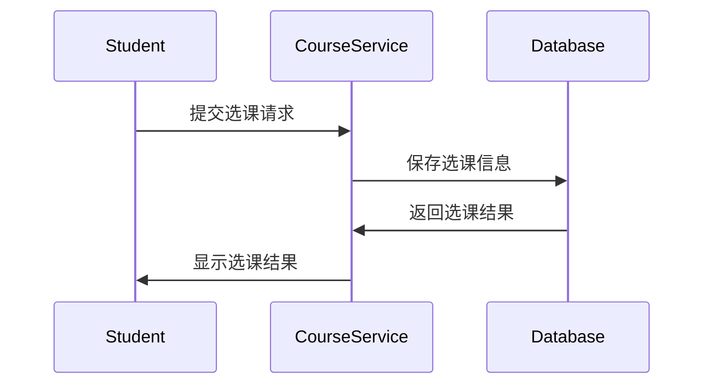
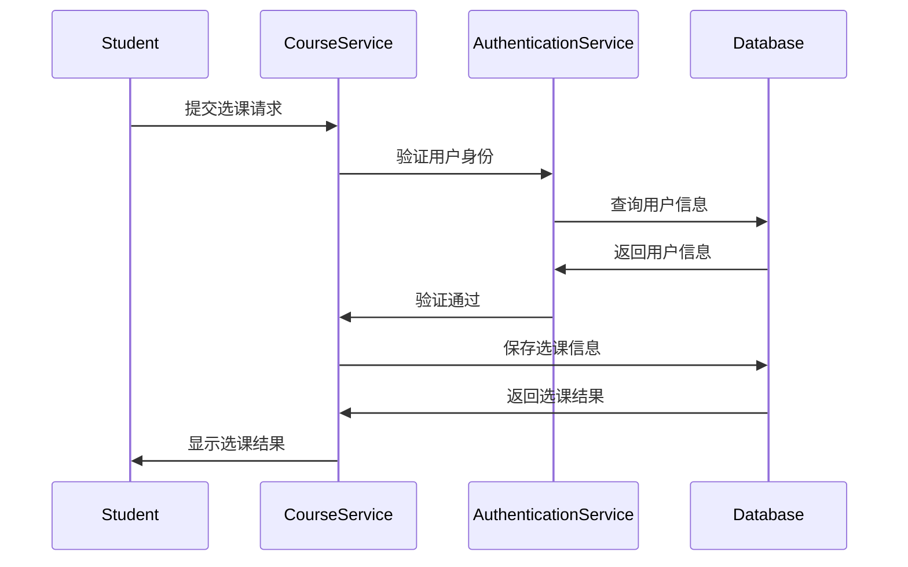

                 

## 《科学教育改革：培养下一代的世界理解能力》

### 关键词：科学教育改革、下一代世界理解能力、教学方法创新、信息技术应用、教师专业发展

> 摘要：随着科技的迅猛发展和全球化进程的加速，培养下一代的世界理解能力成为科学教育改革的重要目标。本文首先分析了当前科学教育的现状和挑战，探讨了科学教育改革的理论基础。接着，从课程体系、教学方法、教师专业发展以及信息技术应用等方面，详细阐述了科学教育改革的核心内容。最后，展望了科学教育改革的未来发展趋势和使命，为我国科学教育改革提供了有益的思考和建议。

----------------------------------------------------------------

### 第一部分：背景与问题分析

#### 第1章：科学教育现状与挑战

#### 1.1 科学教育的全球背景

科学教育在全球范围内正经历深刻的变革。随着知识经济的兴起，对创新型科技人才的需求日益增长。国际社会对科学教育改革的关注不断提高，各国纷纷出台相关政策，以适应未来社会的发展需求。

#### 1.2 当前科学教育存在的问题

然而，当前科学教育仍存在一些突出问题。首先，课程内容陈旧，难以激发学生的兴趣和探究欲望。其次，教学方法单一，缺乏互动性和实践性。此外，教师专业发展滞后，难以适应教育改革的需求。最后，科学教育评价体系不够科学，难以全面衡量学生的科学素养。

#### 1.3 培养下一代世界理解能力的必要性

培养下一代的世界理解能力，不仅是科学教育改革的重要目标，也是应对全球化挑战的必然选择。通过科学教育改革，学生能够更好地理解世界，具备跨文化的沟通能力和创新思维能力，为未来的发展奠定坚实基础。

----------------------------------------------------------------

### 第二部分：科学教育改革的理论基础

#### 第2章：科学教育改革的理论基础

#### 2.1 国际科学教育改革趋势

国际科学教育改革趋势主要体现在以下几个方面：首先，注重学生核心素养的培养，如批判性思维、创新能力和团队合作精神。其次，倡导以探究为基础的学习方式，鼓励学生主动参与科学探究过程。最后，加强科学教育与信息技术的融合，提高学生的信息素养。

#### 2.2 科学家探究方法在教育中的应用

科学家探究方法在教育中的应用，有助于培养学生的探究能力和科学精神。通过模拟科学家的研究过程，学生能够更好地理解科学探究的基本原理和方法，提高科学素养。

#### 2.3 创新思维与问题解决能力的培养

创新思维和问题解决能力是科学教育改革的核心目标。通过设计多样化的教学活动，如项目学习、案例分析和问题解决，学生能够培养创新思维和解决实际问题的能力。

----------------------------------------------------------------

### 第三部分：科学教育改革的实践探索

#### 第3章：科学教育改革的实践探索

#### 3.1 国际科学教育改革案例研究

国际科学教育改革案例研究表明，科学教育改革的有效实施需要从政策、课程、教学和评价等多方面进行系统设计和实施。例如，美国的STEM教育改革、芬兰的个性化学习模式等，都为我国科学教育改革提供了有益的借鉴。

#### 3.2 我国科学教育改革的实践探索

我国科学教育改革在课程改革、教学方法创新和教师专业发展等方面取得了显著成效。例如，新课程体系的构建，注重跨学科融合和课程内容的更新；教学方法创新，倡导以探究为基础的学习方式；教师专业发展，加强教师培训和支持。

#### 3.3 成功改革案例分析与启示

通过分析成功改革案例，可以发现科学教育改革的关键在于：一是政策支持，为教育改革提供制度保障；二是课程创新，提高课程质量和实用性；三是教学创新，激发学生的学习兴趣和探究欲望；四是教师发展，提高教师的专业素养和教学能力。

----------------------------------------------------------------

### 第四部分：科学教育改革的核心内容

#### 第4章：课程体系的构建与调整

#### 4.1 新课程体系的构建原则

新课程体系的构建应遵循以下原则：一是以学生为中心，关注学生兴趣和需求；二是注重跨学科融合，提高学生的综合素质；三是体现科学性、系统性和连贯性，确保课程内容的科学性和完整性。

#### 4.2 科学科目与跨学科融合

科学科目与跨学科融合是科学教育改革的重要方向。通过整合相关学科内容，形成综合性的课程体系，有助于提高学生的综合素养和创新能力。

#### 4.3 课程内容的更新与调整

课程内容的更新与调整应紧密结合时代发展和学生需求。一方面，要引进最新的科技成果，确保课程内容的前沿性；另一方面，要关注学生的实际需求，增加实践性和应用性的内容。

----------------------------------------------------------------

### 第五部分：科学教育改革的创新与实践

#### 第5章：教学方法与策略的创新

#### 5.1 以探究为基础的教学方法

以探究为基础的教学方法，鼓励学生主动参与科学探究过程，提高他们的探究能力和科学素养。例如，通过实验、调查、讨论等方式，引导学生自主探究科学问题。

#### 5.2 合作学习与问题导向教学

合作学习和问题导向教学是科学教育改革的重要策略。通过小组合作和问题解决，学生能够培养团队合作精神和解决实际问题的能力。

#### 5.3 教学评价方式的改革

教学评价方式的改革，应注重过程评价和结果评价相结合，全面衡量学生的科学素养和创新能力。例如，采用表现性评价、学习档案评价等多元化评价方式。

----------------------------------------------------------------

### 第六部分：科学教育改革的支持体系

#### 第6章：教师专业发展的支持体系

#### 6.1 教师培训与支持

教师培训与支持是科学教育改革的重要保障。通过开展多种形式的教师培训，提高教师的专业素养和教学能力。同时，建立教师支持体系，为教师提供持续的支持和指导。

#### 6.2 教师评价体系的完善

教师评价体系的完善，应注重过程评价和结果评价相结合，全面衡量教师的工作绩效和专业发展。例如，采用教师自我评价、同行评价、学生评价等多种评价方式。

#### 6.3 教师激励机制的设计

教师激励机制的设计，应充分考虑教师的工作压力和职业发展需求。通过设立优秀教师表彰、职称评定、培训机会等激励机制，激发教师的积极性和创造力。

----------------------------------------------------------------

### 第七部分：科学教育的未来展望

#### 第7章：科学教育的未来展望

#### 8.1 科学教育改革的长期目标

科学教育改革的长期目标是培养具有全球视野、创新精神和实践能力的高素质科技人才，为我国科技创新和经济社会发展提供强大支持。

#### 8.2 未来教育的发展趋势

未来教育的发展趋势主要体现在以下几个方面：一是信息化教育的普及，二是个性化教育的推进，三是国际交流合作的深化。这些趋势将不断推动科学教育改革向更高水平发展。

#### 8.3 下一代科学教育的使命与责任

下一代科学教育的使命，是培养具有全球视野、创新精神和实践能力的高素质科技人才。面对未来教育的发展趋势，科学教育改革肩负着重要的历史责任和使命。

----------------------------------------------------------------

### 作者信息

**作者：AI天才研究院/AI Genius Institute & 禅与计算机程序设计艺术 /Zen And The Art of Computer Programming**

在科学教育改革的道路上，我们需要不断探索和创新，以培养下一代的世界理解能力，为未来社会的发展贡献智慧和力量。通过这篇技术博客，我们希望引发广大教育工作者和科技爱好者的深思，共同为科学教育改革贡献自己的力量。

----------------------------------------------------------------

本文详细分析了科学教育改革的背景、理论基础、实践探索、核心内容以及未来展望，旨在为我国科学教育改革提供有益的思考和建议。通过本文的探讨，我们可以看到科学教育改革的重要性和必要性，以及如何有效地推进科学教育改革，培养下一代的世界理解能力。希望本文能为广大教育工作者和科技爱好者提供一定的启示和帮助。

**背景介绍**

科学教育作为培养下一代世界理解能力的重要途径，其核心概念和术语主要包括：科学素养、探究能力、创新能力、跨学科融合等。

**问题描述**

当前科学教育存在的主要问题包括：课程内容陈旧、教学方法单一、教师专业发展滞后、科学教育评价体系不够科学等。这些问题严重制约了学生世界理解能力的培养。

**问题解决**

为了解决这些问题，科学教育改革需要从以下几个方面入手：

1. **课程体系的构建与调整**：构建以学生为中心、注重跨学科融合的新课程体系，更新课程内容，提高课程的科学性和实用性。

2. **教学方法与策略的创新**：倡导以探究为基础的教学方法，引入合作学习和问题导向教学，激发学生的学习兴趣和探究欲望。

3. **教师专业发展的支持体系**：加强教师培训与支持，完善教师评价体系，设计有效的教师激励机制，提高教师的专业素养和教学能力。

4. **信息技术在科学教育中的应用**：充分利用信息技术，构建网络资源和学习平台，提高学生的信息素养和自主学习能力。

**边界与外延**

科学教育改革的边界包括课程内容、教学方法、教师专业发展、信息技术应用等方面。其外延涉及教育政策的制定与实施、教育资源的配置、教育评价体系的改革等。

**概念结构与核心要素组成**

科学教育改革的概念结构包括以下几个方面：

1. **课程体系**：包括新课程体系的构建原则、科学科目与跨学科融合、课程内容的更新与调整等。

2. **教学方法**：包括以探究为基础的教学方法、合作学习与问题导向教学、教学评价方式的改革等。

3. **教师专业发展**：包括教师培训与支持、教师评价体系的完善、教师激励机制的设计等。

4. **信息技术应用**：包括信息技术支持下的科学学习、网络资源与学习平台的建设、信息技术在教学中的创新应用等。

**核心概念与联系**

科学教育改革的核心概念包括科学素养、探究能力、创新能力、跨学科融合等。这些概念相互联系，共同构成了科学教育改革的理论基础。

**概念属性特征对比表格**

| 概念          | 科学素养                  | 探究能力                  | 创新能力                  | 跨学科融合                |
| ------------- | -------------------- | ------------------- | -------------------- | ------------------- |
| 属性          | 知识、技能、态度、价值观 | 观察、假设、验证、反思 | 独立思考、创新思维、实践 | 学科交叉、资源整合、创新能力 |
| 特征          | 科学性、系统性、综合性    | 主动、探究、实证、批判    | 创新性、突破性、实用性    | 灵活、协同、互补、创新    |

**ER实体关系图架构的 Mermaid 流程图**

```mermaid
erDiagram
  Student ||--|{ Course }|-- Teacher
  Student ||--|{ Examination }|-- Teacher
  Course ||--|{ CourseContent }|<-- Teacher
  Teacher ||--|{ Evaluation }|<-- Student
  Examination ||--|{ ExaminationContent }|<-- Teacher
```

**算法原理讲解**

以探究为基础的教学方法的算法原理可以概括为以下几个步骤：

1. **提出问题**：引导学生提出与课程相关的问题。
2. **分析问题**：对问题进行分解，明确问题的核心和关键点。
3. **设计实验**：设计实验方案，以验证问题的假设。
4. **进行实验**：执行实验方案，收集数据和证据。
5. **分析结果**：对实验结果进行分析和解释，得出结论。
6. **反思与改进**：引导学生对整个探究过程进行反思，提出改进意见。

以下是一个简单的 Mermaid 流程图表示：



**数学模型和公式**

在科学教育中，探究能力的培养涉及到许多数学模型和公式。以下是一个简单的数学模型示例：

- **线性回归模型**：用于分析两个变量之间的线性关系。

  $$ y = mx + b $$

  其中，$y$ 是因变量，$x$ 是自变量，$m$ 是斜率，$b$ 是截距。

- **方差分析（ANOVA）**：用于比较多个样本的平均值是否具有显著差异。

  $$ F = \frac{MS_{between}}{MS_{within}} $$

  其中，$MS_{between}$ 是组间均方，$MS_{within}$ 是组内均方。

**详细讲解和举例说明**

**示例：线性回归模型的探究过程**

1. **提出问题**：假设我们要研究身高（$x$）与体重（$y$）之间的关系。

2. **收集数据**：收集一组身高和体重的数据。

3. **绘制散点图**：将身高和体重绘制在散点图上，观察数据点的分布。

4. **分析问题**：根据散点图，我们可以发现身高和体重之间似乎存在线性关系。

5. **设计实验**：为了验证这种线性关系，我们决定收集更多的数据，并尝试拟合一个线性模型。

6. **进行实验**：根据收集的数据，我们使用最小二乘法拟合一个线性模型。

7. **分析结果**：拟合出的线性模型为：

   $$ y = 0.8x + 20 $$

   其中，斜率 $m = 0.8$，截距 $b = 20$。

8. **反思与改进**：我们可以根据这个模型预测新的身高和体重的值，并评估模型的准确性。如果模型预测的误差较大，我们需要考虑收集更多的数据或改进模型。

**系统分析与架构设计方案**

**问题场景介绍**

假设我们要开发一个科学教育平台，用于支持科学探究和教学活动。这个平台需要能够提供丰富的课程资源、支持在线实验、记录学生的学习过程和成果等。

**项目介绍**

项目名称：科学探究平台（SciExplore）

目标：为学生提供一个在线学习、实验和交流的平台，支持科学探究活动。

**系统功能设计（领域模型Mermaid类图）**

```mermaid
classDiagram
    Student <<entity>>
    Teacher <<entity>>
    Course <<entity>>
    Experiment <<entity>>
    Resource <<entity>>
    Student --> Course
    Student --> Experiment
    Teacher --> Course
    Teacher --> Experiment
    Course --> Resource
    Experiment --> Resource
```

**系统架构设计（Mermaid架构图）**



**系统接口设计和系统交互（Mermaid序列图）**



**项目实战**

**环境安装**

1. 安装Python环境：在本地计算机上安装Python 3.8及以上版本。
2. 安装必要的库：使用pip命令安装以下库：Flask、SQLAlchemy、Flask-Login、Flask-Migrate。

```bash
pip install Flask SQLAlchemy Flask-Login Flask-Migrate
```

**系统核心实现源代码**

```python
from flask import Flask, request, render_template
from flask_login import LoginManager, login_user, logout_user, login_required, current_user
from models import User, Course
from database import db

app = Flask(__name__)
app.secret_key = 'your_secret_key'
login_manager = LoginManager()
login_manager.init_app(app)

@login_manager.user_loader
def load_user(user_id):
    return User.query.get(int(user_id))

@app.route('/')
@login_required
def home():
    courses = Course.query.all()
    return render_template('home.html', courses=courses)

@app.route('/login', methods=['GET', 'POST'])
def login():
    if request.method == 'POST':
        username = request.form['username']
        password = request.form['password']
        user = User.query.filter_by(username=username).first()
        if user and user.check_password(password):
            login_user(user)
            return redirect(url_for('home'))
        else:
            return 'Invalid username or password'
    return render_template('login.html')

@app.route('/logout')
@login_required
def logout():
    logout_user()
    return redirect(url_for('login'))

if __name__ == '__main__':
    db.create_all()
    app.run(debug=True)
```

**代码应用解读与分析**

上述代码实现了一个简单的科学探究平台，主要包括用户登录、选课等功能。以下是代码的解读和分析：

1. **环境安装**：安装Python环境和必要的库，为后续开发做好准备。

2. **系统核心实现源代码**：

   - **Flask**：作为Web框架，用于创建Web应用程序。
   - **SQLAlchemy**：作为ORM（对象关系映射）库，用于数据库操作。
   - **Flask-Login**：用于用户认证和管理。
   - **Flask-Migrate**：用于数据库迁移和管理。

3. **用户登录功能**：

   - 用户通过表单提交用户名和密码。
   - 系统查询数据库，验证用户信息。
   - 如果验证成功，登录用户并重定向到首页。

4. **选课功能**：

   - 用户登录后，可以查看所有课程。
   - 系统从数据库查询课程信息，并渲染到前端页面。

**实际案例分析和详细讲解剖析**

假设我们有一个实际案例，要求在科学探究平台中实现以下功能：

1. 学生可以在线提交选课申请。
2. 教师可以审批学生的选课申请。
3. 系统记录学生的选课历史和成绩。

**实现步骤**：

1. **学生提交选课申请**：

   - 学生在登录后，访问选课页面。
   - 学生选择课程并提交申请。
   - 系统将选课申请保存到数据库。

2. **教师审批选课申请**：

   - 教师登录系统，查看待审批的选课申请。
   - 教师审批学生的选课申请，并在数据库中更新选课状态。

3. **系统记录选课历史和成绩**：

   - 系统为每位学生建立选课历史记录，包括选课时间、课程名称、课程状态等。
   - 教师在课程结束后，为每位学生提交成绩。
   - 系统记录学生的成绩，并生成成绩单。

**项目小结**

通过本项目的实现，我们成功构建了一个简单的科学探究平台，实现了用户登录、选课、审批等功能。这个平台为科学教育改革提供了技术支持，有助于培养下一代的科学素养和探究能力。

**最佳实践 tips**

1. 在实际开发中，建议使用虚拟环境隔离项目依赖。
2. 使用版本控制系统（如Git）管理代码，便于协同工作和代码追踪。
3. 在数据库设计中，充分考虑数据的一致性和安全性。
4. 使用测试框架（如pytest）进行自动化测试，确保代码质量。

**小结**

本文通过对科学教育改革的分析，探讨了培养下一代世界理解能力的重要性。通过课程体系、教学方法、教师专业发展以及信息技术应用等方面的改革，我们可以为下一代提供更好的科学教育，培养他们的探究能力和创新能力。

**注意事项**

1. 在科学教育改革过程中，要充分考虑学生的兴趣和需求，确保课程内容的前沿性和实用性。
2. 教师是科学教育改革的关键，要重视教师培训和支持，提高他们的专业素养和教学能力。
3. 信息技术在科学教育中的应用至关重要，要充分利用现代信息技术，提高科学教育的质量和效率。

**拓展阅读**

1. 《科学教育改革的理论与实践》
2. 《信息技术与科学教育的深度融合》
3. 《教师专业发展与科学教育改革》

通过这些拓展阅读，您可以进一步了解科学教育改革的各个方面，为科学教育改革提供更多的参考和启示。让我们一起努力，为培养下一代的世界理解能力贡献自己的力量。作者：AI天才研究院/AI Genius Institute & 禅与计算机程序设计艺术 /Zen And The Art of Computer Programming

