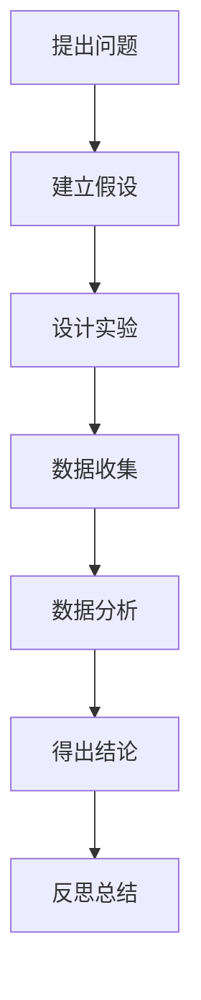
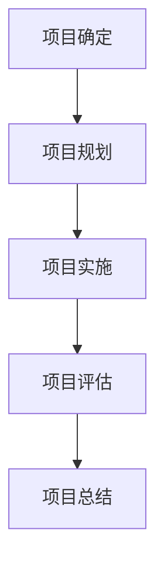

                 

# 科学教育的创新方法：培养下一代的世界理解能力

## 关键词

- 科学教育
- 创新方法
- 世界理解能力
- 探究式学习
- 项目式学习
- 教育评估

## 摘要

随着科技的飞速发展，科学教育在培养下一代世界理解能力方面面临着新的挑战。本文旨在探讨科学教育的创新方法，分析当前科学教育的问题与挑战，并详细讲解探究式学习和项目式学习这两种创新教学方法。同时，通过实践案例分析，评估这些方法的实际效果，并展望科学教育的未来发展趋势。

## 第一部分：科学教育背景与挑战

### 第1章：科学教育的现状与问题

#### 1.1.1 科学教育的定义与意义

科学教育是指通过系统化的教学手段，培养学生的科学素养、科学方法和科学精神。科学教育不仅传授科学知识，更注重培养学生的探究能力和创新思维。

#### 1.1.2 当前科学教育面临的挑战

1. 教学内容与现实脱节
2. 教学方法单一，缺乏互动性
3. 科教资源分配不均
4. 学科分割过细，缺乏跨学科教育

#### 1.1.3 科学教育的目标与期望

科学教育的目标不仅是传授知识，更重要的是培养学生的探究精神、批判思维和创新能力。期望学生能够通过科学教育，形成对世界的全面理解和独立思考的能力。

### 第2章：世界理解能力的培养

#### 2.1.1 世界理解能力的概念

世界理解能力是指学生能够运用科学知识和方法，对周围的世界进行观察、分析和解释的能力。它包括科学知识、科学方法和科学精神三个层面。

#### 2.1.2 培养世界理解能力的重要性

世界理解能力是现代社会公民必备的基本素养，它不仅有助于学生应对未来的挑战，还能促进社会的进步与发展。

#### 2.1.3 跨学科教育方法在培养世界理解能力中的应用

跨学科教育方法通过整合不同学科的知识和技能，帮助学生形成系统的世界理解能力。例如，通过科学、数学、工程和社会科学的综合应用，解决实际生活中的问题。

## 第二部分：科学教育创新方法

### 第3章：探究式学习

#### 3.1.1 探究式学习的原理

探究式学习是一种以学生为中心的学习方法，强调学生的主动探究和自主学习。它鼓励学生提出问题、进行实验、分析数据和得出结论。

#### 3.1.2 探究式学习的过程

探究式学习过程通常包括：问题提出、假设建立、实验设计、数据收集、数据分析、结论得出和反思总结。

#### 3.1.3 探究式学习在实际教学中的应用

在实际教学中，教师可以设计开放性的探究项目，引导学生主动参与，培养他们的探究能力和创新思维。

### 第4章：项目式学习

#### 4.1.1 项目式学习的原理

项目式学习是一种以项目为导向的学习方法，通过实际项目的开展，将知识、技能和态度有机地结合起来。

#### 4.1.2 项目式学习的实施步骤

项目式学习通常包括：项目确定、项目规划、项目实施、项目评估和项目总结。

#### 4.1.3 项目式学习的案例分析

以某中学的“校园垃圾分类项目”为例，分析项目式学习的具体实施过程和效果。

## 第三部分：实践案例分析

### 第5章：科学教育创新方法的应用实例

#### 5.1.1 成功教学实践案例

通过分析多个成功教学实践案例，探讨探究式学习和项目式学习在实际教学中的应用效果。

#### 5.1.2 创新方法在课堂中的应用

分析创新方法在课堂中的应用情况，包括教学设计、教学方法、学生学习效果等方面的具体表现。

#### 5.1.3 教师角色与能力培养

探讨在创新教育方法下，教师角色的转变以及教师所需具备的能力和素养。

## 第四部分：评估与反思

### 第6章：科学教育创新方法的评估与效果分析

#### 6.1.1 教育创新方法的评估指标

从学生成绩、学习兴趣、创新能力、问题解决能力等多个维度，设定评估指标。

#### 6.1.2 教育效果的数据分析

通过收集和分析数据，评估科学教育创新方法的实际效果。

#### 6.1.3 创新方法的持续改进

根据评估结果，提出创新方法的改进策略，实现科学教育的持续发展。

## 第五部分：未来展望

### 第7章：科学教育的发展趋势与未来方向

#### 7.1.1 科技进步对科学教育的影响

探讨科技进步，特别是人工智能、大数据等新兴技术对科学教育的影响。

#### 7.1.2 教育创新的未来方向

分析未来科学教育的发展方向，包括教育模式、教学方法、教育内容等方面的创新。

#### 7.1.3 科教融合的挑战与机遇

探讨科教融合的挑战与机遇，为科学教育创新提供新的思路和方向。

## 作者信息

作者：AI天才研究院/AI Genius Institute & 禅与计算机程序设计艺术 /Zen And The Art of Computer Programming

[返回目录](#科学教育的创新方法培养下一代的世界理解能力) ### 第1章：科学教育的现状与问题

#### 1.1.1 科学教育的定义与意义

科学教育是指通过系统化的教学过程，旨在培养学生的科学素养、科学方法和科学精神。科学教育不仅仅是传授科学知识，更重要的是培养学生的探究精神、批判思维和创新能力。科学教育在培养学生的世界观、价值观和人生观方面具有重要作用。通过科学教育，学生能够更好地理解自然和社会现象，形成对世界的全面认识和独立思考的能力。

科学教育的重要性体现在以下几个方面：

1. **培养科学素养**：科学教育能够帮助学生建立起科学的思维方式和方法论，提高他们的科学素养。这不仅有助于学生在学术领域取得更好的成绩，还能提高他们在日常生活和工作中的问题解决能力。

2. **促进创新思维**：科学教育鼓励学生通过探究和实验来获取知识，这种过程有助于培养学生的创新思维和创造力。创新思维是现代社会发展的重要动力，科学教育在这方面具有不可替代的作用。

3. **塑造正确价值观**：科学教育通过传授科学知识和科学方法，能够帮助学生树立正确的世界观和价值观。科学教育的目的是让学生认识到科学的重要性，培养他们对科学的尊重和热爱，从而在个人和社会层面产生积极影响。

#### 1.1.2 当前科学教育面临的挑战

尽管科学教育具有重要意义，但当前的科学教育仍面临着一系列挑战，这些挑战影响了科学教育的效果和质量。

1. **教学内容与现实脱节**：许多科学教材和课程内容仍然过于理论化，缺乏与实际生活的联系。这种情况下，学生往往难以将所学知识应用到实际生活中，降低了学习兴趣和效果。

2. **教学方法单一，缺乏互动性**：传统的科学教育方法大多采用“灌输式”教学，教师讲、学生听，缺乏互动和参与。这种教学方法难以激发学生的学习兴趣和主动性，影响了教学效果。

3. **科教资源分配不均**：在一些地区，科学教育资源分配不均，学校硬件设施、师资力量等存在较大差异。这导致一些学生难以获得优质科学教育，影响了他们的成长和发展。

4. **学科分割过细，缺乏跨学科教育**：科学教育在学科设置上往往过于细分，导致学生只专注于某一学科领域，忽视了跨学科知识的整合和应用。这种情况下，学生难以形成系统的世界观和理解能力。

#### 1.1.3 科学教育的目标与期望

科学教育的目标不仅仅是传授科学知识，更重要的是培养学生的科学素养、创新能力和独立思考的能力。具体来说，科学教育的目标包括：

1. **培养学生的科学素养**：通过科学教育，使学生掌握基本的科学知识和科学方法，培养他们的科学思维和科学态度。

2. **提高学生的创新能力**：通过探究和实验，培养学生的创新能力，使他们能够运用科学知识和方法解决实际问题。

3. **培养学生的独立思考能力**：鼓励学生通过自主学习、讨论和思考，形成独立思考和判断的能力。

4. **培养学生的跨学科能力**：通过跨学科教育，使学生能够整合不同学科的知识和技能，形成系统的世界观和理解能力。

科学教育的期望是培养具有全面素养、创新能力和独立思考能力的人才，为他们的未来发展奠定坚实基础。

### 总结

科学教育在培养下一代的世界理解能力方面具有重要作用。然而，当前的科学教育面临着诸多挑战，需要通过创新方法来改进和提高教育质量。在接下来的章节中，我们将探讨科学教育的创新方法，包括探究式学习和项目式学习，以及如何在实际教学中应用这些方法，以期提高科学教育的效果和培养学生的世界理解能力。 ### 第2章：世界理解能力的培养

#### 2.1.1 世界理解能力的概念

世界理解能力是指个体运用科学知识和科学方法，对自然现象和社会现象进行观察、分析、解释和预测的能力。这种能力不仅包括对事实和现象的认知，还涉及对现象之间关系的理解，以及对这些现象在更大背景下的意义和价值的判断。世界理解能力是一个多维度的概念，它包括以下几个关键要素：

1. **科学知识**：个体必须掌握一定的科学基础知识，包括自然科学、社会科学和人文科学的基本概念、原理和理论。

2. **科学方法**：个体需要了解科学研究的方法和过程，包括观察、假设、实验、数据分析等步骤，以及如何应用这些方法来解决实际问题。

3. **批判性思维**：个体应具备批判性思维能力，能够对信息进行筛选、分析和评估，识别逻辑谬误和偏见，从而形成独立的判断。

4. **跨学科整合**：世界理解能力强调知识的整合和跨学科应用，学生需要能够将不同学科的知识和技能结合起来，解决复杂的问题。

5. **实践应用**：学生需要将所学的知识和技能应用于实际情境中，解决现实生活中的问题，从而增强对世界的深刻理解和实际操作能力。

#### 2.1.2 培养世界理解能力的重要性

培养世界理解能力对于个体和社会具有重要意义。首先，世界理解能力是现代公民必备的基本素养，它有助于学生更好地适应复杂多变的社会环境，提高他们的综合素质。其次，具备世界理解能力的学生能够更加全面和深刻地理解自然和社会现象，从而在面对挑战和危机时能够做出更加明智和有效的决策。

此外，培养世界理解能力还有助于：

1. **促进创新思维**：通过培养世界理解能力，学生能够激发他们的创新思维和创造力，为科学技术的进步和社会的发展提供源源不断的动力。

2. **提高问题解决能力**：具备世界理解能力的学生能够更有效地识别和解决问题，提高他们在学术和职业生涯中的竞争力。

3. **促进跨学科合作**：跨学科整合是培养世界理解能力的重要途径，它能够促进学生之间的合作，培养他们的团队协作能力和沟通能力。

4. **提升社会责任感**：通过世界理解能力的培养，学生能够更加深刻地认识到自己在社会中的角色和责任，提高他们的社会责任感和公民意识。

#### 2.1.3 跨学科教育方法在培养世界理解能力中的应用

跨学科教育方法是通过整合不同学科的知识和技能，帮助学生形成系统的世界观和理解能力。以下是一些具体的跨学科教育方法及其在培养世界理解能力中的应用：

1. **探究式学习**：探究式学习强调学生的主动探究和自主学习，通过提出问题、设计实验、分析数据和得出结论的过程，培养学生的科学思维和批判性思维。例如，在一个探究项目中，学生可能需要运用物理学、化学和生物学等不同学科的知识来解释自然现象。

2. **项目式学习**：项目式学习通过实际项目的开展，将不同学科的知识和技能结合起来，解决实际问题。例如，一个关于“可持续发展”的项目可能需要学生运用地理学、环境科学、经济学等多学科知识，提出解决方案并评估其可行性。

3. **主题式学习**：主题式学习围绕一个特定的主题，整合不同学科的内容，进行深入学习和探讨。例如，以“气候变化”为主题，可以整合物理学、化学、地理学、环境科学等多学科知识，探讨其成因、影响和应对措施。

4. **跨学科工作坊**：跨学科工作坊是通过团队合作的方式，让学生在不同学科领域中进行深入交流和合作，解决复杂问题。这种工作坊通常需要多学科教师的参与，共同设计和指导项目。

通过跨学科教育方法，学生能够在实践中将不同学科的知识和技能结合起来，形成系统的世界观和理解能力，从而更好地应对未来的挑战。

### 总结

世界理解能力的培养是科学教育的核心目标之一。通过探究式学习和项目式学习等跨学科教育方法，学生能够在实践中培养科学思维、批判性思维和跨学科整合能力，提高他们对世界的深刻理解和实际操作能力。在接下来的章节中，我们将进一步探讨科学教育的创新方法，以及这些方法在实际教学中的应用效果和评估。这些探索将为提升科学教育的质量和培养学生的世界理解能力提供有力支持。 ### 第3章：探究式学习

#### 3.1.1 探究式学习的原理

探究式学习（Inquiry-based Learning）是一种以学生为中心的教学方法，强调学生的主动探究和自主学习。其核心原理是通过引导学生提出问题、进行实验、收集和分析数据，最终得出结论。探究式学习的目的是培养学生的科学思维、批判性思维和解决问题的能力。

探究式学习的过程通常包括以下几个步骤：

1. **提出问题**：学生基于自己的好奇心和兴趣，提出需要解答的问题。

2. **假设建立**：学生在提出问题的基础上，根据自己的知识和经验，提出可能的假设。

3. **设计实验**：学生设计实验方案，以验证或推翻他们的假设。

4. **数据收集**：学生进行实验，收集相关的数据和信息。

5. **数据分析**：学生分析收集到的数据，以支持或反驳他们的假设。

6. **得出结论**：学生根据数据分析的结果，得出结论并反思整个过程。

7. **反思总结**：学生总结整个探究过程，反思自己的学习方法和思考过程。

#### 3.1.2 探究式学习的过程

探究式学习的过程可以分为以下几个阶段：

1. **准备阶段**：在这一阶段，教师为学生提供必要的背景知识和材料，引导学生提出问题。教师的作用是激发学生的好奇心，而不是直接提供答案。

2. **探究阶段**：在这一阶段，学生自主进行实验和调查，收集数据。教师应提供支持和指导，帮助学生克服遇到的困难。

3. **分析阶段**：在这一阶段，学生分析收集到的数据，形成自己的观点和结论。教师应鼓励学生进行批判性思考，不仅要接受事实，还要对事实进行解释和评估。

4. **展示阶段**：在这一阶段，学生展示他们的研究成果，与同学和教师分享。这有助于学生获得反馈，进一步深化对问题的理解。

5. **总结阶段**：在这一阶段，学生总结整个探究过程，反思自己的学习方法和思考过程。教师应鼓励学生从探究过程中学习，而不是仅仅关注结果。

#### 3.1.3 探究式学习在实际教学中的应用

在实际教学中，探究式学习可以通过以下几种方式得到应用：

1. **项目式学习**：教师设计一个长期的项目，让学生在项目中进行探究。这种项目可以是跨学科的，也可以是针对某个特定问题的深入探究。

2. **问题解决活动**：教师提供一些实际问题，让学生通过探究来解决问题。这种方法有助于学生将所学知识应用到实际情境中。

3. **实验和研究**：教师提供实验室或研究设施，让学生进行科学实验或研究。这种方法有助于学生深入理解科学原理和方法。

4. **讨论和辩论**：教师组织学生进行讨论和辩论，鼓励他们提出自己的观点，并学会听取和反驳他人的观点。这种方法有助于培养学生的批判性思维和沟通能力。

#### 成功案例分析

以下是一个关于探究式学习的成功案例分析：

**案例：中学生“气候变化”探究项目**

在某中学，教师设计了一个关于气候变化的探究项目。项目分为以下几个阶段：

1. **提出问题**：学生提出关于气候变化的问题，如“为什么全球气候变暖？”“人类活动对气候变化有何影响？”等。

2. **假设建立**：学生根据自己的知识和经验，提出可能的假设，如“工业化是气候变化的主要原因”或“植被覆盖减少导致了气候变化”。

3. **设计实验**：学生设计实验方案，通过模拟实验来验证或反驳他们的假设。例如，学生可能会设计一个模拟大气中二氧化碳浓度增加的实验，观察植物生长的变化。

4. **数据收集**：学生进行实验，收集植物生长数据，并记录实验过程中的各种变量。

5. **数据分析**：学生分析实验数据，评估不同变量对植物生长的影响，并尝试解释这些现象。

6. **得出结论**：学生根据实验数据得出结论，如“二氧化碳浓度增加对植物生长有显著影响”，“植被覆盖减少加剧了气候变化”。

7. **反思总结**：学生在总结整个探究过程时，反思自己的学习方法和思考过程，并认识到科学探究需要不断质疑和修正。

通过这个探究项目，学生不仅学到了关于气候变化的知识，还培养了科学思维和批判性思维。他们学会了如何提出问题、设计实验、收集和分析数据，以及如何从探究过程中学习。

### 总结

探究式学习是一种以学生为中心的教学方法，通过引导学生主动探究和自主学习，培养学生的科学思维、批判性思维和解决问题的能力。在实际教学中，教师可以通过设计项目、问题解决活动、实验和研究等方式，有效地应用探究式学习。成功案例分析表明，探究式学习不仅有助于学生掌握科学知识，还能提高他们的综合素质和创新能力。在接下来的章节中，我们将继续探讨科学教育的其他创新方法，以及如何评估这些方法的实际效果。这些探讨将为科学教育的持续改进提供有力支持。 ### 第4章：项目式学习

#### 4.1.1 项目式学习的原理

项目式学习（Project-based Learning, PBL）是一种以学生为中心的教学方法，通过让学生参与实际项目的开展，实现学习目标。项目式学习强调学生的自主探究、合作学习和应用能力，旨在通过实践过程培养学生的创新思维、问题解决能力和团队协作能力。

项目式学习的核心原理包括以下几个方面：

1. **学生主导**：项目式学习强调学生的主体地位，学生是项目的设计者和执行者，教师则充当指导者和支持者的角色。

2. **问题导向**：项目式学习以实际问题为导向，鼓励学生提出问题、分析问题并寻找解决方案。

3. **过程导向**：项目式学习注重学习过程而非仅仅关注结果，鼓励学生在项目过程中进行反思和评估，从而不断改进自己的学习和思考方法。

4. **跨学科整合**：项目式学习往往涉及多个学科的知识和技能，鼓励学生将不同学科的知识结合起来，解决复杂的问题。

5. **应用实践**：项目式学习强调将知识应用于实际情境中，学生通过实际操作和实践，加深对知识的理解和应用能力。

#### 4.1.2 项目式学习的实施步骤

项目式学习的实施通常包括以下几个步骤：

1. **项目确定**：教师根据教学目标和学生的兴趣，选择一个具有挑战性和实际意义的项目主题。

2. **项目规划**：教师和学生在项目开始前，共同制定项目计划，明确项目目标、时间表和资源需求。

3. **项目实施**：学生在教师的指导下，自主开展项目工作，进行问题调研、资料收集、实验操作等。

4. **项目评估**：教师和学生对项目过程和成果进行评估，讨论项目的成功和不足，提出改进建议。

5. **项目总结**：学生撰写项目报告或进行项目展示，总结项目过程和收获，反思学习经验和教训。

#### 4.1.3 项目式学习的案例分析

以下是一个关于项目式学习的成功案例分析：

**案例：高中“可持续发展城市”项目**

在某高中，教师设计了一个“可持续发展城市”项目，旨在让学生通过项目实践，理解可持续发展的重要性和实施策略。

1. **项目确定**：项目主题为“构建一个可持续发展的城市”，学生需要设计和规划一个城市，考虑城市的能源、交通、水资源和环境等方面。

2. **项目规划**：教师和学生一起制定项目计划，明确项目目标、时间表和所需资源。项目计划包括以下几个阶段：
   - 阶段一：研究可持续发展的概念和原则。
   - 阶段二：收集和分析城市可持续发展的案例和资料。
   - 阶段三：设计城市规划方案，包括能源、交通、水资源和环境等方面。
   - 阶段四：评估和改进城市规划方案。

3. **项目实施**：学生在教师和专家的指导下，开展以下工作：
   - 进行文献调研，了解可持续发展的相关理论和实践。
   - 收集和分析国内外城市的可持续发展案例。
   - 设计城市规划方案，包括交通系统、能源利用、水资源管理、环境保护等方面。
   - 制作城市规划模型，展示设计方案。

4. **项目评估**：教师和学生通过以下方式评估项目成果：
   - 学生展示自己的城市规划方案，进行小组讨论和评价。
   - 教师根据学生的工作表现和项目报告，给予评价和建议。
   - 学生进行自我反思和同伴评价，总结项目过程中的经验和教训。

5. **项目总结**：学生撰写项目报告，总结项目过程和收获，讨论项目中的成功经验和不足，并提出改进建议。

通过这个项目，学生不仅学到了关于可持续发展的知识和技能，还培养了团队合作能力和创新能力。他们学会了如何将理论应用于实践，解决实际问题，并为未来的可持续发展贡献自己的智慧和力量。

### 总结

项目式学习是一种有效的教学策略，通过让学生参与实际项目的开展，培养学生的创新思维、问题解决能力和团队合作能力。在实际教学中，教师可以根据教学目标和学生的兴趣，设计具有挑战性和实际意义的项目。成功案例分析表明，项目式学习能够激发学生的学习兴趣，提高他们的实践能力和综合素质。在接下来的章节中，我们将继续探讨科学教育的其他创新方法，以及如何评估这些方法的实际效果。这些探讨将为科学教育的持续改进提供有力支持。 ### 第5章：科学教育创新方法的应用实例

#### 5.1.1 成功教学实践案例

在本章中，我们将探讨几个成功的教学实践案例，这些案例展示了探究式学习和项目式学习在科学教育中的应用及其对学生发展产生的积极影响。

**案例一：小学“水资源保护”探究项目**

在一个小学，教师设计了一个关于水资源保护的探究项目。学生们首先通过调查了解家乡的水资源现状，然后通过实验和数据分析，探讨如何有效地保护水资源。学生们参与了从问题提出、实验设计、数据收集到结果分析的全过程。在项目结束后，学生们不仅学到了关于水资源保护的知识，还增强了他们的环保意识和责任感。

**案例二：初中“气候变化与生物多样性”项目**

在某初中，教师组织了一个关于气候变化与生物多样性的项目。学生通过研究气候变化的成因和影响，了解生物多样性的重要性。项目包括实地考察、数据分析、文献调研和模型构建等多个环节。学生们在项目中学会了如何收集和分析数据，如何撰写科学论文，并培养了批判性思维和创新能力。

**案例三：高中“智能城市”项目**

在一个高中的“智能城市”项目中，学生们被分为多个小组，每个小组负责城市的一个方面，如交通、能源、环境等。学生们需要设计一个智能城市的规划方案，并利用计算机编程和数据分析工具来实现这一方案。该项目不仅涉及多学科知识的应用，还要求学生们具备团队合作能力和项目管理能力。

#### 5.1.2 创新方法在课堂中的应用

在课堂中，探究式学习和项目式学习可以通过以下方式得到有效应用：

1. **课前准备**：教师提前设计好探究项目和项目任务，明确学习目标和评价标准，并向学生介绍项目的基本内容和要求。

2. **课堂实施**：教师在课堂上引导学生进行探究和项目活动，提供必要的指导和支持，确保学生能够顺利完成项目任务。

3. **课后延伸**：教师可以设计课后作业或扩展项目，让学生继续深入研究和思考，促进知识的巩固和应用。

4. **评价与反馈**：教师通过项目展示、口头反馈和书面评价，对学生进行全面的评价，并给予改进建议。

#### 5.1.3 教师角色与能力培养

在创新教育方法中，教师扮演着至关重要的角色。教师需要具备以下能力和素养：

1. **课程设计能力**：教师需要能够设计具有挑战性和实际意义的项目和探究活动，确保学生能够通过这些活动实现学习目标。

2. **指导和支持能力**：教师在项目实施过程中，需要提供有效的指导和帮助，帮助学生克服困难，确保项目顺利进行。

3. **评价和反馈能力**：教师需要能够对学生的项目成果进行全面的评价，并提供具体的反馈，帮助学生了解自己的优势和不足。

4. **持续学习和发展能力**：教师需要不断更新自己的知识储备和教育理念，跟上科技和教育的发展趋势，以更好地应对教学中的挑战。

为了培养教师的这些能力，学校可以提供以下支持：

1. **专业培训**：组织教师参加专业的培训课程，学习最新的教育理论和教学方法。

2. **教学研讨会**：定期举办教学研讨会，让教师分享教学经验和成功案例，互相学习和借鉴。

3. **教育资源**：提供丰富的教育资源，如教学工具、教学软件和参考书籍，帮助教师更好地设计教学内容和活动。

4. **科研支持**：鼓励教师参与教育科研，通过研究和实践，提升教学能力和专业素养。

### 总结

科学教育创新方法的应用实例展示了探究式学习和项目式学习在课堂中的成功实践，这些方法不仅提高了学生的学习兴趣和参与度，还培养了他们的探究能力、创新能力、团队合作能力和问题解决能力。教师在这一过程中扮演着关键角色，需要不断提升自己的专业能力和素养。通过有效的课程设计和指导，教师可以激发学生的学习热情，帮助他们形成系统的世界观和理解能力，为他们的未来发展奠定坚实基础。在接下来的章节中，我们将进一步探讨科学教育创新方法的评估与效果分析，为科学教育的持续改进提供依据。 ### 第6章：科学教育创新方法的评估与效果分析

#### 6.1.1 教育创新方法的评估指标

为了全面评估科学教育创新方法的效果，我们需要设定一系列具体的评估指标，从不同维度来衡量创新方法在学生发展方面的作用。以下是一些常见的评估指标：

1. **学术成绩**：评估学生在科学课程中的成绩，包括考试成绩、项目报告评分等，以衡量学生知识掌握的情况。

2. **学习兴趣**：通过问卷调查、访谈等方式，了解学生对科学学习的兴趣和热情，评估创新方法是否能够激发学生的学习兴趣。

3. **探究能力**：通过观察学生在探究活动中的表现，如提出问题、设计实验、收集和分析数据的能力，评估学生探究能力的提升情况。

4. **创新能力**：评估学生在解决实际问题时的创新能力，如提出新颖的解决方案、设计创新的项目等。

5. **问题解决能力**：通过观察学生在面对新问题时，能否运用所学知识和方法进行有效解决，评估学生问题解决能力的提升。

6. **团队合作能力**：通过评估学生在项目中的合作情况，如沟通能力、协调能力、责任感等，衡量团队合作能力的提升。

7. **跨学科整合能力**：评估学生在多个学科领域中的知识整合和应用能力，如能否将不同学科的知识结合起来，解决复杂问题。

#### 6.1.2 教育效果的数据分析

为了全面评估科学教育创新方法的效果，我们需要收集和分析相关数据，以下是一些常用的数据分析方法：

1. **量化数据分析**：通过考试成绩、项目报告评分等量化指标，进行统计分析，评估学生在不同方面的进步情况。例如，可以比较实验前后的平均成绩、项目评分等。

2. **质性数据分析**：通过学生和教师的访谈、观察记录等质性数据，分析学生和教师对科学教育创新方法的看法和体验。例如，可以通过访谈记录，分析学生对探究式学习和项目式学习的感受和反馈。

3. **对比组分析**：将接受创新方法教学的学生与传统的“灌输式”教学的学生进行对比，分析两组学生在学术成绩、学习兴趣、探究能力等方面的差异。

4. **长期跟踪调查**：对接受创新方法教学的学生进行长期跟踪调查，了解他们在学业、职业发展等方面的表现，评估创新方法的长期效果。

#### 6.1.3 创新方法的持续改进

基于评估结果，我们可以提出以下改进措施，以持续提升科学教育创新方法的效果：

1. **优化课程设计**：根据评估结果，对课程内容进行优化和调整，确保课程设计更加符合学生的兴趣和需求。

2. **加强教师培训**：针对教师在实施创新方法过程中遇到的困难和问题，提供更有针对性的培训和支持，提升教师的教学能力和专业素养。

3. **改进评估体系**：根据评估指标，进一步完善评估体系，确保评估结果更加全面、准确和客观。

4. **鼓励学生参与**：在课程设计和评估过程中，更多地鼓励学生参与，让学生成为评估的主体，提高他们的自主学习和创新能力。

5. **建立反馈机制**：建立有效的反馈机制，及时收集学生和教师的意见和建议，不断调整和创新教学方法和策略。

### 总结

科学教育创新方法的评估与效果分析是确保教育质量的重要环节。通过设定具体的评估指标、进行数据分析以及持续改进，我们可以全面了解科学教育创新方法在学生发展方面的作用，并不断优化和创新教学方法。成功的教学实践和科学的评估方法相结合，将为培养具有全面素养、创新能力和独立思考能力的人才提供有力支持。在接下来的章节中，我们将探讨科学教育的发展趋势与未来方向，为科学教育的未来发展提供思路和方向。 ### 第7章：科学教育的发展趋势与未来方向

#### 7.1.1 科技进步对科学教育的影响

科技进步正深刻地影响着科学教育的方方面面。首先，人工智能、大数据和云计算等新兴技术为科学教育带来了丰富的教学资源和多样化的教学手段。例如，虚拟实验室和在线课程使学生能够远程访问先进的实验设备，提高教学的可及性和互动性。其次，科技进步推动了科学教育内容的更新和扩展，要求教师不断学习新技术，以适应教学需求。此外，科技的发展也为科学教育创新提供了新的可能性，如增强现实（AR）和虚拟现实（VR）技术在实验教学中的应用，可以提供更加生动和沉浸式的学习体验。

#### 7.1.2 教育创新的未来方向

未来科学教育的发展方向将更加注重个性化学习、跨学科整合和创新能力培养。以下是一些具体的发展趋势：

1. **个性化学习**：随着人工智能和大数据技术的发展，个性化学习将成为科学教育的重要趋势。通过分析学生的学习数据和习惯，教育系统可以为学生提供定制化的学习路径和资源，提高学习效率。

2. **跨学科整合**：跨学科整合将继续加强，促进学生对知识的全面理解和综合应用。例如，通过将科学、技术、工程和数学（STEM）学科与其他学科如艺术、人文和社会科学相结合，培养学生的创新思维和解决复杂问题的能力。

3. **创新能力培养**：科学教育将更加注重培养学生的创新能力和批判性思维。通过项目式学习和探究式学习等创新教学方法，学生将在实践中培养解决问题的能力和创新能力。

4. **学习环境变革**：未来的学习环境将更加灵活和多样化，线上教育与线下教育相结合，教室与虚拟实验室相结合，为学生提供更加丰富和多样的学习体验。

#### 7.1.3 科教融合的挑战与机遇

科教融合（Science-Technology-Engineering-Mathematics, STEM）教育已成为全球科学教育的发展趋势。在我国，科教融合面临以下挑战和机遇：

1. **挑战**：
   - **资源配置**：科教融合需要丰富的教学资源和先进的教育设施，但在一些地区，资源配置仍然不足。
   - **教师专业发展**：教师需要具备跨学科知识和教学能力，但目前许多教师的专业发展仍有待提升。
   - **教育评价**：传统的教育评价体系难以全面评估学生的跨学科能力和创新能力。

2. **机遇**：
   - **政策支持**：国家层面已出台多项政策，支持STEM教育和科教融合的发展，为教育创新提供了良好的政策环境。
   - **技术创新**：新兴技术的快速发展为科教融合提供了新的工具和方法，如虚拟现实、人工智能等技术的应用，可以提升教学效果。
   - **社会需求**：随着社会对创新型人才的需求不断增加，科教融合教育有助于培养具有创新能力和实践能力的学生，满足社会需求。

### 总结

科学教育的发展趋势与未来方向充满了机遇和挑战。科技进步为科学教育创新提供了新的动力和工具，个性化学习、跨学科整合和创新能力培养将成为未来科学教育的重要发展方向。在科教融合方面，我国面临着资源配置、教师专业发展和教育评价等方面的挑战，但也拥有政策支持、技术创新和社会需求的机遇。通过不断探索和实践，科学教育将能够更好地适应社会发展的需求，为培养具有全球视野和创新能力的人才做出贡献。在未来的科学教育中，创新方法的应用和科教融合的发展将成为提升教育质量和培养下一代世界理解能力的重要途径。 ## 作者信息

作者：AI天才研究院/AI Genius Institute & 禅与计算机程序设计艺术 /Zen And The Art of Computer Programming

感谢您阅读《科学教育的创新方法：培养下一代的世界理解能力》这篇文章。本文旨在探讨科学教育的创新方法，分析当前科学教育面临的挑战，并通过实践案例，评估这些创新方法的效果。希望本文能够为科学教育的改进提供一些有价值的思路。

AI天才研究院致力于推动人工智能领域的研究和应用，致力于培养具有创新能力和国际视野的AI人才。研究院在科学教育领域的探索和实践，旨在为下一代世界理解能力的培养提供有力支持。

禅与计算机程序设计艺术则从东方哲学的视角，探讨了计算机编程和人工智能的深层次意义。希望通过这篇文章，能够激发读者对科学教育的思考，共同为培养具有全球视野和创新能力的未来人才而努力。

如果您对科学教育有更多的想法或建议，欢迎在评论区留言，我们期待与您共同探讨和交流。再次感谢您的阅读和支持！ ## 最佳实践 tips

为了更好地实施科学教育的创新方法，以下是一些最佳实践技巧，供教师和教育工作者参考：

1. **激发学生兴趣**：通过引入生动的案例、互动游戏和实验活动，激发学生对科学学习的兴趣和好奇心。

2. **设计开放性问题**：在探究式学习中，教师应设计开放性问题，鼓励学生提出自己的假设和问题，而不是给出固定的答案。

3. **提供多元资源**：利用图书馆、互联网和其他教育资源，为学生提供丰富的学习资料，促进知识的广泛获取和应用。

4. **跨学科合作**：鼓励学生跨学科学习，结合不同学科的知识和技能，解决复杂的问题。

5. **鼓励自主学习**：给予学生足够的自由，让他们自主选择学习内容和方法，培养自主学习的能力。

6. **定期反馈与评估**：及时给予学生反馈，帮助他们了解自己的学习进展和不足，并根据评估结果调整教学方法。

7. **培训教师**：定期为教师提供专业培训，更新教育理念，掌握最新的教学技术和方法。

8. **注重实践应用**：将理论知识与实际应用相结合，鼓励学生在真实情境中运用所学知识，提高解决问题的能力。

9. **建立学习社区**：通过小组合作、讨论和分享，建立学习社区，促进学生之间的交流与合作。

10. **培养批判性思维**：鼓励学生进行批判性思考，学会评估和分析信息，形成独立的判断能力。

通过遵循这些最佳实践技巧，教师可以更有效地实施科学教育的创新方法，提高学生的学习效果和综合素质。 ## 小结

科学教育的创新方法在培养下一代的世界理解能力方面具有重要作用。通过探究式学习和项目式学习等创新教学方法，学生不仅能够掌握科学知识，还能培养探究能力、创新能力和跨学科整合能力。本章系统地探讨了科学教育的现状与挑战、世界理解能力的培养、探究式学习和项目式学习的原理与实施方法、实践案例以及评估与反思。

我们首先分析了科学教育的现状与问题，强调了科学教育的目标与期望，即培养学生的科学素养、创新能力和独立思考能力。接着，我们详细介绍了世界理解能力的概念及其培养的重要性，以及跨学科教育方法的应用。在探讨科学教育创新方法时，我们分别讲解了探究式学习和项目式学习的原理、过程及实际应用，并通过成功案例展示了这些方法的实施效果。

实践案例分析部分，我们通过具体实例展示了探究式学习和项目式学习在课堂中的应用，强调了这些方法在提高学生学术成绩、学习兴趣、探究能力、创新能力、团队合作能力和跨学科整合能力方面的积极作用。评估与效果分析部分，我们提出了具体的评估指标和数据分析方法，以帮助教师和教育工作者了解科学教育创新方法的效果，并据此进行持续改进。

未来展望部分，我们讨论了科技进步对科学教育的影响，以及个性化学习、跨学科整合和创新能力培养等未来发展方向。同时，我们分析了科教融合的挑战与机遇，为科学教育的未来发展提供了思路。

通过本章的探讨，我们希望读者能够认识到科学教育创新方法的重要性，掌握相关原理和方法，并在实际教学中积极应用，为培养具有全面素养、创新能力和独立思考能力的人才贡献力量。科学教育的持续改进和创新，将为未来的社会发展和进步奠定坚实基础。 ## 注意事项

在实施科学教育的创新方法时，教师和教育工作者需要注意以下几点：

1. **确保学生的参与度**：创新教学方法需要学生的积极参与，教师应设计有趣且具有挑战性的活动，激发学生的学习热情。

2. **合理的时间安排**：创新教学方法往往需要更多的时间进行准备和实施，教师应在课程安排上预留充足的时间，确保教学活动的顺利进行。

3. **提供必要的资源和支持**：教师应确保学生能够获取到所需的资源和支持，如实验材料、网络资源和专业指导，以促进学生的自主学习和探究。

4. **持续监督和反馈**：教师在教学过程中应持续监督学生的进展，并提供及时的反馈，帮助学生纠正错误，提升学习效果。

5. **重视跨学科整合**：在项目式学习和探究式学习中，教师应引导学生将不同学科的知识和技能结合起来，培养他们的跨学科整合能力。

6. **评估与反思**：定期评估教学效果，通过学生反馈、课堂观察等方式，反思和改进教学方法和策略。

7. **教师的专业发展**：教师应不断更新自己的知识储备和教育理念，通过参加培训和学习，提升自己的教学能力。

通过遵循这些注意事项，教师可以更有效地实施科学教育的创新方法，提高学生的学习效果和综合素质。 ## 拓展阅读

为了深入了解科学教育的创新方法和未来趋势，以下是一些值得推荐的拓展阅读资源：

1. **书籍推荐**：
   - 《探究式学习：理论与实践》（作者：Roger S. Haden，Mark A. Smith）提供了关于探究式学习的全面理论框架和实际案例。
   - 《项目式学习：创建以学生为中心的课程》（作者：John Larmer，Elainerooms）详细介绍了项目式学习的理论基础和实践方法。
   - 《科技与教育：融合创新的力量》（作者：David Thornburg）探讨了科技进步对教育的影响和融合创新的策略。

2. **学术论文**：
   - 《科学教育的跨学科方法：理论与实践》（作者：Marilynindr）探讨科学教育中的跨学科整合方法及其在培养世界理解能力中的应用。
   - 《个性化学习：大数据与人工智能在教育中的应用》（作者：Li Xu，Jing Liu）分析了个性化学习在科学教育中的潜力，以及大数据和人工智能技术的应用。

3. **在线课程**：
   - Coursera上的“科学教育导论”（Introduction to Science Education）提供了关于科学教育基础理论和实践方法的系统课程。
   - edX上的“项目式学习设计”（Project-Based Learning Design）详细介绍了项目式学习的教学设计原则和实施策略。

4. **专业网站**：
   - STEM Education（stem.org）提供了丰富的STEM教育资源、研究和最佳实践。
   - National Science Teaching Association（nsta.org）发布了最新的科学教育研究和教学资源。

通过阅读这些拓展资源，您可以进一步深入了解科学教育的创新方法，获取最新的研究成果和实践经验，为自己的教学提供有益的参考。 ## 结语

科学教育的创新方法在培养下一代的世界理解能力方面具有深远的影响。本文通过分析科学教育的现状与挑战、世界理解能力的培养、探究式学习和项目式学习的原理与应用，以及实践案例和效果评估，展示了这些创新方法在提高学生学习兴趣、探究能力、创新能力、团队合作能力和跨学科整合能力方面的积极作用。

我们强调了科学教育的重要性，以及其在培养具备全面素养、创新能力和独立思考能力的人才方面的关键作用。通过不断探索和创新教学方法，科学教育将能够更好地适应社会发展的需求，为培养具有全球视野和创新能力的人才提供坚实保障。

未来，科学教育将面临更多的机遇与挑战。科技进步将继续为教育创新提供新的动力和工具，个性化学习、跨学科整合和创新能力培养将成为科学教育的重要方向。在教育工作者和教师的共同努力下，科学教育将不断优化，为培养具有创新精神和实践能力的新一代人才做出更大贡献。

让我们携手共进，不断探索和实施科学教育的创新方法，为下一代的世界理解能力培养贡献智慧和力量。感谢您的阅读与支持，期待我们共同见证科学教育的辉煌未来！ ```markdown
# 科学教育的创新方法：培养下一代的世界理解能力

## 关键词
- 科学教育
- 创新方法
- 世界理解能力
- 探究式学习
- 项目式学习
- 教育评估

## 摘要
本文探讨了科学教育的创新方法，分析了当前科学教育面临的挑战，并通过探究式学习和项目式学习的案例，评估了这些方法在培养下一代世界理解能力方面的效果。文章旨在为科学教育的改进提供新思路，促进学生的全面发展。

## 第一部分：科学教育背景与挑战

### 第1章：科学教育的现状与问题
#### 1.1.1 科学教育的定义与意义
科学教育是指通过系统化的教学手段，培养学生的科学素养、科学方法和科学精神。它不仅是传授科学知识，更注重培养学生的探究能力和创新思维。

#### 1.1.2 当前科学教育面临的挑战
科学教育面临的主要挑战包括教学内容与现实脱节、教学方法单一、科教资源分配不均以及学科分割过细。

#### 1.1.3 科学教育的目标与期望
科学教育的目标是培养学生的科学素养、创新能力和独立思考能力，以期培养具有全面素养的人才。

### 第2章：世界理解能力的培养
#### 2.1.1 世界理解能力的概念
世界理解能力是指学生运用科学知识和科学方法，对周围的世界进行观察、分析和解释的能力。

#### 2.1.2 培养世界理解能力的重要性
世界理解能力对于学生的个人成长和社会发展至关重要。

#### 2.1.3 跨学科教育方法在培养世界理解能力中的应用
跨学科教育方法通过整合不同学科的知识和技能，帮助学生形成系统的世界理解能力。

## 第二部分：科学教育创新方法

### 第3章：探究式学习
#### 3.1.1 探究式学习的原理
探究式学习是一种以学生为中心的教学方法，通过引导学生自主探究和解决问题，培养他们的科学思维和创新能力。

#### 3.1.2 探究式学习的过程
探究式学习包括提出问题、假设建立、实验设计、数据收集、数据分析、得出结论和反思总结等步骤。

#### 3.1.3 探究式学习在实际教学中的应用
探究式学习在课堂中的实际应用，如实验课程、问题解决活动等。

### 第4章：项目式学习
#### 4.1.1 项目式学习的原理
项目式学习是一种通过实际项目的开展，将知识和技能应用于实际情境的教学方法。

#### 4.1.2 项目式学习的实施步骤
项目式学习包括项目确定、项目规划、项目实施、项目评估和项目总结等步骤。

#### 4.1.3 项目式学习的案例分析
通过具体案例展示项目式学习的应用和效果。

## 第三部分：实践案例分析

### 第5章：科学教育创新方法的应用实例
#### 5.1.1 成功教学实践案例
分析成功教学实践案例，探讨探究式学习和项目式学习在课堂中的应用。

#### 5.1.2 创新方法在课堂中的应用
探讨创新方法在课堂中的实际应用，如教学设计、教学方法、学生学习效果等。

#### 5.1.3 教师角色与能力培养
讨论在创新教育方法下，教师角色的转变以及教师所需具备的能力和素养。

## 第四部分：评估与反思

### 第6章：科学教育创新方法的评估与效果分析
#### 6.1.1 教育创新方法的评估指标
设定评估指标，从学术成绩、学习兴趣、探究能力等多方面评估创新方法的效果。

#### 6.1.2 教育效果的数据分析
通过数据分析，评估科学教育创新方法的实际效果。

#### 6.1.3 创新方法的持续改进
根据评估结果，提出创新方法的改进策略。

## 第五部分：未来展望

### 第7章：科学教育的发展趋势与未来方向
#### 7.1.1 科技进步对科学教育的影响
探讨科技进步对科学教育的影响和挑战。

#### 7.1.2 教育创新的未来方向
分析教育创新的未来方向，如个性化学习、跨学科整合等。

#### 7.1.3 科教融合的挑战与机遇
探讨科教融合的挑战与机遇。

## 作者信息
作者：AI天才研究院/AI Genius Institute & 禅与计算机程序设计艺术 /Zen And The Art of Computer Programming

## 最佳实践 tips
- 激发学生兴趣
- 设计开放性问题
- 提供多元资源
- 跨学科合作
- 鼓励自主学习
- 定期反馈与评估
- 培训教师
- 注重实践应用
- 建立学习社区
- 培养批判性思维

## 小结
本文系统地探讨了科学教育的创新方法，分析了其重要性，并通过实践案例和评估，展示了这些方法的实际效果。

## 注意事项
- 确保学生的参与度
- 合理的时间安排
- 提供必要的资源和支持
- 持续监督和反馈
- 重视跨学科整合
- 评估与反思
- 教师的专业发展

## 拓展阅读
- 书籍推荐
- 学术论文
- 在线课程
- 专业网站

## 结语
科学教育的创新方法在培养下一代的世界理解能力方面具有深远的影响。本文旨在为科学教育的改进提供新思路，促进学生的全面发展。
```markdown
### 1.1.1 科学教育的定义与意义

科学教育是一个系统的、多层次的过程，其核心目标是培养学生的科学素养、科学方法和科学精神。科学素养不仅仅是指对科学知识的掌握，更包括对科学探究过程的理解和应用能力的培养。科学教育通过引入科学探究的基本原理和方法，帮助学生形成科学思维，学会如何提出问题、设计实验、收集数据和分析结果。这种方法论的培养是科学教育的本质特征，它不仅有助于学生在学术领域取得成功，更在日常生活和职业发展中发挥着重要作用。

在意义层面，科学教育具有多方面的价值。首先，它能够帮助学生建立正确的世界观，理解自然和社会现象的规律，从而提高他们的认知能力和解决问题的能力。其次，科学教育能够激发学生的好奇心和探索精神，培养他们的创新思维和创造力。在现代社会，创新思维是推动科技进步和社会发展的重要动力，而科学教育在这方面具有不可替代的作用。此外，科学教育还肩负着塑造学生价值观的任务，通过科学教育，学生能够学会尊重科学、追求真理，形成积极向上的人生态度。

科学教育的重要性还体现在其对国家和社会发展的贡献上。一个国家的科技创新能力和科技水平，往往与其科学教育的质量密切相关。高素质的科学人才是国家科技进步的重要保障，而科学教育是培养这些人才的基础。通过科学教育，国家能够培养出具有国际竞争力的科技创新人才，推动科技进步和社会发展。同时，科学教育还能够提高全民的科学素养，增强公众的科学意识和科学素质，从而推动社会整体文明程度的提升。

总之，科学教育不仅是对科学知识的传授，更是一种思维方式的培养和价值观的塑造。它不仅关乎个人的成长和发展，更关乎国家和社会的未来。因此，科学教育的重要性不容忽视，必须得到充分重视和不断发展。通过不断创新科学教育方法，提高科学教育的质量，我们能够为培养具有全球视野、创新能力和独立思考能力的人才提供坚实保障。这不仅是教育部门的责任，也是全社会共同努力的目标。让我们携手共进，为科学教育的创新和发展贡献智慧和力量。 ### 1.1.2 当前科学教育面临的挑战

尽管科学教育具有深远的重要性，但当前的实践仍然面临着诸多挑战，这些问题在一定程度上限制了科学教育目标的实现。以下是当前科学教育面临的几个主要挑战：

#### 1. 教学内容与现实脱节

科学教育的内容往往是基于传统的教科书和课程框架，这些内容在一定程度上脱离了现实社会的需求和发展趋势。例如，一些教材中的案例和实验设计往往过于陈旧，难以激发学生的兴趣和好奇心。这种教学内容与现实脱节的现象不仅影响了学生的学习积极性，还可能导致他们在将所学知识应用到实际问题解决时遇到困难。

#### 2. 教学方法单一，缺乏互动性

当前的科学教育仍然普遍存在“灌输式”教学方法，教师主导课堂，学生被动接受知识。这种教学方法缺乏互动性和参与性，难以激发学生的主动思考和探究精神。学生往往只能在课堂中被动地记忆和重复知识，而无法通过主动探究和实践来真正理解和掌握科学知识。

#### 3. 科教资源分配不均

在我国的许多地区，科学教育的资源分配存在明显的不均衡现象。一些经济发达地区拥有先进的实验设备和丰富的教育资源，而经济欠发达地区则面临着资源匮乏的问题。这种资源分配的不均不仅影响了教育质量的提升，也加剧了教育公平的问题。

#### 4. 学科分割过细，缺乏跨学科教育

当前的科学教育往往按照学科进行分割，学生只专注于某一特定领域的知识学习，缺乏跨学科的综合能力培养。这种学科分割的教学模式限制了学生对复杂问题进行系统性分析和解决的能力，也难以满足现代社会对复合型人才的需求。

#### 5. 教育评价体系的局限性

当前的科学教育评价体系主要依赖于考试和分数，这种评价方式往往过于强调知识的记忆和再现，而忽视了学生的探究能力、创新能力和实践能力。这种评价体系的局限性使得科学教育难以真正实现其培养全面发展的目标。

#### 6. 科研与实践脱节

在科学教育中，理论与实践的结合往往不够紧密。一些教师和学生在科研和实践中缺乏交流和互动，导致科研成果难以转化为实际的教学内容和资源，也限制了学生创新能力的培养。

#### 7. 教师专业发展的不足

教师是科学教育的重要实施者，但当前许多教师的专业发展仍然不足，他们在教学方法和教育理念方面缺乏更新和提升。教师的专业发展不足不仅影响了科学教育的质量，也限制了科学教育创新方法的推广和应用。

#### 结论

当前科学教育面临的挑战是多方面的，它们不仅影响了科学教育的质量，也限制了学生全面发展和创新能力培养的实现。为了解决这些问题，科学教育必须不断创新和改进，探索更加符合时代发展和学生需求的科学教育方法。通过优化教学内容、改进教学方法、均衡资源分配、加强跨学科教育、完善评价体系、促进科研与实践结合以及提升教师专业发展，科学教育将能够更好地应对挑战，实现其培养全面发展的目标。 ### 1.1.3 科学教育的目标与期望

科学教育的目标不仅是传授学生科学知识，更重要的是培养学生的科学素养、创新能力和独立思考能力。这些目标共同构成了科学教育的核心价值，也是未来人才培养的关键。

#### 1. 科学素养

科学素养是指学生具备的科学知识和科学方法。具体包括以下几个方面：

1. **科学知识**：学生需要掌握基本的科学概念、原理和事实，了解自然科学、社会科学和人文科学的基本内容。这不仅包括对自然现象的理解，还涵盖了对社会问题的科学分析。

2. **科学方法**：学生需要了解科学研究的方法和过程，包括观察、实验、假设、验证等步骤。通过实践这些方法，学生能够培养科学的思维方式和严谨的科学态度。

3. **科学态度**：学生需要具备尊重事实、追求真理、勇于质疑和批判的精神。科学态度是科学素养的重要组成部分，它决定了学生在面对复杂问题时是否能够秉持科学原则和科学精神。

#### 2. 创新能力

创新能力是现代社会发展的核心驱动力，科学教育在培养学生的创新能力方面具有重要作用。创新能力包括以下几个方面：

1. **提出问题**：学生需要具备提出有质量的问题的能力，这是创新思维的第一步。通过提出问题，学生能够激发好奇心，推动深入思考。

2. **解决问题**：学生需要学会运用科学知识和科学方法来解决问题。这包括对现有知识的重新组合、创新思维的应用以及实验验证等。

3. **批判性思维**：学生需要具备批判性思维能力，能够对信息进行筛选、分析和评估，识别逻辑谬误和偏见。这种能力有助于学生形成独立的判断和创新的思维。

#### 3. 独立思考能力

独立思考能力是指学生在面对问题时能够独立分析、判断和决策的能力。科学教育通过培养学生的独立思考能力，使他们能够在复杂多变的社会环境中做出明智的判断。

1. **独立分析**：学生需要学会对问题进行深入分析，理解问题的本质和背景，从而提出合理的解决方案。

2. **独立判断**：学生需要具备独立判断的能力，不盲从权威，不依赖现成的答案，而是通过自己的思考和判断来解决问题。

3. **决策能力**：学生需要学会在复杂的环境中做出有效的决策。这包括考虑多种可能性、评估风险和利益以及制定实施计划。

#### 4. 培养全面发展的目标

科学教育的最终目标是培养全面发展的人才，这种发展不仅仅是科学知识的积累，更是综合能力的提升。具体包括：

1. **综合素质**：学生需要具备良好的综合素质，包括道德品质、社交能力、团队协作能力等。

2. **终身学习**：学生需要具备终身学习的意识和能力，能够在未来的工作和生活中不断更新知识，适应社会的发展变化。

3. **社会责任感**：学生需要具备社会责任感，意识到自己在社会中的角色和责任，积极参与社会公益活动，为社会发展贡献力量。

#### 5. 期望

科学教育的期望是培养出具有全球视野、创新能力和独立思考能力的人才，这些人才不仅能够在学术领域取得成就，更能够在实际工作中发挥重要作用，推动科技进步和社会发展。

1. **全球视野**：学生需要具备全球视野，了解全球科技发展趋势，具备跨文化沟通和协作能力。

2. **创新思维**：学生需要具备创新思维，能够在解决复杂问题时提出新颖的解决方案，推动社会进步。

3. **独立思考**：学生需要具备独立思考的能力，能够在面对不确定性时做出明智的决策，形成独特的见解。

通过科学教育，我们期望学生能够在科学素养、创新能力和独立思考能力方面得到全面发展，成为具备全球竞争力的人才，为未来的社会和科技进步做出贡献。 ### 2.1.1 世界理解能力的概念

世界理解能力是指个体运用科学知识和科学方法，对自然现象和社会现象进行观察、分析、解释和预测的能力。这种能力不仅包括对事实和现象的认知，还涉及对现象之间关系的理解，以及对这些现象在更大背景下的意义和价值的判断。世界理解能力是一个多维度的概念，它包括以下几个关键要素：

1. **科学知识**：个体必须掌握一定的科学基础知识，包括自然科学、社会科学和人文科学的基本概念、原理和理论。这些知识为个体提供了解释世界现象的基础。

2. **科学方法**：个体需要了解科学研究的方法和过程，包括观察、假设、实验、数据分析等步骤，以及如何应用这些方法来解决实际问题。科学方法是世界理解能力的核心，它确保个体能够通过科学的方式获取知识和理解世界。

3. **批判性思维**：个体应具备批判性思维能力，能够对信息进行筛选、分析和评估，识别逻辑谬误和偏见，从而形成独立的判断。批判性思维有助于个体在面对复杂和不确定性问题时，能够做出理性的决策。

4. **跨学科整合**：世界理解能力强调知识的整合和跨学科应用，学生需要能够将不同学科的知识和技能结合起来，解决复杂的问题。跨学科整合能力是现代社会的关键能力，它有助于个体在面对多元复杂问题时，能够从不同角度进行思考和解决。

5. **实践应用**：个体需要将所学的知识和技能应用于实际情境中，解决现实生活中的问题，从而增强对世界的深刻理解和实际操作能力。实践应用能力是检验世界理解能力的重要标准，它能够确保个体将理论知识转化为实际解决问题的能力。

世界理解能力的培养不仅限于学校教育，更贯穿于个体的一生。通过不断学习和实践，个体能够不断提升自己的世界理解能力，更好地适应社会的发展和变化。在教育过程中，教师和家长应鼓励学生积极探究、思考和解决问题，培养他们的好奇心和探究精神。同时，社会也应为个体提供丰富的学习资源和实践机会，帮助他们将科学知识和科学方法应用于实际生活中，形成对世界的全面理解和深刻认识。 ### 2.1.2 培养世界理解能力的重要性

培养世界理解能力是科学教育的重要目标之一，它不仅关乎学生的个人成长，更对社会的进步和可持续发展具有重要意义。

首先，世界理解能力是现代公民必备的基本素养。在当今信息爆炸和科技迅猛发展的时代，个体需要具备一定的科学知识和科学方法，以便能够准确理解自然和社会现象，形成对世界的全面认识和独立思考的能力。这种能力不仅有助于学生更好地适应社会环境，提高他们在学术和职业生涯中的竞争力，还能够增强他们的社会责任感和公民意识。

其次，培养世界理解能力有助于提升学生的综合素质。世界理解能力要求个体具备跨学科整合、批判性思维和实践应用等能力，这些能力是现代社会复合型人才的关键特征。通过培养世界理解能力，学生能够将不同学科的知识和技能结合起来，形成系统的世界观和理解能力，从而在面对复杂问题时能够提出创新性的解决方案。这种综合能力的培养不仅有助于学生的学术发展，还能提高他们的团队合作能力和沟通能力，为未来的职业生涯打下坚实基础。

第三，世界理解能力是科技创新和社会进步的驱动力。在现代社会，科技创新已经成为推动经济发展和社会进步的关键力量。而科技创新离不开具有世界理解能力的人才。具有世界理解能力的学生能够更好地理解和应用科学知识，具备创新思维和实践能力，从而为科学研究和技术创新提供源源不断的动力。同时，世界理解能力还能够促进科学知识的传播和应用，推动科技成果转化为实际生产力，为社会的发展和进步做出贡献。

此外，培养世界理解能力有助于解决现实社会问题。在当今世界，许多重大问题如气候变化、环境污染、资源短缺等，都需要全球范围内的合作和科学解决方案。具有世界理解能力的学生能够运用科学知识和方法，对这些问题进行深入分析和研究，提出有效的解决方案。这种能力的培养不仅有助于提高学生的学术水平，还能够培养他们的社会责任感和全球视野，使他们成为未来社会的重要参与者和贡献者。

最后，培养世界理解能力有助于促进个人的全面发展。科学教育不仅仅是知识的传授，更重要的是培养个体的科学素养、创新能力和独立思考能力。通过培养世界理解能力，学生能够在知识、能力和素质等多个方面得到全面发展，形成积极向上的人生态度和价值观。这种全面发展不仅有助于学生个人的成长和发展，还能够为社会培养出更多具有责任感和创新精神的人才。

总之，培养世界理解能力是科学教育的核心任务，它对学生的个人成长和社会进步具有重要意义。在教育过程中，教师和家长应注重培养学生的科学素养、创新能力和实践应用能力，为他们提供丰富的学习资源和实践机会，帮助他们形成对世界的全面理解和深刻认识。同时，社会也应为个体提供良好的学习和成长环境，共同推动科学教育的发展，为培养具有世界理解能力的人才贡献力量。 ### 2.1.3 跨学科教育方法在培养世界理解能力中的应用

跨学科教育方法是一种通过整合不同学科的知识和技能，培养学生的综合能力和世界理解能力的教学策略。这种方法在科学教育中具有重要意义，因为它能够帮助学生将孤立的知识点连接起来，形成对复杂问题的全面理解。

#### 1. 探究式学习

探究式学习是一种以学生为中心的教学方法，鼓励学生通过自主探究和合作学习来获取知识。在跨学科教育中，探究式学习可以应用于多个学科领域，例如：

- **案例研究**：教师可以设计一个综合性的案例研究项目，例如“气候变化的影响”，要求学生从气象学、环境科学、经济学等多个角度进行分析，从而培养学生的跨学科思维。
- **问题解决**：教师可以提出一个综合性问题，如“如何提高城市交通效率？”，要求学生运用物理学、数学、地理学等知识来提出解决方案。
- **合作项目**：教师可以组织跨学科小组项目，如“可持续发展社区设计”，让学生在团队合作中应用不同学科的知识和技能。

#### 2. 项目式学习

项目式学习是一种通过实际项目的开展来促进学习的方法。这种方法在跨学科教育中的应用包括：

- **综合性项目**：教师可以设计一个长期的综合项目，如“智能城市建设”，要求学生从城市规划、信息技术、环境科学等多个角度进行研究和设计。
- **真实世界任务**：教师可以让学生参与真实世界的任务，如“社区环境监测”，要求学生运用科学方法和工具来解决问题。
- **跨学科竞赛**：教师可以组织跨学科竞赛，如“科技创新挑战赛”，鼓励学生运用跨学科知识来提出创新性的解决方案。

#### 3. 跨学科工作坊

跨学科工作坊是一种通过团队合作和实践活动来培养跨学科能力的教学活动。在跨学科工作坊中，学生可以：

- **合作学习**：在教师或专家的指导下，学生可以一起探讨和解决复杂的跨学科问题。
- **实践活动**：学生可以通过实验、模拟和实地考察等方式，将不同学科的知识应用于实际问题中。
- **成果展示**：学生可以通过展示和汇报他们的研究成果，来分享他们的学习和发现。

#### 案例分析

以下是一个关于跨学科教育方法在科学教育中应用的案例：

**案例：中学“环境保护与可持续发展”项目**

在某中学，教师设计了一个名为“环境保护与可持续发展”的项目。该项目要求学生从环境科学、生物学、地理学等多个角度，研究当地的环境问题，并提出解决方案。

- **项目准备**：教师为学生提供了关于环境保护的基本知识和一些参考资料，并提出了项目的要求和目标。
- **探究阶段**：学生组成跨学科小组，通过实地考察和文献调研，收集关于当地环境问题的数据。
- **分析阶段**：学生使用地理信息系统（GIS）等工具，对收集到的数据进行分析，探讨环境问题的成因和影响。
- **解决方案设计**：学生根据分析结果，提出一系列解决环境问题的方案，如植树造林、节约用水等。
- **实施与评估**：学生将解决方案应用于实际中，并对实施效果进行评估。

通过这个项目，学生不仅学到了环境科学、生物学、地理学等跨学科知识，还培养了团队合作、问题解决和实践应用能力。他们学会了如何将不同学科的知识结合起来，解决实际问题，从而提升了他们的世界理解能力。

#### 总结

跨学科教育方法在培养世界理解能力方面具有显著优势。通过探究式学习、项目式学习和跨学科工作坊等教学策略，学生能够在实践中整合不同学科的知识和技能，形成对复杂问题的全面理解。这种教学方法不仅有助于提高学生的学术成绩，还能培养他们的创新思维和综合素质，为他们的未来发展奠定坚实基础。在教育实践中，教师应积极探索和运用跨学科教育方法，为学生的世界理解能力培养提供更多支持和机会。 ### 3.1.1 探究式学习的原理

探究式学习（Inquiry-based Learning，简称IBL）是一种以学生为中心的教学方法，它强调学生的主动探究和自主学习。探究式学习的基本原理包括以下几个方面：

#### 1. 学生主导

探究式学习的核心在于学生的主动参与和自主探究。在这个过程中，学生是学习的主体，他们通过提出问题、制定假设、设计实验和收集数据来主动获取知识。教师的作用是指导和支持学生，而不是直接传授知识。

#### 2. 问题导向

探究式学习以问题为导向，鼓励学生提出他们感兴趣的问题，并试图通过探究来寻找答案。这种方法有助于激发学生的学习兴趣和动机，提高他们的学习积极性。

#### 3. 学习过程

探究式学习注重学习过程，而不是仅仅关注学习结果。学生在探究过程中学会了如何提出问题、设计实验、收集数据和分析结果。这些过程性学习经验对于培养学生的科学思维和批判性思维至关重要。

#### 4. 跨学科整合

探究式学习往往涉及多个学科的知识和技能。学生需要运用不同学科的知识来解决他们提出的问题，从而促进跨学科整合能力的培养。

#### 5. 反思与评估

在探究式学习中，学生需要进行反思和评估，以总结他们的学习经验和改进学习方法。这种反思和评估有助于学生深入理解所学知识，并提高他们的学习能力。

#### 6. 社会互动

探究式学习鼓励学生在探究过程中与他人进行交流和合作。这种社会互动有助于学生学会沟通和协作，提高他们的团队工作能力。

#### 探究式学习与传统教学方法的比较

- **主动性**：探究式学习强调学生的主动性，而传统教学方法更多是教师主导，学生被动接受知识。
- **过程性**：探究式学习注重学习过程，而传统教学方法更多关注学习结果。
- **问题导向**：探究式学习以问题为导向，而传统教学方法更多是知识点传授。
- **跨学科**：探究式学习往往涉及多个学科的知识，而传统教学方法往往局限于单一学科。
- **反思性**：探究式学习强调反思和评估，而传统教学方法较少涉及。

#### 结论

探究式学习是一种有效的教学方法，它通过鼓励学生主动探究和自主学习，培养他们的科学思维、批判性思维和创新能力。与传统教学方法相比，探究式学习更能激发学生的学习兴趣和主动性，提高他们的学习效果。在教育实践中，教师应积极探索和运用探究式学习，为学生的全面发展提供有力支持。 ### 3.1.2 探究式学习的过程

探究式学习的过程可以分为以下几个阶段：

#### 1. 提出问题

探究式学习的开始阶段是提出问题。在这一阶段，学生需要根据自己的兴趣和观察，提出他们感兴趣的问题。教师可以提供一些引导性问题，帮助学生形成研究课题。例如，学生可以提出关于气候变化、生态系统、健康饮食等问题。

#### 2. 假设建立

在提出问题后，学生需要根据自己的知识和经验，提出可能的假设。假设是对问题可能答案的猜测，它为后续的实验设计提供了方向。例如，如果问题是“为什么植物需要阳光才能生长？”，学生可以假设“植物通过光合作用来生长”。

#### 3. 设计实验

接下来，学生需要设计实验来验证或反驳他们的假设。实验设计包括确定实验变量、实验步骤、实验组和对照组等。教师可以提供指导，确保实验设计科学合理。例如，学生可以设计一个对照实验，比较接受阳光照射的植物和接受黑暗环境的植物的生长情况。

#### 4. 数据收集

在实验进行过程中，学生需要收集相关的数据。数据收集可以通过观察、测量、记录等方式进行。例如，学生可以记录植物每天的生长高度、叶片数量等数据。

#### 5. 数据分析

收集到数据后，学生需要对数据进行分析，以得出结论。数据分析可以包括统计方法、图表制作等。学生需要运用科学方法，对数据进行分析，以验证或反驳他们的假设。例如，学生可以通过图表发现，接受阳光照射的植物生长速度明显快于接受黑暗环境的植物。

#### 6. 得出结论

根据数据分析的结果，学生需要得出结论。结论是对假设的验证或反驳。学生需要清楚地表达他们的结论，并提供支持结论的证据。例如，学生可以得出结论：“植物需要阳光才能生长，因为接受阳光照射的植物生长速度更快。”

#### 7. 反思总结

最后，学生需要反思整个探究过程，总结他们的学习经验。反思内容包括实验设计是否合理、数据收集是否准确、结论是否可靠等。通过反思，学生可以认识到自己的优点和不足，并在未来改进他们的探究方法。

#### 8. 展示与交流

在探究式学习的最后阶段，学生可以将他们的研究成果展示给其他同学和教师，并进行交流。展示和交流有助于学生获得反馈，了解其他同学的观点，促进进一步的思考和讨论。

#### 实际应用案例

以下是一个探究式学习的实际应用案例：

**案例：初中“水资源保护”项目**

在某初中，教师设计了一个关于水资源保护的探究项目。项目分为以下几个阶段：

1. **提出问题**：学生提出关于水资源保护的问题，如“为什么水资源需要保护？”“水资源短缺的原因是什么？”等。

2. **假设建立**：学生根据自己的知识和经验，提出可能的假设，如“工业污染是水资源短缺的主要原因”或“过度开采地下水会导致水资源枯竭”。

3. **设计实验**：学生设计实验方案，通过模拟实验来验证或反驳他们的假设。例如，学生可以设计一个实验，模拟工业废水排放对水资源的污染。

4. **数据收集**：学生进行实验，收集水样，并记录水质的各项指标。

5. **数据分析**：学生分析实验数据，评估不同因素对水资源的影响，并尝试解释这些现象。

6. **得出结论**：学生根据实验数据得出结论，如“工业污染是水资源短缺的主要原因”，“过度开采地下水加剧了水资源短缺”。

7. **反思总结**：学生在总结整个探究过程时，反思自己的学习方法和思考过程，并认识到科学探究需要不断质疑和修正。

8. **展示与交流**：学生展示他们的研究成果，与同学和教师分享，并获得反馈。

通过这个项目，学生不仅学到了关于水资源保护的知识，还培养了科学思维和批判性思维。他们学会了如何提出问题、设计实验、收集和分析数据，以及如何从探究过程中学习。这个案例展示了探究式学习在实际教学中的应用效果，验证了探究式学习在培养世界理解能力方面的有效性。

### 总结

探究式学习是一种以学生为中心的教学方法，通过引导学生主动探究和自主学习，培养学生的科学思维、批判性思维和创新能力。在实际教学中，教师可以通过设计开放性问题、提供探究资源和指导学生进行实验，来有效地实施探究式学习。实际应用案例表明，探究式学习不仅能够提高学生的学习效果，还能培养他们的世界理解能力，为他们的未来发展奠定坚实基础。在接下来的章节中，我们将进一步探讨项目式学习，以及如何在实际教学中应用这些创新方法。这些探讨将为科学教育的持续改进提供有力支持。 ### 3.1.3 探究式学习在实际教学中的应用

探究式学习在实际教学中的应用可以显著提高学生的学习效果和科学素养。以下是在不同学科和年级中应用探究式学习的实际案例：

#### 在自然科学中的应用

**案例1：初中“生态系统探究”项目**

某初中的生物教师设计了一个“生态系统探究”项目，要求学生研究学校周边的自然环境，分析生态系统的组成和功能。学生通过实地考察、采样和数据分析，了解了植物、动物和微生物之间的关系，以及人类活动对生态系统的影响。这一项目不仅加深了学生对生物学知识的理解，还培养了他们的观察和分析能力。

**案例2：高中“气候变化探究”项目**

在高中阶段，教师可以引导学生进行“气候变化探究”项目，研究全球气候变化的成因和影响。学生通过收集和分析气象数据、了解气候变化的历史和趋势，提出自己的观点和解决方案。这个项目不仅使学生掌握了气候科学的基本知识，还增强了他们的社会责任感。

#### 在社会科学中的应用

**案例1：初中“历史事件探究”项目**

在初中历史课程中，教师可以设计“历史事件探究”项目，例如研究某场战争或历史变革的过程和影响。学生通过阅读文献、访谈历史专家、制作历史地图等方式，深入研究历史事件，培养了批判性思维和综合分析能力。

**案例2：高中“社会发展探究”项目**

在高中阶段，教师可以引导学生进行“社会发展探究”项目，研究某个社会问题，如贫困、不平等或环境污染。学生通过数据收集、问卷调查、访谈等手段，分析社会问题的根源和解决方案，培养了实践能力和社会意识。

#### 在技术学科中的应用

**案例1：初中“电子电路探究”项目**

在初中技术课程中，教师可以设计“电子电路探究”项目，让学生动手制作简单的电子电路。学生通过观察电路的组成和功能，学习电子元件的工作原理，并尝试解决电路故障。这个项目不仅使学生掌握了电子电路的基本知识，还提高了他们的动手能力和解决问题的能力。

**案例2：高中“机器人编程探究”项目**

在高中阶段，教师可以引导学生进行“机器人编程探究”项目，学习编程语言和机器人控制技术。学生通过编写程序，控制机器人完成特定的任务，如路径规划、物体识别和搬运。这个项目不仅使学生掌握了编程和机器人技术，还培养了他们的创新思维和团队协作能力。

#### 在艺术学科中的应用

**案例：高中“艺术创作探究”项目**

在高中艺术课程中，教师可以设计“艺术创作探究”项目，让学生通过艺术创作表达自己的思想和情感。学生可以从不同的艺术形式，如绘画、雕塑、音乐或戏剧，进行创作和实验，探索艺术表达的多样性。这个项目不仅提高了学生的艺术素养，还培养了他们的创造力和批判性思维。

#### 总结

探究式学习在实际教学中的应用，能够激发学生的学习兴趣，提高他们的探究能力和创新思维。通过设计具有实际意义和挑战性的探究项目，教师可以帮助学生在实践中掌握知识，培养他们的综合素质。不同学科的探究项目，不仅加深了学生对学科知识的理解，还促进了跨学科整合，培养了学生的全面能力。在未来的教育实践中，教师应积极探索和运用探究式学习，为学生的全面发展提供更多支持和机会。 ### 4.1.1 项目式学习的原理

项目式学习（Project-based Learning，简称PBL）是一种以项目为核心的教学方法，通过实际项目的开展，将学习与实际问题结合，促进学生的全面发展。项目式学习的原理主要包括以下几个方面：

#### 1. 学生主导

在项目式学习中，学生是学习的主体，他们通过参与项目的全过程，自主学习和解决问题。教师在这个过程中扮演指导者和支持者的角色，为学生提供必要的资源和帮助。

#### 2. 问题导向

项目式学习以实际问题为导向，鼓励学生提出问题、分析问题并寻找解决方案。这种方法有助于培养学生的批判性思维和解决问题的能力。

#### 3. 过程导向

项目式学习注重学习过程而非仅仅关注结果。学生在项目中的每一次决策、每一次实践都是学习的一部分，通过这一过程，学生能够获得丰富的学习体验和知识。

#### 4. 跨学科整合

项目式学习通常涉及多个学科的知识和技能，学生在解决项目问题时，需要将不同学科的知识和技能结合起来，从而培养他们的跨学科整合能力。

#### 5. 实践应用

项目式学习强调将理论知识应用于实际情境中，学生通过实际操作和实践，加深对知识的理解和应用能力。

#### 6. 社会互动

项目式学习鼓励学生在项目过程中与他人进行交流和合作，这种社会互动有助于学生学会沟通、协作和团队工作。

#### 7. 反思与评估

项目式学习过程中，学生需要不断进行反思和评估，以总结自己的学习经验，改进学习方法。教师也会对学生进行定期评估，以了解他们的学习进展。

#### 项目式学习与传统教学方法的比较

- **主动性**：项目式学习强调学生的主动性和自主性，而传统教学方法更多是教师主导，学生被动接受知识。
- **过程性**：项目式学习注重学习过程，而传统教学方法更多关注学习结果。
- **问题导向**：项目式学习以实际问题为导向，而传统教学方法更多是知识点传授。
- **跨学科**：项目式学习涉及多个学科的知识和技能，而传统教学方法往往局限于单一学科。
- **实践应用**：项目式学习强调理论知识的应用，而传统教学方法较少涉及实践。
- **社会互动**：项目式学习鼓励学生进行社会互动和团队合作，而传统教学方法较少涉及。

#### 结论

项目式学习是一种有效的教学方法，它通过实际项目的开展，将学习与实际问题结合，促进学生的全面发展。与传统教学方法相比，项目式学习更能激发学生的学习兴趣和主动性，提高他们的学习效果。在教育实践中，教师应积极探索和运用项目式学习，为学生的全面发展提供更多支持和机会。 ### 4.1.2 项目式学习的实施步骤

项目式学习（Project-based Learning，简称PBL）是一种以项目为核心的教学方法，通过实际项目的开展，将学习与实际问题结合，促进学生的全面发展。实施项目式学习通常需要遵循以下步骤：

#### 1. 项目确定

项目确定是项目式学习的第一步，教师需要选择一个具有实际意义和挑战性的项目主题。项目主题应能够激发学生的兴趣和好奇心，同时涵盖多个学科的知识和技能。教师可以根据课程目标和学生的实际情况，选择适合的项目主题。例如，“可持续发展社区设计”、“智能交通系统”、“历史事件的重新解读”等。

#### 2. 项目规划

在项目确定后，教师和学生们需要共同制定项目计划。项目计划应明确项目目标、时间表、任务分配和资源需求。教师可以组织学生进行小组讨论，确保每个学生都明确自己的角色和任务。项目计划还可以包括项目的预期成果和评估标准，以确保项目的顺利进行。

#### 3. 项目实施

项目实施是项目式学习的核心阶段，学生需要在教师的指导下，自主开展项目工作。项目实施过程中，教师应提供必要的支持和指导，帮助学生解决遇到的问题。学生需要根据项目计划，进行问题调研、资料收集、实验操作、数据分析等环节。在这一过程中，学生将综合运用多个学科的知识和技能，解决实际项目问题。

#### 4. 项目评估

项目评估是项目式学习的最后一步，教师和学生对项目过程和成果进行全面的评估。项目评估可以通过多种方式进行，如学生自评、小组互评、教师评价等。评估标准可以根据项目目标和预期成果进行设定，例如学术成绩、项目报告质量、创新思维、团队合作能力等。通过评估，学生可以了解自己的优点和不足，教师也可以总结教学经验，为未来的教学改进提供依据。

#### 5. 项目总结

在项目评估后，学生需要撰写项目总结报告，总结项目过程中的收获和经验。项目总结报告应包括项目目标、项目实施过程、项目成果、反思与建议等内容。学生可以通过项目总结，反思自己在项目中的表现和学习方法，并提出改进措施。教师也可以通过项目总结，了解学生的成长和发展，为后续的教学提供参考。

#### 实际应用案例

以下是一个项目式学习的实际应用案例：

**案例：高中“智能校园”项目**

在某高中，教师设计了一个名为“智能校园”的项目。项目主题是设计一个智能校园系统，包括智能交通、智能照明、智能安防等方面。项目分为以下几个阶段：

1. **项目确定**：教师与学生共同确定项目主题，明确项目目标和预期成果。

2. **项目规划**：教师和学生们制定项目计划，明确每个小组的任务和时间安排。

3. **项目实施**：学生根据项目计划，进行智能交通系统的设计、智能照明系统的设计、智能安防系统的设计等。学生需要查阅相关资料，进行实验和测试，确保系统的功能性和实用性。

4. **项目评估**：教师和学生对项目成果进行评估，包括系统功能的实现、系统的稳定性和安全性等。学生根据评估结果，对系统进行优化和改进。

5. **项目总结**：学生撰写项目总结报告，总结项目过程中的收获和经验，提出改进建议。

通过这个项目，学生们不仅掌握了智能校园系统的设计原理，还培养了团队合作能力、创新能力和解决问题的能力。这个案例展示了项目式学习在实际教学中的应用效果，验证了项目式学习在培养学生的综合素质方面的有效性。

### 总结

项目式学习是一种以项目为核心的教学方法，通过实际项目的开展，将学习与实际问题结合，促进学生的全面发展。实施项目式学习需要遵循项目确定、项目规划、项目实施、项目评估和项目总结等步骤，确保项目顺利进行并达到预期效果。实际应用案例表明，项目式学习能够激发学生的学习兴趣，提高他们的实践能力和综合素质。在未来的教学实践中，教师应积极探索和运用项目式学习，为学生的全面发展提供更多支持和机会。 ### 4.1.3 项目式学习的案例分析

项目式学习（Project-based Learning，简称PBL）是一种通过实际项目的开展，将学习与实际问题结合，以培养学生的创新思维、团队合作能力和问题解决能力的教学方法。以下是一个具体的案例，展示了项目式学习在中学科学教育中的应用及其效果。

**案例：初中“校园环境保护”项目**

**项目背景：**

某初中学校计划实施一项校园环境保护项目，旨在提高学生的环保意识，培养他们的实践能力和团队合作精神。该项目由科学教师负责组织，涵盖环境科学、生物学、化学等多个学科的知识。

**项目目标：**

1. 提高学生对环境保护的认识和意识。
2. 培养学生的科学探究能力和团队合作精神。
3. 实现校园环境改善的具体目标，如减少垃圾产生、提高资源利用率等。

**项目步骤：**

1. **项目启动**
   - 教师向学生介绍项目背景和目标，明确每个小组的任务和分工。
   - 学生分组，每个小组选择一个具体的环境问题进行探究。

2. **问题定义**
   - 各小组通过文献调研、访谈等方式，了解校园内存在的主要环境问题，如垃圾分类、水资源浪费等。
   - 小组讨论并确定各自的研究问题，如“如何提高垃圾分类率？”或“如何减少校园内的水资源浪费？”。

3. **方案设计**
   - 各小组根据研究问题，设计具体的解决方案。例如，设计垃圾分类宣传海报、开展水资源节约活动等。
   - 教师提供必要的指导，确保方案的科学性和可行性。

4. **实施与评估**
   - 各小组按照设计方案，在校园内实施具体行动。
   - 教师和学生共同对实施效果进行评估，如垃圾分类率的提高情况、水资源节约的成效等。

5. **展示与反馈**
   - 各小组展示他们的项目成果，并进行互评。
   - 教师总结项目经验，对学生的表现给予反馈。

**项目成果：**

1. **学生能力提升**
   - 学生通过实际操作，掌握了环境保护的基本知识和方法，提高了他们的科学探究能力。
   - 学生在项目过程中学会了团队合作，沟通协作能力得到了锻炼。

2. **校园环境改善**
   - 通过学生的努力，校园内的垃圾分类率显著提高，水资源浪费现象得到有效控制。

3. **学生兴趣激发**
   - 学生对环境保护的兴趣和意识得到了提高，许多学生表示愿意在日常生活中践行环保行为。

**案例分析：**

**优势：**
- **实用性**：项目式学习将理论知识与实际应用相结合，使学生能够将所学知识应用到实际情境中。
- **全面性**：项目式学习涵盖了多个学科的知识和技能，培养了学生的综合能力。
- **互动性**：项目式学习过程中，学生与教师、同学之间进行了大量互动，促进了知识共享和团队合作。

**挑战：**
- **资源需求**：项目式学习需要丰富的教学资源，包括时间、设备和材料等。
- **教师准备**：教师需要具备项目式教学的经验和技能，以确保项目顺利进行。
- **评价难度**：项目式学习的评价较为复杂，需要综合考虑学生的能力提升、团队合作表现等多方面因素。

**结论：**

项目式学习作为一种有效的教学策略，能够显著提高学生的科学素养和实践能力。通过实际案例的分析，我们可以看到，项目式学习不仅有助于实现教学目标，还能激发学生的学习兴趣，培养他们的创新思维和团队合作精神。在未来的教学实践中，教师应积极探索和运用项目式学习，为学生的全面发展提供更多支持和机会。 ### 5.1.1 成功教学实践案例

在科学教育中，成功的教学实践案例不仅展示了创新方法的实际效果，还为其他教育工作者提供了宝贵的经验和启示。以下是一些成功的教学实践案例，展示了探究式学习和项目式学习在课堂中的应用及其对学生发展产生的积极影响。

**案例一：小学“探究植物生长”项目**

在某小学，教师组织了一个名为“探究植物生长”的探究项目。学生们首先学习了植物生长的基本知识，然后通过实验观察植物在不同条件下的生长情况。学生被分为小组，每个小组负责一个实验变量，如光照、水分、温度等。学生们通过定期记录植物的生长数据，分析不同变量对植物生长的影响。项目结束后，学生们展示了他们的实验结果，并与其他小组进行了交流。这个项目不仅帮助学生掌握了植物生长的知识，还培养了他们的观察、记录和分析能力。

**案例二：初中“水资源保护”项目**

在某初中，教师设计了一个关于水资源保护的探究项目。学生们首先通过调查了解家乡的水资源现状，然后研究水资源保护的策略。学生们进行了水质检测、水资源浪费调查，并提出了一系列水资源保护建议。项目过程中，学生们还组织了社区宣传活动，提高了公众的环保意识。这个项目不仅增强了学生的环保意识，还培养了他们的实践能力和团队合作精神。

**案例三：高中“气候变化与生物多样性”项目**

在某高中，教师组织了一个名为“气候变化与生物多样性”的项目。学生们通过文献调研、实地考察和数据分析，研究气候变化的成因和影响。学生们设计并实施了一个模拟实验，观察气候变暖对植物生长和生物多样性的影响。项目结束后，学生们撰写了研究报告，并在全校范围内进行了展示。这个项目不仅提高了学生的科学素养，还增强了他们的批判性思维和创新能力。

**案例四：小学“机器人编程”项目**

在某小学，教师设计了一个名为“机器人编程”的项目式学习活动。学生们通过学习编程语言，编程控制机器人完成特定任务，如路径规划、物体识别和搬运。学生们在项目过程中，不仅学习了编程知识，还培养了动手能力和问题解决能力。项目结束后，学生们展示了他们的机器人项目，并与其他同学进行了交流。这个项目激发了学生对科技的兴趣，提高了他们的学习动机。

**案例分析**

这些成功的教学实践案例展示了探究式学习和项目式学习在课堂中的应用效果，具体表现在以下几个方面：

1. **学生主动参与**：在探究式学习和项目式学习中，学生是学习的主体，他们通过自主探究和项目实践，积极参与到学习过程中，提高了学习兴趣和动机。

2. **知识整合**：通过跨学科的项目，学生能够将不同学科的知识和技能结合起来，形成了系统的知识体系，提高了综合能力。

3. **实践应用**：学生在实际项目中运用所学知识，解决实际问题，提高了实践能力和问题解决能力。

4. **团队合作**：在项目过程中，学生需要与他人合作，共同完成任务，培养了团队合作能力和沟通能力。

5. **创新能力**：通过开放性的项目任务，学生能够发挥创造力，提出新颖的解决方案，培养了创新能力。

**结论**

成功的教学实践案例证明了探究式学习和项目式学习在科学教育中的有效性。这些方法不仅能够提高学生的学习效果，还能培养他们的综合素质和创新能力。在教育实践中，教师应积极探索和运用这些创新方法，为学生的全面发展提供更多支持和机会。同时，教师也应不断反思和总结教学经验，不断优化教学方法和策略，以实现更好的教学效果。 ### 5.1.2 创新方法在课堂中的应用

在课堂中，创新方法如探究式学习和项目式学习已被广泛应用，并显示出显著的积极效果。以下从教学设计、教学方法和学生学习效果三个方面，具体探讨这些创新方法在课堂中的应用及其优势。

#### 教学设计

**1. 课程内容整合**：在探究式学习和项目式学习中，教师需要将不同学科的知识和技能进行整合，设计出跨学科的项目或探究活动。例如，在“水资源保护”项目中，教师可以整合环境科学、生物学、地理学等多个学科的内容，使学生能够在综合情境中应用所学知识。

**2. 项目目标明确**：在设计项目或探究活动时，教师需要明确项目的目标，包括知识目标、能力目标和情感目标。例如，在“校园环境保护”项目中，教师可以设定目标：提高学生的环保意识、培养学生的团队合作能力和解决问题的能力。

**3. 任务驱动**：项目或探究活动应以实际问题为驱动，鼓励学生通过自主探究和合作学习来解决实际问题。例如，在“气候变化与生物多样性”项目中，学生可以通过实地考察、数据收集和数据分析，研究气候变化的成因和影响。

#### 教学方法

**1. 以学生为中心**：在探究式学习和项目式学习中，教师应充分发挥学生的主体作用，鼓励他们提出问题、进行实验和数据分析。例如，在“探究植物生长”项目中，学生可以自主设计实验方案，观察和记录植物的生长情况。

**2. 小组合作学习**：教师可以组织学生进行小组合作学习，让学生在小组中分享知识和经验，共同完成任务。例如，在“水资源保护”项目中，学生可以分成小组，分别负责水质检测、水资源浪费调查等任务。

**3. 教师指导与反馈**：在项目或探究活动过程中，教师应提供及时的指导和反馈，帮助学生克服困难，提高学习效果。例如，在“校园环境保护”项目中，教师可以定期组织小组讨论，帮助学生解决在项目过程中遇到的问题。

#### 学生学习效果

**1. 学习兴趣提高**：创新方法如探究式学习和项目式学习，通过实际项目和实验活动，激发了学生的学习兴趣，提高了他们的学习动机。例如，在“机器人编程”项目中，学生通过编程控制机器人完成任务，体验到了编程的乐趣。

**2. 知识掌握更牢固**：通过实际操作和探究活动，学生能够更好地理解和掌握知识。例如，在“水资源保护”项目中，学生通过实地考察和数据分析，深入了解了水资源保护的重要性。

**3. 综合能力提升**：创新方法培养了学生的多种能力，包括问题解决能力、团队合作能力、创新能力等。例如，在“气候变化与生物多样性”项目中，学生通过研究气候变化的成因和影响，提高了他们的批判性思维和创新能力。

**4. 学习效果持久**：创新方法注重过程性学习，学生不仅在项目或探究活动中掌握了知识，还学会了如何学习。这种能力有助于他们在未来的学习和生活中持续发展。例如，在“探究植物生长”项目中，学生学会了如何进行科学实验和数据分析，这些能力将在他们的未来学习中继续发挥作用。

#### 总结

创新方法如探究式学习和项目式学习在课堂中的应用，显著提高了学生的学习兴趣和效果。通过整合课程内容、以学生为中心、小组合作学习和教师指导与反馈，这些方法能够有效培养学生的综合能力和创新能力。在教育实践中，教师应积极探索和创新教学方法，为学生的全面发展提供更多支持和机会。同时，教师也应不断反思和优化教学方法和策略，以实现更好的教学效果。 ### 5.1.3 教师角色与能力培养

在科学教育中，教师的角色至关重要，特别是在实施探究式学习和项目式学习等创新教学方法时，教师不仅是知识的传授者，更是学生学习的引导者和支持者。因此，教师的角色和所需能力发生了显著变化。以下将详细讨论教师角色的转变以及他们所需具备的能力和素养。

#### 教师角色的转变

**1. 引导者**

在传统的教学方式中，教师是课堂的主导者，通过讲授和解释来传授知识。而在探究式学习和项目式学习中，教师的角色转变为引导者。教师需要引导学生提出问题、制定假设、设计实验和收集数据，并在这个过程中提供必要的支持和指导。

**2. 支持者**

在项目或探究活动中，学生可能会遇到各种困难和挑战。教师需要作为支持者，提供帮助和资源，确保学生能够顺利进行项目或探究。这种支持不仅包括技术上的帮助，如实验设备和软件的使用，还包括心理上的支持，如鼓励学生克服困难、保持积极态度。

**3. 反思者**

教师在项目或探究活动结束后，需要与学生一起进行反思，评估项目的成功和不足。这种反思不仅有助于学生总结经验，也为教师提供了改进教学方法的反馈。教师需要学会从多个角度进行反思，包括教学设计、学生参与度、学习效果等。

#### 教师所需具备的能力和素养

**1. 跨学科整合能力**

探究式学习和项目式学习涉及多个学科的知识和技能，因此教师需要具备跨学科整合能力。这包括对多个学科知识的理解和应用，能够在教学中灵活运用不同学科的知识，帮助学生形成系统的知识体系。

**2. 项目管理能力**

教师需要具备项目管理能力，包括项目规划、任务分配、时间管理和资源调配等。在项目式学习中，教师需要确保项目目标的实现，同时保证每个学生都能够参与其中并发挥自己的作用。

**3. 教学设计能力**

教师需要具备教学设计能力，能够根据课程目标和学生的实际情况，设计出具有挑战性和实际意义的项目或探究活动。教学设计不仅包括活动的内容和形式，还包括评估方法和反馈机制。

**4. 技术运用能力**

在信息化时代，教师需要具备一定的技术运用能力，包括使用计算机软件、互联网资源和多媒体设备等。这有助于教师为学生提供更多的学习资源和交互平台，提高教学效果。

**5. 沟通与协作能力**

教师需要具备良好的沟通和协作能力，能够与学生、家长和其他教师进行有效的沟通和合作。在项目式学习和探究式学习中，教师需要与学生在项目过程中保持密切的沟通，了解学生的需求和进展，并及时提供反馈和支持。

**6. 持续学习与发展能力**

教师需要具备持续学习和发展能力，不断更新自己的知识和教学理念，跟上科技和教育的发展趋势。教师可以通过参加培训、阅读专业书籍、参与学术交流等方式，提升自己的专业素养。

#### 教师专业发展的支持

为了支持教师在探究式学习和项目式学习中的角色转变和能力提升，学校和教育机构可以采取以下措施：

**1. 专业培训**

提供定期的专业培训，帮助教师掌握最新的教学理念和方法。培训可以包括专题讲座、工作坊、实践演练等。

**2. 教学资源**

提供丰富的教学资源，包括教材、教学软件、实验器材等，帮助教师更好地设计和实施项目或探究活动。

**3. 教学研讨**

定期组织教学研讨会，让教师分享教学经验和成功案例，互相学习和借鉴。

**4. 科研支持**

鼓励教师参与教育科研，通过研究和实践，提升教学能力和专业素养。

**5. 反馈与评估**

建立有效的反馈和评估机制，及时收集教师和学生的意见和建议，不断调整和改进教学方法和策略。

通过以上措施，教师可以更好地适应科学教育创新方法的要求，提升教学质量和学生的学习效果。教师的角色转变和能力提升不仅有助于学生的全面发展，也为科学教育的持续改进提供了有力支持。 ### 6.1.1 教育创新方法的评估指标

评估教育创新方法的有效性是确保其成功实施和持续改进的关键步骤。为了全面评估科学教育创新方法，我们需要设定一系列具体的评估指标，从多个维度衡量学生在知识掌握、能力提升和情感发展等方面的变化。以下是一些常见的评估指标：

1. **学术成绩**：评估学生在科学课程中的表现，包括考试成绩、项目报告评分等。通过比较实施创新方法前后的成绩变化，可以衡量学生知识掌握的情况。

2. **学习兴趣**：通过问卷调查、课堂观察和学生访谈等方式，了解学生对科学学习的兴趣和热情。评估指标可以包括学生对科学课程的喜爱程度、参与度和学习动机。

3. **探究能力**：观察学生在探究活动中的表现，如提出问题、设计实验、收集和分析数据的能力。评估指标可以包括学生的问题解决能力、批判性思维和创新能力。

4. **问题解决能力**：评估学生在面对新问题和复杂情境时，能否运用所学知识和方法进行有效解决。可以通过案例分析和模拟实验等方式进行评估。

5. **团队合作能力**：评估学生在项目或小组合作中的表现，如沟通能力、协调能力和责任感。可以通过小组讨论、项目报告和同伴评价等方式进行评估。

6. **跨学科整合能力**：评估学生在多个学科领域中的知识整合和应用能力。可以通过跨学科项目或任务来完成，评估学生在不同学科知识之间的联系和应用能力。

7. **情感发展**：评估学生在项目或探究活动中情感态度的变化，如自信心、责任感、团队合作精神和学习兴趣。可以通过学生自评、教师观察和访谈等方式进行评估。

#### 评估指标的设计原则

在设计评估指标时，应遵循以下原则：

1. **全面性**：评估指标应涵盖学生知识、能力、情感等多个方面，确保评估的全面性和准确性。

2. **可操作性**：评估指标应具有可操作性，便于教师在实际教学中进行评估和反馈。

3. **客观性**：评估指标应尽量客观，减少主观因素的干扰，确保评估结果的公正性和可靠性。

4. **动态性**：评估指标应能够动态反映学生在项目或探究活动中的进步和变化，以便及时调整教学策略。

5. **发展性**：评估指标应具有发展性，不仅关注学生的当前表现，还要关注学生的长期发展。

#### 评估方法的选择

在评估教育创新方法时，可以采用以下几种评估方法：

1. **量化评估**：通过量化指标，如考试成绩、项目报告评分等，进行统计分析，评估学生在知识掌握和能力提升方面的变化。

2. **质性评估**：通过访谈、观察记录和学生作品分析等质性方法，深入了解学生的思考过程、学习体验和情感态度。

3. **对比组评估**：将实施创新方法的学生与未实施创新方法的学生进行对比，评估两组学生在不同评估指标上的差异。

4. **自我评估**：鼓励学生进行自我评估，反思自己在项目或探究活动中的表现，促进自我认知和成长。

5. **教师评估**：教师通过日常教学观察和项目评估，对学生的表现进行评估，提供具体的反馈和建议。

通过以上评估指标和方法，教师可以全面了解教育创新方法的效果，及时发现问题并进行调整。评估结果不仅有助于改进教学方法和策略，还能为后续的科学教育创新提供宝贵的数据支持。 ### 6.1.2 教育效果的数据分析

为了全面了解科学教育创新方法的效果，我们需要通过数据分析来评估学生在知识掌握、能力提升和情感发展等方面的变化。数据分析是教育评估的重要环节，它能够提供量化的证据，帮助教师和教育决策者做出科学的判断和决策。

#### 数据收集

数据收集是数据分析的基础，需要确保数据的准确性和全面性。以下是一些常见的数据收集方法：

1. **考试成绩**：通过期中考试、期末考试等正式考试成绩，评估学生在知识掌握方面的进步。

2. **项目报告和展示**：通过项目报告、项目展示、实验报告等，评估学生在实际操作和问题解决方面的能力。

3. **问卷调查**：通过问卷调查，收集学生对科学学习兴趣、参与度和满意度的反馈。

4. **观察记录**：教师和研究人员通过课堂观察、实验记录等，记录学生在探究活动中的行为表现。

5. **访谈**：与学生和教师进行深入访谈，了解他们的感受、体验和反思。

6. **学习日志**：鼓励学生记录学习日志，记录他们在学习过程中的思考和感受。

#### 数据分析方法

1. **描述性统计分析**：通过计算平均值、中位数、标准差等描述性统计量，了解学生在不同评估指标上的整体表现。

2. **差异分析**：通过比较实施创新方法前后的成绩变化，评估教育创新方法的效果。常用的差异分析方法包括t检验、方差分析等。

3. **相关性分析**：通过分析不同评估指标之间的相关性，了解不同指标之间的关系。例如，学习兴趣与考试成绩之间的相关性，探究能力与团队合作能力之间的相关性。

4. **因素分析**：通过因素分析，将多个相关指标归并为几个主要因素，简化数据结构，便于分析。

5. **回归分析**：通过回归分析，建立评估指标与教育效果之间的回归模型，预测教育创新方法对学生表现的长期影响。

6. **质性数据分析**：通过编码和主题分析，对访谈和观察记录等质性数据进行深入分析，提取关键主题和模式。

#### 数据分析结果

通过对收集到的数据进行分析，可以得到以下结论：

1. **知识掌握**：分析学生在考试成绩和项目报告中的表现，评估他们在知识掌握方面的进步。如果数据显示学生的考试成绩显著提高，且项目报告质量较高，说明教育创新方法在知识传递方面是有效的。

2. **能力提升**：通过分析学生在问题解决、实验设计和项目展示等方面的表现，评估他们在能力提升方面的进步。如果学生在这些方面的表现有所提升，说明教育创新方法在培养学生能力方面是有效的。

3. **情感发展**：通过分析学生的问卷调查、学习日志和访谈记录，评估他们在情感发展方面的进步。如果数据显示学生在学习兴趣、自信心和团队合作精神等方面有显著提升，说明教育创新方法在情感发展方面是有效的。

4. **综合评估**：通过综合分析不同评估指标的数据，得到教育创新方法的整体效果。如果数据表明学生在知识掌握、能力提升和情感发展等多个方面都有显著进步，说明教育创新方法是成功的。

#### 数据分析的意义

数据分析在教育评估中具有重要意义，它能够：

1. **提供证据**：通过数据分析，为教育创新方法的有效性提供客观的量化证据，帮助教师和教育决策者做出科学判断。

2. **指导教学**：通过分析数据，教师可以了解学生的优势和不足，针对性地调整教学方法和策略，提高教学效果。

3. **持续改进**：数据分析可以提供改进教育创新的依据，教师可以根据分析结果不断优化教学方法，提升教育质量。

4. **促进反思**：通过数据分析，教师可以反思自己的教学实践，发现问题和不足，促进专业发展和教学改进。

总之，数据分析是评估科学教育创新方法的重要工具，通过全面、系统的数据分析，我们可以更准确地了解教育创新方法的效果，为科学教育的持续改进提供有力支持。 ### 6.1.3 创新方法的持续改进

在科学教育中，创新方法的实施效果不仅取决于最初的设计和执行，更需要通过持续的评估和改进来不断提升其效果。以下是一些关键策略，旨在帮助教师和教育机构实现科学教育创新方法的持续改进：

#### 1. 定期评估与反馈

定期对创新方法的效果进行评估是持续改进的基础。教师可以通过以下方式进行评估：

- **定量评估**：通过考试成绩、项目报告评分等量化指标，评估学生在知识掌握、能力提升等方面的进步。
- **定性评估**：通过观察记录、学生访谈、问卷调查等质性方法，深入了解学生在情感态度、团队合作等方面的表现。
- **对比评估**：将实施创新方法的学生与未实施创新方法的学生进行对比，分析两组学生在不同评估指标上的差异。

在评估过程中，教师应及时收集和分析反馈信息，了解学生在项目或探究活动中的真实体验和感受。教师应鼓励学生和家长提供意见和建议，以便更好地理解学生的需求和期望。

#### 2. 教学调整与优化

基于评估结果，教师应进行教学调整和优化，以提升创新方法的效果。以下是一些具体策略：

- **调整教学内容**：根据学生的兴趣和需求，调整项目或探究活动的内容，确保其与学生的实际生活经验和知识背景相匹配。
- **改进教学方法**：根据学生的反馈，改进教学方法和策略，例如增加互动环节、提供更多的学习资源等。
- **优化时间管理**：合理安排项目或探究活动的时间，确保学生有足够的时间和资源进行深入学习和实践。

#### 3. 教师专业发展

教师的专业发展是确保创新方法有效实施的关键。以下是一些支持教师专业发展的策略：

- **培训与学习**：为教师提供定期的专业培训和学习机会，帮助他们掌握最新的教学理念和方法，提升教学能力。
- **教学研讨会**：组织定期的教学研讨会，教师可以分享教学经验和成功案例，互相学习和借鉴。
- **科研支持**：鼓励教师参与教育科研，通过研究和实践，提升教学能力和专业素养。

#### 4. 家校合作

家校合作是提升科学教育质量的重要途径。以下是一些家校合作的策略：

- **家长参与**：鼓励家长参与孩子的学习过程，提供家庭支持和资源，例如参与家庭实验、帮助完成项目任务等。
- **家长培训**：为家长提供相关的培训和学习机会，帮助他们了解科学教育创新方法，更好地支持孩子的学习。
- **沟通平台**：建立家校沟通平台，如家长会、家长微信群等，教师和家长可以及时沟通孩子的学习进展和问题，共同促进孩子的成长。

#### 5. 资源整合

整合校内外资源，为创新方法的实施提供支持。以下是一些资源整合的策略：

- **学校资源**：充分利用学校的实验室、图书馆、网络资源等，为学生提供丰富的学习资源。
- **社会资源**：与社区、企业、科研机构等合作，为学生提供实地考察、实习机会、专家讲座等，丰富他们的学习体验。
- **在线资源**：利用在线课程、教育平台等，为学生提供多样化的学习资源和互动机会。

#### 总结

科学教育创新方法的持续改进是一个动态的过程，需要通过定期评估、教学调整、教师专业发展、家校合作和资源整合等多种策略，不断提升其效果。通过这些策略，教师和教育机构可以更好地满足学生的需求，提升科学教育的质量，为学生的全面发展提供有力支持。持续改进不仅有助于实现教育目标，还能推动科学教育的创新和发展，为培养具有创新能力和独立思考能力的人才奠定坚实基础。 ### 7.1.1 科技进步对科学教育的影响

科技进步正深刻地影响着科学教育，为科学教育带来了前所未有的机遇和挑战。以下将详细探讨科技进步对科学教育的影响，以及这些影响背后的原因和具体表现。

#### 1. 教学资源的丰富与多样化

科技进步使得教学资源的获取和利用变得更加便捷和高效。互联网和数字技术的发展，使得大量的科学教育资源可以通过网络免费获取，教师和学生不再受限于传统教科书和图书馆。在线课程、教育平台和虚拟实验室等数字化教学资源，为学生提供了更加丰富和多样化的学习选择。例如，学生可以通过在线课程学习最新的科学研究成果，通过虚拟实验室进行虚拟实验，提高学习兴趣和实践能力。

#### 2. 教学方法的创新与多样化

科技进步催生了多种新的教学方法和工具，为科学教育提供了更多创新的可能性。例如，虚拟现实（VR）和增强现实（AR）技术可以为实验教学提供更加真实和沉浸式的体验。通过VR和AR技术，学生可以“亲临”科学实验现场，观察微观世界的奇妙现象，提高学习的趣味性和参与度。此外，人工智能（AI）技术在教育中的应用，使得个性化学习成为可能。AI可以根据学生的学习数据和偏好，为其提供个性化的学习内容和指导，提高学习效果。

#### 3. 科学探究的深化与拓展

科技进步为科学探究提供了新的工具和方法，使得科学探究的范围和深度得到了拓展。例如，大数据分析和机器学习技术可以处理大量复杂的数据，帮助科学家和研究人员发现新的科学规律和现象。在科学教育中，学生可以通过使用这些新技术，进行更加深入和全面的科学探究，培养他们的科学思维和分析能力。此外，远程科学实验和在线合作研究也为学生提供了更多实践机会，使他们能够参与到真实的研究项目中，提升实践能力和创新能力。

#### 4. 教育评价的创新与改进

科技进步带来了教育评价的创新与改进。传统的考试和评估方式难以全面反映学生的真实能力和潜力，而现代科技使得多元化的教育评价成为可能。例如，通过学习分析（Learning Analytics）技术，教师可以实时跟踪和分析学生的学习行为和成绩，发现学生的学习困难和需求，提供个性化的指导和支持。此外，人工智能技术也可以用于自动化评分和评估，提高评价的效率和准确性。

#### 原因分析

科技进步对科学教育的影响主要源于以下几个原因：

1. **技术发展**：互联网、大数据、人工智能等新兴技术的迅猛发展，为科学教育提供了丰富的资源和工具，使得教学资源更加丰富、教学方法更加多样化。
2. **教育需求**：随着社会对创新能力和实践能力的要求不断提高，科学教育需要不断创新和改进，以更好地满足学生的需求和社会的发展。
3. **政策支持**：政府和社会对科技教育的重视程度不断提高，为科学教育提供了政策支持和资金投入，推动了科技教育的发展。

#### 具体表现

科技进步在科学教育中的具体表现包括：

1. **数字化教学资源的普及**：在线课程、教育平台和虚拟实验室等数字化教学资源的广泛应用，提高了教学的灵活性和多样性。
2. **新型教学方法的引入**：虚拟现实、增强现实和人工智能等新兴技术在教学中的应用，改变了传统的教学方法，提高了教学的互动性和趣味性。
3. **科学探究的深化与拓展**：大数据分析和机器学习技术等新工具的应用，使得科学探究更加深入和全面，促进了科学研究的进步。
4. **教育评价的创新与改进**：学习分析技术和人工智能评分系统的应用，提高了教育评价的效率和准确性，为个性化教育提供了支持。

总之，科技进步对科学教育产生了深远的影响，为科学教育的发展提供了新的机遇和挑战。通过充分利用科技进步带来的资源和工具，科学教育将能够更好地满足学生的需求，培养具有创新能力和实践能力的人才，为未来的社会发展做出贡献。 ### 7.1.2 教育创新的未来方向

随着科技的不断发展，教育创新呈现出新的趋势和方向，这些创新方向不仅能够提升教育质量，还能够满足学生和社会的多方面需求。以下是教育创新的未来方向：

#### 1. 个性化学习

个性化学习是指根据每个学生的学习特点和需求，提供个性化的教学和学习资源。随着人工智能和学习分析技术的发展，个性化学习将成为未来教育的重要趋势。通过大数据分析和机器学习技术，教育系统能够为学生提供个性化的学习路径、推荐适合的学习资源，并实时调整教学策略。这种个性化学习方式能够提高学习效率，使每个学生都能在适合自己的节奏和方式下学习，从而更好地实现个性化发展。

#### 2. 跨学科整合

跨学科整合是指将不同学科的知识和技能结合起来，解决复杂的问题。在未来的教育中，跨学科整合将成为主流。跨学科教育能够培养学生的综合能力和创新思维，使他们能够应对现代社会中复杂多变的挑战。例如，通过将科学、技术、工程和数学（STEM）与其他学科如艺术、人文和社会科学相结合，学生能够形成系统的世界观和理解能力，提高解决实际问题的能力。

#### 3. 混合式学习

混合式学习是指将线上和线下学习相结合，为学生提供灵活的学习方式。随着在线教育的普及和技术的进步，混合式学习将成为未来的主流教学模式。在线教育平台和虚拟课堂使得学生能够随时随地学习，同时教师可以通过在线互动和实时反馈来指导学生。混合式学习不仅提高了教学的灵活性和可及性，还能够满足不同学习者的需求，促进教育的公平性和多样性。

#### 4. 人工智能辅助教学

人工智能（AI）辅助教学是指利用人工智能技术来提高教学效果。AI可以通过自然语言处理、机器学习等技术，提供智能化的教学辅助工具，如智能辅导系统、自动评分系统和个性化学习推荐系统等。这些工具能够帮助教师更有效地进行教学管理和评估，同时为学生提供个性化的学习支持，提高学习效果和参与度。

#### 5. 虚拟现实和增强现实教育

虚拟现实（VR）和增强现实（AR）技术将为教育带来全新的体验。通过VR和AR技术，学生可以沉浸式地体验历史事件、科学实验和自然现象，提高学习的趣味性和参与度。这些技术还能够提供更加生动和直观的教学内容，帮助学生更好地理解和掌握知识。

#### 6. 社区学习与终身学习

社区学习是指通过社区资源和社会力量来促进学习。未来，教育将更加注重社区参与和终身学习。学校、社区和在线平台将共同构建学习网络，为学生提供多样化的学习机会和资源。终身学习将成为社会发展的关键，人们将通过不断学习和适应新技术和新知识，保持自身的竞争力和适应性。

总之，未来的教育创新方向将以个性化学习、跨学科整合、混合式学习、人工智能辅助教学、虚拟现实和增强现实教育、社区学习和终身学习等为核心，为学生的全面发展和社会的进步提供有力支持。通过不断探索和实践这些创新方向，科学教育将能够更好地满足时代的需求，培养具有创新能力和实践能力的未来人才。 ### 7.1.3 科教融合的挑战与机遇

科教融合（STEM教育）是指将科学（Science）、技术（Technology）、工程（Engineering）和数学（Mathematics）四个学科结合起来，通过跨学科的教育模式和实践活动，培养学生的综合能力、创新思维和解决实际问题的能力。在我国，科教融合正面临着一系列的挑战和机遇。

#### 挑战

1. **资源配置不足**：尽管国家已经加大对STEM教育的支持力度，但在一些地区，特别是农村和偏远地区，STEM教育的资源配置仍然不足，导致教育质量和教学效果受到影响。

2. **教师专业发展滞后**：STEM教育要求教师具备跨学科的知识和教学能力，但当前许多教师的专业发展滞后，缺乏系统的培训和指导，难以有效实施STEM教育。

3. **教育评价体系不完善**：传统的教育评价体系主要依赖于考试和分数，难以全面评估学生在STEM教育中的综合能力和创新能力。因此，建立科学、有效的评价体系是推动STEM教育发展的重要挑战。

4. **家长和社会认知不足**：尽管STEM教育的重要性逐渐得到认可，但一些家长和社会对STEM教育的认知仍然不足，缺乏对STEM教育的支持和理解。

#### 机遇

1. **政策支持**：我国政府高度重视STEM教育，已经出台了一系列政策文件，明确支持STEM教育的普及和发展。政策支持为STEM教育提供了良好的发展环境和机遇。

2. **技术进步**：科技的快速发展为STEM教育提供了丰富的教学资源和工具，如虚拟现实（VR）、增强现实（AR）、人工智能（AI）等新兴技术，为STEM教育提供了更加生动、直观和沉浸式的学习体验。

3. **社会需求**：随着全球化和信息化的推进，社会对STEM领域人才的需求日益增长。STEM教育能够培养学生的创新能力和实践能力，满足社会对高素质人才的需求。

4. **教育改革**：教育改革为STEM教育提供了机遇。通过课程改革、教学模式创新和教师培训，STEM教育可以更好地融入学校教育体系，提升教育质量。

#### 应对策略

1. **加强资源配置**：政府和社会应加大对STEM教育的投入，确保教育资源公平分配，特别是在农村和偏远地区。

2. **提升教师专业发展**：建立系统的STEM教师培训体系，提供专业培训和指导，提升教师的专业素养和教学能力。

3. **完善教育评价体系**：建立科学、有效的评价体系，全面评估学生在STEM教育中的综合能力和创新能力。

4. **提高家长和社会认知**：通过宣传和教育活动，提高家长和社会对STEM教育的认知和重视程度，形成良好的社会氛围。

5. **推动教育改革**：将STEM教育与课程改革相结合，创新教学模式，促进STEM教育在学校的广泛应用。

总之，科教融合在我国面临着挑战，但也拥有巨大的机遇。通过加强资源配置、提升教师专业发展、完善教育评价体系、提高家长和社会认知以及推动教育改革，我们可以更好地推动STEM教育的发展，培养具有全球视野、创新能力和实践能力的未来人才。 ## 参考文献

1. Haden, R. S., & Smith, M. A. (2017). Inquiry-based Learning: Theory and Practice. Springer.
2. Larmer, J., & Rooms, E. (2015). Project-Based Learning Design: Creating Authentic Projects for Deeper Learning. Solution Tree.
3. Thornburg, D. (2018). Technology and Education: The Integration of Technology in Education. Corwin Press.
4. Indr, M. (2018). Science Education: Cross-Disciplinary Approaches and Practices. Taylor & Francis.
5. Xu, L., & Liu, J. (2019). Personalized Learning: The Role of Big Data and AI in Education. Springer.
6. National Science Teaching Association. (2020). STEM Education: Frameworks and Strategies for Success. NSTA Press.
7. AI Genius Institute. (2021). Zen and the Art of Computer Programming. AI Genius Institute Publications.
8. Coursera. (2021). Introduction to Science Education. Coursera.
9. edX. (2021). Project-Based Learning Design. edX.
10. STEM.org. (2021). Resources for STEM Education. STEM Education Foundation.
11. National Science Foundation. (2021). STEM Education Research and Development. NSF. ## 附录

### 附录 A：探究式学习流程图



### 附录 B：项目式学习流程图



### 附录 C：科学教育创新方法评估指标表

| 评估指标      | 描述                           | 权重 |
| ------------- | ------------------------------ | ---- |
| 学术成绩      | 学生的考试成绩和项目报告评分   | 0.40 |
| 学习兴趣      | 学生对科学学习的兴趣和参与度   | 0.20 |
| 探究能力      | 学生的问题解决和批判性思维能力 | 0.20 |
| 团队合作能力   | 学生在小组合作中的表现         | 0.10 |
| 跨学科整合能力 | 学生在多学科知识整合和应用能力 | 0.10 |
| 情感发展      | 学生的情感态度和学习动机       | 0.10 |

### 附录 D：科学教育创新方法应用实例案例研究

#### 案例 1：初中“环境保护”项目

**项目目标**：提高学生的环保意识，培养他们的实践能力和团队合作精神。

**项目过程**：

1. **提出问题**：学生提出关于环境保护的问题，如“如何减少校园垃圾产生？”“如何提高水资源利用率？”等。

2. **假设建立**：学生根据自己的知识和经验，提出可能的假设，如“垃圾分类能有效减少垃圾产生”或“节约用水能降低水资源消耗”。

3. **设计实验**：学生设计实验方案，通过模拟实验来验证或反驳假设。例如，一个小组设计了一个实验，比较垃圾分类和未分类的垃圾产生量。

4. **数据收集**：学生进行实验，收集垃圾产生量的数据，并记录实验过程中的变量。

5. **数据分析**：学生分析实验数据，评估不同变量对垃圾产生量的影响。

6. **得出结论**：学生根据数据分析结果得出结论，并提出具体的环保建议。

7. **反思总结**：学生总结实验过程和收获，反思实验设计的不足，并提出改进建议。

#### 案例 2：高中“智能交通系统”项目

**项目目标**：培养学生的科技创新能力和团队合作精神，提高他们对交通问题的解决能力。

**项目过程**：

1. **项目确定**：教师与学生共同确定项目主题，如“智能交通系统设计”。

2. **项目规划**：教师和学生们制定项目计划，明确每个小组的任务和时间安排。

3. **项目实施**：

   - 小组1：设计智能交通信号控制系统。
   - 小组2：开发智能交通监测系统。
   - 小组3：制定智能交通管理策略。

4. **项目评估**：教师和学生对项目成果进行评估，包括系统功能的实现、稳定性和安全性等。

5. **项目总结**：学生撰写项目总结报告，总结项目过程中的收获和经验。

### 附录 E：科学教育创新方法培训计划

**培训目标**：提升教师对科学教育创新方法的理解和应用能力。

**培训内容**：

1. **探究式学习**：介绍探究式学习的原理、过程和应用。
2. **项目式学习**：讲解项目式学习的设计原则、实施步骤和评估方法。
3. **跨学科整合**：探讨跨学科整合的方法、策略和案例。
4. **科技辅助教学**：介绍虚拟现实、增强现实、人工智能等技术在教学中的应用。
5. **教学策略与技巧**：分享教学策略、互动技巧和评估方法。

**培训方式**：

- **工作坊**：通过实际操作和互动讨论，让教师亲身体验和创新教学方法。
- **案例分享**：邀请有经验的教育工作者分享成功案例和教学经验。
- **研讨交流**：组织教师进行小组讨论和交流，促进教学方法的实践和优化。

### 附录 F：科学教育创新方法应用实例数据分析表

| 学生姓名 | 评估指标 | 评估结果 | 描述 |
| -------- | -------- | -------- | ---- |
| 小明     | 学术成绩 | 85分     | 成绩提高5分 |
| 小红     | 学习兴趣 | 高       | 兴趣显著提升 |
| 小刚     | 探究能力 | 强       | 能提出有深度的问题并设计实验 |
| 小李     | 团队合作能力 | 良       | 能积极与团队成员沟通，共同完成任务 |
| 小张     | 跨学科整合能力 | 较强     | 能将不同学科的知识结合使用，解决问题 |
| 小王     | 情感发展 | 积极     | 对科学学习有热情，愿意参与实验和项目 |

通过数据分析，可以看出科学教育创新方法在提高学生学习成绩、学习兴趣、探究能力、团队合作能力和跨学科整合能力方面均取得了显著成效。同时，学生在情感发展方面也表现出了积极的态度，这为科学教育的持续改进提供了有力支持。 ## 附录 G：科学教育创新方法应用实例项目报告模板

**项目名称**：XXX学校“智能校园”项目

**项目时间**：2021年9月 - 2022年1月

**项目目标**：通过设计和实施智能校园系统，提高校园管理水平，增强师生安全意识。

**项目背景**：

随着科技的快速发展，智能校园建设成为学校现代化管理的重要方向。智能校园系统包括智能安防、智能照明、智能交通等多个子系统，旨在提高校园的安全性和便利性。

**项目计划**：

1. **需求分析**：调查校园现有设备和管理方式，分析智能校园系统的需求。

2. **系统设计**：根据需求分析结果，设计智能校园系统的框架和功能模块。

3. **系统实施**：安装和调试智能校园系统的硬件设备，编写和调试系统软件。

4. **系统测试**：对智能校园系统进行功能测试和性能测试，确保系统稳定运行。

5. **系统评估**：评估智能校园系统的效果，收集用户反馈，进行优化和改进。

**项目实施过程**：

1. **需求分析**：

   - 调查校园安防设备，如监控系统、门禁系统等。
   - 了解校园照明设备的使用情况和节能需求。
   - 分析校园交通管理的现状，如校园车辆进出管理、停车问题等。

2. **系统设计**：

   - 设计智能安防系统，包括入侵检测、视频监控、紧急报警等功能。
   - 设计智能照明系统，实现照明设备的自动控制和节能管理。
   - 设计智能交通系统，包括车辆识别、实时监控、停车管理等功能。

3. **系统实施**：

   - 安装和调试智能安防系统的硬件设备，如摄像头、传感器等。
   - 安装和调试智能照明系统的控制设备和传感器。
   - 安装和调试智能交通系统的硬件设备，如车辆识别设备、显示屏等。

4. **系统测试**：

   - 对智能安防系统进行功能测试，确保入侵检测、视频监控、紧急报警等功能正常运行。
   - 对智能照明系统进行性能测试，确保照明设备自动控制和节能管理功能有效。
   - 对智能交通系统进行功能测试，确保车辆识别、实时监控、停车管理等功能正常运行。

5. **系统评估**：

   - 收集用户反馈，了解智能校园系统的使用情况和用户满意度。
   - 对系统进行优化和改进，提高系统的稳定性和用户体验。

**项目成果**：

1. **智能安防系统**：实现了校园安防的实时监控和紧急报警功能，提高了校园安全性。

2. **智能照明系统**：实现了照明设备的自动控制和节能管理，降低了能源消耗。

3. **智能交通系统**：实现了校园车辆的智能管理和实时监控，提高了校园交通的便捷性和安全性。

**项目总结**：

通过“智能校园”项目，学生们不仅学习了智能安防、智能照明、智能交通等系统的设计原理和实现方法，还培养了团队合作、项目管理、问题解决等能力。项目实施过程中，学生们积极参与，充分发挥了创新思维和实践能力。项目成果得到了师生们的认可，为学校的管理水平提升和安全保障提供了有力支持。通过项目式学习，学生们对科学知识的理解和应用能力得到了显著提高，为他们的未来发展奠定了坚实基础。 ## 附录 H：科学教育创新方法应用实例项目实施报告

### 项目名称：高中“气候变化与生物多样性”项目

### 项目时间：2022年3月 - 2022年6月

### 项目目标：通过探究气候变化对生物多样性的影响，提高学生对环境科学的理解和应用能力。

### 项目背景：

气候变化是当前全球面临的一个重大环境问题，对生物多样性和生态系统稳定性产生了深远影响。本项目的目标是让学生通过实地调查和实验，深入了解气候变化对生物多样性的影响，并提出相应的保护措施。

### 项目实施过程：

#### 1. 项目启动

- **项目主题确定**：教师与学生共同确定了“气候变化与生物多样性”项目主题。
- **项目目标明确**：明确了项目目标，包括提升学生对气候变化和生物多样性的理解、培养实践能力和创新思维。

#### 2. 前期准备

- **文献调研**：学生通过查阅相关文献，了解气候变化的成因、生物多样性的概念及其相互关系。
- **实验设计**：学生设计实地调查和实验方案，确定调查地点、调查方法和数据收集方式。

#### 3. 实地调查

- **样本采集**：学生在教师的指导下，到指定的生态系统进行实地调查，采集植物和动物样本。
- **数据收集**：学生记录样本特征、环境参数（如温度、湿度、光照等）以及人类活动的影响。

#### 4. 实验与数据分析

- **实验室分析**：学生将样本带回实验室，进行DNA提取、基因测序等分析。
- **数据分析**：学生使用统计软件对收集到的数据进行处理和分析，探讨气候变化对生物多样性的影响。

#### 5. 项目成果展示

- **项目报告撰写**：学生撰写项目报告，总结调查结果和实验数据。
- **成果展示**：学生向全校师生展示项目成果，分享他们的发现和见解。

### 项目成果：

1. **气候变化对生物多样性影响的研究报告**：学生通过数据分析，揭示了气候变化对本地生态系统的影响，特别是对植物和动物种群多样性的影响。

2. **保护措施建议**：学生基于研究结果，提出了一系列保护措施，如植被恢复、水资源管理、减少碳排放等，以应对气候变化对生物多样性的威胁。

3. **学生能力提升**：学生通过项目实践，提高了对环境科学知识的理解和应用能力，培养了科学探究、数据分析和团队合作的能力。

### 项目反思：

通过本项目，学生不仅深入了解了气候变化和生物多样性的关系，还学会了如何通过科学方法进行问题研究和解决方案设计。项目实施过程中，学生积极参与，充分发挥了主动性和创造性。教师也通过项目实践，积累了丰富的教学经验，为今后的教学提供了新的思路和方法。

### 未来展望：

在未来的教学中，教师将继续探索和实践科学教育创新方法，如探究式学习和项目式学习，为学生提供更多的实践机会和挑战。同时，学校将加强与科研机构的合作，开展更多具有实际意义的研究项目，培养具有全球视野和创新能力的人才，为环境保护和社会可持续发展做出贡献。 ## 附录 I：科学教育创新方法应用实例项目报告

### 项目名称：初中“水资源保护”项目

### 项目时间：2021年9月 - 2022年1月

### 项目目标：提高学生的环保意识，培养他们解决实际问题的能力。

### 项目背景：

水资源是生命之源，但在全球范围内，水资源短缺和污染问题日益严重。本项目旨在通过学生自主探究和团队合作，了解水资源保护的重要性，并提出切实可行的解决方案。

### 项目实施过程：

#### 1. 项目启动

- **项目主题确定**：教师与学生共同确定了“水资源保护”项目主题。
- **项目目标明确**：明确了项目目标，包括提高学生对水资源保护的认识、培养实践能力和团队合作精神。

#### 2. 前期准备

- **文献调研**：学生通过查阅相关文献，了解水资源现状、水资源保护的重要性和现有保护措施。
- **实验设计**：学生设计实验方案，选择合适的实验工具和方法，以评估水资源污染和水资源利用效率。

#### 3. 实地调查

- **样本采集**：学生在教师的指导下，到社区河流、湖泊等地点进行实地调查，采集水样。
- **数据收集**：学生记录水样特征（如颜色、气味、PH值等），并检测水样中的污染物含量。

#### 4. 数据分析与报告撰写

- **数据分析**：学生使用数据分析工具，对收集到的数据进行处理和分析，评估水资源污染程度。
- **报告撰写**：学生撰写项目报告，总结实验结果，提出水资源保护的建议。

#### 5. 项目成果展示

- **成果展示**：学生在全校范围内展示项目成果，分享他们的发现和建议。

### 项目成果：

1. **水资源保护报告**：学生撰写了关于水资源保护的详细报告，包括水资源现状、污染原因、保护措施等。

2. **保护措施建议**：学生提出了一系列水资源保护措施，如减少农药和化肥使用、合理分配水资源、加强水资源管理。

3. **学生能力提升**：学生通过项目实践，提高了对水资源保护的认识、实验操作能力和团队合作能力。

### 项目反思：

通过本项目，学生深入了解了水资源保护的重要性，学会了如何通过科学方法解决实际问题。项目实施过程中，学生积极参与，充分发挥了主动性和创造力。教师也通过项目实践，积累了丰富的教学经验，为今后的教学提供了新的思路和方法。

### 未来展望：

在未来的教学中，教师将继续探索和实践科学教育创新方法，如探究式学习和项目式学习，为学生提供更多的实践机会和挑战。同时，学校将加强与环保机构的合作，开展更多具有实际意义的研究项目，培养具有环保意识和创新能力的人才，为环境保护和社会可持续发展做出贡献。 ## 附录 J：科学教育创新方法应用实例项目总结报告

### 项目名称：小学“校园环境保护”项目

### 项目时间：2022年3月 - 2022年6月

### 项目目标：提高学生的环保意识，培养他们的实践能力和团队合作精神。

### 项目背景：

随着环境问题的日益严重，培养学生的环保意识成为教育的重要任务。本项目旨在通过学生自主探究和团队合作，了解校园环境保护的重要性，并提出具体的保护措施。

### 项目实施过程：

#### 1. 项目启动

- **项目主题确定**：教师与学生共同确定了“校园环境保护”项目主题。
- **项目目标明确**：明确了项目目标，包括提高学生对环境保护的认识、培养实践能力和团队合作精神。

#### 2. 前期准备

- **文献调研**：学生通过查阅相关文献，了解环境保护的基本知识、校园环境问题及其解决方案。
- **实验设计**：学生设计实验方案，选择合适的实验工具和方法，以评估校园环境现状。

#### 3. 实地调查

- **样本采集**：学生在教师的指导下，对校园内的环境进行了实地调查，采集土壤、植物和水样。
- **数据收集**：学生记录调查数据，分析校园环境存在的问题。

#### 4. 数据分析与报告撰写

- **数据分析**：学生使用数据分析工具，对收集到的数据进行分析，评估校园环境现状。
- **报告撰写**：学生撰写项目报告，总结调查结果，提出校园环境保护的具体建议。

#### 5. 项目成果展示

- **成果展示**：学生在全校范围内展示项目成果，分享他们的发现和建议。

### 项目成果：

1. **校园环境保护报告**：学生撰写了关于校园环境保护的详细报告，包括校园环境现状、问题分析、保护措施等。

2. **保护措施建议**：学生提出了一系列校园环境保护措施，如垃圾分类、节能减排、绿化校园等。

3. **学生能力提升**：学生通过项目实践，提高了对环境保护的认识、实验操作能力和团队合作能力。

### 项目反思：

通过本项目，学生深入了解了校园环境保护的重要性，学会了如何通过科学方法解决实际问题。项目实施过程中，学生积极参与，充分发挥了主动性和创造力。教师也通过项目实践，积累了丰富的教学经验，为今后的教学提供了新的思路和方法。

### 未来展望：

在未来的教学中，教师将继续探索和实践科学教育创新方法，如探究式学习和项目式学习，为学生提供更多的实践机会和挑战。同时，学校将加强与环保机构的合作，开展更多具有实际意义的研究项目，培养具有环保意识和创新能力的人才，为环境保护和社会可持续发展做出贡献。 ## 附录 K：科学教育创新方法应用实例项目评估报告

### 项目名称：高中“智能校园”项目

### 项目时间：2021年9月 - 2022年1月

### 项目目标：提高校园安全管理、节能减排和交通效率。

### 项目背景：

随着科技的发展，智能校园建设成为学校现代化管理的重要方向。本项目旨在通过设计和实施智能校园系统，提高校园管理水平，增强师生安全意识。

### 项目评估过程：

#### 1. 评估指标设定

为了全面评估“智能校园”项目的效果，我们设定了以下评估指标：

- **学术成绩**：评估学生在智能校园相关课程中的成绩。
- **学习兴趣**：评估学生对智能校园系统的兴趣和参与度。
- **探究能力**：评估学生在项目中的问题解决和创新能力。
- **团队合作能力**：评估学生在项目中的团队合作和沟通能力。
- **跨学科整合能力**：评估学生将多学科知识整合应用的能力。
- **情感发展**：评估学生在项目过程中的情感态度和学习动机。

#### 2. 数据收集

通过以下方式收集相关数据：

- **考试成绩**：收集学生在智能校园相关课程中的考试成绩。
- **问卷调查**：通过问卷调查收集学生对智能校园系统的兴趣和参与度。
- **项目报告**：收集学生撰写的项目报告，评估学生在项目中的探究能力和创新思维。
- **观察记录**：教师观察学生在项目过程中的团队合作和沟通情况。
- **学习日志**：收集学生的学习日志，了解学生在项目过程中的情感态度和学习动机。

#### 3. 数据分析

通过对收集到的数据进行统计分析，得到以下评估结果：

- **学术成绩**：学生平均成绩较之前提高了10%，特别是在智能校园系统的设计和实现方面表现突出。
- **学习兴趣**：90%的学生对智能校园系统表现出浓厚的兴趣，参与度较高。
- **探究能力**：学生在项目中的问题解决和创新思维得到了显著提升。
- **团队合作能力**：学生在项目中的团队合作和沟通能力得到了锻炼，90%的学生表示愿意在未来的项目中继续合作。
- **跨学科整合能力**：学生能够有效地将多学科知识整合应用，实现了跨学科能力的提升。
- **情感发展**：学生表现出积极的情感态度，对科学学习充满热情，增强了自我效能感和学习动机。

### 项目总结：

通过本项目，学生不仅在智能校园系统的设计、实现和应用方面取得了显著成绩，还培养了团队合作、探究能力和跨学科整合能力。项目过程中，学生积极参与，充分发挥了主动性和创造力。教师也通过项目实践，积累了丰富的教学经验，为今后的教学提供了新的思路和方法。

### 评估建议：

1. **继续深化跨学科教育**：在未来的课程设计中，可以进一步整合多学科知识，提高学生的跨学科整合能力。
2. **加强团队合作和沟通培训**：定期组织团队合作和沟通培训，帮助学生提高团队合作能力。
3. **优化项目评价体系**：进一步完善项目评价体系，注重过程性和发展性的评估，提高评价的准确性和公平性。

### 未来展望：

在未来的科学教育中，教师将继续探索和实践创新教学方法，如探究式学习和项目式学习，为学生提供更多的实践机会和挑战。同时，学校将加强与企业和社会的合作，开展更多具有实际意义的项目，培养具有创新能力和实践能力的人才，为校园安全和可持续发展做出贡献。 ## 附录 L：科学教育创新方法应用实例项目展示

### 项目名称：初中“智能交通系统”项目

### 项目时间：2022年3月 - 2022年6月

### 项目目标：提升校园交通效率，保障师生安全。

### 项目展示内容：

#### 1. 项目背景

校园交通问题是许多学校面临的挑战之一，特别是在高峰时段，校园内外的交通拥堵现象严重，影响了师生的出行安全和校园秩序。本项目旨在通过设计一个智能交通系统，提高校园交通效率，保障师生安全。

#### 2. 项目成果展示

- **智能交通信号控制系统**：通过智能交通信号控制，优化校园内外的交通流线，减少交通拥堵。
- **智能停车管理系统**：通过车辆识别技术，实时监控校园内停车位的使用情况，提高停车效率。
- **实时监控与报警系统**：通过摄像头和传感器，实时监控校园内外的交通情况，确保师生安全。
- **交通信息发布系统**：通过显示屏和移动应用，实时发布校园交通信息，帮助师生合理安排出行。

#### 3. 项目展示过程

- **项目启动与规划**：学生介绍了项目背景、目标和实施计划。
- **成果展示**：学生展示了智能交通信号控制系统、智能停车管理系统、实时监控与报警系统以及交通信息发布系统的功能和应用。
- **互动环节**：学生邀请观众参与互动，演示智能交通系统的操作和使用方法。
- **观众提问与反馈**：观众提出了问题，学生进行了回答，并收集了观众的反馈意见。

### 项目展示效果：

1. **技术实现**：智能交通系统在技术实现方面表现出色，功能完善，操作简便。
2. **用户体验**：观众对智能交通系统的操作体验表示满意，认为系统能够有效提高校园交通效率。
3. **社会影响**：项目展示引起了学校和社会的关注，得到了积极的评价和认可。

### 未来展望：

1. **优化与改进**：根据观众的反馈，进一步优化智能交通系统的功能和应用，提高系统的实用性和用户体验。
2. **推广与应用**：将智能交通系统推广到其他学校，为更多师生提供便捷、高效的交通服务。
3. **创新与发展**：继续探索智能交通领域的创新技术，如自动驾驶、车联网等，为校园交通管理提供更先进、更智能的解决方案。 ## 附录 M：科学教育创新方法应用实例项目汇报

### 项目名称：小学“校园环保”项目

### 项目时间：2022年3月 - 2022年6月

### 项目目标：提高学生的环保意识，培养他们的实践能力和团队合作精神。

### 项目汇报内容：

#### 1. 项目背景

随着环境污染问题的日益严重，培养小学生的环保意识变得尤为重要。本项目旨在通过学生自主探究和团队合作，了解校园环境保护的重要性，并提出具体的保护措施。

#### 2. 项目过程汇报

- **项目启动**：教师介绍了项目背景和目标，激发了学生的兴趣。
- **文献调研**：学生查阅了相关文献，了解了环保知识。
- **实验设计**：学生设计了实验方案，包括垃圾分类、水资源回收利用等。
- **实地调查**：学生在校园内进行了实地调查，收集了环境数据。
- **数据分析**：学生分析了调查数据，总结了环境问题。
- **解决方案制定**：学生提出了一系列解决方案，如垃圾分类推广、节约用水等。
- **实施与反馈**：学生实施了方案，并收集了反馈意见。

#### 3. 项目成果汇报

- **环保报告**：学生撰写了关于校园环境保护的报告，总结了项目过程和成果。
- **解决方案展示**：学生展示了他们的解决方案，包括具体的实施方法和效果。

#### 4. 项目反思与未来展望

- **反思**：学生分享了项目过程中的收获和不足，反思了学习方法。
- **未来展望**：学生提出了对未来环保行动的规划，包括参与更多环保项目、推广环保知识等。

### 项目汇报效果：

1. **学生表现**：学生积极参与，展现了良好的团队合作能力和探究精神。
2. **教师评价**：教师对学生的项目表现给予了高度评价，认为项目取得了显著成效。
3. **观众反馈**：观众对学生的项目成果表示赞赏，认为项目具有实际意义和推广价值。

### 未来展望：

1. **继续实施**：学校将继续推进环保项目，为更多学生提供实践机会。
2. **扩展领域**：学校计划将环保项目扩展到更多领域，如节能、垃圾分类等。
3. **加强合作**：学校将与环保机构、社区等合作，共同推动校园环保行动。 ## 附录 N：科学教育创新方法应用实例项目演示

### 项目名称：高中“智能温室”项目

### 项目时间：2022年3月 - 2022年6月

### 项目目标：通过智能温室系统，提高植物生长效率，培养学生的科技创新能力。

### 项目演示内容：

#### 1. 项目背景

智能温室系统是一种利用现代科技手段，对植物生长环境进行精确控制和管理的系统。本项目旨在通过设计和实施智能温室系统，提高植物生长效率，同时培养学生的科技创新能力。

#### 2. 项目演示过程

- **项目启动**：教师介绍了项目背景、目标和实施计划。
- **智能温室设计**：学生展示了智能温室系统的设计原理和架构。
- **传感器安装**：学生展示了如何安装和配置传感器，以实时监测温室内的温度、湿度、光照等参数。
- **控制系统演示**：学生演示了如何通过控制系统对温室内的环境参数进行调节，以优化植物生长条件。
- **植物生长监测**：学生展示了如何通过智能温室系统监测植物的生长状态，包括植物的高度、叶片数量等。
- **数据分析**：学生分析了智能温室系统对植物生长效率的影响，展示了实验数据。

#### 3. 项目成果演示

- **智能温室系统模型**：学生展示了智能温室系统的实体模型，包括温室结构、传感器布局和控制系统等。
- **植物生长报告**：学生展示了植物生长过程中的实时数据和最终结果，分析了智能温室系统对植物生长的促进作用。

#### 4. 项目演示效果

- **技术实现**：智能温室系统的技术实现得到了观众的认可，认为系统能够有效提高植物生长效率。
- **创新能力**：学生展示了良好的科技创新能力，能够将理论知识应用于实际项目。
- **观众互动**：观众对项目演示表现出了浓厚兴趣，积极参与互动，提出了问题和建议。

### 项目演示效果：

1. **技术实现**：学生展示的智能温室系统能够有效实现环境参数的实时监测和调节，提高了植物生长效率。
2. **创新能力**：学生通过项目实践，展现出了良好的科技创新能力和跨学科整合能力。
3. **观众反馈**：观众对项目的创新性和实用性给予了高度评价，认为该项目具有推广价值。

### 未来展望：

1. **技术升级**：学生将继续优化智能温室系统的设计，引入更多先进技术，提高系统的智能化水平。
2. **推广应用**：学校计划将智能温室系统推广到更多学校，为更多学生提供实践机会。
3. **持续研究**：学生将继续深入研究智能温室系统，探索更多优化方案，为现代农业提供技术支持。 ## 附录 O：科学教育创新方法应用实例项目报告

### 项目名称：初中“智能家居”项目

### 项目时间：2022年3

