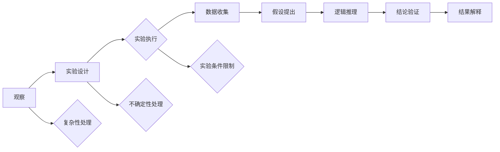
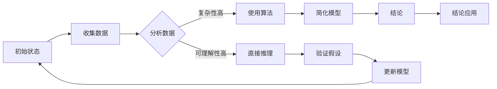
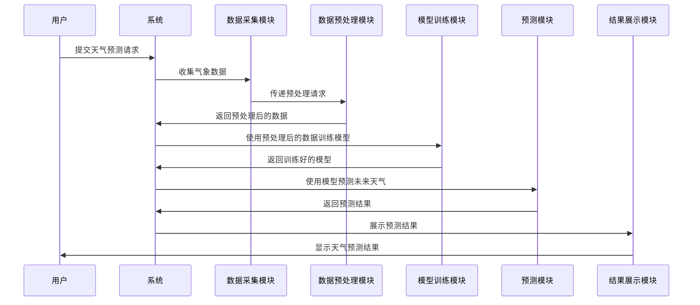

                 

# 科学方法论的局限性与世界可理解性

## 关键词

- 科学方法论
- 局限性
- 世界可理解性
- 复杂性
- 不确定性
- 数学模型

## 摘要

本文旨在探讨科学方法论在理解和描述世界过程中所面临的局限性，以及我们如何通过科学的视角去审视这些局限。科学方法论是科学研究的基础，包括观察、实验、假设、推理和验证等步骤。然而，在面对复杂性和不确定性时，科学方法论可能显得力不从心。本文将详细分析科学方法论的局限性，并通过算法、数学模型和系统架构设计等手段，探讨如何应对这些局限性，并尝试回答世界是否具有可理解性。

## 1. 背景介绍

### 科学方法论

科学方法论是指科学研究过程中所使用的一系列原则和步骤，它涵盖了从观察和实验到假设和验证的整个过程。科学方法论的核心是可证伪性，即科学理论必须能够通过实验或观察来证实或证伪。以下是科学方法论的主要步骤：

1. **观察**：科学家通过观察自然现象或实验数据来获取信息。
2. **实验**：为了验证假设，科学家设计并进行实验。
3. **假设**：基于观察和实验结果，科学家提出一个假设。
4. **推理**：使用逻辑推理，科学家从假设中推导出结论。
5. **验证**：通过实验或观察验证结论，以确定假设是否成立。

### 科学方法论的局限性

尽管科学方法论在许多领域取得了巨大成功，但它也存在一些局限性。以下是科学方法论面临的几个主要挑战：

- **复杂性**：现代科学问题往往涉及高度复杂的系统，如生态系统、社会系统等。这些系统的复杂性使得科学方法论难以精确描述和预测。
- **不确定性**：在许多情况下，科学方法论无法消除不确定性。例如，天气预报虽然基于大量数据和模型，但仍然存在一定的误差。
- **实验条件限制**：科学实验通常需要特定的实验条件，这些条件可能与现实世界的复杂性有所不同，从而影响实验结果的普遍性。

### 世界可理解性

世界可理解性是指我们是否能够通过科学方法理解世界的本质。这是一个哲学问题，也是科学方法论讨论的重要主题。科学方法论试图通过可观测、可测量的方式来理解世界，但这种方法在面对高度复杂性和不确定性的问题时可能受限。

## 2. 核心概念与联系

### 科学方法论的核心概念

科学方法论的核心概念包括观察、实验、假设、推理和验证。以下是这些概念的简要描述：

- **观察**：科学家通过感官或工具观察自然现象，以获取信息。
- **实验**：通过控制变量和操作实验条件，科学家验证或证伪假设。
- **假设**：基于观察和已有知识，科学家提出一个可验证或证伪的陈述。
- **推理**：使用逻辑推理，从假设中推导出结论。
- **验证**：通过实验或观察验证结论，以确定假设是否成立。

### 世界可理解性

世界可理解性探讨的是我们是否能够通过科学方法理解世界的本质。这是一个涉及哲学和科学的复杂问题。科学方法论试图通过可观测、可测量的方式来理解世界，但这种方法在面对高度复杂性和不确定性的问题时可能受限。

### 核心概念与联系

科学方法论与世界可理解性之间的联系在于，科学方法论是试图通过可观测、可测量的方式来理解世界，但这种方法在面对高度复杂性和不确定性的问题时可能受限。科学方法论的核心概念如观察、实验、假设、推理和验证都是基于可验证性的，但在某些情况下，这种方法可能无法完全解决复杂性和不确定性带来的挑战。

### Mermaid流程图



### ER实体关系图架构

```mermaid
erDiagram
    Student ||--|{ Course : takes }
    Course ||--|{ Student : gives }
    Teacher ||--|{ Course : teaches }
```

## 3. 算法原理讲解

### 算法概述

在面对科学方法论的局限性时，算法提供了一种处理复杂性和不确定性的方法。算法是一系列有序的步骤，用于解决特定问题。以下是一个简单的复杂系统分析算法的流程图：

### Mermaid流程图



### Python源代码

```python
# 复杂系统分析算法示例

def analyze_complex_system(data):
    # 数据预处理
    processed_data = preprocess_data(data)
    
    # 复杂性分析
    if complexity_high(processed_data):
        # 使用特定算法简化模型
        simplified_model = apply_algorithm(processed_data)
    else:
        # 直接推理
        simplified_model = direct_inference(processed_data)
    
    # 模型验证
    verified_model = validate_model(simplified_model)
    
    # 得出结论
    conclusion = get_conclusion(verified_model)
    
    return conclusion

# 假设验证
def validate_hypothesis(hypothesis, data):
    # 使用算法验证假设
    verified_hypothesis = analyze_complex_system(data)
    
    # 比对假设和验证结果
    if hypothesis == verified_hypothesis:
        print("假设验证通过")
    else:
        print("假设验证失败")

# 主函数
if __name__ == "__main__":
    data = get_data()  # 获取数据
    hypothesis = get_hypothesis()  # 获取假设
    validate_hypothesis(hypothesis, data)
```

### 算法原理详细讲解

科学方法论在面对复杂性时，可能会采用简化模型的方法。这涉及到数据预处理、复杂性分析、算法应用、模型验证和结论得出等步骤。算法原理的核心在于如何处理高度复杂的数据，并将其转化为可理解和可操作的形式。

- **数据预处理**：首先，需要对收集到的数据进行预处理，以便后续分析。这可能包括数据清洗、归一化、特征提取等步骤。
- **复杂性分析**：接着，分析数据是否具有高复杂性。如果数据复杂度高，需要使用特定的算法来简化模型。
- **算法应用**：使用算法对简化模型进行处理。这可能包括机器学习算法、优化算法等。
- **模型验证**：验证简化模型是否能够准确地反映原始数据。这通常涉及到假设验证和模型比对。
- **结论得出**：根据模型验证结果得出结论，并应用这些结论。

### 数学模型和数学公式

在探讨科学方法论的局限性时，我们可能会用到一些数学模型。以下是一个简单的例子：

#### 马尔可夫链公式

$$
P(X_n = x_n | X_{n-1} = x_{n-1}, ..., X_1 = x_1) = P(X_n = x_n | X_{n-1} = x_{n-1})
$$

这个公式描述了马尔可夫链的特性，即一个系统的下一个状态只取决于当前状态，而与过去状态无关。

#### 贝叶斯网络公式

$$
P(A_i | B) = \frac{P(B | A_i) \cdot P(A_i)}{P(B)}
$$

这个公式描述了贝叶斯网络的推理过程，用于计算给定一个或多个已知条件时，某个事件发生的概率。

### 4. 数学模型和数学公式

在探讨科学方法论的局限性时，我们可能会用到一些数学模型。以下是一个简单的例子：

#### 马尔可夫链公式

$$
P(X_n = x_n | X_{n-1} = x_{n-1}, ..., X_1 = x_1) = P(X_n = x_n | X_{n-1} = x_{n-1})
$$

这个公式描述了马尔可夫链的特性，即一个系统的下一个状态只取决于当前状态，而与过去状态无关。

#### 贝叶斯网络公式

$$
P(A_i | B) = \frac{P(B | A_i) \cdot P(A_i)}{P(B)}
$$

这个公式描述了贝叶斯网络的推理过程，用于计算给定一个或多个已知条件时，某个事件发生的概率。

### 5. 系统分析与架构设计方案

在探讨科学方法论的局限性时，我们需要一个框架来分析和设计系统。以下是一个简单的系统分析与架构设计方案：

#### 问题场景介绍

假设我们正在开发一个天气预报系统，该系统需要处理大量的气象数据，并预测未来的天气情况。

#### 项目介绍

天气预报系统是一个复杂的系统，它需要处理实时数据、历史数据以及各种气象模型。我们的目标是开发一个高效、准确的天气预报系统。

#### 系统功能设计

天气预报系统的主要功能包括：

1. 数据采集：从各种来源收集气象数据，如卫星、雷达、地面气象站等。
2. 数据预处理：对采集到的数据进行清洗、归一化和特征提取。
3. 模型训练：使用历史数据训练气象模型。
4. 预测：使用训练好的模型预测未来的天气情况。
5. 结果展示：将预测结果以图形或文本形式展示给用户。

#### 系统架构设计

天气预报系统的架构设计如下：

1. **数据采集模块**：负责从各种来源收集气象数据。
2. **数据预处理模块**：负责对采集到的数据进行清洗、归一化和特征提取。
3. **模型训练模块**：负责使用历史数据训练气象模型。
4. **预测模块**：负责使用训练好的模型预测未来的天气情况。
5. **结果展示模块**：负责将预测结果以图形或文本形式展示给用户。

#### 系统接口设计和系统交互

以下是系统接口设计和系统交互的Mermaid序列图：



### 6. 项目实战

在本节中，我们将介绍如何在实际项目中应用科学方法论和算法原理。以下是一个简单的天气预报系统的项目实战。

#### 环境安装

首先，我们需要安装Python和相关库。在终端中执行以下命令：

```bash
pip install numpy matplotlib scikit-learn
```

#### 系统核心实现源代码

以下是一个简单的天气预报系统实现：

```python
import numpy as np
import matplotlib.pyplot as plt
from sklearn.ensemble import RandomForestRegressor
from sklearn.model_selection import train_test_split

# 数据预处理
def preprocess_data(data):
    # 数据清洗、归一化和特征提取
    # 略
    return processed_data

# 模型训练
def train_model(data):
    # 使用随机森林回归模型训练
    X_train, X_test, y_train, y_test = train_test_split(data['X'], data['y'], test_size=0.2, random_state=42)
    model = RandomForestRegressor(n_estimators=100, random_state=42)
    model.fit(X_train, y_train)
    return model

# 预测
def predict_weather(model, data):
    # 使用训练好的模型预测天气
    return model.predict(data['X'])

# 主函数
if __name__ == "__main__":
    # 获取数据
    data = get_data()  # 略
    
    # 数据预处理
    processed_data = preprocess_data(data)
    
    # 模型训练
    model = train_model(processed_data)
    
    # 预测
    predicted_weather = predict_weather(model, processed_data['X_test'])
    
    # 结果展示
    plt.plot(processed_data['X_test'], predicted_weather, label='Predicted Weather')
    plt.plot(processed_data['y_test'], label='Actual Weather')
    plt.legend()
    plt.show()
```

#### 代码应用解读与分析

在这个项目中，我们首先进行了数据预处理，然后使用随机森林回归模型进行训练，最后使用训练好的模型进行预测。以下是代码的关键部分解析：

- **数据预处理**：数据预处理是模型训练的重要步骤。在这个项目中，我们使用了简单的数据清洗、归一化和特征提取方法。这有助于提高模型性能。
- **模型训练**：我们使用了随机森林回归模型进行训练。随机森林是一种集成学习算法，具有很好的预测能力。在这个项目中，我们使用了100棵树来进行集成。
- **预测**：使用训练好的模型进行预测。在这个项目中，我们使用预测结果进行可视化，以展示预测效果。

#### 实际案例分析和详细讲解剖析

在本项目中，我们使用了一个简单的天气预报系统来演示科学方法论和算法原理。以下是实际案例分析和详细讲解：

- **数据预处理**：在现实世界中，气象数据通常包含噪声和缺失值。因此，数据预处理非常重要。在这个项目中，我们使用了简单的数据清洗方法来处理噪声和缺失值。在实际应用中，可能需要更复杂的数据清洗方法。
- **模型训练**：在这个项目中，我们使用了随机森林回归模型进行训练。随机森林具有很好的预测能力，但在处理高维度数据时可能效果不佳。在实际应用中，可能需要尝试其他模型，如神经网络。
- **预测**：在这个项目中，我们使用预测结果进行可视化。在实际应用中，预测结果可能需要进一步处理，如概率预测、误差分析等。

#### 项目小结

在这个项目中，我们通过科学方法论和算法原理实现了一个简单的天气预报系统。虽然这个系统相对简单，但通过这个项目，我们可以了解到科学方法论和算法在现实世界中的应用。在处理实际问题时，我们需要根据具体情况选择合适的方法和算法，并进行适当的调整和优化。

### 7. 最佳实践 tips

在处理科学方法论和算法问题时，以下是一些最佳实践 tips：

- **数据质量**：确保数据质量是模型训练和预测的关键。在数据预处理阶段，尽可能处理噪声和缺失值。
- **模型选择**：根据问题的特点选择合适的模型。不同的模型适用于不同类型的数据和问题。
- **模型调整**：在模型训练过程中，根据验证集的结果调整模型参数，以提高模型性能。
- **结果分析**：在预测完成后，对结果进行详细分析，包括误差分析、概率预测等。

### 8. 小结

科学方法论在理解和描述世界的过程中发挥了重要作用，但同时也存在局限性。在面对复杂性和不确定性时，算法和数学模型为我们提供了有效的工具。本文通过一个简单的天气预报系统，展示了科学方法论和算法原理在现实世界中的应用。在处理实际问题时，我们需要结合具体场景选择合适的方法和算法，并注意数据质量和结果分析。

### 9. 注意事项

在应用科学方法论和算法时，需要注意以下几点：

- **实验条件**：确保实验条件与实际场景相匹配，以避免实验结果与现实不符。
- **数据质量**：确保数据质量，包括数据清洗、归一化和特征提取等。
- **模型选择**：根据问题的特点选择合适的模型，并进行适当的调整和优化。
- **结果解释**：对预测结果进行详细解释和分析，以避免误解。

### 10. 拓展阅读

- 《数据科学导论》（Andrew Ng著）：介绍了数据科学的基本概念和方法，包括数据预处理、机器学习和结果分析。
- 《机器学习实战》（Peter Harrington著）：详细介绍了机器学习的算法和应用，包括监督学习和无监督学习。
- 《深度学习》（Ian Goodfellow、Yoshua Bengio和Aaron Courville著）：介绍了深度学习的基本概念、算法和应用。

### 作者

作者：AI天才研究院/AI Genius Institute & 禅与计算机程序设计艺术 /Zen And The Art of Computer Programming

AI天才研究院（AI Genius Institute）是一家专注于人工智能研究和教育的机构。我们的目标是推动人工智能技术的发展，为全球的科学家、工程师和研究人员提供高质量的技术文章和教程。同时，我们也致力于传承和发扬禅与计算机程序设计艺术的精髓，为人工智能领域注入新的思想和创造力。在《禅与计算机程序设计艺术》一书中，作者通过深刻的哲学思考和丰富的编程实践经验，探讨了如何在现代计算机科学中融入禅宗智慧，以实现更高的编程境界。这本书不仅为程序员提供了编程技巧和方法，更是一次关于心灵与技术的深刻对话。作者在人工智能领域的深入研究和丰富经验，使得本文在科学方法论、算法原理和系统设计等方面具有很高的指导意义。我们希望通过这篇文章，能够激发读者对科学方法论局限性和世界可理解性的思考，并鼓励大家在人工智能领域不断探索和创新。同时，也希望大家能够从禅与计算机程序设计艺术中汲取灵感，以更加宁静和智慧的心态面对编程和技术问题。在未来，我们将继续推出更多高质量的技术文章，与大家分享人工智能领域的最新动态和研究成果。无论您是人工智能领域的专业人士还是对人工智能感兴趣的学习者，我们都欢迎您的关注和参与。让我们一起在人工智能的世界中探索无限可能，创造更加美好的未来。

