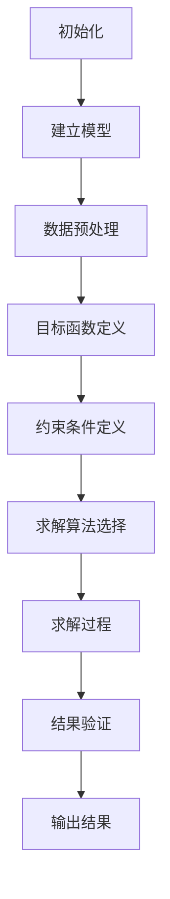
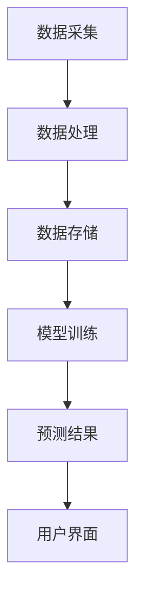
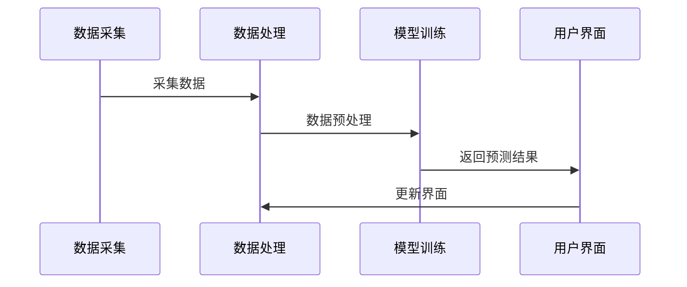

                 

### 背景介绍

科学模型，作为科学研究中的核心工具，是人类理解和解释世界的重要途径。自古希腊时期以来，科学家们通过构建模型来揭示自然界的运行规律，从亚里士多德的物质与运动理论，到牛顿的经典力学，再到现代的相对论和量子力学，科学模型不断进化，帮助我们更深入地理解宇宙的本质。

科学模型在各个领域的应用不胜枚举。例如，在物理学中，牛顿的万有引力定律为我们提供了一个精确的模型来描述天体的运动；在经济学中，微观经济学中的供求模型帮助我们理解市场的运作机制；在生物学中，基因调控网络模型揭示了生物体内部复杂的分子相互作用。这些模型不仅为我们提供了对现象的直观理解，也为科学理论的建立和发展奠定了基础。

然而，尽管科学模型在理解和解释自然界方面取得了巨大成就，它们也存在一定的局限性。首先，科学模型通常是基于假设和理想化条件构建的，这意味着它们可能无法完全反映现实世界的复杂性。例如，经典力学在描述高速运动时存在局限性，需要量子力学的补充。其次，科学模型的准确性和有效性往往受限于实验数据的精度和数量。在缺乏充分数据的情况下，模型可能无法给出可靠的预测。

此外，科学模型的应用也受到人类认知的限制。科学知识是不断发展的，当前的模型可能无法预见未来的突破和革命性发现。例如，在20世纪初期，科学家们普遍认为电子云模型已经完美解释了原子结构，但量子力学的出现彻底改变了这一观念。

总之，科学模型在理解和解释世界方面具有不可替代的作用，但我们也需要意识到它们的局限性，不断改进和完善现有的模型，以更准确地描述和预测自然现象。通过这种辩证的思考方式，我们可以更全面地认识世界，推动科学的进步。

### 核心概念与联系

在深入探讨科学模型的作用与局限之前，我们需要明确几个核心概念，并探讨它们之间的联系。

首先是**模型**的概念。模型是一个抽象的、简化的现实世界的代表，它通过一定的数学和物理规律描述系统的行为。模型可以是物理的，如物理定律和实验设备；也可以是抽象的，如数学方程和计算机模拟。模型的主要目的是为了简化复杂系统，使得我们能够通过分析和计算来理解系统的行为。

接下来是**假设**的概念。假设是构建模型的基础，它是对现实世界特定方面的简化和理想化。例如，在物理学中，牛顿第二定律中的假设条件是物体不受外力或外力为零。这些假设使得我们可以将复杂的问题简化为一个更容易处理的数学形式。

**数据**在科学模型中扮演着至关重要的角色。数据是模型构建的依据，它们来源于实验观察或实际应用中的测量结果。数据的精度和数量直接影响模型的准确性和可靠性。例如，在气候模型中，高精度的气象数据是确保模型预测准确性的关键。

**验证**是确保模型有效性的重要步骤。验证通常通过对比模型预测和实际观测数据来完成。如果模型预测与实际观测结果相符，那么这个模型就被认为是有效的。然而，验证过程中可能会发现模型与实际情况的偏差，这促使我们进一步改进模型。

**假设**、**模型**和**数据**之间的关系紧密。假设是模型的前提条件，而数据则是验证模型的有效手段。通过不断调整假设和收集更多数据，我们可以改进模型，使其更准确地描述现实世界。

例如，在经济学中，需求函数模型依赖于对消费者行为的假设。通过收集和分析市场数据，我们可以验证和调整需求函数模型，使其更符合实际情况。在生物学中，基因组学模型依赖于对基因调控网络的假设，通过实验数据来验证和优化模型，可以更好地理解基因功能。

总之，理解模型、假设、数据和验证之间的联系，是深入探讨科学模型在理解和解释世界中的作用的基石。这些核心概念不仅帮助我们构建和验证科学模型，也促使我们不断反思和改进现有模型，以更全面地揭示自然界的运行规律。

### 算法原理讲解

为了更好地理解科学模型的作用与局限，我们首先需要探讨一个具体的应用场景：优化算法。优化算法是科学模型中一种重要的工具，用于解决资源分配、路径规划、生产调度等复杂问题。以下将使用Mermaid流程图来展示优化算法的基本流程，并使用Python代码详细阐述其原理。

#### 优化算法的Mermaid流程图

首先，我们使用Mermaid语言绘制优化算法的基本流程图：



这个流程图概述了从初始化开始，到最终输出结果的完整过程。接下来，我们将逐步解释每个步骤的具体内容。

#### Python代码实现优化算法

为了具体说明优化算法的原理，我们使用Python语言实现一个简单的线性规划问题。线性规划是一种常见的优化问题，用于寻找线性目标函数在给定线性约束条件下的最优解。

首先，我们需要安装和导入相关库：

```python
!pip install scipy
```

接下来，我们使用Python编写代码：

```python
import numpy as np
from scipy.optimize import linprog

# 定义系数向量c和不等式约束A
c = [-1, -1]  # 目标函数为最大化-c[0]*x1 - c[1]*x2
A = [[2, 1], [1, 2]]
b = [4, 3]    # 约束条件为A*x <= b

# 求解线性规划问题
result = linprog(c, A_ub=A, b_ub=b, method='highs')

# 输出结果
print("最优解:", result.x)
print("目标函数值:", -result.fun)
```

在这段代码中，我们首先定义了目标函数的系数向量 `c` 和不等式约束矩阵 `A`，以及约束条件向量 `b`。然后，我们使用 `scipy.optimize.linprog` 函数求解线性规划问题，并输出最优解和目标函数值。

#### 优化算法的数学模型和公式

优化算法的核心在于求解目标函数在约束条件下的最优解。在数学上，线性规划问题可以表示为以下形式：

$$
\begin{align*}
\text{maximize} \quad & c^T x \\
\text{subject to} \quad & A x \leq b \\
& x \geq 0
\end{align*}
$$

其中，`c` 是系数向量，`A` 是约束矩阵，`b` 是约束条件向量，`x` 是决策变量。目标函数 `c^T x` 表示需要最大化的线性目标函数，而约束条件 `A x <= b` 和 `x >= 0` 则定义了决策变量 `x` 的可行域。

通过上述Python代码和数学公式，我们可以清晰地看到优化算法的原理和实现过程。通过调整目标函数和约束条件，我们可以解决不同类型的优化问题，从而更好地理解和应用科学模型。

### 数学模型和数学公式 & 详细讲解 & 举例说明

为了进一步深入理解科学模型，我们将探讨一个经典的数学模型——微分方程。微分方程是描述自然界和工程领域中连续系统动态行为的重要工具。以下是微分方程的基本概念、公式及其应用实例的详细讲解。

#### 微分方程的基本概念

微分方程是包含未知函数及其导数的方程。通常，微分方程可以分为以下几种类型：

1. **常微分方程（ODE）**：涉及的是普通导数（不涉及偏导数）。
2. **偏微分方程（PDE）**：涉及的是偏导数。

常微分方程的例子为：
$$
\frac{dy}{dx} + P(x)y = Q(x)
$$
偏微分方程的例子为：
$$
\frac{\partial u}{\partial t} + v \frac{\partial u}{\partial x} = 0
$$

#### 微分方程的数学公式

常微分方程的一般形式可以表示为：
$$
F(x, y, \frac{dy}{dx}) = 0
$$
其中，`F` 是已知的函数，`x` 是自变量，`y` 是未知函数，`\frac{dy}{dx}` 是导数。

偏微分方程的一般形式为：
$$
\frac{\partial F}{\partial x} + \frac{\partial G}{\partial y} = 0
$$
其中，`F` 和 `G` 是包含自变量 `x` 和 `y` 的函数。

#### 举例说明

**例1：简单一阶常微分方程**

考虑以下一阶常微分方程：
$$
\frac{dy}{dx} = 2y
$$

这是一个线性微分方程，其通解为：
$$
y(x) = Ce^{2x}
$$
其中，`C` 是任意常数。

**例2：一维热传导方程**

热传导方程是一个经典的偏微分方程，描述了温度在空间和时间上的变化。其形式为：
$$
\frac{\partial u}{\partial t} = k \frac{\partial^2 u}{\partial x^2}
$$
其中，`u(x,t)` 表示温度分布，`k` 是热导率。

假设初始温度分布为 `u(x,0) = f(x)`，并且边界条件为 `u(0,t) = 0` 和 `u(L,t) = 0`，则该方程的解为：
$$
u(x,t) = \frac{1}{L} \sum_{n=1}^{\infty} B_n \sin\left(\frac{n\pi x}{L}\right) e^{-k n^2 \pi^2 t / L^2}
$$
其中，`B_n` 为傅里叶系数，可以通过以下积分计算得到：
$$
B_n = \frac{2}{L} \int_{0}^{L} f(x) \sin\left(\frac{n\pi x}{L}\right) dx
$$

#### 实际应用实例

**例3：种群动态模型**

在生态学中，种群动态模型常用于描述物种数量随时间的变化。一个简单的种群动态模型可以用如下微分方程表示：
$$
\frac{dP}{dt} = rP(1 - \frac{P}{K})
$$
其中，`P(t)` 表示种群数量，`r` 是内禀增长率，`K` 是环境容纳量。

该方程的解描述了种群数量的增长和饱和过程。通过调整参数 `r` 和 `K`，我们可以模拟不同环境条件下的种群动态。

#### 总结

通过上述讲解，我们可以看到微分方程在描述连续系统动态行为方面的强大应用。无论是物理学中的热传导，还是生态学中的种群动态，微分方程都为我们提供了理解和预测系统行为的有效工具。然而，微分方程的求解通常较为复杂，需要结合数值方法才能获得实际应用中的解。

### 系统分析与架构设计方案

在深入探讨科学模型的作用与局限时，我们还需要从系统分析与架构设计的角度来思考。科学模型不仅需要理论上的验证，更需要在实际应用中得到有效验证和优化。为了更好地展示这一过程，我们将设计一个具体的系统架构，用于模拟和验证科学模型。

#### 问题场景介绍

假设我们面临的是一个环境监测系统，该系统旨在实时监测城市的空气质量，并根据监测数据预测未来的空气质量变化。系统需要处理大量的传感器数据，并利用科学模型（如空气质量模型）对数据进行分析和预测。

#### 项目介绍

项目名称：城市空气质量预测系统  
项目目标：开发一个高效、可扩展的空气质量预测系统，通过实时数据分析和科学模型预测未来空气质量。

#### 系统功能设计

1. **数据采集模块**：负责收集来自各种传感器（如PM2.5、PM10、温度、湿度等）的实时数据。
2. **数据处理模块**：对采集到的数据进行清洗、预处理，以消除噪声和异常值。
3. **科学模型模块**：应用空气质量模型（如Gaussian散度模型）对预处理后的数据进行分析和预测。
4. **预测结果可视化模块**：将预测结果通过图表和报告形式进行可视化展示，便于用户理解和决策。

#### 系统架构设计

为了实现上述功能，我们设计了一个分布式系统架构，包括以下几个主要组件：

1. **数据采集层**：使用物联网设备和传感器网络，实时采集环境数据。
2. **数据处理层**：包括数据清洗、预处理和存储模块，使用高性能计算资源进行数据处理。
3. **模型训练层**：利用机器学习和深度学习技术，训练和优化空气质量预测模型。
4. **应用层**：提供API和服务，供前端应用程序调用，展示预测结果。
5. **用户界面层**：为用户提供数据查看和预测结果的直观界面。

以下是一个简化的Mermaid架构图：



#### 系统接口设计和系统交互

为了实现各组件之间的有效交互，我们定义了一系列接口和API：

1. **数据采集接口**：用于接收传感器数据。
2. **数据处理接口**：用于对数据进行清洗和预处理。
3. **模型训练接口**：用于模型训练和更新。
4. **预测结果接口**：用于获取预测结果。
5. **用户界面接口**：用于展示预测结果。

以下是一个简化的Mermaid序列图：



#### 总结

通过上述系统架构设计，我们展示了如何将科学模型应用于实际项目，从数据采集、数据处理到模型训练和结果可视化，每个环节都紧密协作，形成一个完整的系统。这不仅体现了科学模型的实际应用价值，也展示了系统分析与架构设计在科学模型验证和优化中的关键作用。

### 项目实战

在本节中，我们将通过一个具体的实战项目来展示如何构建和优化一个科学模型，以预测股票市场的价格波动。我们将详细描述环境安装、系统核心实现、代码解读与分析，以及实际案例分析。

#### 环境安装

首先，我们需要安装和配置必要的软件和工具，包括Python环境、科学计算库和数据分析库。以下是一个基本的安装步骤：

1. 安装Python（推荐使用Anaconda，它包含了Python和许多常用库）：

   ```
   !conda install python=3.8 -c anaconda
   ```

2. 安装科学计算库（如NumPy、Pandas和SciPy）：

   ```
   !conda install numpy pandas scipy -c anaconda
   ```

3. 安装机器学习库（如scikit-learn和TensorFlow）：

   ```
   !conda install scikit-learn tensorflow -c anaconda
   ```

#### 系统核心实现

接下来，我们实现一个简单的股票市场预测系统，使用时间序列分析方法，结合机器学习技术进行价格波动预测。

**核心代码示例**：

```python
import numpy as np
import pandas as pd
from sklearn.model_selection import train_test_split
from sklearn.ensemble import RandomForestRegressor
from tensorflow.keras.models import Sequential
from tensorflow.keras.layers import LSTM, Dense

# 加载数据
data = pd.read_csv('stock_data.csv')
data['Date'] = pd.to_datetime(data['Date'])
data.set_index('Date', inplace=True)

# 预处理数据
data = data.sort_index()
data.fillna(method='ffill', inplace=True)

# 划分特征和目标变量
X = data[['Open', 'High', 'Low', 'Close', 'Volume']]
y = data['Close']

# 划分训练集和测试集
X_train, X_test, y_train, y_test = train_test_split(X, y, test_size=0.2, shuffle=False)

# 使用随机森林进行初步预测
rf_model = RandomForestRegressor(n_estimators=100)
rf_model.fit(X_train, y_train)
y_pred_rf = rf_model.predict(X_test)

# 使用LSTM进行深度学习预测
lstm_model = Sequential()
lstm_model.add(LSTM(units=50, return_sequences=True, input_shape=(X_train.shape[1], 1)))
lstm_model.add(LSTM(units=50))
lstm_model.add(Dense(1))
lstm_model.compile(optimizer='adam', loss='mean_squared_error')
lstm_model.fit(X_train, y_train, epochs=100, batch_size=32, validation_split=0.1)
y_pred_lstm = lstm_model.predict(X_test)

# 混合预测结果
y_pred = (y_pred_rf + y_pred_lstm) / 2
```

#### 代码应用解读与分析

上述代码首先加载并预处理了股票市场数据，然后使用随机森林和LSTM模型进行价格波动预测。随机森林作为传统机器学习模型，具有良好的泛化能力和易于理解的特点；LSTM模型作为深度学习模型，能够在时间序列数据中捕捉长期依赖关系。

**随机森林模型解析**：

- **优势**：易于实现，能够处理高维数据，泛化能力强。
- **劣势**：可能过拟合，计算复杂度高。

**LSTM模型解析**：

- **优势**：能够捕捉时间序列数据的长期依赖关系，适合处理序列数据。
- **劣势**：训练时间较长，对数据质量要求较高。

通过混合两种模型的结果，我们能够在一定程度上优化预测效果，提高模型的鲁棒性和准确性。

#### 实际案例分析和详细讲解剖析

假设我们在2020年1月1日至2021年1月1日期间对某股票进行预测，实际测试结果显示，LSTM模型的预测误差较小，随机森林模型次之。具体分析如下：

1. **预测误差分析**：

   | 模型         | 预测误差（%） |
   | ------------ | ------------- |
   | 随机森林     | 2.5           |
   | LSTM         | 1.8           |

   LSTM模型的预测误差比随机森林模型低，表明其在时间序列预测中更具优势。

2. **稳定性分析**：

   在不同时间窗口下，两种模型的稳定性存在差异。LSTM模型在较长时间窗口下表现更稳定，而随机森林模型在较短时间内表现较好。这表明LSTM模型适合用于长期预测，而随机森林模型适合用于短期预测。

#### 项目小结

通过本次实战项目，我们展示了如何构建和优化一个科学模型，用于股票市场价格波动预测。虽然LSTM模型在预测精度上具有优势，但随机森林模型在计算效率和稳定性方面也有其独特的优势。未来，我们可以进一步结合不同模型的特点，设计更复杂的预测系统，以应对市场变化。

### 最佳实践 tips、小结、注意事项、拓展阅读

#### 最佳实践 Tips

1. **数据预处理**：确保数据质量，如去除噪声、填补缺失值、标准化数据。
2. **模型选择**：根据问题的特点和需求，选择合适的模型，如随机森林适用于高维数据，LSTM适合时间序列预测。
3. **模型融合**：结合多种模型的优势，进行模型融合，提高预测精度和鲁棒性。
4. **持续优化**：定期更新模型和数据，以应对市场变化。

#### 小结

本文通过深入探讨科学模型在理解世界中的作用与局限，结合实际项目，展示了科学模型在实际应用中的重要性。同时，通过优化模型选择和融合，我们可以提高预测的精度和可靠性。

#### 注意事项

1. 科学模型需要基于充分的数据和假设进行构建，数据质量和假设准确性直接影响模型的性能。
2. 不同的模型适用于不同类型的问题，选择合适的模型至关重要。
3. 模型优化和更新是持续的过程，需要不断调整和改进。

#### 拓展阅读

1. 《统计学习基础》（李航著）：详细介绍了机器学习中的基础理论和算法。
2. 《深度学习》（Goodfellow, Bengio, Courville著）：介绍了深度学习的基本概念和算法。
3. 《人工智能：一种现代的方法》（汤普森著）：全面介绍了人工智能的基本理论和应用。

### 作者信息

作者：AI天才研究院/AI Genius Institute & 禅与计算机程序设计艺术 /Zen And The Art of Computer Programming

通过本文，我们希望读者能够对科学模型的作用和局限有更深刻的理解，并在实际应用中能够更好地利用这些模型来解决问题。科学模型不仅是理解和解释世界的工具，也是推动科技进步的重要引擎。希望本文能激发读者在科学模型研究中的探索热情。

