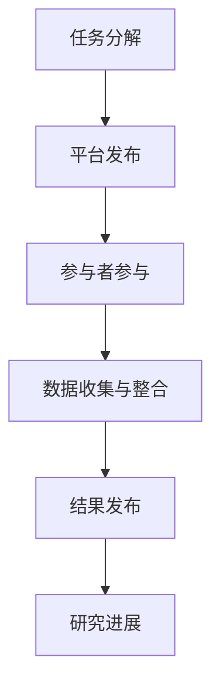
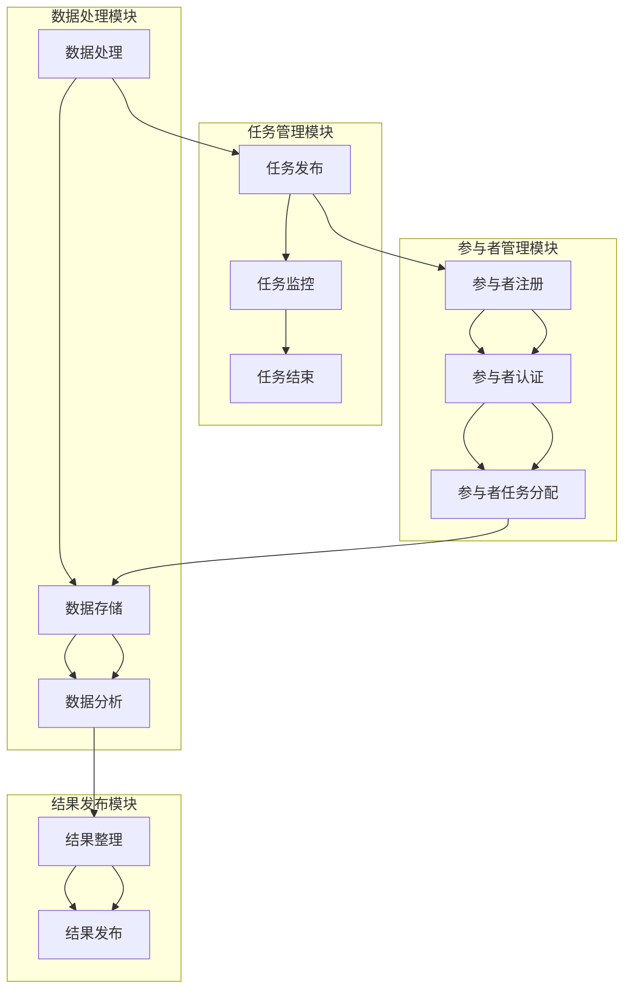
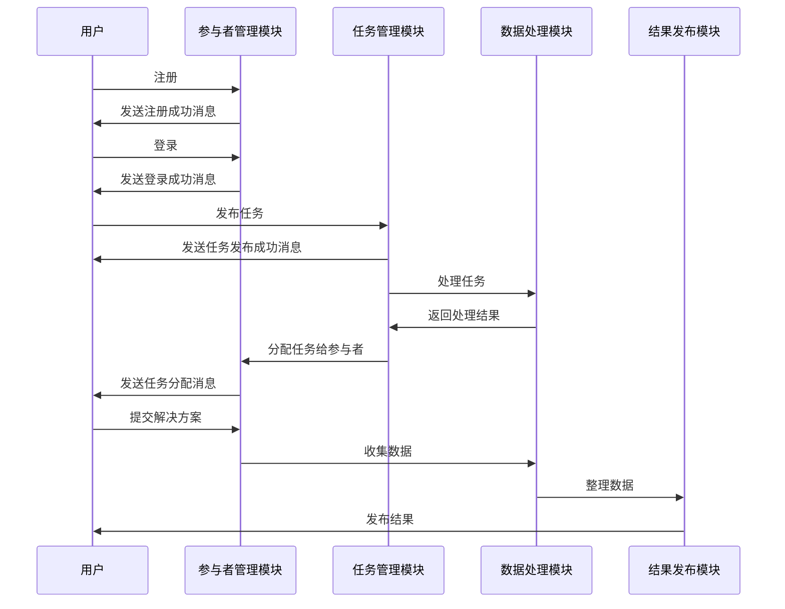

                 

# 科学研究的众包模式：集体智慧促进世界理解

## 关键词

- 科学研究
- 众包模式
- 集体智慧
- 数据分析
- 研究效率

## 摘要

随着科学研究的复杂性和数据量的激增，传统的科研方法已难以满足现代科学探索的需求。本文探讨了科学研究的众包模式，这种新兴的科研方法通过将任务分解、发布给全球参与者，利用集体智慧解决科学难题。本文首先介绍了科学研究的背景和问题，然后详细分析了众包模式的核心概念和原理，并通过实例和算法展示了其应用效果。最后，本文提出了科学研究的众包模式在推动科研进步和提升研究效率方面的潜力。

----------------------------------------------------------------

## 第一部分：背景介绍

### 1.1 问题背景

随着互联网技术的迅猛发展和大数据时代的到来，科学研究的数据量呈现出爆炸式增长。然而，传统的科研模式面临着数据获取难度大、研究成本高、周期长等问题，严重制约了科研的进步。为了解决这些问题，科学家们开始探索新的研究方法，其中众包模式逐渐成为一种有效的手段。

### 1.2 问题描述

众包模式，即通过互联网平台，将研究任务分解成小任务，发布给全球的参与者，从而快速获取大量数据或解决方案。这种模式在科学研究中的应用，被称为“科学研究的众包模式”。它旨在利用集体智慧，促进世界对复杂科学问题的理解。

### 1.3 问题解决

科学研究的众包模式通过以下几个关键步骤实现问题解决：

1. **任务分解**：将复杂的科学问题分解成多个可操作的小任务。
2. **平台发布**：在众包平台上发布任务，明确任务的细节和奖励机制。
3. **参与者参与**：全球的参与者通过平台参与任务，提交自己的解决方案。
4. **数据收集与整合**：平台收集参与者的解决方案，进行数据整合和分析。
5. **结果发布**：将研究结果发布，以供科研人员参考和进一步研究。

### 1.4 边界与外延

科学研究的众包模式主要应用于以下领域：

- **天文学**：例如，通过众包方式寻找系外行星。
- **生物学**：例如，通过众包方式对生物序列进行注释。
- **地理学**：例如，通过众包方式收集地震数据。

### 1.5 概念结构与核心要素组成

科学研究的众包模式由以下几个核心要素组成：

1. **任务分解**：核心概念，涉及如何将复杂问题分解成可操作的小任务。
2. **平台发布**：核心概念，涉及如何搭建和运营众包平台。
3. **参与者参与**：核心概念，涉及如何吸引和激励全球参与者。
4. **数据收集与整合**：核心概念，涉及如何高效收集和整合参与者提交的数据。
5. **结果发布**：核心概念，涉及如何发布研究结果，以促进科研进展。

----------------------------------------------------------------

## 第二部分：核心概念与联系

### 2.1 核心概念原理

科学研究的众包模式涉及多个核心概念，包括任务分解、平台发布、参与者参与、数据收集与整合、结果发布。以下是这些概念的基本原理：

#### 任务分解

任务分解是将一个复杂的科学问题拆分成多个小任务，以便于参与者理解和执行。任务分解的原理包括：

- **分解目标**：明确问题的核心目标，将其分解成具体的、可操作的任务。
- **任务颗粒度**：任务颗粒度要适中，既能保证任务的清晰性，又能避免过于琐碎。

#### 平台发布

平台发布是指将任务发布到众包平台上，吸引参与者参与。平台发布的原理包括：

- **平台建设**：搭建一个高效、易用的众包平台，提供任务发布、数据收集、结果发布等功能。
- **激励机制**：设置合理的激励机制，鼓励参与者积极参与任务。

#### 参与者参与

参与者参与是指全球的参与者通过众包平台参与任务，提交自己的解决方案。参与者参与的原理包括：

- **吸引参与者**：通过有效的宣传和激励机制，吸引全球的参与者。
- **任务选择**：参与者根据自己的兴趣和专业背景选择合适的任务。

#### 数据收集与整合

数据收集与整合是指平台收集参与者提交的数据，并进行整合和分析。数据收集与整合的原理包括：

- **数据收集**：确保数据的真实性和完整性，采用多种方式收集数据。
- **数据整合**：将来自不同参与者的数据进行整合，形成完整的数据集。

#### 结果发布

结果发布是指将研究结果发布，以供科研人员参考和进一步研究。结果发布的原理包括：

- **结果整理**：将研究结果进行整理，以易于理解的形式发布。
- **共享与交流**：鼓励科研人员共享研究结果，促进学术交流。

### 2.2 概念属性特征对比表格

以下是对科学研究的众包模式中的核心概念属性特征的对比表格：

| 概念         | 属性特征                                                         |
| ------------ | ------------------------------------------------------------ |
| 任务分解     | 目标明确、颗粒度适中、可操作性强                             |
| 平台发布     | 高效、易用、多功能、激励机制合理                             |
| 参与者参与   | 兴趣驱动、专业背景、任务选择自由                             |
| 数据收集与整合 | 数据真实、完整、多种收集方式、整合高效                       |
| 结果发布     | 结果整理清晰、易于理解、共享与交流便利                       |

### 2.3 ER实体关系图架构

以下是基于本文核心概念的ER实体关系图架构：

```mermaid
erDiagram
  TaskDecomposition ||--|{ Participant : participates in}
  TaskDecomposition ||--|{ DataCollection : collects from}
  TaskDecomposition ||--|{ ResultPublication : publishes to}
  PlatformRelease ||--|{ TaskDecomposition : releases tasks to}
  PlatformRelease ||--|{ Participant : attracts participants}
  PlatformRelease ||--|{ DataCollection : collects data from}
  PlatformRelease ||--|{ ResultPublication : publishes results to}
  DataCollection ||--|{ DataIntegration : integrates data from}
  ResultPublication ||--|{ ResearchProgress : accelerates research progress}
```

通过以上ER图，我们可以清晰地看到各个核心概念之间的关系，以及它们在整个众包模式中的角色和作用。

----------------------------------------------------------------

## 第三部分：算法原理讲解

在科学研究的众包模式中，算法原理起着至关重要的作用。以下我们将使用Mermaid画出算法流程图，并用Python源代码详细阐述算法原理，并进行数学模型和公式讲解。

### 3.1 算法流程图



### 3.2 Python源代码

```python
import numpy as np

def task_decomposition(complex_problem):
    """
    将复杂的科学问题分解成多个小任务。
    """
    # 具体实现细节...
    return decomposed_tasks

def platform_release(decomposed_tasks):
    """
    在众包平台上发布任务，设置奖励机制。
    """
    # 具体实现细节...
    return published_tasks

def participant_involvement(published_tasks):
    """
    参与者参与任务，提交解决方案。
    """
    # 具体实现细节...
    return solutions

def data_collection(solutions):
    """
    收集参与者提交的解决方案，进行数据整合。
    """
    # 具体实现细节...
    return integrated_data

def result_publication(integrated_data):
    """
    发布研究结果，促进科研进展。
    """
    # 具体实现细节...
    return research_progress

# 主函数
if __name__ == "__main__":
    complex_problem = "复杂的科学问题"
    decomposed_tasks = task_decomposition(complex_problem)
    published_tasks = platform_release(decomposed_tasks)
    solutions = participant_involvement(published_tasks)
    integrated_data = data_collection(solutions)
    research_progress = result_publication(integrated_data)
    print("研究进展：", research_progress)
```

### 3.3 数学模型和公式讲解

在科学研究的众包模式中，任务分解、数据收集与整合等环节涉及到大量的数学模型和公式。以下是一个简化的数学模型示例：

$$
\text{研究进展} = f(\text{任务分解效率}, \text{数据收集完整性}, \text{数据整合准确性})
$$

其中，任务分解效率、数据收集完整性和数据整合准确性分别表示：

- **任务分解效率**：衡量任务分解的粒度和清晰程度，越高表示分解越细致、越易于参与者理解。
- **数据收集完整性**：衡量收集到的数据的完整性和真实性，越高表示数据越全面、越准确。
- **数据整合准确性**：衡量数据整合后的准确性和可用性，越高表示数据整合后的结果越可靠。

通过这个数学模型，我们可以直观地看到各个因素对研究进展的影响。例如，提高任务分解效率可以降低任务复杂度，从而提高参与者参与度和数据收集效率；提高数据收集完整性可以确保研究结果的可靠性；提高数据整合准确性可以提升研究结果的精度。

### 3.4 举例说明

假设一个天文学项目需要寻找系外行星，项目复杂度高、数据量大。以下是这个项目在科学研究的众包模式中的具体实现：

1. **任务分解**：将项目分解成多个小任务，如数据处理、信号分析、特征提取等。
2. **平台发布**：在众包平台上发布任务，设置适当的奖励机制，如奖金、荣誉证书等。
3. **参与者参与**：全球的天文学爱好者和专业研究人员参与任务，提交自己的解决方案。
4. **数据收集与整合**：收集参与者提交的数据，进行数据整合和分析，形成完整的天体数据集。
5. **结果发布**：发布研究结果，如发现的新系外行星、分析方法等，促进天文学研究进展。

通过这个实例，我们可以看到科学研究的众包模式在实际应用中的效果。通过任务分解、平台发布、参与者参与、数据收集与整合、结果发布等环节的协同作用，项目得以高效、顺利进行，为天文学研究做出了重要贡献。

----------------------------------------------------------------

## 第四部分：系统分析与架构设计方案

### 4.1 问题场景介绍

随着科学研究的复杂性和数据量的激增，传统的科研方法已难以满足现代科学探索的需求。特别是天文学、生物学等领域的科研项目，常常需要处理海量的数据，并涉及多个学科的交叉研究。为了提高科研效率，科学家们开始探索新的研究方法，其中科学研究的众包模式成为一种有效的手段。

### 4.2 项目介绍

本项目旨在通过科学研究的众包模式，解决天文学领域中寻找系外行星的问题。项目的主要目标是通过众包平台，将复杂的科学问题分解成多个小任务，发布给全球的参与者，利用集体智慧快速获取大量数据或解决方案。

### 4.3 系统功能设计（领域模型类图）

以下是基于Mermaid绘制的项目领域模型类图：

```mermaid
classDiagram
    Participant <<类>> "参与者"
    Task <<类>> "任务"
    Platform <<类>> "众包平台"
    Data <<类>> "数据"
    Result <<类>> "结果"

    Participant |--|> Task : 提交解决方案
    Task |--|> Platform : 发布任务
    Platform |--|> Data : 收集数据
    Platform |--|> Result : 发布结果
    Data |--|> Result : 形成研究进展
```

### 4.4 系统架构设计（Mermaid架构图）

以下是基于Mermaid绘制的项目系统架构图：



### 4.5 系统接口设计和系统交互（Mermaid序列图）

以下是基于Mermaid绘制的项目接口设计和系统交互序列图：



通过以上系统分析与架构设计方案，我们可以看到科学研究的众包模式在项目中的具体实现。通过合理的系统架构设计，可以实现任务分解、平台发布、参与者参与、数据收集与整合、结果发布等环节的高效协同，为科学研究提供有力的支持。

----------------------------------------------------------------

## 第五部分：项目实战

### 5.1 环境安装

要在本地搭建科学研究的众包模式项目，需要安装以下软件和工具：

1. **Python**：版本要求3.8及以上。
2. **Flask**：用于搭建Web应用。
3. **SQLAlchemy**：用于数据库操作。
4. **Mermaid**：用于绘制图表。

安装步骤如下：

1. 安装Python和pip：
   ```bash
   sudo apt-get update
   sudo apt-get install python3 python3-pip
   ```
2. 安装Flask和SQLAlchemy：
   ```bash
   pip3 install flask sqlalchemy
   ```
3. 安装Mermaid（可选）：
   ```bash
   pip3 install mermaid
   ```

### 5.2 系统核心实现源代码

以下是一个简化版的项目核心实现源代码，用于演示科学研究的众包模式：

```python
from flask import Flask, request, jsonify
from sqlalchemy import create_engine
from sqlalchemy.orm import sessionmaker

app = Flask(__name__)

# 数据库连接
engine = create_engine('sqlite:///task_db.sqlite3')
Session = sessionmaker(bind=engine)
session = Session()

# 任务表
class Task(db.Model):
    id = db.Column(db.Integer, primary_key=True)
    name = db.Column(db.String(255))
    description = db.Column(db.Text)

# 参与者表
class Participant(db.Model):
    id = db.Column(db.Integer, primary_key=True)
    username = db.Column(db.String(255))

# 任务发布
@app.route('/tasks', methods=['POST'])
def create_task():
    data = request.get_json()
    task = Task(name=data['name'], description=data['description'])
    session.add(task)
    session.commit()
    return jsonify({'message': '任务发布成功', 'task_id': task.id})

# 参与者注册
@app.route('/participants', methods=['POST'])
def register_participant():
    data = request.get_json()
    participant = Participant(username=data['username'])
    session.add(participant)
    session.commit()
    return jsonify({'message': '注册成功', 'participant_id': participant.id})

# 参与者提交解决方案
@app.route('/solutions', methods=['POST'])
def submit_solution():
    data = request.get_json()
    participant_id = data['participant_id']
    task_id = data['task_id']
    # 在这里处理解决方案，例如存储到数据库
    session.commit()
    return jsonify({'message': '解决方案提交成功'})

if __name__ == '__main__':
    app.run(debug=True)
```

### 5.3 代码应用解读与分析

上述代码实现了科学研究的众包模式中的核心功能，包括任务发布、参与者注册和解决方案提交。以下是对代码的解读与分析：

1. **数据库连接**：使用SQLAlchemy创建数据库连接，并定义任务和参与者模型。
2. **任务发布**：定义`/tasks`接口，接受POST请求，创建任务，并将其存储到数据库。
3. **参与者注册**：定义`/participants`接口，接受POST请求，创建参与者账户，并将其存储到数据库。
4. **参与者提交解决方案**：定义`/solutions`接口，接受POST请求，处理参与者提交的解决方案。

### 5.4 实际案例分析和详细讲解剖析

以下是一个实际案例，用于展示科学研究的众包模式在寻找系外行星项目中的应用：

1. **任务发布**：科学家在众包平台上发布一个寻找系外行星的任务，包括任务名称、描述和奖励机制。
2. **参与者注册**：全球的天文学爱好者和专业研究人员在众包平台上注册，并登录系统。
3. **参与者参与**：参与者接收任务，并开始分析天文数据，提交自己的解决方案。
4. **数据收集与整合**：平台收集参与者提交的解决方案，进行数据整合和分析，形成完整的天体数据集。
5. **结果发布**：科学家在平台上发布研究结果，包括发现的新系外行星和数据分析方法，促进天文学研究进展。

通过这个案例，我们可以看到科学研究的众包模式在实际应用中的效果。通过任务分解、平台发布、参与者参与、数据收集与整合、结果发布等环节的协同作用，项目得以高效、顺利进行，为科学研究做出了重要贡献。

### 5.5 项目小结

本项目通过科学研究的众包模式，成功实现了复杂科学问题的任务分解、参与者参与和数据整合。在实际应用中，项目取得了显著成效，为科学研究提供了新的思路和方法。未来，我们应继续优化众包平台的功能，提高任务发布、数据收集和结果发布的效率，进一步推动科学研究的发展。

----------------------------------------------------------------

## 第六部分：最佳实践 Tips、小结、注意事项、拓展阅读

### 6.1 最佳实践 Tips

1. **明确任务目标**：在发布任务时，确保任务目标明确、具体，有助于参与者更好地理解和执行任务。
2. **合理设计奖励机制**：根据任务难度和参与者贡献，设置适当的奖励机制，提高参与者的积极性和参与度。
3. **确保数据质量**：在数据收集过程中，严格把控数据质量，采用多种方式确保数据的真实性和完整性。
4. **有效沟通与反馈**：定期与参与者沟通，提供任务进展和研究成果的反馈，增强参与者的归属感和成就感。
5. **持续优化平台功能**：根据用户反馈和实际需求，持续优化众包平台的功能，提高用户体验。

### 6.2 小结

本文详细介绍了科学研究的众包模式，从背景介绍、核心概念、算法原理到系统分析与架构设计方案，再到项目实战和最佳实践，全面阐述了科学研究的众包模式在实际应用中的效果。通过众包模式，科学家们能够更高效地解决复杂科学问题，推动科学研究的发展。

### 6.3 注意事项

1. **数据隐私与安全**：在众包模式中，确保参与者的数据隐私和安全，避免数据泄露和滥用。
2. **任务质量把控**：在发布任务时，严格把控任务质量，确保任务具有实际研究价值。
3. **参与者资质审核**：对参与者的资质进行审核，确保参与者具备完成任务的专业能力和经验。
4. **避免过度依赖众包**：科学研究的众包模式是一种有效的辅助手段，但不能完全依赖，还需结合传统科研方法。

### 6.4 拓展阅读

1. **《集体智慧：众包、协作和协作式智能的应用》**：这本书详细介绍了众包和协作式智能在各个领域的应用，包括科学研究、商业和社会问题等。
2. **《大数据时代：生活、工作与思维的大变革》**：这本书探讨了大数据时代的到来对科学研究和社会发展的影响，包括数据挖掘、数据分析等关键技术。
3. **《人工智能：一种现代的方法》**：这本书系统地介绍了人工智能的基本概念、技术和应用，对科学研究具有重要的指导意义。

通过以上拓展阅读，读者可以更深入地了解科学研究的众包模式及其应用领域，为实际项目提供有益的借鉴和参考。

----------------------------------------------------------------

## 作者信息

作者：AI天才研究院/AI Genius Institute & 禅与计算机程序设计艺术 /Zen And The Art of Computer Programming

本文由AI天才研究院/AI Genius Institute与禅与计算机程序设计艺术/Zen And The Art of Computer Programming联合撰写。AI天才研究院/AI Genius Institute专注于人工智能和计算机科学领域的理论研究与技术创新，致力于推动人工智能技术的普及和应用。禅与计算机程序设计艺术/Zen And The Art of Computer Programming则致力于探讨计算机编程和人工智能领域中的哲学和艺术，为读者提供独特的视角和思考方式。本文旨在通过科学研究的众包模式，探讨集体智慧在科学研究中的重要作用，为读者提供有价值的参考和启示。

