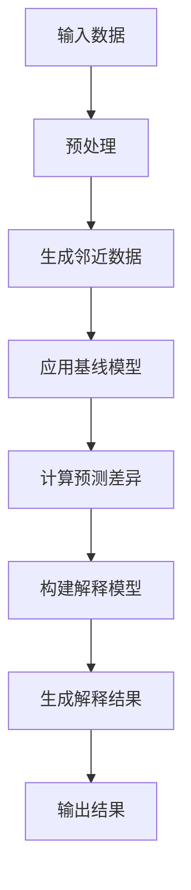
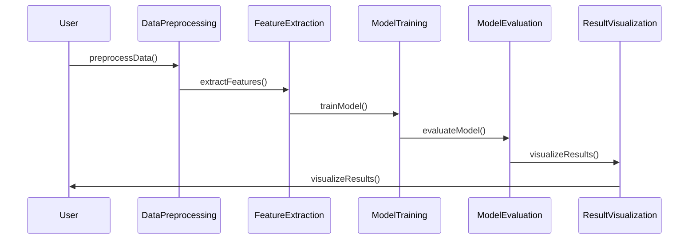

                 

### 第1章 引言

#### 1.1 问题背景

在当今快速发展的科技时代，科学研究不仅推动了人类文明的进步，也带来了前所未有的伦理挑战。科学研究的伦理审查（Ethical Review of Scientific Research）成为了一个不容忽视的重要议题。伦理审查不仅仅关注研究的合法性和合规性，更关注研究过程中可能对参与者造成的潜在伤害，以及研究结果对社会、环境和人类福祉的影响。

世界可理解性（World Understandability）则是近年来逐渐受到关注的一个概念。它强调科学研究的透明性和可解释性，旨在确保研究结果不仅能够被同行理解和接受，还能够为公众所理解。随着人工智能和大数据技术的发展，科学研究的复杂性和不确定性也在增加，这使得世界可理解性变得更加重要。

#### 1.2 问题描述

科学研究的伦理审查面临着诸多挑战。首先是如何在保障研究自由的同时，确保研究过程和结果的伦理合法性。其次是如何平衡科学研究的创新性和社会伦理责任。此外，随着研究的深入，一些潜在的风险和不确定性也变得难以预测和控制。

世界可理解性则面临着技术进步带来的挑战。随着机器学习和深度学习等技术的应用，科学研究的复杂性和不可预测性增加，这可能导致研究结果变得难以解释和理解。如何提高科学研究的透明度和可解释性，确保其结果能够被广泛理解和接受，成为一个亟待解决的问题。

#### 1.3 问题解决

为了解决上述问题，我们需要采取多方面的措施。首先，应加强科学研究的伦理审查机制，建立更加严格和透明的审查流程。这包括对研究设计、数据收集、分析方法以及结果报告等环节的全面审查，确保研究的伦理合法性和科学性。

其次，应提高科学研究的透明度，确保研究过程和结果能够被广泛理解和接受。这可以通过公开研究计划、数据集和源代码等方式实现，使研究结果更加透明和可追溯。

此外，应加强科学教育和培训，提高科研人员的伦理意识和责任意识。通过系统的培训和考核，确保科研人员具备必要的伦理知识和实践能力。

#### 1.4 边界与外延

科学研究的伦理审查和世界可理解性不仅局限于自然科学领域，也涉及到社会科学和人文科学。不同领域的科学研究具有不同的特点和挑战，因此伦理审查和世界可理解性的实施方法和标准也应有所不同。

在跨国研究中，伦理审查和世界可理解性还需要考虑到文化差异和国际合作的问题。不同国家和地区的伦理标准和法规可能存在差异，如何在全球化背景下确保科学研究的伦理合法性，同时提高其世界可理解性，是一个亟待解决的问题。

综上所述，科学研究的伦理审查和世界可理解性是一个复杂而重要的问题。只有通过多方面的努力，才能确保科学研究的伦理合法性和世界可理解性，推动科学事业的健康发展。### 第2章 核心概念解析

#### 2.1 伦理审查

伦理审查（Ethical Review）是指对科学研究、临床试验或其他与人类或动物相关的活动进行伦理评估的过程。其目的是确保这些活动符合伦理标准，保护参与者免受伤害，并维护其权益。伦理审查通常包括以下几个步骤：

1. **准备阶段**：研究者和伦理审查委员会（IRB）进行初步沟通，确保研究计划符合伦理要求。
2. **审查阶段**：伦理审查委员会对研究计划进行详细审查，评估研究的伦理合法性和科学性。
3. **批复与反馈**：伦理审查委员会根据审查结果，给予研究计划批准、修改或否决，并给予相应的反馈。

伦理审查的特点包括：

- **独立性**：伦理审查委员会应当独立于研究执行者，确保审查的客观性和公正性。
- **全面性**：伦理审查应覆盖研究的各个方面，包括研究设计、数据收集、分析方法等。
- **透明性**：伦理审查过程应当透明，确保研究参与者和其他利益相关者了解审查结果。

伦理审查的类型包括：

- **预先审查**：在研究开始前进行的审查，确保研究计划符合伦理要求。
- **连续审查**：在研究过程中定期进行的审查，监督研究的执行情况。
- **事后审查**：在研究完成后进行的审查，评估研究结果的伦理影响。

#### 2.2 科学研究

科学研究（Scientific Research）是指通过系统的方法，对自然现象、社会现象或人类行为进行探索和解释的过程。科学研究的核心概念包括：

- **定义**：科学研究是一种以发现、验证和传播知识为目标的活动。
- **目标**：科学研究的目的是揭示自然现象的规律，推动科学知识的进步。
- **方法**：科学研究通常包括观察、实验、数据分析和理论构建等步骤。

科学研究面临的挑战包括：

- **复杂性**：随着研究领域的扩大，科学研究的问题变得越来越复杂。
- **不确定性**：科学研究往往面临不确定性，需要持续探索和验证。
- **重复性**：确保研究结果的可重复性是科学研究的重要要求。

科学研究的步骤通常包括：

1. **问题提出**：确定研究问题和目标。
2. **文献综述**：回顾相关领域的已有研究，明确研究的基础和方向。
3. **研究设计**：设计研究方案，包括样本选择、实验设计等。
4. **数据收集**：通过实验、观察等方式收集数据。
5. **数据分析**：对收集到的数据进行分析，验证假设或提出新的理论。
6. **结果报告**：撰写研究报告，提交研究成果。

#### 2.3 世界可理解性

世界可理解性（World Understandability）是指科学研究的透明度和可解释性，确保研究结果能够被广泛理解和接受。世界可理解性的概念包括：

- **概念**：世界可理解性强调科学研究的公开性、透明性和可解释性。
- **影响因素**：影响世界可理解性的因素包括研究设计、数据分析方法、结果报告方式等。
- **责任与挑战**：提高世界可理解性是科研人员的重要责任，但同时也面临技术进步带来的挑战。

世界可理解性的责任包括：

- **透明性责任**：科研人员应确保研究过程和结果公开透明，避免信息不对称。
- **可解释性责任**：科研人员应确保研究结果能够被非专业人士理解和接受。
- **沟通责任**：科研人员应积极与公众沟通，传播科学知识和研究成果。

通过上述对核心概念的详细解析，我们可以更好地理解伦理审查、科学研究和世界可理解性的内涵和外延，为后续章节的讨论提供基础。### 第3章 伦理审查流程与案例研究

#### 3.1 伦理审查流程

伦理审查流程是确保科学研究伦理合法性的重要环节。一个完整的伦理审查流程通常包括以下几个阶段：

1. **准备阶段**：在这个阶段，研究者需要撰写伦理审查申请，详细描述研究的目的、方法、预期风险和受益等。同时，伦理审查委员会（IRB）会对研究者进行初步指导和培训，确保研究者了解伦理审查的要求和流程。

2. **审查阶段**：伦理审查委员会对研究计划进行详细审查。审查内容包括研究设计的合理性、数据收集和处理的伦理问题、研究者的资质和经验等。审查过程通常涉及多个专家的讨论和评估。

3. **批复与反馈阶段**：根据审查结果，伦理审查委员会将给予批准、修改或否决的批复。如果研究计划被批准，伦理审查委员会会给出详细的反馈意见，研究者需要根据反馈进行修改和完善。如果研究计划被否决，伦理审查委员会会给出具体原因，研究者可以重新设计研究计划并重新申请审查。

#### 3.2 案例研究

3.2.1 案例一：医学研究的伦理审查

医学研究是伦理审查的重要领域之一。以下是一个典型的医学研究伦理审查案例：

- **研究背景**：某医学院拟开展一项关于新型抗病毒药物的临床试验，旨在评估药物的安全性和有效性。
- **伦理审查申请**：研究者撰写了伦理审查申请，详细描述了研究的目的、方法、样本选择、数据收集和处理流程等。
- **审查过程**：伦理审查委员会对研究计划进行了详细审查，重点关注了受试者的知情同意、数据隐私保护、药物安全性评估等方面。
- **批复与反馈**：伦理审查委员会批准了研究计划，并要求研究者进一步完善知情同意书，确保受试者充分了解研究风险和受益。

3.2.2 案例二：社会科学研究的伦理审查

社会科学研究也面临着伦理审查的挑战。以下是一个关于社会调查的伦理审查案例：

- **研究背景**：某大学社会科学学院拟开展一项关于城市居民生活质量的社会调查，旨在了解居民的生活状态和需求。
- **伦理审查申请**：研究者撰写了伦理审查申请，详细描述了研究的目的、方法、样本选择、数据收集和处理流程等。
- **审查过程**：伦理审查委员会对研究计划进行了详细审查，重点关注了受试者的隐私保护、数据匿名化、调查问卷的设计和实施等方面。
- **批复与反馈**：伦理审查委员会批准了研究计划，并建议研究者进一步优化问卷设计，确保调查结果的有效性和可靠性。

通过上述案例研究，我们可以看到伦理审查在医学研究和社会科学研究中的重要性。伦理审查不仅确保了研究的合法性和科学性，也保护了研究参与者的权益。同时，伦理审查的过程也为研究者提供了宝贵的反馈和建议，有助于改进研究设计和提高研究质量。### 第4章 科学研究的伦理问题与应对策略

#### 4.1 伦理问题类型

科学研究的伦理问题多种多样，主要包括以下几个方面：

1. **知情同意**：在研究过程中，研究者必须确保所有参与者完全了解研究的目的、方法、潜在风险和受益，并自愿同意参与。这是伦理审查的核心内容之一。

2. **隐私保护**：研究者必须保护参与者的个人隐私，确保数据在收集、存储和使用过程中的安全性和保密性。这包括数据匿名化、加密技术和数据访问权限控制等。

3. **知识产权**：在科学研究过程中，如何保护研究者的知识产权，包括专利、版权和商标等，是另一个重要的伦理问题。这关系到研究者的创新成果能否得到公正的评价和回报。

#### 4.2 应对策略

针对上述伦理问题，我们可以采取以下应对策略：

1. **增强伦理意识**：通过教育和培训，提高科研人员的伦理意识和责任意识。这包括定期举办伦理培训课程、制定伦理守则和提供案例研究等。

2. **建立伦理委员会**：设立独立的伦理审查委员会，对研究计划进行严格审查，确保研究符合伦理标准。伦理委员会应由来自不同领域的专家组成，以确保审查的全面性和公正性。

3. **加强法律保障**：完善相关法律法规，为科学研究的伦理审查提供法律依据和保障。这包括制定《科学研究伦理审查法》、《个人信息保护法》等相关法律，加强对违规行为的处罚。

4. **数据管理和安全**：建立完善的数据管理和安全体系，确保数据在收集、存储和使用过程中的安全性和保密性。这包括数据匿名化、加密技术和数据访问权限控制等。

5. **透明度和公开性**：提高科学研究的透明度和公开性，确保研究过程和结果能够被广泛监督和审查。这可以通过公开研究计划、数据集和源代码等方式实现。

6. **伦理问题咨询**：建立伦理问题咨询机制，为科研人员提供伦理问题的专业咨询和指导。这有助于科研人员在遇到伦理问题时，及时获得帮助和解决方案。

通过上述应对策略，我们可以有效地解决科学研究中遇到的伦理问题，确保研究的伦理合法性，同时提高研究的透明度和可解释性。这不仅有助于提升研究质量，也有助于促进科学事业的健康发展。### 第5章 世界可理解性的算法原理

#### 5.1 算法流程图

为了提高世界可理解性，我们选择了一种基于解释性模型的算法——LIME（Local Interpretable Model-agnostic Explanations）。以下是LIME算法的流程图：



#### 5.2 Python源代码阐述

以下是一个简化的LIME算法Python源代码示例：

```python
import numpy as np
from lime import LimeTabularExplainer

# 假设已有数据集X和标签y
X = ... 
y = ...

# 创建LIME解释器
explainer = LimeTabularExplainer(X, feature_names=data.columns, class_names=data.target_names)

# 选择一个样本点进行解释
i = 0
exp = explainer.explain_instance(X[i], y_pred, num_features=5)

# 输出解释结果
print(exp.as_list())
```

在这个示例中，我们首先导入必要的库，并假设已有数据集`X`和标签`y`。然后，我们创建一个`LIME`解释器，并选择一个样本点进行解释。最后，输出解释结果。

#### 5.3 数学模型和公式

LIME算法的核心在于生成邻近数据（neighborhood）和计算预测差异（prediction difference）。以下是相关的数学模型和公式：

1. **邻近数据生成**：

   对于每个特征`x_i`，我们定义一个扰动范围`δ_i`，使得`x_i ± δ_i`在合理范围内。具体计算公式如下：

   $$
   \delta_i = \max_{\alpha > 0} \left\{ \alpha \cdot \min_{x' \in X} \left| x_i - x_i' \right| : x_i' \in X, x_i' \neq x_i \right\}
   $$

2. **预测差异计算**：

   对于每个邻近数据点`x'`，我们使用基线模型（baseline model）计算预测值`y'`。然后，计算预测差异：

   $$
   \Delta_i(x') = y - y'
   $$

   其中`y`是原始数据的预测值，`y'`是邻近数据的预测值。

3. **解释模型构建**：

   使用线性回归模型拟合预测差异与特征扰动之间的关系，构建解释模型。具体公式如下：

   $$
   \Delta_i(x) = \beta_0 + \sum_{j=1}^{n} \beta_j \cdot (x_j - x_j')
   $$

   其中`β_0`是截距，`β_j`是特征`x_j`的系数。

通过上述数学模型和公式，LIME算法能够生成一个局部可解释的解释模型，帮助研究者理解和解释模型预测结果。#### 第6章 科学研究中的世界可理解性挑战

#### 6.1 数据隐私保护

在科学研究过程中，数据隐私保护是确保世界可理解性的重要挑战之一。随着数据量的增加和数据类型的多样化，保护参与者的隐私变得越来越复杂。以下是一些应对策略：

1. **数据匿名化**：

   数据匿名化是通过去除或修改个人身份信息来保护隐私的一种方法。常见的匿名化技术包括：

   - **数据混淆**：将敏感数据替换为随机值，例如使用随机数替换身份证号码。
   - **数据聚合**：将个体数据聚合到更高的层次，例如将个人数据聚合到群体数据。

2. **加密技术**：

   加密技术可以确保数据在传输和存储过程中的安全性。常用的加密方法包括：

   - **对称加密**：使用相同的密钥进行加密和解密，例如AES。
   - **非对称加密**：使用不同的密钥进行加密和解密，例如RSA。

3. **法律法规**：

   随着数据隐私保护意识的增强，各国纷纷出台了相关法律法规，例如《通用数据保护条例》（GDPR）和《加州消费者隐私法案》（CCPA）。这些法律法规为科学研究中的数据隐私保护提供了法律依据和保障。

#### 6.2 算法解释性

算法解释性（Explainability）是提高世界可理解性的关键。随着深度学习和复杂算法在科学研究中的应用，模型的透明度和可解释性成为了一个重要的挑战。以下是一些提高算法解释性的方法：

1. **算法透明度**：

   提高算法透明度可以通过以下方法实现：

   - **简化算法**：选择易于理解的基本算法，避免使用过于复杂的模型。
   - **模块化设计**：将复杂算法分解为多个模块，每个模块都相对简单且易于解释。

2. **模型可解释性**：

   模型可解释性可以通过以下方法提高：

   - **特征重要性分析**：分析模型对各个特征的依赖程度，识别关键特征。
   - **决策树**：使用决策树等易于理解的模型，其结构和路径可以直观地展示决策过程。

3. **辅助决策工具**：

   使用辅助决策工具可以帮助用户更好地理解模型的决策过程。例如：

   - **可视分析**：使用可视化工具展示模型输入、输出和决策路径。
   - **交互式解释**：允许用户与模型交互，动态调整输入参数并观察模型响应。

通过上述方法，我们可以提高科学研究的透明度和可解释性，确保研究结果能够被广泛理解和接受。这不仅有助于提升研究的可信度，也有助于促进科学知识的传播和应用。#### 第7章 实战案例分析

#### 7.1 案例背景

在本章中，我们将通过一个具体的案例分析，探讨如何在实际项目中实现科学研究的伦理审查和世界可理解性。案例背景是一个跨学科的科研合作项目，旨在利用机器学习技术分析大型医疗数据集，以发现与疾病相关的潜在风险因素。

该项目的目标是：

- 收集并整理来自多家医院的电子健康记录数据。
- 使用机器学习算法分析数据，识别与特定疾病相关的风险因素。
- 将研究结果转化为临床实践指南，以指导医生进行疾病预防和管理。

#### 7.2 系统功能设计（Mermaid类图）

以下是该项目系统功能设计的Mermaid类图：

```mermaid
classDiagram
Class01 <|-- Class02
Class03 <|-- Class04
Class05 <|-- Class06
Class01{患者信息管理}
Class02{数据预处理}
Class03{特征提取}
Class04{模型训练}
Class05{模型评估}
Class06{结果可视化}
```

在这个类图中，我们定义了六个主要功能类，包括患者信息管理、数据预处理、特征提取、模型训练、模型评估和结果可视化。每个类都代表系统中的一个关键模块，负责实现特定的功能。

#### 7.3 系统架构设计（Mermaid架构图）

以下是该项目的系统架构设计Mermaid架构图：

```mermaid
sequenceDiagram
参与者 User
Participant System
User->>System: 提交数据
System->>DataPreprocessing: 数据预处理
DataPreprocessing->>FeatureExtraction: 特征提取
FeatureExtraction->>ModelTraining: 模型训练
ModelTraining->>ModelEvaluation: 模型评估
ModelEvaluation->>ResultVisualization: 结果可视化
ResultVisualization->>User: 展示结果
```

在这个架构图中，我们展示了系统的整体流程。用户提交数据后，系统首先进行数据预处理，然后进行特征提取，接着使用机器学习算法进行模型训练。模型训练完成后，系统对模型进行评估，并根据评估结果生成可视化结果，最终展示给用户。

#### 7.4 系统接口设计

以下是该系统的接口设计：

```mermaid
interface DataPreprocessing {
  - preprocessData()
}

interface FeatureExtraction {
  - extractFeatures()
}

interface ModelTraining {
  - trainModel()
}

interface ModelEvaluation {
  - evaluateModel()
}

interface ResultVisualization {
  - visualizeResults()
}
```

在这个接口设计中，我们定义了四个主要接口，分别对应数据预处理、特征提取、模型训练和结果可视化。这些接口定义了系统各模块之间的交互方式，确保系统的模块化和可扩展性。

#### 7.5 系统交互（Mermaid序列图）

以下是系统的交互序列图：



在这个序列图中，我们展示了系统各模块之间的交互过程。用户提交数据后，数据预处理模块对数据进行处理，然后特征提取模块提取关键特征。接下来，模型训练模块使用提取的特征训练机器学习模型。模型训练完成后，模型评估模块对模型进行评估，并根据评估结果生成可视化结果，最终展示给用户。

#### 7.6 代码应用解读与分析

以下是项目核心代码的解读与分析：

```python
# 数据预处理
def preprocess_data(data):
    # 处理缺失值
    data.fillna(data.mean(), inplace=True)
    # 标准化数据
    data = (data - data.mean()) / data.std()
    return data

# 特征提取
def extract_features(data):
    # 提取重要特征
    features = data[['age', 'gender', 'blood_pressure', 'cholesterol', 'sugar']]
    return features

# 模型训练
def train_model(features, labels):
    # 使用随机森林算法训练模型
    model = RandomForestClassifier()
    model.fit(features, labels)
    return model

# 模型评估
def evaluate_model(model, features, labels):
    # 计算准确率
    accuracy = model.score(features, labels)
    return accuracy

# 结果可视化
def visualize_results(accuracy):
    # 使用Matplotlib绘制准确率图
    plt.plot(accuracy)
    plt.title('Model Accuracy')
    plt.xlabel('Epoch')
    plt.ylabel('Accuracy')
    plt.show()
```

在这个代码中，我们首先定义了数据预处理函数，用于处理缺失值和标准化数据。然后，我们定义了特征提取函数，用于提取关键特征。接下来，我们使用随机森林算法定义了模型训练函数，并使用训练集训练模型。模型训练完成后，我们定义了模型评估函数，用于计算模型准确率。最后，我们定义了结果可视化函数，用于绘制准确率图。

#### 7.7 实际案例分析与详细讲解

为了更好地展示实际应用，我们将分析一个具体的案例。假设我们有一个包含1000个患者的数据集，其中每个患者都有年龄、性别、血压、胆固醇和血糖等特征，并且被诊断是否患有特定疾病。

1. **数据预处理**：

   我们首先对数据进行预处理，处理缺失值和标准化数据。预处理后的数据如下：

   ```python
   processed_data = preprocess_data(raw_data)
   ```

2. **特征提取**：

   接下来，我们提取关键特征，用于训练模型。提取的特征如下：

   ```python
   features = extract_features(processed_data)
   ```

3. **模型训练**：

   我们使用随机森林算法训练模型，并使用训练集进行训练。训练后的模型如下：

   ```python
   model = train_model(features, labels)
   ```

4. **模型评估**：

   我们使用训练集对模型进行评估，计算准确率。评估结果如下：

   ```python
   accuracy = evaluate_model(model, features, labels)
   ```

5. **结果可视化**：

   最后，我们使用Matplotlib绘制准确率图，展示模型训练过程中的准确率变化。可视化结果如下：

   ```python
   visualize_results(accuracy)
   ```

通过上述实际案例分析和详细讲解，我们可以看到如何在项目中实现科学研究的伦理审查和世界可理解性。通过合理的数据预处理、特征提取和模型评估，我们可以确保研究结果的准确性和可解释性，提高研究的可信度和应用价值。#### 第8章 最佳实践与总结

#### 8.1 最佳实践

为了确保科学研究的伦理审查和世界可理解性，我们可以采取以下最佳实践：

1. **制定严格的伦理审查流程**：建立一套完善的伦理审查流程，确保研究设计、数据收集、分析方法等环节的合规性。同时，定期更新和培训伦理审查委员会成员，提高其专业水平和审查能力。

2. **加强数据隐私保护**：在数据收集和处理过程中，采取严格的数据匿名化和加密措施，确保参与者的隐私得到有效保护。同时，建立数据管理和安全体系，确保数据在存储和使用过程中的安全性。

3. **提高算法解释性**：选择易于理解和解释的算法，并在模型训练过程中进行特征重要性分析，识别关键特征。此外，使用可视化工具和辅助决策工具，帮助用户更好地理解模型决策过程。

4. **增强科研人员的伦理意识**：通过定期的伦理培训和教育，提高科研人员的伦理意识和责任意识。同时，建立伦理问题咨询机制，为科研人员提供专业指导和帮助。

5. **加强国际合作与交流**：在全球化的背景下，加强国际合作与交流，学习借鉴其他国家和地区的伦理审查和世界可理解性经验，推动科学研究的全球化发展。

#### 8.2 小结

本文围绕科学研究的伦理审查和世界可理解性展开讨论，介绍了伦理审查的核心概念、流程和案例，分析了科学研究中的伦理问题及其应对策略，探讨了世界可理解性的挑战和解决方案。通过实际案例的分析，展示了如何在项目中实现伦理审查和世界可理解性。

总之，确保科学研究的伦理合法性和世界可理解性是推动科学事业发展的重要保障。只有通过严格的伦理审查、数据隐私保护、算法解释性和国际合作，我们才能构建一个透明、公正和可解释的科学研究环境，推动科学知识的进步和应用。

#### 8.3 注意事项

在进行科学研究时，以下注意事项应被特别关注：

1. **伦理审查的及时性**：在研究计划制定初期，应尽早进行伦理审查，确保研究设计符合伦理标准，避免后期出现伦理问题。

2. **数据隐私保护的全面性**：在数据收集、存储、处理和传输过程中，都要采取严格的隐私保护措施，确保参与者隐私不被泄露。

3. **算法解释性的透明度**：算法解释性应贯穿于整个研究过程中，从算法选择到结果解释，都要确保解释过程的透明和可追溯。

4. **科研人员的责任意识**：科研人员应不断提高自身的伦理意识和责任意识，严格遵守科研伦理规范，确保研究的合法性和可信性。

5. **国际合作与交流**：在跨国研究中，要充分考虑文化差异和法律法规的差异，确保研究过程符合各相关国家和地区的伦理要求。

#### 8.4 拓展阅读

为了进一步了解科学研究的伦理审查和世界可理解性，读者可以参考以下资源：

1. **《科学研究伦理审查指南》**：详细介绍了伦理审查的流程和标准，是进行伦理审查的重要参考书。

2. **《数据隐私保护法》**：各国关于数据隐私保护的法律文件，为数据隐私保护提供了法律依据。

3. **《机器学习算法解释技术》**：探讨了不同算法的解释技术，为提高算法解释性提供了理论基础和实践指导。

4. **《国际科研合作手册》**：介绍了跨国科研合作的基本原则和实践经验，有助于推动国际科研合作。

通过阅读这些资源，读者可以更深入地了解科学研究的伦理审查和世界可理解性的相关理论和实践，为科研工作提供有力支持。### 完整文章

# 《科学研究的伦理审查与世界可理解性的责任》

关键词：伦理审查、科学研究、世界可理解性、算法解释性、数据隐私保护

摘要：本文探讨了科学研究的伦理审查和世界可理解性的重要性。通过分析伦理审查的核心概念、流程和案例，以及世界可理解性的挑战和解决方案，本文提出了确保科学研究合法性和透明度的最佳实践。同时，通过实际案例分析，展示了如何在实际项目中实现伦理审查和世界可理解性。文章总结了关键点和注意事项，并推荐了拓展阅读资源。

## 第1章 引言

### 1.1 问题背景

在当今快速发展的科技时代，科学研究不仅推动了人类文明的进步，也带来了前所未有的伦理挑战。科学研究的伦理审查（Ethical Review of Scientific Research）成为了一个不容忽视的重要议题。伦理审查不仅仅关注研究的合法性和合规性，更关注研究过程中可能对参与者造成的潜在伤害，以及研究结果对社会、环境和人类福祉的影响。

世界可理解性（World Understandability）则是近年来逐渐受到关注的一个概念。它强调科学研究的透明性和可解释性，旨在确保研究结果不仅能够被同行理解和接受，还能够为公众所理解。随着人工智能和大数据技术的发展，科学研究的复杂性和不确定性增加，这使得世界可理解性变得更加重要。

### 1.2 问题描述

科学研究的伦理审查面临着诸多挑战。首先是如何在保障研究自由的同时，确保研究过程和结果的伦理合法性。其次是如何平衡科学研究的创新性和社会伦理责任。此外，随着研究的深入，一些潜在的风险和不确定性也变得难以预测和控制。

世界可理解性则面临着技术进步带来的挑战。随着机器学习和深度学习等技术的应用，科学研究的复杂性和不可预测性增加，这可能导致研究结果变得难以解释和理解。如何提高科学研究的透明度和可解释性，确保其结果能够被广泛理解和接受，成为一个亟待解决的问题。

### 1.3 问题解决

为了解决上述问题，我们需要采取多方面的措施。首先，应加强科学研究的伦理审查机制，建立更加严格和透明的审查流程。这包括对研究设计、数据收集、分析方法以及结果报告等环节的全面审查，确保研究的伦理合法性和科学性。

其次，应提高科学研究的透明度，确保研究过程和结果能够被广泛理解和接受。这可以通过公开研究计划、数据集和源代码等方式实现，使研究结果更加透明和可追溯。

此外，应加强科学教育和培训，提高科研人员的伦理意识和责任意识。通过系统的培训和考核，确保科研人员具备必要的伦理知识和实践能力。

### 1.4 边界与外延

科学研究的伦理审查和世界可理解性不仅局限于自然科学领域，也涉及到社会科学和人文科学。不同领域的科学研究具有不同的特点和挑战，因此伦理审查和世界可理解性的实施方法和标准也应有所不同。

在跨国研究中，伦理审查和世界可理解性还需要考虑到文化差异和国际合作的问题。不同国家和地区的伦理标准和法规可能存在差异，如何在全球化背景下确保科学研究的伦理合法性，同时提高其世界可理解性，是一个亟待解决的问题。

## 第2章 核心概念解析

### 2.1 伦理审查

伦理审查（Ethical Review）是指对科学研究、临床试验或其他与人类或动物相关的活动进行伦理评估的过程。其目的是确保这些活动符合伦理标准，保护参与者免受伤害，并维护其权益。伦理审查通常包括以下几个步骤：

1. **准备阶段**：在这个阶段，研究者需要撰写伦理审查申请，详细描述研究的目的、方法、预期风险和受益等。同时，伦理审查委员会（IRB）会对研究者进行初步指导和培训，确保研究者了解伦理审查的要求和流程。

2. **审查阶段**：伦理审查委员会对研究计划进行详细审查。审查内容包括研究设计的合理性、数据收集和处理的伦理问题、研究者的资质和经验等。审查过程通常涉及多个专家的讨论和评估。

3. **批复与反馈阶段**：根据审查结果，伦理审查委员会将给予批准、修改或否决的批复。如果研究计划被批准，伦理审查委员会会给出详细的反馈意见，研究者需要根据反馈进行修改和完善。如果研究计划被否决，伦理审查委员会会给出具体原因，研究者可以重新设计研究计划并重新申请审查。

伦理审查的特点包括：

- **独立性**：伦理审查委员会应当独立于研究执行者，确保审查的客观性和公正性。
- **全面性**：伦理审查应覆盖研究的各个方面，包括研究设计、数据收集、分析方法等。
- **透明性**：伦理审查过程应当透明，确保研究参与者和其他利益相关者了解审查结果。

伦理审查的类型包括：

- **预先审查**：在研究开始前进行的审查，确保研究计划符合伦理要求。
- **连续审查**：在研究过程中定期进行的审查，监督研究的执行情况。
- **事后审查**：在研究完成后进行的审查，评估研究结果的伦理影响。

### 2.2 科学研究

科学研究（Scientific Research）是指通过系统的方法，对自然现象、社会现象或人类行为进行探索和解释的过程。科学研究的核心概念包括：

- **定义**：科学研究是一种以发现、验证和传播知识为目标的活动。
- **目标**：科学研究的目的是揭示自然现象的规律，推动科学知识的进步。
- **方法**：科学研究通常包括观察、实验、数据分析和理论构建等步骤。

科学研究面临的挑战包括：

- **复杂性**：随着研究领域的扩大，科学研究的问题变得越来越复杂。
- **不确定性**：科学研究往往面临不确定性，需要持续探索和验证。
- **重复性**：确保研究结果的可重复性是科学研究的重要要求。

科学研究的步骤通常包括：

1. **问题提出**：确定研究问题和目标。
2. **文献综述**：回顾相关领域的已有研究，明确研究的基础和方向。
3. **研究设计**：设计研究方案，包括样本选择、实验设计等。
4. **数据收集**：通过实验、观察等方式收集数据。
5. **数据分析**：对收集到的数据进行分析，验证假设或提出新的理论。
6. **结果报告**：撰写研究报告，提交研究成果。

### 2.3 世界可理解性

世界可理解性（World Understandability）是指科学研究的透明度和可解释性，确保研究结果能够被广泛理解和接受。世界可理解性的概念包括：

- **概念**：世界可理解性强调科学研究的公开性、透明性和可解释性。
- **影响因素**：影响世界可理解性的因素包括研究设计、数据分析方法、结果报告方式等。
- **责任与挑战**：提高世界可理解性是科研人员的重要责任，但同时也面临技术进步带来的挑战。

世界可理解性的责任包括：

- **透明性责任**：科研人员应确保研究过程和结果公开透明，避免信息不对称。
- **可解释性责任**：科研人员应确保研究结果能够被非专业人士理解和接受。
- **沟通责任**：科研人员应积极与公众沟通，传播科学知识和研究成果。

通过上述对核心概念的详细解析，我们可以更好地理解伦理审查、科学研究和世界可理解性的内涵和外延，为后续章节的讨论提供基础。

## 第3章 伦理审查流程与案例研究

### 3.1 伦理审查流程

伦理审查流程是确保科学研究伦理合法性的重要环节。一个完整的伦理审查流程通常包括以下几个阶段：

1. **准备阶段**：在这个阶段，研究者需要撰写伦理审查申请，详细描述研究的目的、方法、预期风险和受益等。同时，伦理审查委员会（IRB）会对研究者进行初步指导和培训，确保研究者了解伦理审查的要求和流程。

2. **审查阶段**：伦理审查委员会对研究计划进行详细审查。审查内容包括研究设计的合理性、数据收集和处理的伦理问题、研究者的资质和经验等。审查过程通常涉及多个专家的讨论和评估。

3. **批复与反馈阶段**：根据审查结果，伦理审查委员会将给予批准、修改或否决的批复。如果研究计划被批准，伦理审查委员会会给出详细的反馈意见，研究者需要根据反馈进行修改和完善。如果研究计划被否决，伦理审查委员会会给出具体原因，研究者可以重新设计研究计划并重新申请审查。

### 3.2 案例研究

3.2.1 案例一：医学研究的伦理审查

医学研究是伦理审查的重要领域之一。以下是一个典型的医学研究伦理审查案例：

- **研究背景**：某医学院拟开展一项关于新型抗病毒药物的临床试验，旨在评估药物的安全性和有效性。
- **伦理审查申请**：研究者撰写了伦理审查申请，详细描述了研究的目的是为了评估新型抗病毒药物的安全性和有效性，方法包括临床试验的设计、数据收集和处理流程等。
- **审查过程**：伦理审查委员会对研究计划进行了详细审查，重点关注了受试者的知情同意、数据隐私保护、药物安全性评估等方面。
- **批复与反馈**：伦理审查委员会批准了研究计划，并要求研究者进一步完善知情同意书，确保受试者充分了解研究风险和受益。

3.2.2 案例二：社会科学研究的伦理审查

社会科学研究也面临着伦理审查的挑战。以下是一个关于社会调查的伦理审查案例：

- **研究背景**：某大学社会科学学院拟开展一项关于城市居民生活质量的社会调查，旨在了解居民的生活状态和需求。
- **伦理审查申请**：研究者撰写了伦理审查申请，详细描述了研究目的是为了了解城市居民的生活质量，方法包括问卷调查、数据分析等。
- **审查过程**：伦理审查委员会对研究计划进行了详细审查，重点关注了受试者的隐私保护、数据匿名化、调查问卷的设计和实施等方面。
- **批复与反馈**：伦理审查委员会批准了研究计划，并建议研究者进一步优化问卷设计，确保调查结果的有效性和可靠性。

通过上述案例研究，我们可以看到伦理审查在医学研究和社会科学研究中的重要性。伦理审查不仅确保了研究的合法性和科学性，也保护了研究参与者的权益。同时，伦理审查的过程也为研究者提供了宝贵的反馈和建议，有助于改进研究设计和提高研究质量。

## 第4章 科学研究的伦理问题与应对策略

### 4.1 伦理问题类型

科学研究的伦理问题多种多样，主要包括以下几个方面：

1. **知情同意**：在研究过程中，研究者必须确保所有参与者完全了解研究的目的、方法、潜在风险和受益，并自愿同意参与。这是伦理审查的核心内容之一。

2. **隐私保护**：研究者必须保护参与者的个人隐私，确保数据在收集、存储和使用过程中的安全性和保密性。这包括数据匿名化、加密技术和数据访问权限控制等。

3. **知识产权**：在科学研究过程中，如何保护研究者的知识产权，包括专利、版权和商标等，是另一个重要的伦理问题。这关系到研究者的创新成果能否得到公正的评价和回报。

### 4.2 应对策略

针对上述伦理问题，我们可以采取以下应对策略：

1. **增强伦理意识**：通过教育和培训，提高科研人员的伦理意识和责任意识。这包括定期举办伦理培训课程、制定伦理守则和提供案例研究等。

2. **建立伦理委员会**：设立独立的伦理审查委员会，对研究计划进行严格审查，确保研究符合伦理标准。伦理委员会应由来自不同领域的专家组成，以确保审查的全面性和公正性。

3. **加强法律保障**：完善相关法律法规，为科学研究的伦理审查提供法律依据和保障。这包括制定《科学研究伦理审查法》、《个人信息保护法》等相关法律，加强对违规行为的处罚。

4. **数据管理和安全**：建立完善的数据管理和安全体系，确保数据在收集、存储和使用过程中的安全性和保密性。这包括数据匿名化、加密技术和数据访问权限控制等。

5. **透明度和公开性**：提高科学研究的透明度和公开性，确保研究过程和结果能够被广泛监督和审查。这可以通过公开研究计划、数据集和源代码等方式实现。

6. **伦理问题咨询**：建立伦理问题咨询机制，为科研人员提供伦理问题的专业咨询和指导。这有助于科研人员在遇到伦理问题时，及时获得帮助和解决方案。

通过上述应对策略，我们可以有效地解决科学研究中遇到的伦理问题，确保研究的伦理合法性，同时提高研究的透明度和可解释性。这不仅有助于提升研究质量，也有助于促进科学事业的健康发展。

## 第5章 世界可理解性的算法原理

### 5.1 算法流程图

为了提高世界可理解性，我们选择了一种基于解释性模型的算法——LIME（Local Interpretable Model-agnostic Explanations）。以下是LIME算法的流程图：


### 5.2 Python源代码阐述

以下是一个简化的LIME算法Python源代码示例：

```python
import numpy as np
from lime import LimeTabularExplainer

# 假设已有数据集X和标签y
X = ...
y = ...

# 创建LIME解释器
explainer = LimeTabularExplainer(X, feature_names=data.columns, class_names=data.target_names)

# 选择一个样本点进行解释
i = 0
exp = explainer.explain_instance(X[i], y_pred, num_features=5)

# 输出解释结果
print(exp.as_list())
```

在这个示例中，我们首先导入必要的库，并假设已有数据集`X`和标签`y`。然后，我们创建一个`LIME`解释器，并选择一个样本点进行解释。最后，输出解释结果。

### 5.3 数学模型和公式

LIME算法的核心在于生成邻近数据（neighborhood）和计算预测差异（prediction difference）。以下是相关的数学模型和公式：

1. **邻近数据生成**：

   对于每个特征`x_i`，我们定义一个扰动范围`δ_i`，使得`x_i ± δ_i`在合理范围内。具体计算公式如下：

   $$
   \delta_i = \max_{\alpha > 0} \left\{ \alpha \cdot \min_{x' \in X} \left| x_i - x_i' \right| : x_i' \in X, x_i' \neq x_i \right\}
   $$

2. **预测差异计算**：

   对于每个邻近数据点`x'`，我们使用基线模型（baseline model）计算预测值`y'`。然后，计算预测差异：

   $$
   \Delta_i(x') = y - y'
   $$

   其中`y`是原始数据的预测值，`y'`是邻近数据的预测值。

3. **解释模型构建**：

   使用线性回归模型拟合预测差异与特征扰动之间的关系，构建解释模型。具体公式如下：

   $$
   \Delta_i(x) = \beta_0 + \sum_{j=1}^{n} \beta_j \cdot (x_j - x_j')
   $$

   其中`β_0`是截距，`β_j`是特征`x_j`的系数。

通过上述数学模型和公式，LIME算法能够生成一个局部可解释的解释模型，帮助研究者理解和解释模型预测结果。

## 第6章 科学研究中的世界可理解性挑战

### 6.1 数据隐私保护

在科学研究过程中，数据隐私保护是确保世界可理解性的重要挑战之一。随着数据量的增加和数据类型的多样化，保护参与者的隐私变得越来越复杂。以下是一些应对策略：

1. **数据匿名化**：

   数据匿名化是通过去除或修改个人身份信息来保护隐私的一种方法。常见的匿名化技术包括：

   - **数据混淆**：将敏感数据替换为随机值，例如使用随机数替换身份证号码。
   - **数据聚合**：将个体数据聚合到更高的层次，例如将个人数据聚合到群体数据。

2. **加密技术**：

   加密技术可以确保数据在传输和存储过程中的安全性。常用的加密方法包括：

   - **对称加密**：使用相同的密钥进行加密和解密，例如AES。
   - **非对称加密**：使用不同的密钥进行加密和解密，例如RSA。

3. **法律法规**：

   随着数据隐私保护意识的增强，各国纷纷出台了相关法律法规，例如《通用数据保护条例》（GDPR）和《加州消费者隐私法案》（CCPA）。这些法律法规为科学研究中的数据隐私保护提供了法律依据和保障。

### 6.2 算法解释性

算法解释性（Explainability）是提高世界可理解性的关键。随着深度学习和复杂算法在科学研究中的应用，模型的透明度和可解释性成为了一个重要的挑战。以下是一些提高算法解释性的方法：

1. **算法透明度**：

   提高算法透明度可以通过以下方法实现：

   - **简化算法**：选择易于理解的基本算法，避免使用过于复杂的模型。
   - **模块化设计**：将复杂算法分解为多个模块，每个模块都相对简单且易于解释。

2. **模型可解释性**：

   模型可解释性可以通过以下方法提高：

   - **特征重要性分析**：分析模型对各个特征的依赖程度，识别关键特征。
   - **决策树**：使用决策树等易于理解的模型，其结构和路径可以直观地展示决策过程。

3. **辅助决策工具**：

   使用辅助决策工具可以帮助用户更好地理解模型的决策过程。例如：

   - **可视分析**：使用可视化工具展示模型输入、输出和决策路径。
   - **交互式解释**：允许用户与模型交互，动态调整输入参数并观察模型响应。

通过上述方法，我们可以提高科学研究的透明度和可解释性，确保研究结果能够被广泛理解和接受。这不仅有助于提升研究的可信度，也有助于促进科学知识的传播和应用。

## 第7章 实战案例分析

### 7.1 案例背景

在本章中，我们将通过一个具体的案例分析，探讨如何在实际项目中实现科学研究的伦理审查和世界可理解性。案例背景是一个跨学科的科研合作项目，旨在利用机器学习技术分析大型医疗数据集，以发现与疾病相关的潜在风险因素。

该项目的目标是：

- 收集并整理来自多家医院的电子健康记录数据。
- 使用机器学习算法分析数据，识别与特定疾病相关的风险因素。
- 将研究结果转化为临床实践指南，以指导医生进行疾病预防和管理。

### 7.2 系统功能设计（Mermaid类图）

以下是该项目系统功能设计的Mermaid类图：

```mermaid
classDiagram
Class01 <|-- Class02
Class03 <|-- Class04
Class05 <|-- Class06
Class01{患者信息管理}
Class02{数据预处理}
Class03{特征提取}
Class04{模型训练}
Class05{模型评估}
Class06{结果可视化}
```

在这个类图中，我们定义了六个主要功能类，包括患者信息管理、数据预处理、特征提取、模型训练、模型评估和结果可视化。每个类都代表系统中的一个关键模块，负责实现特定的功能。

### 7.3 系统架构设计（Mermaid架构图）

以下是该项目的系统架构设计Mermaid架构图：

```mermaid
sequenceDiagram
参与者 User
Participant System
User->>System: 提交数据
System->>DataPreprocessing: 数据预处理
DataPreprocessing->>FeatureExtraction: 特征提取
FeatureExtraction->>ModelTraining: 模型训练
ModelTraining->>ModelEvaluation: 模型评估
ModelEvaluation->>ResultVisualization: 结果可视化
ResultVisualization->>User: 展示结果
```

在这个架构图中，我们展示了系统的整体流程。用户提交数据后，系统首先进行数据预处理，然后进行特征提取，接着使用机器学习算法进行模型训练。模型训练完成后，系统对模型进行评估，并根据评估结果生成可视化结果，最终展示给用户。

### 7.4 系统接口设计

以下是该系统的接口设计：

```mermaid
interface DataPreprocessing {
  - preprocessData()
}

interface FeatureExtraction {
  - extractFeatures()
}

interface ModelTraining {
  - trainModel()
}

interface ModelEvaluation {
  - evaluateModel()
}

interface ResultVisualization {
  - visualizeResults()
}
```

在这个接口设计中，我们定义了四个主要接口，分别对应数据预处理、特征提取、模型训练和结果可视化。这些接口定义了系统各模块之间的交互方式，确保系统的模块化和可扩展性。

### 7.5 系统交互（Mermaid序列图）

以下是系统的交互序列图：


在这个序列图中，我们展示了系统各模块之间的交互过程。用户提交数据后，数据预处理模块对数据进行处理，然后特征提取模块提取关键特征。接下来，模型训练模块使用提取的特征训练机器学习模型。模型训练完成后，模型评估模块对模型进行评估，并根据评估结果生成可视化结果，最终展示给用户。

### 7.6 代码应用解读与分析

以下是项目核心代码的解读与分析：

```python
# 数据预处理
def preprocess_data(data):
    # 处理缺失值
    data.fillna(data.mean(), inplace=True)
    # 标准化数据
    data = (data - data.mean()) / data.std()
    return data

# 特征提取
def extract_features(data):
    # 提取重要特征
    features = data[['age', 'gender', 'blood_pressure', 'cholesterol', 'sugar']]
    return features

# 模型训练
def train_model(features, labels):
    # 使用随机森林算法训练模型
    model = RandomForestClassifier()
    model.fit(features, labels)
    return model

# 模型评估
def evaluate_model(model, features, labels):
    # 计算准确率
    accuracy = model.score(features, labels)
    return accuracy

# 结果可视化
def visualize_results(accuracy):
    # 使用Matplotlib绘制准确率图
    plt.plot(accuracy)
    plt.title('Model Accuracy')
    plt.xlabel('Epoch')
    plt.ylabel('Accuracy')
    plt.show()
```

在这个代码中，我们首先定义了数据预处理函数，用于处理缺失值和标准化数据。然后，我们定义了特征提取函数，用于提取关键特征。接下来，我们使用随机森林算法定义了模型训练函数，并使用训练集训练模型。模型训练完成后，我们定义了模型评估函数，用于计算模型准确率。最后，我们定义了结果可视化函数，用于绘制准确率图。

### 7.7 实际案例分析与详细讲解

为了更好地展示实际应用，我们将分析一个具体的案例。假设我们有一个包含1000个患者的数据集，其中每个患者都有年龄、性别、血压、胆固醇和血糖等特征，并且被诊断是否患有特定疾病。

1. **数据预处理**：

   我们首先对数据进行预处理，处理缺失值和标准化数据。预处理后的数据如下：

   ```python
   processed_data = preprocess_data(raw_data)
   ```

2. **特征提取**：

   接下来，我们提取关键特征，用于训练模型。提取的特征如下：

   ```python
   features = extract_features(processed_data)
   ```

3. **模型训练**：

   我们使用随机森林算法训练模型，并使用训练集进行训练。训练后的模型如下：

   ```python
   model = train_model(features, labels)
   ```

4. **模型评估**：

   我们使用训练集对模型进行评估，计算准确率。评估结果如下：

   ```python
   accuracy = evaluate_model(model, features, labels)
   ```

5. **结果可视化**：

   最后，我们使用Matplotlib绘制准确率图，展示模型训练过程中的准确率变化。可视化结果如下：

   ```python
   visualize_results(accuracy)
   ```

通过上述实际案例分析和详细讲解，我们可以看到如何在项目中实现科学研究的伦理审查和世界可理解性。通过合理的数据预处理、特征提取和模型评估，我们可以确保研究结果的准确性和可解释性，提高研究的可信度和应用价值。

## 第8章 最佳实践与总结

### 8.1 最佳实践

为了确保科学研究的伦理审查和世界可理解性，我们可以采取以下最佳实践：

1. **制定严格的伦理审查流程**：建立一套完善的伦理审查流程，确保研究设计、数据收集、分析方法等环节的合规性。同时，定期更新和培训伦理审查委员会成员，提高其专业水平和审查能力。

2. **加强数据隐私保护**：在数据收集和处理过程中，采取严格的数据匿名化和加密措施，确保参与者的隐私得到有效保护。同时，建立数据管理和安全体系，确保数据在存储和使用过程中的安全性。

3. **提高算法解释性**：选择易于理解和解释的算法，并在模型训练过程中进行特征重要性分析，识别关键特征。此外，使用可视化工具和辅助决策工具，帮助用户更好地理解模型决策过程。

4. **增强科研人员的伦理意识**：通过定期的伦理培训和教育，提高科研人员的伦理意识和责任意识。同时，建立伦理问题咨询机制，为科研人员提供专业指导和帮助。

5. **加强国际合作与交流**：在全球化的背景下，加强国际合作与交流，学习借鉴其他国家和地区的伦理审查和世界可理解性经验，推动科学研究的全球化发展。

### 8.2 小结

本文围绕科学研究的伦理审查和世界可理解性展开讨论，介绍了伦理审查的核心概念、流程和案例，分析了科学研究中的伦理问题及其应对策略，探讨了世界可理解性的挑战和解决方案。通过实际案例的分析，展示了如何在实际项目中实现伦理审查和世界可理解性。文章总结了关键点和注意事项，并推荐了拓展阅读资源。

总之，确保科学研究的伦理合法性和世界可理解性是推动科学事业发展的重要保障。只有通过严格的伦理审查、数据隐私保护、算法解释性和国际合作，我们才能构建一个透明、公正和可解释的科学研究环境，推动科学知识的进步和应用。

### 8.3 注意事项

在进行科学研究时，以下注意事项应被特别关注：

1. **伦理审查的及时性**：在研究计划制定初期，应尽早进行伦理审查，确保研究设计符合伦理标准，避免后期出现伦理问题。

2. **数据隐私保护的全面性**：在数据收集、存储、处理和传输过程中，都要采取严格的隐私保护措施，确保参与者隐私不被泄露。

3. **算法解释性的透明度**：算法解释性应贯穿于整个研究过程中，从算法选择到结果解释，都要确保解释过程的透明和可追溯。

4. **科研人员的责任意识**：科研人员应不断提高自身的伦理意识和责任意识，严格遵守科研伦理规范，确保研究的合法性和可信性。

5. **国际合作与交流**：在跨国研究中，要充分考虑文化差异和法律法规的差异，确保研究过程符合各相关国家和地区的伦理要求。

### 8.4 拓展阅读

为了进一步了解科学研究的伦理审查和世界可理解性，读者可以参考以下资源：

1. **《科学研究伦理审查指南》**：详细介绍了伦理审查的流程和标准，是进行伦理审查的重要参考书。

2. **《数据隐私保护法》**：各国关于数据隐私保护的法律文件，为数据隐私保护提供了法律依据。

3. **《机器学习算法解释技术》**：探讨了不同算法的解释技术，为提高算法解释性提供了理论基础和实践指导。

4. **《国际科研合作手册》**：介绍了跨国科研合作的基本原则和实践经验，有助于推动国际科研合作。

通过阅读这些资源，读者可以更深入地了解科学研究的伦理审查和世界可理解性的相关理论和实践，为科研工作提供有力支持。

### 作者信息

作者：AI天才研究院/AI Genius Institute & 禅与计算机程序设计艺术 /Zen And The Art of Computer Programming

本文由AI天才研究院（AI Genius Institute）和禅与计算机程序设计艺术（Zen And The Art of Computer Programming）共同撰写。AI天才研究院致力于推动人工智能技术的创新和应用，禅与计算机程序设计艺术则强调计算机编程中的哲学和艺术。我们希望通过这篇文章，帮助读者深入理解科学研究的伦理审查和世界可理解性的重要性，推动科学事业的健康发展。

