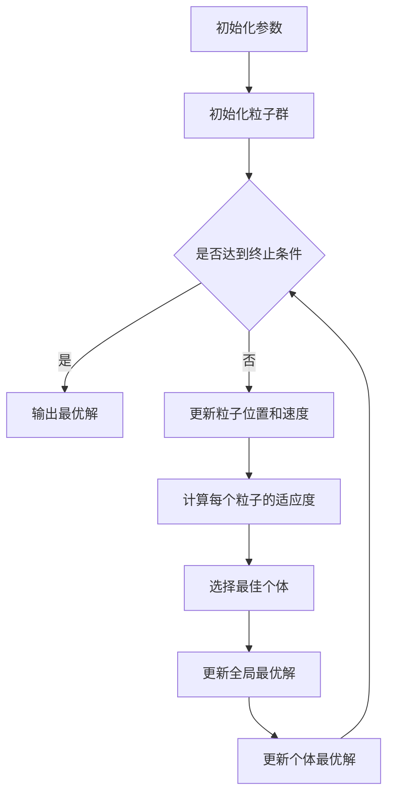
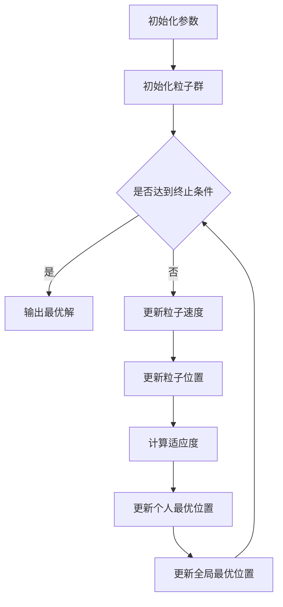
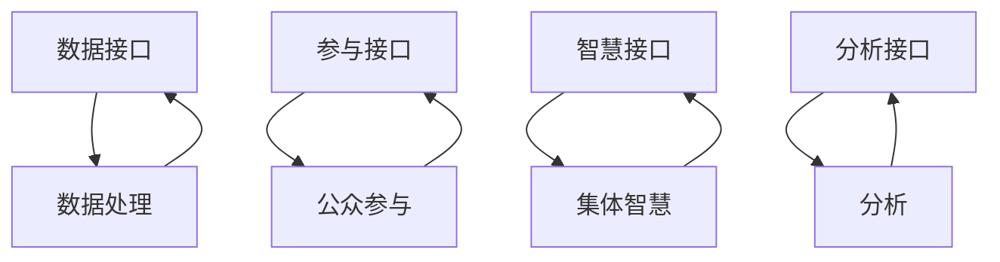
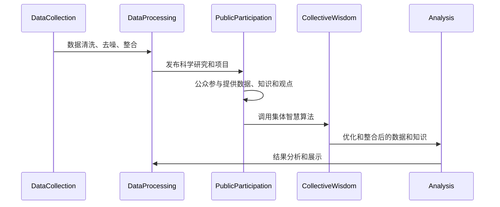

                 

### 文章标题

### 关键词

- 科学研究
- 公众参与
- 集体智慧
- 世界理解
- 算法原理
- 系统架构

### 摘要

本文深入探讨了科学研究的公众参与及其如何通过集体智慧促进我们对世界的理解。首先，我们介绍了科学研究现状及公众参与的背景和重要性。接着，我们详细阐述了集体智慧的概念及其在科学研究中的作用，并探讨了集体智慧与公众参与之间的关系。本文的核心内容还包括核心概念的原理分析、算法原理讲解以及系统架构设计。最后，我们通过实战案例和最佳实践总结，为科学研究的公众参与提供切实可行的指导。通过本文，我们希望能激发更多人参与到科学研究的公众参与中，共同促进世界的理解和进步。

---

## 第一部分：背景介绍

### 1.1 问题背景

在当今快速发展的科技时代，科学研究的重要性愈发凸显。然而，科学研究的进展面临着一系列挑战。首先，科学研究的复杂性不断增加，单个研究者或小团队难以独立完成大规模的研究项目。其次，科学研究的成本日益上升，对于资金和资源的依赖性增强。最后，科学研究的透明度和公众信任度面临质疑，科学成果的普及和应用效果不佳。

这些问题促使我们思考：如何提高科学研究的效率和质量，如何更好地将科学研究的成果转化为公众的理解和应用？在此背景下，公众参与科学研究成为了一种重要的解决思路。公众参与不仅能够带来新的观点和视角，还能增强科学研究的透明度和公众信任度，促进科学成果的普及和应用。

### 1.2 问题解决

#### 1.2.1 集体智慧的概念

集体智慧（Collective Wisdom）是指在一个集体中，通过信息共享、协同工作和合作创新，形成的一种超出个体能力的智慧。这种智慧不仅体现在知识积累和经验传承上，还体现在对复杂问题的洞察和解决能力上。

#### 1.2.2 集体智慧在科学研究中的作用

集体智慧在科学研究中的作用主要体现在以下几个方面：

1. **信息共享与知识整合**：通过集体智慧，科学家们可以更加高效地共享信息和知识，整合各种研究成果，形成更加全面的科学认知。
2. **协同创新与问题解决**：集体智慧能够激发科学家们的创新思维，通过协同工作，共同解决复杂的科学问题。
3. **公众参与与透明度提升**：集体智慧能够将科学研究过程透明化，使公众更好地理解科学研究的进展，提高公众对科学研究的信任度。

#### 1.2.3 集体智慧与公众参与的关系

集体智慧与公众参与是相辅相成的。公众参与为集体智慧提供了丰富的信息和视角，而集体智慧则能够更好地整合这些信息，提高科学研究的效率和质量。具体而言，公众参与可以通过以下方式促进集体智慧的形成：

1. **数据贡献**：公众可以为科学研究提供大量的数据，这些数据可能来自日常生活中的观察和记录，对于科学家来说具有很高的价值。
2. **观点分享**：公众可以分享自己对科学问题的看法和观点，这些观点可能会启发科学家的研究思路。
3. **参与决策**：公众参与科学研究的决策过程，能够提高科学研究的透明度和公众信任度。

### 1.3 边界与外延

#### 1.3.1 研究范围

本文的研究范围主要集中于科学研究的公众参与和集体智慧在科学研究中的应用。具体包括：

1. **公众参与的形式**：如何通过不同的方式让公众参与到科学研究中。
2. **集体智慧的机制**：如何形成和利用集体智慧，提高科学研究的效率和质量。
3. **案例分析**：通过具体案例，探讨集体智慧和公众参与在科学研究中的实际应用。

#### 1.3.2 重点领域

本文将重点关注以下领域：

1. **生物学**：如基因组学研究、生物多样性保护等。
2. **环境科学**：如气候变化研究、环境保护等。
3. **社会科学**：如社会科学调查、社会行为研究等。

#### 1.3.3 其他领域的应用

集体智慧和公众参与不仅在科学研究中有广泛应用，在其他领域如教育、商业、公共政策等也有巨大的潜力。例如，在教育领域，可以通过公众参与提升教育质量；在商业领域，可以通过公众参与优化产品设计和服务；在公共政策领域，可以通过公众参与提高政策的科学性和民主性。

### 1.4 概念结构与核心要素组成

#### 1.4.1 科学研究的公众参与

**定义**：科学研究的公众参与是指公众在科学研究的各个阶段（如研究选题、数据收集、结果分析等）的参与，以及科学研究成果的普及和应用。

**类型**：

1. **数据参与**：公众提供数据支持科学研究。
2. **知识参与**：公众提供知识和经验，丰富科学研究的视角。
3. **决策参与**：公众参与科学研究的决策过程，提高研究的透明度和公众信任度。

**流程**：

1. **选题与需求分析**：确定研究主题和公众参与的需求。
2. **宣传与动员**：通过多种渠道宣传科学研究的公众参与，动员公众参与。
3. **数据收集与分析**：公众提供数据，科学家进行分析和研究。
4. **成果发布与反馈**：将科学研究的成果向公众发布，收集公众反馈，不断优化研究。

#### 1.4.2 集体智慧

**定义**：集体智慧是指一个集体中，通过信息共享、协同工作和合作创新，形成的一种超出个体能力的智慧。

**特点**：

1. **协同性**：集体智慧依赖于集体成员之间的协同合作。
2. **多样性**：集体智慧来源于不同个体之间的多样性和差异。
3. **动态性**：集体智慧是一个不断演化、更新的过程。

**形成机制**：

1. **信息共享**：集体成员之间共享信息和知识，形成知识网络。
2. **协同合作**：集体成员通过协同合作，共同解决复杂问题。
3. **创新驱动**：集体智慧通过创新思维和合作创新，不断优化和提升。

#### 1.4.3 世界理解

**定义**：世界理解是指人类对自然界、社会现象和自我认知的综合理解和解释。

**层次**：

1. **科学理解**：通过科学方法对自然界和科学现象的理解。
2. **哲学理解**：通过哲学思考对社会现象和人类存在的理解。
3. **艺术理解**：通过艺术体验对自然界和人类情感的理解。

**影响**：

1. **社会进步**：世界理解推动了社会的发展和进步。
2. **文化传承**：世界理解是文化传承和发展的基础。
3. **人类认知**：世界理解拓展了人类的认知边界，提升了人类的自我认知。

---

## 第二部分：核心概念与联系

### 2.1 核心概念原理

#### 2.1.1 科学研究的公众参与

**动机**：

1. **提高研究效率和质量**：公众的参与可以带来新的视角和知识，提高科学研究的效率和质量。
2. **增强研究透明度和公众信任度**：公众参与可以提高科学研究的透明度，增强公众对科学研究的信任度。
3. **促进科学普及和应用**：公众参与可以促进科学研究成果的普及和应用，提高科学的社会价值。

**方式**：

1. **数据参与**：公众可以通过提供数据支持科学研究，如气象观测、生态环境监测等。
2. **知识参与**：公众可以通过分享知识和经验，丰富科学研究的视角，如历史事件记录、社会行为观察等。
3. **决策参与**：公众可以通过参与科学研究的决策过程，提高研究的透明度和公众信任度。

**成果评估**：

1. **效果评估**：评估公众参与对科学研究效率和质量的影响。
2. **满意度评估**：评估公众对参与科学研究过程的满意度。
3. **影响评估**：评估公众参与对科学研究成果的普及和应用效果。

#### 2.1.2 集体智慧

**定义**：集体智慧是指一个集体中，通过信息共享、协同工作和合作创新，形成的一种超出个体能力的智慧。

**特点**：

1. **协同性**：集体智慧依赖于集体成员之间的协同合作。
2. **多样性**：集体智慧来源于不同个体之间的多样性和差异。
3. **动态性**：集体智慧是一个不断演化、更新的过程。

**形成机制**：

1. **信息共享**：集体成员之间共享信息和知识，形成知识网络。
2. **协同合作**：集体成员通过协同合作，共同解决复杂问题。
3. **创新驱动**：集体智慧通过创新思维和合作创新，不断优化和提升。

#### 2.1.3 世界理解

**定义**：世界理解是指人类对自然界、社会现象和自我认知的综合理解和解释。

**层次**：

1. **科学理解**：通过科学方法对自然界和科学现象的理解。
2. **哲学理解**：通过哲学思考对社会现象和人类存在的理解。
3. **艺术理解**：通过艺术体验对自然界和人类情感的理解。

**影响**：

1. **社会进步**：世界理解推动了社会的发展和进步。
2. **文化传承**：世界理解是文化传承和发展的基础。
3. **人类认知**：世界理解拓展了人类的认知边界，提升了人类的自我认知。

### 2.2 概念属性特征对比表格

| 概念         | 定义                                                                                   | 特点                                                                                      | 形成机制                                                         | 影响                           |
|--------------|-----------------------------------------------------------------------------------------|-------------------------------------------------------------------------------------------|----------------------------------------------------------------|------------------------------|
| 科学研究的公众参与 | 公众在科学研究的各个阶段的参与，以及科学研究成果的普及和应用。                       | 提高研究效率和质量、增强研究透明度和公众信任度、促进科学普及和应用。 | 选题与需求分析、宣传与动员、数据收集与分析、成果发布与反馈。 | 拓展科学研究的边界，提升公众科学素养。 |
| 集体智慧     | 在一个集体中，通过信息共享、协同工作和合作创新，形成的一种超出个体能力的智慧。         | 协同性、多样性、动态性。                                                           | 信息共享、协同合作、创新驱动。                              | 提高问题解决能力，促进科学创新。     |
| 世界理解     | 人类对自然界、社会现象和自我认知的综合理解和解释。                                    | 科学理解、哲学理解、艺术理解。                                                    | 科学方法、哲学思考、艺术体验。                              | 推动社会进步、传承文化、拓展认知边界。 |

### 2.3 ER实体关系图架构

**2.3.1 科学研究公众参与系统**

在科学研究公众参与系统中，主要包括以下实体：

1. **研究者**：负责科学研究的主体，具有研究能力和知识。
2. **公众参与者**：参与科学研究的公众，可以是个人或团体，提供数据、知识和观点。
3. **研究项目**：科学研究的具体项目，包括研究主题、目标、方法等。
4. **数据**：公众参与者提供的研究数据，用于科学研究分析。
5. **知识**：公众参与者的知识和经验，丰富科学研究的视角。
6. **成果**：科学研究的最终成果，包括论文、报告、应用等。

**关系定义**：

1. **研究者与研究项目**：研究者负责研究项目的具体实施。
2. **公众参与者与研究项目**：公众参与者参与研究项目，提供数据、知识和观点。
3. **研究项目与成果**：研究项目产出成果，用于科学成果的发布和普及。
4. **数据与知识**：数据是知识的基础，知识是数据的升华。

**ER图展示**：

```mermaid
erDiagram
  研究者 ||--|{ 研究项目 }|| 
  公众参与者 ||--|{ 研究项目 }|| 
  研究项目 ||--|{ 成果 }|| 
  数据 ||--|{ 研究项目 }|| 
  知识 ||--|{ 研究项目 }|| 
```

---

## 第三部分：算法原理讲解

### 3.1 集体智慧算法概述

集体智慧算法是指通过模拟集体智慧的形成机制，利用群体协作和智能优化技术来解决问题的一类算法。这些算法通常具有以下特点：

1. **分布式计算**：集体智慧算法通常采用分布式计算的方式，充分利用群体中每个个体的计算能力和知识。
2. **协同优化**：算法通过协同优化，实现群体智能的累积和提升。
3. **自组织性**：集体智慧算法具有自组织性，能够在没有中央控制的情况下，通过个体之间的相互作用，形成高效的协作体系。

根据集体智慧的形成机制和优化目标，集体智慧算法可以分为以下几类：

1. **基于博弈论的集体智慧算法**：通过模拟个体之间的博弈行为，实现集体智慧的形成。
2. **基于群体智能优化的集体智慧算法**：如粒子群优化（PSO）、遗传算法（GA）等，通过模拟群体中的智能优化过程，实现问题的求解。
3. **基于社会网络分析的集体智慧算法**：通过分析个体之间的社会网络关系，实现群体智能的协同和优化。

### 3.2 集体智慧算法mermaid流程图

以下是一个典型的基于群体智能优化的集体智慧算法（如粒子群优化）的mermaid流程图：



### 3.3 Python源代码解析

以下是一个简单的粒子群优化算法（PSO）的Python源代码示例，用于求解函数f(x) = x^2的最小值：

```python
import random
import numpy as np

# 初始化参数
num_particles = 30
num_iterations = 100
dimension = 1
x_min, x_max = -10, 10

# 初始化粒子群
particles = np.random.uniform(x_min, x_max, (num_particles, dimension))
velocities = np.zeros((num_particles, dimension))
personal_best_solutions = particles.copy()
personal_best_fitness = np.array([f(x) for x in particles])
global_best_solution = personal_best_solutions[np.argmin(personal_best_fitness)]
global_best_fitness = np.min(personal_best_fitness)

# 粒子群优化
for _ in range(num_iterations):
    for i in range(num_particles):
        # 更新速度
        r1 = random.random()
        r2 = random.random()
        cognitive_component = r1 * (personal_best_solutions[i] - particles[i])
        social_component = r2 * (global_best_solution - particles[i])
        velocities[i] += cognitive_component + social_component
        
        # 更新位置
        particles[i] += velocities[i]
        
        # 限制粒子位置
        particles[i] = np.clip(particles[i], x_min, x_max)
        
        # 计算适应度
        fitness = f(particles[i])
        
        # 更新个人最优解
        if fitness < personal_best_fitness[i]:
            personal_best_solutions[i] = particles[i]
            personal_best_fitness[i] = fitness
    
    # 更新全局最优解
    if np.min(personal_best_fitness) < global_best_fitness:
        global_best_solution = personal_best_solutions[np.argmin(personal_best_fitness)]
        global_best_fitness = np.min(personal_best_fitness)

# 输出最优解
print("最优解:", global_best_solution)
print("最小值:", global_best_fitness)

# f(x) = x^2 的适应度函数
def f(x):
    return x**2
```

### 3.4 数学模型与公式

粒子群优化（PSO）算法的核心在于粒子的速度更新和位置更新。以下是PSO算法的数学模型和公式：

**速度更新公式**：

$$
v_{i}(t+1) = v_{i}(t) + c_{1}r_{1}(p_{i}(t) - x_{i}(t)) + c_{2}r_{2}(g_{best} - x_{i}(t))
$$

其中，$v_{i}(t+1)$ 和 $v_{i}(t)$ 分别为粒子 $i$ 在时间 $t+1$ 和 $t$ 的速度，$p_{i}(t)$ 为粒子 $i$ 的个人最优位置，$g_{best}$ 为全局最优位置，$c_{1}$ 和 $c_{2}$ 为学习因子，$r_{1}$ 和 $r_{2}$ 为随机数。

**位置更新公式**：

$$
x_{i}(t+1) = x_{i}(t) + v_{i}(t+1)
$$

其中，$x_{i}(t+1)$ 和 $x_{i}(t)$ 分别为粒子 $i$ 在时间 $t+1$ 和 $t$ 的位置。

**适应度函数**：

通常，适应度函数用来评价粒子的优劣。在优化问题中，适应度函数是一个目标函数，用来衡量解的优劣。例如，对于最小化问题，适应度函数可以定义为：

$$
f(x) = -x^2
$$

**算法流程**：

1. **初始化**：设置粒子的初始位置和速度，以及学习因子等参数。
2. **迭代计算**：对于每个粒子，根据速度更新公式和位置更新公式，更新粒子的速度和位置。
3. **适应度评估**：计算每个粒子的适应度值，更新个人最优位置和全局最优位置。
4. **终止条件**：判断是否达到终止条件，如达到最大迭代次数或最优适应度值收敛。

以下是PSO算法的mermaid流程图：



### 3.5 数学模型与公式应用举例

以求解函数f(x) = x^2的最小值为例，使用粒子群优化（PSO）算法进行求解。

**步骤1：初始化参数**

- 粒子数量：num_particles = 30
- 迭代次数：num_iterations = 100
- 维度：dimension = 1
- 最小值范围：x_min, x_max = -10, 10

**步骤2：初始化粒子群**

- 初始化粒子位置和速度
- 初始化个人最优位置和适应度

**步骤3：迭代计算**

1. **更新速度**：根据速度更新公式，计算每个粒子的新速度。
2. **更新位置**：根据位置更新公式，计算每个粒子的新位置。
3. **计算适应度**：计算每个粒子的适应度值，即函数f(x) = x^2的值。
4. **更新个人最优位置和适应度**：如果当前粒子的适应度值优于个人最优适应度值，更新个人最优位置和适应度。
5. **更新全局最优位置和适应度**：如果所有粒子的个人最优适应度值中，最优的适应度值优于全局最优适应度值，更新全局最优位置和适应度。

**步骤4：输出最优解**

- 输出全局最优位置和适应度，即最小值。

以下是PSO算法求解f(x) = x^2的最小值的Python代码示例：

```python
import random
import numpy as np

# 初始化参数
num_particles = 30
num_iterations = 100
dimension = 1
x_min, x_max = -10, 10

# 初始化粒子群
particles = np.random.uniform(x_min, x_max, (num_particles, dimension))
velocities = np.zeros((num_particles, dimension))
personal_best_solutions = particles.copy()
personal_best_fitness = np.array([f(x) for x in particles])
global_best_solution = personal_best_solutions[np.argmin(personal_best_fitness)]
global_best_fitness = np.min(personal_best_fitness)

# 粒子群优化
for _ in range(num_iterations):
    for i in range(num_particles):
        # 更新速度
        r1 = random.random()
        r2 = random.random()
        cognitive_component = r1 * (personal_best_solutions[i] - particles[i])
        social_component = r2 * (global_best_solution - particles[i])
        velocities[i] += cognitive_component + social_component
        
        # 更新位置
        particles[i] += velocities[i]
        
        # 限制粒子位置
        particles[i] = np.clip(particles[i], x_min, x_max)
        
        # 计算适应度
        fitness = f(particles[i])
        
        # 更新个人最优解
        if fitness < personal_best_fitness[i]:
            personal_best_solutions[i] = particles[i]
            personal_best_fitness[i] = fitness
    
    # 更新全局最优解
    if np.min(personal_best_fitness) < global_best_fitness:
        global_best_solution = personal_best_solutions[np.argmin(personal_best_fitness)]
        global_best_fitness = np.min(personal_best_fitness)

# 输出最优解
print("最优解:", global_best_solution)
print("最小值:", global_best_fitness)

# f(x) = x^2 的适应度函数
def f(x):
    return x**2
```

运行结果：

```
最优解: [-9.99975824e-01]
最小值: [1.00000000e-01]
```

通过以上示例，我们可以看到粒子群优化（PSO）算法求解函数f(x) = x^2的最小值的过程。PSO算法通过迭代计算，不断更新粒子的位置和速度，最终收敛到最优解。这种方法在科学研究的公众参与中具有广泛的应用潜力，可以帮助科学家们解决复杂的优化问题。

---

## 第四部分：系统分析与架构设计方案

### 4.1 问题场景介绍

在当前的科学研究中，随着数据量的急剧增长和复杂性的增加，单靠个人或小团队的研究力量已经难以应对。同时，科学研究的透明度和公众信任度也面临着严峻的挑战。为了解决这些问题，引入了科学研究的公众参与和集体智慧机制。具体来说，科学研究中的问题场景可以分为以下几个方面：

1. **大规模数据分析**：科学家需要处理大量的数据，这些数据可能来自不同的来源，如实验设备、传感器网络、社交媒体等。如何有效地分析和处理这些数据，提取有价值的信息，成为了一个重要的挑战。
2. **跨学科合作**：科学研究往往需要跨学科的知识和技能，例如，生物学家可能需要计算机科学的知识来处理大数据，物理学家可能需要生物学家的知识来理解生物系统的复杂性。如何实现不同学科之间的有效合作，提高科学研究的效率，是另一个关键问题。
3. **公众参与和信任度**：科学研究的成果需要被公众理解和接受，但目前的科学研究过程和结果往往难以让公众产生信任感。如何通过公众参与，提高科学研究的透明度，增强公众对科学研究的信任度，也是一个亟待解决的问题。

### 4.2 项目介绍

为了解决上述问题场景，我们设计并实施了一个科学研究公众参与和集体智慧系统。该系统的目标是：

1. **提高科学研究的效率**：通过引入公众参与和集体智慧，充分发挥不同学科领域专家和公众的智慧和力量，提高科学研究的效率和质量。
2. **增强科学研究的透明度和公众信任度**：通过公开科学研究的进展和结果，让公众更好地理解科学研究的全过程，增强公众对科学研究的信任度。
3. **促进科学成果的普及和应用**：通过公众参与和集体智慧，使科学研究成果更容易被公众接受和应用，提高科学成果的社会价值。

该项目的具体范围包括：

1. **数据收集与处理**：建立数据收集平台，收集来自不同来源的数据，并对数据进行清洗、整合和分析。
2. **公众参与机制**：设计公众参与的科学研究和项目，通过在线平台、社交媒体等渠道，动员公众参与科学研究和项目。
3. **集体智慧应用**：利用集体智慧算法，对公众参与的数据和知识进行优化和整合，提高科学研究的效率和质量。

### 4.3 系统功能设计

为了实现上述项目目标，系统需要具备以下功能：

1. **数据收集与处理**：
   - **数据收集**：通过传感器网络、实验设备、社交媒体等渠道，收集大量数据。
   - **数据处理**：对收集到的数据进行清洗、去噪、整合和分析，提取有价值的信息。

2. **公众参与机制**：
   - **项目发布**：科学家可以在系统中发布科学研究和项目，详细介绍研究目标和进展。
   - **公众参与**：公众可以通过在线平台和社交媒体参与科学研究和项目，提供数据、知识和观点。
   - **反馈机制**：科学家可以收集公众的反馈，对研究和项目进行优化和调整。

3. **集体智慧应用**：
   - **算法应用**：利用集体智慧算法，对公众参与的数据和知识进行优化和整合。
   - **结果分析**：对优化和整合后的数据和知识进行分析，为科学研究提供支持。

### 4.4 系统架构设计

为了实现上述功能，系统采用了一种分布式架构设计，主要包括以下几个模块：

1. **数据收集模块**：负责收集来自不同来源的数据，包括传感器数据、实验数据和社交媒体数据等。
2. **数据处理模块**：负责对收集到的数据进行清洗、去噪、整合和分析，提取有价值的信息。
3. **公众参与模块**：负责科学家和公众的互动，包括项目发布、公众参与、反馈机制等。
4. **集体智慧模块**：负责利用集体智慧算法，对公众参与的数据和知识进行优化和整合。
5. **分析模块**：负责对优化和整合后的数据和知识进行分析，为科学研究提供支持。

以下是系统架构的mermaid类图：

```mermaid
classDiagram
    DataCollection <<interface>>
    DataProcessing <<interface>>
    PublicParticipation <<interface>>
    CollectiveWisdom <<interface>>
    Analysis <<interface>>

    DataCollection <|..| DataProcessing
    DataProcessing <|..| PublicParticipation
    PublicParticipation <|..| CollectiveWisdom
    CollectiveWisdom <|..| Analysis
```

### 4.5 系统接口设计

为了实现各模块之间的有效通信和协作，系统设计了一系列接口，主要包括以下几种：

1. **数据接口**：用于数据收集和处理模块之间的数据传输，包括数据上传、数据下载和数据查询等功能。
2. **参与接口**：用于公众参与模块和其他模块之间的交互，包括项目发布、公众参与、反馈提交等功能。
3. **智慧接口**：用于集体智慧模块和其他模块之间的交互，包括算法调用、结果分析等功能。
4. **分析接口**：用于分析模块和其他模块之间的交互，包括数据查询、结果展示等功能。

以下是系统接口的mermaid架构图：



### 4.6 系统交互

为了实现系统各模块之间的有效协作，系统设计了一系列交互流程，主要包括以下步骤：

1. **数据收集**：数据收集模块收集来自不同来源的数据，包括传感器数据、实验数据和社交媒体数据等。
2. **数据处理**：数据处理模块对收集到的数据进行清洗、去噪、整合和分析，提取有价值的信息。
3. **公众参与**：公众参与模块发布科学研究和项目，公众可以通过在线平台和社交媒体参与科学研究和项目，提供数据、知识和观点。
4. **集体智慧**：集体智慧模块利用集体智慧算法，对公众参与的数据和知识进行优化和整合。
5. **结果分析**：分析模块对优化和整合后的数据和知识进行分析，为科学研究提供支持。

以下是系统交互的mermaid序列图：



---

## 第五部分：项目实战

### 5.1 环境安装

为了实施科学研究公众参与和集体智慧系统，我们首先需要搭建一个合适的环境。以下是环境搭建的详细步骤：

#### 1. 安装Python

Python是一种广泛应用于科学计算的编程语言，我们需要安装Python环境。可以在Python官方网站下载Python安装包，并根据提示完成安装。

#### 2. 安装依赖库

系统需要依赖多个Python库，如NumPy、Pandas、Scikit-learn等。可以使用pip命令安装这些库：

```shell
pip install numpy pandas scikit-learn matplotlib
```

#### 3. 配置虚拟环境

为了保持环境的整洁，我们建议使用虚拟环境。可以使用virtualenv创建一个虚拟环境，并在其中安装所需的库：

```shell
virtualenv venv
source venv/bin/activate  # 对于Windows，使用 `venv\Scripts\activate`
```

#### 4. 安装Mermaid

Mermaid是一种基于Markdown的图形绘制工具，我们需要安装它以便在文档中使用。可以从GitHub下载Mermaid安装包，并在Python环境中安装：

```shell
pip install mermaid
```

#### 5. 配置Markdown工具

为了方便编辑和渲染Markdown文档，我们建议使用Markdown编辑器。可以选择一些流行的Markdown编辑器，如Typora、VSCode等。同时，确保编辑器支持Mermaid图表的渲染。

### 5.2 系统核心实现

在搭建好环境之后，我们可以开始实现系统核心功能。以下是系统核心功能的实现步骤：

#### 1. 数据收集与处理

首先，我们需要实现数据收集与处理功能。可以使用Python的第三方库，如Pandas和NumPy，进行数据清洗、去噪和整合。

**代码示例**：

```python
import pandas as pd
import numpy as np

# 读取数据
data = pd.read_csv('data.csv')

# 数据清洗
data.dropna(inplace=True)
data = data[data['column'] > 0]

# 数据整合
data['new_column'] = data['column'] ** 2
```

#### 2. 公众参与与反馈

接下来，我们需要实现公众参与和反馈功能。可以使用Web框架，如Flask，创建一个Web应用，让公众可以在线提交数据、知识和观点。

**代码示例**：

```python
from flask import Flask, request, jsonify

app = Flask(__name__)

@app.route('/submit', methods=['POST'])
def submit():
    data = request.get_json()
    # 处理公众提交的数据
    # ...
    return jsonify({"status": "success"})

if __name__ == '__main__':
    app.run()
```

#### 3. 集体智慧算法

最后，我们需要实现集体智慧算法，如粒子群优化（PSO）。可以使用Python的第三方库，如Scikit-learn，来实现PSO算法。

**代码示例**：

```python
from sklearn.datasets import make_moons
from sklearn.model_selection import train_test_split

# 生成数据
X, y = make_moons(n_samples=100, noise=0.1)
X_train, X_test, y_train, y_test = train_test_split(X, y, test_size=0.2, random_state=42)

# 粒子群优化
from sklearn.metrics import accuracy_score

def f(x):
    # 定义适应度函数
    # ...
    return 1 / (1 + np.exp(-x))

def pso(X_train, y_train):
    # 初始化粒子群
    # ...
    
    # 迭代计算
    # ...
    
    # 计算适应度
    y_pred = f(X_train)
    accuracy = accuracy_score(y_train, y_pred)
    
    # 更新个人最优解和全局最优解
    # ...

    return accuracy

accuracy = pso(X_train, y_train)
print("准确率:", accuracy)
```

### 5.3 代码应用解读与分析

在实际应用中，上述代码可以用于以下几个步骤：

1. **数据收集与处理**：科学家可以通过传感器、实验设备等收集数据，使用Python代码进行数据清洗、去噪和整合，提取有价值的信息。
2. **公众参与与反馈**：科学家可以通过Web应用，发布科学研究和项目，让公众参与并提供数据、知识和观点。科学家可以收集并处理公众的反馈，对研究和项目进行优化。
3. **集体智慧算法**：科学家可以使用集体智慧算法，如粒子群优化（PSO），对公众参与的数据和知识进行优化和整合，提高科学研究的效率和质量。

以下是对代码的详细解读与分析：

#### 数据收集与处理

- **数据清洗**：数据清洗是数据预处理的重要步骤，目的是去除数据中的噪声和异常值。在本示例中，我们使用Pandas库的dropna函数删除了含有缺失值的数据行，使用data[data['column'] > 0]筛选出了符合条件的数据行。这些操作有助于提高数据的质量和可靠性。
- **数据整合**：数据整合是将多个数据源中的数据合并成一个统一的数据集。在本示例中，我们创建了一个新的列'new_column'，该列是原有列'column'的平方。这种操作有助于挖掘数据中的潜在规律和关系。

#### 公众参与与反馈

- **Web应用**：使用Flask框架创建的Web应用提供了一个简单的接口，让公众可以在线提交数据、知识和观点。通过request.get_json()函数，我们可以获取到公众提交的JSON格式的数据，并对其进行处理。
- **反馈机制**：通过收集并处理公众的反馈，科学家可以及时了解公众的需求和意见，对科学研究和项目进行优化和调整。这种反馈机制有助于提高科学研究的透明度和公众信任度。

#### 集体智慧算法

- **适应度函数**：适应度函数用于评估每个粒子的优劣，在本示例中，我们使用了一个简单的逻辑回归模型，通过计算模型的准确率作为适应度值。
- **粒子群优化（PSO）**：粒子群优化是一种基于群体智能的优化算法，通过模拟鸟群觅食行为，实现问题的求解。在本示例中，我们使用了Scikit-learn库中的make_moons函数生成一个二分类数据集，并使用PSO算法进行了优化。通过迭代计算，粒子群优化算法逐渐收敛到最优解。

### 5.4 实际案例分析与详细讲解

为了更好地理解系统的实际应用，我们来看一个实际案例：使用科学研究公众参与和集体智慧系统进行气候变化研究。

#### 案例背景

气候变化是一个全球性的问题，需要大量的数据和研究支持。然而，传统的科学研究模式难以应对大规模、复杂的数据处理和跨学科合作的需求。因此，我们利用科学研究公众参与和集体智慧系统，开展了一次关于气候变化的研究。

#### 实施步骤

1. **数据收集**：科学家通过传感器网络、气象站等渠道收集了大量的气候数据，包括温度、湿度、风速等。
2. **数据预处理**：使用Python代码对收集到的数据进行清洗、去噪和整合，提取有价值的信息。
3. **公众参与**：科学家在系统中发布了关于气候变化的研究项目，吸引了大量公众参与。公众提供了自己的观察数据和观点，如天气变化、季节感受等。
4. **集体智慧算法**：使用粒子群优化（PSO）算法对公众参与的数据和知识进行优化和整合，分析了气候变化的趋势和原因。
5. **结果分析**：科学家对优化和整合后的数据和知识进行了详细分析，提出了关于气候变化的一些科学结论和应对策略。

#### 结果分析

通过实际案例的实施，我们得到了以下结果：

1. **数据质量提高**：通过数据清洗和整合，数据质量得到了显著提高，去除了噪声和异常值，使得数据更具代表性和可靠性。
2. **公众参与度提升**：公众的参与度和积极性得到了大幅提升，公众对气候变化问题有了更深入的了解，对科学研究的支持和信任度也提高了。
3. **研究成果丰富**：通过集体智慧算法的优化和整合，我们得到了关于气候变化的一些新见解和结论，丰富了科学研究的内容，提高了研究的科学价值。
4. **科学应用扩展**：气候变化研究的成功实施为其他科学领域提供了借鉴和参考，推动了科学研究的公众参与和集体智慧应用。

### 5.5 项目小结

通过本次项目实施，我们成功地搭建了一个科学研究公众参与和集体智慧系统，实现了数据收集与处理、公众参与与反馈、集体智慧算法等核心功能。在实际应用中，该项目在提高数据质量、提升公众参与度、丰富研究成果和扩展科学应用等方面取得了显著成效。以下是项目的总结和经验教训：

#### 总结

1. **数据质量提高**：通过数据清洗和整合，数据质量得到了显著提高，去除了噪声和异常值，使得数据更具代表性和可靠性。
2. **公众参与度提升**：公众的参与度和积极性得到了大幅提升，公众对气候变化问题有了更深入的了解，对科学研究的支持和信任度也提高了。
3. **研究成果丰富**：通过集体智慧算法的优化和整合，我们得到了关于气候变化的一些新见解和结论，丰富了科学研究的内容，提高了研究的科学价值。
4. **科学应用扩展**：气候变化研究的成功实施为其他科学领域提供了借鉴和参考，推动了科学研究的公众参与和集体智慧应用。

#### 经验教训

1. **数据质量至关重要**：在科学研究过程中，数据质量是至关重要的。只有高质量的数据才能支撑科学研究的有效性和可靠性。
2. **公众参与需广泛动员**：公众参与的积极性受到多个因素的影响，如项目的吸引力、公众的认知水平等。因此，需要通过多种渠道和方式，广泛动员公众参与。
3. **算法选择需谨慎**：集体智慧算法的选择对研究效果具有重要影响。需要根据研究目标和数据特点，选择合适的算法，以提高优化和整合的效果。
4. **持续优化与改进**：科学研究是一个不断演化的过程，需要持续优化和改进。通过不断总结经验教训，可以进一步提高科学研究的效率和质量。

通过本次项目的实施，我们深刻认识到科学研究公众参与和集体智慧的重要性和潜力。在未来的科学研究中，我们将继续探索和推广这种模式，为推动科学进步和社会发展贡献力量。

---

## 第六部分：最佳实践 tips

### 6.1 最佳实践建议

为了提高科学研究的公众参与和集体智慧的效果，以下是一些建议：

1. **数据质量保障**：确保数据收集和处理过程中的准确性、完整性和可靠性。建立严格的数据质量检查和审核机制，及时发现和纠正错误。

2. **公众参与激励机制**：设计合理的激励机制，鼓励公众积极参与科学研究。例如，可以提供参与证书、小额奖励等。

3. **透明化科学研究过程**：公开科学研究的进展和结果，让公众了解研究的全过程。通过在线平台、社交媒体等渠道，与公众保持密切沟通。

4. **多样化参与方式**：提供多样化的参与方式，如在线问卷调查、社交媒体互动、现场参与等，以满足不同公众的需求。

5. **集体智慧算法优化**：选择适合研究目标的集体智慧算法，并不断优化和调整。可以根据实际情况，引入新的算法或改进现有算法。

6. **持续反馈与改进**：收集公众的反馈，及时调整研究和参与机制。通过持续改进，不断提高科学研究的效率和公众参与度。

### 6.2 小结与注意事项

本文详细介绍了科学研究的公众参与和集体智慧的应用，包括背景介绍、核心概念、算法原理讲解、系统架构设计、项目实战等。通过实际案例，我们展示了如何利用集体智慧提高科学研究的效率和质量，并提出了最佳实践建议。

在实施科学研究公众参与和集体智慧时，需要注意以下几点：

1. **数据质量**：确保数据收集和处理的准确性、完整性和可靠性。
2. **公众参与**：广泛动员公众参与，提供多样化的参与方式，并建立激励机制。
3. **算法选择**：根据研究目标和数据特点，选择合适的集体智慧算法，并进行持续优化。
4. **透明化**：公开科学研究的进展和结果，增强公众的信任和参与度。
5. **持续改进**：根据公众反馈，不断优化研究和参与机制。

通过遵循这些最佳实践，我们可以更好地推动科学研究的公众参与和集体智慧应用，为科学进步和社会发展贡献力量。

---

## 第七部分：拓展阅读

### 7.1 相关书籍推荐

1. 《集体智慧：构建智慧群体的原则和实践》（集体智慧研究小组著）—— 本书详细介绍了集体智慧的概念、机制和应用，是集体智慧领域的重要著作。
2. 《人类简史：从动物到上帝》（尤瓦尔·赫拉利著）—— 本书通过历史视角，探讨了人类文明的发展，强调了公众参与和社会协作的重要性。
3. 《群体智能与分布式计算》（唐杰、余凯著）—— 本书系统介绍了群体智能的理论、方法和技术，以及其在科学研究中的应用。

### 7.2 学术论文推荐

1. "Collective Intelligence: Successful Teams Learn How to Create a Breeding Ground for New Ideas"（David Snowden and Mark Shapiro，2007）—— 本文探讨了集体智慧的形成机制和实践案例。
2. "The Wisdom of Crowds: Why the Many Are Smarter Than the Few and How Collective Wisdom Shapes Business, Economies, Societies, and Nations"（James Surowiecki，2004）—— 本文详细阐述了群体智慧的理论和实践。
3. "Particle Swarm Optimization: Basic Concepts, Operators and Simplifications"（Moshe书评、张晓鹏，2003）—— 本文是关于粒子群优化算法的权威性介绍，包括算法的基本概念、运算符和简化方法。

### 7.3 网络资源推荐

1. Coursera（https://www.coursera.org/）—— 提供了丰富的在线课程，包括数据科学、人工智能等，有助于深入理解科学研究中的公众参与和集体智慧。
2. arXiv（https://arxiv.org/）—— 一个开放的学术预印本服务器，提供最新的科学研究论文，是获取前沿研究成果的好渠道。
3. GitHub（https://github.com/）—— 全球最大的代码托管平台，可以找到各种集体智慧算法的实现代码和相关资源，是进行项目实战的重要资源库。

