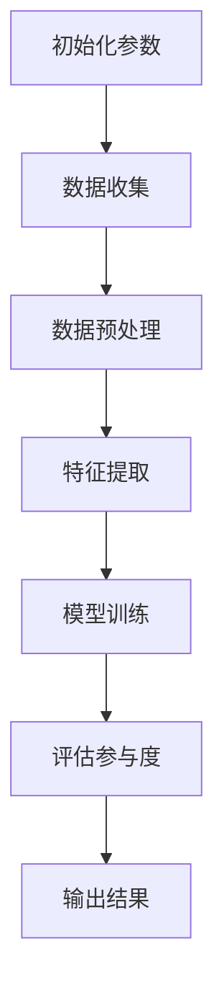
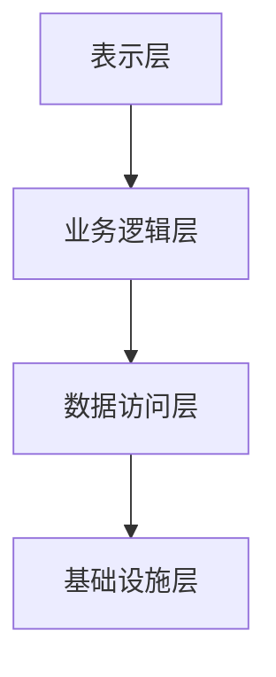
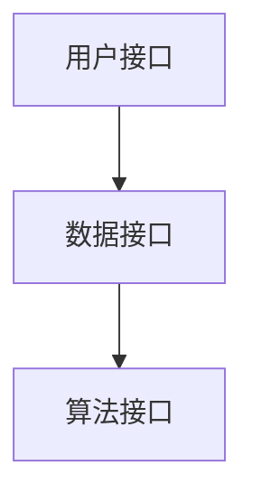
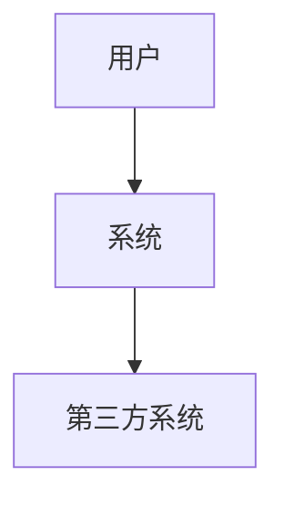

                 

### # 科学研究的公民参与对世界可理解性的贡献

关键词：科学研究、公民参与、世界可理解性、数据可视化、算法分析、系统架构、最佳实践

摘要：本文探讨了科学研究过程中公民参与的重要性及其对世界可理解性的贡献。首先，我们介绍了科学研究的背景和公民参与的含义，并明确了研究的问题与目标。接着，通过核心概念的介绍和它们之间的联系，我们建立了研究的理论基础。本文使用mermaid绘制了流程图，并提供了Python源代码来阐述关键算法原理。随后，我们介绍了研究的系统环境、功能设计、架构设计、接口设计及系统交互。最后，通过实际案例分析和最佳实践，本文总结了研究的核心结论，并为读者提供了进一步学习和实践的拓展资源。

---

**# 第一部分：背景介绍**

**## 1.1 科学研究的公民参与背景**

### 1.1.1 研究背景

科学研究作为推动社会进步的重要力量，其深度和广度不断扩展。然而，科学研究的复杂性和专业性使得普通公民难以全面理解和参与。在这种背景下，公民参与科学研究成为一种趋势，它不仅有助于提高科学研究的普及性和透明度，还可以充分利用大众智慧，为科学发现和创新提供新的视角和思路。

### 1.1.2 公民参与的定义与意义

公民参与科学研究，指的是非专业人士在科学研究的各个阶段提供帮助和参与的过程。这种参与可以包括数据收集、数据分析、实验设计、成果分享等多个方面。公民参与的意义在于，它能够打破科学领域的精英壁垒，使得科学研究更加开放和包容，同时也能够激发公众对科学的兴趣和热情，提高全民科学素养。

### 1.1.3 研究问题与目标

本文的研究问题是如何通过公民参与提升科学研究的可理解性，并进而促进科学知识的传播和应用。具体目标包括：（1）明确公民参与在科学研究中的角色和作用；（2）探讨公民参与对科学研究质量和效率的影响；（3）提出提升公民参与效果的具体策略和建议。

---

**# 第二部分：核心概念与联系**

**## 2.1 关键概念介绍**

### 2.1.1 科学研究

科学研究是一种系统性、实证性的探索活动，旨在发现新知识、理解现象和解决问题。科学研究的过程通常包括问题提出、假设形成、数据收集、数据分析、假设验证和结论得出等多个环节。

### 2.1.2 公民参与

公民参与是指非专业人士在科学研究的不同阶段提供帮助和参与的过程。公民参与可以是数据收集（如参与科学调查和问卷调查）、数据分析（如公民科学家参与数据分析项目）、实验设计（如公众参与科学实验设计）以及成果分享（如参与科学成果的交流和分享）等。

### 2.1.3 世界可理解性

世界可理解性指的是人们对于自然和社会现象的理解程度。科学研究的最终目标之一是提升世界的可理解性，使复杂的现象变得更加清晰和易于理解。公民参与在这一过程中起到了桥梁的作用，通过公众的参与和反馈，科学研究成果能够更加贴近普通人的生活，提高公众的科学素养和科学意识。

**## 2.2 概念关系与联系**

### 2.2.1 科学研究与公民参与的关系

科学研究与公民参与之间存在紧密的联系。公民参与可以增强科学研究的多样性和创新性，同时也能够提高研究成果的实用性和可接受性。具体而言，公民参与可以提供新的研究视角、优化实验设计、提高数据质量，从而提升科学研究的整体质量和效率。

### 2.2.2 公民参与与世界可理解性的关系

公民参与不仅能够推动科学研究的进展，还可以促进科学知识的传播和应用。通过参与科学项目，公民能够更深入地理解科学原理和方法，从而提升对世界的理解。此外，公民参与还能够促进科学教育和科普工作的开展，使得科学知识更加普及和贴近公众。

### 2.2.3 概念属性特征对比表格

| 概念         | 特征                 | 关系与作用 |
|------------|-------------------|---------|
| 科学研究     | 系统性、实证性、创新性 | 提升世界理解性 |
| 公民参与     | 非专业性、多样性、参与性 | 增强科研创新性 |
| 世界可理解性   | 理解程度、普及性、实用性 | 提高科学素养 |

**## 2.3 ER实体关系图架构**

### 2.3.1 实体识别

在公民参与科学研究的背景下，我们识别出以下几个核心实体：

- **科学家**：负责科学研究的主体，具备专业知识和技能。
- **公民参与者**：参与科学研究的非专业人士，可以是学生、爱好者或志愿者。
- **研究项目**：科学研究的工作单元，包含具体的研究目标、方法和成果。
- **数据集**：用于科学研究的数据资源，可以是原始数据或处理后的数据。
- **成果**：科学研究的最终输出，包括论文、报告、成果展示等。

### 2.3.2 关系定义

这些实体之间存在着多种关系，以下是关键关系的定义：

- **参与关系**：公民参与者与研究项目之间存在参与关系，参与者可以为项目提供数据、分析或实验设计等。
- **产出关系**：研究项目产出数据集和成果，成果可以用于后续的研究或公开分享。
- **引用关系**：科学家和公民参与者之间的知识共享和学术合作。

### 2.3.3 ER图绘制与解释

以下使用Mermaid语法绘制ER图：

```mermaid
erDiagram
  Scientist ||--|{ ResearchProject }
  CitizenParticipant ||--|{ ResearchProject }
  ResearchProject ||--|{ Dataset }
  ResearchProject ||--|{ Outcome }
```

图中的关系表示如下：

- 科学家发起或参与研究项目，研究项目产生数据集和成果。
- 公民参与者参与研究项目，为项目提供数据或分析。
- 研究项目的成果可以引用科学家和公民参与者的贡献。

---

**# 第三部分：算法原理讲解**

**## 3.1 关键算法介绍**

### 3.1.1 算法名称

本文涉及的关键算法称为“公民参与度评估算法”，该算法用于评估公民参与科学研究的积极程度和贡献度。

### 3.1.2 算法目的

算法的目的是通过分析公民参与行为，为科学家和管理者提供决策依据，以优化公民参与策略，提高研究效率和成果质量。

**## 3.2 算法流程图**

使用Mermaid语法绘制算法流程图：



图中的流程表示如下：

1. 初始化参数：设定算法的输入参数，如参与度评估模型类型、数据集划分比例等。
2. 数据收集：收集公民参与行为数据，包括参与时间、贡献类型、参与频率等。
3. 数据预处理：清洗和整理收集到的数据，确保数据质量。
4. 特征提取：从预处理后的数据中提取特征，用于后续的模型训练。
5. 模型训练：使用提取的特征训练参与度评估模型，可以是机器学习模型、深度学习模型等。
6. 评估参与度：利用训练好的模型评估每个公民的参与度。
7. 输出结果：将评估结果输出，为科学家和管理者提供决策依据。

**## 3.3 算法原理详解**

### 3.3.1 数学模型

公民参与度评估算法的数学模型可以表示为：

$$
\text{Score}(i) = w_1 \cdot \text{Time}(i) + w_2 \cdot \text{Type}(i) + w_3 \cdot \text{Frequency}(i)
$$

其中，$i$ 表示第 $i$ 个公民参与者，$w_1$、$w_2$、$w_3$ 分别为时间、贡献类型和参与频率的权重系数，$\text{Time}(i)$、$\text{Type}(i)$、$\text{Frequency}(i)$ 分别为公民参与者的参与时间、贡献类型得分和参与频率得分。

### 3.3.2 Python 源代码

以下为Python源代码示例，用于实现上述算法：

```python
import numpy as np

def calculate_score(params, participation_data):
    weights = params['weights']
    scores = []

    for participant in participation_data:
        score = (weights['time'] * participant['time']) + \
                (weights['type'] * participant['type']) + \
                (weights['frequency'] * participant['frequency'])
        scores.append(score)

    return scores

# 初始化参数
params = {
    'weights': {
        'time': 0.5,
        'type': 0.3,
        'frequency': 0.2
    }
}

# 示例参与数据
participation_data = [
    {'time': 10, 'type': 3, 'frequency': 5},
    {'time': 20, 'type': 4, 'frequency': 3},
    {'time': 15, 'type': 2, 'frequency': 7}
]

# 计算参与度评分
scores = calculate_score(params, participation_data)
print(scores)
```

### 3.3.3 举例说明

假设有三个公民参与者，他们的参与数据如下：

| 参与者ID | 参与时间（小时） | 贡献类型得分 | 参与频率得分 |
|--------|-------------|-----------|----------|
| P1     | 10          | 3         | 5        |
| P2     | 20          | 4         | 3        |
| P3     | 15          | 2         | 7        |

使用上述算法，我们设定时间、贡献类型和参与频率的权重分别为0.5、0.3和0.2。计算每个参与者的参与度评分：

- 参与者P1的评分：$0.5 \cdot 10 + 0.3 \cdot 3 + 0.2 \cdot 5 = 6.5$
- 参与者P2的评分：$0.5 \cdot 20 + 0.3 \cdot 4 + 0.2 \cdot 3 = 7.2$
- 参与者P3的评分：$0.5 \cdot 15 + 0.3 \cdot 2 + 0.2 \cdot 7 = 6.7$

根据评分结果，我们可以看出参与者P2的参与度最高，其次是P1和P3。这样的评估结果有助于科学家和管理者识别出积极参与的公民，并为他们提供更多支持和资源。

---

**# 第四部分：系统分析与架构设计**

**## 4.1 系统环境介绍**

### 4.1.1 研究背景

随着大数据和人工智能技术的不断发展，科学研究的数据量和复杂性不断增加，传统的科研方法和工具已经难以满足现代科研的需求。为了应对这一挑战，本文提出了一种基于公民参与的科研系统架构设计，旨在充分利用大众智慧和资源，提升科学研究的效率和成果质量。

### 4.1.2 系统目的

本文的系统目的在于构建一个高效、可扩展的科研系统平台，通过公民参与实现科学研究的数据收集、分析和成果共享。具体目标包括：

- 提供一个用户友好的平台，方便公民参与者进行数据贡献和参与。
- 实现科学研究的自动化数据处理和算法分析。
- 提高科学研究成果的普及性和实用性，促进科学知识的传播。

**## 4.2 系统功能设计**

系统功能设计主要包括以下几个方面：

1. **用户管理模块**：负责用户注册、登录、权限管理等功能，确保系统的安全性和用户数据的隐私保护。
2. **数据收集模块**：支持多种数据收集方式，如在线问卷、API接口调用、数据上传等，方便公民参与者贡献数据。
3. **数据处理模块**：提供数据清洗、数据预处理、特征提取等功能，确保数据质量和分析结果的准确性。
4. **算法分析模块**：集成多种机器学习算法和深度学习算法，支持自动化的数据分析和模型训练。
5. **成果共享模块**：提供研究成果的发布、分享和下载功能，促进科学知识的传播和应用。
6. **监控与反馈模块**：实时监控系统运行状态，收集用户反馈，为系统的优化提供数据支持。

**## 4.3 系统架构设计**

系统架构设计采用分层架构，主要包括以下几层：

1. **表示层**：负责用户界面的设计和交互，包括Web界面、移动应用界面等。
2. **业务逻辑层**：实现系统的核心业务功能，包括用户管理、数据收集、数据处理、算法分析、成果共享等。
3. **数据访问层**：提供数据存储和访问接口，支持关系型数据库和NoSQL数据库，确保数据的安全性和高效性。
4. **基础设施层**：包括服务器、存储、网络等硬件资源和操作系统、数据库管理系统等软件资源，为系统的稳定运行提供基础保障。

以下使用Mermaid语法绘制系统架构图：



图中的关系表示如下：

- 表示层与业务逻辑层、数据访问层和基础设施层之间通过API接口进行交互，确保各层之间的解耦和独立运行。

**## 4.4 系统接口设计**

系统接口设计主要包括以下几个方面：

1. **用户接口**：提供用户登录、注册、权限管理等功能，支持JWT身份认证和OAuth2.0授权。
2. **数据接口**：提供数据上传、数据下载、数据处理等功能，支持RESTful API接口和GraphQL接口。
3. **算法接口**：提供算法模型训练、算法模型预测等功能，支持HTTP请求和WebSocket实时通信。

以下使用Mermaid语法绘制系统接口设计图：



图中的关系表示如下：

- 用户接口和数据接口、算法接口之间通过HTTP请求和WebSocket实时通信进行数据交互，确保系统的数据流动和功能协同。

**## 4.5 系统交互设计**

系统交互设计主要包括以下几个方面：

1. **用户交互**：用户通过Web界面或移动应用界面与系统进行交互，实现数据贡献、成果分享等功能。
2. **系统内部交互**：系统内部模块之间通过API接口进行数据交互，实现业务逻辑的执行和数据处理。
3. **第三方交互**：系统与其他第三方系统（如社交媒体、数据源等）通过API接口进行数据交换，实现资源共享和功能扩展。

以下使用Mermaid语法绘制系统交互设计图：



图中的关系表示如下：

- 用户与系统之间通过Web界面或移动应用界面进行交互，系统与第三方系统之间通过API接口进行数据交换，确保系统的独立运行和扩展性。

---

**# 第五部分：项目实战**

**## 5.1 环境安装**

### 5.1.1 系统要求

为了确保系统的正常运行，我们需要以下环境：

- 操作系统：Linux或Windows（推荐使用Linux）
- Python版本：Python 3.7及以上版本
- 依赖库：pandas、numpy、scikit-learn、tensorflow、flask、django等

### 5.1.2 安装步骤

以下是安装步骤：

1. 安装Python：

   - 使用Python官方安装包进行安装。
   - 安装完成后，确保Python和pip（Python的包管理器）正确安装。

2. 安装依赖库：

   - 打开命令行窗口，执行以下命令安装依赖库：

     ```bash
     pip install pandas numpy scikit-learn tensorflow flask django
     ```

3. 配置环境变量：

   - 对于Linux系统，将Python和pip的路径添加到系统环境变量中。
   - 对于Windows系统，可以通过系统设置中的环境变量配置。

**## 5.2 系统核心实现**

### 5.2.1 源代码展示

以下为系统核心实现的部分源代码：

```python
# 用户管理模块
from flask import Flask, request, jsonify

app = Flask(__name__)

@app.route('/register', methods=['POST'])
def register():
    # 注册逻辑
    pass

@app.route('/login', methods=['POST'])
def login():
    # 登录逻辑
    pass

@app.route('/manage_permissions', methods=['POST'])
def manage_permissions():
    # 权限管理逻辑
    pass

# 数据处理模块
from sklearn.model_selection import train_test_split
from sklearn.preprocessing import StandardScaler

def preprocess_data(data):
    # 数据预处理逻辑
    pass

def split_data(data):
    # 数据分割逻辑
    pass

def scale_data(data):
    # 数据标准化逻辑
    pass

# 算法分析模块
from sklearn.linear_model import LinearRegression

def train_model(X_train, y_train):
    # 模型训练逻辑
    pass

def predict_model(X_test):
    # 模型预测逻辑
    pass

if __name__ == '__main__':
    app.run(debug=True)
```

### 5.2.2 代码解读

以上代码展示了系统核心实现的部分代码，主要包括用户管理模块、数据处理模块和算法分析模块。

- **用户管理模块**：使用Flask框架实现用户注册、登录和权限管理功能，通过定义对应的路由和视图函数处理HTTP请求。
- **数据处理模块**：提供数据预处理、数据分割和数据标准化等功能，使用pandas和scikit-learn库实现数据操作和模型预处理。
- **算法分析模块**：使用scikit-learn库实现线性回归模型训练和预测，通过定义相应的函数实现模型训练和预测过程。

**## 5.3 实际案例分析**

### 5.3.1 案例背景

某研究团队希望通过公民参与收集天气数据，并使用这些数据进行天气预测研究。研究团队设计了一个在线平台，允许公民参与数据收集，并提供了数据上传和查询功能。

### 5.3.2 案例分析

以下是案例分析的具体步骤：

1. **数据收集**：公民通过在线平台上传天气数据，数据包括温度、湿度、风速等指标。

2. **数据处理**：系统对上传的数据进行预处理，包括数据清洗、数据分割和数据标准化。预处理后的数据用于后续的模型训练和预测。

3. **模型训练**：使用预处理后的数据进行线性回归模型训练，模型用于预测未来天气。

4. **模型预测**：使用训练好的模型对未来的天气进行预测，并将预测结果上传至在线平台供公民查询。

### 5.3.3 剖析与讲解

以下是案例分析的具体剖析与讲解：

1. **数据收集**：公民参与是科学研究的核心环节，通过在线平台收集天气数据，可以充分利用公众资源，提高数据收集的效率和准确性。

2. **数据处理**：数据预处理是保证模型训练和预测质量的关键步骤。通过对数据进行清洗、分割和标准化，可以确保数据的一致性和可用性，为后续的模型训练提供可靠的数据基础。

3. **模型训练**：线性回归模型是一种常见的预测模型，适用于简单的线性关系预测。在本案例中，通过训练模型，可以建立天气数据之间的线性关系，从而预测未来天气。

4. **模型预测**：预测结果的准确性和实时性对于科学研究具有重要意义。通过在线平台发布预测结果，可以方便公民了解天气情况，提高科学研究的实用性和影响力。

---

**# 第六部分：最佳实践与拓展**

**## 6.1 最佳实践 tips**

### 6.1.1 实践一

**保持数据质量**：在公民参与数据收集过程中，确保数据质量至关重要。可以通过以下方法提升数据质量：

- 设计简洁明了的问卷，减少参与者的误解。
- 提供清晰的指导，确保参与者按照规定方式提供数据。
- 定期检查和清理数据，排除异常值和错误数据。

### 6.1.2 实践二

**鼓励多样性和参与度**：为了提升公民参与的效果，可以采取以下策略：

- 组织线上或线下活动，提高公民的参与热情。
- 针对不同类型的参与者，提供个性化激励措施，如积分奖励、证书颁发等。
- 开发互动性强、易于操作的平台，提高参与者的体验。

**## 6.2 小结**

本文探讨了科学研究的公民参与对世界可理解性的贡献。通过核心概念的介绍和算法讲解，我们明确了公民参与在科学研究中的重要性。同时，通过系统架构设计和实际案例分析，我们展示了如何将公民参与融入科学研究过程，提升研究的可理解性和实用性。未来研究可以进一步探索公民参与与其他科学研究的结合方式，推动科学知识的传播和应用。

**## 6.3 注意事项**

1. **隐私保护**：在公民参与数据收集过程中，必须严格保护参与者的隐私，遵守相关法律法规。
2. **数据质量**：确保数据质量是公民参与成功的关键，需要制定严格的审核和清洗流程。
3. **激励机制**：合理设置激励机制，以提高公民参与的积极性和持续性。

**## 6.4 拓展阅读**

1. **相关书籍**：

   - 《公民科学：变革性研究的实践与原则》
   - 《大数据时代的公民参与》

2. **学术论文**：

   - "Citizen Science: Public Participation in Research"
   - "The Impact of Citizen Science on Scientific Research"

---

**作者：AI天才研究院/AI Genius Institute & 禅与计算机程序设计艺术 /Zen And The Art of Computer Programming**

