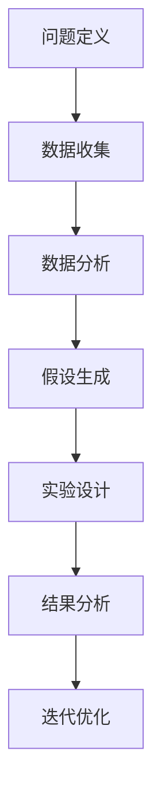
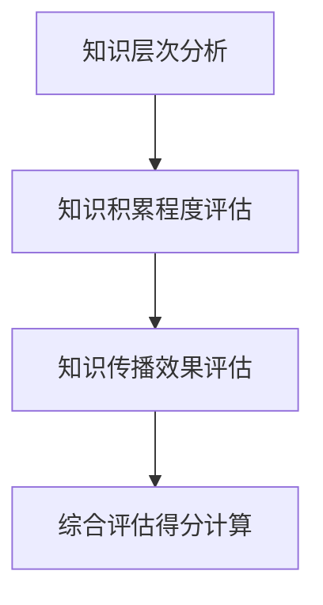
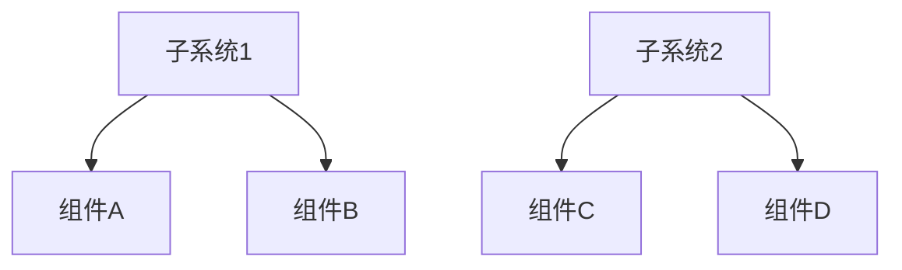
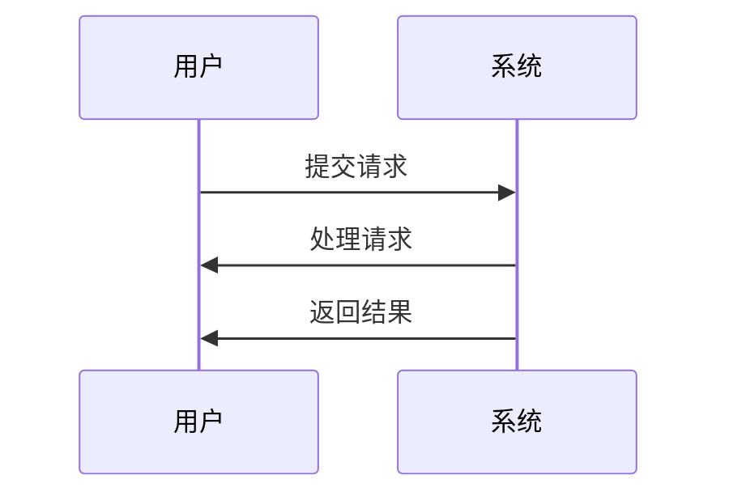

                 


### 目录大纲：科学研究的创新生态系统与世界可理解性的演进

**关键词：**科学研究、创新生态系统、世界可理解性、数学模型、算法、系统架构设计、项目实战

**摘要：**本文旨在深入探讨科学研究的创新生态系统以及世界可理解性的演进。通过逻辑清晰、结构紧凑的分析，本文首先介绍了科学研究创新的背景与核心概念，接着探讨了创新生态系统的要素及其相互关系。然后，文章分析了世界可理解性的演进历程及其影响因素。在此基础上，本文详细阐述了创新生态系统的核心原理、世界可理解性的核心原理以及相应的数学模型和算法。此外，文章还介绍了科学研究的系统分析与架构设计，并通过项目实战和最佳实践提供了实际操作指南。

### 第一部分：背景介绍与核心概念

#### 第1章：问题背景与概念结构

**1.1 问题背景**

科学研究在现代社会中扮演着至关重要的角色。然而，随着科学领域的不断扩大和复杂化，如何构建一个有效的创新生态系统来推动科学研究的进展，成为了亟待解决的问题。同时，世界可理解性也是科学研究中的一个重要议题，它关系到我们对于自然规律和宇宙奥秘的理解程度。因此，本文将探讨这两个核心问题。

**1.2 核心概念**

创新生态系统：是指一系列相互关联的机构、资源和个人，通过协同合作和知识共享，推动科学研究的创新和发展。

世界可理解性：是指人类对于自然现象和宇宙规律的认知程度，包括理解层次、知识积累和传播等方面。

### 第2章：创新生态系统要素

**2.1 要素概述**

创新生态系统的要素包括：

- 科学研究机构：如大学、研究所等，是科学研究的核心力量。
- 研究资金来源：如政府资助、企业投资等，为科学研究提供资金支持。
- 研究者与学术交流：研究者的相互交流和合作，是创新的重要驱动力。
- 政策与法规环境：为科学研究提供良好的政策法规支持。

**2.2 关系与交互**

创新生态系统内部关系：

- 科学研究机构之间的合作与竞争。
- 研究者与资金来源之间的互动。
- 学术交流与合作网络的形成。

创新生态系统与外部环境互动：

- 社会文化的影响。
- 经济发展对科学研究的支持。
- 政策导向对创新生态系统的塑造。

### 第3章：世界可理解性的演进

**3.1 演进历程**

世界可理解性的演进是一个长期的历史过程，其历程包括：

- 古代文明的智慧积累。
- 中世纪对自然规律的探索。
- 近代科学的快速发展。
- 当代科学技术的突破。

**3.2 影响因素**

影响世界可理解性的因素：

- 社会文化：如科学知识的传播、学术思想的碰撞等。
- 经济发展：如科技进步、产业升级等。
- 政策导向：如科学政策的制定、教育体系的改革等。

### 第二部分：核心概念与联系

#### 第4章：核心概念原理

**4.1 创新生态系统的核心原理**

创新生态系统的核心原理包括：

- 知识共享：通过开放共享知识，促进创新和合作。
- 协同创新：通过多方协作，共同推动科学研究的进步。
- 风险管理：通过合理管理风险，降低创新过程中的不确定性。

**4.2 世界可理解性的核心原理**

世界可理解性的核心原理包括：

- 理解的层次：从表面现象到深层次本质的理解。
- 知识的积累：通过不断的探索和积累，深化对世界的理解。
- 知识的传播：通过教育、媒体等方式，将科学知识普及到大众。

### 第5章：概念属性特征对比

我们将创新生态系统的要素与世界可理解性的因素进行对比，构建一个属性特征表格。

| 要素/因素 | 创新生态系统要素 | 世界可理解性因素 |
| --- | --- | --- |
| 科学研究机构 | 大学、研究所 | 古代文明、近代科学 |
| 研究资金来源 | 政府资助、企业投资 | 社会文化、经济发展 |
| 研究者与学术交流 | 研究者互动、合作 | 学术思想碰撞、知识传播 |
| 政策与法规环境 | 科学政策、法规体系 | 科学政策、教育改革 |

### 第6章：ER实体关系图架构

使用Mermaid绘制创新生态系统和世界可理解性的ER实体关系图。

```mermaid
erDiagram
  ResearchInstitution ||--|{ Researcher }
  FundingSource ||--|{ Researcher }
  AcademicExchange ||--|{ Researcher }
  PolicyEnvironment ||--|{ ResearchInstitution }
  PolicyEnvironment ||--|{ FundingSource }
  PolicyEnvironment ||--|{ AcademicExchange }
```

### 第三部分：算法原理与数学模型

#### 第7章：算法原理讲解

**7.1 科学研究创新算法**

科学研究创新算法的流程图如下：



**7.2 世界可理解性评估算法**

世界可理解性评估算法的流程图如下：



#### 第8章：数学模型与公式讲解

**8.1 创新生态系统数学模型**

创新生态系统的数学模型可以表示为：

$$
\text{创新效率} = f(\text{知识共享程度}, \text{协同创新程度}, \text{风险管理程度})
$$

其中，$f$ 是一个综合函数，$\text{知识共享程度}$、$\text{协同创新程度}$ 和 $\text{风险管理程度}$ 分别是三个影响创新效率的关键因素。

**8.2 世界可理解性评估数学模型**

世界可理解性评估的数学模型可以表示为：

$$
\text{理解度} = g(\text{知识层次}, \text{知识积累}, \text{知识传播})
$$

其中，$g$ 是一个综合函数，$\text{知识层次}$、$\text{知识积累}$ 和 $\text{知识传播}$ 分别是影响理解度的三个关键因素。

### 第四部分：系统分析与架构设计

#### 第9章：系统功能设计

**9.1 领域模型**

使用Mermaid绘制领域模型类图如下：

```mermaid
classDiagram
  Researcher <<Interface>>
  Institute <<Class>> {
    name : String
    researchAreas : List<String>
  }
  FundingSource <<Interface>>
  PolicyEnvironment <<Interface>>

  Researcher implements Institute
  Researcher implements FundingSource
  Researcher implements PolicyEnvironment
```

**9.2 系统架构设计**

使用Mermaid绘制系统架构图如下：



**9.3 系统接口设计与交互**

使用Mermaid绘制系统接口设计和系统交互序列图如下：



### 第五部分：项目实战与最佳实践

#### 第11章：环境安装与系统核心实现

**11.1 环境安装**

本节将介绍如何搭建科学研究创新生态系统和世界可理解性评估的环境。

**11.2 系统核心实现**

本节将使用Python代码实现系统核心功能，包括数据收集、数据分析、假设生成、实验设计、结果分析和迭代优化等。

```python
# Python代码示例
def data_collection():
    # 数据收集函数
    pass

def data_analysis(data):
    # 数据分析函数
    pass

def hypothesis_generation(data_analysis_result):
    # 假设生成函数
    pass

def experiment_design(hypothesis):
    # 实验设计函数
    pass

def result_analysis(experiment_result):
    # 结果分析函数
    pass

def iterative_optimization(result_analysis_result):
    # 迭代优化函数
    pass
```

**11.3 代码应用解读与分析**

本节将对系统核心实现的代码进行解读和分析，并给出实际案例。

### 第12章：最佳实践与拓展阅读

**12.1 最佳实践**

本节将总结最佳实践，提供实际操作中的技巧和建议。

**12.2 小结**

本节将对全文进行总结，回顾核心观点和关键内容。

**12.3 注意事项**

本节将指出在构建创新生态系统和评估世界可理解性过程中需要注意的事项。

**12.4 拓展阅读**

本节将推荐相关书籍、论文和网站，供读者进一步学习和探索。

---

作者：AI天才研究院/AI Genius Institute & 禅与计算机程序设计艺术/Zen And The Art of Computer Programming

---

以上是《科学研究的创新生态系统与世界可理解性的演进》的目录大纲。接下来，我们将对每个章节进行详细撰写，以确保文章的完整性和深度。通过逻辑清晰、结构紧凑的分析，我们将逐步深入探讨科学研究的创新生态系统和世界可理解性的演进。让我们一起思考，探索科学研究的无限可能。

