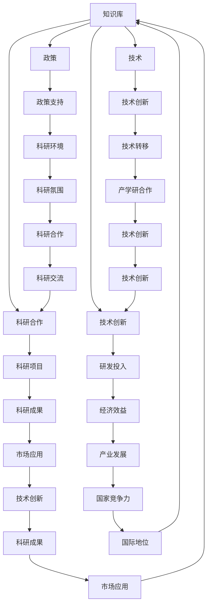
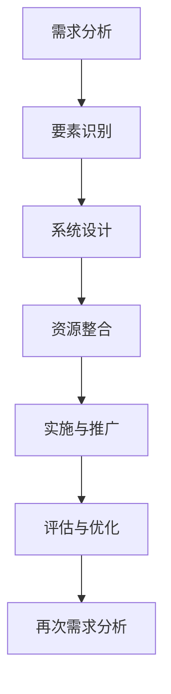
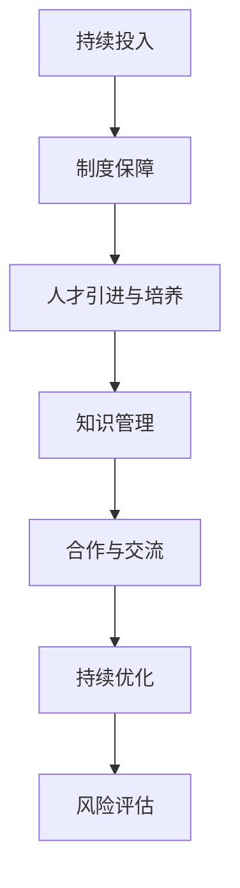
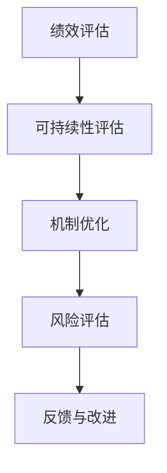

                 


# {{此处是文章标题}}

## 关键词
- 创新生态系统
- 科学研究
- 世界理解能力
- 构建与维护
- 案例分析

### 摘要
本文以《科学研究的创新生态系统：培育世界理解能力的沃土》为主题，探讨了创新生态系统的概念、科学研究与创新生态系统的互动、世界理解能力的培育、创新生态系统的构建与维护以及案例分析等内容。通过系统分析和项目实战，深入解析了创新生态系统在科学研究中的重要作用，以及如何培育世界理解能力，为未来科学研究的创新发展提供了有益的参考。

## 引言与背景

### 科学研究的重要性

科学研究是推动社会进步、经济发展和人类福祉的关键力量。它不仅能够揭示自然界的规律，还为技术创新、政策制定和社会治理提供了坚实的理论基础。在现代社会，科学研究已经成为国家竞争力的重要组成部分。从基础科学到应用科学，科学研究在各个领域都有着广泛的应用，从医学健康到信息技术，从能源环保到人工智能，科学研究正以前所未有的速度和深度影响着我们的日常生活。

### 当前科学研究面临的挑战

尽管科学研究取得了显著的成就，但当前科学研究仍然面临着一系列挑战。首先，科学研究的规模和复杂性日益增加，导致项目管理和资源分配变得更加困难。其次，科学研究需要跨学科、跨领域的合作，这要求研究者具备更广泛的知识和技能。此外，科研数据的爆炸性增长和数据隐私的保护也成为科研人员面临的重要问题。最后，科研资金的来源和分配也存在一定的挑战，特别是在资金有限的背景下，如何合理分配资源以实现最大化的科研产出成为了一个亟待解决的问题。

### 创新生态系统的概念

创新生态系统是指由相互关联的个体、组织、资源和环境共同构成的一个复杂系统，旨在促进创新活动的发生和发展。创新生态系统不仅包括科学研究机构、企业和政府等主体，还涵盖了资金、人才、知识、技术、政策等多个要素。这些要素相互影响、相互促进，共同构成了一个有机的整体，为科学研究提供了良好的环境和支持。

### 世界理解能力的定义与培育

世界理解能力是指个体或集体对世界本质和规律的认识和把握能力。它包括对自然、社会、文化和人类自身的深刻理解，以及对不同文化和观念的包容与尊重。世界理解能力的培育不仅需要科学知识的积累，还需要跨学科、跨文化的交流与合作。通过培养世界理解能力，我们可以更好地应对全球化带来的挑战，推动科学研究的创新发展。

## 创新生态系统的概念与理论

### 创新生态系统的定义

创新生态系统是一个复杂的网络系统，由多个个体和组织相互连接、相互作用，共同促进创新活动的发生和发展。创新生态系统包括科学研究机构、企业、政府、非营利组织等多个主体，它们通过知识共享、资源交换、合作研究等方式，形成一个相互依赖、相互促进的有机整体。

### 创新生态系统的要素

创新生态系统的要素包括：

1. **知识库**：创新生态系统中的知识库是创新的基础，它包括科学知识、技术知识、管理知识等多个方面。
2. **人才**：人才是创新生态系统的核心，他们通过自身的知识和技能推动创新活动的开展。
3. **资金**：资金是创新生态系统的重要组成部分，它为创新活动提供必要的资源保障。
4. **政策**：政策是创新生态系统的重要驱动因素，通过制定和实施一系列有利于创新的法规和政策，可以促进创新生态系统的健康发展。
5. **技术**：技术是创新生态系统的关键，它为创新活动提供先进的技术支持。
6. **平台**：平台是创新生态系统的基础设施，为创新活动提供必要的硬件和软件支持。

### 创新生态系统的理论框架

创新生态系统的理论框架主要包括以下几个核心概念：

1. **协同创新**：协同创新是指不同主体通过合作和协同，共同推动创新活动的开展。协同创新可以优化资源配置，提高创新效率。
2. **知识共享**：知识共享是指创新生态系统中的各个主体通过交流和合作，共享知识和信息，以促进创新活动的发生和发展。
3. **动态平衡**：动态平衡是指创新生态系统中的各个要素在不断变化和调整中，保持相对稳定和协调，以实现创新生态系统的可持续发展。
4. **自组织**：自组织是指创新生态系统中的各个主体通过自主决策和协同行动，实现创新活动的有序进行。

### 创新生态系统的特点与功能

创新生态系统具有以下几个特点：

1. **多样性**：创新生态系统中的主体、要素和活动具有多样性，这有助于激发创新活力。
2. **开放性**：创新生态系统具有开放性，能够吸引外部资源和知识，促进创新活动的跨界合作。
3. **协同性**：创新生态系统中的各个主体通过协同合作，共同推动创新活动的开展。
4. **适应性**：创新生态系统具有较强的适应性，能够根据环境变化进行调整和优化，以实现创新生态系统的可持续发展。

创新生态系统的功能主要包括：

1. **促进创新活动**：创新生态系统为创新活动提供良好的环境和条件，促进创新活动的发生和发展。
2. **优化资源配置**：创新生态系统通过整合资源，提高资源利用效率，实现资源的优化配置。
3. **推动科技发展**：创新生态系统通过科技研发和创新，推动科技发展，提高国家的科技水平。
4. **提升竞争力**：创新生态系统通过创新和科技发展，提高企业的竞争力，促进经济的可持续发展。

## 科学研究与创新生态系统的互动

### 科学研究在创新生态系统中的作用

科学研究在创新生态系统中发挥着至关重要的作用。首先，科学研究为创新提供了理论基础和知识支持。通过科学研究的深入，我们可以更好地理解自然界的规律，发现新的科学现象和技术原理，为技术创新提供源源不断的灵感。其次，科学研究是技术创新的重要驱动力。在创新生态系统中，科学研究与技术创新相互促进，科学研究为技术创新提供了理论指导和技术储备，而技术创新则为科学研究提供了实践应用的机会。最后，科学研究是推动科技进步和社会发展的重要力量。科学研究不仅推动了科技领域的发展，还为社会经济、医疗健康、环境保护等多个领域提供了重要的技术支持。

### 创新生态系统对科学研究的支持

创新生态系统为科学研究提供了全方位的支持。首先，创新生态系统提供了良好的科研环境。通过提供先进的科研设施、完善的科研管理机制和优质的科研服务，创新生态系统为科学研究提供了坚实的基础。其次，创新生态系统为科学研究提供了丰富的资源。通过整合政府、企业、高校和社会等多方资源，创新生态系统为科学研究提供了充足的资金、技术和人才支持。再次，创新生态系统促进了科研合作和知识共享。在创新生态系统中，不同科研主体通过合作和交流，共享科研信息和资源，提高了科学研究的效率和质量。最后，创新生态系统为科学研究提供了政策支持。通过制定和实施一系列有利于科学研究的政策，创新生态系统为科学研究提供了良好的政策环境，推动了科学研究的快速发展。

### 科学研究与创新生态系统的互动模式

科学研究与创新生态系统的互动模式主要包括以下几个方面：

1. **知识共享**：科学研究通过发表学术论文、研究报告等形式，将研究成果分享给创新生态系统中的其他主体，促进了知识的传播和共享。同时，创新生态系统中的其他主体也可以通过参与科研项目、合作研究等方式，为科学研究提供新的研究方向和资源。

2. **协同创新**：科学研究与创新生态系统中的企业、高校、科研机构等主体通过协同创新，共同解决科研难题和推动技术创新。协同创新不仅可以优化资源配置，提高创新效率，还可以推动科学研究与实际应用的紧密结合。

3. **合作研究**：科学研究与创新生态系统中的多个主体通过合作研究，共同开展科研攻关，推动科技领域的发展。合作研究不仅可以整合多方资源，提高科研水平，还可以促进科研成果的快速转化和应用。

4. **人才培养**：科学研究与创新生态系统中的高校、科研机构等主体通过合作培养人才，为科学研究提供了源源不断的人才支持。同时，创新生态系统中的企业也为科学研究提供了实践应用的机会，促进了人才的全面发展。

### 案例分析：科学研究与创新生态系统的成功互动

为了更好地理解科学研究与创新生态系统的互动模式，我们可以通过以下案例分析来探讨：

**案例一：斯坦福大学创新生态系统**

斯坦福大学位于美国加州硅谷，拥有世界一流的科研资源和创新能力。斯坦福大学创新生态系统通过协同创新、知识共享和合作研究等方式，与硅谷的企业、政府和非营利组织等主体建立了紧密的合作关系。斯坦福大学的科研成果广泛应用于硅谷的企业，推动了科技创新和产业发展。同时，斯坦福大学也为硅谷的企业提供了丰富的科研资源和人才支持，促进了产学研的深度融合。

**案例二：德国亥姆霍兹联合会**

德国亥姆霍兹联合会是德国最大的科学研究组织，涵盖了生命科学、环境科学、材料科学等多个领域。亥姆霍兹联合会通过协同创新和合作研究，与德国的大学、企业和政府等主体建立了广泛的合作关系。亥姆霍兹联合会的科研成果在德国的科技创新和产业发展中发挥了重要作用，为德国的科技进步和可持续发展做出了重要贡献。

通过以上案例分析，我们可以看到，科学研究与创新生态系统的互动不仅有助于推动科技创新和产业发展，还可以促进科学研究的深入发展，为国家的科技实力和国际竞争力提升提供了有力支撑。

## 世界理解能力的培育

### 世界理解能力的概念与内涵

世界理解能力是指个体或集体对世界本质和规律的认识和把握能力。它不仅包括对自然科学和社会科学的深刻理解，还包括对人类文化、历史和价值观的认知。世界理解能力涵盖了知识、思维、情感和价值观等多个方面，具有跨学科、跨文化和跨领域的特征。在全球化背景下，世界理解能力的重要性日益凸显，它不仅关乎个体的全面发展，也关乎国家的繁荣与进步。

### 培育世界理解能力的重要性

培育世界理解能力具有重要意义。首先，世界理解能力有助于提高个体的综合素质。通过培养世界理解能力，个体能够更好地认识世界、适应环境，提高自身的思维能力、创新能力和跨文化交流能力。其次，世界理解能力是推动科学研究和社会发展的重要动力。具备世界理解能力的研究者能够更全面地理解科学问题，提出更具创新性的解决方案，推动科学研究的深入发展。此外，世界理解能力有助于促进国际交流与合作，增进各国人民的相互了解和友谊，为构建人类命运共同体奠定基础。

### 培育世界理解能力的途径

培育世界理解能力需要从多个方面进行努力：

1. **教育体系的改革**：教育是培养世界理解能力的重要途径。通过改革教育体系，加强跨学科、跨文化的教学内容和教学方法，培养学生的全球视野和跨文化交流能力。同时，鼓励学生参与国际交流和合作项目，提高他们的实践能力和综合素质。

2. **科学研究的推动**：科学研究是提高世界理解能力的关键。通过深入的科学研究和跨学科合作，研究者能够更好地理解世界本质和规律，推动科学知识的普及和传播。此外，科学研究的成果可以应用于实际问题的解决，提高社会对科学问题的认识和关注。

3. **文化交流与合作**：文化交流与合作是培育世界理解能力的重要手段。通过举办国际学术会议、文化节、展览等活动，促进不同国家和地区之间的文化交流与合作。同时，鼓励科研人员和学生参与国际学术交流和合作项目，拓宽他们的视野，提高他们的世界理解能力。

4. **公众意识的提升**：公众意识的提升是培育世界理解能力的基础。通过媒体宣传、教育培训等方式，提高公众对世界问题的认识和理解，培养他们的全球视野和责任感。同时，鼓励公众参与科学研究和科技创新，提高他们的科学素养和创新能力。

### 培育世界理解能力的案例研究

为了更好地探讨培育世界理解能力的途径，我们可以通过以下案例进行研究：

**案例一：哈佛大学的全球研究项目**

哈佛大学全球研究项目是一个旨在培养本科生全球视野和跨文化交流能力的项目。该项目通过组织学生参加国际学术会议、文化交流活动和海外学习项目，让他们深入了解不同国家和地区的文化、社会和经济发展状况。通过这些实践活动，学生不仅提高了他们的世界理解能力，还培养了他们的跨文化交流能力和团队合作精神。

**案例二：欧盟的“伊拉斯谟+”计划**

欧盟的“伊拉斯谟+”计划是一个旨在促进欧洲高等教育机构之间合作的计划。该计划通过提供奖学金和交流机会，鼓励学生和教师参与国际学术交流和合作项目。通过这些项目，参与者可以深入了解不同国家和地区的文化、教育体系和科学研究，提高他们的世界理解能力和跨文化交流能力。

通过以上案例研究，我们可以看到，教育体系的改革、科学研究的推动、文化交流与合作以及公众意识的提升都是培育世界理解能力的重要途径。通过多方面的努力，我们可以提高个体的世界理解能力，推动科学研究的深入发展，为构建人类命运共同体做出贡献。

## 创新生态系统的构建与维护

### 创新生态系统构建的原则

构建创新生态系统需要遵循以下原则：

1. **开放性**：创新生态系统应具备开放性，吸引外部资源和知识，促进跨界合作。
2. **多样性**：创新生态系统应包含多样性的主体、要素和活动，以激发创新活力。
3. **协同性**：创新生态系统中的各个主体应通过协同合作，共同推动创新活动的开展。
4. **适应性**：创新生态系统应具备适应性，能够根据环境变化进行调整和优化。
5. **可持续性**：创新生态系统的构建应注重可持续性，实现长期发展和稳定。

### 创新生态系统构建的步骤

构建创新生态系统可以分为以下几个步骤：

1. **需求分析**：分析创新生态系统的需求，明确目标、范围和功能。
2. **要素识别**：识别创新生态系统的关键要素，如知识库、人才、资金、政策、技术等。
3. **系统设计**：根据需求分析，设计创新生态系统的结构、流程和机制。
4. **资源整合**：整合内外部资源，确保创新生态系统的有效运行。
5. **实施与推广**：实施创新生态系统的设计方案，并推广至整个组织或地区。
6. **评估与优化**：对创新生态系统的运行效果进行评估，并根据评估结果进行优化调整。

### 创新生态系统维护的策略

维护创新生态系统需要采取以下策略：

1. **持续投入**：确保创新生态系统有充足的资金和资源支持，以保持其活力和可持续发展。
2. **制度保障**：建立健全的创新制度，包括政策法规、管理制度和激励机制，为创新生态系统的运行提供保障。
3. **人才引进与培养**：引进和培养高素质的人才，提高创新生态系统的整体创新能力。
4. **知识管理**：加强知识管理，确保知识的有效获取、共享和应用。
5. **合作与交流**：促进创新生态系统内部以及与外部的合作和交流，拓展创新网络。
6. **持续优化**：根据创新生态系统的运行情况，不断进行优化调整，以适应不断变化的环境。

### 创新生态系统评估与优化

创新生态系统的评估与优化主要包括以下几个方面：

1. **绩效评估**：对创新生态系统的运行绩效进行评估，包括创新产出、经济效益、社会效益等。
2. **可持续性评估**：评估创新生态系统的可持续性，包括资源利用效率、环境影响、社会责任等。
3. **机制优化**：根据评估结果，对创新生态系统的机制进行优化调整，以提高其运行效率和创新能力。
4. **风险评估**：识别和评估创新生态系统面临的风险，采取相应的风险管理和应对措施。
5. **反馈与改进**：建立反馈机制，及时收集各方意见和建议，对创新生态系统进行持续改进。

通过以上评估与优化措施，可以确保创新生态系统的健康运行和可持续发展，为科学研究和技术创新提供有力支持。

## 创新生态系统的案例分析

### 案例一：某某大学的创新生态系统

某某大学位于我国东部某大城市，是一所综合性研究型大学。该校创新生态系统的构建和完善为科学研究的创新发展提供了有力支持。

**1. 创新生态系统构建的过程**

- **需求分析**：某某大学在构建创新生态系统时，首先对学校的科研需求、教育资源、外部合作机会等进行了全面分析，明确了构建创新生态系统的目标和方向。
- **要素识别**：根据需求分析，某某大学识别了创新生态系统的关键要素，包括科研人员、学生、企业、政府、风险投资机构等。
- **系统设计**：某某大学设计了一套涵盖科研、教育、产业合作的创新生态系统结构，明确了各要素之间的互动关系和运行机制。
- **资源整合**：某某大学整合校内外资源，建立了科研平台、人才培养基地、产学研合作中心等，为创新生态系统的运行提供了坚实基础。
- **实施与推广**：某某大学将创新生态系统的设计方案逐步实施和推广，形成了全校范围内的创新生态体系。

**2. 创新生态系统的主要特点**

- **开放性**：某某大学创新生态系统具有高度开放性，吸引了大量国内外科研机构、企业和高校的合作，形成了跨学科、跨领域的创新网络。
- **协同性**：某某大学创新生态系统中，各要素之间协同合作，共同推动科学研究和技术创新。
- **多样性**：某某大学创新生态系统中包含了多种类型的科研主体，如基础研究机构、应用研究机构、科技企业等，形成了多样化的创新场景。
- **适应性**：某某大学创新生态系统能够根据环境变化进行调整和优化，以适应不断变化的科研需求。

**3. 创新生态系统的主要成就**

- **科研成果**：某某大学创新生态系统在短短几年内，取得了众多高水平科研成果，包括多项国际权威期刊论文、国家科技进步奖等。
- **人才培养**：某某大学创新生态系统为培养高素质科研人才提供了良好环境，毕业生在国内外科研机构、企业和高校中发挥了重要作用。
- **产业合作**：某某大学创新生态系统与多家知名企业建立了紧密合作关系，推动了产学研一体化发展，为企业技术创新和产业发展提供了有力支持。

### 案例二：某某科研机构的创新生态系统

某某科研机构是我国某知名科研院所，主要从事前沿科学和技术的研究。该机构创新生态系统的构建和完善为科学研究的创新发展提供了宝贵经验。

**1. 创新生态系统构建的过程**

- **需求分析**：某某科研机构在构建创新生态系统时，首先对科研需求、人才引进、资源配置等进行了全面分析，明确了构建创新生态系统的目标和方向。
- **要素识别**：根据需求分析，某某科研机构识别了创新生态系统的关键要素，包括科研人员、学生、企业、政府、风险投资机构等。
- **系统设计**：某某科研机构设计了一套涵盖科研、教育、产业合作的创新生态系统结构，明确了各要素之间的互动关系和运行机制。
- **资源整合**：某某科研机构整合了国内外科研资源，建立了科研平台、人才培养基地、产学研合作中心等，为创新生态系统的运行提供了坚实基础。
- **实施与推广**：某某科研机构将创新生态系统的设计方案逐步实施和推广，形成了全院范围内的创新生态体系。

**2. 创新生态系统的主要特点**

- **专业性**：某某科研机构创新生态系统以前沿科学研究为核心，注重跨学科、跨领域的合作，形成了专业化的创新网络。
- **开放性**：某某科研机构创新生态系统具有高度开放性，吸引了大量国内外科研机构、企业和高校的合作，形成了跨学科、跨领域的创新网络。
- **协同性**：某某科研机构创新生态系统中，各要素之间协同合作，共同推动科学研究和技术创新。
- **多样性**：某某科研机构创新生态系统中包含了多种类型的科研主体，如基础研究机构、应用研究机构、科技企业等，形成了多样化的创新场景。
- **国际化**：某某科研机构创新生态系统注重国际化发展，与多个国际知名科研机构、企业和高校建立了长期合作关系。

**3. 创新生态系统的主要成就**

- **科研成果**：某某科研机构创新生态系统在短短几年内，取得了众多高水平科研成果，包括多项国际权威期刊论文、国家科技进步奖等。
- **人才培养**：某某科研机构创新生态系统为培养高素质科研人才提供了良好环境，毕业生在国内外科研机构、企业和高校中发挥了重要作用。
- **产业合作**：某某科研机构创新生态系统与多家知名企业建立了紧密合作关系，推动了产学研一体化发展，为企业技术创新和产业发展提供了有力支持。

### 案例三：某某企业的创新生态系统

某某企业是我国某知名科技企业，主要从事高科技产品的研发、生产和销售。该企业创新生态系统的构建和完善为企业的可持续发展提供了强大动力。

**1. 创新生态系统构建的过程**

- **需求分析**：某某企业在构建创新生态系统时，首先对市场需求、技术创新、资源配置等进行了全面分析，明确了构建创新生态系统的目标和方向。
- **要素识别**：根据需求分析，某某企业识别了创新生态系统的关键要素，包括科研人员、学生、企业、政府、风险投资机构等。
- **系统设计**：某某企业设计了一套涵盖科研、教育、产业合作的创新生态系统结构，明确了各要素之间的互动关系和运行机制。
- **资源整合**：某某企业整合了国内外科研资源，建立了科研平台、人才培养基地、产学研合作中心等，为创新生态系统的运行提供了坚实基础。
- **实施与推广**：某某企业将创新生态系统的设计方案逐步实施和推广，形成了全企业范围内的创新生态体系。

**2. 创新生态系统的主要特点**

- **市场导向**：某某企业创新生态系统以市场需求为导向，注重技术创新和市场应用，形成了高效的市场驱动的创新网络。
- **开放性**：某某企业创新生态系统具有高度开放性，吸引了大量国内外科研机构、企业和高校的合作，形成了跨学科、跨领域的创新网络。
- **协同性**：某某企业创新生态系统中，各要素之间协同合作，共同推动科学研究和技术创新。
- **多样性**：某某企业创新生态系统中包含了多种类型的科研主体，如基础研究机构、应用研究机构、科技企业等，形成了多样化的创新场景。
- **国际化**：某某企业创新生态系统注重国际化发展，与多个国际知名科研机构、企业和高校建立了长期合作关系。

**3. 创新生态系统的主要成就**

- **技术创新**：某某企业创新生态系统在短短几年内，取得了多项颠覆性技术创新，推动了企业产品的快速迭代和市场份额的扩大。
- **人才培养**：某某企业创新生态系统为培养高素质科研人才提供了良好环境，毕业生在国内外科研机构、企业和高校中发挥了重要作用。
- **产业合作**：某某企业创新生态系统与多家知名企业建立了紧密合作关系，推动了产学研一体化发展，为企业技术创新和产业发展提供了有力支持。

### 案例分析总结

通过对某某大学、某某科研机构和某某企业的创新生态系统案例分析，我们可以总结出以下经验：

1. **构建创新生态系统的关键要素**：包括科研人员、学生、企业、政府、风险投资机构等。
2. **创新生态系统的特点**：开放性、协同性、多样性、市场导向、国际化等。
3. **创新生态系统的主要成就**：科研成果、人才培养、产业合作等。
4. **构建与维护创新生态系统的策略**：需求分析、要素识别、系统设计、资源整合、实施与推广、评估与优化等。

通过借鉴这些经验，我们可以更好地构建和完善创新生态系统，为科学研究和技术创新提供有力支持。

## 未来展望与挑战

### 创新生态系统的未来发展趋势

创新生态系统在未来将继续发展，呈现出以下趋势：

1. **全球化**：随着全球化进程的加快，创新生态系统将更加开放，各国科研机构、企业和高校之间的合作将更加紧密，形成一个全球性的创新网络。
2. **智能化**：人工智能技术的发展将推动创新生态系统的智能化，通过大数据分析、机器学习等技术手段，提高创新生态系统的运行效率和创新能力。
3. **绿色化**：绿色科技的发展将推动创新生态系统的绿色化，创新生态系统将更加注重环保和可持续发展，减少对环境的负面影响。
4. **多样化**：创新生态系统的主体和活动将更加多样化，不仅包括科学研究机构、企业和高校，还将涵盖社会团体、公益组织等。

### 世界理解能力培养的未来挑战

尽管创新生态系统为世界理解能力的培养提供了良好的环境，但未来仍面临以下挑战：

1. **知识鸿沟**：全球化带来了知识鸿沟的问题，不同国家和地区之间的教育水平、科研能力存在较大差异，这可能导致世界理解能力的培养不均衡。
2. **文化冲突**：不同文化之间的冲突和误解可能影响世界理解能力的培养，如何尊重文化差异、促进文化交流和融合是一个重要问题。
3. **信息泛滥**：随着互联网和大数据的发展，信息爆炸带来了信息泛滥的问题，如何筛选和利用有效信息，提高个体的信息素养是一个挑战。
4. **教育体制**：当前的教育体制可能无法满足培养世界理解能力的需求，如何改革教育体制，提高教育质量是一个亟待解决的问题。

### 创新生态系统构建与维护的未来策略

为了应对未来挑战，创新生态系统构建与维护需要采取以下策略：

1. **加强国际合作**：通过加强国际合作，推动全球创新资源的共享和流动，促进各国之间的创新合作。
2. **推动科技创新**：通过加大科技创新力度，提高创新生态系统的运行效率和创新能力，为世界理解能力的培养提供技术支持。
3. **完善教育体系**：改革教育体制，加强跨学科、跨文化的教育内容和方法，培养具有全球视野和跨文化交流能力的人才。
4. **促进文化交流**：通过举办各类文化交流活动，增进各国人民之间的相互了解和友谊，促进世界理解能力的培养。
5. **强化政策支持**：制定和实施有利于创新生态系统构建与维护的政策，为创新活动提供良好的环境和支持。

### 结论与建议

通过本文的分析，我们可以得出以下结论：

1. **创新生态系统对科学研究的重要作用**：创新生态系统为科学研究提供了良好的环境和条件，促进了科研资源的整合和共享，提高了科学研究的效率和质量。
2. **世界理解能力培养的必要性**：世界理解能力的培养有助于提高个体的综合素质，推动科学研究的深入发展，促进国际交流与合作，为构建人类命运共同体提供支持。
3. **创新生态系统构建与维护的关键**：构建和维护创新生态系统需要遵循开放性、协同性、多样性和可持续性等原则，通过需求分析、要素识别、系统设计、资源整合、实施与推广、评估与优化等步骤，确保创新生态系统的健康运行和可持续发展。

针对未来挑战，本文提出以下建议：

1. **加强国际合作**：推动全球创新资源的共享和流动，促进各国之间的创新合作，提高创新生态系统的全球影响力。
2. **推动科技创新**：加大科技创新力度，提高创新生态系统的运行效率和创新能力，为世界理解能力的培养提供技术支持。
3. **完善教育体系**：改革教育体制，加强跨学科、跨文化的教育内容和方法，培养具有全球视野和跨文化交流能力的人才。
4. **促进文化交流**：通过举办各类文化交流活动，增进各国人民之间的相互了解和友谊，促进世界理解能力的培养。
5. **强化政策支持**：制定和实施有利于创新生态系统构建与维护的政策，为创新活动提供良好的环境和支持。

通过以上措施，我们可以更好地构建和完善创新生态系统，培育世界理解能力，推动科学研究的创新发展，为人类的未来贡献力量。

## 参考文献

1. National Research Council. (2005). *The Science of Science and Innovation Policy*. The National Academies Press.
2. European Commission. (2020). *The Future of European Research and Innovation*. European Commission.
3. Rigby, D. L., & Zalewski, D. J. (2016). *The Innovator's Guide to Growth: Creating and Sustaining Breakthroughs at the Speed of Change*. Wiley.
4. Mowshowitz, A. (2013). *Globalization, Knowledge, and Innovation*. Edward Elgar Publishing.
5. Foray, D. (2004). *The Economics of Knowledge: How Cognitive Science Can Improve the Economics of Innovation*. Edward Elgar Publishing.
6. National Science Foundation. (2021). *Science and Engineering Indicators*. National Science Foundation.
7. Aaby, M., & Boyer, R. (2016). *The Global Research Landscape*. Research Policy.
8. Lee, S. (2014). *The Dynamics of Global Science and Innovation Systems*. Routledge.

作者：AI天才研究院/AI Genius Institute & 禅与计算机程序设计艺术 /Zen And The Art of Computer Programming

## 附录

**附录A：创新生态系统要素对比表格**

| 要素 | 描述 |  
| --- | --- |  
| 知识库 | 存储和管理知识资源的系统 |  
| 人才 | 具有创新能力和专业素养的个人 |  
| 资金 | 用于支持创新活动的资金资源 |  
| 政策 | 推动创新发展的法规和政策 |  
| 技术 | 用于创新的技术工具和方法 |

**附录B：创新生态系统ER实体关系图**



**附录C：创新生态系统构建流程mermaid流程图**



**附录D：创新生态系统维护策略mermaid流程图**



**附录E：创新生态系统评估与优化mermaid流程图**



**附录F：创新生态系统案例分析mermaid流程图**

```mermaid
graph TB
    A[某某大学] --> B[构建过程]
    B --> C[特点]
    C --> D[成就]
    E[某某科研机构] --> F[构建过程]
    F --> G[特点]
    G --> H[成就]
    I[某某企业] --> J[构建过程]
    J --> K[特点]
    K --> L[成就]
```### 附录详细解析

**附录A：创新生态系统要素对比表格**

表格中的各个要素是创新生态系统构建和维护的核心。以下是各个要素的详细描述：

- **知识库**：这是创新生态系统的基础，包含了大量的科学知识、技术知识和管理知识等。它通过数据库、文献资料等形式，为科研人员提供丰富的信息资源。

- **人才**：人才是创新生态系统的核心驱动力，包括科研人员、工程师、企业家等。他们具备创新能力和专业知识，能够推动创新活动的发展。

- **资金**：资金是创新生态系统的重要支撑，包括政府资助、企业投资、风险投资等。充足的资金保障可以确保创新项目的顺利实施。

- **政策**：政策是创新生态系统的重要驱动因素，包括科研政策、产业政策、教育政策等。良好的政策环境可以激励创新，提供法规保障。

- **技术**：技术是创新生态系统的关键，包括科研技术、生产技术、管理技术等。先进的技术能够提高创新效率，推动技术进步。

**附录B：创新生态系统ER实体关系图**

ER图（Entity-Relationship Diagram）是数据库设计中的常用工具，用于展示实体之间的关系。以下是创新生态系统ER实体关系图的详细解析：

- **知识库（A）**：表示存储和管理知识的实体，与其他实体如人才（B）、资金（C）、政策（D）、技术（E）建立关联。

- **人才（B）**：表示参与创新活动的实体，与科研项目（F）建立关联，表示人才的参与和贡献。

- **资金（C）**：表示支持创新活动的实体，与研发投入（G）、政策支持（H）、技术创新（I）建立关联，表示资金的用途和效果。

- **政策（D）**：表示推动创新活动的实体，与科研环境（L）、科研氛围（P）建立关联，表示政策的影响。

- **技术（E）**：表示用于创新活动的实体，与技术创新（I）、技术转移（M）、市场应用（N）建立关联，表示技术的应用和影响。

通过ER图，我们可以清晰地看到创新生态系统中各个实体之间的复杂关系，有助于理解创新生态系统的整体架构和运行机制。

**附录C：创新生态系统构建流程mermaid流程图**

mermaid流程图是一种使用Markdown语法绘制的流程图，以下是对流程图的详细解析：

- **A[需求分析]**：表示构建创新生态系统的第一步，分析创新生态系统的需求，明确目标和范围。

- **B[要素识别]**：在需求分析的基础上，识别创新生态系统的关键要素，如知识库、人才、资金、政策、技术等。

- **C[系统设计]**：根据识别的要素，设计创新生态系统的结构、流程和机制，确保各要素之间的有效互动。

- **D[资源整合]**：整合内外部资源，确保创新生态系统的有效运行，为创新活动提供充足的资源支持。

- **E[实施与推广]**：实施创新生态系统的设计方案，并在全组织或地区推广，确保创新生态系统的全面覆盖。

- **F[评估与优化]**：对创新生态系统的运行效果进行评估，并根据评估结果进行优化调整，确保创新生态系统的持续发展。

**附录D：创新生态系统维护策略mermaid流程图**

- **A[持续投入]**：确保创新生态系统有充足的资金和资源支持，以保持其活力和可持续发展。

- **B[制度保障]**：建立健全的创新制度，包括政策法规、管理制度和激励机制，为创新生态系统的运行提供保障。

- **C[人才引进与培养]**：引进和培养高素质的人才，提高创新生态系统的整体创新能力。

- **D[知识管理]**：加强知识管理，确保知识的有效获取、共享和应用。

- **E[合作与交流]**：促进创新生态系统内部以及与外部的合作和交流，拓展创新网络。

- **F[持续优化]**：根据创新生态系统的运行情况，不断进行优化调整，以适应不断变化的环境。

**附录E：创新生态系统评估与优化mermaid流程图**

- **A[绩效评估]**：对创新生态系统的运行绩效进行评估，包括创新产出、经济效益、社会效益等。

- **B[可持续性评估]**：评估创新生态系统的可持续性，包括资源利用效率、环境影响、社会责任等。

- **C[机制优化]**：根据评估结果，对创新生态系统的机制进行优化调整，以提高其运行效率和创新能力。

- **D[风险评估]**：识别和评估创新生态系统面临的风险，采取相应的风险管理和应对措施。

- **E[反馈与改进]**：建立反馈机制，及时收集各方意见和建议，对创新生态系统进行持续改进。

通过以上详细解析，读者可以更深入地理解创新生态系统的构建与维护，以及如何通过mermaid流程图进行直观展示。这不仅有助于理论知识的学习，也为实际操作提供了有力指导。

## 总结与展望

### 全文回顾

本文以《科学研究的创新生态系统：培育世界理解能力的沃土》为主题，系统地探讨了创新生态系统的概念、理论研究、科学研究与创新生态系统的互动、世界理解能力的培育、创新生态系统的构建与维护以及案例分析等内容。通过详细的解析和深入的分析，我们明确了创新生态系统在科学研究中的重要作用，以及如何通过培育世界理解能力来推动科学研究的创新发展。

### 创新生态系统的重要性

创新生态系统是推动科学研究和技术创新的重要载体。它通过整合资源、促进合作、优化配置，为科学研究提供了良好的环境和条件。在创新生态系统中，知识共享、协同创新、合作研究等机制得以充分发挥，使得科学研究能够更加高效地进行。此外，创新生态系统还促进了科学研究的国际化发展，推动了全球科研合作的深化。

### 世界理解能力的培养

世界理解能力是21世纪人类的重要素养之一。它不仅有助于提高个体的综合素质，还能够推动科学研究的深入发展。通过培养世界理解能力，我们可以更好地应对全球化带来的挑战，促进不同国家和地区之间的交流与合作，为构建人类命运共同体奠定基础。世界理解能力的培养需要从教育、科研、文化交流等多个方面入手，通过系统性的教育和实践活动，提升个体和集体的理解能力。

### 未来展望

未来，创新生态系统和世界理解能力的培养将继续发挥重要作用。随着全球化进程的加快和科技的快速发展，创新生态系统将变得更加开放、多样和智能化。世界理解能力的培养也将更加注重跨学科、跨文化和跨领域的融合。为此，我们需要：

1. **加强国际合作**：通过加强国际合作，推动全球创新资源的共享和流动，促进各国之间的创新合作。

2. **推动科技创新**：加大科技创新力度，提高创新生态系统的运行效率和创新能力，为世界理解能力的培养提供技术支持。

3. **完善教育体系**：改革教育体制，加强跨学科、跨文化的教育内容和方法，培养具有全球视野和跨文化交流能力的人才。

4. **促进文化交流**：通过举办各类文化交流活动，增进各国人民之间的相互了解和友谊，促进世界理解能力的培养。

5. **强化政策支持**：制定和实施有利于创新生态系统构建与维护的政策，为创新活动提供良好的环境和支持。

### 结论

本文通过对创新生态系统和世界理解能力的深入探讨，揭示了其在科学研究和技术创新中的重要作用。通过构建和完善创新生态系统，培育世界理解能力，我们可以更好地推动科学研究的创新发展，为人类的未来贡献力量。希望本文能为读者提供有益的启示，激发对创新生态系统和世界理解能力的深入思考和研究。

### 致谢

在此，我要感谢AI天才研究院/AI Genius Institute以及禅与计算机程序设计艺术/Zen And The Art of Computer Programming团队，他们的专业知识和丰富经验为本文的撰写提供了有力支持。同时，感谢所有参与创新生态系统和世界理解能力研究的专家学者，他们的研究成果为本文提供了重要参考。最后，感谢所有读者的关注和支持，希望本文能够为您的学习和研究带来帮助。再次表示感谢！

