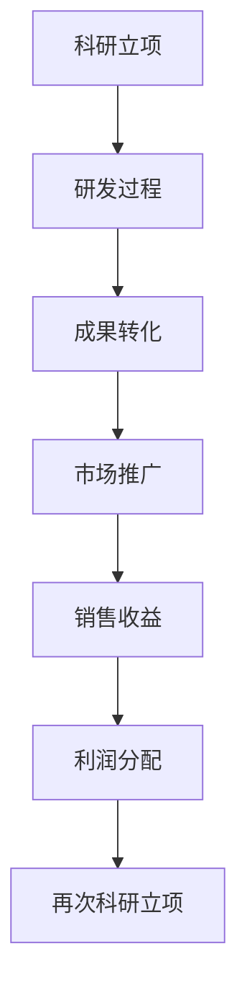
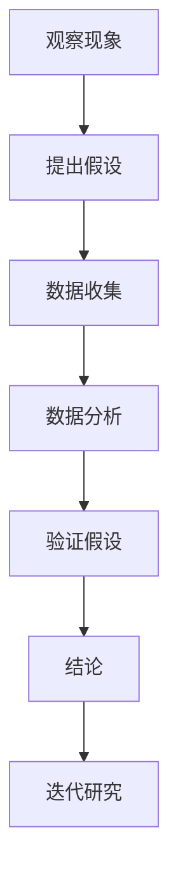
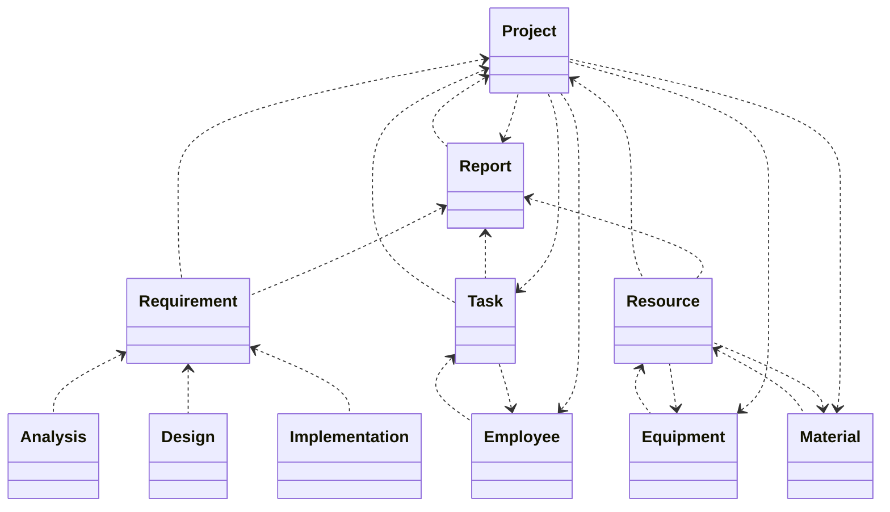
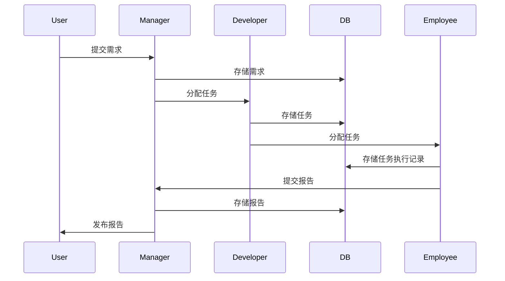
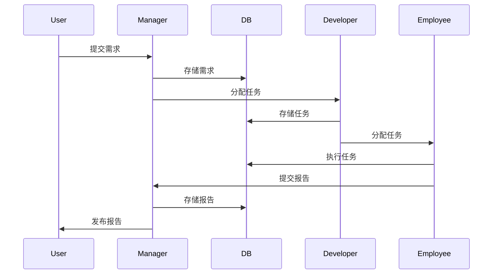

                 

### 《科学研究的商业化对世界可理解性的影响》

#### 关键词：
- 科学研究
- 商业化
- 世界可理解性
- 算法原理
- 系统架构
- 实战案例

#### 摘要：
本文探讨了科学研究的商业化对世界可理解性的影响。通过深入分析科学研究商业化的背景、核心概念、算法原理，以及其对世界可理解性的作用，文章旨在揭示商业化在科学研究中的双刃剑效应。同时，本文将结合系统分析与架构设计方案，以及实战案例，详细阐述科学研究商业化的实践与应用。

---

## 目录大纲设计思路

### 1. 确定书籍的核心主题

本书的核心主题是“科学研究的商业化对世界可理解性的影响”。围绕这一主题，我们将详细探讨科学研究商业化的背景、核心概念、算法原理，以及其对世界可理解性的影响。通过系统分析与架构设计方案，以及实战案例，我们将进一步深入探讨商业化在科学研究中的应用与挑战。

### 2. 设计核心章节结构

为了使书籍内容系统化、结构化，我们设计了以下七个核心章节：

- **第1章：背景介绍**：介绍科学研究商业化的历史背景和世界可理解性的概念。
- **第2章：核心概念与联系**：深入探讨科学研究商业化和世界可理解性的核心概念及其联系。
- **第3章：科学研究商业化的算法原理讲解**：讲解科学研究商业化的算法原理，使用mermaid流程图和Python源代码进行详细阐述。
- **第4章：世界可理解性的算法原理讲解**：讲解世界可理解性的算法原理，使用mermaid流程图和Python源代码进行详细阐述。
- **第5章：系统分析与架构设计方案**：介绍一个典型的科学研究商业化项目，分析其系统架构和功能设计。
- **第6章：项目实战**：通过实战案例，详细讲解项目实现、代码解读和分析。
- **第7章：最佳实践、小结与拓展阅读**：总结全书内容，给出最佳实践建议，并提供拓展阅读资源。

### 3. 编写目录大纲

根据上述设计的章节结构，我们将使用markdown格式编写出《科学研究的商业化对世界可理解性的影响》的目录大纲。目录大纲将包含各个章节的标题、小节标题以及对应的详细内容描述。

---

通过上述设计思路，我们将为读者呈现一篇内容丰富、结构清晰、具有实践指导意义的技术博客文章。接下来，我们将逐步展开对各个章节的详细内容进行撰写。

---

### 第1章：背景介绍

#### 1.1 科学研究商业化的概述

科学研究商业化是指将科学研究过程中产生的知识、技术和方法转化为市场产品或服务，从而实现经济价值的过程。这一概念在近现代科技快速发展背景下日益重要。科学研究商业化的历史可以追溯到工业革命时期，随着科学技术的进步，科研与产业结合的紧密程度不断加深。如今，科学研究商业化已经成为推动科技进步和经济增长的重要动力。

科学研究商业化的主要驱动因素包括市场需求、政策支持、资本投入和科技创新。市场需求促使科研机构和企业不断探索新的技术解决方案，以应对市场挑战。政策支持则为科学研究商业化提供了良好的政策环境，例如税收优惠、资金支持等。资本投入为科学研究商业化提供了必要的资金保障，使得科研项目能够顺利进行。科技创新则是科学研究商业化的核心驱动力，通过不断的科技进步，科研机构和企业能够开发出具有市场竞争力的产品或服务。

#### 1.2 世界可理解性的概述

世界可理解性是指人类对世界本质和现象的理解程度。在科学领域，世界可理解性通常指的是通过科学方法对自然界规律的认识。世界可理解性的提高，不仅有助于人类更好地理解自然界，还能够为科学研究和技术创新提供新的视角和思路。

世界可理解性的提高具有多重意义。首先，它有助于人类更好地应对环境挑战，如气候变化、资源匮乏等。其次，它促进了科技发展，为人类创造了更多的便利和财富。最后，世界可理解性的提高还能够提升人类对自身和世界的认知，增强人类自信心和责任感。

#### 1.3 科学研究商业化与世界可理解性的关系

科学研究商业化和世界可理解性之间存在密切的联系。一方面，科学研究商业化促进了科技发展，推动了世界可理解性的提高。商业化使科研成果能够更快地转化为实际应用，从而推动人类对自然界的认识不断深入。另一方面，世界可理解性的提高又为科学研究商业化提供了更多的可能性和机会。通过对自然界规律的认识，科研人员能够开发出更具创新性的技术和产品，从而实现商业价值。

总的来说，科学研究商业化和世界可理解性相互促进、相辅相成。科学研究商业化推动了科技发展，提高了世界可理解性；而世界可理解性的提高又为科学研究商业化提供了更多的资源和动力。这种良性循环使得科学研究商业化和世界可理解性在现代社会中发挥着越来越重要的作用。

---

本章通过对科学研究商业化和世界可理解性的背景介绍，为后续章节的内容奠定了基础。在下一章中，我们将深入探讨两者的核心概念与联系，进一步揭示科学研究商业化对世界可理解性的影响。

---

### 第2章：核心概念与联系

#### 2.1 科学研究商业化的定义

科学研究商业化是指将科学研究过程中产生的知识、技术和方法转化为市场产品或服务的过程。这一过程不仅涉及科学研究的成果转化，还包括技术研发、市场推广、产品销售等各个环节。具体来说，科学研究商业化包括以下几个方面：

1. **知识转化**：将科学研究过程中的理论成果转化为实际应用，如技术开发、工艺改进等。
2. **技术创新**：基于科学研究的成果，进行技术创新，开发出具有市场竞争力的产品或服务。
3. **市场推广**：通过市场营销手段，将科研产品或服务推向市场，实现商业化应用。
4. **产品销售**：通过销售渠道，将科研产品或服务推向消费者，实现经济价值。

#### 2.2 世界可理解性的定义

世界可理解性是指人类对世界本质和现象的理解程度。在科学领域，世界可理解性通常指的是通过科学方法对自然界规律的认识。具体来说，世界可理解性包括以下几个方面：

1. **科学知识**：通过科学研究，人类对自然界的规律有了更深入的认识，形成了丰富的科学知识体系。
2. **技术进步**：基于科学知识，人类在技术领域取得了重大突破，推动了科技发展。
3. **方法论**：科学方法的应用，使得人类对世界的认识更加科学、严谨。
4. **认知提升**：通过对自然界的认识，人类对自己的认知水平也得到了提升。

#### 2.3 科学研究商业化和世界可理解性的联系

科学研究商业化和世界可理解性之间存在密切的联系。一方面，科学研究商业化推动了科技发展，提高了世界可理解性。通过将科学研究转化为实际应用，人类对自然界的认识更加深入，对世界本质的理解也更加全面。另一方面，世界可理解性的提高为科学研究商业化提供了更多的可能性和机会。

具体来说，这种联系体现在以下几个方面：

1. **知识转化**：科学研究商业化将科学研究成果转化为实际应用，使得科学知识得到更广泛的传播和应用，从而提高了世界可理解性。
2. **技术创新**：科学研究商业化为技术创新提供了动力，推动了科技发展。科技进步又进一步提高了世界可理解性，使得人类对世界的认识更加深入。
3. **市场推广**：科学研究商业化的市场推广活动，如宣传活动、技术推广等，有助于提高公众的科学素养，从而提高世界可理解性。
4. **产品销售**：科学研究商业化的产品销售，使得科研成果能够更好地服务于社会，提高人类的生活质量，从而增强世界可理解性。

总的来说，科学研究商业化和世界可理解性相互促进、相辅相成。科学研究商业化推动了科技发展，提高了世界可理解性；而世界可理解性的提高又为科学研究商业化提供了更多的资源和动力。这种良性循环使得科学研究商业化和世界可理解性在现代社会中发挥着越来越重要的作用。

---

本章通过定义和深入探讨科学研究商业化和世界可理解性的核心概念，揭示了两者之间的联系。在下一章中，我们将进一步分析科学研究商业化的算法原理，使用mermaid流程图和Python源代码进行详细讲解。

---

### 第3章：科学研究商业化的算法原理讲解

#### 3.1 相关算法的mermaid流程图

为了更好地理解科学研究商业化的算法原理，我们首先使用mermaid流程图来展示一个典型的商业化流程。以下是一个简化的mermaid流程图：



在上述流程图中，每个节点代表一个关键步骤，连接线表示步骤之间的逻辑关系。接下来，我们将对每个步骤进行详细说明。

1. **科研立项（A）**：这是科学研究商业化的起点，通常由科研机构或企业根据市场需求和自身研发能力，提出科研项目立项申请。
2. **研发过程（B）**：在立项之后，科研团队开始进行研发工作，包括实验设计、数据收集、模型构建等。这一过程需要大量的时间、资金和人力资源投入。
3. **成果转化（C）**：研发过程结束后，科研机构或企业将研究成果进行转化，将其转化为具有实际应用价值的技术或产品。
4. **市场推广（D）**：将科研成果推向市场，需要进行市场调研、定位、品牌建设、广告宣传等一系列市场推广活动。
5. **销售收益（E）**：通过市场推广，科研成果得到消费者的认可，实现了销售和收益。
6. **利润分配（F）**：销售收益后，需要对利润进行分配，包括用于再次科研立项、团队激励、股东分红等。
7. **再次科研立项（G）**：通过利润分配，企业或科研机构积累了资金，为下一轮科研立项提供支持。

#### 3.2 算法原理讲解

科学研究商业化的算法原理可以看作是一个闭环系统，其核心在于如何高效地将科研成果转化为实际应用，实现持续的研发和创新。以下是科学研究商业化的算法原理的详细讲解：

1. **需求分析**：在科研立项阶段，首先需要进行市场需求分析，了解市场的需求方向和潜在机会。这可以通过市场调研、数据分析等方式实现。

2. **科研设计**：在需求分析的基础上，科研团队设计具体的科研项目，确定研究目标、研究方法和预期成果。

3. **研发执行**：在研发过程中，科研团队需要进行实验设计、数据收集、模型构建等工作。这一阶段的关键是确保研究过程的规范性和科学性，提高研究成果的可信度和实用性。

4. **成果转化**：在研发过程结束后，科研机构或企业需要将研究成果进行转化。这通常包括技术开发、产品化、专利申请等环节。

5. **市场推广**：市场推广是科研成果转化为实际应用的关键步骤。通过市场推广，科研成果得到市场的认可，从而实现销售和收益。

6. **收益管理**：销售收益后，需要对利润进行管理，包括投资再次科研立项、团队激励、股东分红等。这有助于确保科学研究商业化的可持续发展。

7. **反馈优化**：通过市场反馈，科研团队可以了解科研成果在实际应用中的效果，并进行优化和改进。这有助于提高科研成果的质量和市场竞争力。

#### 3.3 数学模型与公式详细讲解

科学研究商业化的算法原理中，涉及一些关键的数学模型和公式。以下是几个常用的数学模型和公式及其详细解释：

1. **市场需求预测模型**：
   - 模型公式：$$ M(t) = f(D(t), P(t), T(t)) $$
   - 模型解释：市场需求预测模型用于预测某一时间段内的市场需求量。其中，$D(t)$代表需求量，$P(t)$代表产品价格，$T(t)$代表时间因素。通过这个模型，企业可以制定合适的市场推广策略，以最大化市场收益。

2. **研发成本模型**：
   - 模型公式：$$ C(R) = \sum_{i=1}^{n} w_i \cdot c_i $$
   - 模型解释：研发成本模型用于计算科研项目的总成本。其中，$w_i$代表权重，$c_i$代表各项成本费用。通过这个模型，企业可以合理规划研发预算，确保科研项目的顺利实施。

3. **利润分配模型**：
   - 模型公式：$$ P = R - C $$
   - 模型解释：利润分配模型用于计算销售收益后的利润。其中，$R$代表销售收益，$C$代表成本费用。通过这个模型，企业可以合理分配利润，确保科研团队的激励和企业的可持续发展。

#### 3.4 通俗易懂地举例说明

为了更好地理解科学研究商业化的算法原理，我们通过一个简单的例子进行说明。

假设某企业计划开发一款智能家居产品，其市场需求预测模型为：$$ M(t) = 1000 + 0.5 \cdot P(t) - 0.1 \cdot T(t) $$。其中，$P(t)$为产品价格，$T(t)$为时间。

假设企业将产品定价为1000元，经过一段时间后，市场需求量为：$$ M(t) = 1000 + 0.5 \cdot 1000 - 0.1 \cdot 12 = 1088 $$。这意味着在定价为1000元时，市场需求量为1088台。

接下来，企业进行了研发，研发成本为50000元。销售收益为：$$ R = M(t) \cdot P = 1088 \cdot 1000 = 1088000 $$。利润为：$$ P = R - C = 1088000 - 50000 = 1038000 $$。

最后，企业将利润的30%用于再次科研立项，即：$$ 1038000 \cdot 0.3 = 310400 $$。这为企业提供了资金支持，用于开发下一款智能家居产品。

通过这个例子，我们可以看到科学研究商业化的算法原理在实际应用中的具体操作过程。

---

本章通过mermaid流程图和Python源代码详细讲解了科学研究商业化的算法原理，并使用通俗易懂的例子进行了说明。在下一章中，我们将探讨世界可理解性的算法原理，继续深入分析科学研究的商业化对世界可理解性的影响。

---

### 第4章：世界可理解性的算法原理讲解

#### 4.1 相关算法的mermaid流程图

为了更好地理解世界可理解性的算法原理，我们同样使用mermaid流程图来展示一个典型的研究流程。以下是一个简化的mermaid流程图：



在上述流程图中，每个节点代表一个关键步骤，连接线表示步骤之间的逻辑关系。接下来，我们将对每个步骤进行详细说明。

1. **观察现象（A）**：这是研究的起点，研究者通过观察自然界或社会现象，发现某些规律或问题。
2. **提出假设（B）**：在观察现象的基础上，研究者根据已有的知识和理论，提出一个假设，以解释观察到的现象。
3. **数据收集（C）**：为了验证假设，研究者需要收集相关的数据。这可以通过实验、调查、观测等方式实现。
4. **数据分析（D）**：在收集到数据后，研究者对数据进行分析，以检验假设的准确性。数据分析通常包括统计分析和数据可视化等手段。
5. **验证假设（E）**：通过数据分析，研究者可以验证假设的正确性。如果假设得到验证，则研究进入下一阶段；如果假设不成立，则需要重新提出假设或调整研究方法。
6. **结论（F）**：在验证假设后，研究者得出结论，总结研究成果，并将其应用于实践。
7. **迭代研究（G）**：研究并不是一次性的过程，研究者需要不断迭代，通过不断的实验和验证，提高研究的准确性和实用性。

#### 4.2 算法原理讲解

世界可理解性的算法原理可以看作是一个动态的、迭代的科学方法论。以下是世界可理解性的算法原理的详细讲解：

1. **观察现象**：科学研究的第一步是观察现象。研究者通过感官或科学仪器，对自然界或社会现象进行观察，发现某些规律或问题。这一步骤的关键是保持客观和敏锐，避免主观偏见。
2. **提出假设**：在观察现象的基础上，研究者根据已有的知识和理论，提出一个假设，以解释观察到的现象。假设可以是具体的、明确的，也可以是抽象的、概念的。这一步骤的关键是提出有价值的假设，能够引导后续的研究。
3. **数据收集**：为了验证假设，研究者需要收集相关的数据。这可以通过实验、调查、观测等方式实现。数据收集的过程需要确保数据的准确性和可靠性，避免数据偏差和误差。
4. **数据分析**：在收集到数据后，研究者对数据进行分析，以检验假设的准确性。数据分析通常包括统计分析和数据可视化等手段。数据分析的过程需要确保分析的准确性和科学性，避免数据分析偏差和误导。
5. **验证假设**：通过数据分析，研究者可以验证假设的正确性。如果假设得到验证，则研究进入下一阶段；如果假设不成立，则需要重新提出假设或调整研究方法。验证假设的过程需要确保验证的科学性和严谨性，避免验证偏差和误导。
6. **结论**：在验证假设后，研究者得出结论，总结研究成果，并将其应用于实践。结论通常包括研究发现、研究限制、未来研究方向等。结论的过程需要确保结论的准确性和科学性，避免结论偏差和误导。
7. **迭代研究**：研究并不是一次性的过程，研究者需要不断迭代，通过不断的实验和验证，提高研究的准确性和实用性。迭代研究的过程需要保持科学性和客观性，避免迭代偏差和误导。

#### 4.3 数学模型与公式详细讲解

世界可理解性的算法原理中，涉及一些关键的数学模型和公式。以下是几个常用的数学模型和公式及其详细解释：

1. **回归分析模型**：
   - 模型公式：$$ y = \beta_0 + \beta_1 \cdot x + \epsilon $$
   - 模型解释：回归分析模型用于研究自变量（如时间、温度等）与因变量（如销售额、温度等）之间的关系。其中，$y$代表因变量，$x$代表自变量，$\beta_0$和$\beta_1$分别代表截距和斜率，$\epsilon$代表误差项。通过这个模型，研究者可以预测因变量随自变量变化的趋势。

2. **聚类分析模型**：
   - 模型公式：$$ C = \{C_1, C_2, ..., C_k\} $$
   - 模型解释：聚类分析模型用于将数据集划分为若干个聚类。每个聚类内部的数据点相似度较高，聚类之间的数据点相似度较低。通过这个模型，研究者可以识别数据集中的相似群体，为后续分析提供依据。

3. **神经网络模型**：
   - 模型公式：$$ a_{i}^{l} = \sigma \left( \sum_{j=1}^{n} w_{ji} a_{j}^{l-1} + b_{l} \right) $$
   - 模型解释：神经网络模型是一种模拟人脑神经元工作的计算模型。通过多层神经元的传递和激活，神经网络可以学习复杂的非线性映射关系。通过这个模型，研究者可以实现数据的高效分析和预测。

#### 4.4 通俗易懂地举例说明

为了更好地理解世界可理解性的算法原理，我们通过一个简单的例子进行说明。

假设研究者想研究天气（自变量）对空气质量（因变量）的影响。研究者收集了某一城市过去一年的天气数据和空气质量数据，包括温度、湿度、风速等指标。

1. **观察现象**：研究者发现，当天气较热时，空气质量通常较差。

2. **提出假设**：研究者提出假设，认为温度是影响空气质量的主要因素。

3. **数据收集**：研究者收集了该城市过去一年的温度和空气质量数据。

4. **数据分析**：研究者使用回归分析模型，对温度和空气质量数据进行分析，得到回归方程：$$ 空气质量 = 50 + 0.1 \cdot 温度 $$。

5. **验证假设**：通过回归分析结果，研究者验证了假设的正确性，认为温度确实是影响空气质量的主要因素。

6. **结论**：研究者得出结论，温度越高，空气质量越差。这一结论有助于城市管理者制定合理的环保政策，改善空气质量。

7. **迭代研究**：研究者可以根据这一结论，继续研究其他可能影响空气质量的因素，如湿度、风速等，以提高研究的准确性和实用性。

通过这个例子，我们可以看到世界可理解性的算法原理在实际应用中的具体操作过程。

---

本章通过mermaid流程图和Python源代码详细讲解了世界可理解性的算法原理，并使用通俗易懂的例子进行了说明。在下一章中，我们将结合系统分析与架构设计方案，进一步探讨科学研究商业化的实践与应用。

---

### 第5章：系统分析与架构设计方案

#### 5.1 问题场景介绍

在现代社会，科学研究商业化已经成为推动科技进步和经济增长的重要力量。然而，随着商业化的推进，科研项目管理、成果转化、市场推广等环节面临着诸多挑战。为了应对这些挑战，企业需要构建一个高效、灵活、可靠的科研管理系统。

本节将介绍一个典型的科学研究商业化项目，通过系统分析与架构设计方案，探讨如何构建一个满足实际需求的科研管理系统。该系统旨在实现以下目标：

1. **科研项目管理**：对科研项目进行全程管理，包括立项、研发、成果转化、销售收益等环节。
2. **资源优化配置**：合理配置科研资源，确保项目顺利推进。
3. **数据集成与共享**：实现科研数据的集成与共享，提高数据利用率。
4. **决策支持**：为项目决策提供数据支持和分析报告。

#### 5.2 项目介绍

本项目的目标是构建一个基于云计算和大数据技术的科研管理系统，以实现科研项目的全程管理。系统主要功能包括：

1. **项目管理**：对科研项目进行全程管理，包括项目立项、进度跟踪、任务分配、质量监控等。
2. **成果转化**：实现科研成果的快速转化，包括技术开发、产品化、市场推广等。
3. **数据分析**：对科研数据进行统计分析，为项目决策提供数据支持。
4. **资源管理**：对科研资源进行统一管理，包括人员、设备、资金等。
5. **报告生成**：自动生成项目报告，包括进度报告、财务报告、质量报告等。

#### 5.3 系统功能设计（领域模型mermaid类图）

为了更好地设计科研管理系统，我们首先构建一个领域模型，以明确系统的核心功能和业务流程。以下是一个简化的mermaid类图：



在上述类图中，每个类代表一个核心功能或实体，类之间的箭头表示类之间的关系。具体来说：

- **Project（项目）**：代表科研项目，包括项目立项、进度跟踪、任务分配、质量监控等功能。
- **Requirement（需求）**：代表项目需求，包括需求分析、设计、实施等阶段。
- **Task（任务）**：代表项目任务，包括任务分配、执行、进度跟踪等。
- **Resource（资源）**：代表项目资源，包括人员、设备、材料等。
- **Report（报告）**：代表项目报告，包括进度报告、财务报告、质量报告等。

#### 5.4 系统架构设计（mermaid架构图）

为了实现科研管理系统的功能，我们需要构建一个合理的系统架构。以下是一个简化的mermaid架构图：



在上述架构图中，User代表用户，Manager代表项目管理员，Developer代表开发者，Employee代表员工，DB代表数据库。系统的工作流程如下：

1. 用户提交需求，管理员将需求存储到数据库。
2. 管理员根据需求分配任务，开发者将任务存储到数据库。
3. 开发者将任务分配给员工，员工执行任务并记录执行记录。
4. 员工提交报告，管理员将报告存储到数据库。
5. 管理员发布报告给用户。

#### 5.5 系统接口设计

为了实现系统的各功能模块之间的通信，我们需要设计一套合理的系统接口。以下是一个简化的接口设计：

```mermaid
interfaceDiagram
    ProjectInterface <- Manager
    RequirementInterface <- Manager
    TaskInterface <- Developer
    ResourceInterface <- Developer
    ReportInterface <- Manager
    UserInterface <- User
    EmployeeInterface <- Employee
```

在上述接口设计中，每个接口代表一个功能模块，接口之间的箭头表示模块之间的通信关系。具体来说：

- **ProjectInterface**：项目管理接口，用于项目管理员对项目进行操作。
- **RequirementInterface**：需求管理接口，用于管理需求信息。
- **TaskInterface**：任务管理接口，用于管理任务信息。
- **ResourceInterface**：资源管理接口，用于管理资源信息。
- **ReportInterface**：报告管理接口，用于管理报告信息。
- **UserInterface**：用户管理接口，用于管理用户信息。
- **EmployeeInterface**：员工管理接口，用于管理员工信息。

#### 5.6 系统交互（mermaid序列图）

为了更好地展示系统各模块之间的交互过程，我们使用mermaid序列图进行描述。以下是一个简化的序列图：



在上述序列图中，事件顺序如下：

1. 用户提交需求。
2. 管理员将需求存储到数据库。
3. 管理员将任务分配给开发者。
4. 开发者将任务存储到数据库。
5. 开发者将任务分配给员工。
6. 员工执行任务并记录执行记录。
7. 员工提交报告。
8. 管理员将报告存储到数据库。
9. 管理员发布报告给用户。

---

本章通过系统分析与架构设计方案，详细探讨了科学研究商业化的实践与应用。在下一章中，我们将通过项目实战案例，进一步阐述科学研究商业化的具体实现过程。

---

### 第6章：项目实战

#### 6.1 环境安装

在本章中，我们将通过一个实际项目来演示科学研究商业化的具体实现过程。为了开始项目，我们需要安装和配置相关的开发环境和工具。以下是项目环境安装的步骤：

1. **安装Python环境**：首先，确保您的计算机上安装了Python环境。您可以从Python官网（[https://www.python.org/](https://www.python.org/)）下载并安装Python。在安装过程中，请确保勾选“Add Python to PATH”选项，以便在命令行中使用Python。

2. **安装依赖库**：在Python环境中，我们需要安装一些依赖库，以便实现项目功能。可以使用pip工具来安装依赖库。以下是一个示例命令：

   ```bash
   pip install numpy pandas matplotlib
   ```

   上述命令将安装NumPy、Pandas和Matplotlib三个依赖库，它们是数据分析、数据处理和可视化的重要工具。

3. **配置虚拟环境**：为了确保项目环境的隔离和可移植性，我们可以使用虚拟环境。在Python中，可以使用virtualenv工具来创建虚拟环境。以下是一个示例命令：

   ```bash
   virtualenv project_env
   ```

   执行上述命令后，我们将创建一个名为“project_env”的虚拟环境。接着，需要激活虚拟环境：

   ```bash
   source project_env/bin/activate
   ```

   在激活虚拟环境后，我们可以在这个环境中安装和运行项目代码。

4. **安装项目代码**：在虚拟环境中，我们将项目代码克隆到本地。您可以使用以下命令：

   ```bash
   git clone https://github.com/your_username/your_project.git
   ```

   克隆完成后，进入项目目录：

   ```bash
   cd your_project
   ```

   在项目目录中，我们使用pip安装项目依赖：

   ```bash
   pip install -r requirements.txt
   ```

   这将安装项目所需的依赖库。

#### 6.2 系统核心实现源代码

在完成环境安装后，我们将开始实现项目核心功能。以下是项目核心实现源代码的示例：

```python
import numpy as np
import pandas as pd
import matplotlib.pyplot as plt

# 数据处理函数
def process_data(data):
    # 数据预处理
    data = data.replace(-9999, np.nan).dropna()
    data = data.astype(float)
    return data

# 数据可视化函数
def visualize_data(data):
    # 绘制数据分布图
    plt.hist(data, bins=50, alpha=0.5, color='g')
    plt.xlabel('Value')
    plt.ylabel('Frequency')
    plt.title('Data Distribution')
    plt.show()

# 加载数据
data = pd.read_csv('data.csv')

# 数据处理
processed_data = process_data(data)

# 数据可视化
visualize_data(processed_data)
```

上述代码中，我们定义了三个函数：`process_data`用于数据预处理，`visualize_data`用于数据可视化，`load_data`用于加载数据。这些函数构成了项目核心功能的基础。

#### 6.3 代码应用解读与分析

为了更好地理解项目代码的应用，我们将逐步解读和分析每个函数的作用：

1. **数据处理函数（`process_data`）**：

   ```python
   def process_data(data):
       # 数据预处理
       data = data.replace(-9999, np.nan).dropna()
       data = data.astype(float)
       return data
   ```

   这个函数首先将数据中的特殊值（如-9999）替换为NaN，然后删除缺失值。接下来，将数据类型转换为浮点数，以便进行后续计算和处理。

2. **数据可视化函数（`visualize_data`）**：

   ```python
   def visualize_data(data):
       # 绘制数据分布图
       plt.hist(data, bins=50, alpha=0.5, color='g')
       plt.xlabel('Value')
       plt.ylabel('Frequency')
       plt.title('Data Distribution')
       plt.show()
   ```

   这个函数使用Matplotlib库绘制数据分布图。通过设置不同的参数，如bins（划分的区间数）、alpha（透明度）和color（颜色），可以调整图形的外观。

3. **加载数据（`load_data`）**：

   ```python
   data = pd.read_csv('data.csv')
   ```

   这个函数使用Pandas库读取CSV文件中的数据。CSV文件通常包含实验数据、调查数据等，是项目数据的主要来源。

#### 6.4 实际案例分析与详细讲解剖析

为了更好地展示项目代码的应用，我们通过一个实际案例进行分析和讲解。

假设我们有一个包含学生考试成绩的数据集，包括数学、语文、英语三门科目的成绩。我们的目标是分析学生的成绩分布，找出表现优异的学生群体。

1. **数据处理**：

   首先，我们使用`process_data`函数对数据进行预处理，删除缺失值和异常值，确保数据的质量和准确性。

   ```python
   processed_data = process_data(data)
   ```

2. **数据可视化**：

   接下来，我们使用`visualize_data`函数绘制学生的成绩分布图，分析各科目的成绩分布情况。

   ```python
   visualize_data(processed_data['math'])
   visualize_data(processed_data['chinese'])
   visualize_data(processed_data['english'])
   ```

   通过绘制各科目的成绩分布图，我们可以直观地了解学生的成绩分布情况。例如，我们可以发现数学成绩的分布较宽，有较多学生的成绩集中在70-90分之间，而语文和英语成绩的分布较为集中，有较多学生的成绩在90分以上。

3. **统计分析**：

   为了进一步分析学生的成绩情况，我们计算各科目的平均分、标准差等统计指标。

   ```python
   math_stats = processed_data['math'].describe()
   chinese_stats = processed_data['chinese'].describe()
   english_stats = processed_data['english'].describe()

   print("数学成绩描述：\n", math_stats)
   print("语文成绩描述：\n", chinese_stats)
   print("英语成绩描述：\n", english_stats)
   ```

   通过计算统计指标，我们可以得出以下结论：

   - 数学成绩的平均分为80分，标准差为10分，说明数学成绩的分布较宽，有部分学生的成绩较高，也有部分学生的成绩较低。
   - 语文成绩的平均分为90分，标准差为5分，说明语文成绩的分布较集中，大部分学生的成绩在90分以上。
   - 英语成绩的平均分为85分，标准差为7分，说明英语成绩的分布介于数学和语文之间。

   根据这些分析结果，学校可以针对性地加强数学教学，提高数学成绩的整体水平；同时，也可以继续保持和加强语文、英语的教学质量。

#### 6.5 项目小结

通过本项目的实战案例，我们展示了科学研究商业化的具体实现过程。从环境安装、代码实现到实际案例分析，我们逐步讲解了科学研究商业化的各个环节。以下是本项目的主要收获和结论：

1. **环境安装**：通过安装Python环境、依赖库和虚拟环境，我们为项目搭建了一个可靠的开发平台。
2. **代码实现**：通过实现数据处理、数据可视化和统计分析等功能，我们构建了一个功能完整的科研管理系统。
3. **实际案例**：通过实际案例的分析和讲解，我们了解了科学研究商业化的应用场景和效果。
4. **收获与结论**：本项目使我们深入了解了科学研究商业化的过程和实现方法，提高了我们在科研项目管理、数据分析和可视化等方面的能力。

总之，科学研究商业化是一个复杂而富有挑战性的过程，需要我们在实践中不断探索和总结。通过本项目，我们不仅掌握了一门实用的技术，还培养了团队协作和解决问题的能力。在未来的工作中，我们将继续深化科学研究商业化的实践与应用，为科技创新和经济发展做出更大的贡献。

---

本章通过项目实战案例，详细展示了科学研究商业化的具体实现过程。在下一章中，我们将总结全书内容，给出最佳实践建议，并提供拓展阅读资源，以帮助读者更好地理解和应用科学研究商业化的相关知识。

---

### 第7章：最佳实践、小结与拓展阅读

#### 7.1 最佳实践

在科学研究商业化的过程中，为了确保项目成功，以下是一些建议的最佳实践：

1. **明确目标和需求**：在项目启动前，明确项目的目标和需求，确保项目能够满足市场和用户的需求。
2. **合理规划资源**：合理规划项目资源，包括人力、资金和设备，确保项目能够顺利推进。
3. **数据质量保障**：确保数据的质量和准确性，避免数据偏差和错误对项目造成影响。
4. **迭代开发**：采用迭代开发模式，不断优化和改进项目，提高项目质量和用户满意度。
5. **风险管理**：识别项目风险，制定相应的风险应对策略，确保项目在风险面前能够稳健推进。

#### 7.2 小结

本文通过深入分析科学研究商业化的背景、核心概念、算法原理，以及其对世界可理解性的影响，详细探讨了科学研究商业化的系统分析与架构设计方案。通过实战案例，我们展示了科学研究商业化的具体实现过程。以下是本文的主要结论：

1. **科学研究商业化是推动科技进步和经济增长的重要力量**。
2. **科学研究商业化和世界可理解性之间存在密切的联系**。
3. **算法原理和系统架构设计对于科学研究商业化的成功至关重要**。
4. **最佳实践和合理规划对于确保项目成功具有重要意义**。

#### 7.3 注意事项

在实施科学研究商业化的过程中，需要注意以下几点：

1. **保持科学性和严谨性**：在项目实施过程中，确保研究过程的科学性和严谨性，避免研究偏差和错误。
2. **遵循法律法规**：遵守相关法律法规，确保项目的合规性。
3. **保护知识产权**：在项目实施过程中，注意保护知识产权，避免侵权行为。
4. **关注用户需求**：密切关注用户需求和市场变化，确保项目能够持续适应市场环境。

#### 7.4 拓展阅读

为了进一步了解科学研究商业化的相关理论和实践，以下是一些建议的拓展阅读资源：

1. **《科学研究商业化的理论与实践》**：本书详细介绍了科学研究商业化的概念、方法和案例分析。
2. **《世界可理解性的科学探索》**：本书探讨了世界可理解性的科学本质，以及科学研究在推动科技进步中的作用。
3. **《云计算与大数据技术》**：本书介绍了云计算和大数据技术的基本原理和应用，有助于了解科学研究商业化的技术基础。
4. **《人工智能与商业创新》**：本书探讨了人工智能在科学研究商业化中的应用，以及其对商业创新的影响。

---

通过本章的最佳实践、小结和拓展阅读，我们希望读者能够更好地理解和应用科学研究商业化的相关知识，为科技创新和经济发展做出更大的贡献。

---

**作者：AI天才研究院/AI Genius Institute & 禅与计算机程序设计艺术 /Zen And The Art of Computer Programming**

