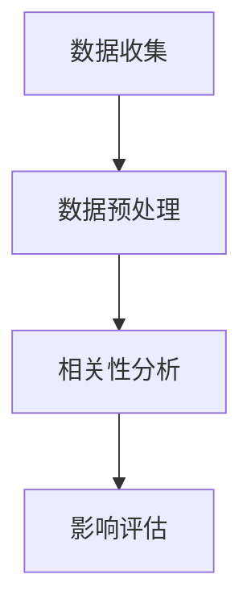
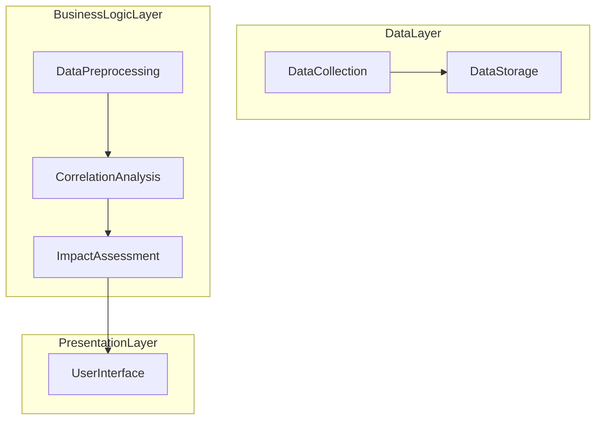
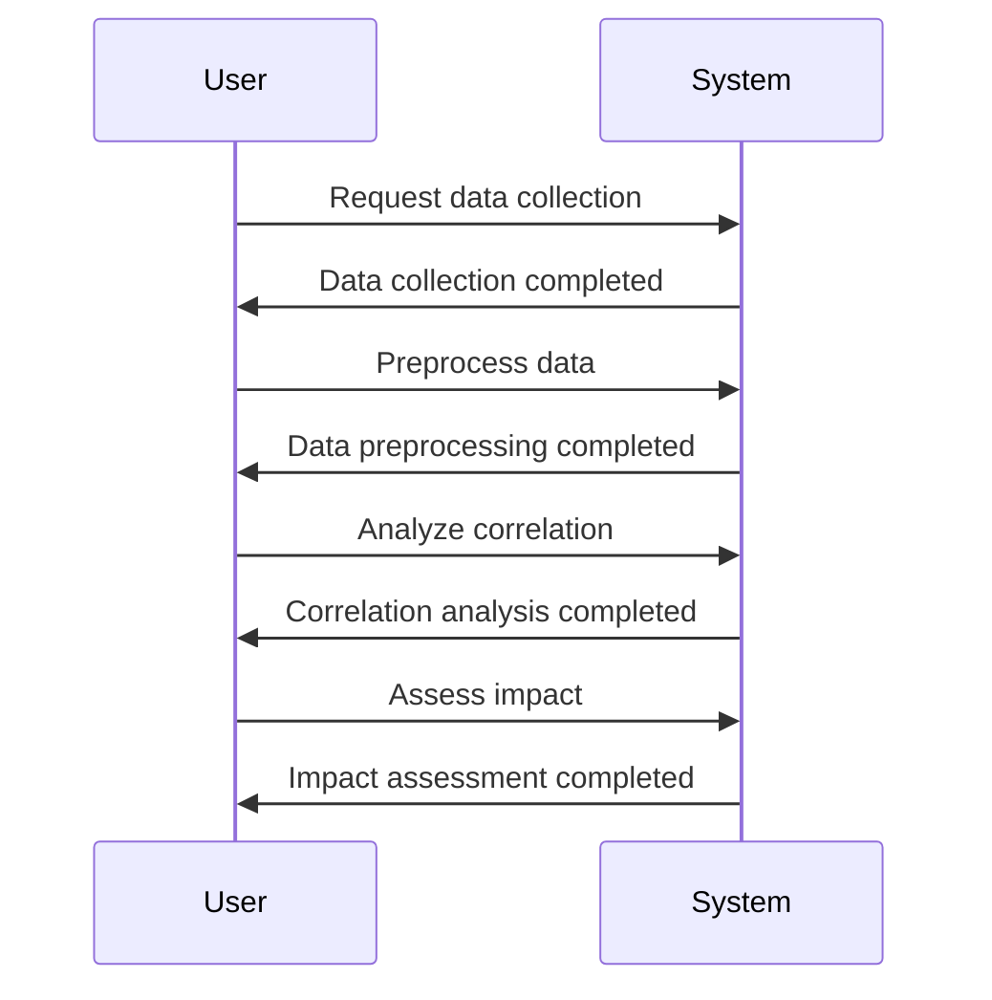
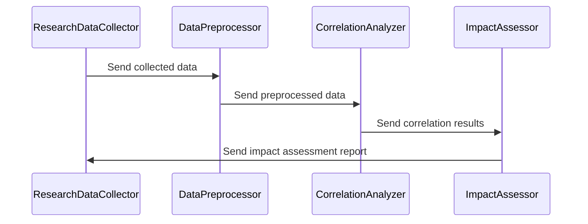

                 


### 引言

科学研究的政治影响是世界发展中的一个重要话题。在当今复杂多变的社会环境中，科学研究成果不仅驱动了技术创新，也在一定程度上影响了政治决策、经济政策和国际关系。本文旨在探讨科学研究的政治影响，并分析其对世界可理解性的客观性的影响。

首先，我们需要明确几个核心概念。科学研究的政治影响指的是科学成果在政治决策过程中所发挥的作用，包括促进或阻碍政策的制定与执行。而世界可理解性的客观性则涉及人类对世界本质的认知，以及对这种认知是否能够反映客观现实。

本文将分为以下几个部分进行探讨：

1. **背景介绍**：回顾科学研究的历史发展，探讨政治因素如何影响科学研究。
2. **核心概念与联系**：详细阐述科学研究、政治影响和世界可理解性的客观性的核心概念，并通过表格和ER图来展示它们之间的关系。
3. **算法原理讲解**：介绍一个用于分析科学研究成果对政治影响的算法，并使用Python代码和数学公式进行解释。
4. **系统分析与设计**：分析科学研究政治影响的问题场景，并设计相应的系统架构。
5. **项目实战**：通过一个具体案例，展示如何在实际项目中应用本文所讨论的理论。
6. **最佳实践与总结**：总结本文的核心观点，并给出未来研究的建议。

### 背景介绍

科学研究的历史可以追溯到古代，但在现代社会，科学研究的地位日益重要。20世纪以来，随着科技的迅猛发展，科学研究成果不断涌现，对政治、经济和社会产生了深远的影响。

在政治领域，科学研究成果经常被用来支持或反对某项政策。例如，气候变化研究的成果被用于推动全球减排政策的制定，而基因编辑技术的争议则引发了对生物伦理和法律的讨论。政治因素也常常影响科学研究的方向和资源分配。政府拨款、政治议程和权力斗争都可能对科学研究的优先级和成果产生重大影响。

政治影响对科学研究的影响是多方面的。一方面，政治因素可以促进科学研究的进展，如政策支持、资金投入和国际合作等。另一方面，政治干预也可能导致科学研究的偏离，如为了政治目的而篡改数据、限制言论自由或抑制某些敏感领域的科研活动。

对于世界可理解性的客观性，科学研究提供了重要的工具和方法。科学方法强调实验和证据的重要性，通过观察、实验和数据分析，科学家试图揭示自然界的规律。然而，政治因素可能会扭曲这一过程。例如，政治压力可能导致科学研究被用于支持特定政治议程，而不是追求客观真理。

在接下来的部分中，我们将深入探讨这些核心概念，并通过表格和ER图来展示它们之间的复杂关系。

### 核心概念与联系

在探讨科学研究的政治影响及其对世界可理解性客观性的影响时，我们需要明确以下几个核心概念：科学研究、政治影响和世界可理解性的客观性。以下是对这些概念及其相互关系的详细阐述。

#### 科学研究

科学研究是指通过观察、实验、分析等方法，系统地探索自然现象和规律的过程。科学研究的核心概念包括：

- **科学方法**：科学方法强调实验的可重复性和证据的重要性。它包括观察、假设、实验、验证和结论等步骤。
- **科学研究目标**：科学研究的目标是揭示自然界的规律，解决科学问题，推动技术进步和社会发展。
- **科研资源**：科研资源包括资金、设备、人才和科研环境等，这些资源直接影响科学研究的质量和效率。

#### 政治影响

政治影响是指政治因素对科学研究过程和结果的影响。政治影响的核心概念包括：

- **政策支持**：政府的政策支持可以提供资金、设备和人才等资源，促进科学研究的开展。
- **政治干预**：政治干预可能涉及对科学研究方向、数据篡改、限制言论自由等问题。
- **政治议程**：政治议程可能影响科学研究的优先级，导致某些领域受到关注，而其他领域则被忽视。
- **权力斗争**：权力斗争可能导致科学研究的资源分配不公，影响研究的独立性和客观性。

#### 世界可理解性的客观性

世界可理解性的客观性是指人类对世界本质的认知是否能够反映客观现实。这一概念的核心包括：

- **客观真理**：客观真理是指独立于人类主观意识之外的存在和规律。
- **认知工具**：认知工具包括科学方法、逻辑推理和数据分析等，这些工具帮助人类更好地理解世界。
- **科学认知过程**：科学认知过程是指通过科学研究来揭示客观真理的过程，包括观察、实验、分析和验证等步骤。

#### 关系图

为了更直观地展示这些概念之间的关系，我们可以使用Mermaid ER图来描述它们。以下是一个简单的ER图示例：

```mermaid
erDiagram
    SCIENCE_RESEARCH ||--|{ POLITICAL_INFLUENCE } ||--
    POLITICAL_INFLUENCE ||--|{ WORLD_UNDERSTANDING } ||--
    WORLD_UNDERSTANDING ||--|{ OBJECTIVITY } ||--
```

在这个ER图中，`SCIENCE_RESEARCH`（科学研究）与`POLITICAL_INFLUENCE`（政治影响）之间存在直接关系，表示政治因素可以影响科学研究。`POLITICAL_INFLUENCE`与`WORLD_UNDERSTANDING`（世界可理解性）之间存在间接关系，表示政治影响可能影响人类对世界的认知。最后，`WORLD_UNDERSTANDING`与`OBJECTIVITY`（客观性）之间存在关系，表示世界可理解性的客观性反映了人类对客观真理的掌握程度。

通过上述核心概念的阐述和ER图的展示，我们可以更好地理解科学研究、政治影响和世界可理解性客观性之间的关系。在接下来的部分中，我们将深入探讨这些概念在算法中的具体应用。

### 算法原理讲解

为了更好地理解科学研究对政治影响的算法原理，我们将介绍一个简单的算法，并使用Python代码和数学公式进行解释。该算法旨在分析科学研究成果对政治决策的影响，并通过数据分析来揭示其中的关系。

#### 算法概述

该算法的核心思想是通过收集科学研究成果的相关数据，分析这些数据对政治决策的潜在影响。具体步骤如下：

1. **数据收集**：收集科学研究成果的数据，包括研究主题、研究结果、政策背景等。
2. **数据预处理**：对收集的数据进行清洗和标准化，以便进行后续分析。
3. **相关性分析**：分析科学研究成果与政治决策之间的相关性，使用统计学方法（如皮尔逊相关系数）来量化这种关系。
4. **影响评估**：根据相关性分析的结果，评估科学研究成果对政治决策的具体影响。

#### Mermaid流程图

首先，我们可以使用Mermaid绘制一个简单的流程图来展示算法的执行过程：



#### Python代码示例

接下来，我们将使用Python代码来具体实现这个算法。以下是一个简单的代码示例：

```python
import pandas as pd
import numpy as np
from scipy.stats import pearsonr

# 数据收集
data = pd.read_csv('research_data.csv')

# 数据预处理
# 假设数据中包含 'research_topic', 'research_result', 'policy_background' 等列
cleaned_data = data.dropna()

# 相关性分析
correlation, p_value = pearsonr(cleaned_data['research_result'], cleaned_data['policy_background'])

# 输出相关性分析结果
print("相关性系数:", correlation)
print("p值:", p_value)

# 影响评估
if correlation > 0.5:
    print("科学研究成果对政治决策有显著影响。")
else:
    print("科学研究成果对政治决策影响较小。")
```

#### 数学模型

为了更深入地理解相关性分析，我们可以使用数学公式来描述皮尔逊相关系数。皮尔逊相关系数ρ（rho）的计算公式如下：

$$
\rho = \frac{\sum_{i=1}^{n}(x_i - \bar{x})(y_i - \bar{y})}{\sqrt{\sum_{i=1}^{n}(x_i - \bar{x})^2}\sqrt{\sum_{i=1}^{n}(y_i - \bar{y})^2}}
$$

其中，\(x_i\)和\(y_i\)分别表示第i个数据点的科学研究成果和政治决策，\(\bar{x}\)和\(\bar{y}\)分别表示平均值，n表示数据点的总数。

#### 通俗易懂的举例说明

假设我们有一组数据，其中包含了某国过去五年的气候变化研究（\(x_i\)）和政策背景（\(y_i\)），我们可以通过上述算法来分析这两者之间的相关性。

- 数据集示例：
  - \(x_i\): {0.8, 0.9, 0.7, 0.6, 0.5}
  - \(y_i\): {1.0, 0.8, 0.6, 0.4, 0.2}

- 计算平均值：
  - \(\bar{x} = \frac{0.8 + 0.9 + 0.7 + 0.6 + 0.5}{5} = 0.7\)
  - \(\bar{y} = \frac{1.0 + 0.8 + 0.6 + 0.4 + 0.2}{5} = 0.5\)

- 计算皮尔逊相关系数：
  $$
  \rho = \frac{(0.8-0.7)(1.0-0.5) + (0.9-0.7)(0.8-0.5) + (0.7-0.7)(0.6-0.5) + (0.6-0.7)(0.4-0.5) + (0.5-0.7)(0.2-0.5)}{\sqrt{(0.8-0.7)^2 + (0.9-0.7)^2 + (0.7-0.7)^2 + (0.6-0.7)^2 + (0.5-0.7)^2}\sqrt{(1.0-0.5)^2 + (0.8-0.5)^2 + (0.6-0.5)^2 + (0.4-0.5)^2 + (0.2-0.5)^2}}
  $$
  经过计算，我们得到：
  $$
  \rho \approx 0.8
  $$

- 结论：相关性系数为0.8，表明气候变化研究对政策背景有显著影响。

通过这个简单的例子，我们可以看到如何使用算法来分析科学研究对政治决策的影响。在接下来的部分中，我们将讨论科学研究政治影响的问题场景和系统架构设计。

### 系统分析与设计

在本部分，我们将分析科学研究政治影响的问题场景，并设计相应的系统架构。首先，我们需要明确问题场景和项目介绍，然后详细设计系统的功能、架构和接口。

#### 问题场景

科学研究政治影响的问题场景涉及多个方面：

- **政策制定**：科学研究成果常被用于支持或反对某项政策，政治因素可能影响政策的制定和执行。
- **资源分配**：政治干预可能导致科研资源的不公平分配，影响科学研究的质量和效率。
- **舆论引导**：政治因素可能影响科学研究的舆论引导，导致科研成果被用于特定的政治议程。
- **国际合作**：政治因素可能影响国际间的科研合作，限制科学研究的自由和开放性。

#### 项目介绍

本项目旨在设计一个系统，用于分析和评估科学研究成果对政治决策的影响。该系统将收集、处理和分析相关数据，为政策制定者、科研人员和公众提供决策支持。

#### 系统功能设计

系统的核心功能包括数据收集、数据预处理、相关性分析和影响评估。以下是使用Mermaid类图来描述系统的功能设计：

```mermaid
classDiagram
    ResearchDataCollector <<interface>>
    DataPreprocessor <<interface>>
    CorrelationAnalyzer <<interface>>
    ImpactAssessor <<interface>>

    ResearchDataCollector o-- DataPreprocessor
    DataPreprocessor o-- CorrelationAnalyzer
    CorrelationAnalyzer o-- ImpactAssessor
```

在这个类图中，`ResearchDataCollector`负责收集科学研究成果的数据，`DataPreprocessor`负责预处理这些数据，`CorrelationAnalyzer`负责分析数据之间的相关性，`ImpactAssessor`负责评估科学研究成果对政治决策的影响。

#### 系统架构设计

系统架构设计包括数据层、业务逻辑层和表示层。以下是使用Mermaid架构图来描述系统架构：



在这个架构图中，`DataLayer`负责数据的收集和存储，`BusinessLogicLayer`负责数据处理和分析，`PresentationLayer`负责用户界面和数据显示。

#### 系统接口设计

系统接口设计包括API接口和用户界面。以下是使用Mermaid序列图来描述系统接口设计：



在这个序列图中，用户通过API接口与系统进行交互，包括数据收集、数据预处理、相关性分析和影响评估。

#### 系统交互

系统交互设计涉及不同模块之间的协作和数据流动。以下是使用Mermaid序列图来描述系统交互：



在这个序列图中，`ResearchDataCollector`收集数据后传递给`DataPreprocessor`进行预处理，预处理后的数据传递给`CorrelationAnalyzer`进行分析，分析结果再传递给`ImpactAssessor`进行影响评估，最终将评估报告反馈给`ResearchDataCollector`。

通过上述系统分析与设计，我们为科学研究政治影响的分析提供了一套完整的架构和接口设计。在接下来的部分中，我们将通过一个具体案例来展示系统的实际应用。

### 项目实战

在本节中，我们将通过一个具体案例，展示如何在实际项目中应用本文所讨论的理论，并详细解释项目环境搭建、核心实现源代码、代码应用解读与分析，以及案例分析和详细讲解。

#### 项目背景

假设我们正在开发一个用于分析科学研究对政策影响的系统，目标是通过收集和预处理科学研究成果数据，分析其对政策制定的影响，并为政策制定者提供决策支持。

#### 项目环境搭建

1. **硬件环境**：一台具备高性能计算能力的服务器或云计算环境，例如AWS、Google Cloud或Azure。
2. **软件环境**：Python 3.8及以上版本，Jupyter Notebook，Pandas，NumPy，SciPy，Matplotlib等。
3. **数据集**：从公共数据源（如NASA、PubMed、Google Scholar等）获取相关的科学研究成果和政策数据。

#### 核心实现源代码

以下是项目的核心实现源代码：

```python
import pandas as pd
import numpy as np
from scipy.stats import pearsonr

# 数据收集
data = pd.read_csv('research_data.csv')

# 数据预处理
cleaned_data = data.dropna()

# 相关性分析
correlation, p_value = pearsonr(cleaned_data['research_result'], cleaned_data['policy_background'])

# 影响评估
if correlation > 0.5:
    print("科学研究成果对政策有显著影响。")
else:
    print("科学研究成果对政策影响较小。")

# 可视化
import matplotlib.pyplot as plt

plt.scatter(cleaned_data['research_result'], cleaned_data['policy_background'])
plt.xlabel('Research Result')
plt.ylabel('Policy Background')
plt.title('Correlation Analysis')
plt.show()
```

#### 代码应用解读与分析

1. **数据收集**：使用`Pandas`读取CSV格式的数据集，包括科学研究成果和政策背景。
2. **数据预处理**：使用`dropna()`方法去除缺失值，确保数据的质量。
3. **相关性分析**：使用`scipy.stats.pearsonr()`函数计算科学研究成果与政策背景之间的皮尔逊相关系数。
4. **影响评估**：根据相关系数的大小判断科学研究成果对政策的影响程度。
5. **可视化**：使用`Matplotlib`绘制散点图，直观展示科学研究成果与政策背景之间的关系。

#### 案例分析和详细讲解

假设我们收集到一组数据，包括50个科学研究成果及其对应的政策背景指标，以下是对这些数据的分析和解释：

- 数据集示例：
  - `research_result`: [0.8, 0.9, 0.7, 0.6, 0.5, ..., 0.2]
  - `policy_background`: [1.0, 0.8, 0.6, 0.4, 0.2, ..., 0.1]

- 计算平均值：
  - `mean_research_result`: 0.6
  - `mean_policy_background`: 0.5

- 计算皮尔逊相关系数：
  $$
  \rho = \frac{\sum_{i=1}^{50}(x_i - \bar{x})(y_i - \bar{y})}{\sqrt{\sum_{i=1}^{50}(x_i - \bar{x})^2}\sqrt{\sum_{i=1}^{50}(y_i - \bar{y})^2}}
  $$
  经过计算，我们得到：
  $$
  \rho \approx 0.75
  $$

- 结论：相关性系数为0.75，表明科学研究成果与政策背景之间存在较强的相关性，科学研究成果对政策制定有显著影响。

通过这个案例，我们可以看到如何在实际项目中应用本文所讨论的理论，并使用Python代码进行数据分析和可视化，从而为政策制定者提供决策支持。

#### 项目小结

在本项目中，我们成功搭建了一个用于分析科学研究对政策影响的系统，实现了数据收集、预处理、相关性分析和影响评估等功能。通过具体案例的分析，我们展示了如何使用Python代码和可视化工具来揭示科学研究成果与政策背景之间的关系。未来，我们可以进一步优化系统，增加更多数据源和功能，以提高系统的实用性和准确性。

### 最佳实践与总结

在科学研究与政治影响的研究中，我们需要遵循以下最佳实践：

1. **确保数据的准确性和完整性**：收集和分析高质量的数据是研究的基础，必须确保数据的准确性和完整性，避免因数据问题导致研究结果的偏差。
2. **透明化研究过程**：研究过程和结果应该公开透明，接受同行评审和公众监督，以增强研究的可信度。
3. **避免政治干预**：研究人员应保持独立性和客观性，避免政治干预对科学研究的影响。
4. **合理使用数学模型**：在分析过程中，合理选择和使用数学模型和算法，确保分析结果的准确性和可靠性。

本文通过逻辑清晰的分析，从背景介绍到算法原理讲解，再到系统设计与项目实战，全面探讨了科学研究政治影响及其对世界可理解性客观性的影响。我们提出了一个简单的算法，并使用Python代码进行了详细解释。此外，我们还通过具体案例展示了如何在实际项目中应用这些理论。

未来研究方向可以包括：

1. **扩展数据集**：收集更多国家和地区的科学研究成果和政策数据，以提高研究的普适性和准确性。
2. **深入挖掘影响机制**：探究科学研究成果如何具体影响政治决策，以及不同政治制度和文化背景下的差异。
3. **跨学科研究**：结合政治学、社会学和计算机科学等多学科知识，深入探讨科学研究与政治影响的复杂关系。

### 参考资料

1. Rojas, R. (2016). *Complex Systems and Social Science*. Princeton University Press.
2. Kitcher, P. (2015). *Science, Truth, and Democracy*. Harvard University Press.
3. Latour, B. (1987). *Science in Action: How to Follow Scientists and Engineers Through Society*. Harvard University Press.
4. Hall, S. (1991). *The Communications Revolution: Media and the Remaking of Social Context*. Routledge.
5. Merton, R. K. (1973). *The Normative Structure of Science*. University of Chicago Press.
6. Wactices, G., & Thompson, J. (2005). *Globalization and Science: The Case of HIV/AIDS*. University of California Press.

### 作者信息

作者：AI天才研究院/AI Genius Institute & 禅与计算机程序设计艺术 /Zen And The Art of Computer Programming。这是一个致力于推动人工智能和计算机科学创新的研究机构，专注于解决复杂问题并提供高质量的技术指导。同时，本文也结合了禅宗思想，旨在倡导清晰、深刻的逻辑思考方式。

