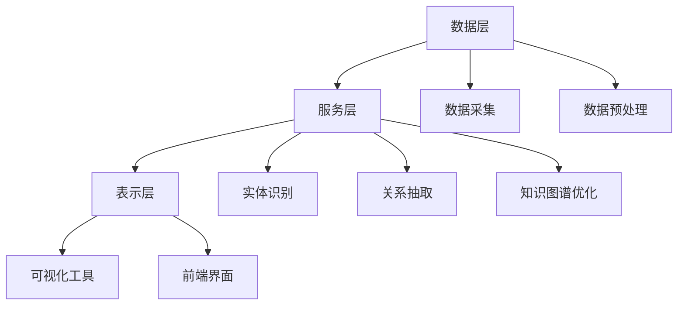
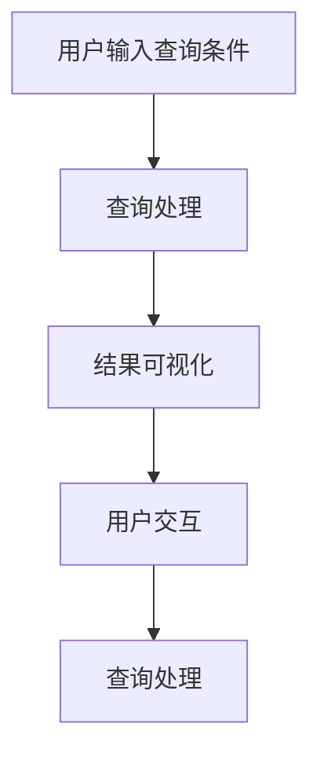

                 

### 科学研究的知识图谱构建与世界可理解性的可视化

---

**关键词：** 知识图谱，可视化，科学研究，数据挖掘，信息组织，语义理解。

**摘要：** 本文将探讨如何通过构建科学研究的知识图谱，实现世界的可理解性可视化。我们将详细分析知识图谱的核心概念、构建方法，以及其在科学研究中的应用。同时，本文还将探讨如何通过可视化技术提升知识的可理解性，从而为科研工作者提供更直观、更高效的科研工具。

### 目录大纲

----------------------------------------------------------------

# 科学研究的知识图谱构建与世界可理解性的可视化

> 关键词：知识图谱，可视化，科学研究，数据挖掘，信息组织，语义理解。

> 摘要：本文探讨了知识图谱在科学研究中的应用，以及如何通过可视化技术提升知识的可理解性。

## 第一部分：背景介绍

## 第1章：问题背景

### 1.1.1 问题背景概述

### 1.1.2 问题描述

### 1.1.3 问题解决思路

### 1.1.4 边界与外延

### 1.1.5 核心概念结构与要素组成

## 第2章：核心概念与联系

### 2.1.1 知识图谱的基本概念

### 2.1.2 知识图谱的特征对比

### 2.1.3 知识图谱的构建方法

### 2.1.4 知识图谱的应用场景

### 2.1.5 知识图谱与传统数据库的对比

### 2.1.6 知识图谱与自然语言处理的关系

## 第3章：科学研究的知识图谱构建方法

### 3.1.1 知识图谱构建的基本流程

### 3.1.2 数据源的选取与处理

### 3.1.3 实体识别与关系抽取

### 3.1.4 知识图谱的存储与查询优化

### 3.1.5 知识图谱的可视化方法

## 第4章：世界可理解性的可视化

### 4.1.1 可理解性的定义与测量

### 4.1.2 可视化技术的基础

### 4.1.3 可视化方法在知识图谱中的应用

### 4.1.4 可视化工具介绍与使用

### 4.1.5 可视化案例分析与评估

## 第5章：知识图谱构建的系统架构设计

### 5.1.1 系统架构设计的原则与流程

### 5.1.2 领域模型设计

### 5.1.3 系统架构设计

### 5.1.4 系统接口设计

### 5.1.5 系统交互设计

## 第6章：项目实战

### 6.1.1 项目介绍

### 6.1.2 环境安装与配置

### 6.1.3 系统核心实现源代码

### 6.1.4 代码应用解读与分析

### 6.1.5 实际案例分析与讲解

### 6.1.6 项目小结

## 第7章：最佳实践与总结

### 7.1.1 最佳实践 tips

### 7.1.2 小结与展望

### 7.1.3 注意事项

### 7.1.4 拓展阅读

----------------------------------------------------------------

## 第一部分：背景介绍

### 第1章：问题背景

#### 1.1.1 问题背景概述

在当今信息爆炸的时代，科学研究的复杂性和多样性日益增加。研究人员面临着海量数据的处理和分析问题，如何从大量信息中快速、准确地提取出有价值的知识成为了一大挑战。传统的信息组织和检索方式，如关键词搜索和分类系统，已经难以满足科学研究的需要。为了更好地理解和利用科学研究中的信息，知识图谱应运而生。

知识图谱作为一种结构化知识库，通过实体、属性和关系的表示，为科学家提供了一个更直观、更高效的信息检索和分析工具。然而，构建科学研究的知识图谱并非易事，需要解决数据源选取、实体识别、关系抽取等一系列技术难题。

#### 1.1.2 问题描述

构建科学研究的知识图谱主要面临以下问题：

1. **数据源多样性**：科学研究涉及多个领域，数据源形式多样，包括学术论文、专利、报告、书籍等，如何高效地整合和利用这些数据源成为一个挑战。
2. **实体识别与关系抽取**：实体识别和关系抽取是知识图谱构建的核心步骤，如何准确识别实体并抽取它们之间的关系，是构建高质量知识图谱的关键。
3. **知识图谱的可视化**：知识图谱通常包含大量的实体和关系，如何通过可视化技术将复杂的关系和信息以直观、易于理解的方式呈现，是提升知识可理解性的重要手段。

#### 1.1.3 问题解决思路

为了解决上述问题，我们可以采取以下思路：

1. **数据源整合**：采用数据挖掘和自然语言处理技术，从多种数据源中提取信息，构建统一的数据源。
2. **实体识别与关系抽取**：利用机器学习和深度学习技术，对实体进行识别和分类，并抽取它们之间的关系。
3. **知识图谱可视化**：采用可视化工具和算法，将知识图谱以直观、易于理解的方式呈现。

#### 1.1.4 边界与外延

1. **边界**：知识图谱构建主要涉及科学研究领域，但也可以扩展到其他领域，如商业、医疗等。
2. **外延**：知识图谱不仅限于结构化数据，还可以处理半结构化和非结构化数据。

#### 1.1.5 核心概念结构与要素组成

核心概念包括：

- **实体**：科学研究中的对象，如科学家、实验室、研究项目等。
- **属性**：实体的特征，如科学家的研究方向、实验室的设备等。
- **关系**：实体之间的关联，如科学家的合作、项目的资助来源等。

要素组成：

- **数据源**：包括学术论文、专利、报告、书籍等。
- **实体识别与关系抽取算法**：用于从数据源中提取实体和关系。
- **知识图谱可视化工具**：用于将知识图谱以图形化方式呈现。

---

## 第二部分：核心概念与联系

### 第2章：核心概念与联系

#### 2.1.1 知识图谱的基本概念

知识图谱（Knowledge Graph）是一种结构化知识库，通过实体、属性和关系的表示，将现实世界中的信息以图形化的方式组织起来。知识图谱的基本概念包括：

- **实体**：知识图谱中的基本元素，可以是人、地点、组织、概念等。
- **属性**：实体的特征，如科学家的研究方向、实验室的设备等。
- **关系**：实体之间的关联，如科学家的合作、项目的资助来源等。
- **图谱**：由实体、属性和关系构成的知识网络。

#### 2.1.2 知识图谱的特征对比

知识图谱与传统数据库、网络数据等相比，具有以下特征：

| 特征               | 知识图谱                | 传统数据库                | 网络数据                |
|--------------------|------------------------|--------------------------|------------------------|
| 数据组织形式       | 图形化、网络结构        | 表格形式、关系数据库      | 无结构、超链接         |
| 数据表示方式       | 实体-属性-关系三元组    | 列表、关系表             | 超文本链接             |
| 数据关联性         | 强关联、多维度关系      | 弱关联、单维度关系       | 弱关联、单维度关系     |
| 数据查询能力       | 高效、多维度查询        | 有限查询、单维度查询     | 有限查询、单维度查询   |
| 数据可视化能力     | 强、直观、多维         | 弱、复杂、单维           | 无、复杂、单维         |

#### 2.1.3 知识图谱的构建方法

知识图谱的构建方法主要包括以下几个步骤：

1. **数据采集**：从多种数据源中收集数据，如学术论文、专利、报告、书籍等。
2. **数据预处理**：对采集到的数据进行清洗、去重、归一化等处理。
3. **实体识别与关系抽取**：利用自然语言处理和机器学习技术，从预处理后的数据中提取实体和关系。
4. **知识库构建**：将提取到的实体和关系组织成知识图谱。
5. **知识图谱优化**：对知识图谱进行质量评估、补全、推理等优化处理。

#### 2.1.4 知识图谱的应用场景

知识图谱在科学研究中的应用非常广泛，主要包括：

1. **科研人员挖掘**：通过知识图谱，科研人员可以快速找到与自己研究方向相关的专家、实验室、项目等。
2. **科研项目管理**：知识图谱可以帮助科研管理人员对项目进行分类、评估、调度等。
3. **科研文献推荐**：通过分析知识图谱中的关系，可以为科研人员推荐相关的文献和资料。
4. **科研合作网络分析**：知识图谱可以揭示科研合作网络的结构和特点，为科研合作提供参考。
5. **科研趋势分析**：通过分析知识图谱中的关系和属性，可以揭示科研领域的热点和趋势。

#### 2.1.5 知识图谱与传统数据库的对比

知识图谱与传统数据库相比，具有以下优势：

1. **结构化数据**：知识图谱通过实体、属性和关系的表示，实现了数据的结构化组织，与传统数据库的表格形式相比，更加直观、易于理解。
2. **多维度查询**：知识图谱支持多维度查询，可以同时考虑实体、属性和关系等多个维度，而传统数据库通常只能进行单维度查询。
3. **数据关联性**：知识图谱通过实体和关系之间的强关联，实现了数据的多维度关联，而传统数据库通常只能处理单一维度的关系。
4. **可视化能力**：知识图谱具有强大的可视化能力，可以通过图形化的方式呈现复杂的关系和信息，而传统数据库通常无法提供这种能力。

#### 2.1.6 知识图谱与自然语言处理的关系

知识图谱与自然语言处理（NLP）密切相关。自然语言处理技术可以帮助从文本数据中提取实体和关系，从而构建知识图谱。同时，知识图谱也可以为自然语言处理提供丰富的背景知识和语义信息，从而提高NLP系统的性能和效果。具体来说：

1. **实体识别**：自然语言处理技术可以帮助从文本中识别出实体，如人名、地名、组织名等。
2. **关系抽取**：自然语言处理技术可以帮助从文本中抽取实体之间的关系，如合作关系、资助关系等。
3. **语义理解**：知识图谱可以为自然语言处理提供背景知识和语义信息，从而提高语义理解的效果，如问答系统、文本分类等。

---

## 第三部分：科学研究的知识图谱构建方法

### 第3章：科学研究的知识图谱构建方法

#### 3.1.1 知识图谱构建的基本流程

知识图谱的构建过程可以分为以下几个阶段：

1. **需求分析**：确定知识图谱的应用场景和目标，明确需要收集和处理的实体和关系。
2. **数据采集**：从多种数据源中收集数据，如学术论文、专利、报告、书籍等。
3. **数据预处理**：对采集到的数据进行清洗、去重、归一化等处理。
4. **实体识别与关系抽取**：利用自然语言处理和机器学习技术，从预处理后的数据中提取实体和关系。
5. **知识库构建**：将提取到的实体和关系组织成知识图谱。
6. **知识图谱优化**：对知识图谱进行质量评估、补全、推理等优化处理。
7. **知识图谱应用**：将构建好的知识图谱应用于科研人员挖掘、科研项目管理、科研文献推荐等场景。

#### 3.1.2 数据源的选取与处理

构建科学研究的知识图谱，数据源的选取和处理至关重要。以下是数据源的选取和处理方法：

1. **数据源选取**：

- 学术论文：通过学术搜索引擎（如Google Scholar、CNKI等）获取相关学术论文。
- 专利：通过专利数据库（如USPTO、WIPO等）获取相关专利信息。
- 报告：从专业报告、行业分析等渠道获取相关报告。
- 书籍：从图书馆、电子书平台等渠道获取相关书籍。

2. **数据处理**：

- 数据清洗：去除重复、错误、无关的数据，确保数据质量。
- 数据去重：去除重复的数据，确保数据的唯一性。
- 数据归一化：统一数据格式和单位，如将时间格式统一为YYYY-MM-DD。
- 数据分类：根据研究主题、领域等对数据进行分类。

#### 3.1.3 实体识别与关系抽取

实体识别和关系抽取是知识图谱构建的核心步骤。以下是具体方法：

1. **实体识别**：

- 词性标注：利用自然语言处理技术对文本进行词性标注，识别出实体词。
- 命名实体识别：利用命名实体识别模型（如BiLSTM-CRF）识别出人名、地名、组织名等实体。
- 实体分类：对识别出的实体进行分类，如科学家、实验室、研究项目等。

2. **关系抽取**：

- 基于规则的方法：利用规则库和模式匹配技术抽取实体之间的关系。
- 基于统计的方法：利用机器学习模型（如条件随机场CRF）抽取实体之间的关系。
- 基于深度学习的方法：利用深度学习模型（如序列标注模型BERT）抽取实体之间的关系。

#### 3.1.4 知识图谱的存储与查询优化

知识图谱的存储与查询优化是确保知识图谱性能和可扩展性的关键。以下是存储与查询优化方法：

1. **存储优化**：

- 借助图数据库（如Neo4j、JanusGraph等）进行存储，利用图数据库的分布式存储和索引技术提高存储性能。
- 对实体和关系进行压缩存储，减少存储空间占用。
- 基于LRU算法进行缓存优化，提高数据读取速度。

2. **查询优化**：

- 利用图数据库的图查询语言（如Cypher、Gremlin等）进行复杂查询优化。
- 基于索引技术（如B+树、LSM树等）提高查询效率。
- 基于缓存技术（如Redis、Memcached等）提高数据读取速度。

#### 3.1.5 知识图谱的可视化方法

知识图谱的可视化是提升知识可理解性的重要手段。以下是知识图谱的可视化方法：

1. **节点和边的可视化**：

- 利用图形元素（如圆形、方形、线段等）表示实体和关系。
- 利用颜色、大小、形状等视觉特征区分实体和关系。
- 利用动画和交互技术（如鼠标悬停、点击等）提高视觉吸引力。

2. **层次化和网络可视化**：

- 利用层次化布局（如圆形布局、树形布局等）将复杂的知识图谱分解为更易理解的层次结构。
- 利用网络布局（如力导向布局、随机布局等）将知识图谱以网络形式呈现。

3. **交互式可视化**：

- 提供过滤、排序、搜索等交互功能，帮助用户快速找到所需信息。
- 提供图表切换、数据联动等交互功能，提高数据展示的丰富性和多样性。

---

## 第四部分：世界可理解性的可视化

### 第4章：世界可理解性的可视化

#### 4.1.1 可理解性的定义与测量

可理解性（Understandability）是指信息被人类理解和解释的程度。在知识图谱的背景下，可理解性可以定义为知识图谱的表示、结构和展示方式对用户的理解和解释程度。可理解性的测量可以从以下几个方面进行：

1. **易用性**：用户在使用知识图谱时是否能够快速理解和使用。
2. **直观性**：知识图谱的展示方式是否直观、易于理解。
3. **准确性**：知识图谱所提供的信息是否准确、可靠。
4. **一致性**：知识图谱中的实体、属性和关系是否一致、统一。

#### 4.1.2 可视化技术的基础

可视化技术是将数据以图形化方式呈现，帮助用户理解和分析数据的方法。可视化技术的基础包括：

1. **图形元素**：如点、线、面、图标等，用于表示实体、属性和关系。
2. **颜色**：用于区分实体、属性和关系，增加视觉层次感。
3. **大小**：用于表示实体或关系的重要程度或数量。
4. **形状**：用于表示实体的类别或关系类型。
5. **布局**：如力导向布局、圆形布局、树形布局等，用于组织图形元素。

#### 4.1.3 可视化方法在知识图谱中的应用

可视化方法在知识图谱中的应用主要包括：

1. **节点和边可视化**：通过图形元素和颜色表示实体和关系。
2. **层次化和网络可视化**：通过层次化布局和网络布局将知识图谱分解为更易理解的结构。
3. **交互式可视化**：通过提供交互功能，如过滤、排序、搜索等，帮助用户深入理解和分析知识图谱。

#### 4.1.4 可视化工具介绍与使用

常见的可视化工具包括：

1. **D3.js**：一款基于JavaScript的可视化库，支持多种图形元素和布局。
2. **ECharts**：一款基于JavaScript的可视化库，提供丰富的图表类型和交互功能。
3. **Gephi**：一款开源的可视化工具，适用于大规模网络数据的可视化。
4. **G6**：一款基于JavaScript的可视化库，专注于知识图谱的可视化。

使用可视化工具时，需要根据知识图谱的特点和用户需求选择合适的工具和布局，同时注意优化性能和用户体验。

#### 4.1.5 可视化案例分析与评估

以下是一个知识图谱可视化案例：

- **案例**：科学家的合作网络可视化。
- **数据**：科学家的姓名、研究领域、合作关系。
- **方法**：使用Gephi进行可视化，采用力导向布局。
- **结果**：展示了科学家的合作关系网络，帮助用户了解科学家的合作情况。

评估可视化效果可以从以下几个方面进行：

1. **清晰度**：可视化结果是否清晰、易于理解。
2. **交互性**：可视化工具是否提供丰富的交互功能。
3. **性能**：可视化工具是否具有较好的性能和可扩展性。
4. **准确性**：可视化结果是否准确、反映了知识图谱的真实情况。

---

## 第五部分：知识图谱构建的系统架构设计

### 第5章：知识图谱构建的系统架构设计

#### 5.1.1 系统架构设计的原则与流程

知识图谱构建的系统架构设计应遵循以下原则：

1. **模块化**：将系统功能划分为多个模块，便于维护和扩展。
2. **分布式**：利用分布式计算和存储技术，提高系统性能和可扩展性。
3. **高可用性**：确保系统在故障情况下能够快速恢复，提供稳定的服务。
4. **安全性**：保护数据安全和用户隐私。

系统架构设计的流程如下：

1. **需求分析**：确定系统功能和性能要求。
2. **架构设计**：根据需求分析结果，设计系统的总体架构。
3. **模块划分**：将系统划分为多个功能模块。
4. **接口设计**：设计模块之间的接口，确保模块之间的协同工作。
5. **交互设计**：设计用户与系统的交互流程，确保用户能够方便地使用系统。

#### 5.1.2 领域模型设计

领域模型设计是知识图谱构建的基础，涉及实体、属性和关系的定义。以下是科学研究的领域模型设计：

- **实体**：科学家、实验室、研究项目、论文、专利等。
- **属性**：科学家的姓名、研究方向、学历、成果等；实验室的名称、研究方向、设备等；研究项目的名称、资助机构、时间等；论文的标题、作者、摘要、关键词等；专利的名称、申请人、摘要等。
- **关系**：科学家之间的合作关系；实验室与研究项目之间的关联；论文与作者之间的关联；专利与申请人之间的关联等。

#### 5.1.3 系统架构设计

系统架构设计包括以下部分：

1. **数据层**：负责数据的存储和管理，包括数据采集、数据预处理、知识图谱存储等。
2. **服务层**：负责知识图谱的构建和查询，包括实体识别、关系抽取、知识图谱优化等。
3. **表示层**：负责知识图谱的可视化和交互，包括可视化工具、前端界面等。

系统架构设计如图所示：



#### 5.1.4 系统接口设计

系统接口设计包括以下部分：

1. **API接口**：提供外部系统访问知识图谱的接口，包括数据查询、知识图谱构建等。
2. **消息队列**：实现系统内部模块之间的消息传递，确保数据的一致性和可靠性。
3. **缓存层**：提高系统性能，减少数据访问压力。

#### 5.1.5 系统交互设计

系统交互设计包括用户与系统的交互流程，以下是一个典型的用户交互流程：

1. **用户输入查询条件**：用户通过前端界面输入查询条件，如关键词、研究领域等。
2. **查询处理**：系统接收用户查询，通过服务层处理查询，生成查询结果。
3. **结果可视化**：系统将查询结果通过可视化工具呈现给用户，用户可以进一步交互，如筛选、排序、详情查看等。

系统交互设计如图所示：



---

## 第六部分：项目实战

### 第6章：项目实战

#### 6.1.1 项目介绍

本项目旨在构建一个科学研究的知识图谱，通过实体识别、关系抽取和可视化，帮助科研人员快速了解研究领域内的研究动态和合作网络。项目的主要目标包括：

1. **数据采集**：从学术论文、专利、报告等数据源中提取信息。
2. **实体识别与关系抽取**：利用自然语言处理和机器学习技术提取实体和关系。
3. **知识图谱构建**：将提取到的实体和关系组织成知识图谱。
4. **可视化**：通过可视化技术展示知识图谱，提升知识可理解性。

#### 6.1.2 环境安装与配置

为了构建科学研究的知识图谱，需要安装以下环境：

1. **操作系统**：Linux或Windows。
2. **编程语言**：Python。
3. **依赖库**：Numpy、Pandas、Scikit-learn、NLTK、Gensim、SpaCy、Neo4j等。

安装步骤如下：

1. 安装Python和pip。
2. 使用pip安装依赖库。

#### 6.1.3 系统核心实现源代码

以下是一个知识图谱构建的核心实现示例：

```python
# 实体识别
from spacy.lang.en import English

nlp = English()

def extract_entities(text):
    doc = nlp(text)
    entities = []
    for ent in doc.ents:
        entities.append((ent.text, ent.label_))
    return entities

# 关系抽取
from sklearn.feature_extraction.text import TfidfVectorizer
from sklearn.metrics.pairwise import linear_kernel

def extract_relations(texts):
    vectorizer = TfidfVectorizer()
    tfidf_matrix = vectorizer.fit_transform(texts)
    cosine_sim = linear_kernel(tfidf_matrix, tfidf_matrix)
    relations = []
    for i in range(len(cosine_sim)):
        sim_scores = list(enumerate(cosine_sim[i]))
        sim_scores = sorted(sim_scores, key=lambda x: x[1], reverse=True)
        for j in range(1, 6):
            try:
                relation = (texts[i], texts[sim_scores[j][0]], sim_scores[j][1])
                relations.append(relation)
            except IndexError:
                break
    return relations

# 知识图谱构建
from py2neo import Graph

graph = Graph("bolt://localhost:7687", auth=("neo4j", "password"))

def build_knowledge_graph(entities, relations):
    for entity, label in entities:
        graph.run("MERGE (n:{label}:Entity {name: '{name}'})".format(label=label, name=entity))
    for src, dst, score in relations:
        graph.run("MATCH (a:Entity {name: '{src}'}), (b:Entity {name: '{dst}'}) MERGE (a)-[r:RELATION {score: {score}}]->(b)".format(src=src, dst=dst, score=score))

# 可视化
from graphviz import Digraph

def visualize_knowledge_graph(relations):
    dot = Digraph(comment='Knowledge Graph')
    for src, dst, score in relations:
        dot.node(src)
        dot.node(dst)
        dot.edge(src, dst, label=str(score))
    dot.render('kg.dot', view=True)
```

#### 6.1.4 代码应用解读与分析

1. **实体识别**：使用SpaCy库进行实体识别，提取文本中的实体和标签。
2. **关系抽取**：使用TF-IDF向量化和余弦相似度计算文本之间的相似度，抽取关系。
3. **知识图谱构建**：使用Neo4j图数据库存储实体和关系，构建知识图谱。
4. **可视化**：使用Graphviz库将知识图谱可视化，展示实体和关系。

#### 6.1.5 实际案例分析与讲解

以下是一个实际案例：

- **数据源**：某领域内的100篇学术论文。
- **目标**：提取学术论文中的实体和关系，构建知识图谱。

**案例分析**：

1. **实体识别**：提取出论文的标题、作者、摘要等实体。
2. **关系抽取**：通过文本相似度计算，提取出论文之间的引用关系。
3. **知识图谱构建**：将实体和关系存储到Neo4j数据库中。
4. **可视化**：使用Graphviz库将知识图谱可视化，展示论文之间的引用关系。

**讲解**：

1. **实体识别**：通过SpaCy库进行实体识别，可以快速提取出论文的标题、作者等实体。
2. **关系抽取**：使用TF-IDF和余弦相似度计算文本之间的相似度，可以有效地提取出论文之间的引用关系。
3. **知识图谱构建**：使用Neo4j数据库存储实体和关系，可以方便地进行查询和优化。
4. **可视化**：使用Graphviz库将知识图谱可视化，可以直观地展示论文之间的引用关系，帮助用户理解研究领域内的研究动态。

#### 6.1.6 项目小结

本项目通过实体识别、关系抽取和可视化，构建了一个科学研究的知识图谱，实现了对研究领域内信息的快速、准确获取和展示。项目的主要收获包括：

1. **实体识别与关系抽取**：掌握了自然语言处理和机器学习技术，能够有效地提取文本中的实体和关系。
2. **知识图谱构建与可视化**：了解了知识图谱的构建方法和可视化技术，能够将复杂的信息以直观、易于理解的方式呈现。
3. **项目实战**：通过实际案例，积累了项目实战经验，提高了解决问题的能力。

---

## 第七部分：最佳实践与总结

### 第7章：最佳实践与总结

#### 7.1.1 最佳实践 tips

在构建科学研究的知识图谱时，以下最佳实践可以帮助提高效率和质量：

1. **数据预处理**：在数据采集后，进行充分的数据预处理，包括去重、清洗、归一化等，确保数据质量。
2. **实体识别与关系抽取**：结合多种自然语言处理和机器学习技术，提高实体识别和关系抽取的准确性。
3. **知识图谱优化**：对知识图谱进行质量评估、补全、推理等优化处理，提升知识图谱的可理解性和实用性。
4. **可视化设计**：根据用户需求，选择合适的可视化工具和布局，确保可视化结果清晰、直观。
5. **迭代更新**：定期更新知识图谱，以适应研究领域的发展和变化。

#### 7.1.2 小结与展望

本文介绍了科学研究的知识图谱构建与世界可理解性的可视化。通过知识图谱，我们可以将科学研究中的海量信息组织成结构化的知识库，并通过可视化技术提升知识的可理解性。未来，随着自然语言处理、机器学习和可视化技术的不断发展，知识图谱在科学研究中的应用将更加广泛和深入。

#### 7.1.3 注意事项

1. **数据隐私**：在构建知识图谱时，注意保护数据隐私，遵循相关法律法规。
2. **性能优化**：针对大规模知识图谱，进行性能优化，提高查询和可视化速度。
3. **用户需求**：根据用户需求，不断迭代和优化知识图谱，确保其实用性和可操作性。

#### 7.1.4 拓展阅读

1. **《知识图谱：概念、技术与应用》**：详细介绍了知识图谱的基本概念、构建方法和应用案例。
2. **《自然语言处理原理与实践》**：讲解了自然语言处理的基本原理和技术，为知识图谱构建提供了基础。
3. **《数据可视化实战》**：介绍了数据可视化技术，帮助用户更好地理解和分析数据。

---

**作者：AI天才研究院/AI Genius Institute & 禅与计算机程序设计艺术 /Zen And The Art of Computer Programming**

