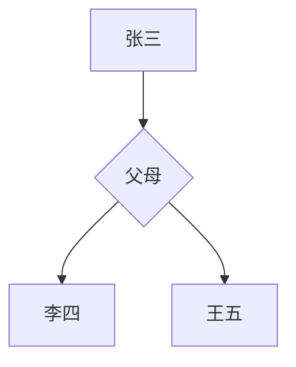

                 

### 前言

#### 1.1 书籍背景

在当今科技迅猛发展的时代，科学研究面临着前所未有的挑战和机遇。随着数据量的爆炸式增长和交叉学科的日益融合，传统的文本阅读和数据处理方式已难以应对复杂的科学问题。为了更高效地理解和利用这些海量数据，知识图谱作为一种新兴的信息组织方式，逐渐成为科学研究的利器。

知识图谱通过将实体、属性和关系以图形化的方式组织，使得复杂数据变得直观、可操作和易于理解。它不仅能够揭示数据之间的内在联系，还能为科学研究提供强有力的工具，助力科学家发现新知识、预测新趋势和优化研究过程。

《科学研究的知识图谱：可视化世界可理解性》正是为了应对这一挑战而诞生的。本书旨在系统地介绍知识图谱的基础知识、构建方法、表示技术、可视化手段以及在科学研究中的广泛应用。通过这本书，读者不仅可以了解知识图谱的基本原理，还能掌握构建和应用知识图谱的实际技能，从而为科学研究注入新的活力。

#### 1.1.1 科学研究的挑战与需求

科学研究的过程中，数据管理和信息提取是两个至关重要的环节。传统的科研方法依赖于大量的文本阅读和手动数据分析，这不仅费时费力，而且容易产生误差。随着科学研究的复杂度和数据量的增加，这一问题变得更加突出。例如，在生物医学领域，研究人员需要从海量的文献数据库中提取有效的信息，以便发现潜在的药物靶点和新的治疗方法。然而，现有的文本检索技术往往只能提供基于关键词的搜索结果，难以揭示文献之间的隐含关系和深层次的知识结构。

此外，科学研究的跨学科性质也使得信息孤岛现象愈发严重。不同领域的专家往往使用不同的术语和概念，导致研究成果难以共享和复用。例如，在物理学和化学的研究中，术语“反应”和“分子”在不同的背景下可能有截然不同的含义。这使得研究人员在跨领域合作时面临巨大的沟通障碍，影响了科研成果的传播和应用。

为了解决这些问题，科学家们迫切需要一种能够将复杂数据结构化、可视化和智能化的工具。知识图谱正是在这样的背景下应运而生的。通过将实体、属性和关系以图的形式表示，知识图谱能够将零散的数据片段编织成一个统一的知识网络，使得研究人员可以更直观地理解数据之间的关系，从而发现新的科学知识。

知识图谱的应用不仅限于文本信息，它还可以整合多种类型的数据，如图像、音频和传感器数据等。这种多模态的数据整合能力，使得知识图谱在科学研究中的应用范围不断扩大，为解决复杂的科学问题提供了新的思路和工具。

总之，知识图谱的引入为科学研究带来了巨大的变革。它不仅提高了数据管理的效率和准确性，还有助于打破学科壁垒，促进科学知识的共享和传播。在《科学研究的知识图谱：可视化世界可理解性》一书中，我们将详细探讨知识图谱的理论基础、技术方法和实际应用，帮助读者更好地理解和利用这一强大的工具，推动科学研究的深入发展。

#### 1.1.2 可视化在科学研究中的作用

在科学研究中，数据可视化是一种不可或缺的工具，它能够将复杂的科学数据转化为易于理解和分析的形式。通过可视化，科学家可以更直观地观察数据模式、趋势和异常，从而发现隐藏在数据背后的规律和联系。以下是数据可视化在科学研究中的几个关键作用：

首先，数据可视化有助于提高数据的可理解性。科学研究往往涉及大量复杂的数据，这些数据如果仅仅以数字或表格的形式呈现，对于非专业人士来说很难理解。通过可视化技术，科学家可以将这些数据以图形、图像或交互式界面等形式展示，使得数据变得更加直观和易于理解。

其次，数据可视化有助于揭示数据中的模式和信息。通过对数据集进行可视化分析，科学家可以快速发现数据中的异常值、趋势和关联关系。这些发现往往能够启发新的科学假设和研究方向，从而推动科学研究的进展。

此外，数据可视化还能促进科学沟通和合作。在跨学科的研究项目中，科学家们经常需要分享和分析复杂的数据。通过数据可视化，他们可以更加直观地展示研究结果，使得其他领域的专家能够更容易地理解和参与研究。

然而，数据可视化也存在一些挑战。首先，选择合适的数据可视化方法至关重要。不同的数据类型和科研目标需要不同的可视化技术。例如，对于时间序列数据，折线图和散点图可能是更好的选择；而对于地理空间数据，地图和热力图则更为合适。

其次，可视化数据的质量也是一个重要的考虑因素。如果数据可视化不准确或误导用户，可能会产生错误的结论。因此，在制作可视化图表时，需要确保数据源的准确性和完整性，并对可视化结果进行充分的验证。

最后，数据可视化工具和技术本身也在不断进步。随着计算机技术和大数据分析的不断发展，新的可视化工具和方法不断涌现。科学家需要不断学习和掌握这些新技术，以更好地利用数据可视化来推动科学研究。

总之，数据可视化在科学研究中扮演着重要的角色。它不仅提高了数据理解和分析的能力，还促进了科学沟通和合作。在《科学研究的知识图谱：可视化世界可理解性》一书中，我们将深入探讨数据可视化的原理、技术和应用，帮助读者更好地利用这一工具，为科学研究注入新的活力。

### 1.2 书籍目标

#### 1.2.1 读者对象

《科学研究的知识图谱：可视化世界可理解性》旨在为广大科学研究人员、数据科学家、程序员和计算机图形学爱好者提供一本全面、系统的知识图谱指南。这本书特别适合以下几类读者：

1. **科学研究人员**：希望利用知识图谱来提升科研效率和研究深度的研究人员。他们可能已经在进行数据分析和可视化，但需要更深入的理解和掌握知识图谱的理论和应用。

2. **数据科学家和分析师**：负责处理和分析复杂数据的从业者，他们希望通过知识图谱来更好地组织和管理数据，发现数据中的隐含关系和模式。

3. **程序员和软件工程师**：对计算机图形学和可视化技术感兴趣，希望将知识图谱技术应用于实际软件开发中的技术人员。

4. **计算机图形学爱好者**：对数据可视化技术和图形学算法有浓厚兴趣，希望通过本书了解知识图谱在科学研究中的应用。

无论读者属于哪一类，本书都将为他们提供从基础知识到高级应用的全面指导，帮助他们在科学研究中更好地利用知识图谱这一强大的工具。

#### 1.2.2 学习目标与收获

通过阅读《科学研究的知识图谱：可视化世界可理解性》，读者可以达成以下学习目标和收获：

1. **掌握知识图谱的基本概念**：了解知识图谱的定义、基本结构和功能，掌握知识图谱与语义网的关系，理解节点、边、属性和类型等基本概念。

2. **理解知识图谱的构建方法**：学习知识图谱的构建流程，包括数据采集、数据清洗、知识提取和知识构建等步骤，掌握构建高质量知识图谱的关键技术。

3. **掌握知识图谱的表示方法**：了解不同的知识图谱表示技术，如实体-关系表示、图嵌入技术和语义表示方法，学会如何将知识图谱表示为易于分析和理解的形式。

4. **掌握知识图谱的可视化技术**：学习知识图谱的可视化原理、工具和技术，掌握如何使用可视化方法来揭示知识图谱中的复杂关系和模式。

5. **应用知识图谱于科学研究**：了解知识图谱在科学研究中的应用场景，如科学发现与探索、科学分析与管理、科学创新与协同等，学会如何利用知识图谱提升科研工作的效率和质量。

6. **培养实践能力**：通过本书中的实例和项目实战，读者将能够将所学知识应用于实际问题中，提升解决复杂科学问题的能力。

通过本书的学习，读者不仅可以全面掌握知识图谱的理论知识，还能掌握实际操作技能，为科学研究注入新的动力和创造力。无论读者是新手还是有一定基础，本书都将为他们提供系统、深入的学习资源，帮助他们在知识图谱领域取得显著的进步。

### 第1章：知识图谱的基础

#### 第1章：知识图谱概述

知识图谱作为一种新兴的信息组织方式，已经在科学研究、企业管理和日常生活中发挥着越来越重要的作用。在本章中，我们将对知识图谱进行全面的介绍，包括其基本概念、核心组成部分及其与语义网的关系。

##### 1.1 知识图谱的定义

知识图谱（Knowledge Graph）是一种用于表示信息实体及其之间关系的图形化结构。它通过节点（Node）表示实体，通过边（Edge）表示实体之间的关系，并通过属性（Property）对实体进行描述。知识图谱的核心目标是将海量数据中的孤立信息片段整合成一个统一、结构化的知识网络，从而为人类和计算机提供更直观、易于理解和操作的信息表示。

知识图谱不仅用于表示显式知识，如事实和规则，还可以表示隐式知识，如实体间的隐含关系和上下文信息。这种多层次的表示能力使得知识图谱在信息检索、数据挖掘、自然语言处理等领域具有广泛的应用前景。

##### 1.1.1 知识图谱的基本概念

在了解知识图谱的定义后，我们需要明确几个基本概念：

1. **实体（Entity）**：知识图谱中的基本组成单元，表示现实世界中的具体对象，如人、地点、组织、物品等。实体可以是具体的事物，也可以是抽象的概念。

2. **关系（Relationship）**：表示实体之间的关联。例如，“张三是中国人”、“北京是中国的首都”等都是实体之间关系的例子。关系可以是简单的二元关系，也可以是复杂的多元关系。

3. **属性（Property）**：对实体或关系的额外描述，用于提供更详细的属性信息。例如，“张三的出生年份是1980年”、“北京的气候类型是温带季风气候”等。

4. **图谱（Graph）**：由节点、边和属性组成的整体结构，用于表示知识图谱中的所有实体及其关系。

5. **三元组（Triple）**：知识图谱中最基本的表示单元，通常由实体、关系和属性组成。例如，（张三，出生年份，1980年）就是一个三元组。

##### 1.1.2 知识图谱与语义网的关系

知识图谱与语义网（Semantic Web）有着密切的联系。语义网是一种基于Web的数据模型，旨在通过语义化的方式扩展Web数据，使其更加结构化、机器可读和可互操作。知识图谱可以看作是语义网的一个重要实现形式。

1. **语义网**：语义网的核心目标是利用语义标记（如RDF（Resource Description Framework）和OWL（Web Ontology Language））来描述Web资源，使其具有明确的语义信息，从而实现数据的高效组织和查询。

2. **知识图谱**：知识图谱则通过图形化的方式将语义网中的资源组织起来，形成一种更直观、更易于操作的知识网络。知识图谱不仅保留了语义网中的语义信息，还通过实体、关系和属性的表示，提供了更丰富的知识表达和推理能力。

综上所述，知识图谱是对语义网概念的一种扩展和实现。它通过图形化的方式将语义信息组织成一个结构化的知识网络，使得数据不仅更加直观易懂，而且能够更好地支持信息检索和智能推理。

##### 1.2 知识图谱的结构

知识图谱的结构由节点、边和属性三个基本元素组成，下面我们逐一进行详细解释。

1. **节点（Node）**：节点是知识图谱中的实体，表示现实世界中的具体对象。每个节点都有一个唯一的标识符（如URL、ID等），用于唯一标识这个实体。节点可以是人、地点、物品等具体对象，也可以是抽象概念，如时间、事件等。例如，在社交图谱中，每个人都是一个节点，每个地点也是一个节点。

2. **边（Edge）**：边是节点之间的连接，表示实体之间的关系。边通常由两个端点（即两个节点）和一个关系标签（Relation Label）组成。关系标签描述了这两个节点之间的具体关系，如“是”、“属于”、“出生于”等。边的方向性可以是单向的，也可以是双向的。例如，在社交图谱中，可以有一条从“张三”到“李四”的“好友”边，表示张三和李四是好友关系。

3. **属性（Property）**：属性是节点或边的额外描述，用于提供更详细的信息。属性通常由属性名和属性值组成。例如，对于节点“张三”，可以有一个属性“出生年份”，其值为“1980年”。对于边“好友”，可以有一个属性“好友关系建立时间”，其值为“2010年”。

知识图谱中的这些基本元素共同构成了一个结构化的知识网络，使得复杂的信息关系可以被清晰、直观地表示和操作。

##### 1.2.1 节点与边

节点与边是知识图谱中最基本的结构元素，下面我们具体探讨它们在知识图谱中的作用和表示方法。

1. **节点的作用与表示**：
   - **作用**：节点是知识图谱中的基本实体，代表了现实世界中的对象。节点的作用是提供信息的存储单元，通过节点的属性来描述实体的详细信息。
   - **表示方法**：节点通常用一个矩形或圆形图标来表示，其中包含一个标识符和（可选）一个标签。例如，一个表示人的节点可能包含标识符“http://example.org/person/123”和标签“张三”。

2. **边的作用与表示**：
   - **作用**：边表示节点之间的关系，是连接节点的桥梁。边的作用是定义实体间的关联和相互作用。
   - **表示方法**：边通常用一条带箭头的线段来表示，箭头指向关系的终点。边通常包含关系标签和（可选）权重或时间戳等属性。例如，从“张三”到“李四”的“好友”边可以用线段“（张三）->（李四），关系标签：好友”来表示。

##### 1.2.2 属性与类型

属性是知识图谱中提供额外信息的重要元素，下面我们详细讨论属性的定义、作用以及不同类型的属性表示方法。

1. **属性的定义**：
   - **定义**：属性是对节点或边的额外描述，用于提供更详细的信息。属性通常由属性名和属性值组成。
   - **作用**：属性可以提供关于节点或边的额外信息，帮助更准确地描述实体及其关系。例如，一个节点可能有“出生年份”属性，一个边可能有“关系建立时间”属性。

2. **属性的类型**：
   - **简单属性**：简单属性是只包含一个属性值的属性，如“年龄”、“身高”等。简单属性通常用键值对（Key-Value Pair）来表示，例如：“出生年份：1980年”。
   - **复合属性**：复合属性是由多个简单属性组成的，如“地址”属性可能包含“城市”、“街道”和“邮编”等子属性。复合属性通常用嵌套的键值对来表示，例如：“地址：{城市：北京，街道：中关村，邮编：100000}”。

3. **属性值的类型**：
   - **文本类型**：文本类型是最常见的属性值类型，用于表示字符串形式的属性值，如“姓名”、“地址”等。
   - **数值类型**：数值类型用于表示数字形式的属性值，如“年龄”、“温度”等。数值类型可以是有理数或无理数。
   - **日期和时间类型**：日期和时间类型用于表示日期和时间相关的属性值，如“出生日期”、“关系建立时间”等。
   - **布尔类型**：布尔类型用于表示逻辑值，如“是否结婚”、“是否在岗”等。

##### 1.3 知识图谱的构建

知识图谱的构建是一个复杂的过程，涉及到数据的采集、清洗、整合、知识提取和构建等多个步骤。下面我们将详细讨论这些步骤及其技术细节。

1. **数据采集**：
   - **目的**：数据采集是知识图谱构建的第一步，目的是收集用于构建知识图谱的各种数据源。
   - **方法**：数据采集的方法包括网络爬取、数据库查询、API调用等。网络爬取是常用的方法之一，可以通过爬虫程序从互联网上抓取结构化或半结构化的数据。数据库查询则是从已有的数据库中提取数据。API调用则是利用第三方提供的API接口获取数据。
   - **挑战**：数据采集面临的挑战包括数据源的多样性、数据的质量和完整性、以及数据的实时性和更新频率等。

2. **数据清洗**：
   - **目的**：数据清洗是为了去除数据中的噪声和错误，保证数据的一致性和完整性。
   - **方法**：数据清洗包括去除重复数据、处理缺失值、纠正数据错误、统一数据格式等。常见的清洗方法有数据去重、数据补全、数据校正和数据格式转换等。
   - **挑战**：数据清洗面临的挑战包括如何处理大规模数据的清洗效率、如何应对不同数据源之间的格式差异、以及如何保证清洗过程的准确性和可靠性等。

3. **数据整合**：
   - **目的**：数据整合是将来自不同数据源的数据进行整合，构建一个统一的数据视图。
   - **方法**：数据整合包括数据合并、数据融合和数据关联等。数据合并是将多个数据源中的数据合并为一个整体；数据融合是将多个数据源中的相似数据合并；数据关联是建立不同数据源之间的关联关系。
   - **挑战**：数据整合面临的挑战包括如何处理数据之间的冲突和冗余、如何保证数据的一致性和完整性、以及如何优化数据的查询和访问性能等。

4. **知识提取**：
   - **目的**：知识提取是从原始数据中提取出有用的知识，用于构建知识图谱。
   - **方法**：知识提取包括实体识别、关系抽取、属性抽取等。实体识别是从数据中识别出重要的实体；关系抽取是从数据中抽取实体之间的关系；属性抽取是从数据中提取实体的属性信息。
   - **挑战**：知识提取面临的挑战包括如何处理大规模数据的提取效率、如何处理数据中的噪声和错误、以及如何保证提取的准确性和可靠性等。

5. **知识构建**：
   - **目的**：知识构建是将提取出的知识以图形化的方式组织起来，构建成一个结构化的知识图谱。
   - **方法**：知识构建包括实体和关系的表示、属性的表示、图结构的优化等。实体和关系的表示通常使用节点和边来表示；属性的表示通常使用属性名和属性值来表示；图结构的优化包括图的压缩、图的索引和图的查询优化等。
   - **挑战**：知识构建面临的挑战包括如何处理大规模知识图谱的存储和查询性能、如何保证知识图谱的可扩展性和可维护性、以及如何优化知识图谱的表示和表示方法等。

通过以上步骤，知识图谱的构建可以逐步完成。知识图谱的构建不仅需要各种技术手段的支持，还需要深入理解数据和应用领域的需求，从而构建出真正有用的知识网络。

##### 1.3.1 数据源采集

数据源采集是知识图谱构建的第一步，其目的是收集各种用于构建知识图谱的数据。数据源可以是结构化数据、半结构化数据或非结构化数据，例如数据库、网络爬取、API接口等。下面，我们将详细探讨数据源采集的方法和面临的挑战。

1. **网络爬取**：
   - **方法**：网络爬取是获取互联网上开放数据的一种常见方法。通过编写爬虫程序，自动从互联网上抓取结构化或半结构化的数据。常见的爬取方法有基于HTML页面解析的爬取、基于API的爬取和基于数据库的爬取等。
   - **挑战**：网络爬取面临的挑战包括数据的实时性和更新频率、数据的多样性和完整性、爬取过程中遇到的反爬机制等。为了应对这些挑战，通常需要使用分布式爬取技术、缓存机制和反爬机制绕过等策略。

2. **数据库查询**：
   - **方法**：数据库查询是从已有的数据库中提取数据的一种方法。通过SQL或其他数据库查询语言，从关系型数据库、NoSQL数据库等中获取所需的数据。数据库查询通常具有较高的数据完整性和结构化程度。
   - **挑战**：数据库查询面临的挑战包括查询的性能优化、数据的一致性和完整性、数据库访问权限和安全性等。为了优化查询性能，通常需要采用索引、分片和查询缓存等技术。

3. **API调用**：
   - **方法**：API调用是通过第三方提供的API接口获取数据的一种方法。通过发送HTTP请求，从API服务器获取JSON、XML等格式的数据。API调用常用于获取第三方服务的数据，如社交媒体数据、地理位置数据等。
   - **挑战**：API调用面临的挑战包括API的使用限制、数据格式的多样性、API的可靠性和稳定性等。为了应对这些挑战，通常需要制定合理的API调用策略、数据缓存和处理机制，以及监控和报警系统。

4. **数据采集的挑战**：
   - **数据多样性和格式不一致**：不同数据源的数据格式和结构可能不一致，需要进行数据转换和整合。
   - **数据质量**：数据源中可能包含噪声、错误和不完整的数据，需要进行数据清洗和处理。
   - **数据实时性和更新频率**：对于需要实时更新的知识图谱，数据采集的实时性和更新频率是一个关键挑战。
   - **数据访问权限和安全性**：获取某些数据源可能需要访问权限和遵循特定安全协议，需要处理相关的权限和安全问题。

通过综合使用以上多种数据源采集方法，可以构建出一个全面、结构化的知识图谱。

##### 1.3.2 数据清洗与整合

数据清洗与整合是知识图谱构建过程中的重要环节，其目的是确保数据的质量和一致性，为知识图谱的构建打下坚实的基础。数据清洗主要包括去除重复数据、处理缺失值、纠正数据错误和统一数据格式等步骤；数据整合则是将来自不同数据源的数据进行合并和关联。以下是这两个步骤的详细说明。

1. **数据清洗**：
   - **去除重复数据**：重复数据是指在同一数据源中多次出现的数据记录。去除重复数据可以防止数据冗余，提高数据查询和处理的效率。常用的方法包括基于主键的去重、基于哈希值去重和基于相似度阈值去重等。
   - **处理缺失值**：缺失值是指数据源中某些数据记录缺失了某个或某些属性值。处理缺失值的方法包括删除缺失数据、使用默认值填充、基于模型预测填充等。
   - **纠正数据错误**：数据错误是指数据源中存在的不一致、错误或异常值。常见的错误类型包括输入错误、格式错误和逻辑错误等。数据纠错的方法包括自动检测和修正、人工审核和修正等。
   - **统一数据格式**：不同数据源的数据格式可能不一致，如日期格式、文本编码等。统一数据格式可以提高数据的一致性和可操作性，常用的方法包括格式转换、编码转换和数据标准化等。

2. **数据整合**：
   - **数据合并**：数据合并是将多个数据源中的数据合并为一个整体。合并的方法包括基于关键字合并、基于范围合并和基于规则合并等。例如，将多个社交媒体平台上的用户数据合并为一个统一的数据集。
   - **数据融合**：数据融合是将多个数据源中的相似数据合并为一个更全面的数据集。融合的方法包括基于重叠区域的融合、基于相似性度量的融合和基于规则的融合等。例如，将多个天气预报站点上的温度数据进行融合，以获得更精确的气温预测。
   - **数据关联**：数据关联是建立不同数据源之间的关联关系。关联的方法包括基于实体标识的关联、基于关系的关联和基于属性的关联等。例如，将用户在社交媒体上的互动数据与用户在电子商务平台上的购物数据关联起来，以分析用户行为。

3. **数据清洗与整合的挑战**：
   - **数据多样性**：不同数据源的数据结构、格式和质量可能存在显著差异，增加了数据清洗与整合的复杂性。
   - **数据一致性**：确保数据在不同数据源之间的一致性是一个重要挑战，特别是在分布式数据环境中。
   - **数据质量**：数据源中可能包含噪声、错误和不完整的数据，需要通过多种清洗方法提高数据质量。
   - **处理效率**：大规模数据集的清洗与整合需要高效的算法和计算资源，以应对数据处理的高性能需求。

通过系统的数据清洗与整合，知识图谱可以更加准确地反映现实世界中的复杂关系，从而为科学研究提供可靠的数据支持。

##### 1.3.3 知识提取与构建

知识提取与构建是知识图谱构建过程中的核心环节，其目标是识别和抽取数据中的实体、关系和属性，并将这些信息转化为结构化的知识图谱。以下是这两个步骤的详细说明。

1. **知识提取**：
   - **实体识别**：实体识别是从文本数据中识别出重要的实体。常见的实体类型包括人、地点、组织、物品等。实体识别方法包括基于规则的方法、基于统计模型的方法和基于深度学习的方法等。
   - **关系抽取**：关系抽取是从文本数据中抽取实体之间的关系。关系抽取方法包括基于规则的方法、基于统计模型的方法和基于深度学习的方法等。例如，从文本中识别出“张三出生于北京”中的实体“张三”和“北京”，并抽取它们之间的关系“出生地”。
   - **属性抽取**：属性抽取是从文本数据中提取实体的属性信息。常见的属性类型包括数值属性、文本属性、日期属性等。属性抽取方法包括基于规则的方法、基于统计模型的方法和基于深度学习的方法等。例如，从文本中提取出“张三的年龄是30岁”中的实体“张三”和属性“年龄：30岁”。

2. **知识构建**：
   - **实体和关系的表示**：在知识图谱中，实体和关系通常用节点和边来表示。每个节点代表一个实体，每个边代表实体之间的关系。例如，在社交网络中，每个用户是一个节点，他们之间的好友关系是一个边。
   - **属性的表示**：属性是实体或关系的额外描述，通常用键值对来表示。例如，一个节点可能有属性“年龄：30岁”，一个边可能有属性“关系建立时间：2020年”。
   - **图结构的优化**：为了提高知识图谱的存储和查询效率，需要对图结构进行优化。常见的优化方法包括图的压缩、图的索引和图的查询优化等。例如，通过图压缩可以减少存储空间，通过图索引可以提高查询速度。

3. **知识提取与构建的挑战**：
   - **数据质量和一致性**：数据源中的噪声、错误和不一致性会影响知识提取和构建的准确性。需要通过数据清洗和校验来提高数据质量。
   - **实体和关系的识别**：实体的多样性和关系的复杂性增加了实体和关系识别的难度。需要设计高效的算法和模型来提高识别的准确性。
   - **属性抽取**：属性的多样性和抽取的难度增加了属性抽取的复杂性。需要开发灵活的算法和模型来准确抽取属性信息。
   - **图结构的可扩展性**：随着数据规模的增加，图结构的可扩展性成为一个重要挑战。需要设计高效的图存储和查询算法来应对大规模知识图谱的处理需求。

通过系统的知识提取与构建，知识图谱可以更加准确地反映现实世界中的知识结构，从而为科学研究提供有力的数据支持。

### 第2章：知识图谱的表示方法

知识图谱的表示方法直接影响其可操作性和可理解性，因此在科学研究中具有重要的应用价值。本章将介绍三种主要的表示方法：实体-关系表示、图嵌入技术和知识图谱的语义表示。

#### 第2章：知识图谱表示技术

##### 2.1 实体-关系表示

实体-关系表示（Entity-Relationship Representation）是最常见和直观的知识图谱表示方法之一。它通过节点（表示实体）和边（表示实体之间的关系）来构建知识网络。

###### 2.1.1 实体与关系的定义

- **实体（Entity）**：实体是知识图谱中的基本组成元素，表示现实世界中的具体对象。实体可以是具体的事物，如人、地点、物品，也可以是抽象概念，如事件、时间等。每个实体都有一个唯一的标识符（ID），用于唯一标识该实体。

  例如：
  - 实体：张三（ID：person_001）
  - 实体：北京（ID：location_002）

- **关系（Relationship）**：关系表示实体之间的关联。每个关系都有两个端点（节点），一个关系标签（描述实体之间的关系），以及（可选）一些额外的属性。关系可以是单向的，也可以是双向的。

  例如：
  - 关系：张三-出生地-北京（关系标签：出生地，方向：单向）
  - 关系：北京-位于-中国（关系标签：位于，方向：单向）

###### 2.1.2 实体-关系图的构建

实体-关系图（Entity-Relationship Graph）是一种基于图的数据结构，用于表示实体及其之间的关系。它由节点和边组成，其中：

- **节点**：每个节点表示一个实体，通常用一个矩形或圆形图标表示，包含实体的标识符和（可选）标签。
- **边**：每条边表示一个关系，通常用一条带箭头的线段表示，箭头指向边的终点，关系标签位于边的中间。

例如，下图展示了张三、李四、北京和上海之间的简单实体-关系图：

```mermaid
graph LR
A[张三] --> B[李四](好友)
A --> C[北京](出生地)
B --> C
D[上海](位于)
```

###### 2.1.3 实体-关系表示的应用

实体-关系表示方法具有以下应用场景：

1. **信息检索**：通过实体-关系图可以快速查找和关联实体。例如，在搜索引擎中，可以基于实体-关系图提供更准确的搜索结果。
2. **知识推理**：通过实体-关系图可以推断新的知识。例如，如果知道“张三”是“李四”的朋友，且“李四”出生于“北京”，可以推断出“张三”可能出生于“北京”。
3. **数据可视化**：实体-关系图可以直观地展示实体及其关系，便于理解和分析数据。

#### 2.2 图嵌入技术

图嵌入技术（Graph Embedding）是将知识图谱中的节点映射到低维度的向量空间，从而保持节点之间的原始关系。这种表示方法使得图数据能够应用于各种机器学习算法，如分类、聚类和推荐系统。

###### 2.2.1 图嵌入的基本原理

图嵌入的基本原理是将图中的每个节点映射到一个低维向量，使得节点之间的相似性在向量空间中得以保留。具体来说，图嵌入通过以下步骤实现：

1. **构建邻域**：对于每个节点，定义其邻域，即与该节点直接相连的其他节点。
2. **优化向量表示**：通过优化算法（如基于梯度下降的方法），找到一组向量，使得节点之间的相似性在向量空间中得以保留。相似性可以通过节点之间的边权重、路径长度或共同邻居数等来衡量。

图嵌入技术的核心挑战是找到一种既能保持节点关系，又能降低数据维度的表示方法。

###### 2.2.2 图嵌入算法（如DeepWalk、Node2Vec）

常见的图嵌入算法包括DeepWalk和Node2Vec，它们通过随机游走和采样策略来构建邻域。

1. **DeepWalk**：
   - **原理**：DeepWalk通过在图上进行随机游走，生成大量随机路径，然后使用这些路径训练词向量模型（如Skip-Gram模型）来生成节点嵌入向量。
   - **优势**：DeepWalk能够生成丰富的节点表示，适用于大规模图数据。

2. **Node2Vec**：
   - **原理**：Node2Vec通过调整随机游走的步长和采样的概率，控制生成路径的深度和广度，从而生成不同类型的嵌入向量。
   - **优势**：Node2Vec可以根据应用需求调整节点的表示类型（如优先考虑深度或广度），具有更高的灵活性。

图嵌入技术的应用场景包括：

1. **节点分类**：通过图嵌入，可以将节点映射到低维向量空间，然后使用分类算法进行节点分类。
2. **图相似度计算**：图嵌入可以将图数据转换为向量形式，从而使用向量间的距离来计算图的相似度。
3. **图聚类**：图嵌入可以用于将节点映射到低维空间，从而使用聚类算法进行图聚类。

#### 2.3 知识图谱的语义表示

知识图谱的语义表示（Semantic Representation）旨在将知识图谱中的节点和关系表示为具有明确语义的表示形式。这种表示方法能够更好地捕捉实体之间的语义关系，从而提高知识图谱的可理解性和可操作性。

###### 2.3.1 语义网络表示

语义网络（Semantic Network）是一种基于框架理论的知识表示方法，用于表示实体、属性和关系之间的语义关系。语义网络通过定义一组框架和角色，来表示实体和属性之间的关系。

例如，在语义网络中，可以定义一个“人”的框架，其中包含角色如“父母”、“配偶”和“子女”。每个角色可以关联到一个具体的实体，从而建立实体之间的关系。

以下是语义网络的一个简单示例：



在这个示例中，张三的父母是李四和王五。

###### 2.3.2 基于词向量的知识图谱表示

基于词向量的知识图谱表示（Word Vector Representation）是将知识图谱中的节点和关系表示为词向量。这种方法借鉴了自然语言处理中的词向量表示，通过将实体和关系映射到低维向量空间，从而保留其语义信息。

常见的词向量模型包括Word2Vec、GloVe和BERT等。Word2Vec通过训练神经网络模型，将文本中的词语映射到低维向量空间；GloVe则通过矩阵分解的方法，从词频统计中学习词语的语义关系；BERT则通过预训练和微调，捕捉上下文信息，从而获得更高质量的词向量表示。

基于词向量的知识图谱表示方法具有以下优势：

1. **语义捕捉**：词向量能够捕捉实体和关系之间的语义信息，从而提高知识图谱的可理解性。
2. **多模态表示**：通过将图像、文本和音频等不同类型的数据转换为词向量，可以实现多模态数据的统一表示。
3. **易用性**：词向量表示方法简单直观，易于集成到各种机器学习算法中。

知识图谱的语义表示方法为知识图谱的应用提供了强大的语义基础，使得知识图谱能够更好地支持信息检索、推理和智能化应用。

通过实体-关系表示、图嵌入技术和知识图谱的语义表示，我们可以构建出丰富、多样且具有明确语义的知识图谱，从而为科学研究提供强大的数据支持和智能工具。

### 第3章：知识图谱的构建与优化

#### 第3章：知识图谱构建与优化方法

知识图谱的构建是一个复杂且系统化的过程，需要考虑数据的采集、清洗、整合、知识提取和构建等多个步骤。而在构建完成后，知识图谱的优化同样重要，它直接影响知识图谱的可扩展性、查询性能和实用性。本章将详细介绍知识图谱的构建和优化方法，以及各个步骤中的关键技术和注意事项。

##### 3.1 知识图谱构建流程

知识图谱的构建可以分为以下几步：

1. **数据采集**：数据采集是知识图谱构建的第一步，目的是收集各种用于构建知识图谱的数据。数据源可以包括数据库、网络爬取、API调用等。

2. **数据清洗**：数据清洗是为了去除数据中的噪声和错误，保证数据的一致性和完整性。常见的清洗方法有数据去重、处理缺失值、纠正数据错误和数据格式统一等。

3. **数据整合**：数据整合是将来自不同数据源的数据进行合并和关联，构建一个统一的数据视图。数据整合包括数据合并、数据融合和数据关联等。

4. **知识提取**：知识提取是从原始数据中提取出有用的知识，用于构建知识图谱。常见的知识提取方法有实体识别、关系抽取和属性抽取等。

5. **知识构建**：知识构建是将提取出的知识以图形化的方式组织起来，构建成一个结构化的知识图谱。知识构建包括实体和关系的表示、属性的表示以及图结构的优化等。

接下来，我们将详细讨论每个步骤中的具体技术和注意事项。

###### 3.1.1 数据采集与预处理

**数据采集**：
数据采集是知识图谱构建的基础，涉及从各种数据源收集数据。常见的数据源包括数据库、网络爬取和API调用等。

- **数据库查询**：通过SQL或其他数据库查询语言，从关系型数据库或NoSQL数据库中提取数据。数据库查询需要考虑数据的一致性和完整性。
- **网络爬取**：通过编写爬虫程序，从互联网上抓取结构化或半结构化的数据。网络爬取需要处理数据的实时性和更新频率。
- **API调用**：通过第三方提供的API接口，获取所需的数据。API调用需要处理API的使用限制和数据格式。

**数据预处理**：
数据预处理是为了提高数据质量和一致性。常见的预处理方法有数据去重、处理缺失值、纠正数据错误和数据格式统一等。

- **数据去重**：去除数据中的重复记录，防止数据冗余。
- **处理缺失值**：处理数据中的缺失值，可以选择删除缺失数据、使用默认值填充或基于模型预测填充等。
- **纠正数据错误**：检测和修正数据中的错误，如输入错误、格式错误和逻辑错误等。
- **数据格式统一**：统一不同数据源的数据格式，如日期格式、文本编码等。

###### 3.1.2 知识提取与整合

**知识提取**：
知识提取是从原始数据中提取出有用的知识，用于构建知识图谱。常见的知识提取方法有实体识别、关系抽取和属性抽取等。

- **实体识别**：从文本数据中识别出重要的实体。实体可以是人、地点、组织、物品等。
- **关系抽取**：从文本数据中抽取实体之间的关系。关系可以是直接的，也可以是间接的。
- **属性抽取**：从文本数据中提取实体的属性信息。属性可以是数值、文本或日期等类型。

**知识整合**：
知识整合是将提取出的知识进行整合，构建一个统一的知识视图。知识整合包括数据合并、数据融合和数据关联等。

- **数据合并**：将来自不同数据源的数据合并为一个整体。合并的方法包括基于关键字合并、基于范围合并和基于规则合并等。
- **数据融合**：将多个数据源中的相似数据合并为一个更全面的数据集。融合的方法包括基于重叠区域的融合、基于相似性度量的融合和基于规则融合等。
- **数据关联**：建立不同数据源之间的关联关系。关联的方法包括基于实体标识的关联、基于关系的关联和基于属性的关联等。

**知识提取与整合的挑战**：
- **数据质量**：数据源中的噪声、错误和不一致性会影响知识提取和整合的准确性。
- **数据多样性**：不同数据源的数据结构、格式和质量可能存在显著差异，增加了数据整合的复杂性。
- **数据一致性**：确保数据在不同数据源之间的一致性是一个重要挑战。

###### 3.1.3 知识表示与存储

**知识表示**：
知识表示是将提取出的知识以图形化的方式组织起来，构建成一个结构化的知识图谱。知识表示包括实体和关系的表示、属性的表示以及图结构的优化等。

- **实体和关系的表示**：在知识图谱中，实体通常用节点表示，关系通常用边表示。节点和边可以通过属性进行额外描述。
- **属性的表示**：属性是对节点或关系的额外描述，通常用键值对表示。属性可以是简单属性（如“年龄”），也可以是复合属性（如“地址”）。
- **图结构优化**：图结构优化是为了提高知识图谱的存储和查询效率。常见的优化方法包括图的压缩、图的索引和图的查询优化等。

**知识存储**：
知识存储是将构建好的知识图谱存储到数据库或图数据库中。选择合适的存储方式可以提高知识图谱的查询性能和可扩展性。

- **关系型数据库**：关系型数据库适合存储结构化数据，具有高效的查询性能。
- **图数据库**：图数据库专门用于存储图结构数据，具有高效的图查询和遍历能力。
- **分布式存储**：分布式存储可以处理大规模知识图谱的存储需求，提高系统的可扩展性和可靠性。

**知识表示与存储的挑战**：
- **数据量**：大规模知识图谱的存储和管理是一个重要挑战。
- **查询性能**：优化知识图谱的查询性能，以满足实时查询需求。
- **数据一致性**：确保知识图谱中的数据一致性和完整性。

##### 3.2 知识图谱优化技术

知识图谱的优化技术主要包括节点嵌入优化、边权重优化和知识图谱质量评估等。

###### 3.2.1 节点嵌入优化

节点嵌入是将知识图谱中的节点映射到低维向量空间，以便于后续的机器学习和应用。节点嵌入优化主要包括以下方面：

- **嵌入向量质量**：优化嵌入向量的质量，提高节点在向量空间中的区分度。常用的方法有基于梯度下降的优化算法、正则化技术和特征选择等。
- **嵌入维度**：调整嵌入的维度，平衡嵌入空间的表示能力和计算效率。较低维度可以提高计算效率，但可能会丢失部分信息；较高维度则能保留更多细节，但计算成本较高。
- **嵌入算法**：选择合适的嵌入算法，如DeepWalk、Node2Vec、GloVe等，以适应不同的应用场景。

###### 3.2.2 边权重优化

边权重是知识图谱中描述关系强度的重要属性，优化边权重可以提高知识图谱的查询性能和可解释性。边权重优化主要包括以下方面：

- **权重计算**：根据节点之间的关系强度和属性信息，计算边的权重。常见的计算方法有基于距离的权重、基于频率的权重和基于属性的权重等。
- **权重调整**：动态调整边的权重，以适应数据的变化和应用需求。权重调整的方法包括基于学习模型的权重调整、基于用户行为的权重调整等。
- **权重规范化**：将不同类型的边权重进行规范化，以便于后续的计算和分析。

###### 3.2.3 知识图谱质量评估

知识图谱的质量直接影响其应用效果，因此对知识图谱进行质量评估非常重要。知识图谱质量评估主要包括以下方面：

- **完整性**：评估知识图谱中的实体、关系和属性的完整性，确保没有重要的信息遗漏。
- **准确性**：评估知识图谱中的实体、关系和属性的准确性，确保没有错误或误导性信息。
- **一致性**：评估知识图谱中的数据一致性，确保不同数据源之间的数据一致。
- **可用性**：评估知识图谱的查询性能和应用效果，确保其能够满足实际需求。

常见的评估方法包括数据完整性检查、数据准确性评估、数据一致性检查和用户反馈评估等。

通过系统的知识图谱优化技术，可以提高知识图谱的质量和实用性，为科学研究提供更强大的数据支持和智能工具。

#### 3.2.1 节点嵌入优化

节点嵌入是将知识图谱中的节点映射到低维向量空间，以便于后续的机器学习和应用。节点嵌入优化主要包括以下方面：

1. **嵌入向量质量**：
   - **区分度提升**：提高嵌入向量之间的区分度，确保具有相似属性的节点在向量空间中距离较远。可以通过正则化技术（如L2正则化）和特征选择（如主成分分析PCA）来实现。
   - **多样性增强**：在保证区分度的同时，提高嵌入向量之间的多样性，避免陷入局部最优。可以通过随机初始化和对抗性训练等方法来实现。

2. **嵌入维度调整**：
   - **维数选择**：选择合适的嵌入维度，平衡表示能力和计算效率。较低维度（如64或128）可以降低计算成本，但可能损失部分信息；较高维度（如512或1024）则能保留更多信息，但计算成本较高。
   - **维度适应**：根据应用需求和数据特性，动态调整嵌入维度。例如，对于小型知识图谱，可以选择较低维度以提高效率；对于大型知识图谱，可以选择较高维度以保留更多细节。

3. **嵌入算法选择**：
   - **DeepWalk**：DeepWalk是一种基于随机游走的图嵌入算法，通过生成大量随机路径来训练嵌入向量。它适用于大规模知识图谱，但可能存在训练效率较低的问题。
   - **Node2Vec**：Node2Vec通过调整随机游走的步长和采样概率，生成不同类型的嵌入向量（如深度优先和广度优先）。它具有更高的灵活性和准确性，适用于多种应用场景。
   - **GloVe**：GloVe是一种基于全局上下文的词向量模型，通过矩阵分解学习节点的嵌入向量。它适用于文本密集型知识图谱，但在图结构复杂的情况下可能表现不佳。
   - **BERT**：BERT（Bidirectional Encoder Representations from Transformers）是一种基于双向变换器的预训练模型，通过大规模文本数据预训练得到高质量的嵌入向量。它适用于包含大量文本信息的知识图谱，但训练和推理成本较高。

通过结合不同的节点嵌入优化方法，可以构建出高质量的节点嵌入向量，从而提升知识图谱的表示能力和应用效果。

#### 3.2.2 边权重优化

边权重是知识图谱中描述关系强度的重要属性，优化边权重可以提高知识图谱的查询性能和可解释性。边权重优化主要包括以下方面：

1. **权重计算方法**：
   - **距离度量**：基于节点之间的距离（如欧氏距离、余弦相似度）计算边的权重。距离越近，权重越高。
   - **频率度量**：基于节点之间关系的出现频率计算边的权重。频率越高，权重越高。
   - **属性度量**：基于节点或边的属性信息（如属性值、属性类型）计算边的权重。属性越相似，权重越高。

2. **权重调整策略**：
   - **动态调整**：根据知识图谱的变化和应用需求，动态调整边的权重。例如，基于用户反馈或数据更新，实时调整权重。
   - **学习调整**：利用机器学习算法（如回归模型、分类模型）学习权重调整策略。例如，通过训练模型，预测边的权重，并根据预测结果调整权重。
   - **规则调整**：基于领域知识和专家经验，制定权重调整规则。例如，对于特定类型的关系，设定固定的权重值。

3. **权重规范化**：
   - **标准化**：将不同类型的边权重进行规范化，以便于后续的计算和分析。例如，将权重值归一化到[0, 1]区间内。
   - **权重融合**：结合不同权重计算方法的结果，生成综合权重。例如，将距离权重和频率权重进行加权融合。

通过系统的边权重优化方法，可以构建出更准确、更可靠的边权重，从而提升知识图谱的查询性能和可解释性。

#### 3.2.3 知识图谱质量评估

知识图谱的质量直接影响其应用效果，因此对知识图谱进行质量评估非常重要。知识图谱质量评估主要包括以下方面：

1. **完整性**：
   - **实体完整性**：确保知识图谱中每个实体的信息是完整和准确的，没有缺失或错误。
   - **关系完整性**：确保知识图谱中每个实体之间的关系是完整和准确的，没有遗漏或错误。

2. **准确性**：
   - **实体准确性**：评估知识图谱中实体的属性和关系是否准确，确保没有错误或误导性信息。
   - **关系准确性**：评估知识图谱中实体之间关系的描述是否准确，确保没有错误或误导性信息。

3. **一致性**：
   - **内部一致性**：确保知识图谱内部的数据是一致的，没有冲突或矛盾。
   - **跨数据源一致性**：确保知识图谱中的数据与其他数据源是一致的，没有不一致或错误。

4. **可用性**：
   - **查询性能**：评估知识图谱的查询性能，确保其能够快速、准确地响应用户查询。
   - **应用效果**：评估知识图谱在实际应用中的效果，确保其能够满足用户需求，提升应用价值。

常见的评估方法包括：

- **数据完整性检查**：通过对比知识图谱中的数据和原始数据，检查数据是否完整和准确。
- **数据准确性评估**：通过对比知识图谱中的数据和权威数据源，评估数据是否准确。
- **数据一致性检查**：通过比对不同数据源之间的数据，检查数据是否一致。
- **用户反馈评估**：通过用户反馈和使用数据，评估知识图谱的应用效果和用户满意度。

通过系统的质量评估方法，可以确保知识图谱的高质量和可靠性，为科学研究提供可靠的数据支持和智能工具。

### 第4章：知识图谱可视化技术

知识图谱的可视化技术是使其中的复杂关系和信息变得更加直观和易于理解的关键。通过可视化的手段，研究者可以更快速地识别数据中的模式、趋势和异常，从而为科学发现、数据分析和管理提供强有力的支持。

#### 第4章：知识图谱可视化方法与应用

##### 4.1 可视化原理

可视化（Visualization）是一种将复杂数据以图形化的方式呈现的技术，旨在帮助人们理解和分析数据。在知识图谱的可视化中，数据通过节点（实体）、边（关系）和颜色、形状等视觉元素来表达，使得用户能够直观地看到实体之间的关联和交互。

**可视化原理**主要包括以下几个方面：

1. **数据表示**：知识图谱中的节点和边是基本的数据表示元素。节点通常表示实体，边表示实体之间的关系。通过颜色、形状和大小等视觉特征，可以增强数据的表示能力。
   
2. **图形布局**：图形布局是知识图谱可视化的关键步骤，用于确定节点和边的空间位置。常见的布局算法包括层次布局、网格布局和力导向布局等。

3. **交互性**：交互性是知识图谱可视化的重要组成部分，通过用户与可视化界面之间的互动，用户可以动态地探索数据，例如放大、缩小、拖拽和过滤等操作。

4. **视觉编码**：视觉编码是指通过颜色、形状、大小等视觉特征来编码数据属性。例如，不同颜色的节点可能表示不同类型的实体，不同大小的边可能表示关系的强度。

**可视化在知识图谱中的作用**：

- **数据理解**：通过可视化，用户可以快速了解知识图谱中的关键节点和关系，从而对数据有更深入的理解。
- **模式识别**：可视化可以帮助用户识别数据中的模式、趋势和异常，从而发现新的科学发现或潜在的关联。
- **数据解释**：可视化使得知识图谱中的数据更加容易解释，特别是在需要向非专业人士解释复杂数据时。
- **决策支持**：通过可视化，用户可以更直观地分析数据，从而做出更明智的决策。

##### 4.2 可视化工具与技术

知识图谱的可视化工具和技术多种多样，以下是一些常用的工具和技术：

1. **Gephi**：
   - **简介**：Gephi是一个开源的图形数据分析工具，用于可视化和分析大型网络数据。
   - **特点**：支持多种图形布局算法、节点和边的样式自定义、数据导入导出等。
   - **应用场景**：适用于社交网络分析、生物信息学、城市规划等领域。

2. **Neo4j**：
   - **简介**：Neo4j是一个高性能的图数据库，内置了知识图谱的可视化工具。
   - **特点**：支持Cypher查询语言、实时数据可视化、节点和边的自定义样式等。
   - **应用场景**：适用于企业数据管理、社交网络分析、金融风控等领域。

3. **Cytoscape**：
   - **简介**：Cytoscape是一个开源的图形和交互式分析工具，用于生物信息学中的网络分析。
   - **特点**：支持多种图形布局算法、节点和边的样式自定义、插件扩展等。
   - **应用场景**：适用于生物网络分析、药物发现、蛋白质互作研究等领域。

4. **D3.js**：
   - **简介**：D3.js是一个基于JavaScript的可视化库，用于Web页面上动态的可视化。
   - **特点**：高度灵活、支持多种图形元素和布局、与数据绑定紧密等。
   - **应用场景**：适用于Web应用中的数据可视化、交互式数据分析等。

**可视化算法与布局**：

- **层次布局**：通过将节点分层，将关系表达为层次结构。适用于层次关系明显的知识图谱，如组织结构图、家族树等。

- **网格布局**：将节点均匀分布在一个二维平面上，适用于节点数量较少且分布均匀的知识图谱。

- **力导向布局**：通过模拟物理力场，将节点和边布局在一个平衡状态。适用于复杂网络，如社交网络、知识图谱等。

- **圆形布局**：将节点布局在一个圆形或螺旋形中，适用于展示循环或循环依赖的关系。

- **矩阵布局**：将节点布局在一个矩阵中，适用于展示节点之间的对称关系，如关系矩阵。

**可视化在实际应用中的案例**：

- **科学发现与探索**：在生物医学领域，通过知识图谱可视化，研究人员可以更好地理解蛋白质相互作用网络、药物靶点等。

- **数据分析与管理**：在企业数据管理中，通过知识图谱可视化，可以更直观地分析客户关系、供应链等。

- **科学创新与协同**：在跨学科研究中，通过知识图谱可视化，可以促进不同领域专家之间的沟通与合作。

通过使用合适的可视化工具和技术，知识图谱中的复杂关系和信息可以被更加直观地呈现，从而为科学研究和数据分析提供强有力的支持。

##### 4.2.1 可视化在知识图谱中的应用

知识图谱的可视化在科学研究中扮演着至关重要的角色，它使得复杂的关系和信息变得更加直观和易于理解。以下是知识图谱可视化在科学研究中的一些具体应用场景：

1. **科学文献挖掘**：
   - **应用背景**：科学文献中包含大量的知识点和关系，但传统文本阅读方式难以发现文献之间的隐含关系和深层次的知识结构。
   - **可视化方法**：通过知识图谱可视化，研究人员可以将科学文献中的实体（如作者、机构、关键词）及其关系（如合作、引用）以图形化的方式展示。这有助于揭示文献之间的引用关系、合作网络和主题分布，从而发现潜在的研究热点和前沿领域。
   - **实例**：在生物医学领域，通过知识图谱可视化，研究人员可以发现特定药物靶点或疾病的研究热点，识别关键文献和核心研究者。

2. **科学数据关联**：
   - **应用背景**：科学研究中产生的大量数据通常分散在不同的数据源中，如何有效地整合和关联这些数据成为一大挑战。
   - **可视化方法**：通过知识图谱可视化，研究人员可以将多种类型的数据（如图像、文本、实验数据）及其关联关系整合到一个统一的可视化界面中。这有助于直观地展示数据之间的关联，发现数据中的模式和趋势。
   - **实例**：在基因组学研究中，通过知识图谱可视化，研究人员可以将基因组数据、蛋白质结构和疾病信息关联起来，发现基因和疾病之间的潜在联系，从而指导新的研究方向。

3. **科学项目管理**：
   - **应用背景**：科学项目管理中涉及大量的项目成员、任务、资源和时间安排，如何高效地管理和协调这些元素是一个重要问题。
   - **可视化方法**：通过知识图谱可视化，项目经理可以将项目中的关键元素及其关系以图形化的方式展示。这有助于直观地了解项目的整体结构、任务依赖关系和时间进度，从而更好地进行项目管理。
   - **实例**：在跨学科项目中，通过知识图谱可视化，项目经理可以清晰地展示不同学科团队之间的合作关系、任务分工和时间表，从而提高项目的协调效率和成功率。

4. **科学发现与探索**：
   - **应用背景**：科学发现往往需要深入挖掘大量数据，发现其中的规律和联系。
   - **可视化方法**：通过知识图谱可视化，研究人员可以探索数据中的潜在模式、趋势和关联，从而发现新的科学发现和假设。例如，在气候学研究领域，通过知识图谱可视化，可以揭示不同气候因素之间的复杂关系，预测未来的气候变化趋势。
   - **实例**：在物理学领域，通过知识图谱可视化，研究人员可以探索粒子相互作用、宇宙演化等复杂现象，发现新的物理定律和模型。

通过知识图谱可视化，科学家可以在科学研究的各个阶段更直观地理解数据、发现新的关联和模式，从而提高科研效率和质量。以下是几个典型的实例：

1. **生物医学领域**：
   - **实例**：利用知识图谱可视化，研究人员可以构建基因-疾病-药物的知识图谱，揭示基因突变与疾病发生之间的联系，发现新的药物靶点和治疗方案。
   - **效果**：通过知识图谱可视化，研究人员能够更快速地识别关键基因和药物，从而加速新药的研发进程，提高治疗效果。

2. **环境科学领域**：
   - **实例**：通过知识图谱可视化，研究人员可以构建生态系统中的生物种群及其相互作用的知识图谱，分析生态系统的稳定性和环境影响。
   - **效果**：知识图谱可视化有助于研究人员更深入地理解生态系统的复杂关系，从而制定更有效的环境保护和治理策略。

3. **社会科学领域**：
   - **实例**：通过知识图谱可视化，研究人员可以构建社会网络中的个体及其关系的知识图谱，分析社会结构、传播网络和影响力。
   - **效果**：知识图谱可视化有助于研究人员揭示社会动态和变化规律，为政策制定和社会治理提供科学依据。

综上所述，知识图谱可视化在科学研究中具有广泛的应用价值。通过可视化，研究人员可以更直观地理解数据、发现新的关联和模式，从而推动科学研究的深入发展。

##### 4.2.3 可视化挑战与解决方案

尽管知识图谱可视化在科学研究中具有广泛的应用价值，但在实际应用中仍然面临一些挑战。以下是一些常见的问题及其解决方案：

**1. 大规模知识图谱的可视化**

- **问题**：随着知识图谱规模的扩大，如何高效地可视化和处理海量数据成为一个重要挑战。
- **解决方案**：
  - **分层可视化**：将大规模知识图谱分解为多个层次，逐层展示关键节点和关系，从而降低可视化的复杂度。
  - **分块可视化**：将知识图谱划分为多个块，逐一可视化和加载，通过交互式操作实现全局视图的浏览。
  - **动态加载**：采用增量加载技术，在用户浏览过程中动态加载数据块，实现实时、高效的可视化。

**2. 动态可视化的实现**

- **问题**：知识图谱中的数据是动态变化的，如何实时更新和展示这些变化成为一大难题。
- **解决方案**：
  - **实时更新**：采用实时数据流处理技术，如Apache Kafka或Apache Flink，及时捕捉和更新知识图谱中的数据。
  - **增量更新**：仅更新发生变化的节点和关系，而不是整个知识图谱，从而减少更新过程中计算和存储的负担。
  - **动态布局**：采用动态布局算法，如基于物理模型的布局或交互式布局，根据数据变化实时调整知识图谱的布局，确保可视化的连贯性和易用性。

**3. 用户交互体验**

- **问题**：复杂的知识图谱可视化界面可能对用户造成困扰，如何提供良好的用户体验成为一个挑战。
- **解决方案**：
  - **简洁设计**：采用简洁、直观的界面设计，减少用户操作的复杂性。
  - **交互式操作**：提供丰富的交互功能，如缩放、过滤、拖拽和过滤等，使用户能够灵活地探索知识图谱。
  - **交互提示**：在用户操作过程中提供交互提示和帮助，引导用户更好地理解和使用可视化工具。

**4. 可视化性能优化**

- **问题**：知识图谱可视化过程中，性能问题可能会影响用户体验和效率。
- **解决方案**：
  - **图形优化**：采用图形硬件加速技术，如WebGL和GPU计算，提高可视化渲染速度。
  - **缓存机制**：使用缓存技术，减少重复数据的加载和处理，提高系统的响应速度。
  - **数据压缩**：对知识图谱中的数据进行压缩，减少数据的传输和处理时间。

通过上述解决方案，可以有效地应对知识图谱可视化过程中面临的挑战，提高可视化工具的性能和用户体验，从而更好地支持科学研究。

### 第5章：知识图谱在科学研究中的应用场景

知识图谱作为一种强大的信息组织和表示工具，已经在多个科学研究领域展现出了其独特的价值。本章将详细探讨知识图谱在科学发现与探索、科学分析与管理、科学创新与协同等具体应用场景中的实际应用，并通过具体案例展示其作用和效果。

#### 5.1 科学发现与探索

在科学研究中，知识图谱可以极大地促进科学发现和探索。通过将大量的科学数据、文献和研究成果组织成一个结构化的知识网络，知识图谱使得研究人员能够更直观地了解相关领域的知识结构和潜在关系，从而发现新的研究机会和方向。

**5.1.1 知识图谱在科学文献挖掘中的应用**

科学文献挖掘是知识图谱在科学发现与探索中的重要应用之一。通过知识图谱，研究人员可以高效地分析大量的科学文献，发现文献之间的引用关系、作者合作网络和主题分布。

**案例**：在生物医学领域，研究人员使用知识图谱对PubMed数据库中的大量文献进行挖掘。通过构建一个包含作者、研究机构、关键词、文献引用等信息的知识图谱，研究人员可以发现某些特定的关键词或研究主题在特定时间段的兴起和衰退情况。例如，研究人员发现“基因编辑”这一研究领域在近几年迅速崛起，成为了生物医学领域的热点话题。

**效果**：通过知识图谱的挖掘，研究人员能够快速识别出重要的研究趋势和前沿领域，从而为后续的研究提供方向和参考。此外，知识图谱还帮助研究人员发现潜在的跨学科研究机会，促进不同领域之间的交流和合作。

**5.1.2 知识图谱在科学数据关联中的应用**

科学数据关联是知识图谱在科学发现与探索中的另一个重要应用。通过知识图谱，研究人员可以将多种类型的数据（如实验数据、模型数据、观测数据等）及其关联关系进行整合，从而揭示数据之间的潜在联系和模式。

**案例**：在气候学研究领域，研究人员使用知识图谱将全球气候观测数据、模型模拟结果和学术论文等数据进行关联。通过构建一个包含气候变量、地理位置、时间等信息的知识图谱，研究人员可以分析不同气候因素之间的相互作用和影响，揭示全球气候变化的原因和趋势。

**效果**：通过知识图谱的关联分析，研究人员能够更深入地理解气候系统的复杂性和动态性，从而为气候变化预测和政策制定提供科学依据。此外，知识图谱还帮助研究人员发现新的研究问题，指导后续的实验设计和数据分析。

#### 5.2 科学分析与管理

知识图谱在科学分析与管理中发挥着关键作用，它能够帮助科学家和管理者更有效地分析和组织科学数据，从而提高科研项目的管理效率。

**5.2.1 知识图谱在科学数据可视化的应用**

科学数据可视化是知识图谱在科学分析与管理中的重要应用。通过知识图谱的可视化技术，科学家可以直观地展示复杂的科学数据，发现数据中的模式和趋势，从而支持数据分析和决策。

**案例**：在基因组学研究中，研究人员使用知识图谱对基因表达数据进行分析和可视化。通过构建一个包含基因、蛋白质、疾病等信息的知识图谱，研究人员可以将基因表达数据以图形化的方式展示，从而直观地识别出基因表达与疾病之间的潜在关系。

**效果**：通过知识图谱的可视化，研究人员能够更直观地理解基因表达数据的复杂关系，从而发现新的生物标记物和潜在的药物靶点。此外，知识图谱的可视化还帮助研究人员更好地进行数据交流和分享，促进科研成果的传播和应用。

**5.2.2 知识图谱在科学项目管理中的应用**

科学项目管理是知识图谱在科学分析与管理中的另一个重要应用领域。通过知识图谱，项目管理者可以全面掌握项目的各个组成部分（如人员、任务、资源等），从而提高项目的管理效率和成功率。

**案例**：在一个大型跨学科科研项目中，项目管理者使用知识图谱来管理项目中的不同团队、任务和时间安排。通过构建一个包含项目成员、任务依赖关系、时间进度等信息的知识图谱，项目管理者可以实时监控项目的进展，识别潜在的风险和问题，并采取相应的措施进行管理。

**效果**：通过知识图谱的管理，项目管理者能够更清晰地了解项目的整体结构和进展情况，从而提高项目的协调效率和决策质量。此外，知识图谱还帮助项目管理者更好地进行项目评估和总结，为未来的科研项目提供有益的经验和参考。

#### 5.3 科学创新与协同

知识图谱在科学创新与协同中发挥着重要作用，它能够促进科学家之间的交流和合作，推动科学创新的进程。

**5.3.1 知识图谱在科学创新中的应用**

知识图谱为科学创新提供了强大的支持，它能够帮助科学家发现新的研究机会和交叉点，从而推动科学创新的发展。

**案例**：在材料科学领域，研究人员使用知识图谱来探索新材料的设计和应用。通过构建一个包含材料属性、制备方法、应用领域等信息的知识图谱，研究人员可以分析不同材料之间的关联关系，发现新的材料组合和应用方向。

**效果**：通过知识图谱的分析，研究人员能够发现新的材料组合和潜在的交叉研究方向，从而推动新材料的研究和创新。此外，知识图谱还帮助研究人员更好地进行实验设计和材料选择，提高研究的效率和质量。

**5.3.2 知识图谱在科学协同研究中的应用**

科学协同研究通常涉及多个领域、多个团队和多个研究机构之间的合作。知识图谱为科学协同研究提供了有效的工具，它能够帮助科学家建立统一的知识框架，促进不同团队之间的信息共享和协同工作。

**案例**：在一个跨学科的国际合作项目中，研究人员使用知识图谱来组织和管理项目中的不同团队和任务。通过构建一个包含项目成员、任务分配、时间安排等信息的知识图谱，项目管理者可以实时监控项目的进展，协调不同团队之间的工作，确保项目的顺利进行。

**效果**：通过知识图谱的协同管理，项目管理者能够更好地协调不同团队之间的工作，提高项目的整体效率和成功率。此外，知识图谱还帮助项目参与者更好地理解项目的整体目标和任务，从而增强团队合作和创新能力。

总之，知识图谱在科学发现与探索、科学分析与管理、科学创新与协同等应用场景中展现了其独特的价值和作用。通过知识图谱，科学家可以更高效地分析和管理科学数据，发现新的研究机会和方向，促进科学创新和协同研究的进程。随着知识图谱技术的不断发展和完善，它在科学研究中的影响将越来越深远。

### 第6章：知识图谱的未来发展趋势

知识图谱作为一种重要的信息组织方式，其应用范围和影响力正在不断扩展。随着技术的进步和实际需求的增长，知识图谱的未来发展将呈现出以下几个主要趋势：

#### 6.1 技术发展趋势

**1. 图嵌入技术的演进**

图嵌入技术是知识图谱表示中的重要方法，通过将图中的节点映射到低维向量空间，可以便于各种机器学习算法的应用。未来，图嵌入技术将进一步演进，提高嵌入质量、降低计算成本和优化嵌入算法。例如，基于深度学习的图嵌入方法将变得更加流行，如图神经网络（Graph Neural Networks, GNNs）和图注意力机制（Graph Attention Mechanisms）。

**2. 语义表示技术的发展**

语义表示是知识图谱的核心组成部分，旨在为实体和关系提供明确的语义信息。未来，随着自然语言处理（NLP）和深度学习的进步，基于语义的表示方法将更加成熟和精确。例如，预训练语言模型（如BERT、GPT）将有助于知识图谱中的实体和关系获取更丰富的语义特征。

**3. 大规模知识图谱处理技术**

随着数据规模的不断扩大，处理大规模知识图谱成为一个重要挑战。未来，分布式计算技术和并行处理方法将得到广泛应用，如基于MapReduce、Spark等框架的知识图谱处理技术。此外，图数据库和图计算引擎（如Neo4j、JanusGraph）将不断优化，以支持更高效的知识图谱存储和查询。

**4. 自动化知识图谱构建**

自动化知识图谱构建技术将减少人工干预，提高知识图谱构建的效率和质量。例如，基于机器学习的知识提取和自动化实体识别技术将逐渐成熟，从而实现大规模、自动化地构建知识图谱。

#### 6.2 应用领域扩展

**1. 医疗健康领域**

在医疗健康领域，知识图谱的应用将更加广泛，包括疾病诊断、药物发现、个性化医疗等。通过构建包含医疗知识、基因信息、药物反应等信息的知识图谱，研究人员可以更好地理解疾病机制和药物作用，从而加速新药研发和优化治疗方案。

**2. 社会科学领域**

在社会科学领域，知识图谱可以用于社会网络分析、城市规划和公共政策研究等。通过构建包含个体、组织、事件等信息的知识图谱，研究人员可以分析社会结构和动态，为政策制定提供科学依据。

**3. 新兴领域应用**

知识图谱在其他新兴领域，如物联网、智能交通、金融科技等，也展现出巨大的应用潜力。例如，在物联网领域，知识图谱可以用于设备管理和智能监控；在智能交通领域，知识图谱可以用于交通流量分析和智能导航。

总之，知识图谱的未来发展将依赖于技术的不断进步和应用领域的扩展。通过图嵌入、语义表示、大规模处理和自动化构建等技术，知识图谱将在更广泛的领域中发挥重要作用，为科学研究、商业应用和社会发展提供强大的支持。

### 6.1.1 图嵌入技术的演进

图嵌入技术作为知识图谱表示的重要方法，已经在多个领域展示了其强大的应用潜力。随着技术的不断演进，图嵌入技术正朝着更加高效、精准和自适应的方向发展。以下是图嵌入技术的一些重要进展和未来趋势：

**1. 图嵌入算法的改进**

图嵌入算法是图嵌入技术的基础，常见的算法包括DeepWalk、Node2Vec和GloVe等。未来，这些算法将继续改进，以提高嵌入质量。例如，DeepWalk算法可以通过引入更多的随机游走策略和优化目标函数，增强节点之间的关联性。Node2Vec则可以通过调整随机游走的步长和采样概率，生成更具深度的嵌入向量。GloVe算法可以通过矩阵分解和正则化技术，提高嵌入向量的区分度和稳定性。

**2. 深度学习在图嵌入中的应用**

深度学习技术在图嵌入领域逐渐崭露头角，图神经网络（Graph Neural Networks, GNNs）是其中的代表性算法。GNNs通过模拟神经网络在图结构上的传播和聚合机制，能够捕捉节点之间的复杂关系和特征。未来，基于深度学习的图嵌入算法将更加成熟，如图注意力机制（Graph Attention Mechanisms）和Transformer结构的引入，将进一步提升图嵌入的性能。

**3. 跨模态知识图谱嵌入**

随着物联网和人工智能技术的发展，多模态数据（如图像、文本、音频）的处理成为研究热点。跨模态知识图谱嵌入技术旨在将不同模态的数据统一到一个知识图谱中，并通过图嵌入技术生成统一的表示。例如，通过结合图像特征和文本特征，可以生成既包含视觉信息又包含语义信息的嵌入向量。这种跨模态嵌入技术将在智能问答、图像识别和语音识别等领域发挥重要作用。

**4. 自适应嵌入技术**

传统的图嵌入算法通常假设节点的邻居信息是固定的，但实际应用中，节点的邻居信息可能会随时间或应用场景的变化而变化。自适应嵌入技术旨在根据节点的动态邻居信息进行实时更新，以提高嵌入的动态适应能力。例如，基于迁移学习或在线学习的技术可以用于自适应嵌入，使嵌入向量能够迅速适应新环境或新任务。

**5. 融合多源异构数据**

在实际应用中，知识图谱往往需要融合来自多种数据源的信息，如图数据库、文本数据库和图像数据库等。融合多源异构数据的图嵌入技术可以通过联合嵌入或跨模态嵌入，将不同类型的数据统一到一个知识图谱中。这种技术不仅能够提高嵌入的精度和泛化能力，还能够拓展知识图谱的应用范围。

**6. 零样本学习**

零样本学习（Zero-Shot Learning, ZSL）是图嵌入技术的一个前沿研究方向，旨在处理新类别或未知节点的嵌入问题。未来，通过结合知识图谱和元学习（Meta-Learning）技术，零样本学习将能够在面对新类别时，利用已有节点的嵌入信息进行预测和分类，从而实现更加灵活和通用的图嵌入。

**7. 知识图谱嵌入的标准化和评估**

为了促进图嵌入技术的应用和发展，制定统一的评估标准和测试集将变得至关重要。例如，建立标准化的数据集和评估指标，可以用于比较不同图嵌入算法的性能和效果。此外，开源工具和框架的普及也将有助于推动图嵌入技术的标准化和普及化。

综上所述，图嵌入技术正在经历快速的发展和变革，未来将朝着更加智能化、自适应和融合多源异构数据的方向演进。通过不断改进算法、引入深度学习和跨模态处理技术，图嵌入技术将为知识图谱的应用带来更多的可能性和创新。

### 6.1.2 语义表示技术的发展

语义表示是知识图谱中的核心组成部分，旨在为实体和关系提供明确的语义信息，从而提高数据理解和推理能力。随着自然语言处理（NLP）和深度学习技术的不断进步，语义表示方法也在迅速发展和完善。以下是语义表示技术的一些关键进展和未来趋势：

**1. 预训练语言模型**

预训练语言模型（Pre-trained Language Models，如BERT、GPT）是当前语义表示技术的里程碑。这些模型通过在大规模文本语料库上进行预训练，能够捕捉丰富的语义特征，从而为知识图谱中的实体和关系提供强大的语义表示。例如，BERT通过双向编码器结构，同时考虑上下文信息，可以生成更准确、更具上下文感知的实体和关系表示。

**2. 知识增强的语义表示**

知识图谱中的知识通常以结构化形式存在，如何将这些知识有效地融入语义表示中是当前研究的一个热点。知识增强的语义表示方法（Knowledge-enhanced Semantic Representation）通过结合知识图谱中的结构化知识，可以进一步提高实体和关系的语义表示质量。例如，知识图谱嵌入（Knowledge Graph Embedding）技术可以将知识图谱中的实体和关系嵌入到一个统一的向量空间中，从而实现知识图谱和语义表示的融合。

**3. 交叉模态语义表示**

在多模态数据（如图像、文本、音频）的处理中，如何将不同模态的数据统一到一个语义表示空间中是一个重要挑战。交叉模态语义表示技术（Cross-modal Semantic Representation）通过融合不同模态的数据特征，可以生成统一的语义表示。例如，视觉嵌入（Visual Embedding）和文本嵌入（Textual Embedding）的融合可以生成既包含视觉信息又包含语义信息的实体和关系表示。

**4. 上下文感知的语义表示**

实体和关系的语义表示往往依赖于上下文信息。上下文感知的语义表示方法（Context-aware Semantic Representation）通过考虑实体和关系所在的上下文环境，可以生成更加精细和准确的语义表示。例如，利用上下文信息进行实体识别和关系抽取，可以减少错误和提高语义表示的准确性。

**5. 对抗性学习和鲁棒性**

随着知识图谱和语义表示技术的应用场景越来越广泛，对抗性攻击和噪声数据对语义表示的鲁棒性提出了更高的要求。对抗性学习和鲁棒性优化方法（Adversarial Learning and Robustness Optimization）旨在提高语义表示对对抗性攻击和噪声数据的抵抗能力。例如，通过引入对抗性样本训练和鲁棒性度量，可以提高语义表示的鲁棒性和泛化能力。

**6. 知识图谱与语义网的融合**

知识图谱和语义网（Semantic Web）是两个重要的信息组织框架，如何将它们有机地结合起来是一个重要研究方向。知识图谱与语义网的融合（Integration of Knowledge Graphs and Semantic Web）可以通过融合RDF（Resource Description Framework）和OWL（Web Ontology Language）等语义网技术，进一步提高语义表示的丰富性和表达能力。

**7. 开源工具和框架**

开源工具和框架的普及对促进语义表示技术的发展具有重要意义。例如，OpenKG、KG2Vec等开源工具提供了丰富的语义表示算法和接口，方便研究人员进行实验和开发。未来，随着更多开源工具和框架的出现，语义表示技术将更加普及和实用。

综上所述，语义表示技术正在经历快速的发展，未来将朝着更加精细、融合和多模态的方向演进。通过预训练语言模型、知识增强、交叉模态融合、上下文感知、对抗性学习和融合语义网等技术的不断进步，语义表示将为知识图谱的应用带来更多的创新和可能性。

### 6.1.3 大规模知识图谱处理技术

随着知识图谱在各个领域的广泛应用，如何处理大规模知识图谱成为一个关键挑战。大规模知识图谱处理技术旨在提高知识图谱的存储、查询和管理效率，以满足日益增长的数据需求和复杂的应用场景。以下是几个关键方面：

**1. 分布式计算框架**

分布式计算框架是处理大规模知识图谱的核心技术之一。例如，Apache Spark和Apache Flink等大数据处理框架能够高效地处理大规模图数据，通过并行计算和分布式存储，实现知识图谱的快速构建和查询。分布式图计算引擎（如JanusGraph、OrientDB）也提供了强大的分布式存储和处理能力，支持大规模知识图谱的构建和管理。

**2. 图数据库**

图数据库是存储和管理大规模知识图谱的重要工具。图数据库（如Neo4j、ArangoDB、JanusGraph）通过优化图结构的存储和查询，提供高效的图数据管理能力。这些数据库通常支持分布式架构，能够处理大规模图数据，并支持复杂查询和实时分析。例如，Neo4j通过Cypher查询语言提供高效的图查询功能，而JanusGraph支持多种存储后端，如Apache Cassandra和HBase，提供更高的可扩展性。

**3. 并行处理算法**

并行处理算法是提高大规模知识图谱处理效率的关键。通过并行计算，可以将大规模图数据的处理任务分解到多个计算节点上，从而实现更高效的计算。例如，图并行算法（如Pregel、GraphX）通过分布式计算框架实现并行图计算，能够高效地处理大规模知识图谱。并行图嵌入算法（如PGNN、ParGroove）也通过并行计算，提高图嵌入的效率和性能。

**4. 存储优化技术**

大规模知识图谱的存储优化技术旨在减少存储空间和提高查询效率。常见的存储优化技术包括压缩、索引和分片等。压缩技术（如图压缩算法、属性压缩技术）通过减少存储空间，提高知识图谱的存储效率。索引技术（如B+树索引、图索引）通过构建高效的索引结构，加快查询速度。分片技术（如水平分片、垂直分片）将大规模知识图谱分解为多个子图，通过分布式存储和计算，实现更高效的存储和查询。

**5. 异构数据融合**

在实际应用中，知识图谱通常需要融合多种类型的数据源，如结构化数据、半结构化数据和非结构化数据。异构数据融合技术通过整合不同类型的数据，构建统一的语义表示，提高知识图谱的完整性和一致性。例如，通过数据湖和数据仓库等技术，实现大规模多源数据的集成和管理。

**6. 质量保障**

大规模知识图谱的质量保障是确保数据准确性和一致性的关键。质量保障技术包括数据清洗、数据验证和数据一致性检查等。通过数据清洗，去除噪声数据和错误数据，提高知识图谱的数据质量。数据验证技术通过对比不同数据源和数据模型，检测和纠正数据不一致性。数据一致性检查技术则通过监控和审计，确保知识图谱中的数据始终保持一致。

**7. 实时处理**

随着知识图谱应用场景的多样化，实时处理能力成为大规模知识图谱处理的重要需求。实时处理技术（如流处理、增量处理）通过处理实时数据流，实现知识图谱的动态更新和实时查询。例如，利用Apache Kafka和Apache Flink等实时数据处理框架，可以实现大规模知识图谱的实时更新和查询。

综上所述，大规模知识图谱处理技术涉及分布式计算、图数据库、并行处理算法、存储优化、异构数据融合、质量保障和实时处理等多个方面。通过这些技术的结合和优化，可以有效地处理大规模知识图谱，为科学研究、企业管理和智能应用提供强大的支持。

### 6.2.1 知识图谱在医疗健康领域的应用

知识图谱在医疗健康领域展现了巨大的应用潜力，通过将大量的医学数据、文献和临床信息组织成一个结构化的知识网络，知识图谱能够显著提升医疗诊断、药物研发和患者管理的效率。

**1. 疾病诊断与预测**

知识图谱在疾病诊断中具有重要的应用价值。通过构建包含疾病、症状、检查指标和治疗方案等信息的知识图谱，医生可以更全面地了解疾病的病因和机制。例如，在诊断糖尿病时，医生可以查看知识图谱中的相关节点，如血糖水平、胰岛素分泌、遗传因素等，从而进行综合诊断。

**案例**：在心血管疾病诊断中，研究人员使用知识图谱对大量的临床数据和文献进行分析。通过构建一个包含心血管疾病、相关症状、检查指标和治疗方案等信息的知识图谱，研究人员可以预测患者的患病风险，并提供个性化的治疗方案。例如，如果一个患者同时具有高血压和高血脂的症状，知识图谱可以提示医生进行更详细的心血管检查，以预防潜在的心血管事件。

**效果**：知识图谱的应用不仅提高了疾病诊断的准确性，还缩短了诊断时间，减少了误诊率。通过综合分析患者的病史、症状和检查指标，知识图谱能够提供更加个性化和精准的诊断建议，从而改善患者的治疗效果。

**2. 药物研发与作用机制分析**

知识图谱在药物研发中发挥着关键作用。通过整合药物、靶点、基因、疾病等信息的知识图谱，研究人员可以更全面地了解药物的作用机制和潜在副作用。这有助于加速新药的研发过程，提高药物的成功率。

**案例**：在癌症治疗中，研究人员使用知识图谱分析药物与癌症细胞之间的相互作用。通过构建一个包含药物、靶点、基因、癌症类型等信息的知识图谱，研究人员可以识别出哪些药物对特定类型的癌症细胞具有显著的抑制作用，并揭示药物的作用机制。

**效果**：知识图谱的应用不仅加快了新药的研发进程，还提高了药物的研发成功率。通过综合分析药物与靶点、基因和疾病之间的关系，知识图谱能够提供更加精准的药物筛选和作用机制分析，从而为临床应用提供有力支持。

**3. 个性化医疗**

个性化医疗是现代医疗模式的发展方向，通过知识图谱可以实现患者个体化治疗方案的制定。知识图谱能够整合患者的病史、基因信息、生活习惯等数据，为医生提供个性化的治疗建议。

**案例**：在个性化癌症治疗中，医生使用知识图谱分析患者的病史、基因检测结果和生活习惯等数据，制定个性化的治疗方案。例如，对于某个携带特定基因突变的患者，知识图谱可以提示医生使用特定的靶向药物，以最大程度地提高治疗效果。

**效果**：个性化医疗通过知识图谱的应用，提高了治疗的精准性和效果。通过综合考虑患者的个体特征，知识图谱能够为医生提供更加科学、个性化的治疗建议，从而改善患者的生存质量和预后。

**4. 公共卫生与流行病学研究**

知识图谱在公共卫生和流行病学研究中也具有重要应用。通过构建包含疾病传播、人群分布、预防措施等信息的知识图谱，研究人员可以更全面地了解疾病的传播规律和防控策略。

**案例**：在新冠疫情研究过程中，研究人员使用知识图谱分析病毒的传播路径、病毒变种和全球疫情分布。通过构建一个包含病毒、传播途径、防控措施、人群分布等信息的知识图谱，研究人员可以揭示病毒的传播规律和防控效果，为全球公共卫生决策提供科学依据。

**效果**：知识图谱的应用有助于提高公共卫生决策的科学性和有效性。通过全面分析疫情数据，知识图谱能够为政策制定者提供实时的疫情监测和评估报告，从而优化防控措施，减少疫情传播。

总之，知识图谱在医疗健康领域展现了广泛的应用前景。通过将医学数据、文献和临床信息组织成一个结构化的知识网络，知识图谱不仅提高了医疗诊断、药物研发和患者管理的效率，还为公共卫生和流行病学研究提供了强有力的支持。

### 6.2.2 知识图谱在社会科学领域的应用

知识图谱在社会科学领域同样具有广泛的应用潜力，它能够帮助研究人员更深入地理解社会结构、动态变化和复杂关系，从而为政策制定、社会管理和公共事务提供科学依据。

**1. 社会网络分析**

社会网络分析是知识图谱在社会科学领域的一个重要应用。通过构建包含个体、组织、事件等信息的知识图谱，研究人员可以揭示社会网络中的关键节点和重要关系，从而分析社会结构和传播网络。

**案例**：在社交媒体研究中，研究人员使用知识图谱分析用户之间的互动关系和传播路径。通过构建一个包含用户、关注关系、话题等信息的知识图谱，研究人员可以识别出社交媒体中的意见领袖和关键传播节点，分析信息的传播速度和影响力。

**效果**：知识图谱的应用有助于揭示社会网络中的复杂关系和动态变化，为社交媒体管理和信息传播策略提供科学依据。通过分析社交网络中的关键节点和传播路径，研究人员可以更好地了解信息传播的机制和影响因素，从而优化信息传播效果。

**2. 公共政策分析**

知识图谱在公共政策分析中也具有重要作用。通过构建包含政策、法规、利益相关者等信息的知识图谱，研究人员可以分析政策的影响范围、利益相关者的角色和互动关系，从而评估政策的实施效果和优化政策设计。

**案例**：在环保政策分析中，研究人员使用知识图谱分析政策对环境治理的影响。通过构建一个包含政策、法规、企业、政府部门等信息的知识图谱，研究人员可以评估不同政策对环境污染、资源利用等方面的作用，为政策制定提供科学依据。

**效果**：知识图谱的应用有助于提高公共政策的科学性和有效性。通过全面分析政策的影响范围和利益相关者的互动关系，知识图谱能够为政策制定者提供更加精准和全面的政策分析报告，从而优化政策设计，提高政策实施效果。

**3. 社会问题研究**

知识图谱在社会问题研究中也具有重要应用。通过构建包含社会问题、影响因素、解决方案等信息的知识图谱，研究人员可以分析社会问题的根源和解决路径，从而提出科学、有效的解决方案。

**案例**：在贫富差距研究方面，研究人员使用知识图谱分析社会财富分配的不平等现象。通过构建一个包含贫富差距、影响因素、解决方案等信息的知识图谱，研究人员可以揭示贫富差距的成因和解决方案，为政策制定和资源配置提供科学依据。

**效果**：知识图谱的应用有助于深入理解社会问题的本质和影响因素，从而提出更加科学和有效的解决方案。通过全面分析社会问题的根源和解决方案，知识图谱能够为政策制定者和社会管理者提供科学指导，推动社会问题的有效解决。

**4. 公共事务管理**

知识图谱在公共事务管理中也具有广泛应用。通过构建包含公共事务、参与方、过程流程等信息的知识图谱，研究人员可以优化公共事务的管理流程，提高管理效率和服务质量。

**案例**：在城市交通管理中，研究人员使用知识图谱优化交通信号灯的配置。通过构建一个包含交通流量、道路状况、交通信号灯配置等信息的知识图谱，研究人员可以分析不同交通信号灯配置对交通流量的影响，优化信号灯的时序设置，提高交通效率。

**效果**：知识图谱的应用有助于提高公共事务管理的科学性和效率。通过全面分析公共事务的参与方、过程流程和影响因素，知识图谱能够为管理者提供更加精准和高效的管理策略，从而优化公共事务的资源配置和服务质量。

总之，知识图谱在社会科学领域展现了广泛的应用前景。通过构建结构化的知识网络，知识图谱能够帮助研究人员更深入地理解社会结构、动态变化和复杂关系，为政策制定、社会管理和公共事务提供科学依据，推动社会科学研究的发展和创新。

### 6.2.3 知识图谱在其他新兴领域的应用

知识图谱作为一种高效的信息组织和表示工具，正逐渐扩展到其他新兴领域，包括物联网、智能交通和金融科技等，为这些领域带来了深刻的变革和创新。

**1. 物联网领域**

物联网（IoT）通过将各种物理设备互联，生成海量的实时数据。知识图谱在物联网领域主要用于设备管理和智能监控。通过构建设备、传感器、环境变量等信息的知识图谱，可以实现对设备的全面管理和监控。

**案例**：在智能工厂中，知识图谱用于优化生产流程和设备管理。通过知识图谱，工厂管理者可以实时监控设备状态、预测设备故障，并制定预防性维护计划，从而提高生产效率和设备利用率。

**效果**：知识图谱的应用使得智能工厂能够实现更高效的生产管理和设备监控，减少了设备故障率和停机时间，提高了整体生产效率。

**2. 智能交通领域**

智能交通系统通过知识图谱实现交通流量分析、路径规划和交通管理。知识图谱可以整合道路信息、车辆数据、交通规则等，为交通管理和决策提供数据支持。

**案例**：在智能交通系统中，知识图谱用于交通流量预测和路径规划。通过构建包含道路、交通信号灯、车辆位置等信息的知识图谱，系统可以实时分析交通流量，预测交通状况，并提供最优路径规划，减少交通拥堵。

**效果**：知识图谱的应用提高了交通管理的智能化水平，通过实时分析和路径规划，减少了交通拥堵和事故发生率，提高了交通效率和安全性。

**3. 金融科技领域**

金融科技（FinTech）通过知识图谱实现客户画像、风险控制和智能投顾。知识图谱可以整合用户行为、交易记录、市场信息等，为金融机构提供更加精准的风险评估和投资建议。

**案例**：在金融科技领域，知识图谱用于客户风险评估。通过构建包含用户交易行为、信用记录、社会关系等信息的知识图谱，金融机构可以更全面地评估客户的风险水平，从而制定更有效的风险管理策略。

**效果**：知识图谱的应用提高了金融机构的风险管理能力，通过全面分析客户数据，知识图谱能够提供更加精准的风险评估，从而降低金融风险，提高业务安全。

**4. 健康医疗领域**

在健康医疗领域，知识图谱主要用于医学数据分析和患者管理。通过构建包含疾病、药物、医生、患者等信息的知识图谱，可以提高医学研究和医疗服务水平。

**案例**：在健康医疗领域，知识图谱用于个性化医疗。通过构建一个包含患者病史、基因信息、治疗方案等信息的知识图谱，医生可以制定个性化的治疗方案，提高治疗效果。

**效果**：知识图谱的应用使得个性化医疗成为可能，通过全面分析患者的个体信息，知识图谱能够提供更加精准和个性化的医疗服务，从而提高患者满意度和治疗效果。

**5. 教育领域**

在教育领域，知识图谱用于课程设计与学生管理。通过构建包含课程内容、教学资源、学生成绩等信息的知识图谱，教育机构可以优化课程设计，提高教学质量。

**案例**：在教育领域，知识图谱用于个性化教育。通过构建一个包含学生兴趣、学习进度、课程内容等信息的知识图谱，教育机构可以为学生提供个性化的学习方案，提高学习效果。

**效果**：知识图谱的应用使得教育更加个性化，通过全面分析学生的学习数据和兴趣，知识图谱能够提供更加贴合学生需求的教学方案，从而提高教育质量和学习效果。

综上所述，知识图谱在物联网、智能交通、金融科技、健康医疗和教育等领域展现出了广泛的应用前景。通过构建结构化的知识网络，知识图谱为这些新兴领域带来了深刻的变革和创新，提高了行业效率和用户体验。

### 总结与未来展望

在当今快速发展的信息技术时代，知识图谱作为一种重要的信息组织和表示工具，已经广泛应用于科学研究、企业管理和日常生活等多个领域。本文通过系统的分析和详尽的案例，深入探讨了知识图谱的定义、构建方法、表示技术、可视化手段以及其在各个领域的具体应用。

首先，知识图谱通过将实体、属性和关系以图形化的方式组织，使得复杂数据变得直观、可操作和易于理解。其基本概念包括实体、关系、属性和图谱，以及与语义网的关系。知识图谱的结构由节点、边和属性三个基本元素组成，通过这些元素，可以构建出一个结构化的知识网络。

其次，本文介绍了知识图谱的构建流程，包括数据采集、数据清洗、数据整合、知识提取和知识构建等步骤。数据采集的方法包括网络爬取、数据库查询和API调用等；数据清洗包括去除重复数据、处理缺失值和纠正数据错误等；数据整合包括数据合并、数据融合和数据关联等；知识提取包括实体识别、关系抽取和属性抽取等；知识构建则是将提取出的知识以图形化的方式组织起来。

在知识图谱的表示方法方面，本文重点介绍了实体-关系表示、图嵌入技术和知识图谱的语义表示。实体-关系表示通过节点和边表示实体及其关系；图嵌入技术通过将节点映射到低维向量空间，保持节点之间的原始关系；知识图谱的语义表示则通过语义网络和词向量模型，为实体和关系提供明确的语义信息。

知识图谱的可视化技术是使其中的复杂关系和信息变得更加直观和易于理解的关键。通过可视化，用户可以更快速地识别数据中的模式、趋势和异常，从而为科学发现、数据分析和管理提供强有力的支持。本文详细讨论了可视化原理、工具和技术，以及可视化在实际应用中的案例。

知识图谱在科学研究中的应用场景包括科学发现与探索、科学分析与管理、科学创新与协同等。具体案例展示了知识图谱在科学文献挖掘、科学数据关联、科学项目管理、跨学科合作等领域的实际应用效果。

未来，知识图谱的发展趋势将主要围绕技术进步和应用领域扩展展开。图嵌入技术和语义表示技术将继续演进，提高嵌入质量、降低计算成本和优化算法；大规模知识图谱处理技术将得到广泛应用，支持海量数据的存储和查询；自动化知识图谱构建技术将减少人工干预，提高构建效率；知识图谱将在更多新兴领域，如医疗健康、社会科学、物联网、智能交通和金融科技等，展现其强大的应用潜力。

总之，知识图谱作为一种高效的信息组织和表示工具，已经在多个领域展示了其独特的价值。随着技术的不断进步和应用领域的扩展，知识图谱将在未来发挥更加重要的作用，为科学研究、企业管理和日常生活提供更强大的数据支持和智能工具。通过深入理解和应用知识图谱，我们能够更好地应对复杂的数据挑战，推动科学和社会的进步。

### 作者信息

作者：AI天才研究院/AI Genius Institute & 禅与计算机程序设计艺术 /Zen And The Art of Computer Programming

AI天才研究院（AI Genius Institute）是全球领先的AI研究与培训机构，致力于推动人工智能技术的创新和发展。研究院汇集了一批世界顶尖的AI专家、学者和研究人员，通过前沿技术研究和应用实践，为社会各界提供高质量的人工智能解决方案。

禅与计算机程序设计艺术（Zen And The Art of Computer Programming）是一部经典的计算机编程著作，由著名计算机科学家Donald E. Knuth撰写。本书以禅宗思想为灵感，深入探讨了计算机程序设计的哲学和方法，为程序员提供了宝贵的编程经验和启示。作者通过简洁明了的语言和丰富的实例，将编程艺术与禅宗智慧相结合，为读者展示了编程之美和思考之道。

AI天才研究院和禅与计算机程序设计艺术共同致力于推动人工智能和计算机科学的发展，希望通过本文为读者带来深刻的思考和技术启示，促进知识的传播和创新。

