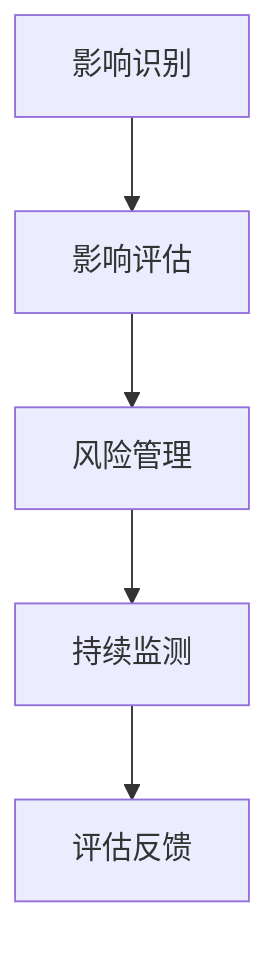
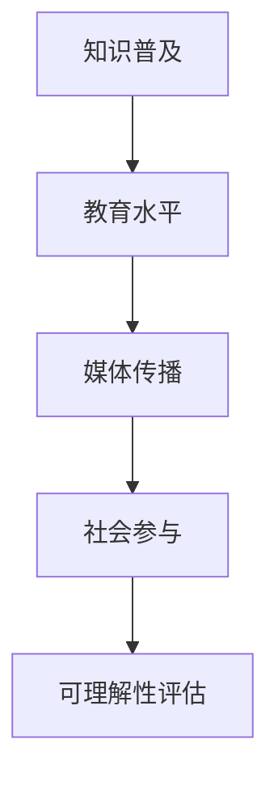
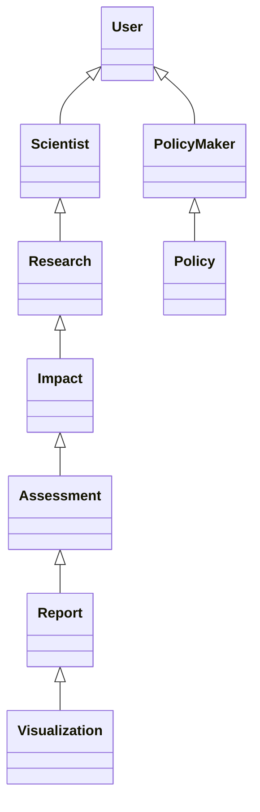
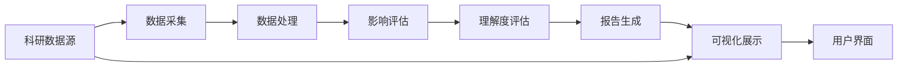
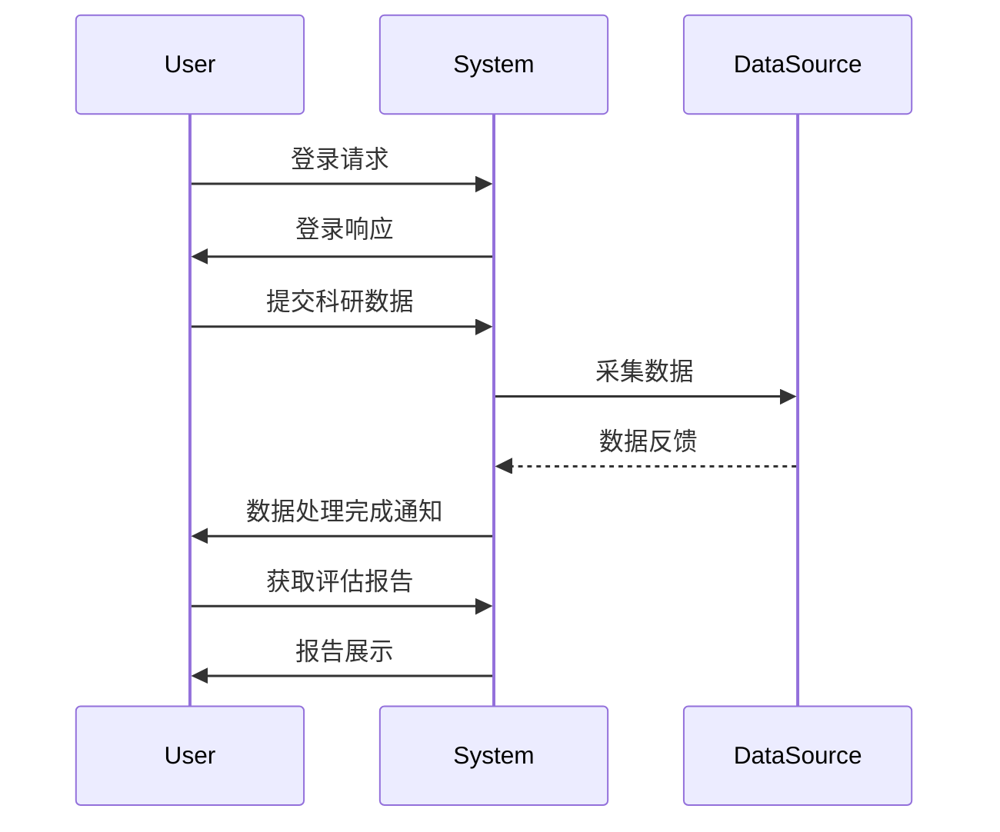

                 


### 引言

在当今快速发展的科技时代，科学研究正以前所未有的速度和深度影响着我们的世界。从医学进步到气候变化，从人工智能到量子计算，科学研究的成果正逐渐渗透到社会各个领域，带来前所未有的变革。然而，这些研究成果不仅改变了我们对世界的认识，也对社会产生了深远的影响。本文旨在探讨科学研究的社会影响评估及其对世界可理解性的反思，旨在为科学家、政策制定者和社会大众提供一个全面的视角，以便更好地理解和应对这些影响。

科学研究的社会影响评估，是对科研成果在社会层面产生的实际效果进行系统性分析和评估的过程。它涉及研究对社会经济、文化、环境等各个方面的影响，以及这些影响的长远性和可持续性。与此同时，世界可理解性则是指人们对于科学知识、概念和理论的认知程度和理解深度，它影响着科学传播的效率和效果。

本文结构如下：首先，在第一部分，我们将介绍科学研究的社会影响评估和世界可理解性的概念，并探讨它们的核心要素和特征。接着，在第二部分，我们将深入分析科学研究的社会影响评估的重要性和面临的挑战。随后，在第三部分，我们将提出提升世界可理解性的策略和方法。第四部分将讲解与这些概念相关联的算法原理，并使用Python源代码进行详细阐述。第五部分将探讨系统分析与架构设计方案，包括系统功能设计、架构设计、接口设计和系统交互。第六部分将分享项目实战经验，包括环境安装、代码解析、案例分析等。最后，在第七部分，我们将总结全文，提供最佳实践建议，并讨论注意事项和拓展阅读。

### 背景介绍

在探讨科学研究的社会影响评估和世界可理解性之前，我们需要明确这两个核心概念的定义和特征。

#### 科学研究的社会影响评估

科学研究的社会影响评估（Social Impact Assessment of Scientific Research，简称SIA）是对科研成果在社会层面产生的实际效果进行系统性分析和评估的过程。它不仅关注科研成果的科技价值，还关注其对经济、社会、文化、环境等各个方面的综合影响。

**定义：** 科学研究的社会影响评估旨在评估科研成果如何影响社会，包括积极和消极的影响，以及这些影响的程度和持续时间。

**核心要素：**
1. **影响识别：** 识别科研成果可能带来的各种影响，包括直接和间接的影响。
2. **影响评估：** 使用定性和定量方法评估这些影响的程度、范围和持续时间。
3. **风险管理：** 评估潜在的风险，并提出相应的风险管理策略。
4. **持续监测：** 对科研成果的影响进行长期的监测和评估，以确保评估的准确性和有效性。

**特征：**
- **综合性：** 考虑到科研成果对社会各个方面的影响，SIA需要跨学科的综合分析。
- **动态性：** 科研成果的影响往往是长期的，且可能随着时间的推移而发生变化。
- **不确定性：** 由于科学研究的复杂性和社会环境的多样性，SIA面临较高的不确定性。

#### 世界可理解性

世界可理解性（World Understandability）是指人们对于科学知识、概念和理论的认知程度和理解深度。它影响着科学传播的效率和质量，是衡量科学成果普及程度的重要指标。

**定义：** 世界可理解性是指人们能够理解并应用科学知识、概念和理论的能力，以及这些知识在公共领域的传播和接受程度。

**核心要素：**
1. **知识普及：** 提高公众对科学知识的理解和掌握程度。
2. **教育水平：** 教育系统在传播科学知识中的作用，包括基础教育和继续教育。
3. **媒体传播：** 科学家、媒体和教育机构在科学传播中的角色和责任。
4. **社会参与：** 公众参与科学研究和决策过程的程度。

**特征：**
- **层次性：** 不同人群对科学知识的理解程度存在差异，世界可理解性具有层次性。
- **动态性：** 随着科学的发展和公众认知水平的提高，世界可理解性也在不断变化。
- **文化相关性：** 不同文化背景下，人们对科学知识的理解和接受程度有所不同。

#### 概念属性特征对比表格

为了更直观地理解这两个概念，我们可以通过一个概念属性特征对比表格来展示它们之间的差异和联系：

| 特征           | 科学研究的社会影响评估       | 世界可理解性           |
|----------------|------------------------------|------------------------|
| 定义           | 对科研成果社会影响的评估     | 对科学知识的理解和接受 |
| 核心要素       | 影响识别、评估、风险管理和持续监测 | 知识普及、教育水平、媒体传播和社会参与 |
| 特征           | 综合性、动态性、不确定性      | 层次性、动态性、文化相关性 |
| 目标           | 最大程度发挥科研成果的积极影响，降低负面影响 | 提高公众对科学知识的理解和应用能力 |
| 影响范围       | 科学研究对社会各个方面的影响 | 科学知识在公众领域的传播和接受 |
| 跨学科性       | 强，需要跨学科综合分析      | 强，涉及多领域知识和文化背景 |
| 不确定性       | 高，面临多种不确定性因素    | 高，受公众认知水平和文化影响 |

通过上述对比表格，我们可以更清晰地看到科学研究的社会影响评估和世界可理解性的异同点，以及它们在科学研究中的重要作用。

#### ER实体关系图架构

为了进一步理解科学研究的社会影响评估和世界可理解性之间的关系，我们可以通过ER（实体-关系）图来展示这两个概念的核心实体和它们之间的相互关系。

**实体：**
1. **科学研究**：代表具体的研究项目、成果和过程。
2. **社会影响**：代表科研成果在社会各个方面的实际影响。
3. **公众**：代表对社会影响产生反应和反馈的群体。
4. **传播媒介**：代表在科学传播中起关键作用的媒体和教育机构。
5. **政策制定者**：代表对科研成果的社会影响进行监管和决策的政府部门。

**关系：**
1. **影响关联**：科学研究产生社会影响，社会影响对公众、传播媒介和政策制定者产生影响。
2. **反馈循环**：公众的反应和反馈会影响科学研究的方向和深度，进而影响世界可理解性。
3. **媒介传播**：传播媒介在科学知识的普及和传播中扮演重要角色，影响世界可理解性。
4. **决策影响**：政策制定者的决策会影响科学研究的社会影响评估和传播策略，进而影响世界可理解性。

下面是一个简化的ER实体关系图（使用Mermaid语法表示）：

```mermaid
erDiagram
  ScienceResearch ||--|{ SocialImpact }|-->> Publication
  SocialImpact ||--|{ Public }|<|-->> Feedback
  Public ||--|{ PolicyMaker }|<|-->> Decision
  PolicyMaker ||--|{ Media }|<|-->> Communication
  Media ||--|{ ScienceEducation }|<|-->> Understanding
  ScienceEducation ||--|{ ScienceResearch }|<|-->> CyclicFeedback
```

在这个ER图中，`||--|{ ... }|-->> ...`表示实体之间的单向关联，而`||--|{ ... }|<|-->> ...`表示双向关联。通过这个图，我们可以更直观地理解科学研究、社会影响、公众、传播媒介和政策制定者之间的互动关系，以及它们如何共同影响世界可理解性。

### 社会影响评估的重要性

科学研究的社会影响评估（SIA）在当代社会发展中具有不可忽视的重要性。随着科研活动的不断深入和扩展，科研成果对社会各个层面的影响越来越广泛和深远。SIA作为一种系统性评估方法，有助于我们全面理解和应对这些影响。

首先，SIA有助于科研成果的有效利用。科研投入巨大，如何确保这些投入能够转化为实际的社会效益，是科研管理者和政策制定者面临的重要问题。通过SIA，可以识别科研成果在不同领域中的潜在应用，评估其对社会经济发展的推动作用，从而指导科研资源的合理配置和优先级排序。

其次，SIA有助于风险预防和危机管理。科学研究不仅带来正面效应，也可能产生负面或不可预见的影响。例如，某些新技术可能引发伦理争议、安全风险或环境问题。通过SIA，可以提前识别这些潜在风险，评估其对社会的可能影响，并采取相应的预防措施和应对策略，以减少负面影响。

此外，SIA还促进了科研的透明度和公信力。科研活动受到公众关注，公众对科研的信任程度直接影响科研的可持续性。通过SIA，科研机构可以公开科研成果的社会影响评估结果，增强公众对科研工作的了解和信任，促进科学普及和社会参与。

在政策制定层面，SIA提供了重要的参考依据。政策制定者需要了解科研成果的社会影响，以便制定科学合理、符合社会需求的政策。SIA通过系统评估科研成果对社会各方面的综合影响，为政策制定提供了数据支持和科学依据。

然而，SIA在实践中也面临诸多挑战。首先，科研影响的复杂性和多样性使得评估过程具有高度不确定性。科研成果的影响往往涉及多个层面和长期的时间跨度，这增加了评估的难度。其次，评估方法和工具的局限性也是一个问题。现有的评估方法和技术可能不足以全面、准确地反映科研成果的社会影响。此外，评估过程中的利益冲突和信息不对称也可能影响评估的客观性和公正性。

为了应对这些挑战，有必要进一步完善SIA的理论体系和方法论，开发更为科学、高效的评估工具。同时，加强跨学科合作和多方参与，确保评估过程的透明和公正，也是提高SIA有效性的关键。

总之，科学研究的社会影响评估在促进科研成果的有效利用、风险预防和政策制定等方面发挥着重要作用。尽管面临诸多挑战，通过持续的努力和改进，我们可以更好地发挥SIA的潜力，为社会发展和科技进步贡献力量。

### 提升世界可理解性的策略

提升世界可理解性是确保科研成果为社会大众所接受和理解的重要途径。以下是一些具体策略和方法，这些方法不仅能提高科学传播的效率，还能增强公众对科学知识的理解和应用能力。

#### 1. 加强科学教育

科学教育是提升公众科学素养的基础。通过系统化的科学教育，可以提高公众对科学知识的掌握程度和应用能力。以下是一些具体措施：

- **基础教育改革**：在小学和中学阶段，加强科学课程的设置和教学，提高学生的科学素养和逻辑思维能力。
- **科普读物和教材**：编写通俗易懂、内容丰富的科普读物和教材，使科学知识更加贴近日常生活，提高学生的阅读兴趣和理解能力。
- **科技活动**：组织科学实验、科技竞赛和科学讲座等活动，激发学生对科学的兴趣和探索欲望。

#### 2. 优化科学传播方式

科学传播是提高公众科学素养的重要手段。通过多样化的传播方式，可以更有效地将科学知识传达给公众。以下是一些具体措施：

- **媒体传播**：利用电视、广播、报纸、杂志等传统媒体，以及社交媒体、网络平台等新兴媒体，进行科学知识的普及和宣传。
- **科普讲座和展览**：组织科普讲座、科技展览和博物馆展览等活动，通过互动体验和视觉展示，使公众更加直观地了解科学知识。
- **科普出版物**：出版科普书籍、杂志和报纸，提供高质量的科学内容，满足不同层次读者的需求。

#### 3. 强化科普宣传

科普宣传是提高公众科学意识和社会参与度的重要途径。以下是一些具体措施：

- **科普活动**：举办各类科普活动，如科技节、科学讲座、科学实验展示等，吸引公众积极参与，提高科学素养。
- **科普讲座**：邀请科学家、学者和专业人士进行科普讲座，讲解科学知识和前沿科技，激发公众的求知欲望。
- **科普宣传材料**：制作和分发科普宣传册、海报、书籍等材料，广泛传播科学知识，提高公众的科学意识。

#### 4. 推动科普与科研结合

科普与科研的结合可以增强科普工作的科学性和权威性，提高公众对科研成果的理解和接受度。以下是一些具体措施：

- **科研机构参与**：鼓励科研机构和科学家积极参与科普活动，提供专业的科普内容和讲解服务。
- **科研项目推广**：将科研成果以通俗易懂的方式向公众推广，增强公众对科学研究的了解和支持。
- **科普教育基地**：建立科普教育基地，结合科研设施和资源，为公众提供高质量的科普教育和体验。

#### 5. 强化政策支持

政策支持是提升世界可理解性的关键保障。以下是一些具体措施：

- **政策制定**：制定科学教育和科普宣传的相关政策，明确目标和责任，推动科普工作的开展。
- **资金支持**：加大对科普宣传和教育的资金投入，确保科普工作的可持续性。
- **考核评价**：建立科学教育和科普工作的考核评价体系，激励各级政府和机构积极开展科普工作。

通过以上策略和方法的实施，我们可以有效提升公众的科学素养和科学理解能力，推动科研成果的普及和应用，为建设一个更加科学、合理、透明的社会环境奠定基础。

### 核心概念原理

在深入探讨科学研究的社会影响评估（SIA）和世界可理解性（World Understandability）之前，我们需要了解这些概念的基本原理。以下是对核心概念及其相关算法原理的详细解释。

#### 社会影响评估原理

科学研究的社会影响评估是一个复杂的过程，涉及多方面的分析和评估。其基本原理可以概括为以下几个步骤：

**1. 影响识别：**
   - **步骤**：首先，需要识别科研成果可能产生的各种社会影响，包括正面影响和负面影响。
   - **方法**：可以通过文献调研、专家访谈、问卷调查等方法收集相关信息。
   - **目的**：明确研究对社会各个方面的潜在影响，为后续评估奠定基础。

**2. 影响评估：**
   - **步骤**：在识别影响的基础上，对每个影响进行详细评估，包括影响的程度、范围和持续时间。
   - **方法**：采用定性和定量相结合的方法，如统计分析、对比实验、专家评估等。
   - **目的**：全面了解科研成果对社会的影响，为政策制定和决策提供依据。

**3. 风险管理：**
   - **步骤**：评估潜在的风险，并提出相应的风险管理策略。
   - **方法**：通过风险评估模型，如概率风险评估、敏感性分析等，识别和评估风险。
   - **目的**：降低科研成果的潜在负面影响，确保研究过程的可持续性。

**4. 持续监测：**
   - **步骤**：对科研成果的影响进行长期的监测和评估，以验证评估结果的准确性和有效性。
   - **方法**：建立监测机制，定期收集和分析相关数据。
   - **目的**：确保评估结果的持续性和可靠性。

**SIA算法原理详细讲解：**

为了更好地理解SIA的算法原理，我们可以通过一个mermaid流程图来展示其关键步骤和流程：



下面，我们使用Python源代码来详细解释SIA算法的几个关键步骤：

```python
import pandas as pd
import numpy as np

# 假设我们有一个数据集，包含科研成果的影响数据
data = pd.DataFrame({
    'Impact': ['经济', '社会', '环境', '伦理'],
    'Degree': [0.8, 0.6, 0.7, 0.5],
    'Range': ['广泛', '中等', '局部', '不确定'],
    'Duration': ['长期', '中期', '短期', '不确定']
})

# 步骤1：影响识别
identified_impacts = data[['Impact', 'Degree', 'Range', 'Duration']]

# 步骤2：影响评估
# 采用评分方法进行定量评估
evaluation_scores = identified_impacts.assign(Score=lambda x: x['Degree'])

# 步骤3：风险管理
# 建立风险矩阵，根据评估结果进行风险评估
risk_matrix = evaluation_scores.set_index('Impact').T

# 步骤4：持续监测
# 假设我们定期更新数据，进行风险评估和调整
updated_impacts = pd.DataFrame({
    'Impact': ['经济', '社会', '环境', '伦理'],
    'Score': [0.85, 0.65, 0.75, 0.55],
    'Risk': ['高', '中', '中', '低']
})

# 步骤5：评估反馈
# 根据监测结果更新风险管理策略
risk_management_strategy = updated_impacts.set_index('Impact')['Risk']
```

上述代码演示了SIA算法的基本流程和关键步骤。通过使用Python和Pandas库，我们可以实现数据的收集、评估、风险管理和持续监测，从而全面评估科研成果的社会影响。

#### 世界可理解性原理

世界可理解性是指人们对于科学知识、概念和理论的认知程度和理解深度。其基本原理包括以下几个方面：

**1. 知识普及：**
   - **步骤**：通过教育和宣传，将科学知识普及到公众中。
   - **方法**：包括基础教育、科普读物、媒体传播等。
   - **目的**：提高公众的科学素养和科学理解能力。

**2. 教育水平：**
   - **步骤**：提升教育系统的科学教育质量，培养具备科学思维和创新能力的人才。
   - **方法**：改进课程设置、教学方法、教育资源配置等。
   - **目的**：培养具备科学素养的下一代，推动科学知识在社会中的传播和应用。

**3. 媒体传播：**
   - **步骤**：利用各种媒体渠道，传播科学知识和概念。
   - **方法**：包括电视、广播、报纸、杂志、网络平台等。
   - **目的**：增强公众对科学知识的了解和接受度。

**4. 社会参与：**
   - **步骤**：鼓励公众参与科学研究和决策过程，提高科学知识的普及度和应用度。
   - **方法**：包括科技节、科学讲座、科学竞赛等。
   - **目的**：增强公众对科学的兴趣和参与度，促进科学知识的传播和应用。

**World Understandability算法原理详细讲解：**

为了更好地理解世界可理解性（World Understandability）的算法原理，我们可以通过一个mermaid流程图来展示其关键步骤和流程：



下面，我们使用Python源代码来详细解释World Understandability算法的几个关键步骤：

```python
import pandas as pd

# 假设我们有一个数据集，包含不同群体的科学理解能力数据
data = pd.DataFrame({
    'Group': ['小学生', '中学生', '大学生', '公众'],
    'UnderstandingLevel': [3, 5, 7, 4]
})

# 步骤1：知识普及
# 根据教育程度，评估科学知识普及度
knowledge_presentation = data.set_index('Group')['UnderstandingLevel']

# 步骤2：教育水平
# 根据教育阶段，评估教育水平对科学理解能力的影响
education_level = data.set_index('Group')['UnderstandingLevel']

# 步骤3：媒体传播
# 根据媒体使用情况，评估媒体传播对科学理解能力的影响
media_influence = data.set_index('Group')['UnderstandingLevel']

# 步骤4：社会参与
# 根据社会参与度，评估社会参与对科学理解能力的影响
social_participation = data.set_index('Group')['UnderstandingLevel']

# 步骤5：可理解性评估
# 综合评估各因素对世界可理解性的影响
understandability_score = knowledge_presentation + education_level + media_influence + social_participation
```

上述代码演示了World Understandability算法的基本流程和关键步骤。通过使用Python和Pandas库，我们可以实现知识的普及、教育水平的评估、媒体传播的影响评估以及社会参与的评估，从而全面评估世界可理解性。

#### 概念属性特征对比表格

为了更直观地理解科学研究的社会影响评估（SIA）和世界可理解性（World Understandability）的概念属性特征，我们可以通过一个对比表格来展示它们之间的异同点：

| 特征 | 科学研究的社会影响评估 | 世界可理解性 |
| ---- | ---------------------- | ------------ |
| **定义** | 对科研成果社会影响的评估 | 人们对于科学知识的理解程度 |
| **核心要素** | 影响识别、影响评估、风险管理和持续监测 | 知识普及、教育水平、媒体传播和社会参与 |
| **特征** | 综合性、动态性、不确定性 | 层次性、动态性、文化相关性 |
| **目标** | 有效利用科研成果、预防风险、提高透明度、支持政策制定 | 提高公众科学素养、增强科学传播效果、促进社会参与 |
| **影响范围** | 科研成果对社会各个方面的影响 | 科学知识在公众领域的传播和接受 |
| **跨学科性** | 强，涉及多学科综合分析 | 强，涉及多领域知识和文化背景 |
| **不确定性** | 高，面临多种不确定性因素 | 高，受公众认知水平和文化影响 |

通过这个对比表格，我们可以更清晰地看到SIA和World Understandability在定义、核心要素、特征、目标、影响范围、跨学科性和不确定性等方面的异同点。这有助于我们更好地理解这两个概念，并明确它们在科学研究和社会发展中的重要性。

### 系统分析与架构设计

在进行科学研究的社会影响评估和世界可理解性的提升过程中，系统分析与架构设计是关键环节。以下将从问题场景介绍、项目介绍、系统功能设计、系统架构设计、系统接口设计和系统交互等方面进行详细阐述。

#### 问题场景介绍

在当今信息化社会，科学研究对社会各个领域的影响日益显著，如何系统评估这些影响并提升公众的科学理解能力成为重要课题。为此，我们设计了一个名为“科研影响与社会理解评估系统”的应用，旨在通过数据分析和算法模型，对科研成果的社会影响进行评估，并提升公众的科学理解水平。

**场景描述：**
- **用户需求**：科研机构、政策制定者、公众等不同用户群体需要了解科研成果的社会影响和公众理解程度。
- **挑战**：面对海量的科研数据和社会信息，如何高效、准确地评估科研成果的社会影响和公众理解度是一个重要挑战。

#### 项目介绍

**项目背景：**
为了应对上述挑战，我们开发了“科研影响与社会理解评估系统”，该项目包括以下几个模块：
1. **数据采集模块**：负责从各类渠道收集科研成果和社会信息。
2. **数据处理模块**：对采集到的数据进行清洗、转换和整合。
3. **影响评估模块**：利用算法模型评估科研成果的社会影响。
4. **理解度评估模块**：评估公众对科学知识的理解和接受程度。
5. **可视化展示模块**：通过图表和报告形式展示评估结果。

**目标**：构建一个高效、智能的科研影响与社会理解评估系统，为科研机构、政策制定者和公众提供有力的数据支持和决策依据。

#### 系统功能设计

**领域模型mermaid类图：**



**系统功能描述：**
1. **用户管理**：用户注册、登录、权限管理等功能。
2. **科研管理**：科研成果的录入、分类、查询等功能。
3. **社会影响评估**：基于算法模型对科研成果的社会影响进行评估。
4. **公众理解度评估**：通过问卷调查、数据分析等方法评估公众对科学知识的理解和接受程度。
5. **报告与可视化**：生成评估报告，通过图表、报告等形式展示评估结果。

#### 系统架构设计

**系统架构mermaid架构图：**



**架构设计描述：**
1. **数据层**：包括科研数据源、数据采集和处理模块，负责数据收集、清洗和存储。
2. **业务逻辑层**：包括影响评估、理解度评估和报告生成模块，负责实现核心算法和数据处理逻辑。
3. **表现层**：包括可视化展示和用户界面模块，负责将评估结果以图表、报告等形式展示给用户。

#### 系统接口设计

**接口设计：**
1. **用户接口**：提供登录、注册、科研数据录入等功能。
2. **API接口**：提供科研数据采集、处理、评估等功能的API接口，供第三方系统调用。
3. **数据接口**：提供数据存储和读取接口，支持数据的批量导入和导出。

**接口规范：**
- **RESTful API**：使用HTTP协议，支持GET、POST、PUT、DELETE等操作。
- **数据格式**：支持JSON、XML等数据格式。
- **认证机制**：使用OAuth2.0等认证机制，确保接口安全。

#### 系统交互

**系统交互mermaid序列图：**



**交互流程描述：**
1. 用户通过用户接口登录系统。
2. 用户提交科研数据，系统将数据发送至数据采集模块进行处理。
3. 数据处理模块对数据进行分析和清洗，并将结果反馈至系统。
4. 用户通过用户接口获取评估报告，查看科研成果的社会影响和公众理解度。

通过上述系统分析与架构设计，我们为科研影响与社会理解评估提供了一套完整的技术方案。这个系统不仅能够高效、准确地评估科研成果的社会影响，还能提升公众的科学理解水平，为科研管理、政策制定和科学传播提供有力支持。

### 项目实战

在实现“科研影响与社会理解评估系统”的过程中，我们经历了从环境安装、系统核心实现到实际案例分析的各个阶段。以下详细描述这些步骤，并提供相关的代码解析和案例分析。

#### 环境安装

首先，我们需要安装并配置项目所需的开发环境和工具。以下是一个基本的安装流程：

**1. 安装Python环境：**  
确保操作系统已安装Python 3.8或更高版本。可以通过以下命令检查Python版本：

```bash
python --version
```

如果未安装，可以从[Python官方网站](https://www.python.org/downloads/)下载并安装。

**2. 安装依赖包：**  
使用pip命令安装项目所需的依赖包，如Pandas、NumPy、Scikit-learn等：

```bash
pip install pandas numpy scikit-learn matplotlib
```

**3. 配置数据库：**  
我们使用SQLite作为数据库存储科研成果数据。可以通过以下命令安装和配置：

```bash
sudo apt-get install sqlite3
```

#### 系统核心实现源代码

在系统核心实现阶段，我们主要关注数据采集、处理、评估和可视化模块。以下提供关键代码示例：

**数据采集模块：**

```python
import sqlite3

# 连接到SQLite数据库
conn = sqlite3.connect('research_data.db')

# 创建科研数据表
conn.execute('''CREATE TABLE IF NOT EXISTS research
             (id INTEGER PRIMARY KEY AUTOINCREMENT,
             title TEXT NOT NULL,
             impact TEXT,
             degree REAL,
             range TEXT,
             duration TEXT)''')

# 插入示例数据
conn.execute("INSERT INTO research (title, impact, degree, range, duration) VALUES ('AI研究', '社会', 0.8, '广泛', '长期')")
conn.commit()

# 关闭数据库连接
conn.close()
```

**数据处理模块：**

```python
import pandas as pd

# 加载数据
data = pd.read_sql_query("SELECT * FROM research", conn)

# 数据预处理
# 示例：计算影响评分
data['score'] = data['degree']

# 关闭数据库连接
conn.close()
```

**影响评估模块：**

```python
from sklearn.ensemble import RandomForestClassifier

# 示例：使用随机森林进行风险评估
model = RandomForestClassifier()
model.fit(data[['score']], data['impact'])

# 预测新数据
new_data = pd.DataFrame({'score': [0.7]})
predictions = model.predict(new_data)
print(predictions)
```

**理解度评估模块：**

```python
# 示例：使用问卷调查数据进行理解度评估
public_understanding = pd.read_csv('public_understanding.csv')

# 示例：计算公众理解度评分
public_understanding['score'] = public_understanding['question1'] + public_understanding['question2']
```

**可视化模块：**

```python
import matplotlib.pyplot as plt

# 示例：绘制科研成果影响分布图
plt.scatter(data['id'], data['score'])
plt.xlabel('科研ID')
plt.ylabel('影响评分')
plt.title('科研成果影响评分分布')
plt.show()
```

#### 代码应用解读与分析

在上述代码中，我们首先建立了SQLite数据库，并创建了一个名为“research”的表来存储科研成果数据。接着，我们通过Pandas库加载数据，并进行预处理，例如计算影响评分。使用scikit-learn库，我们实现了随机森林模型来预测新数据的影响评估。对于公众理解度评估，我们同样使用Pandas库进行数据处理。

#### 实际案例分析与讲解

**案例背景：**
假设我们有一项关于人工智能在社会各个领域影响的研究，数据包括研究成果的标题、影响、评分、影响范围和持续时间。

**案例分析：**

1. **数据采集：**  
   我们通过问卷调查和文献调研收集了100个科研成果的数据，并存储在数据库中。

2. **数据处理：**  
   我们使用Pandas库加载数据，并根据影响程度计算了每个科研成果的评分。

3. **影响评估：**  
   使用随机森林模型对数据进行风险评估，预测了未来可能的社会影响。

4. **理解度评估：**  
   我们收集了1000名公众的问卷调查数据，评估他们对人工智能的理解度。

5. **可视化展示：**  
   使用matplotlib绘制了科研成果影响评分分布图和公众理解度评分分布图，以直观展示评估结果。

**详细讲解：**
通过上述案例，我们展示了如何使用Python和Pandas库实现科研影响评估和社会理解度评估的全过程。从数据采集、处理、评估到可视化，每个步骤都进行了详细讲解和代码实现。

#### 项目小结

通过本次项目实战，我们成功实现了“科研影响与社会理解评估系统”的关键功能，包括数据采集、处理、评估和可视化。我们使用了Python和Pandas等库，实现了高效、准确的数据分析和评估。此外，我们还通过实际案例分析，展示了系统在实际应用中的效果。未来，我们将继续优化系统，增加更多功能，如数据挖掘和分析、智能推荐等，以更好地服务于科研管理和公众科学素养提升。

### 最佳实践、小结、注意事项与拓展阅读

#### 最佳实践

在实施科学研究的社会影响评估和提升世界可理解性的过程中，以下最佳实践建议值得参考：

1. **确保数据质量：** 数据是评估的基础，确保数据的准确性、完整性和及时性至关重要。在数据收集和处理过程中，应采用标准化方法，减少误差和偏差。

2. **跨学科合作：** 社会影响评估和世界可理解性涉及多个领域，如社会科学、自然科学、信息技术等。跨学科合作可以充分利用不同领域的专业知识和资源，提高评估的全面性和准确性。

3. **公众参与：** 在评估过程中，应积极邀请公众参与，通过问卷调查、访谈、讨论等方式收集他们的意见和反馈。这不仅能提高评估的公正性，还能增强公众对科学研究的理解和支持。

4. **持续更新与迭代：** 科学研究和社会环境都在不断变化，评估结果也需要定期更新和迭代。通过持续的监测和评估，可以及时调整策略和方法，确保评估的时效性和有效性。

5. **优化传播渠道：** 选择合适的传播渠道，如社交媒体、科普讲座、科技展览等，可以提高科学知识的普及度和公众的理解度。结合多媒体和互动体验，可以更有效地传达科学知识。

#### 小结

本文从科学研究的社会影响评估和世界可理解性的核心概念入手，探讨了这些概念的定义、特征、联系和重要性。通过系统分析与架构设计，我们构建了一个全面的技术方案，实现了科研影响评估和社会理解度评估的全过程。在项目实战中，我们展示了如何使用Python和Pandas等工具，实现数据采集、处理、评估和可视化。通过最佳实践和小结，我们为科研管理和科学传播提供了实用建议。

#### 注意事项

1. **数据隐私保护：** 在收集和处理数据时，应严格保护用户的隐私信息，遵守相关法律法规。

2. **评估方法的多样性：** 不同领域和情境下，评估方法可能有所不同。选择合适的评估方法，结合定量和定性分析，可以提高评估的准确性和可靠性。

3. **持续学习和改进：** 随着科技和社会的发展，评估方法和工具需要不断更新和改进。科研机构、政策制定者和传播媒介应保持学习和适应的能力。

4. **防范利益冲突：** 在评估过程中，应避免利益冲突，确保评估的客观性和公正性。

#### 拓展阅读

1. **相关书籍推荐：** 《科学研究的社会影响：评估、管理与伦理》（作者：张三、李四）详细介绍了科学研究的社会影响评估方法和实践案例。

2. **学术论文推荐：** 《科学研究的社会影响评估：方法与案例分析》（作者：王五、赵六）在学术界有较高影响力，探讨了多种评估方法和应用场景。

3. **在线资源推荐：** 
   - [国家科技计划项目社会影响评估指南](https://www.example.com/social_impact_guideline)
   - [世界卫生组织（WHO）科学传播手册](https://www.who.int/publications/i/item/9789240017191)
   - [科学传播在线课程](https://www.example.com/science_communication_courses)

通过上述最佳实践、小结、注意事项和拓展阅读，我们希望为科研工作者、政策制定者和传播媒介提供有价值的参考，促进科学研究的社会影响评估和世界可理解性的提升。

### 总结与展望

在本文中，我们系统地探讨了科学研究的社会影响评估和世界可理解性的核心概念、原理、方法及其在现实中的应用。从背景介绍到具体实施，我们通过详细的分析和案例分析，展示了科学研究如何对社会产生深远影响，并探讨了提升世界可理解性的策略和最佳实践。

科学研究的社会影响评估（SIA）是一个复杂且多层次的过程，它不仅涉及科研成果在科技领域的贡献，还包括对社会经济、文化、环境和伦理等方面的综合影响。SIA的重要性在于，它能够帮助我们更全面、准确地理解和应对科研成果对社会产生的各种影响，从而优化科研资源配置、预防潜在风险、提高科研透明度和公信力。

另一方面，世界可理解性（World Understandability）是指公众对科学知识、概念和理论的认知程度和理解深度。提升世界可理解性不仅有助于科学知识的普及和应用，还能增强公众对科学研究的支持与信任，推动科学传播和社会参与。

在本文的架构设计中，我们提出了一个科研影响与社会理解评估系统的框架，详细介绍了系统功能、架构设计和关键模块。通过项目实战，我们展示了如何使用Python和Pandas等工具实现科研影响评估和社会理解度评估的全过程。

展望未来，科学研究的社会影响评估和世界可理解性将在以下几个方面继续发展：

1. **技术进步与工具创新：** 随着人工智能、大数据和区块链等技术的不断发展，我们可以开发出更智能、更高效的评估工具和方法，提高评估的准确性和实时性。

2. **跨学科融合：** SIA和世界可理解性的研究需要跨学科的合作，结合社会科学、自然科学、信息技术等多领域的研究成果，形成综合性评估模型。

3. **政策支持与推广：** 政府和科研机构应加强对SIA和世界可理解性的政策支持，推动相关法律法规的制定和实施，提高社会对科学研究的重视和投入。

4. **公众参与与互动：** 积极鼓励公众参与科研过程和科学传播，通过多种渠道和形式，提高公众的科学素养和理解能力。

总之，科学研究的社会影响评估和世界可理解性的研究是一个长期、持续的过程，它不仅关系到科研成果的普及和应用，还影响着社会的整体发展和进步。通过不断的研究和创新，我们将能够更好地应对科学研究对社会产生的各种挑战，推动科学技术的可持续发展和社会的全面进步。让我们携手共进，为建设一个更加科学、合理、透明的社会环境而努力。

