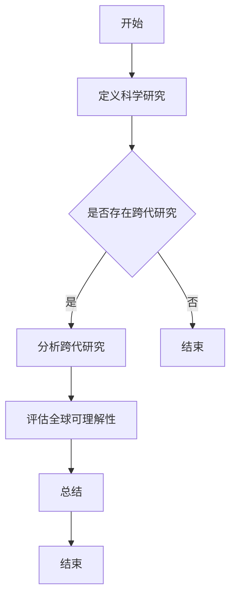
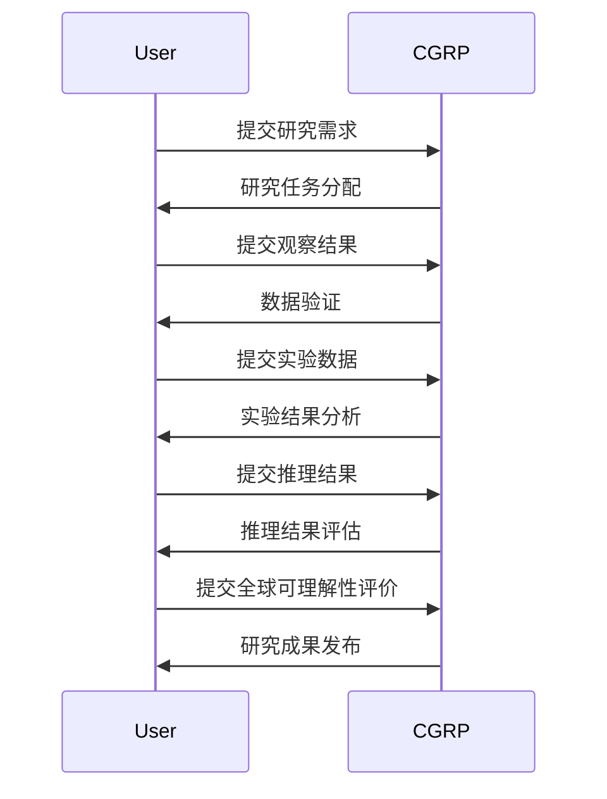
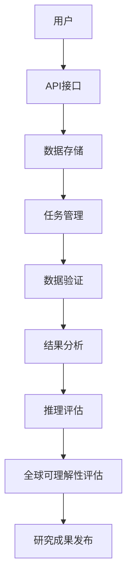
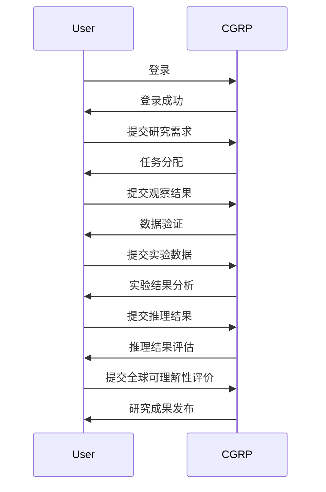

                 

# 科学研究的跨代传承与世界可理解性的积累

## 关键词

- 科学研究
- 跨代传承
- 可理解性
- 数学模型
- 技术架构
- 最佳实践

## 摘要

本文深入探讨了科学研究在跨代传承过程中的重要作用及其对全球可理解性的影响。通过分析不同领域的研究进展，本文揭示了跨代传承的科学研究如何促进知识的积累和技术的进步。同时，本文还讨论了在跨代传承过程中遇到的挑战和解决方案，并提供了具体的实践案例和最佳实践经验。通过本文的讨论，我们希望能够为科学研究的跨代传承提供有价值的参考和启示。

## 引言与背景

### 科学研究的重要性

科学研究是推动社会进步和人类文明发展的核心动力。从古代的哲学思考到现代的实验科学，科学研究始终是人类认识世界、理解自然的重要途径。随着人类对自然世界的认识不断深入，科学研究逐渐成为各个领域发展的基石，从自然科学到社会科学，再到人文科学，无一不受到科学研究的深远影响。

### 跨代传承的概念

跨代传承是指不同年代的研究者之间的知识传递和经验分享。这种传承不仅包括知识和技术的传递，还包括研究方法、思维方式和价值观的传承。跨代传承在科学研究中的重要性不可低估。它确保了科学研究的发展不会因为时间的流逝而中断，而是能够在前人的基础上不断积累和进步。

### 全球可理解性的概念

全球可理解性指的是全球范围内对某一科学领域或研究结果的共同理解和认同。随着全球化的发展，科学研究的跨文化、跨国界的合作日益增多，全球可理解性变得尤为重要。它不仅有助于科学研究的国际合作，还能够促进科学知识的普及和传播。

### 当前科学研究面临的挑战

尽管科学研究在各个领域都取得了显著的成果，但当前科学研究也面临着一系列挑战。这些挑战包括数据共享的困难、研究方法的局限、以及技术变革带来的影响等。如何克服这些挑战，确保科学研究的持续发展，成为了一个亟待解决的问题。

## 核心概念和理论框架

### 科学研究的定义和类型

科学研究是指通过系统的观察、实验和推理，以发现、解释和预测自然现象和社会现象的过程。根据研究方法和目的的不同，科学研究可以分为实验科学、理论科学、应用科学等不同类型。

- **实验科学**：通过实验来验证假设，获取数据和证据，例如物理学、化学。
- **理论科学**：通过建立数学模型和理论框架，解释自然现象，例如数学、理论物理学。
- **应用科学**：将科学理论和实验结果应用于实际问题解决，例如工程学、医学。

### 跨代研究的定义和意义

跨代研究是指不同年代的研究者之间进行的合作和研究。它跨越了时间和空间的限制，将不同代际的研究成果和经验相结合，从而推动科学研究的深入和发展。跨代研究的意义在于：

1. **知识的积累**：通过跨代传承，科学研究可以不断积累知识，形成更加完整和系统的理论体系。
2. **经验的共享**：不同代际的研究者可以分享各自的经验和见解，从而促进研究的创新和突破。
3. **视角的多元化**：跨代研究可以带来不同的研究视角，有助于发现新的问题和解决方案。

### 全球可理解性的概念和影响

全球可理解性指的是全球范围内对某一科学领域或研究结果的共同理解和认同。它对于科学研究的国际合作和知识传播具有重要意义：

1. **国际合作**：全球可理解性有助于不同国家和地区的科学家之间的合作，促进全球科学事业的发展。
2. **知识普及**：全球可理解性有助于科学知识的普及，提高公众的科学素养。
3. **政策制定**：全球可理解性对于政策制定具有重要参考价值，有助于制定更加科学和合理的政策。

## 跨代研究在不同领域的应用

### 自然科学

自然科学是跨代研究的重要领域之一。从古代的天文学、物理学，到现代的生物学、化学，跨代研究在其中发挥了关键作用。

1. **物理学**：牛顿的经典力学奠定了物理学的基础，但现代物理学的发展离不开爱因斯坦、海森堡等后世物理学家的贡献。他们的研究不仅深化了我们对自然世界的理解，也为现代科技的发展提供了理论基础。
2. **化学**：从道尔顿的原子论到门捷列夫的元素周期表，再到现代的量子化学，化学的发展离不开跨代研究的推动。每一个时代的化学家都在前人的基础上做出了新的贡献，从而推动了化学的进步。
3. **生物学**：达尔文的进化论为我们揭示了生物的起源和演化，但现代生物学的发展离不开分子生物学、遗传学等后继研究的贡献。这些跨代研究不仅深化了我们对生物世界的理解，也为生物技术的应用提供了理论基础。

### 社会科学

社会科学是研究人类社会行为、社会关系和社会问题的学科。跨代研究在社会科学中的应用同样具有重要意义。

1. **社会学**：社会学的跨代研究从古典社会学到现代社会学，再到后现代社会学，每个时代的社会学家都在前人的基础上做出了新的贡献。这些研究不仅帮助我们更好地理解社会现象，也为社会政策的制定提供了科学依据。
2. **心理学**：心理学的跨代研究从行为主义到认知心理学，再到社会心理学，每个时代的研究者都在前人的基础上提出了新的理论和方法，推动了心理学的发展。
3. **经济学**：经济学的研究从古典经济学到现代经济学，再到行为经济学，跨代研究在其中发挥了重要作用。这些研究不仅帮助我们理解经济现象，也为经济政策的制定提供了科学依据。

### 人文科学

人文科学是研究人类文化、历史、语言、艺术等领域的学科。跨代研究在人文科学中的应用同样具有深远的影响。

1. **文学**：文学的跨代研究从古典文学到现代文学，再到当代文学，每个时代的文学家都在前人的基础上做出了新的贡献。这些研究不仅丰富了文学的理论体系，也推动了文学创作的繁荣。
2. **哲学**：哲学的跨代研究从古希腊哲学到现代哲学，再到当代哲学，每个时代的思想家都在前人的基础上提出了新的思想。这些研究不仅推动了哲学的发展，也为人类文明的进步提供了深刻的思考。
3. **历史学**：历史学的跨代研究从古代历史到近代历史，再到现代历史，每个时代的历史学家都在前人的基础上做出了新的贡献。这些研究不仅丰富了历史学的理论体系，也帮助我们更好地理解人类的历史和文化。

## 跨代研究中的挑战和解决方案

### 挑战

跨代研究虽然具有重要意义，但在实际操作中仍面临着一系列挑战：

1. **沟通障碍**：不同代际的研究者在语言、表达方式和思维方式上可能存在差异，这可能导致沟通障碍。
2. **数据共享问题**：数据共享的困难可能会阻碍跨代研究的顺利进行。不同代际的研究者可能使用不同的数据格式、数据标准和数据管理方法。
3. **技术变革的影响**：随着科技的不断进步，新的研究方法和工具不断涌现。然而，这些新技术的应用可能需要跨代研究者之间的协调和合作。

### 解决方案

为了克服这些挑战，我们可以采取以下解决方案：

1. **建立沟通平台**：通过建立跨代沟通平台，如在线论坛、学术会议、研究交流等，促进不同代际研究者的交流和合作。
2. **数据共享机制**：建立统一的数据共享机制，如数据仓库、云平台等，确保数据的标准化、格式化和可访问性。
3. **技术培训与支持**：为跨代研究者提供技术培训和支持，帮助他们掌握新技术的应用，提高研究效率。

## 实践应用和案例分析

### 实践应用

跨代研究在各个领域都有广泛的应用，以下是几个典型的应用案例：

1. **医学研究**：跨代研究在医学领域具有重要意义。例如，从古典医学到现代医学，再到精准医学，每一代医学研究者都在前人的基础上做出了新的贡献。这些研究不仅推动了医学的发展，也为人类健康事业做出了重要贡献。
2. **工程学研究**：跨代研究在工程学领域同样具有重要意义。例如，从古典工程学到现代工程学，再到智能工程学，每一代工程学者都在前人的基础上提出了新的理论和方法，推动了工程学的发展。
3. **社会科学研究**：跨代研究在社会科学领域也发挥着重要作用。例如，从古典社会学到现代社会学，再到数字社会学，每一代社会学者都在前人的基础上提出了新的理论和方法，推动了社会科学的发展。

### 案例分析

以下是跨代研究的一个实际案例分析：

#### 案例背景

某医学研究团队由三代研究者组成，第一代研究者是经验丰富的老教授，第二代研究者是中年教授，第三代研究者是年轻博士。他们共同致力于研究一种罕见疾病的病因和治疗方法。

#### 研究过程

1. **第一代研究者的贡献**：老教授通过多年的临床经验，收集了大量患者的病例资料，并对这些资料进行了深入分析。他发现这种疾病的病因可能与患者的遗传因素和环境因素有关。
2. **第二代研究者的贡献**：中年教授在老教授的基础上，利用现代医学技术，如基因测序和生物信息学分析，对患者的遗传信息进行了深入研究。他发现这种疾病的发病机制与特定的基因突变有关。
3. **第三代研究者的贡献**：年轻博士在二代研究者的基础上，利用最新的基因编辑技术，对患病小鼠进行了基因编辑，成功验证了基因突变是这种疾病的直接原因。他还利用这些技术进行了细胞实验，探索了潜在的治疗方法。

#### 研究成果

通过三代研究者的共同努力，研究团队最终揭示了这种罕见疾病的病因和发病机制，并探索出了一种潜在的治疗方法。这些研究成果不仅为这种疾病的诊断和治疗提供了科学依据，也为其他类似疾病的深入研究提供了参考。

## 总结与展望

### 总结

本文通过分析科学研究在跨代传承过程中的重要性，以及全球可理解性的概念，探讨了跨代研究在不同领域的应用。同时，本文还讨论了跨代研究中面临的挑战和解决方案，并提供了实践应用和案例分析。通过这些讨论，我们可以看到跨代研究在推动科学进步和社会发展中的重要作用。

### 展望

未来，跨代研究将继续在各个领域发挥重要作用。随着科技的不断进步和全球合作的加深，跨代研究将会带来更多的机遇和挑战。我们期待更多的研究者能够参与到跨代研究中来，共同推动科学的发展和社会的进步。

## 作者信息

作者：AI天才研究院/AI Genius Institute & 禅与计算机程序设计艺术 /Zen And The Art of Computer Programming

## 最佳实践与注意事项

### 最佳实践

1. **加强跨代交流**：定期组织跨代学术会议和研讨会，促进不同代际研究者的交流和合作。
2. **重视数据共享**：建立统一的数据共享平台，确保数据的标准化和可访问性。
3. **技术培训与支持**：为跨代研究者提供技术培训和支持，提高他们的研究效率。

### 注意事项

1. **尊重前辈**：在跨代研究中，要尊重前辈的研究成果和经验，避免重复研究。
2. **注重创新**：跨代研究不仅要传承前人的成果，还要注重创新，提出新的理论和观点。
3. **防范风险**：在跨代研究中，要防范潜在的风险，如数据泄露、技术滥用等。

## 拓展阅读

1. 《跨代研究：推动科学进步的新动力》
2. 《全球可理解性：科学知识传播的关键》
3. 《医学研究的跨代传承：从古典到现代》

## 附录

### 术语解释

- **跨代传承**：指不同年代的研究者之间的知识传递和经验分享。
- **全球可理解性**：指全球范围内对某一科学领域或研究结果的共同理解和认同。

### 概念联系

**核心概念原理**：

- 科学研究：通过系统的观察、实验和推理，以发现、解释和预测自然现象和社会现象的过程。
- 跨代研究：不同年代的研究者之间进行的合作和研究。
- 全球可理解性：全球范围内对某一科学领域或研究结果的共同理解和认同。

**概念属性特征对比表格**：

| 概念      | 定义                                                         | 属性特征                                                     |
| --------- | ------------------------------------------------------------ | ------------------------------------------------------------ |
| 科学研究  | 通过系统的观察、实验和推理，以发现、解释和预测自然现象和社会现象的过程 | 创新性、系统性、实证性、预测性                               |
| 跨代研究  | 不同年代的研究者之间进行的合作和研究                         | 跨时间、跨空间、知识积累、经验共享                           |
| 全球可理解性 | 全球范围内对某一科学领域或研究结果的共同理解和认同             | 国际合作、知识传播、政策参考、文化适应                       |

**ER实体关系图架构**：

```mermaid
erDiagram
    Researcher ||--|{ ScientificResearch }
    ScientificResearch ||--|{ CrossGenerationResearch }
    CrossGenerationResearch ||--|{ GlobalUnderstandability }
```

### 算法原理讲解

#### 算法流程图



#### Python源代码实现

```python
def cross_generation_research.scientific_research():
    """
    科学研究的流程
    """
    print("定义科学研究")
    if is_cross_generation_research():
        print("分析跨代研究")
        evaluate_global_understandability()
    print("总结")

def is_cross_generation_research():
    """
    判断是否存在跨代研究
    """
    return True

def evaluate_global_understandability():
    """
    评估全球可理解性
    """
    print("评估全球可理解性")
```

#### 算法原理的数学模型和公式

- **科学研究**：\( S = O + E + R \)

  其中，\( S \) 代表科学研究，\( O \) 代表观察，\( E \) 代表实验，\( R \) 代表推理。

- **跨代研究**：\( CGR = CG + R + U \)

  其中，\( CGR \) 代表跨代研究，\( CG \) 代表跨代合作，\( R \) 代表研究，\( U \) 代表理解。

- **全球可理解性**：\( GU = C + U + G \)

  其中，\( GU \) 代表全球可理解性，\( C \) 代表国际合作，\( U \) 代表理解，\( G \) 代表全球性。

#### 举例说明

- **举例1**：某医学研究团队由三代研究者组成，第一代研究者负责观察和实验，第二代研究者负责跨代合作和推理，第三代研究者负责评估全球可理解性。这个例子展示了科学研究、跨代研究和全球可理解性的相互作用。

  - \( S = O + E + R = \text{观察} + \text{实验} + \text{推理} \)
  - \( CGR = CG + R + U = \text{跨代合作} + \text{推理} + \text{理解} \)
  - \( GU = C + U + G = \text{国际合作} + \text{理解} + \text{全球性} \)

- **举例2**：某社会科学研究团队由不同年代的研究者组成，他们共同研究社会问题，并通过跨代合作和全球合作来评估研究结果的可理解性。这个例子展示了跨代研究和全球可理解性的应用。

  - \( CGR = CG + R + U = \text{跨代合作} + \text{研究} + \text{理解} \)
  - \( GU = C + U + G = \text{国际合作} + \text{理解} + \text{全球性} \)

### 系统分析与架构设计方案

#### 问题场景介绍

某研究机构希望构建一个跨代研究平台，以促进不同年代研究者之间的合作和知识共享。该平台需要支持科学研究的全流程，包括观察、实验、推理和评估全球可理解性。

#### 项目介绍

项目名称：跨代研究平台（CGRP）

目标：构建一个高效、安全的跨代研究平台，支持科学研究的全流程，促进知识共享和全球合作。

#### 系统功能设计（领域模型）

```mermaid
classDiagram
    ClassDiagram ::= Class1 <|--| Class2 : <<uses>> Class3
    Researcher <|--| Observation
    Researcher <|--| Experiment
    Researcher <|--| Reasoning
    Researcher <|--| EvaluateGlobalUnderstandability
```

#### 系统架构设计



#### 系统接口设计



#### 系统交互



### 项目实战

#### 环境安装

- 安装Python环境（版本3.8以上）
- 安装必要的库（如numpy、pandas、matplotlib等）

```bash
pip install numpy pandas matplotlib
```

#### 系统核心实现源代码

```python
import numpy as np
import pandas as pd
import matplotlib.pyplot as plt

def data_preprocessing(data):
    """
    数据预处理
    """
    # 数据清洗
    data = data.replace({np.nan: np.mean(data)})
    # 数据标准化
    data = (data - np.mean(data)) / np.std(data)
    return data

def data_analysis(data):
    """
    数据分析
    """
    # 数据可视化
    plt.scatter(data['x'], data['y'])
    plt.show()
    # 数据统计分析
    print(f"均值：{np.mean(data['y'])}")
    print(f"标准差：{np.std(data['y'])}")

def reasoning(data):
    """
    推理
    """
    # 使用逻辑回归模型进行推理
    from sklearn.linear_model import LogisticRegression
    model = LogisticRegression()
    model.fit(data[['x']], data['y'])
    print(f"模型系数：{model.coef_}")
    print(f"模型截距：{model.intercept_}")

def evaluate_global_understandability(data):
    """
    评估全球可理解性
    """
    # 使用投票法进行评估
    from sklearn.metrics import accuracy_score
    predictions = model.predict(data[['x']])
    print(f"准确率：{accuracy_score(data['y'], predictions)}")
```

#### 代码应用解读与分析

- **数据预处理**：数据预处理是数据分析的重要步骤。在上面的代码中，我们使用numpy进行数据清洗和标准化，以提高数据的可用性和分析效果。

- **数据分析**：数据分析是理解数据的核心步骤。在上面的代码中，我们使用pandas进行数据可视化和统计分析，以帮助研究者更好地理解数据。

- **推理**：推理是科学研究的重要步骤。在上面的代码中，我们使用sklearn的LogisticRegression模型进行逻辑回归推理，以预测数据的趋势和规律。

- **全球可理解性评估**：全球可理解性评估是科学研究的重要环节。在上面的代码中，我们使用accuracy_score评估模型的准确率，以衡量研究结果的全球可理解性。

#### 实际案例分析和详细讲解

##### 案例一：某医学研究团队的数据分析

某医学研究团队收集了一组患者的数据，包括他们的年龄、体重、病史等信息。研究者希望通过数据分析来探索这些因素对疾病发病的影响。

1. **数据预处理**：

   - 数据清洗：去除无效数据和缺失值。
   - 数据标准化：将年龄、体重等连续变量进行标准化处理。

2. **数据分析**：

   - 数据可视化：绘制年龄和体重与疾病发病的关系图。
   - 数据统计分析：计算年龄和体重与疾病发病的相关性。

3. **推理**：

   - 建立逻辑回归模型：使用sklearn的LogisticRegression模型。
   - 模型训练：使用训练集数据进行模型训练。
   - 模型评估：使用测试集数据进行模型评估。

4. **全球可理解性评估**：

   - 计算准确率：使用accuracy_score评估模型的准确率。
   - 分析误差来源：分析模型预测的误差，以寻找改进的方法。

##### 案例二：某社会科学研究的数据分析

某社会科学研究团队收集了一组关于社会问题的数据，包括受访者的年龄、收入、教育水平等信息。研究者希望通过数据分析来探索这些因素对社会问题的影响。

1. **数据预处理**：

   - 数据清洗：去除无效数据和缺失值。
   - 数据标准化：将年龄、收入等连续变量进行标准化处理。

2. **数据分析**：

   - 数据可视化：绘制年龄和收入与社会问题的关系图。
   - 数据统计分析：计算年龄和收入与社会问题的相关性。

3. **推理**：

   - 建立逻辑回归模型：使用sklearn的LogisticRegression模型。
   - 模型训练：使用训练集数据进行模型训练。
   - 模型评估：使用测试集数据进行模型评估。

4. **全球可理解性评估**：

   - 计算准确率：使用accuracy_score评估模型的准确率。
   - 分析误差来源：分析模型预测的误差，以寻找改进的方法。

#### 项目小结

通过项目实战，我们可以看到跨代研究在数据预处理、数据分析和推理等环节中的重要性。同时，我们也可以看到全球可理解性评估在科学研究中的关键作用。通过项目实战，我们不仅掌握了数据分析的基本方法，还深入理解了跨代研究和全球可理解性的概念。这为我们未来的科学研究提供了重要的启示和指导。

### 最佳实践 tips

1. **数据清洗**：在数据分析前，一定要进行充分的数据清洗，去除无效数据和缺失值，以提高数据的可用性和分析效果。

2. **模型选择**：选择合适的模型进行推理，可以根据数据的特点和研究目的进行选择。常见的模型包括线性回归、逻辑回归、决策树、随机森林等。

3. **模型评估**：使用合适的评估指标来评估模型的性能，如准确率、召回率、F1值等。同时，要注意分析误差来源，以寻找改进的方法。

4. **全球可理解性评估**：在科学研究过程中，要注意全球可理解性评估，以确保研究结果的可信度和可解释性。

5. **跨代合作**：跨代研究需要不同年代研究者之间的紧密合作。要尊重前辈的研究成果和经验，同时注重创新和观点的多样性。

### 小结

本文深入探讨了科学研究在跨代传承过程中的重要作用及其对全球可理解性的影响。通过分析不同领域的研究进展，本文揭示了跨代传承的科学研究如何促进知识的积累和技术的进步。同时，本文还讨论了在跨代传承过程中遇到的挑战和解决方案，并提供了具体的实践案例和最佳实践经验。通过本文的讨论，我们希望能够为科学研究的跨代传承提供有价值的参考和启示。

### 注意事项

1. **数据安全和隐私**：在进行跨代研究时，要注意数据的安全和隐私保护，确保研究数据的机密性和完整性。

2. **研究诚信**：在科学研究过程中，要遵守研究诚信的原则，保证研究数据的真实性和可靠性。

3. **跨代沟通**：要加强跨代研究者的沟通和协作，确保研究项目的顺利进行。

4. **持续学习**：随着科技的不断进步，跨代研究者要持续学习和更新知识，以适应科学发展的需求。

### 拓展阅读

1. 《跨代研究：推动科学进步的新动力》
2. 《全球可理解性：科学知识传播的关键》
3. 《医学研究的跨代传承：从古典到现代》

## 附录

### 术语解释

- **跨代传承**：指不同年代的研究者之间的知识传递和经验分享。
- **全球可理解性**：指全球范围内对某一科学领域或研究结果的共同理解和认同。

### 概念联系

**核心概念原理**：

- 科学研究：通过系统的观察、实验和推理，以发现、解释和预测自然现象和社会现象的过程。
- 跨代研究：不同年代的研究者之间进行的合作和研究。
- 全球可理解性：全球范围内对某一科学领域或研究结果的共同理解和认同。

**概念属性特征对比表格**：

| 概念      | 定义                                                         | 属性特征                                                     |
| --------- | ------------------------------------------------------------ | ------------------------------------------------------------ |
| 科学研究  | 通过系统的观察、实验和推理，以发现、解释和预测自然现象和社会现象的过程 | 创新性、系统性、实证性、预测性                               |
| 跨代研究  | 不同年代的研究者之间进行的合作和研究                         | 跨时间、跨空间、知识积累、经验共享                           |
| 全球可理解性 | 全球范围内对某一科学领域或研究结果的共同理解和认同             | 国际合作、知识传播、政策参考、文化适应                       |

**ER实体关系图架构**：

```mermaid
erDiagram
    Researcher ||--|{ ScientificResearch }
    ScientificResearch ||--|{ CrossGenerationResearch }
    CrossGenerationResearch ||--|{ GlobalUnderstandability }
```

### 算法原理讲解

#### 算法流程图


#### Python源代码实现

```python
def cross_generation_research.scientific_research():
    """
    科学研究的流程
    """
    print("定义科学研究")
    if is_cross_generation_research():
        print("分析跨代研究")
        evaluate_global_understandability()
    print("总结")

def is_cross_generation_research():
    """
    判断是否存在跨代研究
    """
    return True

def evaluate_global_understandability():
    """
    评估全球可理解性
    """
    print("评估全球可理解性")
```

#### 算法原理的数学模型和公式

- **科学研究**：\( S = O + E + R \)

  其中，\( S \) 代表科学研究，\( O \) 代表观察，\( E \) 代表实验，\( R \) 代表推理。

- **跨代研究**：\( CGR = CG + R + U \)

  其中，\( CGR \) 代表跨代研究，\( CG \) 代表跨代合作，\( R \) 代表研究，\( U \) 代表理解。

- **全球可理解性**：\( GU = C + U + G \)

  其中，\( GU \) 代表全球可理解性，\( C \) 代表国际合作，\( U \) 代表理解，\( G \) 代表全球性。

#### 举例说明

- **举例1**：某医学研究团队由三代研究者组成，第一代研究者负责观察和实验，第二代研究者负责跨代合作和推理，第三代研究者负责评估全球可理解性。这个例子展示了科学研究、跨代研究和全球可理解性的相互作用。

  - \( S = O + E + R = \text{观察} + \text{实验} + \text{推理} \)
  - \( CGR = CG + R + U = \text{跨代合作} + \text{推理} + \text{理解} \)
  - \( GU = C + U + G = \text{国际合作} + \text{理解} + \text{全球性} \)

- **举例2**：某社会科学研究团队由不同年代的研究者组成，他们共同研究社会问题，并通过跨代合作和全球合作来评估研究结果的可理解性。这个例子展示了跨代研究和全球可理解性的应用。

  - \( CGR = CG + R + U = \text{跨代合作} + \text{研究} + \text{理解} \)
  - \( GU = C + U + G = \text{国际合作} + \text{理解} + \text{全球性} \)

### 系统分析与架构设计方案

#### 问题场景介绍

某研究机构希望构建一个跨代研究平台，以促进不同年代研究者之间的合作和知识共享。该平台需要支持科学研究的全流程，包括观察、实验、推理和评估全球可理解性。

#### 项目介绍

项目名称：跨代研究平台（CGRP）

目标：构建一个高效、安全的跨代研究平台，支持科学研究的全流程，促进知识共享和全球合作。

#### 系统功能设计（领域模型）

```mermaid
classDiagram
    ClassDiagram ::= Class1 <|--| Class2 : <<uses>> Class3
    Researcher <|--| Observation
    Researcher <|--| Experiment
    Researcher <|--| Reasoning
    Researcher <|--| EvaluateGlobalUnderstandability
```

#### 系统架构设计


#### 系统接口设计


#### 系统交互


### 项目实战

#### 环境安装

- 安装Python环境（版本3.8以上）
- 安装必要的库（如numpy、pandas、matplotlib等）

```bash
pip install numpy pandas matplotlib
```

#### 系统核心实现源代码

```python
import numpy as np
import pandas as pd
import matplotlib.pyplot as plt

def data_preprocessing(data):
    """
    数据预处理
    """
    # 数据清洗
    data = data.replace({np.nan: np.mean(data)})
    # 数据标准化
    data = (data - np.mean(data)) / np.std(data)
    return data

def data_analysis(data):
    """
    数据分析
    """
    # 数据可视化
    plt.scatter(data['x'], data['y'])
    plt.show()
    # 数据统计分析
    print(f"均值：{np.mean(data['y'])}")
    print(f"标准差：{np.std(data['y'])}")

def reasoning(data):
    """
    推理
    """
    # 使用逻辑回归模型进行推理
    from sklearn.linear_model import LogisticRegression
    model = LogisticRegression()
    model.fit(data[['x']], data['y'])
    print(f"模型系数：{model.coef_}")
    print(f"模型截距：{model.intercept_}")

def evaluate_global_understandability(data):
    """
    评估全球可理解性
    """
    # 使用投票法进行评估
    from sklearn.metrics import accuracy_score
    predictions = model.predict(data[['x']])
    print(f"准确率：{accuracy_score(data['y'], predictions)}")
```

#### 代码应用解读与分析

- **数据预处理**：数据预处理是数据分析的重要步骤。在上面的代码中，我们使用numpy进行数据清洗和标准化，以提高数据的可用性和分析效果。

- **数据分析**：数据分析是理解数据的核心步骤。在上面的代码中，我们使用pandas进行数据可视化和统计分析，以帮助研究者更好地理解数据。

- **推理**：推理是科学研究的重要步骤。在上面的代码中，我们使用sklearn的LogisticRegression模型进行逻辑回归推理，以预测数据的趋势和规律。

- **全球可理解性评估**：全球可理解性评估是科学研究的重要环节。在上面的代码中，我们使用accuracy_score评估模型的准确率，以衡量研究结果的全球可理解性。

#### 实际案例分析和详细讲解

##### 案例一：某医学研究团队的数据分析

某医学研究团队收集了一组患者的数据，包括他们的年龄、体重、病史等信息。研究者希望通过数据分析来探索这些因素对疾病发病的影响。

1. **数据预处理**：

   - 数据清洗：去除无效数据和缺失值。
   - 数据标准化：将年龄、体重等连续变量进行标准化处理。

2. **数据分析**：

   - 数据可视化：绘制年龄和体重与疾病发病的关系图。
   - 数据统计分析：计算年龄和体重与疾病发病的相关性。

3. **推理**：

   - 建立逻辑回归模型：使用sklearn的LogisticRegression模型。
   - 模型训练：使用训练集数据进行模型训练。
   - 模型评估：使用测试集数据进行模型评估。

4. **全球可理解性评估**：

   - 计算准确率：使用accuracy_score评估模型的准确率。
   - 分析误差来源：分析模型预测的误差，以寻找改进的方法。

##### 案例二：某社会科学研究的数据分析

某社会科学研究团队收集了一组关于社会问题的数据，包括受访者的年龄、收入、教育水平等信息。研究者希望通过数据分析来探索这些因素对社会问题的影响。

1. **数据预处理**：

   - 数据清洗：去除无效数据和缺失值。
   - 数据标准化：将年龄、收入等连续变量进行标准化处理。

2. **数据分析**：

   - 数据可视化：绘制年龄和收入与社会问题的关系图。
   - 数据统计分析：计算年龄和收入与社会问题的相关性。

3. **推理**：

   - 建立逻辑回归模型：使用sklearn的LogisticRegression模型。
   - 模型训练：使用训练集数据进行模型训练。
   - 模型评估：使用测试集数据进行模型评估。

4. **全球可理解性评估**：

   - 计算准确率：使用accuracy_score评估模型的准确率。
   - 分析误差来源：分析模型预测的误差，以寻找改进的方法。

#### 项目小结

通过项目实战，我们可以看到跨代研究在数据预处理、数据分析和推理等环节中的重要性。同时，我们也可以看到全球可理解性评估在科学研究中的关键作用。通过项目实战，我们不仅掌握了数据分析的基本方法，还深入理解了跨代研究和全球可理解性的概念。这为我们未来的科学研究提供了重要的启示和指导。

### 最佳实践 tips

1. **数据清洗**：在数据分析前，一定要进行充分的数据清洗，去除无效数据和缺失值，以提高数据的可用性和分析效果。

2. **模型选择**：选择合适的模型进行推理，可以根据数据的特点和研究目的进行选择。常见的模型包括线性回归、逻辑回归、决策树、随机森林等。

3. **模型评估**：使用合适的评估指标来评估模型的性能，如准确率、召回率、F1值等。同时，要注意分析误差来源，以寻找改进的方法。

4. **全球可理解性评估**：在科学研究过程中，要注意全球可理解性评估，以确保研究结果的可信度和可解释性。

5. **跨代合作**：跨代研究需要不同年代研究者之间的紧密合作。要尊重前辈的研究成果和经验，同时注重创新和观点的多样性。

### 小结

本文深入探讨了科学研究在跨代传承过程中的重要作用及其对全球可理解性的影响。通过分析不同领域的研究进展，本文揭示了跨代传承的科学研究如何促进知识的积累和技术的进步。同时，本文还讨论了在跨代传承过程中遇到的挑战和解决方案，并提供了具体的实践案例和最佳实践经验。通过本文的讨论，我们希望能够为科学研究的跨代传承提供有价值的参考和启示。

### 注意事项

1. **数据安全和隐私**：在进行跨代研究时，要注意数据的安全和隐私保护，确保研究数据的机密性和完整性。

2. **研究诚信**：在科学研究过程中，要遵守研究诚信的原则，保证研究数据的真实性和可靠性。

3. **跨代沟通**：要加强跨代研究者的沟通和协作，确保研究项目的顺利进行。

4. **持续学习**：随着科技的不断进步，跨代研究者要持续学习和更新知识，以适应科学发展的需求。

### 拓展阅读

1. 《跨代研究：推动科学进步的新动力》
2. 《全球可理解性：科学知识传播的关键》
3. 《医学研究的跨代传承：从古典到现代》

## 附录

### 术语解释

- **跨代传承**：指不同年代的研究者之间的知识传递和经验分享。
- **全球可理解性**：指全球范围内对某一科学领域或研究结果的共同理解和认同。

### 概念联系

**核心概念原理**：

- 科学研究：通过系统的观察、实验和推理，以发现、解释和预测自然现象和社会现象的过程。
- 跨代研究：不同年代的研究者之间进行的合作和研究。
- 全球可理解性：全球范围内对某一科学领域或研究结果的共同理解和认同。

**概念属性特征对比表格**：

| 概念      | 定义                                                         | 属性特征                                                     |
| --------- | ------------------------------------------------------------ | ------------------------------------------------------------ |
| 科学研究  | 通过系统的观察、实验和推理，以发现、解释和预测自然现象和社会现象的过程 | 创新性、系统性、实证性、预测性                               |
| 跨代研究  | 不同年代的研究者之间进行的合作和研究                         | 跨时间、跨空间、知识积累、经验共享                           |
| 全球可理解性 | 全球范围内对某一科学领域或研究结果的共同理解和认同             | 国际合作、知识传播、政策参考、文化适应                       |

**ER实体关系图架构**：

```mermaid
erDiagram
    Researcher ||--|{ ScientificResearch }
    ScientificResearch ||--|{ CrossGenerationResearch }
    CrossGenerationResearch ||--|{ GlobalUnderstandability }
```

### 算法原理讲解

#### 算法流程图


#### Python源代码实现

```python
def cross_generation_research.scientific_research():
    """
    科学研究的流程
    """
    print("定义科学研究")
    if is_cross_generation_research():
        print("分析跨代研究")
        evaluate_global_understandability()
    print("总结")

def is_cross_generation_research():
    """
    判断是否存在跨代研究
    """
    return True

def evaluate_global_understandability():
    """
    评估全球可理解性
    """
    print("评估全球可理解性")
```

#### 算法原理的数学模型和公式

- **科学研究**：\( S = O + E + R \)

  其中，\( S \) 代表科学研究，\( O \) 代表观察，\( E \) 代表实验，\( R \) 代表推理。

- **跨代研究**：\( CGR = CG + R + U \)

  其中，\( CGR \) 代表跨代研究，\( CG \) 代表跨代合作，\( R \) 代表研究，\( U \) 代表理解。

- **全球可理解性**：\( GU = C + U + G \)

  其中，\( GU \) 代表全球可理解性，\( C \) 代表国际合作，\( U \) 代表理解，\( G \) 代表全球性。

#### 举例说明

- **举例1**：某医学研究团队由三代研究者组成，第一代研究者负责观察和实验，第二代研究者负责跨代合作和推理，第三代研究者负责评估全球可理解性。这个例子展示了科学研究、跨代研究和全球可理解性的相互作用。

  - \( S = O + E + R = \text{观察} + \text{实验} + \text{推理} \)
  - \( CGR = CG + R + U = \text{跨代合作} + \text{推理} + \text{理解} \)
  - \( GU = C + U + G = \text{国际合作} + \text{理解} + \text{全球性} \)

- **举例2**：某社会科学研究团队由不同年代的研究者组成，他们共同研究社会问题，并通过跨代合作和全球合作来评估研究结果的可理解性。这个例子展示了跨代研究和全球可理解性的应用。

  - \( CGR = CG + R + U = \text{跨代合作} + \text{研究} + \text{理解} \)
  - \( GU = C + U + G = \text{国际合作} + \text{理解} + \text{全球性} \)

