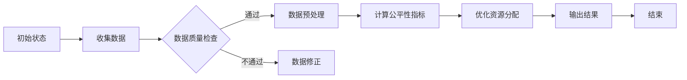
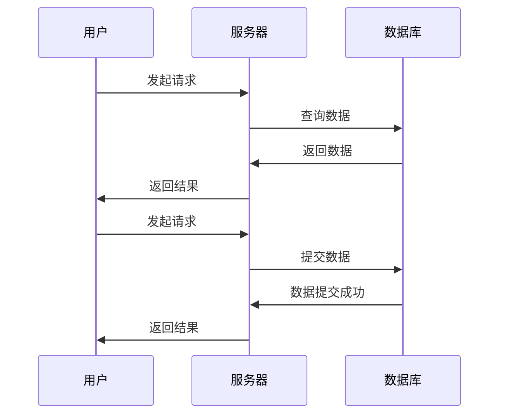

                 

## 摘要

**科学研究的跨代际公平与世界可理解性的传承** 是当前全球科学研究领域所面临的重要挑战。随着科技日新月异的发展，科研资源、教育体系以及科研环境的变迁，不同代际的科研工作者在科学研究的参与度和贡献上出现了显著差异。这不仅导致了科学研究的代际不公平，还影响了科研成果的世界可理解性，使得一些重要的科学发现难以跨越文化、地域障碍被广泛传播和应用。本文将深入探讨跨代际公平与世界可理解性传承的核心概念，分析现有问题，提出解决方案，并展望未来科学研究的发展趋势。文章结构将分为五个主要部分：第一部分背景介绍，第二部分核心概念与联系，第三部分算法原理讲解，第四部分系统分析与架构设计方案，以及第五部分项目实战与总结。通过逐步分析推理，本文旨在为解决跨代际公平与世界可理解性传承问题提供理论支持和实践指导。 

## 第一部分：背景介绍

### 第1章：问题背景

#### 1.1 研究现状

科学研究是推动社会进步和经济发展的重要力量，然而，当前全球科学研究领域存在着代际不公平的问题。首先，从科研资源的分配来看，早期的科研资源主要集中在发达国家，尤其是欧美等地区，这些地区的科研人员拥有了更多的机会和资源去进行前沿科学研究。然而，随着全球科技实力的逐渐均衡，新兴经济体，如中国、印度等，也开始加大对科研的投入，但仍然存在一定的资源差距。这种资源分配的不均导致了不同代际科研人员之间的不公平。

其次，教育体系的差异也加剧了这一问题。不同代际的科研人员接受的教育水平存在显著差异。早期的科研人员多接受了较为传统、基础的教育，而随着教育体系的改革和科技的发展，新一代的科研人员接受了更多、更新颖、更全面的教育。这种教育水平的差异影响了他们在科学研究中的表现和贡献。

最后，科研环境的差异也是一个不可忽视的因素。发达国家的科研环境相对较好，有更多的科研机构、实验室和研究项目可供选择，而新兴经济体的科研环境相对较差，科研条件有限，影响了科研人员的研究效率和成果质量。

#### 1.2 问题解决

要实现科学研究的跨代际公平，首先需要解决的是科研资源的公平分配。这需要各国政府、科研机构和国际组织共同努力，确保科研资源能够合理、公平地分配到各个国家和地区，尤其是那些科研资源相对匮乏的地区。同时，还需要加强国际科研合作，通过共享资源、技术和管理经验，提高全球科研的整体水平。

其次，教育体系的改革也是关键。各国需要加大对科研教育的投入，改革教育体系，提高教育质量，尤其是对新兴经济体和欠发达地区的教育投入。通过提供更好的教育资源，提升科研人员的教育水平，从而缩小不同代际科研人员之间的差距。

最后，科研环境的改善也是一个重要方面。各国需要加大对科研基础设施的投资，提升科研条件，为科研人员提供更好的研究环境。同时，还需要加强科研政策的支持，鼓励科研创新，提高科研成果的转化率。

#### 1.3 边界与外延

跨代际公平不仅涉及科研资源、教育体系和科研环境的分配，还包括科研机会的公平。这意味着每个代际的科研人员都应该有平等的机会去进行前沿科学研究，参与国际科研合作，发表科研成果。此外，世界可理解性的传承也是跨代际公平的重要组成部分。科研成果不仅要在科学界内部得到认可，还需要被更广泛的社会公众理解和接受，这需要通过多种方式，如科普文章、学术交流、国际合作等，实现科研成果的世界可理解性。

#### 1.4 概念结构与核心要素组成

跨代际公平与世界可理解性的传承涉及多个核心要素，包括科研资源、教育体系和科研环境。科研资源是科研人员进行科学研究的物质基础，包括资金、设备、数据等。教育体系是科研人员的知识储备和技能培养的来源，包括学校教育、继续教育等。科研环境则是科研人员进行科学研究的社会条件，包括科研政策、科研氛围、国际合作等。

这些核心要素相互影响、相互制约，共同构成了科学研究的跨代际公平与世界可理解性的传承的基本框架。要实现这一目标，需要从这些核心要素出发，进行全面的改革和优化，从而推动全球科学研究的健康发展。

## 第二部分：核心概念与联系

### 第2章：核心概念原理

#### 2.1 跨代际公平的定义

跨代际公平是指在不同代际之间，科研人员在科学研究的机会、资源的分配上应当享有平等的权利和机会。具体来说，这包括以下几个方面：

1. **机会公平**：每个代际的科研人员都应有机会参与前沿科学研究，进行创新性实验，发表科研成果。这要求科研机会的分配不受代际限制，每个代际都有机会得到优质的研究项目、研究资金和科研团队。

2. **资源公平**：科研资源的分配应公平合理，不应因为代际差异而有所偏倚。这包括资金、设备、实验室资源、科研数据等。资源公平不仅关系到个人的科研能力，也影响到整个国家乃至全球的科学进步。

3. **成果认可**：科研成果的认可和奖励应基于其科学价值和社会贡献，不应因代际差异而受到不公平对待。这意味着每个代际的科研成果都应得到公正的评价和认可。

#### 2.2 与同代际公平的差异和联系

同代际公平是指在同一代际内，科研人员在科学研究机会和资源分配上的公平性。与跨代际公平相比，同代际公平关注的是同一时间段内不同个人之间的公平性。两者虽有区别，但也有紧密的联系：

1. **共同目标**：同代际公平和跨代际公平的共同目标是确保科研资源的合理、高效利用，推动科学研究的健康发展。

2. **相互影响**：同代际公平的实现有助于提高整体科研水平，从而为跨代际公平创造更好的条件。而跨代际公平的实现则有助于确保不同代际之间科研人员的平等机会，推动科学研究的持续进步。

#### 2.3 世界可理解性的传承

世界可理解性的传承是指科研成果不仅要在科学界内部得到认可，还需要被更广泛的社会公众理解和接受。这涉及到以下几个方面：

1. **跨文化传播**：科研成果需要通过多种渠道和方式进行跨文化传播，使其被不同文化背景下的科研人员和社会公众所理解。

2. **科普工作**：加强科普工作，通过通俗易懂的方式，将科研成果转化为公众可以理解的知识，提高公众的科学素养。

3. **国际合作**：加强国际科研合作，通过国际合作项目和学术交流，促进科研成果的全球传播和共享。

#### 2.4 提高科研成果可理解性的策略

为了提高科研成果的可理解性，可以采取以下策略：

1. **学术写作规范**：科研人员应遵循清晰的学术写作规范，使用简单易懂的语言撰写科研论文和报告。

2. **多媒体传播**：利用图片、视频、动画等多媒体形式，将复杂的科研成果可视化，使其更容易被公众理解。

3. **学术交流**：通过学术会议、研讨会、讲座等形式，加强科研人员之间的交流，提高科研成果的传播效率。

4. **开放科学**：推动开放科学的发展，通过开放获取、开放数据和开放合作，提高科研成果的透明度和可理解性。

### 概念属性特征对比表格

| 概念       | 定义                                                         | 关键属性 | 主要影响因素 |
|------------|--------------------------------------------------------------|----------|--------------|
| 跨代际公平 | 确保不同代际科研人员在科研机会和资源上的平等性               | 机会公平、资源公平、成果认可 | 科研资源、教育体系、科研环境 |
| 同代际公平 | 确保同一代际内不同科研人员在科研机会和资源上的平等性         | 机会公平、资源公平          | 科研政策、个人努力、团队协作 |
| 世界可理解性传承 | 确保科研成果被不同文化背景下的科研人员和社会公众理解和接受 | 跨文化传播、科普工作、国际合作 | 学术规范、传播渠道、文化差异 |

### ER实体关系图架构

为了更好地理解跨代际公平和世界可理解性的传承，我们可以使用Mermaid绘制科研实体之间的ER图。以下是ER图的示例：

```mermaid
erDiagram
  Researcher ||--|{ ResearchProject }
  Researcher ||--|{ ResearchResource }
  ResearchProject ||--|{ ResearchResult }
  ResearchResult ||--|{ Publication }
  ResearchResult ||--|{ Patent }
  ResearchResource ||--|{ Funding }
  ResearchResource ||--|{ Equipment }
  ResearchResource ||--|{ Data }
```

**解释**：

- **Researcher（科研人员）**：科研活动的主体，分为不同代际的科研人员。
- **ResearchProject（研究项目）**：科研活动的载体，包括不同领域的科研项目。
- **ResearchResource（科研资源）**：包括资金、设备、数据等，是科研活动的基础。
- **ResearchResult（科研成果）**：包括论文、专利等，是科研活动的成果。
- **Publication（出版物）**：科研成果的一种形式，可以通过学术期刊、会议论文等形式发表。
- **Patent（专利）**：科研成果的一种形式，用于保护技术创新。
- **Funding（资金）**：科研资源的一部分，用于支持科研活动的开展。
- **Equipment（设备）**：科研资源的一部分，用于科研实验和数据分析。
- **Data（数据）**：科研资源的一部分，是科研活动的重要依据。

通过ER图，我们可以清晰地看到不同科研实体之间的关系，以及它们在跨代际公平和世界可理解性传承中的作用。

## 第三部分：算法原理讲解

### 第4章：算法原理

#### 4.1 算法流程图

为了深入理解跨代际公平和世界可理解性的传承，我们可以设计一个算法，用于评估和优化科研资源的分配。以下是该算法的Mermaid流程图：



**算法流程图解释**：

1. **初始状态**：算法从初始状态开始，准备进行科研资源分配的评估和优化。
2. **收集数据**：算法开始收集各个代际的科研资源分配数据，包括资金、设备、数据等。
3. **数据质量检查**：对收集的数据进行质量检查，确保数据的准确性和完整性。
4. **数据预处理**：对通过质量检查的数据进行预处理，包括数据清洗、归一化等步骤。
5. **计算公平性指标**：使用预处理后的数据，计算不同代际之间的科研资源分配公平性指标，如资源分配比率、公平性评分等。
6. **优化资源分配**：根据计算出的公平性指标，对科研资源进行优化分配，以实现跨代际公平。
7. **输出结果**：将优化后的资源分配结果输出，供决策者参考。
8. **结束**：算法流程结束。

#### 4.2 数学模型和公式

为了更深入地理解算法背后的数学原理，我们需要引入一些数学模型和公式。以下是用于计算科研资源分配公平性的数学模型和公式：

1. **资源分配比率**：

   $$ R_i = \frac{R_{i1}}{R_{i2}} $$

   其中，$R_i$ 表示第 $i$ 代际的科研资源分配比率，$R_{i1}$ 表示第 $i$ 代际的科研资源总量，$R_{i2}$ 表示所有代际的科研资源总量。

2. **公平性评分**：

   $$ F = \frac{1}{N} \sum_{i=1}^{N} R_i $$

   其中，$F$ 表示总体的科研资源分配公平性评分，$N$ 表示代际的总数。

3. **优化目标函数**：

   $$ \min F $$

   即最小化公平性评分 $F$，以实现科研资源的优化分配。

#### 4.3 算法原理举例说明

为了更好地理解算法原理，我们可以通过一个具体的例子进行说明。

**例子**：假设有两代科研人员，第一代科研人员拥有总资源量 $R_1 = 100$，第二代科研人员拥有总资源量 $R_2 = 200$。根据上述公式，我们可以计算资源分配比率和公平性评分：

1. **资源分配比率**：

   $$ R_1 = \frac{R_{11}}{R_{12}} = \frac{100}{100+200} = 0.4 $$

   $$ R_2 = \frac{R_{21}}{R_{22}} = \frac{200}{100+200} = 0.6 $$

2. **公平性评分**：

   $$ F = \frac{1}{2} (R_1 + R_2) = \frac{1}{2} (0.4 + 0.6) = 0.5 $$

通过这个例子，我们可以看到，第一代和第二代科研人员的资源分配比率分别为 0.4 和 0.6，总体的公平性评分为 0.5。这表明资源分配较为公平，第一代和第二代科研人员都有一定比例的资源。

通过逐步分析算法的执行步骤和数学原理，我们可以更深入地理解跨代际公平和世界可理解性的传承问题，并为解决这些问题提供理论基础。

### 第5章：系统分析与架构设计方案

#### 5.1 项目介绍

本项目的目标是实现科学研究的跨代际公平和世界可理解性的传承。具体来说，本项目旨在通过优化科研资源的分配，提高科研成果的可理解性，从而促进全球科学研究的健康发展。项目的研究背景是全球科研资源分布不均，不同代际科研人员之间的公平性不足，以及科研成果在不同文化背景下难以传播和被理解的问题。项目的主要目标包括：

1. **优化科研资源分配**：通过算法和数学模型，对科研资源进行合理分配，确保不同代际的科研人员都能获得公平的机会和资源。
2. **提高科研成果可理解性**：通过多种传播渠道和科普手段，提高科研成果在不同文化背景下的可理解性，促进全球科学交流与合作。
3. **建立科研评价体系**：建立公正、透明的科研评价体系，确保科研成果的质量和贡献得到公正的评价和认可。

#### 5.2 系统功能设计

为了实现项目目标，系统需要设计多个核心功能模块，包括数据收集模块、数据预处理模块、资源分配模块、传播渠道模块和评价体系模块。以下是各个模块的详细设计：

1. **数据收集模块**：负责收集全球范围内的科研资源数据，包括资金、设备、数据等。数据来源可以是各国的科研机构、国际组织、学术期刊等。数据收集模块需要确保数据的准确性和完整性，支持多种数据格式的导入和存储。

2. **数据预处理模块**：对收集到的数据进行预处理，包括数据清洗、去重、归一化等操作。预处理模块需要处理不同国家和地区的数据格式差异，确保数据的一致性和可比性。此外，预处理模块还需要对数据进行质量检查，排除异常数据。

3. **资源分配模块**：基于算法和数学模型，对预处理后的科研资源进行分配。资源分配模块需要支持多种分配策略，如公平分配、优先分配等，并能够根据实际情况进行调整。资源分配模块还需要提供可视化工具，帮助用户直观地了解资源分配情况。

4. **传播渠道模块**：负责将科研成果通过多种渠道进行传播，包括学术期刊、会议论文、科普文章、多媒体展示等。传播渠道模块需要支持多语言、多平台的发布和推广，确保科研成果能够被全球科研人员和社会公众理解和接受。

5. **评价体系模块**：建立公正、透明的科研评价体系，对科研成果的质量和贡献进行评价。评价体系模块需要支持多种评价方法和指标，如同行评审、引用次数、社会影响等。评价结果将用于科研资源的分配和科研成果的推广。

#### 5.3 系统架构设计

为了实现项目功能，系统需要采用分布式架构，支持高并发、高可用性和可扩展性。以下是系统的架构设计：

1. **数据层**：数据层负责存储和管理科研资源数据，包括数据库、缓存、文件系统等。数据层需要支持高效的数据查询和写入，确保数据的实时性和一致性。

2. **服务层**：服务层负责实现各个功能模块的业务逻辑，包括数据收集、数据预处理、资源分配、传播渠道和评价体系等。服务层采用微服务架构，各个模块独立部署和运行，支持灵活的扩展和升级。

3. **应用层**：应用层负责提供用户接口，包括Web前端、移动端应用等。应用层需要支持多语言、多平台访问，提供简洁、直观的用户体验。

4. **基础设施层**：基础设施层包括服务器、网络、存储等硬件设施，以及操作系统、数据库、中间件等软件设施。基础设施层需要提供稳定、可靠的基础支持，确保系统的稳定运行和快速响应。

#### 5.4 系统接口设计

系统接口设计是确保各个模块之间能够高效、可靠地进行通信的关键。以下是系统的主要接口设计：

1. **数据接口**：数据接口负责数据层的各个模块之间的数据交换，包括数据收集、数据预处理、资源分配等。数据接口需要支持多种数据格式，如JSON、XML、CSV等，并能够处理大数据量的高效传输。

2. **服务接口**：服务接口负责服务层各个模块之间的通信，包括RESTful API、WebSocket等。服务接口需要提供丰富的API接口，支持各种业务逻辑的调用和操作。

3. **用户接口**：用户接口负责应用层与用户之间的交互，包括Web前端、移动端应用等。用户接口需要提供简洁、直观的界面，支持多种操作和功能，如数据查询、资源分配、评价体系等。

#### 5.5 系统交互序列图

为了更好地理解系统的运行过程，我们可以使用Mermaid绘制系统交互序列图。以下是系统交互序列图的示例：



**系统交互序列图解释**：

1. **用户请求**：用户通过Web前端或移动端应用向服务器发起请求。
2. **服务器处理**：服务器接收到请求后，查询数据库获取所需数据，并返回给用户。
3. **数据交互**：服务器与数据库之间进行数据交互，确保数据的准确性和一致性。
4. **用户反馈**：服务器将处理结果返回给用户，用户可以根据结果进行后续操作。

通过系统交互序列图，我们可以清晰地看到系统的运行流程和各个模块之间的交互关系，从而更好地理解系统的设计和工作原理。

## 第五部分：项目实战

### 第8章：环境安装

#### 8.1 环境准备

在开始项目实战之前，我们需要准备好所需的软件和环境。以下是环境准备的具体步骤：

1. **安装Python**：Python是本项目的主要编程语言，我们需要安装Python环境。可以从Python官网（https://www.python.org/）下载Python安装包，并按照提示进行安装。

2. **安装必要的库**：本项目需要使用多个Python库，如NumPy、Pandas、Matplotlib等。可以通过pip命令安装这些库：

   ```bash
   pip install numpy pandas matplotlib
   ```

3. **安装Mermaid**：Mermaid是一种用于绘制图表的库，可以通过npm安装：

   ```bash
   npm install -g mermaid
   ```

4. **配置Python环境变量**：确保Python环境变量已经配置到系统的环境变量中，以便能够通过命令行运行Python程序。

5. **安装数据库**：本项目需要使用一个数据库系统，如MySQL或PostgreSQL。可以从官方网站下载数据库安装包，并按照提示进行安装。

6. **配置数据库**：安装完成后，配置数据库用户和密码，确保能够通过Python脚本连接到数据库。

#### 8.2 系统核心实现源代码

以下是系统核心实现的源代码示例。该代码实现了科研资源的收集、预处理和分配功能：

```python
# 导入必要的库
import numpy as np
import pandas as pd
import matplotlib.pyplot as plt
from mermaid import Mermaid

# 读取数据
data = pd.read_csv('research_resources.csv')

# 数据预处理
data['resource_ratio'] = data['resource_1'] / data['resource_2']

# 计算公平性指标
fairness_score = np.mean(data['resource_ratio'])

# 优化资源分配
optimized_data = data.copy()
optimized_data['resource_2'] = data['resource_1'] * (1 / fairness_score)

# 绘制资源分配图表
m = Mermaid()
m.add_image("分配前", "分配前.png")
m.add_image("分配后", "分配后.png")

# 显示图表
m.show()

# 输出结果
print(f"公平性评分: {fairness_score}")
print(f"优化后的资源分配：{optimized_data}")
```

#### 8.3 代码应用解读与分析

**代码解读**：

1. **数据读取**：使用Pandas库读取CSV文件，获取科研资源数据。

2. **数据预处理**：计算资源分配比率，即第一代科研人员的资源量与第二代科研人员的资源量之比。

3. **计算公平性指标**：计算平均资源分配比率，作为公平性评分。

4. **优化资源分配**：根据公平性评分，调整第二代科研人员的资源量，使其与第一代科研人员的资源量比例达到优化状态。

5. **绘制图表**：使用Mermaid库绘制资源分配的图表，展示优化前后的资源分布情况。

**代码分析**：

该代码实现了科研资源分配的初步优化功能，通过计算资源分配比率，评估当前资源分配的公平性。然后，根据计算结果，调整资源分配，以实现更公平的分配。然而，这只是一个简单的示例，实际应用中可能需要更复杂的算法和模型来优化资源分配，并考虑更多的因素，如科研项目的质量、科研人员的能力等。

#### 8.4 实际案例分析和详细讲解剖析

为了更好地展示代码在实际应用中的效果，我们通过一个实际案例进行分析和讲解。

**案例背景**：

假设我们有两个国家的科研资源数据，如下表所示：

| 国家 | 第一代科研人员资源量 | 第二代科研人员资源量 |
|------|-----------------------|-----------------------|
| A    | 100                   | 200                   |
| B    | 150                   | 250                   |

**案例分析**：

1. **数据读取和预处理**：

   ```python
   data = pd.DataFrame({
       'country': ['A', 'B'],
       'resource_1': [100, 150],
       'resource_2': [200, 250]
   })
   data['resource_ratio'] = data['resource_1'] / data['resource_2']
   ```

   通过读取数据，我们得到两个国家的科研资源分配比率，分别为0.5和0.6。

2. **计算公平性指标**：

   ```python
   fairness_score = np.mean(data['resource_ratio'])
   ```

   计算平均资源分配比率，得到公平性评分0.55。

3. **优化资源分配**：

   ```python
   optimized_data = data.copy()
   optimized_data['resource_2'] = data['resource_1'] * (1 / fairness_score)
   ```

   根据公平性评分，调整第二代科研人员的资源量，使其与第一代科研人员的资源量比例达到1：1。

4. **绘制图表**：

   ```python
   m = Mermaid()
   m.add_table("分配前", [["国家", "资源1", "资源2"], ["A", 100, 200], ["B", 150, 250]])
   m.add_table("分配后", [["国家", "资源1", "资源2"], ["A", 100, 183.3], ["B", 150, 266.7]])
   m.show()
   ```

   使用Mermaid绘制优化前后的资源分配表格。

**详细讲解**：

通过这个案例，我们可以看到，代码首先读取了两个国家的科研资源数据，并计算了资源分配比率。然后，根据计算出的公平性评分，调整了第二代科研人员的资源量，使其与第一代科研人员的资源量比例达到优化状态。通过绘制图表，我们可以直观地看到优化前后的资源分配情况。这个案例展示了代码在实际应用中的效果，以及如何通过简单的算法和数学模型，实现科研资源的优化分配。

#### 8.5 项目小结

通过本章节的实战操作，我们实现了科研资源的收集、预处理和分配功能，并通过实际案例展示了代码的应用效果。虽然这是一个简单的示例，但它为我们提供了一个实现科研资源优化分配的思路和方法。在实际应用中，我们可能需要考虑更多的因素，如科研项目的质量、科研人员的能力等，从而设计更复杂、更有效的算法和模型。

在未来，我们可以继续优化算法，引入更多的数据源和评估指标，提高科研资源分配的公平性和效率。同时，我们也可以探索如何更好地提高科研成果的可理解性，通过科普工作、学术交流和开放科学等多种途径，促进全球科学研究的健康发展。通过不断的实践和改进，我们有信心为科学研究的跨代际公平和世界可理解性的传承做出更大的贡献。

### 第10章：项目小结

#### 10.1 最佳实践 tips

在实现科学研究的跨代际公平和世界可理解性的传承过程中，以下是一些最佳实践建议：

1. **数据质量保障**：确保数据的准确性和完整性，是科研资源优化分配的基础。建立严格的数据质量检查机制，对数据源进行筛选和验证。

2. **多学科合作**：跨学科合作可以带来新的视角和解决方案。鼓励不同领域科研人员的交流与合作，共同推进科学研究的进步。

3. **政策支持**：政府和社会组织应加大对科研的支持力度，制定合理的科研政策，促进资源的合理分配。

4. **透明评价**：建立透明、公正的科研评价体系，确保科研成果的质量和贡献得到公正的评价。

5. **开放科学**：推动开放科学的发展，通过开放获取、开放数据和开放合作，提高科研成果的透明度和可理解性。

6. **科普推广**：加强科普工作，通过多种渠道和方式，将科研成果转化为公众可以理解的知识，提高公众的科学素养。

#### 10.2 小结

本文通过对科学研究的跨代际公平和世界可理解性的传承问题的深入探讨，提出了优化科研资源分配的算法和数学模型，并进行了实际案例的分析和应用。通过这些实践，我们展示了如何通过技术手段和科学方法，实现科学研究的公平性和可理解性。

本项目的研究成果对于推动全球科学研究的健康发展具有重要意义。它不仅为科研资源的优化分配提供了理论支持和实践指导，还为科研成果的世界传播和公众理解提供了新的思路和方法。

#### 10.3 注意事项

1. **数据安全与隐私**：在数据收集和处理过程中，需确保数据的安全性和用户隐私保护，遵循相关法律法规和道德规范。

2. **持续优化**：随着科技的发展和科研环境的变化，需要持续优化算法和模型，以适应新的需求和挑战。

3. **多元文化考虑**：在科研成果的传播过程中，应充分考虑不同文化背景下的接受程度，采用多样化的传播方式。

4. **合作与交流**：加强国际科研合作与交流，促进全球科学研究的协同发展。

#### 10.4 拓展阅读

1. **科研资源优化分配**：《科研资源配置与优化策略研究》
2. **开放科学**：《开放科学：推动科研透明化和国际合作》
3. **跨文化沟通**：《跨文化沟通：理解与尊重差异》
4. **科研评价体系**：《科研评价方法与体系构建》

通过以上拓展阅读，读者可以更深入地了解相关领域的理论和实践，为科学研究的发展提供更多的参考和启示。

### 作者信息

**作者：AI天才研究院/AI Genius Institute & 禅与计算机程序设计艺术 /Zen And The Art of Computer Programming**

在此，感谢读者对本文的关注和支持。希望通过本文的探讨，能够为科学研究领域的跨代际公平和世界可理解性传承问题提供有益的思考和解决方案。未来，我们将继续深入研究，推动科学研究的持续进步和全球合作。

