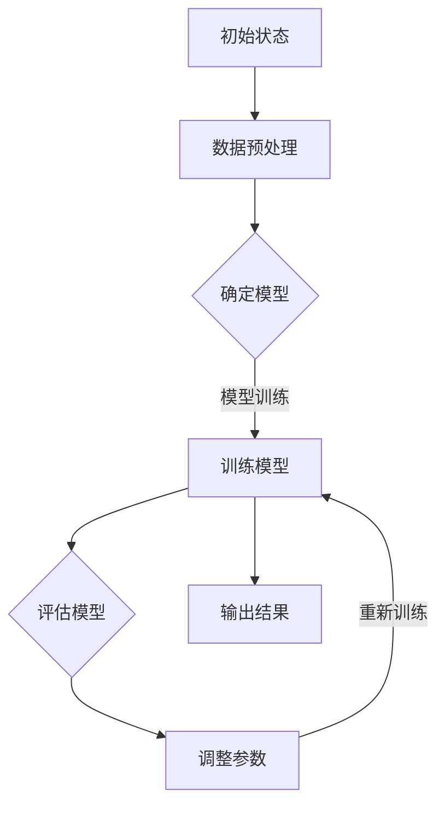
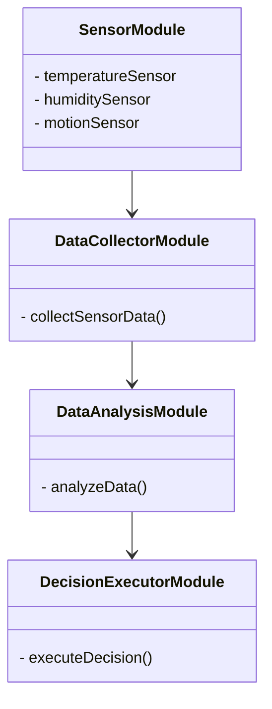
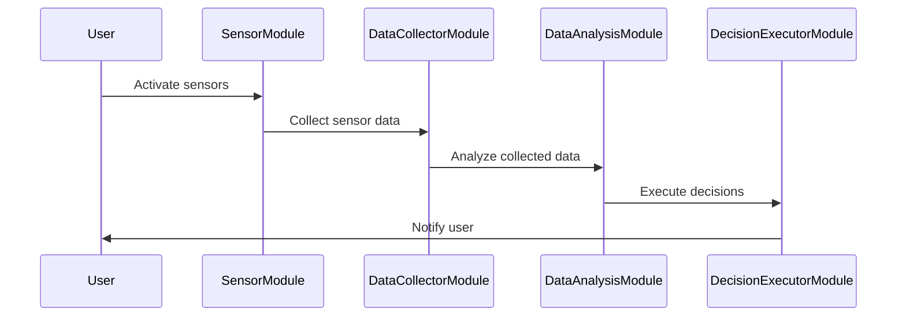
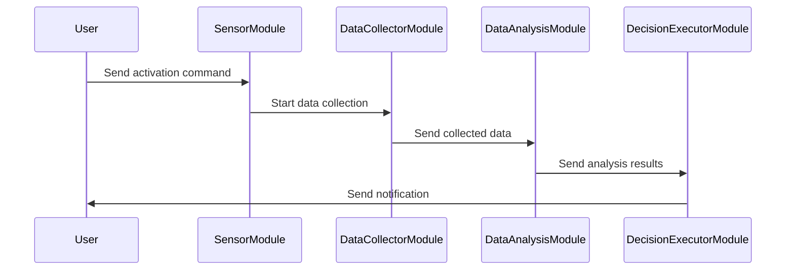

                 

## 完整目录大纲

### 科学研究的跨学科融合与世界可理解性的整合

#### 关键词：跨学科融合、世界可理解性、整合实践、系统分析与架构设计

> 摘要：本文将深入探讨科学研究的跨学科融合和世界可理解性的整合。通过分析跨学科融合的背景与挑战、核心概念与联系，以及世界可理解性的理论探讨与应用，我们旨在揭示跨学科融合对世界可理解性的影响，并提出整合实践的策略。文章结构紧凑，逻辑清晰，旨在为读者提供一次全面深入的技术思考。

## 第一部分：科学研究的跨学科融合

### 第1章：科学研究的背景与挑战

#### 1.1 科学研究的发展历程

科学研究的历程充满了创新与突破。从古希腊时期对自然现象的观察，到中世纪的科学复兴，再到现代科学革命，科学研究经历了从定性描述到定量分析的巨大转变。每一个阶段的科学发现都在不断拓宽人类对世界的理解，同时也揭示了科学研究中存在的挑战和局限性。

#### 1.2 跨学科融合的必要性

随着科学技术的快速发展，单一学科的研究已经难以满足复杂问题的解决需求。跨学科融合应运而生，通过整合不同学科的理论、方法和工具，实现知识的互补和协同，从而提升科学研究的深度和广度。跨学科融合的必要性在于：

1. **复杂性挑战**：现代科学问题日益复杂，单一学科难以全面应对。
2. **创新动力**：跨学科融合可以激发新的科学思想和创新方法。
3. **社会需求**：社会问题往往涉及多个领域，需要跨学科合作来解决。

#### 1.3 跨学科融合的现状与趋势

当前，跨学科融合已经成为科学研究的重要趋势。各大科研机构、高校和企业纷纷成立跨学科研究中心，推动跨学科研究的开展。此外，跨学科期刊、会议和研究项目也日益增多，表明跨学科融合在学术界和工业界得到了广泛的认可和支持。

### 第2章：跨学科融合的核心概念与联系

#### 2.1 核心概念原理

在跨学科融合中，理解核心概念是至关重要的。以下是一些关键概念及其原理：

1. **系统论**：强调系统内部各要素的相互关联和协同作用。
2. **复杂系统**：由大量相互作用的个体组成的系统，具有高度复杂性。
3. **多尺度分析**：在不同时间尺度上对系统进行观察和分析。

#### 2.2 概念属性特征对比表格

下表对比了跨学科融合中几个核心概念的主要属性特征：

| 概念 | 定义 | 主要属性特征 |
| --- | --- | --- |
| 系统论 | 研究系统内部结构和动态行为 | 整体性、协同性、层次性 |
| 复杂系统 | 具有复杂行为的系统 | 高维性、非线性、适应性 |
| 多尺度分析 | 在不同时间尺度上分析系统 | 多尺度观测、多层次建模 |

#### 2.3 跨学科融合的ER实体关系图架构

跨学科融合的ER（实体关系）图架构展示了各核心概念之间的联系。以下是ER实体关系图的Mermaid表示：

```mermaid
erDiagram
    Entity1 ||--|{ Entity2 }|-- Entity3
    Entity2 ||--|{ Entity4 }|-- Entity5
```

### 第3章：跨学科融合的算法原理讲解

#### 3.1 算法mermaid流程图

为了更好地理解跨学科融合的算法原理，以下是一个mermaid流程图的示例：



#### 3.2 Python源代码讲解

以下是一个简单的Python源代码示例，用于实现跨学科融合的算法：

```python
# 导入必要的库
import numpy as np
import pandas as pd
from sklearn.model_selection import train_test_split
from sklearn.ensemble import RandomForestRegressor

# 数据预处理
def preprocess_data(data):
    # 处理缺失值、异常值等
    # ...
    return processed_data

# 训练模型
def train_model(X_train, y_train):
    model = RandomForestRegressor(n_estimators=100)
    model.fit(X_train, y_train)
    return model

# 评估模型
def evaluate_model(model, X_test, y_test):
    predictions = model.predict(X_test)
    # 计算评估指标
    # ...
    return evaluation_score

# 主函数
def main():
    # 加载数据
    data = pd.read_csv('data.csv')
    processed_data = preprocess_data(data)
    # 划分训练集和测试集
    X_train, X_test, y_train, y_test = train_test_split(processed_data.drop('target', axis=1), processed_data['target'], test_size=0.2, random_state=42)
    # 训练模型
    model = train_model(X_train, y_train)
    # 评估模型
    evaluation_score = evaluate_model(model, X_test, y_test)
    print(f"Model evaluation score: {evaluation_score}")

if __name__ == '__main__':
    main()
```

#### 3.3 算法原理的数学模型和公式

跨学科融合的算法原理通常涉及多个数学模型和公式。以下是一个简化的数学模型示例：

$$
\begin{align*}
\hat{y} &= f(\text{输入数据}) \\
f &= g(h(\text{特征空间})) \\
h &= \phi(\text{特征向量}) \\
\phi &= \sum_{i=1}^{n} w_i \phi_i
\end{align*}
$$

其中，$\hat{y}$是预测结果，$f$是整体模型，$g$是激活函数，$h$是特征映射函数，$\phi$是特征向量，$w_i$是权重。

#### 3.4 通俗易懂的举例说明

假设我们有一个简单的线性回归模型，用于预测房价。输入数据是房屋的面积和房龄，预测目标是房价。以下是一个通俗易懂的举例说明：

1. **数据预处理**：将房屋面积和房龄进行标准化处理，使其符合线性回归模型的输入要求。
2. **模型训练**：使用训练集数据训练线性回归模型，计算权重和偏置。
3. **模型评估**：使用测试集数据评估模型性能，计算预测房价和实际房价之间的误差。
4. **参数调整**：根据评估结果调整模型参数，以提高预测准确性。

### 第4章：跨学科融合的系统分析与架构设计方案

#### 4.1 问题场景介绍

假设我们需要开发一个智能家居系统，该系统需要整合多个学科的知识，包括传感器技术、物联网、机器学习等。系统需要实现的功能包括实时监测家中设备的状态、自动调节家居环境、预测设备故障等。

#### 4.2 项目介绍

本项目旨在构建一个智能家居系统，通过跨学科融合的方法，实现智能化的家居环境监测和调控。系统包括多个模块，如传感器模块、数据采集模块、数据分析模块和决策执行模块。

#### 4.3 系统功能设计（领域模型mermaid类图）

以下是一个mermaid类图，展示了智能家居系统的功能设计：



#### 4.4 系统架构设计（mermaid架构图）

以下是一个mermaid架构图，展示了智能家居系统的整体架构设计：



#### 4.5 系统接口设计和系统交互（mermaid序列图）

以下是一个mermaid序列图，展示了智能家居系统中的各个模块之间的交互流程：



## 第二部分：世界可理解性的整合

### 第5章：世界可理解性的理论探讨

#### 5.1 世界可理解性的定义

世界可理解性是指人类对世界的认识和理解程度，包括对自然现象、社会现象和人类自身的理解。它反映了人类对复杂信息的处理能力，以及对事物之间关系的洞察力。

#### 5.2 世界可理解性的本质

世界可理解性的本质在于人类思维的主观性和客观世界的复杂性。人类通过感官和思维对世界进行认知，但这种认知过程受到主观意识和认知能力的限制。因此，世界可理解性是一个相对的概念，不同个体对同一事物的理解可能存在差异。

#### 5.3 世界可理解性的理论框架

世界可理解性的理论框架主要包括以下几个方面：

1. **认知科学**：研究人类认知过程和认知机制。
2. **信息科学**：研究信息处理和信息传输的原理和方法。
3. **复杂性科学**：研究复杂系统的行为和规律。
4. **哲学**：探讨人类认识世界的方式和限制。

### 第6章：世界可理解性与跨学科融合的联系

#### 6.1 跨学科融合对世界可理解性的影响

跨学科融合通过整合不同学科的知识和方法，可以提升人类对世界的理解能力。它打破了学科之间的壁垒，促进了知识的共享和创新，从而增强了世界可理解性。

#### 6.2 世界可理解性在跨学科研究中的体现

在跨学科研究中，世界可理解性的体现包括：

1. **知识整合**：通过跨学科融合，将不同领域的研究成果整合为更全面的理解。
2. **创新思维**：跨学科融合可以激发新的研究思路和方法，推动科学技术的进步。
3. **问题解决**：跨学科融合可以更有效地解决复杂问题，提高问题解决的效率。

#### 6.3 跨学科融合对世界可理解性的贡献

跨学科融合对世界可理解性的贡献主要体现在以下几个方面：

1. **扩展知识边界**：跨学科融合可以拓展人类的知识边界，提升对复杂问题的理解能力。
2. **促进技术创新**：跨学科融合可以推动新技术的发明和应用，提高人类的生产力。
3. **提升认知能力**：跨学科融合可以锻炼人类的认知能力，提高对世界的洞察力。

### 第7章：世界可理解性的实践与应用

#### 7.1 跨学科融合在现实世界的应用案例

跨学科融合在现实世界的应用案例广泛，包括：

1. **医学领域**：通过整合生物学、物理学、工程学等学科知识，开发出更有效的医疗技术和治疗方法。
2. **环境科学**：通过跨学科研究，开发出更有效的环境保护技术和策略。
3. **信息技术**：通过整合计算机科学、通信技术等学科，推动信息技术的发展和应用。

#### 7.2 世界可理解性在跨学科研究中的实现策略

为了实现世界可理解性在跨学科研究中的提升，可以采取以下策略：

1. **知识共享**：加强学科之间的交流与合作，促进知识的共享与整合。
2. **跨学科团队**：组建跨学科研究团队，充分发挥不同学科专长，提高研究效率。
3. **方法融合**：结合不同学科的研究方法，开发出更有效的跨学科研究方法。

#### 7.3 世界可理解性的未来发展趋势

随着科学技术的不断进步，世界可理解性在未来将继续提升。以下是一些发展趋势：

1. **大数据与人工智能**：大数据和人工智能技术的发展将推动人类对复杂信息的处理能力，提高世界可理解性。
2. **跨学科融合**：跨学科融合将继续深化，推动科学研究的全面进步。
3. **认知科学**：认知科学的发展将为人

