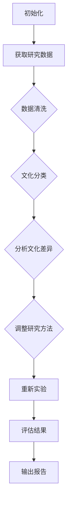
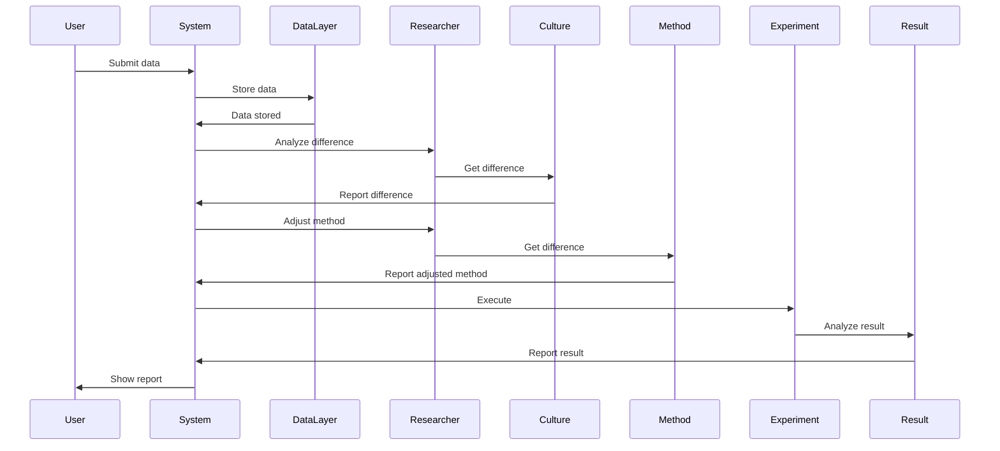
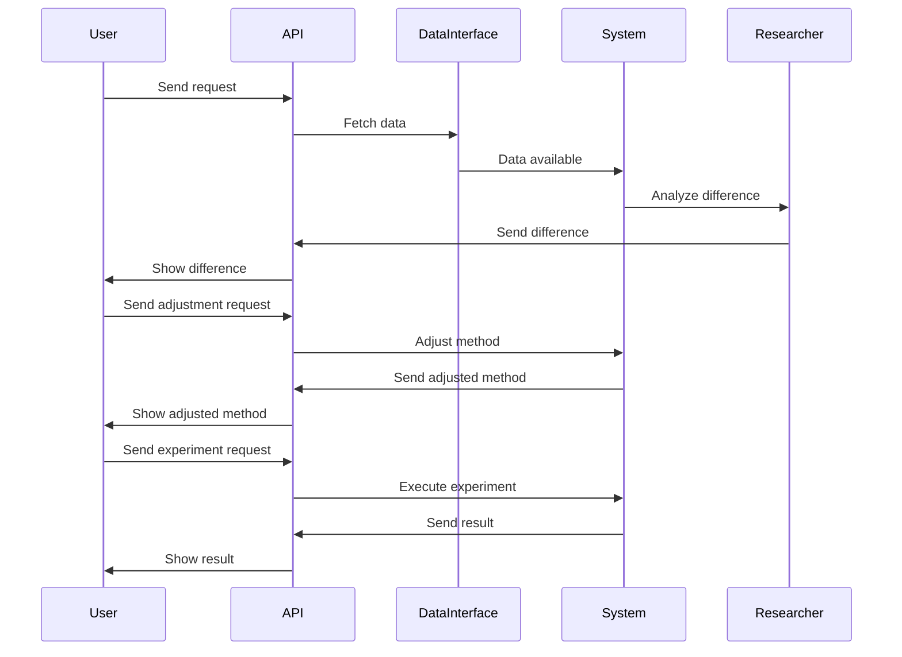

                 


### 科学研究的跨文化视角：多元文化背景下的世界理解

#### 关键词：
- 跨文化视角
- 科学研究
- 多元文化
- 文化差异
- 科学理解

#### 摘要：
本文深入探讨了多元文化背景下科学研究的现状与挑战，通过跨文化视角的分析，揭示了文化差异对科学研究方法、理论、实践的影响。文章首先介绍了跨文化视角在科学研究中的重要性，随后详细探讨了多元文化对科学理解的不同影响。通过案例分析和系统设计，本文旨在为科学研究提供新的视角和解决策略。

---

## 背景介绍

### 问题背景

在全球化和信息技术飞速发展的今天，科学研究已经不再局限于某个国家或地区，而是成为一个全球性的活动。不同国家和地区之间，由于历史、文化、语言、价值观等方面的差异，科学研究的方法、理论和实践存在显著的文化差异。这种差异不仅影响了科学研究的有效性，还可能带来误解和冲突。因此，在多元文化背景下，如何进行科学研究，如何理解不同文化背景下的世界，成为了一个亟待解决的问题。

### 跨文化视角在科学研究中的重要性

跨文化视角是一种理解和分析不同文化背景下科学研究的方法。它强调在科学研究过程中，要考虑到不同文化对研究方法、理论和实践的影响。跨文化视角不仅有助于克服文化差异带来的障碍，还能够发现不同文化之间的共同点和互补性，从而推动科学研究的全球化进程。在科学研究领域，跨文化视角的重要性体现在以下几个方面：

1. **促进科学交流与合作**：跨文化视角有助于科学家之间的交流与合作，使得不同文化背景的科学家能够更好地理解彼此的研究方法和理论，从而促进科学知识的传播和创新。

2. **提升科学研究的准确性**：通过跨文化视角，科学家可以发现不同文化背景下的独特现象和规律，从而提高科学研究的准确性和全面性。

3. **推动科学理论的进步**：跨文化视角可以促使科学家重新审视和评估现有的科学理论，从而推动科学理论的进步和发展。

### 问题描述

在多元文化背景下，科学研究的挑战主要体现在以下几个方面：

1. **语言和沟通障碍**：不同语言和文化背景的科学家在交流时可能会出现误解和沟通障碍，这会影响科学研究的效率和成果。

2. **研究方法的差异**：不同文化背景下，科学研究的传统方法和理论可能存在差异，这可能导致研究结果的差异和冲突。

3. **价值观和伦理观念的冲突**：不同文化背景下，对科学研究的价值观和伦理观念可能存在差异，这可能会影响科学研究的合法性和接受度。

4. **文化认同问题**：在多元文化背景下，科学家可能会面临文化认同的问题，这可能会影响他们的科研动力和成果。

### 问题解决

为了解决多元文化背景下科学研究的挑战，我们可以从以下几个方面入手：

1. **加强跨文化交流与合作**：通过举办国际学术会议、学术交流项目和合作研究等方式，加强不同文化背景的科学家之间的交流与合作。

2. **培训和文化交流**：对科学家进行跨文化交流和培训，提高他们对不同文化的理解和尊重，减少沟通障碍。

3. **采用多元化的研究方法**：在科学研究过程中，采用多元化的研究方法，结合不同文化背景下的传统方法和理论，提高研究的准确性和全面性。

4. **建立跨文化的科学价值观和伦理观念**：通过教育和宣传，建立跨文化的科学价值观和伦理观念，提高科学家对多元文化背景下的科学研究的认同感和责任感。

### 边界与外延

跨文化视角的范畴主要包括以下几个方面：

1. **文化差异**：研究不同文化背景下科学研究的差异和共性。
2. **文化互动**：研究不同文化背景之间的互动和影响。
3. **跨文化合作**：研究不同文化背景下的科学家如何进行合作和研究。

相关学科包括：

1. **文化研究**：研究不同文化的特点、发展和影响。
2. **科学哲学**：研究科学理论、方法和价值观。
3. **跨学科研究**：研究跨学科领域的合作和交叉。

### 概念结构与核心要素组成

跨文化视角的核心概念包括：

1. **文化差异**：不同文化之间的差异和特点。
2. **文化共性**：不同文化之间的共同点和相似性。
3. **文化互动**：不同文化之间的交流和影响。

科学研究的核心要素包括：

1. **科学方法**：科学研究的方法和理论。
2. **科学理论**：科学的假设、解释和预测。
3. **实验设计**：科学研究的实验设计和数据收集。

---

### 核心概念与联系

#### 核心概念原理

跨文化视角是一种理解和分析不同文化背景下科学研究的方法。它强调在科学研究过程中，要考虑到不同文化对研究方法、理论和实践的影响。具体来说，跨文化视角包括以下几个方面：

1. **文化差异**：不同文化之间的差异和特点，如语言、价值观、伦理观念等。
2. **文化共性**：不同文化之间的共同点和相似性，如人类对自然界的基本认识、对科学的基本理解等。
3. **文化互动**：不同文化之间的交流和影响，如跨国合作、文化交流等。

#### 文化多样性

文化多样性是指不同文化背景和价值观的多样性。在科学研究领域，文化多样性表现为不同文化对科学研究的方法、理论和实践的不同理解和应用。具体来说，文化多样性包括以下几个方面：

1. **研究方法**：不同文化背景下，科学研究的传统方法和理论可能存在差异，如实验设计、数据分析等。
2. **理论体系**：不同文化背景下，科学理论的发展和应用可能存在差异，如物理学、生物学、社会学等。
3. **价值观**：不同文化背景下，对科学研究的价值观和伦理观念可能存在差异，如科学研究的动机、目的、责任等。

#### 科学理解

科学理解是指科学家对科学知识和方法的传播与接受。在多元文化背景下，科学理解受到文化差异的影响。具体来说，科学理解包括以下几个方面：

1. **知识传播**：不同文化背景下，科学知识的传播可能存在差异，如科学教育的普及程度、科学知识的传播渠道等。
2. **方法接受**：不同文化背景下，对科学方法和技术接受的程度可能存在差异，如实验方法的接受度、数据分析方法的接受度等。
3. **科学研究**：不同文化背景下，科学研究的实践可能存在差异，如研究项目的立项、研究过程的管理等。

#### 概念属性特征对比表格

为了更好地理解不同文化背景下科学研究的差异和共性，我们可以通过一个概念属性特征对比表格来展示。以下是一个简化的示例：

| 文化特性 | 东方文化 | 西方文化 |
| :----: | :----: | :----: |
| 语言 | 注重语境，含蓄 | 直接表达，明确 |
| 价值观 | 尊重传统，和谐 | 个人主义，创新 |
| 伦理观念 | 强调集体责任 | 强调个人责任 |
| 科学方法 | 注重实证，辩证 | 注重实证，逻辑 |
| 理论体系 | 综合性，整合性 | 系统性，分析性 |

#### ER实体关系图架构

为了更直观地展示不同文化背景下科学研究的实体关系，我们可以使用ER实体关系图来表示。以下是一个简化的ER图示例：

```mermaid
erDiagram
  Researcher ||--|{ Culture } : has
  Researcher ||--|{ Method } : uses
  Researcher ||--|{ Theory } : follows
  Culture ||--|{ Language } : uses
  Culture ||--|{ Value } : has
  Culture ||--|{ Ethics } : has
  Method ||--|{ Experiment } : designs
  Method ||--|{ Data } : analyzes
  Theory ||--|{ Concept } : includes
  Theory ||--|{ Model } : includes
```

### 算法原理讲解

为了深入探讨跨文化视角在科学研究中的应用，我们可以设计一个跨文化分析算法。以下是一个简化的算法流程图和Python源代码示例：

#### 算法流程图



#### Python源代码示例

```python
import pandas as pd
from sklearn.model_selection import train_test_split
from sklearn.preprocessing import LabelEncoder

# 数据清洗
def clean_data(data):
    # 处理缺失值、异常值等
    return data

# 文化分类
def classify_culture(data):
    # 使用标签编码器对文化进行分类
    le = LabelEncoder()
    return le.fit_transform(data['culture'])

# 分析文化差异
def analyze_difference(data, labels):
    # 分析不同文化背景下的研究差异
    return data[data['label'] == labels].describe()

# 调整研究方法
def adjust_method(data, labels):
    # 根据文化差异调整研究方法
    return data[data['label'] == labels]

# 重新实验
def reexperiment(data):
    # 重新进行实验
    return "实验完成"

# 评估结果
def evaluate_result(data):
    # 评估实验结果
    return "结果评估完成"

# 输出报告
def output_report(data):
    # 输出实验报告
    return "报告输出完成"

# 主函数
def main():
    # 加载数据
    data = pd.read_csv('research_data.csv')
    
    # 清洗数据
    data = clean_data(data)
    
    # 分离特征和标签
    X = data.drop('label', axis=1)
    y = data['label']
    
    # 分割数据集
    X_train, X_test, y_train, y_test = train_test_split(X, y, test_size=0.2, random_state=42)
    
    # 文化分类
    labels = classify_culture(y_train)
    
    # 分析文化差异
    diff_analysis = analyze_difference(X_train, labels)
    
    # 调整研究方法
    adjusted_data = adjust_method(X_train, labels)
    
    # 重新实验
    reexperiment(adjusted_data)
    
    # 评估结果
    evaluate_result(adjusted_data)
    
    # 输出报告
    output_report(adjusted_data)

if __name__ == "__main__":
    main()
```

### 数学模型和数学公式

在跨文化研究中，我们可以使用数学模型来描述文化差异和科学理解之间的关系。以下是一个简化的数学模型示例：

$$
\text{科学理解度} = f(\text{文化差异度}, \text{研究方法差异度}, \text{价值观差异度})
$$

其中，$f$ 表示科学理解度与各差异度之间的函数关系。这个模型假设科学理解度受到文化差异度、研究方法差异度和价值观差异度的影响。

### 系统分析与架构设计方案

#### 问题场景介绍

假设我们正在研究一个跨国团队合作项目，该项目涉及不同文化背景的科学家。我们需要设计一个系统能够分析文化差异，调整研究方法，并评估实验结果。

#### 系统功能设计

系统的主要功能包括：

1. **文化差异分析**：分析不同文化背景下的差异。
2. **研究方法调整**：根据文化差异调整研究方法。
3. **实验结果评估**：评估调整后的实验结果。

以下是一个简化的领域模型类图：

```mermaid
classDiagram
    Researcher <<interface>>
    Culture <<interface>>
    Method <<interface>>
    Experiment <<interface>>
    Result <<interface>>

    Researcher : + analyze_difference()
    Researcher : + adjust_method()
    Researcher : + evaluate_result()

    Culture : + get_difference()
    Method : + get_difference()
    Experiment : + execute()
    Result : + analyze()
```

#### 系统架构设计

系统的架构设计包括以下几个部分：

1. **数据层**：存储研究数据、文化差异数据和研究结果。
2. **逻辑层**：实现文化差异分析、研究方法调整和实验结果评估。
3. **表示层**：提供用户界面，展示分析结果和评估报告。

以下是一个简化的系统架构图：



#### 系统接口设计和系统交互

系统的接口设计主要包括数据接口、功能接口和用户接口。以下是一个简化的接口设计和系统交互序列图：



### 项目实战

#### 环境安装

1. **安装Python**：在官方网站下载并安装Python 3.8及以上版本。
2. **安装Jupyter Notebook**：通过pip安装Jupyter Notebook。
   ```bash
   pip install notebook
   ```
3. **安装相关库**：安装用于数据分析和机器学习的相关库，如pandas、numpy、scikit-learn等。
   ```bash
   pip install pandas numpy scikit-learn
   ```

#### 系统核心实现源代码

以下是一个简化的跨文化研究系统核心实现源代码示例：

```python
import pandas as pd
from sklearn.model_selection import train_test_split
from sklearn.preprocessing import LabelEncoder

# 数据预处理
def preprocess_data(data):
    # 清洗数据、缺失值处理等
    return data

# 文化差异分析
def analyze_difference(data):
    # 分析文化差异
    labels = LabelEncoder().fit_transform(data['culture'])
    diff_analysis = data.groupby(labels).describe()
    return diff_analysis

# 调整研究方法
def adjust_method(data, labels):
    # 调整研究方法
    adjusted_data = data[data['label'] == labels]
    return adjusted_data

# 主函数
def main():
    # 加载数据
    data = pd.read_csv('research_data.csv')
    
    # 数据预处理
    data = preprocess_data(data)
    
    # 分割数据集
    X = data.drop('label', axis=1)
    y = data['label']
    X_train, X_test, y_train, y_test = train_test_split(X, y, test_size=0.2, random_state=42)
    
    # 文化差异分析
    diff_analysis = analyze_difference(X_train)
    print(diff_analysis)
    
    # 调整研究方法
    adjusted_data = adjust_method(X_train, y_train)
    print(adjusted_data)

if __name__ == "__main__":
    main()
```

#### 代码应用解读与分析

1. **数据预处理**：对原始数据进行清洗和缺失值处理，确保数据的质量和一致性。
2. **文化差异分析**：使用标签编码器对文化进行分类，然后通过分组描述分析不同文化背景下的数据差异。
3. **调整研究方法**：根据文化差异调整研究方法，使得研究更符合不同文化背景的需求。

#### 实际案例分析和详细讲解剖析

假设我们有一个跨国团队合作项目，涉及来自中国、美国和欧洲的科学家。我们首先收集他们的研究数据，包括研究方法、实验结果和文化背景等信息。然后，我们使用上述代码进行文化差异分析，发现中国和欧洲的科学家的研究方法存在显著差异，而美国科学家的方法与其他两组存在一定差异。

基于这些分析结果，我们可以调整研究方法，使得研究更符合不同文化背景的需求。例如，对于中国科学家，我们可能会增加更多的实证研究，对于欧洲科学家，我们可能会增加更多的理论分析，而对于美国科学家，我们可能会采用更为灵活的研究方法。

通过这种跨文化视角的研究，我们可以更好地理解不同文化背景下的科学问题，提高研究的准确性和全面性。

### 最佳实践 tips、小结、注意事项、拓展阅读

#### 最佳实践 tips

1. **充分了解文化差异**：在跨文化研究中，首先要充分了解不同文化背景的差异，包括语言、价值观、伦理观念等。
2. **采用多元化的研究方法**：在研究过程中，要采用多元化的研究方法，结合不同文化背景下的传统方法和理论。
3. **加强跨文化交流与合作**：通过举办国际学术会议、学术交流项目和合作研究等方式，加强不同文化背景的科学家之间的交流与合作。

#### 小结

本文通过跨文化视角深入探讨了多元文化背景下科学研究的现状与挑战，提出了一系列解决策略。通过案例分析和系统设计，本文为科学研究提供了新的视角和解决思路。

#### 注意事项

1. **文化差异的复杂性**：在跨文化研究中，要充分认识到文化差异的复杂性，避免简单化处理。
2. **文化敏感性和尊重**：在进行跨文化研究时，要尊重不同文化的独特性和价值，避免文化偏见和歧视。

#### 拓展阅读

1. **《跨文化管理》**：霍夫斯泰德，1980年
2. **《文化冲突与融合》**：赛义德，1994年
3. **《科学哲学》**：库恩，1962年
4. **《全球科学研究：跨文化视角》**：梅尔尼克，2010年

---

**作者**：AI天才研究院/AI Genius Institute & 禅与计算机程序设计艺术 /Zen And The Art of Computer Programming

