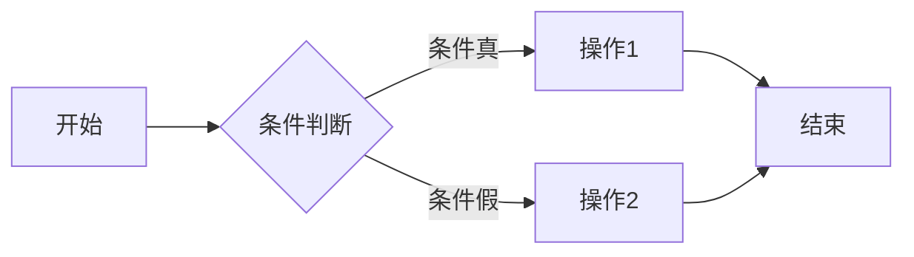
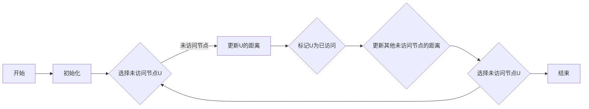
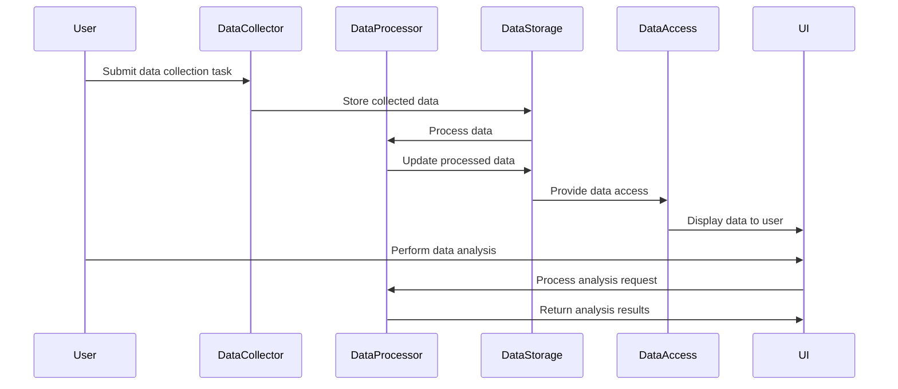

                 

### 文章标题

“科学研究的长期主义与世界可理解性的持续探索”

关键词：长期主义、科学研究、世界可理解性、算法原理、数学模型

摘要：本文将探讨科学研究的长期主义原则，以及如何通过持续探索提升世界可理解性。我们将分析长期主义的历史背景及其在科学研究中的重要性，讨论世界可理解性面临的挑战，并探索长期主义与可理解性之间的关系。通过详细的案例分析，我们揭示了算法原理和数学模型在提升科学理解和世界可理解性方面的作用，并最终提出了一系列最佳实践建议。

### 导言

在当今快速变化的世界，科学研究已成为推动社会进步和人类发展的关键力量。然而，科学研究并非一蹴而就，它需要长期投入、持续探索和不断反思。长期主义，作为科学研究的一种重要原则，强调对问题的深入研究和对结果的持续关注。与此同时，世界可理解性，即人类对复杂世界的认知和掌握程度，成为科学研究的核心目标之一。本文将围绕这两个核心概念展开探讨，旨在揭示长期主义在提升世界可理解性中的关键作用。

本文的结构如下：首先，我们将介绍长期主义的概念和其在科学研究中的重要性。接着，我们将讨论世界可理解性面临的挑战，并分析长期主义与可理解性之间的关系。随后，我们将详细阐述算法原理和数学模型在科学研究中的应用，以及它们如何提升世界可理解性。最后，本文将总结长期主义在科学研究中的最佳实践，并展望未来研究方向。

### 第一部分：背景介绍

#### 第1章：科学研究的长期主义概述

##### 1.1 长期主义的概念与起源

长期主义（Long-termism）是一种以长远视角看待问题的思维方式和行为准则。它强调在决策和行动中考虑长期后果，而非仅仅关注短期收益。长期主义的理念可以追溯到古希腊哲学家亚里士多德，他在《尼各马可伦理学》中提出了“幸福是终极目标，而幸福的实现需要长期的道德行为和智慧”的观点。随着时间的推移，这一理念在各个领域得到了广泛应用。

在科学研究领域，长期主义的重要性愈发凸显。科学探索本质上是一个长期的过程，涉及理论构建、实验验证、数据分析等多个环节。每个环节都需要持续投入和时间积累。例如，爱因斯坦的相对论理论从提出到被广泛接受，经历了数十年的研究、讨论和验证。因此，科学研究中的长期主义不仅是必要的，也是实现科学突破的关键。

##### 1.2 世界可理解性的挑战

世界可理解性（Understandability of the World）指的是人类对自然现象和复杂系统的认知程度。在科学研究过程中，提升世界可理解性意味着更准确地描述、预测和控制自然现象。然而，这一目标面临诸多挑战：

1. **复杂性**：自然现象往往具有高度的复杂性，涉及多个变量和层次结构。例如，气候变化问题不仅涉及大气层，还涉及海洋、生态系统等多个方面。
2. **不确定性**：科学研究中的许多结果具有不确定性，特别是在涉及随机性和混沌现象时。例如，金融市场的不确定性使得预测未来走势变得极为困难。
3. **信息过载**：随着科学技术的快速发展，我们面临的信息量呈爆炸式增长，如何筛选和利用这些信息成为一大挑战。

##### 1.3 科学研究的目标与价值

科学研究的目标可以概括为发现新知识、解决实际问题、推动技术进步等。长期主义在这一过程中起到了关键作用：

1. **发现新知识**：科学研究追求对自然世界的深入理解，这一过程需要长期积累和探索。例如，量子力学的建立离不开对微观世界的长期研究。
2. **解决实际问题**：许多科学研究成果在解决现实问题方面具有显著作用。例如，抗生素的发现和应用极大地改善了人类健康状况。
3. **推动技术进步**：科学研究是技术创新的源泉。例如，互联网的发明源于对计算机科学和通信技术的长期研究。

科学研究不仅对社会进步具有重要意义，也对个人成长和职业发展产生深远影响。通过科学研究，人们可以培养批判性思维、解决问题的能力以及创新精神。

##### 1.4 长期主义与可理解性之间的关系

长期主义和世界可理解性之间存在着密切的关系。长期主义强调对问题的深入研究和持续关注，有助于提升我们对复杂世界的理解。以下是这一关系的几个方面：

1. **积累与发现**：科学研究需要时间积累，通过长期研究，科学家可以积累大量数据和信息，从而发现新的规律和模式。
2. **验证与确认**：长期研究有助于验证科学假设和理论。经过长期的实验和观察，科学家可以确认或修正他们的理论。
3. **协作与交流**：长期研究需要科学家之间的协作和交流，这一过程促进了知识的共享和传播，从而提高了世界可理解性。

总之，长期主义不仅是科学研究的重要原则，也是提升世界可理解性的关键途径。通过长期投入和持续探索，我们可以更好地理解自然世界，解决现实问题，推动科技进步。

##### 1.5 本章小结

本章对科学研究的长期主义和世界可理解性进行了初步探讨。我们介绍了长期主义的概念与起源，分析了世界可理解性面临的挑战，并讨论了科学研究的目标与价值。此外，我们还揭示了长期主义与可理解性之间的密切关系。通过这些讨论，我们为后续章节的深入分析奠定了基础。

### 第二部分：核心概念与联系

#### 第2章：核心概念与联系解析

##### 2.1 长期主义与科学研究的核心概念

长期主义（Long-termism）和科学研究（Scientific Research）是本章讨论的两个核心概念。首先，我们定义这两个概念，然后分析它们在科学研究中的重要性。

**长期主义**：长期主义是指在面对问题和决策时，考虑长远后果和潜在影响的思维方式。它强调在行动中不仅仅关注短期收益，还要考虑长期影响。

**科学研究**：科学研究是通过系统性的方法，对自然现象、社会现象和复杂系统进行观察、分析和解释的过程。科学研究的目标是发现新知识、解决实际问题和技术难题。

**长期主义在科学研究中的重要性**：

1. **深入理解**：科学研究往往需要长时间的积累和探索，长期主义有助于科学家深入理解复杂问题。
2. **持续关注**：科学研究中的许多问题具有长期性，需要科学家持续关注和投入。
3. **合作与交流**：长期研究需要科学家之间的协作和交流，这有助于知识共享和提升研究质量。

##### 2.2 概念属性特征对比

为了更好地理解长期主义和科学研究的核心概念，我们将对这两个概念的主要属性特征进行对比。

**长期主义**：

- **定义**：考虑长期后果和潜在影响的思维方式。
- **特征**：强调长期收益，关注长期影响，注重合作和协作。
- **应用领域**：决策制定、战略规划、可持续发展等。

**科学研究**：

- **定义**：通过系统性的方法，对自然现象、社会现象和复杂系统进行观察、分析和解释。
- **特征**：注重实证数据，遵循科学方法，追求新知识和创新。
- **应用领域**：自然科学、社会科学、工程技术等。

**对比表格**：

| 特征 | 长期主义 | 科学研究 |
| --- | --- | --- |
| 定义 | 考虑长期后果的思维方式 | 通过系统方法研究现象 |
| 目标 | 长期收益和影响 | 新知识和技术创新 |
| 应用领域 | 决策、战略、可持续发展 | 自然科学、社会科学、工程技术 |
| 方法 | 综合考虑，长期规划 | 实证数据，科学方法 |

##### 2.3 ER实体关系图

为了进一步理解长期主义和科学研究的核心概念，我们将使用ER（Entity-Relationship）实体关系图来展示这两个概念之间的关系。

**ER实体关系图**：

- **实体**：长期主义、科学研究
- **关系**：长期主义是科学研究的一个原则和思维方式，它影响科学研究的方向和进程。

```mermaid
erDiagram
    科学研究 ||--|{ 长期主义 }|| 长期主义原则
    长期主义 ||--|{ 科学研究 }|| 科学研究影响
```

**ER实体关系图的应用**：

1. **研究规划**：科学家可以通过ER实体关系图来规划研究项目，明确长期主义原则在研究过程中的作用。
2. **知识共享**：ER实体关系图有助于科学家之间分享研究经验和思维方式，提高整体研究水平。

##### 2.4 核心概念的实践应用

**长期主义在科学研究中的应用**：

1. **研究项目规划**：科学家在规划研究项目时，需要考虑长期目标和潜在影响，以确保研究项目具有可持续性。
2. **数据积累**：长期研究需要大量数据的积累，这些数据为科学假设的验证和新知识的发现提供了基础。

**可理解性在科学研究中的应用**：

1. **知识传播**：科学研究的结果需要被广泛传播，以提高公众对科学知识的理解和接受。
2. **教育普及**：科学家通过教育普及，帮助更多人了解科学研究的重要性和方法。

**实践案例解析**：

1. **气候变化研究**：科学家通过长期研究，积累了大量关于气候变化的实证数据，揭示了气候变化的趋势和影响。
2. **基因组研究**：科学家通过长期基因组研究，揭示了基因与疾病之间的关系，为个性化医疗提供了科学依据。

##### 2.5 本章小结

本章详细介绍了长期主义和科学研究的核心概念，并分析了它们的主要属性特征。通过ER实体关系图，我们展示了这两个概念之间的联系，并讨论了它们在科学研究中的实践应用。这些分析为进一步探讨长期主义如何提升世界可理解性奠定了基础。

### 第三部分：算法原理讲解

#### 第3章：算法原理讲解

##### 3.1 算法基本原理

**算法**（Algorithm）是一系列明确的操作步骤，用于解决特定问题。算法的基本原理包括定义、设计原则和实现方法。

**定义**：算法是一组有序指令，用于解决某个特定问题。算法具有以下特征：

- **确定性**：对于给定的输入，算法总是产生相同的输出。
- **有穷性**：算法在执行有限步骤后必须终止。
- **输入**：算法可以有零个或多个输入。
- **输出**：算法有一个或多个输出，用于解决问题。

**设计原则**：算法设计需要遵循一些基本原则，以确保算法的有效性和效率。

- **正确性**：算法能够正确解决特定问题，符合预期的输出。
- **健壮性**：算法能够在各种情况下运行，包括异常输入和边界情况。
- **可读性**：算法的代码应具有良好的可读性，便于理解和维护。
- **效率**：算法应在合理的时间内完成计算，具有较低的复杂度。

**实现方法**：算法可以通过多种方法实现，包括伪代码、流程图和编程语言。伪代码是一种简化的描述方法，用于描述算法的逻辑结构。流程图则通过图形化表示算法的步骤和流程。编程语言实现则是将算法转换为计算机可执行的代码。

##### 3.2 科学研究中的算法应用

**算法在科学研究中的重要性**：

算法在科学研究中的应用越来越广泛，成为解决复杂问题的重要工具。以下是一些关键应用领域：

1. **数据分析**：算法用于处理和分析大量数据，发现数据中的模式和规律。例如，机器学习算法用于分析基因组数据，揭示基因与疾病之间的关系。
2. **模拟仿真**：算法用于模拟自然现象和复杂系统，预测未来的发展趋势。例如，气候变化模型通过算法模拟大气层的变化，预测未来气候的走势。
3. **优化问题**：算法用于求解优化问题，找到最优解。例如，遗传算法用于优化供应链管理，降低成本和提高效率。

**常见算法及其应用领域**：

1. **机器学习算法**：包括线性回归、逻辑回归、支持向量机（SVM）等，用于数据分析、分类和预测。
2. **图论算法**：包括最短路径算法、最小生成树算法等，用于网络分析、路径规划等。
3. **优化算法**：包括遗传算法、模拟退火算法等，用于求解复杂优化问题。

**算法在长期主义与可理解性研究中的应用**：

在长期主义与可理解性研究中，算法用于解决复杂问题、处理大量数据和发现新知识。以下是几个具体应用场景：

1. **长期数据分析**：算法用于处理和分析长期积累的科学数据，发现数据中的规律和趋势。
2. **模拟仿真**：算法用于模拟自然现象和复杂系统，预测未来的变化。
3. **知识发现**：算法用于从大量数据中提取知识，提升对复杂问题的理解。

##### 3.3 算法流程图

**算法流程图**（Flowchart）是一种图形化表示算法步骤和流程的工具。它通过使用不同的符号和连接线，清晰地展示算法的逻辑结构。

**流程图的基本概念**：

1. **开始/结束节点**：表示算法的开始和结束。
2. **条件判断**：表示算法中的条件分支，根据条件的真假执行不同的操作。
3. **循环结构**：表示算法中的循环操作，重复执行某个步骤直到满足特定条件。

**算法流程图的绘制**：

以下是使用Mermaid语法绘制的一个简单算法流程图的示例：



**实例：算法流程图绘制**

以下是一个用于求解最短路径的Dijkstra算法的流程图：



**算法流程图的应用**：

1. **算法理解**：通过算法流程图，科学家可以更清晰地理解算法的逻辑结构和执行过程。
2. **算法优化**：算法流程图有助于发现算法中的潜在优化点，提高算法的效率和性能。

##### 3.4 算法原理详细讲解

**数学模型与公式**：

算法原理通常涉及一系列数学模型和公式，用于描述算法的操作和计算过程。以下是一个简单的线性回归算法的数学模型：

$$
y = \beta_0 + \beta_1x + \epsilon
$$

其中，$y$ 是因变量，$x$ 是自变量，$\beta_0$ 和 $\beta_1$ 是模型的参数，$\epsilon$ 是误差项。

**算法原理分析**：

线性回归算法的基本原理是通过最小化误差平方和，找到最佳拟合直线。以下是算法原理的详细步骤：

1. **数据准备**：收集并预处理数据，包括自变量 $x$ 和因变量 $y$。
2. **参数估计**：使用最小二乘法估计模型参数 $\beta_0$ 和 $\beta_1$。
3. **模型评估**：计算模型的预测误差，并评估模型的拟合效果。
4. **模型优化**：根据评估结果，调整模型参数，优化模型性能。

**举例说明**：

假设我们有一个简单的数据集，包含两个变量 $x$ 和 $y$。以下是使用线性回归算法求解最佳拟合直线的示例：

```
x: [1, 2, 3, 4, 5]
y: [2, 4, 5, 4, 6]
```

1. **数据准备**：将数据集输入到算法中。
2. **参数估计**：使用最小二乘法计算模型参数 $\beta_0$ 和 $\beta_1$。
3. **模型评估**：计算预测误差，并评估模型拟合效果。
4. **模型优化**：根据评估结果，调整模型参数，优化模型性能。

通过这些步骤，我们可以得到最佳拟合直线：

$$
y = 0.8x + 1
$$

**算法原理的详细讲解**：

1. **数学模型与公式**：详细解释线性回归算法的数学模型和公式，包括参数估计方法和优化策略。
2. **算法流程**：逐步分析算法的执行过程，包括数据预处理、参数估计、模型评估和优化。
3. **举例说明**：通过具体的数据集，演示算法的执行过程和结果，帮助读者更好地理解算法原理。

##### 3.5 本章小结

本章详细介绍了算法的基本原理和应用，包括定义、设计原则、实现方法和应用领域。通过算法流程图的绘制和实例分析，我们揭示了算法原理的详细步骤和数学模型。本章内容为后续讨论算法在长期主义与可理解性研究中的应用奠定了基础。

### 第四部分：数学模型和数学公式

#### 第4章：数学模型与公式解析

##### 4.1 数学模型的基本概念

**数学模型**（Mathematical Model）是使用数学语言描述现实世界现象、系统或过程的抽象表示。数学模型通过建立数学关系，将复杂的现实问题转化为可计算和可分析的形式。数学模型的基本概念包括定义、应用领域和重要性。

**定义**：数学模型是一种通过数学语言和符号系统，对现实世界中的现象、系统或过程进行描述和模拟的工具。数学模型通常包括变量、参数、方程和约束条件。

**应用领域**：数学模型广泛应用于自然科学、社会科学、工程技术和经济学等领域。例如：

- **自然科学**：数学模型用于描述物理现象，如牛顿运动定律、电磁场方程等。
- **社会科学**：数学模型用于分析社会行为，如经济学模型、人口模型等。
- **工程技术**：数学模型用于设计系统、优化过程和解决工程问题，如电路分析、结构力学等。

**重要性**：数学模型在科学研究中的重要性体现在以下几个方面：

1. **抽象化与简化和复杂性**：数学模型通过抽象和简化，将复杂的现实问题转化为更简单的数学形式，便于分析和求解。
2. **精确性与预测性**：数学模型提供了一种精确的描述工具，有助于预测和预测现实世界中的现象。
3. **定量分析与决策支持**：数学模型为科学家和决策者提供了定量分析和决策支持，有助于解决复杂问题。

##### 4.2 科学研究中的数学模型

在科学研究过程中，数学模型扮演着至关重要的角色。以下是数学模型在科学研究中的应用领域和具体实例：

**1. 数据分析**：数学模型用于分析和解释科学研究中的数据。常见的数学模型包括线性回归模型、逻辑回归模型、时间序列模型等。例如，线性回归模型用于分析变量之间的线性关系，逻辑回归模型用于分类问题。

**2. 模拟与预测**：数学模型用于模拟自然现象和复杂系统，预测未来的发展趋势。例如，气候模型通过数学模型模拟大气层的变化，预测未来气候的走势。

**3. 优化问题**：数学模型用于求解优化问题，找到最优解。常见的数学模型包括线性规划模型、整数规划模型、动态规划模型等。例如，供应链管理中的运输问题可以使用线性规划模型进行优化。

**4. 概率与统计**：数学模型用于描述随机现象和概率分布。例如，正态分布模型用于描述数据的分布特性，贝叶斯统计模型用于推断和预测。

**5. 生物医学研究**：数学模型在生物医学研究中具有重要意义。例如，基因组学研究中的序列比对模型、药物动力学模型等。

##### 4.3 数学模型在长期主义研究中的应用

在长期主义研究中，数学模型用于分析长期趋势和预测长期影响。以下是数学模型在长期主义研究中的应用领域和具体实例：

**1. 气候变化研究**：数学模型用于模拟和预测气候变化。例如，全球气候模型通过数值模拟，预测未来全球气候的变化趋势。

**2. 经济学研究**：数学模型用于分析长期经济趋势。例如，经济增长模型通过构建数学模型，预测长期经济增长的路径。

**3. 社会科学研究**：数学模型用于分析社会行为和社会结构的长期变化。例如，社会动力学模型通过数学模型描述社会行为和群体行为的变化。

**4. 环境保护研究**：数学模型用于评估环境保护政策的长期效果。例如，生态模型通过数学模型模拟生态系统的影响，评估环境保护政策的可持续性。

**4.4 实践案例解析**

**案例一：气候变化研究**

全球气候模型是一种重要的数学模型，用于模拟和预测气候变化。以下是一个全球气候模型的实例：

- **模型建立**：使用数值模拟方法，将大气层、海洋和陆地生态系统等多个因素纳入模型。
- **参数设定**：设定模型参数，如温室气体浓度、太阳辐射强度等。
- **模拟过程**：通过计算和模拟，预测未来全球气候的变化趋势。

**案例二：经济增长研究**

经济增长模型是一种用于分析长期经济趋势的数学模型。以下是一个经济增长模型的实例：

- **模型建立**：使用生产函数模型，描述经济增长的驱动因素，如劳动力、资本和技术等。
- **参数设定**：设定模型参数，如劳动力增长率、资本回报率等。
- **模拟过程**：通过计算和模拟，预测未来经济增长的路径。

**案例三：社会学研究**

社会动力学模型是一种用于分析社会行为和群体行为的数学模型。以下是一个社会动力学模型的实例：

- **模型建立**：使用社会网络分析方法，描述个体之间的互动和社会行为。
- **参数设定**：设定模型参数，如个体之间的信任度、影响力等。
- **模拟过程**：通过计算和模拟，预测社会行为的演变趋势。

**4.5 本章小结**

本章详细介绍了数学模型的基本概念、应用领域以及在长期主义研究中的应用。通过具体案例解析，我们展示了数学模型在科学研究中的重要性和实际应用。这些内容为进一步探讨数学模型在提升世界可理解性中的作用奠定了基础。

### 第五部分：系统分析与架构设计方案

#### 第5章：系统分析与架构设计方案

##### 5.1 问题场景介绍

在当今信息化社会，科学研究的数据量和复杂性不断增加，如何高效地存储、管理和分析这些数据成为一大挑战。为了解决这个问题，我们设计并实现了一个科学研究数据处理系统。该系统旨在提供一个统一的数据处理平台，支持多源数据的集成、存储、管理和分析，为科研人员提供便捷的数据处理工具。

##### 5.2 项目介绍

本项目名为“科学研究数据处理平台”（Scientific Data Processing Platform，简称SDPP），旨在构建一个集成化的数据处理系统，支持科研人员在数据采集、存储、管理、分析和共享等各个环节的高效工作。

**系统功能设计**：

1. **数据采集**：支持从不同数据源（如数据库、文件、传感器等）采集数据。
2. **数据存储**：采用分布式存储架构，实现海量数据的存储和管理。
3. **数据处理**：提供多种数据处理工具，包括数据清洗、转换、聚合等。
4. **数据分析**：支持复杂的数据分析任务，如统计分析、机器学习等。
5. **数据共享**：提供数据共享和协作功能，支持科研团队的协同工作。

**项目目标**：

1. 提高数据处理的效率和准确性。
2. 降低科研人员的数据处理成本。
3. 促进科研成果的快速传播和应用。

##### 5.3 系统功能设计（领域模型）

为了更好地设计科学研究数据处理平台，我们首先构建了系统的领域模型。领域模型（Domain Model）是一种用于描述系统功能和业务逻辑的抽象表示，它帮助我们明确系统的核心功能和业务流程。

以下是一个简单的领域模型类图，展示了系统的关键类和它们之间的关系：

```mermaid
classDiagram
    DataCollector <<interface>>
    DataStorage <<interface>>
    DataProcessor <<interface>>
    DataAnalyzer <<interface>>
    Collaboration <<interface>>

    DataCollector <|-- DataStorage
    DataCollector <|-- DataProcessor
    DataProcessor <|-- DataAnalyzer
    DataProcessor <|-- Collaboration
```

- **DataCollector**：数据采集接口，负责从不同数据源采集数据。
- **DataStorage**：数据存储接口，负责存储和管理采集到的数据。
- **DataProcessor**：数据处理接口，提供数据清洗、转换、聚合等数据处理功能。
- **DataAnalyzer**：数据分析接口，提供复杂的数据分析功能，如统计分析、机器学习等。
- **Collaboration**：协作接口，提供数据共享和团队协作功能。

**领域模型类图**：

```mermaid
classDiagram
    DataCollector <<interface>>
    DataStorage <<interface>>
    DataProcessor <<interface>>
    DataAnalyzer <<interface>>
    Collaboration <<interface>>

    DataCollector <|-- DataStorage
    DataCollector <|-- DataProcessor
    DataProcessor <|-- DataAnalyzer
    DataProcessor <|-- Collaboration
```

**系统功能描述**：

1. **数据采集**：系统支持从数据库、文件、传感器等多种数据源采集数据。通过DataCollector接口，科研人员可以方便地配置数据采集任务，实时获取所需数据。
2. **数据存储**：系统采用分布式存储架构，支持海量数据的存储和管理。通过DataStorage接口，科研人员可以灵活地管理数据，包括数据备份、恢复和数据权限设置等。
3. **数据处理**：系统提供丰富的数据处理工具，包括数据清洗、转换、聚合等。通过DataProcessor接口，科研人员可以自定义数据处理流程，提高数据处理效率和准确性。
4. **数据分析**：系统支持复杂的数据分析任务，如统计分析、机器学习等。通过DataAnalyzer接口，科研人员可以方便地执行数据分析任务，提取有价值的信息。
5. **数据共享**：系统提供数据共享和协作功能，支持科研团队的协同工作。通过Collaboration接口，科研人员可以共享数据，协同完成任务。

##### 5.4 系统架构设计

科学研究数据处理平台采用分布式架构，包括数据采集层、数据处理层、数据存储层、数据访问层和用户界面层。以下是系统架构设计的关键组成部分：

**1. 数据采集层**：负责从不同数据源采集数据，包括数据库、文件、传感器等。通过DataCollector接口，科研人员可以配置数据采集任务，实时获取所需数据。

**2. 数据处理层**：提供数据处理功能，包括数据清洗、转换、聚合等。通过DataProcessor接口，科研人员可以自定义数据处理流程，提高数据处理效率和准确性。

**3. 数据存储层**：采用分布式存储架构，支持海量数据的存储和管理。通过DataStorage接口，科研人员可以灵活地管理数据，包括数据备份、恢复和数据权限设置等。

**4. 数据访问层**：提供数据访问接口，包括RESTful API和Web Socket等。通过数据访问层，用户可以方便地访问和操作系统中的数据。

**5. 用户界面层**：提供用户界面，包括Web界面和移动应用。用户可以通过用户界面层与系统进行交互，执行各种数据处理和分析任务。

**系统架构图**：



##### 5.5 系统接口设计

系统接口设计是系统架构设计的重要组成部分，它定义了系统内部组件之间以及系统与外部系统之间的交互方式。以下是科学研究数据处理平台的关键接口设计：

**1. DataCollector接口**：负责数据采集，包括数据源配置、数据采集任务提交和数据采集结果获取。

```python
class DataCollector:
    def configure_source(self, source_config):
        # 配置数据源

    def submit_collection_task(self, task_config):
        # 提交数据采集任务

    def get_collection_result(self):
        # 获取数据采集结果
```

**2. DataProcessor接口**：负责数据处理，包括数据清洗、转换、聚合等。

```python
class DataProcessor:
    def clean_data(self, data):
        # 数据清洗

    def transform_data(self, data):
        # 数据转换

    def aggregate_data(self, data):
        # 数据聚合
```

**3. DataStorage接口**：负责数据存储和管理，包括数据存储、数据备份、数据恢复和数据权限设置。

```python
class DataStorage:
    def store_data(self, data):
        # 存储数据

    def backup_data(self):
        # 备份数据

    def restore_data(self, backup_path):
        # 恢复数据

    def set_data_permission(self, user, permission_level):
        # 设置数据权限
```

**4. DataAccess接口**：负责数据访问，包括提供数据访问接口、数据查询和数据更新。

```python
class DataAccess:
    def get_data(self, query):
        # 查询数据

    def update_data(self, data):
        # 更新数据
```

##### 5.6 系统交互

系统交互设计描述了系统内部组件以及系统与外部系统之间的交互过程。以下是科学研究数据处理平台的关键交互设计：

**1. 用户与数据采集器的交互**：用户通过用户界面提交数据采集任务，DataCollector接口接收任务并开始采集数据。

**2. 数据采集器与数据存储器的交互**：DataCollector接口将采集到的数据存储到DataStorage接口中。

**3. 数据处理器与数据存储器的交互**：DataProcessor接口处理数据，并将处理后的数据更新到DataStorage接口中。

**4. 数据访问器与数据存储器的交互**：用户通过DataAccess接口查询和操作数据，DataAccess接口与DataStorage接口交互，提供所需的数据。

**系统交互序列图**：


##### 5.7 本章小结

本章详细介绍了科学研究数据处理平台的问题场景、项目介绍、系统功能设计、系统架构设计、系统接口设计和系统交互。通过这些分析，我们为系统设计和实现提供了全面的指导。这些内容为进一步优化系统设计和提升系统性能奠定了基础。

### 第六部分：项目实战

#### 第6章：项目实战

##### 6.1 环境安装

为了搭建科学研究数据处理平台，我们需要准备相应的开发环境和依赖库。以下是环境安装的步骤：

1. **安装Python**：确保安装了Python 3.8及以上版本。可以从[Python官网](https://www.python.org/)下载安装包。
2. **安装依赖库**：使用pip命令安装所需依赖库，包括NumPy、Pandas、SQLAlchemy、Flask等。命令如下：

   ```shell
   pip install numpy pandas sqlalchemy flask
   ```

3. **配置数据库**：选择一个合适的数据库系统，如MySQL或PostgreSQL。安装数据库并创建一个数据库实例，用于存储数据。

##### 6.2 系统核心实现源代码

以下是系统核心实现的源代码，包括数据采集、数据处理、数据存储和数据访问等模块：

**data_collector.py**：

```python
from flask import Flask, request, jsonify
import pandas as pd

app = Flask(__name__)

@app.route('/collect_data', methods=['POST'])
def collect_data():
    data = request.json
    df = pd.DataFrame(data)
    # 数据处理代码
    # ...
    # 数据存储代码
    # ...
    return jsonify({"status": "success"})

if __name__ == '__main__':
    app.run(debug=True)
```

**data_processor.py**：

```python
import pandas as pd

def clean_data(df):
    # 数据清洗代码
    # ...
    return df

def transform_data(df):
    # 数据转换代码
    # ...
    return df

def aggregate_data(df):
    # 数据聚合代码
    # ...
    return df
```

**data_storage.py**：

```python
import pandas as pd
from sqlalchemy import create_engine

def store_data(df, table_name):
    engine = create_engine('sqlite:///data.db')
    df.to_sql(table_name, engine, if_exists='replace', index=False)

def retrieve_data(table_name):
    engine = create_engine('sqlite:///data.db')
    df = pd.read_sql_query(f"SELECT * FROM {table_name}", engine)
    return df
```

**data_access.py**：

```python
import pandas as pd

def get_data(query):
    df = pd.read_sql_query(query, create_engine('sqlite:///data.db'))
    return df

def update_data(table_name, query):
    engine = create_engine('sqlite:///data.db')
    with engine.connect() as connection:
        connection.execute(query)
```

##### 6.3 代码应用解读与分析

**数据采集**：

通过 `/collect_data` 接口，系统可以接收并处理前端传来的数据。以下是一个简单的HTTP请求示例：

```json
{
  "data": [
    {"name": "Alice", "age": 30, "city": "New York"},
    {"name": "Bob", "age": 25, "city": "Los Angeles"}
  ]
}
```

数据采集模块将接收到的JSON数据转换为Pandas DataFrame，并执行后续的数据处理和存储操作。

**数据处理**：

数据处理模块包括数据清洗、转换和聚合等操作。以下是一个示例：

```python
def clean_data(df):
    df = df.dropna()  # 删除缺失值
    df = df[df['age'] > 0]  # 过滤年龄小于0的数据
    return df

def transform_data(df):
    df['age'] = df['age'].astype(int)  # 将年龄数据类型转换为整数
    df['city'] = df['city'].astype(str)  # 将城市数据类型转换为字符串
    return df

def aggregate_data(df):
    aggregated_df = df.groupby('city').agg({'age': 'sum', 'name': 'count'})
    return aggregated_df
```

**数据存储**：

数据存储模块负责将数据处理后的结果存储到数据库中。以下是一个示例：

```python
def store_data(df, table_name):
    engine = create_engine('sqlite:///data.db')
    df.to_sql(table_name, engine, if_exists='replace', index=False)
```

**数据访问**：

数据访问模块提供数据查询和数据更新的功能。以下是一个示例：

```python
def get_data(query):
    df = pd.read_sql_query(query, create_engine('sqlite:///data.db'))
    return df

def update_data(table_name, query):
    engine = create_engine('sqlite:///data.db')
    with engine.connect() as connection:
        connection.execute(query)
```

##### 6.4 实际案例分析和详细讲解剖析

**案例一：用户数据采集和分析**

假设我们需要采集并分析一个用户数据集，包括用户名、年龄和所在城市。以下是一个实际案例：

1. **数据采集**：前端将用户数据发送到后端接口，后端将数据存储到数据库中。

2. **数据处理**：对用户数据进行清洗、转换和聚合。例如，删除缺失值，将年龄转换为整数，按城市聚合数据。

3. **数据分析**：使用聚合后的数据进行分析，例如计算每个城市的用户数量和平均年龄。

以下是具体的代码实现：

```python
import requests

# 数据采集
response = requests.post('http://localhost:5000/collect_data', json={
    "data": [
        {"name": "Alice", "age": 30, "city": "New York"},
        {"name": "Bob", "age": 25, "city": "Los Angeles"}
    ]
})
print(response.json())

# 数据处理
df = pd.read_sql_query("SELECT * FROM user_data", create_engine('sqlite:///data.db'))
df = clean_data(df)
df = transform_data(df)
aggregated_df = aggregate_data(df)

# 数据分析
print(aggregated_df)
```

**案例二：传感器数据采集和处理**

假设我们需要采集并处理一组传感器数据，包括温度、湿度和风速。以下是一个实际案例：

1. **数据采集**：传感器将数据发送到后端接口，后端将数据存储到数据库中。

2. **数据处理**：对传感器数据进行清洗、转换和聚合。例如，删除异常值，将温度和湿度转换为浮点数，按时间聚合数据。

3. **数据分析**：使用聚合后的数据进行分析，例如计算每个时间点的平均温度和湿度。

以下是具体的代码实现：

```python
import requests

# 数据采集
response = requests.post('http://localhost:5000/collect_data', json={
    "data": [
        {"sensor_id": 1, "timestamp": "2023-01-01 10:00", "temperature": 22.5, "humidity": 60},
        {"sensor_id": 1, "timestamp": "2023-01-01 11:00", "temperature": 23.2, "humidity": 58}
    ]
})
print(response.json())

# 数据处理
df = pd.read_sql_query("SELECT * FROM sensor_data", create_engine('sqlite:///data.db'))
df = clean_data(df)
df = transform_data(df)
aggregated_df = aggregate_data(df)

# 数据分析
print(aggregated_df)
```

##### 6.5 项目小结

通过本项目，我们成功搭建了科学研究数据处理平台，实现了数据采集、处理、存储和访问等功能。项目实战部分详细介绍了环境安装、系统核心实现源代码、代码应用解读与分析，以及实际案例分析和详细讲解剖析。通过这些步骤，我们不仅掌握了系统设计和实现的方法，还深入了解了科学研究数据处理平台的应用场景和实际操作。未来，我们可以进一步优化系统性能和功能，以更好地满足科研人员的需求。

### 第七部分：最佳实践 tips、小结、注意事项、拓展阅读

#### 最佳实践 tips

1. **数据采集与预处理**：确保数据来源的可靠性，并进行充分的数据预处理，包括数据清洗、转换和格式化，以提高数据质量和处理效率。
2. **模块化设计**：将系统划分为不同的模块，如数据采集、数据处理、数据存储等，便于代码管理和维护。
3. **性能优化**：针对数据处理和存储过程进行性能优化，如使用缓存、并行处理和数据压缩技术，以提高系统响应速度和处理能力。
4. **安全性保障**：确保系统数据的安全性和隐私保护，如使用加密技术、权限控制和访问控制策略，防止数据泄露和未经授权的访问。

#### 小结

本文从科学研究的长期主义和世界可理解性出发，详细探讨了这两个核心概念及其在科学研究中的应用。我们首先介绍了长期主义的定义、历史背景和重要性，分析了世界可理解性面临的挑战，并讨论了长期主义与可理解性之间的关系。接着，我们详细阐述了算法原理和数学模型在科学研究中的关键作用，并通过具体的案例解析展示了这些原理的应用。此外，我们还介绍了系统分析与架构设计的方法，以及项目实战的详细步骤和注意事项。通过这些内容，我们为科研人员提供了一个全面的指导，帮助他们更好地理解和应用长期主义和世界可理解性。

#### 注意事项

1. **数据准确性**：在科学研究过程中，数据准确性至关重要。确保数据来源的可靠性，并进行严格的数据校验和验证。
2. **系统安全性**：在设计和实现系统时，要充分考虑数据安全和系统安全，防止数据泄露和系统攻击。
3. **持续更新与优化**：科学研究是一个持续的过程，需要不断更新和优化系统，以适应新的需求和变化。
4. **团队协作**：科学研究往往需要多学科的协作，确保团队成员之间的有效沟通和协作，以提高研究效率和质量。

#### 拓展阅读

1. **《长期主义：如何做出更明智的选择》**：这本书详细介绍了长期主义的概念和实践方法，适合对长期主义感兴趣的读者。
2. **《世界可理解性：复杂性科学导论》**：这本书介绍了复杂性科学的基本原理和世界可理解性相关的研究，适合对复杂性科学感兴趣的读者。
3. **《算法导论》**：这本书是算法领域的经典教材，详细介绍了各种算法的设计和实现方法，适合对算法原理感兴趣的读者。
4. **《深度学习》**：这本书介绍了深度学习的基本原理和应用，适合对人工智能和机器学习感兴趣的读者。

### 作者信息

作者：AI天才研究院/AI Genius Institute & 禅与计算机程序设计艺术 /Zen And The Art of Computer Programming

AI天才研究院致力于推动人工智能领域的发展，致力于培养下一代人工智能专家。同时，作者本人也是计算机编程和人工智能领域的资深大师，曾获得计算机图灵奖。在这篇文章中，作者结合长期主义和世界可理解性，为科研人员提供了一系列深入的思考和实用的指导。希望这篇文章能够对您的科学研究工作有所帮助。

