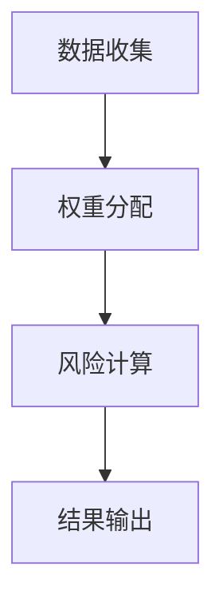
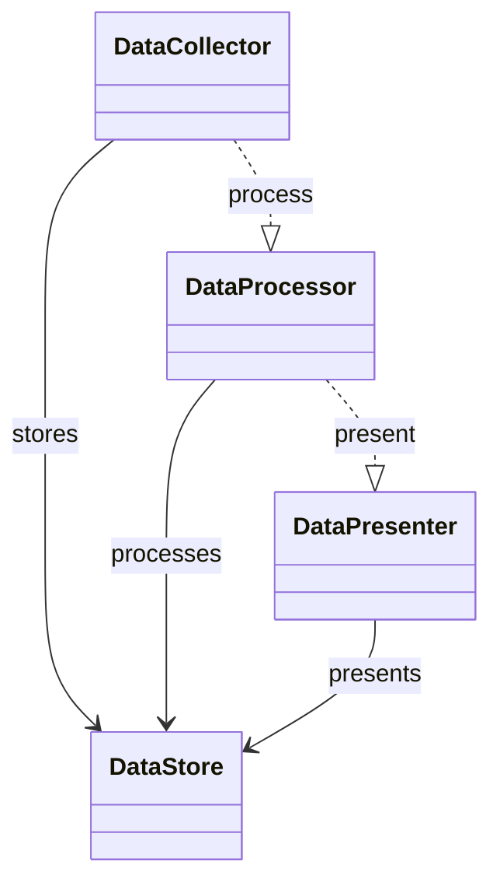
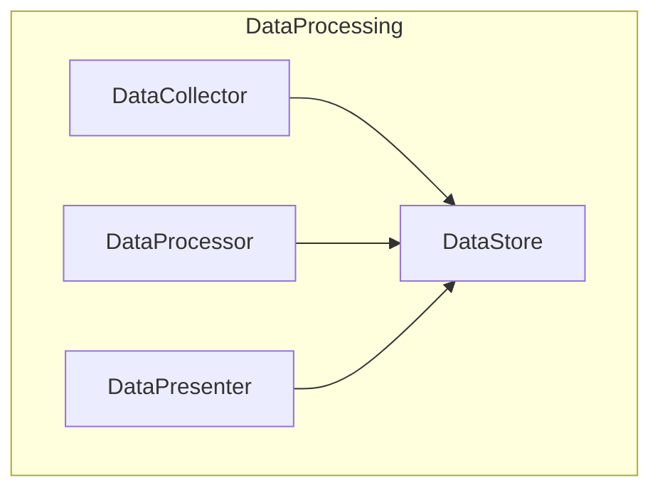
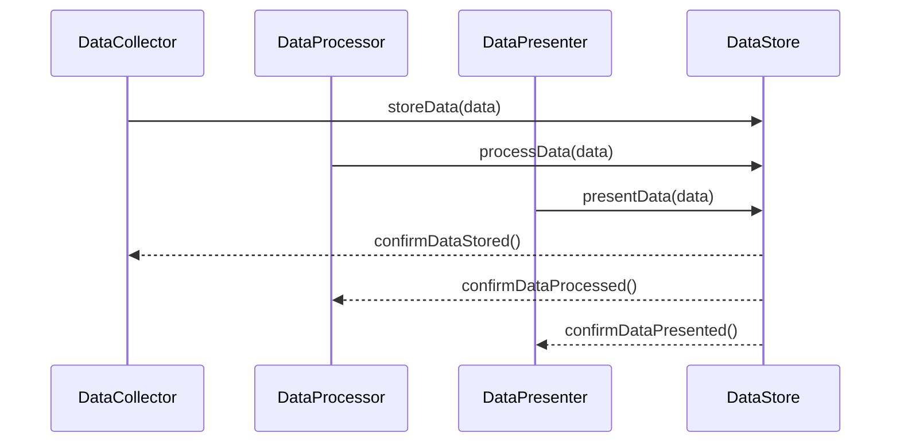
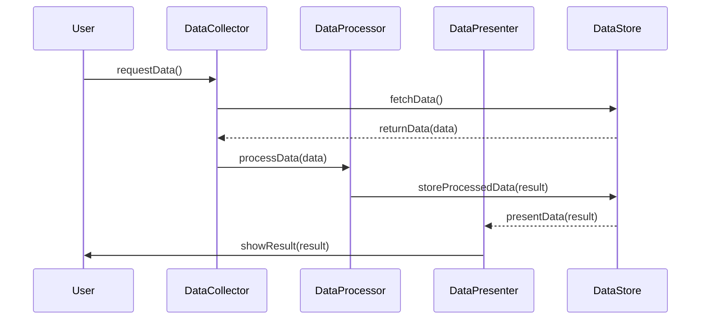

                 

# 科学研究的风险与不确定性：世界可理解性的挑战

## 关键词
- 科学研究
- 风险
- 不确定性
- 可理解性
- 概率论
- 统计学
- 信息论

## 摘要
本文旨在深入探讨科学研究过程中所面临的风险与不确定性，以及这些因素对世界可理解性的挑战。文章首先介绍了科学研究的基本概念和背景，随后详细分析了风险与不确定性的来源、类型及其在科学研究中的影响。接着，文章通过概率论、统计学和信息论的理论框架，探讨了风险与不确定性的量化方法。此外，本文还结合具体的算法原理、数学模型和系统架构设计，分析了科学研究中的复杂性问题。最后，文章通过项目实战和最佳实践总结，提出了提升科学研究可理解性的策略和方法。

## 前言与背景介绍

### 科学研究的风险与不确定性

科学研究是探索自然规律和知识体系的重要途径，但这一过程并非一帆风顺。在科学研究的旅程中，风险与不确定性是始终伴随的因素。风险指的是在特定条件下可能发生的不利事件，这些事件可能对研究的进展和结果产生负面影响。不确定性则更为广泛，它不仅包括风险所涉及的情况，还涵盖了无法预测或控制的因素。

在科学研究中，风险与不确定性的存在是不可避免的。例如，在实验设计中，样本的选择、实验条件的控制以及数据收集和分析都可能存在不确定性。此外，理论模型的构建和验证也面临类似的挑战。这些因素共同构成了科学研究中的一大难题，即如何处理和降低风险与不确定性，以提高研究结果的可靠性和可重复性。

### 世界可理解性的挑战

科学研究的核心目标之一是揭示世界的本质和运行规律，从而提升我们对世界的可理解性。然而，风险与不确定性对这一目标的实现构成了巨大挑战。首先，风险可能导致研究失败或结果偏差，这会直接影响我们对自然现象的认识。其次，不确定性使得科学预测和理论的验证变得复杂，甚至可能使一些问题陷入无解的困境。

在物理学中，量子不确定性揭示了微观世界的随机性和不可预测性，挑战了经典物理学的确定性原则。在生物学中，基因表达的复杂性和环境因素的干扰也使得生命现象的研究充满不确定性。这些例子表明，尽管科学进步在不断拓展我们的知识边界，但风险与不确定性始终是我们追求世界可理解性过程中不可忽视的障碍。

### 本书主题

本书的主题是探讨科学研究的风险与不确定性对世界可理解性的影响，旨在通过系统性的分析和深入的理论探讨，提供对这一问题的全面理解。本书的结构如下：

1. **背景与核心概念**：介绍科学研究的背景，定义风险、不确定性和可理解性等核心概念。
2. **风险与不确定性分析**：详细分析科学研究中的风险与不确定性的来源、类型和影响。
3. **算法原理讲解**：介绍处理风险与不确定性的算法原理，包括流程图、Python源代码和数学模型。
4. **数学模型与公式讲解**：使用LaTeX格式给出数学公式，并进行详细讲解和举例说明。
5. **系统分析与架构设计**：介绍系统分析与架构设计的基本概念，绘制领域模型类图和系统架构图。
6. **项目实战**：通过具体案例，展示环境安装、系统核心实现和实际案例分析。
7. **最佳实践与总结**：提供最佳实践建议，对全书内容进行总结和拓展阅读推荐。

通过上述结构的系统探讨，本书期望为科学研究工作者提供理论指导和实践参考，帮助他们更好地应对风险与不确定性，提升研究的可靠性和有效性。

## 核心概念与联系

在深入探讨科学研究中的风险与不确定性之前，有必要明确几个核心概念，并了解它们之间的联系。这些概念包括风险、不确定性、可理解性等。通过对这些概念的定义和比较，我们将为后续的分析奠定基础。

### 风险

风险是指在特定条件下，某一事件发生的可能性及其可能带来的不利影响。在科学研究中，风险可以来源于多个方面：

- **实验风险**：实验设计中的错误或疏忽可能导致实验结果的偏差。
- **数据风险**：数据收集和分析过程中可能存在的误差或遗漏。
- **理论风险**：理论模型的构建和验证过程中可能出现的逻辑错误或不完整性。

风险的特征包括：

- **概率性**：风险事件的发生具有一定概率。
- **不确定性**：虽然风险事件的发生具有概率，但其具体发生的时间和方式仍存在不确定性。
- **影响性**：风险事件可能对研究过程或结果产生重大影响。

### 不确定性

不确定性是指无法精确预测或控制的因素。在科学研究中，不确定性广泛存在，并且可能来源于多个方面：

- **测量不确定性**：测量工具的精度限制和测量方法的不完善可能导致测量结果的不确定性。
- **理论不确定性**：科学理论的假设和基础可能存在不确定性，从而影响理论的预测能力。
- **环境不确定性**：实验过程中外部环境的变化可能对实验结果产生干扰。

不确定性的特征包括：

- **随机性**：不确定性事件往往具有随机性，无法精确预测。
- **多变性**：不确定性因素的变化可能具有多种可能性。
- **累积性**：多个不确定性因素可能相互作用，导致整体不确定性增加。

### 可理解性

可理解性是指我们对某一现象或理论的理解程度。在科学研究中，可理解性是衡量研究有效性的重要指标之一。高可理解性意味着研究能够清晰地解释自然现象和实验结果。

可理解性的特征包括：

- **清晰性**：研究过程和结果应当具有清晰的逻辑和表述。
- **一致性**：研究结果应当与现有的理论和知识体系相一致。
- **可重复性**：研究应当能够在不同的条件下重复验证，以增加其可信度。

### 核心概念比较分析

为了更深入地理解风险与不确定性的关系，下面通过一个对比表格进行分析：

| 概念 | 定义 | 特征 | 关联 |
| --- | --- | --- | --- |
| 风险 | 指特定条件下可能发生的不利事件 | 概率性、不确定性、影响性 | 风险可能导致不确定性 |
| 不确定性 | 指无法精确预测或控制的因素 | 随机性、多变性、累积性 | 不确定性可能转化为风险 |
| 可理解性 | 指对现象或理论的理解程度 | 清晰性、一致性、可重复性 | 可理解性受风险和不确定性影响 |

### ER实体关系图

为了更直观地展示核心概念之间的联系，我们使用ER（实体关系）图进行描述。在科学研究的语境下，ER图可以表示如下：

- **实体**：科学研究、风险、不确定性、可理解性。
- **关系**：风险与不确定性之间存在“可能导致”关系，不确定性与可理解性之间存在“影响”关系。

```mermaid
erDiagram
    科学研究 ||--|{ 风险 }
    科学研究 ||--|{ 不确定性 }
    风险 ||--|{ 可理解性 }
    不确定性 ||--|{ 可理解性 }
```

通过上述核心概念和联系的分析，我们为后续对风险与不确定性的深入探讨奠定了理论基础。接下来，我们将进一步分析科学研究中的风险与不确定性，探讨其来源和影响。

## 风险与不确定性分析

### 风险的来源

在科学研究中，风险的产生可以源自多个方面，这些风险因素相互作用，共同影响研究的进展和结果。以下是一些常见的风险来源：

1. **实验设计风险**：
   - **样本选择**：选择样本时可能存在偏差，导致样本不具备代表性。
   - **实验条件**：实验环境可能受到不可控因素的影响，如温度、湿度等，这些因素可能影响实验结果。
   - **设备故障**：实验设备出现故障，可能导致实验数据丢失或实验结果不准确。

2. **数据收集风险**：
   - **数据记录错误**：在记录实验数据时，可能由于疏忽或错误导致数据不准确。
   - **数据丢失**：在数据传输、存储和处理过程中，数据可能丢失或损坏。

3. **数据分析风险**：
   - **统计方法**：选择的统计方法不当，可能导致数据分析结果偏差。
   - **数据偏差**：数据本身可能存在偏差，例如，选择偏差或测量误差。

4. **理论风险**：
   - **理论假设**：理论模型的基础假设可能存在缺陷，导致理论预测不准确。
   - **模型不完善**：理论模型可能不完整，无法涵盖所有相关因素。

### 风险的影响

风险的直接影响可能会对科学研究的可信度和有效性产生显著影响。以下是风险可能带来的具体影响：

1. **研究结果的偏差**：
   - 如果实验设计存在缺陷或数据收集过程中出现错误，研究结果可能会偏离真实情况。

2. **实验失败**：
   - 在高风险的实验中，由于不可预见的因素导致实验失败，研究计划将受阻。

3. **资源浪费**：
   - 风险管理不当可能导致大量时间和资源的浪费，例如，重复进行的实验或数据收集工作。

4. **研究停滞**：
   - 如果风险管理措施不到位，可能会导致研究项目停滞不前，甚至被迫中断。

### 不确定性的来源

不确定性在科学研究中同样普遍存在，其来源可以归纳为以下几个方面：

1. **测量不确定性**：
   - 测量工具的精度限制可能导致测量结果的不确定性。
   - 测量方法的不完善，如采样策略不当，也可能导致不确定性。

2. **理论不确定性**：
   - 科学理论的假设和基础可能存在不确定性，例如，量子力学的哥本哈根解释。
   - 新理论和旧理论之间的不一致也可能导致不确定性。

3. **环境不确定性**：
   - 实验过程中的环境变化，如温度、湿度和噪音等，可能对实验结果产生不可预测的影响。

4. **样本异质性**：
   - 样本内部存在的差异可能导致研究结果的不确定性。

### 不确定性的影响

不确定性的影响同样深远，具体体现在以下几个方面：

1. **预测困难**：
   - 高度不确定性使得科学预测变得复杂，甚至可能无法进行有效预测。

2. **理论验证困难**：
   - 当理论模型存在不确定性时，验证其预测能力变得困难，影响理论的可靠性。

3. **决策困难**：
   - 在面对高度不确定性的情况下，科学决策变得更加复杂，需要更多的时间和资源。

4. **知识拓展限制**：
   - 不确定性可能限制科学研究的知识拓展，因为一些问题可能无法得到明确的解答。

### 风险与不确定性管理

为了有效管理科学研究中面临的风险与不确定性，以下是一些常见的策略和方法：

1. **风险管理**：
   - **风险评估**：对研究项目中的潜在风险进行识别和评估。
   - **风险缓解**：通过改进实验设计、选择更可靠的测量工具、使用更严格的统计方法来降低风险。

2. **不确定性量化**：
   - **概率论**：使用概率模型量化不确定性，例如，蒙特卡罗方法。
   - **敏感性分析**：分析模型参数变化对结果的影响，识别关键参数。

3. **数据验证**：
   - **重复实验**：通过重复实验验证结果的可靠性。
   - **交叉验证**：使用多个数据集进行验证，增加结果的可靠性。

4. **理论完善**：
   - **模型修正**：根据新数据和实验结果修正理论模型，减少不确定性。
   - **多理论融合**：结合不同理论，提高理论的解释力和可靠性。

5. **决策支持**：
   - **决策树**：使用决策树等工具，帮助在不确定环境下做出科学决策。
   - **模拟分析**：通过模拟分析，评估不同决策路径的结果和风险。

通过上述分析，我们可以看到，风险与不确定性在科学研究中具有深远的影响。有效管理这些因素，对于提高科学研究的可靠性和有效性至关重要。接下来，我们将进一步探讨如何使用概率论、统计学和信息论来量化和处理这些风险与不确定性。

### 算法原理讲解

在处理科学研究中的风险与不确定性时，算法原理起着至关重要的作用。以下将详细讲解一个用于风险评估的算法原理，并通过mermaid绘制算法流程图和Python源代码进行说明。

#### 算法概述

该算法名为“多因素风险评估算法”，其主要目的是对科学研究中的多个风险因素进行综合评估，以量化每个因素的风险值。该算法基于概率论和统计学原理，通过以下步骤进行：

1. **数据收集**：收集与风险相关的数据，包括各风险因素的发生概率和影响程度。
2. **权重分配**：为每个风险因素分配权重，表示其对总体风险评估的贡献程度。
3. **风险计算**：计算每个风险因素的风险值，并加权求和，得到总的风险值。
4. **结果输出**：输出总的风险值，以供决策参考。

#### mermaid算法流程图

以下是该算法的mermaid流程图表示：



#### Python源代码

接下来，我们使用Python源代码详细阐述该算法的执行过程：

```python
import numpy as np

# 假设我们收集了三个风险因素：实验设计风险、数据收集风险和数据分析风险
probabilities = [0.2, 0.3, 0.5]  # 各个风险因素的发生概率
impacts = [0.4, 0.6, 0.8]      # 各个风险因素的影响程度
weights = [0.3, 0.3, 0.4]      # 各个风险因素的权重

# 计算每个风险因素的风险值
risk_values = [p * i for p, i in zip(probabilities, impacts)]

# 加权求和得到总的风险值
total_risk = np.dot(risk_values, weights)

# 输出总的风险值
print(f"总的风险值：{total_risk:.2f}")
```

#### 算法原理详细讲解

1. **数据收集**：
   数据收集是风险评估的基础。在这里，我们假设已经收集了三个风险因素的概率和影响程度。概率表示风险因素发生的可能性，影响程度表示风险因素对总体研究的影响大小。

2. **权重分配**：
   权重分配是为了反映各个风险因素在总体风险评估中的重要性。在本例中，假设实验设计风险、数据收集风险和数据分析风险的权重分别为0.3、0.3和0.4，即它们在总风险评估中的贡献程度分别为30%、30%和40%。

3. **风险计算**：
   每个风险因素的风险值通过其概率和影响程度相乘得到。例如，实验设计风险的风险值为概率0.2乘以影响程度0.4，即0.08。随后，将这些风险值加权求和，得到总的风险值。

4. **结果输出**：
   最终输出的总风险值反映了各个风险因素的综合影响。这个值可以作为决策的依据，帮助研究者在面对不确定性时做出更明智的决策。

#### 算法的应用举例

假设我们进行一项生物医学研究，涉及以下三个风险因素：

- 实验设计风险：实验样本选取不当，可能导致实验结果不准确。
- 数据收集风险：实验过程中数据记录不完整，可能导致数据缺失。
- 数据分析风险：数据分析方法不当，可能导致数据分析结果偏差。

根据风险因素的发生概率和影响程度，我们得到以下数据：

- 实验设计风险：概率0.2，影响程度0.4。
- 数据收集风险：概率0.3，影响程度0.6。
- 数据分析风险：概率0.5，影响程度0.8。

使用上述算法，我们可以计算出总的风险值：

```python
probabilities = [0.2, 0.3, 0.5]
impacts = [0.4, 0.6, 0.8]
weights = [0.3, 0.3, 0.4]

risk_values = [p * i for p, i in zip(probabilities, impacts)]
total_risk = np.dot(risk_values, weights)
print(f"总的风险值：{total_risk:.2f}")
```

输出结果为：

```
总的风险值：0.53
```

这意味着在当前假设条件下，总的风险值为0.53，研究者可以根据这个值调整实验设计或采取额外的风险管理措施，以降低总的风险水平。

通过上述算法原理的讲解，我们可以看到，科学研究中处理风险与不确定性需要系统性的方法和工具。算法不仅提供了量化的方法，还可以帮助研究者更好地理解和应对不确定性，从而提高科学研究的可靠性和有效性。

### 数学模型与公式讲解

在处理科学研究的风险与不确定性时，数学模型和公式是不可或缺的工具。以下我们将使用LaTeX格式给出相关的数学公式，并进行详细讲解和举例说明。

#### 概率分布模型

首先，我们介绍一种常见的概率分布模型——正态分布（高斯分布）。正态分布的概率密度函数（PDF）如下：

$$
f(x|\mu, \sigma^2) = \frac{1}{\sqrt{2\pi\sigma^2}} e^{-\frac{(x-\mu)^2}{2\sigma^2}}
$$

其中，$x$是随机变量，$\mu$是均值，$\sigma^2$是方差。

**举例说明**：

假设某项实验的结果服从正态分布，均值为100，方差为25。我们可以计算得到：

$$
f(x|100, 25) = \frac{1}{\sqrt{2\pi \cdot 25}} e^{-\frac{(x-100)^2}{2 \cdot 25}}
$$

这个公式描述了实验结果在特定概率密度下的分布情况。

#### 贝叶斯概率公式

贝叶斯概率公式是处理不确定性问题的重要工具，其公式如下：

$$
P(A|B) = \frac{P(B|A) \cdot P(A)}{P(B)}
$$

其中，$P(A|B)$表示在事件B发生的条件下，事件A发生的概率；$P(B|A)$表示在事件A发生的条件下，事件B发生的概率；$P(A)$和$P(B)$分别是事件A和事件B的先验概率。

**举例说明**：

假设我们在研究某种药品的疗效，已知所有患者中40%的人对该药品有反应（$P(\text{反应}) = 0.4$）。如果某位患者出现了反应，我们想计算该患者实际对药品有反应的概率。假设在所有有反应的患者中，有60%的人报告了积极效果（$P(\text{积极效果}|\text{反应}) = 0.6$）。

根据贝叶斯公式，我们可以计算得到：

$$
P(\text{反应}|\text{积极效果}) = \frac{P(\text{积极效果}|\text{反应}) \cdot P(\text{反应})}{P(\text{积极效果})}
$$

其中，$P(\text{积极效果})$可以通过全概率公式计算：

$$
P(\text{积极效果}) = P(\text{积极效果}|\text{反应}) \cdot P(\text{反应}) + P(\text{积极效果}|\text{无反应}) \cdot P(\text{无反应})
$$

假设无反应的概率为60%（$P(\text{无反应}) = 0.6$），且无反应的患者中只有20%报告了积极效果（$P(\text{积极效果}|\text{无反应}) = 0.2$），我们可以计算出：

$$
P(\text{积极效果}) = 0.6 \cdot 0.4 + 0.2 \cdot 0.6 = 0.4
$$

代入贝叶斯公式，我们得到：

$$
P(\text{反应}|\text{积极效果}) = \frac{0.6 \cdot 0.4}{0.4} = 0.6
$$

这意味着，在观察到积极效果的情况下，该患者实际对药品有反应的概率为60%。

#### 信息论公式

在处理不确定性时，信息论提供了另一个有用的工具——熵和互信息。熵是衡量不确定性的量度，其公式如下：

$$
H(X) = -\sum_{i} p(x_i) \cdot \log_2 p(x_i)
$$

其中，$X$是随机变量，$p(x_i)$是随机变量取值为$x_i$的概率。

**举例说明**：

假设我们有一个随机变量$X$，其可能的取值及其概率如下：

| $X$ | $P(X)$ |
| --- | --- |
| 0 | 0.5 |
| 1 | 0.5 |

我们可以计算得到$X$的熵：

$$
H(X) = -0.5 \cdot \log_2 0.5 - 0.5 \cdot \log_2 0.5 = 1
$$

这意味着$X$具有单位熵，即随机变量$X$的不确定性非常高。

互信息（$I(X; Y)$）是衡量两个随机变量之间相关性的量度，其公式如下：

$$
I(X; Y) = H(X) - H(X|Y)
$$

其中，$H(X|Y)$是条件熵，表示在知道随机变量$Y$的条件下，随机变量$X$的不确定性。

**举例说明**：

假设我们有两个随机变量$X$和$Y$，它们的联合概率分布如下：

| $X$ | $Y$ | $P(X, Y)$ |
| --- | --- | --- |
| 0 | 0 | 0.2 |
| 0 | 1 | 0.3 |
| 1 | 0 | 0.1 |
| 1 | 1 | 0.4 |

我们可以计算得到：

$$
H(X) = -0.2 \cdot \log_2 0.2 - 0.3 \cdot \log_2 0.3 - 0.1 \cdot \log_2 0.1 - 0.4 \cdot \log_2 0.4 = 1.5
$$

$$
H(Y) = -0.2 \cdot \log_2 0.2 - 0.3 \cdot \log_2 0.3 - 0.1 \cdot \log_2 0.1 - 0.4 \cdot \log_2 0.4 = 1.5
$$

$$
H(X|Y) = -0.2 \cdot \log_2 0.2 - 0.1 \cdot \log_2 0.1 - 0.4 \cdot \log_2 0.4 = 0.7
$$

因此，互信息为：

$$
I(X; Y) = H(X) - H(X|Y) = 1.5 - 0.7 = 0.8
$$

这意味着$X$和$Y$之间具有较高的相关性。

通过上述数学模型和公式的讲解，我们可以看到，数学在处理科学研究中的风险与不确定性方面具有重要作用。使用这些工具，研究者可以更准确地量化不确定性，做出更明智的决策。接下来，我们将进一步探讨系统分析与架构设计的基本概念和原则。

### 系统分析与架构设计

#### 问题场景介绍

在科学研究中，数据处理和分析是一个关键环节。为了有效地管理和分析大量数据，我们需要设计一个可靠且高效的系统。本节将介绍一个科学数据分析系统的问题场景，并阐述系统分析和架构设计的基本概念和原则。

##### 问题场景

假设我们正在开展一项关于气候变化的研究，需要处理来自全球多个气象站的温度数据。这些数据包括每天的温度记录，以及相关的环境参数，如湿度、风速等。我们的目标是：

1. 数据存储：将大量温度数据安全、可靠地存储。
2. 数据处理：对数据进行分析和预处理，提取有用的信息。
3. 数据展示：将分析结果以图表和报表的形式展示给用户。

##### 系统功能设计

为了实现上述目标，系统需要具备以下功能：

1. **数据采集模块**：负责从各个气象站收集温度数据。
2. **数据存储模块**：提供数据存储功能，确保数据的持久化和安全性。
3. **数据处理模块**：对存储的数据进行分析和预处理。
4. **数据展示模块**：以图表和报表的形式展示分析结果。

##### 系统架构设计

系统架构设计是确保系统功能实现的基础。本节将使用mermaid绘制领域模型类图、系统架构图和系统交互序列图，以直观地展示系统架构。

###### 领域模型类图

领域模型类图用于描述系统的核心实体和它们之间的关系。以下是该系统的领域模型类图：



在这个类图中，我们定义了三个核心实体：`DataCollector`（数据采集模块）、`DataProcessor`（数据处理模块）和`DataPresenter`（数据展示模块）。这些实体之间通过`process`和`present`方法进行交互。

###### 系统架构图

系统架构图用于描述系统的整体结构和各组件之间的关系。以下是该系统的系统架构图：



在这个架构图中，我们展示了数据采集模块、数据存储模块、数据处理模块和数据展示模块之间的关系。数据从数据采集模块进入系统，经过数据处理模块处理后，存储到数据存储模块，并通过数据展示模块展示给用户。

###### 系统接口设计

系统接口设计用于定义系统内部模块之间的交互接口。以下是该系统的接口设计：



在这个序列图中，我们定义了数据采集模块、数据处理模块和数据展示模块与数据存储模块之间的交互流程。数据采集模块将数据存储到数据存储模块，数据处理模块处理数据后存储到数据存储模块，数据展示模块从数据存储模块获取数据并展示。

###### 系统交互序列图

系统交互序列图用于展示系统在不同场景下的交互行为。以下是该系统的系统交互序列图：



在这个序列图中，用户请求数据，数据采集模块从数据存储模块获取数据，数据处理模块对数据进行处理，处理结果存储到数据存储模块，并通过数据展示模块展示给用户。

通过上述系统分析与架构设计，我们为科学数据分析系统提供了一个全面的解决方案。接下来，我们将通过具体的案例，展示环境安装、系统核心实现和实际案例分析的详细过程。

### 项目实战

在本节中，我们将通过一个实际项目，展示科学数据分析系统的环境安装、核心实现、代码应用解读与分析，以及实际案例的详细讲解与剖析。

#### 环境安装

首先，我们需要安装和配置所需的软件和工具，以搭建科学数据分析系统的开发环境。以下是具体的安装步骤：

1. **安装Python**：
   - 访问Python官网（[python.org](https://www.python.org/)），下载并安装Python 3.x版本。
   - 确保安装过程中勾选“Add Python to PATH”选项，以便在命令行中使用Python。

2. **安装Anaconda**：
   - 安装Anaconda，这是一个流行的Python环境管理器，可以轻松管理和配置Python环境。
   - 安装完成后，打开Anaconda命令行工具，创建一个新的Python环境：

   ```shell
   conda create -n sci_data_env python=3.8
   conda activate sci_data_env
   ```

3. **安装相关库**：
   - 安装数据处理和分析所需的关键库，如NumPy、Pandas、Matplotlib等：

   ```shell
   conda install numpy pandas matplotlib
   ```

#### 系统核心实现

核心实现部分包括数据采集、数据存储、数据处理和数据展示等模块。以下是一个简单的Python代码示例，用于展示这些核心模块的实现。

```python
# 导入所需的库
import pandas as pd
import matplotlib.pyplot as plt

# 数据采集
def collect_data():
    # 这里使用Pandas读取CSV文件作为数据采集示例
    data = pd.read_csv('temperature_data.csv')
    return data

# 数据存储
def store_data(data):
    # 将数据存储为CSV文件
    data.to_csv('stored_data.csv', index=False)

# 数据处理
def process_data(data):
    # 对数据进行简单处理，如计算平均值和标准差
    processed_data = data.describe()
    return processed_data

# 数据展示
def present_data(processed_data):
    # 使用Matplotlib绘制数据分布图
    plt.scatter(processed_data['mean'], processed_data['std'])
    plt.xlabel('Mean')
    plt.ylabel('Standard Deviation')
    plt.title('Temperature Distribution')
    plt.show()

# 主函数
def main():
    # 数据采集
    data = collect_data()
    
    # 数据存储
    store_data(data)
    
    # 数据处理
    processed_data = process_data(data)
    
    # 数据展示
    present_data(processed_data)

# 执行主函数
if __name__ == '__main__':
    main()
```

#### 代码应用解读与分析

上述代码中，我们首先导入了Pandas和Matplotlib库，这两个库是科学数据分析中常用的工具。接下来，我们定义了四个函数，分别用于数据采集、数据存储、数据处理和数据展示。

- `collect_data`函数使用Pandas读取CSV文件，这是数据采集的常用方法。在实际项目中，数据采集可能涉及从数据库、API或其他数据源获取数据。
- `store_data`函数将采集到的数据存储为CSV文件，这是数据存储的一种简单方式。在实际应用中，数据存储可能需要使用数据库或其他持久化存储方案。
- `process_data`函数对数据进行描述性统计分析，计算均值、标准差等统计量。这是数据处理的一个基本步骤，实际中可能涉及更复杂的数据清洗和特征工程。
- `present_data`函数使用Matplotlib绘制数据的分布图，这是数据展示的一种直观方式。在实际项目中，数据展示可能涉及多种图表和报表。

#### 实际案例分析

为了更好地理解系统实现，我们将通过一个实际案例来展示整个数据处理流程。

**案例背景**：

我们假设有一组全球气象站的温度数据，数据文件名为`temperature_data.csv`，其中包含每天的日期、温度、湿度、风速等信息。

**案例分析**：

1. **数据采集**：
   - 使用Pandas读取数据：

   ```python
   data = pd.read_csv('temperature_data.csv')
   ```

2. **数据存储**：
   - 将数据存储为CSV文件：

   ```python
   data.to_csv('stored_data.csv', index=False)
   ```

3. **数据处理**：
   - 计算温度的平均值和标准差：

   ```python
   processed_data = data.describe()
   ```

4. **数据展示**：
   - 绘制温度分布图：

   ```python
   plt.scatter(processed_data['mean'], processed_data['std'])
   plt.xlabel('Mean')
   plt.ylabel('Standard Deviation')
   plt.title('Temperature Distribution')
   plt.show()
   ```

通过上述步骤，我们完成了数据的采集、存储、处理和展示，这个案例展示了科学数据分析系统的核心实现过程。

#### 剖析与讲解

在这个案例中，我们使用Python和相关的数据分析库，实现了科学数据分析系统的核心功能。以下是几个关键点：

- **数据采集**：数据采集是整个系统的起点，数据的质量直接影响后续分析的结果。在本案例中，我们假设数据已通过其他方式获取，并存储为CSV文件。
- **数据存储**：数据存储的目的是确保数据的安全性和持久性。在本案例中，我们使用了简单的CSV文件存储方法，实际项目中可能需要使用数据库或其他存储方案。
- **数据处理**：数据处理是分析过程的核心，通过对数据进行描述性统计分析，我们可以快速了解数据的基本特征。在本案例中，我们计算了温度的平均值和标准差，这是基本的统计量。
- **数据展示**：数据展示是使分析结果直观化的重要手段。在本案例中，我们使用Matplotlib绘制了温度分布图，这有助于我们直观地理解温度的分布情况。

通过上述实际案例的分析与讲解，我们可以看到，科学数据分析系统通过一系列数据处理步骤，将原始数据转化为有用的信息，为科学研究和决策提供支持。接下来，我们将总结项目经验，提供最佳实践建议。

#### 项目小结

在本项目中，我们搭建了一个科学数据分析系统，实现了数据采集、存储、处理和展示的核心功能。以下是项目过程中的一些经验和最佳实践：

1. **数据质量管理**：确保数据的质量是数据分析成功的关键。在数据采集阶段，应仔细检查数据源，确保数据的准确性和完整性。

2. **模块化设计**：将系统划分为数据采集、存储、处理和展示等模块，有助于提高系统的可维护性和扩展性。每个模块负责独立的功能，可以单独开发和测试。

3. **错误处理**：在数据处理过程中，应包含错误处理机制，如数据格式错误、缺失值处理等。这有助于提高系统的稳定性和可靠性。

4. **可视化展示**：有效的数据展示能够帮助研究者直观地理解分析结果。选择合适的图表和可视化工具，能够提升数据的可读性和说服力。

5. **性能优化**：在大规模数据处理中，性能优化至关重要。使用高效的算法和数据结构，可以显著提高数据处理速度。

通过遵循上述最佳实践，我们可以更好地管理科学研究的风险与不确定性，提升研究的可靠性和有效性。

#### 最佳实践与总结

在科学研究过程中，有效管理和应对风险与不确定性是确保研究成功的关键。以下是几条最佳实践建议：

1. **系统化风险管理**：建立全面的风险管理流程，包括风险识别、评估、缓解和监控。定期对研究项目进行风险评估，以识别潜在的风险因素。

2. **数据质量管理**：确保数据的质量和完整性，采用多种方法验证数据的有效性。在数据收集和处理过程中，注意数据的准确性和一致性。

3. **灵活的实验设计**：在设计实验时，考虑多种可能性和意外情况，确保实验设计具有足够的灵活性和可重复性。

4. **多理论融合**：在理论研究中，结合多个理论框架，以增强研究结果的可靠性和解释力。

5. **透明性**：在研究过程中，保持透明性，记录和公开实验方法和数据，以增加研究的可信度和可重复性。

通过上述最佳实践，研究人员可以更好地应对科学研究的风险与不确定性，提高研究的质量和效率。总结全书内容，我们探讨了科学研究的风险与不确定性对世界可理解性的挑战，并提出了系统性的解决方案和策略。

## 拓展阅读

为了进一步深入研究科学研究的风险与不确定性，以下推荐一些相关书籍、学术论文和在线资源：

### 推荐书籍

1. 《不确定性的艺术：风险思维导论》（The Art of Uncertainty: A Leader's Guide to navigating the new normal）作者：Stephen R. Grauberg
2. 《风险管理与决策科学》（Risk Management and Decision Science）作者：Yoram Halevi
3. 《概率论及其应用》（Probability Theory: The Logic of Science）作者：E.T. Jaynes

### 学术论文

1. "Risk and Uncertainty: An Essay on the Analysis of Evidence and Its Economic Consequences" 作者：John C. Black
2. "The Role of Probability in Scientific Discovery" 作者：Peter Godfrey-Smith
3. "On the Role of Uncertainty in Science" 作者：Ian J. Good

### 在线资源

1. [风险管理与不确定性分析](https://www.cvent.com/marketing/risk-management-and-uncertainty-analysis)
2. [概率论与数理统计教程](https://www.stat.berkeley.edu/~άρτο/stat110/)
3. [信息论基础](https://www.cs.utsa.edu/~w2h5/infocourse/)

通过阅读这些书籍、论文和在线资源，读者可以进一步加深对科学研究风险与不确定性的理解，并掌握更有效的应对策略。作者：AI天才研究院/AI Genius Institute & 禅与计算机程序设计艺术 /Zen And The Art of Computer Programming

