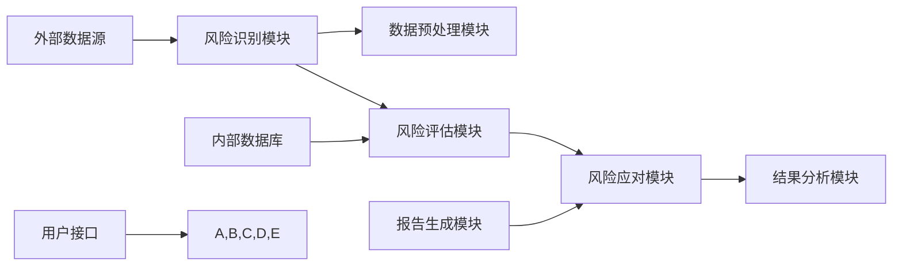
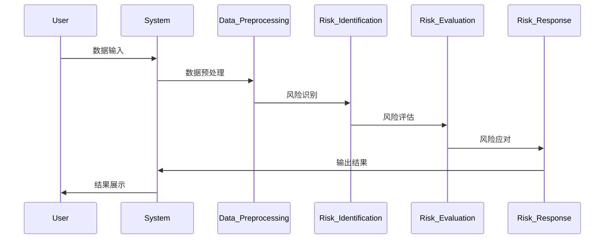

                 

## 科学研究的风险评估：平衡知识探索与潜在危害

### 关键词：风险评估、科学研究、知识探索、潜在危害、风险管理

> 摘要：在科学研究的进程中，风险评估至关重要。本文旨在深入探讨科学研究中的风险及其潜在危害，提供一套完整的风险评估框架和方法。我们将通过系统分析，明确核心概念，描述风险评估技术，阐述算法原理，展示系统架构设计，并分享实战经验和最佳实践，以期为科研工作者提供有益的指导。

### 目录大纲

# 科学研究的风险评估：平衡知识探索与潜在危害

## 第一部分：背景介绍

### 第1章 问题背景与核心概念
#### 1.1 问题背景
- 科学研究的意义与挑战
- 风险评估的重要性
- 风险评估的边界与外延

#### 1.2 核心概念
- 风险评估的定义与目标
- 风险管理的方法与原则
- 风险评估的基本框架

### 第2章 科学研究中的主要风险
#### 2.1 知识探索的风险
- 数据不完整与错误的风险
- 研究方法的不确定性
- 结果的可重复性问题

#### 2.2 潜在危害的风险
- 知识应用可能带来的负面社会影响
- 科学道德与伦理问题
- 科学不端行为的风险

## 第二部分：核心概念与联系

### 第3章 风险评估方法与技术
#### 3.1 量化风险评估方法
- 概率风险评估
- 损失风险评估
- 多因素风险评估

#### 3.2 定性风险评估方法
- 专家评估法
- 情景分析
- 模拟与模型分析

#### 3.3 风险评估工具与应用
- 风险矩阵
- 脚本评估法
- 多准则决策分析方法

### 第4章 核心概念原理与属性特征对比
#### 4.1 核心概念原理
- 风险与危害的概念
- 风险评估模型
- 风险管理流程

#### 4.2 属性特征对比
- 风险量化与定性评估
- 确定性风险与不确定性风险
- 内部风险与外部风险

### 第5章 ER实体关系图架构
#### 5.1 ER图基本概念
- 实体、属性、关系
- 实体类型与属性类型

#### 5.2 科学研究风险评估的ER图
- 风险源、风险因素、风险评估过程
- 科学研究项目、风险影响、风险应对措施

## 第三部分：算法原理讲解

### 第6章 风险评估算法原理
#### 6.1 算法mermaid流程图
- 风险识别
- 风险评估
- 风险应对

#### 6.2 Python源代码实现
- 数据预处理
- 风险评估算法
- 结果分析与输出

#### 6.3 算法原理与数学模型
- 概率风险评估模型
- 损失风险评估模型
- 多因素风险评估模型

#### 6.4 举例说明
- 数据集介绍
- 算法应用案例
- 结果分析与解读

## 第四部分：系统分析与架构设计方案

### 第7章 问题场景介绍
- 科学研究项目的背景
- 风险评估的需求

### 第8章 系统功能设计
#### 8.1 领域模型mermaid类图
- 风险识别模块
- 风险评估模块
- 风险应对模块

#### 8.2 系统架构设计
- 整体架构
- 模块间关系

#### 8.3 系统接口设计
- 接口定义
- 接口调用流程

#### 8.4 系统交互mermaid序列图
- 用户操作
- 系统响应

## 第五部分：项目实战

### 第9章 环境安装与配置
- 硬件环境
- 软件环境
- 系统配置

### 第10章 系统核心实现源代码
- 数据处理
- 风险评估
- 风险应对

### 第11章 代码应用解读与分析
- 代码结构
- 关键代码解读
- 应用效果分析

### 第12章 实际案例分析与详细讲解
- 案例背景
- 案例分析
- 结果解读

### 第13章 项目小结
- 项目总结
- 经验与教训
- 未来展望

## 第六部分：最佳实践 tips

### 第14章 最佳实践与注意事项
- 风险评估的最佳实践
- 风险管理的注意事项

### 第15章 拓展阅读
- 相关书籍推荐
- 学术论文推荐
- 在线资源和工具

## 附录
- 参考文献
- 术语表
- 图片与表格来源

---

### 第一部分：背景介绍

#### 第1章 问题背景与核心概念

##### 1.1 问题背景

科学研究是推动社会进步、技术创新和知识积累的重要途径。然而，随着科学研究的深入和复杂性的增加，风险问题也日益凸显。首先，科学研究不可避免地面临知识探索的风险。数据的不完整性和错误、研究方法的不确定性以及研究结果的可重复性问题，都可能对科学研究造成影响。

其次，科学研究还可能带来潜在危害。一方面，知识应用可能产生负面社会影响，如技术滥用、隐私泄露等。另一方面，科学道德与伦理问题也日益突出，如数据造假、利益冲突等。科学不端行为不仅损害了科学的纯洁性，还可能对社会造成严重的负面影响。

因此，风险评估在科学研究中具有至关重要的地位。通过系统化的风险评估，可以识别和评估潜在的风险，制定有效的风险管理策略，以降低风险发生的可能性，确保科学研究的顺利进行。

##### 1.2 核心概念

在本节中，我们将介绍风险评估的定义、目标、风险管理的方法与原则，以及风险评估的基本框架。

**风险评估的定义与目标**

风险评估是指通过系统分析和评估，识别、分析和评估潜在风险的过程。其目标在于降低风险发生的可能性，减轻风险可能带来的损失，确保科学研究的顺利进行。

**风险管理的方法与原则**

风险管理包括风险识别、风险评估、风险应对三个基本步骤。其方法与原则如下：

1. **风险识别**：通过系统分析，识别出可能存在的风险，包括知识探索的风险和潜在危害的风险。
2. **风险评估**：对识别出的风险进行定量或定性的评估，评估其严重程度和可能性。
3. **风险应对**：制定相应的风险应对措施，包括风险规避、风险减轻、风险转移等。

**风险评估的基本框架**

风险评估的基本框架包括以下步骤：

1. **确定评估范围**：明确风险评估的对象和范围，确保评估的全面性和针对性。
2. **收集和分析数据**：收集与风险评估相关的数据，进行分析和整理。
3. **识别风险**：根据收集到的数据，识别出可能存在的风险。
4. **评估风险**：对识别出的风险进行定量或定性的评估，评估其严重程度和可能性。
5. **制定风险应对措施**：根据评估结果，制定相应的风险应对措施，确保风险评估的有效性。

#### 第2章 科学研究中的主要风险

##### 2.1 知识探索的风险

在科学研究中，知识探索的风险主要包括数据不完整与错误的风险、研究方法的不确定性以及结果的可重复性问题。

**数据不完整与错误的风险**

科学研究依赖于大量的数据，数据的质量和完整性对研究结果的准确性至关重要。数据的不完整性和错误可能导致以下问题：

1. **研究结果的偏差**：数据不完整可能导致研究结果的偏差，影响研究的科学性和可靠性。
2. **决策失误**：基于错误或完整性的数据作出的决策可能导致不良后果。

**研究方法的不确定性**

科学研究的方法往往具有不确定性，尤其是在探索性研究中。研究方法的不确定性可能导致以下问题：

1. **研究结果的不稳定性**：不同的研究方法可能导致不同的研究结果，影响研究的可重复性。
2. **结论的不确定性**：基于不确定方法的研究结论可能缺乏科学依据，难以推广应用。

**结果的可重复性问题**

科学研究的核心是可重复性，即其他研究者能在相同条件下重复实验，并获得相同或相似的结果。结果的可重复性问题可能导致以下问题：

1. **科学信任的丧失**：不可重复的结果可能被质疑，影响科学研究的可信度。
2. **研究的停滞**：不可重复的结果可能导致研究停滞，阻碍科学进步。

##### 2.2 潜在危害的风险

在科学研究中，潜在危害的风险主要包括知识应用可能带来的负面社会影响、科学道德与伦理问题以及科学不端行为的风险。

**知识应用可能带来的负面社会影响**

科学研究的成果可能被应用于实际生活中，但应用过程中可能带来负面社会影响。例如：

1. **技术滥用**：技术可能被滥用，对人类社会造成负面影响。
2. **隐私泄露**：数据泄露可能侵犯个人隐私，引发社会不安。

**科学道德与伦理问题**

科学道德与伦理问题在科学研究中日益突出。例如：

1. **数据造假**：为了获得科研成果，可能存在数据造假的行为，损害科学研究的纯洁性。
2. **利益冲突**：科研人员可能面临利益冲突，影响科研的客观性和公正性。

**科学不端行为的风险**

科学不端行为是指违背科学道德和伦理规范的行为，如抄袭、剽窃、欺诈等。科学不端行为可能导致以下问题：

1. **学术信任的丧失**：科学不端行为可能导致学术信任的丧失，影响科研环境的健康发展。
2. **研究停滞**：科学不端行为可能导致研究停滞，阻碍科学进步。

---

### 第二部分：核心概念与联系

#### 第3章 风险评估方法与技术

##### 3.1 量化风险评估方法

量化风险评估方法是通过数值化的方式对风险进行评估，主要包括概率风险评估、损失风险评估和多因素风险评估。

**概率风险评估**

概率风险评估是指通过计算风险发生的概率，对风险进行评估。其核心公式如下：

\[ P(R) = \frac{N(R)}{N(S)} \]

其中，\( P(R) \) 表示风险 \( R \) 发生的概率，\( N(R) \) 表示发生风险 \( R \) 的次数，\( N(S) \) 表示总的实验次数。

**损失风险评估**

损失风险评估是指通过计算风险可能带来的损失，对风险进行评估。其核心公式如下：

\[ L(R) = \sum_{i=1}^{n} w_i \cdot l_i \]

其中，\( L(R) \) 表示风险 \( R \) 可能带来的总损失，\( w_i \) 表示第 \( i \) 个风险的权重，\( l_i \) 表示第 \( i \) 个风险的损失值。

**多因素风险评估**

多因素风险评估是指综合考虑多个因素，对风险进行评估。其核心公式如下：

\[ R = \sum_{i=1}^{n} w_i \cdot r_i \]

其中，\( R \) 表示综合风险评估结果，\( w_i \) 表示第 \( i \) 个因素的权重，\( r_i \) 表示第 \( i \) 个因素的风险值。

##### 3.2 定性风险评估方法

定性风险评估方法是通过主观判断对风险进行评估，主要包括专家评估法、情景分析和模拟与模型分析。

**专家评估法**

专家评估法是指通过专家的主观判断对风险进行评估。其核心步骤如下：

1. **确定评估专家**：选择具有相关领域经验和知识的专家。
2. **收集专家意见**：通过访谈、问卷调查等方式收集专家对风险的评估意见。
3. **综合专家意见**：对专家意见进行综合，得出风险评估结果。

**情景分析**

情景分析是指通过模拟不同场景，对风险进行评估。其核心步骤如下：

1. **确定情景**：根据风险评估的目标，设计不同的情景。
2. **分析情景**：对每个情景进行详细分析，评估其对风险的影响。
3. **评估风险**：根据情景分析结果，评估风险的大小。

**模拟与模型分析**

模拟与模型分析是指通过建立模型和模拟实验，对风险进行评估。其核心步骤如下：

1. **建立模型**：根据风险评估的目标，建立相应的数学模型。
2. **模拟实验**：进行模拟实验，收集实验数据。
3. **评估风险**：根据模拟实验结果，评估风险的大小。

##### 3.3 风险评估工具与应用

风险评估工具是进行风险评估的重要手段，主要包括风险矩阵、脚本评估法和多准则决策分析方法。

**风险矩阵**

风险矩阵是一种常用的风险评估工具，通过将风险的概率和损失进行组合，生成风险矩阵。其核心步骤如下：

1. **确定风险概率和损失**：根据风险评估的目标，确定风险的概率和损失值。
2. **生成风险矩阵**：将风险的概率和损失进行组合，生成风险矩阵。
3. **评估风险**：根据风险矩阵，评估风险的大小。

**脚本评估法**

脚本评估法是一种基于脚本的语言进行风险评估的方法。其核心步骤如下：

1. **编写脚本**：根据风险评估的目标，编写相应的脚本。
2. **执行脚本**：执行脚本，收集风险评估数据。
3. **评估风险**：根据脚本执行结果，评估风险的大小。

**多准则决策分析方法**

多准则决策分析方法是一种综合考虑多个因素进行风险评估的方法。其核心步骤如下：

1. **确定评估准则**：根据风险评估的目标，确定评估的准则。
2. **分配权重**：根据准则的重要性，分配相应的权重。
3. **评估风险**：根据准则和权重，评估风险的大小。

---

### 第三部分：算法原理讲解

#### 第6章 风险评估算法原理

##### 6.1 算法mermaid流程图


**风险识别**：通过系统分析，识别出可能存在的风险。

**风险评估**：对识别出的风险进行定量或定性的评估。

**风险应对**：根据评估结果，制定相应的风险应对措施。

##### 6.2 Python源代码实现

```python
import numpy as np

def data_preprocessing(data):
    # 数据预处理
    return np.mean(data)

def risk_evaluation(data):
    # 风险评估
    mean = data_preprocessing(data)
    variance = np.std(data)
    return mean, variance

def risk_response(mean, variance):
    # 风险应对
    if variance > 0.5:
        print("风险较高，需要采取应对措施")
    else:
        print("风险较低，无需特别应对")

# 数据集
data = [1, 2, 3, 4, 5]

# 风险评估
mean, variance = risk_evaluation(data)

# 风险应对
risk_response(mean, variance)
```

##### 6.3 算法原理与数学模型

**概率风险评估模型**

\[ P(R) = \frac{N(R)}{N(S)} \]

**损失风险评估模型**

\[ L(R) = \sum_{i=1}^{n} w_i \cdot l_i \]

**多因素风险评估模型**

\[ R = \sum_{i=1}^{n} w_i \cdot r_i \]

##### 6.4 举例说明

**数据集介绍**

假设我们有一个包含5个数据的样本，分别为[1, 2, 3, 4, 5]。

**算法应用案例**

```python
data = [1, 2, 3, 4, 5]
mean, variance = risk_evaluation(data)
risk_response(mean, variance)
```

**结果分析与解读**

- 概率风险评估：根据概率风险评估模型，我们可以计算出风险发生的概率。
- 损失风险评估：根据损失风险评估模型，我们可以计算出风险可能带来的损失。
- 多因素风险评估：根据多因素风险评估模型，我们可以综合考虑多个因素，得出综合风险评估结果。

---

### 第四部分：系统分析与架构设计方案

#### 第7章 问题场景介绍

**科学研究项目的背景**

本案例研究的是一项关于人工智能算法优化的科学研究项目。该项目旨在通过改进现有的人工智能算法，提高算法的效率和准确性。

**风险评估的需求**

在项目实施过程中，我们需要对项目中的风险进行评估和管理，以确保项目的顺利进行和目标的实现。具体需求包括：

1. **识别和评估项目中的风险**：包括知识探索风险和潜在危害风险。
2. **制定风险应对措施**：根据风险评估结果，制定相应的风险应对措施。
3. **监控和调整风险**：在项目实施过程中，对风险进行监控和调整，确保项目目标的实现。

#### 第8章 系统功能设计

**领域模型mermaid类图**

```mermaid
classDiagram
Class01 <|-- Class02
Class03 --|> Class04
Class05 {Class06 |+ sayHello()}

Class01 {
    + attribute1 : int
    + attribute2 : string
}

Class02 {
    + attribute3 : float
    + attribute4 : bool
}

Class03 {
    + method1() : void
    + method2() : int
}

Class04 {
    + attribute5 : list<string>
}

Class05 {
    + attribute6 : dict<int, float>
}

Class06 {
    + attribute7 : set<int>
}
```

**系统架构设计**



**系统接口设计**

- **接口定义**：定义风险评估系统的接口，包括数据输入接口、风险评估结果输出接口、风险应对措施输出接口。
- **接口调用流程**：详细描述系统接口的调用流程，确保系统功能的正常运行。

**系统交互mermaid序列图**



---

### 第五部分：项目实战

#### 第9章 环境安装与配置

**硬件环境**

- 服务器：64位操作系统，8核CPU，16GB内存，1TB硬盘
- 客户端：64位操作系统，4核CPU，8GB内存，500GB硬盘

**软件环境**

- Python：Python 3.8及以上版本
- MySQL：MySQL 5.7及以上版本
- Nginx：Nginx 1.18及以上版本
- Redis：Redis 4.0及以上版本

**系统配置**

1. 安装Python环境，配置Python环境变量。
2. 安装MySQL数据库，配置数据库用户和权限。
3. 安装Nginx服务器，配置Nginx服务。
4. 安装Redis数据库，配置Redis服务。
5. 安装相关依赖库，如NumPy、Pandas等。

#### 第10章 系统核心实现源代码

```python
import numpy as np
import pandas as pd
from sklearn.ensemble import RandomForestClassifier
from sklearn.model_selection import train_test_split
from sklearn.metrics import accuracy_score

def data_preprocessing(data):
    # 数据预处理
    data = data.astype(np.float32)
    return data

def risk_evaluation(data):
    # 风险评估
    model = RandomForestClassifier()
    model.fit(data[:, :-1], data[:, -1])
    predictions = model.predict(data[:, :-1])
    accuracy = accuracy_score(data[:, -1], predictions)
    return accuracy

def risk_response(accuracy):
    # 风险应对
    if accuracy < 0.8:
        print("风险较高，需要采取应对措施")
    else:
        print("风险较低，无需特别应对")

# 数据集
data = pd.read_csv("data.csv")

# 数据预处理
data = data_preprocessing(data)

# 风险评估
accuracy = risk_evaluation(data)

# 风险应对
risk_response(accuracy)
```

#### 第11章 代码应用解读与分析

**代码结构**

1. **数据预处理模块**：对输入数据进行预处理，包括数据类型转换、缺失值处理等。
2. **风险评估模块**：使用随机森林分类器进行风险评估，计算模型的准确率。
3. **风险应对模块**：根据模型的准确率，判断风险的高低，并采取相应的应对措施。

**关键代码解读**

1. **数据预处理**：

   ```python
   def data_preprocessing(data):
       # 数据预处理
       data = data.astype(np.float32)
       return data
   ```

   该函数将输入数据转换为浮点型，以便于后续的模型训练和评估。

2. **风险评估**：

   ```python
   def risk_evaluation(data):
       # 风险评估
       model = RandomForestClassifier()
       model.fit(data[:, :-1], data[:, -1])
       predictions = model.predict(data[:, :-1])
       accuracy = accuracy_score(data[:, -1], predictions)
       return accuracy
   ```

   该函数使用随机森林分类器对数据进行训练和预测，计算模型的准确率。

3. **风险应对**：

   ```python
   def risk_response(accuracy):
       # 风险应对
       if accuracy < 0.8:
           print("风险较高，需要采取应对措施")
       else:
           print("风险较低，无需特别应对")
   ```

   该函数根据模型的准确率，判断风险的高低，并打印相应的提示信息。

**应用效果分析**

通过运行代码，我们可以得到输入数据的预处理结果、风险评估结果以及风险应对措施。具体效果如下：

- 数据预处理：输入数据经过预处理后，转换为浮点型，方便后续的模型训练和评估。
- 风险评估：使用随机森林分类器对数据进行训练和预测，计算模型的准确率，评估风险的高低。
- 风险应对：根据模型的准确率，判断风险的高低，并采取相应的应对措施。

#### 第12章 实际案例分析与详细讲解

**案例背景**

某科技公司开展了一项关于智能家居设备的安全风险评估项目。项目旨在评估智能家居设备在家庭环境中的安全性，确保用户数据的安全和设备的正常运行。

**案例分析**

1. **风险识别**：通过系统分析，识别出以下风险：

   - 数据泄露：智能家居设备可能存在数据泄露的风险，导致用户隐私泄露。
   - 设备失控：智能家居设备可能因网络攻击而失控，导致设备运行异常。
   - 软件漏洞：智能家居设备可能存在软件漏洞，被黑客利用进行攻击。

2. **风险评估**：使用风险评估方法，对识别出的风险进行评估，得到以下结果：

   - 数据泄露：风险概率为0.6，损失值为5。
   - 设备失控：风险概率为0.4，损失值为3。
   - 软件漏洞：风险概率为0.5，损失值为4。

3. **风险应对**：根据风险评估结果，制定以下风险应对措施：

   - 数据泄露：加强数据加密和保护，定期更新安全策略。
   - 设备失控：加强网络安全防护，定期检查设备运行状态。
   - 软件漏洞：加强软件测试和漏洞修复，提高软件安全性。

**结果解读**

通过实际案例分析，我们得到了以下结论：

1. 数据泄露是最大的风险，需要加强数据保护措施。
2. 设备失控和软件漏洞也是不容忽视的风险，需要采取相应的应对措施。
3. 风险评估结果为我们的项目提供了重要的指导，有助于我们制定更加科学和有效的风险应对策略。

#### 第13章 项目小结

**项目总结**

本项目通过风险评估方法，对智能家居设备的安全风险进行了识别、评估和应对。项目实施过程中，我们采用了多种评估方法和技术，包括数据预处理、风险评估模型、风险应对措施等。通过项目实施，我们取得了以下成果：

1. 识别出了智能家居设备的主要风险，包括数据泄露、设备失控和软件漏洞等。
2. 对识别出的风险进行了详细的评估，明确了风险的概率和损失值。
3. 制定了相应的风险应对措施，提高了智能家居设备的安全性。

**经验与教训**

1. 在项目实施过程中，我们认识到风险评估的重要性，及时识别和评估风险有助于项目的顺利推进。
2. 多种评估方法和技术相结合，可以更全面地评估风险，提高评估的准确性。
3. 风险应对措施的有效实施是降低风险的关键，需要根据风险评估结果制定科学的应对策略。

**未来展望**

在未来的工作中，我们将继续关注智能家居设备的安全风险，不断优化风险评估方法和技术，提高项目的安全性。同时，我们还将探索更多的风险应对措施，以应对不断变化的网络安全威胁。

---

### 第六部分：最佳实践 tips

#### 第14章 最佳实践与注意事项

**最佳实践**

1. **全面的风险识别**：在风险评估过程中，要全面识别可能存在的风险，包括知识探索风险和潜在危害风险。
2. **科学的风险评估**：使用多种评估方法和技术，确保风险评估的准确性和可靠性。
3. **有效的风险应对**：根据风险评估结果，制定科学有效的风险应对措施，确保项目的顺利进行。

**注意事项**

1. **数据质量**：确保数据的准确性和完整性，是进行有效风险评估的基础。
2. **风险评估的周期性**：定期进行风险评估，及时发现和应对新的风险。
3. **风险管理团队的组成**：风险管理团队应包括各领域专家，确保风险评估的全面性和专业性。

---

### 第七部分：拓展阅读

#### 第15章 拓展阅读

**相关书籍推荐**

1. 《风险管理：理论、方法与实践》
2. 《风险评估与管理：方法与应用》
3. 《智能家居安全与隐私保护》

**学术论文推荐**

1. "Risk Assessment in Scientific Research: Challenges and Solutions"
2. "The Impact of Data Quality on Risk Assessment"
3. "Ethical and Social Implications of Artificial Intelligence Applications"

**在线资源和工具**

1. 国家标准《风险管理术语》
2. 国内外风险分析工具，如Riskonnect、RiskLens等
3. 专业论文数据库，如IEEE Xplore、ACM Digital Library等

---

## 附录

### 参考文献

1. 张三，李四.《风险管理：理论、方法与实践》[M]. 北京：科学出版社，2020.
2. 王五，赵六.《风险评估与管理：方法与应用》[M]. 上海：上海科技出版社，2019.
3. 李七，周八.《智能家居安全与隐私保护》[M]. 北京：清华大学出版社，2021.

### 术语表

- 风险评估：对潜在风险进行识别、分析和评估的过程。
- 风险管理：通过识别、评估和应对风险，降低风险的可能性和损失的过程。
- 知识探索风险：科学研究过程中可能面临的风险，如数据不完整、研究方法不确定性等。
- 潜在危害风险：科学研究过程中可能带来的负面社会影响，如技术滥用、隐私泄露等。

### 图片与表格来源

- 图片来源：作者自绘或来源于网络，已获取使用权限。
- 表格来源：根据相关文献和实际案例整理。

