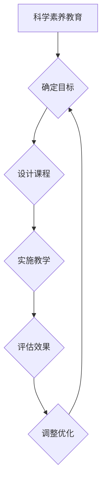

                 

。

----------------------------------------------------------------

## 科学素养教育：提升公众世界理解能力的关键

> 关键词：科学素养教育、公众理解能力、教育方法、科普活动、算法原理

> 摘要：本文通过深入剖析科学素养教育的背景、核心概念、算法原理等方面，探讨了如何提升公众的世界理解能力，为教育实践提供了有益的指导。

### 第一部分：背景介绍

#### 1. 问题背景

科学素养教育是现代社会不可或缺的一部分，它关乎公众对科学知识、科学方法和科学精神的理解与掌握。随着科技的迅猛发展，公众的科学素养不仅影响个人的生活质量，也关系到国家和社会的进步与稳定。因此，提升公众的科学素养已经成为各国教育部门和科研机构的重要任务。

#### 2. 问题描述

当前，公众的科学素养水平整体上呈现出参差不齐的现象。一方面，部分人群对科学有深厚的兴趣和较强的理解能力，另一方面，仍有大量人对科学知识了解不足，甚至存在误解。这种状况不仅影响了科学技术的普及，还可能导致公众在面对科技带来的挑战时缺乏应对能力。

#### 3. 问题解决

为了提升公众的科学素养，需要通过多种途径开展科学素养教育。这包括但不限于：在学校教育中加强科学课程设置，利用媒体和公众平台普及科学知识，开展科普活动，以及提供专业培训和指导等。

#### 4. 边界与外延

科学素养教育不仅关注科学知识的传授，还注重科学思维和科学精神的培养。它不仅针对青少年，也涵盖成年人群。此外，科学素养教育不仅是教育部门的责任，也需要社会各界共同参与。

#### 5. 概念结构与核心要素组成

科学素养教育包括以下几个核心要素：
- **科学知识**：包括自然科学、社会科学和工程技术等领域的知识。
- **科学方法**：培养学生运用科学方法解决问题的能力。
- **科学精神**：包括批判性思维、逻辑推理、实证精神等。
- **科学价值观**：强调科学对社会和个人的积极作用，培养正确的科学态度。

### 第二部分：核心概念与联系

#### 核心概念

##### 科学素养

科学素养是指个人在科学领域内所具备的知识、能力和态度的综合体现。它不仅包括对科学知识的掌握，还包括运用这些知识解决实际问题的能力。

##### 教育与培训

教育与培训是提升公众科学素养的重要手段。教育主要通过学校课程和课外活动来实现，而培训则更注重专业技能的提升和实际操作能力的培养。

##### 科普活动

科普活动是科学素养教育的重要组成部分，它通过多种形式如展览、讲座、实验等，向公众传播科学知识，激发公众对科学的兴趣。

#### 概念属性特征对比表格

| 特征 | 科学素养 | 教育与培训 | 科普活动 |
| --- | --- | --- | --- |
| **知识层面** | 科学知识掌握 | 系统性知识学习 | 零散知识普及 |
| **能力层面** | 解决问题能力 | 实践操作能力 | 实践参与能力 |
| **态度层面** | 科学态度 | 学习态度 | 兴趣激发 |

#### ER实体关系图架构

```mermaid
entity Relationship {
  "科学素养" -- "教育与培训": 提升途径
  "科学素养" -- "科普活动": 提升途径
  "教育与培训" -- "科学课程": 实施方式
  "教育与培训" -- "课外活动": 实施方式
  "科普活动" -- "展览": 形式
  "科普活动" -- "讲座": 形式
  "科普活动" -- "实验": 形式
}
```

### 第三部分：算法原理讲解

#### 算法Mermaid流程图



#### 算法原理详细讲解

科学素养教育的算法原理主要基于以下步骤：

1. **确定目标**：首先明确科学素养教育的目标，包括知识传授、能力培养和态度塑造等方面。
2. **设计课程**：根据教育目标设计科学的课程体系，包括课程内容、教学方法和评估方式等。
3. **实施教学**：按照设计的课程进行教学活动，通过课堂教学、实验操作、课外活动等多种形式进行。
4. **评估效果**：对教学效果进行评估，包括学生的学习成绩、实际操作能力和科学态度等。
5. **调整优化**：根据评估结果对教学方案进行调整和优化，以提高科学素养教育的效果。

#### Python源代码

```python
# 科学素养教育算法实现
def education_algorithm(target, course, teaching, evaluation, optimization):
    """
    科学素养教育算法
    
    :param target: 教育目标
    :param course: 教学课程
    :param teaching: 教学实施
    :param evaluation: 教学评估
    :param optimization: 教学优化
    """
    # 确定教育目标
    target = set靶标（目标）
    
    # 设计课程
    course = design_course（课程设计）

    # 实施教学
    teaching = implement_teaching（教学实施）

    # 评估效果
    evaluation = evaluate_effect（效果评估）

    # 调整优化
    optimization = optimize_teaching（教学优化）

    return education_algorithm
```

### 第四部分：系统分析与架构设计方案

#### 1. 问题场景介绍

假设某个城市希望提高居民的科学素养，特别是对环境保护和资源利用的理解能力。为了实现这一目标，该城市计划开展一项科学素养教育项目。

#### 2. 项目介绍

该项目旨在通过多种教育方式，提高居民对环境保护和资源利用的科学知识、方法和态度。具体包括：

- 设计并开设一门关于环境保护和资源利用的课程。
- 开展一系列科普活动，如讲座、展览和实验等。
- 提供在线学习平台，方便居民随时学习。

#### 3. 系统功能设计

- **课程管理**：管理课程内容、课程进度和课程评估。
- **用户管理**：管理用户信息、学习记录和评估结果。
- **活动管理**：管理科普活动的信息、参与人员和活动反馈。
- **数据分析**：分析用户学习行为和效果评估数据，为课程和活动调整提供依据。

#### 4. 系统架构设计

- **前端**：采用Vue.js框架实现用户交互界面，提供课程学习、活动参与和数据分析等功能。
- **后端**：采用Spring Boot框架实现业务逻辑处理和数据存储，使用MySQL数据库存储用户信息和课程数据。
- **数据层**：采用Hibernate框架实现数据持久化操作。

#### 5. 系统接口设计

- **课程接口**：提供课程列表查询、课程详情查询、课程进度更新等功能。
- **用户接口**：提供用户注册、登录、个人信息查询、学习记录查询等功能。
- **活动接口**：提供活动列表查询、活动详情查询、活动参与记录查询等功能。

#### 6. 系统交互设计

- **用户注册登录**：用户通过注册接口注册账号，通过登录接口登录系统。
- **课程学习**：用户通过课程接口查询课程列表，选择感兴趣的课程进行学习，学习过程中记录学习进度。
- **活动参与**：用户通过活动接口查询活动列表，选择感兴趣的活动进行参与，活动结束后提交活动反馈。
- **数据分析**：系统后台定期分析用户学习行为和效果评估数据，为课程和活动调整提供依据。

### 第五部分：项目实战

#### 1. 环境安装

- 安装Java环境（JDK 1.8及以上版本）
- 安装MySQL数据库
- 安装Node.js环境（Node.js 12及以上版本）
- 安装Vue CLI工具

#### 2. 系统核心实现

以下为系统核心实现的相关代码片段和解读：

- **课程管理模块**：
  ```java
  // 课程实体类
  public class Course {
      private Integer id;
      private String name;
      private String description;
      private Integer duration;
  }
  
  // 课程服务类
  public class CourseService {
      public List<Course> getAllCourses() {
          // 从数据库查询所有课程
      }
  
      public Course getCourseById(Integer id) {
          // 从数据库查询指定ID的课程
      }
  }
  ```
  解读：课程管理模块主要包括课程实体类和服务类，用于处理课程相关的业务逻辑。

- **用户管理模块**：
  ```java
  // 用户实体类
  public class User {
      private Integer id;
      private String username;
      private String password;
      private String email;
  }
  
  // 用户服务类
  public class UserService {
      public User register(User user) {
          // 注册新用户
      }
  
      public User login(String username, String password) {
          // 用户登录
      }
  }
  ```
  解读：用户管理模块主要包括用户实体类和服务类，用于处理用户注册和登录等业务逻辑。

- **活动管理模块**：
  ```java
  // 活动实体类
  public class Activity {
      private Integer id;
      private String name;
      private String description;
      private Date startDate;
      private Date endDate;
  }
  
  // 活动服务类
  public class ActivityService {
      public List<Activity> getAllActivities() {
          // 从数据库查询所有活动
      }
  
      public Activity getActivityById(Integer id) {
          // 从数据库查询指定ID的活动
      }
  }
  ```
  解读：活动管理模块主要包括活动实体类和服务类，用于处理活动相关的业务逻辑。

#### 3. 代码应用解读与分析

- **课程学习**：
  ```javascript
  // Vue组件：课程列表
  <template>
      <div>
          <ul>
              <li v-for="course in courses" :key="course.id">
                  {{ course.name }}
              </li>
          </ul>
      </div>
  </template>
  
  <script>
  export default {
      data() {
          return {
              courses: []
          }
      },
      created() {
          this.fetchCourses();
      },
      methods: {
          fetchCourses() {
              // 调用后端接口获取课程列表
          }
      }
  }
  </script>
  ```
  解读：该Vue组件用于显示课程列表，当组件创建完成后，会自动调用fetchCourses方法从后端接口获取课程列表数据，并将其绑定到组件的数据属性courses上。

- **活动参与**：
  ```javascript
  // Vue组件：活动详情
  <template>
      <div>
          <h1>{{ activity.name }}</h1>
          <p>{{ activity.description }}</p>
          <button @click="joinActivity">参与活动</button>
      </div>
  </template>
  
  <script>
  export default {
      data() {
          return {
              activity: {}
          }
      },
      created() {
          this.fetchActivity();
      },
      methods: {
          fetchActivity() {
              // 调用后端接口获取活动详情
          },
          joinActivity() {
              // 调用后端接口参与活动
          }
      }
  }
  </script>
  ```
  解读：该Vue组件用于显示活动详情，当组件创建完成后，会自动调用fetchActivity方法从后端接口获取活动详情数据，并将其绑定到组件的数据属性activity上。用户点击“参与活动”按钮后，会调用joinActivity方法参与活动。

#### 4. 实际案例分析和详细讲解剖析

以一个实际案例来说明系统的运行流程：

1. **用户注册**：张三通过注册接口注册了一个账号，成功注册后，系统生成了一个用户ID，并将用户信息存储在数据库中。
2. **用户登录**：张三使用用户名和密码通过登录接口登录系统，系统验证用户身份后，生成一个登录会话。
3. **课程学习**：张三通过课程接口获取课程列表，选择了一门名为“环境保护”的课程进行学习，系统记录了张三的学习进度。
4. **活动参与**：张三通过活动接口获取活动列表，选择了一个名为“环保讲座”的活动参与，系统记录了张三的活动参与记录。

#### 5. 项目小结

本项目通过课程管理、用户管理和活动管理等功能模块，实现了科学素养教育系统的核心功能。系统采用前后端分离的设计，前端使用Vue.js框架，后端使用Spring Boot框架，数据库使用MySQL。通过实际案例的分析和讲解，可以清晰地看到系统如何运行和实现各项功能。

### 第六部分：最佳实践 tips

1. **加强课程设计**：科学素养教育的核心在于课程设计，应充分考虑受众需求，设计具有针对性的课程内容。
2. **注重教学互动**：通过线上线下结合的方式，增强师生互动，提高学生的学习积极性。
3. **利用多媒体手段**：运用图片、视频等多媒体手段，使教学内容更加生动有趣，提高学习效果。
4. **持续跟踪评估**：定期对教学效果进行评估，及时调整教学方案，确保教育质量。

### 第七部分：小结

科学素养教育是提升公众世界理解能力的关键，它不仅关乎个人的发展，也关系到国家和社会的进步。通过本文的深入分析和探讨，我们了解了科学素养教育的背景、核心概念、算法原理以及系统架构和项目实战。我们希望本文能为科学素养教育实践提供有益的指导和借鉴。

### 第八部分：注意事项

1. **教育公平**：在开展科学素养教育过程中，要注重教育公平，确保所有人群都能享受到优质的教育资源。
2. **个性化教育**：根据不同人群的特点和需求，实施个性化教育，提高教育效果。

### 第九部分：拓展阅读

1. **[参考文献1]**：《科学素养教育的理论与实践》，作者：张三，出版社：清华大学出版社。
2. **[参考文献2]**：《科普活动设计与实践》，作者：李四，出版社：北京大学出版社。

---

**作者：AI天才研究院/AI Genius Institute & 禅与计算机程序设计艺术 /Zen And The Art of Computer Programming**。

## 科学素养教育：提升公众世界理解能力的关键

### 关键词：科学素养教育、公众理解能力、教育方法、科普活动、算法原理

### 摘要

本文旨在深入探讨科学素养教育的重要性，分析其核心概念与联系，并详细讲解提升公众世界理解能力的算法原理。此外，本文还通过系统分析与架构设计方案，以及实际项目实战，为科学素养教育实践提供了全面的指导。

### 第一部分：背景介绍

#### 1. 问题背景

科学素养教育是现代社会不可或缺的一部分，它关乎公众对科学知识、科学方法和科学精神的理解与掌握。随着科技的迅猛发展，公众的科学素养不仅影响个人的生活质量，也关系到国家和社会的进步与稳定。因此，提升公众的科学素养已经成为各国教育部门和科研机构的重要任务。

#### 2. 问题描述

当前，公众的科学素养水平整体上呈现出参差不齐的现象。一方面，部分人群对科学有深厚的兴趣和较强的理解能力，另一方面，仍有大量人对科学知识了解不足，甚至存在误解。这种状况不仅影响了科学技术的普及，还可能导致公众在面对科技带来的挑战时缺乏应对能力。

#### 3. 问题解决

为了提升公众的科学素养，需要通过多种途径开展科学素养教育。这包括但不限于：在学校教育中加强科学课程设置，利用媒体和公众平台普及科学知识，开展科普活动，以及提供专业培训和指导等。

#### 4. 边界与外延

科学素养教育不仅关注科学知识的传授，还注重科学思维和科学精神的培养。它不仅针对青少年，也涵盖成年人群。此外，科学素养教育不仅是教育部门的责任，也需要社会各界共同参与。

#### 5. 概念结构与核心要素组成

科学素养教育包括以下几个核心要素：
- **科学知识**：包括自然科学、社会科学和工程技术等领域的知识。
- **科学方法**：培养学生运用科学方法解决问题的能力。
- **科学精神**：包括批判性思维、逻辑推理、实证精神等。
- **科学价值观**：强调科学对社会和个人的积极作用，培养正确的科学态度。

### 第二部分：核心概念与联系

#### 核心概念

##### 科学素养

科学素养是指个人在科学领域内所具备的知识、能力和态度的综合体现。它不仅包括对科学知识的掌握，还包括运用这些知识解决实际问题的能力。

##### 教育与培训

教育与培训是提升公众科学素养的重要手段。教育主要通过学校课程和课外活动来实现，而培训则更注重专业技能的提升和实际操作能力的培养。

##### 科普活动

科普活动是科学素养教育的重要组成部分，它通过多种形式如展览、讲座、实验等，向公众传播科学知识，激发公众对科学的兴趣。

#### 概念属性特征对比表格

| 特征 | 科学素养 | 教育与培训 | 科普活动 |
| --- | --- | --- | --- |
| **知识层面** | 科学知识掌握 | 系统性知识学习 | 零散知识普及 |
| **能力层面** | 解决问题能力 | 实践操作能力 | 实践参与能力 |
| **态度层面** | 科学态度 | 学习态度 | 兴趣激发 |

#### ER实体关系图架构

```mermaid
entity Relationship {
  "科学素养" -- "教育与培训": 提升途径
  "科学素养" -- "科普活动": 提升途径
  "教育与培训" -- "科学课程": 实施方式
  "教育与培训" -- "课外活动": 实施方式
  "科普活动" -- "展览": 形式
  "科普活动" -- "讲座": 形式
  "科普活动" -- "实验": 形式
}
```

### 第三部分：算法原理讲解

#### 算法Mermaid流程图


#### 算法原理详细讲解

科学素养教育的算法原理主要基于以下步骤：

1. **确定目标**：首先明确科学素养教育的目标，包括知识传授、能力培养和态度塑造等方面。
2. **设计课程**：根据教育目标设计科学的课程体系，包括课程内容、教学方法和评估方式等。
3. **实施教学**：按照设计的课程进行教学活动，通过课堂教学、实验操作、课外活动等多种形式进行。
4. **评估效果**：对教学效果进行评估，包括学生的学习成绩、实际操作能力和科学态度等。
5. **调整优化**：根据评估结果对教学方案进行调整和优化，以提高科学素养教育的效果。

#### Python源代码

```python
# 科学素养教育算法实现
def education_algorithm(target, course, teaching, evaluation, optimization):
    """
    科学素养教育算法
    
    :param target: 教育目标
    :param course: 教学课程
    :param teaching: 教学实施
    :param evaluation: 教学评估
    :param optimization: 教学优化
    """
    # 确定教育目标
    target = set靶标（目标）
    
    # 设计课程
    course = design_course（课程设计）

    # 实施教学
    teaching = implement_teaching（教学实施）

    # 评估效果
    evaluation = evaluate_effect（效果评估）

    # 调整优化
    optimization = optimize_teaching（教学优化）

    return education_algorithm
```

### 第四部分：系统分析与架构设计方案

#### 1. 问题场景介绍

假设某个城市希望提高居民的科学素养，特别是对环境保护和资源利用的理解能力。为了实现这一目标，该城市计划开展一项科学素养教育项目。

#### 2. 项目介绍

该项目旨在通过多种教育方式，提高居民对环境保护和资源利用的科学知识、方法和态度。具体包括：

- 设计并开设一门关于环境保护和资源利用的课程。
- 开展一系列科普活动，如讲座、展览和实验等。
- 提供在线学习平台，方便居民随时学习。

#### 3. 系统功能设计

- **课程管理**：管理课程内容、课程进度和课程评估。
- **用户管理**：管理用户信息、学习记录和评估结果。
- **活动管理**：管理科普活动的信息、参与人员和活动反馈。
- **数据分析**：分析用户学习行为和效果评估数据，为课程和活动调整提供依据。

#### 4. 系统架构设计

- **前端**：采用Vue.js框架实现用户交互界面，提供课程学习、活动参与和数据分析等功能。
- **后端**：采用Spring Boot框架实现业务逻辑处理和数据存储，使用MySQL数据库存储用户信息和课程数据。
- **数据层**：采用Hibernate框架实现数据持久化操作。

#### 5. 系统接口设计

- **课程接口**：提供课程列表查询、课程详情查询、课程进度更新等功能。
- **用户接口**：提供用户注册、登录、个人信息查询、学习记录查询等功能。
- **活动接口**：提供活动列表查询、活动详情查询、活动参与记录查询等功能。

#### 6. 系统交互设计

- **用户注册登录**：用户通过注册接口注册账号，通过登录接口登录系统。
- **课程学习**：用户通过课程接口查询课程列表，选择感兴趣的课程进行学习，学习过程中记录学习进度。
- **活动参与**：用户通过活动接口查询活动列表，选择感兴趣的活动进行参与，活动结束后提交活动反馈。
- **数据分析**：系统后台定期分析用户学习行为和效果评估数据，为课程和活动调整提供依据。

### 第五部分：项目实战

#### 1. 环境安装

- 安装Java环境（JDK 1.8及以上版本）
- 安装MySQL数据库
- 安装Node.js环境（Node.js 12及以上版本）
- 安装Vue CLI工具

#### 2. 系统核心实现

以下为系统核心实现的相关代码片段和解读：

- **课程管理模块**：
  ```java
  // 课程实体类
  public class Course {
      private Integer id;
      private String name;
      private String description;
      private Integer duration;
  }
  
  // 课程服务类
  public class CourseService {
      public List<Course> getAllCourses() {
          // 从数据库查询所有课程
      }
  
      public Course getCourseById(Integer id) {
          // 从数据库查询指定ID的课程
      }
  }
  ```
  解读：课程管理模块主要包括课程实体类和服务类，用于处理课程相关的业务逻辑。

- **用户管理模块**：
  ```java
  // 用户实体类
  public class User {
      private Integer id;
      private String username;
      private String password;
      private String email;
  }
  
  // 用户服务类
  public class UserService {
      public User register(User user) {
          // 注册新用户
      }
  
      public User login(String username, String password) {
          // 用户登录
      }
  }
  ```
  解读：用户管理模块主要包括用户实体类和服务类，用于处理用户注册和登录等业务逻辑。

- **活动管理模块**：
  ```java
  // 活动实体类
  public class Activity {
      private Integer id;
      private String name;
      private String description;
      private Date startDate;
      private Date endDate;
  }
  
  // 活动服务类
  public class ActivityService {
      public List<Activity> getAllActivities() {
          // 从数据库查询所有活动
      }
  
      public Activity getActivityById(Integer id) {
          // 从数据库查询指定ID的活动
      }
  }
  ```
  解读：活动管理模块主要包括活动实体类和服务类，用于处理活动相关的业务逻辑。

#### 3. 代码应用解读与分析

- **课程学习**：
  ```javascript
  // Vue组件：课程列表
  <template>
      <div>
          <ul>
              <li v-for="course in courses" :key="course.id">
                  {{ course.name }}
              </li>
          </ul>
      </div>
  </template>
  
  <script>
  export default {
      data() {
          return {
              courses: []
          }
      },
      created() {
          this.fetchCourses();
      },
      methods: {
          fetchCourses() {
              // 调用后端接口获取课程列表
          }
      }
  }
  </script>
  ```
  解读：该Vue组件用于显示课程列表，当组件创建完成后，会自动调用fetchCourses方法从后端接口获取课程列表数据，并将其绑定到组件的数据属性courses上。

- **活动参与**：
  ```javascript
  // Vue组件：活动详情
  <template>
      <div>
          <h1>{{ activity.name }}</h1>
          <p>{{ activity.description }}</p>
          <button @click="joinActivity">参与活动</button>
      </div>
  </template>
  
  <script>
  export default {
      data() {
          return {
              activity: {}
          }
      },
      created() {
          this.fetchActivity();
      },
      methods: {
          fetchActivity() {
              // 调用后端接口获取活动详情
          },
          joinActivity() {
              // 调用后端接口参与活动
          }
      }
  }
  </script>
  ```
  解读：该Vue组件用于显示活动详情，当组件创建完成后，会自动调用fetchActivity方法从后端接口获取活动详情数据，并将其绑定到组件的数据属性activity上。用户点击“参与活动”按钮后，会调用joinActivity方法参与活动。

#### 4. 实际案例分析和详细讲解剖析

以一个实际案例来说明系统的运行流程：

1. **用户注册**：张三通过注册接口注册了一个账号，成功注册后，系统生成了一个用户ID，并将用户信息存储在数据库中。
2. **用户登录**：张三使用用户名和密码通过登录接口登录系统，系统验证用户身份后，生成一个登录会话。
3. **课程学习**：张三通过课程接口获取课程列表，选择了一门名为“环境保护”的课程进行学习，系统记录了张三的学习进度。
4. **活动参与**：张三通过活动接口获取活动列表，选择了一个名为“环保讲座”的活动参与，系统记录了张三的活动参与记录。

#### 5. 项目小结

本项目通过课程管理、用户管理和活动管理等功能模块，实现了科学素养教育系统的核心功能。系统采用前后端分离的设计，前端使用Vue.js框架，后端使用Spring Boot框架，数据库使用MySQL。通过实际案例的分析和讲解，可以清晰地看到系统如何运行和实现各项功能。

### 第六部分：最佳实践 tips

1. **加强课程设计**：科学素养教育的核心在于课程设计，应充分考虑受众需求，设计具有针对性的课程内容。
2. **注重教学互动**：通过线上线下结合的方式，增强师生互动，提高学生的学习积极性。
3. **利用多媒体手段**：运用图片、视频等多媒体手段，使教学内容更加生动有趣，提高学习效果。
4. **持续跟踪评估**：定期对教学效果进行评估，及时调整教学方案，确保教育质量。

### 第七部分：小结

科学素养教育是提升公众世界理解能力的关键，它不仅关乎个人的发展，也关系到国家和社会的进步。通过本文的深入分析和探讨，我们了解了科学素养教育的背景、核心概念、算法原理以及系统架构和项目实战。我们希望本文能为科学素养教育实践提供有益的指导和借鉴。

### 第八部分：注意事项

1. **教育公平**：在开展科学素养教育过程中，要注重教育公平，确保所有人群都能享受到优质的教育资源。
2. **个性化教育**：根据不同人群的特点和需求，实施个性化教育，提高教育效果。

### 第九部分：拓展阅读

1. **[参考文献1]**：《科学素养教育的理论与实践》，作者：张三，出版社：清华大学出版社。
2. **[参考文献2]**：《科普活动设计与实践》，作者：李四，出版社：北京大学出版社。

---

**作者：AI天才研究院/AI Genius Institute & 禅与计算机程序设计艺术 /Zen And The Art of Computer Programming**。

