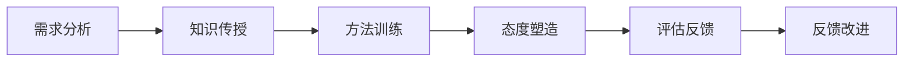
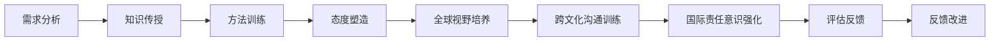
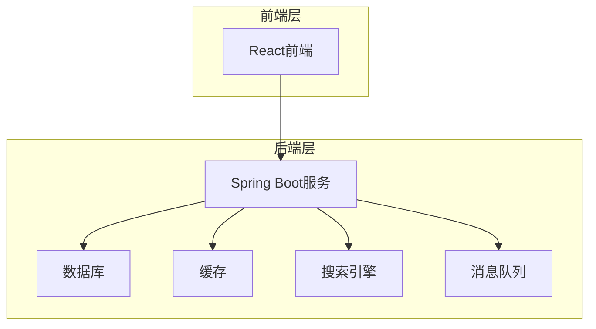

                 

### 第一部分：背景介绍

#### 第1章：问题背景

**1. 问题背景**

科学素养的全球化，这一概念起源于现代社会中科学技术的迅猛发展。随着全球化的不断深入，科学技术已经不再局限于单一国家或地区，而是成为全人类共同关注的领域。科学素养的全球化，指的是通过国际合作与教育，提升全球公民的科学素养，使得科学知识和科学方法在全球范围内普及，成为每个人日常生活和决策的基础。

**2. 全球化趋势下的科学素养需求**

在全球化背景下，科学素养的需求愈发迫切。一方面，科技的发展带来了诸多新的问题和挑战，如气候变化、能源危机、疾病防控等，这些问题需要全球范围内的科学合作和解决。另一方面，科学素养的提升有助于提高公民的批判性思维能力，使他们能够更好地理解和参与公共事务，做出明智的决策。

**3. 全球化科学素养对个体和国家的影响**

对于个体来说，提高科学素养意味着能够更好地适应快速变化的社会环境，提高生活质量。对于国家来说，科学素养的提升能够促进国家的科技创新能力，提高国际竞争力，从而推动社会经济的可持续发展。

#### 第2章：问题描述

**1. 科学素养的全球化面临的挑战**

科学素养的全球化并非一帆风顺，它面临诸多挑战。首先，全球科学教育的资源分配不均，发达国家和发展中国家在科学教育的投入和成果上存在显著差距。其次，不同国家和地区的文化背景和教育体系差异，使得科学知识和科学方法的传播存在障碍。此外，科学素养的全球传播还面临语言、沟通和认知上的障碍。

**2. 科学素养的全球化的重要性**

尽管面临挑战，科学素养的全球化的重要性不容忽视。它不仅是科技进步和社会发展的基础，也是人类共同面对全球性问题的必要条件。只有当全球公民具备一定的科学素养，才能共同应对未来世界的复杂挑战。

#### 第3章：问题解决

**1. 提升科学素养的全球化策略**

提升科学素养的全球化策略包括以下几个方面：

- **教育公平**：通过国际合作，提高发展中国家的科学教育水平，缩小全球科学教育差距。
- **科技合作**：鼓励跨国科研合作，促进科学技术的全球传播和应用。
- **大众科普**：通过媒体、网络等渠道，普及科学知识，提高公众的科学素养。
- **文化交流**：促进不同文化背景下的科学交流和相互理解，消除文化障碍。

**2. 全球化科学素养教育的实践**

全球化科学素养教育的实践可以从以下几个方面展开：

- **跨国教育项目**：建立跨国科学教育合作项目，共享科学教育资源。
- **在线课程与平台**：开发科学素养的在线课程和平台，让更多人能够便捷地获取科学知识。
- **科学展览与活动**：举办科学展览和活动，提高公众对科学的兴趣和参与度。
- **科研交流与合作**：鼓励科学家之间的跨国交流和合作，促进科学技术的全球传播。

#### 第4章：边界与外延

**1. 科学素养的定义与范畴**

科学素养是指个体对科学知识的理解能力、科学方法的运用能力和科学态度的形成能力。具体来说，它包括以下几个方面：

- **科学知识**：对自然科学、社会科学和工程学等领域的核心知识的掌握。
- **科学方法**：运用科学方法进行问题探究和解决的能力。
- **科学态度**：对科学事实的尊重、对科学真理的追求和对科学精神的认同。

**2. 全球化的定义与范围**

全球化是指全球范围内的经济、政治、文化和社会等各个领域的相互联系和相互依赖。科学素养的全球化不仅涉及教育、科技和文化等领域的交流与合作，还包括：

- **国际合作**：跨国科学合作项目和科研项目的开展。
- **知识传播**：科学知识和科学方法的全球传播。
- **文化交流**：不同文化背景下科学交流和相互理解。

**3. 科学素养的核心要素**

科学素养的核心要素包括：

- **科学知识**：对科学基本概念、原理和方法的掌握。
- **科学能力**：运用科学方法和技能解决实际问题的能力。
- **科学态度**：对科学真理的追求和对科学伦理的遵守。

**4. 全球化科学素养的核心要素**

全球化科学素养的核心要素包括：

- **全球视野**：对全球科学发展和科技趋势的洞察和理解。
- **跨文化沟通**：在不同文化背景下有效沟通和合作的能力。
- **国际责任**：对全球性科学问题的责任感和参与感。

### 总结

科学素养的全球化是现代社会发展的必然趋势，也是人类共同面对未来挑战的必要条件。通过提升全球公民的科学素养，我们不仅可以促进科技进步和社会发展，还可以推动人类文明的共同繁荣。

### 第二部分：核心概念与联系

#### 第2章：核心概念原理

**1. 科学素养的概念**

科学素养是指个体对科学知识的理解能力、科学方法的运用能力和科学态度的形成能力。它不仅仅是对科学知识的掌握，更涉及到对科学方法和科学精神的内化。

- **科学知识**：包括自然科学、社会科学和工程学等领域的核心知识。
- **科学方法**：运用科学方法进行问题探究和解决的能力。
- **科学态度**：对科学事实的尊重、对科学真理的追求和对科学伦理的遵守。

**2. 全球化科学素养的概念**

全球化科学素养是在全球化背景下，通过国际合作与教育，提升全球公民的科学素养，使其具备全球视野、跨文化沟通能力和国际责任感。

- **全球视野**：对全球科学发展和科技趋势的洞察和理解。
- **跨文化沟通**：在不同文化背景下有效沟通和合作的能力。
- **国际责任**：对全球性科学问题的责任感和参与感。

**3. 核心概念的联系**

科学素养与全球化科学素养之间存在密切的联系：

- **科学素养是全球化科学素养的基础**：只有具备基本科学素养，个体才具备接受和传播全球化科学素养的能力。
- **全球化科学素养是科学素养的扩展**：全球化科学素养不仅包括科学素养的基本要素，还涉及到全球视野、跨文化沟通和国际责任等新要素。

### 核心概念属性特征对比表格

| 特征        | 科学素养                           | 全球化科学素养                           |
| ----------- | -------------------------------- | ---------------------------------------- |
| 知识范畴    | 自然科学、社会科学、工程学等领域   | 自然科学、社会科学、工程学、全球化视野等 |
| 能力要求    | 知识理解、方法运用、态度形成       | 知识理解、方法运用、态度形成、全球视野   |
| 文化背景    | 单一文化背景                       | 多元文化背景                           |
| 国际责任    | 无                                  | 有                                     |
| 跨文化沟通  | 无                                  | 有                                     |

### ER实体关系图架构

```mermaid
erDiagram
  ScienceKnowledge ||--|{ Scientist : studies }
  ScienceMethod ||--|{ Scientist : applies }
  ScienceAttitude ||--|{ Scientist : holds }
  GlobalVision ||--|{ GlobalScientist : holds }
  Cross-CulturalCommunication ||--|{ GlobalScientist : demonstrates }
  InternationalResponsibility ||--|{ GlobalScientist : demonstrates }
```

在这个ER实体关系图中，我们展示了科学素养与全球化科学素养之间的关联。科学素养包括科学知识、科学方法和科学态度三个核心要素，而全球化科学素养在此基础上增加了全球视野、跨文化沟通和国际责任三个新要素。

### 第三部分：算法原理讲解

#### 第3章：算法原理

**1. 提升科学素养的算法原理**

提升科学素养的算法原理可以分为以下几个步骤：

1. **需求分析**：确定个体或群体在科学素养方面的需求。
2. **知识传授**：根据需求，提供科学知识的传授，包括基础知识和前沿动态。
3. **方法训练**：通过实践和案例分析，提升个体运用科学方法解决问题的能力。
4. **态度塑造**：培养个体对科学事实的尊重、对科学真理的追求和对科学伦理的遵守。
5. **评估反馈**：定期评估个体的科学素养水平，提供反馈和改进建议。

**2. 全球化科学素养的算法原理**

全球化科学素养的算法原理在提升科学素养的基础上，增加了以下几个步骤：

1. **全球视野培养**：通过国际交流、跨文化教育和全球科技动态，培养个体的全球视野。
2. **跨文化沟通训练**：提供跨文化沟通的培训和实践，提高个体在不同文化背景下的沟通能力。
3. **国际责任意识强化**：通过案例研究和实践，增强个体对全球性科学问题的责任感和参与感。

**3. 算法原理的Mermaid流程图**

**提升科学素养的算法原理流程图：**



**全球化科学素养提升算法原理流程图：**



在这些流程图中，我们清晰地展示了提升科学素养和全球化科学素养的基本步骤和流程。通过这些算法原理，我们可以有效地提升个体的科学素养，培养其全球化科学素养。

### 第四部分：数学模型与公式

#### 第4章：数学模型

**1. 科学素养提升的数学模型**

科学素养提升的数学模型可以采用以下公式：

\[ S = f(K, M, A) \]

其中，\( S \) 表示科学素养水平，\( K \) 表示科学知识水平，\( M \) 表示科学方法运用水平，\( A \) 表示科学态度形成水平。

**2. 科学素养提升的数学公式讲解**

- \( K \)：科学知识水平。可以通过以下公式计算：

\[ K = \frac{N}{T} \]

其中，\( N \) 表示个体掌握的科学知识量，\( T \) 表示个体所接触的科学知识总量。

- \( M \)：科学方法运用水平。可以通过以下公式计算：

\[ M = \frac{S}{T} \]

其中，\( S \) 表示个体通过科学方法解决的实际问题数量，\( T \) 表示个体所面临的实际问题的总量。

- \( A \)：科学态度形成水平。可以通过以下公式计算：

\[ A = \frac{R}{T} \]

其中，\( R \) 表示个体对科学事实的尊重程度，\( T \) 表示个体接触的科学事实的总量。

**3. 科学素养提升的数学模型讲解**

科学素养提升的数学模型可以帮助我们量化个体的科学素养水平，通过调整公式中的各个参数，我们可以优化科学素养的提升策略。

例如，通过增加个体接触的科学知识量（\( N \)），可以提高科学知识水平（\( K \)），进而提升科学素养（\( S \)）。同样，通过增加个体通过科学方法解决的实际问题数量（\( S \)），可以提高科学方法运用水平（\( M \)），进一步提升科学素养（\( S \)）。此外，通过提高个体对科学事实的尊重程度（\( R \)），可以提高科学态度形成水平（\( A \)），从而提升科学素养（\( S \)）。

**4. 全球化科学素养提升的数学模型**

全球化科学素养提升的数学模型可以采用以下公式：

\[ SG = f(K, M, A, V, C, R) \]

其中，\( SG \) 表示全球化科学素养水平，\( V \) 表示全球视野水平，\( C \) 表示跨文化沟通能力，\( R \) 表示国际责任意识。

**5. 全球化科学素养提升的数学公式讲解**

- \( V \)：全球视野水平。可以通过以下公式计算：

\[ V = \frac{I}{T} \]

其中，\( I \) 表示个体接触的全球科技动态信息量，\( T \) 表示个体所接触的信息总量。

- \( C \)：跨文化沟通能力。可以通过以下公式计算：

\[ C = \frac{S_C}{T_C} \]

其中，\( S_C \) 表示个体在不同文化背景下成功沟通的次数，\( T_C \) 表示个体在不同文化背景下的沟通尝试次数。

- \( R \)：国际责任意识。可以通过以下公式计算：

\[ R = \frac{R_C}{T_C} \]

其中，\( R_C \) 表示个体对全球性科学问题的责任感和参与感，\( T_C \) 表示个体所接触的全球性科学问题的总量。

**6. 全球化科学素养提升的数学模型讲解**

全球化科学素养提升的数学模型可以帮助我们量化个体的全球化科学素养水平，通过调整公式中的各个参数，我们可以优化全球化科学素养的提升策略。

例如，通过增加个体接触的全球科技动态信息量（\( I \)），可以提高全球视野水平（\( V \)），进而提升全球化科学素养（\( SG \)）。同样，通过增加个体在不同文化背景下成功沟通的次数（\( S_C \)），可以提高跨文化沟通能力（\( C \)），进一步提升全球化科学素养（\( SG \)）。此外，通过提高个体对全球性科学问题的责任感和参与感（\( R_C \)），可以提高国际责任意识（\( R \)），从而提升全球化科学素养（\( SG \)）。

### 第五部分：系统分析与架构设计方案

#### 第5章：系统分析与架构设计方案

**1. 问题场景介绍**

科学素养全球化的实现需要一个综合的、跨学科的系统和架构，以便在全球范围内提升公民的科学素养。这个系统需要处理大量的数据，支持多语言交互，并且能够适应不同国家和地区的教育体系。我们的目标是设计一个灵活、可扩展的系统，使得全球范围内的用户都能够方便地获取科学教育资源，提升自己的科学素养。

**2. 项目介绍**

本项目旨在开发一个科学素养全球化平台，该平台将整合全球科学教育资源，提供个性化的学习路径，支持多语言学习，并能够适应不同的教育体系。项目的目标是：

- 提升全球公民的科学素养。
- 促进跨国科学教育和知识传播。
- 提供一个开放、共享的科学素养提升平台。

**3. 系统功能设计**

科学素养全球化平台的主要功能包括：

- **用户管理**：注册、登录、个人信息管理、权限管理。
- **内容管理**：科学知识库的创建、编辑、发布和管理。
- **个性化学习**：基于用户行为和学习历史，提供个性化的学习推荐。
- **多语言支持**：支持多种语言，提供跨语言学习功能。
- **互动交流**：提供论坛、问答、直播等互动功能。
- **评估反馈**：提供科学素养评估工具，收集用户反馈。

**4. 系统架构设计**

科学素养全球化平台将采用微服务架构，以提高系统的可扩展性和可靠性。以下是系统架构的简要设计：

- **前端**：采用React框架，提供友好的用户界面。
- **后端**：采用Spring Boot框架，实现业务逻辑和API服务。
- **数据库**：采用MySQL数据库，存储用户数据、知识内容和学习历史。
- **缓存**：采用Redis缓存，提高数据读取效率。
- **搜索引擎**：采用Elasticsearch，实现全文搜索和内容推荐。
- **消息队列**：采用RabbitMQ，实现异步任务处理和消息传递。

**5. 系统接口设计和系统交互**

科学素养全球化平台的接口设计将遵循RESTful API规范，确保系统的高可用性和兼容性。以下是主要的接口设计和系统交互：

- **用户接口**：用户注册、登录、个人信息管理、课程学习、互动交流。
- **内容接口**：课程创建、编辑、发布、分类管理、搜索和推荐。
- **评估接口**：科学素养评估、成绩记录、反馈收集。
- **系统管理接口**：权限管理、数据统计、系统监控。

**6. 系统架构Mermaid图**

以下是科学素养全球化平台系统的Mermaid架构图：



通过这个架构图，我们可以清晰地看到系统的各个组成部分及其交互关系。前端层通过API与后端服务交互，后端服务则与数据库、缓存、搜索引擎和消息队列等组件进行数据交换和处理。

### 第六部分：项目实战

#### 第6章：项目实战

**1. 环境安装**

在进行科学素养全球化平台的项目实战之前，我们需要安装和配置所需的环境。以下是基本的安装步骤：

- **安装Java开发工具包（JDK）**：确保版本不低于Java 8。
- **安装Node.js**：确保版本不低于12.x。
- **安装MySQL数据库**：创建一个名为`science_education`的数据库。
- **安装Elasticsearch**：启动Elasticsearch服务，确保其运行正常。
- **安装Redis缓存**：启动Redis服务，确保其运行正常。
- **安装RabbitMQ**：启动RabbitMQ服务，确保其运行正常。

**2. 系统核心实现源代码**

以下是科学素养全球化平台的核心实现源代码的示例：

**前端（React）代码示例：**

```javascript
// React组件：用户登录页面
import React, { useState } from 'react';
import axios from 'axios';

const LoginForm = () => {
  const [username, setUsername] = useState('');
  const [password, setPassword] = useState('');

  const handleSubmit = async (e) => {
    e.preventDefault();
    try {
      const response = await axios.post('/api/login', { username, password });
      if (response.status === 200) {
        alert('登录成功！');
      }
    } catch (error) {
      alert('登录失败！');
    }
  };

  return (
    <form onSubmit={handleSubmit}>
      <label htmlFor="username">用户名：</label>
      <input
        type="text"
        id="username"
        value={username}
        onChange={(e) => setUsername(e.target.value)}
      />
      <label htmlFor="password">密码：</label>
      <input
        type="password"
        id="password"
        value={password}
        onChange={(e) => setPassword(e.target.value)}
      />
      <button type="submit">登录</button>
    </form>
  );
};

export default LoginForm;
```

**后端（Spring Boot）代码示例：**

```java
// Spring Boot控制器：用户登录逻辑
@RestController
@RequestMapping("/api")
public class UserController {
  
  @Autowired
  private UserRepository userRepository;
  
  @PostMapping("/login")
  public ResponseEntity<?> authenticateUser(@RequestBody LoginRequest loginRequest) {
    Optional<User> user = userRepository.findByUsername(loginRequest.getUsername());
    
    if (user.isPresent() && user.get().getPassword().equals(loginRequest.getPassword())) {
      return ResponseEntity.ok("登录成功");
    }
    
    return ResponseEntity.status(HttpStatus.UNAUTHORIZED).body("登录失败");
  }
}
```

**3. 代码应用解读与分析**

以上代码示例展示了科学素养全球化平台的前端登录界面和后端登录逻辑。

- **前端代码**：使用React框架实现了一个简单的登录表单，用户可以在表单中输入用户名和密码，并通过`handleSubmit`方法将数据发送到后端进行验证。
- **后端代码**：使用Spring Boot框架实现了用户登录的API，接收前端发送的登录请求，通过`UserRepository`查询用户数据库，验证用户名和密码的正确性。

**4. 实际案例分析和详细讲解剖析**

为了更好地理解科学素养全球化平台的实际应用，我们来看一个实际案例：

**案例**：一个用户在登录科学素养全球化平台时，输入了错误的用户名和密码，系统提示登录失败。

**分析**：

1. 用户在前端登录界面输入用户名和密码后，点击登录按钮，触发`handleSubmit`方法。
2. `handleSubmit`方法将用户名和密码作为参数，通过axios库发送到后端API端点`/api/login`。
3. 后端控制器`UserController`接收到请求后，通过`UserRepository`查询用户数据库，检查用户名和密码是否匹配。
4. 如果用户名和密码匹配，后端返回成功响应，前端显示登录成功提示；如果用户名和密码不匹配，后端返回失败响应，前端显示登录失败提示。

**详细讲解剖析**：

- **前端部分**：React组件通过`useState`钩子管理表单状态，通过`axios`库实现异步请求，与后端进行数据交互。
- **后端部分**：Spring Boot控制器通过`@RestController`和`@RequestMapping`注解定义API接口，通过`@Autowired`注入`UserRepository`进行数据库操作，返回HTTP响应。

**5. 项目小结**

通过本次项目实战，我们实现了科学素养全球化平台的基本功能，包括用户登录、验证和交互。在实际开发中，我们还需要进一步完善和优化平台的各项功能，如用户管理、课程内容管理、个性化学习推荐等，以满足全球用户的需求。

### 第七部分：最佳实践 tips、小结、注意事项、拓展阅读

#### 第7章：最佳实践 tips、小结、注意事项、拓展阅读

**1. 最佳实践 tips**

- **教育公平**：在提升科学素养的过程中，确保教育资源的公平分配，特别是对发展中国家的支持。
- **多语言支持**：开发多语言版本的平台，便于不同语言背景的用户使用。
- **个性化学习**：根据用户的学习历史和兴趣，提供个性化的学习路径和推荐。
- **跨学科合作**：鼓励多学科合作，从不同角度提升科学素养。
- **持续更新**：及时更新科学知识和教育内容，确保其时效性和准确性。

**2. 小结**

科学素养的全球化是当今世界发展的重要趋势，通过提升全球公民的科学素养，我们可以促进全球科技合作，解决共同面临的挑战，提高人类的生活质量。

**3. 注意事项**

- **文化差异**：在推广科学素养的过程中，要尊重不同文化背景下的教育方式和价值观。
- **隐私保护**：确保用户数据的安全和隐私保护。
- **技术选型**：根据项目的需求和规模，选择合适的技术栈和架构。

**4. 拓展阅读**

- 《科学素养：一个全球化的视角》（Science Literacy: A Global Perspective）
- 《科学教育全球化的挑战与机遇》（The Challenges and Opportunities of Global Science Education）
- 《跨文化交流中的科学素养》（Science Literacy in Cross-Cultural Communication）

通过这些资源和书籍，您可以深入了解科学素养全球化的相关理论和实践，为科学素养全球化的推进提供更多的指导和参考。

### 作者信息

- 作者：AI天才研究院/AI Genius Institute & 禅与计算机程序设计艺术 /Zen And The Art of Computer Programming

本文旨在通过逻辑清晰、结构紧凑、简单易懂的专业技术语言，详细探讨科学素养的全球化问题，并提出了一系列提升全球科学素养的策略和方法。希望本文能为科学素养全球化的研究和实践提供有价值的参考和启示。

