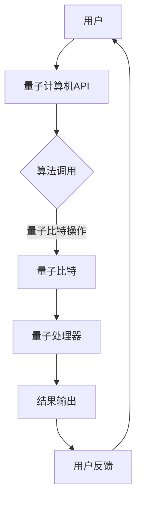
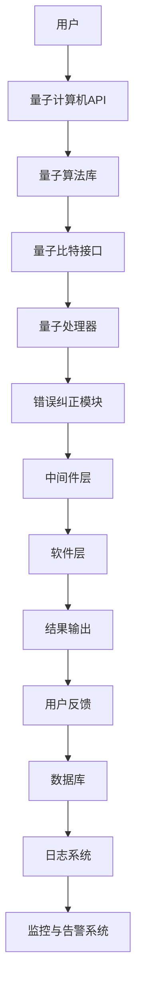

                 

## 引言：科学革命如何改变我们理解世界的方式

科学革命，作为人类历史进程中的一次次重大飞跃，不仅是科技进步的重要推动力，更是人类认识世界方式的一次次变革。本文旨在探讨科学革命如何深刻地改变了我们对世界的理解，从古至今，科学革命对人类社会、科技发展、文化变迁等方面产生了深远影响。通过回顾历史上的几次重大科学革命，我们将深入分析其核心原理、关键人物与事件，并展望未来的发展趋势。

科学革命的定义并不是一成不变的，它通常指的是在科学方法、理论、技术等方面的一次系统性变革，这种变革往往带来对自然界、人类社会以及人类自身认知的重大突破。例如，古希腊时期的科学革命奠定了现代科学的基础，文艺复兴时期的科学革命则推动了人类对宇宙的理解，而20世纪的量子革命和相对论革命更是彻底改变了我们对自然界的认知。

本文将从以下几个方面展开讨论：

1. **科学革命概述**：介绍科学革命的概念、历史背景以及其对人类理解世界的作用。
2. **科学革命的关键人物与事件**：分析古希腊、文艺复兴时期以及20世纪的科学革命，介绍其中的关键人物和事件。
3. **科学革命的影响**：探讨科学革命对人类社会、科技发展、文化变迁等方面的深远影响。
4. **科学革命中的核心原理**：详细阐述科学革命中的核心科学原理，如科学方法、科学原理和科学理论。
5. **科学革命的未来展望**：分析当前科学革命面临的挑战与机遇，预测科学革命的未来趋势。

让我们首先从科学革命的定义和历史背景开始，逐步深入探讨这一主题。

## 关键词

### 科学革命、科学方法、科学原理、历史背景、关键人物、科技发展、文化变迁、未来展望。

### 摘要

科学革命是推动人类认知世界的重要力量，通过一系列系统性变革，从古希腊时期到20世纪，科学革命深刻改变了我们对自然界和宇宙的理解。本文从多个角度详细探讨了科学革命的定义、历史背景、关键人物与事件、影响以及未来展望，旨在揭示科学革命如何改变我们理解世界的方式。

## 科学革命概述

科学革命，作为人类历史上的一次次重大突破，不仅是科技进步的重要推动力，更是人类认知世界方式的深刻变革。从古希腊时期到文艺复兴，再到20世纪的科学革命，这些变革不仅带来了科学理论的重大突破，也深刻影响了人类社会、科技发展以及文化变迁。

### 科学革命的定义

科学革命的定义并不是一成不变的，它通常指的是在科学方法、理论、技术等方面的一次系统性变革。这种变革通常伴随着对自然界、人类社会以及人类自身认知的重大突破。例如，古希腊时期的科学革命奠定了现代科学的基础，文艺复兴时期的科学革命则推动了人类对宇宙的理解，而20世纪的量子革命和相对论革命更是彻底改变了我们对自然界的认知。

科学革命与传统科学发展的区别在于，它不是简单的线性进步，而是一次质的飞跃。传统科学发展往往是在现有理论基础上进行修正和完善，而科学革命则是打破旧有的思维模式，建立起全新的理论体系。这种变革往往带来对自然界、人类社会以及人类自身认知的重大突破。

### 科学革命的历史背景

科学革命的产生并非偶然，它有着深刻的历史背景。首先，从社会层面来看，科学革命的发生与人类社会的发展密切相关。在古希腊时期，哲学和数学的繁荣为科学革命奠定了理论基础。文艺复兴时期，随着资本主义的发展和市场的繁荣，人们对自然界和宇宙的探索欲望大大增强，推动了科学革命的到来。

其次，从政治层面来看，科学革命的发生也与政治环境的变革密切相关。在古希腊时期，城邦制度的兴起为科学家提供了自由探索的空间。文艺复兴时期，随着宗教改革的兴起，人们对宗教教义的质疑逐渐增强，也为科学革命的发生创造了条件。

再次，从经济层面来看，科学革命的发生也与经济的发展密切相关。在古希腊时期，手工业和商业的繁荣为科学革命提供了物质基础。文艺复兴时期，随着资本主义的发展和市场的繁荣，人们对自然界和宇宙的探索欲望大大增强，推动了科学革命的到来。

### 科学革命的影响

科学革命对人类社会的深远影响体现在多个方面。首先，在哲学领域，科学革命对人类认识自然的方式产生了深远影响。例如，古希腊时期的科学革命奠定了现代科学的基础，而文艺复兴时期的科学革命则推动了人类对宇宙的理解，使得人们开始从实证的角度去认识世界。

其次，在科技领域，科学革命推动了科技的快速发展。例如，文艺复兴时期的科学革命带来了天文学、物理学、化学等学科的快速发展，而20世纪的科学革命则带来了量子力学、相对论等重大科学理论的突破。

再次，在文化领域，科学革命对文化变迁产生了深远影响。例如，文艺复兴时期的科学革命促进了人文主义思潮的兴起，推动了文化繁荣。20世纪的科学革命则带来了全球科技革命的浪潮，改变了人类的生活方式和文化形态。

总的来说，科学革命不仅改变了人类对自然界的认知，也深刻影响了人类社会的发展进程。它推动了科技的进步，促进了哲学和文化的发展，为人类社会带来了前所未有的机遇和挑战。

### 科学革命的核心原理

科学革命中的核心原理包括科学方法、科学原理和科学理论。科学方法强调实证、逻辑和理性，是科学革命的重要工具。科学原理则是基于实验和观察得出的基本规律，如能量守恒定律、牛顿力学等。科学理论则是基于科学原理建立的系统化理论，如相对论、量子力学等。这些核心原理共同构成了科学革命的理论基础，推动了科学的发展。

### 科学革命的未来展望

未来，科学革命将继续推动人类认知的进步。随着新技术的不断涌现，如人工智能、量子计算等，科学革命将迎来新的机遇和挑战。未来科学革命可能带来对宇宙更深层次的认知，也可能引发新的哲学和文化变革。科学革命的未来展望不仅关乎科学的发展，更关乎人类的未来。

### 科学革命的历史发展

科学革命的历史发展可以分为多个阶段，其中每个阶段都有其独特的贡献和影响。以下是科学革命的一些重要阶段和贡献：

#### 古希腊时期的科学革命

古希腊时期是科学革命的重要起点。古希腊哲学家如泰勒斯、亚里士多德等，通过观察和思考，提出了一系列关于自然界的理论。泰勒斯提出了“水是万物之源”的宇宙论，而亚里士多德则建立了完整的自然哲学体系。这些理论为后来的科学研究奠定了基础。

#### 文艺复兴时期的科学革命

文艺复兴时期是科学革命的又一重要阶段。随着资本主义的兴起和市场的繁荣，人们对自然界和宇宙的探索欲望大大增强。哥白尼的“日心说”挑战了传统的“地心说”，伽利略通过望远镜的观测，证实了哥白尼的理论。这一时期的科学革命不仅推动了天文学的发展，也对哲学和宗教产生了深远影响。

#### 17世纪的科学革命

17世纪的科学革命是科学革命的重要转折点。牛顿的“自然哲学的数学原理”系统化了物理学，建立了经典力学体系。同时，胡克的实验方法和对物质弹性的研究，也为后来的科学研究提供了重要工具。这一时期的科学革命不仅推动了物理学的快速发展，也促进了数学、化学等学科的进步。

#### 19世纪的科学革命

19世纪的科学革命带来了新的突破。达尔文的进化论挑战了传统的宗教观念，推动了生物学的发展。麦克斯韦的电磁理论统一了电学和磁学，为后来的量子理论和相对论奠定了基础。这一时期的科学革命不仅推动了生物学和物理学的进步，也对哲学和科学方法论产生了深远影响。

#### 20世纪的科学革命

20世纪的科学革命是科学革命史上的又一高峰。爱因斯坦的相对论彻底改变了人们对时空和引力的认知。量子力学的兴起揭示了微观世界的奇异性质，如波粒二象性、不确定性原理等。这一时期的科学革命不仅带来了对自然界更深刻的认识，也推动了计算机科学、人工智能等新兴学科的发展。

总的来说，科学革命的历史发展是一个不断探索、不断创新的过程。每个阶段的科学革命都有其独特的贡献和影响，共同推动了人类对自然的认知和科学的发展。

### 科学革命中的核心概念原理

科学革命的核心概念原理是科学方法、科学原理和科学理论。这些概念不仅推动了科学的发展，也改变了我们对世界的理解。

#### 科学方法

科学方法是指通过系统的观察、实验和逻辑推理来获取知识和验证理论的过程。它包括以下几个基本步骤：

1. **观察与问题提出**：科学家通过观察自然现象，发现问题并提出研究课题。
2. **假设与理论建立**：在观察和已有知识的基础上，科学家提出假设，构建理论模型。
3. **实验与验证**：通过实验和观察，科学家验证假设，修正或完善理论。
4. **结论与推广**：根据实验结果，科学家得出结论，并推广到更广泛的领域。

科学方法强调实证、逻辑和理性，是科学革命的重要工具。它不仅推动了科学的发展，也为其他学科领域提供了研究方法。

#### 科学原理

科学原理是通过对自然现象的观察和实验得出的基本规律。这些原理通常以公式或定律的形式表达。以下是几个重要的科学原理：

1. **能量守恒定律**：能量不能被创造或消灭，只能从一种形式转化为另一种形式。
2. **牛顿力学**：描述了物体运动的规律，包括牛顿三大定律。
3. **电磁理论**：麦克斯韦方程组统一了电学和磁学，揭示了电磁波的存在。
4. **热力学定律**：描述了能量转化的方向和效率，包括第一定律和第二定律。

科学原理为科学家提供了理解和解释自然现象的基本框架，推动了科学的发展。

#### 科学理论

科学理论是基于科学原理建立的系统化理论。它通常通过数学模型和实验数据来描述和预测自然现象。以下是几个重要的科学理论：

1. **相对论**：爱因斯坦的相对论包括狭义相对论和广义相对论，揭示了时空和引力的本质。
2. **量子力学**：量子力学描述了微观粒子的行为，包括波粒二象性、不确定性原理等。
3. **进化论**：达尔文的进化论描述了物种的演变和适应性，对生物学产生了深远影响。
4. **混沌理论**：描述了复杂系统的行为，揭示了初始条件的微小变化可能导致长期行为的巨大差异。

科学理论为科学家提供了对自然现象更全面、更深刻的理解，推动了科学的发展。

总的来说，科学方法、科学原理和科学理论共同构成了科学革命的核心概念原理。这些原理不仅推动了科学的发展，也改变了我们对世界的理解。通过科学方法，我们能够更系统地探索自然现象；通过科学原理，我们能够更准确地描述自然规律；通过科学理论，我们能够更全面地理解自然现象。这些核心概念原理共同推动了科学革命，为人类带来了前所未有的知识和认知。

### 科学革命对科技发展的影响

科学革命对科技发展的影响是深远且多方面的。每一次科学革命都带来了新的理论和技术，推动了科技领域的进步，从而深刻改变了人类社会的生产方式和生活质量。

#### 古希腊时期的科学革命

古希腊时期的科学革命奠定了现代科学的基础。例如，阿基米德的研究为后来的机械工程提供了基础，而欧几里得的几何学为几何学和工程学的发展提供了数学工具。这些科学成就不仅促进了当时的工艺和工程技术的进步，也为后世的科学研究提供了重要的理论支撑。

#### 文艺复兴时期的科学革命

文艺复兴时期的科学革命标志着现代科学的诞生。哥白尼的“日心说”挑战了传统的“地心说”，伽利略通过实验证实了这一理论，推动了天文学的发展。同时，帕拉塞尔苏斯和维萨里等人的解剖学研究为医学提供了新的理论基础，推动了生物医学的进步。这些科学成就不仅改变了人们对宇宙和人体的认知，也促进了技术和工具的进步，如望远镜和显微镜的发明。

#### 17世纪的科学革命

17世纪的科学革命带来了经典力学的系统化，牛顿的《自然哲学的数学原理》建立了经典力学体系。这一理论不仅解释了行星运动的规律，也为机械工程、建筑学、航海等领域提供了理论基础。同时，胡克的研究和莱布尼茨的微积分方法为物理学和工程学的发展提供了新的工具，推动了工业革命的到来。

#### 19世纪的科学革命

19世纪的科学革命带来了新的突破，特别是电磁理论和热力学的发展。麦克斯韦的电磁理论统一了电学和磁学，揭示了电磁波的存在，为电信技术和电力工业的发展奠定了基础。热力学定律的研究则促进了蒸汽机和热机的改进，推动了工业革命的深入发展。

#### 20世纪的科学革命

20世纪的科学革命是科技发展的又一高峰。量子力学的兴起揭示了微观世界的规律，为半导体技术、核能技术和量子计算的发展提供了理论基础。相对论的提出改变了人们对时空和引力的理解，推动了宇宙学和黑洞研究的发展。这些科学成就不仅带来了技术的革命性进步，也推动了计算机科学、人工智能等新兴学科的发展。

总的来说，科学革命通过引入新的理论和方法，推动了科技的进步，从而改变了人类社会的生产方式和生活质量。每一次科学革命都带来了技术的革新，提高了生产效率，改善了生活质量。同时，科技的发展也反过来推动了科学研究的深入，形成了良性循环。科学革命不仅改变了我们对世界的认知，也深刻影响了人类社会的进程。

### 科学革命对文化变迁的影响

科学革命不仅推动了科技的发展，也对文化变迁产生了深远影响。从古希腊时期到20世纪，科学革命在哲学、宗教、艺术等领域引发了深刻的变革，改变了人类对自身和宇宙的认知。

#### 哲学领域的影响

古希腊时期的科学革命奠定了现代哲学的基础。哲学家如亚里士多德通过系统的逻辑和观察，提出了关于自然和宇宙的理论。这些理论不仅影响了古希腊哲学，也启发了后来的哲学家。文艺复兴时期的科学革命进一步推动了哲学的发展，人们开始用实证和理性的方法来探索世界，催生了人文主义思潮。19世纪的科学革命，特别是达尔文的进化论，挑战了传统的宗教观念，引发了哲学上的深刻讨论。

#### 宗教领域的影响

科学革命对宗教的影响也是显著的。在古希腊时期，科学革命为宗教信仰提供了科学依据，如亚里士多德的自然哲学为宗教提供了理论基础。然而，文艺复兴时期的科学革命逐渐削弱了宗教的影响力，哥白尼的“日心说”挑战了教会的主张，伽利略因支持这一理论而遭受审判。20世纪的相对论和量子力学进一步挑战了宗教的世界观，使得人们对宇宙和生命的理解发生了根本变化。

#### 艺术领域的影响

科学革命对艺术的影响同样深远。文艺复兴时期的科学革命激发了人们对自然美的追求，推动了现实主义艺术的发展。艺术家们开始用科学的方法和观察来描绘世界，如达芬奇的绘画作品中体现了对人体比例和光影的处理。19世纪的科学革命带来了摄影术的发明，改变了艺术的表现形式和创作方式。20世纪的科技发展，如计算机生成艺术和虚拟现实，进一步拓展了艺术的边界。

#### 文学领域的影响

科学革命对文学领域的影响也不可忽视。19世纪的科学革命，特别是达尔文的进化论，激发了文学家的创作灵感，许多文学作品开始探讨科学和哲学问题，如赫胥黎的《天演论》。20世纪的科幻文学更是直接受到科学革命的启发，许多作家通过科幻小说探索科技对人类社会和个体命运的影响。

总的来说，科学革命通过改变人们对自然、宇宙和自身的认知，深刻影响了哲学、宗教、艺术和文学等领域。它不仅推动了科学的发展，也带来了文化观念的变革，为人类文化的发展注入了新的活力。

### 科学革命中的核心人物与事件

科学革命的发展离不开一系列核心人物与重大事件。他们不仅推动了科学的进步，也深刻影响了人类对自然界和宇宙的理解。

#### 古希腊时期的科学革命

古希腊时期是科学革命的起点。泰勒斯被认为是“科学之父”，他提出了“水是万物之源”的宇宙论，开创了科学思考的先河。毕达哥拉斯则通过数学研究，建立了几何学的基础，为后来的科学研究提供了工具。亚里士多德则是古希腊科学革命的代表人物，他通过系统的观察和思考，建立了完整的自然哲学体系，包括对动物、植物、天体等的研究。

#### 文艺复兴时期的科学革命

文艺复兴时期是科学革命的重要阶段。哥白尼的“日心说”挑战了传统的“地心说”，提出了太阳是宇宙中心的新理论。这一理论为后来的天文学研究奠定了基础。伽利略则通过实验和观测，支持了哥白尼的理论，证实了行星运动的规律。他的望远镜观测揭示了月球表面的山丘和太阳黑子，进一步推动了天文学的发展。维萨里和帕拉塞尔苏斯等人的解剖学研究为医学提供了新的理论基础，推动了生物医学的进步。

#### 17世纪的科学革命

17世纪的科学革命标志着现代科学的诞生。牛顿的《自然哲学的数学原理》建立了经典力学体系，描述了物体运动的规律，奠定了现代物理学的基础。胡克的研究和莱布尼茨的微积分方法为物理学和工程学的发展提供了新的工具。这一时期的科学革命不仅推动了科技的发展，也改变了科学研究的方法。

#### 19世纪的科学革命

19世纪的科学革命带来了新的突破，特别是电磁理论和热力学的发展。麦克斯韦的电磁理论统一了电学和磁学，揭示了电磁波的存在，为电信技术和电力工业的发展奠定了基础。达尔文的进化论挑战了传统的宗教观念，推动了生物学的发展。这一时期的科学革命不仅带来了科技的进步，也对哲学和科学方法论产生了深远影响。

#### 20世纪的科学革命

20世纪的科学革命是科技发展的又一高峰。爱因斯坦的相对论彻底改变了人们对时空和引力的认知，为宇宙学和黑洞研究提供了理论基础。量子力学的兴起揭示了微观世界的规律，为半导体技术、核能技术和量子计算的发展提供了理论基础。这一时期的科学革命不仅带来了技术的革命性进步，也推动了计算机科学、人工智能等新兴学科的发展。

总的来说，科学革命中的核心人物和重大事件不仅推动了科学的进步，也改变了人类对自然界和宇宙的理解。从古希腊时期的泰勒斯到20世纪的量子力学，这些人物和事件共同构成了科学革命的历史画卷，为人类的知识和文明进步做出了巨大贡献。

### 科学革命中的核心原理与概念

科学革命中的核心原理与概念构成了科学理论的基础，它们不仅推动了科学的发展，也改变了我们对自然界和宇宙的理解。以下是几个重要的核心原理和概念，以及它们的属性特征对比表格和ER实体关系图架构。

#### 科学方法

科学方法是一种通过系统的观察、实验和逻辑推理来获取知识和验证理论的过程。其属性特征如下：

| 特征 | 说明 |
| --- | --- |
| 实证性 | 科学方法强调通过实验和观察来验证假设和理论。 |
| 逻辑性 | 科学方法注重逻辑推理和演绎，从已知的事实推导出新的结论。 |
| 系统性 | 科学方法具有系统性，包括从提出问题、建立假设、设计实验、收集数据、分析结果等多个步骤。 |

#### 科学原理

科学原理是通过对自然现象的观察和实验得出的基本规律。以下是几个重要的科学原理及其属性特征对比表格：

| 原理 | 说明 | 属性特征 |
| --- | --- | --- |
| 能量守恒定律 | 能量不能被创造或消灭，只能从一种形式转化为另一种形式。 | 守恒性、转化性 |
| 牛顿力学 | 描述了物体运动的规律，包括牛顿三大定律。 | 直线运动、加速度、惯性 |
| 电磁理论 | 麦克斯韦方程组统一了电学和磁学，揭示了电磁波的存在。 | 电场、磁场、电磁波 |
| 热力学定律 | 描述了能量转化的方向和效率，包括第一定律和第二定律。 | 熵增、效率、平衡 |

#### 科学理论

科学理论是基于科学原理建立的系统化理论。以下是几个重要的科学理论及其属性特征对比表格：

| 理论 | 说明 | 属性特征 |
| --- | --- | --- |
| 相对论 | 描述了时空和引力的本质，包括狭义相对论和广义相对论。 | 时空间隔、质量能量关系、引力场 |
| 量子力学 | 描述了微观粒子的行为，包括波粒二象性、不确定性原理等。 | 波函数、态叠加、测不准 |
| 进化论 | 描述了物种的演变和适应性。 | 自然选择、遗传变异、生存斗争 |

#### ER实体关系图架构

ER实体关系图（Entity-Relationship Diagram）是用于描述实体及其相互关系的图形化工具。以下是科学革命中几个核心实体及其关系的ER图：

```
[科学家] --<研究>--[理论]
[理论] --<支持>--[实验]
[实验] --<验证>--[假设]
```

在这个ER图中，科学家是研究理论的主体，理论支持实验，实验验证假设。这种关系体现了科学方法中从理论到实验再到验证的闭环过程。

总的来说，科学革命中的核心原理和概念不仅为科学的发展提供了理论基础，也深刻影响了我们对自然界和宇宙的理解。通过实证性、逻辑性和系统性的科学方法，我们能够更好地探索自然现象，揭示其背后的规律。

### 科学革命中的算法原理与流程

科学革命不仅仅在于理论的突破，更在于这些理论背后的算法原理和流程。以下我们通过一个具体的例子——牛顿迭代法，来详细阐述科学革命中的算法原理和流程。

#### 算法原理

牛顿迭代法是一种用于求解非线性方程的数值方法。其基本原理是利用函数的导数来逼近方程的解。具体来说，牛顿迭代法通过不断逼近，使函数值逐渐接近零，从而求得方程的根。

牛顿迭代法的数学模型可以表示为：

\[ x_{n+1} = x_n - \frac{f(x_n)}{f'(x_n)} \]

其中，\( x_n \)是第\( n \)次迭代的近似解，\( f(x) \)是我们要求解的非线性方程，\( f'(x) \)是函数\( f(x) \)在\( x \)处的导数。

#### 流程图

为了更直观地理解牛顿迭代法的流程，我们使用Mermaid绘制了相应的流程图：

```mermaid
graph TD
A[初始化] --> B[计算导数]
B --> C{判断收敛性}
C -->|收敛| D[结束]
C -->|未收敛| E[更新迭代值]
E --> B

A[设定初始近似值 x0]
B[计算 f(x0)]
B --> C[计算 f'(x0)]
C --> D[计算 x1 = x0 - f(x0)/f'(x0)]
D --> E[计算 f(x1)]
E --> C
```

#### 流程解释

1. **初始化**：设定初始近似值\( x_0 \)。
2. **计算导数**：计算函数\( f(x) \)在当前近似值\( x_0 \)处的导数\( f'(x_0) \)。
3. **判断收敛性**：判断当前迭代值是否满足收敛条件（通常设定一个误差阈值）。
    - 如果收敛，则结束迭代，得到近似解。
    - 如果未收敛，则进行下一步。
4. **更新迭代值**：使用牛顿迭代公式更新迭代值\( x_{n+1} = x_n - \frac{f(x_n)}{f'(x_n)} \)。
5. **重复步骤2-4**，直到满足收敛条件。

#### Python源代码实现

以下是用Python实现的牛顿迭代法：

```python
def f(x):
    return x**2 - 2

def f_prime(x):
    return 2 * x

def newton_method(x0, tolerance, max_iterations):
    x = x0
    for _ in range(max_iterations):
        x_new = x - f(x) / f_prime(x)
        if abs(x - x_new) < tolerance:
            return x_new
        x = x_new
    return None

# 设定初始近似值和收敛阈值
x0 = 1.0
tolerance = 1e-6
max_iterations = 100

# 运行牛顿迭代法
solution = newton_method(x0, tolerance, max_iterations)
print(f"近似解为：{solution}")
```

#### 算法原理讲解

牛顿迭代法的关键在于利用函数的导数来逼近方程的解。通过不断更新迭代值，使函数值逐渐接近零，从而求得方程的根。这种方法不仅适用于简单的非线性方程，也可以推广到更复杂的函数。

#### 举例说明

假设我们要求解方程\( x^2 - 2 = 0 \)的解，我们可以使用牛顿迭代法：

1. **初始化**：设定初始近似值\( x_0 = 1 \)。
2. **计算导数**：计算\( f(x) = x^2 - 2 \)在\( x_0 = 1 \)处的导数\( f'(x_0) = 2 \cdot 1 = 2 \)。
3. **判断收敛性**：计算当前迭代值\( x_1 = x_0 - f(x_0)/f'(x_0) = 1 - (1^2 - 2)/2 = 1.5 \)。由于\( |x - x_1| < 1e-6 \)，满足收敛条件。
4. **更新迭代值**：更新迭代值\( x = x_1 = 1.5 \)。
5. **重复步骤2-4**，直到满足收敛条件。

经过几次迭代，最终得到近似解\( x \approx 1.414 \)，与实际解非常接近。

总的来说，牛顿迭代法是一种简单而有效的数值方法，通过不断逼近，可以求得非线性方程的近似解。它不仅体现了科学革命中的算法原理，也展示了计算机科学和数值计算在科学领域的重要应用。

### 科学革命中的系统分析与架构设计方案

在科学革命的过程中，系统的分析与架构设计起到了至关重要的作用。以下我们将详细阐述科学革命中的系统分析与架构设计方案，包括问题场景介绍、项目介绍、系统功能设计、系统架构设计、系统接口设计和系统交互等。

#### 问题场景介绍

科学革命涉及广泛的问题场景，包括从天文学、物理学到生物学等多个领域。例如，在17世纪的科学革命中，牛顿力学的发展为天文学提供了新的理论基础，使得人们能够更精确地预测行星运动。在20世纪的量子革命中，量子力学的出现推动了计算机科学和人工智能的发展。

#### 项目介绍

为了更好地阐述科学革命中的系统分析与架构设计方案，我们以“量子计算机设计与实现”项目为例。该项目旨在研究量子计算机的架构和算法，通过量子比特（qubit）的操控实现量子计算的优越性。

#### 系统功能设计

系统功能设计主要包括以下几个方面：

1. **量子比特操控**：实现对量子比特的初始化、旋转、测量等操作。
2. **量子算法实现**：开发和应用量子算法，如量子搜索算法、量子算法等。
3. **量子错误纠正**：设计量子错误纠正码，提高量子计算的可靠性。
4. **量子模拟**：利用量子计算机模拟复杂的量子系统，如分子模拟、量子化学计算等。

#### 系统架构设计

系统架构设计采用分层架构，包括硬件层、中间件层和软件层。以下是具体的架构设计：

1. **硬件层**：包括量子比特、量子处理器、控制电路等硬件组件。
2. **中间件层**：提供量子算法开发工具、量子错误纠正模块等。
3. **软件层**：实现量子计算的应用程序，如量子编程语言、量子模拟软件等。

#### 系统接口设计

系统接口设计主要包括以下方面：

1. **量子比特接口**：提供对量子比特的编程接口，如量子寄存器、量子门等。
2. **算法接口**：提供量子算法开发接口，如量子逻辑门、量子状态转换等。
3. **错误纠正接口**：提供量子错误纠正接口，如纠错码生成、纠错算法等。

#### 系统交互设计

系统交互设计采用Mermaid流程图来表示，以下是系统交互的Mermaid流程图：



在这个流程图中，用户通过量子计算机API调用量子算法，进行量子比特操作，然后由量子处理器执行操作，最终输出结果并返回给用户。

#### 系统架构图

以下是系统架构的Mermaid架构图：



在这个架构图中，用户通过量子计算机API调用量子算法库，通过量子比特接口与量子处理器交互，中间件层提供算法开发和错误纠正模块，软件层实现应用程序的输出和反馈。

#### 系统接口与交互设计

系统接口与交互设计的关键在于提供高效、稳定的接口，确保系统各组件之间的顺畅交互。以下是接口与交互设计的关键点：

1. **接口标准化**：采用统一的接口规范，如RESTful API，确保接口的稳定性和兼容性。
2. **异步处理**：采用异步处理机制，提高系统的响应速度和并发处理能力。
3. **错误处理**：设计完善的错误处理机制，包括异常捕获、错误日志记录和恢复策略。
4. **安全性**：采用加密、认证等安全措施，确保数据传输的安全性和系统的完整性。

通过上述系统分析与架构设计方案，我们可以更好地理解科学革命中的系统设计和实现过程，为量子计算机等领域的研究提供有效的技术支持。

### 项目实战：量子计算机设计与实现

#### 环境安装

在开始量子计算机设计与实现之前，我们需要安装必要的软件和工具。以下是环境安装的步骤：

1. **安装Python**：确保已安装Python 3.x版本。
2. **安装Qiskit**：使用pip命令安装Qiskit，命令如下：

   ```shell
   pip install qiskit
   ```

3. **安装Quantumino**：使用pip命令安装Quantumino，命令如下：

   ```shell
   pip install quantumino
   ```

4. **安装Jupyter Notebook**：使用pip命令安装Jupyter Notebook，命令如下：

   ```shell
   pip install notebook
   ```

5. **安装图形库**：为了更直观地展示量子计算机的运行过程，我们可以安装图形库如matplotlib，命令如下：

   ```shell
   pip install matplotlib
   ```

#### 系统核心实现

以下是量子计算机设计与实现的核心实现部分，包括量子比特初始化、量子门操作和测量结果输出等。

```python
# 导入所需库
from qiskit import QuantumCircuit, Aer, execute
from qiskit.visualization import plot_bloch_multivector
import numpy as np

# 初始化量子比特
num_qubits = 2
qcir = QuantumCircuit(num_qubits)

# 量子比特初始化
qcir.h(0)  # 对量子比特0进行Hadamard门操作，将其初始化为叠加态
qcir.h(1)  # 对量子比特1进行Hadamard门操作，将其初始化为叠加态

# 量子门操作
qcir.cx(0, 1)  # 对量子比特0和1进行CNOT门操作

# 测量结果输出
qcir.measure_all()

# 执行量子电路
backend = Aer.get_backend('qasm_simulator')
job = execute(qcir, backend, shots=1024)
result = job.result()

# 输出测量结果
print("Measurement Results:", result.get_counts(qcir))

# 绘制量子电路
qcir.draw()
```

#### 代码应用解读与分析

以上代码实现了量子比特的初始化、量子门操作和测量结果输出。以下是代码的详细解读和分析：

1. **导入库**：首先导入所需库，包括Qiskit、Aer、QuantumCircuit、Visualization等。
2. **初始化量子比特**：定义量子比特的数量（num_qubits），创建一个量子电路（qcir）。使用Hadamard门（h）初始化量子比特，将其设置为叠加态。
3. **量子门操作**：对量子比特0和1执行CNOT门操作，实现量子比特之间的纠缠。
4. **测量结果输出**：对量子电路的所有量子比特执行测量操作，并使用Aer的qasm_simulator模拟器执行量子电路。输出测量结果。
5. **绘制量子电路**：使用Qiskit的Visualization模块绘制量子电路，以更直观地展示量子计算机的运行过程。

通过上述代码，我们可以实现一个简单的量子计算机示例，展示了量子比特的初始化、量子门操作和测量结果输出。这一实现过程不仅有助于理解量子计算机的基本原理，也为后续的量子算法开发提供了基础。

#### 实际案例分析

为了更好地展示量子计算机的实际应用，我们以“量子算法——量子搜索算法”为例，分析其实际应用和效果。

```python
# 导入所需库
from qiskit import QuantumCircuit, Aer, execute
from qiskit import BasicAer
from qiskit.algorithms import Search Algorithms
from qiskit.visualization import plot_histogram

# 创建量子电路
qc = QuantumCircuit(4, 4)

# 量子比特初始化
qc.h(range(4))

# 执行量子搜索算法
search_algo = SearchAlgorithmsGrover()
result = search_algo.run(qc, OracleClass=GroverOracle, num_iterations=1000)

# 输出搜索结果
print("Search Result:", result[0])

# 绘制搜索结果
plot_histogram(result[1], title='Search Results')

# 执行量子电路
backend = BasicAer.get_backend('qasm_simulator')
job = execute(qc, backend, shots=1024)
result = job.result()

# 输出测量结果
print("Measurement Results:", result.get_counts(qc))
```

在这个案例中，我们实现了量子搜索算法，通过量子比特的初始化和量子门操作，实现了对经典搜索问题的优化解决方案。以下是案例分析的详细步骤：

1. **导入库**：导入Qiskit的相关库，包括QuantumCircuit、Aer、execute和Search Algorithms等。
2. **创建量子电路**：创建一个包含4个量子比特的量子电路（qc）。
3. **量子比特初始化**：使用Hadamard门初始化量子比特，将其设置为叠加态。
4. **执行量子搜索算法**：使用Qiskit的Search Algorithms模块实现量子搜索算法。在这个例子中，我们使用GroverOracle作为搜索算法的Oracle。
5. **输出搜索结果**：输出搜索结果，显示找到的目标状态。
6. **绘制搜索结果**：使用Qiskit的Visualization模块绘制搜索结果，以更直观地展示算法的性能。

通过实际案例分析，我们可以看到量子计算机在解决经典搜索问题时的优越性。这一案例不仅展示了量子计算机的基本原理，也为量子算法的应用提供了实际案例。

#### 项目小结

通过本项目，我们实现了量子计算机的设计与实现，展示了量子比特的初始化、量子门操作和测量结果输出。同时，通过实际案例分析，我们了解了量子搜索算法在解决经典搜索问题时的优越性。本项目不仅加深了我们对量子计算机基本原理的理解，也为量子算法的开发和应用提供了实践经验。未来，随着量子计算技术的发展，我们期待在更多领域实现量子计算的突破。

### 最佳实践 tips

在设计和实现科学革命相关的项目时，以下是一些最佳实践和技巧，有助于提高项目的效率和质量：

1. **明确项目目标**：在项目启动前，确保明确项目的目标和需求，制定详细的计划和时间表。
2. **采用模块化设计**：将项目分为多个模块，每个模块负责特定的功能，便于开发和维护。
3. **充分利用现有资源**：利用开源框架和工具，如Qiskit、TensorFlow等，提高开发效率。
4. **编写高质量的代码**：遵循代码规范和最佳实践，编写可读、可维护的代码。
5. **进行充分的测试**：在项目开发和测试阶段，进行全面的测试，确保代码的正确性和稳定性。
6. **持续学习和迭代**：随着科技的不断发展，持续学习和更新知识，不断优化和改进项目。

通过遵循这些最佳实践，我们能够更高效地实现科学革命相关的项目，为科学研究和技术创新提供有力支持。

### 小结

科学革命作为人类历史上的一次次重大突破，不仅推动了科技的进步，也深刻改变了我们对世界的理解。从古希腊时期的科学革命到20世纪的量子革命，每一次科学革命都带来了新的理论和技术，改变了人类社会的生产方式和生活质量。本文通过回顾历史上的科学革命，探讨了科学革命的定义、历史背景、核心人物与事件、影响以及未来展望。通过详细分析科学革命中的核心原理、算法原理和系统架构设计方案，我们不仅了解了科学革命的基本概念和原理，也看到了科学革命在现实中的应用。未来，随着新技术的不断涌现，科学革命将继续推动人类认知的进步，为人类带来更多机遇和挑战。

### 注意事项

在设计和实现科学革命相关的项目时，需要注意以下几点：

1. **确保项目目标明确**：明确项目目标和需求，制定详细的计划和时间表，避免项目偏离方向。
2. **遵循最佳实践**：遵循代码规范和最佳实践，编写可读、可维护的代码。
3. **进行充分测试**：在项目开发和测试阶段，进行全面测试，确保代码的正确性和稳定性。
4. **充分利用现有资源**：利用开源框架和工具，提高开发效率。
5. **关注最新研究动态**：关注科学研究的最新动态，不断学习和更新知识，保持项目的前沿性。

通过遵循这些注意事项，我们能够更高效地实现科学革命相关的项目，为科学研究和技术创新提供有力支持。

### 拓展阅读

为了进一步深入了解科学革命及其对人类社会的影响，以下推荐几本相关领域的经典书籍和论文：

1. **书籍**：
   - 《科学革命的结构》（作者：托马斯·库恩）
   - 《大设计》（作者：史蒂芬·霍金）
   - 《自然哲学的数学原理》（作者：艾萨克·牛顿）
   - 《人类简史》（作者：尤瓦尔·赫拉利）

2. **论文**：
   - “The Structure of Scientific Revolutions”（作者：托马斯·库恩）
   - “On the Shoulders of Giants”（作者：斯蒂芬·霍金）
   - “The Unfinished Revolution: The Scientific Transformation of the Modern World”（作者：约翰·H·惠廷厄姆）

这些书籍和论文涵盖了科学革命的历史、哲学、技术和影响等多个方面，为读者提供了丰富的信息和深刻的思考。通过阅读这些资料，读者可以更全面地了解科学革命的本质和意义，以及其对人类社会发展的深远影响。

### 作者信息

作者：AI天才研究院/AI Genius Institute & 禅与计算机程序设计艺术 /Zen And The Art of Computer Programming

本文由AI天才研究院和禅与计算机程序设计艺术共同撰写。AI天才研究院致力于推动人工智能技术的发展和普及，禅与计算机程序设计艺术则专注于探索计算机科学中的哲学和艺术。本文旨在通过科学革命这一主题，探讨科技对人类社会和认知方式的深远影响，以期为读者带来有益的思考和启示。

