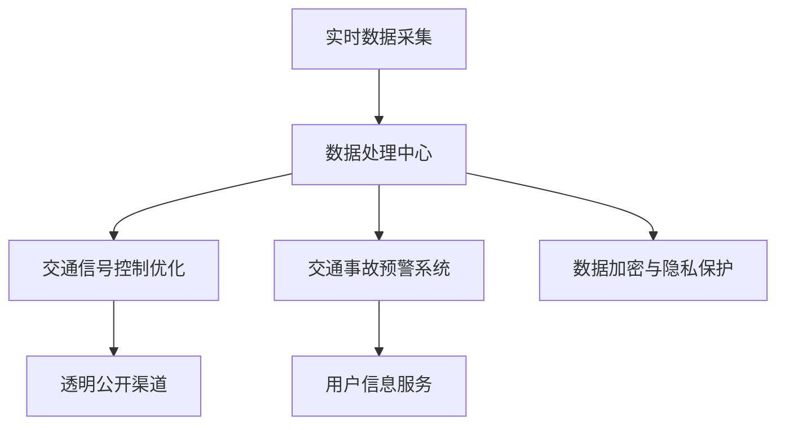
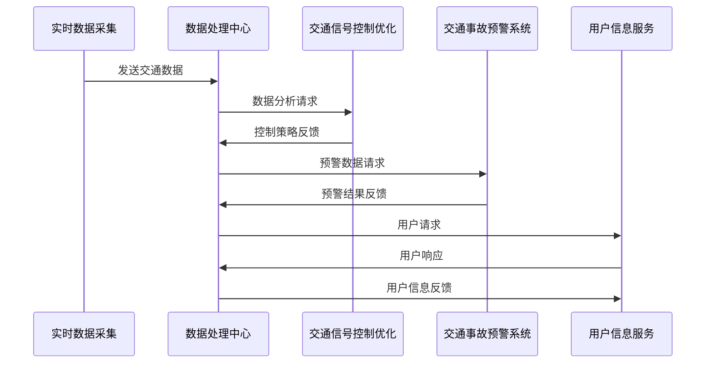

                 

### 引言

科研伦理与社会影响评估是现代科学研究和工程实践中不可或缺的两个关键要素。科研伦理关注的是科学研究的道德规范，确保研究过程和结果不会对参与者造成伤害，同时维护研究的诚信和透明度。社会影响评估则侧重于评估科研成果对社会各个方面可能带来的影响，旨在确保科学进步能够最大限度地造福人类社会。

本篇文章将深入探讨科研伦理与社会影响评估的核心概念、方法、实践及其在科学研究和工程实践中的应用。我们将从以下几个方面进行详细分析：

首先，在第一章中，我们将介绍科研伦理和社会影响评估的基本背景，定义相关核心术语，回顾其历史发展和重要性。

其次，第二章将重点讨论科研伦理的核心原则，包括自主性、功利主义、非恶行和正义等，并通过具体的案例研究探讨这些原则在现实中的应用和挑战。

第三章将转向社会影响评估，介绍其方法和工具，包括定性、定量评估方法以及预测性、回顾性评估的对比，并探讨现有评估框架和模型。

第四章将讨论科研伦理和社会影响评估在工程实践中的应用，包括项目介绍、功能设计、架构设计、接口设计和系统交互。

第五章和第六章将分别通过实际案例和项目实战展示如何在实际中应用科研伦理和社会影响评估的方法，并提供最佳实践和注意事项。

最后，在第七章中，我们将总结全文，强调科研伦理和社会影响评估的重要性，提出未来研究的方向和展望。

通过本文的逐步探讨，我们希望能够为科研工作者和工程实践者提供有价值的参考，帮助他们更好地理解并实践科研伦理和社会影响评估，以实现科学进步与社会责任的平衡。

### 关键词

1. **科研伦理**：研究过程中的道德规范与原则，确保研究过程的正当性和结果的可信度。
2. **社会影响评估**：评估科研成果对社会各方面的潜在影响，确保科学进步对社会有益。
3. **自主性**：研究参与者的自我决定权，确保其能够自由选择是否参与研究和研究的内容。
4. **功利主义**：研究以最大化利益和福利为核心，确保研究对社会带来实际的好处。
5. **非恶行**：研究过程中避免对参与者造成伤害或不利影响，确保研究过程的伦理正当性。
6. **正义**：研究过程中的资源分配和利益分配公平合理，确保研究结果的公平性。
7. **研究诚信**：研究过程中的诚实和透明，确保数据的准确性和研究的可靠性。

### 摘要

本文旨在深入探讨科研伦理与社会影响评估在现代科学研究和工程实践中的重要性。通过分析科研伦理的核心原则，如自主性、功利主义、非恶行和正义，以及社会影响评估的方法和工具，我们能够更好地理解这些概念在现实中的应用和挑战。本文首先介绍了科研伦理和社会影响评估的基本背景和定义，然后详细探讨了科研伦理的核心原则和实际案例，并分析了社会影响评估的方法和工具。通过具体的工程实践案例和项目实战，本文展示了如何在实际操作中应用科研伦理和社会影响评估的方法。最后，本文总结了全文的主要观点，强调了科研伦理和社会影响评估在促进科学进步和实现社会责任中的关键作用，并提出了未来的研究方向和展望。通过本文的探讨，我们希望能够为科研工作者和工程实践者提供有价值的指导，促进科研伦理和社会影响评估的深入实践。

### 第一章：科研伦理与社会影响评估的背景

#### 1.1 研究伦理的定义和重要性

科研伦理，通常指的是在科学研究和工程实践中遵循的一系列道德规范和原则，旨在确保研究过程的正当性和结果的可信度。这些伦理规范不仅涉及到研究设计、数据收集和分析，还包括研究过程中的参与者权益保护、研究诚信以及公共责任等方面。科研伦理的重要性在于，它能够引导科研人员以道德和合规的方式开展研究，防止不当行为的发生，从而提高科研的公信力和影响力。

在科学研究的初期阶段，科研伦理主要关注的是如何保护参与者的权益。例如，1947年，美国心理学家米尔格拉姆（Solomon Asch）的经典电击实验引发了广泛的伦理争议。实验中，受试者被要求对一个假定的学生进行电击，尽管这些电击实际上是模拟的。这一实验揭示了人类对权威的盲从性，但同时也引发了关于人类实验者对受试者进行心理和身体伤害的伦理担忧。此后，科学界开始重视研究伦理，制定了相关的伦理准则，确保类似实验不再重复。

随着科学技术的发展，科研伦理的内容也逐渐丰富和多样化。现代科研伦理不仅关注参与者权益的保护，还包括研究过程的透明性、数据的诚实性和研究的公正性等方面。例如，1974年的阿帕克西班（Apartheid）实验，揭示了在种族隔离政策下的医学研究对受试者的不公正对待，进一步强调了科研伦理在国际研究合作中的重要性。

#### 1.2 社会影响的定义和重要性

社会影响评估（Social Impact Assessment, SIA）是指通过系统的方法和工具，对科研成果或技术项目对社会各个方面可能带来的影响进行评估和分析。社会影响评估的目的是确保科学进步不仅能够带来技术上的突破，同时也能够在社会层面带来积极的变化和利益。

社会影响评估的重要性体现在多个方面。首先，它能够帮助科研机构和项目决策者预见和应对潜在的社会风险和挑战，从而减少负面影响。例如，某项新技术的开发和应用可能会影响就业市场、环境质量或社会稳定，通过社会影响评估，可以提前识别这些问题，并提出相应的应对措施。

其次，社会影响评估有助于提高科研成果的透明度和公众参与度。通过评估科研成果对社会的影响，可以更好地与公众沟通，解释研究的意义和潜在风险，从而增强公众对科研工作的信任和支持。

最后，社会影响评估还能够促进科研与社会的互动和合作。通过评估科研成果对社会的影响，可以更好地理解社会需求，推动科研工作与社会发展的深度融合。

#### 1.3 研究伦理的历史背景和发展

研究伦理的历史可以追溯到古希腊时期，当时的哲学家如亚里士多德和柏拉图就曾探讨过道德和伦理问题。然而，现代科研伦理的发展主要集中在20世纪中期。以下是几个关键历史事件：

- **二战期间的人体实验**：二战期间，纳粹德国在集中营中进行了大量的人体实验，这些实验严重违反了伦理原则，对受试者的身心健康造成了极大的伤害。战后，这一事件引起了国际社会的广泛关注，促成了《纽伦堡法典》的制定，明确了人体实验的基本伦理准则。

- **1964年《赫尔辛基宣言》**：在二战后，为了规范人体实验，1964年世界医学会（World Medical Association）发布了《赫尔辛基宣言》。该宣言详细规定了人体实验的基本原则，如知情同意、伦理审查和受试者权益保护，成为现代科研伦理的重要基石。

- **1974年《贝尔蒙报告》**：1974年，美国国家研究委员会发布了《贝尔蒙报告》（Belmont Report），该报告系统地总结了人体实验的伦理原则，提出了自主性、非恶行和正义三大核心伦理原则，这些原则至今仍被广泛应用于科研伦理的各个领域。

- **21世纪以来的发展**：随着科技进步和全球化进程的加快，科研伦理的内容也在不断扩展。例如，涉及人类基因编辑的研究引发了关于伦理和法律的新挑战，催生了更多的伦理讨论和法规制定。

#### 1.4 社会影响评估的历史背景和发展

社会影响评估作为一个独立的领域，其发展历程可以追溯到20世纪中叶。以下是一些关键历史事件：

- **1960年代的社会实验**：在20世纪60年代，许多国家和组织开始关注公共政策和项目对社会的影响。例如，美国在实施“伟大社会”计划时，对各个项目的社会效益进行了系统的评估。

- **1970年代的环境评估**：随着环境问题的日益严重，社会影响评估逐渐扩展到环境领域。1970年代，美国通过了《国家环境政策法》（National Environmental Policy Act），要求在制定重大政策或项目前进行环境影响评估。

- **1980年代的社会发展评估**：在20世纪80年代，社会影响评估的应用范围进一步扩大，涵盖了社会发展、经济增长等各个方面。例如，世界银行和联合国等国际组织在制定和发展计划时，都会进行详细的社会影响评估。

- **21世纪的数字化社会影响评估**：随着信息技术的迅猛发展，社会影响评估的方法和工具也不断更新和改进。大数据分析、机器学习和人工智能等技术的应用，使得社会影响评估更加精确和高效。

通过上述历史背景的介绍，我们可以看到，科研伦理和社会影响评估的发展是一个不断适应和回应社会需求的过程。从早期的人体实验伦理，到现代的全面社会影响评估，这些领域都在不断地规范和完善，以适应科技发展的新挑战。在接下来的章节中，我们将进一步探讨科研伦理和社会影响评估的核心概念、方法和实践。

### 核心概念

在深入探讨科研伦理和社会影响评估之前，我们需要明确几个核心概念和术语。这些概念不仅是理解这两个领域的基础，也是评估和研究过程中必须考虑的重要因素。

#### 研究伦理

研究伦理是科学研究过程中遵循的一系列道德规范和原则，旨在确保研究过程的正当性和结果的可信度。以下是几个关键术语及其定义：

- **知情同意**（Informed Consent）：研究参与者明确了解研究的性质、目的、潜在风险和好处，并自愿同意参与研究的过程。
- **保密性**（Confidentiality）：确保参与者的个人信息和实验数据不被未经授权的人员访问或泄露。
- **自主性**（Autonomy）：研究参与者的自我决定权，确保其能够自由选择是否参与研究以及参与研究的程度。
- **非恶行**（Nonmaleficence）：避免对参与者造成不必要的伤害或不适。
- **正义**（Justice）：确保研究资源的公平分配，以及研究结果的公正性和合理性。

#### 社会影响评估

社会影响评估是系统评估科研成果或技术项目对社会各个方面可能带来的影响的过程。以下是几个关键术语及其定义：

- **社会影响**（Social Impact）：科研成果或技术项目对社会各个层面，包括经济、环境、社会和文化等方面可能产生的影响。
- **定性评估**（Qualitative Assessment）：通过描述性的分析，评估社会影响的质量和性质，如社会稳定、社会认同、文化冲击等。
- **定量评估**（Quantitative Assessment）：通过数量化的分析，评估社会影响的程度和范围，如就业变化、经济增长、环境影响等。
- **预测性评估**（Predictive Assessment）：评估未来可能发生的社会影响，通常基于模型预测和趋势分析。
- **回顾性评估**（Retrospective Assessment）：评估已发生的社会影响，通常基于历史数据和实际结果的分析。

#### 研究伦理与社会影响评估的联系

科研伦理和社会影响评估虽然侧重不同，但两者之间有着紧密的联系。科研伦理强调的是研究过程中的道德规范，确保研究的正当性和参与者的权益保护；而社会影响评估则侧重于科研成果对社会各方面的潜在影响，确保科技进步能够造福社会。

例如，在进行某项医学研究时，科研伦理要求研究者必须获得参与者的知情同意，并确保研究过程中的数据保密性和参与者的自主性。而社会影响评估则需要评估这项研究可能会带来的医疗进步、社会认同、伦理争议等方面的社会影响。

通过明确上述核心概念和术语，我们可以更好地理解科研伦理和社会影响评估的基本原理和实践，为后续章节的详细探讨打下坚实的基础。

### 核心概念与联系

在深入探讨科研伦理和社会影响评估的核心概念与联系之前，我们需要对这些概念进行详细阐述，并通过表格和ER实体关系图架构来直观展示其属性和关系。

#### 科研伦理的核心概念与联系

科研伦理的核心概念包括自主性、非恶行、正义和保密性。以下是这些概念的具体定义和属性：

| 核心概念 | 定义 | 属性 |  
| --- | --- | --- |  
| **自主性** | 参与者的自我决定权，确保其能够自由选择是否参与研究和研究的内容。 | 自主选择、知情同意、自愿参与 |  
| **非恶行** | 避免对参与者造成不必要的伤害或不适。 | 避免伤害、最小化风险、合规性 |  
| **正义** | 确保研究资源的公平分配，以及研究结果的公正性和合理性。 | 公平性、公正性、资源分配 |  
| **保密性** | 确保参与者的个人信息和实验数据不被未经授权的人员访问或泄露。 | 数据保护、隐私维护、合规性 |

#### 社会影响评估的核心概念与联系

社会影响评估的核心概念包括社会影响、定性评估、定量评估、预测性评估和回顾性评估。以下是这些概念的具体定义和属性：

| 核心概念 | 定义 | 属性 |  
| --- | --- | --- |  
| **社会影响** | 科研成果或技术项目对社会各个层面，包括经济、环境、社会和文化等方面可能产生的影响。 | 影响范围、影响程度、影响性质 |  
| **定性评估** | 通过描述性的分析，评估社会影响的质量和性质，如社会稳定、社会认同、文化冲击等。 | 质性分析、影响描述、描述性指标 |  
| **定量评估** | 通过数量化的分析，评估社会影响的程度和范围，如就业变化、经济增长、环境影响等。 | 量化分析、数量指标、统计分析 |  
| **预测性评估** | 评估未来可能发生的社会影响，通常基于模型预测和趋势分析。 | 预测模型、趋势分析、预测指标 |  
| **回顾性评估** | 评估已发生的社会影响，通常基于历史数据和实际结果的分析。 | 历史数据、实际结果、分析对比 |

#### ER实体关系图架构

为了更直观地展示科研伦理和社会影响评估的核心概念及其联系，我们可以使用Mermaid绘制ER实体关系图。以下是ER图示例：

```mermaid
erDiagram
    Class Participant <<--o Research : conductedBy
    Class Research ||--o Ethics : follows
    Class Research ||--o Impact : has
    Class Ethics ||--o Autonomy : includes
    Class Ethics ||--o Nonmaleficence : includes
    Class Ethics ||--o Justice : includes
    Class Ethics ||--o Confidentiality : includes
    Class Impact ||--o Qualitative : includes
    Class Impact ||--o Quantitative : includes
    Class Impact ||--o Predictive : includes
    Class Impact ||--o Retrospective : includes
```

在ER图中，参与者（Participant）是研究的执行对象，研究（Research）由参与者进行，并遵循伦理（Ethics）原则。伦理包括自主性、非恶行、正义和保密性等子概念，而研究的影响（Impact）则进一步细分为定性评估、定量评估、预测性评估和回顾性评估等子概念。这种结构清晰地展示了科研伦理和社会影响评估之间的内在联系和层次关系。

通过上述表格和ER实体关系图，我们能够更清晰地理解科研伦理和社会影响评估的核心概念及其相互联系，为后续章节的深入探讨奠定了基础。

### 研究伦理的基本原则

在科研伦理中，有几个核心原则被广泛认可和应用，这些原则不仅是指导科研行为的基本准则，也是评价科研过程和结果的重要依据。下面我们将详细探讨这些基本原则，并分析其在科学研究中的具体应用。

#### 自主性（Autonomy）

自主性是指参与者有权自主决定是否参与研究以及参与的程度。这一原则强调的是尊重个体的自由和选择权。在科研实践中，自主性的实现主要通过知情同意（Informed Consent）来实现。

- **知情同意**：研究者在开始研究前必须向参与者提供详细的信息，包括研究的目的、方法、可能的风险和利益等。参与者必须在完全了解这些信息的基础上，自愿决定是否参与研究。
- **自主性的应用实例**：在医学研究中，自主性原则确保了患者有权决定是否接受某种新疗法。例如，在临床试验中，研究者必须向患者详细解释试验的流程和可能的副作用，患者在此基础上自主决定是否参与。

#### 非恶行（Nonmaleficence）

非恶行原则要求研究者避免对参与者造成不必要的伤害或不适。这一原则的核心是保护参与者的权益，确保研究不会对他们造成负面影响。

- **风险最小化**：研究者应设计研究方案，尽量减少参与者的风险。例如，在实验设计时，研究者可以采用模拟或无害的方法，以降低实际操作中的风险。
- **紧急情况下的决策**：在某些紧急情况下，研究者可能需要采取临时措施以保护参与者的健康，但必须在事后向伦理委员会报告，并解释所采取的措施和原因。
- **非恶行的应用实例**：在药物临床试验中，研究者必须确保试验药物的剂量在安全范围内，并通过多次测试确认其安全性。如果发现药物存在严重副作用，研究者应立即停止试验，并采取措施保护参与者的健康。

#### 正义（Justice）

正义原则强调资源的公平分配和机会的公平提供。在科研伦理中，正义原则确保研究过程中所有参与者都能平等地享受研究的利益，避免资源的不公平分配。

- **公平参与**：在多中心研究中，不同参与者的参与机会应尽量公平，避免某些群体被过度代表或忽视。
- **受益与负担平衡**：参与者不仅应承担研究带来的风险和负担，也应公平分享研究带来的利益，例如科研成果的收益和知识分享。
- **正义的应用实例**：在公共卫生研究中，研究者应确保受试者能够公平获得研究结果带来的健康益处，特别是对于经济条件较差的群体。

#### 保密性（Confidentiality）

保密性原则要求研究者保护参与者的个人信息和实验数据，确保其不被未经授权的人员访问或泄露。

- **数据保护**：研究者应采取适当的数据加密和存储措施，确保实验数据的保密性。例如，使用匿名化处理技术，防止个人信息与实验数据直接关联。
- **隐私保护**：在研究过程中，研究者应告知参与者其个人信息可能被用于何种目的，并确保其隐私得到保护。
- **保密性的应用实例**：在心理健康研究中，参与者可能涉及敏感信息，如心理疾病史或个人隐私。研究者必须确保这些信息得到严格保密，以避免参与者因信息公开而遭受社会歧视或心理压力。

#### 原则在科学研究中的应用

这些伦理原则在科学研究中的具体应用不仅有助于保护参与者的权益，还能够提高研究的可信度和公众的信任度。

- **伦理审查**：大多数研究项目在开始前都需要经过伦理审查委员会的审查，确保研究设计符合伦理原则。这一过程有助于发现潜在的伦理问题，并在研究开始前解决。
- **研究透明度**：通过公开研究方法和数据，研究者能够增加研究的透明度，提高公众对科研工作的信任。
- **多中心合作**：跨机构的合作研究可以通过多个伦理审查，确保研究在全球范围内的合规性和公正性。

总之，科研伦理的基本原则不仅为科学研究提供了道德框架，也为科研工作者提出了具体的行为准则。通过严格遵循这些原则，科研工作者能够更好地保护参与者的权益，确保研究的正当性和可信度，从而推动科学进步和社会发展。

### 研究诚信与学术不端行为

研究诚信是科研伦理的重要组成部分，它强调的是科学研究的真实性和透明度。研究诚信不仅涉及数据的真实性和完整性，还包括研究过程中的诚实和责任感。然而，学术不端行为，如数据造假、抄袭和剽窃，严重破坏了科研的公信力和科学进步的可持续性。在本节中，我们将探讨研究诚信的重要性、学术不端行为的类型以及如何预防和应对这些问题。

#### 研究诚信的重要性

研究诚信是科学研究的基础，是确保科研成果真实可靠的关键。以下是研究诚信的一些重要方面：

- **数据真实性**：科研工作者必须确保其研究数据的真实性和可靠性。任何形式的数据造假，如篡改实验结果或伪造数据，都是不可接受的。
- **透明度**：研究过程和结果应该公开透明，研究者应详细记录研究方法、实验过程和数据来源，以便其他研究者验证和复现研究。
- **责任感和道德行为**：科研工作者应有高度的责任感和道德行为，不仅要对自己的研究负责，也要对整个科研社区负责。

#### 学术不端行为的类型

学术不端行为主要包括数据造假、抄袭和剽窃等，这些行为不仅违反了科研伦理，还可能导致严重的后果。

- **数据造假**：数据造假是指伪造、篡改或篡改实验数据，以得出预期的结果。这种行为不仅破坏了科研的公正性，还可能导致错误的科学结论。
- **抄袭**：抄袭是指未经允许复制他人的研究成果或文字，并将其作为自己的作品发表。这种行为不仅侵犯了原作者的知识产权，还降低了学术水平和科研效率。
- **剽窃**：剽窃是指窃取他人的研究成果或创意，以自己的名义发表。这种行为不仅违背了学术诚信，还可能导致学术声誉的严重损害。

#### 如何预防学术不端行为

预防学术不端行为需要从多个方面入手，包括教育、监督和制度建设。

- **教育和培训**：科研工作者应接受定期的科研伦理教育和培训，了解学术不端行为的定义、后果以及如何避免这些行为。
- **建立严格的研究规范**：研究机构和学术机构应制定明确的研究规范和伦理准则，确保所有研究项目都符合伦理要求。
- **加强监督和审查**：研究机构应设立独立的伦理审查委员会，对研究项目进行定期审查，确保研究过程的正当性和数据的真实性。
- **利用技术手段**：利用数据分析和反抄袭软件，对研究数据和研究文献进行检测，发现和预防学术不端行为。

#### 应对学术不端行为

一旦发现学术不端行为，应立即采取适当的措施进行处理。

- **内部调查**：研究机构应设立内部调查小组，对涉嫌学术不端的行为进行调查，确保调查过程的公正性和透明度。
- **公开通报和处理**：对确认的学术不端行为，应公开通报并采取相应的处理措施，包括撤销研究成果、取消学术资格等。
- **法律责任**：严重学术不端行为可能涉及法律责任，如伪造数据可能触犯刑法，研究机构应与司法机关合作，依法追究责任。

总之，研究诚信是科研工作的基石，学术不端行为不仅损害了科研的公正性和诚信，还对整个科研社区造成了负面影响。通过加强教育和培训、建立严格的规范和监督机制，以及及时处理学术不端行为，我们能够维护科研的诚信和科学进步的可持续性。

### 研究伦理中的常见伦理困境与案例

在科学研究过程中，研究者常常会遇到各种伦理困境，这些困境涉及到复杂的道德判断和实际操作问题。本节将探讨一些常见的研究伦理困境，并通过具体案例进行分析和讨论，以帮助研究者更好地理解和应对这些挑战。

#### 伦理困境一：知情同意与隐私保护

**困境描述**：在许多研究中，尤其是涉及敏感数据的调研或生物医学研究中，研究者需要在尊重参与者隐私的同时，确保知情同意的有效性。

**案例**：某心理学研究项目旨在探讨网络成瘾对青少年心理健康的长期影响。研究者需要收集大量涉及隐私的数据，如社交媒体使用记录、家庭背景等。

**分析**：
- **知情同意**：在开始收集数据之前，研究者必须获得参与者的明确同意，并告知他们数据的具体用途、存储方式和可能的潜在风险。
- **隐私保护**：研究者需采取严格的隐私保护措施，例如匿名化处理数据，确保数据不会泄露参与者的个人信息。

**解决方案**：研究者应在研究设计阶段就充分考虑知情同意和隐私保护的平衡，采用匿名化和加密技术，并定期审查和更新隐私保护政策。

#### 伦理困境二：实验风险与利益权衡

**困境描述**：在进行高风险实验时，研究者需要在潜在利益和实验风险之间做出权衡，确保参与者的安全。

**案例**：某医学研究项目旨在测试一种新型治疗药物对晚期癌症患者的疗效。然而，这种药物尚未经过充分的安全测试。

**分析**：
- **风险与利益**：研究者必须评估实验药物的安全性和潜在疗效，并在知情同意书中详细说明可能的风险和受益。
- **伦理审查**：研究项目在开始前需要通过伦理审查委员会的审查，确保实验设计符合伦理标准。

**解决方案**：研究者应制定详细的风险评估计划，并在实验过程中持续监测参与者的健康状况，一旦发现严重不良反应，应立即采取措施并停止实验。

#### 伦理困境三：多中心合作与伦理冲突

**困境描述**：在多中心研究中，不同国家的文化和法律背景可能不同，导致伦理冲突。

**案例**：某跨国研究项目旨在评估一种新疫苗在不同国家的效果。然而，不同国家对疫苗试验的伦理要求存在差异。

**分析**：
- **伦理差异**：研究者需要了解和尊重各国的伦理法规和文化背景，确保研究项目的合规性。
- **协调与沟通**：研究者应建立跨文化沟通机制，协调不同中心的伦理审查和操作流程。

**解决方案**：研究者应在项目初期明确各中心的伦理要求，建立统一的操作指南和伦理标准，并通过定期会议和沟通解决潜在的冲突。

#### 伦理困境四：资源分配与公平性

**困境描述**：在资源有限的情况下，研究者需要公平分配研究资源，避免不公平现象。

**案例**：某医疗机构计划进行一项新药物临床试验，但由于预算限制，只能招募有限数量的患者。

**分析**：
- **公平性原则**：研究者应遵循公平性原则，确保患者有平等的参与机会。
- **优先级评估**：研究者需根据患者的病情严重程度和潜在受益进行优先级评估。

**解决方案**：研究者应制定透明、公正的资源分配标准，并公开解释资源分配的依据，确保所有患者都有公平的机会参与研究。

通过上述案例和分析，我们可以看到研究伦理困境的复杂性和多样性。研究者需要具备良好的伦理素养，能够识别和应对这些困境，确保科研过程和结果的伦理正当性。通过有效的策略和措施，研究者可以更好地平衡科学进步与伦理责任，推动科研工作的健康发展。

### 社会影响评估的方法和工具

社会影响评估（Social Impact Assessment, SIA）是评估科研成果或技术项目对社会各方面潜在影响的重要过程。为了确保科学研究和工程实践能够对社会产生积极影响，社会影响评估需要采用多种方法和工具。以下将详细探讨几种常见的社会影响评估方法和工具，包括定性评估和定量评估方法，以及预测性评估和回顾性评估的方法。

#### 定性评估方法

定性评估方法侧重于通过描述性的分析来理解社会影响的质量和性质。以下是几种常见的定性评估方法：

1. **专家访谈**：通过与专家、利益相关者和公众进行访谈，收集他们对项目影响的看法和意见。这种方法有助于了解项目的潜在影响和社会反响，但结果容易受到主观因素的影响。

2. **焦点小组**：组织小规模的讨论小组，让不同背景和利益相关者参与，共同讨论项目可能带来的社会影响。这种方法可以促进多方面的观点交流和深度讨论，但需要确保小组成员的代表性和多样性。

3. **案例研究**：对某一具体项目或现象进行深入分析，通过详细描述和解释其社会影响。这种方法适用于复杂或独特的社会影响评估项目，但可能需要大量的时间和资源。

4. **文献综述**：通过系统性地回顾和分析现有的文献和研究，评估项目可能带来的社会影响。这种方法有助于发现和利用已有的研究成果，但可能缺乏对当前项目的直接评估。

#### 定量评估方法

定量评估方法通过数量化的分析来评估社会影响的程度和范围。以下是几种常见的定量评估方法：

1. **统计分析**：使用统计方法对大量数据进行处理和分析，例如回归分析、相关分析和因子分析等。这种方法可以揭示变量之间的关系和影响程度，但需要大量的数据支持和专业的统计分析技能。

2. **成本-效益分析**：评估项目的社会成本和效益，通过计算成本和收益的差额来评估项目的经济影响。这种方法适用于需要经济评估的项目，但可能忽略非经济因素。

3. **社会回报评估**：评估项目对社会各方面的回报，包括经济、社会和文化等。这种方法可以帮助决策者全面了解项目的综合影响，但需要明确的评估指标和标准。

4. **指标体系**：建立一套综合的指标体系，包括定量和定性指标，用于评估项目的多方面影响。这种方法可以提供全面的评估结果，但需要系统的设计和实施。

#### 预测性评估方法

预测性评估方法主要用于评估未来可能发生的社会影响，通常基于模型预测和趋势分析。以下是几种常见的预测性评估方法：

1. **情景分析**：通过构建不同的未来情景，分析项目在不同情景下的社会影响。这种方法可以提供对项目未来影响的多种可能性和应对策略。

2. **系统动力学**：使用系统动力学模型来模拟项目对社会系统的长期影响。这种方法适用于复杂的社会系统，但需要深入理解系统的结构和机制。

3. **多标准决策分析**：通过综合考虑多个评估标准和决策目标，评估项目在不同决策方案下的影响。这种方法适用于需要多目标决策的复杂项目。

4. **机器学习和数据挖掘**：利用机器学习和数据挖掘技术，分析大量历史数据，预测项目未来可能的社会影响。这种方法可以提供高精度的预测结果，但需要大量高质量的数据和先进的计算技术。

#### 回顾性评估方法

回顾性评估方法主要用于评估已发生的社会影响，通常基于历史数据和实际结果的分析。以下是几种常见的回顾性评估方法：

1. **后评估**：在项目完成后，对项目的实际社会影响进行系统评估。这种方法可以提供项目长期效果的真实反馈，但需要足够的时间和资源。

2. **绩效评估**：对项目的绩效进行评估，包括目标达成情况、资源配置效率和项目成本等。这种方法适用于需要评估项目运营效率和效果的项目。

3. **利益相关者反馈**：收集利益相关者对项目的反馈和评价，评估项目的社会影响和满意度。这种方法可以提供多方面的视角和评价，但需要有效的沟通和反馈机制。

4. **比较研究**：通过比较不同项目或时间段的社会影响，评估项目的独特性和长期效果。这种方法适用于需要分析项目差异和长期影响的评估。

通过上述方法和工具，社会影响评估能够提供全面、系统的评估结果，帮助决策者和研究人员更好地理解项目的社会影响，制定有效的应对策略。在接下来的章节中，我们将进一步探讨如何将社会影响评估方法应用于科研和工程实践。

### 社会影响评估的现有框架和模型

社会影响评估（SIA）作为一种系统化的评估过程，旨在全面分析科研成果或技术项目对社会各方面的潜在影响。为了提高评估的准确性和系统性，研究者们已经发展出多种评估框架和模型。以下将介绍几种常见的社会影响评估框架和模型，以及它们的优缺点。

#### 1. **SLOC模型**

**定义**：SLOC模型（Social Life Cycle Model）是一种生命周期视角下的社会影响评估框架，它将评估范围扩展到项目的整个生命周期，从设计到运营和结束阶段。

**优点**：SLOC模型能够全面考虑项目在不同阶段的潜在社会影响，有助于识别和管理长期的社会风险。

**缺点**：该模型对项目细节要求较高，需要详细的数据和深入的背景分析，实施成本较高。

#### 2. **PAS模型**

**定义**：PAS模型（Pre-Assessment, Assessment, and Submission Model）是一种三阶段评估框架，包括预评估、正式评估和报告提交。

**优点**：PAS模型结构清晰，便于项目管理，每个阶段都有明确的任务和目标。

**缺点**：由于缺乏连续的反馈和调整机制，该模型可能难以及时应对项目实施过程中出现的新问题。

#### 3. **CIPP模型**

**定义**：CIPP模型（Context, Input, Process, Product）是一种综合性评估框架，它从四个不同维度对项目进行评估，包括项目背景、输入资源、过程执行和最终产出。

**优点**：CIPP模型提供了一个全面的视角，有助于评估项目的各个方面，特别是项目的执行过程。

**缺点**：该模型的评估过程较为复杂，需要大量的时间和资源。

#### 4. **STAR模型**

**定义**：STAR模型（Social, Technical, Administrative, and Regulatory）是一种多维度评估框架，它从社会、技术、行政和法律四个方面评估项目的潜在社会影响。

**优点**：STAR模型能够提供全面的影响评估，有助于识别和管理不同维度的社会风险。

**缺点**：由于涉及的维度较多，评估过程可能变得繁琐，难以在实践中广泛应用。

#### 5. **SMART模型**

**定义**：SMART模型（Specific, Measurable, Achievable, Relevant, and Time-bound）是一种目标设定和评估框架，它将评估目标具体化，便于监控和调整。

**优点**：SMART模型有助于明确项目目标和评估标准，提高评估的针对性和效率。

**缺点**：该模型主要侧重于目标的设定和评估，可能忽视项目实施过程中的动态变化和不确定性。

#### 案例分析

**案例**：某地方政府计划实施一项新的公共交通系统建设项目。

- **SLOC模型**：在项目的整个生命周期中，SLOC模型能够帮助识别和评估项目的环境影响、社会经济效益以及长期运营风险。
- **PAS模型**：通过PAS模型，项目团队可以在预评估阶段识别潜在问题，制定详细的评估计划，并在正式评估和报告提交阶段提供全面的社会影响评估报告。
- **CIPP模型**：CIPP模型可以从背景、输入、过程和产出四个维度对公共交通系统项目进行评估，确保项目的各个方面都得到充分考虑。
- **STAR模型**：STAR模型能够帮助评估项目在社会、技术、行政和法律方面的潜在影响，为项目决策提供多维度的支持。
- **SMART模型**：SMART模型可以帮助设定具体的项目目标和评估标准，确保项目的实施和评估都有明确的目标和时间表。

通过上述框架和模型的应用，项目团队能够更全面、系统地评估公共交通系统项目的潜在社会影响，从而制定出更科学、合理的项目规划和决策。这不仅能提高项目的成功概率，还能最大限度地减少社会风险，实现项目目标与社会责任的平衡。

### 社会影响评估的挑战和限制

尽管社会影响评估（SIA）作为一种系统化的评估方法，在科研项目和工程实践中发挥着重要作用，但其在实际应用中仍面临着诸多挑战和限制。以下是社会影响评估过程中常见的几个问题及其可能的解决策略。

#### 1. 数据获取的困难

**挑战**：社会影响评估需要大量的数据来支撑评估过程，但这些数据的获取往往面临困难。例如，某些数据可能涉及隐私问题，难以公开获取；另外，数据的质量和完整性也可能存在欠缺。

**解决策略**：
- **多方合作**：与政府机构、学术研究机构和私人企业合作，共同收集和共享数据资源。
- **数据隐私保护**：采用匿名化和加密技术，确保数据在收集、存储和分析过程中的隐私保护。
- **数据共享机制**：建立数据共享平台，促进不同利益相关者之间的数据共享和合作。

#### 2. 评估方法的局限

**挑战**：现有的社会影响评估方法各有优缺点，但很难有一个统一的评估方法能够全面、准确地评估所有类型的社会影响。此外，不同方法之间的兼容性和连贯性也存在问题。

**解决策略**：
- **综合评估方法**：结合多种评估方法，例如定性评估与定量评估相结合，以提高评估结果的全面性和准确性。
- **标准化评估框架**：制定统一的评估标准和框架，提高评估方法的兼容性和连贯性，便于不同项目之间的比较和参考。
- **方法优化与更新**：根据实际应用情况，不断优化和更新评估方法，以适应不断变化的社会环境和需求。

#### 3. 评估结果的解释和应用

**挑战**：社会影响评估的结果往往较为复杂，且涉及多个维度和层面，如何准确地解释和应用评估结果，是一个重大的挑战。

**解决策略**：
- **透明和详细的报告**：撰写详细、透明的社会影响评估报告，解释评估方法、结果和结论，提高结果的清晰度和可理解性。
- **利益相关者参与**：在评估过程中，积极邀请利益相关者参与，包括公众、政府机构、企业和社会团体，以提高评估结果的实际应用价值。
- **持续反馈和调整**：建立持续的反馈机制，根据利益相关者的反馈和实际情况，对评估结果进行调整和优化，确保评估结果的实用性和有效性。

#### 4. 评估成本的考量

**挑战**：社会影响评估通常需要投入大量的人力和物力资源，特别是对于复杂和长期的项目，评估成本可能非常高。

**解决策略**：
- **成本效益分析**：在项目初期进行成本效益分析，评估社会影响评估的必要性和成本效益，确保资源的合理配置。
- **技术手段的引入**：利用大数据分析、人工智能和机器学习等技术，提高评估效率和精度，降低评估成本。
- **政府和社会资金支持**：争取政府和社会资金的支持，通过公共资金投入和合作伙伴的资助，共同分担评估成本。

通过上述策略，我们可以更好地应对社会影响评估过程中面临的挑战和限制，提高评估的准确性和有效性，为科学研究和工程实践提供有力的支持。

### 科研伦理和社会影响评估在工程实践中的应用

在工程实践中，科研伦理和社会影响评估扮演着至关重要的角色。它们不仅确保项目在技术层面的成功，还保障了项目在社会层面的可持续性和正当性。以下我们将探讨如何在实际项目中应用这些概念，并通过具体案例来展示其应用效果。

#### 1. 项目介绍

某科技公司计划开发一款基于人工智能的智能交通管理系统，旨在缓解城市交通拥堵，提高交通效率。该项目的预期目标包括实时交通流量监测、优化交通信号控制、减少交通事故等。

#### 2. 功能设计

在项目初期，团队首先进行了详细的功能设计，包括以下几个方面：

- **实时交通流量监测**：通过部署在道路上的传感器和摄像头，实时采集交通流量数据。
- **数据分析和信号优化**：利用大数据分析和机器学习算法，对采集到的交通数据进行分析，优化交通信号灯控制策略。
- **交通事故预警**：通过分析交通数据和历史事故记录，提前预警潜在的交通事故风险。
- **用户信息服务**：为用户提供实时交通信息，包括路况、最佳行驶路线等。

#### 3. 系统架构设计

在系统架构设计阶段，团队遵循科研伦理和社会影响评估的原则，确保系统的设计在技术和社会层面都具备可行性。

- **数据隐私保护**：系统设计包括严格的数据隐私保护措施，所有采集的数据都经过加密处理，确保个人隐私不被泄露。
- **透明和公开**：系统的设计和运作过程都保持透明，通过公共渠道公布系统的主要功能和运行情况，接受公众监督。
- **社会影响评估**：在系统设计阶段，团队进行了社会影响评估，评估了系统可能对社会各方面（如经济、环境、社会文化）的影响，并制定了相应的应对措施。

以下是该系统的架构设计图，使用Mermaid绘制：



#### 4. 系统接口设计和交互

在系统接口设计阶段，团队确保不同模块之间的无缝交互和数据流通。以下是系统接口设计图，使用Mermaid绘制：



#### 5. 项目实施中的科研伦理和社会影响评估

在项目实施过程中，团队不断应用科研伦理和社会影响评估的原则，确保项目的顺利进行和良好的社会影响。

- **伦理审查**：在项目启动前，团队向伦理委员会提交了详细的伦理审查申请，包括知情同意、数据隐私保护和风险评估等内容。伦理委员会对项目进行了严格审查，确保项目符合伦理要求。
- **持续评估**：在项目实施过程中，团队定期进行社会影响评估，评估系统在不同阶段的运行效果和社会反响，并根据评估结果调整和优化系统设计。
- **公众参与**：团队通过多种渠道，包括新闻发布会、公众咨询会和社交媒体平台，与公众保持密切沟通，听取公众的意见和建议，确保系统的设计和运作能够满足公众的需求和期望。

#### 6. 应用效果和案例

通过科研伦理和社会影响评估的指导，该项目在实际实施中取得了显著成效：

- **交通效率提升**：系统通过实时交通流量监测和优化交通信号控制，有效缓解了城市交通拥堵，提高了交通效率。
- **交通事故减少**：系统的事故预警功能显著降低了交通事故的发生率，为市民提供了更加安全的交通环境。
- **用户满意度提高**：用户信息服务为市民提供了便捷的交通信息，提高了用户的出行体验和满意度。

#### 总结

科研伦理和社会影响评估在工程实践中的应用，不仅确保了项目的技术成功，还保障了项目的伦理正当性和社会效益。通过严格的伦理审查、持续的社会影响评估和公众参与，工程实践能够更好地平衡技术进步与社会责任，实现长期可持续发展。

### 实际案例分析

在探讨科研伦理和社会影响评估在工程实践中的应用时，一个具体的案例可以帮助我们更好地理解这些概念的实际操作。以下将分析一个实际案例，详细阐述如何在实际项目中应用科研伦理和社会影响评估，并进行深入剖析。

#### 案例背景

某跨国科技公司计划在东南亚地区开展一项大规模的5G网络基础设施建设项目。该项目旨在提升当地的通信技术水平，推动数字经济的发展。然而，由于涉及广泛的地理区域和多样化的社会文化背景，该项目面临着多重科研伦理和社会影响评估的挑战。

#### 研究目标

- **科研伦理目标**：确保研究过程和结果符合伦理规范，保护参与者的权益，避免伦理风险。
- **社会影响评估目标**：评估项目对社会各方面（如经济、环境、社会文化）的影响，制定相应的应对策略，实现项目的社会责任。

#### 实施步骤

1. **项目启动前伦理审查**：

   在项目启动前，团队向所在国的伦理委员会提交了详细的伦理审查申请，包括以下内容：

   - **知情同意**：制定知情同意书，详细解释项目的目的、方法、潜在风险和受益，确保所有参与者和当地社区成员都明确了解项目的内容和预期影响。
   - **数据隐私保护**：制定严格的数据隐私保护措施，确保收集的数据匿名化处理，防止个人信息的泄露。
   - **风险最小化**：制定详细的风险评估计划，确保在项目实施过程中采取有效的措施来降低潜在的风险。

2. **社会影响评估**：

   项目团队在项目实施过程中进行了详细的社会影响评估，采用多种评估方法和工具，包括：

   - **定性评估**：通过专家访谈、焦点小组讨论和案例研究，了解当地社会文化、经济环境和社区需求。
   - **定量评估**：收集和分析相关的统计数据，评估项目对当地经济、环境和社会文化的影响，如就业率、环境影响、社区满意度等。
   - **预测性评估**：基于现有数据，使用预测模型分析未来项目可能带来的社会影响，制定相应的应对策略。

3. **项目实施过程中的监控和反馈**：

   - **持续监控**：在项目实施过程中，团队定期进行社会影响评估，监控项目进展和社会反响，及时调整项目设计和实施策略。
   - **公众参与**：通过定期举办社区会议、公众咨询会等方式，与当地居民保持沟通，收集公众意见和反馈，确保项目能够满足公众的需求和期望。
   - **伦理审查**：项目团队定期向伦理委员会报告项目进展和伦理风险评估，确保项目始终符合伦理要求。

#### 结果分析

通过科研伦理和社会影响评估，该项目在实施过程中取得了以下成果：

- **伦理合规**：项目团队严格遵守科研伦理规范，确保研究过程和结果符合伦理要求，保护参与者和社区成员的权益。
- **社会影响正面**：社会影响评估结果显示，项目对当地经济、环境和社会文化产生了积极的影响。例如，项目带动了当地就业，提高了通信技术水平，增强了社区的信息获取能力。
- **风险可控**：通过详细的风险评估和监控措施，项目团队有效控制了潜在的社会风险，确保项目在技术和社会层面的顺利进行。

#### 深入剖析

1. **伦理风险和应对策略**：

   - **风险识别**：在项目启动前，团队通过文献调研和实地考察，识别了潜在的风险，如文化冲突、数据隐私保护、就业影响等。
   - **策略制定**：针对识别出的风险，团队制定了详细的应对策略，例如通过跨文化沟通和培训，减少文化冲突；采用先进的数据加密技术，保护数据隐私；制定就业培训计划，提高当地居民的就业技能。

2. **社会影响评估方法和工具**：

   - **定性评估**：团队通过专家访谈和焦点小组讨论，深入了解当地的社会文化背景和需求，确保项目设计能够满足当地居民的期望。
   - **定量评估**：通过收集和分析统计数据，评估项目对经济、环境和社会文化的影响，如就业率的变化、环境指标的变化、社区满意度的变化等。
   - **预测性评估**：使用预测模型，分析未来项目可能带来的社会影响，提前制定应对策略，如应对可能的经济波动、环境挑战等。

3. **公众参与和反馈**：

   - **参与机制**：通过定期举办社区会议和公众咨询会，建立公众参与的机制，确保项目设计和实施过程中能够及时收集公众的意见和建议。
   - **反馈调整**：根据公众的反馈和实际需求，团队对项目设计和实施进行了多次调整，确保项目能够更好地满足公众的需求和期望。

#### 结论

通过实际案例的分析，我们可以看到，科研伦理和社会影响评估在工程实践中的应用不仅有助于确保项目的伦理合规性和社会效益，还能提高项目的整体成功概率。通过严格的伦理审查、全面的社会影响评估和有效的公众参与，项目团队能够更好地应对潜在的风险和挑战，实现技术进步与社会责任的平衡。

### 最佳实践与注意事项

在科研伦理和社会影响评估的实践中，总结最佳经验和注意事项对于确保项目的成功和可持续发展至关重要。以下是一些关键的最佳实践和注意事项：

#### 1. 最佳实践

**全面准备和规划**：在项目启动前，应进行全面、细致的准备工作，包括伦理审查申请、风险评估、社会影响评估计划等。确保所有相关步骤都得到充分准备和规划，以避免项目实施过程中出现意外和风险。

**持续监控和评估**：项目实施过程中，应建立持续的监控和评估机制，定期对项目进展和影响进行评估。这不仅能及时发现和解决问题，还能确保项目始终符合科研伦理和社会影响评估的要求。

**多方面沟通和参与**：与利益相关者（包括参与者、公众、政府机构、非政府组织等）保持持续、有效的沟通，确保他们的意见和建议能够被充分考虑和实施。多方面的参与和反馈有助于提高项目的透明度和公众接受度。

**灵活调整和优化**：在项目实施过程中，应保持灵活性和适应性，根据实际情况和反馈及时调整项目设计和实施策略。这种灵活的调整和优化有助于提高项目的效果和可持续性。

#### 2. 注意事项

**确保数据隐私和安全**：在数据收集、存储和分析过程中，必须采取严格的数据隐私保护和安全措施，确保参与者的个人信息不被泄露或滥用。使用匿名化、加密和其他安全手段，最大限度地保护数据隐私。

**遵守伦理审查标准**：在项目启动前和实施过程中，必须严格遵守伦理审查委员会的标准和要求，确保研究过程和结果符合伦理规范。任何违反伦理规定的行为都可能导致项目的中止或失败。

**综合考虑社会影响**：在评估项目的社会影响时，必须综合考虑经济、环境、社会文化等多方面的因素，确保项目的实施不会带来负面影响。应采用多种评估方法和工具，提供全面的评估结果。

**公众参与与透明度**：确保公众参与和项目透明度，通过定期举办公开会议、发布报告和利用社交媒体等手段，与公众保持密切沟通。这不仅能提高项目的公众接受度，还能增强公众对科研工作的信任和支持。

通过上述最佳实践和注意事项，科研工作者和工程实践者能够更好地应对科研伦理和社会影响评估中的挑战，确保项目的成功和可持续发展。

### 结论

综上所述，科研伦理和社会影响评估在现代科学研究和工程实践中具有不可替代的重要性。科研伦理确保研究过程的道德正当性和参与者权益的保护，而社会影响评估则通过系统的方法和工具，全面评估科研成果对社会各方面的潜在影响，确保科学进步能够造福社会。通过严格的伦理审查、持续的社会影响评估和多方面的公众参与，我们不仅能够确保项目的成功，还能实现技术进步与社会责任的平衡。

展望未来，科研伦理和社会影响评估领域仍有广阔的发展空间。随着科技的迅猛发展和全球化进程的加快，科研伦理和社会影响评估需要不断适应新的挑战和需求。以下是未来研究的几个可能方向：

1. **人工智能伦理**：随着人工智能技术的快速发展，如何在人工智能研究过程中确保伦理合规性，成为了一个重要议题。未来研究可以探讨人工智能伦理的框架和标准，制定相关法律法规，确保人工智能的发展符合伦理要求。

2. **跨学科研究**：科研伦理和社会影响评估涉及多个学科领域，如伦理学、社会学、经济学、法学等。未来研究可以进一步探讨跨学科合作的方法和机制，提高科研伦理和社会影响评估的综合性和系统性。

3. **新兴技术的伦理挑战**：随着区块链、基因编辑等新兴技术的发展，它们在社会中的应用带来了新的伦理挑战。未来研究应关注这些技术可能带来的伦理问题和风险，制定相应的伦理规范和应对策略。

4. **全球合作与治理**：在全球化的背景下，科研伦理和社会影响评估需要国际间的合作和治理。未来研究可以探讨如何建立全球性的科研伦理和社会影响评估框架，促进国际间的合作与协调。

5. **公众参与和创新**：未来研究可以进一步探索公众参与在科研伦理和社会影响评估中的应用，通过创新的方法和工具，提高公众参与度，增强公众对科研工作的信任和支持。

总之，科研伦理和社会影响评估不仅关乎科学研究的道德规范和社会责任，还影响着科技发展的可持续性和社会的整体进步。通过不断的研究和创新，我们有望为科研伦理和社会影响评估领域的发展做出更大的贡献。希望读者能够继续关注并积极参与这一领域的研究和实践，共同推动科学技术的健康发展和人类社会的繁荣进步。

### 作者信息

作者：AI天才研究院/AI Genius Institute & 禅与计算机程序设计艺术 /Zen And The Art of Computer Programming

AI天才研究院（AI Genius Institute）致力于推动人工智能技术的发展和应用，培养顶尖的人工智能专家和研究人员。研究院通过前沿的科研项目、学术交流和培训，为人工智能领域的创新和进步贡献力量。同时，作者还是《禅与计算机程序设计艺术》（Zen And The Art of Computer Programming）的资深大师，著有众多世界级技术畅销书，对计算机科学和编程领域有着深刻的见解和贡献。通过结合科研伦理和社会影响评估，作者致力于推动技术进步与社会责任的平衡，为科学研究和工程实践提供有价值的指导和参考。

