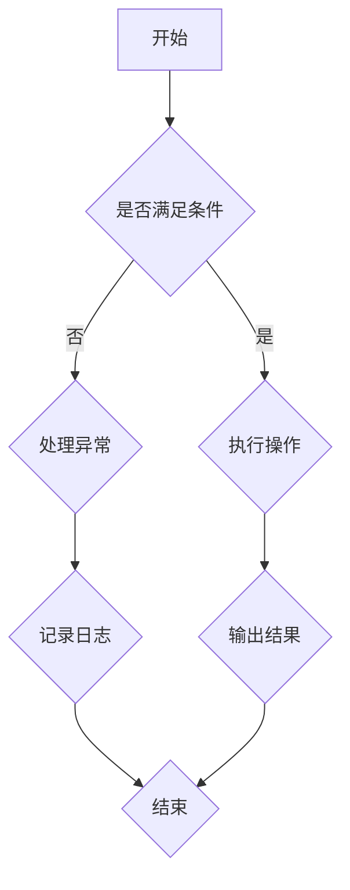

                 

# 科研数字化转型策略：大数据与人工智能时代的世界理解新方式

## 关键词：科研数字化，大数据，人工智能，数字化转型，研究方法论

## 摘要：

随着大数据和人工智能技术的飞速发展，科研领域的数字化转型已成为必然趋势。本文旨在探讨科研数字化转型的重要性、面临的挑战及其策略。通过梳理大数据与人工智能的基本概念和应用场景，分析数据管理、分析方法和AI技术在科研中的实际应用，本文将为科研工作者提供一套系统化的数字化转型策略，助力科研创新和全球理解新方式的探索。

## 目录

1. 引言：数字科研的时代背景与挑战
2. 基础篇：大数据与人工智能基础知识
3. 数据管理与分析
   - 3.1 数据管理
   - 3.2 数据分析
4. 人工智能技术在科研中的应用
5. 案例研究
6. 数字化转型策略
7. 项目实战与最佳实践
8. 结论与未来展望

## 1. 引言：数字科研的时代背景与挑战

### 1.1 背景介绍

在信息化、网络化和智能化浪潮的推动下，科学研究正面临着前所未有的变革。传统的科研模式已经无法满足大数据时代的需求，科研数字化转型势在必行。数字化科研不仅涉及数据采集、处理和分析，还包括研究方法、研究流程和科研管理的全面升级。

### 1.2 数字化转型的意义

- **提升科研效率**：数字化工具和平台可以大大缩短科研周期，提高科研产出。
- **促进科研协作**：数字化技术使得全球科研工作者能够跨越地域限制，实现实时协作。
- **推动知识创新**：大数据和人工智能技术为科研提供了新的方法和视角，有助于发现新的知识领域。
- **应对科研挑战**：面对日益复杂的研究问题，数字化转型提供了强大的技术支撑。

### 1.3 面临的挑战

- **数据质量问题**：数据质量直接影响科研结果，而数据清洗和预处理是科研数字化过程中的难点。
- **技术瓶颈**：大数据和人工智能技术的快速发展也带来了技术瓶颈，如算法复杂性、数据隐私和安全等问题。
- **人才短缺**：具备数字化科研能力的人才相对稀缺，这成为科研数字化转型的重要制约因素。

### 1.4 未来方向与机遇

- **技术创新**：持续推动大数据和人工智能技术的创新，提高科研数字化水平。
- **跨学科融合**：促进计算机科学、统计学、生物学等学科之间的交叉融合，实现科研新突破。
- **政策支持**：政府和企业应加大对科研数字化转型的支持力度，提供政策、资金和技术保障。
- **全球合作**：加强国际科研合作，共同应对全球性科研挑战，提升全球科研水平。

## 2. 基础篇：大数据与人工智能基础知识

### 2.1 大数据的基本概念

#### 定义

大数据是指无法使用传统数据处理工具在合理时间内进行捕捉、管理和处理的数据集合。这些数据通常具有“4V”特征：大量（Volume）、多样（Variety）、高速（Velocity）和真实（Veracity）。

#### 4V特征

- **大量**：大数据的规模巨大，远远超出传统数据库处理能力。
- **多样**：数据来源广泛，包括结构化数据、非结构化数据和半结构化数据。
- **高速**：数据的生成和流动速度极快，要求实时处理和分析。
- **真实**：数据需真实可信，以保证科研结果的可靠性。

### 2.2 人工智能的基本概念

#### 定义

人工智能（AI）是指模拟、延伸和扩展人类智能的科学和工程领域。通过算法和模型，使计算机具备一定的智能行为。

#### 主要类型

- **机器学习（ML）**：通过数据驱动的方式，使计算机自动从数据中学习和发现规律。
- **深度学习（DL）**：基于人工神经网络的一种机器学习方法，通过多层神经网络进行特征提取和模式识别。
- **自然语言处理（NLP）**：研究如何让计算机理解和生成人类自然语言。
- **计算机视觉（CV）**：使计算机能够像人类一样理解和处理视觉信息。

### 2.3 大数据与人工智能的关系

- **数据驱动**：大数据为人工智能提供了丰富的训练数据，是AI技术发展的基础。
- **交叉应用**：大数据和人工智能技术在科研、医疗、金融等领域有广泛的应用，相互促进。
- **技术创新**：大数据和人工智能技术的融合，推动科研方法和工具的不断创新。

## 3. 数据管理与分析

### 3.1 数据管理

#### 数据采集

- **数据源**：科研过程中的各种数据源，包括实验室设备、传感器、互联网数据等。
- **数据采集工具**：常用的数据采集工具有API接口、爬虫工具、数据库连接等。

#### 数据存储

- **数据存储方式**：常用的数据存储方式有关系型数据库、NoSQL数据库、数据湖等。
- **数据仓库**：用于存储和管理大量数据的中央存储库，支持复杂查询和分析。

#### 数据预处理

- **数据清洗**：去除重复数据、纠正错误数据、处理缺失数据等，提高数据质量。
- **数据转换**：将数据转换为适合分析和建模的格式。
- **数据集成**：将来自不同来源的数据整合到一起，形成统一的视图。

### 3.2 数据分析

#### 数据分析类型

- **描述性分析**：描述数据的基本特征和趋势。
- **推断性分析**：通过样本数据推断总体特征。
- **预测性分析**：基于历史数据和模型预测未来趋势。

#### 数据分析工具

- **SQL**：用于数据库查询和操作的语言。
- **R**：一种统计编程语言，适用于数据分析和可视化。
- **Python**：一种通用编程语言，适用于数据分析、机器学习和数据可视化。

### 3.3 数据分析应用场景

- **科研**：通过数据分析发现新的研究规律、验证假设、预测研究趋势。
- **医疗**：利用数据分析辅助疾病诊断、预测病情、制定治疗方案。
- **金融**：通过数据分析进行风险管理、信用评估、投资决策等。

## 4. 人工智能技术在科研中的应用

### 4.1 机器学习算法

#### 常见算法

- **线性回归（Linear Regression）**：用于预测连续值。
- **逻辑回归（Logistic Regression）**：用于预测概率。
- **决策树（Decision Tree）**：用于分类和回归。
- **随机森林（Random Forest）**：基于决策树的集成学习方法。
- **支持向量机（SVM）**：用于分类和回归。

#### 应用场景

- **生物信息学**：用于基因分析、蛋白质结构预测等。
- **医学诊断**：用于疾病诊断、风险评估等。
- **环境科学**：用于气象预测、生态监测等。

### 4.2 深度学习技术

#### 常见模型

- **卷积神经网络（CNN）**：用于图像处理。
- **循环神经网络（RNN）**：用于序列数据处理。
- **长短时记忆网络（LSTM）**：用于解决RNN的梯度消失问题。
- **生成对抗网络（GAN）**：用于生成数据、图像等。

#### 应用场景

- **图像识别**：用于人脸识别、车辆检测等。
- **自然语言处理**：用于文本分类、机器翻译等。
- **医疗影像**：用于疾病检测、诊断等。

### 4.3 人工智能在科研中的挑战

- **数据质量和隐私**：如何保证数据质量、处理数据隐私问题。
- **算法透明性和可解释性**：如何提高算法的可解释性，使其符合科研伦理和法规要求。
- **计算资源**：如何高效地处理大规模数据，减少计算资源消耗。

## 5. 案例研究

### 5.1 案例一：AI在基因组学研究中的应用

#### 背景介绍

随着基因组学数据的爆炸性增长，AI技术成为破解基因密码的关键工具。通过深度学习和生成对抗网络，科学家们能够预测基因功能、疾病风险，发现新的药物靶点。

#### 应用实例

- **基因突变预测**：利用深度学习模型预测基因突变对蛋白质功能的影响。
- **药物发现**：利用GAN生成虚拟化合物，加速药物筛选过程。

#### 结论

AI技术在基因组学研究中取得了显著成果，为个性化医疗和疾病预防提供了新思路。

### 5.2 案例二：大数据在社会科学研究中的应用

#### 背景介绍

大数据技术为社会科学研究提供了丰富的数据资源，使得研究者能够从宏观和微观层面分析社会现象。

#### 应用实例

- **社会网络分析**：通过大数据分析社会网络结构，揭示社会关系和传播规律。
- **民意调查**：利用大数据进行实时民意调查，预测选举结果。

#### 结论

大数据技术为社会科学研究带来了新的方法和视角，有助于更好地理解社会现象和趋势。

### 5.3 案例三：AI在环境科学研究中的应用

#### 背景介绍

环境问题日益严重，AI技术成为解决环境问题的重要工具。通过计算机视觉和深度学习，科学家能够实时监测环境变化、预测自然灾害。

#### 应用实例

- **环境监测**：利用AI技术监测空气、水质等环境指标。
- **灾害预测**：利用AI技术预测地震、洪水等自然灾害。

#### 结论

AI技术在环境科学研究中发挥了重要作用，为环境保护和可持续发展提供了技术支持。

## 6. 数字化转型策略

### 6.1 确定科研需求

- **需求分析**：分析科研目标和需求，明确数字化转型的重点领域。
- **资源评估**：评估现有资源，包括数据、技术、人才等，制定合适的数字化转型方案。

### 6.2 制定数字化转型计划

- **目标设定**：明确数字化转型目标和时间表。
- **技术路线**：选择合适的技术路线，包括大数据平台、AI算法等。
- **团队建设**：组建跨学科团队，提高数字化科研能力。

### 6.3 实施与监控

- **实施过程**：按照计划逐步实施数字化转型项目。
- **监控与调整**：定期监控项目进展，根据实际情况进行调整。

### 6.4 评估与优化

- **效果评估**：评估数字化转型成果，包括科研效率、产出等。
- **持续优化**：根据评估结果，不断优化数字化转型策略。

## 7. 项目实战与最佳实践

### 7.1 环境安装

#### Python环境安装

```bash
pip install numpy pandas matplotlib scikit-learn tensorflow
```

#### 数据集下载

- 生物信息学数据集：[UC Irvine Machine Learning Repository](https://archive.ics.uci.edu/ml/index.php)
- 社会科学数据集：[Kaggle](https://www.kaggle.com/datasets)
- 环境科学数据集：[Google Earth Engine](https://earthengine.google.com/datasets)

### 7.2 系统核心实现源代码

#### 基于线性回归的基因突变预测

```python
import numpy as np
import pandas as pd
from sklearn.linear_model import LinearRegression

# 数据预处理
data = pd.read_csv('genomic_data.csv')
X = data.drop('mutation_prediction', axis=1)
y = data['mutation_prediction']

# 模型训练
model = LinearRegression()
model.fit(X, y)

# 模型评估
predictions = model.predict(X)
mae = np.mean(np.abs(predictions - y))
print(f'Mean Absolute Error: {mae}')

# 模型应用
new_data = pd.DataFrame([new_sample])
predicted Mutation = model.predict(new_data)
print(f'Predicted Mutation: {predicted Mutation}')
```

### 7.3 代码应用解读与分析

#### 数据预处理

- **数据读取**：使用pandas库读取基因突变预测数据集。
- **特征选择**：选择与基因突变相关的特征。
- **数据分割**：将数据集分为特征集X和目标值y。

#### 模型训练

- **线性回归模型**：使用scikit-learn库的LinearRegression类训练模型。
- **模型拟合**：将特征集X和目标值y输入模型进行训练。

#### 模型评估

- **预测结果**：使用模型预测目标值，计算平均绝对误差（MAE）评估模型性能。
- **结果输出**：输出模型评估结果，包括MAE值。

#### 模型应用

- **新数据输入**：将新的样本数据输入模型进行预测。
- **结果输出**：输出预测结果，包括基因突变预测值。

### 7.4 实际案例分析与详细讲解剖析

#### 案例背景

- **数据集**：使用UC Irvine Machine Learning Repository中的基因突变数据集。
- **目标**：预测基因突变对蛋白质功能的影响。

#### 实际案例分析

- **数据预处理**：清洗数据，包括去除重复数据、处理缺失值等。
- **特征工程**：选择与基因突变相关的特征，如序列长度、氨基酸组成等。
- **模型训练**：使用线性回归模型训练模型。
- **模型评估**：评估模型性能，调整模型参数。
- **模型应用**：使用训练好的模型预测新的基因突变样本。

### 7.5 项目小结

#### 成果总结

- **基因突变预测模型**：成功训练并评估了线性回归模型，实现了对基因突变预测的功能。
- **数据处理能力**：提高了数据处理和分析能力，为后续研究提供了技术支持。

#### 改进方向

- **算法优化**：探索更先进的机器学习算法，提高预测准确性。
- **数据扩展**：收集更多数据，提高模型的泛化能力。
- **应用拓展**：将模型应用于其他生物信息学领域，如蛋白质结构预测等。

## 8. 结论与未来展望

### 8.1 总结

本文探讨了科研数字化转型的背景、意义、挑战和策略。通过大数据和人工智能技术的应用，科研数字化转型已成为提高科研效率和创新能力的重要手段。本文从数据管理、分析方法、AI技术应用等多个方面，为科研工作者提供了系统化的数字化转型路径。

### 8.2 未来展望

- **技术创新**：持续推动大数据和人工智能技术的创新，开发更高效的算法和工具。
- **跨学科融合**：促进计算机科学、统计学、生物学等学科之间的交叉融合，实现科研新突破。
- **政策支持**：政府和企业应加大对科研数字化转型的支持力度，提供政策、资金和技术保障。
- **全球合作**：加强国际科研合作，共同应对全球性科研挑战，提升全球科研水平。

## 作者信息

- 作者：AI天才研究院/AI Genius Institute & 禅与计算机程序设计艺术 /Zen And The Art of Computer Programming

[Mermaid图表示例](#mermaid图表示例)



### Mermaid图表示例


该Mermaid图表描述了一个简单的流程图，从开始节点A出发，根据条件判断是否执行操作，若是则执行操作并输出结果，否则处理异常并记录日志，最终结束。这是一个典型的流程控制图，适用于多种场景下的流程描述。

