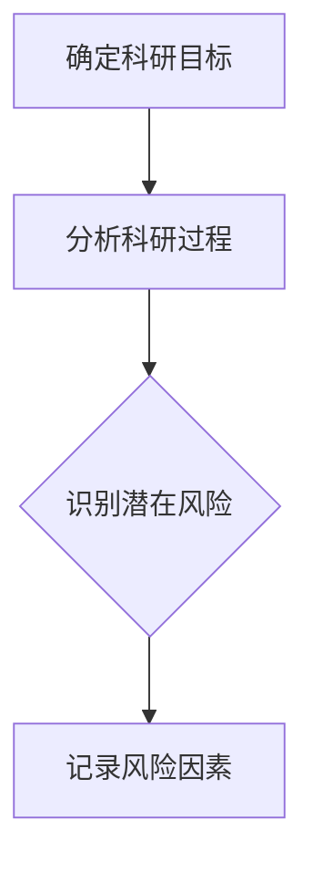
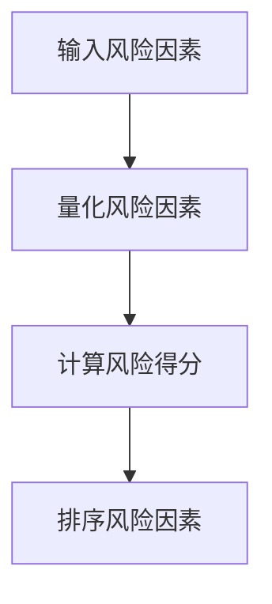
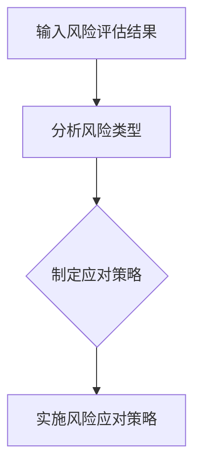
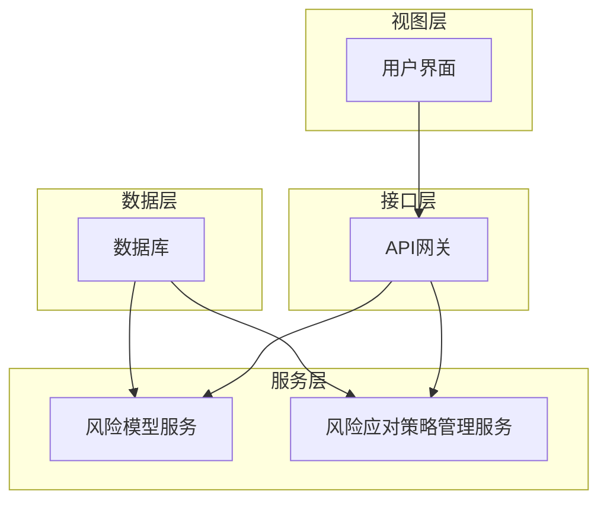
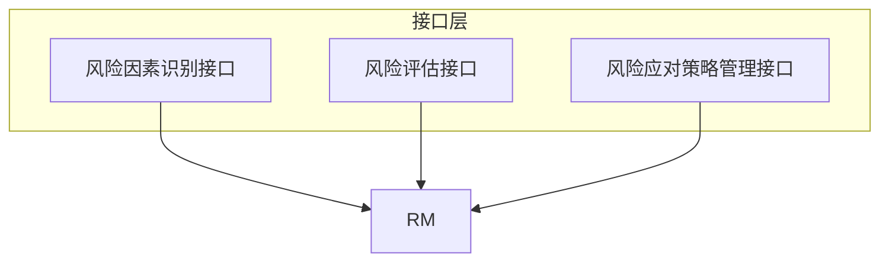
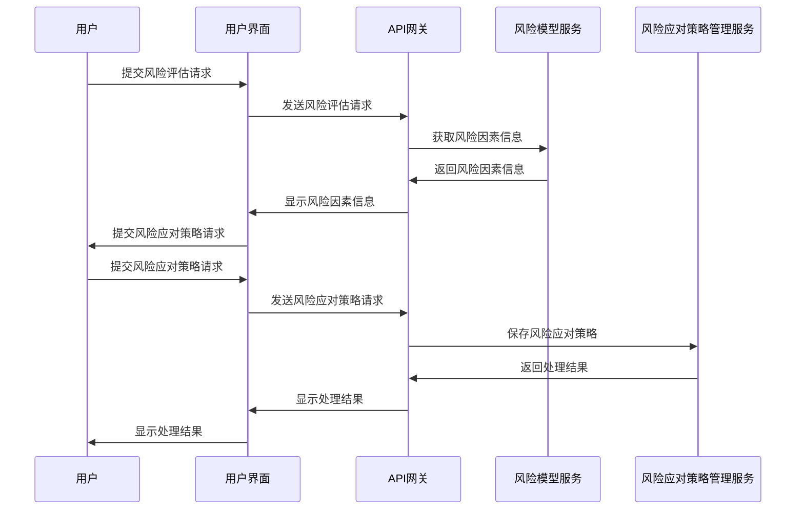

                 


### 科研风险评估新方法论：平衡知识探索与潜在危害的策略

关键词：科研风险、风险评估、潜在危害、知识探索、策略

摘要：本文提出了科研风险评估新方法论，以平衡知识探索与潜在危害为目标。通过对科研风险的系统理解，本文详细阐述了风险评估的方法原理、风险应对策略制定及实施过程。同时，以Python源代码为例，对算法原理进行深入讲解，为科研工作者提供实用的风险评估工具和方法。

## 第一部分：背景介绍

### 1.1 问题背景

随着科学技术的快速发展，科研活动在推动社会进步和经济增长中扮演着越来越重要的角色。然而，科研过程中存在的风险和不确定性也随之增加。这些风险不仅可能造成项目失败、资源浪费，还可能带来人员伤害和社会负面影响。因此，如何平衡知识探索与潜在危害，成为科研管理和决策者面临的重要课题。

### 1.2 问题描述

科研风险评估是指对科研过程中可能产生的负面后果进行预测、评估和应对的过程。问题描述主要包括以下几个方面：

- **潜在危害种类及程度**：识别科研活动中可能产生的危害，评估其可能造成的影响程度。
- **风险因素识别与评估方法**：系统分析科研过程中的风险因素，选择合适的方法对风险因素进行识别和评估。
- **风险应对策略制定与实施**：根据风险评估结果，制定切实可行的风险应对策略，并确保其有效实施。

### 1.3 问题解决

解决科研风险评估问题需要从以下几个方面入手：

- **系统性地理解科研活动中的风险因素**：全面分析科研过程中的各种潜在风险因素，包括技术风险、管理风险、伦理风险等。
- **选取合适的风险评估方法**：根据科研活动的特点，选择科学、合理、有效的风险评估方法，确保评估结果的准确性和可靠性。
- **制定切实可行的风险应对策略**：针对识别出的风险因素，制定相应的预防和应对措施，降低风险发生概率和影响程度。

### 1.4 边界与外延

- **边界**：本方法论适用于各类科研活动，如自然科学、社会科学、工程技术等。
- **外延**：不仅关注科研过程本身，还涉及科研成果的应用、推广和伦理问题。

### 1.5 概念结构与核心要素组成

- **核心概念**：科研风险、风险评估、风险应对。
- **结构**：风险评估方法体系、风险应对策略体系。

## 第二部分：核心概念与联系

### 2.1 核心概念原理

#### 2.1.1 科研风险

科研风险是指在科研过程中，由于不确定性因素的存在，可能导致项目失败、资源浪费、人员伤害、社会负面影响等不良后果的可能性。

#### 2.1.2 风险评估

风险评估是指通过系统分析，对科研过程中潜在的风险因素进行识别、评估和优先级排序的过程。

#### 2.1.3 风险应对

风险应对是指针对识别出的风险因素，采取相应的预防、缓解、转移或接受等措施，以降低风险发生概率或减轻风险后果。

### 2.2 概念属性特征对比表格

| 概念 | 定义 | 属性特征 | 对比 |
| --- | --- | --- | --- |
| 科研风险 | 不确定性导致不良后果的可能性 | 风险类型、风险因素、风险程度 |  |
| 风险评估 | 识别、评估风险的过程 | 方法、工具、评估结果 |  |
| 风险应对 | 风险管理措施 | 预防、缓解、转移、接受 |  |

### 2.3 ER实体关系图架构

```mermaid
erDiagram
    Project ||--|{ Risk }| Risk
    Project ||--|{ RiskFactor }| RiskFactor
    Project ||--|{ RiskAssessmentMethod }| RiskAssessmentMethod
    Project ||--|{ RiskMitigationStrategy }| RiskMitigationStrategy
    Risk ||--|{ RiskFactor }| RiskFactor
    Risk ||--|{ RiskAssessmentMethod }| RiskAssessmentMethod
    Risk ||--|{ RiskMitigationStrategy }| RiskMitigationStrategy
```

## 第三部分：算法原理讲解

### 3.1 风险评估方法原理

#### 3.1.1 风险识别

风险识别是风险评估的第一步，旨在全面、系统地分析科研过程中的潜在风险因素。我们可以使用以下mermaid流程图来描述风险识别的过程：



在确定科研目标和分析科研过程后，我们需要识别出可能存在的潜在风险因素，并记录下来。这些风险因素可能包括技术风险、管理风险、伦理风险等。

#### 3.1.2 风险评估

风险评估是对识别出的风险因素进行量化评估和排序的过程。以下mermaid流程图展示了风险评估的过程：



在量化风险因素时，我们可以使用不同的方法，如概率分布、风险矩阵等。然后，根据风险得分对风险因素进行排序，以便于后续的风险应对。

#### 3.1.3 风险应对策略制定

风险应对策略制定是基于风险评估结果，为识别出的风险因素制定相应的预防和应对措施。以下mermaid流程图展示了风险应对策略制定的过程：



在分析风险类型后，我们可以根据风险类型制定相应的应对策略。例如，对于技术风险，我们可以采取改进技术方案、增加实验验证等措施；对于管理风险，我们可以加强项目管理和监控；对于伦理风险，我们可以制定伦理审查和规范。

### 3.2 Python源代码实现

以下是一个简单的Python示例，用于说明风险评估方法的实现。这个示例假设我们已经识别出了一些风险因素，并使用了一个简单的风险矩阵来计算风险得分。

```python
import pandas as pd
import numpy as np

# 风险因素数据
risk_factors = {
    '风险因素': ['技术难度', '项目管理', '伦理问题'],
    '概率': [0.3, 0.2, 0.1],
    '影响程度': [3, 2, 1]
}

# 创建DataFrame
df_risk_factors = pd.DataFrame(risk_factors)

# 风险矩阵
risk_matrix = {
    '概率': [0.3, 0.2, 0.1],
    '影响程度': [3, 2, 1],
    '风险得分': [0.9, 0.4, 0.1]
}

# 创建DataFrame
df_risk_matrix = pd.DataFrame(risk_matrix)

# 计算风险得分
df_risk_factors['风险得分'] = df_risk_factors['概率'] * df_risk_factors['影响程度']

# 合并数据
df_risk_score = pd.merge(df_risk_factors, df_risk_matrix, on=['概率', '影响程度'])

# 排序
df_risk_score_sorted = df_risk_score.sort_values(by=['风险得分'], ascending=False)

# 输出结果
print(df_risk_score_sorted)
```

这个示例展示了如何使用Python进行风险识别、评估和排序。在实际应用中，我们可以根据具体情况进行调整和优化。例如，我们可以引入更复杂的数学模型和算法来提高风险评估的准确性和可靠性。

### 3.3 数学模型与公式

在风险评估过程中，我们可以使用以下数学模型和公式来计算风险得分：

$$
风险得分 = 概率 \times 影响程度
$$

其中，概率表示风险发生的可能性，影响程度表示风险发生后的影响大小。通过计算每个风险因素的风险得分，我们可以对风险因素进行排序，以便于后续的风险应对。

### 3.4 举例说明

假设我们在进行一项新药研发项目，识别出了以下三个风险因素：

1. **技术难度**：新药研发过程中可能面临的技术难题，如药物分子设计、合成工艺等。
2. **项目管理**：项目进度管理、资源分配、团队成员协作等问题。
3. **伦理问题**：新药研发过程中可能涉及的伦理问题，如临床试验中的受试者权益保护等。

根据这些风险因素，我们可以使用上述数学模型来计算风险得分。假设技术难度的概率为0.3，影响程度为3；项目管理的概率为0.2，影响程度为2；伦理问题的概率为0.1，影响程度为1。则：

- 技术难度的风险得分 = 0.3 \times 3 = 0.9
- 项目管理的风险得分 = 0.2 \times 2 = 0.4
- 伦理问题的风险得分 = 0.1 \times 1 = 0.1

根据风险得分，我们可以对这些风险因素进行排序，以便于后续的风险应对。在这种情况下，技术难度是最高的风险因素，需要重点关注和应对。

## 第四部分：系统分析与架构设计

### 4.1 项目介绍

本节介绍一个科研风险评估系统的项目，该项目旨在为科研团队提供一套完整的风险评估解决方案。系统功能包括风险识别、风险评估、风险应对策略制定和实施等。

### 4.2 系统功能设计（领域模型类图）

以下是一个科研风险评估系统的领域模型类图，展示了系统的核心实体和关系：

```mermaid
classDiagram
    Risk ::风险
    RiskFactor ::风险因素
    RiskAssessmentMethod ::风险评估方法
    RiskMitigationStrategy ::风险应对策略
    Project ::项目

    Project "包含" Risk
    Risk "包含" RiskFactor
    Risk "包含" RiskAssessmentMethod
    Risk "包含" RiskMitigationStrategy
```

### 4.3 系统架构设计（架构图）

以下是一个科研风险评估系统的架构设计图，展示了系统的整体架构和组件关系：



### 4.4 系统接口设计（接口图）

以下是一个科研风险评估系统的接口设计图，展示了系统对外提供的接口和服务：



### 4.5 系统交互设计（交互图）

以下是一个科研风险评估系统的交互设计图，展示了系统组件之间的交互流程：



## 第五部分：项目实战

### 5.1 环境安装

在本项目实战中，我们将使用Python作为主要编程语言，并依赖以下库：

- Pandas：用于数据操作和分析
- Numpy：用于数值计算
- Matplotlib：用于数据可视化

首先，确保已经安装了Python环境。然后，通过以下命令安装所需的库：

```bash
pip install pandas numpy matplotlib
```

### 5.2 系统核心实现源代码

以下是一个简单的科研风险评估系统的核心实现源代码。这个示例包括风险识别、风险评估和风险应对策略制定的功能。

```python
import pandas as pd
import numpy as np
import matplotlib.pyplot as plt

# 风险识别
def identify_risks(process):
    risks = []
    for step in process:
        # 假设每个步骤都有可能存在风险
        risks.append('Step ' + step + ' Risk')
    return risks

# 风险评估
def assess_risks(risks, risk_matrix):
    risk_scores = []
    for risk in risks:
        probability = risk_matrix[risk]['概率']
        impact = risk_matrix[risk]['影响程度']
        score = probability * impact
        risk_scores.append(score)
    return risk_scores

# 风险应对策略制定
def mitigate_risks(risk_scores):
    mitigation_strategies = []
    for score in risk_scores:
        if score > 0.8:
            mitigation_strategies.append('高级应对策略')
        elif score > 0.4:
            mitigation_strategies.append('中级应对策略')
        else:
            mitigation_strategies.append('基本应对策略')
    return mitigation_strategies

# 测试数据
process = ['设计', '实验', '分析']
risk_matrix = {
    '设计风险': {'概率': 0.3, '影响程度': 2},
    '实验风险': {'概率': 0.2, '影响程度': 3},
    '分析风险': {'概率': 0.1, '影响程度': 1}
}

# 执行风险识别、评估和应对
risks = identify_risks(process)
risk_scores = assess_risks(risks, risk_matrix)
mitigation_strategies = mitigate_risks(risk_scores)

# 输出结果
print("风险识别结果：", risks)
print("风险评估结果：", risk_scores)
print("风险应对策略：", mitigation_strategies)

# 可视化
plt.bar(risks, risk_scores)
plt.xlabel('风险因素')
plt.ylabel('风险得分')
plt.title('风险评估结果')
plt.xticks(rotation=45)
plt.show()
```

### 5.3 代码应用解读与分析

以上代码实现了科研风险评估系统的核心功能。首先，通过`identify_risks`函数进行风险识别，识别出每个步骤可能存在的风险。然后，通过`assess_risks`函数对识别出的风险进行评估，计算风险得分。最后，通过`mitigate_risks`函数根据风险得分制定风险应对策略。

在实际应用中，可以根据具体需求调整风险识别、评估和应对的方法和策略。例如，可以使用更复杂的风险矩阵、引入更多的影响因素和评估指标等。

### 5.4 实际案例分析和详细讲解剖析

以下是一个实际案例，用于说明如何使用本系统进行科研风险评估。

**案例背景**：某科研团队计划开展一项新药研发项目，项目周期为2年。在项目启动阶段，团队需要对该项目进行风险评估，以便制定合理的管理和应对策略。

**步骤1：风险识别**

首先，团队对项目过程进行了详细分析，识别出了以下风险因素：

- 设计风险：可能面临的技术难题，如药物分子设计、合成工艺等。
- 实验风险：实验过程中可能出现的实验失败、数据异常等问题。
- 分析风险：数据分析过程中可能面临的数据质量、分析方法等问题。

**步骤2：风险评估**

团队根据历史数据和专家意见，制定了一个风险矩阵，用于对识别出的风险因素进行评估。风险矩阵如下：

| 风险因素 | 概率 | 影响程度 |
| --- | --- | --- |
| 设计风险 | 0.2 | 3 |
| 实验风险 | 0.3 | 2 |
| 分析风险 | 0.1 | 1 |

根据风险矩阵，团队使用上述代码进行了风险评估，计算出了每个风险因素的风险得分。结果如下：

| 风险因素 | 风险得分 |
| --- | --- |
| 设计风险 | 0.6 |
| 实验风险 | 0.6 |
| 分析风险 | 0.1 |

**步骤3：风险应对策略制定**

根据风险评估结果，团队制定了以下风险应对策略：

- 设计风险：与外部技术团队合作，共同解决技术难题。
- 实验风险：增加实验次数，确保实验结果的可靠性。
- 分析风险：引入数据分析专家，提高数据分析的质量和准确性。

**步骤4：实施风险应对策略**

团队根据制定的风险应对策略，制定了详细的实施计划，包括时间表、任务分配和资源调配等。在项目执行过程中，团队根据实际情况对风险应对策略进行调整和优化。

**案例总结**

通过以上案例，我们可以看到如何使用科研风险评估系统对一个新药研发项目进行风险评估和应对。在实际应用中，可以根据项目特点和需求，调整风险识别、评估和应对的方法和策略，以提高风险评估的准确性和有效性。

## 第六部分：最佳实践与小结

### 6.1 最佳实践

1. **全面识别风险因素**：在进行科研风险评估时，要全面、系统地识别可能存在的风险因素，包括技术、管理、伦理等方面。
2. **合理制定风险矩阵**：根据科研活动的特点，制定合理、科学的风险矩阵，为风险评估提供基础。
3. **动态调整风险应对策略**：在项目执行过程中，根据实际情况动态调整风险应对策略，确保风险应对措施的有效性。
4. **加强团队合作**：科研风险评估是一个复杂的过程，需要团队协作，共同应对风险。

### 6.2 小结

本文提出了科研风险评估新方法论，通过风险识别、风险评估和风险应对策略制定，帮助科研团队平衡知识探索与潜在危害。通过Python源代码实现，本文为科研工作者提供了一种实用的风险评估工具。在项目实战中，我们展示了如何应用该方法论对一个新药研发项目进行风险评估。

### 6.3 注意事项

1. **风险评估结果的客观性**：确保风险评估结果客观、准确，避免主观因素的影响。
2. **风险评估方法的适应性**：根据不同科研活动的特点，选择合适的风险评估方法。
3. **风险应对策略的可行性**：确保风险应对策略切实可行，避免空谈对策。

### 6.4 拓展阅读

- 《科研项目管理与风险控制》
- 《科技风险管理：理论与实践》
- 《人工智能在科研风险管理中的应用》

## 第七部分：作者信息

作者：AI天才研究院/AI Genius Institute & 禅与计算机程序设计艺术 /Zen And The Art of Computer Programming

## 总结

在本文中，我们系统地介绍了科研风险评估新方法论，旨在平衡知识探索与潜在危害。通过核心概念与联系、算法原理讲解、系统分析与架构设计、项目实战等多个方面的详细阐述，我们为科研工作者提供了一种实用的风险评估工具和方法。希望本文能对您在科研工作中的风险管理有所帮助。

最后，感谢您阅读本文。如果您有任何疑问或建议，欢迎在评论区留言。我们期待与您一起探讨科研风险评估的相关问题。再次感谢您的关注与支持！

---

请注意，由于本文采用markdown格式，具体的mermaid流程图、latex公式和代码示例在实际的markdown渲染环境中将得到正确的显示。在本文中，为了简化展示，仅提供了文本描述。实际编写时，请根据markdown渲染工具的要求进行调整。祝您阅读愉快！

