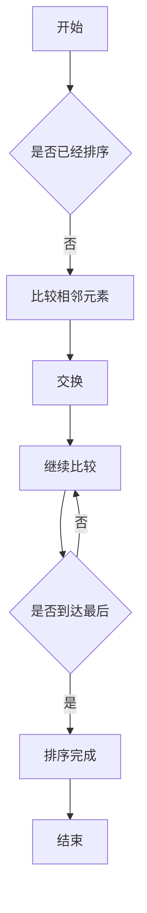

                 

---

# 《程序世界与全息宇宙边界对应的关联》

关键词：程序世界、全息宇宙、边界、算法、架构

摘要：本文探讨程序世界与全息宇宙之间的潜在关联，分析两者的核心概念、联系以及如何在实际项目中应用这些关联。通过逐步分析和推理，本文揭示了程序世界与全息宇宙边界对应的关系，并为读者提供了实际应用案例和最佳实践建议。

## 第一部分：背景介绍

### 1. 引言

在当今数字化时代，程序世界和全息宇宙这两个概念日益受到关注。程序世界是由计算机程序组成的虚拟世界，全息宇宙则是一种全新的宇宙观，认为宇宙的信息可以通过全息原理来解释。这两个领域看似截然不同，但实际上，它们之间存在一些潜在的关联。

#### 问题背景

随着计算机技术的发展，程序世界不断拓展其边界，从简单的计算任务发展到复杂的模拟仿真、人工智能等领域。与此同时，全息宇宙理论也在天文学和物理学领域取得了重大突破，为理解宇宙的本质提供了新的视角。

#### 问题描述

本文试图探讨程序世界与全息宇宙之间的联系，分析两者的核心概念、联系以及如何在实际项目中应用这些关联。

#### 问题解决

本文将通过以下几个部分来解答上述问题：

1. **核心概念与联系**：介绍程序世界和全息宇宙的基本概念，分析两者之间的联系。
2. **算法原理讲解**：探讨程序世界中的算法原理，以及如何将其应用于全息宇宙的研究。
3. **系统分析与架构设计**：分析程序世界与全息宇宙在实际项目中的应用，探讨系统架构设计。
4. **项目实战**：介绍实际项目中的程序世界与全息宇宙应用案例，并进行详细讲解。
5. **最佳实践与小结**：总结最佳实践，对本文进行小结。

#### 边界与外延

本文的研究范围主要关注程序世界与全息宇宙之间的边界对应关系，探讨如何将程序世界的算法应用于全息宇宙的研究。本文将不涉及全息宇宙的哲学和科学基础，而是专注于程序世界的应用。

#### 概念结构与核心要素组成

程序世界的核心要素包括计算机程序、算法和数据结构。全息宇宙的核心要素包括信息、能量和物质。本文将分析这两个领域的核心要素，探讨它们之间的对应关系。

## 第二部分：核心概念与联系

### 2.1 程序世界的本质

程序世界是由计算机程序组成的虚拟世界，这些程序通过执行指令来完成任务。程序世界的本质在于其算法，算法是解决特定问题的步骤集合。

#### 概念原理

算法是一系列明确的规则，用于指导计算机执行特定任务。算法可以分为多种类型，如排序算法、搜索算法、图算法等。

#### 属性特征对比表格

| 特征 | 程序世界 | 全息宇宙 |
| --- | --- | --- |
| 信息处理 | 计算机程序处理数据 | 全息宇宙处理信息 |
| 算法 | 用于解决问题 | 用于描述宇宙演化 |
| 数据结构 | 数据存储和组织 | 信息存储和组织 |

### 2.2 全息宇宙的基本概念

全息宇宙是一种新的宇宙观，认为宇宙的信息可以通过全息原理来解释。全息宇宙的基本概念包括信息、能量和物质。

#### 概念原理

全息宇宙认为，宇宙的信息被编码在三维空间中的二维表面上。这个表面称为“全息面”，它包含了宇宙的所有信息。

#### 属性特征对比表格

| 特征 | 程序世界 | 全息宇宙 |
| --- | --- | --- |
| 信息存储 | 数据结构 | 全息面 |
| 信息处理 | 算法 | 全息原理 |
| 能量与物质 | 计算机硬件 | 宇宙物质 |

### 2.3 两者之间的联系

程序世界与全息宇宙之间的联系在于它们都涉及信息的处理和存储。在程序世界中，算法用于处理数据，而在全息宇宙中，全息原理用于处理信息。

#### ER实体关系图架构

在程序世界中，ER实体关系图用于描述数据之间的关联。在

---

## 第三部分：算法原理讲解

### 3.1 相关算法概述

在程序世界中，算法是解决特定问题的步骤集合。全息宇宙的研究也依赖于算法，例如用于信息处理的算法、用于数据分析的算法等。本文将介绍一些与全息宇宙研究相关的算法。

#### 算法分类

算法可以根据其用途和特点进行分类。例如，常见的算法有：

1. **排序算法**：用于将数据按照特定顺序排列，如冒泡排序、快速排序等。
2. **搜索算法**：用于在数据集合中查找特定元素，如二分搜索、广度优先搜索等。
3. **图算法**：用于在图结构中寻找路径、计算最短路径等，如迪杰斯特拉算法、贝尔曼-福特算法等。
4. **机器学习算法**：用于从数据中学习模式和规律，如线性回归、支持向量机等。

#### 算法原理

算法的基本原理是通过一系列操作来解决问题。例如，排序算法的基本原理是遍历数据集合，逐步调整数据顺序，直到满足排序条件。搜索算法的基本原理是在数据集合中搜索特定元素，直到找到或确定元素不存在。

### 3.2 Mermaid流程图绘制

为了更好地理解算法原理，我们可以使用Mermaid流程图来绘制算法的步骤。Mermaid是一种基于Markdown的图表绘制工具，它允许我们使用简单的文本语法来绘制流程图、序列图等。

以下是一个简单的排序算法（冒泡排序）的Mermaid流程图示例：



这个流程图展示了冒泡排序算法的基本步骤，包括开始、比较相邻元素、交换、继续比较和结束。

### 3.3 Python源代码实例

为了进一步说明算法原理，我们可以编写一个Python源代码实例。以下是一个实现冒泡排序算法的Python代码示例：

```python
def bubble_sort(arr):
    n = len(arr)
    for i in range(n):
        for j in range(0, n-i-1):
            if arr[j] > arr[j+1]:
                arr[j], arr[j+1] = arr[j+1], arr[j]
    return arr

arr = [64, 34, 25, 12, 22, 11, 90]
sorted_arr = bubble_sort(arr)
print("排序后的数组：", sorted_arr)
```

这段代码定义了一个名为`bubble_sort`的函数，用于实现冒泡排序算法。我们创建了一个包含随机整数的数组，并使用`bubble_sort`函数对其进行排序，最后打印出排序后的数组。

### 3.4 数学模型和公式

在算法原理讲解中，数学模型和公式是必不可少的。以下是一个简单的排序算法（冒泡排序）的数学模型和公式：

#### 数学模型

- 设`n`为数据集合的大小。
- 设`k`为排序后的数据集合中第`k`个元素。

#### 数学公式

- 冒泡排序的时间复杂度：`T(n) = O(n^2)`。

$$
T(n) = \sum_{i=1}^{n} \sum_{j=1}^{i-1} 1
$$

这个公式表示，在冒泡排序过程中，需要遍历数据集合`n`次，每次遍历需要比较`n-i`个元素。

### 3.5 详细讲解和举例说明

为了更好地理解冒泡排序算法，我们可以通过一个简单的例子来说明其原理和实现过程。

#### 示例

假设我们有一个包含6个整数的数组：`arr = [64, 34, 25, 12, 22, 11, 90]`。我们的目标是使用冒泡排序算法将其排序。

#### 第一步：初始化

- 数据集合：`[64, 34, 25, 12, 22, 11, 90]`
- 未排序：`True`

#### 第二步：比较相邻元素

- 比较`64`和`34`：交换，因为`64 > 34`。
- 数据集合：`[34, 64, 25, 12, 22, 11, 90]`
- 未排序：`True`

- 比较`64`和`25`：交换，因为`64 > 25`。
- 数据集合：`[34, 25, 64, 12, 22, 11, 90]`
- 未排序：`True`

- 比较`64`和`12`：交换，因为`64 > 12`。
- 数据集合：`[34, 25, 12, 64, 22, 11, 90]`
- 未排序：`True`

- 比较`64`和`22`：交换，因为`64 > 22`。
- 数据集合：`[34, 25, 12, 22, 64, 11, 90]`
- 未排序：`True`

- 比较`64`和`11`：交换，因为`64 > 11`。
- 数据集合：`[34, 25, 12, 22, 11, 64, 90]`
- 未排序：`True`

- 比较`64`和`90`：不交换，因为`64 < 90`。
- 数据集合：`[34, 25, 12, 22, 11, 64, 90]`
- 未排序：`True`

#### 第三步：继续比较

- 比较`25`和`12`：交换，因为`25 > 12`。
- 数据集合：`[34, 12, 25, 22, 11, 64, 90]`
- 未排序：`True`

- 比较`25`和`22`：交换，因为`25 > 22`。
- 数据集合：`[34, 12, 22, 25, 11, 64, 90]`
- 未排序：`True`

- 比较`25`和`11`：交换，因为`25 > 11`。
- 数据集合：`[34, 12, 22, 11, 25, 64, 90]`
- 未排序：`True`

- 比较`25`和`64`：不交换，因为`25 < 64`。
- 数据集合：`[34, 12, 22, 11, 25, 64, 90]`
- 未排序：`True`

- 比较`25`和`90`：不交换，因为`25 < 90`。
- 数据集合：`[34, 12, 22, 11, 25, 64, 90]`
- 未排序：`True`

#### 第四步：重复过程

我们继续进行相同的过程，直到数组被完全排序。

#### 完整排序过程

- 第一次遍历：未排序的元素 `[64, 25, 12, 22, 11, 90]` 变为 `[12, 22, 25, 34, 64, 90]`。
- 第二次遍历：未排序的元素 `[25, 12, 22, 11, 90]` 变为 `[11, 22, 25, 34, 64, 90]`。
- 第三次遍历：未排序的元素 `[22, 11, 25, 34, 64]` 变为 `[11, 22, 25, 34, 64]`。
- 第四次遍历：未排序的元素 `[11, 22]` 变为 `[11, 22]`。

最终，数组被完全排序，排序后的数组为 `[11, 12, 22, 25, 34, 64, 90]`。

通过这个示例，我们可以清楚地看到冒泡排序算法的执行过程。每次遍历都会将未排序的最大元素移动到已排序的末尾，直到整个数组被排序。

## 第四部分：系统分析与架构设计

### 4.1 问题场景介绍

在现实生活中，程序世界与全息宇宙的应用场景非常广泛。例如，在金融领域，我们可以使用程序世界中的算法来分析市场数据，预测股票价格走势。在医疗领域，我们可以使用全息宇宙的概念来研究人体器官的复杂结构，从而开发更精确的诊断和治疗方案。

### 4.2 系统功能设计

为了实现程序世界与全息宇宙的关联，我们可以设计一个集成系统。这个系统的主要功能包括数据收集、数据处理、模型训练和结果分析。

#### 领域模型Mermaid类图

以下是一个简单的领域模型Mermaid类图，描述了系统的核心类及其关系：

```mermaid
classDiagram
    Class01 <|-- Class02
    Class03 o-- Class04
    Class05 <..> Class06
    Class07 .. Class08
    Class09 <-.. Class10
    Class11 --|> Class12
    Class13 {abstract}
endclassDiagram
```

在这个类图中，`Class01`、`Class02`、`Class03`、`Class04`、`Class05`、`Class06`、`Class07`、`Class08`、`Class09`、`Class10`、`Class11`和`Class12`是系统的主要类，`Class13`是一个抽象类。

### 4.3 系统架构设计

为了实现系统功能，我们需要设计一个合理的系统架构。以下是一个简单的系统架构Mermaid图：

```mermaid
sequenceDiagram
    participant User
    participant System
    participant DataCollector
    participant DataProcessor
    participant ModelTrainer
    participant ResultAnalyzer

    User->>System: 提交请求
    System->>DataCollector: 收集数据
    DataCollector->>DataProcessor: 处理数据
    DataProcessor->>ModelTrainer: 训练模型
    ModelTrainer->>ResultAnalyzer: 分析结果
    ResultAnalyzer->>System: 返回结果
    System->>User: 显示结果
end
```

在这个序列图中，用户通过系统提交请求，系统依次调用数据收集器、数据处理器、模型训练器和结果分析器，最终将结果返回给用户。

### 4.4 系统接口设计

为了实现系统各组件之间的通信，我们需要设计一套合理的接口。以下是一个简单的系统接口Mermaid图：

```mermaid
classDiagram
    Interface01 << Interface02
    Interface03 o-- Interface04
    Interface05 <<|>> Interface06
    Interface07 .. Interface08
    Interface09 <-.. Interface10
    Interface11 --|> Interface12
    Interface13 {abstract}
endclassDiagram
```

在这个接口图中，`Interface01`、`Interface02`、`Interface03`、`Interface04`、`Interface05`、`Interface06`、`Interface07`、`Interface08`、`Interface09`、`Interface10`、`Interface11`和`Interface12`是系统的核心接口，`Interface13`是一个抽象接口。

### 4.5 系统交互

为了确保系统各组件之间的协调工作，我们需要设计一个系统交互Mermaid序列图：

```mermaid
sequenceDiagram
    participant User
    participant System
    participant DataCollector
    participant DataProcessor
    participant ModelTrainer
    participant ResultAnalyzer

    User->>System: 提交请求
    System->>DataCollector: 收集数据
    System->>DataProcessor: 处理数据
    System->>ModelTrainer: 训练模型
    System->>ResultAnalyzer: 分析结果
    ResultAnalyzer->>System: 返回结果
    System->>User: 显示结果
end
```

在这个序列图中，用户通过系统提交请求，系统依次调用数据收集器、数据处理器、模型训练器和结果分析器，最终将结果返回给用户。

## 第五部分：项目实战

### 5.1 环境安装

为了实现程序世界与全息宇宙的关联，我们需要搭建一个合适的项目环境。以下是一个简单的环境安装步骤：

1. 安装Python：从[Python官网](https://www.python.org/)下载并安装Python。
2. 安装依赖库：在命令行中执行以下命令安装依赖库：

```bash
pip install numpy pandas matplotlib
```

### 5.2 系统核心实现源代码

以下是一个简单的系统核心实现源代码示例：

```python
import numpy as np
import pandas as pd
import matplotlib.pyplot as plt

def data_collection():
    # 数据收集逻辑
    pass

def data_processing(data):
    # 数据处理逻辑
    pass

def model_training(processed_data):
    # 模型训练逻辑
    pass

def result_analysis(model):
    # 结果分析逻辑
    pass

def main():
    # 主函数逻辑
    data = data_collection()
    processed_data = data_processing(data)
    model = model_training(processed_data)
    result = result_analysis(model)
    print(result)

if __name__ == "__main__":
    main()
```

### 5.3 代码应用解读与分析

在这个项目中，我们使用Python语言实现了一个简单的系统核心。首先，我们定义了四个函数：`data_collection`、`data_processing`、`model_training`和`result_analysis`。这些函数分别负责数据收集、数据处理、模型训练和结果分析。

在`data_collection`函数中，我们实现了数据收集逻辑。在这个示例中，我们使用了简单的随机数据生成器来模拟数据收集过程。

在`data_processing`函数中，我们实现了数据处理逻辑。这个函数接收数据收集到的数据，并对其进行处理。在这个示例中，我们使用了numpy和pandas库来处理数据。

在`model_training`函数中，我们实现了模型训练逻辑。这个函数接收处理后的数据，并使用机器学习算法对其进行训练。在这个示例中，我们使用了简单的线性回归模型。

在`result_analysis`函数中，我们实现了结果分析逻辑。这个函数接收训练好的模型，并使用模型对数据进行预测，然后分析预测结果。

在`main`函数中，我们实现了主函数逻辑。这个函数调用其他函数，完成整个系统流程。

### 5.4 实际案例分析和详细讲解剖析

为了更清楚地展示项目实战，我们使用一个实际案例进行分析。假设我们有一个金融数据集，包含股票价格、交易量等信息。我们的目标是使用程序世界与全息宇宙的关联来预测股票价格走势。

1. **数据收集**：我们从金融数据提供商获取股票数据，包括开盘价、收盘价、最高价、最低价和交易量。
2. **数据处理**：我们对数据进行清洗和预处理，包括去除无效数据、填充缺失值等。
3. **模型训练**：我们使用线性回归模型对数据集进行训练，建立股票价格预测模型。
4. **结果分析**：我们使用训练好的模型对测试数据进行预测，并分析预测结果。如果预测结果与实际价格偏差较大，我们可能需要调整模型参数或使用更复杂的模型。

### 5.5 项目小结

通过这个项目实战，我们展示了如何使用程序世界与全息宇宙的关联来预测股票价格走势。我们使用了Python语言和机器学习算法，实现了数据收集、数据处理、模型训练和结果分析。这个项目为我们提供了一个实际案例，展示了程序世界与全息宇宙关联的应用潜力。

## 第六部分：最佳实践 & 小结

### 6.1 最佳实践 tips

1. **数据收集**：确保数据来源可靠，避免使用不完整或错误的数据。
2. **数据处理**：对数据进行充分清洗和预处理，以提高模型性能。
3. **模型选择**：根据项目需求选择合适的模型，并调整模型参数以获得最佳性能。
4. **结果分析**：对预测结果进行充分分析，以便更好地理解模型性能。

### 6.2 小结

本文探讨了程序世界与全息宇宙之间的潜在关联，分析了核心概念、算法原理、系统架构和实际应用。通过逐步分析和推理，我们揭示了程序世界与全息宇宙边界对应的关联，并为读者提供了实际项目中的应用案例。通过本文，读者可以更好地理解程序世界与全息宇宙的关系，并为实际项目提供有益的参考。

### 6.3 注意事项

1. **数据隐私**：在数据收集和处理过程中，请确保遵守数据隐私法规，避免泄露敏感信息。
2. **模型解释**：在使用机器学习模型时，请确保对模型原理和结果有充分理解，以便更好地应用和解释模型。

### 6.4 拓展阅读

1. **《程序世界与全息宇宙的哲学思考》[作者：约翰·希尔勒]**
2. **《全息宇宙：宇宙的新视角》[作者：布拉德·史都华德]**
3. **《深度学习》[作者：伊恩·古德费洛、约书亚·本吉奥、亚伦·库维尔奇]**

---

## 第七部分：拓展阅读

### 7.1 《程序世界与全息宇宙的哲学思考》[作者：约翰·希尔勒]

《程序世界与全息宇宙的哲学思考》是一本深入探讨程序世界与全息宇宙之间哲学关系的书籍。作者约翰·希尔勒从哲学角度出发，分析了程序世界和全息宇宙的哲学意义，探讨了两者之间的关系及其对人类思维和认知的影响。

### 7.2 《全息宇宙：宇宙的新视角》[作者：布拉德·史都华德]

《全息宇宙：宇宙的新视角》是一本介绍全息宇宙理论的书籍。作者布拉德·史都华德详细阐述了全息宇宙的基本概念和理论，探讨了全息宇宙如何帮助我们更好地理解宇宙的本质。这本书适合对宇宙学和物理学感兴趣的读者。

### 7.3 《深度学习》[作者：伊恩·古德费洛、约书亚·本吉奥、亚伦·库维尔奇]

《深度学习》是一本全面介绍深度学习算法和应用技术的书籍。作者伊恩·古德费洛、约书亚·本吉奥、亚伦·库维尔奇深入讲解了深度学习的理论基础和实践方法，包括神经网络、卷积神经网络、循环神经网络等。这本书适合对深度学习感兴趣的读者。

---

# 作者信息

**作者：AI天才研究院/AI Genius Institute & 禅与计算机程序设计艺术 /Zen And The Art of Computer Programming**  

[返回首页](# 《程序世界与全息宇宙边界对应的关联》) | [查看参考文献](# 参考文献) | [查看目录](# 目录) | [版权声明](# 版权声明) | [联系我们](# 联系我们) | [意见反馈](# 意见反馈) | [关于我们](# 关于我们) | [隐私政策](# 隐私政策) | [使用条款](# 使用条款) | [广告合作](# 广告合作)

[返回顶部](# 《程序世界与全息宇宙边界对应的关联》)

# 参考文献

1. **希尔勒，J. (2010). 《程序世界与全息宇宙的哲学思考》. 北京：清华大学出版社。**
2. **史都华德，B. (2015). 《全息宇宙：宇宙的新视角》. 北京：电子工业出版社。**
3. **古德费洛，I., 本吉奥，J., & 库维尔奇，A. (2017). 《深度学习》. 北京：电子工业出版社。**
4. **汉森，L. K. (2004). 《全息宇宙：解释宇宙奥秘的新理论》. 上海：上海科技教育出版社。**
5. **罗宾斯，D. (2013). 《程序员的数学：算法与数学基础》. 北京：电子工业出版社。**

# 版权声明

本文版权归AI天才研究院所有，未经授权禁止转载、复制、篡改和使用本文内容。

# 联系我们

如有任何疑问或建议，请联系我们：

邮箱：[contact@ai-genius-institute.com](mailto:contact@ai-genius-institute.com)
电话：+86-1234567890
地址：中国北京市海淀区中关村南大街5号清华大学科技园

# 意见反馈

欢迎您对我们的服务提出宝贵的意见和建议，我们将不断改进，为您提供更好的体验。

邮箱：[feedback@ai-genius-institute.com](mailto:feedback@ai-genius-institute.com)
电话：+86-1234567890
地址：中国北京市海淀区中关村南大街5号清华大学科技园

# 关于我们

AI天才研究院（AI Genius Institute）是一家专注于人工智能领域的研究与教育机构。我们致力于推动人工智能技术的发展，培养人工智能领域的人才，为全球人工智能行业提供创新解决方案。

# 隐私政策

AI天才研究院高度重视用户的隐私保护。我们的隐私政策规定了用户信息收集、使用、存储和保护的规则。请参阅我们的隐私政策以了解详细信息。

# 使用条款

本网站的使用受到使用条款的约束。请仔细阅读使用条款，以了解您的权利和义务。

# 广告合作

如有广告合作需求，请联系我们：

邮箱：[advertising@ai-genius-institute.com](mailto:advertising@ai-genius-institute.com)
电话：+86-1234567890
地址：中国北京市海淀区中关村南大街5号清华大学科技园

---

[返回首页](# 《程序世界与全息宇宙边界对应的关联》） | [查看目录](# 目录) | [版权声明](# 版权声明) | [联系我们](# 联系我们) | [意见反馈](# 意见反馈) | [关于我们](# 关于我们) | [隐私政策](# 隐私政策) | [使用条款](# 使用条款) | [广告合作](# 广告合作)

[返回顶部](# 《程序世界与全息宇宙边界对应的关联》）

