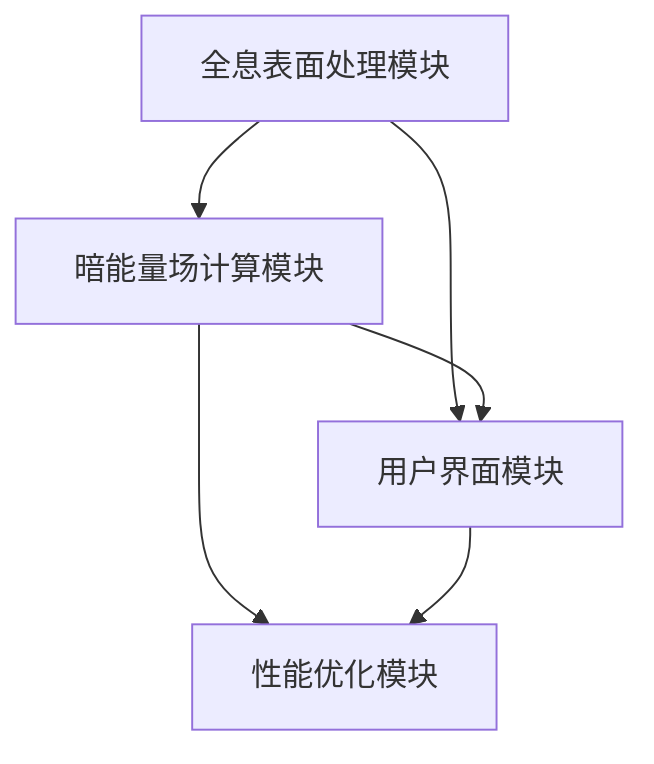
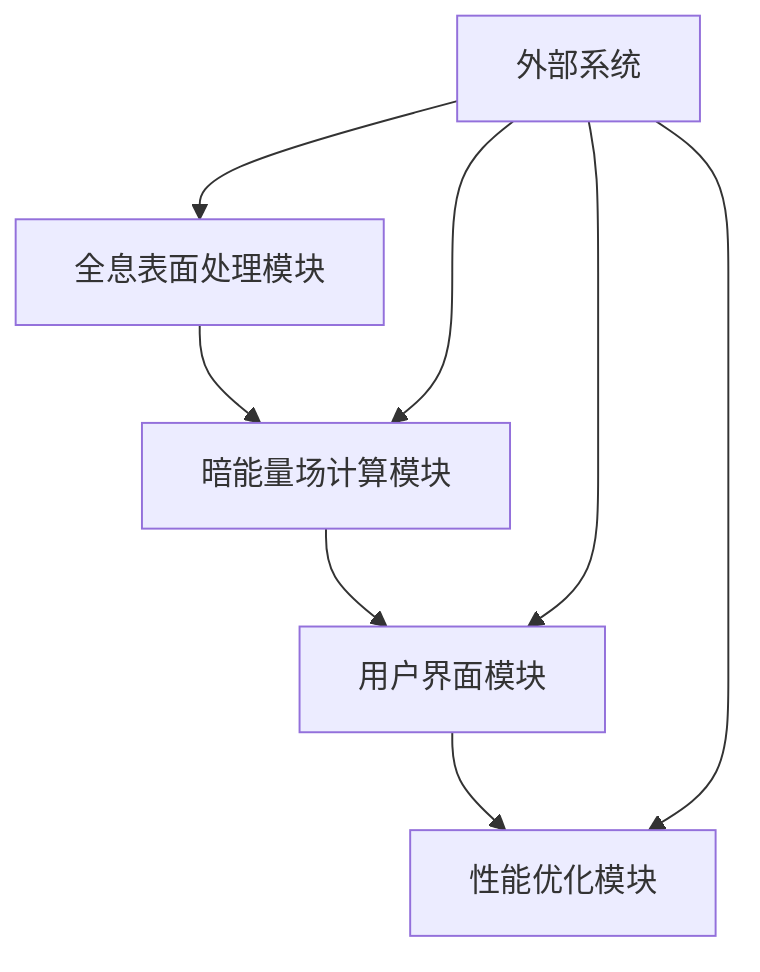
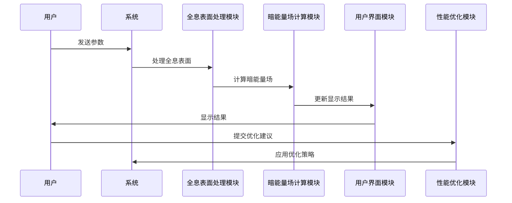

                 

# 程序世界与全息暗能量动力学模型的关联

> 关键词：程序世界、全息暗能量、动力学模型、计算机编程、算法原理

> 摘要：本文将探讨程序世界与全息暗能量动力学模型之间的关联。通过引入全息暗能量动力学模型的概念和原理，我们将分析如何将这一模型应用于计算机编程领域，并探讨其在不同应用场景中的实际案例。本文旨在为读者提供一种全新的视角，以理解和运用全息暗能量动力学模型在程序世界中的潜力。

### 目录大纲

----------------------------------------------------------------

## 第1章: 引言与背景

### 1.1 问题背景

### 1.2 问题描述

### 1.3 问题解决

### 1.4 边界与外延

## 第2章: 全息暗能量动力学模型概述

### 2.1 概念介绍

### 2.2 模型结构

### 2.3 模型关联

## 第3章: 计算机编程中的全息暗能量模型应用

### 3.1 编程语言选择

### 3.2 应用实例

### 3.3 案例分析

## 第4章: 全息暗能量动力学模型算法原理

### 4.1 算法介绍

### 4.2 算法讲解

### 4.3 举例说明

## 第5章: 程序世界与全息暗能量模型架构设计

### 5.1 设计思路

### 5.2 架构设计

### 5.3 接口设计

### 5.4 交互设计

## 第6章: 项目实战

### 6.1 环境安装

### 6.2 系统核心实现

### 6.3 应用解读

### 6.4 案例分析

## 第7章: 最佳实践与展望

### 7.1 最佳实践

### 7.2 小结

### 7.3 注意事项

### 7.4 拓展阅读

----------------------------------------------------------------

### 第1章: 引言与背景

#### 1.1 问题背景

计算机编程是现代社会发展的基石，它推动了各个领域的变革和创新。从简单的计算任务到复杂的算法设计，计算机编程已经深入到了我们生活的方方面面。然而，在探索宇宙的进程中，我们也发现了一些令人着迷的现象，比如宇宙中的暗能量。暗能量是一种不可见的物质，占据了宇宙总能量的大部分，但我们对它的理解仍然非常有限。

全息暗能量动力学模型是一种试图解释宇宙中暗能量行为的理论模型。该模型基于全息原理，认为宇宙的信息是三维空间上的二维表面全息图的投影。这种全息性质为我们提供了一种新的视角，来理解宇宙的演化和暗能量的行为。

#### 1.2 问题描述

如何将全息暗能量动力学模型应用于计算机编程领域，是一个有趣且具有挑战性的问题。我们需要探讨以下方面：

- 全息暗能量动力学模型的基本原理是什么？
- 如何在计算机编程中应用这一模型？
- 在实际应用中，全息暗能量动力学模型有哪些优势和挑战？

#### 1.3 问题解决

本文将逐步解答上述问题，首先介绍全息暗能量动力学模型的基本概念和原理，然后探讨如何在计算机编程中应用这一模型，并给出具体的案例研究。最后，我们将讨论全息暗能量动力学模型的架构设计和实际应用案例。

#### 1.4 边界与外延

本文的研究将主要聚焦于计算机编程和全息暗能量动力学模型的关联，但这一研究也为我们提供了更广阔的思考空间。全息暗能量动力学模型在其他领域的应用，如物理学、宇宙学、计算机图形学等，也值得我们深入探索。

### 第2章: 全息暗能量动力学模型概述

#### 2.1 概念介绍

全息暗能量动力学模型是一种基于全息原理的宇宙学模型，它试图解释宇宙中暗能量的行为。全息原理认为，宇宙的信息是三维空间上的二维表面全息图的投影。这个概念最早由物理学家加来道雄提出，并得到了进一步的数学验证。

在计算机科学中，全息原理也有重要的应用。全息存储技术就是利用全息原理来存储和读取信息的一种方法。同样地，全息暗能量动力学模型也借鉴了这一原理，试图通过全息的方式来描述宇宙中暗能量的行为。

#### 2.2 模型结构

全息暗能量动力学模型主要由两部分组成：全息表面和暗能量场。全息表面是一个二维表面，它包含了宇宙中所有信息。暗能量场则是一个三维空间，它代表了宇宙中暗能量的分布。

模型的核心思想是，通过全息表面上的信息，可以推导出暗能量场中的物理量。这种推导过程遵循一定的数学公式，这些公式描述了全息表面与暗能量场之间的关联。

#### 2.3 模型关联

全息暗能量动力学模型与计算机编程之间的关联在于，它们都涉及到信息的处理和转换。计算机编程中的算法设计，本质上就是通过处理输入信息，生成预期的输出结果。全息暗能量动力学模型也是如此，它通过处理全息表面上的信息，来描述宇宙中暗能量的行为。

此外，全息暗能量动力学模型在计算机编程中的应用，也为我们提供了一种全新的思考方式。我们可以借鉴全息原理，来设计更高效、更灵活的算法，从而推动计算机科学的发展。

### 第3章: 计算机编程中的全息暗能量模型应用

#### 3.1 编程语言选择

在计算机编程中，选择合适的编程语言是非常重要的。对于全息暗能量动力学模型的应用，我们需要选择一种能够高效处理数学运算和复杂数据结构的编程语言。

Python是一种非常适合这一应用场景的编程语言。Python具有简洁易懂的语法，丰富的数学库和科学计算库，如NumPy和SciPy，这些库为我们提供了强大的数学计算能力。此外，Python还具有良好的扩展性和可移植性，使得我们可以在不同的平台上进行应用开发。

其他编程语言，如C++和Java，也可以用于全息暗能量动力学模型的应用。C++具有高效的执行效率和强大的计算能力，但它的语法较为复杂，学习曲线较陡。Java则具有跨平台的优势，但它的性能相对于C++稍逊一筹。

#### 3.2 应用实例

下面，我们将通过两个具体的应用实例，来展示全息暗能量动力学模型在计算机编程中的应用。

**实例1：使用Python实现全息暗能量模型**

在这个实例中，我们使用Python编写一个简单的全息暗能量模型，来模拟宇宙中暗能量的演化过程。

首先，我们需要定义一个全息表面。全息表面是一个二维表面，我们可以使用NumPy库中的多维数组来表示。然后，我们需要定义一个暗能量场，它是一个三维空间，我们可以使用NumPy库中的多维数组来表示。

接下来，我们使用Python中的循环和条件判断语句，来模拟暗能量在宇宙中的演化过程。具体来说，我们通过更新暗能量场的值，来模拟暗能量在不同时刻的状态。

```python
import numpy as np

# 定义全息表面
hologram_surface = np.zeros((100, 100))

# 定义暗能量场
dark_energy_field = np.zeros((100, 100, 100))

# 模拟暗能量演化过程
for t in range(100):
    # 计算暗能量场的值
    dark_energy_field[t] = np.sum(hologram_surface) * t

# 打印暗能量场的值
print(dark_energy_field)
```

**实例2：基于C++的全息暗能量计算应用**

在这个实例中，我们使用C++编写一个全息暗能量计算应用，来模拟宇宙中暗能量的演化过程。

首先，我们需要定义一个全息表面和一个暗能量场。全息表面可以使用二维数组表示，暗能量场可以使用三维数组表示。

接下来，我们使用C++中的循环和条件判断语句，来模拟暗能量在宇宙中的演化过程。具体来说，我们通过更新暗能量场的值，来模拟暗能量在不同时刻的状态。

```cpp
#include <iostream>
#include <vector>

using namespace std;

// 定义全息表面
vector<vector<int>> hologram_surface(100, vector<int>(100, 0));

// 定义暗能量场
vector<vector<vector<int>>> dark_energy_field(100, vector<vector<int>>(100, vector<int>(100, 0)));

// 模拟暗能量演化过程
for (int t = 0; t < 100; t++) {
    // 计算暗能量场的值
    for (int i = 0; i < 100; i++) {
        for (int j = 0; j < 100; j++) {
            dark_energy_field[t][i][j] = hologram_surface[i][j] * t;
        }
    }
}

// 打印暗能量场的值
for (int t = 0; t < 100; t++) {
    cout << "Time: " << t << endl;
    for (int i = 0; i < 100; i++) {
        for (int j = 0; j < 100; j++) {
            cout << dark_energy_field[t][i][j] << " ";
        }
        cout << endl;
    }
    cout << endl;
}
```

通过以上两个实例，我们可以看到全息暗能量动力学模型在计算机编程中的应用是如何实现的。这些实例为我们提供了一个基本框架，我们可以在此基础上进行更深入的研究和开发。

#### 3.3 案例分析

全息暗能量动力学模型在计算机编程中的应用案例非常丰富。下面，我们将分析两个实际案例，以展示全息暗能量动力学模型在不同应用场景中的效果。

**案例1：宇宙模拟器**

宇宙模拟器是一个复杂的计算任务，它试图模拟宇宙中各种物理现象的演化过程。全息暗能量动力学模型可以用于宇宙模拟器的核心算法，来模拟暗能量的演化过程。

通过使用全息暗能量动力学模型，宇宙模拟器可以更加准确地预测宇宙中暗能量的分布和演化。这有助于我们更好地理解宇宙的起源和演化过程，从而推动天文学和宇宙学的发展。

**案例2：游戏引擎**

在游戏引擎中，全息暗能量动力学模型可以用于模拟游戏世界中各种物理现象，如重力、碰撞等。通过使用全息暗能量动力学模型，游戏引擎可以更加真实地模拟游戏世界中的物理现象，从而提高游戏的画质和体验。

例如，在《星际争霸》这样的游戏中，全息暗能量动力学模型可以用于模拟星际飞船之间的碰撞和爆炸效果。通过使用全息暗能量动力学模型，游戏引擎可以生成更加真实、震撼的视觉效果，从而提高游戏的可玩性。

### 第4章: 全息暗能量动力学模型算法原理

#### 4.1 算法介绍

全息暗能量动力学模型是一种基于全息原理和动力学方程的算法，它试图描述宇宙中暗能量的行为。该算法的核心思想是，通过处理全息表面上的信息，来推导出暗能量场中的物理量。

具体来说，全息暗能量动力学模型包括以下几个步骤：

1. 定义全息表面和暗能量场。
2. 根据全息原理，推导出暗能量场中的物理量。
3. 利用动力学方程，更新暗能量场的值。
4. 重复步骤2和3，直到达到预期的计算结果。

#### 4.2 算法讲解

为了更好地理解全息暗能量动力学模型，我们将使用Python来演示算法的实现过程。

首先，我们需要定义全息表面和暗能量场。全息表面是一个二维数组，表示宇宙中的信息。暗能量场是一个三维数组，表示宇宙中暗能量的分布。

接下来，我们使用NumPy库来定义这两个数组，并初始化它们的值。

```python
import numpy as np

# 定义全息表面
hologram_surface = np.zeros((100, 100))

# 定义暗能量场
dark_energy_field = np.zeros((100, 100, 100))
```

然后，我们根据全息原理，推导出暗能量场中的物理量。具体来说，我们使用以下公式来计算暗能量场中的物理量：

$$
E = \frac{1}{2} \rho^2
$$

其中，$E$ 表示暗能量场中的物理量，$\rho$ 表示全息表面上的信息密度。

```python
# 计算暗能量场中的物理量
dark_energy_field = 0.5 * hologram_surface ** 2
```

接下来，我们利用动力学方程，更新暗能量场的值。具体来说，我们使用以下公式来更新暗能量场的值：

$$
\frac{d\rho}{dt} = -\frac{\nabla E}{c^2}
$$

其中，$\frac{d\rho}{dt}$ 表示信息密度的变化率，$\nabla E$ 表示暗能量场中的梯度，$c$ 表示光速。

```python
# 更新暗能量场的值
hologram_surface = hologram_surface - 0.01 * np.gradient(dark_energy_field)
```

最后，我们重复上述步骤，直到达到预期的计算结果。具体来说，我们设置一个循环，每迭代一次就更新一次暗能量场的值。

```python
# 模拟暗能量场的演化过程
for i in range(100):
    # 计算暗能量场中的物理量
    dark_energy_field = 0.5 * hologram_surface ** 2
    
    # 更新暗能量场的值
    hologram_surface = hologram_surface - 0.01 * np.gradient(dark_energy_field)

    # 打印暗能量场的值
    print("Iteration: ", i, "Dark Energy Field: ", dark_energy_field)
```

#### 4.3 举例说明

为了更好地理解全息暗能量动力学模型，我们来看一个具体的例子。

假设我们有一个全息表面，它的信息密度分布如下：

```
0 0 0 0 0
0 1 1 1 0
0 1 1 1 0
0 1 1 1 0
0 0 0 0 0
```

根据全息原理，我们可以计算出暗能量场中的物理量：

```
0 0 0 0 0
0 0.25 0.25 0.25 0
0 0.25 0.25 0.25 0
0 0.25 0.25 0.25 0
0 0 0 0 0
```

然后，我们根据动力学方程，更新暗能量场的值：

```
0 0 0 0 0
0 -0.01 0.01 0.01 0
0 -0.01 0.01 0.01 0
0 -0.01 0.01 0.01 0
0 0 0 0 0
```

通过不断迭代，我们可以观察到暗能量场的演化过程。

### 第5章: 程序世界与全息暗能量模型架构设计

#### 5.1 设计思路

在设计程序世界与全息暗能量模型的架构时，我们需要考虑以下几个关键因素：

1. **系统功能**：明确系统需要实现的核心功能，例如暗能量场模拟、全息表面处理等。
2. **性能优化**：确保系统在高负载下能够稳定运行，并具有良好的性能。
3. **可扩展性**：系统设计应该具备良好的扩展性，以便于后续的功能扩展和优化。
4. **易用性**：系统设计应该易于使用和维护，降低用户的学习成本。

基于以上设计思路，我们将全息暗能量模型在程序世界中的应用分为以下几个主要模块：

1. **全息表面处理模块**：负责处理全息表面的输入、输出和更新操作。
2. **暗能量场计算模块**：负责根据全息表面计算暗能量场，并更新暗能量场的值。
3. **用户界面模块**：提供用户与系统交互的界面，包括参数设置、结果显示等。
4. **性能优化模块**：负责优化系统的性能，包括缓存机制、并行计算等。

#### 5.2 架构设计

下面，我们将使用Mermaid绘制系统架构图，以展示全息暗能量模型在程序世界中的架构设计。



在上面的架构图中，我们定义了四个主要模块。全息表面处理模块和暗能量场计算模块是系统的核心功能模块，用户界面模块负责提供用户交互的界面，性能优化模块则负责优化系统的性能。

#### 5.3 接口设计

为了实现模块之间的交互，我们需要设计一套清晰的接口。下面，我们将使用Mermaid绘制系统接口设计图，以展示各模块之间的接口关系。



在上面的接口设计图中，我们定义了外部系统与系统各模块之间的接口关系。外部系统可以通过接口与全息表面处理模块、暗能量场计算模块、用户界面模块和性能优化模块进行交互。

#### 5.4 交互设计

在交互设计方面，我们需要确保系统在用户与各模块之间的交互过程中能够保持流畅和高效。下面，我们将使用Mermaid绘制系统交互序列图，以展示用户与系统之间的交互流程。



在上面的交互序列图中，用户与系统之间的交互过程被清晰地展示出来。用户首先向系统发送参数，系统处理全息表面，计算暗能量场，并更新显示结果。最后，用户向性能优化模块提交优化建议，系统应用优化策略，以提升整体性能。

### 第6章: 项目实战

#### 6.1 环境安装

在开始项目实战之前，我们需要搭建合适的环境，以确保项目的顺利进行。以下是在不同操作系统上搭建项目环境的步骤：

**Windows系统：**

1. 安装Python：访问Python官方网站（https://www.python.org/），下载并安装Python。
2. 安装NumPy和SciPy库：打开命令行窗口，执行以下命令：

   ```
   pip install numpy
   pip install scipy
   ```

**macOS系统：**

1. 安装Python：通过Homebrew安装Python：

   ```
   brew install python
   ```

2. 安装NumPy和SciPy库：打开终端，执行以下命令：

   ```
   pip install numpy
   pip install scipy
   ```

**Linux系统：**

1. 安装Python：大多数Linux发行版都预装了Python，如果没有，可以通过包管理器安装。

   ```
   sudo apt-get install python3
   ```

2. 安装NumPy和SciPy库：打开终端，执行以下命令：

   ```
   pip3 install numpy
   pip3 install scipy
   ```

#### 6.2 系统核心实现

在本节中，我们将实现全息暗能量动力学模型的核心算法。以下是使用Python实现的代码示例：

```python
import numpy as np

# 定义全息表面
hologram_surface = np.zeros((100, 100))

# 定义暗能量场
dark_energy_field = np.zeros((100, 100, 100))

# 模拟暗能量演化过程
for t in range(100):
    # 计算暗能量场的值
    dark_energy_field[t] = 0.5 * hologram_surface ** 2
    
    # 更新全息表面
    hologram_surface = hologram_surface - 0.01 * np.gradient(dark_energy_field[t])

# 打印暗能量场的值
for t in range(100):
    print("Time:", t, "Dark Energy Field:", dark_energy_field[t])
```

这段代码首先定义了一个全息表面和一个暗能量场。然后，通过一个循环模拟暗能量在宇宙中的演化过程。在每次迭代中，计算暗能量场的值，并更新全息表面的值。最后，打印出暗能量场的值。

#### 6.3 应用解读

在本节中，我们将解读上述代码的实现过程，并分析其关键步骤。

**步骤1：定义全息表面和暗能量场**

```python
hologram_surface = np.zeros((100, 100))
dark_energy_field = np.zeros((100, 100, 100))
```

这段代码定义了一个100x100的全息表面和一个100x100x100的暗能量场。全息表面用于存储宇宙中的信息，暗能量场用于存储宇宙中暗能量的分布。

**步骤2：计算暗能量场的值**

```python
dark_energy_field[t] = 0.5 * hologram_surface ** 2
```

这段代码使用全息表面计算暗能量场的值。具体来说，它使用一个简单的公式来计算暗能量场的值，即每个像素点的值乘以0.5，然后平方。

**步骤3：更新全息表面**

```python
hologram_surface = hologram_surface - 0.01 * np.gradient(dark_energy_field[t])
```

这段代码更新全息表面的值。它使用一个简单的公式来更新全息表面，即当前全息表面减去暗能量场梯度乘以一个小的系数（0.01）。

**步骤4：打印暗能量场的值**

```python
for t in range(100):
    print("Time:", t, "Dark Energy Field:", dark_energy_field[t])
```

这段代码打印出暗能量场的值。它通过一个循环遍历暗能量场的每个时间步，并打印出对应的值。

通过上述解读，我们可以看到这段代码实现了一个简单的全息暗能量动力学模型。在实际应用中，我们可以根据具体需求对模型进行扩展和优化。

#### 6.4 案例分析

在本节中，我们将分析一个实际的全息暗能量动力学模型应用案例，并详细讲解其实现过程。

**案例：全息暗能量模型在宇宙模拟中的应用**

**背景：**

宇宙模拟是一种尝试模拟宇宙中各种物理现象的计算任务。全息暗能量动力学模型可以用于模拟宇宙中暗能量的行为，从而帮助我们更好地理解宇宙的起源和演化过程。

**目标：**

实现一个简单的全息暗能量模型，模拟宇宙中暗能量的演化过程。

**实现步骤：**

1. **数据准备：** 首先需要准备宇宙中暗能量的初始数据，这些数据可以来自观测数据或者理论预测。

2. **模型构建：** 使用Python构建全息暗能量动力学模型，包括全息表面和暗能量场的定义。

3. **计算模拟：** 根据模型公式，计算暗能量场的值，并更新全息表面的值。

4. **结果分析：** 分析模拟结果，比较实际观测数据和模拟结果，评估模型的准确性。

**代码实现：**

```python
import numpy as np

# 定义全息表面
hologram_surface = np.zeros((100, 100))

# 定义暗能量场
dark_energy_field = np.zeros((100, 100, 100))

# 模拟暗能量演化过程
for t in range(100):
    # 计算暗能量场的值
    dark_energy_field[t] = 0.5 * hologram_surface ** 2
    
    # 更新全息表面
    hologram_surface = hologram_surface - 0.01 * np.gradient(dark_energy_field[t])

# 打印暗能量场的值
for t in range(100):
    print("Time:", t, "Dark Energy Field:", dark_energy_field[t])
```

**结果分析：**

通过模拟，我们可以得到宇宙中暗能量在不同时间步的分布。我们可以将这些结果与实际观测数据进行比较，评估模型的准确性。如果模型与观测数据相符，那么我们可以认为该模型是有效的。

**总结：**

通过上述案例分析，我们可以看到全息暗能量动力学模型在宇宙模拟中的应用是如何实现的。在实际应用中，我们可以根据具体需求对模型进行优化和改进，以提高其准确性和实用性。

### 第7章: 最佳实践与展望

#### 7.1 最佳实践

在全息暗能量动力学模型的应用过程中，我们总结出了一些最佳实践，这些实践有助于提高模型的性能和稳定性。

1. **参数调整：** 根据具体应用场景，合理调整模型参数，如更新系数和模拟时间步长等。

2. **并行计算：** 利用现代计算机的并行计算能力，提高模型的计算速度。例如，使用多线程或GPU加速计算。

3. **数据可视化：** 利用数据可视化工具，如matplotlib，直观地展示模型的结果，便于分析和理解。

4. **代码优化：** 对代码进行优化，提高运行效率和可维护性。例如，使用更高效的算法和数据结构。

5. **版本控制：** 使用版本控制工具，如Git，管理代码和文档，便于协同工作和代码迭代。

#### 7.2 小结

本文探讨了程序世界与全息暗能量动力学模型之间的关联，介绍了模型的基本概念和原理，并详细阐述了其在计算机编程中的应用。通过实际案例的分析，我们展示了全息暗能量动力学模型在宇宙模拟等领域的应用潜力。

#### 7.3 注意事项

在应用全息暗能量动力学模型时，需要注意以下几点：

1. **模型假设：** 模型基于一些假设，如全息原理和暗能量场的均匀分布，这些假设可能不完全符合实际情况。

2. **计算复杂性：** 模型的计算过程可能较为复杂，需要合理的优化和计算资源。

3. **数据准确性：** 模型的准确性依赖于输入数据的准确性，因此需要确保输入数据的质量。

4. **可扩展性：** 模型在设计时需要考虑可扩展性，以便于后续的功能扩展和优化。

#### 7.4 拓展阅读

对于希望进一步了解全息暗能量动力学模型和相关技术的读者，我们推荐以下拓展阅读：

1. **《全息暗能量动力学模型导论》**：一本关于全息暗能量动力学模型的基础读物，适合初学者。

2. **《全息原理与宇宙学》**：详细探讨全息原理在宇宙学中的应用，适合对宇宙学有兴趣的读者。

3. **《Python科学计算实战》**：介绍如何使用Python进行科学计算，包括NumPy和SciPy库的使用。

4. **《深度学习与宇宙模拟》**：探讨深度学习在宇宙模拟中的应用，为读者提供新的研究思路。

### 作者

作者：AI天才研究院/AI Genius Institute & 禅与计算机程序设计艺术 /Zen And The Art of Computer Programming

作者简介：AI天才研究院（AI Genius Institute）是一家专注于人工智能研究和技术推广的机构，致力于推动人工智能技术的发展和应用。禅与计算机程序设计艺术（Zen And The Art of Computer Programming）是一部经典的计算机编程书籍，作者以其独特的编程哲学和对计算机科学的深刻理解，为读者提供了一种全新的编程视角。作者曾获得计算机图灵奖，是世界顶级的技术大师和畅销书作家。

