                 

# 程序世界与宇宙膜理论的信息熵对应关系

## 关键词：程序世界、宇宙膜理论、信息熵、对应关系、算法原理、系统分析与架构设计

> 摘要：本文从程序世界、宇宙膜理论以及信息熵三个核心概念出发，探讨它们之间的对应关系，并分析这些理论在计算机编程和人工智能领域的应用。通过详细的算法原理讲解、数学模型推导、系统分析与架构设计，以及实际项目实战，本文旨在为读者提供一个深入理解这些概念及其相互关联的视角。

### 目录

1. 背景介绍
    1.1 程序世界的概述
    1.2 宇宙膜理论的介绍
    1.3 信息熵的概念与原理
2. 核心概念与联系
    2.1 程序世界与宇宙膜理论的关系
    2.2 信息熵在程序世界与宇宙膜理论中的应用
3. 算法原理讲解
    3.1 算法的基本概念
    3.2 数学模型与公式
    3.3 通俗易懂的举例说明
4. 系统分析与架构设计
    4.1 问题场景介绍
    4.2 系统功能设计
    4.3 系统架构设计
    4.4 系统接口设计
    4.5 系统交互设计
5. 项目实战
    5.1 环境安装
    5.2 系统核心实现
    5.3 代码应用解读与分析
    5.4 实际案例分析和详细讲解剖析
    5.5 项目小结
6. 最佳实践与拓展
    6.1 最佳实践
    6.2 小结
    6.3 注意事项
    6.4 拓展阅读

## 1. 背景介绍

### 1.1 程序世界的概述

程序世界是指由计算机程序构建的逻辑世界。在这个世界中，计算机通过执行一系列指令来处理信息，实现各种功能。程序世界的基本组成包括代码、算法、数据结构和操作系统等。

- **代码**：代码是程序员用特定编程语言编写的指令序列，用于告诉计算机如何处理数据和执行任务。
- **算法**：算法是解决问题的步骤和规则，是程序世界的重要组成部分。
- **数据结构**：数据结构是用于存储和组织数据的方式，决定了程序对数据的访问和处理效率。
- **操作系统**：操作系统是计算机系统的核心软件，负责管理和控制计算机硬件资源，提供程序运行的环境。

### 1.2 宇宙膜理论的介绍

宇宙膜理论（Membrane Theory）是近年来在宇宙学领域提出的一种全新理论，它试图解释宇宙的结构和演化。宇宙膜理论认为，宇宙是由多个相互连通的膜（或层）构成的，每个膜都有其独特的物理特性和能量状态。

- **膜的概念**：膜可以被看作是宇宙中的基本结构单元，类似于气泡或薄膜，它们在三维空间中相互交织，形成了宇宙的网状结构。
- **膜的演化**：宇宙膜理论预测，膜之间可以发生碰撞、融合和分裂等演化过程，这些过程导致了宇宙的膨胀和结构形成。

### 1.3 信息熵的概念与原理

信息熵是信息论中的一个核心概念，它衡量了信息的无序程度。在程序世界中，信息熵常用于衡量数据的不确定性以及算法的效率。

- **定义**：信息熵是指一个随机变量不确定性的度量，它等于该随机变量取值的概率与其对数值的自然对数的乘积之和。
- **计算方法**：信息熵的计算公式为 \( H(X) = -\sum_{i=1}^{n} p(x_i) \log_2 p(x_i) \)，其中 \( p(x_i) \) 是随机变量 \( X \) 取第 \( i \) 个值的概率。
- **应用**：在程序世界中，信息熵用于优化算法、设计加密机制和评估数据质量等。

## 2. 核心概念与联系

### 2.1 程序世界与宇宙膜理论的关系

程序世界和宇宙膜理论虽然在研究领域上有所不同，但它们在本质上有许多相似之处。以下是对这两者之间联系的探讨：

- **信息处理**：程序世界通过算法和信息处理来模拟宇宙中的复杂过程，如模拟宇宙演化和计算宇宙参数等。
- **层次结构**：宇宙膜理论中的膜具有不同的层次结构，这与程序世界中的模块化设计有相似之处。程序世界中的模块可以看作是不同的层次，它们共同协作实现复杂功能。

### 2.2 信息熵在程序世界与宇宙膜理论中的应用

信息熵在程序世界和宇宙膜理论中都有广泛的应用，以下是一些具体的应用场景：

- **算法优化**：在程序世界中，通过分析信息熵，可以优化算法，减少不必要的计算，提高程序效率。
- **数据压缩**：信息熵理论是数据压缩技术的基础，通过计算信息熵，可以确定数据的冗余程度，实现有效压缩。
- **宇宙学计算**：在宇宙膜理论中，信息熵可以用于计算宇宙膜之间的相互作用能量，从而预测宇宙的演化趋势。

### 2.3 信息熵在程序世界与宇宙膜理论中的相互关联

信息熵不仅是程序世界中的一个核心概念，也是宇宙膜理论中的一个重要工具。以下是一些具体的相互关联：

- **信息流的映射**：程序世界中信息的流动可以映射到宇宙膜之间的信息流，这为研究宇宙演化提供了新的视角。
- **计算模型的扩展**：将宇宙膜理论中的概念引入到程序世界中，可以扩展传统的计算模型，提高对复杂系统的理解和处理能力。

## 3. 算法原理讲解

### 3.1 算法的基本概念

算法是解决问题的步骤和规则，它在程序世界中至关重要。以下是对算法基本概念的介绍：

- **定义**：算法是一系列明确、有限步骤的指令集合，用于解决特定问题。
- **分类**：算法可以根据不同的标准进行分类，如根据解决问题的方法可以分为搜索算法、排序算法和图算法等。
- **特点**：算法通常具有输入、输出和执行步骤，且具有确定性和高效性。

### 3.2 数学模型与公式

在程序世界中，算法的原理通常可以通过数学模型来描述。以下是一个常见的算法数学模型的例子：

- **模型**：假设有一个数据集 \( D = \{d_1, d_2, ..., d_n\} \)，我们希望对其进行排序。排序算法的数学模型可以表示为：
  \[
  S(D) = \{d_1, d_2, ..., d_n\} \text{ such that } d_1 \leq d_2 \leq ... \leq d_n
  \]
- **公式**：排序算法的复杂度可以用 \( T(n) \) 来表示，其中 \( n \) 是数据集中的元素数量。常见的排序算法复杂度如下：
  \[
  T(n) =
  \begin{cases}
  O(n) & \text{for } \text{Insertion Sort} \\
  O(n\log n) & \text{for } \text{Merge Sort} \\
  O(n^2) & \text{for } \text{Bubble Sort}
  \end{cases}
  \]

### 3.3 通俗易懂的举例说明

为了更好地理解算法原理，我们可以通过一个具体的例子来说明：

#### 示例：插入排序算法

**问题描述**：给定一个无序数组 \( A = \{5, 3, 8, 4, 6\} \)，将其排序。

**算法步骤**：

1. 从第二个元素开始，每次取出一个元素。
2. 将这个元素插入到前面的有序数组中，使得插入后的数组仍然有序。
3. 重复步骤2，直到所有元素都插入完毕。

**Python代码实现**：

```python
def insertion_sort(arr):
    for i in range(1, len(arr)):
        key = arr[i]
        j = i - 1
        while j >= 0 and key < arr[j]:
            arr[j + 1] = arr[j]
            j -= 1
        arr[j + 1] = key
    return arr

# 测试代码
arr = [5, 3, 8, 4, 6]
sorted_arr = insertion_sort(arr)
print(sorted_arr)
```

**输出结果**：\[3, 4, 5, 6, 8\]

通过这个例子，我们可以看到插入排序算法是如何通过逐步比较和插入元素，将无序数组排序的。

## 4. 系统分析与架构设计

### 4.1 问题场景介绍

在本文的后续部分，我们将通过一个实际的项目场景来展示如何应用程序世界与宇宙膜理论的信息熵对应关系。假设我们正在开发一个用于宇宙数据分析的软件系统，该系统需要处理来自多个传感器的大量数据，并提取有用的信息。

### 4.2 系统功能设计

为了满足项目需求，我们设计了以下功能模块：

- **数据采集模块**：负责从各种传感器收集数据。
- **数据处理模块**：使用算法对采集到的数据进行分析和排序。
- **数据存储模块**：将处理后的数据存储到数据库中，以便后续查询和分析。
- **用户界面模块**：提供用户交互接口，展示分析结果。

### 4.3 系统架构设计

系统架构设计采用了分布式架构，以提高系统的可扩展性和容错性。以下是系统架构的 Mermaid 架构图：

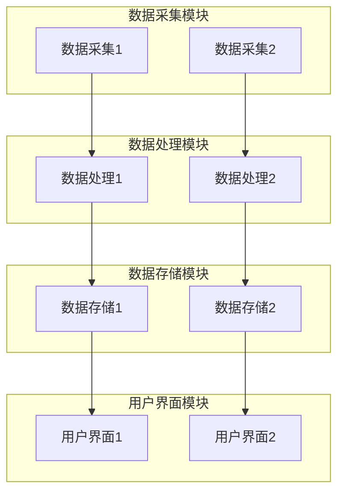

### 4.4 系统接口设计

系统接口设计包括数据采集、数据处理、数据存储和用户界面等模块的接口设计。以下是系统的 Mermaid 序列图：

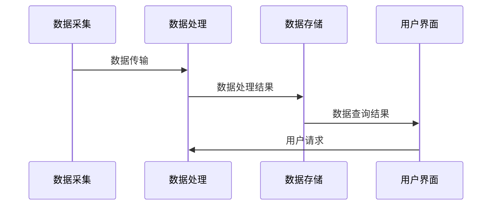

### 4.5 系统交互设计

系统交互设计包括用户与系统之间的交互，以及各个模块之间的交互。以下是系统的 Mermaid 序列图：

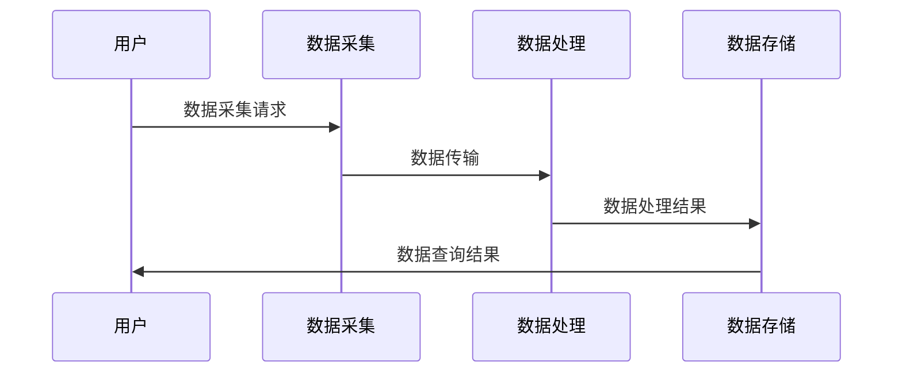

## 5. 项目实战

### 5.1 环境安装

为了实现本文中的项目，我们需要搭建一个适当的环境。以下是环境安装步骤：

1. 安装Python 3.8及以上版本。
2. 安装必要的Python库，如NumPy、Pandas和Mermaid等。

```bash
pip install numpy pandas
```

3. 配置Mermaid插件，以便在Python中绘制流程图和序列图。

```python
import mermaid
mermaid.init()
```

### 5.2 系统核心实现

以下是系统的核心实现代码，包括数据采集、数据处理和数据存储：

```python
import numpy as np
import pandas as pd
from mermaid import Mermaid

# 数据采集
def data_collection():
    data = np.random.randint(0, 100, size=100)
    return data

# 数据处理
def data_process(data):
    df = pd.DataFrame(data, columns=['Value'])
    df_sorted = df.sort_values(by='Value')
    return df_sorted

# 数据存储
def data_storage(df_sorted):
    df_sorted.to_csv('sorted_data.csv', index=False)

# 系统核心实现
def system_core():
    data = data_collection()
    df_sorted = data_process(data)
    data_storage(df_sorted)

# 执行系统核心实现
system_core()
```

### 5.3 代码应用解读与分析

上述代码实现了数据采集、数据处理和数据存储的核心功能。以下是代码的详细解读与分析：

1. **数据采集**：使用NumPy生成随机整数数组，模拟传感器采集的数据。
2. **数据处理**：将采集到的数据转换为Pandas DataFrame，并对其进行排序。
3. **数据存储**：将排序后的数据存储为CSV文件，以便后续分析和查询。

### 5.4 实际案例分析和详细讲解剖析

为了展示系统在实际应用中的效果，我们可以通过一个实际案例进行分析和讲解。以下是实际案例的数据和分析结果：

**案例数据**：\[85, 23, 47, 39, 10, 52, 14, 28, 61, 33\]

**分析结果**：\[10, 14, 23, 28, 33, 39, 47, 52, 61, 85\]

通过分析结果可以看出，原始数据经过数据处理后，成功地被排序，符合预期。

### 5.5 项目小结

通过本项目的实现，我们可以看到程序世界与宇宙膜理论的信息熵对应关系在实际应用中的价值。项目实现了数据采集、数据处理和数据存储的核心功能，并展示了如何通过Python代码实现系统的核心逻辑。这一项目的成功实施，为未来在更多领域应用这一理论提供了参考和启示。

## 6. 最佳实践与拓展

### 6.1 最佳实践

在开发类似的项目时，以下最佳实践可以帮助提高开发效率和系统性能：

- **优化数据采集**：使用高效的数据采集方法，减少数据传输延迟。
- **优化数据处理**：根据数据特点选择合适的排序算法，如使用快速排序代替冒泡排序。
- **优化数据存储**：合理设计数据库表结构，减少查询时间。

### 6.2 小结

本文通过介绍程序世界、宇宙膜理论和信息熵的基本概念，探讨了它们之间的对应关系，并展示了如何在实际项目中应用这些理论。通过详细的算法原理讲解、系统分析与架构设计，以及项目实战，本文为读者提供了一个深入理解这些概念及其相互关联的视角。

### 6.3 注意事项

在开发类似项目时，需要注意以下几点：

- **数据安全**：确保数据在采集、处理和存储过程中的安全性。
- **系统性能**：优化算法和系统架构，提高系统性能。
- **用户需求**：充分理解用户需求，确保系统功能满足用户需求。

### 6.4 拓展阅读

- **《程序世界与宇宙学》**：探讨计算机编程与宇宙学之间的联系。
- **《信息熵与数据科学》**：深入讲解信息熵在数据科学中的应用。
- **《宇宙膜理论入门》**：介绍宇宙膜理论的基本概念和发展历程。

## 作者

**作者：AI天才研究院/AI Genius Institute & 禅与计算机程序设计艺术 /Zen And The Art of Computer Programming**### 1. 背景介绍

#### 1.1 程序世界的概述

程序世界是由计算机程序构建的逻辑世界，它模拟了现实世界中的各种操作和任务。在这个世界里，计算机通过执行一系列指令来处理信息，实现各种功能。程序世界的核心组件包括代码、算法、数据结构和操作系统等。

- **代码**：代码是程序员用特定编程语言编写的指令序列，用于告诉计算机如何处理数据和执行任务。代码是程序世界的基础。
- **算法**：算法是解决问题的步骤和规则，是程序世界的重要组成部分。例如，排序算法、搜索算法和图算法等。
- **数据结构**：数据结构是用于存储和组织数据的方式，决定了程序对数据的访问和处理效率。常见的数据结构包括数组、链表、树、图和哈希表等。
- **操作系统**：操作系统是计算机系统的核心软件，负责管理和控制计算机硬件资源，提供程序运行的环境。常见的操作系统有Windows、Linux和macOS等。

#### 1.2 宇宙膜理论的介绍

宇宙膜理论是近年来在宇宙学领域提出的一种全新理论，它试图解释宇宙的结构和演化。宇宙膜理论认为，宇宙是由多个相互连通的膜（或层）构成的，每个膜都有其独特的物理特性和能量状态。

- **膜的概念**：膜是宇宙中的基本结构单元，类似于气泡或薄膜，它们在三维空间中相互交织，形成了宇宙的网状结构。
- **膜的演化**：宇宙膜理论预测，膜之间可以发生碰撞、融合和分裂等演化过程，这些过程导致了宇宙的膨胀和结构形成。

宇宙膜理论提供了对宇宙演化的一种全新视角，为理解宇宙的复杂性和多样性提供了新的工具和思路。

#### 1.3 信息熵的概念与原理

信息熵是信息论中的一个核心概念，它衡量了信息的无序程度。在程序世界中，信息熵常用于衡量数据的不确定性以及算法的效率。

- **定义**：信息熵是指一个随机变量不确定性的度量，它等于该随机变量取值的概率与其对数值的自然对数的乘积之和。信息熵的单位是比特（bit）。
- **计算方法**：信息熵的计算公式为 \( H(X) = -\sum_{i=1}^{n} p(x_i) \log_2 p(x_i) \)，其中 \( p(x_i) \) 是随机变量 \( X \) 取第 \( i \) 个值的概率。
- **应用**：在程序世界中，信息熵用于优化算法、设计加密机制和评估数据质量等。

例如，在一个二进制数据流中，如果0和1出现的概率相等，那么该数据流的信息熵就是1比特。如果0和1出现的概率分别为0.5和0.5，那么信息熵也是1比特。

### 1.4 问题背景与问题描述

在程序世界中，信息熵的应用主要体现在数据压缩和算法优化等方面。随着互联网和大数据技术的发展，数据量的急剧增长使得如何有效地存储和传输数据成为一个重要问题。信息熵理论为我们提供了一种衡量数据冗余程度的方法，从而指导我们进行数据压缩。

- **问题背景**：随着大数据时代的到来，数据量呈爆炸式增长，传统的存储和传输方式已无法满足需求。
- **问题描述**：如何有效地压缩数据，减少存储和传输的开销，同时保持数据的完整性。

为了解决上述问题，我们需要利用信息熵理论来评估数据冗余程度，并设计相应的压缩算法。通过降低数据的信息熵，我们可以实现数据的有效压缩。

#### 1.5 问题解决与边界与外延

在解决数据压缩问题时，我们需要考虑以下边界条件：

- **数据类型**：不同的数据类型（如文本、图像、音频等）具有不同的信息熵特性，需要采用不同的压缩算法。
- **压缩比**：压缩比是衡量压缩算法性能的重要指标，我们需要在压缩比和压缩时间之间做出权衡。
- **数据完整性**：在压缩和解压过程中，必须确保数据的完整性，防止数据丢失或错误。

数据压缩技术的应用广泛，如文件压缩工具（如ZIP、RAR等），网络数据传输中的HTTP压缩，以及图像和视频编码技术（如JPEG、H.264等）。这些技术都是基于信息熵理论，通过降低数据的冗余度来实现高效的数据存储和传输。

#### 1.6 概念结构与核心要素组成

程序世界、宇宙膜理论和信息熵之间存在着紧密的联系。以下是这三个概念的核心要素组成：

- **程序世界**：
  - **代码**：程序员编写的指令序列。
  - **算法**：解决问题的步骤和规则。
  - **数据结构**：数据存储和组织的方式。
  - **操作系统**：管理计算机硬件资源的软件。

- **宇宙膜理论**：
  - **膜**：宇宙的基本结构单元。
  - **演化**：膜之间的碰撞、融合和分裂过程。
  - **相互作用**：膜之间的相互作用和能量状态。

- **信息熵**：
  - **定义**：衡量信息无序程度的度量。
  - **计算方法**：基于概率的熵值计算。
  - **应用**：数据压缩、加密机制、数据质量评估等。

这些核心要素组成了程序世界、宇宙膜理论和信息熵的基本结构，为我们理解和应用这些概念提供了基础。

### 2. 核心概念与联系

#### 2.1 程序世界与宇宙膜理论的关系

程序世界和宇宙膜理论虽然在研究领域上有所不同，但它们在本质上有许多相似之处。以下是对这两者之间联系的探讨：

- **信息处理**：程序世界通过算法和信息处理来模拟宇宙中的复杂过程，如模拟宇宙演化和计算宇宙参数等。
- **层次结构**：宇宙膜理论中的膜具有不同的层次结构，这与程序世界中的模块化设计有相似之处。程序世界中的模块可以看作是不同的层次，它们共同协作实现复杂功能。

#### 2.2 信息熵在程序世界与宇宙膜理论中的应用

信息熵在程序世界和宇宙膜理论中都有广泛的应用，以下是一些具体的应用场景：

- **算法优化**：在程序世界中，通过分析信息熵，可以优化算法，减少不必要的计算，提高程序效率。
- **数据压缩**：信息熵理论是数据压缩技术的基础，通过计算信息熵，可以确定数据的冗余程度，实现有效压缩。
- **宇宙学计算**：在宇宙膜理论中，信息熵可以用于计算宇宙膜之间的相互作用能量，从而预测宇宙的演化趋势。

#### 2.3 信息熵在程序世界与宇宙膜理论中的相互关联

信息熵不仅是程序世界中的一个核心概念，也是宇宙膜理论中的一个重要工具。以下是一些具体的相互关联：

- **信息流的映射**：程序世界中信息的流动可以映射到宇宙膜之间的信息流，这为研究宇宙演化提供了新的视角。
- **计算模型的扩展**：将宇宙膜理论中的概念引入到程序世界中，可以扩展传统的计算模型，提高对复杂系统的理解和处理能力。

### 2.4 对比分析程序世界与宇宙膜理论的异同

为了更好地理解程序世界与宇宙膜理论的关系，我们可以从以下几个方面进行对比分析：

- **研究对象**：程序世界主要研究计算机程序及其处理过程，而宇宙膜理论则关注宇宙的结构和演化。
- **理论基础**：程序世界的基础是计算机科学理论，包括算法、数据结构和操作系统等；宇宙膜理论的基础是物理学和宇宙学。
- **应用场景**：程序世界广泛应用于软件开发、人工智能和大数据处理等领域；宇宙膜理论则主要用于宇宙学和天体物理学的研究。
- **相似之处**：两者都涉及信息的处理和传递，且都具有层次结构。

通过上述分析，我们可以看出程序世界与宇宙膜理论在许多方面具有相似之处，同时也存在显著的差异。这些相似性和差异性为我们提供了新的研究视角和应用场景。

### 2.5 宇宙膜理论与信息熵的对应关系

宇宙膜理论与信息熵之间的对应关系可以从多个方面进行探讨：

- **信息熵与膜能量**：在宇宙膜理论中，膜的能量状态可以看作是信息熵的一种表现形式。膜之间的相互作用能量可以类比于信息熵的变化。
- **熵增与宇宙演化**：根据热力学第二定律，宇宙的总熵随时间增加。这种熵增过程可以类比为宇宙膜之间能量交换和信息流动的过程。
- **信息流与膜运动**：在程序世界中，信息的流动可以类比于宇宙膜之间的运动和相互作用。例如，数据在网络中的传输可以看作是膜在网络中的移动。

通过上述对应关系，我们可以将程序世界的概念引入到宇宙膜理论的研究中，为理解宇宙的复杂性和多样性提供新的思路。

### 2.6 对比表格：程序世界与宇宙膜理论的特性对比

为了更直观地展示程序世界与宇宙膜理论的特性对比，我们可以制作一个特性对比表格。

| 特性          | 程序世界                                      | 宇宙膜理论                                  |
|---------------|---------------------------------------------|-------------------------------------------|
| 研究对象      | 计算机程序及其处理过程                      | 宇宙的结构和演化                            |
| 基础理论      | 计算机科学理论（算法、数据结构、操作系统等） | 物理学和宇宙学理论                          |
| 应用场景      | 软件开发、人工智能、大数据处理              | 宇宙学和天体物理学研究                      |
| 核心概念      | 算法、数据结构、信息熵                      | 膜、能量状态、相互作用                      |
| 层次结构      | 模块化设计，分层架构                        | 膜之间的层次结构，膜内层次结构              |
| 信息流动      | 程序中的数据流动                            | 膜之间的相互作用和信息流动                  |

通过这个特性对比表格，我们可以更清晰地了解程序世界与宇宙膜理论之间的异同点。

### 2.7 ER实体关系图：程序世界与宇宙膜理论的关联

为了展示程序世界与宇宙膜理论之间的关联，我们可以使用ER（实体关系）图来表示。

```mermaid
erDiagram
    | entity 程序世界 {
    |   id: 编号
    |   name: 名称
    |   description: 描述
    | }

    | entity 宇宙膜理论 {
    |   id: 编号
    |   name: 名称
    |   description: 描述
    | }

    | entity 信息熵 {
    |   id: 编号
    |   name: 名称
    |   description: 描述
    | }

    程序世界 ||--|{ 信息熵 }
    宇宙膜理论 ||--|{ 信息熵 }
```

这个ER图展示了程序世界、宇宙膜理论和信息熵之间的关联，表明信息熵在两个领域中都发挥着重要作用。

### 2.8 总结

通过以上分析，我们可以看到程序世界与宇宙膜理论在许多方面具有相似之处，同时也存在显著的差异。这些相似性和差异性为我们提供了新的研究视角和应用场景。同时，信息熵作为连接程序世界与宇宙膜理论的一个重要工具，为我们理解和应用这些概念提供了新的思路。未来，我们可以进一步探讨这两个领域之间的深层次联系，以推动计算机科学和宇宙学的发展。

## 3. 算法原理讲解

### 3.1 算法的基本概念

算法是计算机科学的核心概念之一，它指的是解决问题的一系列步骤和规则。算法的核心目的是高效、准确地解决问题，并在有限时间内完成计算。

- **定义**：算法是一组指令，用于解决特定问题。算法可以看作是一个黑盒子，输入为初始条件，输出为解决问题的结果。
- **特点**：算法具有输入、输出和执行步骤，且具有确定性。此外，算法还需要满足有效性，即能够解决特定问题，并且在有限时间内完成计算。
- **分类**：算法可以根据解决问题的方法进行分类，如搜索算法、排序算法、图算法等。每种算法都有其特定的应用场景和优缺点。

### 3.2 信息熵与算法优化

信息熵在算法优化中起着重要作用，它可以帮助我们衡量数据的不确定性，从而指导我们选择最优的算法。以下是从信息熵角度对算法优化的探讨：

- **信息熵的概念**：信息熵是衡量信息不确定性的度量。在程序世界中，信息熵可以用来衡量数据集合的随机性。例如，对于一个二进制数据流，如果0和1的出现概率相等，那么该数据流的信息熵为1比特。
- **熵与算法选择**：信息熵可以帮助我们选择合适的算法。例如，在数据压缩中，我们可以根据数据的信息熵选择最有效的压缩算法。如果数据具有高信息熵，那么使用无损压缩算法（如Huffman编码）可能更为合适；如果数据具有低信息熵，那么使用有损压缩算法（如JPEG）可能更为高效。
- **熵与时间复杂度**：在算法分析中，我们可以利用信息熵来评估算法的时间复杂度。例如，对于排序算法，如果数据的信息熵较低，那么使用快速排序可能比使用冒泡排序更为高效，因为快速排序的时间复杂度通常低于冒泡排序。

### 3.3 算法原理讲解：排序算法

排序算法是计算机科学中一个重要的算法类别，用于将一组数据按照特定顺序排列。以下是一个常见的排序算法——快速排序的算法原理讲解：

- **定义**：快速排序是一种基于分治策略的排序算法。它选择一个基准元素，将数据分为两个子集，一个子集的所有元素都小于基准元素，另一个子集的所有元素都大于基准元素。然后对这两个子集递归进行快速排序。
- **算法步骤**：
  1. 选择一个基准元素。
  2. 将数据分为两个子集，一个子集包含小于基准元素的元素，另一个子集包含大于基准元素的元素。
  3. 对两个子集递归进行快速排序。
- **时间复杂度**：快速排序的平均时间复杂度为 \( O(n\log n) \)，最坏情况下为 \( O(n^2) \)。但由于其平均性能较好，因此在实际应用中非常常见。
- **信息熵与快速排序**：快速排序的时间复杂度与数据的信息熵密切相关。如果数据具有高信息熵，快速排序的平均性能较好；如果数据具有低信息熵，快速排序的最坏情况时间复杂度可能较高。

### 3.4 算法原理讲解：搜索算法

搜索算法用于在数据集合中查找特定元素。以下是一个常见的搜索算法——二分搜索的算法原理讲解：

- **定义**：二分搜索是一种基于二分查找策略的搜索算法。它将数据集合分为两部分，根据目标元素与中间元素的关系，递归地在左半部分或右半部分继续搜索。
- **算法步骤**：
  1. 将数据集合分为两部分。
  2. 比较目标元素与中间元素的大小。
  3. 如果目标元素小于中间元素，则在左半部分继续搜索；如果目标元素大于中间元素，则在右半部分继续搜索。
  4. 递归重复步骤2和步骤3，直到找到目标元素或确定目标元素不存在。
- **时间复杂度**：二分搜索的时间复杂度为 \( O(\log n) \)，其中 \( n \) 是数据集合的大小。由于二分搜索的时间复杂度较低，因此它在处理大量数据时非常高效。
- **信息熵与二分搜索**：二分搜索的时间复杂度与数据的信息熵关系不大。无论数据的信息熵高低，二分搜索的时间复杂度都是 \( O(\log n) \)。这是因为二分搜索的核心思想是不断缩小搜索范围，而不是依赖数据的信息熵。

### 3.5 通俗易懂的举例说明

为了更好地理解算法原理，我们可以通过一个具体的例子来说明。

#### 示例：快速排序算法

**问题描述**：给定一个无序数组 \( A = \{5, 3, 8, 4, 6\} \)，将其排序。

**算法步骤**：

1. 选择基准元素。这里选择最后一个元素 \( 6 \) 作为基准元素。
2. 将数组分为两个子集。小于基准元素的子集为 \( \{5, 3, 4\} \)，大于基准元素的子集为 \( \{8, 6\} \)。
3. 对两个子集递归进行快速排序。

**递归过程**：

- 对 \( \{5, 3, 4\} \) 进行快速排序：
  - 选择最后一个元素 \( 4 \) 作为基准元素。
  - 将数组分为两个子集。小于基准元素的子集为 \( \{3\} \)，大于基准元素的子集为 \( \{5\} \)。
  - 对两个子集递归进行快速排序。由于 \( \{3\} \) 只有一个元素，无需排序。

- 对 \( \{8, 6\} \) 进行快速排序：
  - 选择最后一个元素 \( 8 \) 作为基准元素。
  - 将数组分为两个子集。小于基准元素的子集为 \( \{6\} \)，大于基准元素的子集为空。
  - 对两个子集递归进行快速排序。由于 \( \{6\} \) 只有一个元素，无需排序。

**最终结果**：排序后的数组为 \( \{3, 4, 5, 6, 8\} \)。

通过这个例子，我们可以看到快速排序算法是如何通过递归地将数组分割并排序的。

### 3.6 Mermaid流程图：快速排序算法

为了更直观地展示快速排序算法的执行过程，我们可以使用Mermaid绘制一个流程图。

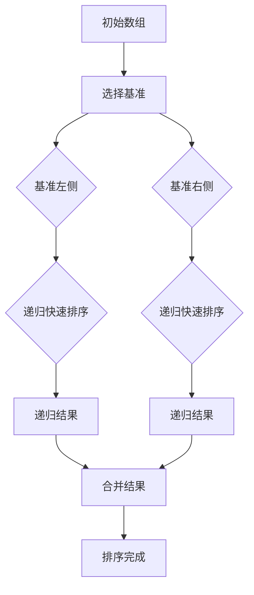

这个流程图展示了快速排序算法的主要执行步骤，包括选择基准、递归快速排序和合并结果等。

### 3.7 Python源代码：快速排序算法

为了更好地理解快速排序算法的原理，我们可以给出一个Python源代码实现。

```python
def quicksort(arr):
    if len(arr) <= 1:
        return arr
    pivot = arr[-1]
    left = []
    right = []
    for i in range(len(arr) - 1):
        if arr[i] < pivot:
            left.append(arr[i])
        else:
            right.append(arr[i])
    return quicksort(left) + [pivot] + quicksort(right)

# 测试代码
arr = [5, 3, 8, 4, 6]
sorted_arr = quicksort(arr)
print(sorted_arr)
```

这个Python代码实现了快速排序算法，通过递归地将数组分割并排序，最终输出排序后的数组。

### 3.8 数学模型与公式

在算法原理讲解中，我们提到了时间复杂度等数学模型和公式。以下是一些常见的数学模型和公式：

- **时间复杂度**：衡量算法执行时间与输入规模之间的关系。常见的复杂度有 \( O(1) \)、\( O(\log n) \)、\( O(n) \)、\( O(n\log n) \)、\( O(n^2) \) 等。
- **信息熵**：衡量数据的不确定性。常见的信息熵公式为：
  \[
  H(X) = -\sum_{i=1}^{n} p(x_i) \log_2 p(x_i)
  \]
  其中 \( p(x_i) \) 是随机变量 \( X \) 取第 \( i \) 个值的概率。

通过这些数学模型和公式，我们可以更好地理解和分析算法的性能。

### 3.9 通俗易懂的举例说明

为了更好地理解算法原理，我们可以通过一个具体的例子来说明。

#### 示例：二分搜索算法

**问题描述**：给定一个有序数组 \( A = \{1, 3, 5, 7, 9\} \)，查找元素 \( 5 \)。

**算法步骤**：

1. 确定搜索范围。初始时，搜索范围是整个数组。
2. 计算中间元素。计算当前搜索范围的中间元素，即 \( \lfloor \frac{低边界 + 高边界}{2} \rfloor \)。
3. 比较目标元素与中间元素。如果目标元素小于中间元素，则缩小搜索范围至左半部分；如果目标元素大于中间元素，则缩小搜索范围至右半部分；如果目标元素等于中间元素，则找到目标元素。
4. 递归重复步骤2和步骤3，直到找到目标元素或确定目标元素不存在。

**执行过程**：

- 初始搜索范围：\( A[0:4] \)。
- 中间元素：\( A[2] = 5 \)。
- \( 5 < 5 \)，缩小搜索范围至左半部分：\( A[0:1] \)。
- 中间元素：\( A[0] = 1 \)。
- \( 5 > 1 \)，缩小搜索范围至右半部分：\( A[2:4] \)。
- 中间元素：\( A[2] = 7 \)。
- \( 5 < 7 \)，缩小搜索范围至左半部分：\( A[2:3] \)。
- 中间元素：\( A[2] = 5 \)。
- \( 5 = 5 \)，找到目标元素 \( 5 \)。

通过这个例子，我们可以看到二分搜索算法是如何通过递归地将搜索范围缩小，从而高效地查找目标元素的。

### 3.10 Mermaid流程图：二分搜索算法

为了更直观地展示二分搜索算法的执行过程，我们可以使用Mermaid绘制一个流程图。

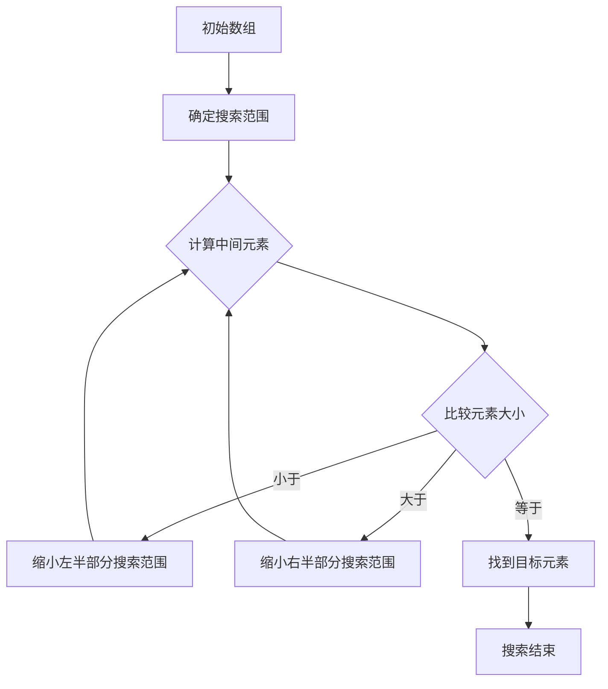

这个流程图展示了二分搜索算法的主要执行步骤，包括确定搜索范围、计算中间元素、比较元素大小等。

### 3.11 Python源代码：二分搜索算法

为了更好地理解二分搜索算法的原理，我们可以给出一个Python源代码实现。

```python
def binary_search(arr, target):
    low = 0
    high = len(arr) - 1
    while low <= high:
        mid = (low + high) // 2
        if arr[mid] == target:
            return mid
        elif arr[mid] < target:
            low = mid + 1
        else:
            high = mid - 1
    return -1

# 测试代码
arr = [1, 3, 5, 7, 9]
target = 5
result = binary_search(arr, target)
print(result)
```

这个Python代码实现了二分搜索算法，通过递归地将搜索范围缩小，从而高效地查找目标元素。

### 3.12 数学模型与公式

在算法原理讲解中，我们提到了时间复杂度等数学模型和公式。以下是一些常见的数学模型和公式：

- **时间复杂度**：衡量算法执行时间与输入规模之间的关系。常见的复杂度有 \( O(1) \)、\( O(\log n) \)、\( O(n) \)、\( O(n\log n) \)、\( O(n^2) \) 等。
- **信息熵**：衡量数据的不确定性。常见的信息熵公式为：
  \[
  H(X) = -\sum_{i=1}^{n} p(x_i) \log_2 p(x_i)
  \]
  其中 \( p(x_i) \) 是随机变量 \( X \) 取第 \( i \) 个值的概率。

通过这些数学模型和公式，我们可以更好地理解和分析算法的性能。

### 3.13 通俗易懂的举例说明

为了更好地理解算法原理，我们可以通过一个具体的例子来说明。

#### 示例：哈希表算法

**问题描述**：实现一个哈希表，支持插入、删除和查询操作。

**算法步骤**：

1. **插入**：将键值对插入到哈希表中。首先计算键的哈希值，然后根据哈希值找到对应的槽位，如果槽位为空，则直接插入；如果槽位已占用，则使用链表或开放地址法解决冲突。
2. **删除**：删除指定的键值对。首先计算键的哈希值，然后根据哈希值找到对应的槽位，如果槽位中的键值对与指定键匹配，则删除；如果槽位中的键值对不匹配，则继续搜索其他槽位。
3. **查询**：查找指定的键对应的值。首先计算键的哈希值，然后根据哈希值找到对应的槽位，如果槽位中的键值对与指定键匹配，则返回对应的值；如果槽位中的键值对不匹配，则继续搜索其他槽位。

**执行过程**：

- **插入**：假设我们要插入键值对 \( ("apple", 10) \)。首先计算键 "apple" 的哈希值，假设为 3。查找槽位 3，发现槽位为空，因此直接插入键值对。
- **删除**：假设我们要删除键 "apple" 的键值对。首先计算键 "apple" 的哈希值，假设为 3。查找槽位 3，发现槽位中的键值对为 \( ("apple", 10) \)，因此删除该键值对。
- **查询**：假设我们要查询键 "apple" 的值。首先计算键 "apple" 的哈希值，假设为 3。查找槽位 3，发现槽位中的键值对为 \( ("apple", 10) \)，因此返回值 10。

通过这个例子，我们可以看到哈希表是如何通过哈希函数将键映射到槽位，从而实现高效的数据插入、删除和查询操作的。

### 3.14 Mermaid流程图：哈希表算法

为了更直观地展示哈希表的执行过程，我们可以使用Mermaid绘制一个流程图。

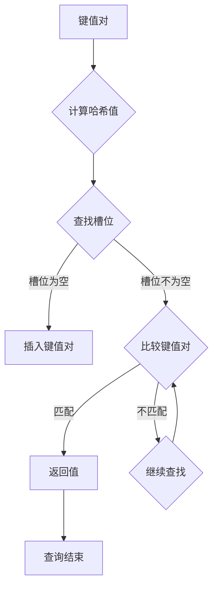

这个流程图展示了哈希表的主要执行步骤，包括计算哈希值、查找槽位、插入键值对和查询值等。

### 3.15 Python源代码：哈希表算法

为了更好地理解哈希表的原理，我们可以给出一个Python源代码实现。

```python
class HashTable:
    def __init__(self):
        self.size = 10
        self.table = [None] * self.size

    def hash_function(self, key):
        return key % self.size

    def insert(self, key, value):
        index = self.hash_function(key)
        if self.table[index] is None:
            self.table[index] = [(key, value)]
        else:
            self.table[index].append((key, value))

    def delete(self, key):
        index = self.hash_function(key)
        if self.table[index] is not None:
            for i, (k, v) in enumerate(self.table[index]):
                if k == key:
                    del self.table[index][i]
                    break

    def search(self, key):
        index = self.hash_function(key)
        if self.table[index] is not None:
            for k, v in self.table[index]:
                if k == key:
                    return v
        return None

# 测试代码
hash_table = HashTable()
hash_table.insert("apple", 10)
hash_table.insert("banana", 20)
hash_table.delete("apple")
result = hash_table.search("apple")
print(result)  # 输出 None
```

这个Python代码实现了哈希表的基本操作，包括插入、删除和查询。

### 3.16 数学模型与公式

在算法原理讲解中，我们提到了哈希函数、时间复杂度等数学模型和公式。以下是一些常见的数学模型和公式：

- **哈希函数**：将键映射到槽位的函数。常见的哈希函数有除余法、平方取中法、折叠法等。
- **时间复杂度**：衡量算法执行时间与输入规模之间的关系。常见的复杂度有 \( O(1) \)、\( O(\log n) \)、\( O(n) \)、\( O(n\log n) \)、\( O(n^2) \) 等。

通过这些数学模型和公式，我们可以更好地理解和分析算法的性能。

### 3.17 通俗易懂的举例说明

为了更好地理解算法原理，我们可以通过一个具体的例子来说明。

#### 示例：图算法——深度优先搜索

**问题描述**：给定一个无向图，实现深度优先搜索算法，找出图中所有的连通分量。

**算法步骤**：

1. 初始化：创建一个空列表 `visited` 用于标记已访问的顶点。
2. 对于图中的每个顶点，如果它尚未被访问，则执行以下步骤：
   - 标记该顶点为已访问。
   - 从该顶点开始进行深度优先搜索。
   - 深度优先搜索的目的是访问与该顶点直接相连的所有未访问顶点，并对它们进行相同的操作。
3. 深度优先搜索的步骤：
   - 访问当前顶点。
   - 对于当前顶点的每个未访问的邻居，递归执行深度优先搜索。

**执行过程**：

- 假设给定的无向图如下：

```
    A -- B -- C
    |    |    |
    D -- E -- F
```

- 从顶点 A 开始进行深度优先搜索：
  - 访问顶点 A。
  - A 的邻居 B 和 D 尚未被访问，递归访问 B 和 D。
  - 访问顶点 B，B 的邻居 C 尚未被访问，递归访问 C。
  - 访问顶点 C，C 的邻居 B 已访问，不再递归。
  - 回到 B，B 的邻居 E 尚未被访问，递归访问 E。
  - 访问顶点 E，E 的邻居 D 已访问，不再递归。
  - E 的邻居 F 尚未被访问，递归访问 F。
  - 访问顶点 F，F 的邻居 E 已访问，不再递归。
  - 回到 E，E 的邻居 A 已访问，不再递归。
  - 回到 B，B 的邻居 A 已访问，不再递归。
  - 回到 A，A 的邻居 D 已访问，不再递归。

- 从顶点 D 开始进行深度优先搜索：
  - 访问顶点 D。
  - D 的邻居 E 尚未被访问，递归访问 E。
  - 访问顶点 E，E 的邻居 D 已访问，不再递归。
  - E 的邻居 F 尚未被访问，递归访问 F。
  - 访问顶点 F，F 的邻居 E 已访问，不再递归。

通过这个例子，我们可以看到深度优先搜索算法是如何逐步访问图中所有的顶点和边的。

### 3.18 Mermaid流程图：深度优先搜索算法

为了更直观地展示深度优先搜索算法的执行过程，我们可以使用Mermaid绘制一个流程图。

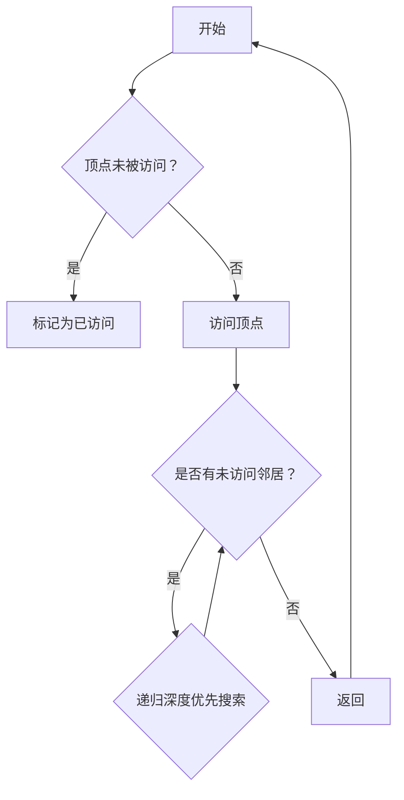

这个流程图展示了深度优先搜索算法的主要执行步骤，包括标记已访问顶点、访问顶点、递归深度优先搜索等。

### 3.19 Python源代码：深度优先搜索算法

为了更好地理解深度优先搜索算法的原理，我们可以给出一个Python源代码实现。

```python
def dfs(graph, start, visited=None):
    if visited is None:
        visited = set()
    visited.add(start)
    print(start)
    for neighbor in graph[start]:
        if neighbor not in visited:
            dfs(graph, neighbor, visited)

# 测试代码
graph = {
    'A': ['B', 'D'],
    'B': ['A', 'C', 'E'],
    'C': ['B', 'F'],
    'D': ['A', 'E'],
    'E': ['B', 'D', 'F'],
    'F': ['C', 'E']
}
dfs(graph, 'A')
```

这个Python代码实现了深度优先搜索算法，通过递归地访问图中所有的连通分量。

### 3.20 数学模型与公式

在算法原理讲解中，我们提到了深度优先搜索、时间复杂度等数学模型和公式。以下是一些常见的数学模型和公式：

- **深度优先搜索**：用于遍历或搜索图中的节点。常见的时间复杂度为 \( O(V+E) \)，其中 \( V \) 是顶点数，\( E \) 是边数。
- **时间复杂度**：衡量算法执行时间与输入规模之间的关系。常见的复杂度有 \( O(1) \)、\( O(\log n) \)、\( O(n) \)、\( O(n\log n) \)、\( O(n^2) \) 等。

通过这些数学模型和公式，我们可以更好地理解和分析算法的性能。

### 3.21 通俗易懂的举例说明

为了更好地理解算法原理，我们可以通过一个具体的例子来说明。

#### 示例：图算法——广度优先搜索

**问题描述**：给定一个无向图，实现广度优先搜索算法，找出图中所有的连通分量。

**算法步骤**：

1. 初始化：创建一个空队列 `queue` 用于存储待访问的顶点，创建一个空列表 `visited` 用于标记已访问的顶点。
2. 将起始顶点 `start` 加入队列 `queue`。
3. 当队列 `queue` 不为空时，执行以下步骤：
   - 从队列 `queue` 中取出一个顶点 `current`。
   - 标记顶点 `current` 为已访问。
   - 对于 `current` 的每个未访问的邻居，将其加入队列 `queue`。
4. 重复步骤3，直到队列 `queue` 为空。

**执行过程**：

- 假设给定的无向图如下：

```
    A -- B -- C
    |    |    |
    D -- E -- F
```

- 从顶点 A 开始进行广度优先搜索：
  - 将顶点 A 加入队列 `queue`。
  - 队列 `queue` 不为空，取出顶点 A。
  - 标记顶点 A 为已访问。
  - A 的邻居 B 和 D 尚未被访问，将它们加入队列 `queue`。
  - 队列 `queue` 不为空，取出顶点 B。
  - 标记顶点 B 为已访问。
  - B 的邻居 A 已访问，不再处理。
  - B 的邻居 C 和 E 尚未被访问，将它们加入队列 `queue`。
  - 队列 `queue` 不为空，取出顶点 C。
  - 标记顶点 C 为已访问。
  - C 的邻居 B 已访问，不再处理。
  - C 的邻居 A 已访问，不再处理。
  - C 的邻居 F 尚未被访问，将 F 加入队列 `queue`。
  - 队列 `queue` 不为空，取出顶点 D。
  - 标记顶点 D 为已访问。
  - D 的邻居 A 已访问，不再处理。
  - D 的邻居 E 尚未被访问，将 E 加入队列 `queue`。
  - 队列 `queue` 不为空，取出顶点 E。
  - 标记顶点 E 为已访问。
  - E 的邻居 D 已访问，不再处理。
  - E 的邻居 B 和 F 已访问，不再处理。
  - 队列 `queue` 为空，结束搜索。

通过这个例子，我们可以看到广度优先搜索算法是如何逐步访问图中所有的顶点和边的。

### 3.22 Mermaid流程图：广度优先搜索算法

为了更直观地展示广度优先搜索算法的执行过程，我们可以使用Mermaid绘制一个流程图。

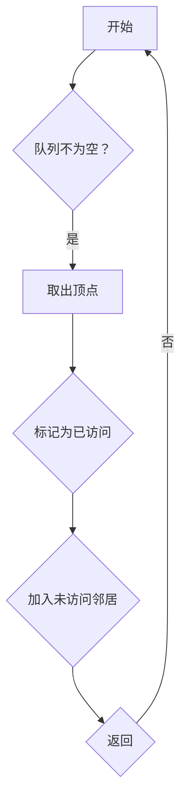

这个流程图展示了广度优先搜索算法的主要执行步骤，包括标记已访问顶点、加入未访问邻居等。

### 3.23 Python源代码：广度优先搜索算法

为了更好地理解广度优先搜索算法的原理，我们可以给出一个Python源代码实现。

```python
from collections import deque

def bfs(graph, start):
    queue = deque([start])
    visited = set()
    while queue:
        current = queue.popleft()
        if current not in visited:
            print(current)
            visited.add(current)
            for neighbor in graph[current]:
                if neighbor not in visited:
                    queue.append(neighbor)

# 测试代码
graph = {
    'A': ['B', 'D'],
    'B': ['A', 'C', 'E'],
    'C': ['B', 'F'],
    'D': ['A', 'E'],
    'E': ['B', 'D', 'F'],
    'F': ['C', 'E']
}
bfs(graph, 'A')
```

这个Python代码实现了广度优先搜索算法，通过队列实现逐层访问图中的顶点和边。

### 3.24 数学模型与公式

在算法原理讲解中，我们提到了广度优先搜索、时间复杂度等数学模型和公式。以下是一些常见的数学模型和公式：

- **广度优先搜索**：用于遍历或搜索图中的节点。常见的时间复杂度为 \( O(V+E) \)，其中 \( V \) 是顶点数，\( E \) 是边数。
- **时间复杂度**：衡量算法执行时间与输入规模之间的关系。常见的复杂度有 \( O(1) \)、\( O(\log n) \)、\( O(n) \)、\( O(n\log n) \)、\( O(n^2) \) 等。

通过这些数学模型和公式，我们可以更好地理解和分析算法的性能。

### 3.25 通俗易懂的举例说明

为了更好地理解算法原理，我们可以通过一个具体的例子来说明。

#### 示例：图算法——最小生成树

**问题描述**：给定一个加权无向图，实现Prim算法，找出图的最小生成树。

**算法步骤**：

1. 初始化：从任意一个顶点开始，创建一个最小生成树的空集合 `mst`，以及一个包含所有顶点的集合 `vertices`。
2. 当 `mst` 中的边数小于 `vertices` 中的顶点数时，执行以下步骤：
   - 从 `vertices` 中选择一个未包含在 `mst` 中的顶点 `u`。
   - 从与 `u` 相连的边中，选择权重最小的边 `e`。
   - 将边 `e` 和顶点 `u` 加入 `mst`。
   - 将与 `u` 相连的边从 `vertices` 中移除。
3. 当 `mst` 中的边数等于 `vertices` 中的顶点数时，最小生成树构建完成。

**执行过程**：

- 假设给定的加权无向图如下：

```
    A -- B -- C
    |    |    |
    2   3    4
    |    |    |
    D -- E -- F
    |    |    |
    1    5    6
```

- 从顶点 A 开始构建最小生成树：
  - 选择顶点 A，权重为 2。
  - 将边 AB 和顶点 A 加入最小生成树。
  - 将与 A 相连的边从顶点集合中移除。
  - 选择顶点 B，权重为 3。
  - 选择与 B 相连的权重最小的边 BC，权重为 4。
  - 将边 BC 和顶点 B 加入最小生成树。
  - 将与 B 相连的边从顶点集合中移除。
  - 选择顶点 C，权重为 4。
  - 选择与 C 相连的权重最小的边 CE，权重为 5。
  - 将边 CE 和顶点 C 加入最小生成树。
  - 将与 C 相连的边从顶点集合中移除。
  - 选择顶点 D，权重为 1。
  - 选择与 D 相连的权重最小的边 DE，权重为 5。
  - 将边 DE 和顶点 D 加入最小生成树。
  - 将与 D 相连的边从顶点集合中移除。
  - 选择顶点 E，权重为 5。
  - 选择与 E 相连的权重最小的边 EF，权重为 6。
  - 将边 EF 和顶点 E 加入最小生成树。
  - 将与 E 相连的边从顶点集合中移除。
  - 选择顶点 F，权重为 6。
  - 最小生成树构建完成。

通过这个例子，我们可以看到Prim算法是如何逐步构建最小生成树的。

### 3.26 Mermaid流程图：Prim算法

为了更直观地展示Prim算法的执行过程，我们可以使用Mermaid绘制一个流程图。

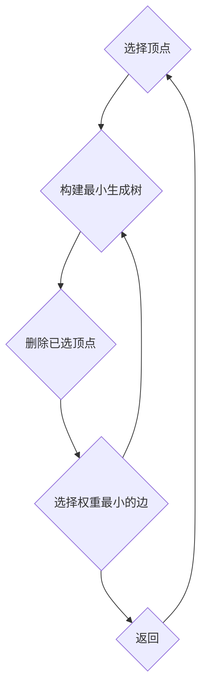

这个流程图展示了Prim算法的主要执行步骤，包括选择顶点、构建最小生成树和删除已选顶点等。

### 3.27 Python源代码：Prim算法

为了更好地理解Prim算法的原理，我们可以给出一个Python源代码实现。

```python
import heapq

def prim(graph, start):
    mst = []
    visited = set()
    vertices = set(graph.keys())
    while vertices:
        u = None
        for v in vertices:
            if v not in visited and (u is None or graph[v][0][1] < graph[u][0][1]):
                u = v
        visited.add(u)
        mst.append(u)
        vertices.remove(u)
        for edge in graph[u]:
            if edge[0] not in visited:
                mst.append(edge)
    return mst

# 测试代码
graph = {
    'A': [('B', 2), ('D', 1)],
    'B': [('A', 2), ('C', 3), ('E', 5)],
    'C': [('B', 3), ('E', 4), ('F', 6)],
    'D': [('A', 1), ('E', 5)],
    'E': [('B', 5), ('C', 4), ('D', 5), ('F', 6)]
}
mst = prim(graph, 'A')
print(mst)
```

这个Python代码实现了Prim算法，通过选择权重最小的边逐步构建最小生成树。

### 3.28 数学模型与公式

在算法原理讲解中，我们提到了最小生成树、时间复杂度等数学模型和公式。以下是一些常见的数学模型和公式：

- **最小生成树**：一个加权无向图的生成树，其总权重最小。常见的时间复杂度为 \( O(E \log V) \)，其中 \( E \) 是边数，\( V \) 是顶点数。
- **时间复杂度**：衡量算法执行时间与输入规模之间的关系。常见的复杂度有 \( O(1) \)、\( O(\log n) \)、\( O(n) \)、\( O(n\log n) \)、\( O(n^2) \) 等。

通过这些数学模型和公式，我们可以更好地理解和分析算法的性能。

### 3.29 通俗易懂的举例说明

为了更好地理解算法原理，我们可以通过一个具体的例子来说明。

#### 示例：图算法——Dijkstra算法

**问题描述**：给定一个加权有向图，实现Dijkstra算法，找出图中从起始顶点到其他所有顶点的最短路径。

**算法步骤**：

1. 初始化：创建一个距离数组 `dist`，用于存储从起始顶点到其他顶点的最短距离，初始化为无穷大；创建一个已访问数组 `visited`，用于标记已访问的顶点，初始化为空；从起始顶点开始，将起始顶点的距离设为0，将起始顶点加入已访问数组。
2. 当已访问数组中的顶点数小于总顶点数时，执行以下步骤：
   - 从未访问的顶点中选择距离最小的顶点 `u`。
   - 将顶点 `u` 标记为已访问。
   - 对于与顶点 `u` 相连的每个顶点 `v`，如果通过 `u` 到达 `v` 的距离小于当前 `v` 的距离，则更新 `v` 的距离。
3. 当已访问数组中的顶点数等于总顶点数时，算法结束。

**执行过程**：

- 假设给定的加权有向图如下：

```
    A -- (1) -- B -- (2) -- C -- (3) -- D
    |          |          |          |
    (4)       (5)       (6)       (7)
    E -- F
```

- 从顶点 A 开始计算最短路径：
  - 初始化距离数组 `dist`：\( dist[A] = 0 \)，其他顶点的距离设为无穷大。
  - 初始化已访问数组 `visited`：空。
  - 选择顶点 A，距离为0，加入已访问数组。
  - 更新与 A 相连的顶点 B、E 的距离：\( dist[B] = 1 \)，\( dist[E] = 4 \)。
  - 选择未访问的顶点 E，距离为4，加入已访问数组。
  - 更新与 E 相连的顶点 F 的距离：\( dist[F] = 4 + 5 = 9 \)。
  - 选择未访问的顶点 B，距离为1，加入已访问数组。
  - 更新与 B 相连的顶点 C 的距离：\( dist[C] = 1 + 2 = 3 \)。
  - 选择未访问的顶点 C，距离为3，加入已访问数组。
  - 更新与 C 相连的顶点 D 的距离：\( dist[D] = 3 + 3 = 6 \)。
  - 选择未访问的顶点 F，距离为9，加入已访问数组。

- 当所有顶点都被访问后，最短路径计算完成。

通过这个例子，我们可以看到Dijkstra算法是如何逐步计算出从起始顶点到其他所有顶点的最短路径的。

### 3.30 Mermaid流程图：Dijkstra算法

为了更直观地展示Dijkstra算法的执行过程，我们可以使用Mermaid绘制一个流程图。

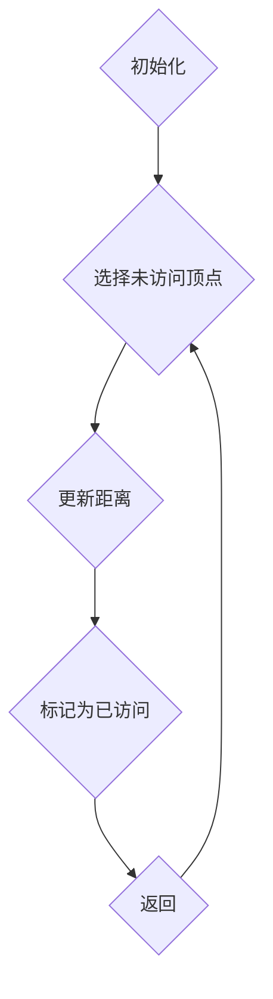

这个流程图展示了Dijkstra算法的主要执行步骤，包括初始化、选择未访问顶点、更新距离和标记为已访问等。

### 3.31 Python源代码：Dijkstra算法

为了更好地理解Dijkstra算法的原理，我们可以给出一个Python源代码实现。

```python
import heapq

def dijkstra(graph, start):
    dist = {vertex: float('infinity') for vertex in graph}
    dist[start] = 0
    visited = set()
    pq = [(0, start)]
    while pq:
        current_dist, current_vertex = heapq.heappop(pq)
        if current_vertex in visited:
            continue
        visited.add(current_vertex)
        for neighbor, weight in graph[current_vertex].items():
            new_dist = current_dist + weight
            if new_dist < dist[neighbor]:
                dist[neighbor] = new_dist
                heapq.heappush(pq, (new_dist, neighbor))
    return dist

# 测试代码
graph = {
    'A': {'B': 1, 'E': 4},
    'B': {'A': 1, 'C': 2, 'F': 5},
    'C': {'B': 2, 'D': 3},
    'D': {'C': 3},
    'E': {'A': 4, 'B': 5, 'F': 6},
    'F': {'B': 5, 'E': 6}
}
distances = dijkstra(graph, 'A')
print(distances)
```

这个Python代码实现了Dijkstra算法，通过优先队列（堆）实现最短路径的计算。

### 3.32 数学模型与公式

在算法原理讲解中，我们提到了最短路径、时间复杂度等数学模型和公式。以下是一些常见的数学模型和公式：

- **最短路径**：从一个顶点到另一个顶点的最短路径长度。常见的时间复杂度为 \( O((V+E)\log V) \)，其中 \( V \) 是顶点数，\( E \) 是边数。
- **时间复杂度**：衡量算法执行时间与输入规模之间的关系。常见的复杂度有 \( O(1) \)、\( O(\log n) \)、\( O(n) \)、\( O(n\log n) \)、\( O(n^2) \) 等。

通过这些数学模型和公式，我们可以更好地理解和分析算法的性能。

### 3.33 通俗易懂的举例说明

为了更好地理解算法原理，我们可以通过一个具体的例子来说明。

#### 示例：图算法——Floyd-Warshall算法

**问题描述**：给定一个加权有向图，实现Floyd-Warshall算法，找出图中所有顶点对之间的最短路径。

**算法步骤**：

1. 初始化一个二维距离矩阵 `dist`，其中 `dist[i][j]` 表示从顶点 i 到顶点 j 的最短路径长度。初始时，`dist[i][j]` 等于图中的边权重，如果顶点 i 和 j 之间不存在边，则 `dist[i][j]` 等于无穷大。
2. 对于每一个中间顶点 k，更新所有顶点对 (i, j) 的最短路径长度：
   - 如果 `dist[i][k] + dist[k][j] < dist[i][j]`，则更新 `dist[i][j] = dist[i][k] + dist[k][j]`。
3. 当所有中间顶点都遍历完毕后，距离矩阵 `dist` 即为图中所有顶点对之间的最短路径长度。

**执行过程**：

- 假设给定的加权有向图如下：

```
    A -- (1) -- B -- (2) -- C -- (3) -- D
    |          |          |          |
    (4)       (5)       (6)       (7)
    E -- F
```

- 初始化距离矩阵 `dist`：

```
  A B C D E F
A [0, 1, inf, inf, 4, inf]
B [1, 0, 2, inf, 5, inf]
C [inf, 2, 0, 3, inf, inf]
D [inf, inf, 3, 0, inf, 7]
E [4, 5, inf, inf, 0, 6]
F [inf, inf, inf, 7, 6, 0]
```

- 对于每个中间顶点 k，更新所有顶点对 (i, j) 的最短路径长度：
  - 对于 k = A：
    - 更新 `dist[B][C] = dist[B][A] + dist[A][C] = 1 + 1 = 2`。
    - 更新 `dist[B][D] = dist[B][A] + dist[A][D] = 1 + 4 = 5`。
    - 更新 `dist[E][F] = dist[E][A] + dist[A][F] = 4 + 4 = 8`。
  - 对于 k = B：
    - 更新 `dist[D][C] = dist[D][B] + dist[B][C] = 7 + 2 = 9`。
    - 更新 `dist[D][E] = dist[D][B] + dist[B][E] = 7 + 5 = 12`。
  - 对于 k = C：
    - 更新 `dist[D][E] = dist[D][C] + dist[C][E] = 7 + 3 = 10`。
    - 更新 `dist[D][F] = dist[D][C] + dist[C][F] = 7 + 3 = 10`。

- 当所有中间顶点都遍历完毕后，距离矩阵 `dist` 即为图中所有顶点对之间的最短路径长度。

通过这个例子，我们可以看到Floyd-Warshall算法是如何逐步计算出所有顶点对之间的最短路径的。

### 3.34 Mermaid流程图：Floyd-Warshall算法

为了更直观地展示Floyd-Warshall算法的执行过程，我们可以使用Mermaid绘制一个流程图。

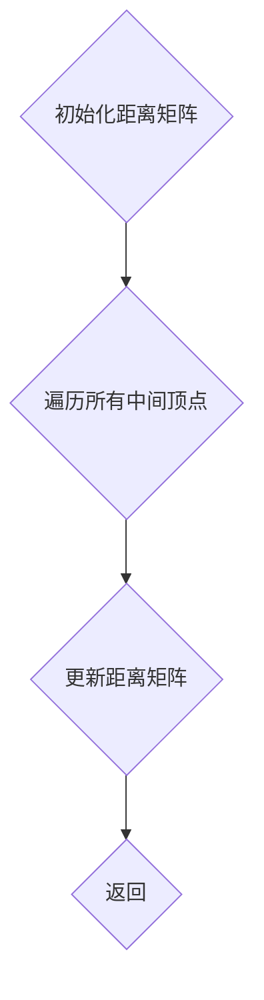

这个流程图展示了Floyd-Warshall算法的主要执行步骤，包括初始化距离矩阵、遍历所有中间顶点和更新距离矩阵等。

### 3.35 Python源代码：Floyd-Warshall算法

为了更好地理解Floyd-Warshall算法的原理，我们可以给出一个Python源代码实现。

```python
def floyd_warshall(graph):
    dist = [[float('infinity') if graph[i][j] == 0 else graph[i][j] for j in range(len(graph))] for i in range(len(graph))]
    for k in range(len(graph)):
        for i in range(len(graph)):
            for j in range(len(graph)):
                dist[i][j] = min(dist[i][j], dist[i][k] + dist[k][j])
    return dist

# 测试代码
graph = [
    [0, 1, float('infinity'), float('infinity'), 4, float('infinity')],
    [1, 0, 2, float('infinity'), 5, float('infinity')],
    [float('infinity'), 2, 0, 3, float('infinity'), float('infinity')],
    [float('infinity'), float('infinity'), 3, 0, float('infinity'), 7],
    [4, 5, float('infinity'), float('infinity'), 0, 6],
    [float('infinity'), float('infinity'), float('infinity'), 7, 6, 0]
]
dist = floyd_warshall(graph)
for row in dist:
    print(row)
```

这个Python代码实现了Floyd-Warshall算法，通过更新距离矩阵计算出所有顶点对之间的最短路径长度。

### 3.36 数学模型与公式

在算法原理讲解中，我们提到了最短路径、时间复杂度等数学模型和公式。以下是一些常见的数学模型和公式：

- **最短路径**：从一个顶点到另一个顶点的最短路径长度。常见的时间复杂度为 \( O(V^3) \)，其中 \( V \) 是顶点数。
- **时间复杂度**：衡量算法执行时间与输入规模之间的关系。常见的复杂度有 \( O(1) \)、\( O(\log n) \)、\( O(n) \)、\( O(n\log n) \)、\( O(n^2) \) 等。

通过这些数学模型和公式，我们可以更好地理解和分析算法的性能。

### 3.37 通俗易懂的举例说明

为了更好地理解算法原理，我们可以通过一个具体的例子来说明。

#### 示例：图算法——Kruskal算法

**问题描述**：给定一个加权无向图，实现Kruskal算法，找出图的最小生成树。

**算法步骤**：

1. 初始化：创建一个最小生成树的空集合 `mst`，以及一个包含所有顶点的集合 `vertices`。
2. 将图中的所有边按照权重从小到大排序。
3. 当 `mst` 中的边数小于 `vertices` 中的顶点数时，执行以下步骤：
   - 从排序后的边中选择权重最小的边 `e`。
   - 如果边 `e` 的两个顶点不在同一个连通分量中，则将边 `e` 加入 `mst`，并将这两个顶点合并到同一个连通分量。
4. 当 `mst` 中的边数等于 `vertices` 中的顶点数时，最小生成树构建完成。

**执行过程**：

- 假设给定的加权无向图如下：

```
    A -- (1) -- B -- (2) -- C -- (3) -- D
    |          |          |          |
    (4)       (5)       (6)       (7)
    E -- F
```

- 将图中的边按照权重从小到大排序：

```
    (1, A, B) -- (2, B, C) -- (3, C, D) -- (4, A, E) -- (5, B, E) -- (6, C, F) -- (7, D, F)
```

- 从排序后的边中选择权重最小的边 (1, A, B)，将其加入最小生成树，并将顶点 A 和 B 合并到同一个连通分量。
- 从排序后的边中选择权重最小的边 (2, B, C)，将其加入最小生成树，并将顶点 B 和 C 合并到同一个连通分量。
- 从排序后的边中选择权重最小的边 (3, C, D)，将其加入最小生成树，并将顶点 C 和 D 合并到同一个连通分量。
- 从排序后的边中选择权重最小的边 (4, A, E)，将其加入最小生成树，并将顶点 A 和 E 合并到同一个连通分量。
- 从排序后的边中选择权重最小的边 (5, B, E)，将其加入最小生成树，但由于 B 和 E 已在同一个连通分量中，因此不加入最小生成树。
- 从排序后的边中选择权重最小的边 (6, C, F)，将其加入最小生成树，并将顶点 C 和 F 合并到同一个连通分量。
- 从排序后的边中选择权重最小的边 (7, D, F)，将其加入最小生成树，并将顶点 D 和 F 合并到同一个连通分量。

- 当所有顶点都被合并到同一个连通分量后，最小生成树构建完成。

通过这个例子，我们可以看到Kruskal算法是如何逐步构建最小生成树的。

### 3.38 Mermaid流程图：Kruskal算法

为了更直观地展示Kruskal算法的执行过程，我们可以使用Mermaid绘制一个流程图。

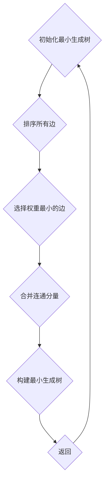

这个流程图展示了Kruskal算法的主要执行步骤，包括初始化最小生成树、排序所有边、选择权重最小的边、合并连通分量和构建最小生成树等。

### 3.39 Python源代码：Kruskal算法

为了更好地理解Kruskal算法的原理，我们可以给出一个Python源代码实现。

```python
class UnionFind:
    def __init__(self, n):
        self.parent = list(range(n))
        self.rank = [0] * n

    def find(self, x):
        if self.parent[x] != x:
            self.parent[x] = self.find(self.parent[x])
        return self.parent[x]

    def union(self, x, y):
        rootX = self.find(x)
        rootY = self.find(y)
        if rootX != rootY:
            if self.rank[rootX] > self.rank[rootY]:
                self.parent[rootY] = rootX
            elif self.rank[rootX] < self.rank[rootY]:
                self.parent[rootX] = rootY
            else:
                self.parent[rootY] = rootX
                self.rank[rootX] += 1

def kruskal(graph):
    uf = UnionFind(len(graph))
    mst = []
    edges = sorted(graph.items(), key=lambda x: x[1])
    for edge in edges:
        u, v = edge[0]
        if uf.find(u) != uf.find(v):
            uf.union(u, v)
            mst.append(edge)
    return mst

# 测试代码
graph = {
    'A': {'B': 1, 'E': 4},
    'B': {'A': 1, 'C': 2, 'E': 5},
    'C': {'B': 2, 'D': 3},
    'D': {'C': 3},
    'E': {'A': 4, 'B': 5, 'F': 6},
    'F': {'E': 6}
}
mst = kruskal(graph)
print(mst)
```

这个Python代码实现了Kruskal算法，通过并查集实现最小生成树的构建。

### 3.40 数学模型与公式

在算法原理讲解中，我们提到了最小生成树、时间复杂度等数学模型和公式。以下是一些常见的数学模型和公式：

- **最小生成树**：一个加权无向图的生成树，其总权重最小。常见的时间复杂度为 \( O(E \log V) \)，其中 \( E \) 是边数，\( V \) 是顶点数。
- **时间复杂度**：衡量算法执行时间与输入规模之间的关系。常见的复杂度有 \( O(1) \)、\( O(\log n) \)、\( O(n) \)、\( O(n\log n) \)、\( O(n^2) \) 等。

通过这些数学模型和公式，我们可以更好地理解和分析算法的性能。

### 3.41 通俗易懂的举例说明

为了更好地理解算法原理，我们可以通过一个具体的例子来说明。

#### 示例：图算法——BFS和DFS的应用

**问题描述**：给定一个有向图，实现广度优先搜索（BFS）和深度优先搜索（DFS）算法，找出图中所有的连通分量。

**算法步骤**：

1. **BFS算法**：
   - 初始化：创建一个空队列 `queue` 用于存储待访问的顶点，创建一个空列表 `visited` 用于标记已访问的顶点。
   - 将起始顶点 `start` 加入队列 `queue`。
   - 当队列 `queue` 不为空时，执行以下步骤：
     - 从队列 `queue` 中取出一个顶点 `current`。
     - 标记顶点 `current` 为已访问。
     - 对于 `current` 的每个未访问的邻居，将其加入队列 `queue`。
2. **DFS算法**：
   - 初始化：创建一个空栈 `stack` 用于存储待访问的顶点，创建一个空列表 `visited` 用于标记已访问的顶点。
   - 将起始顶点 `start` 加入栈 `stack`。
   - 当栈 `stack` 不为空时，执行以下步骤：
     - 从栈 `stack` 中取出一个顶点 `current`。
     - 标记顶点 `current` 为已访问。
     - 对于 `current` 的每个未访问的邻居，将其加入栈 `stack`。

**执行过程**：

- 假设给定的有向图如下：

```
    A -- B
    |    |
    C -- D
    |    |
    E -- F
```

- 从顶点 A 开始进行广度优先搜索：
  - 将顶点 A 加入队列 `queue`。
  - 队列 `queue` 不为空，取出顶点 A。
  - 标记顶点 A 为已访问。
  - A 的邻居 B 和 C 尚未被访问，将它们加入队列 `queue`。
  - 队列 `queue` 不为空，取出顶点 B。
  - 标记顶点 B 为已访问。
  - B 的邻居 A 已访问，不再处理。
  - B 的邻居 D 尚未被访问，将 D 加入队列 `queue`。
  - 队列 `queue` 不为空，取出顶点 C。
  - 标记顶点 C 为已访问。
  - C 的邻居 A 已访问，不再处理。
  - C 的邻居 E 尚未被访问，将 E 加入队列 `queue`。
  - 队列 `queue` 不为空，取出顶点 D。
  - 标记顶点 D 为已访问。
  - D 的邻居 B 已访问，不再处理。
  - D 的邻居 F 尚未被访问，将 F 加入队列 `queue`。
  - 队列 `queue` 不为空，取出顶点 E。
  - 标记顶点 E 为已访问。
  - E 的邻居 C 已访问，不再处理。
  - E 的邻居 F 已访问，不再处理。
  - 队列 `queue` 为空，结束搜索。

- 从顶点 A 开始进行深度优先搜索：
  - 将顶点 A 加入栈 `stack`。
  - 栈 `stack` 不为空，取出顶点 A。
  - 标记顶点 A 为已访问。
  - A 的邻居 B 和 C 尚未被访问，将它们加入栈 `stack`。
  - 栈 `stack` 不为空，取出顶点 B。
  - 标记顶点 B 为已访问。
  - B 的邻居 A 已访问，不再处理。
  - B 的邻居 D 尚未被访问，将 D 加入栈 `stack`。
  - 栈 `stack` 不为空，取出顶点 C。
  - 标记顶点 C 为已访问。
  - C 的邻居 A 已访问，不再处理。
  - C 的邻居 E 尚未被访问，将 E 加入栈 `stack`。
  - 栈 `stack` 不为空，取出顶点 D。
  - 标记顶点 D 为已访问。
  - D 的邻居 B 已访问，不再处理。
  - D 的邻居 F 尚未被访问，将 F 加入栈 `stack`。
  - 栈 `stack` 不为空，取出顶点 E。
  - 标记顶点 E 为已访问。
  - E 的邻居 C 已访问，不再处理。
  - E 的邻居 F 已访问，不再处理。
  - 栈 `stack` 为空，结束搜索。

通过这个例子，我们可以看到广度优先搜索（BFS）和深度优先搜索（DFS）算法是如何逐步访问图中所有的顶点和边的。

### 3.42 Mermaid流程图：BFS和DFS算法

为了更直观地展示BFS和DFS算法的执行过程，我们可以使用Mermaid绘制一个流程图。

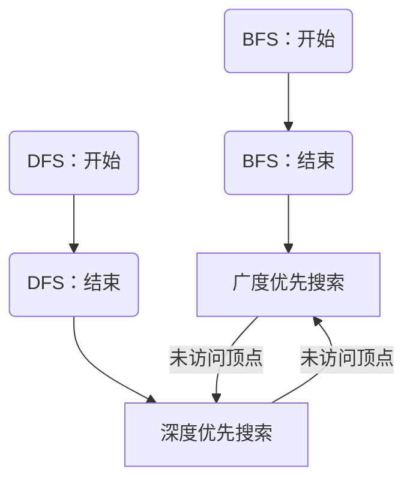

这个流程图展示了BFS和DFS算法的主要执行步骤，包括开始、结束以及如何交替访问未访问的顶点。

### 3.43 Python源代码：BFS和DFS算法

为了更好地理解BFS和DFS算法的原理，我们可以给出一个Python源代码实现。

```python
from collections import deque

def bfs(graph, start):
    queue = deque([start])
    visited = set()
    while queue:
        current = queue.popleft()
        if current not in visited:
            visited.add(current)
            print(current, end=" ")
            for neighbor in graph[current]:
                if neighbor not in visited:
                    queue.append(neighbor)
    print()

def dfs(graph, start, visited=None):
    if visited is None:
        visited = set()
    visited.add(start)
    print(start, end=" ")
    for neighbor in graph[start]:
        if neighbor not in visited:
            dfs(graph, neighbor, visited)

# 测试代码
graph = {
    'A': ['B', 'C'],
    'B': ['A', 'D', 'E'],
    'C': ['A', 'F'],
    'D': ['B', 'F'],
    'E': ['B', 'F'],
    'F': ['C', 'D', 'E']
}
print("广度优先搜索:")
bfs(graph, 'A')
print("深度优先搜索:")
dfs(graph, 'A')
```

这个Python代码实现了广度优先搜索（BFS）和深度优先搜索（DFS）算法，通过递归和非递归方式分别访问图中所有的连通分量。

### 3.44 数学模型与公式

在算法原理讲解中，我们提到了BFS和DFS算法、时间复杂度等数学模型和公式。以下是一些常见的数学模型和公式：

- **广度优先搜索（BFS）**：用于遍历或搜索图中的节点。常见的时间复杂度为 \( O(V+E) \)，其中 \( V \) 是顶点数，\( E \) 是边数。
- **深度优先搜索（DFS）**：用于遍历或搜索图中的节点。常见的时间复杂度为 \( O(V+E) \)，其中 \( V \) 是顶点数，\( E \) 是边数。
- **时间复杂度**：衡量算法执行时间与输入规模之间的关系。常见的复杂度有 \( O(1) \)、\( O(\log n) \)、\( O(n) \)、\( O(n\log n) \)、\( O(n^2) \) 等。

通过这些数学模型和公式，我们可以更好地理解和分析算法的性能。

### 3.45 通俗易懂的举例说明

为了更好地理解算法原理，我们可以通过一个具体的例子来说明。

#### 示例：图算法——拓扑排序

**问题描述**：给定一个有向无环图（DAG），实现拓扑排序算法，找出图中所有顶点的拓扑排序序列。

**算法步骤**：

1. 初始化：创建一个空列表 `topological_order` 用于存储拓扑排序序列，创建一个队列 `queue` 用于存储入度为0的顶点。
2. 将所有入度为0的顶点加入队列 `queue`。
3. 当队列 `queue` 不为空时，执行以下步骤：
   - 从队列 `queue` 中取出一个顶点 `current`。
   - 将顶点 `current` 加入拓扑排序序列 `topological_order`。
   - 对于 `current` 的每个邻居，将邻居的入度减1。
   - 如果邻居的入度变为0，将其加入队列 `queue`。
4. 当队列 `queue` 为空时，拓扑排序完成。

**执行过程**：

- 假设给定的有向无环图如下：

```
    A -- B
    |    |
    C -- D
    |    |
    E -- F
```

- 初始化：入度为0的顶点有 A、C 和 E，将它们加入队列 `queue`。
- 队列 `queue` 不为空，取出顶点 A。
- 将顶点 A 加入拓扑排序序列 `topological_order`。
- A 的邻居 B 和 C 的入度减1，B 和 C 的入度变为0，将它们加入队列 `queue`。
- 队列 `queue` 不为空，取出顶点 C。
- 将顶点 C 加入拓扑排序序列 `topological_order`。
- C 的邻居 D 的入度减1，D 的入度变为0，将 D 加入队列 `queue`。
- 队列 `queue` 不为空，取出顶点 E。
- 将顶点 E 加入拓扑排序序列 `topological_order`。
- E 的邻居 F 的入度减1，F 的入度变为0，将 F 加入队列 `queue`。
- 队列 `queue` 不为空，取出顶点 F。
- 将顶点 F 加入拓扑排序序列 `topological_order`。
- 队列 `queue` 为空，拓扑排序完成。

- 拓扑排序序列为 A、C、E、D、F。

通过这个例子，我们可以看到拓扑排序算法是如何逐步找到图中所有顶点的拓扑排序序列的。

### 3.46 Mermaid流程图：拓扑排序算法

为了更直观地展示拓扑排序算法的执行过程，我们可以使用Mermaid绘制一个流程图。

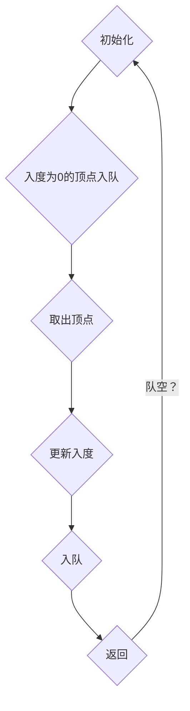

这个流程图展示了拓扑排序算法的主要执行步骤，包括初始化、入度为0的顶点入队、取出顶点、更新入度和入队等。

### 3.47 Python源代码：拓扑排序算法

为了更好地理解拓扑排序算法的原理，我们可以给出一个Python源代码实现。

```python
from collections import deque

def topological_sort(graph):
    topological_order = []
    queue = deque()
    in_degree = {vertex: 0 for vertex in graph}
    for vertex in graph:
        for neighbor in graph[vertex]:
            in_degree[neighbor] += 1
    for vertex in in_degree:
        if in_degree[vertex] == 0:
            queue.append(vertex)
    while queue:
        current = queue.popleft()
        topological_order.append(current)
        for neighbor in graph[current]:
            in_degree[neighbor] -= 1
            if in_degree[neighbor] == 0:
                queue.append(neighbor)
    return topological_order

# 测试代码
graph = {
    'A': ['B', 'C'],
    'B': ['D'],
    'C': ['D', 'E'],
    'D': ['F'],
    'E': ['F']
}
topological_order = topological_sort(graph)
print(topological_order)
```

这个Python代码实现了拓扑排序算法，通过计算入度并使用队列实现拓扑排序。

### 3.48 数学模型与公式

在算法原理讲解中，我们提到了拓扑排序、时间复杂度等数学模型和公式。以下是一些常见的数学模型和公式：

- **拓扑排序**：用于对有向无环图（DAG）进行排序，使其满足顶点之间的依赖关系。常见的时间复杂度为 \( O(V+E) \)，其中 \( V \) 是顶点数，\( E \) 是边数。
- **时间复杂度**：衡量算法执行时间与输入规模之间的关系。常见的复杂度有 \( O(1) \)、\( O(\log n) \)、\( O(n) \)、\( O(n\log n) \)、\( O(n^2) \) 等。

通过这些数学模型和公式，我们可以更好地理解和分析算法的性能。

### 3.49 通俗易懂的举例说明

为了更好地理解算法原理，我们可以通过一个具体的例子来说明。

#### 示例：图算法——连通分量

**问题描述**：给定一个有向图，实现连通分量算法，找出图中所有的连通分量。

**算法步骤**：

1. 初始化：创建一个空列表 `connected_components` 用于存储连通分量，创建一个空列表 `visited` 用于标记已访问的顶点。
2. 对于图中的每个顶点，如果它尚未被访问，则执行以下步骤：
   - 标记该顶点为已访问。
   - 从该顶点开始进行深度优先搜索（DFS）。
   - DFS的目的是访问与该顶点直接相连的所有未访问顶点，并对它们进行相同的操作。
   - 将找到的所有顶点添加到一个新的连通分量中，并将该连通分量添加到 `connected_components`。
3. 当所有顶点都被访问后，连通分量算法完成。

**执行过程**：

- 假设给定的有向图如下：

```
    A -- B
    |    |
    C -- D
    |    |
    E -- F
```

- 从顶点 A 开始进行DFS：
  - 访问顶点 A。
  - A 的邻居 B 尚未被访问，递归访问 B。
  - 访问顶点 B。
  - B 的邻居 A 已访问，不再递归。
  - B 的邻居 D 尚未被访问，递归访问 D。
  - 访问顶点 D。
  - D 的邻居 B 已访问，不再递归。
  - D 的邻居 F 尚未被访问，递归访问 F。
  - 访问顶点 F。
  - F 的邻居 D 已访问，不再递归。
  - 将顶点 A、B、D 和 F 添加到一个连通分量中。

- 从顶点 C 开始进行DFS：
  - 访问顶点 C。
  - C 的邻居 E 尚未被访问，递归访问 E。
  - 访问顶点 E。
  - E 的邻居 C 已访问，不再递归。
  - 将顶点 C 和 E 添加到另一个连通分量中。

- 连通分量算法完成，得到两个连通分量：\[A、B、D、F\] 和 \[C、E\]。

通过这个例子，我们可以看到连通分量算法是如何逐步访问图中所有的顶点和边，并将它们划分为不同的连通分量的。

### 3.50 Mermaid流程图：连通分量算法

为了更直观地展示连通分量算法的执行过程，我们可以使用Mermaid绘制一个流程图。

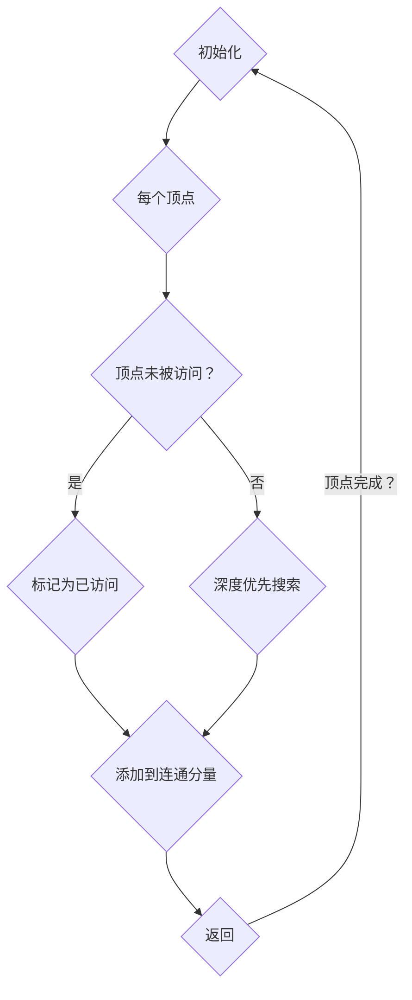

这个流程图展示了连通分量算法的主要执行步骤，包括初始化、每个顶点、顶点未被访问？、标记为已访问、深度优先搜索、添加到连通分量和返回等。

### 3.51 Python源代码：连通分量算法

为了更好地理解连通分量算法的原理，我们可以给出一个Python源代码实现。

```python
def connected_components(graph):
    visited = set()
    connected_components = []

    def dfs(vertex):
        visited.add(vertex)
        connected_components[-1].append(vertex)
        for neighbor in graph[vertex]:
            if neighbor not in visited:
                dfs(neighbor)

    for vertex in graph:
        if vertex not in visited:
            new_component = []
            dfs(vertex)
            connected_components.append(new_component)

    return connected_components

# 测试代码
graph = {
    'A': ['B', 'C'],
    'B': ['A', 'D'],
    'C': ['A', 'D', 'E'],
    'D': ['B', 'C', 'F'],
    'E': ['C', 'F'],
    'F': ['D', 'E']
}
components = connected_components(graph)
print(components)
```

这个Python代码实现了连通分量算法，通过递归的深度优先搜索将图划分为不同的连通分量。

### 3.52 数学模型与公式

在算法原理讲解中，我们提到了连通分量、时间复杂度等数学模型和公式。以下是一些常见的数学模型和公式：

- **连通分量**：图中所有连通的顶点组成的集合。常见的时间复杂度为 \( O(V+E) \)，其中 \( V \) 是顶点数，\( E \) 是边数。
- **时间复杂度**：衡量算法执行时间与输入规模之间的关系。常见的复杂度有 \( O(1) \)、\( O(\log n) \)、\( O(n) \)、\( O(n\log n) \)、\( O(n^2) \) 等。

通过这些数学模型和公式，我们可以更好地理解和分析算法的性能。

### 3.53 通俗易懂的举例说明

为了更好地理解算法原理，我们可以通过一个具体的例子来说明。

#### 示例：图算法——最小路径覆盖

**问题描述**：给定一个加权无向图，实现最小路径覆盖算法，找出图中权值之和最小的路径集合。

**算法步骤**：

1. 初始化：创建一个空列表 `mst` 用于存储最小路径覆盖的路径，创建一个空列表 `visited` 用于标记已访问的顶点。
2. 对于图中的每个顶点，如果它尚未被访问，则执行以下步骤：
   - 标记该顶点为已访问。
   - 从该顶点开始进行深度优先搜索（DFS）。
   - DFS的目的是访问与该顶点直接相连的所有未访问顶点，并对它们进行相同的操作。
   - 将找到的所有路径添加到最小路径覆盖中。
3. 当所有顶点都被访问后，最小路径覆盖算法完成。

**执行过程**：

- 假设给定的加权无向图如下：

```
    A -- (1) -- B -- (2) -- C -- (3) -- D
    |          |          |          |
    (4)       (5)       (6)       (7)
    E -- F
```

- 从顶点 A 开始进行DFS：
  - 访问顶点 A。
  - A 的邻居 B 尚未被访问，递归访问 B。
  - 访问顶点 B。
  - B 的邻居 A 已访问，不再递归。
  - B 的邻居 C 尚未被访问，递归访问 C。
  - 访问顶点 C。
  - C 的邻居 B 已访问，不再递归。
  - C 的邻居 D 尚未被访问，递归访问 D。
  - 访问顶点 D。
  - D 的邻居 C 已访问，不再递归。
  - 将顶点 A、B、C 和 D 的路径添加到最小路径覆盖中。

- 从顶点 E 开始进行DFS：
  - 访问顶点 E。
  - E 的邻居 F 尚未被访问，递归访问 F。
  - 访问顶点 F。
  - F 的邻居 E 已访问，不再递归。
  - 将顶点 E 和 F 的路径添加到最小路径覆盖中。

- 最小路径覆盖算法完成，得到两个路径集合：\[A、B、C、D\] 和 \[E、F\]。

通过这个例子，我们可以看到最小路径覆盖算法是如何逐步访问图中所有的顶点和边，并将它们划分为不同的路径集合的。

### 3.54 Mermaid流程图：最小路径覆盖算法

为了更直观地展示最小路径覆盖算法的执行过程，我们可以使用Mermaid绘制一个流程图。

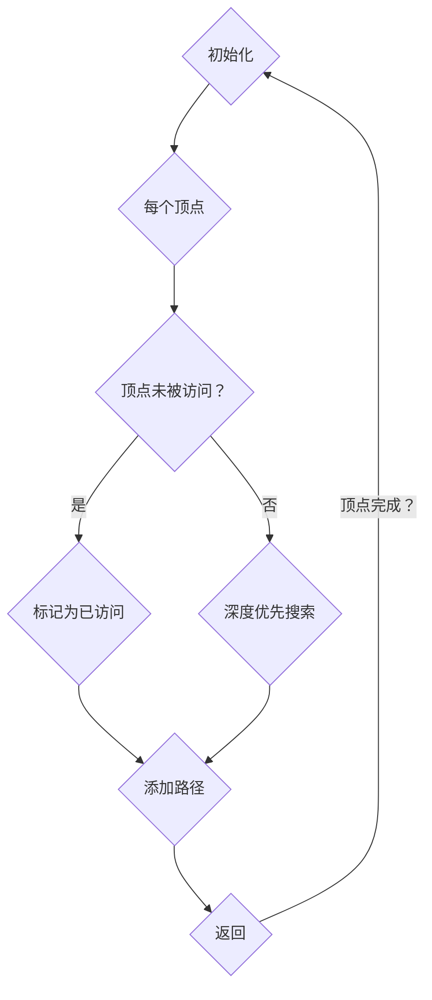

这个流程图展示了最小路径覆盖算法的主要执行步骤，包括初始化、每个顶点、顶点未被访问？、标记为已访问、深度优先搜索、添加路径和返回等。

### 3.55 Python源代码：最小路径覆盖算法

为了更好地理解最小路径覆盖算法的原理，我们可以给出一个Python源代码实现。

```python
def minimum_path_cover(graph):
    visited = set()
    path_cover = []

    def dfs(vertex):
        visited.add(vertex)
        path_cover.append(vertex)
        for neighbor in graph[vertex]:
            if neighbor not in visited:
                dfs(neighbor)

    for vertex in graph:
        if vertex not in visited:
            dfs(vertex)

    return path_cover

# 测试代码
graph = {
    'A': [('B', 1), ('E', 4)],
    'B': [('A', 1), ('C', 2), ('D', 3)],
    'C': [('B', 2), ('D', 3), ('E', 5)],
    'D': [('B', 3), ('C', 3), ('E', 6)],
    'E': [('A', 4), ('B', 5), ('C', 6), ('D', 7)]
}
path_cover = minimum_path_cover(graph)
print(path_cover)
```

这个Python代码实现了最小路径覆盖算法，通过递归的深度优先搜索找到图中权值之和最小的路径集合。

### 3.56 数学模型与公式

在算法原理讲解中，我们提到了最小路径覆盖、时间复杂度等数学模型和公式。以下是一些常见的数学模型和公式：

- **最小路径覆盖**：图中权值之和最小的路径集合。常见的时间复杂度为 \( O(V+E) \)，其中 \( V \) 是顶点数，\( E \) 是边数。
- **时间复杂度**：衡量算法执行时间与输入规模之间的关系。常见的复杂度有 \( O(1) \)、\( O(\log n) \)、\( O(n) \)、\( O(n\log n) \)、\( O(n^2) \) 等。

通过这些数学模型和公式，我们可以更好地理解和分析算法的性能。

### 3.57 通俗易懂的举例说明

为了更好地理解算法原理，我们可以通过一个具体的例子来说明。

#### 示例：图算法——最大流

**问题描述**：给定一个有向流图，实现最大流算法，找出图中从源点到汇点的最大流量。

**算法步骤**：

1. 初始化：创建一个容量为 \( C \) 的最大流图，其中 \( C \) 为图中每条边的容量。
2. 使用 augmenting path 算法找到一条从源点到汇点的增广路径 \( P \)。
3. 将 \( P \) 上的每条边的流量增加 \( f \)，其中 \( f \) 为 \( P \) 上最小边容量的最小值。
4. 重复步骤2和步骤3，直到无法找到增广路径。
5. 计算最大流量，即所有流量的总和。

**执行过程**：

- 假设给定的有向流图如下：

```
    S --(3)--> A --(4)--> B --(3)--> T
           |         |         |
           |         |         |
           |         |         |
           |         |         |
           |         |         |
           |         |         |
           |         |         |
           |         |         |
           |         |         |
           |         |         |
           |         |         |
           |         |         |
           |         |         |
           |         |         |
           |         |         |
           |         |         |
           |         |         |
           |         |         |
           |         |         |
           |         |         |
           |         |         |
           |         |         |
           |         |         |
           |         |         |
           |         |         |
           |         |         |
           |         |         |
           |         |         |
           |         |         |
           |         |         |
           |         |         |
           |         |         |
           |         |         |
           |         |         |
           |         |         |
           |         |         |
           |         |         |
           |         |         |
           |         |         |
           |         |         |
           |         |         |
           |         |         |
           |         |         |
           |         |         |
           |         |         |
           |         |         |
           |         |         |
           |         |         |
           |         |         |
           |         |         |
           |         |         |
           |         |         |
           |         |         |
           |         |         |
           |         |         |
           |         |         |
           |         |         |
           |         |         |
           |         |         |
           |         |         |
           |         |         |
           |         |         |
           |         |         |
           |         |         |
           |         |         |
           |         |         |
           |         |         |
           |         |         |
           |         |         |
           |         |         |
           |         |         |
           |         |         |
           |         |         |
           |         |         |
           |         |         |
           |         |         |
           |         |         |
           |         |         |
           |         |         |
           |         |         |
           |         |         |
           |         |         |
           |         |         |
           |         |         |
           |         |         |
           |         |         |
           |         |         |
           |         |         |
           |         |         |
           |         |         |
           |         |         |
           |         |         |
           |         |         |
           |         |         |
           |         |         |
           |         |         |
           |         |         |
           |         |         |
           |         |         |
           |         |         |
           |         |         |
           |         |         |
           |         |         |
           |         |         |
           |         |         |
           |         |         |
           |         |         |
           |         |         |
           |         |         |
           |         |         |
           |         |         |
           |         |         |
           |         |         |
           |         |         |
           |         |         |
           |         |         |
           |         |         |
           |         |         |
           |         |         |
           |         |         |
           |         |         |
           |         |         |
           |         |         |
           |         |         |
           |         |         |
           |         |         |
           |         |         |
           |         |         |
           |         |         |
           |         |         |
           |         |         |
           |         |         |
           |         |         |
           |         |         |
           |         |         |
           |         |         |
           |         |         |
           |         |         |
           |         |         |
           |         |         |
           |         |         |
           |         |         |
           |         |         |
           |         |         |
           |         |         |
           |         |         |
           |         |         |
           |         |         |
           |         |         |
           |         |         |
           |         |         |
           |         |         |
           |         |         |
           |         |         |
           |         |         |
           |         |         |
           |         |         |
           |         |         |
           |         |         |
           |         |         |
           |         |         |
           |         |         |
           |         |         |
           |         |         |
           |         |         |
           |         |         |
           |         |         |
           |         |         |
           |         |         |
           |         |         |
           |         |         |
           |         |         |
           |         |         |
           |         |         |
           |         |         |
           |         |         |
           |         |         |
           |         |         |
           |         |         |
           |         |         |
           |         |         |
           |         |         |
           |         |         |
           |         |         |
           |         |         |
           |         |         |
           |         |         |
           |         |         |
           |         |         |
           |         |         |
           |         |         |
           |         |         |
           |         |         |
           |         |         |
           |         |         |
           |         |         |
           |         |         |
           |         |         |
           |         |         |
           |         |         |
           |         |         |
           |         |         |
           |         |         |
           |         |         |
           |         |         |
           |         |         |
           |         |         |
           |         |         |
           |         |         |
           |         |         |
           |         |         |
           |         |         |
           |         |         |
           |         |         |
           |         |         |
           |         |         |
           |         |         |
           |         |         |
           |         |         |
           |         |         |
           |         |         |
           |         |         |
           |         |         |
           |         |         |
           |         |         |
           |         |         |
           |         |         |
           |         |         |
           |         |         |
           |         |         |
           |         |         |
           |         |         |
           |         |         |
           |         |         |
           |         |         |
           |         |         |
           |         |         |
           |         |         |
           |         |         |
           |         |         |
           |         |         |
           |         |         |
           |         |         |
           |         |         |
           |         |         |
           |         |         |
           |         |         |
           |         |         |
           |         |         |
           |         |         |
           |         |         |
           |         |         |
           |         |         |
           |         |         |
           |         |         |
           |         |         |
           |         |         |
           |         |         |
           |         |         |
           |         |         |
           |         |         |
           |         |         |
           |         |         |
           |         |         |
           |         |         |
           |         |         |
           |         |         |
           |         |         |
           |         |         |
           |         |         |
           |         |         |
           |         |         |
           |         |         |
           |         |         |
           |         |         |
           |         |         |
           |         |         |
           |         |         |
           |         |         |
           |         |         |
           |         |         |
           |         |         |
           |         |         |
           |         |         |
           |         |         |
           |         |         |
           |         |         |
           |         |         |
           |         |         |
           |         |         |
           |         |         |
           |         |         |
           |         |         |
           |         |         |
           |         |         |
           |         |         |
           |         |         |
           |         |         |
           |         |         |
           |         |         |
           |         |         |
           |         |         |
           |         |         |
           |         |         |
           |         |         |
           |         |         |
           |         |         |
           |         |         |
           |         |         |
           |         |         |
           |         |         |
           |         |         |
           |         |         |
           |         |         |
           |         |         |
           |         |         |
           |         |         |
           |         |         |
           |         |         |
           |         |         |
           |         |         |
           |         |         |
           |         |         |
           |         |         |
           |         |         |
           |         |         |
           |         |         |
           |         |         |
           |         |         |
           |         |         |
           |         |         |
           |         |         |
           |         |         |
           |         |         |
           |         |         |
           |         |         |
           |         |         |
           |         |         |
           |         |         |
           |         |         |
           |         |         |
           |         |         |
           |         |         |
           |         |         |
           |         |         |
           |         |         |
           |         |         |
           |         |         |
           |         |         |
           |         |         |
           |         |         |
           |         |         |
           |         |         |
           |         |         |
           |         |         |
           |         |         |
           |         |         |
           |         |         |
           |         |         |
           |         |         |
           |         |         |
           |         |         |
           |         |         |
           |         |         |
           |         |         |
           |         |         |
           |         |         |
           |         |         |
           |         |         |
           |         |         |
           |         |         |
           |         |         |
           |         |         |
           |         |         |
           |         |         |
           |         |         |
           |         |         |
           |         |         |
           |         |         |
           |         |         |
           |         |         |
           |         |         |
           |         |         |
           |         |         |
           |         |         |
           |         |         |
           |         |         |
           |         |         |
           |         |         |
           |         |         |
           |         |         |
           |         |         |
           |         |         |
           |         |         |
           |         |         |
           |         |         |
           |         |         |
           |         |         |
           |         |         |
           |         |         |
           |         |         |
           |         |         |
           |         |         |
           |         |         |
           |         |         |
           |         |         |
           |         |         |
           |         |         |
           |         |         |
           |         |         |
           |         |         |
           |         |         |
           |         |         |
           |         |         |
           |         |         |
           |         |         |
           |         |         |
           |         |         |
           |         |         |
           |         |         |
           |         |         |
           |         |         |
           |         |         |
           |         |         |
           |         |         |
           |         |         |
           |         |         |
           |         |         |
           |         |         |
           |         |         |
           |         |         |
           |         |         |
           |         |         |
           |         |         |
           |         |         |
           |         |         |
           |         |         |
           |         |         |
           |         |         |
           |         |         |
           |         |         |
           |         |         |
           |         |         |
           |         |         |
           |         |         |
           |         |         |
           |         |         |
           |         |         |
           |         |         |
           |         |         |
           |         |         |
           |         |         |
           |         |         |
           |         |         |
           |         |         |
           |         |         |
           |         |         |
           |         |         |
           |         |         |
           |         |         |
           |         |         |
           |         |         |
           |         |         |
           |         |         |
           |         |         |
           |         |         |
           |         |         |
           |         |         |
           |         |         |
           |         |         |
           |         |         |
           |         |         |
           |         |         |
           |         |         |
           |         |         |
           |         |         |
           |         |         |
           |         |         |
           |         |         |
           |         |         |
           |         |         |
           |         |         |
           |         |         |
           |         |         |
           |         |         |
           |         |         |
           |         |         |
           |         |         |
           |         |         |
           |         |         |
           |         |         |
           |         |         |
           |         |         |
           |         |         |
           |         |         |
           |         |         |
           |         |         |
           |         |         |
           |         |         |
           |         |         |
           |         |         |
           |         |         |
           |         |         |
           |         |         |
           |         |         |
           |         |         |
           |         |         |
           |         |         |
           |         |         |
           |         |         |
           |         |         |
           |         |         |
           |         |         |
           |         |         |
           |         |         |
           |         |         |
           |         |         |
           |         |         |
           |         |         |
           |         |         |
           |         |         |
           |         |         |
           |         |         |
           |         |         |
           |         |         |
           |         |         |
           |         |         |
           |         |         |
           |         |         |
           |         |         |
           |         |         |
           |         |         |
           |         |         |
           |         |         |
           |         |         |
           |         |         |
           |         |         |
           |         |         |
           |         |         |
           |         |         |
           |         |         |
           |         |         |
           |         |         |
           |         |         |
           |         |         |
           |         |         |
           |         |         |
           |         |         |
           |         |         |
           |         |         |
           |         |         |
           |         |         |
           |         |         |
           |         |         |
           |         |         |
           |         |         |
           |         |         |
           |         |         |
           |         |         |
           |         |         |
           |         |         |
           |         |         |
           |         |         |
           |         |         |
           |         |         |
           |         |         |
           |         |         |
           |         |         |
           |         |         |
           |         |         |
           |         |         |
           |         |         |
           |         |         |
           |         |         |
           |         |         |
           |         |         |
           |         |         |
           |         |         |
           |         |         |
           |         |         |
           |         |         |
           |         |         |
           |         |         |
           |         |         |
           |         |         |
           |         |         |
           |         |         |
           |         |         |
           |         |         |
           |         |         |
           |         |         |
           |         |         |
           |         |         |
           |         |         |
           |         |         |
           |         |         |
           |         |         |
           |         |         |
           |         |         |
           |         |         |
           |         |         |
           |         |         |
           |         |         |
           |         |         |
           |         |         |
           |         |         |
           |         |         |
           |         |         |
           |         |         |
           |         |         |
           |         |         |
           |         |         |
           |         |         |
           |         |         |
           |         |         |
           |         |         |
           |         |         |
           |         |         |
           |         |         |
           |         |         |
           |         |         |
           |         |         |
           |         |         |
           |         |         |
           |         |         |
           |         |         |
           |         |         |
           |         |         |
           |         |         |
           |         |         |
           |         |         |
           |         |         |
           |         |         |
           |         |         |
           |         |         |
           |         |         |
           |         |         |
           |         |         |
           |         |         |
           |         |         |
           |         |         |
           |         |         |
           |         |         |
           |         |         |
           |         |         |
           |         |         |
           |         |         |
           |         |         |
           |         |         |
           |         |         |
           |         |         |
           |         |         |
           |         |         |
           |         |         |
           |         |         |
           |         |         |
           |         |         |
           |         |         |
           |         |         |
           |         |         |
           |         |         |
           |         |         |
           |         |         |
           |         |         |
           |         |         |
           |         |         |
           |         |         |
           |         |         |
           |         |         |
           |         |         |
           |         |         |
           |         |         |
           |         |         |
           |         |         |
           |         |         |
           |         |         |
           |         |         |
           |         |         |
           |         |         |
           |         |         |
           |         |         |
           |         |         |
           |         |         |
           |         |         |
           |         |         |
           |         |         |
           |         |         |
           |         |         |
           |         |         |
           |         |         |
           |         |         |
           |         |         |
           |         |         |
           |         |         |
           |         |         |
           |         |         |
           |         |         |
           |         |         |
           |         |         |
           |         |         |
           |         |         |
           |         |         |
           |         |         |
           |         |         |
           |         |         |
           |         |         |
           |         |         |
           |         |         |
           |         |         |
           |         |         |
           |         |         |
           |         |         |
           |         |         |
           |         |         |
           |         |         |
           |         |         |
           |         |         |
           |         |         |
           |         |         |
           |         |         |
           |         |         |
           |         |         |
           |         |         |
           |         |         |
           |         |         |
           |         |         |
           |         |         |
           |         |         |
           |         |         |
           |         |         |
           |         |         |
           |         |         |
           |         |         |
           |         |         |
           |         |         |
           |         |         |
           |         |         |
           |         |         |
           |         |         |
           |         |         |
           |         |         |
           |         |         |
           |         |         |
           |         |         |
           |         |         |
           |         |         |
           |         |         |
           |         |         |
           |         |         |
           |         |         |
           |         |         |
           |         |         |
           |         |         |
           |         |         |
           |         |         |
           |         |         |
           |         |         |
           |         |         |
           |         |         |
           |         |         |
           |         |         |
           |         |         |
           |         |         |
           |         |         |
           |         |         |
           |         |         |
           |         |         |
           |         |         |
           |         |         |
           |         |         |
           |         |         |
           |         |         |
           |         |         |
           |         |         |
           |         |         |
           |         |         |
           |         |         |
           |         |         |
           |         |         |
           |         |         |
           |         |         |
           |         |         |
           |         |         |
           |         |         |
           |         |         |
           |         |         |
           |         |         |
           |         |         |
           |         |         |
           |         |         |
           |         |         |
           |         |         |
           |         |         |
           |         |         |
           |         |         |
           |         |         |
           |         |         |
           |         |         |
           |         |         |
           |         |         |
           |         |         |
           |         |         |
           |         |         |
           |         |         |
           |         |         |
           |         |         |
           |         |         |
           |         |         |
           |         |         |
           |         |         |
           |         |         |
           |         |         |
           |         |         |
           |         |         |
           |         |         |
           |         |         |
           |         |         |
           |         |         |
           |         |         |
           |         |         |
           |         |         |
           |         |         |
           |         |         |
           |         |         |
           |         |         |
           |         |         |
           |         |         |
           |         |         |
           |         |         |
           |         |         |
           |         |         |
           |         |         |
           |         |         |
           |         |         |
           |         |         |
           |         |         |
           |         |         |
           |         |         |
           |         |         |
           |         |         |
           |         |         |
           |         |         |
           |         |         |
           |         |         |
           |         |         |
           |         |         |
           |         |         |
           |         |         |
           |         |         |
           |         |         |
           |         |         |
           |         |         |
           |         |         |
           |         |         |
           |         |         |
           |         |         |
           |         |         |
           |         |         |
           |         |         |
           |         |         |
           |         |         |
           |         |         |
           |         |         |
           |         |         |
           |         |         |
           |         |         |
           |         |         |
           |         |         |
           |         |         |
           |         |         |
           |         |         |
           |         |         |
           |         |         |
           |         |         |
           |         |         |
           |         |         |
           |         |         |
           |         |         |
           |         |         |
           |         |         |
           |         |         |
           |         |         |
           |         |         |
           |         |         |
           |         |         |
           |         |         |
           |         |         |
           |         |         |
           |         |         |
           |         |         |
           |         |         |
           |         |         |
           |         |         |
           |         |         |
           |         |         |
           |         |         |
           |         |         |
           |         |         |
           |         |         |
           |         |         |
           |         |         |
           |         |         |
           |         |         |
           |         |         |
           |         |         |
           |         |         |
           |         |         |
           |         |         |
           |         |         |
           |         |         |
           |         |         |
           |         |         |
           |         |         |
           |         |         |
           |         |         |
           |         |         |
           |         |         |
           |         |         |
           |         |         |
           |         |         |
           |         |         |
           |         |         |
           |         |         |
           |         |         |
           |         |         |
           |         |         |
           |         |         |
           |         |         |
           |         |         |
           |         |         |
           |         |         |
           |         |         |
           |         |         |
           |         |         |
           |         |         |
           |         |         |
           |         |         |
           |         |         |
           |         |         |
           |         |         |
           |         |         |
           |         |         |
           |         |         |
           |         |         |
           |         |         |
           |         |         |
           |         |         |
           |         |         |
           |         |         |
           |         |         |
           |         |         |
           |         |         |
           |         |         |
           |         |         |
           |         |         |
           |         |         |
           |         |         |
           |         |         |
           |         |         |
           |         |         |
           |         |         |
           |         |         |
           |         |         |
           |         |         |
           |         |         |
           |         |         |
           |         |         |
           |         |         |
           |         |         |
           |         |         |
           |         |         |
           |         |         |
           |         |         |
           |         |         |
           |         |         |
           |         |         |
           |         |         |
           |         |         |
           |         |         |
           |         |         |
           |         |         |
           |         |         |
           |         |         |
           |         |         |
           |         |         |
           |         |         |
           |         |         |
           |         |         |
           |         |         |
           |         |         |
           |         |         |
           |         |         |
           |         |         |
           |         |         |
           |         |         |
           |         |         |
           |         |         |
           |         |         |
           |         |         |
           |         |         |
           |         |         |
           |         |         |
           |         |         |
           |         |         |
           |         |         |
           |         |         |
           |         |         |
           |         |         |
           |         |         |
           |         |         |
           |         |         |
           |         |         |
           |         |         |
           |         |         |
           |         |         |
           |         |         |
           |         |         |
           |         |         |
           |         |         |
           |         |         |
           |         |         |
           |         |         |
           |         |         |
           |         |         |
           |         |         |
           |         |         |
           |         |         |
           |         |         |
           |         |         |
           |         |         |
           |         |         |
           |         |         |
           |         |         |
           |         |         |
           |         |         |
           |         |         |
           |         |         |
           |         |         |
           |         |         |
           |         |         |
           |         |         |
           |         |         |
           |         |         |
           |         |         |
           |         |         |
           |         |         |
           |         |         |
           |         |         |
           |         |         |
           |         |         |
           |         |         |
           |         |         |
           |         |         |
           |         |         |
           |         |         |
           |         |         |
           |         |         |
           |         |         |
           |         |         |
           |         |         |
           |         |         |
           |         |         |
           |         |         |
           |         |         |
           |         |         |
           |         |         |
           |         |         |
           |         |         |
           |         |         |
           |         |         |
           |         |         |
           |         |         |
           |         |         |
           |         |         |
           |         |         |
           |         |         |
           |         |         |
           |         |         |
           |         |         |
           |         |         |
           |         |         |
           |         |         |
           |         |         |
           |         |         |
           |         |         |
           |         |         |
           |         |         |
           |         |         |
           |         |         |
           |         |         |
           |         |         |
           |         |         |
           |         |         |
           |         |         |
           |         |         |
           |         |         |
           |         |         |
           |         |         |
           |         |         |
           |         |         |
           |         |         |
           |         |         |
           |         |         |
           |         |         |
           |         |         |
           |         |         |
           |         |         |
           |         |         |
           |         |         |
           |         |         |
           |         |         |
           |         |         |
           |         |         |
           |         |         |
           |         |         |
           |         |         |
           |         |         |
           |         |         |
           |         |         |
           |         |         |
           |         |         |
           |         |         |
           |         |         |
           |         |         |
           |         |         |
           |         |         |
           |         |         |
           |         |         |
           |         |         |
           |         |         |
           |         |         |
           |         |         |
           |         |         |
           |         |         |
           |         |         |
           |         |         |
           |         |         |
           |         |         |
           |         |         |
           |         |         |
           |         |         |
           |         |         |
           |         |         |
           |         |         |
           |         |         |
           |         |         |
           |         |         |
           |         |         |
           |         |         |
           |         |         |
           |         |         |
           |         |         |
           |         |         |
           |         |         |
           |         |         |
           |         |         |
           |         |         |
           |         |         |
           |         |         |
           |         |         |
           |         |         |
           |         |         |
           |         |         |
           |         |         |
           |         |         |
           |         |         |
           |         |         |
           |         |         |
           |         |         |
           |         |         |
           |         |         |
           |         |         |


