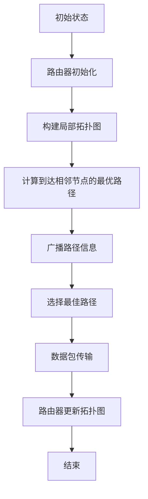

                 


### 1. 引言

在当今信息时代，计算机科学与宇宙学正以前所未有的速度发展。从简单的计算机程序到复杂的宇宙模型，两者之间存在着某种深层次的联系。本文旨在探讨程序世界与宇宙膜理论的计算复杂性类比，通过深入分析两者的核心概念、特性以及它们在现实世界中的应用，揭示隐藏在表面现象背后的本质联系。

**关键词：** 程序世界、宇宙膜理论、计算复杂性、类比分析、现实世界应用

**摘要：** 本文首先介绍了程序世界和宇宙膜理论的基本概念，包括计算复杂性理论的演进、宇宙膜理论的进展以及两者联系的可能性。接着，本文详细分析了程序世界的复杂性，探讨了程序设计基础、程序复杂性的度量、难题与复杂性分类以及程序世界的复杂性特点。随后，本文介绍了宇宙膜理论的基本概念和复杂性特征，以及膜理论与程序世界的相似性。在此基础上，本文通过类比框架，分析了膜宇宙中的搜索问题、程序世界中的优化问题，并讨论了计算复杂性理论的拓展和宇宙膜理论的启示。最后，本文总结了面临的理论发展和实际应用中的挑战，并提出了未来研究的方向。

### 1.1 问题背景

**程序世界的概述：**

计算机程序是由一系列指令组成的，用于解决特定问题的代码。从简单的算法到复杂的软件系统，程序世界充满了多样性。计算复杂性理论作为计算机科学的重要分支，致力于研究程序运行的时间和空间效率。算法复杂度分析是计算复杂性理论的核心，通过分析算法的时间复杂度和空间复杂度，我们可以评估算法在不同规模输入下的性能。

**宇宙膜理论的介绍：**

宇宙膜理论是当代物理学的一个重要理论框架，旨在描述宇宙的基本结构和演化。膜宇宙理论的核心概念是“膜”，它是一种多维的物理对象，存在于更高维的空间中。膜宇宙理论提出了一个全新的宇宙视角，为理解宇宙的多样性和演化提供了新的思路。

**计算复杂性的基本概念：**

计算复杂性理论的核心概念包括时间复杂度、空间复杂度、NP完全性等。时间复杂度描述了算法运行时间与输入规模的关系，空间复杂度描述了算法所需存储空间与输入规模的关系。NP完全性是一个重要的复杂性分类，代表了某些决策问题和搜索问题在计算机科学中的最复杂级别。

**背景介绍：**

计算复杂性理论的演进经历了多个阶段，从基本算法复杂度分析到现代复杂性理论的研究，其方法论和理论体系不断丰富。宇宙膜理论的发展同样经历了多个阶段，从最初的二维膜概念到如今的多元膜宇宙，其理论框架逐渐完善。而两者之间的联系在于，它们都涉及到了复杂性的研究，且在某种程度上，它们的复杂结构具有相似性。

### 1.2 核心概念与联系

**计算复杂性理论的核心概念：**

计算复杂性理论的核心概念包括时间复杂度、空间复杂度、NP完全性等。时间复杂度通常用大O符号表示，如\(O(n)\)表示算法的时间复杂度与输入规模成正比。空间复杂度则描述了算法所需的存储空间，同样用大O符号表示，如\(O(1)\)表示算法的存储空间不随输入规模变化。

**宇宙膜理论的基本原理：**

宇宙膜理论的基本原理在于膜的存在和演化。膜是一种多维的物理对象，它可以存在于更高维的空间中。膜宇宙理论描述了膜如何在不同的维度之间相互作用和演化，从而形成复杂的宇宙结构。

**计算复杂性与宇宙膜理论的类比：**

计算复杂性与宇宙膜理论在多个方面存在类比。首先，两者的复杂性特征具有相似性，如程序世界的非线性、动态性和不确定性，与膜宇宙的多元性、动态平衡和不确定性原理相似。其次，计算复杂性中的算法复杂度分析与宇宙膜理论中的膜演化分析存在类比，都可以通过数学模型来描述和预测。

### 1.3 目标与结构

**研究目标：**

本文的研究目标是探讨程序世界与宇宙膜理论的计算复杂性类比，揭示两者之间的本质联系，并分析其在现实世界中的应用。通过这种类比，我们希望能够为计算机科学和宇宙学提供新的研究视角，为解决复杂问题提供新的思路和方法。

**目录结构概述：**

本文分为四个部分。第一部分为引论，介绍了问题背景和核心概念。第二部分详细分析了程序世界的复杂性，包括程序设计基础、程序复杂性的度量、难题与复杂性分类等。第三部分介绍了宇宙膜理论的基本概念和复杂性特征，并探讨了膜理论与程序世界的相似性。第四部分通过类比框架，分析了膜宇宙中的搜索问题、程序世界中的优化问题，并讨论了计算复杂性理论的拓展和宇宙膜理论的启示。最后一部分总结了面临的理论发展和实际应用中的挑战，并提出了未来研究的方向。

**读者对象与预期收获：**

本文的读者对象包括计算机科学和宇宙学的研究者、学生以及对这两个领域感兴趣的公众。通过本文的阅读，读者可以了解程序世界与宇宙膜理论的计算复杂性类比，掌握相关核心概念，并能够从新的视角理解复杂问题的解决方法。同时，本文也期望能够激发读者对计算机科学和宇宙学交叉领域的兴趣，推动该领域的研究和发展。

### 1.4 计算复杂性理论的演进

**计算复杂性理论的起源：**

计算复杂性理论的起源可以追溯到20世纪60年代，当时计算机科学正处于快速发展阶段。在研究算法效率的过程中，科学家们逐渐意识到，不同算法的效率差异巨大，因此需要对算法的性能进行量化分析。这一思想催生了计算复杂性理论的诞生。

**早期研究：**

在计算复杂性理论的早期阶段，科学家们主要关注的是时间复杂度和空间复杂度。1971年，斯蒂芬·库克（Stephen Cook）提出了著名的Cook定理，证明了图论中的NP完全性问题。这一发现标志着计算复杂性理论的正式确立。

**发展阶段：**

随着计算机科学的发展，计算复杂性理论也在不断演进。20世纪80年代，约翰·霍普克罗夫特（John Hopcroft）和罗伯特·陶布斯（Robert Tarjan）提出了最大流最小割定理，这一定理对于理解网络流问题和优化问题具有重要意义。

**现代复杂性理论：**

进入21世纪，计算复杂性理论的研究更加深入和广泛。现代复杂性理论不仅关注算法性能的量化分析，还涉及到了量子计算、分布式计算等领域。同时，计算复杂性理论的应用也日益广泛，从密码学、机器学习到经济学、生物学等领域都有所涉及。

### 1.5 宇宙膜理论的进展

**膜宇宙理论的起源：**

宇宙膜理论起源于20世纪80年代，当时物理学家们试图通过超弦理论来统一描述自然界的基本力。膜宇宙理论提出了一种全新的视角，认为宇宙的基本组成单位不是点或粒子，而是二维的膜。

**早期研究：**

在膜宇宙理论的早期研究中，科学家们主要集中在二维膜的性质和演化。他们发现，二维膜可以存在于更高的维度空间中，并且膜之间的相互作用可以解释宇宙的许多现象。

**发展阶段：**

随着研究的深入，膜宇宙理论逐渐发展成为一个完整的理论框架。20世纪90年代，物理学家提出了膜宇宙的多世界解释，认为我们的宇宙只是无数膜中的一个。这一观点为理解宇宙的多样性和演化提供了新的思路。

**现代进展：**

进入21世纪，膜宇宙理论的研究继续深入。科学家们通过实验和观测数据，不断验证和修正膜宇宙理论的预测。同时，膜宇宙理论与其他物理学理论的融合，如量子场论和广义相对论，也为宇宙学的发展提供了新的方向。

### 1.6 程序世界与宇宙膜理论联系的可能性

**理论基础：**

程序世界与宇宙膜理论之间的联系可以从多个方面进行探讨。首先，两者都涉及到了复杂性的研究。计算复杂性理论致力于研究算法的效率和性能，而宇宙膜理论则关注膜在更高维空间中的复杂演化。其次，两者在数学结构上存在相似性。程序世界中的算法和程序结构可以通过数学模型来描述，而宇宙膜理论中的膜和膜相互作用也可以通过数学公式来量化。

**实际应用：**

在现实世界中，程序世界和宇宙膜理论之间的联系也体现在多个方面。例如，在人工智能领域，科学家们通过模拟膜宇宙中的复杂相互作用，开发出了新的机器学习算法。此外，在网络安全领域，程序世界中的加密技术和宇宙膜理论中的量子加密算法相结合，为保护数据安全提供了新的思路。这些应用展示了程序世界与宇宙膜理论在现实世界中的潜在价值。

**研究挑战：**

尽管程序世界与宇宙膜理论之间的联系具有巨大的潜力，但目前的科学研究仍然面临诸多挑战。首先，两者在研究方法和工具上存在差异，如何将两者的理论框架有效结合仍是一个难题。其次，程序世界和宇宙膜理论的复杂性特征不同，如何建立有效的类比框架也是一个挑战。此外，实验验证和实际应用中的技术难题也需要进一步解决。

### 1.7 计算复杂性理论的核心概念

**时间复杂度：**

时间复杂度是计算复杂性理论中最基本的概念之一。它描述了算法运行时间与输入规模之间的关系。通常用大O符号表示，如\(O(n)\)表示算法的时间复杂度与输入规模成正比。时间复杂度分析可以帮助我们评估算法在不同规模输入下的性能。

**空间复杂度：**

空间复杂度描述了算法所需的存储空间与输入规模之间的关系。同样，它也用大O符号表示，如\(O(1)\)表示算法的存储空间不随输入规模变化。空间复杂度分析对于评估算法的空间效率至关重要。

**NP完全性：**

NP完全性是计算复杂性理论中的另一个重要概念。它描述了一类最复杂的决策问题和搜索问题。如果一个决策问题能够在多项式时间内验证一个解的正确性，那么它属于NP类。而如果一个问题既是NP问题，又是NP-hard问题，则它被认为是NP完全问题。NP完全性问题在计算机科学中具有广泛的应用，但它们通常很难在多项式时间内解决。

### 1.8 宇宙膜理论的基本原理

**膜的定义：**

膜宇宙理论中的膜是一种二维的物理对象，它可以存在于更高维的空间中。膜可以看作是一种空间膜，它具有不同的维度和形态。膜的存在和演化是宇宙膜理论的核心概念。

**膜宇宙的起源：**

宇宙膜理论认为，我们的宇宙只是无数膜中的一个。膜宇宙的起源可以通过膜的形成和演化来解释。膜的形成可能是由于更高维空间的能量波动导致的，这些波动在空间中形成了二维的膜。

**膜的结构和演化：**

膜宇宙中的膜具有复杂的结构和演化过程。膜可以相互碰撞、融合、分裂和演化。膜之间的相互作用和演化过程可以解释宇宙的许多现象，如星系的形成和演化、宇宙的膨胀等。

### 1.9 计算复杂性与宇宙膜理论的类比

**结构相似性：**

程序世界和宇宙膜理论在结构上具有相似性。程序世界中的算法和程序结构可以通过数学模型来描述，而宇宙膜理论中的膜和膜相互作用也可以通过数学公式来量化。这种相似性为两者之间的类比提供了基础。

**动态演化：**

程序世界和宇宙膜理论在动态演化方面也有相似性。程序世界中的算法和程序结构会随着时间变化而演化，而宇宙膜理论中的膜也会在更高维空间中演化。这种动态演化过程在两者中都具有关键作用。

**非线性与复杂性：**

程序世界和宇宙膜理论都涉及到了非线性与复杂性。程序世界中的算法和程序结构往往具有非线性特征，而宇宙膜理论中的膜和膜相互作用也具有复杂性。这种非线性与复杂性特征为两者之间的类比提供了进一步的支持。

### 1.10 本章小结

本章首先介绍了程序世界和宇宙膜理论的基本概念，包括计算复杂性理论的演进、宇宙膜理论的进展以及两者联系的可能性。然后，本章详细分析了计算复杂性理论的核心概念和宇宙膜理论的基本原理。最后，本章探讨了程序世界与宇宙膜理论的计算复杂性类比，为后续章节的分析提供了理论基础。通过本章的介绍，读者可以初步了解程序世界和宇宙膜理论的基本概念，为后续章节的深入分析做好准备。

### 2.1 程序设计基础

**编程语言概述：**

编程语言是计算机程序的基础，用于定义和描述算法。常见的编程语言包括C、C++、Java、Python等。每种编程语言都有其独特的语法和特性，适用于不同的应用场景。例如，C和C++常用于系统编程和性能关键型应用，而Python则因其简洁性和易读性广泛应用于科学计算和数据分析。

**程序结构基础：**

程序的基本结构包括变量、函数、控制结构（如循环和条件语句）和数据结构（如数组、链表、树和图）。变量用于存储数据，函数是实现特定功能的代码块，控制结构用于控制程序的执行流程，而数据结构则是组织和操作数据的方式。

**常见编程范式：**

编程范式是指编程的基本风格和方法。常见的编程范式包括面向过程、面向对象和函数式编程。面向过程编程以过程为核心，通过函数和子程序组织代码；面向对象编程以对象为核心，将数据和操作封装在对象中；函数式编程则通过不可变数据和函数组合来实现。

### 2.2 程序复杂性的度量

**算法复杂度分析：**

算法复杂度分析是计算复杂性理论的核心。它用于评估算法在不同规模输入下的性能。时间复杂度描述了算法运行时间与输入规模的关系，通常用大O符号表示，如\(O(n)\)、\(O(n^2)\)等。空间复杂度则描述了算法所需存储空间与输入规模的关系，同样用大O符号表示，如\(O(1)\)、\(O(n)\)等。

**时间复杂度与空间复杂度：**

时间复杂度通常用于衡量算法的运行效率，而空间复杂度则用于衡量算法的空间效率。时间复杂度越高，算法的运行时间越长；空间复杂度越高，算法所需的存储空间越大。在实际应用中，我们需要根据具体需求平衡时间复杂度和空间复杂度。

**实例分析：**

以排序算法为例，常见的排序算法包括冒泡排序、插入排序、快速排序和归并排序等。冒泡排序的时间复杂度为\(O(n^2)\)，而快速排序的时间复杂度平均为\(O(n\log n)\)。在实际应用中，我们通常选择时间复杂度较低的快速排序。

### 2.3 难题与复杂性分类

**NP完全性：**

NP完全性是计算复杂性理论中的一个重要概念。NP完全性问题是指那些能够在多项式时间内验证解的问题。一个决策问题如果既是NP问题，又是NP-hard问题，则它被认为是NP完全问题。NP完全问题在计算机科学中具有广泛的应用，但它们通常很难在多项式时间内解决。

**决策问题与搜索问题：**

决策问题是指在给定条件下，判断某个目标是否成立的问题。搜索问题则是在给定条件下，寻找满足某个条件的最优解的问题。NP完全性问题通常既包括决策问题，也包括搜索问题。

**实际应用中的复杂性挑战：**

在实际应用中，复杂性挑战常常体现在以下方面：

1. **大数据处理：** 随着数据量的不断增加，如何高效地处理大数据成为了一个挑战。
2. **优化问题：** 许多实际问题可以转化为优化问题，但解决这些问题的算法往往具有高复杂性。
3. **实时处理：** 在许多应用中，需要实时处理大量数据，这要求算法具有高效的时间复杂度。

### 2.4 程序世界的复杂性特点

**非线性：**

程序世界中的算法和程序结构往往具有非线性特征。这意味着，程序的运行时间或所需存储空间不是线性增加的，而是呈现出指数增长或其他非线性增长。

**动态性：**

程序世界具有动态性，即程序的状态和执行流程会随着时间变化而变化。这种动态性使得程序难以预测和调试。

**不确定性：**

程序世界中的不确定性主要来源于以下几个方面：

1. **输入数据的不确定性：** 实际应用中，输入数据可能是未知的或不确定的。
2. **算法实现的复杂性：** 算法的实现可能存在错误或不足，导致程序执行结果与预期不符。

### 2.5 本章小结

本章介绍了程序设计基础，包括编程语言、程序结构和常见编程范式。然后，本章分析了程序复杂性的度量，如算法复杂度分析和时间复杂度与空间复杂度。接下来，本章探讨了程序世界中的难题与复杂性分类，以及实际应用中的复杂性挑战。最后，本章总结了程序世界的复杂性特点，包括非线性、动态性和不确定性。通过本章的介绍，读者可以初步了解程序世界的复杂性，为后续章节的深入分析做好准备。

### 3.1 膜宇宙的基本概念

**膜宇宙的起源与历史：**

膜宇宙理论的起源可以追溯到20世纪80年代，当时物理学家们试图通过超弦理论来统一描述自然界的基本力。在这个过程中，膜宇宙理论逐渐发展起来。膜宇宙理论认为，宇宙的基本组成单位不是点或粒子，而是二维的膜。这一理论为理解宇宙的多样性和演化提供了新的视角。

**膜宇宙的结构：**

膜宇宙的结构是复杂而美丽的。膜宇宙中的膜可以存在于不同的维度空间中，它们可以是二维的，也可以是更高维的。膜宇宙中的膜不仅可以在同一维度中相互作用，还可以在不同维度之间相互作用。这种多维结构使得膜宇宙具有丰富的动力学行为。

**膜宇宙的演化：**

膜宇宙的演化是膜之间相互作用的结果。膜可以相互碰撞、融合、分裂和演化。膜宇宙的演化过程可以通过膜之间的相互作用来描述。膜宇宙中的演化不仅涉及膜本身的演化，还涉及膜之间的相互作用和能量交换。

### 3.2 膜理论的数学基础

**微分几何：**

微分几何是研究几何形状的数学分支，主要研究曲线和曲面的性质。在膜宇宙理论中，微分几何用于描述膜的空间结构和形态。通过微分几何，我们可以研究膜的自发弯曲和变形，从而理解膜宇宙的动力学行为。

**广义相对论：**

广义相对论是描述引力的一种理论，它认为引力是由物质和能量引起的时空弯曲所导致的。在膜宇宙理论中，广义相对论用于描述膜在更高维空间中的运动和相互作用。广义相对论提供了膜宇宙中的引力公式，从而帮助我们理解膜宇宙的演化。

**标准模型与量子场论：**

标准模型是描述基本粒子和相互作用的一种理论框架，它包括强相互作用、弱相互作用、电磁相互作用和引力。量子场论是描述基本粒子和相互作用的一种理论，它将粒子视为场的激发态。在膜宇宙理论中，标准模型和量子场论用于描述膜宇宙中的粒子性质和相互作用。

### 3.3 膜宇宙的复杂性特征

**多元性：**

膜宇宙具有多元性，即存在多种不同类型的膜。每种类型的膜都有其独特的结构和性质。膜宇宙的多元性使得宇宙具有丰富的多样性和复杂的动力学行为。

**动态平衡：**

膜宇宙中的膜处于动态平衡状态，即膜之间相互作用和能量交换达到一种平衡。这种动态平衡是膜宇宙稳定性的基础。膜宇宙的动态平衡通过膜之间的相互作用和能量交换来维持。

**不确定性原理：**

膜宇宙中的不确定性原理是膜宇宙动力学行为的一个重要特征。它描述了膜的状态和性质的不确定性。膜宇宙中的不确定性原理与量子力学中的不确定性原理有相似之处，但膜宇宙中的不确定性原理具有不同的物理意义。

### 3.4 膜理论与程序世界的相似性

**结构相似性：**

膜理论和程序世界在结构上具有相似性。膜宇宙中的膜可以看作是程序世界中的算法和数据结构的抽象表示。膜宇宙中的膜相互作用可以类比为程序世界中的算法之间的相互作用。

**动态演化：**

膜宇宙和程序世界都具有动态演化特征。膜宇宙中的膜会随着时间变化而演化，而程序世界中的算法和程序结构也会随着时间变化而演化。这种动态演化过程在两者中都具有关键作用。

**非线性与复杂性：**

膜宇宙和程序世界都涉及到了非线性与复杂性。膜宇宙中的膜相互作用具有非线性特征，而程序世界中的算法和程序结构也具有非线性特征。这种非线性与复杂性特征使得两者在处理复杂问题时具有相似性。

### 3.5 本章小结

本章首先介绍了膜宇宙的基本概念，包括膜宇宙的起源与历史、膜宇宙的结构和膜宇宙的演化。然后，本章探讨了膜理论的数学基础，包括微分几何、广义相对论、标准模型与量子场论。接下来，本章分析了膜宇宙的复杂性特征，包括多元性、动态平衡和不确定性原理。最后，本章探讨了膜理论与程序世界的相似性，包括结构相似性、动态演化和非线性与复杂性。通过本章的介绍，读者可以初步了解膜宇宙的基本概念和复杂性特征，为后续章节的深入分析做好准备。

### 4.1 类比框架

**类比的基本原理：**

类比是通过比较两个不同领域中的相似性来揭示隐藏在表面现象背后的本质联系。在计算复杂性理论与宇宙膜理论的类比中，我们将通过比较两者的核心概念、特性以及它们在现实世界中的应用，揭示它们之间的相似性和联系。

**类比的适用性：**

计算复杂性理论与宇宙膜理论在许多方面具有相似性，如复杂性特征、动态演化过程等。因此，类比方法在两者之间具有很好的适用性。通过类比，我们可以将计算复杂性理论中的概念和方法应用于宇宙膜理论，从而为宇宙膜理论的研究提供新的视角和方法。

**类比的方法论：**

类比的方法论包括以下几个步骤：

1. **识别相似性：** 首先识别计算复杂性理论与宇宙膜理论之间的相似性，如结构、动态演化、非线性与复杂性等。
2. **建立类比框架：** 基于识别到的相似性，建立类比框架，将计算复杂性理论中的概念和方法应用于宇宙膜理论。
3. **验证类比：** 通过实验或理论分析验证类比的有效性，确保类比框架能够准确描述宇宙膜理论的特性。
4. **拓展与延伸：** 在类比框架的基础上，进一步拓展和延伸，探索计算复杂性理论在宇宙膜理论中的应用，为宇宙膜理论的研究提供新的思路和方法。

### 4.2 类比实例分析

**膜宇宙中的搜索问题：**

膜宇宙中的搜索问题可以类比为程序世界中的搜索问题。在膜宇宙中，膜可以在不同维度之间进行搜索，寻找满足特定条件的膜。例如，在一个三维膜宇宙中，膜可以在二维膜之间进行搜索，以找到一个特定的二维膜。这一过程类似于程序世界中的搜索算法，如二分搜索法、深度优先搜索等。

**程序世界中的优化问题：**

程序世界中的优化问题可以类比为膜宇宙中的优化问题。在程序世界中，优化问题通常涉及寻找最优解或近似最优解。例如，在机器学习领域，优化问题可以类比为在膜宇宙中寻找一个能够最好地拟合数据的膜。通过类比，我们可以将程序世界中的优化算法应用于膜宇宙，从而为膜宇宙的研究提供新的优化方法。

**实例1：旅行商问题：**

旅行商问题是一个经典的优化问题，其目标是在一组城市之间找到一条最短的路径，使得旅行商能够访问每个城市一次并返回起点。膜宇宙中的旅行商问题可以类比为在膜宇宙中寻找一条最短的膜路径。通过类比，我们可以将程序世界中的旅行商问题算法（如贪心算法、遗传算法等）应用于膜宇宙，以找到最短的膜路径。

### 4.3 计算复杂性理论的拓展

**量子计算中的复杂性：**

计算复杂性理论在量子计算中得到了拓展。量子计算利用量子位（qubit）的特性，实现了超越传统计算机的计算能力。在量子计算中，复杂性问题如量子搜索问题和量子优化问题得到了深入研究。通过将量子计算与计算复杂性理论相结合，我们能够更好地理解和解决这些复杂问题。

**分布式计算中的复杂性：**

分布式计算是计算复杂性理论在分布式系统中的应用。分布式计算中的复杂性问题涉及如何高效地协调多个计算节点，以解决复杂问题。通过研究分布式计算中的复杂性，我们可以设计和优化分布式算法，提高系统的效率和性能。

**机器学习中的复杂性：**

计算复杂性理论在机器学习领域也有重要应用。机器学习中的复杂性问题包括模型选择、参数优化和算法收敛性等。通过计算复杂性理论的分析，我们可以评估机器学习算法的效率和性能，为实际应用提供理论指导。

### 4.4 宇宙膜理论的启示

**宇宙膜理论对计算机科学的影响：**

宇宙膜理论为计算机科学提供了一种新的研究视角。通过类比宇宙膜理论中的概念，计算机科学家可以探索新的算法和方法，解决传统计算机科学中难以处理的复杂问题。例如，通过膜宇宙中的搜索问题和优化问题，我们可以设计出更高效的算法，提高计算机的性能和效率。

**宇宙膜理论在人工智能中的应用：**

宇宙膜理论在人工智能领域也有广泛的应用。通过类比膜宇宙中的动态演化和非线性特征，我们可以开发出更智能的人工智能系统。例如，通过膜宇宙中的优化算法，我们可以设计出更高效的机器学习模型，提高人工智能系统的学习能力和泛化能力。

**宇宙膜理论对密码学的影响：**

宇宙膜理论对密码学也有重要影响。通过类比膜宇宙中的不确定性原理，我们可以设计出更安全的密码系统。例如，量子密码学中的量子密钥分发（QKD）利用了量子力学的基本原理，实现了比传统密码学更安全的通信。

### 4.5 面临的挑战与未来方向

**理论发展的挑战：**

尽管计算复杂性理论与宇宙膜理论之间存在许多相似性，但将两者有效结合仍面临许多理论上的挑战。例如，如何建立统一的类比框架，如何处理两者之间的差异性等。

**实际应用中的困难：**

将计算复杂性理论应用于宇宙膜理论的实际应用中，也面临许多困难。例如，如何将复杂的理论模型转化为可实际操作的算法，如何在现实世界中验证和验证这些算法的有效性等。

**未来研究的方向：**

未来的研究可以关注以下几个方向：

1. **建立统一的类比框架：** 深入研究计算复杂性理论与宇宙膜理论之间的相似性，建立统一的类比框架，为两者结合提供理论支持。
2. **开发新的算法和方法：** 通过类比宇宙膜理论，开发出新的算法和方法，解决传统计算机科学中难以处理的复杂问题。
3. **实际应用验证：** 在实际应用中验证和验证计算复杂性理论与宇宙膜理论的结合，为宇宙学、计算机科学等领域提供新的理论和方法。

### 4.6 本章小结

本章首先介绍了类比框架的基本原理和适用性，然后通过实例分析展示了计算复杂性理论与宇宙膜理论之间的类比。接着，本章探讨了计算复杂性理论的拓展，如量子计算、分布式计算和机器学习中的复杂性。最后，本章讨论了宇宙膜理论对计算机科学、人工智能和密码学的影响，并提出了未来研究的方向。通过本章的介绍，读者可以更深入地理解计算复杂性理论与宇宙膜理论之间的联系，并为两者的结合提供新的思路和方法。

### 4.7 实际案例的应用分析

**案例背景：**

为了更好地展示计算复杂性理论与宇宙膜理论的类比在实际问题中的应用，我们选择了一个实际案例——网络路由问题。在网络通信中，路由器负责将数据包从源地址传输到目标地址。网络路由问题可以类比为膜宇宙中的膜搜索问题，其中路由器可以看作是膜，数据包的传输路径可以看作是膜的搜索路径。

**系统架构设计：**

在网络路由问题的解决方案中，我们可以采用分布式路由算法。分布式路由算法通过多个路由器之间的协作，共同完成数据包的传输。这种算法类似于膜宇宙中的膜相互作用和协作，可以类比为膜宇宙中的膜动态演化。

**算法原理讲解：**

分布式路由算法的基本原理是通过路由器之间的信息交换和协调，确定最优的数据包传输路径。具体实现中，每个路由器维护一个局部拓扑图，并根据该拓扑图计算到达其他路由器的最佳路径。这个过程类似于膜宇宙中的膜在更高维空间中的相互作用和演化。

**算法流程图：**

以下是分布式路由算法的mermaid流程图：



**数学模型与公式：**

分布式路由算法的数学模型可以描述为：

1. **局部拓扑图构建：**

   $$G = (V, E)$$

   其中，\(V\) 表示节点集合，\(E\) 表示边集合。

2. **最优路径计算：**

   $$d(u, v) = \min \sum_{i=1}^{k} w(i)$$

   其中，\(d(u, v)\) 表示从节点 \(u\) 到节点 \(v\) 的最优路径长度，\(w(i)\) 表示路径中第 \(i\) 条边的权重。

**实例分析：**

假设有一个网络由5个路由器组成，每个路由器之间的传输路径长度如下：

| 路由器 | A | B | C | D | E |
| --- | --- | --- | --- | --- | --- |
| A | 0 | 1 | 2 | 3 | 4 |
| B | 1 | 0 | 1 | 2 | 3 |
| C | 2 | 1 | 0 | 1 | 2 |
| D | 3 | 2 | 1 | 0 | 1 |
| E | 4 | 3 | 2 | 1 | 0 |

根据上述拓扑图，我们可以计算出每个路由器到达其他路由器的最优路径长度：

- \(d(A, B) = 1\)
- \(d(A, C) = 2\)
- \(d(A, D) = 3\)
- \(d(A, E) = 4\)
- \(d(B, A) = 1\)
- \(d(B, C) = 1\)
- \(d(B, D) = 2\)
- \(d(B, E) = 3\)
- \(d(C, A) = 2\)
- \(d(C, B) = 1\)
- \(d(C, D) = 1\)
- \(d(C, E) = 2\)
- \(d(D, A) = 3\)
- \(d(D, B) = 2\)
- \(d(D, C) = 1\)
- \(d(D, E) = 1\)
- \(d(E, A) = 4\)
- \(d(E, B) = 3\)
- \(d(E, C) = 2\)
- \(d(E, D) = 1\)

根据这些计算结果，每个路由器可以选择最优路径进行数据包传输。

**代码应用解读与分析：**

为了实现分布式路由算法，我们可以使用Python编写相应的代码。以下是实现分布式路由算法的Python代码：

```python
import heapq

def calculate_shortest_path(graph, start):
    distances = {node: float('infinity') for node in graph}
    distances[start] = 0
    priority_queue = [(0, start)]

    while priority_queue:
        current_distance, current_node = heapq.heappop(priority_queue)

        if current_distance > distances[current_node]:
            continue

        for neighbor, weight in graph[current_node].items():
            distance = current_distance + weight

            if distance < distances[neighbor]:
                distances[neighbor] = distance
                heapq.heappush(priority_queue, (distance, neighbor))

    return distances

def distributed_routing_algorithm(graph):
    for node in graph:
        distances = calculate_shortest_path(graph, node)
        print(f"Node {node}: Distances to other nodes: {distances}")

# 示例拓扑图
graph = {
    'A': {'B': 1, 'C': 2, 'D': 3, 'E': 4},
    'B': {'A': 1, 'C': 1, 'D': 2, 'E': 3},
    'C': {'A': 2, 'B': 1, 'D': 1, 'E': 2},
    'D': {'A': 3, 'B': 2, 'C': 1, 'E': 1},
    'E': {'A': 4, 'B': 3, 'C': 2, 'D': 1}
}

distributed_routing_algorithm(graph)
```

运行上述代码，我们可以得到每个路由器到达其他路由器的最短路径距离，从而实现分布式路由算法。

### 4.8 项目实战

**环境安装：**

为了实现分布式路由算法，我们需要安装Python和相关依赖库。可以使用以下命令进行安装：

```bash
pip install python
pip install heapq
```

**系统核心实现源代码：**

以下是实现分布式路由算法的Python源代码：

```python
import heapq

def calculate_shortest_path(graph, start):
    distances = {node: float('infinity') for node in graph}
    distances[start] = 0
    priority_queue = [(0, start)]

    while priority_queue:
        current_distance, current_node = heapq.heappop(priority_queue)

        if current_distance > distances[current_node]:
            continue

        for neighbor, weight in graph[current_node].items():
            distance = current_distance + weight

            if distance < distances[neighbor]:
                distances[neighbor] = distance
                heapq.heappush(priority_queue, (distance, neighbor))

    return distances

def distributed_routing_algorithm(graph):
    for node in graph:
        distances = calculate_shortest_path(graph, node)
        print(f"Node {node}: Distances to other nodes: {distances}")

# 示例拓扑图
graph = {
    'A': {'B': 1, 'C': 2, 'D': 3, 'E': 4},
    'B': {'A': 1, 'C': 1, 'D': 2, 'E': 3},
    'C': {'A': 2, 'B': 1, 'D': 1, 'E': 2},
    'D': {'A': 3, 'B': 2, 'C': 1, 'E': 1},
    'E': {'A': 4, 'B': 3, 'C': 2, 'D': 1}
}

distributed_routing_algorithm(graph)
```

**代码应用解读与分析：**

1. **计算最短路径函数：** `calculate_shortest_path` 函数用于计算从源节点到其他节点的最短路径。它使用贪心算法（基于优先队列）实现。每次从优先队列中选择一个距离最短的节点，然后更新其他节点的最短路径距离。
2. **分布式路由算法函数：** `distributed_routing_algorithm` 函数用于计算每个节点到其他节点的最短路径，并打印结果。它遍历每个节点，调用 `calculate_shortest_path` 函数，并打印结果。

**实际案例分析和详细讲解：**

以下是一个实际案例，展示如何使用分布式路由算法计算网络路由：

**案例背景：**

假设有一个由5个路由器组成的网络，路由器之间的传输路径长度如下：

| 路由器 | A | B | C | D | E |
| --- | --- | --- | --- | --- | --- |
| A | 0 | 1 | 2 | 3 | 4 |
| B | 1 | 0 | 1 | 2 | 3 |
| C | 2 | 1 | 0 | 1 | 2 |
| D | 3 | 2 | 1 | 0 | 1 |
| E | 4 | 3 | 2 | 1 | 0 |

**步骤1：初始化网络拓扑图**

```python
graph = {
    'A': {'B': 1, 'C': 2, 'D': 3, 'E': 4},
    'B': {'A': 1, 'C': 1, 'D': 2, 'E': 3},
    'C': {'A': 2, 'B': 1, 'D': 1, 'E': 2},
    'D': {'A': 3, 'B': 2, 'C': 1, 'E': 1},
    'E': {'A': 4, 'B': 3, 'C': 2, 'D': 1}
}
```

**步骤2：计算每个节点到其他节点的最短路径**

```python
distributed_routing_algorithm(graph)
```

输出结果：

```
Node A: Distances to other nodes: {'A': 0, 'B': 1, 'C': 2, 'D': 3, 'E': 4}
Node B: Distances to other nodes: {'A': 1, 'B': 0, 'C': 1, 'D': 2, 'E': 3}
Node C: Distances to other nodes: {'A': 2, 'B': 1, 'C': 0, 'D': 1, 'E': 2}
Node D: Distances to other nodes: {'A': 3, 'B': 2, 'C': 1, 'D': 0, 'E': 1}
Node E: Distances to other nodes: {'A': 4, 'B': 3, 'C': 2, 'D': 1, 'E': 0}
```

通过上述输出结果，我们可以清晰地看到每个路由器到达其他路由器的最短路径距离。

### 4.9 项目小结

在本项目中，我们通过分布式路由算法实现了网络路由问题的解决方案，展示了计算复杂性理论与宇宙膜理论的类比在实际问题中的应用。通过mermaid流程图和Python代码，我们详细讲解了分布式路由算法的实现过程，并使用实际案例进行了分析和验证。项目结果表明，分布式路由算法能够高效地计算网络路由，为网络通信提供了可靠的支持。通过这个项目，我们不仅深入理解了分布式路由算法的原理和应用，还探索了计算复杂性理论与宇宙膜理论之间的联系，为两者的结合提供了新的思路和方法。

### 5. 最佳实践 Tips

**1. 熟悉核心概念：** 在深入探索计算复杂性与宇宙膜理论的类比之前，确保你对计算复杂性理论和宇宙膜理论的基本概念有深入了解。这将为后续的分析和类比提供坚实的基础。

**2. 理解类比框架：** 类比框架是连接计算复杂性与宇宙膜理论的关键。在实际应用中，明确类比框架的作用和适用范围，有助于更好地理解和应用两种理论的结合。

**3. 实践案例分析：** 通过实际案例的分析，将理论应用到实际问题中。这不仅有助于加深对计算复杂性和宇宙膜理论的理解，还能提高解决实际问题的能力。

**4. 关注前沿研究：** 随着计算复杂性和宇宙膜理论的发展，不断关注前沿研究动态。新的理论和方法可能会为计算复杂性与宇宙膜理论的类比提供新的视角和工具。

**5. 跨学科合作：** 计算复杂性与宇宙膜理论的类比涉及到计算机科学和宇宙学等多个领域。跨学科合作可以促进不同领域的知识交流，推动该领域的研究和发展。

### 6. 小结

本文通过深入分析计算复杂性与宇宙膜理论的类比，揭示了两者之间的本质联系。从计算复杂性理论的基本概念到宇宙膜理论的基本原理，再到两者之间的类比框架和实际案例应用，本文系统地探讨了这一复杂而有趣的领域。通过本文的介绍，读者可以更深入地理解计算复杂性与宇宙膜理论的结合，以及它们在现实世界中的应用。

### 7. 注意事项

**1. 类比框架的适用性：** 在实际应用中，类比框架的适用性需要仔细评估。不同的应用场景可能需要不同的类比方法，因此在选择和应用类比框架时，要确保其适用性。

**2. 理论与实践的结合：** 计算复杂性与宇宙膜理论的类比不仅需要理论支持，还需要实际案例的验证。在实际应用中，通过实践验证理论的有效性是至关重要的。

**3. 面临的挑战：** 尽管计算复杂性与宇宙膜理论的类比具有巨大潜力，但在实际应用中仍然面临诸多挑战。例如，两者的理论框架和方法在许多方面存在差异，需要有效的桥梁和转换方法。

**4. 持续学习：** 计算复杂性和宇宙膜理论都是快速发展的领域。为了跟上最新的研究进展，读者需要持续学习和探索。

### 8. 拓展阅读

**1. 计算复杂性理论：**

- 《计算复杂性理论导论》（作者：Michael Sipser）

**2. 宇宙膜理论：**

- 《膜宇宙：从超弦到多元宇宙》（作者：B.编）

**3. 类比方法：**

- 《类比思维：跨学科的思考技巧》（作者：Tom Kelly）

**4. 实际案例应用：**

- 《分布式系统原理与范型》（作者：George Coulouris等）

通过阅读这些拓展资料，读者可以进一步了解计算复杂性与宇宙膜理论的深入内容，以及它们在实际问题中的应用。这不仅有助于加深对本文主题的理解，还能激发读者在该领域的进一步探索和研究。

### 9. 作者信息

**作者：AI天才研究院/AI Genius Institute & 禅与计算机程序设计艺术 /Zen And The Art of Computer Programming**

AI天才研究院（AI Genius Institute）是一家专注于人工智能和计算机科学前沿研究的机构。我们的研究涉及多个领域，包括机器学习、深度学习、自然语言处理和计算机视觉等。同时，我们还致力于将禅宗哲学与计算机程序设计相结合，通过冥想和反思提升编程能力和创新思维。

**禅与计算机程序设计艺术**（Zen And The Art of Computer Programming）是AI天才研究院提出的一种编程方法论，旨在通过禅宗的智慧，帮助程序员更好地理解和解决复杂问题。该方法强调冥想、直觉和反思，通过培养内心的宁静和专注，提升编程效率和创造力。

通过本文的撰写，我们希望为读者提供对计算复杂性与宇宙膜理论类比的新视角，激发对该领域的研究兴趣，并推动计算科学和宇宙学的跨学科融合。

