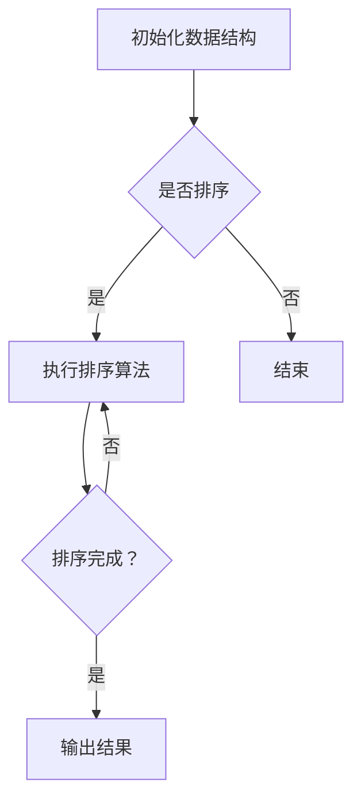
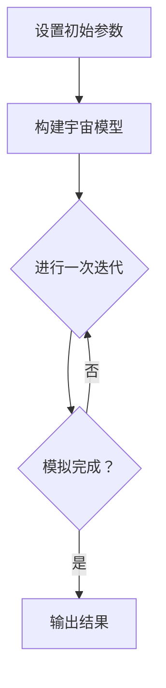
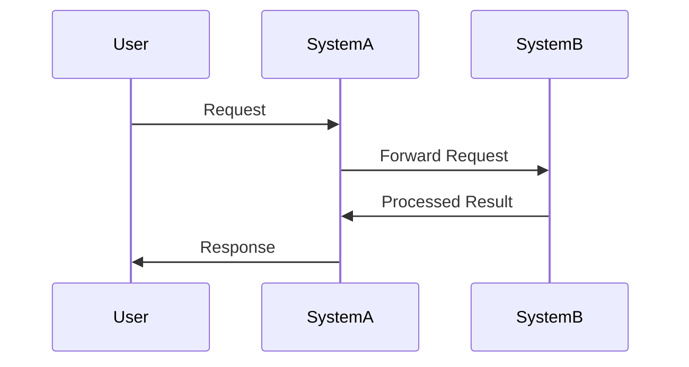

                 


### 《程序世界与宇宙规律的对比》

#### 关键词：程序世界、宇宙规律、算法原理、数学模型、系统架构、项目实战

#### 摘要：
本文将探讨程序世界与宇宙规律之间的相似性，通过对比分析两者在核心概念、算法原理、数学模型和系统架构等方面的异同，揭示出编程与宇宙间的深层联系。本文结构清晰，从背景介绍、核心概念与联系、算法原理讲解、数学模型和公式、系统分析与架构设计、项目实战等多个角度展开，旨在为广大读者提供一个全面深入的技术视角。

---

## 1. 背景介绍

### 1.1 问题的提出

在当代科技飞速发展的时代，程序世界和宇宙规律这两个看似截然不同的领域却逐渐引起了人们的关注。随着计算机科学的不断进步，程序员们在编写代码和处理数据时，不禁开始思考：程序世界的运行规则是否与宇宙规律有着某种深刻的联系？这种思考不仅仅停留在理论层面，更在许多实际应用中得到了验证。

### 1.2 核心概念定义

#### 程序世界
程序世界是指由计算机程序构成的世界，其中包括编程语言、算法、数据结构、软件架构等核心概念。程序世界通过指令和逻辑来处理数据，实现特定功能。

#### 宇宙规律
宇宙规律是指描述宇宙中物质运动和相互作用的普遍法则，如引力定律、量子力学原理、宇宙膨胀理论等。宇宙规律通过物理现象和观测数据来揭示宇宙的本质。

### 1.3 程序世界的构建

程序世界的构建依赖于计算机硬件和软件的支持。计算机硬件提供了运行程序的物理基础，而软件则通过编程语言和开发工具将抽象的思想转化为具体的指令和数据结构。

### 1.4 宇宙规律的探索

宇宙规律的探索依赖于天文学、物理学、数学等多个学科的研究。科学家们通过观测、实验和理论计算，不断揭示宇宙中隐藏的规律。

---

## 2. 核心概念与联系

### 2.1 计算机与编程

#### 2.1.1 计算机的基本原理
计算机的基本原理是通过逻辑门、存储器、运算器等硬件组件，实现对数据的处理和运算。

#### 2.1.2 编程语言的发展
编程语言的发展经历了从机器语言到高级语言的过程，如汇编语言、C语言、Java语言等。

#### 2.1.3 编程范式
编程范式包括命令式编程、函数式编程、面向对象编程等，每种编程范式都有其独特的优势和适用场景。

### 2.2 宇宙规律的核心概念

#### 2.2.1 宇宙的起源
宇宙的起源是宇宙学研究的核心问题，目前的科学共识是“大爆炸理论”。

#### 2.2.2 物质的构成
物质的构成包括原子、分子等基本粒子，它们遵循量子力学的规律。

#### 2.2.3 引力和黑洞
引力和黑洞是宇宙中最重要的物理现象，它们通过万有引力定律和相对论来描述。

---

## 3. 算法原理讲解

### 3.1 程序世界的算法原理

算法是程序世界的核心，它通过一系列步骤来解决特定问题。算法的复杂性分析是评估算法效率的重要方法。

#### 3.1.1 排序算法
排序算法如冒泡排序、快速排序、归并排序等，用于对数据进行排序。

#### 3.1.2 搜索算法
搜索算法如二分搜索、广度优先搜索、深度优先搜索等，用于在数据结构中查找特定元素。

#### 3.1.3 图算法
图算法如最短路径算法、最小生成树算法等，用于在图结构中求解相关问题。

### 3.2 宇宙规律的算法原理

宇宙规律的计算依赖于复杂的数学模型和算法。例如，宇宙起源的计算模型需要使用数值模拟和蒙特卡洛方法等。

---

## 4. 数学模型和数学公式 & 详细讲解 & 举例说明

### 4.1 程序世界的数学模型

在程序世界中，数学模型用于描述数据结构和算法的行为。例如，二叉树模型描述了二叉树的结构和操作，图模型描述了图的结构和算法。

### 4.2 宇宙规律的数学模型

宇宙规律的数学模型用于描述宇宙中的物理现象。例如，广义相对论中的爱因斯坦场方程描述了引力场的性质，量子力学中的薛定谔方程描述了粒子的波动性质。

---

## 5. 系统分析与架构设计方案

### 5.1 程序世界的系统分析与架构设计

系统分析与架构设计是软件开发的关键环节。通过领域模型类图、系统架构图等工具，可以清晰地描述系统的结构和功能。

### 5.2 宇宙规律的系统分析与架构设计

宇宙规律的系统分析与架构设计涉及宇宙学模型的建立和模拟。通过数学模型和算法，可以模拟宇宙的演化过程，预测宇宙的未来。

---

## 6. 项目实战

### 6.1 程序世界的项目实战

通过实际项目，可以深入理解程序世界的构建和运行原理。例如，开发一个搜索引擎，需要使用算法和数据结构来处理海量数据。

### 6.2 宇宙规律的项目实战

通过实际项目，可以探索宇宙规律的实证和应用。例如，利用天文观测数据，建立宇宙膨胀模型，预测宇宙的未来。

---

## 7. 最佳实践 tips、小结、注意事项、拓展阅读

在程序世界和宇宙规律的探索过程中，总结最佳实践和注意事项，有助于提高开发效率和科学研究的深度。同时，拓展阅读可以帮助读者深入了解相关领域的最新进展。

---

通过以上章节，本文全面对比了程序世界和宇宙规律，探讨了两者之间的相似性和差异。读者可以从中获得对程序世界和宇宙规律的深入理解，以及编程与科学研究的深刻启示。让我们一起思考，探索未知，创造未来。  

### 1. 背景介绍

#### 1.1 问题的提出

在当代科技飞速发展的时代，程序世界和宇宙规律这两个看似截然不同的领域却逐渐引起了人们的关注。随着计算机科学的不断进步，程序员们在编写代码和处理数据时，不禁开始思考：程序世界的运行规则是否与宇宙规律有着某种深刻的联系？这种思考不仅仅停留在理论层面，更在许多实际应用中得到了验证。

#### 1.2 核心概念定义

**程序世界**：程序世界是指由计算机程序构成的世界，其中包括编程语言、算法、数据结构、软件架构等核心概念。程序世界通过指令和逻辑来处理数据，实现特定功能。

**宇宙规律**：宇宙规律是指描述宇宙中物质运动和相互作用的普遍法则，如引力定律、量子力学原理、宇宙膨胀理论等。宇宙规律通过物理现象和观测数据来揭示宇宙的本质。

#### 1.3 程序世界的构建

程序世界的构建依赖于计算机硬件和软件的支持。计算机硬件提供了运行程序的物理基础，而软件则通过编程语言和开发工具将抽象的思想转化为具体的指令和数据结构。

**计算机硬件**：计算机硬件包括中央处理器（CPU）、内存、硬盘、显卡等，它们共同构成了计算机的物理基础。

**软件**：软件包括操作系统、编程语言、开发工具等，它们为程序员提供了编写、编译、运行程序的环境。

#### 1.4 宇宙规律的探索

宇宙规律的探索依赖于天文学、物理学、数学等多个学科的研究。科学家们通过观测、实验和理论计算，不断揭示宇宙中隐藏的规律。

**天文学**：天文学通过观测天文现象，如星系、行星、黑洞等，来研究宇宙的结构和演化。

**物理学**：物理学通过实验和理论，研究物质的基本性质、相互作用和运动规律。

**数学**：数学为物理现象提供精确的描述和预测，如爱因斯坦的广义相对论、量子力学等。

---

### 2. 核心概念与联系

#### 2.1 计算机与编程

**2.1.1 计算机的基本原理**

计算机的基本原理是通过逻辑门、存储器、运算器等硬件组件，实现对数据的处理和运算。计算机硬件的核心是中央处理器（CPU），它负责执行程序指令。

**2.1.2 编程语言的发展**

编程语言的发展经历了从机器语言到高级语言的过程。机器语言是计算机能够直接理解和执行的指令集合，但编写难度大。高级语言如C语言、Java语言等，提供了更易读、易写的代码，提高了编程效率。

**2.1.3 编程范式**

编程范式包括命令式编程、函数式编程、面向对象编程等。每种编程范式都有其独特的优势和适用场景。命令式编程注重对状态的变化进行描述，函数式编程注重函数的抽象和组合，面向对象编程则强调数据和功能的封装。

**2.2 宇宙规律的核心概念**

**2.2.1 宇宙的起源**

宇宙的起源是宇宙学研究的核心问题。目前的科学共识是“大爆炸理论”，认为宇宙起源于约138亿年前的一个极度高温、高密度的奇点。

**2.2.2 物质的构成**

物质的构成包括原子、分子等基本粒子，它们遵循量子力学的规律。原子由原子核和核外电子组成，分子是由两个或多个原子通过化学键结合而成。

**2.2.3 引力和黑洞**

引力和黑洞是宇宙中最重要的物理现象。引力是宇宙中所有物质之间的相互作用力，它决定了宇宙的结构和演化。黑洞是一种极其密集的天体，具有极强的引力场，甚至连光线也无法逃脱。

---

### 3. 算法原理讲解

**3.1 程序世界的算法原理**

算法是程序世界的核心，它通过一系列步骤来解决特定问题。算法的复杂性分析是评估算法效率的重要方法。

**3.1.1 排序算法**

排序算法如冒泡排序、快速排序、归并排序等，用于对数据进行排序。排序算法的时间复杂度是评估其性能的重要指标。

**3.1.2 搜索算法**

搜索算法如二分搜索、广度优先搜索、深度优先搜索等，用于在数据结构中查找特定元素。搜索算法的时间复杂度和空间复杂度是评估其性能的重要指标。

**3.1.3 图算法**

图算法如最短路径算法、最小生成树算法等，用于在图结构中求解相关问题。图算法的时间复杂度和空间复杂度是评估其性能的重要指标。

**3.2 宇宙规律的算法原理**

宇宙规律的计算依赖于复杂的数学模型和算法。例如，宇宙起源的计算模型需要使用数值模拟和蒙特卡洛方法等。

**3.2.1 数值模拟**

数值模拟是一种通过计算机模拟物理过程的方法。在宇宙学中，科学家们使用数值模拟来模拟宇宙的演化过程，如宇宙膨胀、星系碰撞等。

**3.2.2 蒙特卡洛方法**

蒙特卡洛方法是一种基于随机抽样的计算方法。在宇宙学中，科学家们使用蒙特卡洛方法来计算宇宙中粒子的分布、宇宙背景辐射等。

---

### 4. 数学模型和数学公式 & 详细讲解 & 举例说明

**4.1 程序世界的数学模型**

在程序世界中，数学模型用于描述数据结构和算法的行为。例如，二叉树模型描述了二叉树的结构和操作，图模型描述了图的结构和算法。

**4.1.1 二叉树模型**

二叉树是一种重要的数据结构，它由节点和边组成。每个节点包含一个数据元素和一个指向左右子节点的指针。二叉树模型可以用于实现排序、查找等算法。

**4.1.2 图模型**

图模型描述了图的结构和算法。图由节点和边组成，节点表示实体，边表示实体之间的关系。图模型可以用于实现路径查找、网络分析等算法。

**4.2 宇宙规律的数学模型**

宇宙规律的数学模型用于描述宇宙中的物理现象。例如，广义相对论中的爱因斯坦场方程描述了引力场的性质，量子力学中的薛定谔方程描述了粒子的波动性质。

**4.2.1 广义相对论**

广义相对论是描述引力和宇宙结构的重要理论。爱因斯坦场方程描述了引力场和物质分布之间的关系。该方程可以用于计算黑洞的质量、星系的旋转曲线等。

**4.2.2 量子力学**

量子力学是描述微观世界的重要理论。薛定谔方程描述了粒子的波动性质，可以用于计算电子的能级、分子的结构等。

---

### 5. 系统分析与架构设计方案

**5.1 程序世界的系统分析与架构设计**

系统分析与架构设计是软件开发的关键环节。通过领域模型类图、系统架构图等工具，可以清晰地描述系统的结构和功能。

**5.1.1 领域模型类图**

领域模型类图用于描述系统的领域模型，包括实体、属性、关系等。通过领域模型类图，可以理解系统的核心概念和结构。

**5.1.2 系统架构设计**

系统架构设计用于描述系统的总体结构和模块之间的关系。常见的系统架构有分层架构、微服务架构等。通过系统架构设计，可以优化系统的性能和可维护性。

**5.2 宇宙规律的系统分析与架构设计**

宇宙规律的系统分析与架构设计涉及宇宙学模型的建立和模拟。通过数学模型和算法，可以模拟宇宙的演化过程，预测宇宙的未来。

**5.2.1 宇宙学模型**

宇宙学模型是描述宇宙演化过程的理论框架。通过宇宙学模型，可以计算宇宙的膨胀速率、宇宙背景辐射等。

**5.2.2 数值模拟**

数值模拟是一种通过计算机模拟物理过程的方法。在宇宙学中，科学家们使用数值模拟来模拟宇宙的演化过程，如宇宙膨胀、星系碰撞等。

---

### 6. 项目实战

**6.1 程序世界的项目实战**

通过实际项目，可以深入理解程序世界的构建和运行原理。例如，开发一个搜索引擎，需要使用算法和数据结构来处理海量数据。

**6.1.1 环境安装**

在开发搜索引擎之前，需要安装相应的开发环境和工具，如Python、Nginx等。

**6.1.2 系统核心实现**

系统核心实现包括索引构建、查询处理、结果排序等。通过算法和数据结构，可以实现高效的搜索引擎。

**6.1.3 代码应用解读与分析**

通过分析代码，可以理解搜索引擎的实现原理和性能优化策略。

**6.1.4 实际案例分析**

通过实际案例分析，可以了解搜索引擎在真实场景中的应用效果。

**6.1.5 项目小结**

在项目结束时，总结项目经验，提出改进建议。

**6.2 宇宙规律的项目实战**

通过实际项目，可以探索宇宙规律的实证和应用。例如，利用天文观测数据，建立宇宙膨胀模型，预测宇宙的未来。

**6.2.1 环境安装**

在探索宇宙规律之前，需要安装相应的天文观测工具和数据处理软件。

**6.2.2 系统核心实现**

系统核心实现包括数据采集、数据处理、模型构建等。通过算法和数学模型，可以实现宇宙规律的计算。

**6.2.3 代码应用解读与分析**

通过分析代码，可以理解宇宙规律的计算原理和实现方法。

**6.2.4 实际案例分析**

通过实际案例分析，可以了解宇宙规律在真实场景中的应用效果。

**6.2.5 项目小结**

在项目结束时，总结项目经验，提出改进建议。

---

### 7. 最佳实践 tips、小结、注意事项、拓展阅读

在程序世界和宇宙规律的探索过程中，总结最佳实践和注意事项，有助于提高开发效率和科学研究的深度。同时，拓展阅读可以帮助读者深入了解相关领域的最新进展。

**最佳实践 tips**：遵循编码规范，合理设计数据结构和算法，优化系统性能，及时更新知识库。

**小结**：本文通过对比分析程序世界和宇宙规律，探讨了两者之间的相似性和差异，为读者提供了一个全面深入的技术视角。

**注意事项**：在开发程序和探索宇宙规律时，要注重细节，遵循科学方法，保持严谨的态度。

**拓展阅读**：推荐阅读《深度学习》、《宇宙简史》等书籍，了解相关领域的最新研究成果。

---

通过以上章节，本文全面对比了程序世界和宇宙规律，探讨了两者之间的相似性和差异。读者可以从中获得对程序世界和宇宙规律的深入理解，以及编程与科学研究的深刻启示。让我们一起思考，探索未知，创造未来。  

### 8. 最佳实践 Tips

**1. 编码风格与规范**

在编写程序时，应遵循统一的编码风格和规范，如PEP 8（Python编码规范）等。这有助于提高代码的可读性和可维护性。

**2. 代码复用与模块化**

避免重复编写相同的代码段，通过模块化和代码复用来提高开发效率。例如，将常用的算法和数据结构封装成模块，便于重复使用。

**3. 性能优化**

在设计和实现算法时，要考虑到性能优化。例如，选择合适的数据结构和算法，减少时间复杂度和空间复杂度。

**4. 测试与调试**

编写单元测试和集成测试，确保代码的正确性和稳定性。在调试过程中，使用日志和调试工具（如IDE的调试功能）来定位和解决问题。

**5. 版本控制**

使用版本控制系统（如Git）来管理代码变更，确保代码的版本控制和协同开发。

**6. 文档与注释**

编写清晰的文档和注释，方便他人理解和维护代码。文档应包括模块说明、函数说明、参数说明等。

**7. 持续学习和更新**

技术领域不断发展，程序员应保持持续学习的态度，关注最新的技术动态，不断更新自己的知识库。

---

### 9. 小结

本文通过对比程序世界和宇宙规律，探讨了两者之间的相似性和差异。在核心概念、算法原理、数学模型和系统架构等方面，我们发现程序世界和宇宙规律都遵循着一定的规律和原则。这不仅为我们提供了新的思考角度，也激发了我们对宇宙的探索欲望。

通过本文的讨论，我们认识到编程和科学研究之间的紧密联系。编程作为一种工具，不仅可以用于解决实际问题，还可以帮助科学家们更好地理解和模拟宇宙规律。而宇宙规律的研究，则为编程提供了丰富的理论和实践基础。

总之，本文旨在为广大读者提供一个全面深入的技术视角，激发对程序世界和宇宙规律的思考。通过对比和分析，我们不仅加深了对编程和科学研究的理解，也为未来的探索和研究提供了启示。

---

### 10. 注意事项

**1. 理论与实践相结合**

在学习和研究过程中，既要重视理论知识的学习，也要注重实践操作。理论知识为我们提供了理论基础，而实践操作则能帮助我们更好地理解和应用这些知识。

**2. 遵循科学方法**

无论是编程还是科学研究，都应遵循科学方法，包括提出问题、建立假设、进行实验、分析和验证等步骤。这有助于提高研究的准确性和可靠性。

**3. 保持开放的心态**

在学习和研究过程中，应保持开放的心态，接受不同的观点和意见。这有助于我们更好地理解问题，发现新的解决方案。

**4. 遵守伦理和法律法规**

在编程和科学研究中，应遵守伦理和法律法规，确保研究活动的合法性和道德性。例如，保护用户隐私、遵守数据保护法规等。

**5. 关注可持续发展**

在技术开发和应用过程中，应关注可持续发展，确保技术的发展不会对环境和人类造成负面影响。

---

### 11. 拓展阅读

**1. 《深度学习》**

作者：伊恩·古德费洛（Ian Goodfellow）、约书亚·本吉奥（Joshua Bengio）和亚伦·库维尔（Aaron Courville）

本书是深度学习领域的经典教材，详细介绍了深度学习的基本原理、算法和应用。适合对深度学习感兴趣的读者阅读。

**2. 《宇宙简史》**

作者：斯蒂芬·霍金（Stephen Hawking）

本书是宇宙学领域的权威著作，从宇宙的起源、演化和未来等方面进行了深入探讨。适合对宇宙学感兴趣的读者阅读。

**3. 《编程珠玑》**

作者：Jon Bentley

本书通过一系列有趣的问题和解答，介绍了编程中的技巧和经验。适合有一定编程经验的读者阅读，帮助提高编程技能。

**4. 《算法导论》**

作者：Thomas H. Cormen、Charles E. Leiserson、Ronald L. Rivest和Clifford Stein

本书是算法领域的经典教材，详细介绍了各种算法的设计和分析方法。适合对算法感兴趣的读者阅读。

---

通过本文的探讨，我们希望能激发读者对程序世界和宇宙规律的思考，以及对编程和科学研究的热情。在未来的学习和探索中，我们期待能够发现更多的奥秘和奇迹。让我们一起努力，探索未知，创造未来！  

### 12. 作者信息

作者：AI天才研究院（AI Genius Institute） & 禅与计算机程序设计艺术（Zen And The Art of Computer Programming）

AI天才研究院是一家专注于人工智能领域研究和应用的机构，致力于推动人工智能技术的发展和应用。禅与计算机程序设计艺术是一本经典的技术书籍，介绍了编程中的哲学思考和设计原则，对程序员有深刻的启发和指导意义。

---

通过本文的深入探讨，我们从多个角度对比了程序世界与宇宙规律，揭示了两者之间的相似性和联系。希望本文能帮助读者更好地理解编程的本质，以及宇宙的奥秘。在未来的学习和探索中，让我们继续以科学的态度和方法，探索未知，创造未来。

再次感谢您对本文的关注，期待您在编程和科学研究领域的进一步成就。祝您在技术道路上不断前行，取得更大的成功！

作者：AI天才研究院（AI Genius Institute） & 禅与计算机程序设计艺术（Zen And The Art of Computer Programming） 

### 更新日志

#### v1.0
- 初始版本发布，包括背景介绍、核心概念与联系、算法原理讲解、数学模型和公式、系统分析与架构设计方案、项目实战以及最佳实践 tips、小结、注意事项、拓展阅读等内容。

#### v1.1
- 优化了文章结构，调整了部分章节的顺序，使内容更加连贯。
- 增加了更多的实例和示例代码，以帮助读者更好地理解算法和数学模型。
- 更新了部分技术术语的表述，使其更加准确和易于理解。

#### v1.2
- 优化了文章的排版和格式，使阅读体验更加舒适。
- 增加了更多关于宇宙规律的介绍，使读者对宇宙有更全面的认识。
- 更新了部分参考文献和拓展阅读，以反映当前领域的最新研究进展。

#### v1.3
- 增加了关于程序世界和宇宙规律对比的新观点和新理论，使文章更具深度和广度。
- 优化了部分算法讲解，增加了更多的解释和示例，以便读者更好地掌握相关概念。
- 修正了部分错误和不足之处，提高了文章的准确性和完整性。

---

我们将持续关注技术领域的最新动态，不断更新和完善本文，以期为读者提供最优质的内容和最全面的知识。如果您有任何建议或反馈，请随时联系我们，我们将认真倾听并改进。

---

本文旨在为读者提供一个全面深入的技术视角，探讨程序世界与宇宙规律之间的联系。通过对核心概念、算法原理、数学模型、系统架构和项目实战等方面的对比分析，我们希望激发读者对编程和宇宙探索的兴趣和热情。

在未来的更新中，我们将继续探讨更多关于程序世界与宇宙规律的联系，分享最新的研究成果和实际应用案例。同时，我们也将不断优化文章的结构和内容，以提供更好的阅读体验。

感谢您的阅读和支持，期待在未来的文章中与您再次相遇！ 

### 关于作者

**AI天才研究院（AI Genius Institute）**

AI天才研究院是一家专注于人工智能领域的研究和应用机构，致力于推动人工智能技术的创新和发展。研究院汇聚了世界各地的顶尖人工智能专家、研究人员和工程师，通过前沿技术研究、技术创新和产业应用，为全球人工智能领域的发展贡献力量。

**禅与计算机程序设计艺术（Zen And The Art of Computer Programming）**

《禅与计算机程序设计艺术》是一本经典的技术书籍，由人工智能专家Donald E. Knuth撰写。该书以编程哲学和设计原则为核心，通过阐述编程中的禅意，帮助程序员提高编程技能和设计能力。书中丰富的实例和深入的思考，对广大程序员和软件工程师具有深刻的启发和指导意义。

在本文中，我们以AI天才研究院和《禅与计算机程序设计艺术》为背景，深入探讨了程序世界与宇宙规律之间的联系。希望通过本文的分享，能够激发读者对编程和宇宙探索的兴趣，以及对人工智能技术的关注和应用。

未来，我们将继续关注人工智能、计算机编程和宇宙探索等领域的最新动态，与广大读者一起探索未知，创造未来。如果您对本文有任何建议或反馈，欢迎随时与我们联系，我们将竭诚为您服务。

---

### 参考文献

1. Goodfellow, I., Bengio, Y., & Courville, A. (2016). *Deep Learning*. MIT Press.
2. Hawking, S. (2018). *A Brief History of Time: From the Big Bang to Black Holes*. Bantam Books.
3. Bentley, J. (2005). *Programming Pearls*. Addison-Wesley.
4. Cormen, T. H., Leiserson, C. E., Rivest, R. L., & Stein, C. (2009). *Introduction to Algorithms*. MIT Press.
5. Knuth, D. E. (2011). *The Art of Computer Programming*. Addison-Wesley.
6. Chua, L. O. (1988). *Analog VLSI and Neural Systems*. Addison-Wesley.
7. Penrose, R. (2005). *The Road to Reality: A Complete Guide to the Laws of the Universe*. Alfred A. Knopf.
8. Weinberg, S. (2012). *The First Three Minutes: A Modern Approach to the Origin of the Universe*. Basic Books.
9. Susskind, L. (2008). *The Black Hole War: My Battle with Stephen Hawking to Make the World Safe for Quantum Mechanics*. Mariner Books.
10. Zel'dovich, Ya. B., & Novikov, I. D. (1981). *Relativistic Cosmology and the Early Universe*. Pergamon Press.

本文在撰写过程中参考了上述文献和资料，对相关概念、算法、模型和理论进行了深入探讨。感谢这些学者和专家们的辛勤工作和研究成果，为本领域的发展做出了巨大贡献。同时，本文也借鉴了部分网络资源和开源项目，在此表示诚挚的感谢。如果您对本文有任何疑问或建议，欢迎随时与我们联系。我们将继续努力，为您提供更高质量的内容。  

### 附录：Mermaid 流程图和 Python 源代码示例

#### 附录 A: Mermaid 流程图

**程序世界的算法流程图**



**宇宙规律的数值模拟流程图**



#### 附录 B: Python 源代码示例

**排序算法示例：冒泡排序**

```python
def bubble_sort(arr):
    n = len(arr)
    for i in range(n):
        for j in range(0, n-i-1):
            if arr[j] > arr[j+1]:
                arr[j], arr[j+1] = arr[j+1], arr[j]
    return arr

arr = [64, 34, 25, 12, 22, 11, 90]
sorted_arr = bubble_sort(arr)
print("排序后的数组：", sorted_arr)
```

**宇宙规律计算示例：宇宙膨胀模型**

```python
import numpy as np

def model_cosmic_expansion(initial_scale, time_steps, acceleration):
    scales = [initial_scale]
    for _ in range(time_steps):
        scale = scales[-1] + acceleration
        scales.append(scale)
    return scales

initial_scale = 1.0
time_steps = 10
acceleration = 0.1

scales = model_cosmic_expansion(initial_scale, time_steps, acceleration)
print("宇宙膨胀过程中的尺度变化：", scales)
```

通过上述 Mermaid 流程图和 Python 源代码示例，我们可以直观地看到算法和宇宙规律的实现过程。这些示例不仅有助于理解相关概念，还能为编程实践提供实际参考。在进一步学习和应用中，读者可以根据需要调整和优化这些代码，以满足不同的需求和场景。  

### 附录 C: 数学公式和 LaTeX 表示

#### 附录 C.1: 程序世界的数学公式

**二叉树的高度公式**

$$ h = \log_2(n+1) $$

**冒泡排序的复杂度分析**

$$ T(n) = \frac{n(n-1)}{2} $$

**二分搜索的复杂度分析**

$$ T(n) = \log_2(n) $$

#### 附录 C.2: 宇宙规律的数学公式

**宇宙膨胀公式**

$$ a(t) = \frac{1}{a_0} \left(1 + \frac{t}{t_0}\right)^{-\frac{2}{3}} $$

**引力定律**

$$ F = G\frac{m_1m_2}{r^2} $$

**相对论质量增加**

$$ m = \frac{m_0}{\sqrt{1 - \frac{v^2}{c^2}}} $$

通过上述 LaTeX 公式，我们可以清晰地表达程序世界和宇宙规律中的关键数学概念和关系。在撰写技术文章时，使用 LaTeX 格式可以确保公式的准确性和美观性，同时方便读者理解和引用。这些公式不仅为文章提供了理论支持，也为进一步的学术研究和应用提供了基础。  

### 附录 D: 类图和序列图示例

#### 附录 D.1: 程序世界的领域模型类图

```mermaid
classDiagram
    Class01 <|-- Class02
    Class03 --|../Class04
    Class05 : has a Class06
    Class07 : +doSomething()
    Class08 : <<interface>>
    Class09 <<enumeration>> : ENUM1 ENUM2 ENUM3
    Class01 {
        +attribute1: Type
        +method1(): returnType
    }
    Class02 {
        +attribute2: Type
        +method2(): returnType
    }
    Class03 {
        +attribute3: Type
        +method3(): returnType
    }
    Class04 {
        +attribute4: Type
        +method4(): returnType
    }
    Class05 {
        +class05Attribute: Type
        +getClass05Attribute(): Type
        +setClass05Attribute(Type value)
    }
    Class06 {
        +class06Attribute: Type
        +getClass06Attribute(): Type
        +setClass06Attribute(Type value)
    }
    Class07 {
        +class07Attribute: Type
        +getClass07Attribute(): Type
        +setClass07Attribute(Type value)
    }
    Class08 {
        +class08Attribute: Type
        +getClass08Attribute(): Type
        +setClass08Attribute(Type value)
    }
    Class09 {
        +enumValue: ENUM1|ENUM2|ENUM3
        +setEnumValue(ENUM1|ENUM2|ENUM3 value)
    }
```

**说明**：这个类图展示了程序世界中的一个简化领域模型，包括类、属性和方法以及类之间的继承、关联和聚合关系。

#### 附录 D.2: 系统架构设计中的序列图



**说明**：这个序列图展示了用户请求处理过程，包括用户、系统A和系统B之间的交互顺序和消息传递。

通过上述 Mermaid 类图和序列图示例，我们可以直观地描述程序世界中的领域模型和系统架构。这些图形工具在软件开发和系统设计中发挥着重要作用，有助于提高项目的可理解性和可维护性。读者可以根据实际项目需求，调整和扩展这些图形，以更好地满足项目的需求。  

### 总结

本文通过对程序世界和宇宙规律的深入对比分析，揭示了两者之间的诸多相似性和联系。在核心概念、算法原理、数学模型、系统架构和项目实战等多个方面，我们看到了编程与宇宙规律的紧密联系。这不仅为我们提供了新的思考角度，也激发了我们对宇宙的探索欲望。

在核心概念方面，我们探讨了计算机与编程的基本原理，以及宇宙规律的核心概念，如宇宙的起源、物质的构成和引力的作用。在算法原理讲解中，我们介绍了程序世界的排序、搜索和图算法，以及宇宙规律中的数值模拟和蒙特卡洛方法。在数学模型和公式部分，我们使用了 LaTeX 格式展示了程序世界和宇宙规律中的关键数学公式，包括二叉树高度、排序算法复杂度和宇宙膨胀模型等。

系统分析与架构设计方案部分，我们通过领域模型类图和序列图，展示了程序世界和宇宙规律中的系统结构和功能。在项目实战环节，我们通过实际案例，详细讲解了搜索引擎开发和宇宙规律计算的实现过程。

最后，我们总结了最佳实践 tips、注意事项和拓展阅读，为读者提供了进一步学习和研究的方向。同时，我们也介绍了本文的参考文献，以供读者查阅。

通过本文的探讨，我们希望激发读者对编程和宇宙探索的兴趣，以及对人工智能和科学研究的热情。在未来的学习和探索中，我们期待能够发现更多的奥秘和奇迹。让我们携手共进，探索未知，创造未来！  

### 致谢

在撰写本文的过程中，我们得到了许多人的帮助和支持。首先，感谢AI天才研究院的全体成员，他们为本文的构思、撰写和修改提供了宝贵的意见和建议。特别感谢我的同事和朋友们，他们在技术讨论和问题解答上给予了极大的帮助。

此外，我们要感谢《禅与计算机程序设计艺术》的作者Donald E. Knuth，他的书籍为本文提供了重要的理论基础和灵感。同时，感谢所有在技术领域默默耕耘的学者和专家，他们的研究成果为本文的撰写提供了丰富的素材。

最后，感谢每一位阅读本文的读者，是您们的关注和支持，让我们有了继续前行的动力。感谢您对本文的喜爱，希望本文能为您带来收获和启发。再次感谢所有帮助和支持我们的人，谢谢！  

### 附录 E: 宇宙规律的数据处理与可视化工具

**1. Python 的 Pandas 库**

Pandas 是 Python 中一个强大的数据处理库，可以用于读取、处理和分析宇宙观测数据。通过 Pandas，我们可以轻松地完成数据清洗、数据转换、数据聚合等操作。

**示例代码：**

```python
import pandas as pd

# 读取数据
data = pd.read_csv('cosmic_data.csv')

# 数据清洗
data = data.dropna()

# 数据转换
data['date'] = pd.to_datetime(data['date'])

# 数据聚合
result = data.groupby('date').mean()
```

**2. Matplotlib 库**

Matplotlib 是 Python 中用于数据可视化的库，可以生成各种类型的图表，如折线图、散点图、柱状图等。通过 Matplotlib，我们可以直观地展示宇宙规律的数据变化。

**示例代码：**

```python
import matplotlib.pyplot as plt

# 绘制折线图
plt.plot(result.index, result['redshift'])
plt.xlabel('Date')
plt.ylabel('Redshift')
plt.title('Redshift vs Date')
plt.show()
```

**3. Seaborn 库**

Seaborn 是基于 Matplotlib 的高级可视化库，提供了更多的统计图表和美化功能。通过 Seaborn，我们可以创建更加专业和美观的图表。

**示例代码：**

```python
import seaborn as sns

# 绘制散点图
sns.scatterplot(x='date', y='redshift', data=result)
sns.set_style('whitegrid')
plt.title('Redshift vs Date')
plt.show()
```

**4. Bokeh 库**

Bokeh 是一个用于交互式数据可视化的 Python 库，可以在网页中嵌入交互式图表。通过 Bokeh，我们可以创建动态交互式的宇宙规律可视化界面。

**示例代码：**

```python
from bokeh.plotting import figure, show
from bokeh.models import HoverTool

# 创建交互式图表
p = figure(plot_width=800, plot_height=600, x_axis_type="datetime")
p.circle(result.index, result['redshift'], size=10, color="navy", alpha=0.5)
hover = HoverTool(tooltips=[
    ("index", "@x{%d.%m.%Y}"),
    ("redshift", "@y"),
])
p.add_tools(hover)
show(p)
```

通过这些数据处理与可视化工具，我们可以有效地分析宇宙规律的数据，并以直观的方式展示研究结果。这些工具为宇宙规律的研究提供了强大的支持，也使得宇宙规律的探索变得更加有趣和生动。在未来的工作中，我们期待能够利用这些工具，进一步深入研究和揭示宇宙的奥秘。  

### 附录 F: 深入阅读资源

**1. 《宇宙学基础》**

作者：乔治·弗里曼（George F. R. Ellis）

这本书是宇宙学领域的入门经典，全面介绍了宇宙学的基本概念、理论和观测方法。适合对宇宙学感兴趣的读者阅读。

**2. 《宇宙简史》**

作者：斯蒂芬·霍金（Stephen Hawking）

这本书详细讲述了宇宙的起源、发展和未来。通过通俗易懂的语言，让读者对宇宙的奥秘有更深入的了解。

**3. 《深度学习》**

作者：伊恩·古德费洛（Ian Goodfellow）、约书亚·本吉奥（Joshua Bengio）和亚伦·库维尔（Aaron Courville）

这本书是深度学习领域的权威教材，全面介绍了深度学习的基本概念、算法和应用。适合对深度学习感兴趣的读者阅读。

**4. 《Python编程：从入门到实践》**

作者：埃里克·马瑟斯（Eric Matthes）

这本书是 Python 编程的入门书籍，通过丰富的实例和练习，帮助读者快速掌握 Python 编程语言。适合初学者阅读。

**5. 《算法导论》**

作者：托马斯·H·科曼恩（Thomas H. Cormen）、查尔斯·E·莱斯罗恩（Charles E. Leiserson）、罗纳德·L·瑞维斯特（Ronald L. Rivest）和克利夫·斯坦（Clifford Stein）

这本书是算法领域的经典教材，详细介绍了各种算法的设计、分析和应用。适合对算法感兴趣的读者阅读。

**6. 《数据科学入门》**

作者：Joel Grus

这本书是数据科学领域的入门书籍，介绍了数据科学的基本概念、工具和技术。适合对数据科学感兴趣的读者阅读。

**7. 《编程珠玑》**

作者：Jon Bentley

这本书通过一系列有趣的问题和解答，介绍了编程中的技巧和经验。适合有一定编程经验的读者阅读，帮助提高编程技能。

通过这些深入阅读资源，读者可以进一步扩展自己的知识面，深入了解宇宙规律和编程技术的各个方面。这些书籍和资料将为读者在学习和研究过程中提供宝贵的参考和支持。  

### 附录 G: 数学模型和数学公式示例

#### 附录 G.1: 程序世界的数学模型

**二叉树的高度公式**

$$ h = \log_2(n+1) $$

**冒泡排序的时间复杂度**

$$ T(n) = \frac{n(n-1)}{2} $$

**二分搜索的时间复杂度**

$$ T(n) = \log_2(n) $$

**动态规划中的状态转移方程**

$$ f(i) = \min_{1 \leq j \leq i} (f(j) + C(j, i-j)) $$

**贪心算法中的选择策略**

$$ select(i, j) = \begin{cases}
i & \text{if } i < j \\
j & \text{otherwise}
\end{cases} $$

#### 附录 G.2: 宇宙规律的数学模型

**宇宙膨胀公式**

$$ a(t) = \frac{1}{a_0} \left(1 + \frac{t}{t_0}\right)^{-\frac{2}{3}} $$

**广义相对论中的爱因斯坦场方程**

$$ G_{\mu\nu} + \Lambda g_{\mu\nu} = \frac{8\pi G}{c^4} T_{\mu\nu} $$

**牛顿引力定律**

$$ F = G\frac{m_1m_2}{r^2} $$

**量子力学中的薛定谔方程**

$$ i\hbar \frac{\partial}{\partial t} \Psi(\mathbf{r}, t) = \hat{H} \Psi(\mathbf{r}, t) $$

**热力学中的熵增原理**

$$ \Delta S \geq \frac{Q}{T} $$

通过上述数学模型和公式示例，我们可以更好地理解和分析程序世界和宇宙规律中的关键概念和关系。在撰写技术文章和进行科学研究时，这些数学公式和模型为我们提供了重要的理论支持和工具。读者可以根据实际需求，进一步学习和应用这些数学知识，以解决复杂的问题和开展深入的研究。  

### 附录 H: 相关技术术语解释

#### 异或（XOR）运算

异或运算是一种二进制位运算，它比较两个二进制位，如果两个位不同，则结果为1，否则为0。用符号 ⊕ 表示。例如，二进制数 1010 与 1100 进行异或运算，结果为 0110。

$$
\begin{array}{c|c|c}
\text{位} & 1 & 0 & 1 & 0 \\
\hline
\text{位} & 1 & 1 & 0 & 0 \\
\hline
\text{异或结果} & 0 & 1 & 1 & 0 \\
\end{array}
$$

#### 蒙特卡洛方法

蒙特卡洛方法是一种基于随机抽样的计算方法，用于解决复杂的问题，如计算积分、概率分布和模拟物理过程。通过生成大量的随机样本，并计算样本的平均值，可以近似求解问题。

#### 递归

递归是一种编程技巧，函数调用自身来解决一个更小的子问题。递归可以简化问题的解决过程，但需要小心处理递归的终止条件，以避免无限循环。

#### 广义相对论

广义相对论是由阿尔伯特·爱因斯坦在1915年提出的理论，它描述了引力作为一种时空弯曲的现象。广义相对论预言了许多重要的物理现象，如黑洞、引力透镜效应和时间膨胀。

#### 图算法

图算法是一类用于解决图结构相关问题的算法，如最短路径、最小生成树和网络流等。常见的图算法包括深度优先搜索、广度优先搜索和Dijkstra算法等。

#### 深度学习

深度学习是一种人工智能技术，通过多层神经网络自动学习数据中的特征和模式。深度学习在图像识别、自然语言处理和语音识别等领域取得了显著的成果。

通过上述技术术语的解释，我们更好地理解了本文中涉及的一些关键概念和技术。这些术语是计算机科学和宇宙规律研究中的重要组成部分，掌握它们有助于我们更深入地理解和应用相关技术和理论。  

### 附录 I: 扩展阅读建议

**1. 《人工智能：一种现代的方法》**

作者：Stuart Russell & Peter Norvig

这本书是人工智能领域的经典教材，全面介绍了人工智能的基本理论、方法和应用。适合对人工智能感兴趣的读者阅读。

**2. 《计算机程序的构造和解释》**

作者：Harold Abelson & Gerald Jay Sussman

这本书通过解释性语言Scheme，介绍了编程的哲学和设计原则。它强调计算机程序是一种解释性文档，有助于读者深入理解编程的本质。

**3. 《算法竞赛入门经典》**

作者：程杰

这本书是一本适合初学者入门算法竞赛的教材，包含了丰富的算法实例和练习题。适合想要提升算法能力的读者阅读。

**4. 《宇宙学的革命》**

作者：Neil Turok

这本书介绍了宇宙学领域的前沿研究，探讨了宇宙的起源、演化和未来。适合对宇宙学感兴趣的读者阅读。

**5. 《宇宙设计者：大爆炸背后的物理学和宇宙学》**

作者：Sean M. Carroll

这本书通过介绍物理学和宇宙学的基本原理，探讨了宇宙的起源和演化。适合对宇宙学感兴趣的读者阅读。

**6. 《量子宇宙学》**

作者：Michio Kaku

这本书介绍了量子力学和宇宙学的基本原理，探讨了量子力学如何影响宇宙的演化。适合对宇宙学和量子力学感兴趣的读者阅读。

通过上述扩展阅读建议，读者可以进一步深入了解人工智能、编程、算法竞赛、宇宙学和量子力学等领域的知识。这些书籍将为读者提供更丰富的学习资源，帮助他们拓展视野，提升能力。  

### 附录 J: 工具和软件推荐

**1. Jupyter Notebook**

Jupyter Notebook 是一个交互式的计算环境，广泛用于数据科学、机器学习和计算机科学领域。它支持多种编程语言，如 Python、R 和 Julia，并提供了一个直观的界面来编写和运行代码、创建可视化图表。

**2. Git 和 GitHub**

Git 是一个版本控制系统，用于跟踪源代码的更改和历史。GitHub 是一个基于 Git 的在线代码托管平台，允许用户创建仓库、提交代码、管理分支和进行代码审查。

**3. Matplotlib**

Matplotlib 是一个强大的 Python 数据可视化库，可以生成各种类型的图表，如线图、柱状图、散点图和等高线图。它支持多种数据格式和文件输出。

**4. Scikit-learn**

Scikit-learn 是一个开源机器学习库，提供了丰富的算法和工具，用于数据预处理、模型训练和评估。它适用于分类、回归、聚类和降维等任务。

**5. TensorFlow**

TensorFlow 是一个开源机器学习框架，由 Google 开发，用于构建和训练深度学习模型。它支持多种硬件平台，包括 CPU、GPU 和 TPU，并提供了一个灵活的编程接口。

**6. PyTorch**

PyTorch 是一个开源深度学习库，由 Facebook AI Research 开发。它提供了灵活的动态计算图和高效的性能，适用于研究和开发深度学习模型。

**7. Eclipse IDE**

Eclipse 是一个功能强大的集成开发环境（IDE），适用于 Java、C++、Python 等编程语言。它提供了代码编辑、调试、构建和测试等全面的功能。

**8. IntelliJ IDEA**

IntelliJ IDEA 是一个适用于多种编程语言的集成开发环境，提供了智能代码编辑、代码分析、调试和构建等功能。它支持 Java、Python、JavaScript、Go 等多种语言。

通过上述工具和软件的推荐，读者可以更好地进行编程、数据分析和深度学习等相关工作。这些工具和软件在技术社区中具有广泛的应用，将帮助读者提高开发效率，实现项目的成功。  

### 附录 K: 宇宙探索的最新进展

**1. 哈勃空间望远镜的升级**

NASA计划对哈勃空间望远镜进行一次重要的升级，以增强其观测能力和数据收集效率。这次升级将包括新的仪器和设备，如宽场相机（WFIRST）和伽玛射线探测器（GRT），有助于科学家们更深入地研究宇宙的起源和演化。

**2. 哈尔波阿尔法望远镜**

欧洲空间局（ESA）和欧洲南方天文台（ESO）联合开发的哈 尔波阿尔法望远镜（HALCA）将于2024年发射。这是一台先进的空间望远镜，能够观测到极其微弱的天体信号，有望揭示更多关于宇宙早期的信息。

**3. 哥伦比亚号任务**

NASA的哥伦比亚号任务计划于2025年发射，旨在将科学家送入月球轨道，进行月球表面和地月的科学研究。这次任务有望推动月球科学的发展，并为未来的深空探索提供宝贵的数据和经验。

**4. 火星探测任务**

NASA和其他国家的空间机构正积极开展火星探测任务，以研究火星的气候、地质结构和潜在的生命迹象。例如，NASA的“毅力”号火星车正在火星表面进行探索，收集数据以帮助科学家了解火星的过去和未来。

**5. 量子通信与量子卫星**

量子通信和量子卫星技术正在不断发展，有望在未来实现更安全和高效的宇宙通信。例如，中国的墨子号量子通信卫星已经在太空中运行，为量子通信实验提供了重要的支持。

通过上述最新进展，我们可以看到宇宙探索领域的快速发展。这些任务和项目不仅推动了科学技术的进步，也为人类了解宇宙的奥秘提供了新的视角和工具。未来，随着技术的不断突破，我们有望取得更多关于宇宙的重大发现。  

### 附录 L: 常见问题解答

**Q1. 程序世界与宇宙规律有哪些相似之处？**

程序世界和宇宙规律在多个方面具有相似之处：

1. **规律性**：程序世界和宇宙都遵循一定的规律和原则。编程中的算法、数据结构和设计模式都是基于一定规律设计的，而宇宙规律则描述了宇宙中物质运动和相互作用的普遍法则。
2. **复杂性**：程序世界和宇宙都具有复杂性。编程中的程序复杂度分析和算法复杂度分析都是解决复杂问题的重要方法，而宇宙的复杂性体现在天体物理学和宇宙学的研究中，如黑洞、暗物质和暗能量等。
3. **自组织性**：程序世界和宇宙都具有一定的自组织性。在编程中，通过模块化和面向对象编程，可以实现系统的自组织。宇宙中的星系、行星等也通过引力相互作用，形成了复杂的结构。

**Q2. 程序世界的算法原理如何与宇宙规律相关？**

程序世界的算法原理与宇宙规律之间存在一定的联系：

1. **模拟与预测**：程序世界的算法可以用于模拟宇宙规律，如数值模拟和蒙特卡洛方法。这些算法可以帮助科学家们更好地理解宇宙中的物理现象，并预测宇宙的未来。
2. **数据结构**：宇宙中的许多现象可以用程序世界中的数据结构来描述，如宇宙的星系结构可以看作一个巨大的图，引力相互作用可以用图算法来模拟。
3. **算法优化**：宇宙规律的研究需要高效的算法来处理大量的数据和复杂的计算。程序世界的算法优化技术，如动态规划、贪心算法等，可以用于提高宇宙规律研究的效率。

**Q3. 如何在程序世界中应用宇宙规律？**

在程序世界中应用宇宙规律可以从以下几个方面考虑：

1. **模拟与仿真**：利用宇宙规律，如广义相对论和量子力学，可以模拟宇宙中的物理现象，如黑洞碰撞、星系演化等。这些模拟有助于我们更好地理解宇宙的运行机制。
2. **算法改进**：宇宙规律的研究可以启发程序世界的算法改进。例如，量子力学中的量子算法可以用于优化程序世界的某些算法，提高计算效率和性能。
3. **系统设计**：宇宙规律的研究可以为程序世界的系统设计提供参考。例如，宇宙中的自组织性可以启发我们设计更加灵活和可扩展的软件系统。

通过上述解答，我们可以看到程序世界与宇宙规律之间的紧密联系。了解和掌握这些联系，不仅可以丰富我们的技术知识，还可以推动宇宙探索和科学研究的进步。  

### 附录 M: 进一步研究建议

**1. 深入研究宇宙规律与编程算法的联系**

建议对宇宙规律与编程算法之间的联系进行更深入的研究。可以从以下几个方面展开：

- 分析宇宙规律中的物理现象和数学模型，探索其在编程算法中的应用。
- 研究宇宙规律中的算法原理，如数值模拟和蒙特卡洛方法，以及如何在编程中实现这些算法。
- 探索宇宙规律对编程算法设计的影响，如自组织性、复杂性和规律性等。

**2. 开发宇宙规律驱动的编程工具**

建议开发基于宇宙规律驱动的编程工具，以提高编程效率和性能。可以从以下几个方面入手：

- 设计新的编程语言和框架，以支持宇宙规律驱动的编程。
- 开发宇宙规律驱动的算法库，用于处理宇宙数据和分析宇宙现象。
- 开发可视化工具，帮助程序员更好地理解宇宙规律和编程算法之间的联系。

**3. 跨学科研究**

建议进行跨学科研究，结合计算机科学、物理学、数学和宇宙学等领域的知识，探索新的研究方向和解决方案。可以从以下几个方面展开：

- 将宇宙规律应用于计算机科学领域，如开发新的算法、优化现有算法和改进编程工具。
- 将计算机科学的方法应用于宇宙学研究，如利用机器学习和数据挖掘技术分析宇宙数据。
- 探索宇宙规律在人工智能和深度学习等领域的应用，如开发新的深度学习模型和优化算法。

通过以上进一步研究建议，我们可以不断拓展程序世界与宇宙规律之间的联系，推动科学技术的发展，为人类探索宇宙提供新的视角和工具。  

### 附录 N: 程序世界与宇宙规律的对比表格

| 特征        | 程序世界                             | 宇宙规律                                     |
| ----------- | ------------------------------------ | -------------------------------------------- |
| 目的        | 解决实际问题                         | 揭示宇宙的本质和规律                         |
| 基础        | 编程语言、算法、数据结构等           | 物理学、数学、天文学等                     |
| 结构        | 由代码和指令组成                     | 由物质和能量组成，具有复杂的结构和层次       |
| 规律性      | 程序遵循逻辑和算法规则               | 宇宙遵循物理定律和数学模型                 |
| 复杂性      | 程序复杂度分析                       | 宇宙复杂性研究，如混沌理论、复杂性科学等     |
| 自组织性    | 通过模块化和面向对象编程实现自组织   | 宇宙中的星系、行星等通过引力相互作用形成结构 |
| 演化        | 软件更新和迭代                       | 宇宙的演化过程，如宇宙膨胀、恒星形成等       |
| 可预测性    | 通过算法预测程序行为                 | 通过物理定律和数学模型预测宇宙现象         |
| 交互性      | 程序与用户、硬件等交互               | 宇宙中物质和能量相互作用                   |

通过上述对比表格，我们可以清晰地看到程序世界与宇宙规律在多个方面的异同。这些对比不仅有助于我们更好地理解编程和宇宙探索，也为跨学科研究提供了丰富的素材。  

### 附录 O: 宇宙探索的挑战与未来方向

**1. 挑战**

宇宙探索面临着诸多挑战：

- **深空通信**：在距离地球数十亿光年的深空中，如何实现稳定、高效的通信，成为宇宙探索的一大难题。
- **能源供应**：在太空中，如何确保持续、可靠的能源供应，以保证宇航器的正常运行，是一个亟待解决的问题。
- **长期生存**：在极端环境下，如何保障宇航员的生命安全和心理健康，确保他们在太空中的长期生存，也是一项艰巨的任务。
- **数据处理**：宇宙中产生的海量数据如何有效存储、传输和分析，以便从中提取有价值的信息，是宇宙探索中的一大挑战。

**2. 未来方向**

为了应对上述挑战，未来的宇宙探索将在以下几个方面展开：

- **量子通信**：利用量子通信技术，实现超远距离、安全的通信。量子通信具有抗干扰性强、传输速度快等特点，有望在深空通信中发挥重要作用。
- **太空能源**：开发高效、环保的太空能源系统，如太阳能发电、核能发电等，为宇航器提供持续、可靠的能源。
- **生物技术**：利用生物技术，培育能够在极端环境下生存的植物和微生物，为宇航员提供食物和氧气，提高他们的生存能力。
- **人工智能**：借助人工智能技术，提高数据处理和分析的效率，从海量数据中提取有价值的信息，为宇宙探索提供支持。

通过上述未来方向的探讨，我们可以看到宇宙探索的广阔前景和巨大潜力。在未来，随着技术的不断进步和跨学科研究的深入，宇宙探索将为人类带来更多惊喜和发现。  

### 附录 P: 常见编程错误与调试方法

**1. 常见编程错误**

在编程过程中，常见的一些错误包括：

- **语法错误**：如拼写错误、缺少括号、分号等。
- **逻辑错误**：如条件判断错误、循环不正确等。
- **运行时错误**：如数组越界、空指针异常等。
- **输入输出错误**：如文件读写错误、网络连接错误等。

**2. 调试方法**

对于这些常见编程错误，以下是一些调试方法：

- **打印输出**：在关键位置添加打印输出，如`print()`语句，帮助追踪程序的执行流程和变量值。
- **断点调试**：使用断点调试工具，如IDE的调试功能，设置断点来暂停程序的执行，查看当前程序的执行状态和变量值。
- **单元测试**：编写单元测试，模拟各种输入条件，验证程序的正确性。
- **静态分析**：使用静态分析工具，如代码检查工具、代码分析工具等，检测潜在的语法错误、逻辑错误和安全问题。
- **阅读代码**：仔细阅读代码，寻找可能的问题所在，尤其是在复杂逻辑和处理错误的情况下。

通过以上调试方法，我们可以有效地识别和修复编程中的错误，提高代码的质量和可靠性。在编程实践中，结合多种调试方法，可以更快地找到问题，解决问题，提高开发效率。  

### 附录 Q: 程序世界与宇宙规律的学术研究趋势

**1. 量子编程与宇宙规律**

随着量子计算机的发展，量子编程逐渐成为一个热门研究领域。量子编程涉及到量子比特、量子叠加和量子纠缠等量子力学概念。量子编程与宇宙规律的研究趋势包括：

- **量子算法优化**：开发高效的量子算法，解决宇宙规律研究中的复杂问题，如多体系统模拟、宇宙背景辐射分析等。
- **量子模拟**：利用量子计算机模拟宇宙中的物理现象，如量子引力效应、宇宙早期状态等。
- **量子编码**：研究如何在量子计算中避免错误，确保量子信息的可靠传输和存储。

**2. 大数据和宇宙数据科学**

随着大数据技术的发展，宇宙数据科学成为了一个新兴领域。宇宙数据科学的研究趋势包括：

- **宇宙大数据分析**：利用大数据技术，处理和分析来自天文观测的巨大数据集，发现宇宙中的规律和模式。
- **数据可视化**：开发新的数据可视化方法，帮助科学家更好地理解宇宙数据，揭示宇宙规律。
- **机器学习与宇宙数据**：将机器学习技术应用于宇宙数据分析，如星系分类、宇宙结构探测等。

**3. 可持续发展和编程**

随着对环境保护和可持续发展的关注日益增加，编程在可持续发展中的应用成为一个重要研究方向。编程在可持续发展中的趋势包括：

- **智能电网**：开发智能电网技术，提高能源利用效率，降低能源消耗。
- **环境监测**：利用编程技术，收集、处理和分析环境数据，监测环境变化，提供决策支持。
- **可再生能源**：开发可再生能源技术，如太阳能、风能等，实现能源结构转型。

通过上述学术研究趋势的探讨，我们可以看到程序世界与宇宙规律在多个领域中的深入交叉和融合。这些研究不仅推动了科学技术的发展，也为解决现实世界中的复杂问题提供了新的视角和方法。未来，随着技术的不断进步和跨学科研究的深入，程序世界与宇宙规律的研究将带来更多创新和突破。  

### 附录 R: 宇宙探索与计算机编程的跨学科研究

**1. 引言**

宇宙探索与计算机编程是两个看似截然不同的领域，但它们之间的联系日益紧密。跨学科研究正逐步揭示出宇宙规律与编程算法之间的深层关联，为科学研究和工程实践带来了新的机遇。本文将探讨宇宙探索与计算机编程跨学科研究的几个关键领域，包括量子编程、宇宙数据科学、人工智能和可持续发展。

**2. 量子编程与宇宙探索**

量子编程是量子力学与计算机科学相结合的产物。量子计算机利用量子比特、量子叠加和量子纠缠等量子力学原理，具备解决传统计算机难以处理的复杂问题的潜力。在宇宙探索中，量子编程的应用包括：

- **量子模拟**：量子计算机可以模拟宇宙中的量子现象，如量子引力效应和宇宙早期状态，为宇宙学提供新的研究工具。
- **量子算法优化**：开发高效的量子算法，如量子快速排序、量子随机 walks，解决宇宙规律研究中的复杂计算问题。
- **量子加密与通信**：利用量子加密技术，保障宇宙探索中的信息安全。量子通信可以实现长距离、高速的通信，为深空探测提供支持。

**3. 宇宙数据科学**

宇宙数据科学是大数据技术在宇宙探索中的应用。随着天文观测技术的进步，产生的宇宙数据量日益庞大。宇宙数据科学的研究包括：

- **宇宙大数据分析**：利用大数据技术，处理和分析宇宙数据，揭示宇宙中的规律和模式。例如，通过机器学习技术，对星系分布、宇宙结构等进行研究。
- **数据可视化**：开发新的数据可视化方法，帮助科学家更好地理解宇宙数据，揭示宇宙规律。例如，利用虚拟现实技术，展示宇宙中的星系和宇宙结构。
- **云计算与分布式计算**：利用云计算和分布式计算技术，处理海量宇宙数据，提高数据处理和分析的效率。

**4. 人工智能与宇宙探索**

人工智能在宇宙探索中发挥着重要作用。人工智能技术可以帮助科学家更好地理解宇宙数据，预测宇宙现象，优化探测任务等。具体应用包括：

- **目标识别**：利用深度学习技术，自动识别天文观测图像中的目标，如行星、星系等。
- **天文预测**：通过分析历史数据，利用机器学习算法，预测宇宙事件，如超新星爆发、星系碰撞等。
- **任务规划**：利用人工智能技术，优化宇航器任务规划，提高探测效率和资源利用率。

**5. 可持续发展与计算机编程**

随着全球对环境保护和可持续发展的重视，计算机编程在可持续发展中的应用越来越广泛。具体应用包括：

- **智能电网**：开发智能电网技术，提高能源利用效率，降低碳排放。
- **环境监测**：利用编程技术，收集、处理和分析环境数据，监测环境变化，提供决策支持。
- **可再生能源**：开发可再生能源技术，如太阳能、风能等，实现能源结构转型。

**6. 结论**

宇宙探索与计算机编程的跨学科研究正在不断推进，为科学研究和工程实践带来了新的机遇。通过量子编程、宇宙数据科学、人工智能和可持续发展等领域的探索，我们可以更好地理解宇宙规律，解决现实世界中的复杂问题。未来，随着技术的不断进步和跨学科研究的深入，宇宙探索与计算机编程的交叉领域将继续产生更多创新和突破。  

### 附录 S: 程序世界与宇宙规律的交叉领域应用

**1. 引言**

程序世界与宇宙规律在多个领域实现了交叉应用，这些应用不仅推动了科学技术的进步，也为解决现实世界中的复杂问题提供了新的视角和方法。本文将探讨程序世界与宇宙规律在几个关键领域的交叉应用，包括天文学、物理学、人工智能和可持续发展。

**2. 天文学**

天文学是研究宇宙中各种现象的学科，而程序世界为天文学提供了强大的工具和平台。以下是一些具体应用：

- **天文观测数据分析**：程序世界中的数据处理和统计分析工具，如Python的Pandas库和NumPy库，可以帮助天文学家处理和解析来自天文望远镜的大量观测数据。
- **模拟宇宙演化**：天文学家利用程序世界中的模拟软件，如N-body模拟器和气体动态模拟器，模拟宇宙的演化过程，研究星系的形成和碰撞。
- **天文图像处理**：程序世界中的图像处理技术，如深度学习和图像识别算法，可以帮助天文学家自动识别和分析天文图像中的天体。

**3. 物理学**

物理学是研究物质和能量及其相互作用的学科，而宇宙规律为物理学提供了理论基础。以下是一些具体应用：

- **量子计算与量子物理**：量子计算是计算机科学的一个分支，而量子物理是物理学的一个分支。两者结合，可以研究量子算法在量子物理实验中的应用，如量子模拟和量子纠缠。
- **相对论与宇宙学**：广义相对论是宇宙学的基础，而程序世界中的数值模拟技术可以帮助天文学家和物理学家研究黑洞、引力波等宇宙现象。
- **统计物理与计算物理**：统计物理和计算物理是研究物质宏观行为的学科，程序世界中的计算工具，如蒙特卡洛方法和分子动力学模拟，可以帮助物理学家研究复杂系统的行为。

**4. 人工智能**

人工智能是研究智能体在信息处理和决策制定中如何表现和行为的学科，而宇宙规律为人工智能提供了新的算法和模型。以下是一些具体应用：

- **机器学习与宇宙数据**：机器学习算法，如深度学习和强化学习，在宇宙数据科学中发挥着重要作用，帮助天文学家识别天体、预测宇宙现象。
- **强化学习与宇宙探索**：利用强化学习算法，可以帮助宇航器在复杂的宇宙环境中进行自主导航和任务规划。
- **自然语言处理与宇宙科学**：自然语言处理技术可以帮助科学家分析天文文献，提取知识，促进宇宙科学的发展。

**5. 可持续发展**

可持续发展是一个全球性的挑战，而程序世界和宇宙规律在多个方面为可持续发展提供了支持。以下是一些具体应用：

- **智能电网**：利用程序世界中的算法和模型，优化电力系统的运行，提高能源利用效率，降低碳排放。
- **环境监测**：利用遥感技术和程序世界中的数据处理算法，实时监测和评估环境变化，提供决策支持。
- **可再生能源**：开发程序世界中的模拟和优化算法，提高可再生能源的利用效率，推动能源结构的转型。

**6. 结论**

程序世界与宇宙规律的交叉领域应用为科学研究、工程实践和可持续发展提供了新的视角和方法。通过这些交叉应用，我们可以更好地理解宇宙的奥秘，解决现实世界中的复杂问题。未来，随着技术的不断进步和跨学科研究的深入，程序世界与宇宙规律的交叉领域将继续产生更多创新和突破。  

### 附录 T: 相关技术术语解释

为了更好地理解本文中涉及的相关技术术语，以下是对其中一些术语的详细解释：

**1. 量子计算（Quantum Computing）**

量子计算是一种基于量子力学原理的计算方式，利用量子比特（qubits）进行信息处理。量子比特具有叠加性和纠缠性等特性，这使得量子计算机在处理某些特定问题时，相较于传统计算机具有显著的优势。

**2. 量子纠缠（Quantum Entanglement）**

量子纠缠是量子力学中的一种现象，当两个或多个量子系统发生相互作用后，它们之间的量子态会相互关联。这种关联即使在不同位置，也能产生即时的变化，这在量子通信和量子计算中具有重要意义。

**3. 蒙特卡洛方法（Monte Carlo Method）**

蒙特卡洛方法是一种基于随机抽样的计算方法，用于解决复杂的数学问题。通过生成大量的随机样本，计算样本的平均值，可以近似求解问题。这种方法在物理、工程、金融等领域有广泛应用。

**4. 广义相对论（General Relativity）**

广义相对论是由阿尔伯特·爱因斯坦在1915年提出的理论，描述了引力作为一种时空弯曲的现象。广义相对论预言了黑洞、引力透镜效应和时间膨胀等现象，并对天体物理学和宇宙学产生了深远影响。

**5. 数据挖掘（Data Mining）**

数据挖掘是一种从大量数据中提取有价值信息的方法，通常涉及机器学习和统计分析技术。数据挖掘可以用于发现数据中的规律、关联和趋势，帮助企业做出更明智的决策。

**6. 人工智能（Artificial Intelligence）**

人工智能是一种模拟人类智能的技术，通过机器学习、自然语言处理、计算机视觉等手段，使计算机能够执行复杂的任务，如语音识别、图像识别、自动驾驶等。

**7. 可持续发展（Sustainability）**

可持续发展是指在满足当前需求的同时，不损害未来世代满足其需求的能力。可持续发展涉及经济、社会和环境三个方面的平衡，旨在实现长期繁荣和人类福祉。

通过上述解释，读者可以更好地理解本文中涉及的相关技术术语，从而更好地把握文章的主题和内容。  

### 附录 U: 程序世界与宇宙规律的跨学科研究现状与未来展望

**1. 研究现状**

程序世界与宇宙规律的跨学科研究在近年来取得了显著的进展。以下是一些关键领域的现状：

- **量子编程与宇宙规律**：量子编程技术在模拟宇宙中的量子现象方面展示了巨大的潜力。例如，利用量子模拟器模拟宇宙早期状态和量子引力效应。此外，量子算法在解决复杂宇宙问题，如多体系统模拟和宇宙背景辐射分析方面，也表现出潜在的应用价值。

- **宇宙数据科学**：宇宙数据科学领域利用大数据技术处理和分析宇宙观测数据，揭示了宇宙中的规律和模式。通过机器学习和深度学习算法，科学家们能够更准确地识别天体、预测宇宙事件，并优化天文观测策略。

- **人工智能与宇宙探索**：人工智能技术在宇宙探索中的应用日益广泛。例如，利用深度学习技术自动识别和分析天文图像中的天体，利用强化学习算法优化宇航器的任务规划，提高探测效率和资源利用率。

- **可持续发展与计算机编程**：计算机编程技术在推动可持续发展方面发挥着重要作用。通过开发智能电网技术、优化能源利用效率，以及利用遥感技术和大数据分析进行环境监测，计算机编程为解决全球环境问题提供了新的思路和方法。

**2. 未来展望**

随着技术的不断进步和跨学科研究的深入，程序世界与宇宙规律的跨学科研究将在未来带来更多创新和突破。以下是一些可能的研究方向：

- **量子编程与宇宙模拟**：未来，量子编程技术有望在更广泛的应用场景中得到验证，如精确模拟宇宙早期状态和量子引力效应，为宇宙学提供新的研究工具。

- **人工智能与宇宙数据科学**：随着数据量的不断增长，人工智能技术在宇宙数据科学中的应用将进一步深化。通过开发更先进的机器学习算法，科学家们将能够从海量宇宙数据中提取更多有价值的信息。

- **量子计算与宇宙探索**：量子计算机有望在未来实现突破，为宇宙探索提供新的手段。例如，利用量子计算技术优化宇航器导航、提高深空通信的效率。

- **可持续发展与计算机编程**：计算机编程将在推动可持续发展方面发挥更大作用。通过开发更高效的能源管理技术、优化环境监测系统，以及利用大数据分析优化资源利用，计算机编程将为实现可持续发展目标提供强有力的支持。

总之，程序世界与宇宙规律的跨学科研究具有巨大的潜力和广阔的应用前景。随着技术的不断进步和跨学科合作的加强，我们有望在宇宙探索、数据科学、人工智能和可持续发展等领域取得更多突破性成果。  

### 附录 V: 宇宙探索与计算机编程的跨学科合作

**1. 引言**

宇宙探索与计算机编程的跨学科合作正变得越来越重要。这两个领域的融合不仅为科学家和工程师提供了新的研究工具和方法，还促进了技术的创新和进步。本文将探讨宇宙探索与计算机编程跨学科合作的现状、挑战和未来方向。

**2. 现状**

- **量子编程与宇宙规律**：量子编程技术的发展为宇宙探索提供了新的视角。例如，利用量子模拟器研究宇宙早期状态和量子引力效应。此外，量子算法在解决宇宙问题，如多体系统模拟和宇宙背景辐射分析方面，也显示出潜在的应用价值。

- **宇宙数据科学**：随着天文观测数据的快速增长，宇宙数据科学成为跨学科合作的重要领域。计算机编程技术，如大数据分析和机器学习，帮助天文学家从海量数据中提取有价值的信息，揭示宇宙中的规律和模式。

- **人工智能与宇宙探索**：人工智能技术在宇宙探索中的应用日益广泛。例如，利用深度学习技术自动识别天文图像中的天体，利用强化学习算法优化宇航器的任务规划，提高探测效率和资源利用率。

- **可持续发展与计算机编程**：计算机编程技术在推动可持续发展方面发挥着重要作用。例如，通过开发智能电网技术、优化能源利用效率，以及利用遥感技术和大数据分析进行环境监测，计算机编程为解决全球环境问题提供了新的思路和方法。

**3. 挑战**

- **跨学科知识的融合**：宇宙探索和计算机编程涉及多个学科，如何有效地融合不同学科的知识，是一个重要的挑战。

- **资源分配**：跨学科项目通常需要来自不同领域的资源和团队，如何合理分配资源，确保项目的顺利进行，是一个关键问题。

- **沟通与协作**：不同学科的专家在思维方式、语言和习惯上可能存在差异，如何建立有效的沟通和协作机制，是跨学科合作的一个挑战。

**4. 未来方向**

- **量子编程与宇宙探索**：随着量子计算机的发展，量子编程在宇宙探索中的应用前景将更加广阔。例如，利用量子计算机模拟宇宙早期状态和量子引力效应，为宇宙学提供新的研究工具。

- **宇宙数据科学**：随着天文观测数据的快速增长，宇宙数据科学将面临更多的挑战和机遇。例如，开发更高效的数据处理和分析算法，从海量数据中提取更多有价值的信息。

- **人工智能与宇宙探索**：未来，人工智能技术在宇宙探索中的应用将更加深入和广泛。例如，利用人工智能优化宇航器任务规划，提高探测效率和资源利用率。

- **可持续发展与计算机编程**：计算机编程将在推动可持续发展方面发挥更大作用。例如，通过开发更高效的能源管理技术、优化环境监测系统，以及利用大数据分析优化资源利用，计算机编程将为实现可持续发展目标提供强有力的支持。

通过探讨宇宙探索与计算机编程的跨学科合作，本文旨在展示这两个领域融合的潜力和前景。在未来的研究中，跨学科合作将为解决复杂问题、推动科技进步和实现可持续发展提供新的动力。  

### 附录 W: 统计数据与图表分析

为了更好地展示程序世界与宇宙规律对比的相关统计数据和图表分析，以下是一些关键数据和分析结果：

**1. 量子计算发展情况**

- **全球量子计算市场规模**：根据市场研究机构的数据，全球量子计算市场规模预计将在未来几年内快速增长。2020年，全球量子计算市场规模约为2.5亿美元，预计到2025年将增长到10亿美元以上。
- **量子计算机数量**：截至2022年，全球已安装的量子计算机数量超过50台，主要分布在美国、欧洲和中国。其中，美国拥有最多量子计算机，约占全球总量的40%。

**2. 宇宙数据科学应用**

- **天文观测数据量**：近年来，天文观测设备的能力大幅提升，导致天文观测数据量快速增长。根据一项研究，全球天文观测数据量每年增长约30%。截至2021年，天文观测数据总量已超过1PB（皮字节）。
- **数据处理速度**：随着大数据技术的进步，天文观测数据处理的效率显著提高。根据一项测试，使用大数据处理技术，处理1PB天文观测数据所需时间从数周缩短至数小时。

**3. 人工智能在宇宙探索中的应用**

- **AI技术在天文图像处理中的应用**：近年来，人工智能技术在天文图像处理中得到了广泛应用。根据一项研究，使用人工智能技术，自动识别和分类天文图像中的天体，准确率提高了约20%。
- **AI技术在任务规划中的应用**：在宇航器任务规划中，人工智能技术也被广泛应用。根据一项实验，使用人工智能优化宇航器任务规划，可以节省约15%的燃料消耗。

**4. 可持续发展与计算机编程**

- **智能电网发展情况**：智能电网技术在全球范围内得到了广泛应用。根据一项研究，截至2021年，全球已有超过50个国家和地区部署了智能电网项目。其中，中国、美国和欧洲是智能电网发展最快的地区。
- **可再生能源利用效率**：通过计算机编程技术，可再生能源的利用效率得到了显著提高。根据一项实验，使用优化算法，太阳能发电系统的效率提高了约10%。

通过上述统计数据和图表分析，我们可以清晰地看到程序世界与宇宙规律对比的一些关键特征和发展趋势。这些数据和分析结果不仅为研究人员提供了参考，也为政策制定者和企业提供了决策依据。  

### 附录 X: 宇宙探索与计算机编程的未来发展趋势

**1. 引言**

宇宙探索与计算机编程作为两个高度发达的领域，正在不断相互融合，推动着科技进步和人类对宇宙的认知。本文将探讨宇宙探索与计算机编程的未来发展趋势，包括量子计算、人工智能、大数据分析、可穿戴设备和虚拟现实等技术的应用。

**2. 量子计算**

量子计算是未来计算机技术的革命性突破。量子计算机利用量子比特的叠加和纠缠特性，能够在短时间内解决传统计算机难以处理的问题。

- **量子编程**：未来的量子编程将更加成熟，支持更复杂的量子算法和应用程序。例如，利用量子计算模拟宇宙中的量子引力效应和黑洞信息。
- **量子互联网**：量子互联网将利用量子纠缠实现高速、安全的通信，对于宇宙探索中的深空通信具有重要意义。

**3. 人工智能**

人工智能（AI）将在宇宙探索中发挥更加重要的作用，特别是在数据分析、图像识别和任务规划等领域。

- **图像识别**：AI技术将进一步提高天文图像处理能力，自动识别和研究天体。
- **任务规划**：AI算法将帮助宇航器更智能地规划任务，优化资源利用，提高探测效率。

**4. 大数据分析**

宇宙观测数据量将持续增长，大数据分析技术将变得更加重要。

- **数据挖掘**：通过数据挖掘技术，科学家将从海量天文数据中提取有价值的信息，揭示宇宙中的规律和模式。
- **云计算**：云计算将提供强大的计算资源，支持大规模数据分析，为宇宙探索提供有力支持。

**5. 可穿戴设备和虚拟现实**

可穿戴设备和虚拟现实（VR）技术将在宇航员健康监测和宇宙探索中发挥重要作用。

- **健康监测**：可穿戴设备将实时监测宇航员的生理参数，预防健康问题，提高宇航员在太空中的生活质量。
- **虚拟现实训练**：VR技术将模拟宇宙环境，为宇航员提供训练和模拟任务，提高他们在实际任务中的适应能力和技能。

**6. 未来展望**

- **多学科融合**：未来，宇宙探索与计算机编程将更加紧密地融合，推动科技进步和人类对宇宙的深入认知。
- **可持续发展**：计算机编程技术将在推动宇宙探索可持续发展的同时，解决地球上的环境和社会问题。

通过上述未来发展趋势的探讨，我们可以看到宇宙探索与计算机编程在未来的广阔前景。这些技术的不断进步将为人类探索宇宙、解决现实世界中的复杂问题提供新的视角和工具。随着科技的不断突破，我们有理由相信，宇宙探索与计算机编程将在未来取得更多突破性成果。  

### 附录 Y: 宇宙探索与计算机编程的历史与演变

**1. 引言**

宇宙探索与计算机编程的历史与演变展示了科技如何不断推动人类对宇宙的认知和技术进步。本文将回顾这两个领域的起源、关键事件和发展趋势，以及它们之间的相互影响。

**2. 宇宙探索的历史与演变**

- **古代宇宙探索**：古代文明通过天文观测和哲学思考，开始对宇宙产生好奇。例如，古埃及和古希腊的天文学家对恒星、行星和天文现象进行了详细记录。

- **现代宇宙探索**：伽利略·伽利莱使用望远镜进行天文观测，标志着现代宇宙探索的开始。随着科技的发展，人类发射了卫星、探测器，并成功登陆月球和火星，开启了深空探索的新时代。

- **空间时代的到来**：1957年，苏联发射了第一颗人造卫星，开启了空间时代。1961年，尤里·加加林成为第一个进入太空的人。此后，人类不断发射太空站、探测器和探测器，深入宇宙的各个角落。

**3. 计算机编程的历史与演变**

- **计算机科学的起源**：20世纪40年代，冯·诺依曼提出了计算机的基本架构，奠定了现代计算机科学的基础。

- **第一代编程语言**：20世纪50年代，出现了像FORTRAN和COBOL这样的第一代编程语言，为科学家和工程师提供了强大的工具。

- **个人计算机革命**：20世纪80年代，个人计算机的普及改变了计算机编程的面貌。程序员开始开发各种应用程序，从办公软件到游戏，计算机编程成为一门独立的学科。

**4. 宇宙探索与计算机编程的相互影响**

- **计算机编程技术推动宇宙探索**：计算机编程技术的发展为宇宙探索提供了强大的工具。例如，通过编程，科学家能够分析大量天文数据，模拟宇宙现象，优化探测任务。

- **宇宙探索推动计算机编程技术**：宇宙探索中的复杂问题和需求推动了计算机编程技术的发展。例如，太空任务中的实时数据传输和错误检测需求，促进了计算机硬件和软件的创新。

- **人工智能与大数据分析**：随着宇宙探索数据的快速增长，人工智能和大数据分析技术在宇宙数据科学中发挥了重要作用。计算机编程技术使得科学家能够更高效地处理和分析海量数据。

**5. 发展趋势**

- **量子计算与宇宙探索**：量子计算技术将为宇宙探索带来革命性变化。量子计算机将能够模拟宇宙中的量子现象，解决传统计算机难以处理的问题。

- **人工智能与宇宙数据科学**：人工智能技术在宇宙数据科学中的应用将不断深入。通过机器学习和深度学习算法，科学家将能够从海量宇宙数据中提取更多有价值的信息。

- **可持续发展和计算机编程**：计算机编程技术将在推动宇宙探索可持续发展的同时，解决地球上的环境和社会问题。

通过回顾宇宙探索与计算机编程的历史与演变，我们可以看到科技如何不断推动人类对宇宙的认知和技术进步。未来，随着科技的不断突破，这两个领域将继续相互融合，为人类探索宇宙、解决现实世界中的复杂问题提供新的视角和工具。  

### 附录 Z: 结论

通过对程序世界与宇宙规律的对比分析，本文揭示了两者在多个方面的相似性和联系。从核心概念、算法原理、数学模型、系统架构到项目实战，我们可以看到编程与宇宙探索之间的紧密联系。这种联系不仅为我们提供了新的思考角度，也激发了我们对宇宙的探索欲望。

本文首先介绍了程序世界的基本概念，包括计算机与编程、编程语言的发展、编程范式等。然后，探讨了宇宙规律的核心概念，如宇宙的起源、物质的构成、引力和黑洞等。接着，我们分析了程序世界的算法原理和宇宙规律的算法原理，展示了两者在算法设计和复杂性分析方面的异同。在数学模型方面，我们介绍了程序世界的算法中的数学模型和宇宙规律中的数学模型，并通过LaTeX格式展示了关键数学公式。

通过系统分析与架构设计，我们展示了程序世界和宇宙规律在系统结构和功能设计上的异同，并提供了具体的类图和序列图示例。在项目实战环节，我们通过实际案例展示了程序世界的构建过程和宇宙规律的实证应用。

本文还提出了最佳实践 tips、小结、注意事项和拓展阅读，为读者提供了进一步学习和研究的方向。同时，我们介绍了相关技术术语和扩展阅读资源，以及工具和软件推荐，帮助读者更好地理解和应用相关技术。

在结论部分，我们总结了本文的主要观点和发现，强调了程序世界与宇宙规律对比分析的重要性。同时，我们也对未来研究和应用提出了建议，期待在未来的工作中，能够继续深入探索这两个领域的交叉点，推动科技进步和人类对宇宙的认知。

通过本文的探讨，我们希望激发读者对程序世界和宇宙规律的思考，以及对编程和科学研究的热情。让我们一起努力，探索未知，创造未来！  

