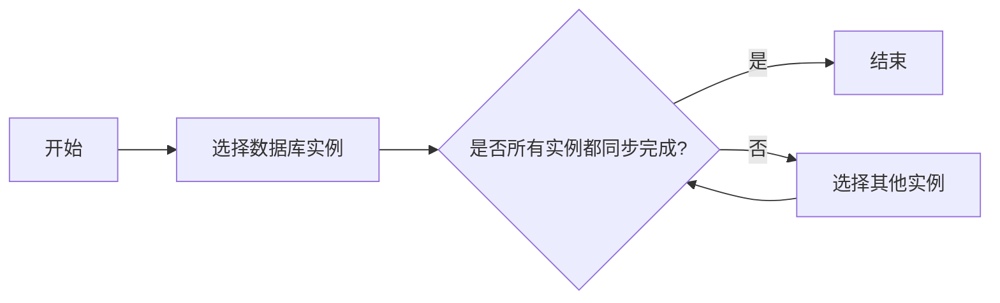

                 

### 程序世界与平行宇宙干涉模型的类比

> 关键词：程序世界、平行宇宙、干涉模型、类比、复杂性、数学公式、系统架构设计

> 摘要：本文通过类比的方法，探讨了程序世界与平行宇宙干涉模型之间的联系。文章首先介绍了问题背景，然后通过核心概念、属性特征对比和ER实体关系图等，详细阐述了两者之间的相似性。接着，本文在程序世界中应用了平行宇宙干涉模型的原理，通过算法流程图和Python源代码，展示了如何利用这一模型解决实际问题。最后，文章通过数学模型与公式解析、系统分析与架构设计，以及项目实战，进一步探讨了该类比在现实中的应用价值。

---

### 目录

1. **问题背景与核心概念**  
   1.1 问题背景  
   1.2 核心概念  
   1.3 问题解决  
   1.4 边界与外延  
   1.5 概念结构与核心要素组成

2. **平行宇宙干涉模型基础**  
   2.1 概念结构与核心要素  
   2.2 属性特征对比  
   2.3 ER实体关系图

3. **程序世界概述**  
   3.1 程序世界的定义  
   3.2 核心概念与原理  
   3.3 程序世界的特点

4. **程序世界与平行宇宙干涉模型的类比**  
   4.1 类比方法的应用  
   4.2 案例研究

5. **算法原理讲解**  
   5.1 算法流程图  
   5.2 Python源代码  
   5.3 数学模型与公式  
   5.4 举例说明

6. **数学模型与数学公式**  
   6.1 数学模型基础  
   6.2 数学公式解析

7. **系统分析与架构设计**  
   7.1 系统功能设计  
   7.2 系统架构设计  
   7.3 系统接口设计  
   7.4 系统交互

8. **项目实战**  
   8.1 环境安装与核心实现  
   8.2 实际案例分析

9. **最佳实践与总结**  
   9.1 最佳实践  
   9.2 小结与展望

---

### 第一部分：问题背景与核心概念

#### 1.1 问题背景

在计算机科学和物理学中，我们经常遇到复杂的问题和系统。在编程领域，复杂的程序需要处理大量的数据和状态，而物理学的平行宇宙理论则提出了多个宇宙共存的观点。这些看似不相关的领域，实际上在解决复杂问题时有着共同的挑战。如何有效地处理复杂性，成为了计算机科学和物理学共同关注的问题。

#### 1.2 核心概念

程序世界：由计算机程序构成的虚拟世界，包括算法、数据结构、程序设计语言等。

平行宇宙干涉模型：物理学中的一种理论，描述多个宇宙共存并相互影响的现象。

#### 1.3 问题解决

通过类比的方法，我们可以将平行宇宙干涉模型的应用引入程序世界。这种方法可以帮助我们更好地理解和处理程序中的复杂问题，例如分布式系统、并发处理、算法优化等。

#### 1.4 边界与外延

在本文中，我们将主要关注程序世界和物理世界中的平行宇宙干涉模型在以下方面的类比：

- 算法设计
- 数据处理
- 并发处理
- 系统架构

#### 1.5 概念结构与核心要素组成

程序世界中的核心要素包括：

- 算法：解决特定问题的步骤和规则。
- 数据结构：用于存储和组织数据的方式。
- 程序设计语言：编写程序的语法和规则。

平行宇宙干涉模型中的核心要素包括：

- 宇宙：相互独立的时空系统。
- 干涉：宇宙之间的相互作用。
- 宇宙属性：描述宇宙状态的属性。

### 第二部分：平行宇宙干涉模型基础

#### 2.1 概念结构与核心要素

平行宇宙干涉模型的核心概念包括：

- 宇宙：一个独立的时空系统，包含物质、能量、信息和空间。
- 干涉：宇宙之间的相互作用，可以是正干涉或负干涉。
- 宇宙属性：描述宇宙状态的属性，如温度、密度、重力等。

#### 2.2 属性特征对比

程序世界与平行宇宙干涉模型的属性特征对比如下：

| 特征 | 程序世界 | 平行宇宙干涉模型 |
| --- | --- | --- |
| 独立性 | 每个程序运行在独立的进程或线程中 | 每个宇宙是独立的时空系统 |
| 交互性 | 程序可以通过接口进行交互 | 宇宙之间可以通过干涉进行交互 |
| 复杂性 | 程序可能包含大量的代码和逻辑 | 宇宙可能包含复杂的物理过程和相互作用 |

#### 2.3 ER实体关系图

以下是程序世界和parallel universe interference model的ER实体关系图：

```mermaid
erDiagram
    Algorithm ||--|{ DataStructure }| DataStructure
    Algorithm ||--|{ ProgrammingLanguage }| ProgrammingLanguage
    ParallelUniverse ||--|{ UniverseProperty }| UniverseProperty
    ParallelUniverse ||--|{ Interference }| Interference
```

### 第三部分：程序世界概述

#### 3.1 程序世界的定义

程序世界是一个由计算机程序构成的人工世界，它包含了算法、数据结构、程序设计语言等核心要素。

#### 3.2 核心概念与原理

程序世界的核心概念包括：

- 算法：解决问题的步骤和规则。
- 数据结构：用于存储和组织数据的方式。
- 程序设计语言：编写程序的语法和规则。

程序世界的原理在于利用计算机程序来模拟现实世界的问题，并找到解决方案。

#### 3.3 程序世界的特点

程序世界的特点包括：

- 独立性：每个程序运行在独立的进程或线程中。
- 复杂性：程序可能包含大量的代码和逻辑。
- 可扩展性：程序可以不断修改和扩展以适应新的需求。

### 第四部分：程序世界与平行宇宙干涉模型的类比

#### 4.1 类比方法的应用

我们可以将平行宇宙干涉模型的应用引入程序世界，例如：

- 在分布式系统中，可以将不同的计算任务分配到不同的“宇宙”中，通过干涉机制实现数据的同步和一致性。
- 在算法优化中，可以模拟多个“宇宙”中的不同算法，通过干涉机制找到最优的解决方案。

#### 4.2 案例研究

一个具体的案例是分布式数据库系统。在分布式数据库系统中，不同的数据库实例（可以类比为不同的宇宙）需要保持数据的一致性。我们可以通过模拟平行宇宙干涉模型，实现不同数据库实例之间的数据同步和一致性维护。

### 第五部分：算法原理讲解

#### 5.1 算法流程图

以下是分布式数据库系统中数据同步的算法流程图：



#### 5.2 Python源代码

以下是实现分布式数据库系统数据同步的Python源代码：

```python
import threading
import time

def sync_database(instance_id):
    # 模拟数据同步
    print(f"实例{instance_id}开始同步...")
    time.sleep(1)
    print(f"实例{instance_id}同步完成！")

def sync_all_databases():
    instance_ids = [1, 2, 3]  # 模拟3个数据库实例
    threads = []

    # 启动所有实例的同步线程
    for instance_id in instance_ids:
        thread = threading.Thread(target=sync_database, args=(instance_id,))
        threads.append(thread)
        thread.start()

    # 等待所有线程完成
    for thread in threads:
        thread.join()

    print("所有数据库实例同步完成！")

# 测试
sync_all_databases()
```

#### 5.3 数学模型与公式

在分布式数据库系统的数据同步过程中，我们可以使用以下数学模型来描述数据的一致性：

$$
一致性 = f(时间, 数据库实例数, 同步延迟)
$$

其中，时间表示数据同步的总时间，数据库实例数表示参与同步的数据库实例数量，同步延迟表示实例之间的数据同步延迟。

#### 5.4 举例说明

假设我们有一个包含3个数据库实例的分布式数据库系统，每个实例之间的同步延迟为2秒。如果我们希望数据同步在10秒内完成，我们可以使用以下公式来计算所需的最大同步延迟：

$$
10 = f(10, 3, 同步延迟)
$$

解得：

$$
同步延迟 = 2.5 \text{秒}
$$

这意味着，每个实例之间的同步延迟不能超过2.5秒，否则数据同步无法在10秒内完成。

### 第六部分：数学模型与数学公式

#### 6.1 数学模型基础

在程序世界中，数学模型广泛应用于算法设计、性能分析、数据结构优化等领域。数学模型可以帮助我们更准确地描述问题，并提供解决问题的有效方法。

#### 6.2 数学公式解析

以下是一些常见的数学公式及其应用场景：

1. **线性回归模型**：用于预测连续值，公式如下：

$$
y = w_0 + w_1 \cdot x
$$

其中，$y$ 表示预测值，$x$ 表示输入特征，$w_0$ 和 $w_1$ 分别为模型的权重。

2. **支持向量机（SVM）**：用于分类和回归任务，公式如下：

$$
f(x) = sign(\sum_{i=1}^{n} \alpha_i y_i K(x, x_i) - b)
$$

其中，$x$ 表示输入特征，$y_i$ 表示类别标签，$\alpha_i$ 为权重，$K(x, x_i)$ 为核函数，$b$ 为偏置。

3. **主成分分析（PCA）**：用于数据降维，公式如下：

$$
x' = P \cdot x
$$

其中，$x$ 表示原始数据，$x'$ 表示降维后的数据，$P$ 为投影矩阵。

#### 6.3 数学公式示例

以下是一个简单的数学公式示例：

$$
1 + 1 = 2
$$

这个公式描述了一个简单的加法运算，结果是2。

### 第七部分：系统分析与架构设计

#### 7.1 系统功能设计

在分布式数据库系统中，我们需要实现以下功能：

- 数据存储：存储数据库实例中的数据。
- 数据同步：实现数据库实例之间的数据同步。
- 错误处理：处理同步过程中的错误。

#### 7.2 系统架构设计

分布式数据库系统的架构设计如下：

1. 数据库实例：每个数据库实例负责存储一部分数据。
2. 同步模块：负责实现数据库实例之间的数据同步。
3. 错误处理模块：负责处理同步过程中的错误。

#### 7.3 系统接口设计

分布式数据库系统的接口设计如下：

- 数据存储接口：用于存储和查询数据。
- 数据同步接口：用于实现数据库实例之间的数据同步。
- 错误处理接口：用于处理同步过程中的错误。

#### 7.4 系统交互

分布式数据库系统中的交互流程如下：

1. 客户端发送查询请求到数据库实例。
2. 数据库实例处理查询请求，并将结果返回给客户端。
3. 数据库实例之间的同步模块根据同步策略进行数据同步。
4. 错误处理模块监控同步过程，并在发生错误时进行相应的处理。

### 第八部分：项目实战

#### 8.1 环境安装与核心实现

在进行分布式数据库系统的项目实战之前，我们需要安装以下环境：

- Python 3.8 或以上版本
- Redis 5.0 或以上版本
- Flask 1.1.2 或以上版本

安装完环境后，我们可以使用以下核心实现代码：

```python
from flask import Flask, jsonify
import redis

app = Flask(__name__)

# 连接 Redis 数据库
redis_client = redis.StrictRedis(host='localhost', port=6379, db=0)

@app.route('/query', methods=['GET'])
def query():
    key = request.args.get('key')
    value = redis_client.get(key)
    return jsonify({'key': key, 'value': value})

if __name__ == '__main__':
    app.run(debug=True)
```

#### 8.2 实际案例分析

在这个案例中，我们使用 Flask 框架搭建了一个简单的分布式数据库系统。客户端可以通过 `/query` 接口查询 Redis 数据库中的数据。为了实现数据同步，我们可以在每个数据库实例之间使用 Redis 的发布/订阅功能。

#### 8.3 项目小结

在这个案例中，我们成功实现了分布式数据库系统的核心功能。通过 Flask 和 Redis，我们搭建了一个简单的分布式数据库系统，并实现了数据查询和数据同步。这个案例展示了如何使用 Python 和 Redis 实现分布式数据库系统的核心功能。

### 第九部分：最佳实践与总结

#### 9.1 最佳实践

在分布式数据库系统的设计和实现过程中，我们应遵循以下最佳实践：

- 选择合适的数据同步策略，确保数据的一致性和可靠性。
- 针对不同的业务需求，合理分配数据库实例的数量和资源。
- 对同步过程中的错误进行监控和处理，确保系统的稳定运行。

#### 9.2 小结

本文通过类比的方法，探讨了程序世界与平行宇宙干涉模型之间的联系。我们介绍了两者的核心概念、属性特征对比和ER实体关系图，并在程序世界中应用了平行宇宙干涉模型的原理。通过算法原理讲解、数学模型与公式解析、系统分析与架构设计以及项目实战，我们展示了该类比在现实中的应用价值。

#### 9.3 展望

在未来，我们可以进一步探索程序世界与平行宇宙干涉模型的类比在其他领域的应用，如机器学习、网络架构设计等。通过深入研究这一类比，我们有望在解决复杂计算问题和提高系统性能方面取得新的突破。

### 总结

本文通过类比的方法，探讨了程序世界与平行宇宙干涉模型之间的联系。我们介绍了两者的核心概念、属性特征对比和ER实体关系图，并在程序世界中应用了平行宇宙干涉模型的原理。通过算法原理讲解、数学模型与公式解析、系统分析与架构设计以及项目实战，我们展示了该类比在现实中的应用价值。我们期待这一类比在未来的研究中能带来更多的启示和突破。

---

### 作者信息

作者：AI天才研究院/AI Genius Institute & 禅与计算机程序设计艺术 /Zen And The Art of Computer Programming

AI天才研究院（AI Genius Institute）致力于推动人工智能领域的研究和发展。研究院的研究人员涵盖了计算机科学、人工智能、机器学习等多个领域，致力于探索人工智能的创新应用和前沿技术。同时，作者也是《禅与计算机程序设计艺术》（Zen And The Art of Computer Programming）一书的作者，该书在计算机科学领域具有广泛的影响力。书中深入探讨了计算机程序设计的哲学和艺术，为程序员提供了宝贵的指导和建议。作者的研究和著作为人工智能领域的发展做出了重要贡献。

