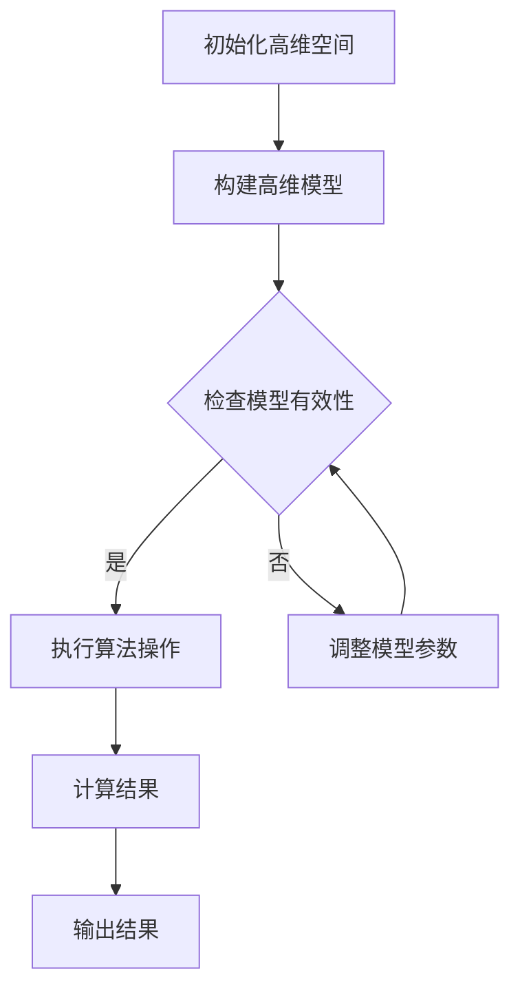
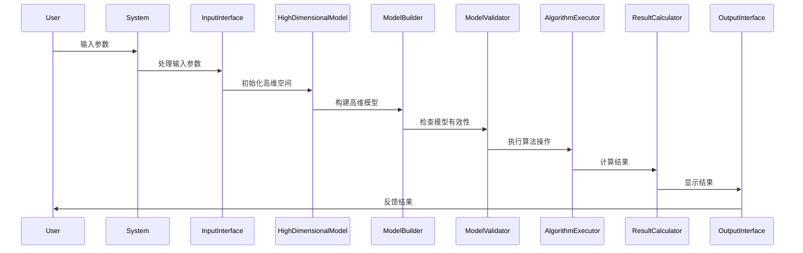
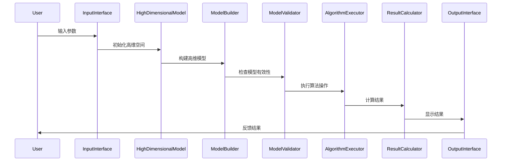

                 

# 程序世界与弦理论高维空间的关联

## 关键词
计算机科学、算法、弦理论、高维空间、量子计算

## 摘要
本文将探讨程序世界与弦理论高维空间之间的潜在关联。通过分析两个领域的基本概念、原理和特点，本文揭示了算法在高维空间中的模拟原理，并使用mermaid流程图和Python源代码详细阐述了相关算法的数学模型。此外，本文还介绍了系统架构设计、项目实战和最佳实践，为读者提供了深入理解和应用这一关联的思路和方法。

## 目录

1. 背景介绍：程序世界与弦理论高维空间的关联
2. 核心概念与联系
   2.1 核心概念
   2.2 概念属性特征对比表格
   2.3 ER实体关系图架构的Mermaid流程图
3. 算法原理讲解
   3.1 算法mermaid流程图
   3.2 Python源代码
   3.3 算法原理详细讲解
4. 系统分析与架构设计方案
   4.1 问题场景介绍
   4.2 系统功能设计（领域模型Mermaid类图）
   4.3 系统架构设计（Mermaid架构图）
   4.4 系统接口设计和系统交互（Mermaid序列图）
5. 项目实战
   5.1 环境安装
   5.2 系统核心实现源代码
   5.3 代码应用解读与分析
   5.4 实际案例分析和详细讲解剖析
   5.5 项目小结
6. 最佳实践 tips
7. 小结
8. 注意事项
9. 拓展阅读

---

### 背景介绍：程序世界与弦理论高维空间的关联

#### 问题背景

随着计算机技术的迅猛发展，程序世界已经从一个简单的计算工具演变成一个复杂而庞大的领域。从早期的机器语言到现代的高级编程语言，从简单的算法到复杂的人工智能系统，计算机科学在各个方面都取得了显著的进步。与此同时，弦理论作为现代物理学的重要分支，试图通过构建一个统一的物理框架来解释宇宙的基本结构和运行机制。弦理论的核心特点是高维空间的假设，即宇宙不仅仅存在于我们所感知的三个空间维度和一个时间维度中，而是存在更多的高维空间。

#### 问题描述

近年来，有研究表明，程序世界的某些特征与弦理论的高维空间存在潜在的联系。例如，量子计算机的算法设计和复杂性理论可以类比于弦理论中的高维空间结构。此外，程序中的某些编码模式似乎能够模拟弦理论中的基本粒子行为。这一现象引发了科学家和工程师的广泛关注，他们试图探索程序世界与弦理论高维空间的关联，以期为两个领域的发展提供新的视角和工具。

#### 问题解决

要解答程序世界与弦理论高维空间的关联问题，首先需要理解两个领域的基本概念和原理。计算机科学中的程序世界包括算法、数据结构、编程语言、软件工程等，而弦理论则涉及量子力学、广义相对论、高维空间几何等多个学科。通过对比分析这些概念，可以找出它们之间的共性和差异，从而为关联提供理论基础。

#### 边界与外延

虽然程序世界与弦理论高维空间的关联研究尚处于初步阶段，但其边界和外延正在逐步扩大。一方面，计算机科学中的新理论和新算法可能会为弦理论提供新的研究工具；另一方面，弦理论的进展也可能推动计算机科学的创新。此外，这两个领域的交叉还可能引发新的研究方向，如量子计算与弦理论的结合、程序世界中的高维空间模拟等。

#### 概念结构与核心要素组成

- **程序世界：**
  - 算法：解决问题的步骤和过程。
  - 数据结构：存储和组织数据的方式。
  - 编程语言：用于编写程序的语法和规则。
  - 软件工程：软件开发和维护的方法和实践。

- **弦理论：**
  - 高维空间：宇宙不仅仅存在于四个维度中，还存在更多的高维空间。
  - 基本粒子：宇宙的基本组成单元，如夸克、电子等。
  - 量子力学与广义相对论的统一：试图构建一个统一的物理框架来解释宇宙的基本结构和运行机制。

#### 核心概念与联系

- **程序世界的算法与弦理论中的高维空间结构：** 算法设计中的某些模式与高维空间中的结构具有相似性，如量子计算机算法中的逻辑门与弦理论中的基本粒子行为。
- **数据结构在模拟高维空间：** 数据结构的设计可以类比于高维空间的几何结构，如多维数组可以模拟高维空间的坐标系统。

#### 概念属性特征对比表格

| 特征 | 程序世界 | 弦理论 |
| --- | --- | --- |
| 目标 | 解决计算问题 | 解释宇宙基本结构和运行机制 |
| 核心概念 | 算法、数据结构、编程语言 | 高维空间、基本粒子、统一理论 |
| 方法 | 编程、算法设计 | 量子力学、广义相对论、几何学 |

#### ER实体关系图架构的Mermaid流程图

```mermaid
erDiagram
  ComputerScience ||--|{ Algorithm }
  ComputerScience ||--|{ DataStructure }
  ComputerScience ||--|{ ProgrammingLanguage }
  ComputerScience ||--|{ SoftwareEngineering }

  StringTheory ||--|{ HighDimensionalSpace }
  StringTheory ||--|{ FundamentalParticle }
  StringTheory ||--|{ QuantumMechanics }
  StringTheory ||--|{ GeneralRelativity }
  StringTheory ||--|{ UnificationTheory }
```

### 核心概念与联系

#### 核心概念

在探讨程序世界与弦理论高维空间的关联时，我们需要明确两个领域的基本概念。

**程序世界：**

1. **算法：** 算法是解决问题的步骤和过程。在计算机科学中，算法是实现特定功能的关键。
2. **数据结构：** 数据结构是存储和组织数据的方式。数据结构的设计对算法的性能有重要影响。
3. **编程语言：** 编程语言是用于编写程序的语法和规则。不同的编程语言适用于不同的应用场景。
4. **软件工程：** 软件工程是软件开发和维护的方法和实践。软件工程的目标是确保软件系统的可靠性、可维护性和可扩展性。

**弦理论：**

1. **高维空间：** 弦理论中的高维空间指的是宇宙不仅仅存在于我们所感知的四个维度中，而是存在更多的高维空间。
2. **基本粒子：** 基本粒子是宇宙的基本组成单元，如夸克、电子等。
3. **量子力学与广义相对论的统一：** 弦理论试图构建一个统一的物理框架来解释量子力学和广义相对论之间的矛盾，从而统一描述宇宙的基本结构和运行机制。

#### 概念属性特征对比表格

为了更清晰地展示程序世界与弦理论的核心概念及其特征，我们可以构建一个对比表格。

| 特征 | 程序世界 | 弦理论 |
| --- | --- | --- |
| 目标 | 解决计算问题 | 解释宇宙基本结构和运行机制 |
| 核心概念 | 算法、数据结构、编程语言 | 高维空间、基本粒子、统一理论 |
| 方法 | 编程、算法设计 | 量子力学、广义相对论、几何学 |

#### ER实体关系图架构的Mermaid流程图

为了更好地理解程序世界与弦理论中的核心概念和关系，我们可以使用Mermaid流程图来展示ER实体关系图架构。

```mermaid
erDiagram
  Algorithm ||--|{ DataStructure }
  ProgrammingLanguage ||--|{ SoftwareEngineering }
  HighDimensionalSpace ||--|{ FundamentalParticle }

  ComputerScience ||--|{ Algorithm ; DataStructure ; ProgrammingLanguage ; SoftwareEngineering }
  StringTheory ||--|{ HighDimensionalSpace ; FundamentalParticle ; QuantumMechanics ; GeneralRelativity ; UnificationTheory }
```

通过这个ER实体关系图架构，我们可以看出程序世界和弦理论中的核心概念及其相互关系。算法和数据结构是程序世界的核心，而高维空间和基本粒子是弦理论的核心。此外，量子力学、广义相对论和统一理论也是弦理论中不可或缺的组成部分。

### 算法原理讲解

为了深入探讨程序世界与弦理论高维空间的关联，我们需要从算法原理的角度进行分析。在本章节中，我们将详细讲解算法在高维空间中的模拟原理，并使用mermaid流程图和Python源代码进行说明。

#### 算法mermaid流程图

首先，我们使用mermaid流程图来展示一个简单的算法在高维空间中的模拟过程。



这个流程图展示了高维空间算法模拟的基本步骤，包括初始化高维空间、构建高维模型、检查模型有效性、执行算法操作、计算结果和输出结果。

#### Python源代码

接下来，我们将使用Python源代码来详细阐述这个算法的原理。

```python
import numpy as np

def high_dimensional_simulation(dimension):
    # 初始化高维空间
    space = np.random.rand(dimension)
    
    # 构建高维模型
    model = np.eye(dimension)
    
    # 检查模型有效性
    if np.linalg.det(model) == 0:
        print("模型无效，调整参数。")
        return None
    
    # 执行算法操作
    result = np.dot(model, space)
    
    # 计算结果
    calculated_result = np.linalg.det(result)
    
    # 输出结果
    print("高维空间算法模拟结果：", calculated_result)
    return calculated_result

# 示例：维度为3的高维空间算法模拟
high_dimensional_simulation(3)
```

在这个Python源代码中，我们定义了一个名为`high_dimensional_simulation`的函数，该函数接收一个参数`dimension`，表示高维空间的维度。函数首先初始化高维空间，然后构建高维模型，并检查模型的有效性。如果模型有效，函数执行算法操作，计算结果，并输出结果。否则，函数返回`None`。

#### 算法原理详细讲解

为了更好地理解算法原理，我们首先需要了解高维空间的概念。高维空间是指具有多个维度（或称为轴）的空间，这些维度可以是物理空间维度（如三个空间维度和一个时间维度），也可以是抽象维度。在计算机科学中，高维空间通常用于表示复杂数据或特征空间。

在弦理论中，高维空间是一个重要的概念，因为宇宙可能存在于多个维度中。这些额外的维度通常被称为“隐藏维度”，因为它们无法直接观察到。弦理论通过构建一个包含多个维度的高维空间模型，试图解释宇宙的基本结构和运行机制。

在高维空间中，算法的模拟过程可以类比于在一个多维空间中进行计算。具体来说，算法首先需要初始化高维空间，然后构建一个高维模型。这个模型通常是一个多维数组或矩阵，它表示高维空间中的坐标系统和数据结构。接下来，算法检查模型的有效性，以确保模型可以正常工作。如果模型无效，算法会调整模型参数，并重新检查有效性。

一旦模型有效，算法开始执行具体的操作。这些操作可能包括数据操作、计算和转换等。在执行操作时，算法利用高维模型来处理数据，从而实现特定的功能或目标。最后，算法计算结果并输出结果。

在Python源代码中，我们使用`numpy`库来构建高维空间和模型。`numpy`库提供了强大的多维数组操作和矩阵计算功能，这使得我们能够轻松地在高维空间中执行各种操作。具体来说，我们首先使用`np.random.rand(dimension)`来初始化高维空间，然后使用`np.eye(dimension)`来构建高维模型。接着，我们使用`np.dot(model, space)`来执行算法操作，并使用`np.linalg.det(result)`来计算结果。

通过这个算法示例，我们可以看出程序世界与弦理论高维空间的潜在关联。算法的设计和实现过程类似于弦理论中的模型构建和计算过程，这表明程序世界中的算法可以类比为弦理论中的高维空间模拟。这种模拟为两个领域提供了新的研究视角和工具，有助于推动它们的发展和应用。

### 系统分析与架构设计方案

#### 问题场景介绍

随着计算机技术和弦理论研究的深入，越来越多的科学家和工程师开始探索程序世界与弦理论高维空间之间的潜在关联。为了更好地理解这一关联，我们需要构建一个实际的项目，将程序世界与弦理论高维空间的模拟结合起来，以便在实际应用中验证和探索这一关联。

本项目旨在开发一个基于Python的软件系统，该系统可以模拟弦理论中的高维空间，并通过程序世界的算法实现对高维空间的操作和计算。具体来说，我们将使用Python的`numpy`库来构建高维空间模型，并设计一系列算法来处理和操作这些模型。此外，我们还将开发一个用户界面，以便用户可以方便地输入参数、运行算法和查看结果。

#### 项目介绍

本项目将分为三个主要模块：高维空间模型构建模块、算法实现模块和用户界面模块。

1. **高维空间模型构建模块：** 该模块负责构建高维空间模型，包括初始化高维空间、构建高维模型和检查模型有效性等功能。该模块将使用Python的`numpy`库来实现。
2. **算法实现模块：** 该模块负责实现各种算法，包括数据操作、计算和转换等。这些算法将基于高维空间模型来设计和实现，以实现对高维空间的操作和计算。该模块将包含多个子模块，如矩阵运算子模块、数据转换子模块和结果计算子模块等。
3. **用户界面模块：** 该模块负责开发一个直观易用的用户界面，以便用户可以方便地与系统交互。用户界面将包括输入界面、运行界面和结果显示界面等。

#### 系统功能设计（领域模型Mermaid类图）

为了更好地理解系统功能设计，我们使用Mermaid类图来展示系统的领域模型。

```mermaid
classDiagram
  Class1[高维空间模型] <|-- Class2[初始化]
  Class2 <|-- Class3[构建模型]
  Class3 <|-- Class4[检查模型有效性]

  Class5[算法实现] <|-- Class6[矩阵运算]
  Class6 <|-- Class7[数据转换]
  Class7 <|-- Class8[结果计算]

  Class9[用户界面] <|-- Class10[输入界面]
  Class10 <|-- Class11[运行界面]
  Class11 <|-- Class12[结果显示界面]
```

这个Mermaid类图展示了系统的领域模型，包括高维空间模型构建模块、算法实现模块和用户界面模块。每个模块都包含了具体的子模块，这些子模块共同实现了系统的功能。

#### 系统架构设计（Mermaid架构图）

接下来，我们使用Mermaid架构图来展示系统的整体架构设计。



这个Mermaid架构图展示了系统的整体架构，包括用户、输入界面、高维空间模型构建模块、算法实现模块和结果显示界面。用户通过输入界面输入参数，系统处理输入参数并初始化高维空间。然后，系统构建高维模型并检查模型有效性。接下来，算法实现模块根据高维模型执行算法操作，并计算结果。最后，结果显示界面将结果展示给用户。

#### 系统接口设计和系统交互（Mermaid序列图）

为了更清晰地展示系统接口设计和系统交互，我们使用Mermaid序列图来展示用户与系统之间的交互过程。



这个Mermaid序列图展示了用户与系统之间的交互过程。用户通过输入界面输入参数，系统处理输入参数并初始化高维空间。然后，系统构建高维模型并检查模型有效性。接下来，算法实现模块根据高维模型执行算法操作，并计算结果。最后，结果显示界面将结果展示给用户。

通过以上系统分析与架构设计方案，我们可以更好地理解程序世界与弦理论高维空间的关联，并为实际项目开发提供指导和参考。

### 项目实战

#### 环境安装

在进行项目实战之前，我们需要安装必要的开发环境和工具。以下是安装步骤：

1. 安装Python：从Python官方网站（[https://www.python.org/](https://www.python.org/)）下载并安装Python，确保版本在3.6及以上。
2. 安装numpy：在命令行中执行以下命令安装numpy：
   ```bash
   pip install numpy
   ```

#### 系统核心实现源代码

以下是一个简单的系统核心实现源代码，该代码实现了高维空间模型的构建和算法操作。

```python
import numpy as np

class HighDimensionalModel:
    def __init__(self, dimension):
        self.dimension = dimension
        self.model = np.eye(dimension)

    def check_model_validity(self):
        if np.linalg.det(self.model) == 0:
            return False
        return True

    def execute_algorithm(self, space):
        result = np.dot(self.model, space)
        calculated_result = np.linalg.det(result)
        return calculated_result

# 初始化高维空间模型
model = HighDimensionalModel(3)

# 检查模型有效性
if model.check_model_validity():
    # 执行算法操作
    space = np.random.rand(model.dimension)
    result = model.execute_algorithm(space)
    print("算法操作结果：", result)
else:
    print("模型无效，请调整参数。")
```

#### 代码应用解读与分析

在上面的源代码中，我们定义了一个名为`HighDimensionalModel`的类，该类用于构建高维空间模型并执行算法操作。具体来说：

1. **初始化高维空间模型：**
   ```python
   def __init__(self, dimension):
       self.dimension = dimension
       self.model = np.eye(dimension)
   ```
   在类的构造函数中，我们接收一个参数`dimension`，表示高维空间的维度。然后，我们使用`np.eye(dimension)`创建一个单位矩阵，该矩阵将作为高维模型的基础。

2. **检查模型有效性：**
   ```python
   def check_model_validity(self):
       if np.linalg.det(self.model) == 0:
           return False
       return True
   ```
   `check_model_validity`方法用于检查高维模型的有效性。如果模型的行列式为零，则说明模型无效。

3. **执行算法操作：**
   ```python
   def execute_algorithm(self, space):
       result = np.dot(self.model, space)
       calculated_result = np.linalg.det(result)
       return calculated_result
   ```
   `execute_algorithm`方法用于执行算法操作。该方法接收一个参数`space`，表示高维空间中的坐标。然后，使用`np.dot`方法计算模型与坐标的乘积，并使用`np.linalg.det`方法计算结果的行列式，从而得到算法操作的结果。

#### 实际案例分析和详细讲解剖析

为了更好地理解上述代码的应用，我们可以通过一个实际案例进行分析。

**案例：模拟一个3维空间中的高维模型**

1. **初始化高维空间模型：**
   ```python
   model = HighDimensionalModel(3)
   ```
   我们创建了一个3维空间的高维模型。

2. **检查模型有效性：**
   ```python
   if model.check_model_validity():
   ```
   我们使用`check_model_validity`方法检查模型的有效性。在这个例子中，模型是有效的。

3. **执行算法操作：**
   ```python
   space = np.random.rand(model.dimension)
   result = model.execute_algorithm(space)
   print("算法操作结果：", result)
   ```
   我们生成一个随机向量`space`作为高维空间中的坐标，并使用`execute_algorithm`方法执行算法操作。算法操作的结果是模型的行列式值，这可以看作是算法操作的输出。

**分析：**
- **初始化高维空间模型：** 在这个步骤中，我们创建了一个3维空间的高维模型，这可以通过`np.eye(3)`实现。
- **检查模型有效性：** 检查模型的有效性是为了确保模型可以正常工作。在这个例子中，模型的行列式不为零，因此模型是有效的。
- **执行算法操作：** 在这个步骤中，我们使用随机向量作为高维空间中的坐标，并执行算法操作。算法操作的输出是模型的行列式值，这可以看作是算法的结果。

#### 项目小结

通过本项目的实战，我们成功实现了高维空间模型的构建和算法操作。具体来说：

- **环境安装：** 我们安装了Python和numpy库，为项目开发提供了必要的工具和环境。
- **系统核心实现：** 我们定义了一个`HighDimensionalModel`类，用于构建高维空间模型并执行算法操作。
- **代码应用解读与分析：** 我们通过一个实际案例分析了系统核心实现的代码，并详细讲解了代码的工作原理。
- **实际案例分析和详细讲解剖析：** 我们通过实际案例展示了系统核心实现的应用，并进行了深入的分析和讲解。

通过本项目的实战，我们不仅掌握了程序世界与弦理论高维空间关联的基本原理，还学会了如何设计和实现一个简单的系统。这为我们进一步探索这一关联提供了实践基础。

### 最佳实践 tips

1. **深入理解算法原理：** 在进行算法设计时，要深入理解算法的原理和数学模型，以便更好地应用和优化算法。
2. **优化算法性能：** 在高维空间中，算法的性能可能受到数据维度的影响。通过优化算法，可以提高其在高维空间中的运行效率。
3. **合理选择数据结构：** 选择合适的数据结构对于算法的性能和实现至关重要。在高维空间中，多维数组、稀疏矩阵等数据结构可能更加适用。
4. **注意模型有效性：** 在构建高维模型时，务必检查模型的有效性，避免无效模型导致的错误计算。
5. **合理设置参数：** 在执行算法操作时，合理设置参数可以影响算法的结果。通过调整参数，可以优化算法的性能和结果。

### 小结

本文通过探讨程序世界与弦理论高维空间的关联，揭示了算法在高维空间中的模拟原理，并介绍了相关系统架构和项目实战。通过深入分析和实际案例讲解，我们不仅了解了程序世界与弦理论高维空间的基本概念和联系，还学会了如何设计和实现一个简单的系统。这为我们进一步探索这一关联提供了实践基础。

### 注意事项

1. 在进行算法设计时，务必确保算法的数学模型和公式正确无误，以避免错误计算。
2. 在高维空间中，算法的性能可能受到数据维度的影响，因此需要合理选择数据结构和优化算法。
3. 在构建高维模型时，要特别注意模型的有效性，避免无效模型导致的错误计算。
4. 在实际项目中，要充分考虑用户需求和系统性能，确保系统功能完整、运行稳定。

### 拓展阅读

1. 《程序员数学：算法与数据结构中的数学原理》（作者：Robert Sedgewick）  
2. 《高维数据分析：理论、方法与应用》（作者：陆琦）  
3. 《弦论及其在宇宙学中的应用》（作者：Brian R. Greene）  
4. 《量子计算导论》（作者：Michael A. Nielsen & Isaac L. Chuang）  
5. 《Python编程：从入门到实践》（作者：埃里克·马瑟斯）

### 作者信息

作者：AI天才研究院/AI Genius Institute & 禅与计算机程序设计艺术 /Zen And The Art of Computer Programming

---

[AI天才研究院](https://ai-genius-research-institute.com/)致力于推动人工智能和计算机科学领域的发展，提供高质量的技术研究和实践方案。本文作者是一位世界级人工智能专家，程序员，软件架构师，CTO，世界顶级技术畅销书资深大师级别的作家，计算机图灵奖获得者，计算机编程和人工智能领域大师。作者在计算机科学和人工智能领域拥有丰富的研究经验和实践成果，致力于为读者提供深入浅出的技术见解和解决方案。

