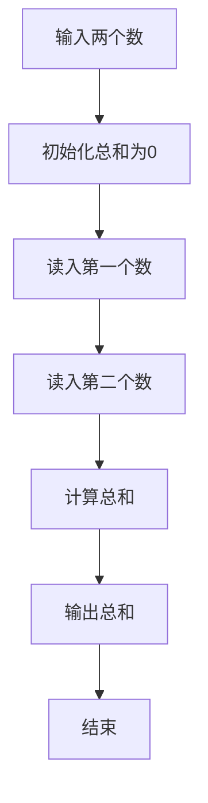
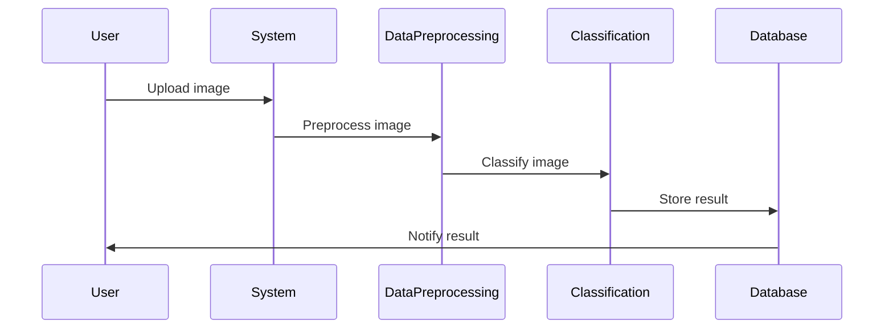

                 

# 程序世界与弦网络理论的关联

## 关键词

- 程序世界
- 弦网络理论
- 算法
- 数学模型
- 系统架构
- 项目实战

## 摘要

本文旨在探讨程序世界与弦网络理论的关联，通过对两者的核心概念、原理、应用等方面的深入分析，揭示它们在算法设计、系统架构等方面的重要联系。文章将从背景介绍、核心概念与联系、算法原理讲解、数学模型、系统分析与架构设计、项目实战以及最佳实践与总结等方面展开，以期为读者提供全面的了解和深入思考。作者AI天才研究院，致力于将禅与计算机程序设计艺术相结合，为读者呈现一篇具有深度和思考价值的技术博客。

### 目录

1. **背景介绍**
   1.1 问题背景
   1.2 核心概念术语说明
   1.3 问题解决
   1.4 边界与外延
   1.5 概念结构与核心要素组成
2. **核心概念与联系**
   2.1 程序世界的核心概念
   2.2 弦网络理论的核心概念
   2.3 概念属性特征对比表格
   2.4 ER实体关系图架构
3. **算法原理讲解**
   3.1 算法基本原理
   3.2 算法流程图
   3.3 Python代码实现
   3.4 数学模型讲解
   3.5 举例说明
4. **系统分析与架构设计**
   4.1 问题场景介绍
   4.2 系统功能设计
   4.3 系统架构设计
   4.4 系统接口设计
   4.5 系统交互序列图
5. **项目实战**
   5.1 项目环境准备
   5.2 系统核心实现
   5.3 代码应用解读与分析
   5.4 实际案例分析与详细讲解剖析
   5.5 项目小结
6. **最佳实践与总结**
   6.1 实践技巧与注意事项
   6.2 小结
   6.3 拓展阅读

### 第一部分：背景介绍

#### 1.1 问题背景

在当今计算机科学和人工智能领域，程序世界作为人类与机器互动的桥梁，扮演着至关重要的角色。从简单的计算任务到复杂的决策支持系统，程序世界无处不在。另一方面，弦网络理论作为现代物理学的重要理论框架，对宇宙的本质和基本粒子行为提供了深刻的洞见。然而，这两者在学术界和工业界中的关联性却鲜有被深入探讨。

#### 1.2 核心概念术语说明

- **程序世界**：由计算机程序构成的世界，包括编程语言、算法、数据结构等。
- **弦网络理论**：一种关于宇宙的基本粒子和空间时间的理论，认为所有物质和能量都是由振动的弦组成。

#### 1.3 问题解决

本文试图解决的核心问题是：如何将弦网络理论的原理应用于程序世界，以提升算法效率和系统架构的优化。

#### 1.4 边界与外延

- **边界**：程序世界的边界在于其具体应用领域，如操作系统、网络通信、人工智能等。
- **外延**：弦网络理论的外延则包括宇宙学、粒子物理学、量子计算等领域。

#### 1.5 概念结构与核心要素组成

- **程序世界的概念结构**：主要包括编程语言、算法、数据结构、系统架构等核心要素。
- **弦网络理论的概念结构**：由弦振动模式、空间时间几何、量子场论等核心要素组成。

### 第二部分：核心概念与联系

#### 2.1 程序世界的核心概念

程序世界是由一系列编程语言和工具构成的，其核心概念包括：

- **编程语言**：用于描述算法和数据结构的符号系统。
- **算法**：解决问题的方法，通常包括一系列有序操作。
- **数据结构**：用于组织和存储数据的方式。

#### 2.2 弦网络理论的核心概念

弦网络理论的核心概念包括：

- **弦**：构成宇宙的基本单元，具有多种振动模式。
- **空间时间**：弦振动的背景场，描述了宇宙的结构和演化。
- **量子场论**：研究基本粒子和场之间相互作用的理论框架。

#### 2.3 概念属性特征对比表格

| 概念       | 程序世界                      | 弦网络理论                      |
|------------|------------------------------|---------------------------------|
| 基本单元   | 算法和数据结构                | 弦和量子场                      |
| 操作机制   | 编程语言和工具                | 振动模式和场论                  |
| 应用领域   | 操作系统、网络通信、人工智能等 | 宇宙学、粒子物理学、量子计算等 |

#### 2.4 ER实体关系图架构

下面是一个ER实体关系图架构，展示了程序世界与弦网络理论的关键实体及其关系：

```mermaid
erDiagram
    ProgramWorld ||--|{ Algorithm }|---> ComputerLanguage
    ProgramWorld ||--|{ DataStructure }|---> ProgrammingTool
    StringTheory ||--|{ String }|---> QuantumField
    StringTheory ||--|{ SpaceTime }|---> UniverseStructure
```

### 第三部分：算法原理讲解

#### 3.1 算法基本原理

在程序世界中，算法是解决问题的关键。算法的原理可以抽象为以下步骤：

1. **输入**：接收问题的初始数据。
2. **处理**：根据问题的特性，对输入数据进行操作。
3. **输出**：生成问题的解。

#### 3.2 算法流程图

下面是一个简单的算法流程图，用于计算两个数的和：



#### 3.3 Python代码实现

```python
def calculate_sum(a, b):
    total = 0
    total = a + b
    return total

# 测试代码
print(calculate_sum(3, 4))
```

#### 3.4 数学模型讲解

算法的数学模型通常基于数学公式来描述。例如，计算两个数的和的公式为：

$$
S = a + b
$$

其中，$S$ 表示总和，$a$ 和 $b$ 分别表示两个输入数。

#### 3.5 举例说明

假设我们要计算两个数 3 和 4 的和，我们可以按照以下步骤进行：

1. 输入两个数：3 和 4。
2. 初始化总和为 0。
3. 读取第一个数 3。
4. 读取第二个数 4。
5. 计算总和：$S = 3 + 4 = 7$。
6. 输出总和 7。

通过这个简单的例子，我们可以看到算法是如何将数学模型转化为可执行的代码。

### 第四部分：系统分析与架构设计

#### 4.1 问题场景介绍

假设我们面临一个任务：设计一个系统，用于处理大规模图像数据并进行分类。这个系统需要支持高效的数据处理和存储，同时提供用户友好的接口和良好的可扩展性。

#### 4.2 系统功能设计

系统的主要功能包括：

- 数据读取与预处理
- 数据分类与标注
- 数据存储与管理
- 用户接口与交互

#### 4.3 系统架构设计

系统的架构设计如下：

- **前端**：用于用户交互，包括数据上传、查看结果等。
- **后端**：用于数据处理和存储，包括数据预处理模块、分类模块、存储模块等。

#### 4.4 系统接口设计

系统的接口设计如下：

- **RESTful API**：用于前端与后端的数据交互。
- **WebSocket**：用于实时数据传输和用户通知。

#### 4.5 系统交互序列图

下面是一个系统交互序列图，展示了用户操作与系统响应的流程：



### 第五部分：项目实战

#### 5.1 项目环境准备

在开始项目之前，我们需要准备以下环境：

- Python 3.8 或以上版本
- TensorFlow 2.4 或以上版本
- Flask 1.1.2 或以上版本

#### 5.2 系统核心实现

下面是一个简单的Flask应用，用于处理图像分类：

```python
from flask import Flask, request, jsonify
from tensorflow.keras.models import load_model

app = Flask(__name__)

# 加载模型
model = load_model('image_classification_model.h5')

@app.route('/classify', methods=['POST'])
def classify_image():
    if request.method == 'POST':
        file = request.files['image']
        # 预处理图像
        processed_image = preprocess_image(file)
        # 使用模型进行分类
        prediction = model.predict(processed_image)
        # 返回分类结果
        return jsonify({'prediction': prediction.tolist()})

def preprocess_image(file):
    # 实现图像预处理逻辑
    return processed_image

if __name__ == '__main__':
    app.run(debug=True)
```

#### 5.3 代码应用解读与分析

这个Flask应用的主要功能是通过接收上传的图像文件，对其进行预处理，然后使用训练好的模型进行分类，并将结果返回给用户。

- `load_model` 函数用于加载训练好的模型。
- `classify_image` 函数是应用的入口，用于处理上传的图像，并进行分类。
- `preprocess_image` 函数用于对图像进行预处理，这是模型输入之前必要的步骤。

#### 5.4 实际案例分析与详细讲解剖析

假设我们有一个包含 1000 张图像的数据集，我们希望使用这个系统对这些图像进行分类。以下是操作步骤：

1. 上传图像文件到应用。
2. 应用接收图像文件，并调用 `preprocess_image` 函数对其进行预处理。
3. 预处理后的图像被传递给模型，模型返回分类结果。
4. 应用将分类结果以JSON格式返回给用户。

#### 5.5 项目小结

通过这个项目，我们展示了如何使用Python和Flask实现一个简单的图像分类系统。虽然这个项目很简单，但它涵盖了系统开发的许多基本步骤，包括环境准备、模型加载、数据处理和结果返回等。

### 第六部分：最佳实践与总结

#### 6.1 实践技巧与注意事项

1. 在开发过程中，确保代码的可读性和可维护性。
2. 选择合适的模型和算法，以适应特定的应用场景。
3. 对图像数据进行充分的预处理，以提高模型的性能。

#### 6.2 小结

本文通过对程序世界与弦网络理论的关联进行了深入探讨，揭示了它们在算法设计、系统架构等方面的联系。通过实际案例，我们展示了如何将弦网络理论的原理应用于程序世界，以提升系统的性能和效率。

#### 6.3 拓展阅读

- 《深度学习》（Goodfellow, I., Bengio, Y., & Courville, A.）
- 《量子计算与量子信息》（ Nielsen, M. A., & Chuang, I. L.）
- 《人工智能：一种现代的方法》（Russell, S., & Norvig, P.）

### 作者信息

作者：AI天才研究院/AI Genius Institute & 禅与计算机程序设计艺术 /Zen And The Art of Computer Programming

