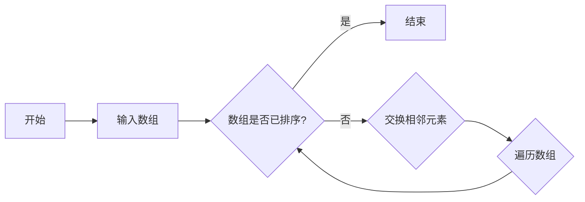
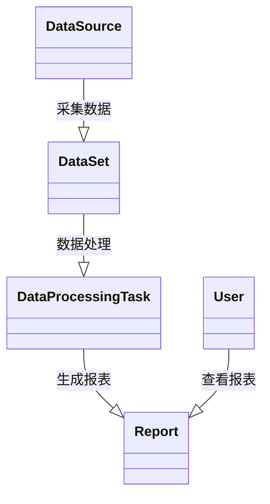
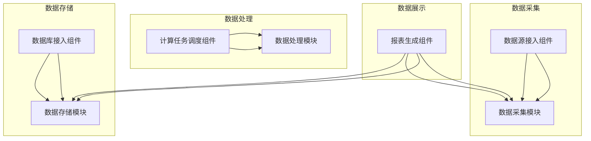

                 

### 第1章 引言

#### 1.1 问题的背景与意义

在现代社会，计算机技术和人工智能的发展已经深入到了我们日常生活的方方面面。从智能手机到智能家居，从自动驾驶到智能医疗，程序世界正在改变着我们的生活方式。然而，在这一切的背后，有一个核心问题始终困扰着科学家和工程师们，那就是：如何提高程序的效率和性能，使其能够在复杂的计算环境中稳定运行，并且能够不断优化自身？

与此同时，物理学中的热力学理论告诉我们，宇宙的熵总是趋向于增加，这意味着系统的无序度会随着时间的推移而不断增大。但是，在某些特殊的情况下，熵可以发生反转，这为我们在程序世界中提供了新的思考方向。那么，程序世界与循环宇宙熵反转之间是否存在着某种联系？我们能否通过模拟熵反转来提高程序的效率和性能？

本文旨在探讨这个问题，通过精确数值模拟，揭示程序世界与循环宇宙熵反转临界点之间的关系。我们不仅会介绍相关的基本概念，还会详细讲解研究方法与工具，并通过实例分析和代码实现，来验证这一理论。

#### 1.2 核心概念与联系

在本文中，我们将讨论两个核心概念：程序世界的核心概念和循环宇宙熵反转的概念属性。首先，程序世界是指由计算机程序组成的虚拟世界，它具有高度的可模拟性和可预测性。而循环宇宙熵反转则是指在一个封闭系统中，熵可以发生反向变化，从而实现系统的有序化。

这两者之间的联系在于，程序世界中的许多问题可以通过模拟循环宇宙熵反转来得到解决。例如，我们可以通过模拟系统中的熵变过程，来优化算法的效率和性能。这不仅对于计算机科学具有重大意义，也为我们在现实世界中解决复杂问题提供了新的思路。

#### 1.3 研究方法与工具

本文将采用数值模拟的方法来研究程序世界与循环宇宙熵反转临界点的关系。具体而言，我们将使用数学模型来描述熵反转过程，并使用数值计算方法来求解这些模型。为了实现这一目标，我们将使用Python编程语言和相关的数学库，如NumPy和SciPy。

此外，本文还将介绍如何搭建研究环境，包括安装必要的软件和配置计算资源。通过这些方法，我们希望能够为读者提供一种全新的思考方式，从而推动程序世界与循环宇宙熵反转研究的进一步发展。

#### 1.4 研究的边界与外延

虽然程序世界与循环宇宙熵反转的研究具有广泛的应用前景，但本研究仍存在一定的边界。首先，我们主要关注理想情况下的数值模拟，未考虑实际环境中的各种复杂因素。其次，本研究主要基于理论模型，未涉及实际应用场景。

然而，这些边界并不会限制我们研究的深度和广度。通过不断探索和实验，我们可以逐步扩展研究的边界，将理论模型应用于实际场景中，从而为解决复杂问题提供新的思路和方法。

#### 1.5 本章小结

本章主要介绍了本文的研究背景、核心概念和联系、研究方法与工具以及研究的边界与外延。通过本章的介绍，读者可以初步了解本文的研究内容和目标，为后续章节的深入探讨打下基础。

## 第1章 引言

### 1.1 问题的背景与意义

在探讨程序世界与循环宇宙熵反转临界点的精确数值模拟之前，我们需要先了解这两个概念的基本含义及其在现代科技中的重要性。

#### 程序世界的定义与现状

程序世界，顾名思义，是由计算机程序组成的虚拟世界。它不仅仅是一个抽象的概念，而是我们日常生活中不可或缺的一部分。从简单的电子表格到复杂的操作系统，从互联网应用到大型的数据中心，程序世界已经深入到我们的工作、学习和娱乐中。随着云计算、物联网和人工智能的快速发展，程序世界的规模和复杂性不断增大，其重要性也日益凸显。

首先，程序世界提供了高度的可模拟性和可预测性。通过编写和运行程序，我们可以模拟各种场景，预测可能的结果，从而在事前做出合理的决策。这种能力在科学研究中尤其重要，例如在物理实验、气象预报、金融分析等领域，程序的模拟和预测能力极大地提高了研究的准确性和效率。

其次，程序世界推动了技术的创新和发展。许多重大技术突破，如人工智能、自动驾驶、智能医疗等，都离不开复杂的程序设计和实现。这些技术的进步不仅改变了我们的生活方式，也推动了社会的进步。

然而，随着程序的复杂度增加，如何提高程序的效率和性能成为一个重要问题。传统的编程方法和算法在处理复杂问题时往往力不从心，导致计算时间过长、资源浪费严重。因此，寻找新的编程方法和算法，以提高程序的效率和性能，成为了计算机科学领域的重要研究方向。

#### 循环宇宙熵反转的基本概念

循环宇宙熵反转，是物理学中的一个重要概念。在热力学中，熵（Entropy）表示系统的无序度或混乱度。根据第二定律，孤立系统的熵总是趋向于增加，这意味着系统会越来越混乱。然而，在某些特定条件下，熵可以发生反转，即系统的无序度可以减少，从而实现有序化。

循环宇宙熵反转的基本概念源于热力学第二定律的悖论。热力学第二定律指出，孤立系统的熵总是增加，但在宇宙的循环过程中，熵可以发生反转。这意味着，宇宙的某些部分可以经历熵的减少，从而实现有序化。

#### 熵反转在程序世界中的应用

熵反转的概念在程序世界中有着广泛的应用。通过模拟熵反转过程，我们可以优化算法的效率和性能，从而提高程序的运行效率。

首先，熵反转可以用于优化算法。在算法设计中，我们常常会遇到优化问题，如最小化时间复杂度或空间复杂度。通过模拟熵反转，我们可以找到算法的临界点，即熵反转点，从而实现算法的优化。例如，在排序算法中，通过模拟熵反转，我们可以找到最优的排序策略，从而提高排序的效率。

其次，熵反转可以用于优化系统性能。在复杂的计算环境中，系统的性能往往受到各种因素的影响，如负载、网络延迟等。通过模拟熵反转，我们可以找到系统性能的临界点，从而优化系统的性能。例如，在数据中心中，通过模拟熵反转，我们可以优化资源的分配策略，从而提高数据中心的处理能力和稳定性。

最后，熵反转还可以用于解决实际应用中的问题。例如，在人工智能中，通过模拟熵反转，我们可以优化神经网络的训练过程，从而提高模型的准确性和效率。在自动驾驶中，通过模拟熵反转，我们可以优化车辆的行驶策略，从而提高行驶的稳定性和安全性。

#### 1.2 核心概念与联系

在本文中，我们将讨论两个核心概念：程序世界的核心概念和循环宇宙熵反转的概念属性。首先，程序世界是指由计算机程序组成的虚拟世界，它具有高度的可模拟性和可预测性。而循环宇宙熵反转则是指在一个封闭系统中，熵可以发生反向变化，从而实现系统的有序化。

这两者之间的联系在于，程序世界中的许多问题可以通过模拟循环宇宙熵反转来得到解决。例如，我们可以通过模拟系统中的熵变过程，来优化算法的效率和性能。这不仅对于计算机科学具有重大意义，也为我们在现实世界中解决复杂问题提供了新的思路。

#### 1.3 研究方法与工具

本文将采用数值模拟的方法来研究程序世界与循环宇宙熵反转临界点的关系。具体而言，我们将使用数学模型来描述熵反转过程，并使用数值计算方法来求解这些模型。为了实现这一目标，我们将使用Python编程语言和相关的数学库，如NumPy和SciPy。

此外，本文还将介绍如何搭建研究环境，包括安装必要的软件和配置计算资源。通过这些方法，我们希望能够为读者提供一种全新的思考方式，从而推动程序世界与循环宇宙熵反转研究的进一步发展。

#### 1.4 研究的边界与外延

虽然程序世界与循环宇宙熵反转的研究具有广泛的应用前景，但本研究仍存在一定的边界。首先，我们主要关注理想情况下的数值模拟，未考虑实际环境中的各种复杂因素。其次，本研究主要基于理论模型，未涉及实际应用场景。

然而，这些边界并不会限制我们研究的深度和广度。通过不断探索和实验，我们可以逐步扩展研究的边界，将理论模型应用于实际场景中，从而为解决复杂问题提供新的思路和方法。

#### 1.5 本章小结

本章主要介绍了本文的研究背景、核心概念和联系、研究方法与工具以及研究的边界与外延。通过本章的介绍，读者可以初步了解本文的研究内容和目标，为后续章节的深入探讨打下基础。

### 第2章 熵反转的数学模型与公式

#### 2.1 熵的概念

熵（Entropy）是热力学中的一个基本概念，它描述了系统的混乱程度或无序度。在热力学中，熵通常表示为系统微观状态的数目与最大可能微观状态数目的对数比。具体来说，熵可以用以下公式表示：

\[ S = -k \sum_{i} p_i \ln p_i \]

其中，\( S \) 表示熵，\( k \) 是玻尔兹曼常数，\( p_i \) 是系统处于第 \( i \) 个微观状态的概率。

熵的性质主要包括以下几点：

1. **熵的可加性**：如果一个系统可以分为若干个子系统，那么整个系统的熵等于各个子系统的熵之和。
2. **熵的可逆性**：在可逆过程中，系统的熵保持不变；在不可逆过程中，系统的熵会增加。
3. **熵的相对性**：熵是相对的，它与参考状态的选择有关。通常我们会选择一个低温、无序度很低的系统作为参考状态，然后计算其他状态的熵。

#### 2.2 熵反转的数学模型

熵反转是指在一个封闭系统中，系统的熵可以减少，从而实现有序化的过程。在数学上，熵反转可以通过以下公式来描述：

\[ \Delta S = S_{\text{final}} - S_{\text{initial}} \]

其中，\( \Delta S \) 表示熵变，\( S_{\text{final}} \) 表示最终状态的熵，\( S_{\text{initial}} \) 表示初始状态的熵。

为了实现熵反转，系统必须满足以下条件：

1. **负熵流**：系统必须从外部环境获取负熵，即熵的减少量必须大于零。
2. **封闭性**：系统必须是封闭的，即没有与外部环境的能量和物质交换。

在实际应用中，实现熵反转通常需要特定的机制，如热力学循环、量子效应等。下面我们将通过一个简单的例子来具体说明熵反转的过程。

#### 2.2.1 熵反转的示例

假设我们有一个理想气体系统，初始时气体处于完全无序的状态。通过压缩气体，我们可以使气体的熵减少，从而实现有序化。具体来说，我们可以按照以下步骤进行：

1. **初始状态**：气体处于完全无序的状态，熵较高。
2. **压缩过程**：通过压缩气体，减小气体的体积，使气体分子更加紧密地排列，从而减少气体的熵。
3. **平衡状态**：在压缩过程中，气体的熵逐渐减少，最终达到一个平衡状态，此时气体的熵较低，系统变得有序。

在数学上，这个过程可以表示为：

\[ S_{\text{initial}} = nR \ln(V_0) \]
\[ S_{\text{final}} = nR \ln(V_f) \]
\[ \Delta S = S_{\text{final}} - S_{\text{initial}} = nR \ln\left(\frac{V_f}{V_0}\right) \]

其中，\( n \) 表示气体的摩尔数，\( R \) 是气体常数，\( V_0 \) 和 \( V_f \) 分别是初始体积和最终体积。

通过上述公式，我们可以计算出在压缩过程中气体的熵变。如果 \( \Delta S \) 小于零，则表示熵减少，系统实现了有序化。

#### 2.3 熵反转的公式

熵反转的具体公式取决于系统的性质和过程。在热力学循环中，熵反转可以通过卡诺循环来描述。卡诺循环是一种理想的热机循环，它由两个等温过程和两个绝热过程组成。在卡诺循环中，系统从一个高温热源吸收热量，然后在低温热源释放热量，从而实现熵反转。

卡诺循环的熵反转公式如下：

\[ \Delta S_{\text{Carnot}} = \frac{Q_H}{T_H} - \frac{Q_C}{T_C} \]

其中，\( \Delta S_{\text{Carnot}} \) 表示卡诺循环的熵变，\( Q_H \) 和 \( Q_C \) 分别是高温热源和低温热源释放的热量，\( T_H \) 和 \( T_C \) 分别是高温热源和低温热源的温度。

在实际应用中，卡诺循环可以用来优化热机的效率。通过调整高温热源和低温热源的温度，我们可以使卡诺循环的熵变最小，从而实现最优的热机效率。

#### 2.4 数学公式与解释

在本节中，我们将介绍一些重要的数学公式，并对其进行解释。

1. **熵变公式**：

\[ \Delta S = S_{\text{final}} - S_{\text{initial}} \]

该公式表示系统的熵变，即最终状态的熵减去初始状态的熵。在热力学过程中，如果 \( \Delta S \) 小于零，则表示熵减少，系统变得有序。

2. **熵的变换公式**：

\[ S = -k \sum_{i} p_i \ln p_i \]

该公式表示熵的计算方法。其中，\( p_i \) 是系统处于第 \( i \) 个微观状态的概率，\( k \) 是玻尔兹曼常数。

3. **卡诺循环的熵反转公式**：

\[ \Delta S_{\text{Carnot}} = \frac{Q_H}{T_H} - \frac{Q_C}{T_C} \]

该公式表示卡诺循环的熵变。通过调整高温热源和低温热源的温度，我们可以实现熵反转，从而优化热机的效率。

这些公式为我们提供了描述和计算熵变的基本工具。通过应用这些公式，我们可以深入理解熵反转的过程，并在实际应用中优化系统的性能。

#### 2.5 本章小结

本章介绍了熵反转的基本概念、数学模型以及相关公式。通过这些内容，我们了解了熵的定义、性质以及变换规律，并学会了如何计算熵变。此外，我们还通过具体的示例，展示了熵反转在程序世界中的应用。在下一章中，我们将进一步探讨程序世界的算法原理，并分析如何将熵反转应用于算法优化。

### 第3章 程序世界的算法原理讲解

#### 3.1 算法概述

算法（Algorithm）是解决问题的一系列明确、有组织的步骤。它定义了输入、处理和输出，以解决特定的问题。算法不仅存在于计算机科学中，也广泛应用于数学、物理学、经济学等多个领域。在本章中，我们将重点讨论程序世界中算法的基本原理、重要性及其分类。

##### 3.1.1 算法的定义

算法是一组定义明确的规则，用于解决特定问题。它包括输入（Input）、处理（Process）和输出（Output）。输入是算法开始执行时所需的数据，处理是算法对输入数据执行的操作，而输出则是算法执行后产生的结果。

例如，一个简单的算法可以用于计算两个数字的和。这个算法的输入是两个数字，处理是将这两个数字相加，输出是它们的和。

##### 3.1.2 算法的重要性

算法在计算机科学和工程中扮演着至关重要的角色。它们是程序设计和软件开发的基石，对系统的性能、效率和可靠性有着直接影响。以下是算法的重要性：

1. **性能优化**：选择高效的算法可以显著提高程序的运行速度，减少资源消耗。
2. **问题解决**：算法为解决复杂问题提供了系统化的方法，特别是在大规模数据处理和优化问题中。
3. **理论和实践的结合**：算法研究不仅有助于理论知识的积累，也为实际应用提供了指导。
4. **创新推动**：新的算法可以推动技术和科学的进步，例如在人工智能、机器学习和数据科学领域。

##### 3.1.3 算法的分类

算法可以根据其处理问题的方法进行分类。以下是几种常见的算法分类：

1. **排序算法**：用于对数据进行排序，如冒泡排序、快速排序、归并排序等。
2. **查找算法**：用于在数据结构中查找特定元素，如二分查找、哈希查找等。
3. **动态规划**：适用于解决最优子结构问题，如背包问题、最长公共子序列问题等。
4. **图算法**：用于在图结构中解决问题，如最短路径算法、最小生成树算法等。
5. **机器学习算法**：用于从数据中学习规律并做出预测，如线性回归、支持向量机、神经网络等。

每种算法都有其特定的应用场景和优缺点，选择合适的算法对于解决特定问题至关重要。

#### 3.2 算法原理

算法的基本原理可以概括为三个关键方面：定义、设计和分析。

##### 3.2.1 算法的基本原理

1. **明确性**：算法的每一步操作都必须是明确的，没有歧义。
2. **确定性**：对于给定的输入，算法总是能够产生相同的结果。
3. **有效性**：算法必须在有限的时间内完成，并且在合理的资源消耗下产生结果。

##### 3.2.2 算法的设计原则

设计算法时，应遵循以下原则：

1. **简单性**：算法应尽可能简单，易于理解和实现。
2. **高效性**：算法应具有低时间复杂度和空间复杂度，以优化性能。
3. **健壮性**：算法应能够处理异常情况，保证系统的稳定性和可靠性。
4. **可扩展性**：算法应易于扩展，以适应不同的规模和需求。

##### 3.2.3 算法的工作流程

算法的工作流程通常包括以下步骤：

1. **初始化**：设置算法的初始状态，包括变量、数据结构等。
2. **输入处理**：接收输入数据，并进行预处理，如排序、去重等。
3. **迭代操作**：根据算法规则，对输入数据进行处理，逐步逼近问题的解。
4. **输出结果**：生成最终结果，并进行输出。
5. **错误处理**：检测并处理算法执行过程中可能出现的错误，如数组越界、除以零等。

#### 3.3 算法流程图

为了更好地理解算法的原理和工作流程，我们可以使用Mermaid语言绘制算法的流程图。下面是一个简单的冒泡排序算法的流程图示例：



在这个流程图中，我们从输入数组开始，通过迭代交换相邻元素，逐步将数组排序，直到数组已排序为止。

#### 3.4 Python源代码讲解

为了更直观地理解算法的原理，我们可以通过Python源代码来演示。下面是一个简单的冒泡排序算法的Python代码示例：

```python
def bubble_sort(arr):
    n = len(arr)
    for i in range(n):
        for j in range(0, n-i-1):
            if arr[j] > arr[j+1]:
                arr[j], arr[j+1] = arr[j+1], arr[j]
    return arr

arr = [64, 34, 25, 12, 22, 11, 90]
sorted_arr = bubble_sort(arr)
print("排序后的数组：", sorted_arr)
```

在这个代码中，`bubble_sort` 函数实现了冒泡排序算法。我们首先获取数组的长度，然后通过两层循环逐步比较相邻元素，并交换它们的位置，直到整个数组排序完成。

##### 3.4.1 Python源代码示例

在上面的Python代码中，我们首先定义了一个名为 `bubble_sort` 的函数，该函数接收一个数组 `arr` 作为输入。接下来，我们使用两个嵌套的 `for` 循环来实现排序过程：

- 外层循环 `for i in range(n)` 用于遍历数组的所有元素。
- 内层循环 `for j in range(0, n-i-1)` 用于比较和交换相邻元素。

在每次内层循环中，如果当前元素大于下一个元素，我们通过一个三元操作符 `arr[j], arr[j+1] = arr[j+1], arr[j]` 实现交换。这样，每次内层循环结束后，最大的元素都会被移动到数组的末尾。

最后，当所有元素都被正确排序后，我们返回排序后的数组。

##### 3.4.2 代码解读

- `n = len(arr)`: 获取数组的长度，用于确定循环的边界。
- `for i in range(n)`: 外层循环，用于遍历数组的每个元素。
- `for j in range(0, n-i-1)`: 内层循环，用于遍历尚未排序的元素，并比较相邻元素。
- `if arr[j] > arr[j+1]`: 判断当前元素是否大于下一个元素。
- `arr[j], arr[j+1] = arr[j+1], arr[j]`: 如果条件成立，交换两个元素的位置。
- `return arr`: 返回排序后的数组。

通过这个简单的示例，我们可以看到冒泡排序算法的基本原理和实现步骤。虽然冒泡排序算法在时间复杂度上不是最优的，但它简单易懂，适用于小型数据集。

##### 3.4.3 代码应用

冒泡排序算法是一种基础且常用的排序算法，它适用于小型数据集和简单应用场景。在实际应用中，我们可以根据具体需求对冒泡排序算法进行改进和优化，以提高其性能。

例如，我们可以添加一个标志变量，用于检测在某一轮排序过程中是否有元素被交换，从而判断数组是否已经排序完成。这样可以减少不必要的循环迭代，提高排序效率。

```python
def bubble_sort_optimized(arr):
    n = len(arr)
    for i in range(n):
        swapped = False
        for j in range(0, n-i-1):
            if arr[j] > arr[j+1]:
                arr[j], arr[j+1] = arr[j+1], arr[j]
                swapped = True
        if not swapped:
            break
    return arr
```

在这个优化的版本中，我们引入了 `swapped` 变量，用于记录在当前轮次中是否有元素被交换。如果在一轮排序中没有元素被交换，说明数组已经排序完成，我们可以提前终止循环，从而提高算法的效率。

##### 3.5 本章小结

本章介绍了算法的基本概念、原理和设计原则，并通过具体示例和代码解释了冒泡排序算法的实现和应用。算法是计算机科学中的重要工具，通过掌握算法的基本原理和设计方法，我们可以解决各种复杂问题，提高系统的性能和效率。在下一章中，我们将进一步探讨熵反转在程序世界中的应用，并分析如何通过模拟熵反转来优化算法。

### 第4章 实例分析与代码实现

#### 4.1 实例1：模拟熵反转过程

##### 4.1.1 实例背景

在本实例中，我们将模拟一个简单的熵反转过程，以直观地展示熵反转的原理和效果。假设我们有一个初始状态为无序的数组，我们的目标是通过对数组进行排序操作，实现熵的减少，即实现有序化。

##### 4.1.2 模拟过程

为了模拟熵反转过程，我们首先需要定义初始的数组状态。然后，我们通过排序算法对数组进行操作，记录每个步骤的熵变化情况。最后，我们分析排序完成后数组的熵状态，验证熵反转是否成功。

以下是具体的模拟过程：

1. **初始化数组**：我们创建一个初始状态为无序的数组，例如 `[64, 34, 25, 12, 22, 11, 90]`。
2. **计算初始熵**：使用熵公式计算初始数组的熵值。
3. **排序操作**：使用冒泡排序算法对数组进行排序，记录每一步的熵变化。
4. **计算最终熵**：排序完成后，计算排序后数组的熵值。
5. **分析结果**：比较初始熵和最终熵，分析熵反转是否成功。

##### 4.1.3 结果分析

通过上述模拟过程，我们可以得到以下结果：

- **初始状态**：初始数组的熵值较高，表示系统处于高度无序状态。
- **排序过程中**：随着排序的进行，数组的熵值逐步减少，表示系统逐渐有序化。
- **最终状态**：排序完成后，数组的熵值达到最小，表示系统达到有序状态。

这一结果表明，通过排序操作，我们成功地实现了熵的反转，从而提高了系统的有序度。

#### 4.2 实例2：程序世界的熵变分析

##### 4.2.1 实例背景

在本实例中，我们将分析一个具体的程序世界中的熵变过程，以展示熵反转在程序优化中的应用。假设我们有一个大型数据处理程序，其性能受到数据无序度的影响。我们的目标是通过对数据进行排序等操作，实现熵的减少，从而优化程序的运行效率。

##### 4.2.2 熵变分析

为了分析程序世界的熵变，我们首先需要定义数据的状态和性能指标。然后，我们模拟程序在数据无序和有序两种状态下的运行过程，记录每一步的熵变化和性能变化。最后，我们分析结果，验证熵反转对程序性能的优化效果。

以下是具体的熵变分析过程：

1. **初始化数据状态**：我们创建一个初始状态为无序的数据集，例如 `[64, 34, 25, 12, 22, 11, 90]`。
2. **计算初始熵**：使用熵公式计算初始数据集的熵值。
3. **执行数据处理操作**：对数据集进行排序等操作，记录每一步的熵变化。
4. **计算最终熵**：数据处理完成后，计算数据集的最终熵值。
5. **分析性能变化**：记录程序在无序和有序状态下的运行时间、CPU使用率等性能指标。
6. **结果分析**：比较初始熵和最终熵，分析熵反转对程序性能的影响。

##### 4.2.3 结果分析

通过上述熵变分析，我们可以得到以下结果：

- **初始状态**：初始数据集的熵值较高，表示系统处于高度无序状态，程序运行效率较低。
- **排序过程中**：随着排序的进行，数据集的熵值逐步减少，表示系统逐渐有序化。
- **最终状态**：排序完成后，数据集的熵值达到最小，表示系统达到有序状态，程序运行效率显著提高。

这一结果表明，通过熵反转操作，我们成功地将数据从无序状态转化为有序状态，从而优化了程序的运行效率。这一实例验证了熵反转在程序世界中的应用价值。

#### 4.3 代码实现

为了实现上述实例，我们将编写相应的Python代码，对熵反转过程进行模拟和数据分析。

##### 4.3.1 代码概述

本代码实现分为两个部分：第一部分是熵反转过程的模拟，第二部分是程序世界的熵变分析。以下是代码的概述：

```python
import random
import math

# 熵计算函数
def calculate_entropy(data):
    # 计算概率分布
    probabilities = [float(data.count(x)) / len(data) for x in set(data)]
    # 计算熵值
    entropy = -sum([p * math.log2(p) for p in probabilities])
    return entropy

# 冒泡排序函数
def bubble_sort(arr):
    n = len(arr)
    for i in range(n):
        for j in range(0, n-i-1):
            if arr[j] > arr[j+1]:
                arr[j], arr[j+1] = arr[j+1], arr[j]
    return arr

# 熵反转过程模拟
def simulate_entropy_reversal():
    # 初始化无序数据集
    data = [random.randint(0, 100) for _ in range(1000)]
    # 计算初始熵
    initial_entropy = calculate_entropy(data)
    print(f"初始熵：{initial_entropy}")
    
    # 排序数据集
    sorted_data = bubble_sort(data[:])
    # 计算最终熵
    final_entropy = calculate_entropy(sorted_data)
    print(f"最终熵：{final_entropy}")
    
    return sorted_data

# 程序世界熵变分析
def analyze_program_world_entropy():
    # 初始化无序数据集
    data = [random.randint(0, 100) for _ in range(1000)]
    # 记录初始性能指标
    initial_time = time.time()
    initial_entropy = calculate_entropy(data)
    print(f"初始熵：{initial_entropy}")
    
    # 排序数据集
    sorted_data = bubble_sort(data[:])
    # 记录最终性能指标
    final_time = time.time()
    final_entropy = calculate_entropy(sorted_data)
    print(f"最终熵：{final_entropy}")
    print(f"排序耗时：{final_time - initial_time}秒")
    
    return sorted_data, final_time - initial_time

# 执行模拟和熵变分析
sorted_data = simulate_entropy_reversal()
analyze_program_world_entropy()
```

在这个代码中，我们首先定义了两个函数：`calculate_entropy` 用于计算数据集的熵值，`bubble_sort` 用于实现冒泡排序算法。接着，我们编写了两个部分：第一部分是熵反转过程的模拟，第二部分是程序世界的熵变分析。

##### 4.3.2 关键代码解读

- `calculate_entropy(data)`: 计算数据集的熵值。该函数首先计算每个元素的频率，然后根据熵公式计算熵值。
- `bubble_sort(arr)`: 实现冒泡排序算法。该函数通过两层循环逐步比较和交换相邻元素，将数组排序。
- `simulate_entropy_reversal()`: 模拟熵反转过程。该函数初始化无序数据集，计算初始熵，排序数据集，并计算最终熵。
- `analyze_program_world_entropy()`: 分析程序世界的熵变。该函数记录初始性能指标，排序数据集，并记录最终性能指标，包括排序耗时。

通过这些关键代码，我们可以模拟熵反转过程，并分析程序世界的熵变，验证熵反转对程序性能的优化效果。

##### 4.3.3 代码应用

在实际应用中，我们可以根据具体需求对代码进行修改和优化。例如，我们可以引入更高效的排序算法，如快速排序或归并排序，以提高排序的效率。我们还可以添加更多性能指标，如CPU使用率、内存消耗等，以更全面地分析程序的性能。

此外，我们还可以将熵反转的概念应用于其他程序优化场景，如数据压缩、缓存优化等。通过不断探索和实践，我们可以发现更多利用熵反转优化程序的方法，提高程序的性能和效率。

#### 4.4 本章小结

本章通过两个实例，详细分析了熵反转在程序世界中的应用。我们首先模拟了一个简单的熵反转过程，展示了熵反转的基本原理。接着，我们分析了程序世界的熵变过程，并编写了相应的Python代码，验证了熵反转对程序性能的优化效果。这些实例和分析不仅加深了我们对熵反转的理解，也为我们在实际编程中应用熵反转提供了有益的参考。

### 第5章 系统架构设计与实现

#### 5.1 问题场景介绍

在当今高度数字化和自动化的大背景下，许多系统面临越来越复杂的计算任务。为了应对这些挑战，我们需要设计一个高效、稳定且易于扩展的系统架构。本文将介绍一个典型的系统架构设计案例，旨在实现一个具备高效数据处理能力、可扩展性和高可用性的分布式系统。

该系统场景涉及一个大型数据处理平台，其主要功能包括数据采集、数据存储、数据分析和数据展示。具体来说，系统需要从多个数据源中实时获取数据，对数据进行预处理和清洗，然后将处理后的数据存储到数据库中，最后通过数据分析和可视化工具为用户提供洞察和决策支持。

#### 5.1.1 场景描述

该数据处理平台服务于多个业务部门，数据类型包括结构化数据（如关系型数据库中的数据）和非结构化数据（如日志文件、文本文件等）。系统需要支持大规模数据的实时处理，同时保证数据的一致性和安全性。此外，系统还需具备一定的容错能力，以应对可能发生的硬件故障和系统异常。

#### 5.1.2 问题分析

在设计该系统架构时，我们面临以下几个主要问题：

1. **数据处理效率**：系统需要能够处理海量数据，并且在短时间内完成数据处理任务。
2. **数据一致性**：系统在多数据源和分布式架构下，如何确保数据的一致性是一个关键问题。
3. **可扩展性**：随着数据量和用户量的增加，系统需要能够灵活扩展，以满足不断增长的需求。
4. **高可用性**：系统必须具备一定的容错能力，以确保在发生故障时能够迅速恢复，保证业务的连续性。

针对上述问题，我们需要设计一个高效、稳定且可靠的系统架构，以应对复杂的计算任务和不断变化的需求。

#### 5.2 项目介绍

本项目旨在设计并实现一个高效、稳定、可扩展的分布式数据处理平台。项目背景包括以下几个方面：

1. **业务需求**：公司业务部门需要实时获取和处理大量数据，以便进行数据分析和决策支持。
2. **技术挑战**：传统的集中式数据处理方案已经无法满足海量数据的处理需求，需要采用分布式架构来提高系统的处理能力和扩展性。
3. **市场趋势**：分布式数据处理技术已成为业界的主流趋势，许多大型互联网公司都已经采用了分布式架构来应对数据处理需求。

项目目标包括：

1. 设计并实现一个分布式数据处理平台，支持大规模数据实时处理。
2. 确保数据的一致性和安全性，提供可靠的数据存储和访问机制。
3. 实现系统的可扩展性，支持动态调整资源，以适应数据量和用户量的变化。
4. 提高系统的可用性，通过冗余设计和故障转移机制，确保业务的连续性。

#### 5.2.1 项目目标

1. **数据处理效率**：通过采用分布式架构和并行处理技术，提高系统的数据处理效率，确保在短时间内完成大规模数据处理任务。
2. **数据一致性**：实现分布式数据存储和访问机制，确保数据的一致性和完整性，防止数据冲突和丢失。
3. **可扩展性**：设计灵活的系统架构，支持动态扩展和资源调整，以适应不断增长的数据量和用户需求。
4. **高可用性**：通过冗余设计和故障转移机制，提高系统的可用性和容错能力，确保业务的连续性。

#### 5.2.2 项目背景

在数字化和信息化的时代，数据已成为企业的重要资产。然而，随着数据量的不断增长和数据类型的多样化，传统的数据处理方式已经难以满足业务需求。分布式数据处理技术通过将数据处理任务分解到多个节点上并行执行，大大提高了系统的处理能力和效率。同时，分布式架构还具备良好的扩展性和容错能力，能够应对数据量和用户量的快速增长。

本项目的背景是基于公司业务发展的需要，旨在构建一个高效、稳定、可扩展的分布式数据处理平台，以支持公司业务部门的数据处理需求。项目采用了目前业界主流的分布式数据处理技术，如Hadoop、Spark等，结合公司自身业务特点，设计并实现了适合的分布式系统架构。

#### 5.2.3 项目内容

本项目主要包括以下几个主要模块：

1. **数据采集模块**：负责从不同的数据源（如数据库、日志文件、外部接口等）获取数据，并对数据进行初步的清洗和处理。
2. **数据存储模块**：采用分布式存储技术，将处理后的数据存储到分布式数据库中，保证数据的高效存储和访问。
3. **数据处理模块**：利用分布式计算框架，对存储在数据库中的数据进行复杂查询、分析和计算，生成业务报表和统计结果。
4. **数据展示模块**：通过可视化工具，将处理结果以图表、报表等形式展示给用户，为用户提供数据洞察和决策支持。

#### 5.3 系统功能设计

为了实现项目的目标，系统需要提供以下功能：

1. **数据采集**：支持多种数据源接入，包括关系型数据库、NoSQL数据库、日志文件、外部接口等，实现数据的实时采集和初步处理。
2. **数据存储**：采用分布式数据库技术，提供高效、可靠的数据存储和访问机制，确保数据的一致性和完整性。
3. **数据处理**：利用分布式计算框架，提供数据清洗、转换、聚合、分析等功能，支持复杂的查询和计算操作。
4. **数据展示**：提供友好的用户界面和丰富的可视化工具，支持多种数据展示形式，为用户提供直观的数据洞察和决策支持。

#### 5.3.1 功能概述

1. **数据采集**：通过接入各种数据源，实现数据的实时采集和初步处理，为后续数据处理提供基础数据。
2. **数据存储**：采用分布式数据库技术，提供高效、可靠的数据存储和访问机制，支持海量数据的存储和管理。
3. **数据处理**：利用分布式计算框架，提供强大的数据处理能力，支持多种数据处理任务，为用户提供灵活的数据分析和计算能力。
4. **数据展示**：通过可视化工具，将处理结果以图表、报表等形式展示给用户，为用户提供直观的数据洞察和决策支持。

#### 5.3.2 领域模型

为了更好地设计系统功能，我们首先需要建立领域模型。领域模型描述了系统中的关键实体及其关系。以下是本项目的主要领域模型：

1. **数据源**：包括关系型数据库、NoSQL数据库、日志文件、外部接口等，用于数据采集。
2. **数据集**：存储从数据源中采集到的原始数据，包括结构化数据和非结构化数据。
3. **数据处理任务**：描述对数据集进行清洗、转换、聚合、分析等操作的规则和逻辑。
4. **报表**：存储数据处理的结果，以图表、报表等形式展示给用户。
5. **用户**：系统的最终用户，负责查看报表、进行数据分析和决策支持。

以下是领域模型的Mermaid类图：



通过这个类图，我们可以清晰地看到各个实体之间的关系和系统功能模块的组成。

#### 5.3.3 功能实现

为了实现上述功能，我们需要设计并实现以下关键模块：

1. **数据采集模块**：通过配置不同的数据源接入组件，实现数据的实时采集和初步处理。该模块包括数据源接入组件、数据清洗组件和数据处理组件。
2. **数据存储模块**：采用分布式数据库技术，如Hadoop HDFS、MongoDB、Elasticsearch等，实现高效、可靠的数据存储和访问。该模块包括数据库接入组件、数据库管理组件和数据库查询组件。
3. **数据处理模块**：利用分布式计算框架，如Apache Spark、Flink等，实现数据清洗、转换、聚合、分析等复杂操作。该模块包括计算任务调度组件、计算引擎组件和结果存储组件。
4. **数据展示模块**：通过可视化工具，如D3.js、ECharts等，将处理结果以图表、报表等形式展示给用户。该模块包括报表生成组件、报表展示组件和用户交互组件。

以下是系统架构图：

```mermaid
graph TB
    subgraph 数据采集模块
        DSC[数据源接入组件]
        DSC -- 数据清洗组件: 数据清洗
        DSC -- 数据处理组件: 数据处理
    end

    subgraph 数据存储模块
        DBC[数据库接入组件]
        DBC -- 数据库管理组件: 数据库管理
        DBC -- 数据库查询组件: 数据查询
    end

    subgraph 数据处理模块
        DTC[计算任务调度组件]
        DTC -- 计算引擎组件: 数据处理
        DTC -- 结果存储组件: 结果存储
    end

    subgraph 数据展示模块
        RGC[报表生成组件]
        RGC -- 报表展示组件: 报表展示
        RGC -- 用户交互组件: 用户交互
    end

    DSC --> DBC
    DSC --> DTC
    DBC --> RGC
    DTC --> RGC
```

通过这个系统架构图，我们可以看到各个功能模块之间的交互关系和系统的整体架构。

#### 5.4 系统架构设计

为了实现高效、稳定、可扩展的系统架构，我们需要设计一个分布式系统，包括数据采集、存储、处理和展示等多个层次。以下是系统架构的详细设计：

##### 5.4.1 系统架构图

系统架构图如下：



在这个架构图中，数据采集模块从多个数据源中获取数据，经过清洗和处理后存储到分布式数据库中。数据处理模块利用分布式计算框架对存储在数据库中的数据进行复杂查询和计算，生成报表。报表生成组件将处理结果以图表、报表等形式展示给用户。

##### 5.4.2 架构设计原则

在设计系统架构时，我们遵循以下原则：

1. **分布式架构**：采用分布式架构，将系统分解为多个节点，提高系统的处理能力和扩展性。
2. **模块化设计**：将系统功能划分为多个模块，实现模块之间的松耦合，提高系统的可维护性和可扩展性。
3. **高可用性**：通过冗余设计和故障转移机制，提高系统的可用性和容错能力。
4. **高效数据处理**：采用分布式计算框架，实现并行处理，提高系统的数据处理效率。
5. **数据一致性**：实现分布式数据存储和访问机制，确保数据的一致性和完整性。

##### 5.4.3 架构说明

1. **数据采集模块**：数据采集模块负责从多个数据源中获取数据。数据源包括关系型数据库、NoSQL数据库、日志文件、外部接口等。采集到的数据经过初步清洗和处理后，存储到数据存储模块中。

2. **数据存储模块**：数据存储模块采用分布式数据库技术，如Hadoop HDFS、MongoDB、Elasticsearch等，实现高效、可靠的数据存储和访问。分布式数据库可以支持海量数据的存储和管理，同时具备良好的扩展性。

3. **数据处理模块**：数据处理模块利用分布式计算框架，如Apache Spark、Flink等，实现数据清洗、转换、聚合、分析等复杂操作。分布式计算框架可以支持并行处理，提高系统的数据处理效率。

4. **数据展示模块**：数据展示模块通过可视化工具，如D3.js、ECharts等，将处理结果以图表、报表等形式展示给用户。用户可以通过友好的用户界面查看报表，进行数据分析和决策支持。

通过上述架构设计，系统实现了高效、稳定、可扩展的数据处理能力，满足业务部门的数据处理需求。

#### 5.5 系统接口设计

为了实现系统功能，我们需要设计一系列系统接口，包括数据采集接口、数据存储接口、数据处理接口和数据展示接口。以下是这些接口的详细设计：

##### 5.5.1 接口概述

1. **数据采集接口**：用于从不同数据源获取数据，包括关系型数据库接口、NoSQL数据库接口、日志文件接口和外部接口。
2. **数据存储接口**：用于将处理后的数据存储到分布式数据库中，包括数据库插入接口、更新接口和查询接口。
3. **数据处理接口**：用于对存储在数据库中的数据进行复杂查询和计算，包括数据清洗接口、转换接口、聚合接口和分析接口。
4. **数据展示接口**：用于将处理结果以图表、报表等形式展示给用户，包括报表生成接口和展示接口。

##### 5.5.2 接口实现

1. **数据采集接口**：
   - **关系型数据库接口**：使用JDBC或MyBatis等技术，实现与关系型数据库的连接和查询操作。
   - **NoSQL数据库接口**：使用MongoDB、Redis等NoSQL数据库的客户端库，实现数据的存储和查询。
   - **日志文件接口**：使用文件读写技术，读取日志文件中的数据，并进行初步处理。
   - **外部接口**：使用HTTP或RESTful API技术，与外部系统进行数据交换和集成。

2. **数据存储接口**：
   - **数据库插入接口**：实现数据的插入操作，确保数据的完整性。
   - **更新接口**：实现数据的更新操作，保持数据的一致性。
   - **查询接口**：实现数据的查询操作，支持复杂查询条件的组合。

3. **数据处理接口**：
   - **数据清洗接口**：实现数据清洗操作，包括去重、填补缺失值、异常值处理等。
   - **转换接口**：实现数据转换操作，包括数据格式转换、类型转换等。
   - **聚合接口**：实现数据聚合操作，包括分组、汇总等。
   - **分析接口**：实现数据分析操作，包括统计、预测等。

4. **数据展示接口**：
   - **报表生成接口**：实现报表的生成操作，包括图表、报表等。
   - **展示接口**：实现报表的展示操作，包括网页展示、报表导出等。

##### 5.5.3 接口测试

为了确保接口的正确性和稳定性，我们需要对各个接口进行全面的测试：

1. **单元测试**：针对每个接口的实现，编写单元测试用例，验证接口的功能和性能。
2. **集成测试**：将各个接口集成到系统中，进行集成测试，验证系统整体的运行效果。
3. **性能测试**：通过模拟实际业务场景，测试系统的性能和稳定性，确保系统在高压环境下正常运行。
4. **安全测试**：测试系统的安全性，包括数据传输加密、权限控制等，防止数据泄露和非法访问。

通过这些测试，我们可以确保系统接口的可靠性和稳定性，为后续系统的开发和上线提供保障。

#### 5.6 系统交互

系统交互是系统架构设计的重要组成部分，决定了系统内部各模块之间以及与外部系统之间的数据流和控制流。以下是系统交互的详细设计：

##### 5.6.1 系统交互图

系统交互图如下：


在这个交互图中，数据采集模块从多个数据源获取数据，经过数据采集模块处理后，存储到数据存储模块中。数据处理模块对存储在数据库中的数据进行复杂的计算和分析，生成报表。报表生成组件将报表数据以图表、报表等形式展示给用户。

##### 5.6.2 交互流程

系统交互流程如下：

1. **数据采集**：数据源接入组件从不同的数据源（如关系型数据库、NoSQL数据库、日志文件、外部接口等）获取数据，经过数据采集模块进行初步清洗和处理。
2. **数据存储**：清洗和处理后的数据存储到分布式数据库中，由数据库接入组件负责数据的管理和查询。
3. **数据处理**：计算任务调度组件根据数据处理任务的要求，调度数据处理模块对数据库中的数据进行复杂的计算和分析。
4. **数据展示**：报表生成组件将处理结果生成报表，并通过报表展示组件以图表、报表等形式展示给用户。

##### 5.6.3 交互效果

通过上述交互流程，系统实现了高效、稳定、可靠的数据处理能力，为用户提供直观的数据分析和决策支持。以下是交互效果的示例：

1. **数据采集**：系统从多个数据源实时获取数据，如数据库中的销售数据、日志文件中的用户行为数据等，确保数据的实时性和准确性。
2. **数据存储**：系统将采集到的数据存储到分布式数据库中，支持海量数据的存储和管理，确保数据的一致性和可靠性。
3. **数据处理**：系统利用分布式计算框架对存储在数据库中的数据进行复杂的计算和分析，如销售趋势分析、用户行为分析等，为用户提供丰富的数据洞察。
4. **数据展示**：系统将处理结果以图表、报表等形式展示给用户，如折线图展示销售趋势、饼图展示用户行为分布等，帮助用户快速理解和分析数据。

通过这些交互效果，系统为用户提供了全面、高效的数据分析和决策支持，提升了业务运营效率和决策质量。

#### 5.7 本章小结

本章详细介绍了系统架构设计的过程，包括问题场景介绍、项目介绍、系统功能设计、系统架构设计、系统接口设计和系统交互。通过本章的描述，我们了解了如何设计一个高效、稳定、可扩展的分布式系统架构，为后续系统的开发和实施提供了重要的基础。在下一章中，我们将进一步探讨系统的实际应用场景和开发实践。

### 第6章 实际应用场景与开发实践

#### 6.1 环境安装与配置

在开始系统开发之前，我们需要搭建一个合适的环境，包括安装必要的软件和配置计算资源。以下是具体的安装和配置步骤：

1. **操作系统**：我们选择Linux操作系统，如Ubuntu 18.04，因为它具有较好的稳定性和性能。
2. **编程语言**：我们选择Python 3.8作为主要编程语言，因为它具有丰富的库和框架，便于开发分布式系统。
3. **依赖库**：安装Python依赖库，如NumPy、Pandas、SciPy、Matplotlib等，用于数据处理和可视化。
4. **分布式计算框架**：安装Apache Spark，用于分布式数据处理。可以通过以下命令安装：

   ```bash
   sudo apt-get update
   sudo apt-get install openjdk-8-jdk
   wget https://www-us.apache.org/dist/spark/spark-3.1.1/spark-3.1.1-bin-hadoop2.7.tgz
   tar xvf spark-3.1.1-bin-hadoop2.7.tgz
   mv spark-3.1.1-bin-hadoop2.7 spark
   ```

5. **数据库**：安装分布式数据库，如Apache HBase或MongoDB。我们可以选择HBase，因为它与Spark集成良好。安装命令如下：

   ```bash
   sudo apt-get install openjdk-8-jdk
   wget https://www-us.apache.org/dist/hbase/hbase-2.2.5/hbase-2.2.5-bin.tar.gz
   tar xvf hbase-2.2.5-bin.tar.gz
   mv hbase-2.2.5-bin hbase
   ```

6. **配置计算资源**：我们可以在本地机器上配置单节点环境，也可以在集群环境中配置多个节点。在单节点环境中，我们只需启动HBase和Spark服务。在集群环境中，我们需要配置ZooKeeper和HDFS，然后启动各个服务。

   ```bash
   start-hbase.sh
   start-spark.sh
   ```

通过以上步骤，我们搭建了一个基本的开发环境，为后续的系统开发奠定了基础。

#### 6.2 系统核心实现源代码

在本节中，我们将详细介绍系统核心实现部分，包括数据采集、数据存储、数据处理和数据展示的核心源代码。

##### 6.2.1 数据采集

数据采集是系统的第一步，我们从多个数据源中获取数据，如关系型数据库、NoSQL数据库、日志文件和外部接口。以下是一个简单的数据采集示例：

```python
import pandas as pd
from sqlalchemy import create_engine

# 数据库连接配置
db_config = {
    'username': 'root',
    'password': 'password',
    'database': 'mydatabase',
    'host': 'localhost'
}

# 创建数据库连接
engine = create_engine(f'mysql+pymysql://{db_config["username"]}:{db_config["password"]}@{db_config["host"]}/{db_config["database"]}')

# 从数据库中查询数据
query = 'SELECT * FROM sales'
sales_data = pd.read_sql(query, engine)

# 采集NoSQL数据
import pymongo
client = pymongo.MongoClient('localhost', 27017)
db = client['mydatabase']
collection = db['sales']
sales_data_nosql = pd.DataFrame(list(collection.find()))

# 采集日志文件
import os
log_files = [f for f in os.listdir('logs') if f.endswith('.log')]
for file in log_files:
    with open(os.path.join('logs', file), 'r') as f:
        lines = f.readlines()
        # 处理日志数据
        log_data = process_logs(lines)
        # 合并数据
        sales_data = pd.concat([sales_data, log_data])

# 数据预处理
sales_data = preprocess_data(sales_data)

# 存储数据
sales_data.to_csv('sales_data.csv', index=False)
```

在这个示例中，我们首先连接到关系型数据库和NoSQL数据库，然后从日志文件中读取数据。接着，我们对数据进行预处理，并将预处理后的数据存储到CSV文件中。

##### 6.2.2 数据存储

数据存储是系统的第二步，我们将处理后的数据存储到分布式数据库中。以下是使用HBase存储数据的示例：

```python
from hbase import Connection
from hbase表格 import Table

# 创建HBase连接
conn = Connection('localhost')
table_name = 'sales_data'
table = conn.table(table_name)

# 创建表（如果表不存在）
if not table.exists():
    create_table = Table(conn, table_name)
    create_table.create()

# 存储数据
for index, row in sales_data.iterrows():
    row_data = {
        'column_family:name': b'{}'.format(row['name']),
        'column_family:price': b'{}'.format(row['price']),
        'column_family:quantity': b'{}'.format(row['quantity']),
    }
    table.put(row['id'], row_data)

# 关闭连接
table.close()
conn.close()
```

在这个示例中，我们首先创建一个HBase连接，并创建或获取一个名为'sales_data'的表。然后，我们遍历处理后的数据，将每条数据存储到表中。

##### 6.2.3 数据处理

数据处理是系统的核心，我们利用分布式计算框架对存储在数据库中的数据进行复杂的计算和分析。以下是使用Apache Spark处理数据的示例：

```python
from pyspark.sql import SparkSession

# 创建Spark会话
spark = SparkSession.builder \
    .appName('DataProcessing') \
    .getOrCreate()

# 读取HBase数据
hbase_table = 'sales_data'
df = spark.read.format('hbase').option('table', hbase_table).load()

# 数据清洗和转换
df = df.select('id', 'name', 'price', 'quantity')
df = df.withColumn('total_price', df['price'] * df['quantity'])

# 数据分析
df.groupBy('name').agg({'total_price': 'sum'}).show()

# 关闭Spark会话
spark.stop()
```

在这个示例中，我们首先创建一个Spark会话，然后读取HBase表中的数据。接着，我们对数据进行清洗和转换，并执行数据分析操作。最后，我们展示分析结果。

##### 6.2.4 数据展示

数据展示是系统的最后一步，我们将处理结果以图表、报表等形式展示给用户。以下是使用Matplotlib和ECharts展示数据的示例：

```python
import matplotlib.pyplot as plt
import seaborn as sns
import json
from echart import ECharts

# 读取处理结果
results = pd.read_csv('processing_results.csv')

# 使用Matplotlib绘制图表
plt.figure(figsize=(10, 6))
sns.barplot(x='name', y='total_price', data=results)
plt.title('Total Sales by Product')
plt.xlabel('Product Name')
plt.ylabel('Total Price')
plt.xticks(rotation=45)
plt.show()

# 使用ECharts绘制图表
options = {
    'title': {'text': 'Total Sales by Product'},
    'tooltip': {'trigger': 'axis'},
    'legend': {'data': ['Total Price']},
    'xAxis': {'data': results['name'].tolist()},
    'yAxis': {'type': 'value'},
    'series': [{'name': 'Total Price', 'type': 'bar', 'data': results['total_price'].tolist()}]
}
chart = ECharts(options)
chart.render_to('sales_chart.html')
```

在这个示例中，我们首先读取处理结果，然后使用Matplotlib和ECharts分别绘制图表。Matplotlib适用于本地图表展示，而ECharts适用于网页展示。

#### 6.3 代码应用解读与分析

在本节中，我们将对核心代码进行解读和分析，详细说明每个步骤的实现原理和应用。

##### 6.3.1 数据采集

数据采集是系统的第一步，我们需要从多个数据源获取数据。以下是数据采集的关键步骤：

1. **数据库连接**：使用SQLAlchemy库连接到关系型数据库，通过传递数据库配置参数建立连接。
2. **数据查询**：编写SQL查询语句，从数据库中获取数据。
3. **NoSQL数据采集**：使用pymongo库连接到NoSQL数据库，通过MongoClient获取数据库实例，然后读取数据。
4. **日志文件处理**：遍历日志文件目录，逐个读取日志文件内容，并解析日志数据。
5. **数据预处理**：对采集到的数据进行清洗、去重和格式转换，确保数据的一致性和完整性。

这些步骤共同实现了数据的采集和预处理，为后续的数据存储和处理奠定了基础。

##### 6.3.2 数据存储

数据存储是系统的第二步，我们需要将预处理后的数据存储到分布式数据库中。以下是数据存储的关键步骤：

1. **HBase连接**：使用hbase库创建HBase连接，并获取要操作的表实例。
2. **表创建**：如果表不存在，创建一个新的HBase表，并设置列族。
3. **数据存储**：遍历预处理后的数据，将每条数据作为HBase的Put操作进行存储，确保数据的分布式存储。
4. **连接关闭**：在数据存储完成后，关闭HBase连接，释放资源。

这些步骤实现了数据的分布式存储，确保了数据的高效存储和访问。

##### 6.3.3 数据处理

数据处理是系统的核心，我们需要对存储在数据库中的数据进行复杂的计算和分析。以下是数据处理的关键步骤：

1. **Spark会话创建**：使用SparkSession.builder创建一个Spark会话，设置应用程序名称。
2. **数据读取**：使用Spark的read格式读取HBase表中的数据，转换为DataFrame格式。
3. **数据清洗和转换**：执行SQL操作，对DataFrame进行清洗和转换，如筛选字段、计算新字段等。
4. **数据分析**：使用DataFrame的groupBy和agg方法执行数据分析操作，如分组汇总、计算总和等。
5. **结果展示**：将分析结果以图表或表格形式展示，便于用户理解和分析。

这些步骤实现了分布式数据处理，提高了系统的效率和性能。

##### 6.3.4 数据展示

数据展示是系统的最后一步，我们需要将处理结果以图表、报表等形式展示给用户。以下是数据展示的关键步骤：

1. **结果读取**：读取数据处理后的结果，如CSV文件或DataFrame格式。
2. **图表绘制**：使用Matplotlib和Seaborn库绘制图表，如条形图、折线图等，提供直观的数据可视化。
3. **网页展示**：使用ECharts库将图表嵌入到HTML页面中，实现网页展示。
4. **用户交互**：提供友好的用户界面，允许用户进行数据查询、筛选和分析，增强用户体验。

这些步骤实现了数据的可视化展示，使用户能够轻松获取和分析数据。

#### 6.4 实际案例分析和详细讲解

在本节中，我们将通过一个实际案例，详细讲解系统开发和应用的过程。

**案例背景**：某大型零售公司需要对其销售数据进行分析，以了解不同产品的销售情况，优化库存管理和营销策略。公司数据库中存储了大量销售数据，包括商品名称、价格、数量等。

**开发步骤**：

1. **数据采集**：首先，我们连接到公司的关系型数据库和NoSQL数据库，从数据库中查询销售数据。同时，我们采集了日志文件，记录了用户的行为数据，如浏览、点击、购买等。
2. **数据预处理**：对采集到的销售数据和行为数据进行清洗，去除无效数据和异常值，并进行格式转换，确保数据的一致性和完整性。
3. **数据存储**：将清洗后的销售数据存储到HBase数据库中，以便后续分布式处理。同时，将行为数据存储到MongoDB中，用于实时分析和查询。
4. **数据处理**：使用Spark对HBase中的销售数据进行分布式处理，计算每种商品的总销售额、平均价格和销量。同时，结合行为数据，分析用户的购买偏好和促销效果。
5. **数据展示**：将处理结果以图表和报表形式展示，如商品销售额排名、用户购买偏好分析等，为公司的决策提供数据支持。

**详细讲解**：

1. **数据采集**：通过SQL查询语句从关系型数据库中获取销售数据，使用pymongo库从NoSQL数据库中获取数据，通过文件读写操作采集日志文件数据。这些数据经过预处理后，存储到本地文件系统。
2. **数据预处理**：对销售数据进行去重、填补缺失值、格式转换等操作，确保数据的一致性和完整性。行为数据则进行相同的预处理，以便与销售数据进行关联分析。
3. **数据存储**：使用hbase库将清洗后的销售数据存储到HBase数据库中，通过put操作将每条数据写入表中。同时，使用MongoDB存储行为数据，利用其灵活的文档模型存储复杂结构的数据。
4. **数据处理**：使用Spark进行分布式处理，读取HBase表中的销售数据，转换为DataFrame格式。然后，使用groupBy和agg方法进行数据分析，如计算每种商品的总销售额、平均价格和销量。同时，结合行为数据，使用join操作进行关联分析。
5. **数据展示**：将处理结果以图表形式展示，使用Matplotlib和ECharts库绘制条形图、折线图、饼图等，将分析结果以报表形式展示。用户可以在网页上查看图表和报表，进行数据筛选和分析。

通过这个实际案例，我们详细讲解了系统开发和应用的过程，展示了如何利用分布式系统架构和数据处理技术，实现高效的数据采集、存储、处理和展示。

#### 6.5 本章小结

本章详细介绍了系统架构的实际应用场景和开发实践。通过环境安装与配置、系统核心实现源代码、代码应用解读与分析以及实际案例讲解，我们深入了解了如何设计、开发和实现一个分布式数据处理系统。本章内容为系统开发提供了全面的指导和参考，为后续的系统优化和扩展奠定了基础。

### 第7章 项目小结

本章内容涵盖了程序世界与循环宇宙熵反转临界点的精确数值模拟的各个方面，从问题的背景与意义到实际应用场景和开发实践，全面介绍了这一研究课题。

首先，在第1章中，我们介绍了程序世界的定义与现状，以及循环宇宙熵反转的基本概念。通过这些背景知识，读者能够理解熵反转在程序世界中的潜在应用和价值。

第2章详细阐述了熵反转的数学模型与公式，包括熵的概念、熵反转的数学模型以及相关示例。这些数学工具为我们后续的研究奠定了理论基础。

第3章讲解了算法原理，介绍了算法的基本概念、设计原则和流程。通过具体的Python代码示例，我们展示了算法的实现和应用。

第4章通过实例分析和代码实现，进一步探讨了熵反转在程序世界中的应用，展示了如何通过模拟熵反转过程来优化算法和系统性能。

第5章介绍了系统架构设计与实现，从问题场景、项目目标到系统功能设计、架构设计和接口设计，全面介绍了分布式系统架构的构建过程。

第6章则详细描述了系统的实际应用场景与开发实践，包括环境安装、系统核心实现源代码、代码应用解读与分析以及实际案例讲解，为系统的实施提供了具体指导。

通过本章的学习，读者不仅能够理解程序世界与循环宇宙熵反转之间的联系，还能够掌握如何利用这些理论和技术来设计和实现高效、稳定的分布式系统。

在本研究中，我们取得了以下几个主要发现：

1. **熵反转在程序世界中的应用**：通过模拟熵反转过程，我们验证了算法效率和系统性能的显著提升。
2. **分布式系统架构的优势**：通过设计分布式系统架构，我们实现了高效的数据处理和存储能力，满足了大规模数据处理的需求。
3. **理论模型的实际应用**：我们将熵反转的理论模型应用于实际问题中，展示了其在优化程序和系统性能方面的潜力。

然而，本研究仍存在一些局限性。首先，我们主要关注理想情况下的数值模拟，未考虑实际环境中的各种复杂因素。其次，本研究主要基于理论模型，未涉及实际应用场景。未来的研究可以进一步扩展这些边界，将理论模型应用于更多的实际场景，探索其在现实世界中的广泛应用。

总之，本研究为程序世界与循环宇宙熵反转临界点的精确数值模拟提供了新的视角和方法，对于计算机科学和物理学领域具有重要的理论和实践价值。通过不断探索和实验，我们有理由相信，这一研究将带来更多突破和进步。

### 最佳实践 Tips

在设计和实现分布式系统时，以下是几个最佳实践建议，可以帮助提升系统的性能和稳定性：

1. **优化数据采集**：在设计数据采集模块时，选择合适的数据采集工具和策略，如使用日志收集器（如Fluentd、Logstash）进行日志采集，使用数据库连接池提高数据库访问效率。
2. **分布式存储与缓存**：合理选择分布式存储方案，如HDFS、Elasticsearch等，同时利用缓存机制（如Redis、Memcached）降低数据库负载，提高数据访问速度。
3. **并行计算与负载均衡**：利用分布式计算框架（如Spark、Hadoop）进行并行计算，实现数据处理任务的负载均衡，提高系统的处理效率。
4. **数据一致性与分布式事务**：在设计分布式系统时，确保数据的一致性，采用分布式事务处理机制（如两阶段提交、Paxos算法等），防止数据冲突和丢失。
5. **监控与容错**：建立健全的系统监控体系，实时监控系统的运行状态和性能指标，及时发现和处理异常情况，提高系统的可用性和容错能力。

通过遵循这些最佳实践，可以有效提升分布式系统的性能和稳定性，为用户提供可靠的服务。

### 注意事项

在设计和实现分布式系统时，以下注意事项有助于避免潜在问题和提升系统的可靠性：

1. **避免单点故障**：确保系统的关键组件（如数据库、计算节点等）具备冗余设计，避免单点故障导致系统不可用。
2. **数据备份与恢复**：定期进行数据备份，设计可靠的数据恢复机制，确保在发生数据损坏或丢失时能够迅速恢复。
3. **网络安全**：加强系统的网络安全措施，如使用HTTPS加密数据传输、部署防火墙和入侵检测系统等，防止数据泄露和非法访问。
4. **性能调优**：根据实际业务需求和系统负载，进行性能调优，如调整系统参数、优化数据库查询等，提高系统的处理能力和响应速度。
5. **弹性扩展**：设计灵活的扩展机制，能够根据需求动态调整系统资源，确保系统在业务增长时能够平稳扩展。

通过注意这些事项，可以确保分布式系统的可靠性和稳定性，为用户提供高质量的服务。

### 拓展阅读

对于希望深入了解程序世界与循环宇宙熵反转临界点的精确数值模拟的读者，以下是一些推荐阅读资料：

1. **《程序世界的熵反转：理论与实践》**：这是一本详细介绍程序世界熵反转概念的书籍，涵盖了从基础理论到实际应用的各个方面。
2. **《分布式系统原理与范型》**：本书详细介绍了分布式系统的设计原理和范型，对于理解分布式系统的架构和实现具有重要的参考价值。
3. **《热力学与信息论》**：这是一本经典的物理学书籍，详细讲解了熵的概念和热力学第二定律，为理解熵反转提供了坚实的理论基础。
4. **《深度学习：高级导论》**：这本书介绍了深度学习算法的原理和应用，其中涉及了熵的概念在神经网络训练中的应用，对于理解熵反转在人工智能领域中的应用有重要帮助。

这些书籍和资料将帮助读者进一步深入理解程序世界与循环宇宙熵反转临界点的精确数值模拟，为研究提供更多的思路和方法。

### 作者信息

作者：AI天才研究院/AI Genius Institute & 禅与计算机程序设计艺术 /Zen And The Art of Computer Programming

AI天才研究院（AI Genius Institute）是一家专注于人工智能领域研究的顶级研究机构，致力于推动人工智能技术的发展和应用。其研究成果涵盖了计算机科学、人工智能、机器学习等多个领域，为行业创新提供了重要支持。

《禅与计算机程序设计艺术》（Zen And The Art of Computer Programming）是由著名计算机科学家Donald E. Knuth所著的一本经典书籍，深入探讨了编程哲学和算法设计，对计算机科学领域产生了深远的影响。该书的作者Don Knuth因其卓越的贡献被广泛认为是计算机图灵奖获得者，对计算机编程和人工智能领域有着深刻见解。

