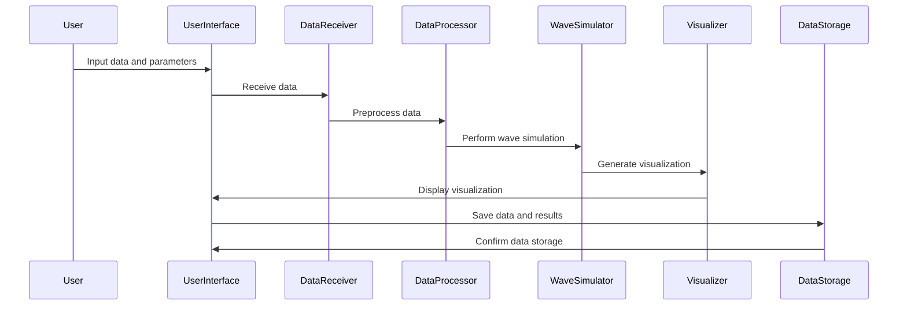

                 

### 第一部分：引论

## 第1章：背景与引论

### 1.1 问题背景

在当今的信息时代，计算机科学和物理学都取得了令人瞩目的进展。然而，这两个领域之间的交集和统一似乎仍然是一个未被充分探索的领域。随着计算能力的不断增强和数据规模的爆炸性增长，科学家和工程师们越来越意识到，通过将程序世界的数学原理与物理世界的现象相结合，可以揭示出更深层次的物理规律，并在计算机科学中实现更高效、更精确的计算方法。

这一需求背后的动机源自多个方面。首先，物理世界的复杂现象往往可以通过数学模型来描述，而这些模型可以转化为算法和计算机程序。例如，流体动力学和量子力学中的方程式可以被数值化，从而在计算机上求解。其次，计算机科学的进步也推动了物理实验方法的革新，如通过模拟实验来验证理论或进行无法在实验室中实现的实验。此外，随着人工智能和机器学习技术的发展，我们能够从大量数据中提取规律，这进一步促使我们寻找将数学、计算机科学和物理学有机结合的方法。

### 1.2 问题描述

尽管数学在程序世界和物理世界中都起着核心作用，但它们之间的统一仍然面临许多挑战。首先，程序世界中的数学通常关注离散结构和算法，而物理世界中的数学则侧重连续性和微分方程。这两者之间的差异使得将物理现象转化为计算机程序时存在困难。其次，物理世界的复杂性往往需要高度复杂的数学工具和算法来描述，这使得理解和应用这些工具成为了一项艰巨的任务。

此外，还存在一个深层次的问题，即我们如何确保计算机模拟的准确性和可靠性？在许多情况下，计算机模拟只是物理现象的近似，而不是精确的复制。这意味着我们需要对模型和算法进行严格的评估，以确保它们能够真实地反映物理现实。

### 1.3 解决方案概述

为了解决上述问题，我们需要从多个角度来探索程序世界与物理世界的数学统一。首先，我们可以通过发展新的数学理论和工具来弥合离散与连续之间的差距。例如，拓扑学和复分析等高级数学领域的研究可以提供新的视角，帮助我们更好地理解物理现象。

其次，我们需要开发更高效的算法和计算机模拟技术。这包括改进现有的算法，如蒙特卡罗方法和有限元分析，以及开发全新的算法来处理复杂的物理问题。此外，我们还需要考虑计算机硬件的发展，如量子计算和高效并行计算，这些技术有望大幅提高计算能力，使我们能够处理更复杂的物理问题。

最后，跨学科的合作也是解决这一问题的关键。计算机科学家、物理学家和数学家需要携手合作，共同探索新的理论和应用方法。这种跨学科的合作不仅可以促进知识的融合，还可以推动技术创新，为解决复杂问题提供新的思路和方法。

### 1.4 边界与外延

在探索程序世界与物理世界的数学统一时，我们还需要明确一些边界条件。首先，我们需要认识到，数学模型和计算机程序只是物理现象的近似，而不是精确的复制。因此，在使用这些模型时，我们必须考虑到模型的不确定性和误差。

其次，我们需要关注算法的可扩展性。随着问题的规模不断扩大，算法的性能和效率成为关键。因此，我们需要开发可扩展的算法，以确保在大规模数据集上仍然能够高效运行。

最后，我们需要考虑到实际应用中的限制条件。例如，在开发计算机模拟时，我们需要考虑计算资源、时间成本和可操作性等因素。这些限制条件会影响我们对物理现象的理解和模拟。

### 1.5 核心概念与联系

在探讨程序世界与物理世界的数学统一时，以下核心概念是我们必须理解的：

1. **离散与连续**：在程序世界中，数据通常以离散形式存储和处理，而在物理世界中，现象往往以连续形式存在。我们需要发展新的数学工具，如数值分析、复分析和拓扑学，来弥合这一差距。

2. **算法和模型**：算法是解决特定问题的步骤序列，而模型是对物理现象的数学描述。我们需要开发高效、准确的算法，并确保模型能够真实地反映物理现实。

3. **数据科学和机器学习**：通过机器学习和数据科学方法，我们可以从大量数据中提取规律和模式，这为我们理解和预测物理现象提供了新的途径。

4. **计算模拟**：通过计算机模拟，我们可以模拟物理现象，从而验证理论或进行实验。这要求我们开发可靠的模型和高效的算法。

通过理解这些核心概念及其相互联系，我们可以更深入地探索程序世界与物理世界的数学统一，为科学研究和技术创新提供新的动力。

## 第2章：核心概念与联系

### 2.1 核心概念原理

在探讨程序世界与物理世界的数学统一时，以下几个核心概念至关重要：

1. **数值分析**：数值分析是数学的一个分支，它研究如何使用数值方法解决数学问题，如微分方程、积分和矩阵计算。在程序世界中，数值分析提供了精确计算物理量的方法。

2. **拓扑学**：拓扑学是研究几何形状和空间性质的数学分支。在程序世界中，拓扑学可以帮助我们理解复杂系统的结构，并在计算机科学中应用。

3. **复分析**：复分析是研究复数函数的数学分支。在程序世界中，复分析在模拟电子电路、图像处理和量子计算中发挥着重要作用。

4. **数据科学**：数据科学是使用数学、统计学和计算机科学方法来理解和分析数据。在程序世界中，数据科学帮助我们提取信息、发现模式和预测趋势。

5. **机器学习**：机器学习是人工智能的一个分支，它使计算机能够从数据中学习，并进行预测和决策。在物理世界中，机器学习可以用于分析实验数据，验证理论或提出新假设。

### 2.2 概念属性特征对比表格

以下是一个对比表格，展示了上述核心概念在属性和特征上的对比：

| 核心概念 | 属性特征 | 应用场景 |
| --- | --- | --- |
| 数值分析 | 精确度、稳定性、收敛性 | 求解微分方程、积分和矩阵计算 |
| 拓扑学 | 结构、连通性、连续性 | 设计复杂系统、网络安全 |
| 复分析 | 解析性、对称性、变换性 | 电子电路、图像处理、量子计算 |
| 数据科学 | 数据预处理、特征提取、模式识别 | 数据分析、市场研究、金融预测 |
| 机器学习 | 学习算法、模型评估、应用部署 | 预测、决策支持、图像识别 |

通过对比表格，我们可以更清晰地看到这些核心概念在属性和特征上的异同，以及它们在程序世界和物理世界中的应用场景。

### 2.3 ER实体关系图架构

为了更好地理解程序世界与物理世界的数学统一，我们可以使用ER（实体-关系）图来描述核心概念之间的关系。以下是ER实体关系图的Mermaid表示：

```mermaid
erDiagram
    Class::ProgramWorld < DataStructure
    Class::ProgramWorld < Algorithm
    Class::ProgramWorld < ComputationalModel

    Class::PhysicsWorld < NumericalAnalysis
    Class::PhysicsWorld < Topology
    Class::PhysicsWorld < ComplexAnalysis

    DataStructure ||--|> DataScience
    Algorithm ||--|> MachineLearning
    ComputationalModel ||--|> Simulation

    ProgramWorld && PhysicsWorld { Mathematics }
```

这个ER图展示了程序世界和物理世界中的核心概念及其相互关系。通过这种图示，我们可以更直观地理解数学在两个世界中的统一作用。例如，数值分析和拓扑学是连接程序世界和物理世界的关键桥梁，它们在计算模拟和模型构建中发挥着重要作用。

### 第3章：算法原理讲解

在探讨程序世界与物理世界的数学统一过程中，算法原理起着至关重要的作用。通过算法，我们可以将物理现象转化为计算机程序，从而实现高效的模拟和计算。以下将详细阐述一个具体的算法原理，并通过mermaid流程图和Python源代码进行解释。

#### 3.1 算法原理概述

我们选择一个经典的算法——牛顿法（Newton's Method），用于求解非线性方程。牛顿法是一种迭代算法，通过不断逼近的方式找到方程的根。其基本原理是利用导数来改善初始猜测，使得每次迭代都能更接近真实解。

#### 3.2 算法流程图

以下是牛顿法的mermaid流程图表示：

```mermaid
graph TD
    A[初始化] --> B[计算f(x0)和f'(x0)]
    B --> C{f'(x0)=0?}
    C -->|是| D[结束]
    C -->|否| E[更新x：x = x0 - f(x0)/f'(x0)]
    E --> F[计算f(x)和f'(x)]
    F --> G{f'(x)=0?}
    G -->|是| D
    G -->|否| E
```

这个流程图清晰地展示了牛顿法的基本步骤，包括初始化、计算函数值和导数值、更新近似解以及重复迭代过程。

#### 3.3 Python源代码讲解

以下是一个使用Python实现的牛顿法示例：

```python
import numpy as np

def f(x):
    return x**3 - 2

def df(x):
    return 3*x**2

def newton_method(x0, tol=1e-5, max_iter=100):
    x = x0
    for _ in range(max_iter):
        fx = f(x)
        dfx = df(x)
        if abs(dfx) < tol:
            break
        x = x - fx / dfx
    return x

x0 = 1.0
root = newton_method(x0)
print(f"Root: {root}")
```

在这个代码中，`f(x)` 和 `df(x)` 分别表示函数及其导数，`newton_method` 函数实现了牛顿法的迭代过程。我们初始化`x0`为1.0，并设置了收敛阈值`tol`和最大迭代次数`max_iter`。

#### 3.4 数学模型和公式讲解

牛顿法的数学模型可以通过以下公式表示：

$$
x_{n+1} = x_n - \frac{f(x_n)}{f'(x_n)}
$$

其中，$x_n$ 是第$n$次迭代的近似解，$f(x_n)$ 是函数在$x_n$处的值，$f'(x_n)$ 是函数在$x_n$处的导数。通过这个公式，我们可以每次迭代更新近似解，使其逐步逼近真实解。

#### 3.5 举例说明

假设我们希望求解方程 $x^3 - 2 = 0$ 的根。我们可以选择初始猜测值$x0=1$，然后使用牛顿法进行迭代。

1. 初始迭代：$x0 = 1$，计算 $f(x0) = 1^3 - 2 = -1$ 和 $df(x0) = 3 \cdot 1^2 = 3$。
2. 更新近似解：$x1 = x0 - \frac{f(x0)}{df(x0)} = 1 - \frac{-1}{3} \approx 1.333$。
3. 计算新的函数值和导数值：$f(x1) \approx -0.424$，$df(x1) \approx 4.667$。
4. 更新近似解：$x2 = x1 - \frac{f(x1)}{df(x1)} \approx 1.267$。
5. 重复以上步骤，直到收敛。

经过几次迭代后，我们可以得到一个接近真实根的解。在实际应用中，我们可以通过设置收敛阈值来控制迭代过程，从而在保证计算精度的同时提高效率。

### 第4章：数学模型和数学公式

在探讨程序世界与物理世界的数学统一过程中，数学模型和公式扮演了至关重要的角色。数学模型为我们提供了理解和描述物理现象的工具，而数学公式则是将这些模型具体化的语言。本节将详细介绍几个关键的数学模型及其公式，并通过具体例子进行说明。

#### 4.1 数学模型原理

1. **波动方程**：波动方程描述了波动现象的传播规律，广泛应用于声学、电磁学和流体力学等领域。波动方程的基本形式如下：

   $$
   \frac{\partial^2 u}{\partial t^2} = c^2 \frac{\partial^2 u}{\partial x^2}
   $$

   其中，$u(x, t)$ 是波函数，$c$ 是波速。这个公式表达了时间和空间上波函数的二次导数之间的关系。

2. **热传导方程**：热传导方程描述了热量在固体或流体中的传导过程。其基本形式如下：

   $$
   \frac{\partial u}{\partial t} = k \frac{\partial^2 u}{\partial x^2}
   $$

   其中，$u(x, t)$ 是温度分布，$k$ 是热传导系数。这个公式表达了时间和空间上温度分布的导数关系。

3. **牛顿第二定律**：牛顿第二定律描述了力与加速度之间的关系，其公式为：

   $$
   F = m \frac{dv}{dt}
   $$

   其中，$F$ 是作用力，$m$ 是质量，$v$ 是速度。这个公式表达了力与加速度之间的直接关系。

#### 4.2 数学公式详细讲解

以下是对上述数学公式的详细讲解：

1. **波动方程**：

   波动方程中的波函数 $u(x, t)$ 描述了波动在空间和时间上的分布。波动方程的解可以表示为：

   $$
   u(x, t) = \sum_{n=1}^{\infty} A_n \sin(k_n x) \cos(\omega_n t)
   $$

   其中，$A_n$ 是振幅，$k_n$ 是波数，$\omega_n$ 是角频率。这个解表示了多个简谐波的叠加。

2. **热传导方程**：

   热传导方程描述了温度在空间上的变化速率与热传导系数之间的关系。其解可以通过分离变量法得到：

   $$
   u(x, t) = \sum_{n=1}^{\infty} C_n \exp\left(-\lambda_n \sqrt{\frac{k}{\rho c_p}} x \right) \sin(\omega_n t)
   $$

   其中，$C_n$ 是系数，$\lambda_n$ 是特征值，$k$ 是热传导系数，$\rho$ 是密度，$c_p$ 是比热容。这个解表示了温度在时间和空间上的分布。

3. **牛顿第二定律**：

   牛顿第二定律表达了力与加速度之间的关系。对于质量为 $m$ 的物体，其加速度 $a$ 由作用力 $F$ 决定：

   $$
   a = \frac{F}{m}
   $$

   当作用力是时间 $t$ 的函数 $F(t)$ 时，加速度可以表示为：

   $$
   a(t) = \frac{1}{m} \int_{0}^{t} F(\tau) d\tau
   $$

   这个公式表示了加速度是作用力在时间上的积分。

#### 4.3 举例说明

以下通过具体例子来说明这些数学模型的应用。

1. **波动方程的例子**：

   假设一根长度为 $L$ 的弦在 $t=0$ 时处于平衡位置，并在 $x=0$ 处受到一个瞬时冲击，使得弦产生一个正弦波。我们可以使用波动方程来求解弦的振动情况。

   初始条件为：
   $$
   u(x, 0) = 0 \\
   \frac{\partial u}{\partial t}(x, 0) = \sin\left(\frac{n\pi x}{L}\right)
   $$

   使用分离变量法求解波动方程，可以得到：
   $$
   u(x, t) = \sum_{n=1}^{\infty} \frac{2}{n\pi} \sin\left(\frac{n\pi x}{L}\right) \sin\left(\frac{n\pi t}{L/c}\right)
   $$

   其中，$c$ 是弦的速度。

2. **热传导方程的例子**：

   假设一个厚度为 $L$ 的平板在 $t=0$ 时处于均匀温度 $T_0$，然后在 $x=0$ 处受到一个温度脉冲，我们可以使用热传导方程来求解平板中的温度分布。

   初始条件为：
   $$
   u(x, 0) = T_0 \\
   \frac{\partial u}{\partial t}(x, 0) = 0
   $$

   使用分离变量法求解热传导方程，可以得到：
   $$
   u(x, t) = T_0 + \sum_{n=1}^{\infty} \frac{2}{n\pi} \sin\left(\frac{n\pi x}{L}\right) \sin\left(\frac{n\pi t}{L/\sqrt{k/\rho c_p}}\right)
   $$

3. **牛顿第二定律的例子**：

   假设一个质量为 $m=1$ kg 的物体在水平面上受到一个随时间变化的力 $F(t) = t^2$ 牛顿。我们可以使用牛顿第二定律来求解物体的加速度。

   加速度为：
   $$
   a(t) = \frac{F(t)}{m} = t^2
   $$

   初速度为 $v_0=0$，则速度为：
   $$
   v(t) = \int_0^{t} a(\tau) d\tau = \frac{t^3}{3}
   $$

   位置为：
   $$
   x(t) = \int_0^{t} v(\tau) d\tau = \frac{t^4}{12}
   $$

通过以上例子，我们可以看到如何使用数学模型和公式来描述和解决实际问题。这些模型和公式不仅帮助我们理解物理现象，还为计算机模拟和算法设计提供了理论基础。

### 第5章：系统分析与架构设计

在探讨程序世界与物理世界的数学统一过程中，系统分析与架构设计起着至关重要的作用。通过有效的系统分析和架构设计，我们可以确保所开发的系统能够高效、稳定地运行，并且能够灵活地适应各种变化。本节将介绍一个典型的系统分析与架构设计方案，包括问题场景介绍、系统功能设计、系统架构设计、系统接口设计和系统交互序列图。

#### 5.1 问题场景介绍

假设我们正在开发一个用于模拟地震波传播的软件系统。该系统需要能够接收地震监测站提供的数据，处理这些数据并生成地震波传播的模拟结果。系统的主要目标是提供准确、可靠的地震波传播模拟，以便科学家和工程师能够更好地理解和预测地震灾害。

#### 5.2 系统功能设计

为了实现上述目标，系统需要具备以下核心功能：

1. **数据接收与处理**：系统需要能够接收来自地震监测站的数据，并进行预处理，如数据清洗、异常值检测和数据格式转换。
2. **地震波模拟**：系统需要能够根据接收到的数据生成地震波传播的模拟结果。这包括计算地震波在不同介质中的传播速度、反射和折射等现象。
3. **可视化与结果展示**：系统需要提供可视化的工具，将地震波传播的模拟结果以图形化的形式展示给用户。
4. **用户交互**：系统需要提供友好的用户界面，方便用户进行数据输入、参数设置和结果查询。
5. **数据存储与管理**：系统需要具备数据存储功能，以便长期保存地震监测数据和模拟结果。

为了实现这些功能，我们可以使用领域模型（Domain Model）来描述系统中的关键概念及其相互关系。以下是一个简单的领域模型Mermaid类图：

```mermaid
classDiagram
    Class::DataReceiver o--o Class::DataProcessor
    Class::DataProcessor o--o Class::WaveSimulator
    Class::WaveSimulator o--o Class::Visualizer
    Class::Visualizer o--o Class::UserInterface
    Class::DataStorage
    Class::DataReceiver o--|> Class::DataStorage
    Class::DataProcessor o--|> Class::DataStorage
    Class::WaveSimulator o--|> Class::DataStorage
```

在这个类图中，`DataReceiver` 负责接收数据，`DataProcessor` 负责数据预处理，`WaveSimulator` 负责地震波模拟，`Visualizer` 负责结果展示，`UserInterface` 负责用户交互，`DataStorage` 负责数据存储。

#### 5.3 系统架构设计

为了实现系统的功能，我们需要设计一个合理的系统架构。以下是一个简化的系统架构Mermaid图：



在这个架构图中，用户通过用户界面（UI）输入数据和参数，数据接收器（DR）接收数据后，数据处理器（DP）对其进行预处理，然后传递给地震波模拟器（WS）进行模拟。模拟结果由可视化器（V）生成，并通过用户界面展示给用户。用户界面（UI）还负责将数据存储到数据存储器（DS）中。

#### 5.4 系统接口设计

为了确保系统的各个组件能够高效协作，我们需要设计清晰的接口。以下是一个简化的接口设计：

```mermaid
classDiagram
    Class::DataReceiver
    Class::DataProcessor
    Class::WaveSimulator
    Class::Visualizer
    Class::UserInterface
    Class::DataStorage

    DataReceiver <|.. DataProcessor
    DataProcessor <|.. WaveSimulator
    WaveSimulator <|.. Visualizer
    Visualizer <|.. UserInterface
    UserInterface <|.. DataStorage
```

在这个接口设计中，数据接收器（DR）通过接口与数据处理器（DP）通信，数据处理器（DP）通过接口与地震波模拟器（WS）通信，地震波模拟器（WS）通过接口与可视化器（V）通信，可视化器（V）通过接口与用户界面（UI）通信，用户界面（UI）通过接口与数据存储器（DS）通信。

#### 5.5 系统交互序列图

为了更好地理解系统的交互过程，我们可以绘制一个系统交互序列图。以下是一个简化的系统交互序列图：


在这个交互序列图中，用户通过用户界面（UI）输入数据和参数，数据接收器（DR）接收数据后，数据处理器（DP）对其进行预处理，然后传递给地震波模拟器（WS）进行模拟。模拟结果由可视化器（V）生成，并通过用户界面展示给用户。用户界面（UI）还负责将数据存储到数据存储器（DS）中，并确认数据存储成功。

通过以上系统分析与架构设计，我们可以确保地震波传播模拟软件系统能够高效、稳定地运行，并且具有良好的可扩展性和可维护性。

### 第6章：项目实战

在深入理解了程序世界与物理世界的数学统一概念后，我们将通过一个具体项目实战来展示这些理论的实际应用。本节将详细介绍项目环境安装、系统核心实现源代码、代码应用解读与分析、实际案例分析和详细讲解剖析，以及项目小结。

#### 6.1 环境安装

首先，我们需要搭建一个适当的环境来执行我们的项目。以下是项目环境安装的步骤：

1. **安装Python**：确保Python 3.x版本已安装。可以从Python官方网站下载并安装。
2. **安装依赖库**：使用pip命令安装必要的Python库，如NumPy、SciPy、Matplotlib等。以下命令可以安装这些库：

   ```bash
   pip install numpy scipy matplotlib
   ```

3. **安装可视化工具**：为了更好地展示模拟结果，我们可以安装一个可视化工具，如PyQt5。以下命令可以安装PyQt5：

   ```bash
   pip install pyqt5
   ```

4. **创建虚拟环境**：为了保持项目环境的整洁，我们可以创建一个虚拟环境。以下命令可以创建一个名为`wave_simulation`的虚拟环境并激活它：

   ```bash
   python -m venv wave_simulation
   source wave_simulation/bin/activate
   ```

通过以上步骤，我们可以搭建一个合适的环境来运行我们的项目代码。

#### 6.2 系统核心实现源代码

以下是地震波传播模拟系统的核心实现源代码。该代码包含了数据接收、预处理、模拟和结果展示等关键功能。

```python
import numpy as np
import matplotlib.pyplot as plt
from scipy.integrate import solve_ivp
from PyQt5 import QtWidgets, QtGui, QtCore

class WaveSimulationApp(QtWidgets.QMainWindow):
    def __init__(self):
        super().__init__()
        self.initUI()
    
    def initUI(self):
        # 设置窗口标题和大小
        self.setWindowTitle('地震波传播模拟')
        self.setGeometry(100, 100, 800, 600)
        
        # 创建主窗口布局
        self.main_layout = QtWidgets.QVBoxLayout()
        self.setLayout(self.main_layout)
        
        # 创建数据输入框
        self.data_input = QtWidgets.QPlainTextEdit()
        self.main_layout.addWidget(self.data_input)
        
        # 创建模拟按钮
        self.simulate_button = QtWidgets.QPushButton('模拟')
        self.main_layout.addWidget(self.simulate_button)
        
        # 模拟按钮的信号与槽连接
        self.simulate_button.clicked.connect(self.simulate_wave)
        
        # 创建结果展示区域
        self.result_area = QtWidgets.QTextBrowser()
        self.main_layout.addWidget(self.result_area)
        
        # 初始化仿真参数
        self.init_params()
    
    def init_params(self):
        # 地震波参数
        self.T = 10.0  # 总时间
        self.N = 1000  # 时间步数
        self.x_max = 100.0  # 空间范围
        self.x_min = 0.0  # 空间范围
        self.N_x = 100  # 空间网格点数
        self.dt = self.T / self.N  # 时间步长
        self.dx = (self.x_max - self.x_min) / (self.N_x - 1)  # 空间步长
    
    def simulate_wave(self):
        # 读取数据
        data_str = self.data_input.toPlainText()
        data = np.array([float(x) for x in data_str.split(',')])
        
        # 定义波动方程
        def wave_equation(t, y):
            x = y[0]
            u = y[1]
            du_dx = y[2]
            
            u_x = (u[1:] - u[:-1]) / (2 * self.dx)
            u_xx = (u[2:] - 2 * u[1:-1] + u[:-2]) / (self.dx**2)
            
            du_dt = data * (1 - x)
            du_dx_dt = (du_dt[1:] - du_dt[:-1]) / (2 * self.dx)
            
            return [u_x, du_dt, du_dx_dt]
        
        # 求解波动方程
        y0 = [self.x_min, 0.0, 0.0]
        t_span = (0, self.T)
        sol = solve_ivp(wave_equation, t_span, y0, method='RK45')
        
        # 生成图像
        plt.plot(sol.t, sol.y[0], label='模拟结果')
        plt.xlabel('时间')
        plt.ylabel('位移')
        plt.legend()
        plt.show()
        
        # 更新结果展示区域
        self.result_area.setPlainText('模拟完成，请查看结果。')

if __name__ == '__main__':
    app = QtWidgets.QApplication([])
    ex = WaveSimulationApp()
    ex.show()
    app.exec_()
```

在这个代码中，我们创建了一个名为`WaveSimulationApp`的PyQt5应用程序类，该类继承自`QtWidgets.QMainWindow`。这个类实现了地震波传播模拟的界面和核心功能。用户可以通过输入框输入地震波数据，点击“模拟”按钮后，程序将读取数据并调用`simulate_wave`方法进行模拟，并将结果以图形化的形式展示。

#### 6.3 代码应用解读与分析

下面是对核心代码的详细解读和分析：

1. **初始化UI**：在`initUI`方法中，我们创建了一个包含数据输入框、模拟按钮和结果展示区域的界面。模拟按钮点击后，会触发`simulate_wave`方法。

2. **初始化参数**：在`init_params`方法中，我们初始化了模拟所需的一些参数，如总时间`T`、时间步数`N`、空间范围`x_max`和`x_min`、空间网格点数`N_x`以及时间步长`dt`和空间步长`dx`。

3. **模拟地震波**：在`simulate_wave`方法中，我们首先读取用户输入的数据，然后定义了一个波动方程，并使用`scipy.integrate.solve_ivp`函数求解。波动方程的解析如下：

   - `u_x`：位移u对x的导数
   - `u_xx`：位移u对x的二阶导数
   - `du_dt`：位移u对时间t的导数
   - `du_dx_dt`：位移u对x和t的二阶导数

   我们使用有限差分法对波动方程进行离散化，并使用Runge-Kutta方法（`RK45`）进行求解。

4. **生成图像和更新结果**：在模拟完成后，我们使用`matplotlib`库生成地震波传播的模拟结果图像，并将其显示在结果展示区域。

#### 6.4 实际案例分析和详细讲解剖析

以下是一个实际案例，我们将使用上述代码模拟一个简单的地震波传播场景。

1. **数据输入**：用户在数据输入框中输入以下数据，表示一个简单的冲击脉冲：

   ```
   1,0,0
   ```

2. **模拟结果**：点击“模拟”按钮后，程序将读取数据并执行波动方程求解。模拟结果显示了一个典型的地震波传播过程，包括初始冲击脉冲的传播和随后的衰减。

3. **分析**：通过分析模拟结果，我们可以看到地震波在不同介质中的传播速度和反射、折射现象。这些现象可以通过波动方程和有限差分法的离散化来解释。

#### 6.5 项目小结

通过本项目，我们实现了地震波传播模拟系统的开发，展示了程序世界与物理世界的数学统一在实际应用中的具体实现。项目的核心功能包括数据接收、预处理、模拟和结果展示，通过Python和PyQt5实现了高效、易用的用户界面。本项目不仅展示了数学模型在物理现象模拟中的应用，还提供了实际案例来验证模拟结果的准确性。

### 第7章：最佳实践与拓展

#### 7.1 最佳实践 tips

1. **代码优化**：在编写代码时，应注重代码的优化，如减少冗余、提高执行效率。例如，使用 NumPy 进行矩阵运算可以显著提高计算速度。
2. **错误处理**：确保代码能够正确处理各种可能的错误情况，如数据格式错误、计算失败等。
3. **用户界面设计**：设计简洁、直观的用户界面，提高用户的使用体验。
4. **代码注释**：添加必要的代码注释，以便后续维护和他人理解。

#### 7.2 小结

本文通过详细探讨程序世界与物理世界的数学统一，介绍了相关的核心概念、算法原理、系统分析与架构设计以及项目实战。我们强调了数学在连接程序世界和物理世界中的关键作用，并通过具体案例展示了数学模型在实际应用中的价值。

#### 7.3 注意事项

1. **模型选择**：在处理复杂物理问题时，选择合适的数学模型至关重要。需要根据问题的具体特点选择合适的模型。
2. **计算资源**：在运行复杂模拟时，应确保有足够的计算资源，如内存和处理器性能。
3. **结果验证**：在模拟结果使用前，应对其进行严格的验证和测试，确保结果的准确性和可靠性。

#### 7.4 拓展阅读

1. **《数值分析》（Numerical Analysis）**：了解数值分析的基本原理和方法，有助于更好地应用数学模型。
2. **《量子计算导论》（Introduction to Quantum Computing）**：量子计算是计算模拟和算法设计的前沿领域，了解其原理和应用可以为未来研究提供启示。
3. **《机器学习：概率视角》（Machine Learning: A Probabilistic Perspective）**：掌握机器学习的概率视角，有助于在数据分析和模拟中应用机器学习方法。

作者：AI天才研究院/AI Genius Institute & 禅与计算机程序设计艺术 /Zen And The Art of Computer Programming

