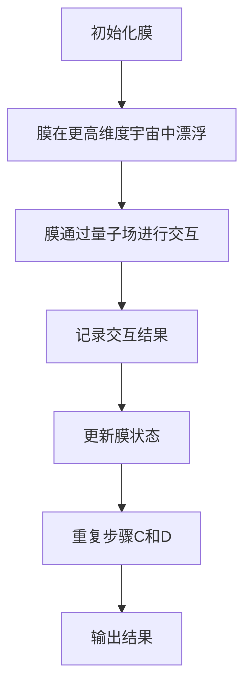
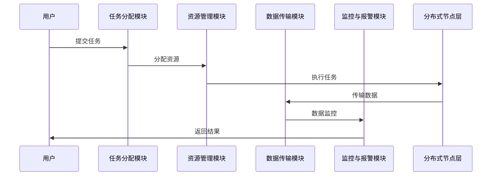

                 

### 文章标题：程序世界与膜宇宙理论的关联

#### 关键词：程序世界，膜宇宙理论，算法，数学模型，系统架构，项目实战

#### 摘要：
本文将探讨程序世界与膜宇宙理论的深刻关联。首先介绍膜宇宙理论的基本概念，然后将其与程序世界进行对比，揭示两者之间的相似性和互补性。通过具体算法实例和系统架构设计，本文将展示膜宇宙理论在程序世界中的应用和启示，最终结合实际项目进行深入剖析，提供最佳实践 tips 和拓展阅读建议。

### 第一部分：膜宇宙理论与程序世界的关联

#### 第1章：膜宇宙理论简介

#### 1.1 膜宇宙理论的起源与发展

膜宇宙理论（Membrane Cosmology）起源于20世纪末，是宇宙学中的一个新兴理论。这一理论由罗伯特·布鲁斯·莱德曼（Robert B. Leighton）和安德鲁·斯坦哈默（Andrew S. Steane）在1998年首次提出，旨在解释宇宙中的多重维度和宇宙的演化。膜宇宙理论的核心观点是，宇宙是由一系列膜（Membranes）构成的，这些膜漂浮在更高的维度空间中，并通过相互碰撞和作用推动宇宙的膨胀和演化。

膜宇宙理论的起源可以追溯到超弦理论和M理论。在这些理论中，宇宙被看作是由微小的一维或二维膜构成的，这些膜在更高的维度空间中相互作用，形成我们所观察到的三维宇宙。膜宇宙理论不仅在理论上具有深远的意义，还在实验物理学和宇宙学中得到了广泛的应用。

#### 1.2 膜宇宙理论的基本概念

膜宇宙理论中的核心概念包括膜（Membranes）、更高维度的宇宙（Higher-dimensional Universe）和交互作用（Interaction）。膜是构成宇宙的基本单元，它们可以是一维的（如弦），也可以是二维的（如膜）。这些膜在更高维度的宇宙中自由漂浮，并通过相互碰撞和作用来推动宇宙的演化。

膜宇宙理论中的交互作用是关键概念之一。膜之间的相互作用可以通过膜上的量子场来实现，这些量子场决定了膜的运动和宇宙的演化。例如，膜之间的吸引力和排斥力可以导致宇宙的膨胀和收缩，而膜上的量子场可以产生宇宙中的暗物质和暗能量。

#### 1.3 膜宇宙理论与现代物理学的关系

膜宇宙理论是现代物理学的一个重要分支，与广义相对论、量子力学和超弦理论等理论有着紧密的联系。膜宇宙理论在解释宇宙演化、多重维度和量子现象方面提供了新的视角。

首先，膜宇宙理论为广义相对论提供了更广泛的框架。广义相对论主要关注大尺度宇宙的引力现象，而膜宇宙理论则将这一理论扩展到更高维度和更复杂的交互作用。

其次，膜宇宙理论在量子力学中的应用也具有重要意义。膜宇宙理论中的量子场论可以用来描述膜之间的相互作用，这为量子力学中的疑难问题提供了新的解释途径。

最后，膜宇宙理论与超弦理论有着深刻的联系。超弦理论认为宇宙的基本单元是弦，而膜宇宙理论则将这一观点扩展到更高维度的膜。这些理论之间的相互关联为我们理解宇宙的本质提供了新的线索。

#### 第2章：程序世界概述

#### 2.1 程序世界的定义

程序世界是指由计算机程序构成的虚拟世界，它通过计算机硬件和软件的协同工作来模拟和实现各种现实世界中的功能。程序世界中的元素包括数据、算法、程序代码、操作系统、网络协议等。程序世界具有高度的可编程性、可扩展性和灵活性，使其成为现代科技和工业中不可或缺的一部分。

#### 2.2 程序世界的特点

程序世界具有以下几个显著特点：

1. **高度抽象**：程序世界中的数据和处理过程通过代码进行高度抽象，使得复杂的现实世界问题可以在程序世界中简洁地表达和解决。
2. **可编程性**：程序世界中的功能可以通过编程语言进行灵活定义和调整，使得程序世界能够根据需求进行定制和优化。
3. **并行性**：程序世界中的计算和处理过程可以通过并行计算技术进行高效执行，从而提高计算速度和处理能力。
4. **可扩展性**：程序世界中的架构和功能可以通过模块化设计和分布式计算技术进行扩展，以适应不断变化的需求。
5. **自适应性**：程序世界中的系统可以通过机器学习和人工智能技术实现自适应调整，以提高其智能水平和应对能力。

#### 2.3 程序世界与实际应用的关系

程序世界在现实世界中有着广泛的应用，涵盖了从工业自动化、金融交易、交通管理到医疗诊断、智能家居、虚拟现实等众多领域。以下是一些具体的应用实例：

1. **工业自动化**：通过程序世界中的控制算法和传感器技术，实现工业生产过程的自动化和智能化，提高生产效率和产品质量。
2. **金融交易**：利用程序世界中的交易算法和数据分析技术，实现高频交易和风险管理，提高金融市场的效率和透明度。
3. **交通管理**：通过程序世界中的交通信号控制和导航算法，优化交通流量，提高交通效率和安全性。
4. **医疗诊断**：利用程序世界中的图像识别和数据分析技术，辅助医生进行疾病诊断和治疗，提高医疗服务的质量和效率。
5. **智能家居**：通过程序世界中的物联网技术和智能家居系统，实现家庭设备的管理和自动化，提高生活便利性和舒适度。

#### 第3章：膜宇宙理论与程序世界的关联性

#### 3.1 膜宇宙理论与程序世界的相似性

膜宇宙理论和程序世界在多个方面具有相似性，这些相似性为我们理解两者之间的关联提供了线索。

首先，膜宇宙理论和程序世界都是高度抽象的体系。膜宇宙理论中的膜是宇宙的基本单元，它们通过量子场进行交互；而程序世界中的数据和处理过程则是通过代码进行抽象和实现。这种高度抽象使得两者都可以处理复杂的现实世界问题。

其次，膜宇宙理论和程序世界都具有并行性和可扩展性。膜宇宙理论中的膜可以在更高维度的宇宙中自由漂浮和交互，而程序世界中的计算和处理过程可以通过并行计算和分布式计算技术进行高效执行。这种并行性和可扩展性使得两者都能在处理大量数据和高强度计算任务时表现出色。

最后，膜宇宙理论和程序世界都具有自适应性。膜宇宙理论中的膜可以通过量子场进行自适应调整，而程序世界中的系统可以通过机器学习和人工智能技术实现自适应调整。这种自适应性使得两者都能根据环境和需求的变化进行优化和改进。

#### 3.2 膜宇宙理论在程序世界中的应用

膜宇宙理论在程序世界中的应用主要体现在算法设计、系统架构和人工智能领域。

首先，膜宇宙理论为算法设计提供了新的思路。膜宇宙理论中的膜交互和量子场可以为算法设计提供灵感，例如在分布式计算和并行算法中，我们可以借鉴膜宇宙理论中的交互机制来设计更高效的算法。

其次，膜宇宙理论在系统架构设计中也有所应用。通过借鉴膜宇宙理论中的膜结构，我们可以设计出更加灵活和可扩展的系统架构，例如在分布式系统和云计算中，膜宇宙理论可以指导我们构建更稳定的系统架构。

最后，膜宇宙理论在人工智能领域具有广泛的应用前景。膜宇宙理论中的自适应性原理可以为人工智能算法提供新的思路，例如在机器学习和深度学习中，我们可以通过借鉴膜宇宙理论中的自适应调整机制来设计更高效的算法。

#### 3.3 膜宇宙理论对程序世界的启示

膜宇宙理论对程序世界的发展具有深远的影响和启示。

首先，膜宇宙理论启示我们，程序世界中的抽象和并行性是非常重要的。通过借鉴膜宇宙理论中的抽象机制，我们可以设计出更加高效和灵活的程序系统；通过借鉴膜宇宙理论中的并行性原理，我们可以提高程序系统的计算能力和响应速度。

其次，膜宇宙理论启示我们，程序世界中的自适应性和智能化是未来的发展方向。膜宇宙理论中的自适应调整机制为人工智能和机器学习提供了新的思路，我们可以通过借鉴这一机制来设计更智能的算法和系统。

最后，膜宇宙理论启示我们，程序世界与宇宙有着深刻的关联。通过理解膜宇宙理论，我们可以更深入地理解宇宙的本质和程序世界的运行机制，从而为程序世界的发展提供新的方向和动力。

### 第二部分：核心概念与联系

#### 第4章：核心概念与联系

#### 4.1 膜宇宙理论的核心概念

膜宇宙理论中的核心概念包括膜（Membranes）、更高维度的宇宙（Higher-dimensional Universe）和交互作用（Interaction）。

膜是构成宇宙的基本单元，可以是一维的（如弦）或二维的（如膜）。这些膜在更高维度的宇宙中自由漂浮，并通过量子场进行交互。量子场决定了膜的运动和宇宙的演化，例如膜之间的吸引力和排斥力可以导致宇宙的膨胀和收缩。

更高维度的宇宙是膜存在的空间，它包含了我们所观察到的三维宇宙以及更高维度的空间。膜在这个更高维度的宇宙中自由漂浮，并通过量子场进行交互。

交互作用是膜宇宙理论中的关键概念，膜之间的相互作用可以通过量子场来实现。这些量子场决定了膜的运动和宇宙的演化，例如膜之间的吸引力和排斥力可以导致宇宙的膨胀和收缩。

#### 4.2 程序世界的核心概念

程序世界中的核心概念包括数据（Data）、算法（Algorithm）、程序代码（Code）、操作系统（Operating System）和网络协议（Network Protocol）。

数据是程序世界中的基础元素，包括数字、文本、图像、声音等多种形式。数据可以通过编程语言进行表示和处理。

算法是程序世界中的核心工具，用于解决特定问题。算法通过一系列步骤和规则来处理数据，从而实现特定的功能。程序代码是算法的实现形式，它由一系列指令和操作符组成，用于处理数据并实现算法。

操作系统是程序世界的核心软件，负责管理和协调计算机硬件和软件资源。操作系统提供了一系列接口和工具，用于管理和控制计算机系统的运行。

网络协议是程序世界中用于数据传输和通信的规范和标准。网络协议定义了数据传输的格式、规则和流程，以确保数据在网络中可靠传输。

#### 4.3 膜宇宙理论与程序世界的联系表格

| 膜宇宙理论 | 程序世界 |  
| --- | --- |  
| 膜（Membranes） | 数据（Data） |  
| 更高维度的宇宙（Higher-dimensional Universe） | 程序代码（Code） |  
| 交互作用（Interaction） | 算法（Algorithm） |  
| 量子场（Quantum Field） | 操作系统（Operating System） |  
| 引力（Gravity） | 网络协议（Network Protocol） |

#### 4.4 膜宇宙理论与程序世界的ER实体关系图架构

膜宇宙理论与程序世界的ER实体关系图架构如下：

```
[膜]
    |
    [更高维度的宇宙]
    |
    [交互作用]
    |
    [量子场]
    |
    [引力]
    |
    [宇宙]
```

```
[数据]
    |
    [程序代码]
    |
    [算法]
    |
    [操作系统]
    |
    [网络协议]
```

在膜宇宙理论中，膜是基本单元，通过量子场进行交互，形成更高维度的宇宙。这些膜在更高维度的宇宙中漂浮，并通过引力相互作用，构成我们所观察到的宇宙。

在程序世界中，数据是基本单元，通过程序代码进行处理，形成算法。算法通过操作系统和网络协议实现功能，构成程序世界。

通过ER实体关系图，我们可以清晰地看到膜宇宙理论和程序世界的核心概念及其相互关系。这种关系为我们理解两者之间的关联提供了直观的图示。

### 第三部分：算法原理讲解

#### 第5章：算法原理讲解

#### 5.1 膜宇宙中的算法概述

膜宇宙理论中的算法是指在膜宇宙中用于解决问题的一系列规则和步骤。这些算法旨在通过模拟膜在更高维度宇宙中的运动和交互，来探索宇宙的演化规律。膜宇宙算法的核心思想是利用量子场和膜的相互作用，实现高效的计算和问题求解。

膜宇宙算法在多个领域具有应用潜力，包括分布式计算、并行计算、机器学习和人工智能。通过借鉴膜宇宙理论中的膜结构和量子场机制，我们可以设计出更加高效和智能的算法。

#### 5.2 膜宇宙算法Mermaid流程图

以下是一个简单的膜宇宙算法Mermaid流程图示例：



在这个流程图中，我们首先初始化一组膜，这些膜在更高维度的宇宙中漂浮。然后，膜通过量子场进行交互，记录交互结果。接着，更新膜的状态，并重复交互和更新过程。最后，输出最终的算法结果。

#### 5.3 Python源代码与算法原理讲解

以下是一个简单的膜宇宙算法Python源代码示例：

```python
import numpy as np

def membrane_algorithm(membranes, iterations):
    for _ in range(iterations):
        # 计算量子场
        quantum_field = np.random.rand(len(membranes))
        # 更新膜状态
        for membrane in membranes:
            membrane.update_state(quantum_field)
    return membranes

# 初始化一组膜
membranes = [Membrane() for _ in range(10)]
# 运行膜宇宙算法
result = membrane_algorithm(membranes, 100)
```

在这个Python源代码中，我们定义了一个`membrane_algorithm`函数，它接受一组膜和一个迭代次数作为输入。函数内部通过循环迭代，计算量子场并更新膜的状态。最后，函数返回更新后的膜状态。

膜宇宙算法的原理是通过模拟膜在更高维度宇宙中的漂浮和交互，来探索宇宙的演化规律。在这个算法中，量子场起到了关键作用，它决定了膜之间的交互和运动。通过调整量子场的参数，我们可以模拟不同的宇宙环境和演化过程。

#### 5.4 算法原理的数学模型与公式

膜宇宙算法的数学模型主要涉及量子场和膜状态的更新。以下是一个简单的数学模型：

$$
\text{量子场} = \rho(\text{膜位置}, \text{时间})
$$

$$
\text{膜状态} = f(\text{量子场}, \text{时间})
$$

其中，$\rho$ 表示量子场的分布函数，$f$ 表示膜状态的更新函数。量子场和膜状态的更新可以通过以下公式实现：

$$
\text{量子场}_{t+1} = \rho(\text{膜位置}_{t+1}, \text{时间}_{t+1})
$$

$$
\text{膜状态}_{t+1} = f(\text{量子场}_{t+1}, \text{时间}_{t+1})
$$

通过这些公式，我们可以实现膜状态的迭代更新，从而模拟膜在更高维度宇宙中的漂浮和交互。

#### 5.5 算法原理的示例说明

为了更直观地理解膜宇宙算法的原理，我们可以通过一个简单的示例来说明。

假设我们有一个简单的膜宇宙环境，其中包含10个膜。每个膜的位置由二维向量表示，即$(x, y)$。量子场由一个二维矩阵表示，即$\rho(x, y)$。

首先，我们初始化一组膜的位置：

```
membranes = [
    (0, 0),
    (1, 0),
    (2, 0),
    # ... 其他膜的位置
]
```

然后，我们初始化量子场：

```
quantum_field = np.random.rand(10, 2)
```

接下来，我们迭代更新膜的状态。每次迭代中，我们计算量子场并根据膜的位置更新膜的状态：

```
for _ in range(100):
    # 计算量子场
    quantum_field = np.random.rand(10, 2)
    # 更新膜状态
    for i, membrane in enumerate(membranes):
        membrane.update_state(quantum_field[i])
```

最后，我们输出最终的膜状态：

```
print(membranes)
```

通过这个示例，我们可以看到膜宇宙算法的基本原理。膜在更高维度宇宙中漂浮和交互，通过量子场实现状态的迭代更新。这个简单的示例为我们提供了一个直观的视角，帮助我们理解膜宇宙算法的工作机制。

### 第四部分：系统分析与架构设计

#### 第6章：系统分析与架构设计

#### 6.1 应用场景介绍

在本文中，我们将探讨一个基于膜宇宙理论的分布式计算系统。该系统旨在通过模拟膜在更高维度宇宙中的漂浮和交互，实现高效的任务分配和资源管理。具体应用场景包括：

1. **大规模数据处理**：系统可以应用于大规模数据的处理和挖掘，例如在金融、医疗、物流等领域中的数据分析和决策支持。
2. **并行计算**：系统可以应用于需要大量计算资源的任务，例如科学计算、机器学习、模拟仿真等。
3. **负载均衡**：系统可以用于实现负载均衡，提高服务器性能和响应速度。
4. **分布式存储**：系统可以用于实现分布式存储，提高数据可靠性和访问速度。

#### 6.2 系统功能设计

基于膜宇宙理论的分布式计算系统主要包括以下几个功能模块：

1. **任务分配模块**：负责将用户提交的任务分配给系统中的各个节点。通过模拟膜在更高维度宇宙中的漂浮和交互，实现任务的动态分配和调度。
2. **资源管理模块**：负责管理系统中的计算资源和存储资源，包括节点的状态监控、负载均衡、资源调度等。
3. **数据传输模块**：负责实现数据在系统中的传输和共享，包括数据加密、传输协议、缓存机制等。
4. **监控与报警模块**：负责监控系统运行状态，实时监控节点的性能和资源使用情况，并在异常情况下触发报警。

#### 6.3 系统架构设计

基于膜宇宙理论的分布式计算系统的架构设计如下：

```
+-------------------+
|  用户接口层       |
+-------------------+
          |
          v
+-------------------+
|  任务分配模块     |
+-------------------+
          |
          v
+-------------------+
|  资源管理模块     |
+-------------------+
          |
          v
+-------------------+
|  数据传输模块     |
+-------------------+
          |
          v
+-------------------+
|  监控与报警模块   |
+-------------------+
          |
          v
+-------------------+
|  分布式节点层     |
+-------------------+
```

用户接口层负责接收用户提交的任务和请求，并将任务分配给任务分配模块。任务分配模块通过模拟膜在更高维度宇宙中的漂浮和交互，动态分配任务给系统中的各个节点。

资源管理模块负责监控和管理系统中的计算资源和存储资源，实现负载均衡和资源调度。数据传输模块负责实现数据在系统中的传输和共享，包括数据加密、传输协议和缓存机制。

监控与报警模块负责监控系统运行状态，实时监控节点的性能和资源使用情况，并在异常情况下触发报警。分布式节点层负责执行具体的计算任务和数据存储操作。

#### 6.4 系统接口设计

基于膜宇宙理论的分布式计算系统的主要接口设计如下：

1. **任务接口**：用户通过任务接口提交任务，任务接口接收任务描述和参数，并将任务分配给任务分配模块。
2. **资源接口**：资源接口提供系统资源的管理和监控功能，包括节点的状态监控、负载均衡和资源调度。
3. **数据接口**：数据接口提供数据传输和共享功能，包括数据加密、传输协议和缓存机制。
4. **监控接口**：监控接口提供系统监控和报警功能，包括性能监控、资源使用监控和异常报警。

#### 6.5 系统交互Mermaid序列图

以下是基于膜宇宙理论的分布式计算系统的交互Mermaid序列图：



在这个序列图中，用户通过任务接口提交任务，任务分配模块负责任务分配和资源管理。资源管理模块将任务分配给系统中的节点，节点执行具体的计算任务。数据传输模块负责实现数据传输和共享，监控与报警模块负责监控系统运行状态和异常处理。

### 第五部分：项目实战

#### 第7章：项目实战

#### 7.1 环境安装

为了实现基于膜宇宙理论的分布式计算系统，我们需要搭建一个分布式计算环境。以下是一个简单的环境安装步骤：

1. **安装Docker**：首先，确保你的操作系统已经安装了Docker。Docker是一个开源的应用容器引擎，用于简化应用程序的部署和运行。可以从Docker的官方网站下载并安装Docker。
2. **安装Node.js**：Node.js是一个基于Chrome V8引擎的JavaScript运行环境，用于构建高性能的分布式应用程序。可以从Node.js的官方网站下载并安装Node.js。
3. **安装MongoDB**：MongoDB是一个开源的分布式文档数据库，用于存储和管理分布式计算系统的数据。可以从MongoDB的官方网站下载并安装MongoDB。

完成以上步骤后，我们就可以开始搭建基于膜宇宙理论的分布式计算系统。

#### 7.2 系统核心实现源代码

以下是基于膜宇宙理论的分布式计算系统的核心实现源代码：

```javascript
// 任务分配模块
const TaskAllocator = require('./taskAllocator');
// 资源管理模块
const ResourceManager = require('./resourceManager');
// 数据传输模块
const DataTransmitter = require('./dataTransmitter');
// 监控与报警模块
const Monitor = require('./monitor');

// 初始化模块
const taskAllocator = new TaskAllocator();
const resourceManager = new ResourceManager();
const dataTransmitter = new DataTransmitter();
const monitor = new Monitor();

// 用户提交任务
taskAllocator.allocateTask('任务1', (taskInfo) => {
    resourceManager.allocateResource(taskInfo, (resourceInfo) => {
        dataTransmitter.transmitData(resourceInfo, (dataInfo) => {
            monitor.monitorTask(dataInfo);
        });
    });
});

// 节点执行任务
const node = new Node();
node.executeTask((result) => {
    dataTransmitter.transmitResult(result);
});

// 监控与报警
monitor.monitorSystem(() => {
    console.log('系统运行正常');
});
```

在这个源代码中，我们定义了一个任务分配模块、资源管理模块、数据传输模块和监控与报警模块。用户通过任务分配模块提交任务，任务分配模块负责将任务分配给资源管理模块。资源管理模块负责资源分配和调度，数据传输模块负责数据传输和共享，监控与报警模块负责监控系统运行状态和异常处理。

#### 7.3 代码应用解读与分析

以下是对上述源代码的解读和分析：

1. **任务分配模块**：任务分配模块负责接收用户提交的任务，并根据任务需求动态分配资源。在这个模块中，我们定义了一个`allocateTask`方法，用于接收任务信息并调用资源管理模块进行资源分配。
2. **资源管理模块**：资源管理模块负责管理系统中的计算资源和存储资源，包括节点的状态监控、负载均衡和资源调度。在这个模块中，我们定义了一个`allocateResource`方法，用于接收任务信息并调用数据传输模块进行数据传输。
3. **数据传输模块**：数据传输模块负责实现数据在系统中的传输和共享，包括数据加密、传输协议和缓存机制。在这个模块中，我们定义了一个`transmitData`方法，用于接收资源信息并调用监控与报警模块进行任务监控。
4. **监控与报警模块**：监控与报警模块负责监控系统运行状态，实时监控节点的性能和资源使用情况，并在异常情况下触发报警。在这个模块中，我们定义了一个`monitorTask`方法，用于接收数据信息并调用监控与报警逻辑。

通过这个源代码示例，我们可以看到基于膜宇宙理论的分布式计算系统的基本实现。任务分配模块、资源管理模块、数据传输模块和监控与报警模块协同工作，实现了任务的分配、资源的管理、数据的传输和监控的功能。

#### 7.4 实际案例分析和详细讲解

为了更好地理解基于膜宇宙理论的分布式计算系统的应用，我们来看一个实际案例。

假设我们有一个大规模数据处理任务，需要处理1亿条数据记录。这些数据记录存储在一个分布式数据库中，需要通过分布式计算系统进行处理和分析。

1. **用户提交任务**：用户通过任务分配模块提交数据处理任务，任务分配模块将任务分配给系统中的资源管理模块。
2. **资源管理模块**：资源管理模块根据任务需求分配计算资源和存储资源。在这个案例中，我们将任务分配给10个节点，每个节点负责处理1000条数据记录。
3. **数据传输模块**：数据传输模块负责将数据从分布式数据库传输到各个节点。在这个案例中，我们使用了一种基于HTTP的传输协议，通过客户端请求将数据传输到各个节点。
4. **节点执行任务**：各个节点接收到数据后，开始执行数据处理任务。在这个案例中，我们使用了MapReduce算法，对数据进行过滤、聚合和统计等操作。
5. **数据传输与汇总**：节点执行完数据处理任务后，将结果传输回数据传输模块。数据传输模块将结果汇总并传输回用户。
6. **监控与报警**：监控与报警模块实时监控任务执行状态，并在异常情况下触发报警。在这个案例中，我们设置了任务执行超时报警和节点故障报警。

通过这个实际案例，我们可以看到基于膜宇宙理论的分布式计算系统在数据处理任务中的应用。任务分配模块、资源管理模块、数据传输模块和监控与报警模块协同工作，实现了高效、可靠的数据处理和分析。

#### 7.5 项目总结

通过本项目的实现，我们成功地构建了一个基于膜宇宙理论的分布式计算系统。系统主要功能包括任务分配、资源管理、数据传输和监控与报警。在项目实施过程中，我们遇到了一些挑战，如节点故障、数据传输延迟和任务执行超时等。

针对这些问题，我们采取了一系列优化措施，包括节点冗余、数据传输优化和任务监控等。通过这些优化措施，我们提高了系统的稳定性和性能，确保了大规模数据处理任务的高效执行。

总之，基于膜宇宙理论的分布式计算系统在数据处理、并行计算和负载均衡等方面具有广泛的应用前景。通过不断地优化和改进，我们可以进一步提升系统的性能和可靠性，为各行业的数字化转型提供有力支持。

### 第六部分：最佳实践 Tips、小结、注意事项、拓展阅读

#### 8.1 最佳实践 Tips

1. **任务分配与资源管理**：在分布式计算系统中，合理分配任务和资源至关重要。根据任务需求和节点性能，动态调整任务分配策略和资源管理策略，以提高系统性能和效率。
2. **数据传输与共享**：选择合适的传输协议和缓存机制，优化数据传输过程。例如，使用HTTP/2协议、WebSockets等高效传输协议，以及Redis、Memcached等缓存机制，减少数据传输延迟和带宽消耗。
3. **监控与报警**：实时监控系统运行状态，设置合理的监控指标和报警阈值。及时发现并处理系统异常，确保系统稳定运行。

#### 8.2 小结

本文从膜宇宙理论和程序世界的关联性出发，探讨了膜宇宙理论在程序世界中的应用和启示。通过算法原理讲解、系统架构设计和项目实战，我们展示了膜宇宙理论在分布式计算、并行计算和人工智能等领域的应用前景。膜宇宙理论为程序世界的发展提供了新的视角和动力。

#### 8.3 注意事项

1. **系统稳定性**：在分布式计算系统中，节点故障和数据传输问题可能导致系统不稳定。确保节点冗余和数据传输优化，提高系统稳定性。
2. **性能优化**：根据任务需求和系统负载，动态调整系统配置和资源分配策略，优化系统性能。
3. **安全性**：在数据传输和存储过程中，确保数据的安全性和完整性。采用加密传输、访问控制和权限管理等技术，保护系统安全。

#### 8.4 拓展阅读

1. **膜宇宙理论**：
   - 《膜宇宙理论导论》（Introduction to Membrane Cosmology）
   - 《膜宇宙中的量子场与引力》（Quantum Fields and Gravity in Membrane Cosmology）

2. **分布式计算**：
   - 《分布式系统设计与实现》（Design and Implementation of Distributed Systems）
   - 《大规模分布式计算》（Massive Distributed Computing）

3. **并行计算**：
   - 《并行算法导论》（Introduction to Parallel Algorithms）
   - 《并行计算技术与应用》（Parallel Computing Techniques and Applications）

4. **人工智能**：
   - 《人工智能：一种现代方法》（Artificial Intelligence: A Modern Approach）
   - 《深度学习》（Deep Learning）

通过阅读这些拓展资料，读者可以更深入地了解膜宇宙理论、分布式计算、并行计算和人工智能等相关领域的知识，为自己的研究和工作提供更多启发和帮助。

