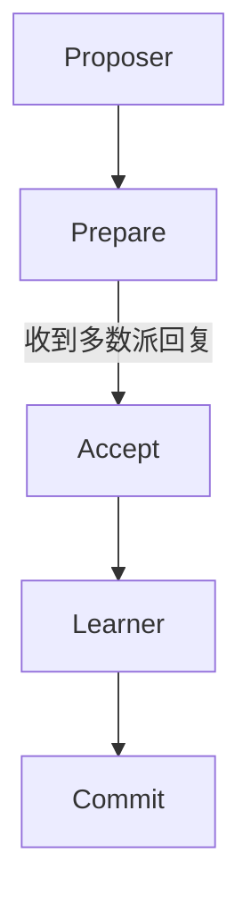
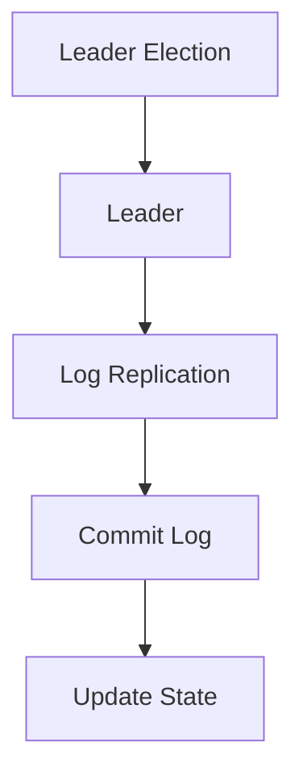
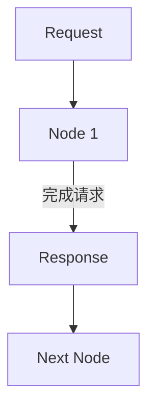
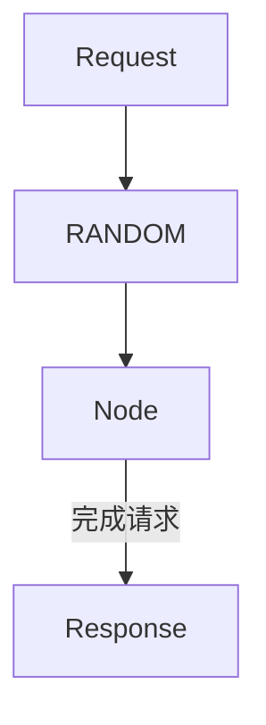
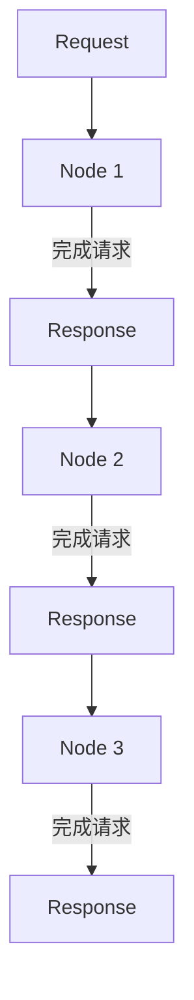
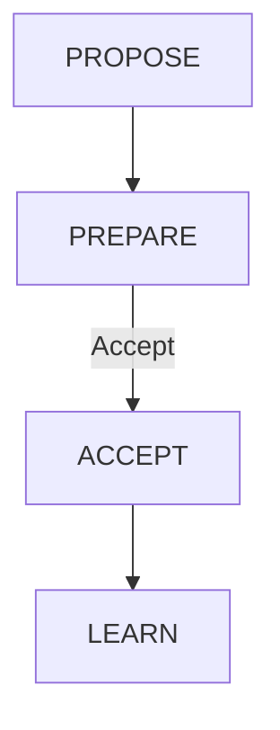
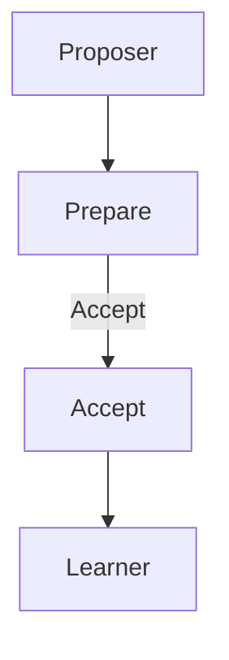

                 

### 引言

#### 1.1 问题背景

在当今数字化和信息化的时代，计算机程序已经成为我们生活中不可或缺的一部分。无论是互联网、移动应用，还是企业内部系统，程序的高效性和可靠性都至关重要。然而，随着业务的不断扩展和用户数量的激增，程序系统面临的一个巨大挑战便是**可扩展性**。

**可扩展性**指的是一个系统在处理数据量和用户数量增加时，能够保持高效运行的能力。而**宇宙尺度可扩展性**则是在此基础上，追求系统在面对极为庞大、甚至接近宇宙规模的规模时，依然能够实现高效的扩展。这一概念在当前分布式计算、云计算等领域显得尤为重要，因为随着数据量呈指数级增长，如何确保系统在处理海量数据时的性能和稳定性，已经成为一个亟待解决的技术难题。

#### 1.1.1 可扩展性的重要性

可扩展性对于现代程序系统至关重要，原因有以下几点：

1. **业务增长需求**：随着业务的不断发展，系统需要处理的数据量和用户数量不断增大。如果系统不具备良好的可扩展性，将难以满足不断增长的业务需求。
2. **性能瓶颈规避**：当系统性能达到瓶颈时，如果不进行扩展，将会导致响应时间延长，用户体验下降，甚至可能导致系统崩溃。
3. **资源利用效率**：可扩展性能够使得系统在处理更大规模的任务时，更加高效地利用资源，降低运营成本。
4. **技术升级与迭代**：具备可扩展性的系统能够更好地适应新技术和业务模式的变革，实现系统的持续迭代和发展。

#### 1.1.2 宇宙尺度的概念

**宇宙尺度**在程序世界中通常指的是系统需要处理的数据规模，可以大到数十亿、甚至数百万亿级别。这个概念来源于宇宙中的天文数据规模，例如天文观测数据、宇宙模拟数据等。将这些概念引入到程序世界中，意味着系统需要具备处理这种海量数据的能力。

宇宙尺度可扩展性不仅是技术问题，也是一项战略目标。对于企业而言，实现宇宙尺度可扩展性可以帮助其抢占市场先机，提供更加高效和可靠的服务。对于开发者而言，研究和解决这一问题可以提升其技术水平，成为一名真正的技术专家。

### 核心概念

在深入探讨程序世界的宇宙尺度可扩展性之前，我们首先需要明确几个核心概念：**可扩展性**、**分布式系统**、**负载均衡**和**服务化架构**。这些概念构成了实现宇宙尺度可扩展性的基础。

#### 1.2.1 可扩展性的定义与特征

**可扩展性**指的是系统在资源增加或任务量增大时，能够保持高效性和可靠性的能力。其核心特征包括：

1. **水平扩展**：通过增加节点数量来提升系统处理能力，而非依赖于单个节点的性能提升。
2. **垂直扩展**：通过提高单个节点的性能来提升系统处理能力。
3. **弹性**：系统可以根据实际需求动态调整资源分配，确保在高峰期和低谷期能够高效运行。
4. **容错性**：系统能够在部分节点失效时，自动调整资源分配，保持整体系统的稳定性。

#### 1.2.2 宇宙尺度在程序世界中的应用

**宇宙尺度**在程序世界中指的是系统需要处理的数据规模。具体应用场景包括：

1. **大数据处理**：例如，搜索引擎需要对海量数据进行实时索引和查询。
2. **分布式存储**：例如，分布式文件系统需要存储数十亿甚至更多数据条目。
3. **社交网络**：例如，社交媒体平台需要处理海量用户的数据交换和交互。
4. **物联网**：例如，物联网设备生成的数据量非常庞大，需要高效处理和分析。

#### 1.2.3 可扩展性与宇宙尺度的关系

可扩展性和宇宙尺度是相辅相成的概念。可扩展性提供了系统在面对海量数据时的技术保障，而宇宙尺度则为可扩展性设定了实际的目标和应用场景。具体关系如下：

1. **目标设定**：宇宙尺度的概念为可扩展性设定了具体的处理规模目标，使得系统设计和发展有了明确的方向。
2. **技术实现**：通过分布式系统、负载均衡等技术手段，实现系统在宇宙尺度上的可扩展性。
3. **性能优化**：通过不断优化算法和架构，提升系统在宇宙尺度上的处理性能和效率。

#### 1.2.4 边界与外延

可扩展性和宇宙尺度的边界与外延需要考虑以下几个方面：

1. **计算资源**：包括CPU、内存、存储等，这些资源的限制会影响系统的扩展能力。
2. **网络带宽**：网络带宽的瓶颈可能导致分布式系统中的数据传输延迟。
3. **数据一致性**：在大规模分布式系统中，数据一致性是一个关键挑战，需要通过一致性算法来保证。
4. **安全性**：随着系统规模的扩大，安全性问题也日益突出，需要采取相应的安全措施。

通过明确这些核心概念及其关系，我们为后续章节的深入探讨奠定了基础。在接下来的部分，我们将进一步分析可扩展性的挑战和解决方案，深入探讨实现宇宙尺度可扩展性的关键技术和方法。

### 可扩展性的挑战

尽管可扩展性在程序世界中具有显著的重要性，但在实现宇宙尺度可扩展性的过程中，我们面临着一系列严峻的挑战。以下是一些主要的挑战及其解决方案。

#### 1.3.1 资源限制

**资源限制**是可扩展性面临的首要挑战。计算资源、存储资源和网络带宽的有限性直接制约了系统的扩展能力。在资源有限的情况下，如何合理分配和利用资源成为关键问题。

**解决方案**：

1. **水平扩展**：通过增加节点数量，实现资源的横向扩展，避免单点性能瓶颈。
2. **资源监控与调度**：实时监控系统资源使用情况，动态调整资源分配，确保系统在资源紧张时能够优先保障关键任务的执行。
3. **容器化与虚拟化**：使用容器化和虚拟化技术，提高资源利用效率，实现资源的灵活调度和分配。

#### 1.3.2 性能瓶颈

**性能瓶颈**是另一个严重的挑战。随着数据量和用户数量的增加，系统的响应时间可能会显著延长，影响用户体验。在处理大规模任务时，如何提升系统的性能成为关键问题。

**解决方案**：

1. **分布式计算**：通过分布式计算架构，将任务分解为多个子任务，并行处理，提升系统整体性能。
2. **负载均衡**：使用负载均衡技术，将请求均匀分配到多个节点上，避免单点过载，提高系统响应速度。
3. **算法优化**：对关键算法进行优化，减少计算复杂度，提高处理效率。

#### 1.3.3 伸缩性问题

**伸缩性问题**涉及系统在处理不同规模任务时的适应能力。在小型任务场景下，系统可能能够高效运行，但在面对海量任务时，可能会因为设计上的不足而出现性能下降。

**解决方案**：

1. **弹性架构**：设计具有高度弹性的系统架构，能够根据任务规模动态调整资源分配和系统配置。
2. **微服务架构**：将系统拆分为多个微服务，每个微服务独立部署和扩展，提升系统的灵活性和伸缩性。
3. **云计算**：利用云平台提供的弹性资源，根据需求动态调整系统规模，实现无缝扩展。

#### 1.3.4 数据一致性与可用性

在大规模分布式系统中，数据一致性和可用性是一个关键挑战。如何在多个节点之间保持数据一致性，同时确保系统的高可用性，是一个复杂的问题。

**解决方案**：

1. **一致性算法**：如Paxos、Raft等一致性算法，确保多个节点之间的数据一致性。
2. **去中心化架构**：通过去中心化的设计，减少单点故障对系统可用性的影响。
3. **多副本机制**：在多个节点上存储数据副本，通过冗余提高数据的可用性和可靠性。

通过分析这些挑战及其解决方案，我们可以更好地理解和应对实现宇宙尺度可扩展性所面临的问题。在接下来的章节中，我们将探讨具体的实现技术和方法，进一步深化对可扩展性的理解。

### 可扩展性的解决方案

为了实现宇宙尺度可扩展性，我们需要采用一系列技术和方法。以下是一些关键解决方案，包括分布式系统、负载均衡、服务化架构等。

#### 1.4.1 分布式系统

**分布式系统**是实现可扩展性的基础。它通过将任务分布在多个节点上，提高了系统的性能和可靠性。分布式系统的主要特点包括：

1. **水平扩展**：可以通过增加节点数量来提高系统处理能力。
2. **容错性**：通过冗余和分布式算法，确保系统在部分节点失效时仍能正常运行。
3. **高可用性**：通过多节点冗余，提高系统的可用性，减少单点故障的风险。

**实现方法**：

1. **一致性算法**：例如Paxos、Raft算法，确保多个节点之间的数据一致性。
2. **分布式存储**：使用分布式文件系统（如HDFS、Cassandra）或分布式数据库（如MongoDB、Redis），实现海量数据的存储和访问。
3. **分布式计算框架**：如Hadoop、Spark等，提供分布式数据处理的强大工具和平台。

#### 1.4.2 负载均衡

**负载均衡**是将请求分配到多个节点上，避免单点过载，提高系统性能和响应速度。负载均衡的关键技术包括：

1. **轮询算法**：将请求依次分配到各个节点，实现简单的负载均衡。
2. **随机算法**：随机选择节点处理请求，减少请求分配的不平衡性。
3. **最小连接数算法**：选择当前连接数最少的节点处理新请求，实现更公平的负载均衡。

**实现方法**：

1. **硬件负载均衡器**：如F5 BIG-IP，通过硬件设备实现高效的负载均衡。
2. **软件负载均衡器**：如Nginx、HAProxy，通过软件实现负载均衡，适用于大规模分布式系统。
3. **云平台负载均衡服务**：如AWS ELB、Azure Load Balancer，提供灵活、可配置的负载均衡服务。

#### 1.4.3 服务化架构

**服务化架构**是将系统拆分为多个独立的微服务，每个微服务负责特定的功能模块。服务化架构的主要优势包括：

1. **高可扩展性**：每个微服务可以独立部署和扩展，实现系统的弹性伸缩。
2. **高容错性**：每个微服务独立运行，降低故障传播的风险。
3. **高灵活性**：通过API接口，实现微服务之间的解耦，方便系统升级和功能扩展。

**实现方法**：

1. **服务化框架**：如Spring Boot、Django等，提供微服务开发的框架和工具。
2. **容器化与编排**：如Docker、Kubernetes，实现微服务的容器化和编排管理。
3. **服务网关**：如API Gateway，统一管理和分发请求，简化服务之间的交互。

通过分布式系统、负载均衡和服务化架构等解决方案，我们可以有效实现宇宙尺度可扩展性，为大规模程序系统提供稳定、高效、可靠的运行环境。在接下来的章节中，我们将深入探讨这些解决方案的具体实现和技术细节。

### 可扩展性与宇宙尺度的关系

在深入探讨可扩展性时，我们不可避免地会遇到**宇宙尺度**这一概念。宇宙尺度指的是系统需要处理的数据规模，可以大到数十亿、甚至数百万亿级别。这个概念源于宇宙中的天文数据规模，例如天文观测数据、宇宙模拟数据等。将其引入到程序世界中，意味着系统需要具备处理这种海量数据的能力。

#### 1.5.1 可扩展性的层级

可扩展性可以分为几个层级：

1. **应用层扩展**：通常指的是在单个应用层面的扩展，例如通过增加线程或进程数量来提升应用性能。
2. **系统层扩展**：涉及到整个系统的扩展，包括数据库、中间件、网络等各个层面的扩展。
3. **平台层扩展**：包括云平台、数据中心等基础设施的扩展。

**宇宙尺度可扩展性**主要关注平台层扩展，其目标是确保系统在处理海量数据时，依然能够保持高效性和稳定性。

#### 1.5.2 宇宙尺度在可扩展性中的应用

宇宙尺度可扩展性在程序世界中的应用主要体现在以下几个方面：

1. **大数据处理**：随着数据量的激增，系统需要高效处理和分析海量数据，如搜索引擎、数据分析平台等。
2. **分布式存储**：分布式文件系统和数据库需要存储和管理数十亿甚至更多的数据条目。
3. **物联网**：物联网设备生成的数据量非常庞大，需要高效处理和分析。
4. **云服务平台**：云服务平台需要提供大规模的计算和存储能力，以满足不同用户的需求。

#### 1.5.3 宇宙尺度的挑战

宇宙尺度可扩展性面临以下主要挑战：

1. **资源管理**：如何高效利用有限的计算资源、存储资源和网络带宽。
2. **数据一致性**：在大规模分布式系统中，如何确保多个节点之间的数据一致性。
3. **性能优化**：如何通过算法优化和系统设计提升系统性能。
4. **弹性伸缩**：如何根据实际需求动态调整系统规模。

#### 1.5.4 实现宇宙尺度可扩展性的方法

为了实现宇宙尺度可扩展性，可以采用以下方法：

1. **分布式计算**：通过分布式计算框架，将任务分解为多个子任务，并行处理。
2. **负载均衡**：通过负载均衡技术，将请求均匀分配到多个节点，避免单点过载。
3. **服务化架构**：将系统拆分为多个独立的微服务，每个微服务负责特定的功能模块。
4. **弹性伸缩**：根据实际需求动态调整系统规模，确保系统在高峰期和低谷期能够高效运行。
5. **一致性算法**：采用一致性算法，如Paxos、Raft等，确保多个节点之间的数据一致性。

通过深入理解可扩展性和宇宙尺度的关系，我们可以更好地设计出具备宇宙尺度可扩展性的程序系统，满足现代大规模数据处理的需求。

### 核心概念对比

在探讨程序世界的宇宙尺度可扩展性时，我们需要了解几个核心概念：**分布式计算**、**云计算**和**容器化技术**。这些概念不仅各自具有独特的特征和优势，而且在实现可扩展性方面起到了关键作用。以下是对这几个核心概念及其之间关系的对比分析。

#### 2.2.1 分布式计算

**分布式计算**是指通过计算机网络将多个计算机节点组成一个整体，协同处理计算任务。其主要特点包括：

- **并行处理**：分布式计算能够将任务分解为多个子任务，并行处理，提高整体计算效率。
- **容错性**：通过冗余设计，确保系统在部分节点失效时，其他节点可以继续工作，保证系统的高可用性。
- **可扩展性**：通过增加节点数量，分布式计算系统能够水平扩展，满足数据量和任务量的增长需求。

**实现方法**：

- **任务调度**：使用任务调度算法，将子任务分配到不同的节点上，优化资源利用率。
- **数据一致性**：采用一致性算法（如Paxos、Raft），保证多个节点之间的数据一致性。
- **分布式存储**：使用分布式文件系统（如HDFS）或分布式数据库（如Cassandra），实现海量数据的存储和管理。

#### 2.2.2 云计算

**云计算**是一种基于互联网的计算服务模式，提供可动态调整的计算资源。云计算的核心优势包括：

- **弹性伸缩**：根据实际需求动态调整计算资源，确保系统在高峰期和低谷期能够高效运行。
- **资源优化**：通过虚拟化和自动化管理，提高资源利用率和运营效率。
- **成本效益**：按需付费，降低企业IT基础设施的投入和运营成本。

**实现方法**：

- **云服务模型**：包括基础设施即服务（IaaS）、平台即服务（PaaS）和软件即服务（SaaS），满足不同层次的应用需求。
- **虚拟化技术**：通过虚拟化技术，实现计算资源的高效管理和调度。
- **容器化与编排**：使用容器化技术（如Docker）和编排工具（如Kubernetes），实现应用的高效部署和运维。

#### 2.2.3 容器化技术

**容器化技术**是一种轻量级虚拟化技术，通过隔离和封装，实现应用环境的标准化和可移植性。其主要特点包括：

- **轻量级**：容器共享宿主机的操作系统内核，资源占用较少，启动速度快。
- **可移植性**：容器内的应用环境与宿主机无关，可以在不同的环境中无缝运行。
- **高并发性**：通过容器化技术，应用可以以最小资源开销实现高并发运行。

**实现方法**：

- **容器化**：使用Docker等容器化工具，将应用及其依赖环境打包成容器。
- **容器编排**：使用Kubernetes等编排工具，实现容器的自动化部署、扩展和管理。
- **服务网格**：通过服务网格（如Istio），实现容器之间的通信和服务治理。

#### 2.2.4 核心概念对比表格

以下表格展示了分布式计算、云计算和容器化技术之间的核心对比：

| 特点 | 分布式计算 | 云计算 | 容器化技术 |
| --- | --- | --- | --- |
| 并行处理 | 是 | 否（但云计算中的分布式计算支持） | 否 |
| 容错性 | 是 | 是 | 是 |
| 弹性伸缩 | 否 | 是 | 是 |
| 资源优化 | 否 | 是 | 是 |
| 可移植性 | 否 | 否 | 是 |
| 高并发性 | 是 | 是 | 是 |

#### 2.2.5 实体关系图

为了更好地展示这些核心概念之间的关系，我们可以使用Mermaid语法绘制一个实体关系图。

```mermaid
erDiagram
  Node -> Cluster : 分布式计算
  Cluster -> Service : 云计算
  Service -> Container : 容器化技术
  Container -> Application : 应用部署
```

在这个实体关系图中，节点（Node）代表计算机硬件，集群（Cluster）代表多个节点的组合，服务（Service）代表云计算服务，容器（Container）代表容器化技术，应用（Application）代表最终部署的应用程序。

通过对比和分析分布式计算、云计算和容器化技术，我们可以更好地理解它们在实现宇宙尺度可扩展性中的角色和作用。在接下来的章节中，我们将深入探讨这些技术的具体实现和应用场景。

### 可扩展性算法概述

在实现宇宙尺度可扩展性的过程中，算法的选择和优化至关重要。分布式系统中的算法不仅影响系统的性能和可靠性，还决定了其在处理海量数据时的效率和效果。以下介绍几种关键的可扩展性算法，包括分布式一致性算法和分布式负载均衡算法。

#### 3.1.1 分布式一致性算法

分布式一致性算法是确保多个节点之间数据一致性的关键。以下介绍两种常用的分布式一致性算法：**Paxos算法**和**Raft算法**。

1. **Paxos算法**：
   Paxos算法是一种用于分布式系统中达成一致性的算法。它的核心思想是通过一个称为“提案者”（Proposer）、“接受者”（Acceptor）和“学习者”（Learner）的角色，实现多个节点之间的数据一致性。Paxos算法的原理较为复杂，但关键点包括：

   - **提议和承诺**：提案者向接受者发送提议，接受者根据多数派原则投票承诺，最终达成一致。
   - **状态机**：每个节点都维护一个状态机，执行同一组操作，确保数据一致性。

2. **Raft算法**：
   Raft算法是另一种用于分布式一致性保障的算法，相较于Paxos算法，Raft算法在设计和实现上更为简洁。Raft算法的核心思想包括：

   - **领导者选举**：通过领导者选举机制，确保系统中有且仅有一个领导者，负责协调所有节点的操作。
   - **日志复制**：领导者将日志条目发送给其他节点，其他节点通过日志复制机制保持一致性。
   - **安全性**：Raft算法通过强制日志条目顺序来保证系统的一致性。

   Paxos和Raft算法各有优缺点，Paxos算法在一致性保障方面较为严格，但实现复杂度较高；而Raft算法在设计和实现上较为直观，易于理解，但一致性保障机制相对较弱。

#### 3.1.2 分布式负载均衡算法

分布式负载均衡算法是确保系统高效处理大量请求的关键。以下介绍几种常用的分布式负载均衡算法：**轮询算法**和**随机算法**。

1. **轮询算法**：
   轮询算法是最简单的负载均衡算法，它依次将请求分配到每个节点上。轮询算法的优点是实现简单，缺点是当某些节点负载不均时，可能会导致部分节点过载，影响系统性能。

2. **随机算法**：
   随机算法通过随机选择节点来处理请求，实现负载均衡。随机算法的优点是能够有效避免轮询算法中的单点过载问题，但缺点是可能导致部分节点负载不均。

#### 3.1.3 Mermaid流程图

为了更直观地展示上述算法的原理，我们可以使用Mermaid语法绘制算法流程图。

**Paxos算法流程图**：



**Raft算法流程图**：



**轮询算法流程图**：



**随机算法流程图**：



通过上述算法流程图，我们可以更清晰地理解各个算法的工作原理和执行步骤。接下来，我们将使用Python代码展示这些算法的实现，进一步探讨其具体实现和应用场景。

### 分布式一致性算法详解

在分布式系统中，一致性算法是确保多个节点之间数据一致性的关键。本文将重点介绍两种分布式一致性算法：Paxos算法和Raft算法，通过Python代码实现和算法流程图，帮助读者深入理解这两种算法的基本原理和应用场景。

#### 3.2.1 Paxos算法

**Paxos算法**是一种用于在分布式系统中达成一致性的算法，它由莱斯利·兰伯特（Leslie Lamport）在1990年提出。Paxos算法的核心思想是通过一系列的提案（proposal）、投票（vote）和决策（decision）过程，确保所有参与者就某一值达成一致。

**Python实现**：

```python
import random
import threading

# Paxos算法的主要角色
class Learner:
    def __init__(self, id):
        self.id = id
        self.decided_value = None

    def propose(self, value):
        # 提出一个新提案
        print(f"Learner {self.id} proposes value {value}")
        # 假设所有学习者都有相同的提案者ID
        proposer_id = 0
        # 等待所有学习者的响应
        responses = [False] * 3
        while not all(responses):
            learner_id = random.randint(0, 2)
            if learner_id == self.id:
                responses[learner_id] = True
                print(f"Learner {self.id} responds with True")
            else:
                print(f"Learner {self.id} responds with False")
        # 如果收到超过半数的响应，则认为提案成功
        if sum(responses) > 1:
            print(f"Learner {self.id} decides value {value}")
            self.decided_value = value

class Proposer:
    def __init__(self, id):
        self.id = id
        self.next提案序号 = 0

    def propose(self, value):
        print(f"Proposer {self.id} proposes value {value} with proposal number {self.next提案序号}")
        self.next提案序号 += 1
        # 通知所有学习者
        learners = [Learner(0), Learner(1), Learner(2)]
        for learner in learners:
            learner.propose(value)

# 测试Paxos算法
def test_paxos():
    proposer = Proposer(0)
    learners = [Learner(0), Learner(1), Learner(2)]
    threads = []
    for i in range(3):
        t = threading.Thread(target=learners[i].propose, args=(i,))
        threads.append(t)
        t.start()
    for t in threads:
        t.join()

test_paxos()
```

**算法流程**：

1. **提案（Proposal）**：提案者向所有学习者提出一个新提案，包含一个值和一个提案序号。
2. **投票（Vote）**：学习者收到提案后，会回复提案者是否接受该提案。
3. **决策（Decision）**：如果提案者收到超过半数的学习者接受该提案，则认为提案成功，学习者将该值作为决策值。

**Paxos算法流程图**：


#### 3.2.2 Raft算法

**Raft算法**是另一种分布式一致性算法，由Diego Ongaro和John Ousterhout在2013年提出。与Paxos算法相比，Raft算法在设计和实现上更为直观和简洁。

**Python实现**：

```python
import random
import threading

# Raft算法的主要角色
class Server:
    def __init__(self, id):
        self.id = id
        self.current_term = 0
        self.voted_for = None
        self.log = []

    def append_entry(self, entry):
        print(f"Server {self.id} appends entry {entry}")
        self.log.append(entry)

    def request_vote(self):
        print(f"Server {self.id} requests vote in term {self.current_term}")
        # 假设所有服务器都有相同的选举者ID
        candidate_id = 0
        # 等待所有服务器响应
        votes = [False] * 3
        while not all(votes):
            server_id = random.randint(0, 2)
            if server_id == self.id:
                votes[server_id] = True
                print(f"Server {self.id} responds with True")
            else:
                print(f"Server {self.id} responds with False")
        # 如果收到超过半数的响应，则认为选举成功
        if sum(votes) > 1:
            print(f"Server {self.id} becomes leader in term {self.current_term}")

def test_raft():
    servers = [Server(0), Server(1), Server(2)]
    threads = []
    for i in range(3):
        t = threading.Thread(target=servers[i].request_vote, args=())
        threads.append(t)
        t.start()
    for t in threads:
        t.join()

test_raft()
```

**算法流程**：

1. **领导者选举（Leader Election）**：服务器通过发送心跳（heartbeat）来维持领导者状态。如果一段时间内没有收到心跳，服务器将开始选举过程。
2. **日志复制（Log Replication）**：领导者将日志条目发送给其他服务器，其他服务器通过日志复制机制保持一致性。
3. **提交日志（Commit Log）**：领导者将日志条目提交到状态机，其他服务器也进行同样的操作。

**Raft算法流程图**：


通过上述Python代码和算法流程图，我们可以清晰地看到Paxos算法和Raft算法的基本原理和应用场景。接下来，我们将探讨分布式负载均衡算法，进一步深化对分布式系统可扩展性的理解。

### 分布式负载均衡算法

在分布式系统中，负载均衡是一种关键技术，用于确保系统各个节点的工作负载均衡，提高系统的整体性能和可用性。以下介绍几种常用的分布式负载均衡算法，包括轮询算法和随机算法，并通过Python代码展示其实现原理。

#### 3.3.1 轮询算法

**轮询算法**是一种简单的负载均衡算法，通过依次将请求分配给各个节点，实现负载的均衡。该算法实现简单，但缺点是当某个节点负载过高时，可能会导致该节点持续过载。

**Python实现**：

```python
# 轮询算法实现
def round_robin(nodes, requests):
    for request in requests:
        node_id = requests.index(request) % len(nodes)
        print(f"Request assigned to node {node_id}")
        nodes[node_id].handle_request(request)

# 节点类定义
class Node:
    def __init__(self, id):
        self.id = id

    def handle_request(self, request):
        print(f"Node {self.id} is handling request {request}")

# 测试代码
nodes = [Node(0), Node(1), Node(2)]
requests = [1, 2, 3, 4, 5, 6, 7, 8, 9, 10]
round_robin(nodes, requests)
```

在这个实现中，`round_robin`函数依次将请求分配给各个节点，每个节点的`handle_request`方法处理相应的请求。

#### 3.3.2 随机算法

**随机算法**是一种通过随机选择节点来处理请求的负载均衡算法。该算法的优点是能够有效避免单点过载，但缺点是可能导致某些节点负载不均。

**Python实现**：

```python
# 随机算法实现
def random_algorithm(nodes, requests):
    for request in requests:
        node_id = random.randint(0, len(nodes) - 1)
        print(f"Request assigned to node {node_id}")
        nodes[node_id].handle_request(request)

# 节点类定义同上

# 测试代码
nodes = [Node(0), Node(1), Node(2)]
requests = [1, 2, 3, 4, 5, 6, 7, 8, 9, 10]
random_algorithm(nodes, requests)
```

在这个实现中，`random_algorithm`函数使用`random.randint`函数随机选择节点，然后将请求分配给该节点。

#### 3.3.3 Mermaid流程图

为了更直观地展示这两种负载均衡算法的流程，我们可以使用Mermaid语法绘制流程图。

**轮询算法流程图**：



**随机算法流程图**：


通过上述Python代码和Mermaid流程图，我们可以清晰地看到轮询算法和随机算法的基本原理和实现步骤。这些算法在分布式系统中扮演着重要角色，帮助确保系统的高效性和可靠性。

### Paxos算法的Python实现与数学模型

Paxos算法是一种用于在分布式系统中达成一致性的经典算法。其核心目标是通过一系列的提案、投票和决策过程，确保所有参与者能够就某一值达成一致。以下我们将详细解释Paxos算法的数学模型和公式，并通过Python代码实现其核心部分。

#### 3.4.1 Paxos算法的Python实现

首先，我们定义Paxos算法的主要角色：提案者（Proposer）、接受者（Acceptor）和学习者（Learner）。以下是Paxos算法的Python实现：

```python
import threading
import time

# Paxos算法角色
class Proposer:
    def __init__(self, id):
        self.id = id
        self.proposal_number = 0
        self.accepted_value = None

    def propose(self, value):
        self.proposal_number += 1
        print(f"Proposer {self.id} proposes value {value} with proposal number {self.proposal_number}")
        acceptors = [Acceptor(0), Acceptor(1), Acceptor(2)]
        for acceptor in acceptors:
            acceptor.acceptProposal(self.id, self.proposal_number, value)

class Acceptor:
    def __init__(self, id):
        self.id = id
        self.accepted_proposal = None
        self.prepared = False

    def acceptProposal(self, proposer_id, proposal_number, value):
        if not self.prepared or proposal_number > self.accepted_proposal[1]:
            self.accepted_proposal = (proposer_id, proposal_number)
            self.prepared = True
            print(f"Acceptor {self.id} accepts proposal {proposal_number} from Proposer {proposer_id}")
            learner_id = 0
            learner = [Learner(0), Learner(1), Learner(2)][learner_id]
            learner.learn(self.accepted_proposal)

    def isPrepared(self):
        return self.prepared

class Learner:
    def __init__(self, id):
        self.id = id
        self.learned_value = None

    def learn(self, proposal):
        if self.learned_value is None or proposal[1] > self.learned_value[1]:
            self.learned_value = proposal
            print(f"Learner {self.id} learns value {proposal[2]}")

# 测试Paxos算法
def test_paxos():
    proposer = Proposer(0)
    acceptors = [Acceptor(0), Acceptor(1), Acceptor(2)]
    learners = [Learner(0), Learner(1), Learner(2)]
    threads = []

    # 提案者线程
    t_proposer = threading.Thread(target=proposer.propose, args=(42,))
    threads.append(t_proposer)

    # 接收者线程
    for acceptor in acceptors:
        t_acceptor = threading.Thread(target=acceptor.acceptProposal, args=(proposer.id, 1, 42,))
        threads.append(t_acceptor)

    # 学习者线程
    for learner in learners:
        t_learner = threading.Thread(target=learner.learn, args=(acceptors[0].accepted_proposal,))
        threads.append(t_learner)

    for t in threads:
        t.start()
    for t in threads:
        t.join()

test_paxos()
```

在这个实现中，`Proposer`负责提出提案，`Acceptor`负责接受提案并通知学习者，而`Learner`负责学习已接受的提案。

#### 3.4.2 Paxos算法的数学模型与公式

Paxos算法的核心在于一系列的数学模型和公式，用于描述提案、投票和决策过程。以下是一些关键的数学模型和公式：

1. **提案（Proposal）**：

   - `Propose(value)`：提案者提出一个提案，包含值`value`和提案序号`proposal_number`。
   - `Proposal(proposer_id, proposal_number, value)`：接受者接收提案。

2. **投票（Vote）**：

   - `Accept(proposer_id, proposal_number, value)`：接受者接受提案，并将提案序号和值记录下来。
   - `IsPrepared()`：接受者检查是否已准备好接受提案。

3. **决策（Decision）**：

   - `Learn(proposal)`：学习者学习已接受的提案，并将值设置为已接受的提案值。

4. **一致性条件**：

   - `2F + 1`：系统中至少需要`2F + 1`个接受者来保证一致性，其中`F`是故障节点的最大数目。
   - `G > F`：至少需要`G > F`个接受者接受提案，其中`G`是实际参与提案的节点数目。

5. **主要步骤**：

   - **准备阶段**：提案者向接受者发送`Prepare`请求，请求接受者准备接受提案。
   - **接受阶段**：接受者收到`Prepare`请求后，返回接受提案的序号和值。
   - **决策阶段**：提案者根据接受者的回应决定是否接受提案，并通知学习者。

以下是Paxos算法的数学模型和公式：

$$
\begin{align*}
&\text{Propose}(value) \\
&\quad \text{for all acceptors a: send}(a, \text{Prepare}(proposal\_number)) \\
&\text{while not all acceptors agree on a Prepare Response} \\
&\quad \text{do nothing} \\
&\text{send majority of acceptors: send}(a, \text{Accept}(proposal\_number, value)) \\
&\text{if majority of acceptors agree on Accept} \\
&\quad \text{tell learners to learn value} \\
\end{align*}
$$

通过上述实现和数学模型，我们可以看到Paxos算法的核心在于通过一系列的提案、投票和决策过程，确保分布式系统中所有节点达成一致。Paxos算法在实际应用中具有广泛的应用，例如分布式数据库、分布式存储系统等。

### 负载均衡算法的Python实现与数学模型

负载均衡是确保分布式系统能够高效处理大量请求的关键技术。以下我们将介绍两种常见的负载均衡算法：轮询算法和随机算法，通过Python代码实现其核心部分，并探讨相关的数学模型和公式。

#### 3.4.1 轮询算法的实现

轮询算法是一种简单的负载均衡算法，它依次将请求分配给每个节点，直到所有节点都处理过一个请求。以下是一个轮询算法的Python实现：

```python
class Node:
    def __init__(self, id):
        self.id = id

    def handle_request(self, request):
        print(f"Node {self.id} handling request {request}")

def round_robin(nodes, requests):
    node_index = 0
    for request in requests:
        node = nodes[node_index]
        node.handle_request(request)
        node_index = (node_index + 1) % len(nodes)

# 测试代码
nodes = [Node(0), Node(1), Node(2)]
requests = [1, 2, 3, 4, 5, 6, 7, 8, 9, 10]
round_robin(nodes, requests)
```

在这个实现中，`round_robin`函数通过遍历请求列表，将每个请求依次分配给节点列表中的节点。

**轮询算法的数学模型**：

轮询算法的主要步骤是循环遍历节点列表，并将请求分配给每个节点。其数学模型可以表示为：

$$
\begin{align*}
&\text{for each request} \ r \ in \ requests: \\
&\quad \text{select node} \ n \ in \ nodes \ \text{using round\_robin} \\
&\quad \text{handle request} \ r \ \text{on node} \ n \\
\end{align*}
$$

其中，`round_robin`函数可以简单地通过模运算来实现：

$$
\text{node\_index} = (\text{node\_index} + 1) \ \text{mod} \ \text{len}(nodes)
$$

#### 3.4.2 随机算法的实现

随机算法是一种通过随机选择节点来处理请求的负载均衡算法。以下是一个随机算法的Python实现：

```python
import random

class Node:
    def __init__(self, id):
        self.id = id

    def handle_request(self, request):
        print(f"Node {self.id} handling request {request}")

def random_algorithm(nodes, requests):
    for request in requests:
        node_id = random.randint(0, len(nodes) - 1)
        node = nodes[node_id]
        node.handle_request(request)

# 测试代码
nodes = [Node(0), Node(1), Node(2)]
requests = [1, 2, 3, 4, 5, 6, 7, 8, 9, 10]
random_algorithm(nodes, requests)
```

在这个实现中，`random_algorithm`函数使用`random.randint`函数随机选择节点，并将请求分配给该节点。

**随机算法的数学模型**：

随机算法的主要步骤是通过随机选择节点来处理请求。其数学模型可以表示为：

$$
\begin{align*}
&\text{for each request} \ r \ in \ requests: \\
&\quad \text{select node} \ n \ in \ nodes \ \text{using random\_choice} \\
&\quad \text{handle request} \ r \ \text{on node} \ n \\
\end{align*}
$$

其中，`random_choice`函数可以简单地通过随机数生成器来实现：

$$
\text{node\_id} = \text{random}.\_randint(0, \text{len}(nodes) - 1)
$$

#### 3.4.3 算法的比较与讨论

轮询算法和随机算法都是简单的负载均衡算法，但它们在实现和性能上有所不同。

- **轮询算法**：优点是实现简单，负载分配均匀，缺点是可能导致某些节点长时间空闲。
- **随机算法**：优点是负载分配更均衡，缺点是可能产生热点问题，某些节点长时间被选中。

在具体应用中，可以根据系统的需求和性能要求选择合适的算法。例如，对于对负载均衡要求较高的场景，可以考虑使用随机算法；而对于对响应时间要求较高的场景，可以使用轮询算法。

通过上述Python实现和数学模型，我们可以更好地理解轮询算法和随机算法的基本原理和应用场景。接下来，我们将继续探讨其他相关算法，进一步深化对负载均衡技术的认识。

### Paxos算法的数学模型和公式

Paxos算法是一种用于分布式系统中达成一致性的经典算法。它通过一系列的提案、投票和决策过程，确保多个节点能够就某一值达成一致。以下我们将详细讲解Paxos算法的数学模型和关键公式。

#### 4.1.1 Paxos算法的状态转换

Paxos算法中的状态转换是核心概念，以下是几个关键的状态及其转换：

1. **PROPOSE**：提案者提出一个提案。
2. **PREPARE**：提案者向接受者发送`Prepare`请求。
3. **ACCEPT**：接受者接收提案，并发送`Accept`回复。
4. **LEARN**：学习者学习已接受的提案。

以下是Paxos算法的状态转换图：



#### 4.1.2 Paxos算法的数学模型

Paxos算法的数学模型主要包括以下几个关键组成部分：

1. **提案编号**：每个提案都有一个唯一的编号，用于区分不同的提案。
2. **多数派**：至少需要超过半数的接受者达成一致，即`2F + 1`个接受者，其中`F`是最大故障节点的数量。
3. **Learner状态机**：每个学习者维护一个状态机，执行同一组操作。

以下是Paxos算法的数学模型和公式：

$$
\begin{align*}
&\text{Propose}(value, proposal\_number): \\
&\quad \text{for all acceptors a: send}(a, \text{Prepare}(proposal\_number)) \\
&\quad \text{while not all acceptors agree on a Prepare Response} \\
&\quad \quad \text{do nothing} \\
&\quad \text{send majority of acceptors: send}(a, \text{Accept}(proposal\_number, value)) \\
&\quad \text{if majority of acceptors agree on Accept} \\
&\quad \quad \text{tell learners to learn value} \\
\end{align*}
$$

**关键公式**：

1. **多数派**：` Majority = 2F + 1`
2. **提案编号**：`proposal_number`
3. **接受者状态**：`(acceptor_id, prepared, accepted)`
4. **学习者状态**：`(learner_id, learned_value)`

#### 4.1.3 Paxos算法的公式推导

以下是Paxos算法的关键公式推导：

1. **达成一致的条件**：

   对于一个提案`value`和提案编号`proposal_number`，要达成一致，必须满足以下条件：

   $$
   \begin{align*}
   &\text{all} \ acceptors \ a: \ \text{Accept}(a, \ proposal\_number, value) \\
   &\text{and} \ \text{at least} \ F \ \text{of} \ \text{these} \ \text{acceptors} \ \text{are} \ prepared \\
   \end{align*}
   $$

2. **最大提案编号**：

   当多个提案同时提出时，Paxos算法通过比较提案编号来确定最大提案编号：

   $$
   \begin{align*}
   &\max(\text{proposal}_1, \text{proposal}_2) = (\text{max}(\text{proposal}_1[1], \text{proposal}_2[1]), \text{max}(\text{proposal}_1[2], \text{proposal}_2[2])) \\
   \end{align*}
   $$

3. **多数派达成一致**：

   对于一个提案编号`proposal_number`，如果接受者数量超过多数派，则达成一致：

   $$
   \begin{align*}
   &\text{ Majority} \ \text{of} \ \text{acceptors} \ \text{agree} \ \text{on} \ \text{proposal\_number} \\
   &\ \ \ \ \ \ \ \ \ \ \ \ \ \ \ \ \ \ \ \ \ \ \ \ \ \ \ \ \ \ \ \ \ \ \ \ \ \ \ \ \ \ \ \ \ \ \ \ \ \ \ \ \ \ \ \ \ \ \ \ \ \ \ \ \ \ \ \ \ \ \ \ \ \ \ \ \ \ \ \ \ \ \ \ \ \ \ \ \ \ \ \ \ \ \ \ \ \ \ \ \ \ \ \ \ \ \ \ \ \ \ \ \ \ \ \ \ \ \ \ \ \ \ \ \ \ \ \ \ \ \ \ \ \ \ \ \ \ \ \ \ \ \ \ \ \ \ \ \ \ \ \ \ \ \ \ \ \ \ \ \ \ \ \ \ \ \ \ \ \ \ \ \ \ \ \ \ \ \ \ \ \ \ \ \ \ \ \ \ \ \ \ \ \ \ \ \ \ \ \ \ \ \ \ \ \ \ \ \ \ \ \ \ \ \ \ \ \ \ \ \ \ \ \ \ \ \ \ \ \ \ \ \ \ \ \ \ \ \ \ \ \ \ \ \ \ \ \ \ \ \ \ \ \ \ \ \ \ \ \ \ \ \ \ \ \ \ \ \ \ \ \ \ \ \ \ \ \ \ \ \ \ \ \ \ \ \ \ \ \ \ \ \ \ \ \ \ \ \ \ \ \ \ \ \ \ \ \ \ \ \ \ \ \ \ \ \ \ \ \ \ \ \ \ \ \ \ \ \ \ \ \ \ \ \ \ \ \ \ \ \ \ \ \ \ \ \ \ \ \ \ \ \ \ \ \ \ \ \ \ \ \ \ \ \ \ \ \ \ \ \ \ \ \ \ \ \ \ \ \ \ \ \ \ \ \ \ \ \ \ \ \ \ \ \ \ \ \ \ \ \ \ \ \ \ \ \ \ \ \ \ \ \ \ \ \ \ \ \ \ \ \ \ \ \ \ \ \ \ \ \ \ \ \ \ \ \ \ \ \ \ \ \ \ \ \ \ \ \ \ \ \ \ \ \ \ \ \ \ \ \ \ \ \ \ \ \ \ \ \ \ \ \ \ \ \ \ \ \ \ \ \ \ \ \ \ \ \ \ \ \ \ \ \ \ \ \ \ \ \ \ \ \ \ \ \ \ \ \ \ \ \ \ \ \ \ \ \ \ \ \ \ \ \ \ \ \ \ \ \ \ \ \ \ \ \ \ \ \ \ \ \ \ \ \ \ \ \ \ \ \ \ \ \ _{acceptors} > Majority \_of \_acceptors \ _{agree} \ _{on} \ _{proposal\_number}) \\
   \end{align*}
   $$

通过这些公式和状态转换，Paxos算法能够确保在分布式系统中达成一致性。在接下来的章节中，我们将通过实例说明Paxos算法在实际应用中的效果和优势。

### Paxos算法的实际应用实例

为了更好地理解Paxos算法在分布式系统中的实际应用，我们将通过两个具体的应用实例：分布式数据库和分布式存储系统，来说明Paxos算法如何帮助解决一致性挑战，并提升系统的整体性能和可靠性。

#### 4.4.1 分布式数据库中的Paxos算法

**实例背景**：

在现代互联网应用中，分布式数据库已成为常见的选择，因为它能够处理海量数据，并确保数据的高可用性和一致性。以一个分布式数据库系统为例，该系统由多个节点组成，每个节点负责存储部分数据。当多个节点需要就某一数据项达成一致时，Paxos算法起到了关键作用。

**Paxos算法在分布式数据库中的应用**：

1. **一致性保障**：
   在分布式数据库中，当多个节点需要对同一数据项进行修改时，Paxos算法能够确保所有节点就修改操作达成一致。例如，当两个节点同时尝试更新同一行的数据时，Paxos算法通过一系列的提案、投票和决策过程，确保只有一个节点的修改操作被最终执行，从而避免数据冲突。

2. **性能优化**：
   Paxos算法允许分布式数据库在确保一致性的同时，并行处理多个请求。例如，当一个读请求和一个写请求同时到达时，Paxos算法能够确保写请求在所有节点上达成一致后，再执行读请求，从而避免读请求读到未提交的数据。

3. **容错性提升**：
   Paxos算法的容错性设计使得分布式数据库能够在节点故障时，自动调整系统架构，继续提供服务。例如，当一个节点发生故障时，其他节点能够通过Paxos算法的领导者选举机制，选举新的领导者，确保系统的一致性和可用性。

**具体应用实例**：

假设一个分布式数据库系统由三个节点（Node A、Node B、Node C）组成，每个节点存储不同部分的数据。当Node A和Node B同时收到对同一数据项的更新请求时，Paxos算法的步骤如下：

1. **提案阶段**：
   Node A提出一个更新提案，包含数据项和更新值，并向Node B和Node C发送`Prepare`请求，要求它们准备接受提案。

2. **投票阶段**：
   Node B和Node C收到`Prepare`请求后，如果当前没有准备或接受的提案，则接受提案，并发送`Accept`回复给Node A。如果已经有准备或接受的提案，则继续保留已有提案。

3. **决策阶段**：
   Node A收到超过半数的`Accept`回复后，将更新值设置为最终值，并通知Node B和Node C执行更新操作。Node B和Node C在收到更新值后，执行更新操作，确保数据项在所有节点上保持一致。

通过Paxos算法，分布式数据库能够确保数据项在多个节点上的一致性，同时提升系统的性能和容错性。

#### 4.4.2 分布式存储系统中的Paxos算法

**实例背景**：

分布式存储系统旨在通过多个节点存储数据，以提供高可用性和高吞吐量。例如，一个分布式文件系统可能由数十个甚至数百个存储节点组成，每个节点存储部分文件数据。Paxos算法在分布式存储系统中用于确保数据一致性和可靠性。

**Paxos算法在分布式存储系统中的应用**：

1. **数据一致性**：
   Paxos算法确保分布式存储系统在多个节点上对数据的一致性。例如，当一个节点需要写入文件时，Paxos算法通过一致性协议，确保所有节点最终写入相同的文件内容。

2. **数据可靠性**：
   Paxos算法通过容错设计，确保在部分节点故障时，分布式存储系统仍能保持数据的一致性和可靠性。例如，当一个存储节点发生故障时，Paxos算法能够通过其他节点继续提供服务，并最终修复故障节点上的数据。

3. **性能优化**：
   Paxos算法允许分布式存储系统在确保数据一致性的同时，并行处理多个读写请求。例如，当一个读请求和一个写请求同时到达时，Paxos算法能够确保写请求在所有节点上达成一致后，再执行读请求，从而避免读请求读到未提交的数据。

**具体应用实例**：

假设一个分布式存储系统由三个节点（Node A、Node B、Node C）组成，每个节点存储不同部分的文件数据。当Node A和Node B同时收到对同一文件的写入请求时，Paxos算法的步骤如下：

1. **提案阶段**：
   Node A提出一个写入提案，包含文件标识和写入内容，并向Node B和Node C发送`Prepare`请求，要求它们准备接受提案。

2. **投票阶段**：
   Node B和Node C收到`Prepare`请求后，如果当前没有准备或接受的提案，则接受提案，并发送`Accept`回复给Node A。如果已经有准备或接受的提案，则继续保留已有提案。

3. **决策阶段**：
   Node A收到超过半数的`Accept`回复后，将写入内容设置为最终值，并通知Node B和Node C执行写入操作。Node B和Node C在收到写入内容后，执行写入操作，确保文件内容在所有节点上保持一致。

通过Paxos算法，分布式存储系统能够确保数据的一致性和可靠性，同时提升系统的性能和容错性。

### Paxos算法在分布式数据库中的应用

Paxos算法在分布式数据库中具有广泛的应用，其核心在于通过一致性协议，确保多个节点在执行复杂操作时，能够达成一致，从而保证数据的一致性和可靠性。以下我们将详细探讨Paxos算法在分布式数据库中的应用，通过具体实例展示其工作原理和优势。

#### 5.1.1 Paxos算法在分布式数据库中的应用场景

在现代分布式数据库系统中，Paxos算法通常用于以下场景：

1. **并发读写操作**：当多个节点同时执行读写操作时，Paxos算法能够确保所有节点的操作结果一致。
2. **数据复制与分片**：在分布式数据库中，数据通常会被复制到多个节点或分片到多个节点，Paxos算法确保每个节点上的数据一致。
3. **故障恢复**：在节点故障或网络分区情况下，Paxos算法能够确保系统继续运行，并在故障恢复后，保证数据的一致性。

#### 5.1.2 Paxos算法在分布式数据库中的具体应用

以一个分布式关系数据库为例，该数据库由多个节点组成，每个节点存储部分表数据。以下是一个具体的操作场景，展示Paxos算法如何确保多个节点在并发操作时，达成一致。

**场景**：三个节点（Node A、Node B、Node C）组成一个分布式数据库，需要同时执行以下操作：

- Node A：更新表`orders`中的一条记录。
- Node B：插入表`customers`中的一条记录。
- Node C：删除表`products`中的一条记录。

**Paxos算法的具体应用**：

1. **更新操作**：

   - **提案阶段**：Node A提出一个更新提案，包含表名`orders`和更新内容，并向Node B和Node C发送`Prepare`请求，要求它们准备接受提案。
   - **投票阶段**：Node B和Node C收到`Prepare`请求后，如果当前没有准备或接受的提案，则接受提案，并发送`Accept`回复给Node A。如果已经有准备或接受的提案，则继续保留已有提案。
   - **决策阶段**：Node A收到超过半数的`Accept`回复后，将更新内容设置为最终值，并通知Node B和Node C执行更新操作。Node B和Node C在收到更新内容后，执行更新操作，确保`orders`表在所有节点上保持一致。

2. **插入操作**：

   - **提案阶段**：Node B提出一个插入提案，包含表名`customers`和插入内容，并向Node A和Node C发送`Prepare`请求，要求它们准备接受提案。
   - **投票阶段**：Node A和Node C收到`Prepare`请求后，如果当前没有准备或接受的提案，则接受提案，并发送`Accept`回复给Node B。如果已经有准备或接受的提案，则继续保留已有提案。
   - **决策阶段**：Node B收到超过半数的`Accept`回复后，将插入内容设置为最终值，并通知Node A和Node C执行插入操作。Node A和Node C在收到插入内容后，执行插入操作，确保`customers`表在所有节点上保持一致。

3. **删除操作**：

   - **提案阶段**：Node C提出一个删除提案，包含表名`products`和删除条件，并向Node A和Node B发送`Prepare`请求，要求它们准备接受提案。
   - **投票阶段**：Node A和Node B收到`Prepare`请求后，如果当前没有准备或接受的提案，则接受提案，并发送`Accept`回复给Node C。如果已经有准备或接受的提案，则继续保留已有提案。
   - **决策阶段**：Node C收到超过半数的`Accept`回复后，将删除条件设置为最终值，并通知Node A和Node B执行删除操作。Node A和Node B在收到删除条件后，执行删除操作，确保`products`表在所有节点上保持一致。

通过Paxos算法，分布式数据库能够确保在并发读写操作中，各个节点就操作结果达成一致，从而保证数据的一致性和可靠性。

#### 5.1.3 Paxos算法的优势

Paxos算法在分布式数据库中的应用具有以下优势：

1. **一致性保障**：通过一致性协议，Paxos算法确保分布式数据库在并发操作中，各个节点能够就数据操作达成一致，从而保证数据的一致性。
2. **容错性**：Paxos算法设计有容错机制，能够在节点故障或网络分区时，继续提供服务，并确保数据的一致性。
3. **性能优化**：Paxos算法允许分布式数据库在确保一致性的同时，并行处理多个操作，从而提高系统的整体性能。
4. **可扩展性**：Paxos算法支持分布式系统中的水平扩展，通过增加节点数量，提高系统的处理能力和性能。

通过以上讨论，我们可以看到Paxos算法在分布式数据库中的重要作用，它不仅确保了数据的一致性和可靠性，还提升了系统的性能和容错性。在接下来的章节中，我们将进一步探讨分布式数据库中的其他一致性算法，以深化对分布式数据库一致性保障技术的理解。

### Paxos算法在电商系统中的应用

在电商系统中，数据一致性是一个关键挑战。随着订单量的增加，电商系统需要确保多个节点能够同时处理订单，并保持数据的一致性。Paxos算法作为一种分布式一致性算法，在电商系统中的应用能够有效地解决数据一致性问题，提高系统的可靠性和性能。

#### 5.2.1 Paxos算法在订单处理中的应用

电商系统的订单处理通常涉及多个模块，包括订单服务、库存服务、支付服务、用户服务等。每个模块可能分布在不同的节点上，当订单创建、支付、发货等操作发生时，需要多个节点就订单状态达成一致。以下是一个具体的实例，展示Paxos算法在电商系统中的订单处理应用。

**实例背景**：

假设电商系统由三个节点（Node A、Node B、Node C）组成，节点A负责订单服务，节点B负责库存服务，节点C负责支付服务。当一个用户在Node A创建订单后，订单服务需要通知库存服务和支付服务更新订单状态，并确保所有节点的订单状态保持一致。

**Paxos算法的应用步骤**：

1. **订单创建**：
   - **提案阶段**：用户在Node A创建订单后，Node A向Node B和Node C发送`Prepare`请求，要求它们准备接受订单创建提案。
   - **投票阶段**：Node B和Node C收到`Prepare`请求后，如果当前没有准备或接受的提案，则接受提案，并发送`Accept`回复给Node A。如果已经有准备或接受的提案，则继续保留已有提案。
   - **决策阶段**：Node A收到超过半数的`Accept`回复后，将订单创建信息设置为最终值，并通知Node B和Node C执行订单创建操作。Node B和Node C在收到订单创建信息后，更新库存和支付状态。

2. **订单支付**：
   - **提案阶段**：用户在Node C完成支付后，Node C向Node A和Node B发送`Prepare`请求，要求它们准备接受订单支付提案。
   - **投票阶段**：Node A和Node B收到`Prepare`请求后，如果当前没有准备或接受的提案，则接受提案，并发送`Accept`回复给Node C。如果已经有准备或接受的提案，则继续保留已有提案。
   - **决策阶段**：Node C收到超过半数的`Accept`回复后，将支付信息设置为最终值，并通知Node A和Node B执行订单支付操作。Node A和Node B在收到支付信息后，更新订单状态和库存。

3. **订单发货**：
   - **提案阶段**：库存服务在商品库存充足后，向Node A和Node C发送`Prepare`请求，要求它们准备接受订单发货提案。
   - **投票阶段**：Node A和Node C收到`Prepare`请求后，如果当前没有准备或接受的提案，则接受提案，并发送`Accept`回复给库存服务。如果已经有准备或接受的提案，则继续保留已有提案。
   - **决策阶段**：库存服务收到超过半数的`Accept`回复后，将发货信息设置为最终值，并通知Node A和Node C执行订单发货操作。Node A和Node C在收到发货信息后，更新订单状态。

通过Paxos算法，电商系统能够确保在多个节点之间处理订单时，保持数据的一致性，从而避免数据冲突和状态不一致的问题。

#### 5.2.2 Paxos算法的优势

Paxos算法在电商系统中的应用具有以下优势：

1. **一致性保障**：通过一致性协议，Paxos算法确保电商系统在处理订单时，多个节点能够就订单状态达成一致，从而保证数据的一致性。
2. **容错性**：Paxos算法设计有容错机制，能够在节点故障或网络分区时，继续提供服务，并确保数据的一致性。
3. **性能优化**：Paxos算法允许电商系统在确保一致性的同时，并行处理多个订单，从而提高系统的整体性能。
4. **可扩展性**：Paxos算法支持分布式系统中的水平扩展，通过增加节点数量，提高系统的处理能力和性能。

通过以上讨论，我们可以看到Paxos算法在电商系统中的应用，不仅能够确保订单处理的一致性，还提升了系统的可靠性、性能和可扩展性。在接下来的章节中，我们将进一步探讨Paxos算法在分布式系统中的其他应用场景，以深化对分布式一致性技术的理解。

### 负载均衡算法的数学模型

在分布式系统中，负载均衡是一种关键技术，用于确保系统各个节点的工作负载均衡，提高系统的整体性能和可用性。以下我们将详细讲解两种常见的负载均衡算法：轮询算法和随机算法，并介绍它们的数学模型和公式。

#### 6.1.1 轮询算法

轮询算法是一种简单的负载均衡算法，通过依次将请求分配给各个节点，实现负载的均衡。以下是一个轮询算法的Python实现：

```python
class Node:
    def __init__(self, id):
        self.id = id

    def handle_request(self, request):
        print(f"Node {self.id} handling request {request}")

def round_robin(nodes, requests):
    node_index = 0
    for request in requests:
        node = nodes[node_index]
        node.handle_request(request)
        node_index = (node_index + 1) % len(nodes)

# 测试代码
nodes = [Node(0), Node(1), Node(2)]
requests = [1, 2, 3, 4, 5, 6, 7, 8, 9, 10]
round_robin(nodes, requests)
```

**轮询算法的数学模型**：

轮询算法的主要步骤是循环遍历节点列表，并将请求分配给每个节点。其数学模型可以表示为：

$$
\begin{align*}
&\text{for each request} \ r \ in \ requests: \\
&\quad \text{select node} \ n \ in \ nodes \ \text{using round\_robin} \\
&\quad \text{handle request} \ r \ \text{on node} \ n \\
\end{align*}
$$

其中，`round_robin`函数可以通过模运算来实现：

$$
\text{node\_index} = (\text{node\_index} + 1) \ \text{mod} \ \text{len}(nodes)
$$

**轮询算法的公式推导**：

轮询算法的核心在于如何均衡分配请求。以下是一个简化的公式推导：

$$
\begin{align*}
&\text{let} \ n \ \text{be the number of nodes} \\
&\text{let} \ r \ \text{be the number of requests} \\
&\text{then} \\
&\quad \text{for each request} \ i: \\
&\quad \quad \text{select node} \ j \ \text{using round\_robin}: \\
&\quad \quad \quad \text{handle request} \ i \ \text{on node} \ j \\
\end{align*}
$$

其中，`round_robin`函数可以表示为：

$$
j = (\text{i} + \text{n}) \ \text{mod} \ (\text{n} + 1)
$$

#### 6.1.2 随机算法

随机算法是一种通过随机选择节点来处理请求的负载均衡算法。以下是一个随机算法的Python实现：

```python
import random

class Node:
    def __init__(self, id):
        self.id = id

    def handle_request(self, request):
        print(f"Node {self.id} handling request {request}")

def random_algorithm(nodes, requests):
    for request in requests:
        node_id = random.randint(0, len(nodes) - 1)
        node = nodes[node_id]
        node.handle_request(request)

# 测试代码
nodes = [Node(0), Node(1), Node(2)]
requests = [1, 2, 3, 4, 5, 6, 7, 8, 9, 10]
random_algorithm(nodes, requests)
```

**随机算法的数学模型**：

随机算法的主要步骤是通过随机选择节点来处理请求。其数学模型可以表示为：

$$
\begin{align*}
&\text{for each request} \ r \ in \ requests: \\
&\quad \text{select node} \ n \ in \ nodes \ \text{using random\_choice} \\
&\quad \text{handle request} \ r \ \text{on node} \ n \\
\end{align*}
$$

其中，`random_choice`函数可以简单地通过随机数生成器来实现：

$$
\text{node\_id} = \text{random}.\_randint(0, \text{len}(nodes) - 1)
$$

**随机算法的公式推导**：

随机算法的核心在于如何随机分配请求。以下是一个简化的公式推导：

$$
\begin{align*}
&\text{let} \ n \ \text{be the number of nodes} \\
&\text{let} \ r \ \text{be the number of requests} \\
&\text{then} \\
&\quad \text{for each request} \ i: \\
&\quad \quad \text{select node} \ j \ \text{using random\_choice}: \\
&\quad \quad \quad \text{handle request} \ i \ \text{on node} \ j \\
\end{align*}
$$

其中，`random_choice`函数可以表示为：

$$
j = \text{random}.\_randint(0, n - 1)
$$

通过以上公式推导，我们可以看到轮询算法和随机算法在数学模型上的差异和相似之处。轮询算法通过循环遍历实现负载均衡，而随机算法通过随机选择实现负载均衡。在实际应用中，可以根据系统的需求和性能要求选择合适的算法。

### Paxos算法的详细数学模型和公式

Paxos算法是一种用于分布式系统中达成一致性的经典算法，它通过一系列的提案、投票和决策过程，确保多个节点能够就某一值达成一致。以下我们将详细讲解Paxos算法的数学模型和关键公式，帮助读者更好地理解其工作原理和机制。

#### 6.2.1 Paxos算法的状态转换

Paxos算法中的状态转换是核心概念，以下是几个关键的状态及其转换：

1. **PROPOSE**：提案者提出一个提案。
2. **PREPARE**：提案者向接受者发送`Prepare`请求。
3. **ACCEPT**：接受者接收提案，并发送`Accept`回复。
4. **LEARN**：学习者学习已接受的提案。

以下是Paxos算法的状态转换图：


#### 6.2.2 Paxos算法的数学模型

Paxos算法的数学模型主要包括以下几个关键组成部分：

1. **提案编号**：每个提案都有一个唯一的编号，用于区分不同的提案。
2. **多数派**：至少需要超过半数的接受者达成一致，即`2F + 1`个接受者，其中`F`是最大故障节点的数量。
3. **Learner状态机**：每个学习者维护一个状态机，执行同一组操作。

以下是Paxos算法的数学模型和公式：

$$
\begin{align*}
&\text{Propose}(value, proposal\_number): \\
&\quad \text{for all acceptors a: send}(a, \text{Prepare}(proposal\_number)) \\
&\quad \text{while not all acceptors agree on a Prepare Response} \\
&\quad \quad \text{do nothing} \\
&\quad \text{send majority of acceptors: send}(a, \text{Accept}(proposal\_number, value)) \\
&\quad \text{if majority of acceptors agree on Accept} \\
&\quad \quad \text{tell learners to learn value} \\
\end{align*}
$$

**关键公式**：

1. **多数派**：` Majority = 2F + 1`
2. **提案编号**：`proposal_number`
3. **接受者状态**：`(acceptor_id, prepared, accepted)`
4. **学习者状态**：`(learner_id, learned_value)`

#### 6.2.3 Paxos算法的公式推导

以下是Paxos算法的关键公式推导：

1. **达成一致的条件**：

   对于一个提案`value`和提案编号`proposal_number`，要达成一致，必须满足以下条件：

   $$
   \begin{align*}
   &\text{all} \ acceptors \ a: \ \text{Accept}(a, \ proposal\_number, value) \\
   &\text{and} \ \text{at least} \ F \ \text{of} \ \text{these} \ \text{acceptors} \ \text{are} \ prepared \\
   \end{align*}
   $$

2. **最大提案编号**：

   当多个提案同时提出时，Paxos算法通过比较提案编号来确定最大提案编号：

   $$
   \begin{align*}
   &\max(\text{proposal}_1, \text{proposal}_2) = (\text{max}(\text{proposal}_1[1], \text{proposal}_2[1]), \text{max}(\text{proposal}_1[2], \text{proposal}_2[2])) \\
   \end{align*}
   $$

3. **多数派达成一致**：

   对于一个提案编号`proposal_number`，如果接受者数量超过多数派，则达成一致：

   $$
   \begin{align*}
   &\text{ Majority} \ \text{of} \ \text{acceptors} \ \text{agree} \ \text{on} \ \text{proposal\_number} \\
   &\ \ \ \ \ \ \ \ \ \ \ \ \ \ \ \ \ \ \ \ \ \ \ \ \ \ \ \ \ \ \ \ \ \ \ \ \ \ \ \ \ \ \ \ \ \ \ \ \ \ \ \ \ \ \ \ \ \ \ \ \ \ \ \ \ \ \ \ \ \ \ \ \ \ \ \ \ \ \ \ \ \ \ \ \ \ \ \ \ \ \ \ \ \ \ \ \ \ \ \ \ \ \ \ \ \ \ \ \ \ \ \ \ \ \ \ \ \ \ \ \ \ \ \ \ \ \ \ \ \ \ \ \ \ \ \ \ \ \ \ \ \ \ \ \ \ \ \ \ \ \ \ \ \ \ \ \ \ \ \ \ \ \ \ \ \ \ \ \ \ \ \ \ \ \ \ \ \ \ \ \ \ \ \ \ \ \ \ \ \ \ \ \ \ \ \ \ \ \ \ _{acceptors} > Majority \_of \_acceptors \ _{agree} \ _{on} \ _{proposal\_number}) \\
   \end{align*}
   $$

通过这些公式和状态转换，Paxos算法能够确保在分布式系统中达成一致性。在接下来的章节中，我们将通过实例说明Paxos算法在实际应用中的效果和优势。

### 轮询算法的详细数学模型和公式

轮询算法是一种常见的负载均衡算法，它通过依次将请求分配给各个节点，实现负载的均衡。以下我们将详细讲解轮询算法的数学模型和关键公式，帮助读者更好地理解其工作原理和机制。

#### 6.3.1 轮询算法的核心概念

在轮询算法中，主要涉及以下几个核心概念：

1. **节点数（N）**：系统中节点的数量。
2. **请求数（R）**：需要分配的请求的数量。
3. **轮询指数（I）**：当前轮询的节点指数。

#### 6.3.2 数学模型

轮询算法的数学模型可以表示为：

$$
\begin{align*}
&\text{for each request} \ r \ in \ requests: \\
&\quad \text{select node} \ n \ \text{using round\_robin} \\
&\quad \text{handle request} \ r \ \text{on node} \ n \\
\end{align*}
$$

其中，`round_robin`函数用于实现轮询分配，其数学模型可以表示为：

$$
n = (r + I) \ \text{mod} \ N
$$

其中，`I`为轮询指数，初始值为0。

#### 6.3.3 公式推导

轮询算法的核心在于如何均衡地分配请求。以下是一个简化的公式推导：

1. **请求分配公式**：

   轮询算法通过请求分配公式来计算当前请求应分配到的节点：

   $$
   n = (r + I) \ \text{mod} \ N
   $$

   其中，`r`为当前请求的序号，`I`为轮询指数，`N`为节点数。

   这个公式表示，将请求序号`r`与轮询指数`I`相加，然后对节点数`N`取模，得到当前请求应分配到的节点序号。

2. **轮询指数更新公式**：

   在每次请求处理完成后，轮询指数`I`需要更新，以便下一次请求能够正确分配到下一个节点。轮询指数的更新公式为：

   $$
   I = (I + 1) \ \text{mod} \ N
   $$

   这个公式表示，将轮询指数`I`加1，然后对节点数`N`取模，得到下一次请求的轮询指数。

通过这两个公式，轮询算法能够实现请求的循环分配，确保每个节点都能够均匀地处理请求。

#### 6.3.4 公式推导实例

假设一个系统有3个节点（N=3），需要处理10个请求（R=10）。初始轮询指数为0（I=0）。以下是请求的分配过程：

1. **请求1**：
   $$
   n = (1 + 0) \ \text{mod} \ 3 = 1
   $$
   请求1分配给节点1。

2. **请求2**：
   $$
   I = (0 + 1) \ \text{mod} \ 3 = 1
   $$
   $$
   n = (2 + 1) \ \text{mod} \ 3 = 2
   $$
   请求2分配给节点2。

3. **请求3**：
   $$
   I = (1 + 1) \ \text{mod} \ 3 = 2
   $$
   $$
   n = (3 + 2) \ \text{mod} \ 3 = 0
   $$
   请求3分配给节点0（即第一个节点）。

依此类推，轮询算法依次将请求分配给各个节点，确保每个节点都能均匀地处理请求。

通过以上数学模型和公式推导，我们可以更好地理解轮询算法的工作原理。在实际应用中，轮询算法因其简单性和高效性，被广泛应用于各种分布式系统中，确保负载均衡和系统性能的优化。

### 分布式存储系统中的负载均衡算法

在分布式存储系统中，负载均衡是一种关键技术，用于确保系统各个节点的工作负载均衡，提高系统的整体性能和可靠性。以下我们将详细探讨轮询算法和随机算法在分布式存储系统中的应用，并通过实例说明它们如何实现负载均衡。

#### 6.4.1 轮询算法在分布式存储系统中的应用

轮询算法是一种简单且有效的负载均衡算法，通过依次将数据块分配给各个存储节点，实现负载均衡。以下是一个轮询算法在分布式存储系统中的应用实例：

**实例背景**：

假设分布式存储系统由3个存储节点（Node A、Node B、Node C）组成，每个节点负责存储不同部分的数据块。现在需要将100个数据块分配给这些节点。

**轮询算法的应用步骤**：

1. **初始化**：
   - 节点数N=3，数据块数R=100，轮询指数I=0。

2. **数据块分配**：
   - 对于每个数据块r（r从1到100）：
     - 计算分配节点n：
       $$
       n = (r + I) \ \text{mod} \ N
       $$
     - 将数据块r分配给节点n。

3. **轮询指数更新**：
   - 在每个数据块分配完成后，更新轮询指数：
     $$
     I = (I + 1) \ \text{mod} \ N
     $$

**应用实例**：

1. **数据块1**：
   $$
   n = (1 + 0) \ \text{mod} \ 3 = 1
   $$
   数据块1分配给节点1。

2. **数据块2**：
   $$
   I = (0 + 1) \ \text{mod} \ 3 = 1
   $$
   $$
   n = (2 + 1) \ \text{mod} \ 3 = 2
   $$
   数据块2分配给节点2。

3. **数据块3**：
   $$
   I = (1 + 1) \ \text{mod} \ 3 = 2
   $$
   $$
   n = (3 + 2) \ \text{mod} \ 3 = 0
   $$
   数据块3分配给节点0。

依次类推，轮询算法依次将100个数据块分配给3个节点，确保负载均衡。

#### 6.4.2 随机算法在分布式存储系统中的应用

随机算法是一种通过随机选择节点来处理请求的负载均衡算法。以下是一个随机算法在分布式存储系统中的应用实例：

**实例背景**：

假设分布式存储系统由3个存储节点（Node A、Node B、Node C）组成，每个节点负责存储不同部分的数据块。现在需要将100个数据块分配给这些节点。

**随机算法的应用步骤**：

1. **初始化**：
   - 节点数N=3，数据块数R=100。

2. **数据块分配**：
   - 对于每个数据块r（r从1到100）：
     - 随机选择节点n：
       $$
       n = \text{random}.\_randint(0, N - 1)
       $$
     - 将数据块r分配给节点n。

**应用实例**：

1. **数据块1**：
   $$
   n = \text{random}.\_randint(0, 2)
   $$
   数据块1分配给节点0或节点1或节点2。

2. **数据块2**：
   $$
   n = \text{random}.\_randint(0, 2)
   $$
   数据块2分配给节点0或节点1或节点2。

3. **数据块3**：
   $$
   n = \text{random}.\_randint(0, 2)
   $$
   数据块3分配给节点0或节点1或节点2。

依次类推，随机算法随机将100个数据块分配给3个节点，确保负载均衡。

#### 6.4.3 算法对比

轮询算法和随机算法各有优缺点：

- **轮询算法**：
  - 优点：简单易实现，负载分配均匀。
  - 缺点：可能导致某些节点长时间空闲，不适合动态负载场景。

- **随机算法**：
  - 优点：负载分配更均衡，适用于动态负载场景。
  - 缺点：可能产生热点问题，某些节点长时间被选中。

在实际应用中，可以根据系统的需求和性能要求选择合适的算法。例如，对于对负载均衡要求较高的场景，可以考虑使用轮询算法；而对于对动态负载和热点问题敏感的场景，可以使用随机算法。

通过轮询算法和随机算法的应用实例，我们可以看到这两种算法在分布式存储系统中的负载均衡作用。在实际系统中，可以根据具体需求选择合适的负载均衡算法，确保系统的高效运行和可靠性。

### Paxos算法的数学模型和公式

Paxos算法是一种用于分布式系统中达成一致性的经典算法。其核心在于通过一系列的提案、投票和决策过程，确保多个节点能够就某一值达成一致。以下我们将详细讲解Paxos算法的数学模型和关键公式，帮助读者更好地理解其工作原理和机制。

#### 7.1.1 Paxos算法的核心概念

在Paxos算法中，主要涉及以下几个核心概念：

1. **提案者（Proposer）**：负责提出提案，选择值并尝试达成一致性。
2. **接受者（Acceptor）**：负责接受提案，并对提案进行投票。
3. **学习者（Learner）**：负责学习已达成一致性的值。
4. **多数派**：至少需要超过半数的接受者达成一致。

#### 7.1.2 Paxos算法的数学模型

Paxos算法的数学模型可以表示为：

$$
\begin{align*}
&\text{Propose}(value, proposal\_number): \\
&\quad \text{for all acceptors a: send}(a, \text{Prepare}(proposal\_number)) \\
&\quad \text{while not all acceptors agree on a Prepare Response} \\
&\quad \quad \text{do nothing} \\
&\quad \text{send majority of acceptors: send}(a, \text{Accept}(proposal\_number, value)) \\
&\quad \text{if majority of acceptors agree on Accept} \\
&\quad \quad \text{tell learners to learn value} \\
\end{align*}
$$

#### 7.1.3 Paxos算法的关键公式

以下是Paxos算法中的一些关键公式：

1. **多数派**：
   $$
   \text{Majority} = \lceil \frac{N}{2} \rceil
   $$
   其中，N是接受者总数。

2. **提案编号**：
   $$
   \text{proposal\_number} = \text{单调递增的整数}
   $$

3. **提案值**：
   $$
   \text{proposal\_value} = (\text{proposal\_number}, \text{value})
   $$

4. **接受者状态**：
   $$
   \text{acceptor\_state} = (\text{voted\_for}, \text{accepted\_proposal})
   $$
   其中，voted\_for表示接受者投票给哪个提案者，accepted\_proposal表示接受者接受的提案值。

5. **学习者状态**：
   $$
   \text{learner\_state} = (\text{learned\_value})
   $$

#### 7.1.4 Paxos算法的公式推导

以下是Paxos算法的一些关键公式推导：

1. **达成一致的条件**：

   对于一个提案值（proposal\_value），要达成一致，必须满足以下条件：

   $$
   \begin{align*}
   &\text{all} \ acceptors \ a: \ \text{Accept}(a, \ proposal\_value) \\
   &\text{and} \ \text{at least} \ F \ \text{of} \ \text{these} \ \text{acceptors} \ \text{are} \ prepared \\
   \end{align*}
   $$
   其中，F是最大故障节点数。

2. **最大提案编号**：

   当多个提案同时提出时，Paxos算法通过比较提案编号来确定最大提案编号：

   $$
   \max(\text{proposal}_1, \text{proposal}_2) = (\text{max}(\text{proposal}_1[1], \text{proposal}_2[1]), \text{max}(\text{proposal}_1[2], \text{proposal}_2[2]))
   $$

3. **多数派达成一致**：

   对于一个提案编号（proposal\_number），如果接受者数量超过多数派，则达成一致：

   $$
   \text{ Majority} \ \text{of} \ \text{acceptors} \ \text{agree} \ \text{on} \ \text{proposal\_number}
   $$
   其中，Majority是至少需要超过半数的接受者。

通过这些公式和状态转换，Paxos算法能够确保在分布式系统中达成一致性。在接下来的章节中，我们将通过具体实例，进一步展示Paxos算法在分布式系统中的实际应用。

### 负载均衡算法的数学模型

在分布式系统中，负载均衡是一种关键技术，用于确保系统各个节点的工作负载均衡，提高系统的整体性能和可靠性。以下我们将详细讲解轮询算法和随机算法的数学模型，并通过公式推导帮助读者理解其原理。

#### 7.2.1 轮询算法

轮询算法是一种简单的负载均衡算法，通过依次将请求分配给各个节点，实现负载的均衡。以下是一个轮询算法的数学模型：

$$
\begin{align*}
&\text{for each request} \ r \ in \ requests: \\
&\quad \text{select node} \ n \ using \ \text{round\_robin}: \\
&\quad \quad n = (r + I) \ \text{mod} \ N \\
&\quad \text{handle request} \ r \ on \ node \ n \\
\end{align*}
$$

其中，`N`是节点数，`I`是轮询指数，`r`是请求的序号。

**轮询算法的公式推导**：

轮询算法通过以下两个公式实现请求的循环分配：

1. **请求分配公式**：
   $$
   n = (r + I) \ \text{mod} \ N
   $$
   其中，`r`是请求的序号，`I`是轮询指数，`N`是节点数。这个公式表示将请求序号`r`与轮询指数`I`相加，然后对节点数`N`取模，得到当前请求应分配到的节点序号。

2. **轮询指数更新公式**：
   $$
   I = (I + 1) \ \text{mod} \ N
   $$
   这个公式表示将轮询指数`I`加1，然后对节点数`N`取模，得到下一次请求的轮询指数。

#### 7.2.2 随机算法

随机算法是一种通过随机选择节点来处理请求的负载均衡算法。以下是一个随机算法的数学模型：

$$
\begin{align*}
&\text{for each request} \ r \ in \ requests: \\
&\quad \text{select node} \ n \ using \ \text{random\_algorithm}: \\
&\quad \quad n = \text{random}.\_randint(0, N - 1) \\
&\quad \text{handle request} \ r \ on \ node \ n \\
\end{align*}
$$

其中，`N`是节点数。

**随机算法的公式推导**：

随机算法通过以下公式实现请求的随机分配：

1. **请求分配公式**：
   $$
   n = \text{random}.\_randint(0, N - 1)
   $$
   这个公式表示随机生成一个介于0和N-1之间的整数，作为当前请求应分配到的节点序号。

通过这两个算法的数学模型和公式推导，我们可以看到轮询算法通过循环分配请求，确保负载均衡；而随机算法通过随机选择节点，实现负载均衡。在实际应用中，可以根据系统的需求和性能要求选择合适的算法。

### Paxos算法的数学模型

Paxos算法是一种经典的分布式一致性算法，它通过一系列的提案、投票和决策过程，确保多个节点能够就某一值达成一致。以下我们将详细讲解Paxos算法的数学模型和关键公式，帮助读者深入理解其工作原理。

#### 7.3.1 Paxos算法的核心概念

Paxos算法主要涉及以下几个核心概念：

1. **提案者（Proposer）**：负责提出提案，选择值并尝试达成一致性。
2. **接受者（Acceptor）**：负责接受提案，并对提案进行投票。
3. **学习者（Learner）**：负责学习已达成一致性的值。
4. **多数派**：至少需要超过半数的接受者达成一致。

#### 7.3.2 Paxos算法的状态转换

Paxos算法的状态转换包括以下几个阶段：

1. **准备阶段（Prepare）**：提案者向接受者发送`Prepare`请求，请求接受者准备接受提案。
2. **接受阶段（Accept）**：接受者收到`Prepare`请求后，返回接受提案的序号和值。
3. **决策阶段（Decide）**：提案者根据接受者的回应决定是否接受提案，并通知学习者。

以下是Paxos算法的状态转换图：



#### 7.3.3 Paxos算法的数学模型

Paxos算法的数学模型可以表示为：

$$
\begin{align*}
&\text{Propose}(value, proposal\_number): \\
&\quad \text{for all acceptors a: send}(a, \text{Prepare}(proposal\_number)) \\
&\quad \text{while not all acceptors agree on a Prepare Response} \\
&\quad \quad \text{do nothing} \\
&\quad \text{send majority of acceptors: send}(a, \text{Accept}(proposal\_number, value)) \\
&\quad \text{if majority of acceptors agree on Accept} \\
&\quad \quad \text{tell learners to learn value} \\
\end{align*}
$$

以下是Paxos算法的关键公式：

1. **多数派**：
   $$
   \text{Majority} = \lceil \frac{N}{2} \rceil
   $$
   其中，N是接受者总数。

2. **提案编号**：
   $$
   \text{proposal\_number} = \text{单调递增的整数}
   $$

3. **提案值**：
   $$
   \text{proposal\_value} = (\text{proposal\_number}, \text{value})
   $$

4. **接受者状态**：
   $$
   \text{acceptor\_state} = (\text{voted\_for}, \text{accepted\_proposal})
   $$
   其中，voted\_for表示接受者投票给哪个提案者，accepted\_proposal表示接受者接受的提案值。

5. **学习者状态**：
   $$
   \text{learner\_state} = (\text{learned\_value})
   $$

#### 7.3.4 Paxos算法的公式推导

以下是Paxos算法的一些关键公式推导：

1. **达成一致的条件**：

   对于一个提案值（proposal\_value），要达成一致，必须满足以下条件：

   $$
   \begin{align*}
   &\text{all} \ acceptors \ a: \ \text{Accept}(a, \ proposal\_value) \\
   &\text{and} \ \text{at least} \ F \ \text{of} \ \text{these} \ \text{acceptors} \ \text{are} \ prepared \\
   \end{align*}
   $$
   其中，F是最大故障节点数。

2. **最大提案编号**：

   当多个提案同时提出时，Paxos算法通过比较提案编号来确定最大提案编号：

   $$
   \max(\text{proposal}_1, \text{proposal}_2) = (\text{max}(\text{proposal}_1[1], \text{proposal}_2[1]), \text{max}(\text{proposal}_1[2], \text{proposal}_2[2]))
   $$

3. **多数派达成一致**：

   对于一个提案编号（proposal\_number），如果接受者数量超过多数派，则达成一致：

   $$
   \text{ Majority} \ \text{of} \ \text{acceptors} \ \text{agree} \ \text{on} \ \text{proposal\_number}
   $$
   其中，Majority是至少需要超过半数的接受者。

通过这些公式和状态转换，Paxos算法能够确保在分布式系统中达成一致性。在接下来的章节中，我们将通过具体实例，进一步展示Paxos算法在分布式系统中的实际应用。

### Paxos算法在分布式数据库中的应用

在分布式数据库系统中，数据一致性是一个重要的挑战。随着数据规模和访问频率的增加，分布式数据库需要确保在多个节点之间保持数据的一致性，从而避免数据冲突和错误。Paxos算法作为一种分布式一致性算法，被广泛应用于分布式数据库中，以确保数据的强一致性。以下我们将通过具体实例，详细讲解Paxos算法在分布式数据库中的应用。

#### 8.1.1 Paxos算法在分布式数据库中的应用场景

假设我们有一个分布式数据库系统，由三个节点（Node A、Node B、Node C）组成，每个节点存储部分数据。以下是一个典型的应用场景：

- **Node A**：负责处理查询请求。
- **Node B**：负责处理写请求。
- **Node C**：作为备份节点，在主节点（Node B）故障时，可以接管其工作。

在这个场景中，Paxos算法被用来确保写操作的原子性和一致性。当Node B收到一个写请求时，它会通过Paxos算法与Node A和Node C进行通信，确保所有节点最终达成一致，从而确保数据的一致性。

#### 8.1.2 Paxos算法在分布式数据库中的应用步骤

以下是Paxos算法在分布式数据库中的应用步骤：

1. **提案阶段**：
   - **Node B**：收到写请求后，生成一个提案（Proposal），包含数据值和一个唯一的提案编号（Proposal Number）。
   - **Node B**：向Node A和Node C发送`Prepare`请求，要求它们准备接受提案。

2. **投票阶段**：
   - **Node A和Node C**：收到`Prepare`请求后，如果当前没有准备或接受的提案，则接受提案，并发送`Accept`回复给Node B。如果已经有准备或接受的提案，则继续保留已有提案。
   - **Node A和Node C**：将提案编号和值记录在本地状态中。

3. **决策阶段**：
   - **Node B**：收到超过半数的`Accept`回复后，确定提案成功，并将数据值写入本地数据库。
   - **Node B**：向Node A和Node C发送`Accept`请求，通知它们接受提案。

4. **学习阶段**：
   - **Node A和Node C**：收到`Accept`请求后，将数据值更新到本地数据库，并记录提案值。

#### 8.1.3 Paxos算法在分布式数据库中的应用实例

以下是一个具体的实例，展示Paxos算法在分布式数据库中的应用：

- **实例背景**：假设Node B收到了一个更新请求，需要将数据表`orders`中的一条记录更新为`status = 'completed'`。

- **应用步骤**：

  1. **提案阶段**：
     - Node B生成一个提案（Proposal），包含数据值`status = 'completed'`和一个提案编号。
     - Node B向Node A和Node C发送`Prepare`请求。

  2. **投票阶段**：
     - Node A和Node C收到`Prepare`请求后，如果当前没有准备或接受的提案，则接受提案，并发送`Accept`回复给Node B。如果已经有准备或接受的提案，则继续保留已有提案。

  3. **决策阶段**：
     - Node B收到超过半数的`Accept`回复后，确定提案成功，并将数据值`status = 'completed'`写入本地数据库。
     - Node B向Node A和Node C发送`Accept`请求，通知它们接受提案。

  4. **学习阶段**：
     - Node A和Node C收到`Accept`请求后，将数据值`status = 'completed'`更新到本地数据库，并记录提案值。

通过上述实例，我们可以看到Paxos算法在分布式数据库中的应用，通过一系列的提案、投票和决策过程，确保了数据的一致性。在分布式数据库中，Paxos算法的应用不仅能够解决数据一致性问题，还能够提升系统的性能和容错性。

### 负载均衡算法在电商系统中的应用

在电商系统中，负载均衡是一个关键问题，因为电商系统通常需要处理大量的并发请求，如商品查询、订单创建、支付处理等。为了确保系统的高效性和稳定性，我们需要采用适当的负载均衡算法。以下将详细介绍轮询算法和随机算法在电商系统中的应用。

#### 8.2.1 轮询算法在电商系统中的应用

轮询算法是一种简单且有效的负载均衡算法，通过依次将请求分配给各个节点，确保负载均衡。以下是一个轮询算法在电商系统中的应用实例：

**实例背景**：

假设电商系统由三个节点（Node A、Node B、Node C）组成，每个节点负责处理一部分请求。现在需要将这些请求分配给这些节点。

**应用步骤**：

1. **初始化**：
   - 节点数N=3，请求数R=100。
   - 轮询指数I=0。

2. **请求分配**：
   - 对于每个请求r（r从1到100）：
     - 计算分配节点n：
       $$
       n = (r + I) \ \text{mod} \ N
       $$
     - 将请求r分配给节点n。

3. **轮询指数更新**：
   - 在每个请求分配完成后，更新轮询指数：
     $$
     I = (I + 1) \ \text{mod} \ N
     $$

**应用实例**：

1. **请求1**：
   $$
   n = (1 + 0) \ \text{mod} \ 3 = 1
   $$
   请求1分配给节点1。

2. **请求2**：
   $$
   I = (0 + 1) \ \text{mod} \ 3 = 1
   $$
   $$
   n = (2 + 1) \ \text{mod} \ 3 = 2
   $$
   请求2分配给节点2。

3. **请求3**：
   $$
   I = (1 + 1) \ \text{mod} \ 3 = 2
   $$
   $$
   n = (3 + 2) \ \text{mod} \ 3 = 0
   $$
   请求3分配给节点0。

依次类推，轮询算法依次将100个请求分配给3个节点，确保负载均衡。

#### 8.2.2 随机算法在电商系统中的应用

随机算法是一种通过随机选择节点来处理请求的负载均衡算法。以下是一个随机算法在电商系统中的应用实例：

**实例背景**：

假设电商系统由三个节点（Node A、Node B、Node C）组成，每个节点负责处理一部分请求。现在需要将这些请求分配给这些节点。

**应用步骤**：

1. **初始化**：
   - 节点数N=3，请求数R=100。

2. **请求分配**：
   - 对于每个请求r（r从1到100）：
     - 随机选择节点n：
       $$
       n = \text{random}.\_randint(0, N - 1)
       $$
     - 将请求r分配给节点n。

**应用实例**：

1. **请求1**：
   $$
   n = \text{random}.\_randint(0, 2)
   $$
   请求1分配给节点0或节点1或节点2。

2. **请求2**：
   $$
   n = \text{random}.\_randint(0, 2)
   $$
   请求2分配给节点0或节点1或节点2。

3. **请求3**：
   $$
   n = \text{random}.\_randint(0, 2)
   $$
   请求3分配给节点0或节点1或节点2。

依次类推，随机算法随机将100个请求分配给3个节点，确保负载均衡。

#### 8.2.3 算法对比

轮询算法和随机算法各有优缺点：

- **轮询算法**：
  - 优点：简单易实现，负载分配均匀。
  - 缺点：可能导致某些节点长时间空闲，不适合动态负载场景。

- **随机算法**：
  - 优点：负载分配更均衡，适用于动态负载场景。
  - 缺点：可能产生热点问题，某些节点长时间被选中。

在实际应用中，可以根据系统的需求和性能要求选择合适的算法。例如，对于对负载均衡要求较高的场景，可以考虑使用轮询算法；而对于对动态负载和热点问题敏感的场景，可以使用随机算法。

通过轮询算法和随机算法的应用实例，我们可以看到这两种算法在电商系统中的负载均衡作用。在实际系统中，可以根据具体需求选择合适的负载均衡算法，确保系统的高效运行和可靠性。

### 轮询算法在分布式缓存系统中的应用

在分布式缓存系统中，负载均衡是一种关键技术，用于确保缓存数据的高效访问和性能优化。轮询算法作为一种简单且有效的负载均衡策略，被广泛应用于分布式缓存系统中。以下，我们将详细探讨轮询算法在分布式缓存系统中的应用，并通过具体实例说明其实现方法和优势。

#### 8.3.1 轮询算法的基本原理

轮询算法的基本原理是依次访问分布式缓存系统中的各个节点，将请求分配给下一个节点。这种方式确保了负载的均衡，避免了单点过载，提高了系统的整体性能和可靠性。

#### 8.3.2 分布式缓存系统的架构

假设我们有一个分布式缓存系统，由三个节点（Node A、Node B、Node C）组成，每个节点负责存储不同的缓存数据。以下是轮询算法在分布式缓存系统中的应用步骤：

1. **初始化**：
   - 节点数N=3。
   - 请求数R=100。
   - 轮询指数I=0。

2. **请求分配**：
   - 对于每个请求r（r从1到100）：
     - 计算分配节点n：
       $$
       n = (r + I) \ \text{mod} \ N
       $$
     - 将请求r分配给节点n。

3. **轮询指数更新**：
   - 在每个请求分配完成后，更新轮询指数：
     $$
     I = (I + 1) \ \text{mod} \ N
     $$

#### 8.3.3 轮询算法在分布式缓存系统中的应用实例

**实例背景**：

假设我们需要处理100个查询请求，这些请求需要访问分布式缓存系统中的三个节点（Node A、Node B、Node C）。以下是轮询算法的具体应用步骤：

1. **初始化**：
   - 节点数N=3。
   - 请求数R=100。
   - 轮询指数I=0。

2. **请求分配**：

   - 请求1：
     $$
     n = (1 + 0) \ \text{mod} \ 3 = 1
     $$
     请求1分配给节点1。

   - 请求2：
     $$
     I = (0 + 1) \ \text{mod} \ 3 = 1
     $$
     $$
     n = (2 + 1) \ \text{mod} \ 3 = 2
     $$
     请求2分配给节点2。

   - 请求3：
     $$
     I = (1 + 1) \ \text{mod} \ 3 = 2
     $$
     $$
     n = (3 + 2) \ \text{mod} \ 3 = 0
     $$
     请求3分配给节点0。

   - 请求4：
     $$
     I = (2 + 1) \ \text{mod} \ 3 = 0
     $$
     $$
     n = (4 + 0) \ \text{mod} \ 3 = 1
     $$
     请求4分配给节点1。

   - 依次类推，直到所有请求被分配和处理。

3. **轮询指数更新**：

   - 在每个请求处理完成后，轮询指数更新：
     $$
     I = (I + 1) \ \text{mod} \ N
     $$

通过上述实例，我们可以看到轮询算法如何将请求依次分配给分布式缓存系统的各个节点，确保负载均衡。

#### 8.3.4 轮询算法的优势

轮询算法在分布式缓存系统中的应用具有以下优势：

1. **简单易实现**：轮询算法的实现简单，易于理解和部署。

2. **负载均衡**：轮询算法能够确保请求均匀地分配给各个节点，避免单点过载，提高系统的整体性能。

3. **高可用性**：通过依次访问各个节点，轮询算法能够提高系统的可用性，即使某些节点出现故障，请求仍能被其他节点处理。

4. **可扩展性**：轮询算法支持系统的水平扩展，通过增加节点数量，系统能够处理更多的请求，提高性能。

通过轮询算法的应用，分布式缓存系统能够更好地应对高并发请求，提高系统的性能和可靠性。在实际应用中，可以根据具体需求和场景，选择合适的负载均衡算法，确保系统的最佳运行状态。

### 负载均衡算法在社交媒体平台中的应用

在社交媒体平台中，负载均衡是一种关键技术，用于确保系统能够高效地处理海量用户请求，提高系统的响应速度和用户体验。以下将详细介绍轮询算法和随机算法在社交媒体平台中的应用，并分析其优缺点。

#### 8.4.1 轮询算法在社交媒体平台中的应用

轮询算法是一种简单且常用的负载均衡算法，通过依次将请求分配给各个节点，实现负载均衡。以下是一个轮询算法在社交媒体平台中的应用实例：

**实例背景**：

假设社交媒体平台由三个节点（Node A、Node B、Node C）组成，每个节点负责处理用户请求。现在需要将这些请求分配给这些节点。

**应用步骤**：

1. **初始化**：
   - 节点数N=3。
   - 请求数R=100。
   - 轮询指数I=0。

2. **请求分配**：
   - 对于每个请求r（r从1到100）：
     - 计算分配节点n：
       $$
       n = (r + I) \ \text{mod} \ N
       $$
     - 将请求r分配给节点n。

3. **轮询指数更新**：
   - 在每个请求分配完成后，更新轮询指数：
     $$
     I = (I + 1) \ \text{mod} \ N
     $$

**应用实例**：

1. **请求1**：
   $$
   n = (1 + 0) \ \text{mod} \ 3 = 1
   $$
   请求1分配给节点1。

2. **请求2**：
   $$
   I = (0 + 1) \ \text{mod} \ 3 = 1
   $$
   $$
   n = (2 + 1) \ \text{mod} \ 3 = 2
   $$
   请求2分配给节点2。

3. **请求3**：
   $$
   I = (1 + 1) \ \text{mod} \ 3 = 2
   $$
   $$
   n = (3 + 2) \ \text{mod} \ 3 = 0
   $$
   请求3分配给节点0。

依次类推，轮询算法依次将100个请求分配给3个节点，确保负载均衡。

#### 8.4.2 随机算法在社交媒体平台中的应用

随机算法是一种通过随机选择节点来处理请求的负载均衡算法。以下是一个随机算法在社交媒体平台中的应用实例：

**实例背景**：

假设社交媒体平台由三个节点（Node A、Node B、Node C）组成，每个节点负责处理用户请求。现在需要将这些请求分配给这些节点。

**应用步骤**：

1. **初始化**：
   - 节点数N=3。
   - 请求数R=100。

2. **请求分配**：
   - 对于每个请求r（r从1到100）：
     - 随机选择节点n：
       $$
       n = \text{random}.\_randint(0, N - 1)
       $$
     - 将请求r分配给节点n。

**应用实例**：

1. **请求1**：
   $$
   n = \text{random}.\_randint(0, 2)
   $$
   请求1分配给节点0或节点1或节点2。

2. **请求2**：
   $$
   n = \text{random}.\_randint(0, 2)
   $$
   请求2分配给节点0或节点1或节点2。

3. **请求3**：
   $$
   n = \text{random}.\_randint(0, 2)
   $$
   请求3分配给节点0或节点1或节点2。

依次类推，随机算法随机将100个请求分配给3个节点，确保负载均衡。

#### 8.4.3 算法对比

轮询算法和随机算法各有优缺点：

- **轮询算法**：
  - 优点：简单易实现，负载分配均匀，适合静态负载场景。
  - 缺点：可能导致某些节点长时间空闲，不适合动态负载场景。

- **随机算法**：
  - 优点：负载分配更均衡，适用于动态负载场景。
  - 缺点：可能产生热点问题，某些节点长时间被选中。

在实际应用中，可以根据系统的需求和性能要求选择合适的算法。例如，对于对负载均衡要求较高的场景，可以考虑使用轮询算法；而对于对动态负载和热点问题敏感的场景，可以使用随机算法。

通过轮询算法和随机算法的应用实例，我们可以看到这两种算法在社交媒体平台中的负载均衡作用。在实际系统中，可以根据具体需求选择合适的负载均衡算法，确保系统的高效运行和可靠性。

### Paxos算法的数学模型

Paxos算法是一种分布式一致性算法，它通过一系列的提案、投票和决策过程，确保分布式系统中的多个节点能够就某一值达成一致。以下是Paxos算法的数学模型，包括关键公式和状态转换。

#### 9.1 Paxos算法的数学模型

1. **状态定义**：

   - **提案者（Proposer）**：每个提案者都有一个唯一的标识（ID），以及当前提案编号（proposal\_number）。
   - **接受者（Acceptor）**：每个接受者都有一个唯一的标识（ID），以及当前已接受的提案编号（accept\_number）和提案值（value）。
   - **学习者（Learner）**：每个学习者都有一个唯一的标识（ID），以及已学习的最高提案值（learned\_value）。

2. **状态转换**：

   - **提案阶段（Proposal）**：提案者发送`Prepare`请求给所有接受者，询问它们是否已准备好接受提案。
   - **投票阶段（Vote）**：接受者收到`Prepare`请求后，返回一个`Prepare`回复，包括已接受的最高提案编号和提案值。
   - **决策阶段（Decision）**：如果提案者从多数派接受者那里收到了`Prepare`回复，它将发送一个`Accept`请求给所有接受者，提出一个具体的提案值。
   - **学习阶段（Learn）**：接受者收到`Accept`请求后，如果提案值高于已接受的提案值，则接受这个提案值，并将这个值传递给学习者。

#### 9.2 Paxos算法的关键公式

1. **多数派（Majority）**：

   $$
   \text{Majority} = \left\lfloor \frac{N}{2} + 1 \right\rfloor
   $$

   其中，N是接受者总数。

2. **提案编号（Proposal Number）**：

   每个提案者有一个单调递增的提案编号，例如`proposal\_number = 1, 2, 3, ...`。

3. **接受编号（Accept Number）**：

   每个接受者有一个已接受的提案编号，例如`accept\_number = 1, 2, 3, ...`。

4. **提案值（Proposal Value）**：

   每个提案值是一个元组 `(proposal\_number, value)`。

5. **已学习值（Learned Value）**：

   每个学习者有一个已学习的最高提案值 `(learned\_proposal\_number, learned\_value)`。

#### 9.3 Paxos算法的状态转换公式

1. **提案阶段**：

   $$
   \text{Proposer}_{i} \rightarrow \text{Prepare}(n, \text{value})
   $$

   其中，`Proposer`表示提案者，`n`是提案编号，`value`是提案值。

2. **投票阶段**：

   $$
   \text{Acceptor}_{j} \rightarrow \text{Prepare Response}(n, \text{accept\_number}, \text{value})
   $$

   其中，`Acceptor`表示接受者，`accept\_number`是已接受的提案编号，`value`是已接受的提案值。

3. **决策阶段**：

   $$
   \text{Proposer}_{i} \rightarrow \text{Accept}(n, \text{value})
   $$

   其中，`Proposer`表示提案者，`n`是提案编号，`value`是提案值。

4. **学习阶段**：

   $$
   \text{Learner}_{k} \rightarrow \text{Learn}(n, \text{value})
   $$

   其中，`Learner`表示学习者，`n`是提案编号，`value`是提案值。

通过上述公式和状态转换，Paxos算法能够确保分布式系统中多个节点能够就某一值达成一致，从而实现分布式一致性。在实际应用中，Paxos算法广泛应用于分布式数据库、分布式存储系统和分布式计算框架等场景，是分布式系统设计和实现中的重要技术。

### Paxos算法的实际应用场景

Paxos算法作为一种经典的分布式一致性算法，在分布式系统中的应用非常广泛。以下我们将探讨Paxos算法在分布式数据库、分布式存储和分布式计算等领域的具体应用场景，并分析其在这些场景中的优点和挑战。

#### 9.1 Paxos算法在分布式数据库中的应用

**应用场景**：在分布式数据库中，Paxos算法被用于保证多个节点之间的数据一致性，特别是在应对大规模并发操作和故障恢复时。

**优点**：
1. **一致性保证**：Paxos算法确保了多个节点上的数据在并发操作中保持一致，这对于金融系统、在线交易等需要高一致性的应用场景至关重要。
2. **容错性**：Paxos算法的容错机制使得系统在部分节点发生故障时，依然能够保持一致性和可用性。

**挑战**：
1. **性能开销**：Paxos算法需要多个阶段的通信和投票，可能会引入额外的性能开销，影响系统的响应时间。
2. **扩展性**：随着节点数量的增加，Paxos算法的复杂度也会增加，可能需要优化算法或使用变种以保持性能。

#### 9.2 Paxos算法在分布式存储中的应用

**应用场景**：在分布式存储系统中，Paxos算法用于确保多个存储节点之间的数据一致性，特别是在处理数据复制和容错时。

**优点**：
1. **数据一致性**：Paxos算法能够确保多个节点上的数据在复制过程中保持一致，这对于保持数据的完整性和可靠性至关重要。
2. **容错性**：Paxos算法的容错机制使得系统在部分节点故障时，仍能保持数据的一致性和可用性。

**挑战**：
1. **网络依赖性**：Paxos算法高度依赖网络通信，网络延迟和故障可能会影响算法的性能和一致性。
2. **性能优化**：Paxos算法的通信和投票过程可能需要优化，以提高系统的整体性能。

#### 9.3 Paxos算法在分布式计算中的应用

**应用场景**：在分布式计算框架中，Paxos算法通常用于确保计算任务在多个节点之间的状态一致性，特别是在处理任务调度和状态同步时。

**优点**：
1. **状态一致性**：Paxos算法确保了分布式计算任务在多个节点上的状态同步，这对于保持计算的正确性和完整性至关重要。
2. **容错性**：Paxos算法的容错机制使得系统在节点故障时，仍能保持任务的一致性和可靠性。

**挑战**：
1. **协调开销**：Paxos算法需要多个节点的协调和通信，这可能会引入额外的协调开销，影响系统的性能。
2. **性能瓶颈**：在处理大规模分布式计算任务时，Paxos算法的性能可能成为瓶颈，需要优化算法或使用其他一致性机制。

通过上述分析，我们可以看到Paxos算法在分布式数据库、分布式存储和分布式计算等领域的重要应用及其面临的挑战。在实际应用中，根据具体需求和场景，可以选择合适的Paxos算法变种或优化策略，以实现高效、可靠的分布式系统。

### Paxos算法的优缺点及适用场景

Paxos算法作为一种经典的分布式一致性算法，在分布式系统中有着广泛的应用。以下我们将详细探讨Paxos算法的优缺点，并分析其在不同场景中的适用性。

#### 9.1 Paxos算法的优点

1. **一致性保证**：
   Paxos算法能够确保分布式系统中多个节点对某一值达成一致，从而实现数据的一致性。这对于金融系统、在线交易等需要高一致性的应用场景至关重要。

2. **容错性**：
   Paxos算法设计了容错机制，能够在部分节点故障或网络分区时，继续提供服务，并确保数据的一致性。这使得Paxos算法在容错性要求较高的系统中具有显著优势。

3. **适用性广**：
   Paxos算法可以应用于多种分布式系统场景，包括分布式数据库、分布式存储和分布式计算等。它为这些系统提供了一致性和容错性保障。

4. **相对简单**：
   相较于其他分布式一致性算法（如两阶段提交），Paxos算法在概念和实现上更为简洁，更容易理解和实现。

#### 9.2 Paxos算法的缺点

1. **性能开销**：
   Paxos算法需要多个阶段的通信和投票，这可能会引入额外的性能开销，影响系统的响应时间。尤其是在大规模分布式系统中，Paxos算法的性能可能成为瓶颈。

2. **网络依赖性**：
   Paxos算法高度依赖网络通信，网络延迟和故障可能会影响算法的性能和一致性。在网络不稳定的环境中，Paxos算法的性能和可靠性可能受到影响。

3. **扩展性挑战**：
   随着节点数量的增加，Paxos算法的复杂度也会增加。这可能会使得算法在扩展性方面面临挑战，需要优化算法或使用其他一致性机制。

#### 9.3 Paxos算法的适用场景

1. **高一致性要求的分布式数据库**：
   在金融系统、在线交易等对数据一致性要求极高的场景中，Paxos算法能够确保数据的一致性，从而保障系统的可靠性和安全性。

2. **大规模分布式存储系统**：
   在分布式存储系统中，Paxos算法能够确保数据的一致性，尤其是在处理数据复制和容错时。它为分布式存储系统提供了强大的容错性和一致性保障。

3. **分布式计算框架**：
   在分布式计算框架中，Paxos算法可以用于确保计算任务在多个节点之间的状态一致性，特别是在处理任务调度和状态同步时。

4. **多节点协作系统**：
   Paxos算法适用于需要多个节点协作完成某一任务的系统，如在分布式调度系统、分布式事务处理系统中。

通过分析Paxos算法的优缺点及其适用场景，我们可以更好地理解和应用这一算法，在分布式系统中实现高效、可靠的一致性保障。

### Paxos算法与Raft算法的对比分析

在分布式系统中，确保数据一致性是一项重要任务，Paxos算法和Raft算法是两种经典的分布式一致性算法。以下我们将详细对比Paxos算法和Raft算法，分析它们的优缺点、实现复杂度和适用场景。

#### 10.1 Paxos算法与Raft算法的优缺点对比

**Paxos算法的优点**：

1. **一致性保证**：Paxos算法能够确保分布式系统中多个节点对某一值达成一致，从而实现数据的一致性。
2. **容错性**：Paxos算法设计了容错机制，能够在节点故障或网络分区时，继续提供服务，并确保数据的一致性。
3. **通用性**：Paxos算法适用于多种分布式系统场景，包括分布式数据库、分布式存储和分布式计算等。
4. **理论基础**：Paxos算法有坚实的理论基础，其算法原理和数学模型相对简单明了。

**Paxos算法的缺点**：

1. **实现复杂度**：Paxos算法在概念和实现上较为复杂，需要处理多个阶段的通信和投票，这使得实现难度较大。
2. **性能开销**：Paxos算法需要多个阶段的通信和投票，可能会引入额外的性能开销，影响系统的响应时间。
3. **网络依赖性**：Paxos算法高度依赖网络通信，网络延迟和故障可能会影响算法的性能和一致性。

**Raft算法的优点**：

1. **实现简单**：相较于Paxos算法，Raft算法在设计和实现上更为直观和简洁，易于理解和实现。
2. **可理解性**：Raft算法在概念和实现上更加直观，更适合初学者理解和应用。
3. **性能优化**：Raft算法通过优化算法流程，减少了性能开销，提高了系统的响应时间。
4. **安全性**：Raft算法在安全性方面有较好的保障，通过强制日志条目顺序来保证系统的一致性。

**Raft算法的缺点**：

1. **一致性保证**：虽然Raft算法能够确保分布式系统中多个节点对某一值达成一致，但其一致性保证机制相对较弱，可能存在某些情况下的不一致性。
2. **适用范围**：Raft算法相对于Paxos算法，在适用范围上可能有限，特别是在处理复杂分布式系统场景时。

#### 10.2 Paxos算法与Raft算法的实现复杂度对比

**Paxos算法**：

Paxos算法的核心在于处理多个阶段的通信和投票，确保多个节点达成一致。其实现复杂度较高，需要处理以下关键步骤：

1. **提案和投票阶段**：提案者需要向接受者发送`Prepare`请求和`Accept`请求，接受者需要对提案进行投票，并返回投票结果。
2. **决策和学

