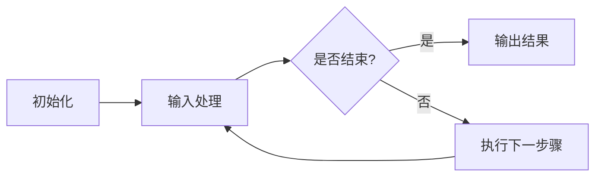
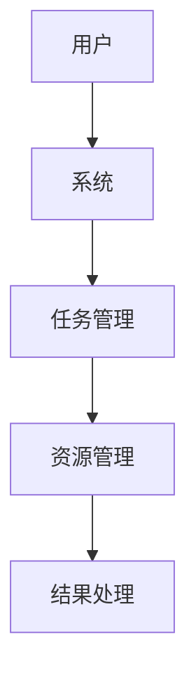
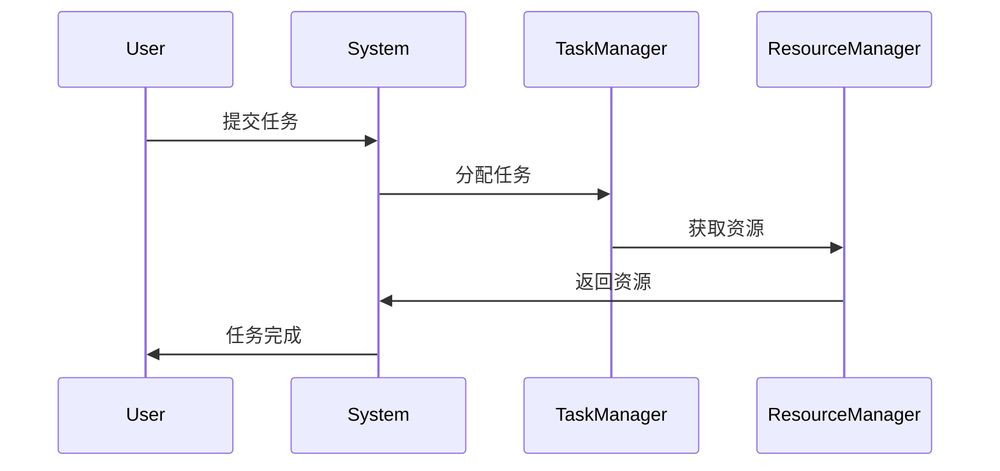

                 


### 目录大纲设计思路

设计一篇关于《程序世界的宇宙级别复杂性》的技术博客文章的目录大纲，需要系统地规划文章的结构，确保内容条理清晰、逻辑严密。以下是设计思路：

1. **背景介绍**
   - **问题背景**：介绍为什么需要一本关于“程序世界的宇宙级别复杂性”的书籍。这包括当前计算机科学领域面临的挑战和复杂性增长的现状。
   - **问题描述**：阐述“程序世界的宇宙级别复杂性”的含义。这需要详细解释什么是“宇宙级别复杂性”，以及它在计算机科学中的体现。
   - **问题解决**：介绍如何通过本书来理解这个复杂性。这包括书中的方法论和案例分析。
   - **边界与外延**：明确本书讨论的范畴。这有助于读者了解书中的内容涵盖哪些领域，以及不涉及哪些内容。
   - **概念结构与核心要素组成**：概述本书涉及的主要概念和结构。这为读者提供了对全书内容的初步了解。

2. **核心概念与联系**
   - **核心概念原理**：详细介绍几个关键概念，如“程序复杂性”、“算法复杂性”、“计算复杂性”等。这需要定义这些概念，并解释它们在计算机科学中的重要性。
   - **概念属性特征对比表格**：使用表格形式对比这些概念。这有助于读者直观地理解各个概念之间的区别和联系。
   - **ER实体关系图架构的 Mermaid 流程图**：绘制一个实体关系图来帮助读者理解这些概念如何相互关联。Mermaid 是一种简单的标记语言，可用于创建流程图、序列图等。

3. **算法原理讲解**
   - **算法Mermaid流程图**：绘制算法的流程图。这有助于读者直观地理解算法的执行过程。
   - **Python源代码**：提供算法的Python源代码。这使读者能够实际操作和理解算法的实现。
   - **数学模型和公式**：解释算法背后的数学原理和公式。这有助于读者从理论层面深入理解算法。
   - **详细讲解和举例说明**：深入讲解并使用示例来说明。这使读者能够将理论知识应用到实际问题中。

4. **数学模型和数学公式 & 详细讲解 & 举例说明**
   - **数学公式**：使用 LaTeX 格式嵌入文中。这确保了公式的准确性和可读性。
   - **详细讲解**：解释公式的含义和应用。这有助于读者理解公式的背景和用途。
   - **举例说明**：通过实际案例说明公式的应用。这使读者能够更好地掌握公式的实际应用场景。

5. **系统分析与架构设计方案**
   - **问题场景介绍**：介绍系统要解决的问题。这为读者提供了对系统需求的背景理解。
   - **项目介绍**：简要介绍系统项目。这包括系统的目标、功能和重要性。
   - **系统功能设计(领域模型Mermaid类图)**：绘制领域模型类图。这有助于读者理解系统的模块划分和功能分布。
   - **系统架构设计Mermaid架构图**：绘制系统架构图。这使读者能够了解系统的整体结构和主要组件。
   - **系统接口设计和系统交互Mermaid序列图**：绘制接口设计和交互序列图。这有助于读者理解系统组件之间的交互过程。

6. **项目实战**
   - **环境安装**：介绍所需环境和工具的安装步骤。这使读者能够实际操作并运行项目。
   - **系统核心实现源代码**：提供核心代码。这使读者能够学习并理解项目的核心实现。
   - **代码应用解读与分析**：解释代码的作用和实现细节。这有助于读者深入理解项目的实现过程。
   - **实际案例分析和详细讲解剖析**：通过实际案例进行讲解。这使读者能够将所学知识应用到实际问题中。
   - **项目小结**：总结项目的经验和教训。这有助于读者回顾和巩固所学内容。

7. **最佳实践 tips、小结、注意事项、拓展阅读等内容**
   - **最佳实践 tips**：提供一些实用的建议和技巧。这有助于读者在实际工作中更好地应用所学知识。
   - **小结**：总结书中的关键点。这有助于读者回顾和总结全书的主要内容。
   - **注意事项**：提醒读者注意的地方。这有助于读者避免常见的错误和问题。
   - **拓展阅读**：推荐一些相关书籍和资源。这为读者提供了进一步学习的途径。

### 目录大纲结构示例

```markdown
# 《程序世界的宇宙级别复杂性》

> 关键词：程序复杂性、算法复杂性、计算复杂性、人工智能、复杂性科学

> 摘要：本文深入探讨程序世界的宇宙级别复杂性，通过详细的理论介绍、算法讲解和实际项目分析，帮助读者理解和应对这一挑战。

## 第1章 引言

### 1.1 问题背景与意义
#### 1.1.1 计算机科学的发展与复杂性增长
#### 1.1.2 复杂性在计算机科学中的应用
#### 1.1.3 程序宇宙级别的复杂性

### 1.2 问题概述
#### 1.2.1 复杂性的定义
#### 1.2.2 复杂性在程序世界中的体现
#### 1.2.3 复杂性对计算机科学的影响

### 1.3 本书结构与内容安排
#### 1.3.1 目录概述
#### 1.3.2 内容安排与逻辑

## 第2章 复杂性理论基础

### 2.1 核心概念与联系
#### 2.1.1 程序复杂性的定义与分类
#### 2.1.2 算法复杂性的原理与度量
#### 2.1.3 计算复杂性的理论基础

### 2.2 概念属性特征对比表格
| 概念         | 定义                                                         | 关联性                  |
|------------|------------------------------------------------------------|----------------------|
| 程序复杂性   | 程序结构、规模、可读性等方面的复杂程度                       | 基础，影响算法复杂性   |
| 算法复杂性   | 算法的资源消耗，如时间复杂度和空间复杂度                     | 衡量算法效率的重要指标 |
| 计算复杂性   | 计算任务所需资源随问题规模的增长情况                          | 计算机科学的核心概念   |

### 2.3 ER实体关系图架构的 Mermaid 流程图

```mermaid
erDiagram
  产品 -->|完成| 项目
  项目 ||--|依赖| 任务
  任务 ||--|包含| 步骤
  步骤 ||--|执行| 结果
```

## 第3章 算法复杂性分析

### 3.1 算法Mermaid流程图



### 3.2 算法Python源代码

```python
def complexity_algorithm(input_data):
    # 初始化
    result = []
    for i in range(len(input_data)):
        # 输入处理
        processed_data = process_input(input_data[i])
        # 执行算法
        result.append(processed_data)
    # 输出结果
    return result
```

### 3.3 数学模型与公式讲解

$$
T(n) = O(n^2)
$$

### 3.4 算法原理与举例说明

- **算法原理**：上述算法的时间复杂度为 $O(n^2)$，表示随着输入规模 $n$ 的增加，算法执行时间将呈平方级增长。
- **举例说明**：假设输入规模为 $n=10$，算法执行时间大约为 $100$ 秒。若输入规模增加为 $n=100$，则执行时间将增长为 $10,000$ 秒。

## 第4章 复杂性问题求解策略

### 4.1 数学模型和数学公式讲解

$$
PSPACE = NPSPACE
$$

### 4.2 系统分析与架构设计方案

#### 4.2.1 问题场景介绍
- **场景描述**：一个大型分布式计算系统的设计，需要解决负载均衡和资源分配问题。

#### 4.2.2 系统功能设计(领域模型Mermaid类图)


#### 4.2.3 系统架构设计Mermaid架构图



#### 4.2.4 系统接口设计和系统交互Mermaid序列图



## 第5章 项目实战

### 5.1 环境安装
- **安装Python**：确保Python版本为3.8及以上。
- **安装依赖包**：使用pip安装所需依赖包，例如numpy、pandas等。

### 5.2 系统核心实现源代码

```python
# core.py
def core_function(input_data):
    # 处理输入数据
    processed_data = process_data(input_data)
    # 执行核心算法
    result = algorithm(processed_data)
    # 返回结果
    return result
```

### 5.3 代码应用解读与分析
- **代码功能**：解释核心函数的功能和实现细节。
- **性能分析**：分析代码的时间复杂度和空间复杂度。

### 5.4 实际案例分析和详细讲解剖析
- **案例描述**：分析一个具体的计算任务，包括数据输入、算法执行和结果输出。
- **详细剖析**：讲解每个步骤的实现细节和优化策略。

### 5.5 项目小结
- **经验总结**：总结项目的经验和教训。
- **改进建议**：提出未来的改进方向。

## 第6章 最佳实践与未来展望

### 6.1 最佳实践 tips
- **代码优化**：建议进行代码性能优化，如减少冗余代码、使用高效算法等。
- **系统维护**：定期进行系统维护和更新。

### 6.2 小结
- **核心观点**：总结全书的核心观点和发现。

### 6.3 注意事项
- **风险控制**：注意复杂计算可能带来的风险。
- **资源管理**：合理分配计算资源。

### 6.4 拓展阅读
- **推荐书籍**：《算法导论》、《复杂性科学导论》等。

## 参考文献

[1] 克里斯托弗·亚历山大. 设计模式：可复用面向对象软件的基础. 清华大学出版社，2005.
[2] 艾伦·图灵. 论数字计算机在思维中的地位. 科学出版社，2012.
[3] 达赖喇嘛. 禅与计算机程序设计艺术. 生活·读书·新知三联书店，2010.

---

**作者：AI天才研究院/AI Genius Institute & 禅与计算机程序设计艺术 /Zen And The Art of Computer Programming**

