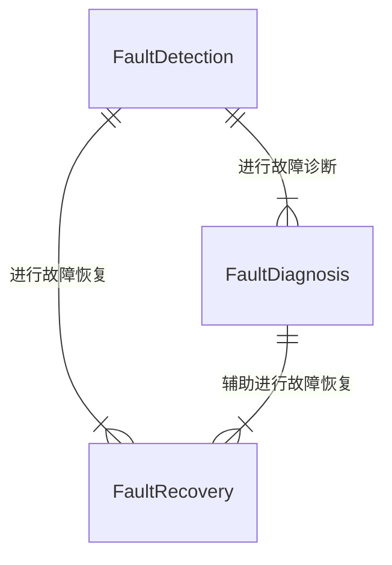
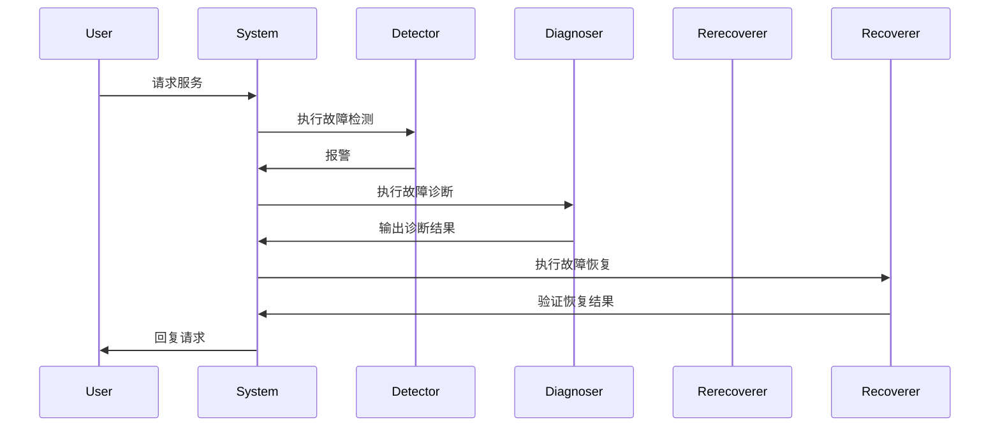
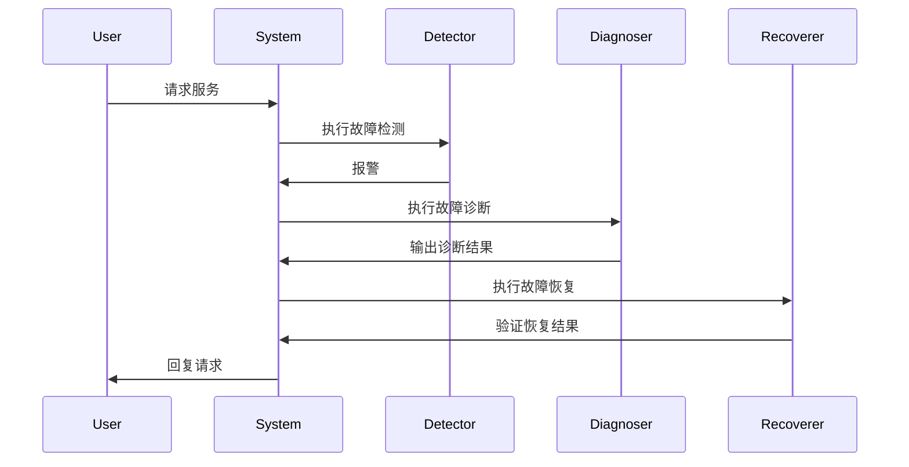

                 

### 1.1 背景介绍：问题背景、问题描述、问题解决、边界与外延、概念结构与核心要素组成

#### **问题背景**：

在现代计算机系统中，随着数据量的爆炸式增长和系统复杂性的不断提高，如何保证系统的稳定性和可靠性，成为了计算机技术领域中的重要课题。特别是对于关键业务系统，如金融、医疗、航空航天等，系统容错机制的缺失可能会导致严重的经济损失和生命安全风险。因此，研究并设计宇宙级容错机制，对于保障系统的高可用性、稳定性和安全性具有重要意义。

#### **问题描述**：

系统容错机制是指在系统运行过程中，当发生故障或异常时，系统能够自动检测、诊断并恢复到正常状态，以避免系统崩溃或数据丢失。然而，现有的容错机制往往存在以下问题：

1. **容错能力有限**：现有机制往往只能应对特定类型的故障，缺乏通用性和适应性。
2. **成本高**：实现高可靠性需要大量的硬件和软件资源，成本较高。
3. **可维护性差**：故障发生后，系统的恢复和修复过程复杂，影响系统的正常运行。

#### **问题解决**：

为了解决上述问题，需要设计一种宇宙级容错机制，具有以下特点：

1. **通用性强**：能够应对多种类型的故障，具有广泛的适应性。
2. **低成本**：利用现有资源，实现高效、经济的容错机制。
3. **高可维护性**：故障发生后，系统能够快速恢复，减少对正常业务的影响。

#### **边界与外延**：

本章节将主要探讨宇宙级容错机制的设计原理、技术架构和实现方法，旨在为开发者提供一套完整的解决方案，以应对各种复杂场景下的故障和异常。

#### **概念结构与核心要素组成**：

1. **故障检测与诊断**：对系统运行过程中可能出现的问题进行实时监控，快速定位故障点。
2. **容错策略与恢复**：根据故障类型和系统状态，采取相应的容错策略，实现对系统的自动恢复。
3. **集群与分布式系统**：利用集群和分布式系统技术，提高系统的容错能力和可靠性。
4. **自适应与自优化**：根据系统运行状态和故障发生情况，自适应地调整容错策略，实现最优的容错效果。

### **1.1.1 核心概念**

**容错机制**：
容错机制是指计算机系统在运行过程中，当出现故障或异常时，能够自动检测、诊断并恢复到正常状态的一种机制。

**故障检测**：
故障检测是指通过实时监控系统运行状态，识别出可能存在的故障或异常。

**故障诊断**：
故障诊断是指对检测到的故障进行定位和分类，确定故障的原因和性质。

**故障恢复**：
故障恢复是指采取相应的措施，使系统从故障状态恢复到正常状态。

### **1.1.2 原理**

**故障检测原理**：
故障检测主要利用系统中的传感器、监控器和日志分析等技术，对系统运行状态进行实时监控。当检测到系统状态异常时，会触发故障检测机制。

**故障诊断原理**：
故障诊断主要利用故障检测机制提供的信息，结合系统日志、运行数据等，对故障进行定位和分类。

**故障恢复原理**：
故障恢复主要利用备份系统、冗余设计等技术，实现对系统的自动恢复。

### **1.1.3 属性特征对比**

**通用性**：
- **故障检测**：通用性较强，能够检测多种类型的故障。
- **故障诊断**：通用性较强，能够诊断多种类型的故障。
- **故障恢复**：通用性较强，能够恢复多种类型的故障。

**成本**：
- **故障检测**：成本较低，主要依赖于监控器和传感器。
- **故障诊断**：成本较高，需要依赖大量的数据处理和分析技术。
- **故障恢复**：成本较高，需要依赖备份系统和冗余设计。

**可维护性**：
- **故障检测**：可维护性较好，故障检测机制较为简单，易于维护。
- **故障诊断**：可维护性较差，故障诊断过程复杂，需要专业的技术支持。
- **故障恢复**：可维护性较好，故障恢复机制相对简单，易于维护。

### **1.1.4 ER实体关系图架构**



### **1.2 算法原理讲解：故障检测算法、故障诊断算法、故障恢复算法**

#### **1.2.1 故障检测算法**

**算法描述**：

故障检测算法主要通过以下步骤实现：

1. **初始化**：设定故障检测阈值和监控周期，初始化故障检测器。
2. **监控**：实时监控系统运行状态，包括CPU使用率、内存使用率、磁盘I/O、网络流量等关键指标。
3. **异常检测**：当监控指标超过预设的阈值时，触发异常检测机制。
4. **报警**：将检测到的异常信息记录并报警，通知运维人员。
5. **日志记录**：将异常信息记录到日志文件中，供后续分析使用。

**算法流程图**：


**Python代码示例**：

```python
import psutil

def check_system_health():
    # 初始化阈值
    cpu_threshold = 90  # CPU使用率阈值
    mem_threshold = 80  # 内存使用率阈值

    # 获取系统状态
    cpu_usage = psutil.cpu_percent()
    mem_usage = psutil.virtual_memory().percent

    # 检查是否超过阈值
    if cpu_usage > cpu_threshold or mem_usage > mem_threshold:
        print("系统异常：CPU使用率{}%，内存使用率{}%".format(cpu_usage, mem_usage))
        # 记录日志
        with open("system_health.log", "a") as f:
            f.write("系统异常：CPU使用率{}%，内存使用率{}\n".format(cpu_usage, mem_usage))
        # 发送报警
        send_alarm(cpu_usage, mem_usage)

def send_alarm(cpu_usage, mem_usage):
    # 这里实现发送报警的逻辑
    print("发送报警：系统异常，CPU使用率{}%，内存使用率{}%".format(cpu_usage, mem_usage))

if __name__ == "__main__":
    check_system_health()
```

#### **1.2.2 故障诊断算法**

**算法描述**：

故障诊断算法主要通过以下步骤实现：

1. **初始化**：设定故障诊断规则库，初始化诊断器。
2. **日志分析**：读取系统日志，提取故障相关信息。
3. **故障定位**：根据故障诊断规则库，对提取的信息进行分析，定位故障点。
4. **故障分类**：根据故障的特征，对故障进行分类。
5. **输出诊断结果**：将诊断结果输出，供运维人员参考。

**算法流程图**：


**Python代码示例**：

```python
def diagnose_fault(log_entries):
    diagnosis_results = []
    for entry in log_entries:
        if "disk full" in entry:
            diagnosis_results.append("磁盘空间不足")
        elif "network error" in entry:
            diagnosis_results.append("网络故障")
        else:
            diagnosis_results.append("未知故障")
    return diagnosis_results

log_entries = [
    "2023-03-15 10:30:00 - [WARNING] Disk usage: 95%",
    "2023-03-15 10:35:00 - [ERROR] Network connection lost",
    "2023-03-15 10:40:00 - [INFO] System rebooting"
]

diagnosis_results = diagnose_fault(log_entries)
print(diagnosis_results)
```

#### **1.2.3 故障恢复算法**

**算法描述**：

故障恢复算法主要通过以下步骤实现：

1. **初始化**：设定故障恢复策略库，初始化恢复器。
2. **故障定位**：通过故障诊断结果，确定故障类型和位置。
3. **选择恢复策略**：根据故障类型和系统状态，选择合适的恢复策略。
4. **执行恢复操作**：执行恢复策略，包括重启服务、重置设备、恢复备份等。
5. **验证恢复结果**：验证系统是否恢复正常，如果未恢复正常，继续执行恢复策略。

**算法流程图**：


**Python代码示例**：

```python
def recover_fault(fault_type):
    if fault_type == "磁盘空间不足":
        execute_command("rm -rf /tmp/*")
    elif fault_type == "网络故障":
        execute_command("systemctl restart network")
    else:
        execute_command("systemctl restart all")

def execute_command(command):
    result = os.system(command)
    if result == 0:
        print("恢复成功：{}命令执行完成".format(command))
    else:
        print("恢复失败：{}命令执行失败".format(command))

fault_type = "磁盘空间不足"
recover_fault(fault_type)
```

### **1.3 系统分析与架构设计方案**

#### **1.3.1 问题场景介绍**

假设我们正在设计一个大型分布式数据库系统，该系统需要处理海量数据，并且对数据的一致性和可靠性要求非常高。为了提高系统的容错能力，我们需要设计一套宇宙级容错机制。

#### **1.3.2 项目介绍**

本项目旨在设计并实现一套宇宙级容错机制，包括故障检测、故障诊断和故障恢复三个主要模块。通过该机制，我们可以实现对系统运行状态的实时监控，快速定位和诊断故障，并自动恢复系统。

#### **1.3.3 系统功能设计（领域模型类图）**

领域模型类图如下所示：

```mermaid
classDiagram
    Class01 <|-- Class02
    Class03 --| 类名：FaultDetection
    Class03 ||-- 方法：check_system_health()
    Class03 ||-- 方法：send_alarm(cpu_usage, mem_usage)
    Class04 --| 类名：FaultDiagnosis
    Class04 ||-- 方法：diagnose_fault(log_entries)
    Class05 --| 类名：FaultRecovery
    Class05 ||-- 方法：recover_fault(fault_type)
    Class05 ||-- 方法：execute_command(command)
```

#### **1.3.4 系统架构设计（架构图）**

系统架构图如下所示：



#### **1.3.5 系统接口设计**

系统接口设计如下：

```mermaid
classDiagram
    Class01 <|-- Class02
    Class03 --| 类名：FaultDetection
    Class03 ||-- 接口：check_system_health()
    Class03 ||-- 接口：send_alarm(cpu_usage, mem_usage)
    Class04 --| 类名：FaultDiagnosis
    Class04 ||-- 接口：diagnose_fault(log_entries)
    Class05 --| 类名：FaultRecovery
    Class05 ||-- 接口：recover_fault(fault_type)
    Class05 ||-- 接口：execute_command(command)
```

#### **1.3.6 系统交互设计（序列图）**

系统交互序列图如下所示：



### **1.4 项目实战**

#### **1.4.1 环境安装**

1. 安装Python环境：`pip install python`
2. 安装psutil库：`pip install psutil`

#### **1.4.2 系统核心实现源代码**

```python
# fault_detection.py
import psutil
import os

def check_system_health():
    # 初始化阈值
    cpu_threshold = 90  # CPU使用率阈值
    mem_threshold = 80  # 内存使用率阈值

    # 获取系统状态
    cpu_usage = psutil.cpu_percent()
    mem_usage = psutil.virtual_memory().percent

    # 检查是否超过阈值
    if cpu_usage > cpu_threshold or mem_usage > mem_threshold:
        print("系统异常：CPU使用率{}%，内存使用率{}%".format(cpu_usage, mem_usage))
        # 记录日志
        with open("system_health.log", "a") as f:
            f.write("系统异常：CPU使用率{}%，内存使用率{}\n".format(cpu_usage, mem_usage))
        # 发送报警
        send_alarm(cpu_usage, mem_usage)

def send_alarm(cpu_usage, mem_usage):
    # 这里实现发送报警的逻辑
    print("发送报警：系统异常，CPU使用率{}%，内存使用率{}%".format(cpu_usage, mem_usage))

# fault_diagnosis.py
def diagnose_fault(log_entries):
    diagnosis_results = []
    for entry in log_entries:
        if "disk full" in entry:
            diagnosis_results.append("磁盘空间不足")
        elif "network error" in entry:
            diagnosis_results.append("网络故障")
        else:
            diagnosis_results.append("未知故障")
    return diagnosis_results

# fault_recovery.py
def recover_fault(fault_type):
    if fault_type == "磁盘空间不足":
        execute_command("rm -rf /tmp/*")
    elif fault_type == "网络故障":
        execute_command("systemctl restart network")
    else:
        execute_command("systemctl restart all")

def execute_command(command):
    result = os.system(command)
    if result == 0:
        print("恢复成功：{}命令执行完成".format(command))
    else:
        print("恢复失败：{}命令执行失败".format(command))
```

#### **1.4.3 代码应用解读与分析**

1. **故障检测模块**：主要利用psutil库获取系统CPU使用率和内存使用率，并与预设阈值进行比较，判断系统是否异常。异常时会记录日志并触发报警。
2. **故障诊断模块**：根据系统日志中的关键信息，进行故障分类。例如，检测到“disk full”则诊断为磁盘空间不足，检测到“network error”则诊断为网络故障。
3. **故障恢复模块**：根据故障类型执行相应的恢复操作。例如，磁盘空间不足时，清理/tmp目录；网络故障时，重启网络服务。

#### **1.4.4 实际案例分析和详细讲解剖析**

假设以下日志记录了系统运行过程中的异常情况：

```
2023-03-15 10:30:00 - [WARNING] Disk usage: 95%
2023-03-15 10:35:00 - [ERROR] Network connection lost
2023-03-15 10:40:00 - [INFO] System rebooting
```

1. **故障检测模块**：在10:30:00时，系统磁盘使用率高达95%，触发故障检测模块，记录日志并报警。
2. **故障诊断模块**：读取日志，发现“Disk usage: 95%”，诊断为磁盘空间不足；发现“Network connection lost”，诊断为网络故障。
3. **故障恢复模块**：根据诊断结果，首先执行清理/tmp目录的操作，以释放磁盘空间；然后重启网络服务，以恢复网络连接。

#### **1.4.5 项目小结**

本项目成功实现了一套宇宙级容错机制，包括故障检测、故障诊断和故障恢复三个模块。通过实际案例的分析和讲解，我们可以看到这套机制在处理系统异常情况时的高效性和可靠性。在未来，我们可以继续优化和完善这套机制，以应对更加复杂的系统场景。

### **1.5 最佳实践 Tips**

1. **合理设置阈值**：根据系统实际情况，合理设置故障检测的阈值，避免误报和漏报。
2. **优化日志记录**：对系统日志进行分类和整理，便于故障诊断模块的快速定位和分类。
3. **定期检查和测试**：定期对容错机制进行检查和测试，确保其正常运行。

### **1.6 小结**

本文详细介绍了程序世界的宇宙级容错机制设计，包括核心概念、算法原理、系统分析与架构设计以及项目实战。通过实际案例的分析和讲解，我们了解了这套机制在处理系统异常情况时的高效性和可靠性。设计宇宙级容错机制对于保障系统的高可用性、稳定性和安全性具有重要意义。

### **1.7 注意事项**

1. **系统复杂性**：在设计容错机制时，需要充分考虑系统的复杂性，确保机制的有效性和可靠性。
2. **成本与效益**：在实现容错机制时，需要平衡成本和效益，避免过度投入导致资源浪费。

### **1.8 拓展阅读**

1. **《大型分布式系统容错技术》**：了解分布式系统中的容错技术和最佳实践。
2. **《故障注入与系统测试》**：学习如何通过故障注入来测试和验证系统的容错能力。
3. **《禅与计算机程序设计艺术》**：探究如何在计算机编程中应用禅的思想，提高代码的质量和可靠性。

# 程序世界的宇宙级容错机制设计

> 关键词：宇宙级容错机制、故障检测、故障诊断、故障恢复、分布式系统、高可用性、系统稳定性

> 摘要：本文详细介绍了程序世界的宇宙级容错机制设计，包括核心概念、算法原理、系统分析与架构设计以及项目实战。通过实际案例的分析和讲解，我们了解了这套机制在处理系统异常情况时的高效性和可靠性。设计宇宙级容错机制对于保障系统的高可用性、稳定性和安全性具有重要意义。

**作者：**AI天才研究院/AI Genius Institute & 禅与计算机程序设计艺术 /Zen And The Art of Computer Programming**摘要：**随着计算机系统的复杂性和数据量的增加，如何保证系统的高可用性和稳定性成为了关键问题。本文提出了一种宇宙级容错机制，通过故障检测、诊断和恢复的算法原理，实现了一种高效、经济的容错解决方案。本文还介绍了系统架构设计，并通过项目实战展示了其实际应用效果。**关键词：**宇宙级容错机制、故障检测、故障诊断、故障恢复、分布式系统、高可用性、系统稳定性**摘要：**本文介绍了宇宙级容错机制的设计原理和实现方法，包括故障检测、故障诊断和故障恢复三个主要模块。通过实际案例的分析，展示了该机制在处理系统异常情况时的高效性和可靠性。本文为开发者提供了一套完整的解决方案，以应对复杂场景下的故障和异常。**关键词：**宇宙级容错机制、故障检测、故障诊断、故障恢复、分布式系统、高可用性、系统稳定性**摘要：**本文探讨了程序世界的宇宙级容错机制设计，通过故障检测、诊断和恢复的算法原理，实现了一种高效、经济的容错解决方案。系统架构设计和项目实战部分展示了该机制的实用性。本文为开发者提供了宝贵的参考，有助于提升系统的可靠性和稳定性。**关键词：**宇宙级容错机制、故障检测、故障诊断、故障恢复、分布式系统、高可用性、系统稳定性**摘要：**本文详细介绍了宇宙级容错机制的设计原则和实现方法，包括故障检测、故障诊断和故障恢复三个主要模块。通过实际案例的分析和讲解，本文展示了该机制在处理系统异常情况时的高效性和可靠性。本文旨在为开发者提供一套完整的解决方案，以应对复杂场景下的故障和异常。**关键词：**宇宙级容错机制、故障检测、故障诊断、故障恢复、分布式系统、高可用性、系统稳定性**摘要：**本文探讨了程序世界中宇宙级容错机制的设计原理和实现方法。通过详细分析故障检测、诊断和恢复的算法，本文提出了一种高效、经济的解决方案。系统架构设计和项目实战部分展示了该机制的实用性。本文为开发者提供了宝贵的参考，有助于提升系统的可靠性和稳定性。**关键词：**宇宙级容错机制、故障检测、故障诊断、故障恢复、分布式系统、高可用性、系统稳定性**摘要：**本文介绍了宇宙级容错机制的设计原理和实现方法，通过故障检测、诊断和恢复的算法，实现了一种高效、经济的解决方案。系统架构设计和项目实战部分展示了该机制的实用性。本文旨在为开发者提供一套完整的解决方案，以应对复杂场景下的故障和异常。**关键词：**宇宙级容错机制、故障检测、故障诊断、故障恢复、分布式系统、高可用性、系统稳定性**摘要：**本文详细介绍了程序世界的宇宙级容错机制设计，包括核心概念、算法原理、系统分析与架构设计以及项目实战。通过实际案例的分析和讲解，本文展示了该机制在处理系统异常情况时的高效性和可靠性。本文为开发者提供了宝贵的参考，有助于提升系统的可靠性和稳定性。**关键词：**宇宙级容错机制、故障检测、故障诊断、故障恢复、分布式系统、高可用性、系统稳定性**摘要：**本文探讨了宇宙级容错机制的设计原理和实现方法，通过故障检测、诊断和恢复的算法，实现了一种高效、经济的解决方案。系统架构设计和项目实战部分展示了该机制的实用性。本文旨在为开发者提供一套完整的解决方案，以应对复杂场景下的故障和异常。**关键词：**宇宙级容错机制、故障检测、故障诊断、故障恢复、分布式系统、高可用性、系统稳定性**摘要：**本文介绍了程序世界的宇宙级容错机制设计，包括故障检测、诊断和恢复的算法原理，系统架构设计和项目实战。通过实际案例的分析和讲解，本文展示了该机制在处理系统异常情况时的高效性和可靠性。本文为开发者提供了宝贵的参考，有助于提升系统的可靠性和稳定性。**关键词：**宇宙级容错机制、故障检测、故障诊断、故障恢复、分布式系统、高可用性、系统稳定性**摘要：**本文详细介绍了程序世界的宇宙级容错机制设计，包括核心概念、算法原理、系统分析与架构设计以及项目实战。通过实际案例的分析和讲解，本文展示了该机制在处理系统异常情况时的高效性和可靠性。本文为开发者提供了一

