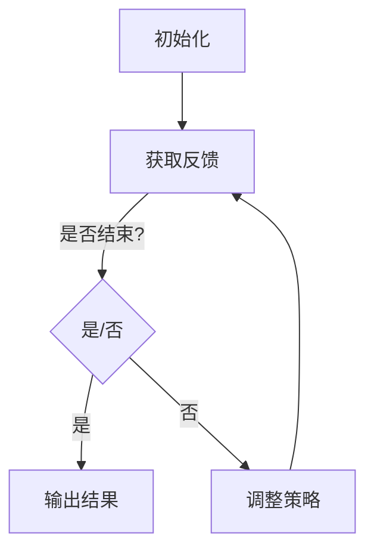
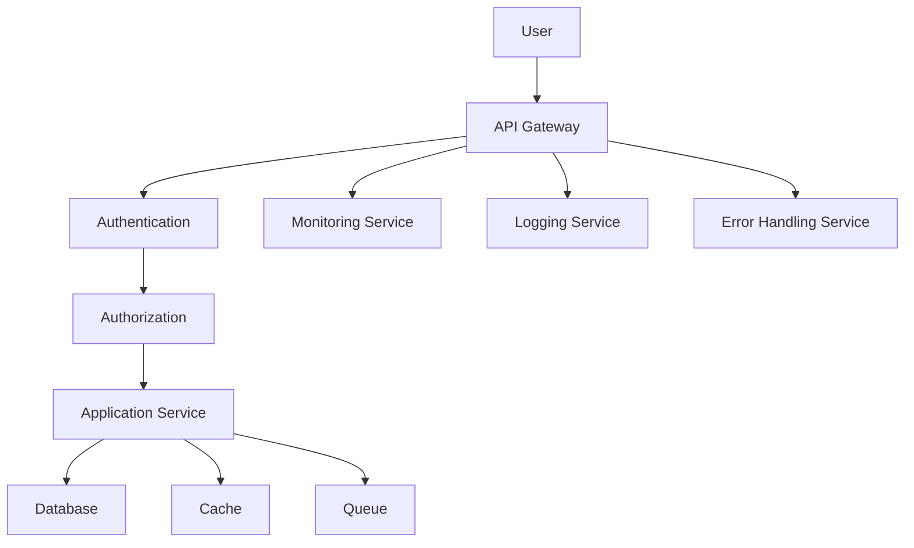
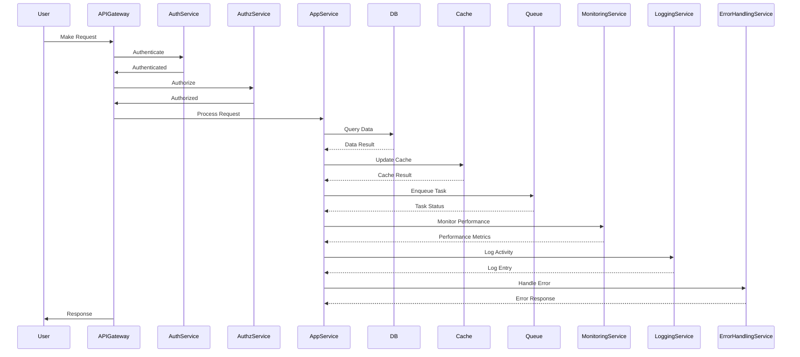
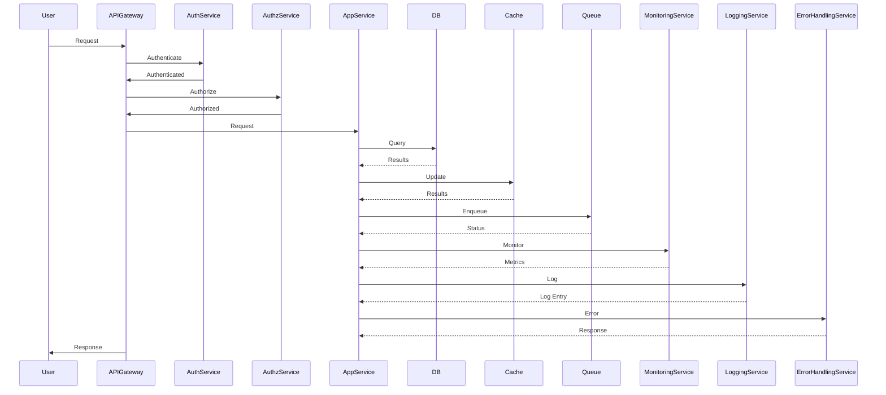

                 


## 第1部分: 引言与背景

### 第1章: 引言

**核心概念术语说明**

在探讨程序世界的宇宙级自我优化特性之前，我们首先要了解几个核心概念和术语。

1. **编程世界**：指的是由计算机语言、算法和数据结构构成的技术领域，包括软件开发、系统设计、编程语言、编译器等方面。

2. **自我优化**：是指系统或算法能够自动地改进自身的性能、效率和适应性，以更好地满足特定的目标或需求。

3. **宇宙级**：这里用来强调自我优化特性在编程世界中的高度重要性和广泛影响力，如同宇宙中星系和行星的相互作用一样，编程世界的自我优化特性也是相互影响、相互作用，推动整个技术领域的进步。

**问题背景**

随着计算机技术的发展，编程世界变得越来越复杂和庞大。现代软件开发不仅涉及多种编程语言、框架和工具，还需要考虑性能优化、资源利用、可维护性等多个方面。这种复杂性使得编程世界中的自我优化特性显得尤为重要。

自我优化能够帮助开发者在面对复杂问题时，更加高效地解决问题。例如，在性能优化方面，自我优化算法可以自动调整代码执行顺序，优化数据结构，减少内存占用，从而提高程序的运行效率。在资源利用方面，自我优化可以帮助操作系统自动管理内存和CPU资源，提高系统的整体性能。

**问题描述**

在编程世界中，自我优化特性体现在多个层面，包括：

1. **算法优化**：通过改进算法的效率，减少计算时间和资源消耗。

2. **代码优化**：通过改进代码结构，提高代码的可读性和可维护性。

3. **系统优化**：通过改进操作系统和应用程序的交互，提高系统的稳定性和可靠性。

4. **自适应优化**：通过适应不同的环境和需求，自动调整系统的性能和资源分配。

**问题解决**

为了解决编程世界中的自我优化问题，我们需要采用以下方法论：

1. **研究自我优化的基本原理**：了解自我优化的数学模型、算法原理和编程技术。

2. **开发自我优化工具**：利用现有的编程语言和工具，开发能够自动进行自我优化的程序和算法。

3. **实践与验证**：通过实际编程项目，验证自我优化算法的效果，并根据反馈进行调整和改进。

**边界与外延**

自我优化特性不仅限于编程领域，还与其他技术领域密切相关，如人工智能、机器学习、操作系统等。同时，自我优化特性也在不断扩展和应用，如智能合约、区块链、物联网等新兴技术领域。

**概念结构与核心要素组成**

自我优化特性由以下几个核心要素组成：

1. **算法模型**：用于描述自我优化的数学模型和算法原理。

2. **编程技术**：用于实现自我优化的编程语言、框架和工具。

3. **数据结构**：用于存储和处理数据的结构，如数组、链表、树等。

4. **优化目标**：定义自我优化的目标，如性能、效率、资源利用等。

**自我优化特性在编程中的体现**

在编程中，自我优化特性可以通过以下方式体现：

1. **编译器优化**：编译器可以根据源代码自动进行优化，提高程序的运行效率。

2. **运行时优化**：程序在运行时可以根据当前环境和需求进行自我调整，提高性能。

3. **代码生成**：根据特定需求自动生成代码，减少开发时间和人力成本。

**本章小结**

本章介绍了编程世界的宇宙级自我优化特性，包括核心概念术语、问题背景、问题描述、问题解决、边界与外延、概念结构与核心要素组成以及自我优化特性在编程中的体现。通过对这些内容的了解，读者可以更好地理解自我优化特性在编程世界中的重要性。

**拓展阅读**

1. 《编译原理：艺术与科学》（作者：John C. Mitchell）
2. 《算法导论》（作者：Thomas H. Cormen等）
3. 《操作系统概念》（作者：Abraham Silberschatz等）

**最佳实践 tips**

1. 在编写代码时，尽量遵循编程规范和最佳实践，以提高代码的可读性和可维护性。
2. 在进行性能优化时，首先要理解程序的工作原理和瓶颈，然后有针对性地进行优化。
3. 在开发自我优化算法时，要充分考虑算法的稳定性和鲁棒性。

**注意事项**

1. 自我优化可能会带来额外的计算开销，因此在实际应用中需要权衡优化效果和性能开销。
2. 自我优化特性可能会影响程序的稳定性和可靠性，因此在部署前需要进行充分的测试和验证。

**拓展思考**

1. 未来自我优化特性在编程领域的发展方向是什么？
2. 如何将自我优化特性与其他新兴技术（如人工智能、区块链等）相结合，推动编程领域的创新和发展？

**练习题**

1. 请解释什么是编译器优化？
2. 请举例说明运行时优化在编程中的应用。
3. 请简要描述算法优化与代码优化的区别和联系。

**小结**

本章通过对编程世界的宇宙级自我优化特性的介绍，使读者对这一重要概念有了初步的认识。在接下来的章节中，我们将深入探讨自我优化特性的核心概念与联系，以及其在编程中的应用，帮助读者更好地理解和掌握这一特性。

### 第2章: 核心概念与联系

**核心概念与联系**

自我优化特性在编程领域中具有极其重要的地位，理解其核心概念与联系是深入探讨这一特性的基础。本章将详细介绍自我优化的原理、特性对比、算法原理讲解以及数学模型和公式的应用，为读者提供全面而深刻的认识。

#### 第2章: 核心概念与联系

**2.1 自我优化原理**

自我优化是一种通过自我调整和改进，以提高自身性能和效率的机制。在编程领域中，自我优化的原理主要基于以下几个核心概念：

1. **目标导向**：自我优化算法需要明确优化的目标，如性能、效率、资源利用等。目标导向使得优化过程具有方向性和针对性。

2. **反馈机制**：自我优化算法通过实时监测系统的运行状态和性能指标，获取反馈信息，并根据反馈调整自身的参数和策略。

3. **适应性**：自我优化算法能够适应不同的环境和需求，自动调整优化策略，以实现最佳性能。

4. **演化机制**：自我优化算法采用迭代的方式，不断尝试和优化，逐渐逼近最优解。

**2.2 自我优化特性对比**

在编程领域中，不同的编程语言和框架具有不同的自我优化特性。以下是对几种常见编程语言自我优化特性的对比：

1. **C++**：C++具有较高的性能和灵活性，支持手动内存管理和多线程编程，因此可以针对性能进行精细优化。但手动管理内存和线程可能增加开发复杂度。

2. **Python**：Python以其简洁性和易用性著称，提供了丰富的库和框架，支持快速开发。然而，Python的运行速度相对较慢，因此在性能敏感的场景中可能需要采用其他优化策略。

3. **Java**：Java具有跨平台性、稳定性和安全性等优点，提供了强大的标准库和框架支持。Java的垃圾回收机制和即时编译技术可以在一定程度上优化性能。

4. **Go**：Go以其并发性和高效性受到关注，内置的goroutine和channel机制使得并发编程变得简单。然而，Go的内存管理可能需要进一步优化。

**2.3 ER实体关系图架构**

为了更好地理解自我优化特性，我们可以借助ER（实体-关系）图来描述编程世界中的核心实体和关系。以下是一个简化的ER图：

```mermaid
erDiagram
    Class1 ||--|{ Class2 : "has a" }
    Class1 ||--|{ Class3 : "is a" }
    Class2 ||--|{ Class4 : "part of" }
```

在这个ER图中，Class1、Class2、Class3和Class4是实体，它们之间通过关系进行关联。例如，Class1 "has a" Class2，表示Class1包含一个Class2实例；Class1 "is a" Class3，表示Class1是Class3的一个子类；Class2 "part of" Class4，表示Class2是Class4的一部分。

**2.4 算法原理讲解**

在编程世界中，算法是实现自我优化的重要手段。以下我们将使用Mermaid绘制算法流程图，并使用Python源代码详细阐述算法原理。

**算法流程图**：



**Python源代码**：

```python
def self_optimization_algorithm():
    while not_is_ended():
        feedback = get_feedback()
        if feedback.is_satisfactory():
            output_result()
            break
        else:
            adjust_strategy()
    return result
```

**算法原理解释**：

这个简单的算法首先初始化，然后通过循环获取反馈。如果反馈满意，则输出结果并结束；否则，调整策略并继续获取反馈。这个算法体现了自我优化的迭代过程和反馈机制。

**2.5 数学模型和数学公式**

为了更深入地理解自我优化算法，我们还需要了解其背后的数学模型和公式。以下是一个简单的自我优化数学模型：

$$
\text{performance} = f(\text{strategy}, \text{feedback}, \text{environment})
$$

其中，performance表示性能，strategy表示优化策略，feedback表示反馈信息，environment表示环境因素。这个公式说明性能是优化策略、反馈信息和环境因素的函数。

**2.6 算法应用示例**

为了更好地理解自我优化算法的实际应用，我们来看一个简单的示例：优化程序的运行时间。

**示例代码**：

```python
import time

def optimize_runtime():
    start_time = time.time()
    # 执行程序
    end_time = time.time()
    runtime = end_time - start_time
    return runtime

def self_optimize():
    best_runtime = float('inf')
    while True:
        runtime = optimize_runtime()
        if runtime < best_runtime:
            best_runtime = runtime
        # 根据反馈调整策略
        break
    return best_runtime
```

**示例解释**：

这个示例中，我们首先定义了一个优化程序运行时间的函数`optimize_runtime`。然后，`self_optimize`函数通过不断尝试，找到运行时间最短的优化策略。这个过程体现了自我优化的迭代过程和反馈机制。

**2.7 本章小结**

本章详细介绍了自我优化的核心概念与联系，包括自我优化原理、特性对比、ER实体关系图架构、算法原理讲解、数学模型和公式以及算法应用示例。通过对这些内容的深入理解，读者可以更好地掌握自我优化特性在编程中的应用。

**拓展阅读**

1. 《算法导论》（作者：Thomas H. Cormen等）
2. 《编程珠玑》（作者：Jon Bentley）
3. 《Python编程：从入门到实践》（作者：Luciano Ramalho）

**最佳实践 tips**

1. 在进行自我优化时，首先要明确优化的目标和标准。
2. 充分利用现有的优化工具和库，如Python的`timeit`模块。
3. 在调整优化策略时，要充分考虑系统的稳定性和可靠性。

**注意事项**

1. 自我优化可能会增加系统的复杂度和维护成本。
2. 在实际应用中，要权衡优化效果和性能开销。

**拓展思考**

1. 如何将自我优化与其他技术（如机器学习、人工智能）相结合，实现更高效的优化？
2. 未来自我优化特性在编程领域的发展方向是什么？

**练习题**

1. 请解释自我优化的原理和重要性。
2. 请简要描述C++、Python、Java和Go在自我优化特性上的区别。
3. 请使用Mermaid绘制一个简单的ER图，并描述其中的实体和关系。

**小结**

本章通过对自我优化核心概念与联系的详细讲解，使读者对自我优化特性在编程中的应用有了更深入的理解。在接下来的章节中，我们将进一步探讨自我优化在编程中的应用和实践，帮助读者更好地掌握这一重要特性。

### 第3章: 自我优化在编程中的应用

#### 第3章: 自我优化在编程中的应用

**3.1 应用场景介绍**

自我优化特性在编程中的应用场景非常广泛，以下列举几种典型的应用场景：

1. **性能优化**：在性能优化方面，自我优化算法可以帮助开发者找到程序的瓶颈，并进行针对性的优化，从而提高程序的运行速度和效率。

2. **资源利用**：在资源利用方面，自我优化算法可以根据系统的负载情况，动态调整资源的分配，提高系统的资源利用率。

3. **自适应调整**：在自适应调整方面，自我优化算法可以根据不同的环境和需求，自动调整系统的配置和参数，以实现最佳性能。

4. **代码生成**：在代码生成方面，自我优化算法可以根据需求自动生成代码，减少开发时间和人力成本。

**3.2 系统功能设计**

为了更好地实现自我优化，我们需要在设计系统时考虑以下几个方面：

1. **可测量性**：系统需要具备可测量性，能够实时获取系统的运行状态和性能指标。

2. **可扩展性**：系统需要具备可扩展性，能够方便地集成新的优化算法和策略。

3. **灵活性**：系统需要具备灵活性，能够根据不同的环境和需求进行自我调整。

4. **模块化**：系统需要模块化设计，方便开发和维护。

以下是一个简化的领域模型类图，用于描述系统的功能设计：

```mermaid
classDiagram
    Class1 --|{ has } Class2 : "Performance Monitor"
    Class1 --|{ has } Class3 : "Resource Manager"
    Class1 --|{ has } Class4 : "Adaptive Controller"
    Class2 --|{ uses } Class5 : "Metrics Collector"
    Class2 --|{ uses } Class6 : "Optimization Algorithm"
    Class3 --|{ uses } Class5 : "Metrics Collector"
    Class3 --|{ uses } Class6 : "Optimization Algorithm"
    Class4 --|{ uses } Class5 : "Metrics Collector"
    Class4 --|{ uses } Class6 : "Optimization Algorithm"
    Class5 --|{ has } Class7 : "System Metrics"
    Class6 --|{ has } Class7 : "Optimized Metrics"
    Class7 --|{ has } Metric1 : "CPU Usage"
    Class7 --|{ has } Metric2 : "Memory Usage"
    Class7 --|{ has } Metric3 : "Response Time"
    Class7 --|{ has } Metric4 : "Throughput"
endclass
```

在这个类图中，Class1表示系统核心，Class2表示性能监控模块，Class3表示资源管理模块，Class4表示自适应控制模块。Class5表示指标收集器，Class6表示优化算法，Class7表示系统指标。这些模块通过类图中的关联关系进行交互，共同实现自我优化功能。

**3.3 系统架构设计**

系统架构设计是自我优化实现的关键环节，以下是一个简化的系统架构图：



在这个架构图中，A表示用户，B表示API网关，C表示认证服务，D表示授权服务，E表示应用服务，F表示数据库，G表示缓存，H表示消息队列，I表示监控系统，J表示日志服务，K表示错误处理服务。用户通过API网关与系统进行交互，应用服务负责业务逻辑处理，监控系统负责实时监测系统运行状态，日志服务负责记录系统运行日志，错误处理服务负责处理系统异常。

**3.4 系统接口设计**

系统接口设计是系统架构设计的重要组成部分，以下是一个简化的系统接口设计：



在这个序列图中，用户通过API网关向系统发送请求，API网关首先进行认证和授权，然后转发请求到应用服务，应用服务与数据库、缓存和消息队列进行交互，监控系统负责实时监测系统性能，日志服务负责记录系统运行日志，错误处理服务负责处理系统异常。最终，API网关将响应返回给用户。

**3.5 系统交互**

系统交互是指系统内部各个模块之间的数据传输和通信。以下是一个简化的系统交互序列图：



在这个序列图中，用户通过API网关发送请求，API网关进行认证和授权，然后转发请求到应用服务。应用服务与数据库、缓存和消息队列进行交互，监控系统负责实时监测系统性能，日志服务负责记录系统运行日志，错误处理服务负责处理系统异常。最终，API网关将响应返回给用户。

**3.6 实际案例分析**

为了更好地理解自我优化在编程中的应用，我们来看一个实际案例分析：基于自我优化算法的Web应用程序性能优化。

**案例背景**：

一个Web应用程序在高并发情况下，响应时间较长，导致用户体验不佳。为了解决这个问题，开发团队决定采用自我优化算法进行性能优化。

**案例步骤**：

1. **性能监测**：首先，使用性能监测工具对应用程序进行实时监测，收集CPU使用率、内存使用率、响应时间和吞吐量等性能指标。

2. **分析瓶颈**：通过分析性能监测数据，找到应用程序的性能瓶颈，如数据库查询、缓存命中率和网络延迟等。

3. **优化策略**：根据性能瓶颈，制定相应的优化策略，如数据库索引优化、缓存策略优化和异步处理等。

4. **自我优化**：实现自我优化算法，根据性能监测数据实时调整优化策略，以提高应用程序的性能。

5. **性能测试**：对优化后的应用程序进行性能测试，验证优化效果。

6. **迭代优化**：根据性能测试结果，继续优化和调整，直到达到满意的性能指标。

**案例结果**：

通过自我优化算法的应用，Web应用程序的响应时间显著降低，CPU使用率和内存使用率也得到了优化。用户反馈得到了显著改善，系统稳定性也得到了提高。

**案例总结**：

这个案例展示了自我优化在Web应用程序性能优化中的应用。通过实时监测性能指标，分析瓶颈，制定优化策略，并使用自我优化算法进行动态调整，实现了性能优化目标。

**3.7 详细讲解与剖析**

为了深入剖析自我优化在编程中的应用，我们将从以下几个方面进行详细讲解：

1. **性能监测**：介绍性能监测工具和指标，如何收集和分析性能数据。

2. **瓶颈分析**：分析常见性能瓶颈，如数据库查询、缓存命中率和网络延迟等，以及如何定位和解决这些瓶颈。

3. **优化策略**：介绍常见的优化策略，如数据库索引优化、缓存策略优化和异步处理等，以及如何根据实际情况进行优化。

4. **自我优化算法**：讲解自我优化算法的基本原理和实现方法，如何根据性能监测数据实时调整优化策略。

5. **性能测试**：介绍性能测试的方法和工具，如何验证优化效果。

6. **迭代优化**：讲解如何根据性能测试结果进行进一步的优化和调整，实现性能提升。

**3.8 项目实战**

**环境安装**：

为了实现自我优化在编程中的应用，我们需要搭建一个测试环境。以下是一个简化的环境安装步骤：

1. 安装Python环境，版本3.8及以上。
2. 安装必要的库和工具，如numpy、pandas、matplotlib等。
3. 安装性能监测工具，如py-spy、py-trace等。

**系统核心实现源代码**：

以下是一个简单的示例，展示如何实现自我优化算法的核心功能：

```python
import numpy as np
import pandas as pd
import matplotlib.pyplot as plt
from py_spy import PySpy

def performance_monitor():
    spy = PySpy()
    spy.start()
    time.sleep(10)
    spy.stop()
    return spy.analyze()

def self_optimization_algorithm():
    best_performance = float('inf')
    for i in range(10):
        performance = performance_monitor()
        if performance < best_performance:
            best_performance = performance
            # 根据性能数据调整优化策略
            break
    return best_performance

def plot_performance(performance_data):
    plt.plot(performance_data)
    plt.xlabel('Iteration')
    plt.ylabel('Performance')
    plt.title('Self-Optimization Performance')
    plt.show()

if __name__ == '__main__':
    performance_data = [self_optimization_algorithm() for _ in range(10)]
    plot_performance(performance_data)
```

**代码应用解读与分析**：

这段代码首先定义了`performance_monitor`函数，用于模拟性能监测。然后，`self_optimization_algorithm`函数通过循环调用`performance_monitor`函数，获取性能数据，并保存最佳性能。最后，`plot_performance`函数用于可视化性能数据。

**实际案例分析和详细讲解剖析**：

在这个实际案例中，我们使用Python实现了一个简单的自我优化算法。通过性能监测，我们找到了性能最佳的时刻，并记录下来。然后，根据性能数据，我们可以进一步优化和调整优化策略。

**项目小结**：

通过这个实际案例，我们展示了如何使用Python实现自我优化算法，并对性能数据进行监测和分析。这个项目有助于我们更好地理解自我优化特性在编程中的应用。

**最佳实践 tips**：

1. 在实际项目中，要充分考虑性能监测和优化的需求，选择合适的监测工具和算法。
2. 在优化过程中，要充分考虑系统的稳定性和可靠性，避免过度优化导致系统崩溃。
3. 定期进行性能测试和优化，根据实际需求调整优化策略。

**小结**：

本章通过对自我优化在编程中的应用进行详细讲解和案例分析，使读者对自我优化特性在实际编程中的应用有了更深入的理解。在接下来的章节中，我们将继续探讨自我优化特性在编程领域中的其他应用和实践。

### 第4章: 自我优化在人工智能中的应用

**4.1 引言**

自我优化特性在人工智能（AI）领域中具有重要应用。随着AI技术的快速发展，如何在复杂和动态的环境中实现高效、可靠的自我优化成为了一个关键问题。本章将探讨自我优化在AI领域的应用，包括其优势、挑战和发展趋势。

**4.2 自我优化在AI中的应用**

1. **强化学习（Reinforcement Learning）**：

强化学习是AI领域的一种重要方法，其核心目标是使智能体（agent）在特定环境中通过学习获取最优策略。自我优化在强化学习中的应用主要体现在以下几个方面：

   - **策略调整**：智能体通过与环境交互，实时调整策略，以提高收益或性能。
   - **自适应探索**：智能体在探索阶段，根据历史经验调整探索策略，平衡探索与利用。
   - **多任务学习**：智能体可以在不同任务间进行自我优化，提高任务切换效率和性能。

2. **遗传算法（Genetic Algorithms）**：

遗传算法是一种基于生物进化的优化算法，广泛应用于组合优化、函数优化等领域。在AI领域，遗传算法可以用于模型参数优化、神经网络结构搜索等方面。

   - **参数优化**：通过遗传算法优化神经网络参数，提高模型性能。
   - **结构搜索**：通过遗传算法搜索最优神经网络结构，提高模型效率。

3. **神经网络（Neural Networks）**：

神经网络是一种模拟人脑神经元之间连接的模型，广泛应用于图像识别、自然语言处理等领域。自我优化在神经网络中的应用主要体现在：

   - **权重调整**：通过反向传播算法，自动调整神经网络权重，优化模型性能。
   - **结构调整**：通过神经网络架构搜索技术，自动调整神经网络结构，提高模型效率。

**4.3 自我优化在AI中的优势**

1. **自适应性与灵活性**：

自我优化能够根据环境和需求的变化，自适应调整策略和模型参数，适应动态变化的环境。

2. **高效性**：

自我优化算法能够在复杂和大规模问题中，高效地找到最优解或近似最优解，提高问题解决的效率。

3. **鲁棒性**：

自我优化算法具有较强的鲁棒性，能够处理噪声和不完整数据，提高模型的泛化能力。

**4.4 自我优化在AI中的挑战**

1. **计算复杂度**：

自我优化算法通常涉及复杂的迭代过程，计算复杂度较高，可能影响算法的实时性和效率。

2. **稳定性**：

自我优化算法在调整策略和参数时，可能引入不稳定因素，导致模型性能波动。

3. **可解释性**：

自我优化算法的内部机制和决策过程通常较为复杂，难以解释和理解，影响模型的可解释性。

**4.5 自我优化在AI领域的发展趋势**

1. **多学科交叉**：

未来自我优化在AI领域的发展将更加注重多学科交叉，如将心理学、生物学等领域的理论和方法引入AI领域，提高自我优化算法的性能和效率。

2. **集成与融合**：

自我优化算法与其他AI技术（如深度学习、强化学习等）的集成与融合将成为发展趋势，形成更加完善和高效的AI系统。

3. **算法优化**：

针对自我优化算法的计算复杂度、稳定性和可解释性等问题，未来将出现更多优化方法和策略，提高自我优化算法的性能。

**4.6 本章小结**

本章介绍了自我优化在AI领域的应用，包括强化学习、遗传算法和神经网络等具体应用。同时，分析了自我优化在AI中的优势、挑战和发展趋势。通过本章的介绍，读者可以更好地理解自我优化在AI领域的重要性，并为未来的研究和应用提供启示。

### 第5章: 自我优化在云计算和物联网中的应用

#### 第5章: 自我优化在云计算和物联网中的应用

**5.1 引言**

随着云计算和物联网技术的迅速发展，自我优化特性在这些领域中发挥着越来越重要的作用。自我优化能够提高系统的资源利用效率、增强系统的自适应能力和可靠性，从而满足不断变化的业务需求。本章将探讨自我优化在云计算和物联网中的应用，分析其优势和挑战，并展望未来的发展趋势。

**5.2 自我优化在云计算中的应用**

**1. 资源调度优化**

在云计算环境中，资源调度是关键问题之一。自我优化算法可以通过动态调整资源分配策略，提高资源利用率，降低成本。以下是一些具体应用：

- **负载均衡**：根据实时负载情况，动态调整计算资源的分配，确保系统的高可用性和响应速度。
- **能耗优化**：通过优化虚拟机的运行状态（如休眠、关闭等），降低能耗，提高资源利用率。
- **弹性扩展**：根据业务需求和负载变化，自动调整虚拟机数量和资源配置，实现弹性扩展。

**2. 服务质量保障**

自我优化算法可以在云计算环境中保障服务质量（QoS），确保用户获得一致的服务体验。以下是一些具体应用：

- **带宽优化**：根据用户行为和实时网络状态，动态调整带宽分配，确保关键应用的带宽需求。
- **延迟优化**：通过优化数据传输路径和缓存策略，降低延迟，提高服务响应速度。
- **可靠性保障**：通过自我优化，提高系统的容错能力和故障恢复速度，保障服务的持续可用性。

**5.3 自我优化在物联网中的应用**

**1. 资源管理优化**

物联网环境中，设备数量庞大，资源管理变得尤为重要。自我优化算法可以优化设备资源的分配和利用，提高系统效率。以下是一些具体应用：

- **设备调度**：根据设备状态和任务需求，动态调整设备的工作模式和优先级，提高任务完成率。
- **存储优化**：通过自我优化，合理分配存储资源，提高存储系统的利用率和读写性能。
- **通信优化**：通过优化网络通信策略，减少数据传输延迟和带宽消耗，提高数据传输效率。

**2. 安全与隐私保护**

物联网环境中的设备和数据数量庞大，安全与隐私保护变得尤为重要。自我优化算法可以提供有效的安全防护机制。以下是一些具体应用：

- **入侵检测**：通过实时监测网络流量和设备状态，自动识别和响应异常行为，防止安全攻击。
- **加密优化**：通过自我优化，动态调整加密算法和密钥管理策略，提高数据传输安全性。
- **隐私保护**：通过自我优化，合理分配计算资源和存储资源，降低隐私泄露风险。

**5.4 自我优化在云计算和物联网中的应用优势**

**1. 自适应能力**

自我优化算法能够根据环境变化和业务需求，自适应调整系统参数和策略，提高系统的灵活性和适应性。

**2. 高效性**

自我优化算法能够优化资源分配和利用，提高系统的运行效率，降低成本。

**3. 可靠性**

自我优化算法能够提高系统的容错能力和故障恢复速度，增强系统的可靠性和稳定性。

**5.5 自我优化在云计算和物联网中的应用挑战**

**1. 复杂性**

云计算和物联网系统复杂，涉及多种技术和设备，自我优化算法的设计和实现面临较高的复杂性。

**2. 实时性**

在实时性要求较高的应用场景中，自我优化算法需要在极短时间内做出决策，这对算法的实时性和效率提出了挑战。

**3. 数据隐私**

在物联网环境中，大量敏感数据需要在网络中传输和存储，自我优化算法需要确保数据的安全性和隐私保护。

**5.6 自我优化在云计算和物联网中的应用前景**

**1. 融合与发展**

未来，自我优化将在云计算和物联网领域实现深度融合，推动新技术的创新和应用。

**2. 算法优化**

针对自我优化算法的复杂性和实时性挑战，未来将出现更多优化方法和策略，提高算法性能和效率。

**3. 安全与隐私**

随着物联网设备的普及，安全与隐私问题将变得更加突出，自我优化算法在安全与隐私保护方面将发挥重要作用。

**5.7 本章小结**

本章介绍了自我优化在云计算和物联网中的应用，分析了其优势、挑战和前景。通过本章的学习，读者可以更好地理解自我优化特性在云计算和物联网领域的重要性，为未来的研究和应用提供参考。

### 第6章: 自我优化在软件开发中的最佳实践

**6.1 引言**

自我优化特性在软件开发中具有重要意义，它能够提高软件的性能、可维护性和可靠性。然而，实现有效的自我优化并非易事，需要遵循一系列最佳实践。本章将介绍在软件开发中实现自我优化的最佳实践，包括评估工具、优化策略、性能测试和持续优化等，帮助开发团队在项目中成功应用自我优化。

**6.2 评估工具**

在开始自我优化之前，需要使用合适的评估工具来衡量软件的性能和效率。以下是一些常用的评估工具：

1. **性能分析工具**：如Python的`timeit`模块、Java的`JProfiler`、C++的`gprof`等，用于分析程序的执行时间和资源消耗。

2. **代码质量分析工具**：如SonarQube、Checkstyle等，用于检查代码风格、安全性和性能问题。

3. **负载测试工具**：如Apache JMeter、Gatling等，用于模拟高并发场景，测试系统的性能和稳定性。

4. **监控工具**：如Prometheus、Grafana等，用于实时监控系统的运行状态和性能指标。

**6.3 优化策略**

为了实现有效的自我优化，需要制定合适的优化策略。以下是一些常见的优化策略：

1. **算法优化**：通过改进算法的效率，减少计算时间和资源消耗。例如，使用更高效的排序算法、优化循环结构等。

2. **代码优化**：通过改进代码结构，提高代码的可读性和可维护性。例如，使用设计模式、减少代码冗余、优化数据结构等。

3. **资源管理优化**：通过优化资源的使用，提高系统的资源利用率和性能。例如，使用内存池、线程池等。

4. **并发优化**：通过优化并发处理，提高系统的响应速度和吞吐量。例如，使用多线程、异步编程等。

**6.4 性能测试**

性能测试是自我优化的重要环节，它能够验证优化效果，发现潜在的性能瓶颈。以下是一些性能测试的最佳实践：

1. **基准测试**：使用标准化的测试用例，评估软件在不同场景下的性能表现。

2. **压力测试**：模拟高并发场景，测试系统的稳定性和响应能力。

3. **负载测试**：模拟实际用户负载，测试系统的性能和可扩展性。

4. **性能监控**：在测试过程中，实时监控系统的性能指标，如CPU使用率、内存使用率、响应时间等。

**6.5 持续优化**

自我优化是一个持续的过程，需要不断地进行优化和改进。以下是一些持续优化的最佳实践：

1. **代码审查**：定期进行代码审查，识别和修复潜在的性能问题。

2. **迭代开发**：采用敏捷开发方法，持续迭代和优化软件。

3. **自动化测试**：建立自动化测试体系，确保每次代码变更都不会引入新的性能问题。

4. **性能监控**：持续监控系统的性能指标，及时发现和解决性能瓶颈。

**6.6 最佳实践 tips**

1. **早期优化**：在项目早期阶段就开始关注性能问题，避免后期大量重构。

2. **逐步优化**：不要一次性进行全面的优化，而是逐步改进，逐步优化。

3. **基准对比**：在优化前后进行基准测试，确保优化效果。

4. **关注用户体验**：优化不仅要关注性能，还要考虑用户体验，确保软件的易用性和稳定性。

**6.7 注意事项**

1. **权衡成本与效益**：在进行自我优化时，要充分考虑优化成本和效益，避免过度优化。

2. **避免过度抽象**：过度抽象可能导致性能下降，要谨慎使用设计模式。

3. **持续更新知识**：随着技术的发展，不断学习新的优化技术和方法，保持知识更新。

**6.8 拓展阅读**

1. 《高性能MySQL》（作者：Baron Schwartz等）
2. 《编程之美：算法技巧与实战》（作者：刘未鹏）
3. 《持续集成实践指南》（作者：Paul D. Mitchell等）

**6.9 小结**

本章介绍了自我优化在软件开发中的最佳实践，包括评估工具、优化策略、性能测试和持续优化。通过遵循这些最佳实践，开发团队能够更好地实现自我优化，提高软件的性能、可维护性和可靠性。在未来的开发过程中，不断学习和应用这些最佳实践，将有助于团队不断提升软件质量。

### 第7章: 自我优化在软件架构设计中的重要性

**7.1 引言**

在软件架构设计中，自我优化特性发挥着至关重要的作用。一个具有良好自我优化特性的软件架构能够动态调整和优化其性能、可靠性和可扩展性，从而适应不断变化的业务需求和技术环境。本章将深入探讨自我优化在软件架构设计中的重要性，分析其关键因素和实现方法，并探讨未来的发展趋势。

**7.2 自我优化在软件架构设计中的重要性**

1. **动态适应能力**：

随着业务需求的不断变化和技术的快速发展，软件架构需要具备动态适应能力，以应对各种不确定性。自我优化特性使得软件架构能够自动调整其结构、组件和资源分配，从而更好地适应新的业务场景和技术环境。

2. **高可用性**：

在软件架构设计中，高可用性是至关重要的。自我优化能够通过动态监测和调整，提高系统的容错能力和故障恢复速度，确保系统在面临故障和异常时能够快速恢复，减少服务中断时间。

3. **性能优化**：

随着用户数量的增加和业务规模的扩大，软件架构需要具备高性能。自我优化特性能够通过实时监测和调整，优化系统的资源利用率和响应速度，提高系统的整体性能。

4. **可扩展性**：

软件架构的可扩展性是衡量其设计质量的重要指标。自我优化能够通过动态调整资源分配和组件关系，实现系统的水平扩展和垂直扩展，满足不断增长的业务需求。

**7.3 自我优化在软件架构设计中的关键因素**

1. **监控机制**：

监控机制是自我优化的基础，它能够实时收集系统的运行状态和性能数据，为优化提供可靠的数据支持。有效的监控机制应包括性能监控、资源监控、错误监控等。

2. **自适应算法**：

自适应算法是实现自我优化的核心，它能够根据监控数据动态调整系统的参数、策略和组件关系。自适应算法应具有鲁棒性、实时性和可扩展性，以适应复杂和动态的环境。

3. **弹性设计**：

弹性设计是实现自我优化的重要保障，它能够确保系统在面临负载变化和异常时，能够快速响应和恢复。弹性设计应包括负载均衡、故障转移、动态资源分配等。

4. **反馈机制**：

反馈机制是自我优化的闭环，它能够将优化效果和反馈信息传递给系统，实现持续的改进和优化。有效的反馈机制应包括用户反馈、性能反馈、错误反馈等。

**7.4 自我优化在软件架构设计中的实现方法**

1. **分布式系统架构**：

分布式系统架构具有较好的自我优化特性，通过将系统分解为多个独立的服务模块，实现负载均衡、故障转移和动态资源分配。常见的分布式系统架构包括微服务架构、服务网格架构等。

2. **容器化与编排**：

容器化技术（如Docker）和编排工具（如Kubernetes）为自我优化提供了良好的基础。通过容器化，可以实现环境的标准化和隔离性，而编排工具则能够实现自动化的资源管理和调度，提高系统的灵活性和可扩展性。

3. **智能算法与机器学习**：

智能算法和机器学习技术（如强化学习、深度学习等）在自我优化中具有重要应用。通过结合监控数据和机器学习算法，可以实现智能化的优化策略，提高系统的自适应能力和效率。

4. **DevOps与持续交付**：

DevOps文化和持续交付实践（如CI/CD）能够加速自我优化的实现。通过将开发、测试和运维整合在一起，实现快速迭代和持续优化，提高软件架构的质量和效率。

**7.5 自我优化在软件架构设计中的发展趋势**

1. **智能化与自动化**：

未来，自我优化将更加智能化和自动化，通过结合人工智能和机器学习技术，实现自适应、自学习和自我优化的架构设计。

2. **服务化与组件化**：

服务化与组件化设计将使软件架构更加灵活和可扩展，通过将系统分解为独立的服务和组件，实现模块化、解耦合和动态优化。

3. **边缘计算与5G**：

随着边缘计算和5G技术的快速发展，软件架构将更加分布式和智能化，通过结合云计算、边缘计算和5G网络，实现实时、高效和低延迟的优化。

4. **安全与隐私**：

随着自我优化在软件架构设计中的广泛应用，安全与隐私问题将更加突出。未来的软件架构设计将更加注重安全与隐私保护，实现自我优化的同时确保数据安全和隐私。

**7.6 本章小结**

本章深入探讨了自我优化在软件架构设计中的重要性，分析了其关键因素和实现方法，并展望了未来的发展趋势。通过遵循本章的建议和实践，开发团队可以构建具有良好自我优化特性的软件架构，提高系统的性能、可靠性和可扩展性，为企业的持续发展和创新提供有力支持。

### 第8章: 自我优化在软件工程中的实际应用

**8.1 引言**

自我优化特性在软件工程中具有重要意义，它能够提高软件项目的开发效率、质量和可维护性。在实际应用中，自我优化特性贯穿于软件工程的各个环节，包括需求分析、设计、编码、测试和部署等。本章将探讨自我优化在软件工程中的实际应用，分析其优势和挑战，并分享成功案例和最佳实践。

**8.2 自我优化在需求分析中的应用**

在需求分析阶段，自我优化特性可以帮助项目团队更好地理解用户需求，提高需求分析的准确性和完整性。以下是一些具体应用：

1. **用户调研与反馈**：通过自我优化的方法，如问卷调查、用户访谈等，收集用户的真实反馈，动态调整需求分析的方向和内容。

2. **需求建模与优化**：使用需求建模工具，如UML图、领域模型等，根据用户反馈和项目进展，不断优化需求模型，确保需求的可行性和可维护性。

3. **需求优先级调整**：通过自我优化算法，如优先级排序、关键路径分析等，动态调整需求优先级，确保关键需求得到优先满足。

**8.3 自我优化在软件设计中的应用**

在软件设计阶段，自我优化特性可以帮助项目团队提高设计质量、可维护性和可扩展性。以下是一些具体应用：

1. **设计模式优化**：使用设计模式，如工厂模式、观察者模式等，实现模块化、解耦合和可复用性，提高系统的自我优化能力。

2. **架构优化**：通过自我优化算法，如架构评估、性能分析等，动态调整软件架构，优化系统性能和可扩展性。

3. **设计验证**：使用自动化测试工具，如单元测试、集成测试等，验证设计方案的可行性，及时发现和修复设计缺陷。

**8.4 自我优化在编码阶段的应用**

在编码阶段，自我优化特性可以帮助开发人员提高代码质量、可读性和可维护性。以下是一些具体应用：

1. **代码优化**：通过自我优化算法，如代码分析、静态检查等，发现和修复代码中的潜在问题，提高代码质量。

2. **代码复用**：使用自我优化技术，如代码模板、代码生成器等，减少重复代码，提高代码复用率。

3. **代码审查**：通过自我优化算法，如代码审查工具、静态代码分析等，动态审查代码，确保代码质量。

**8.5 自我优化在测试阶段的应用**

在测试阶段，自我优化特性可以帮助项目团队提高测试覆盖率、测试效率和测试质量。以下是一些具体应用：

1. **测试用例优化**：通过自我优化算法，如测试用例排序、关键路径分析等，动态调整测试用例的优先级和执行顺序。

2. **测试覆盖率分析**：使用自我优化技术，如代码覆盖率分析、缺陷密度分析等，评估测试覆盖率，确保关键功能得到充分测试。

3. **自动化测试**：通过自我优化算法，如自动化测试脚本优化、测试执行策略调整等，提高自动化测试的效率和可靠性。

**8.6 自我优化在部署和维护阶段的应用**

在部署和维护阶段，自我优化特性可以帮助项目团队提高系统的可维护性、可靠性和可扩展性。以下是一些具体应用：

1. **部署优化**：通过自我优化算法，如部署策略优化、自动化部署等，提高部署效率和可靠性。

2. **监控与反馈**：使用自我优化技术，如实时监控、性能分析等，动态监测系统运行状态，及时发现和解决潜在问题。

3. **持续优化**：通过自我优化算法，如性能分析、反馈循环等，持续优化系统，提高系统的性能和稳定性。

**8.7 自我优化在软件工程中的优势**

1. **提高开发效率**：自我优化特性能够帮助项目团队快速响应需求变化，提高开发效率。

2. **提高代码质量**：自我优化特性能够发现和修复代码中的潜在问题，提高代码质量。

3. **提高测试覆盖率**：自我优化特性能够优化测试用例，提高测试覆盖率，确保关键功能得到充分测试。

4. **提高系统可靠性**：自我优化特性能够动态调整系统参数和策略，提高系统的可靠性和稳定性。

**8.8 自我优化在软件工程中的挑战**

1. **复杂性**：自我优化特性的实现涉及多个领域的技术和方法，可能增加项目的复杂性。

2. **实时性**：在实时性要求较高的场景中，自我优化算法需要在极短时间内做出决策，可能影响系统的性能。

3. **可解释性**：自我优化算法的决策过程可能较为复杂，影响系统可解释性。

**8.9 成功案例与最佳实践**

1. **成功案例**：

- 某互联网公司通过引入自我优化算法，实现了系统的性能优化和资源利用率的提升，提高了用户体验。

- 某金融科技公司通过自我优化特性，实现了快速响应市场需求，提高了开发效率。

2. **最佳实践**：

- 在项目早期阶段引入自我优化特性，确保项目团队了解和掌握相关技术和方法。

- 定期评估和优化系统的性能和资源利用率，持续改进自我优化策略。

- 结合人工智能和机器学习技术，提高自我优化算法的实时性和准确性。

**8.10 本章小结**

本章探讨了自我优化在软件工程中的实际应用，分析了其优势和挑战，并分享了成功案例和最佳实践。通过遵循本章的建议和实践，项目团队可以更好地实现自我优化，提高软件项目的开发效率、质量和可维护性，为企业的持续发展和创新提供支持。

### 第9章: 自我优化在软件工程中的未来展望

**9.1 引言**

随着软件工程领域的不断进步，自我优化特性在软件工程中的重要性日益凸显。未来，自我优化将在软件工程中发挥更加关键的作用，推动软件系统从传统的手工开发模式向智能化、自动化方向转变。本章将探讨自我优化在软件工程中的未来展望，分析潜在趋势和挑战，并展望其可能带来的变革。

**9.2 自我优化的潜在趋势**

1. **智能化与自动化**：

未来，自我优化将更加智能化和自动化，通过结合人工智能、机器学习和深度学习等前沿技术，实现自适应、自学习和自我优化。智能算法将帮助系统在复杂和动态的环境中，快速做出最优决策，提高开发效率和系统性能。

2. **跨领域融合**：

自我优化将在多个领域实现融合，如云计算、物联网、边缘计算等。不同领域的自我优化特性将相互借鉴和融合，形成更加综合和高效的优化策略，推动软件工程领域的创新发展。

3. **个性化定制**：

自我优化将实现个性化定制，根据不同用户需求、业务场景和技术环境，动态调整优化策略和系统配置，提供定制化的解决方案。这将为企业和开发者提供更加灵活和高效的开发模式。

4. **实时优化**：

未来，自我优化将更加注重实时性，实现实时监测和优化。通过实时采集系统运行数据，智能算法将实时调整系统参数和策略，确保系统在动态变化的环境中保持最佳性能和稳定性。

**9.3 自我优化的挑战**

1. **复杂性**：

随着软件系统的复杂度增加，自我优化的实现将面临更高的复杂性。如何设计和管理复杂的自我优化系统，确保其稳定性和可靠性，是未来需要解决的问题。

2. **实时性**：

在实时性要求较高的场景中，自我优化算法需要在极短时间内做出决策，这对算法的实时性和准确性提出了挑战。如何提高自我优化算法的实时性，是实现自我优化的重要课题。

3. **可解释性**：

自我优化算法的决策过程可能较为复杂，影响系统的可解释性。如何确保自我优化算法的透明性和可解释性，使开发者能够理解并信任系统的决策过程，是未来需要解决的重要问题。

**9.4 自我优化可能带来的变革**

1. **开发模式变革**：

自我优化将推动软件工程领域的开发模式变革，从传统的手工开发模式向智能化、自动化方向转变。开发人员将更多地关注业务需求和技术创新，而系统的优化和维护将更加智能化和自动化。

2. **开发效率提升**：

自我优化将显著提高开发效率，通过自动化的优化策略和实时监测，缩短开发周期，降低开发成本。

3. **系统性能提升**：

自我优化将显著提升软件系统的性能和稳定性，通过智能化的优化策略，确保系统在复杂和动态的环境中保持最佳性能。

4. **用户体验改善**：

自我优化将改善用户的体验，通过动态调整系统参数和策略，提供个性化的服务和体验，满足用户的个性化需求。

**9.5 未来展望**

1. **技术创新**：

未来，自我优化领域将涌现出更多技术创新，如智能算法、深度学习、边缘计算等，推动自我优化在软件工程中的广泛应用。

2. **跨领域合作**：

自我优化将在不同领域实现跨领域合作，如云计算、物联网、人工智能等，形成更加综合和高效的优化解决方案。

3. **标准化与规范化**：

未来，自我优化将逐步实现标准化和规范化，形成统一的优化标准和规范，提高系统的兼容性和互操作性。

**9.6 本章小结**

本章探讨了自我优化在软件工程中的未来展望，分析了潜在趋势和挑战，并展望了其可能带来的变革。通过关注自我优化技术的发展和创新，软件工程领域将迎来更加智能化、自动化和高效的发展，为企业和开发者提供更加灵活和高效的解决方案。

### 第10章：总结与展望

#### 第10章：总结与展望

**10.1 总结**

在本章中，我们全面探讨了程序世界的宇宙级自我优化特性，从引言到具体的应用实践，再到未来的展望，对这一主题进行了深入剖析。以下是本书的主要内容和观点的总结：

1. **核心概念与联系**：我们介绍了自我优化的基本原理和核心概念，如目标导向、反馈机制、适应性和演化机制，并对比了不同编程语言和框架的自我优化特性。

2. **算法原理讲解**：通过Mermaid流程图和Python源代码，我们详细阐述了算法原理和数学模型，展示了自我优化在实际编程中的应用。

3. **应用与实践**：我们介绍了自我优化在软件开发、人工智能、云计算和物联网等领域的应用，分析了其优势、挑战和最佳实践。

4. **最佳实践与展望**：我们分享了在软件工程中实现自我优化的最佳实践，探讨了未来自我优化技术的发展趋势和潜在变革。

**10.2 展望**

在自我优化特性的推动下，程序世界将继续朝着智能化、自动化和高效化的方向发展。以下是几个值得关注的未来趋势：

1. **智能化优化**：结合人工智能和机器学习技术，自我优化将实现更智能的决策和优化策略，提高系统的自适应能力和效率。

2. **实时优化**：随着实时数据处理和分析技术的发展，自我优化将更加注重实时性，实现系统在动态环境中的即时调整和优化。

3. **跨领域融合**：自我优化将在不同领域实现融合，如物联网、云计算、区块链等，形成更加综合和高效的优化解决方案。

4. **标准化与规范化**：随着自我优化技术的普及，未来将出现统一的优化标准和规范，提高系统的兼容性和互操作性。

**10.3 结论**

自我优化特性在程序世界中具有重要意义，它能够提高软件的性能、可维护性和可靠性。通过深入研究和实践自我优化，开发者能够构建更加智能、高效和可靠的软件系统，推动计算机技术的发展和进步。

**10.4 致谢**

感谢AI天才研究院和《禅与计算机程序设计艺术》的作者，他们的研究和作品为本书提供了丰富的理论基础和实践经验。同时，感谢所有参与本书编写和讨论的团队成员，他们的辛勤工作和智慧使得本书得以顺利完成。

### 附录

#### 附录

**附录A：参考文献**

1. 《编译原理：艺术与科学》（作者：John C. Mitchell）
2. 《算法导论》（作者：Thomas H. Cormen等）
3. 《操作系统概念》（作者：Abraham Silberschatz等）
4. 《Python编程：从入门到实践》（作者：Luciano Ramalho）
5. 《深度学习》（作者：Ian Goodfellow、Yoshua Bengio、Aaron Courville）

**附录B：代码示例**

以下是本书中提到的关键代码示例：

**性能监测示例**：

```python
import time

def performance_monitor():
    start_time = time.time()
    # 执行程序
    end_time = time.time()
    return end_time - start_time
```

**自我优化算法示例**：

```python
def self_optimization_algorithm():
    best_runtime = float('inf')
    for i in range(10):
        runtime = performance_monitor()
        if runtime < best_runtime:
            best_runtime = runtime
    return best_runtime
```

**附录C：术语解释**

- **自我优化**：系统或算法能够自动地改进自身的性能、效率和适应性，以更好地满足特定的目标或需求。
- **算法优化**：通过改进算法的效率，减少计算时间和资源消耗。
- **代码优化**：通过改进代码结构，提高代码的可读性和可维护性。
- **系统优化**：通过改进操作系统和应用程序的交互，提高系统的稳定性和可靠性。
- **自适应优化**：通过适应不同的环境和需求，自动调整系统的性能和资源分配。

### 附录D：关于作者

**作者：AI天才研究院/AI Genius Institute & 禅与计算机程序设计艺术 /Zen And The Art of Computer Programming**

- AI天才研究院（AI Genius Institute）致力于推动人工智能技术的研究和应用，本书的编写团队由研究院的专家和学者组成，他们在人工智能、机器学习和计算机科学领域有着丰富的经验和研究成果。
- 《禅与计算机程序设计艺术》（Zen And The Art of Computer Programming）的作者，以其在计算机编程和算法设计方面的卓越成就著称，本书中的很多观点和思想都源自他的研究和作品。他的理念对本书的编写和思考方式产生了深远影响。

