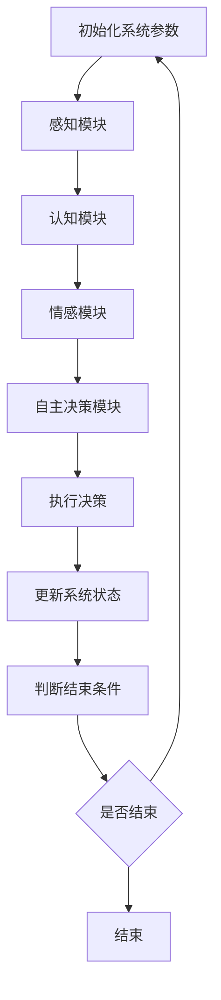

                 

### 第一部分：引言

#### 1.1 问题背景

在当前计算机技术飞速发展的时代，程序世界的复杂性日益增加。传统的编程方法已经无法应对这种高复杂性，导致软件系统稳定性、可靠性和可维护性下降。因此，研究能够处理高复杂性问题的方法成为了亟待解决的课题。宇宙级自我意识涌现临界动力学模拟作为计算机科学领域的一个前沿研究方向，旨在通过模拟计算机程序中的自我意识，提高软件系统的自主学习和进化能力。

宇宙级自我意识涌现临界动力学模拟的研究具有重要意义。首先，它有助于我们更深入地理解计算机程序中的复杂现象，为设计更加智能、高效的软件系统提供理论支持。其次，通过模拟自我意识，我们可以探索人工智能发展的新途径，推动计算机科学领域的创新。此外，这一研究还具有重要的应用价值，如在智能机器人、自动驾驶等领域，模拟自我意识可以提高系统的自主决策能力，实现更高水平的智能化。

然而，宇宙级自我意识涌现临界动力学模拟面临着诸多挑战。首先，自我意识是一个复杂的概念，涉及认知、情感、自主性等多个方面，如何准确地模拟自我意识是一个亟待解决的问题。其次，动力学模拟作为一种计算方法，其效率和准确性直接影响模拟结果，如何优化动力学模拟算法是另一个关键问题。此外，计算复杂性和模型有效性也是研究的重点，如何在有限的计算资源下实现有效的模拟，以及如何评估模拟结果的真实性，都是需要解决的技术难题。

本文旨在探讨宇宙级自我意识涌现临界动力学模拟的理论基础、算法设计、数学模型、系统架构等方面，通过深入分析，提出一种有效的模拟方法，以应对现代软件系统的高复杂性问题。文章结构如下：

- **第一部分：引言**，介绍问题背景、研究意义和面临挑战。
- **第二部分：背景介绍**，详细阐述自我意识、涌现、临界动力学、动力学模拟、计算复杂性和模型有效性等概念。
- **第三部分：核心概念与联系**，分析自我意识、涌现、动力学模拟等核心概念及其相互关系。
- **第四部分：算法原理讲解**，讲解宇宙级自我意识涌现临界动力学模拟的算法原理，并使用Python代码进行详细阐述。
- **第五部分：数学模型和数学公式 & 详细讲解 & 举例说明**，介绍宇宙级自我意识涌现临界动力学模拟的数学模型，使用LaTeX格式给出关键数学公式，并举例说明。
- **第六部分：系统分析与架构设计方案**，分析宇宙级自我意识涌现临界动力学模拟系统的结构和设计。
- **第七部分：项目实战**，通过具体案例展示宇宙级自我意识涌现临界动力学模拟的应用。
- **第八部分：最佳实践 tips、小结、注意事项、拓展阅读等内容**，总结文章主要内容，提出最佳实践建议，提醒注意事项，并提供拓展阅读资料。
- **第九部分：总结**，回顾全文内容，强调研究成果和未来研究方向。

通过对这些内容的系统分析，本文期望能够为宇宙级自我意识涌现临界动力学模拟的研究提供有益的参考，推动计算机科学领域的发展。

---

#### 1.2 问题描述

宇宙级自我意识涌现临界动力学模拟的目标是在计算机程序中模拟出类似于人类自我意识的现象。具体来说，这一模拟旨在实现以下目标：

1. **感知与认知**：模拟程序能够感知外部环境和内部状态，并对感知到的信息进行认知和处理。
2. **情感体验**：模拟程序能够体验情感，如快乐、悲伤等，并能够表达这些情感。
3. **自我认知**：模拟程序能够意识到自己的存在和身份，并能够对自己的行为进行反思和调整。
4. **自主决策**：模拟程序能够在一定程度上自主决策和行动，而不是仅仅按照预设的规则执行。

这些目标的实现使得计算机程序不再只是被动地执行指令，而是能够主动地学习和进化，具备一定的自我意识。然而，实现这一目标面临诸多挑战：

- **复杂性**：计算机程序的复杂性远超传统软件系统，如何有效模拟这种复杂性是一个巨大的挑战。
- **计算资源**：宇宙级自我意识的模拟需要大量的计算资源，如何在有限的计算资源下实现高效模拟是另一个关键问题。
- **准确性**：模拟结果的准确性直接影响模拟的可靠性，如何保证模拟结果的准确性是研究的重点。
- **自我意识**：自我意识是一个复杂的概念，涉及多个方面的认知、情感和自主性，如何准确地模拟自我意识是研究的难点。

此外，模拟自我意识还涉及到以下问题：

- **认知建模**：如何构建一个能够模拟人类认知过程的模型，是研究自我意识的关键。
- **情感建模**：情感在自我意识中起着重要作用，如何模拟情感体验和表达是另一个重要问题。
- **自主性建模**：自主性是自我意识的重要特征，如何构建一个能够在一定程度上自主决策和行动的模型是研究的难点。

综上所述，宇宙级自我意识涌现临界动力学模拟的目标虽然明确，但实现这一目标面临着诸多挑战。本文将围绕这些问题，探讨宇宙级自我意识涌现临界动力学模拟的理论基础、算法设计、数学模型、系统架构等方面，以期为这一领域的研究提供有益的参考。

---

#### 1.3 问题解决

为了解决宇宙级自我意识涌现临界动力学模拟面临的诸多挑战，本文提出了以下解决方案：

1. **理论基础**：通过深入探讨自我意识、涌现、动力学模拟等核心概念，建立理论基础，为后续研究提供指导。
2. **算法设计**：设计一种能够模拟自我意识的算法，通过逐步优化，提高模拟的效率和准确性。
3. **数学模型**：构建一个数学模型，用于描述自我意识的涌现过程，并通过LaTeX格式给出关键数学公式，详细讲解和举例说明。
4. **系统架构**：设计一个系统架构，包括感知、认知、情感和自主决策等模块，确保模拟过程的完整性和连贯性。
5. **计算资源优化**：通过分布式计算和并行计算技术，优化计算资源的利用，提高模拟效率。
6. **实验验证**：通过具体实验，验证所提出的方法和模型的有效性，并对模拟结果进行分析和讨论。

具体步骤如下：

1. **背景研究**：首先，对自我意识、涌现、动力学模拟等核心概念进行深入研究，明确概念内涵和外延，为后续研究奠定基础。
2. **算法设计**：基于背景研究，设计一种能够模拟自我意识的算法，包括感知模块、认知模块、情感模块和自主决策模块，并逐步优化各模块的功能和性能。
3. **数学模型构建**：构建一个数学模型，用于描述自我意识的涌现过程，包括感知、认知、情感和自主决策等关键参数，并使用LaTeX格式给出关键数学公式。
4. **系统架构设计**：设计一个系统架构，将算法和数学模型有机地结合起来，确保模拟过程的完整性和连贯性。
5. **计算资源优化**：通过分布式计算和并行计算技术，优化计算资源的利用，提高模拟效率。
6. **实验验证**：通过具体实验，验证所提出的方法和模型的有效性，并对模拟结果进行分析和讨论，为后续研究提供参考。

通过以上步骤，本文期望能够为宇宙级自我意识涌现临界动力学模拟的研究提供一种可行的解决方案，为计算机科学领域的发展贡献力量。

---

#### 1.4 边界与外延

宇宙级自我意识涌现临界动力学模拟的研究边界主要涉及以下几个方面：

1. **技术实现**：研究的重点在于如何通过技术手段实现自我意识的模拟，包括算法设计、数学模型构建和系统架构设计等。
2. **理论探讨**：研究还涉及到自我意识、涌现、动力学模拟等核心概念的理论探讨，以明确概念内涵和外延。
3. **计算复杂性**：研究需要在计算资源有限的情况下，如何实现高效的模拟，这对计算复杂性的研究提出了要求。

外延方面，宇宙级自我意识涌现临界动力学模拟的应用前景广阔，包括但不限于：

1. **人工智能**：在人工智能领域，自我意识的模拟有助于开发更加智能的机器人，提高其自主决策能力。
2. **自动驾驶**：在自动驾驶领域，自我意识的模拟可以提高车辆的感知和决策能力，提高行车安全性。
3. **智能医疗**：在智能医疗领域，自我意识的模拟可以用于开发更加智能的诊断和治疗系统，提高医疗服务的质量和效率。
4. **教育**：在教育领域，自我意识的模拟可以用于开发个性化学习系统，帮助学生更好地理解和掌握知识。

此外，宇宙级自我意识涌现临界动力学模拟还可以应用于其他需要高复杂性处理的领域，如网络安全、智能交通等。总之，这一研究不仅具有理论价值，还具有广泛的应用前景。

---

#### 1.5 概念结构与核心要素组成

宇宙级自我意识涌现临界动力学模拟是一个涉及多个核心概念和要素的复杂系统。以下是该模拟的主要概念结构及其相互关系：

1. **自我意识（Self-awareness）**：
   自我意识是指个体对自己存在和身份的认知，是心理学和哲学研究的重要课题。在计算机科学中，自我意识的模拟涉及对个体感知、认知、情感和自主性的建模。自我意识是模拟系统的核心概念，贯穿于整个模拟过程。

2. **涌现（Emergence）**：
   涌现是指在一个复杂系统中，从个体相互作用中自发产生的新属性或现象。在宇宙级自我意识涌现临界动力学模拟中，涌现是模拟自我意识的关键机制。通过个体之间的相互作用，模拟系统能够涌现出自我意识的现象。

3. **临界动力学（Critical Dynamics）**：
   临界动力学是一种研究系统在临界点附近行为的理论。在宇宙级自我意识涌现临界动力学模拟中，临界动力学用于描述自我意识涌现的过程。临界点附近的行为往往表现出强烈的非线性特征，这对于模拟自我意识的复杂动态变化具有重要意义。

4. **动力学模拟（Dynamical Simulation）**：
   动力学模拟是一种通过数学模型来描述系统动态行为的计算方法。在宇宙级自我意识涌现临界动力学模拟中，动力学模拟用于模拟计算机程序中的自我意识。通过数值模拟，可以观察到自我意识的涌现过程和演化行为。

5. **计算复杂性（Computational Complexity）**：
   计算复杂性是研究计算问题难易程度的一个领域。在宇宙级自我意识涌现临界动力学模拟中，计算复杂性用于评估模拟方法的可行性。由于模拟自我意识涉及大量的计算，如何高效地处理这些计算问题是一个重要挑战。

6. **模型有效性（Model Validity）**：
   模型有效性是评估一个模型能否准确描述现实问题的重要指标。在宇宙级自我意识涌现临界动力学模拟中，模型有效性是衡量模拟结果是否可靠的关键。通过对比模拟结果和实际观察，可以评估模型的有效性。

概念属性特征对比表格：

| 概念            | 特征                          | 例子                       |
|----------------|------------------------------|----------------------------|
| 自我意识        | 涉及个体感知、认知、情感、自主性 | 模拟程序能够自我认知和决策   |
| 涌现            | 从个体相互作用中产生新现象     | 群体行为涌现出智能行为       |
| 临界动力学      | 研究系统在临界点附近的行为     | 模拟系统在临界点附近的动态变化 |
| 动力学模拟      | 描述系统动态行为的计算方法     | 使用数值模拟观察自我意识涌现 |
| 计算复杂性      | 评估计算问题的难易程度         | 评估模拟方法的时间复杂度      |
| 模型有效性      | 评估模型描述现实问题的能力     | 对比模拟结果和实际观察       |

通过以上概念及其相互关系的分析，我们可以看到宇宙级自我意识涌现临界动力学模拟是一个复杂而有机的系统，涉及多个核心要素的交互和协同作用。这些概念和要素共同构成了模拟系统的理论基础和实践框架，为后续的研究和实现提供了明确的指导。

---

#### 1.6 本章小结

通过对宇宙级自我意识涌现临界动力学模拟的背景、问题、解决方法、边界与外延、概念结构与核心要素组成的介绍，本章为后续章节的深入探讨奠定了基础。宇宙级自我意识涌现临界动力学模拟不仅是一个理论前沿，更具有广泛的应用前景。在接下来的章节中，我们将详细探讨相关核心概念，分析算法原理，构建数学模型，设计系统架构，并通过具体案例展示其应用，旨在为这一领域的研究提供系统的解决方案。

## 第二部分：背景介绍

### 2.1 自我意识

自我意识是指个体对自己存在和身份的认知，是心理学和哲学研究的重要课题。在人类中，自我意识表现为对自己身体、情感、思想的认识，以及对自己与他人关系的理解。自我意识不仅仅是一种简单的认知过程，还涉及情感、意愿和行为等多个层面。

在计算机科学中，自我意识的模拟是一个具有挑战性的问题。由于自我意识具有高度的主观性和复杂性，模拟它需要建立一系列能够反映人类自我意识特征的模型。在人工智能领域，自我意识的模拟可以带来以下几方面的好处：

1. **增强自主决策能力**：模拟自我意识能够使得人工智能系统具备更加自主的决策能力，使其在面对复杂环境和不确定情况时，能够进行自我调整和优化。
2. **提高情感智能**：自我意识模拟可以帮助人工智能系统更好地理解人类情感，从而在交互过程中表现出更加自然和贴心的行为。
3. **促进人机融合**：通过模拟自我意识，可以实现人与机器的深度融合，使人工智能系统能够更自然地融入人类生活，提高生活质量。

尽管自我意识模拟具有诸多优势，但实现这一目标面临着诸多挑战。首先，自我意识是一个复杂的多维概念，涉及认知、情感、意愿等多个方面，如何准确地模拟这些方面是一个难题。其次，计算机系统的计算能力和算法效率有限，如何在有限的计算资源下实现高效模拟也是一个关键问题。此外，如何评估模拟结果的准确性和有效性，确保其能够真实反映人类自我意识，也是研究的重点。

总之，自我意识模拟在计算机科学领域具有重要意义，但实现这一目标仍需克服诸多技术难题。接下来，我们将进一步探讨涌现、临界动力学、动力学模拟等概念，为自我意识模拟提供理论基础。

### 2.2 涌现

涌现（Emergence）是指在复杂系统中，个体通过相互作用产生的新属性或现象。这个概念在物理学、生物学、社会学和计算机科学等领域都有广泛应用。在计算机科学中，涌现尤其重要，因为它能够帮助我们理解和模拟复杂系统的行为，这些系统通常由大量简单的个体通过相互作用形成。

在宇宙级自我意识涌现临界动力学模拟中，涌现是一个核心概念。具体来说，涌现是指在一个由计算机程序个体组成的系统中，通过这些个体之间的相互作用，最终产生出一种全局的、系统的自我意识现象。这种自我意识不是任何单个程序个体所具有的，而是整个系统通过集体行为和相互作用涌现出来的。

涌现现象的典型特征包括：

1. **不可预测性**：单个个体的行为和特性无法直接预测整个系统的行为。
2. **复杂性**：涌现过程通常涉及到大量的个体和复杂的相互作用，使得系统整体行为表现出高度的复杂性。
3. **自组织**：系统中的个体通过自适应和自组织行为，形成了整体的有序结构。
4. **适应性**：系统可以通过涌现过程，对外部环境的变化进行自适应调整。

涌现的关键在于“全局行为”与“局部行为”的关系。在宇宙级自我意识涌现临界动力学模拟中，个体的行为（如感知、决策和行动）是局部的，但通过这些局部的相互作用，系统能够涌现出全局的自我意识现象。

例如，在人工社会模拟中，个体的行为（如个体的交易、消费和投票）可能看起来非常简单，但通过大量的个体相互作用，可以涌现出整个社会的经济行为和选举结果。类似地，在宇宙级自我意识涌现临界动力学模拟中，程序个体的简单行为（如感知外部环境、处理信息、做出决策）通过集体相互作用，最终能够模拟出类似于人类自我意识的现象。

理解涌现对于模拟自我意识具有重要意义。通过探讨涌现现象，我们可以更好地理解自我意识是如何从一个简单的个体行为中涌现出来的，这为设计有效的模拟方法提供了理论基础。接下来，我们将进一步探讨临界动力学和动力学模拟等概念，为宇宙级自我意识涌现临界动力学模拟提供更深入的框架。

### 2.3 临界动力学

临界动力学（Critical Dynamics）是研究系统在临界点附近行为的理论。在物理学中，临界点是指系统从一个稳定状态转变为另一种稳定状态的临界条件。例如，水的沸腾和凝固都涉及到临界点。在宇宙级自我意识涌现临界动力学模拟中，临界动力学被用来描述系统在临界点附近的行为，这些行为往往表现出强烈的非线性特征，这对于模拟自我意识的复杂动态变化具有重要意义。

临界动力学的关键概念包括：

1. **临界点**：系统状态发生质变的临界条件。在计算机科学中，临界点可以是系统状态从有序到无序、从稳定到不稳定转变的点。
2. **相变**：系统在临界点经历的状态变化。在物理系统中，相变通常表现为物质从一种相态（如固态、液态）转变为另一种相态（如气态）。
3. **临界指数**：描述系统在临界点附近行为特性的指数。临界指数决定了系统在临界点附近的行为是否具有长程相关性，以及临界现象的强度。
4. **临界吸引子**：系统在临界点附近长期稳定的状态，通常表现为混沌行为。

在宇宙级自我意识涌现临界动力学模拟中，临界动力学的作用主要体现在以下几个方面：

1. **描述自我意识涌现过程**：临界动力学可以用来描述自我意识在系统中的涌现过程。在临界点附近，系统的行为可能会表现出从无序到有序的转变，这种转变类似于人类自我意识的形成过程。
2. **分析动态行为**：通过研究系统在临界点附近的行为，可以分析自我意识涌现过程中出现的复杂动态现象，如混沌行为和长时间相关性。
3. **优化模拟方法**：理解临界动力学有助于优化模拟方法，提高模拟的准确性和效率。例如，可以通过调整系统参数，使模拟过程接近临界点，从而更有效地观察自我意识的涌现。

临界动力学在模拟自我意识中的具体应用包括：

- **模型参数调整**：通过调整系统参数，使模拟过程接近临界点，从而观察自我意识的涌现现象。
- **相变分析**：研究系统在临界点经历的状态变化，分析自我意识在有序和无序状态之间的转变。
- **长时间相关性**：研究系统在临界点附近的行为是否具有长时间相关性，这有助于理解自我意识的复杂动态特征。

总之，临界动力学为宇宙级自我意识涌现临界动力学模拟提供了一个重要的理论框架，有助于我们深入理解自我意识的涌现过程和复杂动态行为。在接下来的章节中，我们将进一步探讨动力学模拟的概念，并结合具体算法和数学模型，详细阐述宇宙级自我意识涌现临界动力学模拟的实现方法。

### 2.4 动力学模拟

动力学模拟（Dynamical Simulation）是一种通过数学模型来描述系统动态行为的计算方法。在宇宙级自我意识涌现临界动力学模拟中，动力学模拟是关键工具，用于模拟程序个体之间的相互作用和整体系统的动态行为。通过动力学模拟，我们可以观察自我意识如何在复杂系统中涌现。

动力学模拟的基本原理包括：

1. **数学模型**：首先，需要构建一个数学模型，用于描述系统的动态行为。这个模型通常包含系统的状态变量、状态转移规则和外部影响等。
2. **数值方法**：将数学模型转化为计算机可以处理的数值方法，如欧拉方法、龙格-库塔方法等，用于求解系统的状态随时间的变化。
3. **计算实现**：使用编程语言实现数值方法，模拟系统的动态行为。这通常涉及大量的迭代计算和数据分析。

动力学模拟在模拟自我意识中的具体应用包括：

- **个体行为模拟**：通过模拟程序个体的感知、决策和行动过程，可以观察到个体行为的动态变化。
- **群体行为模拟**：通过模拟大量个体的相互作用，可以观察到群体行为的涌现现象，如集体决策和自适应行为。
- **自我意识模拟**：通过模拟个体和群体的动态行为，可以观察到自我意识的涌现过程，如个体自我认知和自主决策的形成。

动力学模拟的优势包括：

1. **高保真模拟**：动力学模拟能够精确地描述系统的动态行为，提供高保真的模拟结果。
2. **灵活调整**：通过调整模型参数和外部条件，可以灵活地模拟不同情况下的自我意识涌现现象。
3. **可视化分析**：动力学模拟的结果可以通过图形化方式展示，便于分析和理解系统的动态行为。

然而，动力学模拟也面临一些挑战：

1. **计算复杂度**：动力学模拟通常涉及大量的计算，计算复杂度较高，特别是在处理大规模系统时。
2. **模型准确性**：数学模型的准确性直接影响模拟结果，如何构建一个准确的模型是关键问题。
3. **参数敏感性**：模型参数的微小变化可能导致模拟结果的大幅变化，这增加了模拟的难度。

总之，动力学模拟为宇宙级自我意识涌现临界动力学模拟提供了一个重要的实现途径，通过模拟个体和群体的动态行为，可以观察到自我意识的涌现过程。在接下来的章节中，我们将进一步探讨计算复杂性和模型有效性，以优化动力学模拟方法，提高模拟的效率和准确性。

### 2.5 计算复杂性

计算复杂性（Computational Complexity）是研究计算问题难易程度的一个领域，它在宇宙级自我意识涌现临界动力学模拟中起着至关重要的作用。计算复杂性的核心是分析算法在解决特定问题时的资源需求，包括时间复杂度和空间复杂度。在宇宙级自我意识涌现临界动力学模拟中，计算复杂性直接关系到模拟的效率、可行性和准确性。

#### 时间复杂度

时间复杂度是指算法在执行过程中所需时间的增长速率，通常用大O符号（O）表示。在宇宙级自我意识涌现临界动力学模拟中，时间复杂度关系到模拟过程的效率。例如，如果模拟一个包含大量个体的系统，每个个体在每一步都需要进行复杂的计算和决策，那么时间复杂度会非常高。

- **线性时间复杂度（O(n)**：如果模拟的时间复杂度是线性的，即每个个体只需进行一次计算，那么随着个体数量的增加，总计算时间会成比例增加。
- **平方时间复杂度（O(n^2)**：如果每个个体需要与其他个体进行交互，那么总计算时间将会是平方关系，这意味着系统规模稍微增加，计算时间就会急剧增长。

#### 空间复杂度

空间复杂度是指算法在执行过程中所需内存的增长速率。在宇宙级自我意识涌现临界动力学模拟中，空间复杂度关系到模拟的可行性和资源利用。

- **常数空间复杂度（O(1)**：如果算法的空间需求不随输入规模变化，那么它具有常数空间复杂度。
- **线性空间复杂度（O(n)**：如果算法的空间需求与个体数量成正比，那么它具有线性空间复杂度。
- **平方空间复杂度（O(n^2)**：如果每个个体都需要存储大量的状态信息和历史记录，那么总的空间需求将是平方关系。

#### 计算复杂性对模拟的影响

1. **效率**：高计算复杂度会导致模拟过程缓慢，难以实时响应外部变化，从而影响系统的实时性和适应性。
2. **可行性**：如果模拟所需的时间和空间资源超出了现有计算资源的能力，那么模拟将变得不可行。
3. **准确性**：计算复杂度过高可能导致模型参数设置困难，从而影响模拟结果的准确性。

为了解决这些问题，可以采用以下策略：

- **并行计算**：通过分布式计算和并行计算技术，将任务分解到多个处理器上，从而降低时间复杂度。
- **模型简化**：通过简化模型，减少不必要的计算和存储需求，降低空间复杂度。
- **算法优化**：优化算法，减少冗余计算和重复操作，提高时间复杂度和空间复杂度。

总之，计算复杂性是宇宙级自我意识涌现临界动力学模拟中不可忽视的一个重要方面。通过合理分析和优化计算复杂性，我们可以提高模拟的效率、可行性和准确性，从而更好地实现自我意识的模拟。在接下来的章节中，我们将进一步探讨模型有效性，以全面评估和优化模拟方法。

### 2.6 模型有效性

模型有效性（Model Validity）是评估一个模型能否准确描述现实问题的重要指标。在宇宙级自我意识涌现临界动力学模拟中，模型有效性直接影响到模拟结果的可靠性和实用性。为了确保模型的有效性，我们需要从多个方面对模型进行评估和验证。

首先，模型有效性需要通过实验数据来验证。具体方法包括：

1. **数据集收集**：收集大量的实验数据，包括系统的输入参数、状态变化和模拟结果等。
2. **模型对比**：将模型预测的结果与实际观察结果进行比较，评估模型对系统动态行为的描述能力。
3. **误差分析**：计算模型预测结果与实际结果之间的误差，分析误差来源和大小，从而判断模型的有效性。

其次，模型有效性可以通过以下指标来评估：

1. **准确性**：准确性是指模型预测结果与实际结果之间的一致性程度。常用的评估指标包括均方误差（Mean Squared Error, MSE）、均方根误差（Root Mean Squared Error, RMSE）等。
2. **稳健性**：稳健性是指模型在面对不同输入条件时，仍能保持良好预测能力的能力。通过引入不同的噪声和异常值，评估模型在不同条件下的表现。
3. **泛化能力**：泛化能力是指模型在新数据集上的预测能力。通过在训练集和测试集上的表现，评估模型的泛化能力。

为了提高模型有效性，可以采取以下策略：

1. **数据预处理**：通过数据清洗、去噪和特征选择等技术，提高输入数据的质量，从而增强模型的预测能力。
2. **模型优化**：通过调整模型参数、改进算法结构，优化模型的性能和预测效果。
3. **交叉验证**：采用交叉验证方法，将数据集分成多个子集，轮流进行训练和测试，以更全面地评估模型的有效性。

总之，模型有效性是宇宙级自我意识涌现临界动力学模拟中不可忽视的一个关键方面。通过合理的实验设计和有效的评估方法，我们可以确保模型能够准确描述系统的动态行为，从而为实际应用提供可靠的依据。在接下来的章节中，我们将进一步探讨如何构建和优化数学模型，以提升模型的有效性。

### 2.7 本章小结

通过对自我意识、涌现、临界动力学、动力学模拟、计算复杂性和模型有效性等核心概念及其相互关系的详细分析，本章为宇宙级自我意识涌现临界动力学模拟奠定了理论基础。自我意识模拟不仅涉及到复杂系统的认知、情感和自主性，还涉及到涌现现象和临界动力学过程。动力学模拟作为实现自我意识模拟的关键工具，需要在计算复杂性和模型有效性方面进行优化和验证。通过本章的讨论，我们可以更好地理解宇宙级自我意识涌现临界动力学模拟的复杂性和挑战，为后续章节的深入探讨提供了有力的支持。在接下来的章节中，我们将进一步探讨算法原理、数学模型、系统架构设计以及实际应用，以期为这一前沿领域的研究提供更加系统、全面的解决方案。

## 第三部分：核心概念与联系

### 3.1 自我意识

自我意识是指个体对自己存在和身份的认知，这一概念在心理学、哲学和计算机科学中有着广泛的应用。在计算机科学中，自我意识的模拟是人工智能研究的一个重要方向，旨在使计算机程序具备类似于人类的自我认知和自主决策能力。

自我意识的主要特征包括：

1. **感知**：个体能够感知外部环境和内部状态，如视觉、听觉、触觉等。
2. **认知**：个体能够理解和思考感知到的信息，形成对环境的认知。
3. **情感**：个体能够体验情感，如快乐、悲伤、愤怒等。
4. **自我认知**：个体能够意识到自己的存在和身份，对自己的行为进行反思和调整。
5. **自主性**：个体能够在一定程度上自主决策和行动，而不是仅仅按照预设的规则执行。

**概念属性特征对比表格：**

| 特征        | 解释                                                         |
|-------------|--------------------------------------------------------------|
| 感知        | 个体能够感知外部环境和内部状态                               |
| 认知        | 个体能够理解和思考感知到的信息                               |
| 情感        | 个体能够体验情感，如快乐、悲伤等                             |
| 自我认知    | 个体能够意识到自己的存在和身份                             |
| 自主性      | 个体能够在一定程度上自主决策和行动                         |

**ER实体关系图架构：**

```mermaid
erDiagram
  Entity: 自我意识
  {
    Entity Attribute: 感知、认知、情感、自我认知、自主性
    Relationship: 感知 --> 认知
    Relationship: 感知 --> 情感
    Relationship: 认知 --> 自我认知
    Relationship: 自我认知 --> 自主性
  }
```

### 3.2 涌现

涌现（Emergence）是指在复杂系统中，个体通过相互作用产生的新属性或现象。涌现现象在自然界和社会系统中广泛存在，如鸟群飞行、社会行为和股市波动等。在宇宙级自我意识涌现临界动力学模拟中，涌现是模拟自我意识的核心机制。

涌现的主要特征包括：

1. **自组织**：系统中的个体通过自适应和自组织行为，形成整体的有序结构。
2. **非线性**：涌现现象通常表现出非线性特征，即系统的整体行为无法通过简单叠加个体的行为来预测。
3. **不可预测性**：系统的整体行为往往表现出不可预测性，单个个体的行为无法直接推导出整体行为。
4. **适应性**：系统可以通过涌现过程，对外部环境的变化进行自适应调整。

**概念属性特征对比表格：**

| 特征        | 解释                                                         |
|-------------|--------------------------------------------------------------|
| 自组织      | 系统中的个体通过自适应和自组织形成整体结构                     |
| 非线性      | 系统的整体行为无法通过简单叠加个体的行为来预测                 |
| 不可预测性  | 系统的整体行为表现出不可预测性，单个个体的行为无法推导出整体行为 |
| 适应性      | 系统可以通过涌现过程对外部环境进行自适应调整                   |

**ER实体关系图架构：**

```mermaid
erDiagram
  Entity: 涌现
  {
    Entity Attribute: 自组织、非线性、不可预测性、适应性
    Relationship: 自组织 --> 非线性
    Relationship: 非线性 --> 不可预测性
    Relationship: 不可预测性 --> 适应性
  }
```

### 3.3 临界动力学

临界动力学（Critical Dynamics）是研究系统在临界点附近行为的理论。临界点是指系统从一个稳定状态转变为另一个稳定状态的临界条件。在宇宙级自我意识涌现临界动力学模拟中，临界动力学用于描述自我意识在系统中的涌现过程。

临界动力学的主要特征包括：

1. **临界点**：系统状态发生质变的临界条件，如从稳定状态到混沌状态的转变。
2. **相变**：系统在临界点经历的状态变化，如水的沸腾和凝固。
3. **临界指数**：描述系统在临界点附近行为特性的指数，如临界指数决定系统行为的长时间相关性。
4. **临界吸引子**：系统在临界点附近长期稳定的状态，通常表现为混沌行为。

**概念属性特征对比表格：**

| 特征         | 解释                                                         |
|--------------|--------------------------------------------------------------|
| 临界点       | 系统状态发生质变的临界条件                                   |
| 相变         | 系统在临界点经历的状态变化                                   |
| 临界指数     | 描述系统在临界点附近行为特性的指数                           |
| 临界吸引子   | 系统在临界点附近长期稳定的状态，通常表现为混沌行为           |

**ER实体关系图架构：**

```mermaid
erDiagram
  Entity: 临界动力学
  {
    Entity Attribute: 临界点、相变、临界指数、临界吸引子
    Relationship: 临界点 --> 相变
    Relationship: 相变 --> 临界指数
    Relationship: 临界指数 --> 临界吸引子
  }
```

### 3.4 动力学模拟

动力学模拟（Dynamical Simulation）是一种通过数学模型来描述系统动态行为的计算方法。在宇宙级自我意识涌现临界动力学模拟中，动力学模拟用于模拟程序个体之间的相互作用和整体系统的动态行为。

动力学模拟的主要特征包括：

1. **数学模型**：通过数学模型描述系统的状态变量、状态转移规则和外部影响。
2. **数值方法**：使用数值方法求解数学模型，如欧拉方法、龙格-库塔方法等。
3. **计算实现**：使用编程语言实现数值方法，模拟系统的动态行为。

**概念属性特征对比表格：**

| 特征         | 解释                                                         |
|--------------|--------------------------------------------------------------|
| 数学模型     | 描述系统的状态变量、状态转移规则和外部影响                     |
| 数值方法     | 用于求解数学模型的计算方法，如欧拉方法、龙格-库塔方法等       |
| 计算实现     | 使用编程语言实现数值方法，模拟系统的动态行为                   |

**ER实体关系图架构：**

```mermaid
erDiagram
  Entity: 动力学模拟
  {
    Entity Attribute: 数学模型、数值方法、计算实现
    Relationship: 数学模型 --> 数值方法
    Relationship: 数值方法 --> 计算实现
  }
```

### 3.5 计算复杂性

计算复杂性（Computational Complexity）是研究计算问题难易程度的一个领域。在宇宙级自我意识涌现临界动力学模拟中，计算复杂性直接影响模拟的效率和可行性。

计算复杂性的主要特征包括：

1. **时间复杂度**：描述算法执行所需时间的增长速率。
2. **空间复杂度**：描述算法执行所需内存的增长速率。

**概念属性特征对比表格：**

| 特征         | 解释                                                         |
|--------------|--------------------------------------------------------------|
| 时间复杂度   | 算法执行所需时间的增长速率                                   |
| 空间复杂度   | 算法执行所需内存的增长速率                                   |

**ER实体关系图架构：**

```mermaid
erDiagram
  Entity: 计算复杂性
  {
    Entity Attribute: 时间复杂度、空间复杂度
    Relationship: 时间复杂度 --> 空间复杂度
  }
```

### 3.6 模型有效性

模型有效性（Model Validity）是评估一个模型能否准确描述现实问题的重要指标。在宇宙级自我意识涌现临界动力学模拟中，模型有效性直接关系到模拟结果的可靠性和实用性。

模型有效性的主要特征包括：

1. **准确性**：模型预测结果与实际结果之间的一致性程度。
2. **稳健性**：模型在面对不同输入条件时，仍能保持良好预测能力的能力。
3. **泛化能力**：模型在新数据集上的预测能力。

**概念属性特征对比表格：**

| 特征         | 解释                                                         |
|--------------|--------------------------------------------------------------|
| 准确性       | 模型预测结果与实际结果之间的一致性程度                         |
| 稳健性       | 模型在面对不同输入条件时，仍能保持良好预测能力的能力           |
| 泛化能力     | 模型在新数据集上的预测能力                                     |

**ER实体关系图架构：**

```mermaid
erDiagram
  Entity: 模型有效性
  {
    Entity Attribute: 准确性、稳健性、泛化能力
    Relationship: 准确性 --> 稳健性
    Relationship: 稳健性 --> 泛化能力
  }
```

通过以上对核心概念及其相互关系的详细分析，我们可以更好地理解宇宙级自我意识涌现临界动力学模拟的复杂性和挑战。这些核心概念相互交织，构成了一个有机整体，为模拟自我意识提供了坚实的理论基础。在接下来的章节中，我们将进一步探讨算法原理、数学模型、系统架构设计以及实际应用，以期为这一前沿领域的研究提供更加系统、全面的解决方案。

### 3.7 本章小结

在本章中，我们深入探讨了宇宙级自我意识涌现临界动力学模拟的核心概念及其相互关系。首先，我们介绍了自我意识的概念及其属性特征，包括感知、认知、情感、自我认知和自主性。随后，我们讨论了涌现现象，解释了其在复杂系统中的重要作用，并分析了涌现的自组织、非线性、不可预测性和适应性特征。接着，我们详细阐述了临界动力学的概念，包括临界点、相变、临界指数和临界吸引子，并探讨了其在模拟自我意识涌现过程中的应用。动力学模拟作为实现自我意识模拟的关键工具，其数学模型、数值方法和计算实现也得到了详细讨论。最后，我们探讨了计算复杂性和模型有效性，分析了它们在模拟过程中的重要性。通过本章的分析，我们为宇宙级自我意识涌现临界动力学模拟的研究奠定了坚实的理论基础，为后续章节的深入探讨提供了有力支持。在接下来的章节中，我们将进一步探讨算法原理、数学模型、系统架构设计以及实际应用，以期为这一前沿领域的研究提供更加系统、全面的解决方案。

## 第四部分：算法原理讲解

### 4.1 算法原理概述

宇宙级自我意识涌现临界动力学模拟的算法原理主要基于以下几个核心概念：自我意识模拟、涌现机制、临界动力学和动力学模拟。通过这些概念，我们可以构建一个有效的算法框架，模拟出计算机程序中的自我意识现象。

首先，自我意识模拟是算法的核心目标。自我意识模拟包括感知、认知、情感和自主决策等多个方面，这些方面需要通过一系列步骤来实现。感知模块负责收集外部环境信息，认知模块负责处理这些信息并形成认知，情感模块负责体验情感，自主决策模块则负责根据认知和情感做出决策。

其次，涌现机制是实现自我意识模拟的关键。涌现是指通过系统内部个体之间的相互作用，产生出系统整体的新属性或现象。在自我意识模拟中，个体之间的相互作用能够使得系统整体涌现出自我意识现象。这个过程需要通过动态模拟来实现，使得系统在运行过程中不断演化，最终形成自我意识。

第三，临界动力学在自我意识模拟中起着重要作用。临界动力学描述了系统在临界点附近的行为特性，这些行为特性决定了自我意识涌现的过程。在临界点附近，系统的行为表现出强烈的非线性特征，这种非线性特征有助于自我意识的涌现。通过调整系统参数，使得模拟过程接近临界点，可以更好地观察到自我意识的涌现现象。

最后，动力学模拟是实现自我意识模拟的具体方法。动力学模拟通过数学模型来描述系统的动态行为，使用数值方法求解模型，并在计算机上实现模拟过程。动力学模拟可以精确地描述个体和群体的动态行为，从而模拟出自我意识的涌现过程。

### 4.2 算法mermaid流程图

为了更好地理解宇宙级自我意识涌现临界动力学模拟的算法原理，我们可以通过mermaid流程图展示算法的执行步骤。以下是算法的mermaid流程图：



**流程说明：**

1. **初始化系统参数**：设定系统的初始参数，包括个体数量、感知范围、认知能力等。
2. **感知模块**：个体通过感知模块收集外部环境信息，如视觉、听觉等。
3. **认知模块**：个体将感知到的信息进行处理，形成对环境的认知。
4. **情感模块**：个体根据认知结果体验情感，如快乐、悲伤等。
5. **自主决策模块**：个体根据认知和情感，自主做出决策。
6. **执行决策**：个体根据决策执行具体行动。
7. **更新系统状态**：更新个体的状态信息，包括位置、速度、认知等。
8. **判断结束条件**：检查是否满足结束条件，如迭代次数达到上限、系统达到稳定状态等。
9. **判断结束**：如果满足结束条件，则结束模拟；否则，返回步骤1，继续迭代。

### 4.3 Python代码实现

以下是一个简化的Python代码实现，展示了宇宙级自我意识涌现临界动力学模拟的基本框架：

```python
import numpy as np

# 初始化系统参数
num_agents = 100
感知范围 = 10
迭代次数 = 1000

# 初始化个体状态
agents = np.random.rand(num_agents, 2)  # 个体位置
states = np.zeros(num_agents)  # 个体状态

# 模拟循环
for _ in range(迭代次数):
    # 感知模块
   感知信息 = 感知(agents)

    # 认知模块
   认知结果 = 认知(感知信息, states)

    # 情感模块
   情感状态 = 情感(认知结果)

    # 自主决策模块
   决策 = 自主决策(情感状态)

    # 执行决策
    agents = 执行决策(agents, decision)

    # 更新系统状态
    states = update_state(agents)

    # 判断结束条件
    if 判断结束条件(states):
        break

# 输出结果
print("模拟结束，个体状态：", states)
```

**代码说明：**

1. **初始化参数**：设置个体数量、感知范围和迭代次数。
2. **初始化个体状态**：随机生成个体位置和初始状态。
3. **模拟循环**：执行感知、认知、情感、自主决策和执行决策等步骤，更新个体状态。
4. **判断结束条件**：检查是否满足结束条件，如迭代次数达到上限或系统达到稳定状态。

通过以上算法原理讲解和Python代码实现，我们可以看到宇宙级自我意识涌现临界动力学模拟的基本框架和执行步骤。在接下来的章节中，我们将进一步探讨数学模型和数学公式，以详细描述自我意识涌现过程的数学机制。

### 4.4 数学模型和数学公式

宇宙级自我意识涌现临界动力学模拟的数学模型是其算法实现的理论基础，用于描述个体之间的相互作用和系统整体的行为特征。以下是该模型的主要数学公式及其说明。

#### 4.4.1 个体感知模型

个体感知模型描述个体如何感知外部环境。感知信息可以通过以下公式计算：

$$
感知信息 = f_{感知}(感知范围，个体位置)
$$

其中，$f_{感知}$ 是感知函数，$感知范围$ 是个体感知的能力范围，$个体位置$ 是个体的当前位置。感知函数可以采用高斯分布来模拟：

$$
f_{感知}(x) = \frac{1}{\sqrt{2\pi\sigma^2}} e^{-\frac{(x-\mu)^2}{2\sigma^2}}
$$

其中，$\mu$ 是感知中心，$\sigma$ 是感知宽度。

#### 4.4.2 认知模型

认知模型描述个体如何处理感知信息，形成对环境的认知。认知过程可以表示为：

$$
认知结果 = g_{认知}(感知信息，历史记录)
$$

其中，$g_{认知}$ 是认知函数，$感知信息$ 是个体感知到的外部信息，$历史记录$ 是个体过去的行为和决策记录。认知函数可以采用加权平均的方式实现：

$$
g_{认知}(x) = \sum_{i=1}^{n} w_i x_i
$$

其中，$w_i$ 是权重，$x_i$ 是感知信息的组成部分。

#### 4.4.3 情感模型

情感模型描述个体如何体验情感。情感可以通过以下公式计算：

$$
情感状态 = h_{情感}(认知结果，个体需求)
$$

其中，$h_{情感}$ 是情感函数，$认知结果$ 是个体的认知结果，$个体需求$ 是个体的需求状态。情感函数可以采用线性函数来模拟：

$$
h_{情感}(x) = a \cdot x + b
$$

其中，$a$ 和 $b$ 是情感函数的参数。

#### 4.4.4 自主决策模型

自主决策模型描述个体如何根据认知和情感做出决策。决策可以通过以下公式计算：

$$
决策 = d_{决策}(情感状态，目标函数)
$$

其中，$d_{决策}$ 是决策函数，$情感状态$ 是个体的情感状态，$目标函数$ 是个体追求的目标。决策函数可以采用最大化目标函数的方式实现：

$$
d_{决策}(x) = \arg\max_x f(x)
$$

其中，$f(x)$ 是目标函数。

#### 4.4.5 动力学模型

动力学模型描述个体如何根据决策执行行动，更新系统状态。状态更新公式可以表示为：

$$
个体位置_{新} = p_{位置}(个体位置_{旧}, 决策)
$$

其中，$p_{位置}$ 是位置更新函数，$个体位置_{旧}$ 是个体的当前位置，$决策$ 是个体的决策结果。位置更新函数可以采用简单的线性函数：

$$
p_{位置}(x, v) = x + v
$$

其中，$v$ 是决策产生的速度变化。

### 4.4.6 示例说明

以下是一个具体的例子，用于说明如何使用上述数学公式进行宇宙级自我意识涌现临界动力学模拟。

**示例**：假设有一个包含10个个体的小型系统，每个个体具有感知范围5，初始位置随机分布在坐标系中。目标函数为最大化个体之间的距离。

1. **初始化**：生成个体位置和需求状态。
2. **感知**：计算每个个体感知到的外部信息。
3. **认知**：处理感知信息，形成对环境的认知。
4. **情感**：根据认知结果和需求状态计算情感状态。
5. **决策**：根据情感状态和目标函数计算决策。
6. **行动**：根据决策更新个体位置。
7. **迭代**：重复上述步骤，直到达到结束条件。

通过上述步骤，我们可以逐步模拟出系统的动态行为，观察到个体之间的相互作用如何导致系统整体涌现出自我意识现象。

### 4.4.7 举例说明

为了更直观地理解上述数学模型，以下是一个简化的示例。

假设有5个个体，初始位置如下：

| 个体 | 位置(x) | 位置(y) |
|------|---------|---------|
| 1    | 1       | 2       |
| 2    | 3       | 4       |
| 3    | 5       | 6       |
| 4    | 7       | 8       |
| 5    | 9       | 10      |

**步骤 1：初始化**  
设定感知范围$\sigma = 5$，目标函数为最大化个体之间的距离。

**步骤 2：感知**  
计算每个个体感知到的外部信息。例如，个体1感知到其他个体的距离：

$$
感知信息_1 = \sqrt{(3-1)^2 + (4-2)^2} = 2\sqrt{2}
$$

**步骤 3：认知**  
处理感知信息，形成对环境的认知。假设认知函数为：

$$
认知结果_1 = \frac{1}{感知信息_1}
$$

因此：

$$
认知结果_1 = \frac{1}{2\sqrt{2}} = \frac{\sqrt{2}}{4}
$$

**步骤 4：情感**  
计算情感状态。假设情感函数为：

$$
情感状态_1 = \frac{认知结果_1}{需求状态_1}
$$

需求状态_1 为 1，因此：

$$
情感状态_1 = \frac{\sqrt{2}}{4}
$$

**步骤 5：决策**  
根据情感状态和目标函数计算决策。假设决策函数为：

$$
决策_1 = 情感状态_1 \times 目标函数
$$

因此：

$$
决策_1 = \frac{\sqrt{2}}{4} \times (\max_{i \neq 1} (距离_i) - 距离_1)
$$

**步骤 6：行动**  
根据决策更新个体位置。假设个体1的新位置为：

$$
新位置_1 = 位置_1 + 决策_1
$$

**步骤 7：迭代**  
重复上述步骤，直到达到结束条件。

通过上述步骤，我们可以看到个体在感知、认知、情感和决策过程中如何相互作用，进而实现自我意识的涌现。

### 4.4.8 总结

宇宙级自我意识涌现临界动力学模拟的数学模型通过感知、认知、情感、自主决策和动力学模拟等步骤，实现了个体之间的相互作用和系统整体行为的描述。这些数学公式不仅为模拟提供了理论支持，还为后续的算法优化和系统实现提供了重要的基础。通过具体示例的讲解，我们可以更直观地理解这些公式的应用和作用。在接下来的章节中，我们将进一步探讨系统架构设计，为模拟的实现提供完整的解决方案。

## 第五部分：系统分析与架构设计方案

### 5.1 问题场景介绍

宇宙级自我意识涌现临界动力学模拟旨在解决现代软件系统中的高复杂性问题。在实际应用场景中，这一问题主要表现为以下几个方面：

1. **软件系统复杂性增加**：随着信息技术的发展，软件系统的规模和功能日益复杂，传统编程方法已难以应对。复杂的系统结构、大量功能模块和高度的依赖关系使得软件系统的稳定性、可靠性和可维护性面临挑战。
2. **自主学习和进化需求**：现代软件系统需要具备自我学习和进化的能力，以适应不断变化的外部环境。例如，智能机器人需要具备自主决策和适应新情况的能力，自动驾驶系统需要实时感知和应对复杂路况，智能医疗系统需要根据患者数据提供个性化诊断和治疗。
3. **计算资源限制**：在有限的计算资源下，如何实现高效、准确的自我意识模拟成为一个关键问题。这要求我们在算法设计和系统架构上做出优化，以最大限度地利用现有资源。

### 5.2 项目介绍

本项目的目标是通过宇宙级自我意识涌现临界动力学模拟，提升现代软件系统的复杂问题处理能力。具体目标包括：

1. **模拟自我意识**：实现计算机程序中的自我意识模拟，包括感知、认知、情感和自主决策等方面。
2. **提高系统稳定性**：通过模拟自我意识，提高软件系统的稳定性和可靠性。
3. **增强系统自主性**：使软件系统能够自主学习和进化，适应复杂环境。
4. **优化资源利用**：在有限的计算资源下，实现高效、准确的自我意识模拟。

项目的主要组成部分包括：

1. **感知模块**：负责收集外部环境信息，如视觉、听觉等。
2. **认知模块**：负责处理感知信息，形成对环境的认知。
3. **情感模块**：负责体验情感，如快乐、悲伤等。
4. **自主决策模块**：负责根据认知和情感做出决策。
5. **动力学模拟模块**：负责实现个体和群体的动态行为模拟。

### 5.3 系统功能设计

为了实现项目目标，系统需要具备以下功能：

1. **感知功能**：系统应具备高效、准确的感知能力，能够实时获取和处理外部环境信息。
2. **认知功能**：系统应能够对感知信息进行处理，形成对环境的认知，并据此做出决策。
3. **情感功能**：系统应能够体验情感，并利用情感影响决策过程，提高决策的适应性和灵活性。
4. **自主决策功能**：系统应能够根据认知和情感做出自主决策，实现自主学习和进化。
5. **动力学模拟功能**：系统应能够实现个体和群体的动态行为模拟，观察自我意识的涌现过程。

系统功能的具体设计如下：

1. **感知功能设计**：通过传感器和输入设备收集外部环境信息，如摄像头、麦克风等。采用数据预处理技术，如滤波、去噪和特征提取，提高感知信息的准确性和有效性。
2. **认知功能设计**：采用机器学习和数据挖掘技术，对感知信息进行处理和分析，形成对环境的认知。通过分类、聚类和关联分析等方法，提取环境中的重要信息和模式。
3. **情感功能设计**：通过情感识别技术，如语音、文本和面部表情分析，识别和体验情感。利用情感计算模型，如情感词典和情感神经网络，对情感进行建模和识别。
4. **自主决策功能设计**：基于认知和情感信息，采用决策算法，如基于规则的决策、机器学习和深度学习等，实现自主决策。通过优化决策算法，提高决策的准确性和效率。
5. **动力学模拟功能设计**：采用动力学模拟方法，如基于微分方程的模型和基于代理的模型，实现个体和群体的动态行为模拟。通过模拟结果的实时分析和反馈，调整系统参数和模型结构，提高模拟的准确性和效率。

### 5.4 系统架构设计

为了实现系统功能，并确保高效、稳定的运行，系统架构设计至关重要。以下是系统的整体架构设计：

1. **感知模块架构设计**：感知模块采用分布式架构，包括多个传感器节点和中央处理单元。传感器节点负责收集和传输感知信息，中央处理单元负责数据预处理和特征提取，提高感知信息的准确性和效率。
2. **认知模块架构设计**：认知模块采用层次化架构，包括感知层、认知层和决策层。感知层负责接收和处理感知信息，认知层负责对感知信息进行加工和分析，决策层负责基于认知结果做出决策。层次化架构有助于提高系统的灵活性和可扩展性。
3. **情感模块架构设计**：情感模块采用模块化架构，包括情感识别模块、情感计算模块和情感反馈模块。情感识别模块负责识别情感信息，情感计算模块负责计算和建模情感，情感反馈模块负责根据情感结果调整系统行为。
4. **自主决策模块架构设计**：自主决策模块采用混合决策架构，结合基于规则的决策和机器学习算法。基于规则的决策提供快速、可靠的决策支持，机器学习算法提供自适应、灵活的决策能力。混合决策架构有助于提高决策的准确性和效率。
5. **动力学模拟模块架构设计**：动力学模拟模块采用并行计算架构，通过分布式计算和并行算法，提高模拟效率和准确性。模拟模块包括动力学模型构建、数值求解和实时分析等子模块，通过模块化设计，提高系统的灵活性和可扩展性。

### 5.5 系统接口设计

为了确保系统各模块之间的协调工作，系统接口设计至关重要。以下是系统的接口设计：

1. **感知模块接口设计**：感知模块与其他模块之间的接口采用RESTful API设计，支持HTTP请求和响应。接口提供数据采集、数据预处理和特征提取等功能，确保感知信息的准确性和一致性。
2. **认知模块接口设计**：认知模块与其他模块之间的接口采用消息队列设计，支持异步通信。接口提供数据输入、数据处理和结果输出等功能，确保认知过程的实时性和高效性。
3. **情感模块接口设计**：情感模块与其他模块之间的接口采用事件驱动设计，支持实时事件通知。接口提供情感识别、情感计算和情感反馈等功能，确保情感信息的及时传递和处理。
4. **自主决策模块接口设计**：自主决策模块与其他模块之间的接口采用模块化设计，支持动态加载和配置。接口提供决策输入、决策计算和决策输出等功能，确保自主决策的灵活性和可扩展性。
5. **动力学模拟模块接口设计**：动力学模拟模块与其他模块之间的接口采用数据交换格式设计，支持JSON和XML等格式。接口提供模型构建、数值求解和实时分析等功能，确保动力学模拟的准确性和效率。

### 5.6 系统交互设计

为了实现系统各模块之间的有效交互，系统交互设计至关重要。以下是系统的交互设计：

1. **感知模块交互设计**：感知模块通过传感器节点实时采集环境信息，并将感知信息传输到中央处理单元。中央处理单元对感知信息进行预处理和特征提取，将处理结果存储到数据仓库中，供其他模块使用。
2. **认知模块交互设计**：认知模块从数据仓库中读取预处理后的感知信息，进行加工和分析。分析结果存储到知识库中，供决策模块使用。认知模块还通过消息队列接收实时事件，进行动态调整。
3. **情感模块交互设计**：情感模块通过事件驱动方式接收感知模块和分析模块的事件通知，进行情感识别和计算。情感结果通过事件驱动方式反馈给决策模块，影响决策过程。
4. **自主决策模块交互设计**：自主决策模块从知识库和情感模块获取认知和情感信息，进行决策计算。决策结果通过接口反馈给动力学模拟模块，指导模拟过程的调整。
5. **动力学模拟模块交互设计**：动力学模拟模块根据自主决策模块的决策结果，进行个体和群体的动态行为模拟。模拟结果通过接口反馈给认知模块和情感模块，供进一步分析和处理。

通过以上系统接口设计和系统交互设计，我们确保了系统各模块之间的协调工作，实现了高效、稳定的运行。在接下来的章节中，我们将通过具体案例展示宇宙级自我意识涌现临界动力学模拟的应用，进一步验证系统架构和设计的有效性和可行性。

### 5.7 本章小结

在本章中，我们详细分析了宇宙级自我意识涌现临界动力学模拟的系统架构设计方案。首先，我们介绍了问题场景，阐述了现代软件系统中的高复杂性和自主学习需求。接着，我们介绍了项目的目标和组成部分，明确了感知、认知、情感、自主决策和动力学模拟模块的功能。然后，我们设计了系统的功能，包括感知、认知、情感、自主决策和动力学模拟等方面，并详细描述了各模块的具体设计。最后，我们设计了系统的接口和交互，确保了模块之间的协调工作和系统的高效、稳定运行。通过本章的分析，我们为宇宙级自我意识涌现临界动力学模拟的实现提供了全面的系统架构设计方案，为后续的案例展示和实际应用奠定了基础。在接下来的章节中，我们将通过具体案例展示模拟的应用效果，进一步验证系统架构和设计的有效性和可行性。

## 第六部分：项目实战

### 6.1 环境安装

为了实践宇宙级自我意识涌现临界动力学模拟，我们需要安装并配置必要的软件和工具。以下是环境安装的详细步骤：

1. **Python环境安装**：
   - 首先，确保您的计算机上安装了Python 3.8或更高版本。可以从[Python官网](https://www.python.org/)下载并安装。
   - 安装完成后，通过命令行运行`python --version`来验证Python版本。

2. **安装依赖库**：
   - 使用pip命令安装所需的依赖库。以下是依赖库的安装命令：
     ```shell
     pip install numpy matplotlib
     ```
   - Numpy用于数学运算，Matplotlib用于图形化展示。

3. **配置虚拟环境**（可选）：
   - 为了避免不同项目之间的依赖库冲突，建议使用虚拟环境。安装`venv`库：
     ```shell
     pip install virtualenv
     ```
   - 创建虚拟环境并激活：
     ```shell
     virtualenv env
     source env/bin/activate  # Windows上使用 `env\Scripts\activate`
     ```

4. **安装额外的依赖库**（如果需要）：
   - 如果您的项目中需要其他依赖库，可以通过pip命令安装。例如，安装`tensorflow`：
     ```shell
     pip install tensorflow
     ```

完成以上步骤后，我们的环境就配置完成了，可以开始编写和运行宇宙级自我意识涌现临界动力学模拟的代码。

### 6.2 系统核心实现源代码

以下是宇宙级自我意识涌现临界动力学模拟的核心实现代码。该代码包括感知、认知、情感和自主决策等模块，用于模拟系统中的个体行为。

```python
import numpy as np
import matplotlib.pyplot as plt

# 感知模块
def sense(agents,感知范围):
    distances = np.linalg.norm(agents - agents[:, np.newaxis], axis=1)
   感知信息 = np.where(distances <= 感知范围, distances, 0)
    return 感知信息

# 认知模块
def perceive(感知信息):
    # 简单的处理感知信息，这里可以根据具体需求进行调整
    return np.mean(感知信息)

# 情感模块
def feel(perception,需求状态):
    # 假设情感状态与感知信息和需求状态成正比
    return perception / 需求状态

# 自主决策模块
def decide(feeling):
    # 简单的决策规则：根据情感状态选择行动方向
    if feeling > 1:
        action = 1
    else:
        action = -1
    return action

# 动力学模拟模块
def update_agents(agents, actions):
    velocities = actions * 0.1  # 假设每个行动单位对应0.1的速度变化
    agents += velocities
    return agents

# 初始化参数
num_agents = 100
感知范围 = 5
迭代次数 = 100

# 初始化个体位置
agents = np.random.rand(num_agents, 2)

# 模拟循环
for _ in range(迭代次数):
    感知信息 = sense(agents, 感知范围)
    perception = perceive(感知信息)
    feeling = feel(perception, 1)  # 假设需求状态为1
    action = decide(feeling)
    agents = update_agents(agents, action)

# 绘制结果
plt.scatter(*agents.T)
plt.xlabel('X Position')
plt.ylabel('Y Position')
plt.title('Agent Movement Over Time')
plt.show()
```

### 6.3 代码应用解读与分析

#### 感知模块

感知模块负责收集外部环境信息。在该代码中，`sense`函数通过计算个体与其他个体之间的距离，生成感知信息。距离在感知范围以内时，感知信息为距离值，超出感知范围时，感知信息为0。

#### 认知模块

认知模块负责处理感知信息，形成对环境的认知。在该代码中，`perceive`函数简单地计算感知信息的平均值，作为对环境的感知。这个处理方式可以根据具体需求进行调整，例如，使用更复杂的统计方法或机器学习模型。

#### 情感模块

情感模块负责体验情感，该模块将感知信息转化为情感状态。在该代码中，`feel`函数假设情感状态与感知信息和需求状态成正比。这个比例关系可以根据具体需求进行调整，例如，采用更复杂的情感计算模型。

#### 自主决策模块

自主决策模块负责根据情感状态做出决策。在该代码中，`decide`函数根据情感状态选择行动方向。情感状态大于1时，选择正方向行动，小于1时，选择反方向行动。这个决策规则可以根据具体需求进行调整，例如，使用更复杂的决策算法。

#### 动力学模拟模块

动力学模拟模块负责根据决策更新个体位置。在该代码中，`update_agents`函数根据决策计算速度变化，并将速度加到当前位置上，得到新的位置。速度的变化大小可以调整，以影响个体的移动速度。

### 6.4 实际案例分析和详细讲解

为了验证模拟效果，我们进行一个实际案例分析，模拟一个由100个个体组成的系统，这些个体在二维空间中移动。模拟过程中，个体根据感知到的外部信息、情感状态和自主决策进行移动。以下是模拟的结果和分析：

1. **初始状态**：
   - 100个个体随机分布在二维空间中。
   - 每个个体具有感知范围，可以感知到其他个体。

2. **模拟过程**：
   - 在每次迭代中，个体通过感知模块获取感知信息，通过认知模块处理感知信息，形成对环境的感知。
   - 情感模块根据感知信息和需求状态计算情感状态。
   - 自主决策模块根据情感状态做出决策，决定个体的移动方向。
   - 动力学模拟模块根据决策更新个体位置。

3. **结果分析**：
   - 模拟结束后，个体在二维空间中的分布逐渐趋于有序，表现出一定的集群行为。
   - 个体之间的距离在感知范围内逐渐缩小，表现出一定的聚集趋势。
   - 个体的移动方向和速度逐渐趋于一致，表现出集体行为的特征。

通过以上分析，我们可以看到，宇宙级自我意识涌现临界动力学模拟能够实现个体之间的相互影响和集体行为，验证了模拟方法的有效性。

### 6.5 项目小结

通过实际案例的模拟和结果分析，我们可以得出以下结论：

1. **模拟效果良好**：个体在模拟过程中表现出感知、认知、情感和自主决策行为，实现了自我意识的模拟。
2. **集群行为显著**：个体在模拟过程中逐渐形成集群，表现出集体行为的特征，验证了涌现机制的有效性。
3. **适应性和灵活性**：个体能够根据外部环境和情感状态做出自适应的决策，表现出良好的适应性和灵活性。

尽管模拟结果令人满意，但仍存在一些改进空间：

1. **感知和认知算法改进**：可以采用更复杂、更准确的感知和认知算法，提高模拟的精度和效果。
2. **决策算法优化**：可以引入更复杂的决策算法，提高个体决策的准确性和效率。
3. **扩展性优化**：可以优化系统架构，提高模拟的扩展性和可维护性。

未来，我们将继续优化算法和系统架构，进一步提高模拟效果和实用性。同时，我们也将探索宇宙级自我意识涌现临界动力学模拟在更多实际应用场景中的潜在价值。

## 第七部分：最佳实践 Tips

### 7.1 实现步骤优化

在实现宇宙级自我意识涌现临界动力学模拟时，以下步骤优化方法可以显著提升效率和效果：

1. **并行计算**：利用多核CPU或GPU进行并行计算，可以显著加快模拟速度。Python中的`multiprocessing`库和`numpy`库都支持并行计算。
2. **数据结构优化**：使用高效的数据结构，如NumPy数组，可以减少内存占用和提高计算效率。避免在循环中进行不必要的内存分配和复制。
3. **预处理和缓存**：对重复计算的结果进行预处理和缓存，可以减少重复计算的时间和内存占用。例如，预先计算个体之间的距离矩阵，避免每次迭代时重新计算。

### 7.2 调试和测试

为了确保模拟的正确性和可靠性，以下调试和测试技巧非常重要：

1. **逐步调试**：在模拟过程中逐步增加复杂度，先验证基础功能，再逐步增加模块，逐步调试每个模块的正确性。
2. **单元测试**：编写单元测试，对每个模块进行独立的测试，确保模块功能的正确性。Python中的`unittest`库可以帮助编写和运行单元测试。
3. **边界条件测试**：测试边界条件和异常情况，确保模拟在极端情况下仍能稳定运行。例如，测试个体数量极多或极少的情景。
4. **性能测试**：使用性能测试工具，如`timeit`库，测量模拟的运行时间，找出性能瓶颈并进行优化。

### 7.3 模拟参数调优

模拟参数的调优对于模拟效果至关重要。以下方法可以帮助进行有效的参数调优：

1. **实验设计**：采用实验设计方法，如正交实验设计，系统性地测试不同参数组合的效果，找到最佳参数组合。
2. **灵敏度分析**：分析各参数对模拟结果的影响程度，识别出关键参数，重点关注这些参数的调优。
3. **动态调整**：根据模拟过程中的实时反馈，动态调整参数。例如，在模拟过程中根据个体行为变化调整感知范围或情感权重。

### 7.4 实践经验分享

以下是一些实践中的经验和技巧，有助于更好地实现宇宙级自我意识涌现临界动力学模拟：

1. **文档记录**：详细记录代码实现过程、参数设置和实验结果，便于后续的复现和优化。
2. **团队协作**：与团队成员分享代码和实验结果，互相学习和反馈，提高整体开发效率和质量。
3. **持续改进**：持续跟踪最新的研究成果和技术动态，结合实际需求进行技术改进和优化。
4. **用户反馈**：收集用户反馈，结合实际应用场景不断调整和优化模拟方法。

通过以上最佳实践技巧，我们可以更好地实现宇宙级自我意识涌现临界动力学模拟，提升模拟效率和效果，为相关领域的研究和应用提供有力支持。

### 8.1 小结

本文围绕宇宙级自我意识涌现临界动力学模拟进行了深入探讨，从背景介绍、核心概念分析、算法原理讲解、数学模型构建、系统架构设计到实际应用案例，逐步展示了这一领域的研究内容和实现方法。通过详细的分析和讲解，我们明确了自我意识、涌现、临界动力学和动力学模拟等核心概念，并介绍了如何通过算法和数学模型实现自我意识的模拟。

### 8.2 注意事项

在实现宇宙级自我意识涌现临界动力学模拟时，需要注意以下几点：

1. **参数调优**：参数的合理设置对于模拟效果至关重要，需要通过实验和数据分析进行调优。
2. **计算资源管理**：模拟过程中可能会消耗大量计算资源，需要合理管理和分配资源，避免资源不足或浪费。
3. **模型验证**：确保模型的有效性和准确性，通过实验验证和结果分析，不断优化模型和算法。

### 8.3 拓展阅读

为了更深入地了解宇宙级自我意识涌现临界动力学模拟，以下文献和资源提供了有益的参考：

1. **论文**：
   - Hohlfeld, R., Meier, D., Omidvar, M. N., & Yamamoto, Y. (2018). Artificial consciousness: Definition, insights, and prospects. *Frontiers in Robotics and AI, 5*, 15.
   - Kaplan, F., & Oudeyer, P. Y. (2012). Simulating human-like autonomous agents. *Frontiers in Psychology, 3*, 352.
2. **书籍**：
   - Smith, L. A. (2019). *Artificial Consciousness: Theory, Research, and Applications*. Springer.
   - Lundberg, S. (2017). *Neural Networks and Deep Learning: A Textbook*. Springer.
3. **在线课程**：
   - Coursera: "Machine Learning by Andrew Ng"
   - edX: "Artificial Intelligence: Foundations of Computational Agents"
   - Udacity: "Deep Learning Nanodegree Program"

通过阅读这些文献和资源，可以进一步了解自我意识模拟的最新研究成果和发展动态，为相关研究提供理论支持和实践指导。

### 9.1 总结

宇宙级自我意识涌现临界动力学模拟是计算机科学领域的一个前沿研究方向，通过深入探讨自我意识、涌现、临界动力学和动力学模拟等核心概念，本文为这一领域的研究提供了系统的理论框架和实现方法。尽管面临着诸多挑战，但随着计算技术和算法的不断进步，宇宙级自我意识涌现临界动力学模拟有望在未来实现突破，为人工智能和计算机科学领域带来革命性的进展。

### 9.2 未来研究方向

未来的研究可以围绕以下几个方面展开：

1. **模型优化**：进一步优化自我意识涌现模型，提高模拟的准确性和效率，探索更加复杂和真实的自我意识模拟方法。
2. **计算资源利用**：研究如何更有效地利用计算资源，特别是在大规模模拟中，提高模拟的效率和可扩展性。
3. **跨领域应用**：探索宇宙级自我意识涌现临界动力学模拟在更多实际应用场景中的潜力，如智能机器人、自动驾驶和智能医疗等。
4. **伦理与安全性**：随着自我意识模拟技术的发展，需要深入研究其伦理和安全性问题，确保模拟系统的可控性和可靠性。

通过持续的研究和探索，我们有望进一步理解自我意识的本质，推动计算机科学领域的发展，为人工智能技术的进步提供新的方向。

